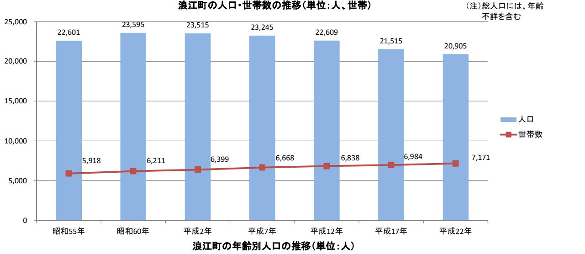
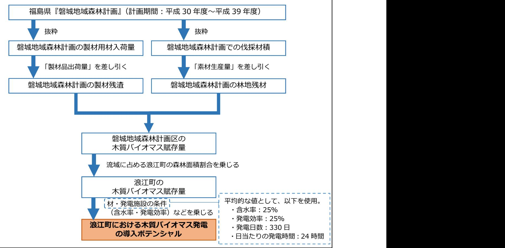

# 浪江町

# 再生可能エネルギー推進計画

平成 30 年 3 月福島県浪江町

|     | 第1章計画策定の趣旨 ----------------------------------------------------------- 1                                                           |  |
|-----|-------------------------------------------------------------------------------------------------------------------------------------|--|
| (1) | 計画策定の目的 ------------------------------------------------------------- 1                                                             |  |
|     | 第2章上位計画・関連計画等 ---------------------------------------------------- 1                                                               |  |
| (1) | 国・県のエネルギーの動向にかかわる整理 ---------------------------------- 1                                                                            |  |
| (2) | 復興計画及びエネルギーに関する取組 -------------------------------------- 4                                                                          |  |
| (3) | 復興事業等の概要 ---------------------------------------------------------- 6                                                               |  |
|     |                                                                                                                                     |  |
| (1) | 第3章浪江町における再生可能エネルギーと取巻く状況 --------------------------- 7 人口推計の整理 ------------------------------------------------------------- 7 |  |
| (2) | 浪江町のエネルギー需要の予測 --------------------------------------------- 7                                                                      |  |
| (3) | 再生可能エネルギーの導入ポテンシャルの推計 ----------------------------- 9                                                                               |  |
|     |                                                                                                                                     |  |
|     | 第 4 章再生可能エネルギー導入推進のためのゾーニングと開発適地 -------------- 12                                                                                 |  |
| (1) | 再生可能エネルギー導入推進のためのゾーニング等の必要性 --------------- 12                                                                                      |  |
| (2) | 土地利用規制に基づくゾーニング ------------------------------------------ 12                                                                       |  |
| (3) | 開発適地 ------------------------------------------------------------------ 13                                                          |  |
|     | 第 5 章再生可能エネルギーの導入目標と将来像及び基本方針 -------------------- 15                                                                              |  |
| (1) | 導入目標と将来像の検討の視点 -------------------------------------------- 15                                                                      |  |
| (2) | 導入目標と将来像 --------------------------------------------------------- 16                                                               |  |
| (3) | 基本方針 ------------------------------------------------------------------ 17                                                          |  |
| (4) | 計画期間 ------------------------------------------------------------------ 17                                                          |  |
|     | 第6章再生可能エネルギー導入推進のための具体施策 --------------------------- 18                                                                            |  |
| (1) | 具体施策の検討 ------------------------------------------------------------ 18                                                             |  |
| (2) | 具体施策 ------------------------------------------------------------------ 18                                                          |  |
| (3) | 具体施策の実施イメージ --------------------------------------------------- 19                                                                  |  |
| (4) | 事業者意向調査 ------------------------------------------------------------ 20                                                             |  |
|     |                                                                                                                                     |  |
|     | 第7章再生可能エネルギー導入のロードマップ --------------------------------- 21                                                                         |  |
| (1) | 計画に向けた短期・中⾧期のロードマップ --------------------------------- 21                                                                            |  |
|     | 第8章再生可能エネルギー導入の推進体制 ------------------------------------- 22                                                                       |  |
|     |                                                                                                                                     |  |

|      | 資料編 ------------------------------------------------------------------------- 23 |  |
|------|----------------------------------------------------------------------------------|--|
| 資料1  | 浪江町の概要 ----------------------------------------------------------- 24            |  |
| 資料 2 | 導入ポテンシャルの推計方法 -------------------------------------------- 29                    |  |
| 資料 3 | エネルギー需要予測の推計方法 ------------------------------------------ 36                     |  |
| 資料 4 | 事業者意向調査結果の補足 ---------------------------------------------- 37                   |  |
| 資料 5 | パブリックコメントの実施 ---------------------------------------------- 44                   |  |
| 資料 6 | 浪江町再生可能エネルギー推進計画検討委員会と計画策定までの経過 ---- 49                                          |  |

### 第1章計画策定の趣旨

#### (1) 計画策定の目的

浪江町(以下、「本町」という。)では、浪江町復興計画【第二次】において「エネルギーの地産地消」へのチャレンジが提言され、エネルギーの地産地消を住民生活の中に定着させていくことを施策の柱の一つとしています。

こうした中で本町では現在、国道 6 号と本町役場周辺エリアを核としたまちづくりのほか、再生可能エネルギーの導入やスマートコミュニティを推進しています。

一方、再生可能エネルギーの導入を推進するには、本町のまちづくりへ相乗効果を生み出すような具体的な計画が必要であり、当該計画に沿ったまちづくりを行うことも重要です。

そこで今回、再生可能エネルギーの活用や関連産業の育成に努め、魅力的かつ持続可能なまちづくりを目指すことを目的として「浪江町再生可能エネルギー推進計画」を策定し、本町の将来イメージやその実現に向けた具体施策を示すこととしました。

### 第2章上位計画・関連計画等

#### (1) 国・県のエネルギーの動向にかかわる整理

#### ①国のエネルギー施策の動向

本町にかかわる国のエネルギー施策の動向としては、大きく以下の 3 つが挙げられます。 特に、「福島イノベーション・コースト構想」と「福島新エネ社会構想」については、福島県における復興に向けた施策が計画されており、「福島県復興計画(第 3 次)」と関連性を持っています。

- ●⾧期エネルギー需給見通し
- ●福島イノベーション・コースト構想
- ●福島新エネ社会構想

#### ②福島県のエネルギー施策の動向

# <福島県復興計画(第 3 次)>

福島県復興計画(第 3 次)では、主要施策として、復興へ向けた 10 の重点プロジェクトが計画されています。その中で、主に「8.新産業創造プロジェクト」の中に、再生可能エネルギーの関連事項が位置付けられており、「原子力に依存しない、安全・安心で持続的に発展可能な社会の実現と再生可能エネルギー「先駆けの地」を目指し、再生可能エネル

ギーの導入拡大や技術開発・実用化を通じた関連産業の集積と省エネルギーを推進し、 2040 年頃を目標に県内エネルギー需要 100%相当量を再生可能エネルギーで生み出す社会を実現する」という方向性が示されています。その実現にむけ、短期的には 2020 年までに 40%の導入目標が掲げられています。

福島県復興計画(第3次)の地域別の取組として、本町の位置する双葉エリアでは、「新産業の創造」や「再生可能エネルギー等の導入等の推進」として、再生可能エネルギーに関連して以下のような取組が明記されています。

a) スマート・エコパーク

県内産業基盤を強化するとともに、新たなリサイクル事業を生み出し、浜通り地域を中心に環境・リサイクル産業の集積を目指します。

b) エネルギー関連産業プロジェクト

「福島イノベーション・コースト構想」の一つとして、関連する多くのプロジェクトを通じて、浜通りのポテンシャルを生かした産業の集積を目指しています。

c) 再生可能エネルギー等の導入等の推進

再生可能エネルギーの研究開発拠点と連携し、双葉エリアにおいてポテンシャルの高い太陽光や風力発電などの先進地として再生可能エネルギーの導入を図るとともに、浮体式洋上風力発電システムの安全性、信頼性、経済性を検証するため、福島洋上風力コンソーシアムが広野町・楢葉町沖で「浮体式洋上風力発電実証研究」の推進を図っていくとしています。

#### <福島県再生可能エネルギー推進ビジョン(改訂版)>

福島県再生可能エネルギー推進ビジョン(改訂版)では、以下のとおり再生可能エネルギーにかかわる方針、目標、施策が示されています。

【基本方針】

環境面「環境への負荷の少ない低炭素・循環型社会」の実現

復興面「原子力に依存しない、安全・安心で持続的に発展可能な社会づくり」と「再生可能エネルギーの飛躍的な推進による新たな社会づくり」の実現

【導入目標】

2020 年には県内の一次エネルギー供給に占める再生可能エネルギーの割合が約 40%とする。

#### (2) 復興計画及びエネルギーに関する取組

本町では、東日本大震災後の状況を踏まえ、復興への取組を進めるため、次のような計画等を策定しています。

特に浪江町復興計画【第二次】では、復興計画【第一次】の「復興の理念」、「復興の基本方針」及び復興計画【第一次】策定後に本町で策定された全ての要素を包含するものとして策定されています。(浪江町復興まちづくり計画、まち・ひと・しごと創生浪江町総合戦略、避難指示解除に関する有識者検証委員会報告書等) 浪江町復興ビジョン(平成 24 年 4 月浪江町) 浪江町復興まちづくり計画(平成 26 年 3 月浪江町) まち・ひと・しごと創生浪江町人口ビジョン(平成 28 年 3 月浪江町) まち・ひと・しごと創生浪江町総合戦略(平成 28 年 3 月浪江町)

- 
- 
- 
- 
- 避難指示解除に関する有識者検証委員会報告書 (平成 28 年 3 月避難指示解除に関する有識者検証委員会) 浪江町復興ビジョン検討会議中間報告書(平成 28 年 12 月) 浪江町中心市街地再生計画(平成 29 年 3 月浪江町) 浪江町復興計画【第二次】(平成 29 年 3 月浪江町)
- 
- 
- 

<浪江町復興計画【第二次】における復興の理念>

<浪江町復興計画【第二次】における復興の基本方針>

#### (3) 復興事業等の概要

本町の復興に向けて、主として帰還困難区域を除く海側エリアで復興事業等が進められています。本町は、既存中心市街地を含む都市計画区域内用途地域(主要部)を中心に、周囲に「農業振興地域」が拡がっており、平成 30 年2月現在、産業団地の整備事業が進められています。東日本大震災後に指定された「災害危険区域」及び「帰還困難区域」について整理するとともに、既存中心市街地等にかかわる「都市計画用途地域(主要部)」を復興事業と合わせて以下に整理します。

<本町の主要な復興事業・計画等位置図>

# 第3章本町におけるエネルギー需要と再生可能エネルギーの導入ポテンシャル

本町における電気及び熱エネルギー需要の予測にあたって、現在から将来にわたる帰還人口や産業団地への企業進出なども考慮して検討を行いました。

再生可能エネルギーの導入ポテンシャルについては、土地用途等や既往の調査結果等も踏まえて検討を行いました。

#### (1) 人口推計の整理

本町では、東日本大震災後の状況を踏まえ平成 28 年 3 月に「浪江町人口ビジョン」を策定しました。本計画では、「浪江町再生可能エネルギー推進計画」の計画条件検討にかかわるものとして、「浪江町人口ビジョン」から本町の人口の将来推計の整理を行いました。

この「浪江町人口ビジョン」において設定された展望人口を、「まち・ひと・しごと創生浪江町総合戦略」においても「本町の展望人口」として位置づけ、総合戦略の基本目標と施策を設定しています。

上記総合戦略の中では、東日本大震災による全町避難により居住人口がゼロという、本町が置かれている状況から、国が示す 2060 年までの⾧期的な人口の推移を見通すことは難しい状況にあるため、2035 年に中期的な目標人口を設定し、今後の状況の変化に対応しながら本町の将来の展望人口を設定しています。

復興庁から発表された「福島県 12 市町村将来像」における人口推計や、福島県の人口ビジョンを参考に、居住人口の総数を 2035 年までの中期的な目標人口を 8,000 人とし、平成 27 年度の住民意向調査の帰還意向を基に、避難指示解除後の 5,000 人と設定しています。また、2035 年の人口の内訳は、段階的に帰還する町民の増加や新たな住民の受け入れ人口が 6,500 人、本町内に居住する新産業従事者が 1,500 人と想定しています。

なお、平成 29 年2月末時点の居住人口は 490 人となっており、居住人口の増加に向けてより一層の復興推進を行っていく必要があります。

### (2) 浪江町のエネルギー需要の予測

経済産業省資源エネルギー庁のエネルギー消費統計における「都道府県別エネルギー消費統計」より、福島県の電力消費量から各種統計データを用いて本町における産業や家庭等の部門別の電力需要量を推計しました。

なお、帰還人口の推計では先行して避難指示区域が解除された南相馬市小高地区の帰還状況の推移を参考に推計を行っています。

また、町内の産業団地を対象に、経済産業省の工場立地動向調査から事業者の想定立地件数を算定し、1 事業者あたりの電力消費量を乗じて産業団地における電力需要量を算定

しています。北産業団地、南産業団地、棚塩産業団地については共用開始後(2021 年) より、段階的に需要が増加していくと想定しています。

その結果、下図に示すように 2027 年度において、本町全体では合計 141.5GWhの電力需要が予測されます。

8

なお、本町の熱需要についても電力需要と同様に統計データを用いて、段階的に需要が増加していくことを想定しています。

その結果、下図に示すように 2027 年度において、本町全体では合計 1,397.5TJの熱需要が予測されます。

T(テラ)とは、G(ギガ)、M(メガ)と同様に単位の大きさを表わすもので、G(ギガ)のさらに 1000 倍の大きさを表わします。 J(ジュール)とは、エネルギーの単位の一つで、仕事量や熱量、電力量などを意味します。 なお、電力W(ワット)との関係は、単位秒あたりのJ(ジュール:電力量)が、Wとなります。 W(ワット)=J(ジュール)÷ 秒 (W=J/s) (参考)1TJ=1000GJ=1000,000MJ=1000,000,000kJ=1000,000,000,000J熱需要量で推計されたJ(ジュール)は、灯油、軽油、重油等の燃料が持つ熱量の合計を表わしています。

# (3) 再生可能エネルギーの導入ポテンシャルの推計※1

再生可能エネルギーの推進にあたり、本町においてどの程度再生可能エネルギーの導入ポテンシャルがあるのか、各種文献を参考に推計を行いました。なお、導入ポテンシャルは、賦存量から本町の土地用途等を勘案し、経済状況等は考慮されていないものとして定義します。

※1 推計にかかわる詳細については、巻末の資料編を参照のこと。

#### <太陽光発電、風力発電、小水力発電の推計方法>

太陽光発電、風力発電、小水力発電の推計には、上記の既往文献を参考に算出しました。

- ・平成 22 年度再生可能エネルギー導入ポテンシャル調査(環境省)
- ・平成 23 年度再生可能エネルギーに関するゾーニング基礎情報整備報告書(環境省)
- ・平成 24 年度再生可能エネルギーに関するゾーニング基礎情報整備報告書(環境省)

#### <バイオマス発電の推計>

バイオマス発電の推計は、木質系バイオマス発電と廃棄物系バイオマス発電の 2 種類に分けて導入ポテンシャルを推計しました。廃棄物系バイオマス発電については、東日本大震災前の家畜頭数を参考にし、⾧期的な導入を見据えた試算としています。

#### <導入ポテンシャルの推計結果>

導入ポテンシャルを推計により、太陽光発電は設備容量約 184MW(年間発電量約 189GWh)、バイオマス発電(木質+バイオガス)は、設備容量約 5.5MW(年間発電量約 44GWh)、陸上風力発電は設備容量約 397MW(年間発電量約 646GWh)の導入ポテンシャルがあるという結果が得られました。ただし、バイオマス発電は、将来的なポテンシャルとしては見込める可能性があるものの、現状では放射性物質の残量問題からすぐに導入が期待されるものではないことに留意する必要があります。

なお、中小水力発電の賦存量は 3MWと推計されていますが、導入ポテンシャルとしては 0MWという結果が既往文献から得られています。

|            | 太陽光発電 |       |       |        |  |
|------------|-------|-------|-------|--------|--|
| 導入ポテンシャル   | 住宅用等  | 公共施設系 | 耕作放棄地 | 低・未利用地 |  |
| 設備容量[MW]   | 17.8  | 1.0   | 111.0 | 53.7   |  |
| 年間発電量[GWh] | 18.3  | 1.0   | 114.4 | 55.3   |  |

|            |            | バイオマス発電     | 陸上風力発電 |        |  |
|------------|------------|-------------|--------|--------|--|
| 導入ポテンシャル   | 木質系バイオマス発電 | 廃棄物系バイオガス発電 |        | 中小水力発電 |  |
| 設備容量[MW]   | 3.1        | 2.4         | 397.9  | 0      |  |
| 年間発電量[GWh] | 24.8       | 19.2        | 646.2  | 0      |  |

 55.3 【電力の単位WとWhについて】 W(ワット)とは電力の単位で、Wh(ワットアワー)とは電力量の単位です。 水に例えると、電力の単位であるWは水の勢いで、Whはその水がたまった量になります。 導入ポテンシャルに記載の設備容量MWとは、瞬間的に発電する電力を意味しており、発電量GWhとは、その設備が発電した電力量を意味しています。 【G(ギガ)、M(メガ)について】 GW(ギガワット)、MW(メガワット)のように示すことがありますが、G(ギガ)、M(メガ)とは、単位に対する大きさを表わすもので、GW、MWであれば、電力の単位であるWの大きさを表わします。 (参考)1GW = 1000MW = 1000,000kW = 1000,000,000W

# 第 4 章再生可能エネルギー導入推進のためのゾーニングと開発適地

#### (1) 再生可能エネルギー導入推進のためのゾーニング等の必要性

本町には豊富な再生可能エネルギーの導入ポテンシャルがあり、また、将来的にはエネルギー需要が東日本大震災発生前を上回ると考えられます。このため、再生可能エネルギーを有効に活用し、魅力的で持続可能なまちづくりを行っていくことが本町の復興に欠かせません。

一方で、再生可能エネルギーは石油等に代わるクリーンなエネルギーとなりますが、再生可能エネルギーの導入を拡大するために自然環境を損ねたり、本町の基幹産業の一つである農林業へマイナスの影響を与えたりすることは望ましくありません。

このため、既存の法規制区域を基本に「再生可能エネルギーの導入を推進する区域」、「再生可能エネルギーの導入にあたって周辺環境との調和の観点から調整を要する区域」、「自然環境を保全する区域」の3つに本町域を区分(ゾーニング)し、その結果を踏まえ、再生可能エネルギーの開発に適すると評価される区域(以降、「開発適地」という。)を明示することで、再生可能エネルギーの導入に伴うマイナスの影響を回避します。

#### (2) 土地利用規制に基づくゾーニング

本町における再生可能エネルギーの導入に際して、関連する土地利用規制等を整理し、本町を以下の3つのゾーンで分類しています。

| 詳細内容           | 対象となる区域          |
|----------------|------------------|
| 自然環境の保全を第一とし、大 | 森林区域(国有林・保安林)、   |
| 型の再生可能エネルギー設備の | 自然公園区域(特別地域)、鳥   |
| 導入を制限するゾーン     | 獣保護区・特別保護地区、河川   |
|                | 区域・河川保全区域        |
| 周辺環境への調和の観点から、 | 地域森林計画対象民有林、農用   |
| 大型の再生可能エネルギー設備 | 地区域、ほ場整備事業区域、土   |
| の導入については調整を要する | 地改良総合整備事業区域、農地   |
| ゾーン            | 開発事業区域           |
| 大型の再生可能エネルギー設備 | 上記ゾーンを除く地域 ※但 |
| の導入を推進するゾーン    | し、用途地域(住居・商業系)   |
|                | は含まない            |
|                |                  |

注)復興整備事業の実施が検討されている区域(浪江町復興整備計画及び土地利用構想図に記載されている区域) については復興整備事業担当部局と調整を要するものとします。

#### (3) 開発適地

本町における再生可能エネルギーの開発を促していくために、開発適地の選定の流れ及び結果を以下に示します。

#### <開発適地の抽出の流れ>

①再生可能エネルギーの開発に適さない地域(開発不適地)を抽出

②環境省等の資料から再生可能エネルギー導入ポテンシャル分布状況を整理

③国等の補助を受けて実施している事業・実施予定の区域を除外

④上記で抽出した開発不適地と再生可能エネルギーポテンシャル、整理した除外区域の重ね合わせによる開発候補地の選定

<開発適地の抽出結果>

太陽光発電における開発候補地の選定結果は下図のようになります。青色(農用地を含む開発制限による開発適地)と緑色(農用地以外の開発制限による開発適地)が開発候補地となっています。

参考までに太陽光発電における開発候補地の選定結果の青色(農用地を含む開発制限による開発適地)と緑色(農用地以外の開発制限による開発適地)を抜き出したものを示します。なお、特定復興再生区域を青色枠線、復興整備事業区域(土地利用構想を含む)については赤色枠線で示しています。

# 第 5 章再生可能エネルギーの導入目標と将来像及び基本方針

#### (1) 導入目標と将来像の検討の視点

本町の再生可能エネルギー導入ポテンシャルの推計結果とエネルギー需要の予測の結果を踏まえ、将来の再生可能エネルギーの導入目標、将来像及び基本方針を定めます。

導入目標と将来像を定めるにあたっては、再生可能エネルギーが魅力的かつ持続可能なまちづくりへと有効に活用されるよう、次の視点で検討しています。

<検討フロー>

# 視点 1:再生可能エネルギーの導入推進

浪江町総合戦略等を踏まえ、エネルギー自給率※2 を高めるとともに、防災・減災の観点及び地域住民が主体となる再生可能エネルギー導入の推進の観点から、分散型エネルギーの活用も図ります。

※2 エネルギー自給率=地域内の再生可能エネルギー発電量/地域内のエネルギー需要量

#### 視点2:再生可能エネルギーの経済価値が地域に還元され循環する仕組みづくり

発電事業者のFIT※3 による売電事業の経済価値が、より地域へ還元され、地域内で再生可能エネルギーの経済価値が循環する仕組みをつくります。

※3 固定価格買取制度

#### 視点3:再生可能エネルギーの経済価値の地域内循環による魅力あるまちづくりの推進

視点 2 の仕組みにより、再生可能エネルギーの経済価値を地域内で循環させ、雇用創出や住民サービスの充実等、魅力あるまちづくりを推進します。

#### (2) 導入目標と将来像

#### <再生可能エネルギーの導入目標>

福島県復興計画(第 3 次)や福島県再生可能エネルギー推進ビジョン、浪江町総合戦略で示されている計画との整合を図り、導入目標はエネルギー自給率(再生可能エネルギー由来の電気自給率)を 2020 年度に 40%、2027 年度に 54%を目指します。

これは、電力の需要予測から換算すると、再生可能エネルギーの導入目標は 2020 年度に 18.9GWh(電力需要:47.3GWh)、2027 年度に 76.4GWh(電力需要:141.5GWh) となります。

#### <再生可能エネルギーの導入推進による将来像>

本計画の実行により将来像を想定し、再生可能エネルギー導入を推進します。

#### (3) 基本方針

将来像・導入目標達成に向けた基本方針を以下の 4 つとして計画を推進します。

### 基本方針Ⅰ:再生可能エネルギーをつくる

上位・関連計画に沿って再生可能エネルギーの導入割合を増やします。また、町民が事業主体となる小規模な再生可能エネルギー設備の導入も促進します。

### 基本方針Ⅱ:再生可能エネルギーをつかう

再生可能エネルギー事業者のインセンティブを低下させず、FITによる売電の経済価値を地域に還元し、再生可能エネルギーの経済価値が循環する仕組みの構築を目指します。

#### 基本方針Ⅲ:まちづくりへつなげる

再生可能エネルギーの需給差による余剰電力※4 については、当面の間、地域外へ販売するなどにより、経済価値の地域内循環をさらに活性化させます。

#### 基本方針Ⅳ:将来へつなげる

蓄電池やエネルギーマネジメント等に関する技術動向を見据えながら、将来的には地域内消費量の割合をさらに高めていきます。

#### (4) 計画期間

本計画の期間は 2018 年度から 2027 年度までの 10 年間とします。なお、計画期間中における社会情勢等を踏まえ、適宜見直しを行います。

- ※4 一般的に再生可能エネルギー発電は、クリーンなエネルギーである一方で自然環境等に大きく左右されるため、どうしても不安定な電源となります。そのため、需要に応じた供給が難しい場合があります。
# 第6章再生可能エネルギー導入推進のための具体施策

# (1) 具体施策の検討

本計画の将来像・導入目標達成の実現に向けた 4 つの基本方針を踏まえて、本町のエネルギー・経済の活性化を促す以下の視点から施策を実施していきます。

### <具体施策の視点>

- ●再生可能エネルギーを通じた復興や地域経済等の再生につながる施策
- ●事業者のインセンティブを呼び起こし、町民を巻き込んだ民間活力による再生可能エネルギーの導入拡大につながる施策
- ●自然環境や営農環境と調和した再生可能エネルギー設備の導入につながる施策
- ●再生可能エネルギーの経済価値を地域に取り込み、地域で循環させ、持続的なまちづくりにつながる施策

# (2) 具体施策

以下に、Ⅰ~Vの具体施策を示します。

| 具体施策Ⅰ                   |                                                    | 再生可能エネルギーに関する積極的な情報配信                                                        |
|-------------------------|----------------------------------------------------|------------------------------------------------------------------------------|
|                         | 住民向け                                               | 事業者向け                                                                        |
| • 解しやすい情報の配信を積極的に行う。 | 所有する土地の再生可能エネルギーによる有効活用 事例や、補助制度や系統連携等の手続きに関する理 | • 再生可能エネルギー導入に関する補助制度や事業者誘 致のための措置、土地利用方針に関する積極的な情報 の配信を行う。         |
| 具体施策Ⅱ                   |                                                    | 再生可能エネルギー導入に関する積極的な措置                                                        |
|                         | 住民向け                                               | 事業者向け                                                                        |
| • 等の積極的な措置を講じる。      | 補助申請や系統連携等の手続きを代行する事業者の 紹介や、小規模再生可能エネルギーの導入支援助成 | • 再生可能エネルギー導入に関する補助制度や税優遇、 再エネ設備の立地に関する基準の制定等、事業者誘致 のための積極的な措置を講じる。 |
| 具体施策Ⅲ                   |                                                    | 再生可能エネルギー経済価値の地域還元・循環の仕組みの構築                                                 |
| •                       | る再生可能エネルギーの地産外消により、地域経済の活性化を図る。                    | 再生可能エネルギーの経済価値がより地域に還元され、循環する仕組みを構築し、地域で消費しきれない余剰とな                          |
| 具体施策Ⅳ                   |                                                    | 再生可能エネルギーによる持続的なまちづくりの実現                                                     |
| •                       | なげ、町民の帰還をさらに促し、持続可能なまちづくりを実現する。                    | 再生可能エネルギーの経済価値を活用し、産業(雇用)の創出、農業再生、日常生活の再建などに資する取組につ                          |
| 具体施策Ⅴ                   |                                                    | 再生可能エネルギー導入拡大のための基盤の整備                                                       |
| •                       | 大を図るための基盤整備について、関係機関と積極的に協議を行う。                    | ⅠからⅣの施策をスムーズに実施するために必要となる設備の拡充や財源の確保等、再生可能エネルギーの導入拡                          |

#### (3) 具体施策の実施イメージ

以下に具体施策Ⅰ~Vの関連性をイメージとして示します。

具体施策の実施にあたっては、本町が単独で実施する方法のほかに、本町と民間企業(地元企業を含む)が連携し、共同の事業体を設立して実施することも考えられます。

例えば具体施策Ⅰ・Ⅱにより、住民向けや事業者向けの太陽光発電を中心とした再生可能エネルギーの導入量を増やしていき、具体施策Ⅲ・Ⅳにより、地域内の経済循環を活性させていきます。また、具体施策Ⅴでは、このようなモデル事業に向けた基盤整備を行っています。

モデル事業の形成(住民や地元企業、民間企業との連携)により、産業(雇用の創出)、農業再生、日常生活の再建等を促すとともに、技術向上による再生可能エネルギーの利活用による防災性の向上、地域間連携によるヒト・モノの交流を促進します。再生可能エネルギーを中心とした本町の復興により、魅力的かつ持続可能なまちづくりの実現を目指します。

※将来的には熱供給にも拡充

#### (4) 事業者意向調査の概要

具体施策の実施イメージの具現化のため、本町で事業を営んでいるまたは営む予定の事業者のほか、再生可能エネルギー事業を予定している事業者へのヒアリングを実施し、協力意向等を把握しました。

#### <調査目的>

まちの将来像(再生可能エネルギーによる魅力的かつ持続可能なまちづくりの実現) に向けた可能性を把握するために、再生可能エネルギーの供給者となる再生可能エネルギー事業者、本町内での電力の需要家となる立地企業に、再生可能エネルギー推進計画の趣旨を説明し、電力供給や電力購入の可能性や協力意向等についてヒアリング調査を実施しました。

#### <調査対象者>

本町内立地事業者:4社(※立地予定の事業者を含む。) 本町での発電事業を予定している事業者:2社

#### <調査結果の概要>

| 項目             | 結果の概要                  |
|----------------|------------------------|
| 本計画の将来像について    | 計画で示しているまちの将来像(再生可能エネル |
|                | ギーによる魅力的かつ持続可能なまちづくりの実 |
|                | 現)に関しては賛同頂いた。          |
| 具体施策の実施イメージへの  | コストや本社との調整等一定の条件をクリアでき |
| 協力・支援について      | れば、復興への支援として前向きに検討したいと |
|                | の回答を頂いた。               |
| 再生可能エネルギーの地産地  | 再生可能エネルギーの地産地消の取組について、 |
| 消・地産外消に向けた取組につ | 前向きに検討したいとの回答を頂いた。     |
| いて             |                        |
| 本町のまちづくりへの要望等  | 土地利用の方向性の決定、新規定住者の獲得に向 |
| について           | けた施策が挙げられた。            |

# 第7章再生可能エネルギー導入のロードマップ

#### (1) 計画に向けた短期・中⾧期のロードマップ

計画の推進にあたっては、ロードマップを短期と中⾧期にわけて取組を明確化し、計画を実施していきます。短期の視点としては、再生可能エネルギーの導入拡大と地産外消の仕組みづくりの観点から地域経済の循環を促していきます。中⾧期の視点としては、再生可能エネルギーの導入拡大と地域経済の強化をしながら、需要の高まりに対応した熱需要や水素エネルギーへの対応を見据えていきます。

施策の具体化に向けては、以下の重点内容を中心に取り組んでいきます。

- 住民や民間事業者に対する積極的な情報発信
- 再生可能エネルギー導入にかかわる助成制度や優遇措置の検討と実施
- 再生可能エネルギー導入の拡大に向けた庁内協議と財源確保の継続

また、まちづくりへの展開は、以下の内容を取り組みます。

- 再生可能エネルギーを介した他自治体との連携強化・仕組みづくり(短期)
- 町民帰還、新規定住者に向けた施策の検討(短期)
- 水素エネルギーの実用化に向けた検討(短期)
- 町民帰還、新規定住者に向けた施策の実施(中⾧期)
- 構築した仕組みを活用し、再生可能エネルギーの経済価値の地域循環強化(中⾧期)
- 経済性を考慮した水素エネルギーの導入、将来的な利活用による供給の拡大(中⾧期)
- 需要の高まりに応じて熱需要に対する再生可能エネルギー活用施策を検討・実施(中 ⾧期)

# 第8章再生可能エネルギー導入の推進体制

### (1) 計画推進のための体制

### <再生可能エネルギー導入推進会議>

- 課⾧補佐級職員を持って充て、事務局は産業振興課が担います。
- 本推進会議では、再生可能エネルギーの導入政策を検討し、政策の実行に関し必要な調整を行います。
- また、再生可能エネルギーの導入に関する相談支援のワンストップサービス等を提供するとともに、事業者等からの相談内容に関し、複数部局が連携して回答を行う場合にその対応を協議します。

### <再生可能エネルギー導入コンソーシアム(共同事業体)>

- 再生可能エネルギーに関する事業を展開する民間企業等と本町が連携した設立を検討し、コンソーシアムを形成していきます。
- 民間企業等は、再生可能エネルギーの導入拡大に関する民間の視点からの政策提案を行うほか、再生可能エネルギーの導入に関する手続きの支援等を行います。
- <主管部局(産業振興課)>
	- 再生可能エネルギーの導入拡大に向けた情報配信を行うとともに、再生可能エネルギーの導入に関する相談窓口を担います。
	- 再生可能エネルギー導入推進会議の事務局を担うほか、再生可能エネルギー導入コンソーシアムの担当課として民間企業等と連携した取組を行います。

# 資料1 浪江町の概要

#### (1) 浪江町の概要(東日本大震災前)

#### <位置・沿革>

浪江町は、福島県相双地域のほぼ中央にあって、いわき市の北約 60km、仙台市の南約 90kmに位置しており、東は太平洋に面し、西側は阿武隈高地となり、町中央部を請戸川と高瀬川が流れる自然環境豊かな町です。

明治時代には、国鉄常磐線開通で輸入港の機能を失い、産業機能の中心が浪江に移り、陸前浜街道を中心とした市街地が形成され、南北方向に一般国道 6 号とJR常磐線、東西方向に一般国道 114 号が走る交通の要衝として発展してきており、近年、常磐自動車道の延伸とインターチェンジの整備が進められました。

#### <気象>

【気温・雨量】

本町の気候は、太平洋側の平坦部は東日本型気候を呈し、年平均気温が 12.3℃、平均最低気温は 1 月の 2.1℃、平均最高気温は 8 月の 28.3℃と比較的温暖な気候で、降雨は 7 月~10 月にかけて多く、年間降水量は 1,500 ㎜程度です。一方、阿武隈高地に位置する山間部は、寒暖差の大きい内陸性の気候を呈し、特に冬場は厳しい冷え込みとなりますが、比較的降雪量は少なく、年間を通じて温暖で住みよい環境となっています。

【風況】

本町の風向は、3 月~9 月は東南東~南南東からの季節風が、10 月~3 月は西~北西からの季節風が、それぞれ支配的になっており、風が強い季節は 9 月~12 月と 2 月~3 月で、最大瞬間風速 20m~25m/s程度となりますが、初夏から台風時期までは比較的穏やかな風況となります。

|           | 1 月  | 2 月  | 3 月  | 4 月  | 5 月  | 6 月  | 7 月  | 8 月                                                                     | 9 月  | 10 月 | 11 月 | 12 月 | 年      |
|-----------|------|------|------|------|------|------|------|-------------------------------------------------------------------------|------|------|------|------|--------|
| 最高気温(℃)   | 7.1  | 7.4  | 10.3 | 15.9 | 20.2 | 22.6 | 26.2 | 28.3                                                                    | 24.7 | 19.9 | 15.1 | 10.2 | 17.3   |
| 平均気温(℃)   | 2.1  | 2.3  | 5.1  | 10.4 | 14.9 | 18.2 | 22.0 | 23.8                                                                    | 20.1 | 14.6 | 9.4  | 4.8  | 12.3   |
| 最低気温(℃)   | -3.0 | -2.9 | -0.3 | 4.8  | 9.6  | 14.2 | 18.5 | 20.1                                                                    | 16.2 | 9.4  | 3.6  | -0.5 | 7.5    |
| 降水量(mm)   | 48.9 | 53.4 |      |      |      |      |      | 91.8 126.9 124.0 158.2 182.5 171.2 241.2 192.7                          |      |      | 78.8 | 41.4 | 1511.0 |
| 平均風速(m/s) | 1.8  | 1.8  | 2.0  | 2.0  | 1.7  | 1.4  | 1.2  | 1.3                                                                     | 1.2  | 1.3  | 1.5  | 1.7  | 1.6    |
| 日照時間(時間)  |      |      |      |      |      |      |      | 159.8 157.0 176.7 190.6 184.9 143.2 136.3 162.8 121.2 137.8 146.5 152.5 |      |      |      |      | 1871.6 |

<人口・世帯数>

国勢調査における本町の人口は、昭和 60 年の 23,595 人をピークに以降減少傾向にあり、東日本大震災直前の平成 22 年には 20,905 人となり、昭和 60 年に比べ約 11.4%の減少となっています。

世帯数は、一貫して増加傾向にあり、平成 22 年には 7,171 世帯となっており、年齢別人口は、年少人口及び生産年齢人口の減少傾向の一方で、老年人口は増加傾向にあり、平成 12 年には年少人口と老年人口が逆転し、老年人口が年少人口を上回る結果となっています。年少人口については、昭和 60 年の 5,563 人をピークに減少が続き、平成 22 年には 2,719 人まで減少し、昭和 60 人の約 48.9%と半数以下に減少していています。生産年齢人口も昭和 60 年の 15,039 人をピークに減少が続き、平成 22 年には 12,550 人と昭和 60 年の約 16.6%の減少となっています。一方、老年人口は増加傾向にあり、昭和 55 年の 2,495 人から平成 22 年には 5,548 人と約 2.2 倍に増加しています。

#### <土地利用>

本町の土地利用は、町全体の 70%近くを山林が占め、田及び畑が合計で約 14%となっている。宅地は、町全体の 2.52%、5.63k ㎡にとどまっています。中心市街地はJR常磐線浪江駅の東側に形成され、商業施設とともに町役場、郵便局、警察署、消防署等の行政施設が集積しています。工業系土地利用は、海側の市街地の北部及び南部に工業団地が位置づけられており、市街地周辺には請戸川や高瀬川等の河川、優良農地、山林など豊かな自然環境があり、市街地外の土地利用の多くは、山林、農地等の豊かな自然が特色となっています。

|            | 田     | 畑     | 宅地   | 池沼   | 山林     | 牧場   | 原野   | 雑種地  | その他   | 計      |
|------------|-------|-------|------|------|--------|------|------|------|-------|--------|
| 実数 (k㎡) | 19.29 | 11.69 | 5.63 | 0.13 | 150.78 | 0.36 | 5.78 | 2.61 | 26.87 | 223.14 |
| 構成比 (%) | 8.64  | 5.24  | 2.52 | 0.06 | 67.57  | 0.16 | 2.59 | 1.17 | 12.04 | 100.00 |

<産業>

東日本大震災前の本町では、平成 8 年から平成 21 年の間の全事業所の事業所数や従業者数は、いずれも概ね横ばい傾向となり、平成 8 年から平成 21 年の間に事業所数は 1,204 から 1,136 と 5.6%程度の減少にとどまり、従業者数は 8,975 人から 8,323 人へ 7.3% 程度の減少となっています。

本町の平成 21 年産業大分類別事業所の従業者数のうち、最も多くを占めるのは「卸売業、小売業」の 1,820 人 21.9%で、次いで「建設業」の 1,349 人 16.2%、「製造業」の 1,172 人 14.1%と続いており、卸売業、小売業、建設業、製造業が中心の事業所従業者構成となっています。

#### (2) 浪江町の概要(東日本大震災後)

平成 23 年 3 月 11 日の東日本大震災とそれに伴う東京電力福島第一原子力発電所事故により、本町は全町避難を強いられていましたが、平成 29 年 3 月 31 日、「帰還困難区域」 を除いて、町内全域に出されていた避難指示が解除されました。

交通インフラの改善にかかわるものとして、平成 26 年 9 月に国道 6 号が、平成 27 年 3 月に常磐自動車道が全線で通行可能となり、平成 29 年 10 月現在でJR浪江駅まで運行されているJR常磐線は、平成 31 年度末までの全線開通を目指しています。

浜通り地域における産業基盤の構築にかかわるものとしては、福島イノベーション・コースト構想において、廃炉やロボット、エネルギー等にかかわるプロジェクトが進行しています。

本町では、平成 29 年 3 月に策定した「浪江町復興計画【第二次】」に基づいて、既存産業と新たな産業が地域経済を支える浜通りの中核都市の実現を目指す復興への取組が始められています。

出典:「風評被害の払拭に向けて」(2017 年 4 月復興庁)

# 資料 2 導入ポテンシャルの推計方法

賦存量から本町の土地・建物用途等を勘案し、再生可能エネルギーによる設備容量の導入ポテンシャルを推計しています。推計にあたっては、再生可能エネルギーに関するゾーニング基礎情報整備報告書(環境省平成 22 年度~平成 24 年度)等の参考文献に示された推計手法と一部、本町の推計データを基に算出しています。

### (1)太陽光発電

平成 24 年度再生可能エネルギーに関するゾーニング基礎情報整備報(環境省)では、太陽光発電の導入ポテンシャルは、「住宅用等」と「公共系等」の区分に分けて、建築物区分がなされています。本計画では、本町の経済状況等を勘案し、「住宅用等」および「公共系等」のうち「公共施設系」「耕作放棄地」「低・未利用地」について推計を行っています。

計算にあたっては、次ページ以降に示す各フローに沿ってポテンシャル量を推計しています。 各建築物区分の建築面積または延床面積を算出したのち、建築物区分に応じた太陽光発電の設置係数を乗じて、設置可能面積を算出します。さらに環境省『再生可能エネルギー導入ポテンシャル調査報告書』等で示された値(戸建住宅:1kW/10 ㎡、戸建住宅以外:1kW/15 ㎡)を用いて、設備容量を算出します。算出された設備容量に地域別発電量係数を乗じることで、太陽光発電の導入ポテンシャル量を算出します。

建物用途・規模別による設置面積から設置係数を乗じて設備容量を算出し、福島県の発電量係数を用いて年間発電量を推計しています。

#### <公共系等-公共施設系>

『浪江町公共施設総合管理計画』から設置面積を算出し、設置面積に設置係数を乗じて設備容量を算出し、福島県の発電量係数を用いて年間発電量を推計しています。

【算定フロー】

#### <公共系等-耕作放棄地>

『2010 年世界農業林業センサス』より本町の耕作放棄地面積の統計値を用いて設置面積を把握し、公共施設系と同様に年間発電量を推計しています。

【算定フロー】

#### <公共系等-低・未利用地>

『平成 25 年世帯土地統計調査』より、福島県内の宅地面積に対する、現住居以外の所有地のうち「屋外駐車場」「資材置き場」「その他」として利用されている敷地の面積及び「利用していない(農地、空き地など)」敷地面積の割合を算出し、これに平成 28 年度固定資産の価格等の概要調書から把握した本町の宅地面積を乗じて設置面積を推計しています。年間発電量の推計は公共施設系と同様です。

【算定フロー】

### (2)バイオマスエネルギー

#### <木質バイオマス>

『福島県木質バイオマス安定供給指針』(平成 25 年 3 月)に記載の算出方法と『磐城地域森林計画書』を参考に、流域面積から本町の森林面積割合を算出し、それらに林地残材量、製材残渣量を指針に沿ってポテンシャルを推計しました。なお、東日本大震災後の状況を踏まえ、前後 2 年を含めた 5 年間の値を参考にしています。含水率や発電効率は平均的な値を見込み算出しています。

【算定フロー】

#### <バイオガス>

廃棄物系バイオマス利活用導入マニュアル、農水省『福島県浪江町畜産累年統計(2005 年)』 より畜産頭数と、農水省『都道府県・市町村バイオマス活用推進計画作成の手引き(平成 24 年 9 月)』から家畜糞尿の排出原単位を用いて試算しています。これは、東日本大震災前の家畜頭数を参考にすることで、⾧期的な導入を見据えた試算としています。

(3)陸上風力

年平均風速が 5.5~8.5m/s以上の面積を抽出し、1 万kW/1km2 を配置基準としたうえで、算出された設備容量に日本風力発電協会の平均設備稼働率等を乗じて年間発電量を算出しています。

太陽光発電導入ポテンシャルエリアとの重複を踏まえ、結果が過大とならないよう、記述の太陽光発電導入ポテンシャルエリア面積を、陸上風力発電導入ポテンシャルエリア面積から差し引いて、再度面積を集計し、その上で、陸上風力導入ポテンシャルを推計し直しています。

上記のエリア重複の補正については、一概にエリアが重なるとは言えませんが、設備容量のポテンシャルを推計するにあたっては、安全側での評価として検討しています。

【算定フロー】

#### (4)中小水力

導入ポテンシャルは、環境省「平成24年度再生可能エネルギーに関するゾーニング基礎情報整備報告書」より 0MWという結果が得られています。

# 資料 3 エネルギー需要予測の推計方法

エネルギー需要の予測にあたっては、電気・熱ともに以下のフローに沿って推計を実施しています。

#### (1)電力需要

経済産業省資源エネルギー庁のエネルギー消費統計における「都道府県別エネルギー消費統計」 より、福島県の電力消費量を用いて本町における「産業部門(農林水産鉱建設業)(製造業)」「業務他(第三次産業)部門」、「家庭部門」の4部門について電力需要量を推計しています。また、本町で整備が進んでいる産業団地についても電力需要量を推計しています。

#### (2)熱需要

電力と同様の流れで熱需要を推計しています。

# 資料 4 事業者意向調査結果の補足

事業者意向調査結果では、電力需要家と再生可能エネルギー供給者 6 社に対して、以下の質問項目についてヒアリング調査を行いました。次ページに回答結果を示します。

| 需要及び供給    | 対象企業        | 業種    |
|-----------|-------------|-------|
|           | 町内立地企業(No1) | 建設業   |
| 電力需要家     | 町内立地企業(No2) | 不動産業  |
|           | 町内立地企業(No3) | 金融業   |
|           | 町内立地企業(No4) | 製造業   |
| 再生可能エネルギー | 発電事業者(No1)  | サービス業 |
| 供給者       | 発電事業者(No2)  | 建設業   |

【電力需要家に対する質問事項と内容】

| No | 質問事項                | 質問内容                                                        |
|----|---------------------|-------------------------------------------------------------|
| 1  | 進出した目的              |  本町への進出目的(背景)                                              |
| 2  | 電力契約                |  現在電力供給をどこから受けているか。                                        |
| 3  | 地産電源の購入への協力の可 能性 |  需要家にしていただける可能性(地域新電力への契約者切替)があ るか。ある場合、その条件は何か。        |
| 4  |                     |  PPSの事業者としての出資などが検討可能か。                                   |
| 5  | 地域新電力への支援の可能性       |  その他、需要家としてグループ企業の紹介などがお願いできるか。                            |
| 6  |                     |  その他協力していただける事項があるか。                                       |
| 7  | 地域新電力の地域貢献          |  安価な電力供給、帰還者増加の取組、子育て世代への支援などを考 えているが、その他期待したい地域貢献があるか。 |
| 8  | その他                 |  本町まちづくりへの要望など                                             |
| 9  |                     |  どのような取組をしたら進出企業が増えると思うか。                                  |

#### 【再生可能エネルギー供給者に対する質問事項と内容】

| No | 質問事項                  | 質問内容                                                        |
|----|-----------------------|-------------------------------------------------------------|
| 1  |                       |  本町への進出目的(背景)                                              |
| 2  | 発電事業概要                |  発電開始年度                                                    |
| 3  |                       |  年間発電量(供給可能量の把握)                                           |
| 4  |                       |  売電契約内容(FIT,PPSへの特定契約などの有無)                               |
| 5  | 発電電力の地産地消への供給 の可能性 |  再生可能エネルギー電源の供給の可能性(地域新電力への契約者切 替)があるか。ある場合、その条件は何か。    |
| 6  |                       |  PPSの事業者としての出資などが検討可能か。                                   |
| 7  | 地域新電力への協力の可能性         |  その他、需要家としてグループ企業の紹介などがお願いできるか。                            |
| 8  |                       |  その他協力していただける事項があるか。                                       |
| 9  | 地域新電力の地域貢献            |  安価な電力供給、帰還者増加の取組、子育て世代への支援などを考え ているが、その他期待したい地域貢献があるか。 |
| 10 | その他                   |  本町まちづくりへの要望など                                             |

| 町内立地企業(No1) |                         | 業 種                                                                 | 建設業                                                                                                                                                                                                                                                                                      |
|-------------|-------------------------|------------------------------------------------------------------------|------------------------------------------------------------------------------------------------------------------------------------------------------------------------------------------------------------------------------------------------------------------------------------------|
| No          | 質問事項                    | 質問内容                                                                   | 回答                                                                                                                                                                                                                                                                                       |
| 1           | 進出した目的                  | 本町への進出目的(背景)                                                          | ー                                                                                                                                                                                                                                                                                        |
| 2           | 電力契約                    | 現在電力供給をどこから受 けているか。                                                | 東北電力との契約(高圧電力S)                                                                                                                                                                                                                                                                         |
| 3           | 地産電源の購入 への協力の可能 性 | 需要家にしていただける可 能性(地域新電力への契約 者切替)があるか。ある場 合、その条件は何か。            | コスト増になる場合には無理だが、同程度 のコストであれば切り替えを行うことも 検討できる。ただし、現在は企業立地補助 金により電気料金の5割が補助されてい るため、新電力会社がその金額と同程度で 供給することは難しいのではないか。                                                                                                                                                       |
| 4           |                         | PPSの事業者としての出資 などが検討可能か。                                           | 浪江町を含む沿岸部市町村の復興には協 力したいと考えており、事業計画上のリス クが低いのであれば出資等は可能。ただ し、出資になると定款の変更が必要となる ため、県等との協議が必要になる。                                                                                                                                                                               |
| 5           | 地域新電力への 支援の可能性       | その他、需要家としてグ ループ企業の紹介などがお 願いできるか。                                | 組合員は双葉町1社、楢葉町2社となって おり浪江町の事業者は入っていないため、 個別に話をしてみないと不明。                                                                                                                                                                                                                             |
| 6           |                         | その他協力していただける 事項があるか。                                               | 電気契約の切り替えについては、現在の企 業立地補助金の関係もあり、補助が受けら れる残り 6 年間は現実的でないかもしれ ない。浪江町の復興へ協力できることは可 能な限り対応したいと考えている。                                                                                                                                                                         |
| 7           | 地域新電力の地 域貢献          | 安価な電力供給、帰還者増 加の取組、子育て世代への 支援などを考えているが、 その他期待したい地域貢献 があるか。 | ー                                                                                                                                                                                                                                                                                        |
| 8           | その他                     | 本町まちづくりへの要望な ど                                                     | エネルギー以外の地産地消の取組を進め て欲しい。高いものを購入する必要はない と思うが、同程度のものであれば町または 周辺地域の事業者からの調達を優先する 等の取組があればよい。また、事業を再開 する事業者から事業者間連携の話が一時 期あったが、立ち消えになってしまってい る。町には事業者の連携を後押しするよう な調整をお願いしたい。その他、民間事業 者と町の政策のスピード感が異なるため、 町にはスピード感を持って施策を実行頂 きたい。その際の必要な協力は可能な限り やって行きたい。 |
| 9           |                         | どのような取組をしたら進 出企業が増えると思うか。                                          | ー                                                                                                                                                                                                                                                                                        |

| 町内立地企業(No2) |                         | 業 種                                                                 | 不動産業                                                                                                                                                                                                                                                                                                                                                                                                               |
|-------------|-------------------------|------------------------------------------------------------------------|--------------------------------------------------------------------------------------------------------------------------------------------------------------------------------------------------------------------------------------------------------------------------------------------------------------------------------------------------------------------------------------------------------------------|
| No          | 質問事項                    | 質問内容                                                                   | 回答                                                                                                                                                                                                                                                                                                                                                                                                                 |
| 1           | 進出した目的                  | 本町への進出目的(背景)                                                          | ー                                                                                                                                                                                                                                                                                                                                                                                                                  |
| 2           | 電力契約                    | 現在電力供給をどこから受 けているか。                                                | 東北電力と契約。                                                                                                                                                                                                                                                                                                                                                                                                           |
| 3           | 地産電源の購入 への協力の可能 性 | 需要家にしていただける可 能性(地域新電力への契約 者切替)があるか。ある場 合、その条件は何か。            | 本社の意向次第だが、契約は可能と思う。                                                                                                                                                                                                                                                                                                                                                                                                |
| 4           |                         | PPSの事業者としての出資 などが検討可能か。                                           | ー                                                                                                                                                                                                                                                                                                                                                                                                                  |
| 5           | 地域新電力への 支援の可能性       | その他、需要家としてグ ループ企業の紹介などがお 願いできるか。                                | ー                                                                                                                                                                                                                                                                                                                                                                                                                  |
| 6           |                         | その他協力していただける 事項があるか。                                               | 土地の賃貸や住居手配等で協力すること は可能。 太陽光発電事業用地の問い合わせが多い。 農地に関して、地権者は震災から 5~6 年 経過して営農再開の意向は小さくなって いると思われる。 また耕作可能な状態に維持するための事 業も終了することから、今後の管理等につ いて不安を感じているのではないか。 住宅に関しては、売却や賃貸を目的に空き 家バンクに登録する人がいるが、エリアと してまとまっていない。 ある程度まとまった土地が利用できるの であれば太陽光発電の事業用地として活 用も可能ではないかと思う。 2018年3月で住宅の解体申請が〆切とな るため、申込が増加している中で、今後、 空地が増えることが想定されるが、地権者 は土地の管理をどうするかが大きな悩み となっている。 |
| 7           | 地域新電力の地 域貢献          | 安価な電力供給、帰還者増 加の取組、子育て世代への 支援などを考えているが、 その他期待したい地域貢献 があるか。 | ハウスクリーニングは申込が多く、業者の 手が足りていない状況となっている。                                                                                                                                                                                                                                                                                                                                                                           |
| 8           | その他                     | 本町まちづくりへの要望な ど                                                     |                                                                                                                                                                                                                                                                                                                                                                                                                    |
| 9           |                         | どのような取組をしたら進 出企業が増えると思うか。                                          | ー                                                                                                                                                                                                                                                                                                                                                                                                                  |

| 町内立地企業(No3) |                         | 業 種                                                                 | 金融業                                                                                                                                                                                                                                                                                                                                            |
|-------------|-------------------------|------------------------------------------------------------------------|------------------------------------------------------------------------------------------------------------------------------------------------------------------------------------------------------------------------------------------------------------------------------------------------------------------------------------------------|
| No          | 質問事項                    | 質問内容                                                                   | 回答                                                                                                                                                                                                                                                                                                                                             |
| 1           | 進出した目的                  | 本町への進出目的(背景)                                                          | ー                                                                                                                                                                                                                                                                                                                                              |
| 2           | 電力契約                    | 現在電力供給をどこから受 けているか。                                                | 東北電力と契約。                                                                                                                                                                                                                                                                                                                                       |
| 3           | 地産電源の購入 への協力の可能 性 | 需要家にしていただける可 能性(地域新電力への契約 者切替)があるか。ある場 合、その条件は何か。            | PPSとの契約は本店の意向次第である。                                                                                                                                                                                                                                                                                                                           |
| 4           |                         | PPSの事業者としての出資 などが検討可能か。                                           | PPS事業への出資について検討すること は可能。                                                                                                                                                                                                                                                                                                                   |
| 5           | 地域新電力への 支援の可能性       | その他、需要家としてグ ループ企業の紹介などがお 願いできるか。                                | グループ企業なし。                                                                                                                                                                                                                                                                                                                                      |
| 6           |                         | その他協力していただける 事項があるか。                                               | 店内にパンフレット等を置くことは可能。 住民が太陽光発電設備を設置する場合、金 融機関として融資の相談は可能。                                                                                                                                                                                                                                                                                  |
| 7           | 地域新電力の地 域貢献          | 安価な電力供給、帰還者増 加の取組、子育て世代への 支援などを考えているが、 その他期待したい地域貢献 があるか。 | ー                                                                                                                                                                                                                                                                                                                                              |
| 8           |                         | 本町まちづくりへの要望な ど                                                     | ー                                                                                                                                                                                                                                                                                                                                              |
| 9           | その他                     | どのような取組をしたら進 出企業が増えると思うか。                                          | スーパーや医療施設等の生活支援施設が 少ない。 現状で帰還している町民は65歳以上の高 齢者が多いが、医療施設が離れている(救 急でも最寄りの病院まで搬送に 1 時間以 上かかる)。 水素・ドローンやロボット産業の企業立地 が進めば、生活支援支援施設の需要が高ま りスーパー等も進出してくるのではない かと期待している。 既に避難先で教育や就労などの生活基盤 ができているため、帰還しない人もいる一 方で、町外から流入する人向けの住宅整備 が必要なのではないかと思われる。 ただし現状の生活インフラの整備状況だ と、原町に住んで通うスタイルとなるので はないかと思われる。 |

| 町内立地企業(No4) |                   | 業 種                                        | 製造業                                                                                                      |
|-------------|-------------------|-----------------------------------------------|----------------------------------------------------------------------------------------------------------|
| No          | 質問事項              | 質問内容                                          | 回答                                                                                                       |
| 1           | 進出した目的            | 本町への進出目的(背景)                                 | 新たな工場の建設が必要な時期に浪江町 より工場誘致の話があり、町のビジョンと 弊社の事業内容が合致している事もあり 進出を決定した。また、国からの支援が あったことも一つの要因である。 |
| 2           | 電力契約              | 現在電力供給をどこから受 けているか。                       | まだ稼働していない。 工場は間もなく完成予定であり、来週から 作業員も入って実際の稼働が開始される。 現在、協議を行っているのは東北電力であ る。                    |
|             | 地産電源の購入           | 需要家にしていただける可                                 | 可能性は大いにある。業務上、放電により                                                                                      |
| 3           | への協力の可能 性      | 能性(地域新電力への契約 者切替)があるか。ある場 合、その条件は何か。    | 系統へ逆徴が発生するので、そうした状況 を考慮できるのであれば契約切り替えの 可能性は大きい。                                                    |
| 4           |                   | PPSの事業者としての出資 などが検討可能か。                  | ー                                                                                                        |
| 5           | 地域新電力への 支援の可能性 | その他、需要家としてグ ループ企業の紹介などがお 願いできるか。       | 親会社のある部署が話に乗る可能性がな いとは言い切れない。どの部署に話をすれ ばいいかなどはまだ見当ついていないが、 展開してみるという事は可能であると考 える。            |
| 6           |                   | その他協力していただける 事項があるか。                      | 出資や需要家としての協力が厳しくても、 何かしら協力したいと思っている。例え ば、実証実験で自社製品を貸与することは 一案である。                               |
| 7           | 地域新電力の地           | 安価な電力供給、帰還者増 加の取組、子育て世代への 支援などを考えているが、 | 弊社でしばらく新たな人員募集の予定は ないものの、もっと地元に雇用が創出され                                                                |
|             | 域貢献               | その他期待したい地域貢献 があるか。                         | なくてはいけないと考えている。                                                                                          |
| 8           | その他               | 本町まちづくりへの要望な ど                            | 生活の根幹となる要素がまちに無ければ、 人は戻ってこない。エネルギーはあくまで 生活を便利に、豊かにする要素であり、本 当に必要なのは仕事・雇用であると考えて いる。          |
| 9           |                   | どのような取組をしたら進 出企業が増えると思うか。                 | ー                                                                                                        |

| 発電事業者(No1) |                           | 業 種                                                                 | サービス業                                                                                                         |
|------------|---------------------------|------------------------------------------------------------------------|---------------------------------------------------------------------------------------------------------------|
| No         | 質問事項                      | 質問内容                                                                   | 回答                                                                                                            |
| 1          |                           | 本町への進出目的(背景)                                                          | グループを挙げて福島県の復興に資する 取組みについて様々な検討を重ねていた ところ、土地の状況等の観点から浪江町が 候補として浮上し、各種条件について精査 した結果、本町での事業実施に繋がった。 |
| 2          | 発電事業概要                    | 発電開始年度                                                                | 2020 年度(2020 年 10 月売電開始予定)                                                                                    |
| 3          |                           | 年間発電量(供給可能量の 把握)                                                   | モジュール容量:約 59MW パワーコンディショナ容量:39.96MW                                                                        |
| 4          |                           | 売電契約内容(FIT,PPSへ の特定契約などの有無)                                       | FIT認定を受けている。売電価格は 24 円 /kWh。                                                                              |
| 5          | 発電電力の地産 地消への供給の 可能性 | 再生可能エネルギー電源の 供給の可能性(地域新電力 への契約者切替)があるか。 ある場合、その条件は何か。        | 共用送電網を経由していることから、それ が影響する可能性もあるため、慎重に検討 することが必要である。                                                     |
| 6          | 地域新電力への                   | PPSの事業者としての出資 などが検討可能か。                                           | 出資や参画については、そもそも事業の目 的や内容を確認させて頂いた上で、当社の 果たすべき役割に応じて検討することに なる。                                       |
| 7          | 協力の可能性                    | その他、需要家としてグ ループ企業の紹介などがお 願いできるか。                                | ー                                                                                                             |
| 8          |                           | その他協力していただける 事項があるか。                                               | ー                                                                                                             |
| 9          | 地域新電力の地 域貢献            | 安価な電力供給、帰還者増 加の取組、子育て世代への 支援などを考えているが、 その他期待したい地域貢献 があるか。 | 我々も人々が帰還できるように新たな雇 用を創出することが重要であると考えて いる。特に若い世代が生活の基盤を築ける ような持続的な雇用が生まれる産業が必 要である。                |
| 10         | その他                       | 本町まちづくりへの要望な ど                                                     | ー                                                                                                             |

| 発電事業者(No2) |                           | 業 種                                                                 | 建設業                                                                                                                                                                         |
|------------|---------------------------|------------------------------------------------------------------------|-----------------------------------------------------------------------------------------------------------------------------------------------------------------------------|
| No         | 質問事項                      | 質問内容                                                                   | 回答                                                                                                                                                                          |
| 1          | 発電事業概要                    | 本町への進出目的(背景)                                                          | 元々、福島県内に事業所があった縁から。                                                                                                                                                         |
| 2          |                           | 発電開始年度                                                                | 現在バイオマス発電についてFIT認定許 可を得ている状況であり、まもなく許認可 がおりる見込みである。                                                                                                                 |
| 3          |                           | 年間発電量(供給可能量の 把握)                                                   | 木質バイオマス発電については、2MWの 発電所の設備認定申請中。 太陽光発電についても、町内にて計画中。                                                                                                                 |
| 4          |                           | 売電契約内容(FIT,PPSへ の特定契約などの有無)                                       | 基本的にFITによる売電を考えている。 来年度からは太陽光のFIT申請も予定し ており、18 円/kWh(平成 30 年度単価) で売電できるように準備を進めている段 階である。                                                                |
| 5          | 発電電力の地産 地消への供給の 可能性 | 再生可能エネルギー電源の 供給の可能性(地域新電力 への契約者切替)があるか。 ある場合、その条件は何か。        | 地産地消での活用であれば供給する。                                                                                                                                                           |
| 6          | 地域新電力への 協力の可能性         | PPSの事業者としての出資 などが検討可能か。                                           | 検討可能。地方創生に役立つのであれば前 向きに検討できる                                                                                                                                             |
| 7          |                           | その他、需要家としてグ ループ企業の紹介などがお 願いできるか。                                | 可能である。                                                                                                                                                                      |
| 8          |                           | その他協力していただける 事項があるか。                                               | 会社としてはノウハウを生かして、木質バ イオマス発電によって生じる熱を活かし て、チップの乾燥や温浴施設、農業ハウス などに熱供給することも考えている。将来 的にはバイオマスメタン発電を視野に入 れ、その消化液を多収穫米用の水田に散布 することで、地域全体で資源が循環するよ うなモデルを描いている。 |
| 9          | 地域新電力の地 域貢献            | 安価な電力供給、帰還者増 加の取組、子育て世代への 支援などを考えているが、 その他期待したい地域貢献 があるか。 | 発電に留まらず、農林業や福祉にも力を入 れていきたいと考えている。                                                                                                                                        |
| 10         | その他                       | 本町まちづくりへの要望な ど                                                     | 元々の住民を帰還させる施策ももちろん 重要であると考えているが、新規移住者の 増加に焦点を充てることも必要だと考え ている。 農地の集約化が進むと、事業が進展しやす い。                                                                        |

# 資料5 パブリックコメント実施

平成30年2月9日(金)~2月19日(月)の期間において、本計画の検討案に関するパブリックコメントを実施いたしました。

その結果、2 件の意見を頂きました。意見に関する内容は以下の通りとなります。

| 意見・要望内容           | 回答                          |
|-------------------|-----------------------------|
| 2020 年までにエネルギー自給  | 当町の再生可能エネルギーのポテンシャルから、エネル   |
| 率 40%とあるが、達成可能か。現 | ギー自給率 40%という目標は達成可能と判断しておりま |
| 状のエネルギー自給率はいくら    | す。また、現状のエネルギー自給率については、現在様々  |
| か。                | なプロジェクトが進行している段階であり、把握できてお  |
|                   | りません。                       |
|                   | 本町としては、再生可能エネルギーを活用した魅力的か   |
|                   | つ持続可能なまちづくりの実現のため、将来の町内エネル  |
|                   | ギー需要の予測を踏まえ、公共施設等への再生可能エネル  |
|                   | ギーの導入推進や、町内の再生可能エネルギー事業の促進  |
|                   | を図って参ります。                   |
| 現状の目標設定だと余剰電力が    | 現在の目標設定は、営農再開や他の復興事業を妨げず、   |
| 出るのであれば、それを域外に売   | 周辺環境へ配慮した再生可能エネルギーの導入により達   |
| るのではなく作らなければよいだ   | 成できると想定しております。従いまして、町の農地等全  |
| けではないか。余剰が出るほどに   | てに太陽光発電パネルを敷き詰める状況にはならないと   |
| 太陽光パネルを敷き詰める必要性   | 考えています。                     |
| が分からない。           | 本町は豊富な再生可能エネルギーポテンシャルを有し    |
|                   | ており、本計画では、このポテンシャルを活用した再生可  |
|                   | 能エネルギーの導入推進と、再生可能エネルギーの経済価  |
|                   | 値の地域内循環による地域経済の活性化を計画の柱とし   |
|                   | ています。                       |
|                   | また、本計画の検討の中で、都市部の自治体との再生可   |
|                   | 能エネルギーの融通をきっかけとした経済的・人的交流に  |
|                   | 関する可能性も挙げられており、単純な再生可能エネル   |
|                   | ギーの導入推進のみでなく、魅力的かつ持続可能なまちづ  |
|                   | くりの実現につながるよう、今後も検討を進めて参りま   |
|                   | す。                          |

| なお、本町で導入可能性の高い再生可能エネルギーとし   |
|-----------------------------|
| て、太陽光発電が挙げられています。太陽光発電の自家消  |
| 費率は統計的に、全発電量に対して 28%程度と把握して |
| おり、どうしても余剰電力が発生してしまいます。     |
| このため短期的には、余剰電力部分を有効活用し、地域   |
| 経済の活性化や都市部自治体との交流等に活用し、魅力的  |
| かつ持続可能なまちづくりの実現につなげたいと考えて   |
| います。中⾧期的には技術革新の動向も踏まえて、蓄電池  |
| の活用による余剰電力の効率的な消費等の再生可能エネ   |
| ルギー自給率向上のあり方も検討していく必要があると   |
| 考えています。                     |

- 
- 
- 
- 
- 
- 
- 
- 
- 
- 
- 
- - -
		-
	-

- 
- 
- 
- 
- -
	-
	-
	-
	-

| 氏名          |                                     | 電話番号 |             |
|-------------|-------------------------------------|------|-------------|
| 住所          |                                     |      |             |
| 【該当箇所】      |                                     |      | 【理由】        |
| P16 の3行目という |                                     |      | 可能であれば根拠となる |
| ように該当箇所を    | 【ご意見内容】                             |      | 出典等を添付または明記 |
| 明記して下さい     |                                     |      | して下さい       |
|             |                                     |      |             |
|             |                                     |      |             |
|             |                                     |      |             |
|             |                                     |      |             |
|             |                                     |      |             |
|             |                                     |      |             |
|             |                                     |      |             |
|             |                                     |      |             |
|             |                                     |      |             |
|             |                                     |      |             |
|             |                                     |      |             |
|             |                                     |      |             |
|             |                                     |      |             |
|             |                                     |      |             |
|             |                                     |      |             |
|             |                                     |      |             |
|             |                                     |      |             |
|             |                                     |      |             |
|             |                                     |      |             |
|             |                                     |      |             |
|             |                                     |      |             |
|             |                                     |      |             |
|             |                                     |      |             |
|             |                                     |      |             |
|             |                                     |      |             |
|             |                                     |      |             |
|             |                                     |      |             |
|             |                                     |      |             |
|             | ツ用紙カローが音目が収まえたい程合は、む手数ですがコピーなお問いします |      |             |

# 資料 6 浪江町再生可能エネルギー推進計画検討委員会と計画策定までの経過

【浪江町再生可能エネルギー推進計画検討委員会の役割】

浪江町復興計画【第二次】や福島新エネ社会構想で示された再生可能エネルギーを活用した持続可能なまちづくりを行っていくために、より具体的な取組み等を定める「浪江町再生可能エネルギー推進計画」を検討し、本町に提言することを目的とします。

【浪江町再生可能エネルギー推進計画検討委員会委員の構成と役割】

| 氏名       | 職名        | 役割                                                                                    | 選任理由                            |
|----------|-----------|---------------------------------------------------------------------------------------|---------------------------------|
| 本間 茂行 | 浪江町副町⾧    | 再生可能エネルギーを所管する 副町⾧として、委員会を総理す る。                                                | 再生可能エネルギー推進 計画策定業務所管         |
| 山本 邦一 | 総務課⾧      | 防災担当課⾧として、再生可能エ ネルギーを活用した防災施策や 導入にあたっての防災対策等の 視点から計画を検討する。                   | 総務及び防災安全に関す る所管担当課⾧          |
| 安部 靖  | 企画財政課⾧    | 震災からの復興推進担当課⾧と して、多岐に渡る復興施策との関 連性・合致性等の視点から計画を 検討する。                         | 企画・立案に関する所管 担当課⾧             |
| 岩野 善一 | 産業振興課⾧    | 再生可能エネルギー推進及び産 業振興担当課⾧として、他産業へ の波及効果等を踏まえた再生可 能エネルギー推進のあり方等の 視点から計画を検討する。 | 再生可能エネルギー推進 計画策定業務所管担当課 ⾧ |
| 三瓶 徳久 | まちづくり整備課⾧ | スマートコミュニティ担当課⾧ としてスマートコミュニティと 再生可能エネルギーとの連動性 等の視点から計画を検討する。                  | スマートコミュニティ事 業所管担当課⾧          |
| 戸浪 義勝 | 住宅水道課⾧    | 住宅政策担当課⾧として、家庭部 門への再生可能エネルギー導入 推進との関連性当の視点から計 画を検討する。                        | 住宅政策に関連する所管 課⾧               |

<アドバイザー>

| 氏名       | 職名                   | 役割                                 | 選任理由                                            |
|----------|----------------------|------------------------------------|-------------------------------------------------|
| 佐藤 理夫 | 福島大学共生システ ム理工学類教授 | 計画の検討にあたって、専門的・ 技術的な知見から助言等を行う。 | 県内市町村の環境エネル ギー分野の委員・アドバ イザーを務めた経験から 選定 |

#### 【浪江町再生可能エネルギー推進計画検討委員会の開催と計画策定の経過】

| 時 期       | 内 容                        |
|--------------|-------------------------------|
| 平成29年12月25日  | 第 1 回浪江町再生可能エネルギー推進計画検討委員会 |
|              | <議事>                          |
|              | (1)浪江町再生可能エネルギー推進計画について       |
|              | (2)浪江町再生可能エネルギー推進計画策定委員会に     |
|              | ついて                           |
|              | (3)検討状況の報告について                |
|              | (4)検討状況を踏まえた施策の方向性について        |
| 平成30年2月8日    | 第 2 回浪江町再生可能エネルギー推進計画検討委員会 |
|              | <議事>                          |
|              | (1)前回指摘事項の対応についての報告           |
|              | (2)検討状況の報告について                |
|              | (3)計画書(案)・パブリックコメントについて       |
|              | (4)その他の報告事項                   |
| 平成30年2月9日    | パブリックコメントの実施                  |
| ~2月19日       |                               |
| 平成30年3月5日    | 第 3 回浪江町再生可能エネルギー推進計画検討委員会 |
|              | <議事>                          |
|              | (1)前回指摘事項の対応についての報告           |
|              | (2)検討状況についての報告                |
|              | (3)再生可能エネルギー推進計画の提言案について      |
|              | (4)今後の進め方について                 |
| 平成30年3月 9 日  | 町への浪江町再生可能エネルギー推進計画書の提言       |
| 平成30年3月 16 日 | 浪江町再生可能エネルギー推進計画書の承認・策定       |

