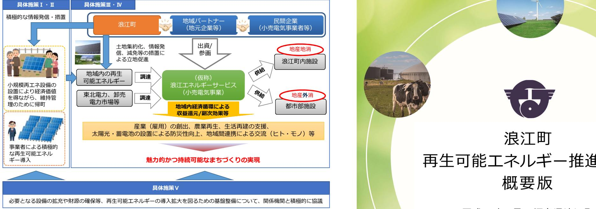
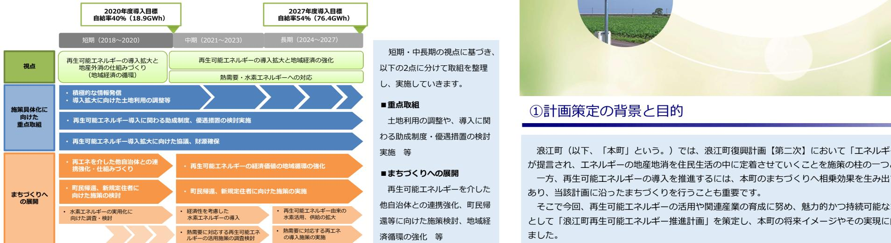
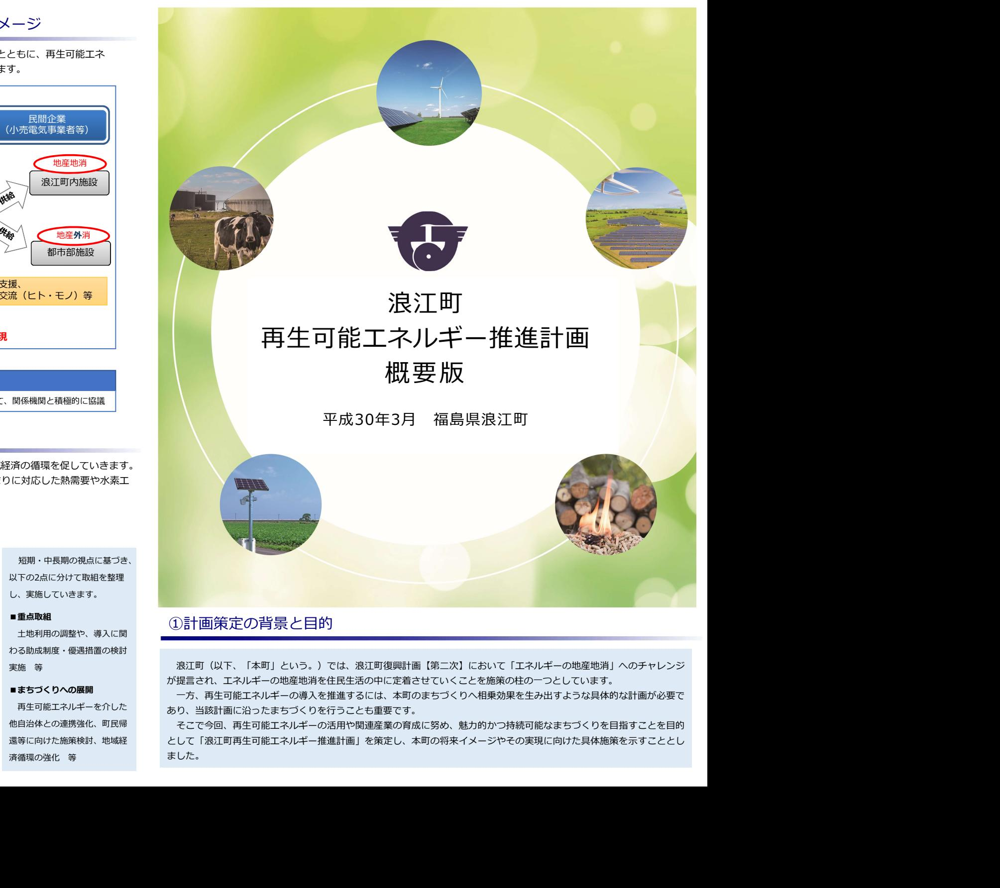
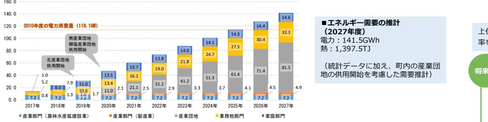
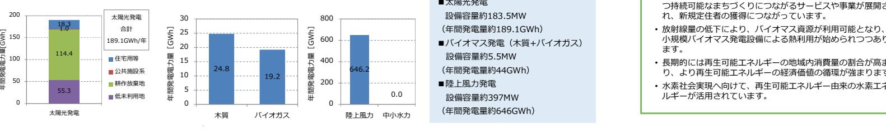
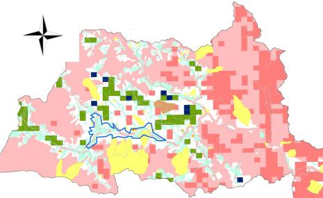
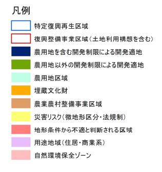
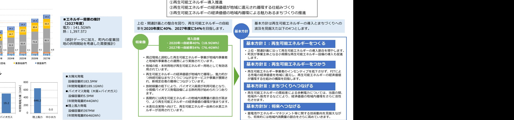

## ⑥再生可能エネルギー導入推進のための具体施策の実施イメージ

モデル事業の形成により、産業(雇用の創出)・農業再生・日常生活の再建等を促すとともに、再生可能エネルギーの利活用による防災性の向上、地域間連携によるヒト・モノの交流の促進を図ります。

# ⑦再生可能エネルギー導入に向けたロードマップ

短期的には、再生可能エネルギーの導入拡大と地産外消の仕組みづくりの観点から地域経済の循環を促していきます。 中⾧期的には、再生可能エネルギーの導入拡大と地域経済の強化をしながら、需要の高まりに対応した熱需要や水素エネルギーへの対応を見据えていきます。

## ①計画策定の背景と目的

浪江町(以下、「本町」という。)では、浪江町復興計画【第二次】において「エネルギーの地産地消」へのチャレンジが提言され、エネルギーの地産地消を住民生活の中に定着させていくことを施策の柱の一つとしています。

一方、再生可能エネルギーの導入を推進するには、本町のまちづくりへ相乗効果を生み出すような具体的な計画が必要であり、当該計画に沿ったまちづくりを行うことも重要です。 ■まちづくりへの展開再生可能エネルギーを介した

そこで今回、再生可能エネルギーの活用や関連産業の育成に努め、魅力的かつ持続可能なまちづくりを目指すことを目的として「浪江町再生可能エネルギー推進計画」を策定し、本町の将来イメージやその実現に向けた具体施策を示すこととしました。 他自治体との連携強化、町民帰還等に向けた施策検討、地域経

## ②エネルギー需要と再生可能エネルギー導入ポテンシャル

本町における電力需要の将来推計推計の結果、本町には太陽光を中心とした豊富な再生可能エネルギーの導入ポテンシャルがあり、また、将来的には産業団地への企業誘致により、エネルギー需要は東日本大震災発生前を上回るものとしています。

### 本町における再生可能エネルギー導入ポテンシャル

本町における再生可能エネルギーの開発を促していくために、開発適地の選定を行いました。

設備容量約183.5MW

設備容量約5.5MW

設備容量約397MW

・再生可能エネルギーの導入を推進する区域・再生可能エネルギーの導入にあたって周辺環境との調和の観点から調整を要する区域・自然環境を保全する区域

- ・再生可能エネルギーの開発に適さない地域(開発不適地)を抽出・環境省等の資料から再生可能エネルギー導入ポテンシャル分布状況
- を整理・国等の補助を受けて実施している事業・実施予定の区域を除外・上記で抽出した開発不適地と再生可能エネルギーポテンシャル、整理した除外区域の重ね合わせによる開発候補地の選定
- 

## ④再生可能エネルギーの導入目標・将来像・基本方針

再生可能エネルギーが魅力的かつ持続可能なまちづくりへと有効活用されるよう、以下の3つの視点で将来像と基本方針を定めます。

## ③再生可能エネルギー導入に向けた開発適地選定 ⑤再生可能エネルギー導入推進のための具体施策

本計画の将来像・導入目標達成の実現に向けた4つの基本方針をふまえて、本町のエネルギー・経済の活性化を促す以下の視点から施策を実施していきます。住民向けや事業者向けの太陽光発電を中心とした再生可能エネルギーの導入量の拡大や地域内の経済循環の活性化を目指します。 ①既存の法規制区域を基本に本町域を3つに区分(ゾーニング)

| から調整を要する区域 ・自然環境を保全する区域                                                                                                                                                                 | 施策の視点 • 再生可能エネルギーを通じ た復興や地域経済等の再生 につながる • 事業者のインセンティブを | 具体施策Ⅰ 再生可能エネルギーに関する積極的な情報配信                                                                                              |                                                                                                     |
|--------------------------------------------------------------------------------------------------------------------------------------------------------------------------------------------|--------------------------------------------------------------------|-----------------------------------------------------------------------------------------------------------------------------|-----------------------------------------------------------------------------------------------------|
| ②開発適地の選定(選定方法) ・再生可能エネルギーの開発に適さない地域(開発不適地)を抽出 ・環境省等の資料から再生可能エネルギー導入ポテンシャル分布状況 を整理 ・国等の補助を受けて実施している事業・実施予定の区域を除外 ・上記で抽出した開発不適地と再生可能エネルギーポテンシャル、 整理した除外区域の重ね合わせによる開発候補地の選定 |                                                                    | 住民向け • 所有地の再生可能エネルギーによる有効活用事例や、 補助制度や系統連携等の手続きに関する理解しやす い情報の配信を積極的に行う。 具体施策Ⅱ                                    | 事業者向け • 再生可能エネルギー導入に関する補助制度や事業者誘致の ための措置、土地利用方針に関する積極的な情報の配信を 行う。 再生可能エネルギー導入に関する積極的な措置 |
|                                                                                                                                                                                            | 呼び起こし、町民を巻き込 んだ民間活力による再生可 能エネルギーの導入拡大に                       | 住民向け • 補助申請や系統連携等の手続きを代行する事業者の 紹介や、小規模再生可能エネルギーの導入支援助成 等の積極的な措置を講じる。                                               | 事業者向け • 再生可能エネルギー導入に関する補助制度や税優遇、 再エネ設備の立地に関する基準の制定等、事業者誘致 のための積極的な措置を講じる。                  |
|                                                                                                                                                                                            | つながる • 自然環境や営農環境と調和 した再生可能エネルギー設 備の導入につながる                | 再エネ経済価値の地域還元・循環の仕組みの構築 具体施策Ⅲ • 再生可能エネルギーの経済価値がより地域に還元され、循環する仕組みを構築し、地域で消費しきれない余剰とな る再生可能エネルギーの地産外消により、地域経済の活性化を図る。 |                                                                                                     |
|                                                                                                                                                                                            | • 再生可能エネルギーの経済 価値を地域に取り込み、地                                     | 具体施策Ⅳ 再生可能エネルギーによる持続的なまちづくりの実現 • 再生可能エネルギーの経済価値を活用し、産業(雇用)の創出、農業再生、日常生活の再建などに資する取組につ なげ、魅力的かつ持続可能なまちづくりを実現する。      |                                                                                                     |
| 開発候補地 青色:農用地を含む開発制限による開発適地 緑色:農用地以外の開発制限による開発適地                                                                                                                                      | 域で循環させ、持続的なま ちづくりにつながる                                          | 具体施策Ⅴ 大を図るための基盤整備について、関係機関と積極的に協議を行う。                                                                                    | 再生可能エネルギー導入拡大のための基盤の整備 • ⅠからⅣの施策をスムーズに実施するために必要となる設備の拡充や財源の確保等、再生可能エネルギーの導入拡                     |