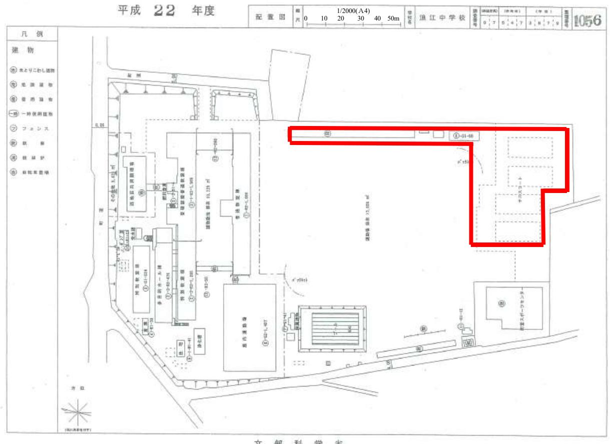
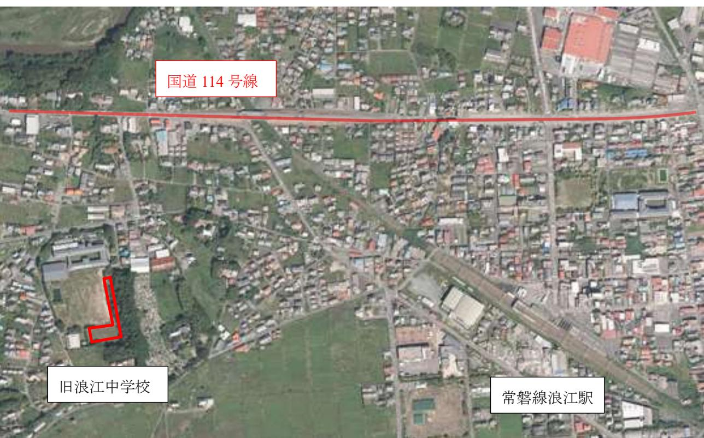

# 浪江町水素エネルギー活用促進に向けた柱上パイプライン

# による輸送実証業務委託仕様書

#### 1 件名

浪江町水素エネルギー活用促進に向けた柱上パイプラインによる輸送実証業務委託

#### 2 目的

本町内に位置する世界最大級(1 万kW)の水素製造装置を備えた「福島水素エネルギー研究フィールド」(FukushimaHydrogenEnergyResearchField (以下、FH2Rとする))で製造される再エネ水素は、東京 2020 オリンピック・パラリンピックでの利用が予定されているが、一方で、立地町としてはこの水素を町内で利活用する方策を探り産業振興につなげていくことが課題と考えている。

本事業は、FH2Rで製造される再エネ水素を、隣接する産業団地へ安全・安価に供給する仕組みを構築することで、FH2Rを町内資源として活用した再生可能エネルギーを安定的に供給する「RE100 産業団地」の構築を実現し、エネルギーの構造高度化はもとより、東日本大震災で避難を余儀なくされた町民の帰還促進と産業活性化(=雇用や新規産業の創出)を図り、震災復興につなげ、水素を中心とした再生可能エネルギーに対する地域理解を促進することを目的とする。

なお、本業務は経済産業省による令和2年度エネルギー構造高度化・転換理解促進事業補助金を受けて実施するものであり、エネルギー構造高度化・転換理解促進事業費補助金交付要綱(20160 624財資第1号)及び補助金等に係る予算の執行の適正化に関する法律(昭和30年法律第179 号)、補助金等に係る予算の執行の適正化に関する法律施行令(昭和30年政令第255号)及び交付要綱の定めるところに従って実施されるものとする。

#### 3 履行場所

浪江町内

#### 4 履行期間

契約締結日から令和 3 年 2 月 26 日(金)まで

#### 5 業務の内容

業務内容は下記のとおりとする。なお、実証にかかわる工事については原則として福島県土木工事共通仕様書に従うとともに、業務期間中の設備の安全管理にも万全を期するものとする。

また、本実証業務に関して町が実施する各種広報には積極的に協力することとする。

### (1)距離・需要量に応じた最適水素柱上パイプラインの基本性能の検証

・FH2Rは棚塩産業団地と隣接しており、既往の研究からも、柱上パイプラインによる供給が最もコスト競争力がある輸送方法であると想定される。

- ・パイプラインは中の水素容量を減らすためにパイプを細くするのが望ましいが、引き回しを長くすると急激に負荷が増えた時に燃料電池に水素が適切に送り出せない可能性が危惧される。
- ・そこで実証パイプライン設備を旧浪江中学校グラウンド(貸与範囲は参考図のとおり)に構築して、基本性能として内径・種類・全長・水素圧力等を変化させて燃料送り側(水素ボンベ等) と負荷側(燃料電池等)の挙動や追従性等を検証し、基本性能を整理した資料を作成する。ただし、パイプラインに入る圧力は 1Mpa未満に減圧すること。

〇パイプライン実証項目

- ・環境の影響(温度、風、塩害、地震)等による劣化計測
- ・端部のホールド等施工方法の妥当性
- ・パイプライン径、長さ、水素圧力、搬送量の関係の最適化検討
- ・誤操作、誤作動検証
- ・疑似漏洩、疑似倒壊等水素漏洩時の遮断方法
- ・パイプライン、遮断弁、その他部材の評価など
- (2)柱上パイプラインの安心・安全・経済合理性の検証
	- ・水素柱上パイプラインの安全性検討については、リスクシナリオの整理を行うとともに、旧浪江中学校グラウンドに構築する実証パイプライン設備において水素の特性や挙動等を確認し、そのデータを基にシミュレーションを行い、リスクアセスメントを実施し、アセスメント評価書を取りまとめる。
	- ・柱上パイプラインの敷設コスト、サービスメンテナンスコストなど実証にて経済合理性を検証し、とりまとめと評価を行う。
- (3)柱上パイプラインの実現に向けた法規制等の制約条件の整理
	- ・柱上パイプラインについては国内における事例がないことから、法規制等の制約条件について整理を行うとともに、浪江町と連携して関係する行政機関・団体等へヒアリングを行い、浪江町と協力して導入実現に向けた課題と対応策の提言書を作成する。
- (4)棚塩地区等における水素供給・活用モデルの検討
	- ・(1)~(3)の検討・検証結果を踏まえ、RE100 産業団地の実現に向けて、最適な柱上パイプラインの敷設パターン及び水素供給・活用モデルを検討する。
	- ・当該地区への進出が期待される製造業や水素利用企業等に対してモデルを提示し、立地意向や進出に向けた課題についてヒアリングを行う。
	- ・また、将来的に家庭用等に水素供給を拡大することも想定し、町内活用モデルの検討を行う。
	- ・町と協力して、以上の内容についてとりとめた水素利活用構想を作成する。
- (5)業務報告書の作成
	- ・本業務における調査・検討等の結果は業務報告書として取りまとめて納品する。

#### 6 成果品

成果品は、次のとおりとする。

| (1)業務報告書・資料編                   | A4   | 10 部 |
|--------------------------------|------|------|
| (2)報告書電子データ                    | CD-R | 1 式  |
| (3)参考資料電子データ                   | CD-R | 1 式  |
| *その他、協議の上必要に応じて報告書概要版等を作成すること。 |      |      |

## 7 その他

仕様書に記載のない事項及び疑義が生じた場合は、都度、発注者と協議し、その指示に従うこと。

以上

*詳細の実施区域は町の指示に従うこと。

位置図

参考図