浪江町水素エネルギー活用促進に向けた柱上パイプラインによる輸送実証事業令和2年度第1回「エネルギー構造高度化・転換理解促進事業」[経済産業省補助事業] エコでクリーンな水素エネルギー、安心・安全・低コストに使うことはできないか?

この命題に対し本実証事業では、気体特性を活かした柱上パイプライン化により安全で持続可能な地産地消エネルギーとして、水素のオンサイト利用のための輸送・利活用モデルの構築を目指します。

本年度実証では、基本性能実証とあってリスクアセスメントおよび法的な観点からも基本的課題解決策を検討し、提案を行ないます。
このまま行っている。 この

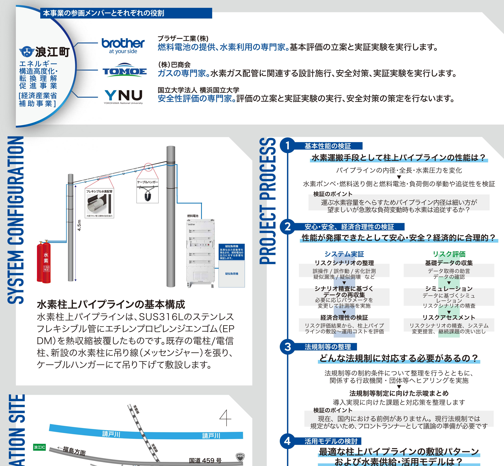

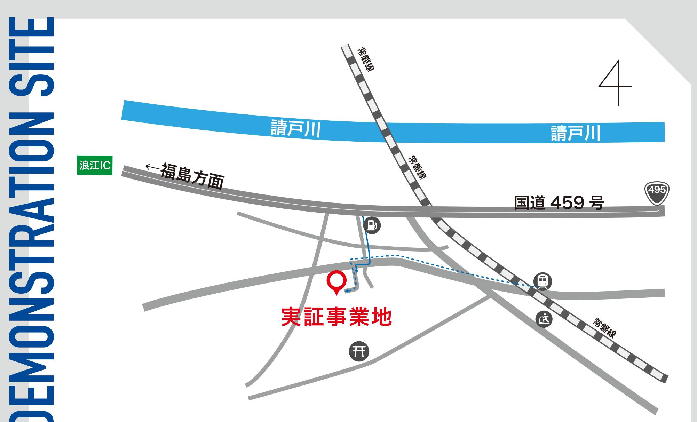

当該産業団地への進出が期待される製造業や水素利用企業等に

## EMONS

#### 覧 :国道459号より3分電車:浪江町駅より徒歩15分

#### 問い合わせ先

福島県浪江町役場産業振興課産業創出係電話番号:0240-34-0248

対して利用意向や進出に向けた課題についてヒアリングを実施

#### RE100 産業団地の実現に向けて

#### 検証のポイント

Q

どうすれば利用が進むのか、どの規模で水素が消費されるのか、活用を阻む課題・ボトルネックはないか検討します。

#### 本事業のまとめと来年度以降の予定

令和2年度の単年度事業?

令和 2 年度の検討結果より

未解決課題の法的緩和も含めた追加実証、セミナー等継続検討関係省庁との調整で実現への機運向上

#### 棚塩産業団地における実現に向けて

供給者主体や需要家となる進出事業者との具体的な検討・調整(供給価格、供給量等)

導入実現に向けた具体的な検討フェーズへ移行

#### 水素柱上パイプラインのリスクアセスメントの目的

期待される柱上パイプラインの敷設コストは、地中パイプラインの1/10以下。 安全性が担保できれば、安全で安価な水素の運搬手段として期待できます

それでは、どうして安全だと考えるのか?どうすれば安全だとわかるのか?について考えてみます。

#### 柱上パイプラインの安全性仮説

水素は空気に比べてはるかに軽く、大気中に放出された場合、すぐに上空へ拡散します。そこで水素を運ぶ配管を、屋外の、人間の生活空間上空に敷設することで、安全に運べるのではないか、と考えています。

#### 配管が破損もしくは破断して水素が漏洩してしまったら…?

こんな万が一の場合でも、大気中での水素拡散が早いため、着火・燃焼しても爆発の可能性は低く、反応が上空で発生するため、生活している人間に影響が及ぶ可能性は低いと考えられます。

#### リスクシナリオに基づくシミュレーションで安全性を評価

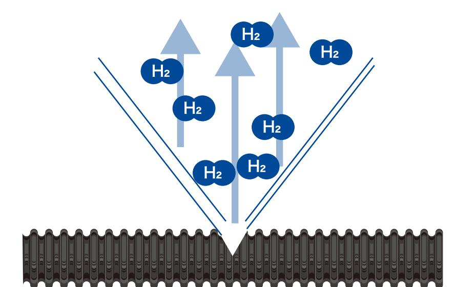

1」 今回の実証事業では、通常の運転時だけでなく、非定常時、さらには自然災害や事故が発生したら…? など、水素柱上パイプライン周辺のトラブルを想定しています。 (誤操作、誤作動、劣化計測/疑似漏洩、疑似倒壊など)

- 影響を受ける主体別に、計画 >導入 >普及の各ステージでシテリオを抽出します。 2
- 現行の水素ステーションのリスク評価基準を参考に、シナリオごと、安全性を評価。 3 また、社会受容性についても評価を実施します。

横浜国立大学先端科学高等研究院の専門家チームによるリスクアセスメントで、システムの安心な稼働に必要な安全対策、情報発信を行ないます。

→詳細は、横浜国大YNUパネルをご覧ください。

# 

水素柱上パイプラインのメリット・デメリットについて

## 多敷設コストが地中配管の 1/10 以下と

デメリアトイ ® 世にないもののため、

安価な見込み多配管が破断しても水素はすぐに上空に拡散する多生活空間内からの発散を前提とすることで付臭の必要が無い多振動感知遮断弁等で水素漏洩の防止は可能多比較的安価に安全性を担保可能多既存在への敷設時は所有者に恩恵 (受益配分の仕組み)

#### 法規制等の検討が不一分

® 安全性を保証するには専門家による十分なリスクアセスメントが必要

® 社会受容性に関しては事前の推測が困難なため実地検証の重要度が高く、また実証に協力的な世論形成が必要

#### 水素柱上パイプラインの基本構成と実証手順基本構成BasicConfiguration

#### 水素柱上パイプラインの基本構成

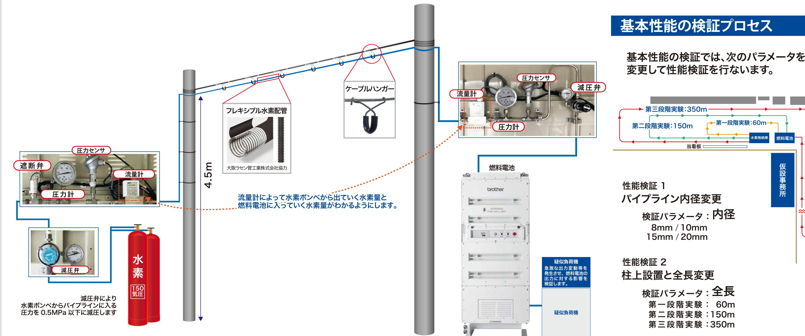

| omm / 15mm / 20mm       |  |
|----------------------------|--|
| 生能検証 2 主上設置と全長変更        |  |
| 検証パラメータ:全長                 |  |
| 第一段階実験: 60m 第二段階実験:150m |  |
| 第三段階実験:350m                |  |

な

| 半自動切替減圧弁セミオ | 流量計                       | 圧力計        | 圧力センサ   | 遮断弁                | 減圧弁                                       |
|--------------|---------------------------|------------|---------|--------------------|-------------------------------------------|
|              |                           |            |         |                    |                                           |
| 式            | 型式                        | 型式         | 製品名     | 製品名                | 型式                                        |
| TN-50S       | HM5122B                   | GV42-234-2 | K116    | FPR-UDDF-71LS-6.35 | LR-3SL                                    |
| 三次側使用圧力      | 標準レンジ(N2換算)               | 圧力レンジ      | 圧力レンジ   | 使用温度範囲             | 一次側圧力                                     |
| 0.1~0.5 Mpa  | 30/50/100/ 200 L/min(nor) | 0~1MPa     | 0~1 MPa | -10~80°C           | 0.1~0.99 MPa                              |
| 三次側圧力計       |                           |            |         |                    | 二次側圧力                                     |
| 1 MPa        |                           |            |         |                    | 0.01~0.1 MPa                              |
|              |                           |            |         |                    | 標準流量 最大流量 80 L/min(標準) 100 L/min(標準 |

#### 令和2年度実証手順について

#### 水素

使用する水素は7㎡の高圧水素を必要最小限(4本以下)都度調達するものとし、水素ボンベ保管庫で厳重に管理します。 実証ではレギュレーターで水素圧力を10気圧以下にして使用することとします。 (高圧ガスではありません)

#### 性能検証 1:パイプライン内径

■基本性能の検証として、太さ・圧力をパラメータとして、入出力部の圧力流量変化を確認。然料電池への影響を検証します。 ・これにより、パイプラインの仕様(径、接続方式)を決定します。

・第1段階では、まずはパイプラインを地面に近い場所に設置し、基本性能の検証を行ないます。

#### 性能検証 2:柱上設置と全長

・実証エリアに柱を15本立て、高さ4.5mにて全長約350mの水素パイプラインを敷設します。 ・長さ―圧力をパラメータとし、入出力部の圧力・流量変化から燃料電池への影響を確認、全長延長による性能を検証します。

#### 2 安心・安全、経済合理性の検証

・水素柱上パイプラインを運用するにあたって想定される。様々なリスクシナリオに基づいて検証用データを収集します。 ・収集データを基にシミュレーションを実施、リスクシナリオの精査を行ないます。 ・必要に応じ、シミュレーション精度向上と安心・安全性能確立のため、実証設備に変更を加えて再検証を実施します。

### 復興の起爆剤、水素エネルギーの地産地消を実現するために雑地淵の水素会の場Werealizehydrogenlocal.

法規制の整理について

#### LegalandREGULATORYPROPOSALs

水素柱上パイプラインについては国内における事例がありません。 そこで、関係省庁および協会へ事前ヒアリングを行なっています。

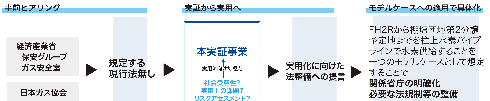

に繋がると考えています。

## Forthefuture.

#### 柱上パイプラインによる水素エネルギーの地産地消

これまでの水素社会では、ガスボンベ、高圧ガス(70 MPa)、液体水素として生産地から消費地まで水素が運ばれてくるものとして検討がおこなわれてきました。

しかし、水素の圧縮、液化や、トラックやトレーラー、船による運送は、必要なエネルギーやコストが小さくなく、水素エネルギーを利用するにあたって、ときに課題とされてきた歴史があります。

柱上パイプラインを使って水素を運ぶことで、HydrogenLocal、地産地消による新しい水素社会のカタチを提案することにも繋がります。

震災復興の起爆剤RE100 産業団地の実現

#### 浪江町民の帰還促進と雇用・新規産業創出の為に

世界最大級の水素製造施設「FH2R」が町内にある浪江町には、3ない水素*活用のボテンシャルが高いと言えます。

FH2Rで製造した水素を柱上パイプラインで浪江町内に送り、地産地消する活用モデルを検討します。

これにより、浪江町民の帰還促進や雇用・新規産業創出を目指します。

*3ない水素=貯めない、圧縮しない、運ばない

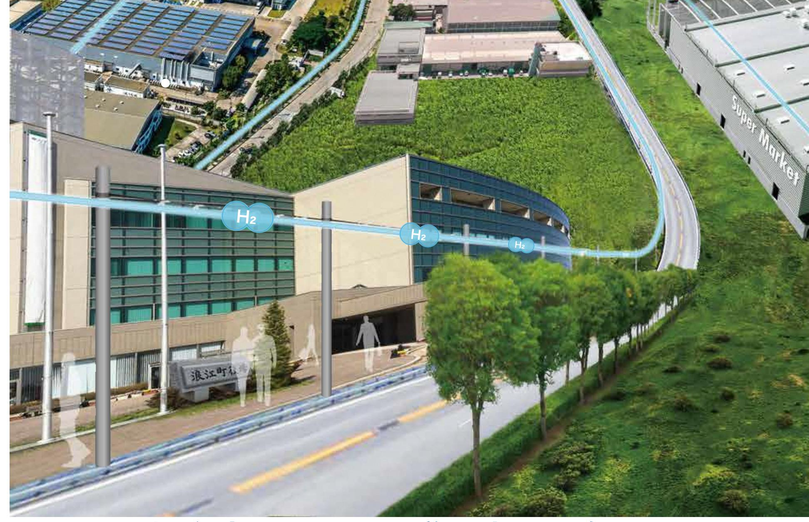

棚塩産業団地への導入実現に向けて

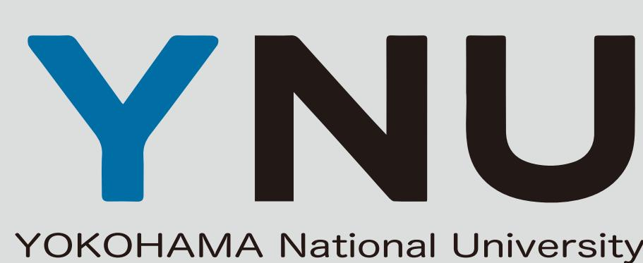

#### 浪江町水素エネルギー活用促進に向けた柱上パイプラインによる輸送実証業務委託横浜国立大学:「安全性評価の立案、実証実験の実行及び安全対策の策定に資する情報発信」

#### 業務内容

- 1. 柱上水素パイプラインのフィジカルリスクアセスメント
- 2. リスク低減対策の提案
- 3. 法規制等と整備に向けた課題等の整理
- 4. 棚塩地区等における水素供給・活用モデルの検討

#### リスクアセスメント

柱上水素パイプラインのリスクを分析し、計画段階において必要なリスク低減対策を提案する

事故のシナリオ検討 / 定性的リスク分析 / リスク評価(リスクマトリクス) →HAZIDstudyを用いて実施(自然災害、変更管理、外部事象を考慮)

| 実施体制   |                 |            |                                 | HA/Dstudy        |
|--------|-----------------|------------|---------------------------------|-------------------|
| 技術者氏名  | 所属・役職名          | 分担業務の内容    | 詳細検討が必要なリスクの抽出                  | リスク評価のイメーシ 1 2 |
| 管理技術者  |                 |            | 詳細影響度分析(FLACS)                  |                   |
| 三宅淳巳  | 先端科学高等研究院・教授    | 統括         | 詳細頻度分析(プロセス開発及び情報入手の状況に応じて)     |                   |
| 技術担当者  |                 |            |                                 |                   |
| 伊里友一朗 | 環境情報研究院・助教      | リスクシナリオ整理  | リスク低減対策の提案                      | FLACSを用いた         |
| 塩田謙人  | 先端科学高等研究院・助教    | 数値シミュレーション |                                 |                   |
| 野口和彦  | 先端科学高等研究院・客員教授  | リスクアセスメント  | リスク低減対策の検証(実証実験、シミュレーション、ヒアリング) |                   |
| 河津要    | 先端科学高等研究院・客員准教授 | 数値シミュレーション |                                 |                   |

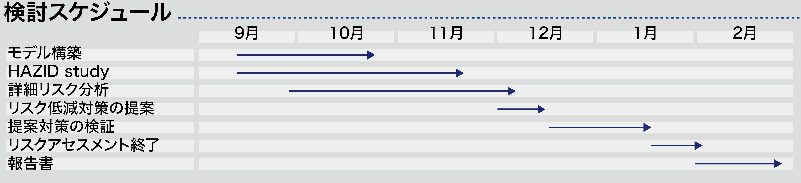

#### 関連実績・研究

消防防災科学技術研究推進制度(2014~2015): 「水素スタンド併設給油取取扱所の安全性評価技術に関する研究」

本研究は、液化水素及び有機ハイドライド型水素スタンド併設給油取扱所に対して、HAZIDstudyを実施し、併設特有のリスクを特定した。さらに、各種シミュレーション技術を活用し、高リスクシナリオを分析し、リスク低減対策を提案した。

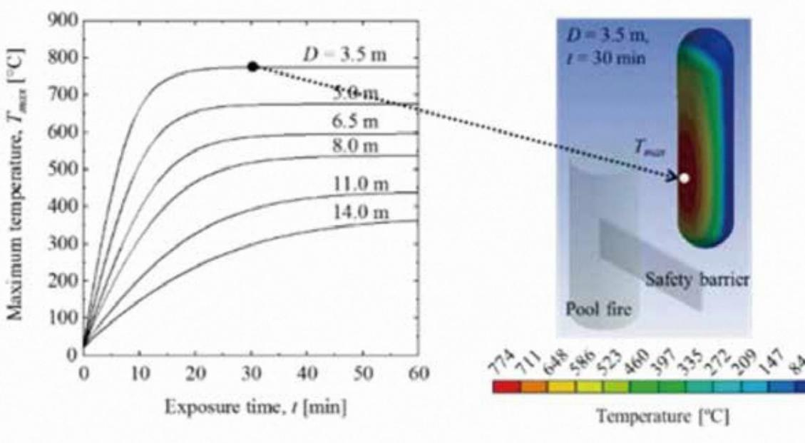

<実施中>NEDO「超高圧水素インフラ本格普及技術研究開発事業」(2018~2020) 「リスクアセスメントの再実施に基づく設備構成に関する研究開発」

本研究は、水素ステーションの定量的リスク評価により、安全と運用の合理性を求めた技術基準案の策定を目的とする。FLACS, Safeti, SimulationX等のソフトウェアを駆使した水素の漏洩・燃焼影響度解析、各機器の故障確率を用いた頻度解析を通して、リスクを定量的に明らかにし、水素ステーションの社会実装に貢献する。

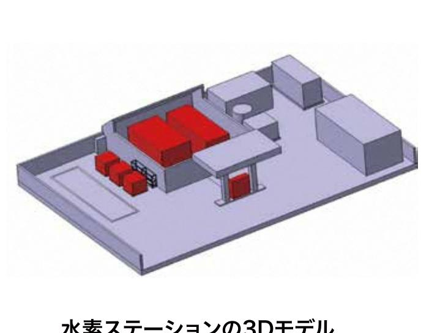

#### 内閣府戦略的イノベーション創造プログラム(2014〜2018) 「エネルギーキャリアの安全性評価研究」

<実施中>環境省環境研究総合推進費(2019~2021) 「災害・事故に起因する化学物質流出のシナリオ構築と防災減災戦略」

本研究は、高圧水素・液化水素・有機ハイドライドサプライチェーンの3つを対象として、輸送・貯蔵・供給時について、社会リスク評価および工学的リスク評価を行い、社会実装に向けた研究開発を実施した。 その結果、「水素ステーションの社会総合リスクアセスメントガイドライン」 を発行した。

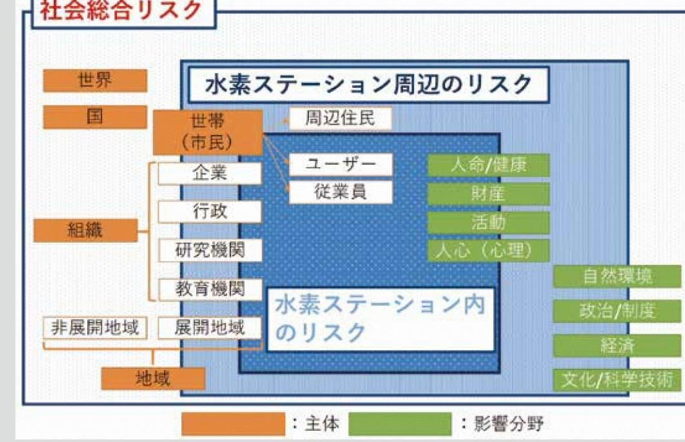

本研究は、

- ・コンビナート等の事故に起因する化学物質の漏洩シナリオの体系的な整理
- 環境リスクに"社会状況"や"対応力を加えた"環境社会リスク"の提案と導入

を通して防災減災ガイドラインを発行する。

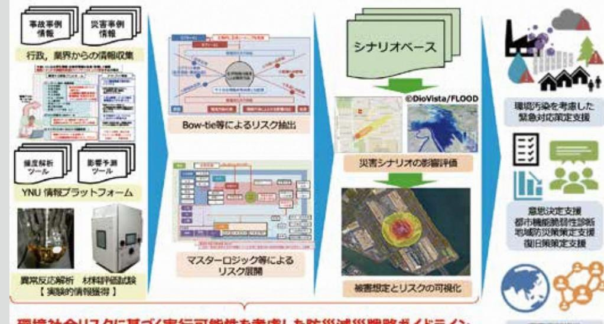

#### 横浜国立大学先端科学高等研究院

