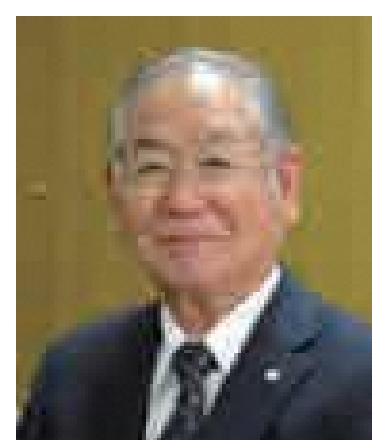
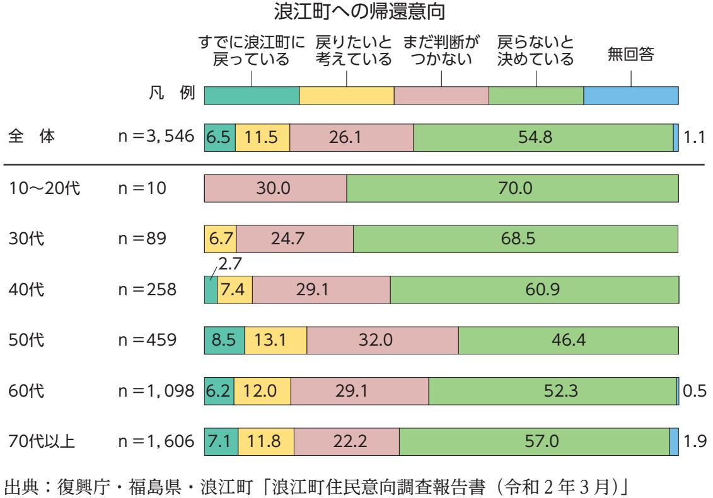
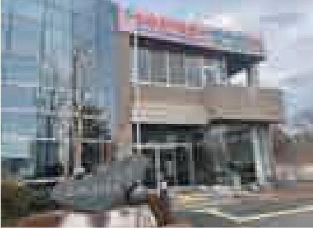
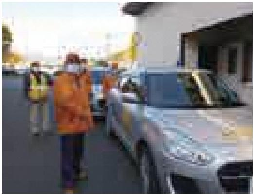
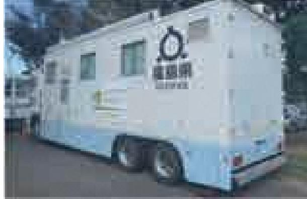

## 「持続可能なまちづくり」を目指して

東日本大震災・原子力災害という未曽有の複合災害から10年となる節目の年を迎えました。震災で犠牲になられた方々に哀悼の誠を捧げるとともに、未だに不自由な避難生活を強いられている町民の皆様に心からお見舞い申し上げます。

震災直後からこれまで、町の未来が見えない中「町のこし」を掲げて、町民の皆様と必死に取り組んできました。町の避難指示一部解除から 3 年、ようやく「町のこし」は形となり、今後は更なる復興・再生に向けて、「持続可能なまちづくり」を進めていきます。

このたび、町のこれから10年の復興の方向性を定める浪江町復興計画【第三次】を策定しました。本計画は、「夢と希望にあふれ住んでいたいまち住んでみたいまち」を理念に掲げ、将来にわたり町内に居住する皆様が安心して豊かな生活を送られるとともに、訪れる人が住んでみたいと思える、魅力あふれるまちづくりを目的とするものです。

今年度の交流・情報発信拠点「道の駅なみえ」のオープンに続き、今後も「震災遺構浪江町立請戸小学校」、「国営追悼・祈念施設」、「福島県復興祈念公園」等の震災の記憶と教訓を伝承する施設がオープンする予定であり、町民の帰還促進とともに、国内外からの新たな交流による移住・定住推進の効果が期待されています。

本計画では、先端的な福島イノベーション・コースト構想関連施設を活用したドローンの研究開発・テスト飛行や自動運転などモビリティサービスの実証等とともに、ゼロカーボンシティの実現に向けた再生可能エネルギーの地産地消や水素の利用推進等の世界的課題に挑戦し、居住人口の増加を促す新産業の創出と住みよい豊かな社会づくりを目指します。さらに、町の顔である駅周辺エリアの都市的機能整備によるにぎわいづくりや、町の基幹産業である農業の再生を進め、美しい「ふるさと」の姿を取り戻すとともに、帰還困難区域全域の避難指示解除に向けて、全ての町民が生活できる環境の再生を目指します。

本計画の実施にあたっては、避難する町民の皆様をはじめ、全ての町民の皆様に寄り添いながら、協働して着実に復興を推進しますので、ご協力をよろしくお願いたします。

結びに、本計画の策定にあたり、貴重なご意見、ご助言を賜りました浪江町復興計画【第三次】策定委員会、町議会をはじめ、パブリックコメントによりご提言をいただきました多くの町民の皆様に心から感謝申し上げます。

浪江町長吉田数博

## 目次

| 第 1 | 編序論…………………………………………………………… 1 |
|--------|----------------------------------|
| 第 1 | 章計画の策定にあたって……………………………………… 2 |
| 1      | 計画策定の目的……………………………………………… 2   |
| 2      | 計画の構成と期間…………………………………………… 3   |
| 3      | 計画の進行管理……………………………………………… 4   |
| 第 2 | 章計画策定の背景……………………………………………… 5 |
| 1      | 町の概況……………………………………………………… 5   |
| 2      | これまでの復興の歩み………………………………………12      |

## **第 2 編基本構想**………………………………………………………19

| 第 1 | 章復興の理念……………………………………………………20 |  |
|--------|-------------------------------|--|
| 1      | 理念……………………………………………………………20   |  |
| 2      | 理念の柱………………………………………………………21   |  |
| 第 2 | 章復興の基本方針………………………………………………22 |  |
|        | Ⅰ 夢と希望のある産業と仕事づくり…………………………22 |  |
|        | Ⅱ 未来を担う人づくり…………………………………………22 |  |
|        | Ⅲ 帰還困難区域の再生と住みよい環境づくり………………22 |  |
|        | Ⅳ 健康と福祉のまちづくり……………………………………23 |  |
|        | Ⅴ 絆の維持と持続可能なまちづくり…………………………23 |  |

## **第 3 編基本計画**………………………………………………………27

|        |   | 施策体系…………………………………………………………………28 |  |
|--------|---|---------------------------------|--|
|        |   |                                 |  |
| 第 1 |   | 章夢と希望のある産業と仕事づくり…………………………29   |  |
| 施策     | 1 | 農林水産業の再興………………………………………30       |  |
| 施策     | 2 | 新たな産業と雇用の創出………………………………38       |  |
| 第 2 |   | 章未来を担う人づくり…………………………………………47   |  |
| 施策     | 1 | 子育て環境・学校教育の充実…………………………48       |  |
| 施策     | 2 | 生涯学習環境の充実……………………………………52       |  |
| 施策     | 3 | 震災の記憶の伝承………………………………………56       |  |

| 第 3 |   | 章帰還困難区域の再生と住みよい環境づくり………………59 |  |
|--------|---|-------------------------------|--|
| 施策     | 1 | 帰還困難区域の再生……………………………………60     |  |
| 施策     | 2 | 社会基盤の維持・整備…………………………………62     |  |
| 施策     | 3 | 防災・安全の強化………………………………………68     |  |
| 施策     | 4 | ゼロカーボンシティの推進……………………………72     |  |
| 第 4 |   | 章健康と福祉のまちづくり……………………………………75 |  |
| 施策     | 1 | 健康づくりの推進・医療の充実………………………76     |  |
| 施策     | 2 | 介護・福祉の充実………………………………………78     |  |
| 施策     | 3 | 放射線による健康不安への対策………………………80     |  |
| 第 5 |   | 章絆の維持と持続可能なまちづくり…………………………85 |  |
| 施策     | 1 | 被災者生活支援・絆の維持……………………………86     |  |
| 施策     | 2 | 移住・定住の推進………………………………………92     |  |
| 施策     | 3 | 地域コミュニティ活動の推進…………………………94     |  |
| 施策     | 4 | 復興を推進させる行財政運営…………………………96     |  |
|        |   |                               |  |

## **資料編**……………………………………………………………………99

| ( 1 | )用語集(本文中の※印のついた用語の説明)………………… |     |  |  |  |  |
|--------|------------------------------|-----|--|--|--|--|
| ( 2 | )答申文… ………………………………………………… | 104 |  |  |  |  |
| ( 3 | )浪江町復興計画【第三次】策定委員会名簿… ……… | 105 |  |  |  |  |
| ( 4 | )浪江町復興計画【第三次】策定会議名簿… ………… | 106 |  |  |  |  |
| ( 5 | )事務局… ………………………………………………… | 106 |  |  |  |  |
| ( 6 | )浪江町復興計画【第三次】策定経過… ……………… | 107 |  |  |  |  |

#### 《表紙の写真について》

- 1 町の航空写真(上段)
- 2 道の駅なみえ(中段左)
- 3 福島水素エネルギー研究フィールド(中段右)
- 4 請戸漁港の出初式(下段左)
- 5 高瀬川渓谷(下段中央)
- 6 相馬野馬追(下段右)

## **第1章計画の策定にあたって**

## **1 計画策定の目的**

2

浪江町復興計画【第三次】(以下「復興計画【第三次】」という。)は、平成23年 3 月11日に発生した国内観測史上最大規模の巨大地震とそれに伴う津波、更には東京電力ホールディングス株式会社(以下「東京電力」という。)の原子力発電所事故(以下「原発事故」という。)という未曽有の複合災害により、甚大な被害を受けた本町が復旧・復興を実現していくための道標とするものです。

これまで町は、平成24年 4 月に「浪江町復興ビジョン」を策定し、その復興の理念である「みんなでともに乗り越えよう私たちの暮らしの再生に向けて~未来につなぐ復興への想い~」 の実現のため、同年10月に「浪江町復興計画【第一次】(以下「復興計画【第一次】」という。)」、平成29年 3 月に「浪江町復興計画【第二次】(以下「復興計画【第二次】」という。)」を策定し、町及び町民を取り巻く状況の変化に合わせながら、総力を挙げて復旧・復興に取り組んできました。

平成23年度から町全域が避難指示区域に指定されていましたが、平成29年 3 月に、避難指示区域の一部が解除され、町内での本格的な復興・再生が始まっています。

しかしながら、未だに帰還困難区域が町の面積の 8 割を占めており、町全域の再生に向けた取組を継続していく必要があります。避難指示が解除された区域においても、全町避難からの復興・再生であるため、多くの課題を抱えている状況です。

東日本大震災(以下「震災」という。)から10年の節目を迎えた今、町をとりまく状況は大きく変化してきていることから、これまでの復興の進捗や行政の取組を検証し、将来にわたって安心して豊かな生活を送れる「持続可能なまちづくり」が必要です。

これらの基本的な認識のもと、中長期的な視点に立って、総合的かつ計画的に復興を実現するため、復興計画【第三次】を策定します。

### ア基本構想

基本構想は、「復興の理念」と、これを達成するための「復興の基本方針」を定めるものです。

### イ基本計画

基本計画は、基本構想を実現するための施策を定めるものです。

## (2)計画の期間

基本構想の期間は、令和 3 年度から令和12年度までの10年間とします。基本計画は社会情勢の変化に柔軟に対応するため、計画期間を前期と後期に区分し、それぞれ 5 年間とします。

| 年度   | 令和3       | 令和4 | 令和5        | 令和6 | 令和7 | 令和8 | 令和9 |            | 令和10 令和11 令和12 |  |
|------|-----------|-----|------------|-----|-----|-----|-----|------------|----------------|--|
|      |           |     |            |     |     |     |     |            |                |  |
| 基本構想 | 基本構想(10年) |     |            |     |     |     |     |            |                |  |
|      |           |     |            |     |     |     |     |            |                |  |
| 基本計画 |           |     | 前期基本計画(5年) |     |     |     |     | 後期基本計画(5年) |                |  |
|      |           |     |            |     |     |     |     |            |                |  |

## **3 計画の進行管理**

計画の進行管理については、P(PLAN:計画)・D(DO:実行)・C(CHECK:評価)・A (ACTION:見直し)サイクルによる効果的な進行管理を行います。

庁内で計画の評価を定期的に実施するほか、町民や有識者等を交えた組織での「協働」による進行管理を行います。評価の結果を踏まえながら、改善を行うことで、計画の着実な実行につなげます。

# **第2章計画策定の背景**

## **1 町の概況**

## (1)町の沿革

町の歴史は酒田の「酒田原遺跡」の旧石器時代に始まり、縄文、弥生、古墳、奈良、平安時代の遺跡も多数発掘されています。

中世は標葉氏の所領でしたが、相馬氏との権力争いが頻繁に繰り広げられていました。明応元年(1492年)に標葉氏が討たれ、以後相馬氏によって支配されます。

江戸時代には、相馬領大堀村で陶器生産が盛んになり、相馬藩の保護のもとで発展しました。 また、現在の町の中心市街地に位置する権現堂地区は「高野宿」と呼ばれ宿場町を形成しており、東西に細長い街並みでした。しかし、安政 6 年(1859年)、西からの強風にあおられた大火災が発生し、高野宿はほぼ全焼し、翌年に街並みは抜本的に変更され、南北に長い新町通りの建設が防火思想を結集して開始されました。諸説ありますが、この大火の頃から「高野宿」に変わり「浪江」という名称が定着したといわれています。

明治22年には、町村制が施行された際に、小村を統合して現在の町の前身である 6 村(浪江村・幾世橋村・請戸村・大堀村・苅野村・津島村)が誕生しました。明治31年に浪江駅が開業し、明治33年に浪江村は町に昇格しました。

その後、昭和28年に施行された「町村合併促進法」により、町は同年に幾世橋村・請戸村と合併、更に昭和31年に大堀村・苅野村・津島村と合併し、今日の町の姿になっています。

### (2)町の位置

町は、福島県の最東端、浜通りの中央部、双葉郡の北部に位置し、東は太平洋に面しています。 主要都市との距離では、福島市までは約70㎞、郡山市まで約75㎞、いわき市まで約60㎞、仙台市まで約95㎞、東京まで約260㎞となっています。

町を縦断する幹線として、町の東部を常磐自動車道、JR常磐線、国道 6 号が首都圏と仙台方面を結んでいます。

町を横断する幹線として、浜通りと中通りをつなぐ国道114号は、幾世橋の市街地の国道 6 号から分岐し、請戸川に沿って西に向かい、川俣町を経由して福島市に至ります。国道114号は一部狭隘な単線区間があり、現在改良が進められています。さらに、国道114号沿線の室原に常磐自動車道浪江ICが設置されるなど、主要高速道路へのアクセスが強化されています。

また、国道 6 号を補完する道路として、町の西部に県道34号相馬浪江線、県道35号いわき浪江線、東部に県道391号広野小高線が縦断しています。県道391号広野小高線は改良工事が進んでおり、沿線に整備されている棚塩産業団地や「福島県復興祈念公園」へのアクセス向上が期待されています。

#### ≪町へのアクセス≫

| 自動車  |           |                             |
|------|-----------|-----------------------------|
| 福島   | 約 1 時間30分 | 国道114号                      |
| 郡山   | 約 1 時間40分 | 国道288号・県道50号浪江三春線           |
| いわき  | 約 1 時間10分 | 常磐自動車道いわき四倉IC~常磐自動車道浪江IC  |
| 仙台   | 約 1 時間30分 | 仙台南部道路長町IC~常磐自動車道浪江IC     |
| 福島空港 | 約 1 時間50分 | あぶくま高原道路福島空港IC~常磐自動車道浪江IC |
| 仙台空港 | 約 1 時間10分 | 仙台東部道路仙台空港IC~常磐自動車道浪江IC   |
| 鉄道   |           |                             |
| いわき  | 約50分      | いわき駅~浪江駅(特急ひたち)             |
| 仙台   | 約 1 時間10分 | 仙台駅~浪江駅(特急ひたち)              |
| 東京   | 約 3 時間10分 | 東京駅~浪江駅(特急ひたち)              |
| 仙台空港 | 約 1 時間50分 | 仙台空港駅~浪江駅                   |

### (3)自然条件

西方の阿武隈高地は、双葉郡、田村郡、安達郡の境界をなす日山[天王山](約1,057m)、白馬石山(約821m)、高太石山(約863m)が連なっています。山間部に位置する津島地区の標高は約415m(下津島付近)と高くなっています。

阿武隈高地に水源を持っており、町の北を請戸川、南を高瀬川が東流、幾世橋で合流して、太平洋に注いでいます。

また、阿武隈高地の日山地区と高瀬川地区は、阿武隈高原中部県立自然公園に指定されており、新緑や紅葉の名所として親しまれています。

町は、海岸、山麓、山間の地からなり、気候も一様ではありませんが、一般的には東日本型海洋性の太平洋沿岸特有の気候で、黒潮の影響により比較的温暖です。年間の降水量はおおよそ1,500㎜程度で、自然環境に恵まれた住みよい環境となっています。

■ 浪江町色別標高図

出典:国土地理院ウェブサイト

## (4)土地の状況

町の面積は、東西約32㎞、南北約22㎞に広がる223.14㎢で、双葉郡 8 町村の中で最も大きく、福島県の面積(13,783.90㎢)の約1.62%にあたります。

令和 2 年度における土地の状況は、下表のとおり農地が29.90㎢(13.4%)、宅地が5.72㎢ (2.6%)、山林・原野が155.86㎢(69.9%)という状況です。

#### ■ 総面積・地目別土地面積

|                   | 出典:浪江町住民課「固定資産概要調書」 |  |  |
|-------------------|---------------------|--|--|
| 各年 1 月 1 日現在単位:㎢ |                     |  |  |

| 年次   | 総面積    | 田      | 畑     | 宅地   | 池沼   | 山林     | 原野     | その他   |
|------|--------|--------|-------|------|------|--------|--------|-------|
| H22年 | 223.10 | 19.47  | 11.79 | 5.62 | 0.13 | 150.93 | 5.78   | 29.38 |
| R2年  | 223.14 | 18.02  | 11.88 | 5.72 | 0.13 | 150.11 | 5.75   | 31.53 |
| 比較   | 0.04   | △ 1.45 | 0.09  | 0.10 | 0.00 | △ 0.82 | △ 0.03 | 2.15  |

■ 土地利用の状況及び地目別割合(令和 2 年)

## (5)町の人口

#### ア将来人口の目標

平成28年 3 月に町が策定した「まち・ひと・しごと創生浪江町人口ビジョン」において、令和17年に約8,000人程度の目標人口を掲げています。

#### イ人口の推移

町の人口は震災前から減少の傾向にあります。震災前の人口は、平成23年 3 月11日時点で、 21,542人となっており、令和 2 年10月 1 日時点での人口は16,770人と4,772人(22.2%)減少しています。

福島県及び浪江町における住民登録数の推移

出典:福島県総務部市町村行政課「県内市町村住民基本台帳人口・世帯数」 浪江町福島県

H25年度からは、調査期日を 3 月 1 日現在から 1 月 1 日に変更しています。

#### ウ町内居住者の推移

令和 2 年10月 1 日時点の町内居住者は、1,467人となっており、毎月町内居住者の数は増加の傾向にあります。

浪江町内居住者数の推移

出典:浪江町総務課「浪江町居住人口集計表」、浪江町住民課「避難者台帳・避難状況集計表」

#### エ年齢構造

町内の居住人口は、男性では60歳~ 69歳、女性では70歳~ 79歳が多くなっている一方で、男女共に10歳~ 19歳が少ない少子高齢化の構造となっています。

出典:浪江町総務課「浪江町居住人口集計表」、福島県企画調整部統計課「福島県現住人口調査」 令和 2 年10月 1 日時点での人口の合計に対する年代別の割合をグラフ化

#### オ住民意向調査の結果

令和元年度時点での町への帰還意向については、「戻らないと決めている」が54.8%と最も高く、次いで「まだ判断がつかない」が26.1%、「戻りたいと考えている」が11.5%、「すでに浪江町に戻っている」が6.5%となっています。

回答者の年齢別にみると、「すでに浪江町に戻っている」は高い年齢での割合が高く、50 代で8.5%、60代で6.2%、70代以上で7.1%となっています。「戻りたいと考えている」についても同様に高い年齢での割合が高く、50代で13.1%、60代で12.0%、70代以上で11.8%となっています。一方、「戻らないと決めている」は30代以下の若い年齢で約 7 割となっています。

## **2 これまでの復興の歩み**

## ( 1 )震災の発生(発災~平成24年度)

平成23年 3 月11日に発生した東北地方太平洋沖地震による災害により、151人の死者、31人の行方不明者、651戸の家屋の全壊(平成25年 3 月まで目視による判定)など、甚大な被害を受けました。その後原発事故により全町民が避難を余儀なくされました。

町は、同年 3 月15日に二本松市への避難を決定し、二本松市東和支所に災害対策本部を移転するとともに、二本松市内の体育館等に避難所を開設しました。このほか、福島市、郡山市、川俣町などにも職員が常駐する避難所を開設し、町民の一次避難の受入を実施しました。その後、ホテルや旅館等の二次避難所の開設等を経て、応急仮設住宅や借上げ住宅などへの入居が行われました。

同年 4 月22日には、福島第一原子力発電所から20㎞圏内が「警戒区域」に設定され、立入りが禁止されたほか、20㎞圏外が「計画的避難区域」に設定され、おおむね 1 カ月を目途とした計画的な避難が行われました。

#### 平成23年 3 月15日時点平成23年 4 月22日時点

#### 《主な出来事》

| 日   時         | 内     容                                                                                                 |
|---------------|---------------------------------------------------------------------------------------------------------|
| 平成23年 3 月11日  | 東北地方太平洋沖地震発生                                                                                            |
|               | 浪江町災害対策本部設置                                                                                             |
|               | 福島第一原子力発電所から半径10㎞圏内避難指示                                                                                 |
| 平成23年 3 月12日  | 福島第一原子力発電所 1 号機原子炉建屋水素爆発                                                                                |
|               | 浪江町災害対策本部を津島支所に移設                                                                                       |
|               | 福島第一原子力発電所から半径20㎞圏内避難指示                                                                                 |
| 平成23年 3 月14日  | 福島第一原子力発電所 3 号機原子炉建屋水素爆発                                                                                |
|               | 福島第一原子力発電所から半径20㎞~30㎞圏内屋内退避指示                                                                           |
| 平成23年 3 月15日  | 浪江町災害対策本部を二本松市東和支所に移設                                                                                   |
|               | 一次避難所開設(二本松市内の体育館等)                                                                                     |
| 平成23年 4 月 1 日 | 東北地方太平洋沖地震による災害及びこれに伴う原子力発電所事故による災害を 「東日本大震災」と呼称することを閣議了解                                            |
| 平成23年 4 月 4 日 | 浪江町二本松事務所を二本松市東和支所内に設置                                                                                  |
| 平成23年 4 月 5 日 | 二次避難所開設(福島県内の旅館・ホテル等)                                                                                   |
| 平成23年 4 月18日  | 応急仮設住宅・応急借上げ住宅の入居申請受付開始                                                                                 |
|               | 福島第一原子力発電所から半径20㎞圏内警戒区域設定                                                                               |
| 平成23年 4 月22日  | 福島第一原子力発電所から半径20㎞~30㎞圏内屋内退避指示解除、新たに計画的 避難区域及び緊急時避難準備区域設定                                             |
| 平成23年 5 月23日  | 浪江町二本松事務所を福島県男女共生センター内に移設                                                                               |
| 平成23年 6 月24日  | 東日本大震災復興基本法施行                                                                                           |
| 平成23年 8 月11日  | 東日本大震災復興対策本部が東日本大震災からの復興の基本方針決定                                                                         |
| 平成23年 8 月12日  | 東日本大震災における原子力発電所事故による災害に対処するための避難住民に 係る事務処理の特例及び住所移転者に係る措置に関する法律(以下「原発避難者 特例法」という。)施行             |
| 平成23年 8 月25日  | 避難先(二本松市)で浪江小学校・中学校仮校舎合同開校式開催                                                                           |
| 平成23年 8 月30日  | 平成二三年三月十一日に発生した東北地方太平洋沖地震に伴う原子力発電所の事 故により放出された放射性物質による環境の汚染への対処に関する特別措置法(以 下「放射性物質汚染対処特措法」という。)公布 |
| 平成23年 8 月31日  | 一次避難所閉鎖                                                                                                 |
| 平成23年 9 月30日  | 緊急時避難準備区域解除                                                                                             |
| 平成23年10月16日   | 浪江町東日本大震災合同慰霊祭開催                                                                                        |
| 平成23年11月11日   | 放射性物質汚染対処特措法に基づく基本方針閣議決定                                                                                |
| 平成23年12月 1 日  | 二次避難所閉鎖                                                                                                 |
| 平成23年12月 7 日  | 東日本大震災復興特別区域法制定                                                                                         |
| 平成23年12月 9 日  | 復興庁設置法成立                                                                                                |
| 平成24年 2 月10日  | 復興庁設置                                                                                                   |
| 平成24年 3 月11日  | 浪江町東日本大震災追悼式開催                                                                                          |
| 平成24年 3 月30日  | 福島復興再生特別措置法成立                                                                                           |
| 平成24年 4 月19日  | 浪江町復興ビジョン策定                                                                                             |
| 平成24年 7 月13日  | 福島復興再生基本方針閣議決定                                                                                          |
| 平成24年10月 1 日  | 浪江町二本松事務所を二本松市平石高田第二工業団地内に移設                                                                            |
| 平成24年10月12日   | 復興計画【第一次】策定                                                                                             |
| 平成24年11月21日   | 国が特別地域内除染実施計画(浪江町)公表                                                                                    |

## (2)復興計画【第一次】(平成25年度~平成28年度)

平成24年 4 月に「浪江町復興ビジョン」を、同年10月に復興計画【第一次】を、平成26年 3 月には、町内のまちづくりの方向性を具現化するものとして、「浪江町復興まちづくり計画」 を策定し、これら計画に基づく取組が始まりました。

平成25年 4 月 1 日には、「警戒区域」及び「計画的避難区域」が「避難指示解除準備区域」、「居住制限区域」、「帰還困難区域」の 3 区域に再編され、帰還困難区域を除いて日中の立入が可能になりました。

この避難指示区域の見直しにより、本格的な除染の開始やインフラ復旧工事の着手等、社会基盤の再生が開始されました。平成29年 3 月までに除染が完了し、町民が帰還するための生活インフラの復旧が完了しました。

また、町内での民間事業者の事業再開や農産物の出荷販売等が始まりました。

町外では、平成26年 4 月 1 日より、福島県復興公営住宅の募集が開始され、応急仮設住宅や借上げ住宅などからの入居が開始されました。

町内では、平成28年 9 月から特例宿泊が開始され、同年11月からは準備宿泊が行われるなど、帰還に向けた取組が進められました。

平成29年 3 月31日に「避難指示解除準備区域」及び「居住制限区域」の避難指示が解除されました。

■ 浪江町区域再編図

### 《主な出来事》

| 日   時              | 内     容                                       |
|--------------------|-----------------------------------------------|
| 平成25年 4 月 1 日      | 警戒区域及び計画的避難区域が避難指示解除準備区域、居住制限区域、帰還 困難区域に再編 |
|                    | 役場機能の一部を本庁舎に移転                                |
| 平成25年 7 月 1 日      | 町内に震災後初の事業所再開                                 |
| 平成25年11月           | 町内における本格除染開始                                  |
| 平成26年 3 月24日       | 浪江町復興まちづくり計画策定                                |
|                    | 福島県復興公営住宅募集開始                                 |
| 平成26年 4 月 1 日      | 双葉警察署浪江分庁舎及び浪江消防署臨時庁舎開所                       |
| 平成26年 4 月 7 日      | 二本松市の仮校舎で津島小学校再開式                             |
| 平成26年 6 月23日       | 福島・国際研究産業都市(イノベーション・コースト)構想研究会報告書が まとまる    |
| 平成26年 8 月 6 日      | 震災後初の町内産農産物(トルコギキョウ)の市場出荷開始                   |
| 平成26年 8 月27日       | 町内に震災後初のコンビニエンスストアオープン                        |
| 平成26年12月 6 日       | 常磐自動車道浪江IC ~南相馬IC開通                           |
| 平成27年 3 月 1 日      | 常磐自動車道浪江IC ~常磐富岡IC開通・常磐自動車道全線開通               |
| 平成27年 3 月20日       | 町営大平山霊園完成                                     |
| 平成27年11月27日        | 震災後初の町内産米の販売開始                                |
| 平成28年 3 月11日       | 「復興・創生期間」における東日本大震災からの復興の基本方針閣議決定             |
|                    | 沿岸部の津波がれき撤去完了                                 |
| 平成28年 3 月          | まち・ひと・しごと創生浪江町総合戦略及び浪江町人口ビジョン策定               |
| 平成28年 4 月27日       | 県が復興祈念公園の候補地を「双葉・浪江両町にまたがるエリア」に決定             |
| 平成28年 9 月 1 日~ 26日 | 避難指示解除準備区域及び居住制限区域で特例宿泊実施                     |
| 平成28年10月 9 日       | 浪江町地域スポーツセンターオープニングセレモニー開催                    |
| 平成28年10月27日        | 仮設商業共同店舗施設「まち・なみ・まるしぇ」オープン                    |
| 平成28年11月 1 日       | 避難指示解除準備区域及び居住制限区域で準備宿泊開始                     |
| 平成28年11月28日        | 町営住宅入居者募集開始                                   |
| 平成28年12月20日        | 原子力災害からの福島復興の加速のための基本指針閣議決定                   |
| 平成29年 3 月14日       | 避難指示解除準備区域及び居住制限区域の野菜の出荷制限等解除                 |
| 平成29年 3 月16日       | 復興計画【第二次】策定                                   |
| 平成29年 3 月27日       | 浪江町国民健康保険浪江診療所(以下「浪江診療所」という。)開所               |
|                    | 浪江町中心市街地再生計画策定                                |
| 平成29年 3 月          | 避難指示解除準備区域及び居住制限区域の除染完了                       |
| 平成29年 3 月31日       | 避難指示解除準備区域及び居住制限区域の避難指示解除                     |

### (3)復興計画【第二次】(平成29年度~令和 2 年度)

平成29年 3 月に、復興計画【第二次】と中心市街地再生の方向性を示す「浪江町中心市街地再生計画」を策定し、これら計画に基づく取組が始まりました。

同年 3 月31日に、町内の避難指示解除準備区域及び居住制限区域の避難指示が解除され、町内で居住が可能になり、町民の帰還や新たな町民の転入が徐々に始まりました。

避難指示の一部解除後は、浪江にじいろこども園の開園、なみえ創成小学校・なみえ創成中学校の開校、災害公営住宅や福島再生賃貸住宅の整備など、町内の住環境の再生が進められました。

また、産業団地への企業の進出や、請戸漁港での競りの再開など、町内での雇用の創出や地場産業の再生が始まっています。

令和 2 年 3 月には、福島水素エネルギー研究フィールド(以下「FH 2 R」という。)や福島ロボットテストフィールド浪江滑走路(以下「福島RTF浪江滑走路」という。)が開所し、単なる復旧に留まらない新たな取組が始まっています。

帰還困難区域についても、平成29年12月に浪江町特定復興再生拠点区域復興再生計画が国から認定され、室原拠点、末森拠点、津島拠点について、令和 5 年 3 月の避難指示解除を目標とした除染やインフラ復旧等の事業が始まりました。

■ 浪江町特定復興再生拠点区域図

#### 《主な出来事》

| 日   時            | 内     容                                                |
|------------------|--------------------------------------------------------|
| 平成29年 4 月 1 日    | JR常磐線浪江駅~小高駅運転再開                                       |
| 平成29年 4 月 3 日    | 役場機能の大部分が本庁舎に戻る                                        |
| 平成29年 5 月20日     | 町内に震災後初の飲食店オープン                                        |
| 平成29年 6 月30日     | 災害公営住宅「幾世橋住宅団地」第 1 期工事分(22戸)入居開始                       |
| 平成29年 7 月14日     | 国と県が復興祈念公園基本構想策定                                       |
| 平成29年 8 月29日     | 福島再生賃貸住宅「幾世橋集合住宅」(80戸)入居開始                             |
| 平成29年 9 月 1 日    | 国営追悼・祈念施設(仮称)を浪江町に設置することを閣議決定                          |
| 平成29年11月25日、26日  | 町内で震災後初の「十日市」開催                                        |
| 平成29年12月22日      | 国が浪江町特定復興再生拠点区域復興再生計画認定                                |
| 平成30年 1 月 2 日    | 請戸漁港で震災後初の「出初式」開催                                      |
| 平成30年 3 月 3 日    | 町内で震災後初の「浪江町芸能祭」開催                                     |
| 平成30年 3 月20日     | 災害公営住宅「幾世橋住宅団地」第 2 期工事分(63戸)入居開始                       |
| 平成30年 3 月26日     | 藤橋産業団地に震災後初の新規立地企業開所                                   |
| 平成30年 4 月 5 日    | 浪江にじいろこども園開園                                           |
| 平成30年 4 月 6 日    | なみえ創成小学校・なみえ創成中学校開校                                    |
| 平成30年 6 月 3 日    | 日山(天王山)で震災後初の山開き開催                                     |
| 平成30年 6 月20日     | 福島いこいの村なみえ再開                                           |
| 平成30年 7 月28日、29日 | 町内で震災後初の「相馬野馬追」開催                                      |
| 平成31年 3 月22日     | 避難先(二本松市)で浪江中学校仮校舎閉校式開催                                |
| 平成31年 3 月        | まち・ひと・しごと創生浪江町総合戦略(第 2 期)策定                            |
| 平成31年 4 月 8 日    | 町内の小中学校 7 校の合同休校式開催 (幾世橋小・請戸小・大堀小・苅野小・浪江中・浪江東中・津島中) |
| 令和元年 7 月14日      | 町内に震災後初のスーパーマーケットオープン                                  |
| 令和元年12月20日       | 「復興・創生期間」後における東日本大震災からの復興の基本方針閣議決定                     |
| 令和 2 年 2 月22日    | 請戸地区水産加工団地に震災後初の水産加工施設完成                               |
| 令和 2 年 2 月25日    | 福島県海域における水産物の出荷制限指示が全て解除                               |
| 令和 2 年 3 月 5 日   | ゼロカーボンシティを宣言                                           |
| 令和 2 年 3 月 7 日   | FH 2 R開所                                               |
| 令和 2 年 3 月14日    | JR常磐線浪江駅~富岡駅が運転再開・JR常磐線全線開通                            |
| 令和 2 年 3 月23日    | 避難先(二本松市)で浪江小学校休校式開催                                   |
| 令和 2 年 3 月24日    | 福島RTF浪江滑走路開所                                           |
| 令和 2 年 3 月31日    | 応急仮設住宅供与終了                                             |
| 令和 2 年 4 月 8 日   | 請戸漁港で競り再開                                              |
| 令和 2 年 8 月 1 日   | 道の駅なみえプレオープン                                           |
| 令和 2 年10月 1 日    | 災害公営住宅「請戸住宅団地」(26戸)入居開始                                |
| 令和 3 年 3 月20日    | 道の駅なみえグランドオープン                                         |

## **○ 夢と希望があふれるまち**

町民が町の将来に夢と希望を持ち、精神的な充実、豊かさを感じることができるまちを目指します。

込められた想い

## **○ 住んでいたいまち**

復旧・復興が更に進んでいくことで、現在住んでいる町民が満足するまち、これから帰還する町民にも満足してもらえるまち、今は帰りたくても帰れない町民にとっても、復興したまちの姿を見て安心してもらえるまちを目指します。

## **○ 住んでみたいまち**

新しい取組へのチャレンジ、交流人口・関係人口の拡大など、町の魅力を高め、広めることで、新たな町民が増えるまちを目指します。

副題は、平成 17 年策定の第四次浪江町長期総合計画の「なかよくみんなえがおで」の精神を引き継ぎ、様々な人が浪江でつながり、みんなの顔に笑顔の花が咲くまちの姿を表現しています。

## **2 理念の柱**

## みんなの想いを一つに、復興を実現するまち

先人から受け継いできた"ふるさと"なみえを再生します。そして、震災から得た教訓をまちづくりに活かし、町民の想いに応える復興を実現します。

町では「紅房桜維持管理基金条例」を制定して管理を行っています。現在植樹されている請戸川のほか、今後いこいの村の遊歩道等で植樹を進めていく計画であり、町を代表する名勝となることが期待されています。

紅房桜

花言葉: 想いを託します

## ひとの縁を大切に、関わる人が増え、調和するまち

帰還されている町民、これから帰還する町民、すぐには帰還できない町民、新たに転入された町民、町で仕事をする方、町を訪れる方など、町に関わる全ての方を大切に、町に関わる方が増え、調和するまちづくりを進めます。

町の「花」に定めており、荒れ地にも生き、優しい姿で、町民が優しく生きることを願うとともに、秩序と調和のある町を象徴しています。震災後は、農地の保全管理の一環として、農地にコスモスが咲き誇り、復興を象徴する風景となっています。

コスモス花言葉 : 調和

## 先進的な取組で、夢と希望の未来を創るまち

震災で町は多くの課題を抱えています。町は新たな技術による課題解決の舞台となり、日本が直面する社会課題を解決するモデルとなる先進的な取組に積極的に挑戦します。

町内の農産物で震災後初めて東京の市場に出荷された花として、町の復興を象徴する存在となっています。栽培農家の方々の努力により、市場で高い品質が評価されています。町では「浪江町フラワープロジェクト」を立ち上げ、花の一大産地化を目指しています。

花言葉 : 希望トルコギキョウ

## **Ⅰ 夢と希望のある産業と仕事づくり**

先人から受け継いできた農山漁村の風景を再生するとともに、生産者が自信と誇りをもって働ける環境づくりにより、農林水産業が盛んなまちを目指します。

福島イノベーション・コースト構想(以下「イノベ構想」という。)と連携しながら、新たな産業と雇用の創出を図るとともに、商工業の振興や観光交流の推進を図り、活気とにぎわいのあるまちを目指します。

## **Ⅱ 未来を担う人づくり**

出産・子育て支援の充実や、豊かな学びの環境づくりにより、子どもたちの明るい笑顔のあふれるまちを目指します。

芸術や文化に触れあえる機会の創出や、スポーツに親しめる環境づくりにより、生きがいを持って暮らせるまちを目指します。

被災の記憶と教訓を次の世代や世界に向けて発信し、復興を通じた交流が盛んなまちを目指します。

## **Ⅲ 帰還困難区域の再生と住みよい環境づくり**

帰還困難区域全域の避難指示解除に向けて、全ての町民が生活できる環境の再生を目指します。

上下水道や道路などのインフラ整備を推進するとともに、まちの顔である浪江駅周辺を核とした中心市街地整備を推進し、快適で利便性の高いまちを目指します。

震災から得た教訓を生かした防災体制の強化や、警察署や消防署等の関係機関との連携を推進し、安全に暮らせるまちを目指します。

再生可能エネルギーや水素などの新エネルギーの導入や、効率よくエネルギーや資源を活用する取組を推進することにより、原子力に依存せず二酸化炭素排出量実質ゼロの環境にやさしいまちを目指します。

23

## **Ⅳ 健康と福祉のまちづくり**

総合的な保健サービスの提供や、地域医療体制の充実に努めることにより、心身ともに健康で元気なまちを目指します。

介護・福祉サービスの充実に努めることにより、高齢者や障がいのある人を含め、全ての町民がふれあい、支えあい、地域社会の中で安心して活動できる、思いやりのあふれるまちを目指します。

放射線による健康上の不安解消に努めることにより、安心して暮らせるまちを目指します。

## **Ⅴ 絆の維持と持続可能なまちづくり**

生活再建の支援の継続や、まちとの絆づくり、復興の様子等の情報発信に努めることにより、町民との絆を大切にするまちを目指します。

本町への興味関心からはじまり、交流や体験を通して、移住・定住の取組を推進し、町内の居住人口が増加していくまち、住んでみたいまちを目指します。

行政区等コミュニティ団体の活動の活性化を図るとともに、行政と町民が協働でまちづくりを推進し、町民が主役となるまちを目指します。

効率的な行政運営と財源の確保に取り組むことにより、本計画を着実に前進させ、将来にわたり持続可能なまちを目指します。

## 第2編基本構想

令和 3 年 3 月末時点

<施策体系>

| 復興の 基本方針                                    | 施策                | 取組                                                             |  |  |  |  |  |
|------------------------------------------------|--------------------|-----------------------------------------------------------------|--|--|--|--|--|
| Ⅰ 産 夢 業 と と 希                | 施策1 農林水産業の再興       | (1)農業の再開 (2)林業の再開・漁業の再開 (3)魅力ある地場産品づくりと販売力強化 (4)鳥獣被害対策 |  |  |  |  |  |
| 仕 望 事 の づ あ く る り      | 施策2 新たな産業と雇用の創出    | (1)商工業の振興 (2)企業誘致の推進 (3)就労支援 (4)観光・交流の推進               |  |  |  |  |  |
| Ⅱ                                              | 施策1 子育て環境・学校教育の充実  | (1)子育て環境の充実 (2)学校教育の充実                                       |  |  |  |  |  |
| 人 未 づ 来 く を                     | 施策2 生涯学習環境の充実      | (1)生涯学習環境の充実 (2)文化財保護・伝統芸能の継承                                |  |  |  |  |  |
| り 担 う                                    | 施策3 震災の記憶の伝承       | (1)震災の記憶の伝承                                                     |  |  |  |  |  |
| Ⅲ                                              | 施策1 帰還困難区域の再生      | (1)帰還困難区域の再生                                                    |  |  |  |  |  |
| 住 帰 み 還 よ 困 い 難 環 区 | 施策2 社会基盤の維持・整備     | (1)浪江駅周辺を核とした中心市街地整備 (2)上下水道の整備 (3)交通網の充実                 |  |  |  |  |  |
| 境 域 づ の く 再                     | 施策3 防災・安全の強化       | (1)防災・安全の強化 (2)防犯・防火・交通安全の強化                                 |  |  |  |  |  |
| り 生 と                                    | 施策4 ゼロカーボンシティの推進   | (1)ゼロカーボンシティの推進                                                 |  |  |  |  |  |
| Ⅳ ま 健                                    | 施策1 健康づくりの推進・医療の充実 | (1)健康づくりの推進・医療の充実                                               |  |  |  |  |  |
| ち 康 づ と く 福                     | 施策2 介護・福祉の充実       | (1)介護・福祉の充実                                                     |  |  |  |  |  |
| り 祉 の                                    | 施策3 放射線による健康不安への対策 | (1)放射線による健康不安への対策 (2)除染の推進と安全対策                              |  |  |  |  |  |
| Ⅴ ま 絆 ち の づ 維                | 施策1 被災者生活支援・絆の維持   | (1)被災者生活支援 (2)絆の維持 (3)損害賠償対策の推進                           |  |  |  |  |  |
| く 持 り と                               | 施策2 移住・定住の推進       | (1)移住・定住の推進                                                     |  |  |  |  |  |
| 持 続 可                                    | 施策3 地域コミュニティ活動の推進  | (1)地域コミュニティ活動の推進                                                |  |  |  |  |  |
| 能 な                                         | 施策4 復興を推進させる行財政運営  | (1)復興を推進させる行財政運営                                                |  |  |  |  |  |

## **第1章夢と希望のある産業と仕事づくり**

#### **農林水産業の再興** 施策1

- (1)農業の再開
◆町内全域の農地を再生し、農業の再開を推進します

## 現状と課題

- ◆ 除染が完了した地域から、農事復興組合による農地の保全管理に取り組んでいます。平成26年度から花き※、平成27年度から水稲や野菜の出荷販売が始まり、年々作付面積は増加の傾向にあります。
- ◆ しかし、一部の農地ではため池の放射性物質対策や農業用水路等の復旧が完了しておらず、営農再開が困難な状況となっており、引き続き対策や復旧を進めていく必要があります。
- ◆ 農業用水が利用可能になった農地においても、作付が再開された農地面積は134ha(令和 2 年度)に過ぎないため、営農再開を一層加速させていく必要があります。
- ◆ また、長期の避難により、震災前に使用していた農業用の機械や施設の多くが使用できない状況となっているため、機械導入や施設整備への支援が必要となっています。
- ◆ 担い手不足対策として、新規就農者確保のため町独自の収入補填や家賃補助に取り組んでいます。さらに、限られた担い手で効率的に農地を管理していくためには、担い手への農地の集積や、ほ場※整備等による大区画化により農業の生産基盤強化を進めていく必要があります。
- ◆ 震災前に盛んであった畜産業については、再生に向けた検討を進めていく必要があります。

新規就農者・新規参入農業法人向けパンフレット

※印の用語については用語集に説明を記載しています。

### 目指す姿と取組

主な個別計画

◦農業経営基盤の強化の促進に関する基本的な構想

## (2)林業の再開・漁業の再開

◆町の豊かな海、山、川を再生し、漁業・林業の再開を推進します

### 現状と課題

- ◆ 水源のかん養※や国土の保全、地球温暖化の防止など、森林の持つ多面的機能の増進を図るため、森林施業※の重要性が高まっています。特に、生活圏と接している里山については、継続的な森林整備を実施する必要があるほか、空間放射線量が高く環境回復のための効果的な手法が確立されていないことが課題となっています。
◆ そのため、避難指示解除区域では、県の「ふくしま森林再生事業」を活用し、長期間管理不能であった森林の整備と放射性物質対策を一体的に行い、森林の多面的機能の維持増進を図る取組を実施しています。平成29年度からは、国の「里山再生モデル事業」を活用し、山林の空間線量の測定や除染、森林環境整備等の各種事業を進めています。

- ◆ また、県内の林業・木材産業の再生と新たな雇用創出を目的として棚塩産業団地に「福島高度集成材製造センター(以下「FLAM」という。)」を整備しました。
- ◆ 津波で被災した沿岸部においては、潮害・飛砂・風害防止のため、県と連携して海岸防災林を整備しています。
- ◆ 水産業については、令和元年度に漁業関係者の意見を反映した請戸漁港の水産共同利用施設と水産加工団地の一部が完成し、令和 2 年度に市場での競りが再開されるとともに、水産加工団地で加工事業が再開しています。
- ◆ 全ての魚種で出荷制限が解除され、非破壊全量検査システム※の導入による安全で安心な漁業を再開しましたが、試験操業での再開となっており、風評被害による魚価の低迷が続いています。
- ◆ 内水面漁業※については、泉田川漁業協同組合がさけふ化事業の再建に向けた事業計画の策定を進めているほか、室原川・高瀬川漁業協同組合でも遊漁※再開に向けてヤマメ・アユ等の放流と河川の魚類のモニタリング調査を行っています。国立研究開発法人日本原子力研究開発機構(JAEA)※等が、福島長期環境動態研究を請戸川(高瀬川を含む) で実施しており、時間経過とともに河川敷空間線量率は低下の傾向にあります。

請戸漁港福島高度集成材製造センター完成イメージ

## 第3編基本計画

#### 目指す姿と取組

◆ 国、県、町が一体となり、これまで実施してきた国の「里山再生モデル事業」の後継事業である「里山再生事業」や県の「ふくしま森林再生事業」の継続、加えてFLAMと連携した森林施業により、森林・林業・木材産業の再生に向けた実証・取組を推進します。

- ◆ 請戸漁港に市場など必要な施設の復旧が完了したので、今後は安全で高品質な「常磐もの」ブランドを全国に情報発信する広報活動を進めます。
- ◆ 内水面漁業については、泉田川漁業協同組合、室原川・高瀬川漁業協同組合等関係機関と連携し、放射性物質に関するモニタリング調査の継続、やな場・ふ化場の整備など、さけ漁・遊漁の再建を支援します。

- (3)魅力ある地場産品づくりと販売力強化 ◆地場産品の魅力の発信と販売力の強化に取り組みます
## 現状と課題

- ◆ 農産物については、米、エゴマ、玉ねぎなどの作付面積が年々増えるなど着実に復興し、トルコギキョウなどの生花やコニファーなどの枝物についても栽培農家が増え、新たな特産品として定着しています。また、風評被害対策も含め、大学生等による農業体験や販売、農業振興のためのワークショップを実施しています。
- ◆ 水産物については、請戸漁港の再開や水産加工団地の整備により、活魚・鮮魚の販売や小女子などの加工品が復活しました。
- ◆ 特産品については、「道の駅なみえ」に国指定伝統的工芸品である「大堀相馬焼」や地酒の生産拠点を整備するとともに、全国各地で実施されるイベント・商談会に参加し、魅力の発信に取り組んでいます。
- ◆ しかし、原発事故被災地の地場産品については風評被害の懸念があることから、安全性や品質の良さをPRするなど風評に負けない積極的な情報発信が必要です。

道の駅なみえの直売コーナー大堀相馬焼(国指定伝統的工芸品)

## 第3編基本計画

#### 目指す姿と取組

- ◆ 農産物、水産物、地酒、大堀相馬焼などの既存地場産品の他、新たな特産品として定着してきた花きやエゴマ商品などの安全性や品質の良さを様々な機会を捉え、積極的に情報発信するとともに、町内での農業体験ツアーや道の駅での陶芸体験・酒蔵見学など地場産品に触れる機会を創出することにより、風評被害払拭を図ります。
- ◆ また、地場産品を率先して町内で活用する取組を推進するとともに、大学等関係機関と連携して、特産品の開発支援や農林水産物の六次化(生産・加工・販売の一元化)支援などを積極的に行います。

#### 施策の展開

(3)魅力ある地場産品づくりと販売力強化

ア町内産農林水産物の安全性の情報発信

イ地場産品の付加価値向上と販路の拡大

## (4)鳥獣被害対策

◆イノシシ等からの鳥獣被害の対策に取り組みます

## 現状と課題

- ◆ 町内全域でイノシシ、ニホンザル、カワウ等による鳥獣被害が発生しており、町民の帰還や営農再開、漁業再開の阻害要因となっています。
- ◆ 浪江町有害鳥獣捕獲隊による個体数調整や河川の竹林伐採等の生息環境管理を行い、人の生活圏と野生鳥獣の生活圏との住み分けによる被害抑制に取り組んでいます。
- ◆ また、住宅・農地への鳥獣被害防止柵の設置等を支援し、鳥獣被害対策に取り組んでいます。
- ◆ 避難地域等における安全・安心な住環境整備に向けて、平成28年度に避難12市町村鳥獣被害対策会議が発足し、国、県、避難12市町村による広域連携の対策が進められています。

ワイヤーメッシュ柵の設置浪江町有害鳥獣捕獲隊の活動

## 目指す姿と取組

- ◆ 浪江町有害鳥獣捕獲隊による個体数調整、更に河川の竹林や鳥獣の餌となる管理されない果樹の伐採を行い、人の生活圏でのイノシシ等鳥獣の出没を減らす取組を継続して推進します。
- ◆ また、住宅・農地の鳥獣被害防止柵の設置等を支援し、住宅被害や農業被害の防止に取り組みます。
- ◆ 効率的な鳥獣被害対策の推進のため、避難12市町村鳥獣被害対策会議と連携し、情報の共有、モデル実証事業の推進などに取り組みます。

## 施策**2 新たな産業と雇用の創出**

#### (1)商工業の振興

◆町内での事業再開・創業を支援し、町の商工業の振興に取り組みます

## 現状と課題

- ◆ スーパーマーケットの誘致、道の駅の整備、更には飲食店やコンビニエンスストア、その他小売業や理美容店も再開・創業を果たし、少しずつ町内の買い物環境等が向上しています。しかし、町民の豊かな生活に必要な専門店などの再開は不十分であり、更なる事業再開・創業支援が必要となっています。
- ◆ 町では、国や県の補助事業に加え、水道光熱費、食材購入費等への独自の補助事業により、町内での事業再開・創業の支援を行うとともに、町内の経済活性化のため、プレミアム付商品券の発行や夜間移動サービスのタクシー・運転代行の確保のための支援等を行っています。しかし、一部地域の避難指示解除後も物流が停滞していることなどの影響により経営の継続が困難な事業者がいます。今後とも国や県と連携して、必要な支援を継続していくことが必要です。
- ◆ また、駅前を中心とする中心市街地での商店街の再生などが求められており、商工会等関係機関との更なる連携を図る必要があります。

浪江町商工会館

## 第3編基本計画

39

#### 目指す姿と取組

◆ 町内では169の事業所(令和 2 年 9 月末時点)が再開・創業を果たし、少しずつ町内の生活利便性が向上してきました。今後とも、事業再開・創業を促進するため、官民合同チーム、商工会等関係機関と情報交換を密に連携し、事業者に寄り添った相談体制の強化を図るとともに、様々な機会を捉え支援策等についての情報を発信します。

- ◆ また、事業再開・創業の際に活用できる国・県補助金等の支援の継続を求めるとともに、安心して事業を継続できるよう、町独自の支援策についても適時適切に実行いたします。
- ◆ さらに、町内で起業等を検討しているが、経営に不安がある事業者等のため、チャレンジショップ※を整備し支援に取り組みます。
- ◆ また、町の商業活性化のために浪江駅周辺の中心市街地での商業・事業施設の再開について商工会等関係機関と検討を進め、誰もが暮らしやすいまちづくりを目指します。

#### 施策の展開

(1)商工業の振興ア町内での事業再開・新規開業・継続経営への支援

## (2)企業誘致の推進

◆新たな産業の誘致を推進します

## 現状と課題

- ◆ 藤橋産業団地、北産業団地及び棚塩産業団地を整備し、多くの新たな企業が進出しています。さらに、南産業団地の整備や(仮称)棚塩RE100※産業団地の整備検討を進めています。新たな産業の誘致の場である棚塩産業団地では、イノベ構想に基づくプロジェクトとして、世界最大級の水素製造能力を有するFH 2 Rや福島RTF浪江滑走路が運用されています。また、将来的なCLT(直交集成板)製造を視野にいれたFLAMを整備しました。
- ◆ 町内ではイノベ構想に基づくプロジェクトを核として、水素利活用拡大に向けた様々な実証やドローンのテスト飛行等先進的取組も実施されており、町内の経済・産業に好影響を与え、魅力的な雇用の場の形成に貢献しています。
- ◆ 今後とも、イノベ構想に基づくプロジェクト関連産業の誘致とともに、地域経済への波及効果を促進するため、プロジェクト関連産業と地場産業との連携をより一層推進していく必要があります。

棚塩産業団地

- 福島イノベーション・コースト構想の3拠点が立地
- ・福島水素エネルギー研究フィールド(FH2R)
- ・福島ロボットテストフィールド浪江滑走路 (福島RTF浪江滑走路)
- ・福島高度集成材製造センター(FLAM)

なみえ水素タウン構想町内での水素の利活用に関する現状と今後の展開を構想としてまとめたもの。

## 目指す姿と取組

◆ 町民の帰還や移住・定住の推進には、魅力ある仕事づくりが必要です。FH2Rや福島RTF浪江滑走路等が立地する魅力ある研究・実証環境の発信と国・県等の各種復興関連支援制度活用による積極的な企業誘致を継続し、雇用の場の確保と地域経済の再生に取り組みます。また、事業者、大学等との連携によるドローンの研究開発・テスト飛行、自動運転等新たなモビリティサービス※及び水素関連の実証、あわせて立地企業との連携によるカーボンニュートラル※に向けた蓄電池関連産業の集積や低炭素素材・資材等の研究開発・実用化などのイノベ構想の実現に向けた取組を推進します。

◆ さらに、南産業団地の早期整備や立地企業の事業運営に必要なエネルギーを再生可能エネルギー・水素エネルギーで賄う、(仮称)棚塩RE100産業団地の整備構想を進め、イノベ構想関連の先端産業等の受入体制の強化を図ります。

◆ また、企業誘致を強力に推進するため、町独自の支援策を検討するとともに、産業団地以外の町内への企業誘致にも積極的に取り組みます。

## 施策の展開

(2)企業誘致の推進

ア町内での企業や大学の研究活動の推進

イ企業誘致活動の強化

### (3)就労支援

◆町内事業所の従業員の確保や、町内就労希望者への支援に取り組みます

## 現状と課題

- ◆ 新たな企業の進出による雇用の場を確保するため、産業団地を整備しています。加えて、町内では事業者が少しずつ再開・創業を果たしています。
- ◆ また、地域おこし協力隊※の制度を活用し、復興に関する取組の担い手の確保とともに、後継者不足に悩む「大堀相馬焼」の窯元や酒造会社へ隊員を派遣し、町の伝統や技術を受け継ぐ担い手の確保に取り組んでいます。
- ◆ さらに、関係機関(浪江町地域職業相談室、福島広域雇用促進支援協議会、ふくしま生活・就職応援センター等)と連携して就職相談会、企業説明会・面接会、技能習得支援などの実施や情報提供を行い、就労支援をしています。
- ◆ 今後とも積極的な企業誘致活動や事業者の再開・創業支援を行い、帰還町民や移住・定住者に向けて働く場を確保していくことが必要です。

浪江町地域職業相談室(ハローワーク相双)

#### 目指す姿と取組

- ◆ 帰還の促進と移住・定住の推進を図るため、今後とも、浪江町地域職業相談室等関係機関と連携し、職業相談や求人検索・紹介等様々な就労支援の拡充を図るとともに、きめ細かな情報提供に取り組みます。
- ◆ また、産業後継者の確保の課題に対して、地域おこし協力隊制度等を引き続き活用し、町の重要な産業の担い手の確保と育成に取り組みます。
- ◆ さらに、帰還・移住、年齢、性別を問わず、誰もが働く機会を得られるよう、積極的な企業誘致活動を行うとともに、事業再開・創業しやすい環境整備を行い、就労機会を創出します。高齢者には、生きがいづくりのため軽作業等の雇用の場を創出します。
- ◆ 誘致企業や事業者の人員確保のため、地元高校生を招いた企業案内会や合同での企業就職説明会の開催、更には関係機関による人材確保支援などを積極的に進めていきます。

#### 施策の展開

(3)就労支援ア就労支援の充実

- (4)観光・交流の推進
	- ◆町のにぎわいを創出する様々なイベントの開催や町の魅力、復興の様子等の情報発信に取り組み、関係交流人口の拡大を推進します

## 現状と課題

- ◆ 令和 2 年 8 月に復興のシンボルであり、町の魅力を発信する交流・情報発信拠点である 「道の駅なみえ」が産地直売所、キッズスペース(遊び場)、フードテラス、ベーカリー等を備えてプレオープンし、その後「地場産品販売施設(酒蔵等)」の開設に合わせて、令和 3 年 3 月にグランドオープンしました。
- ◆ 「道の駅なみえ」の交流広場では定期イベントを開催しています。さらに、町では多様なイベントの開催や県外各地物産展への出展を行っています。また、様々な機会を捉えてPR動画・パンフレットを活用するとともに、町を応援するアイドルや団体と連携して町の魅力を全国各地に発信しています。
- ◆ また、「十日市」や「相馬野馬追」など伝統行事や春・夏・秋まつりなど様々なイベントの開催により、町民が町内で交流する機会が増えてきています。さらに、町内の宿泊拠点として「福島いこいの村なみえ」の再開や民間ホテルの創業など、町民や訪問者が町に滞在できる環境が整いました。
- ◆ 今後は、国内外からの交流人口や移住・定住人口の拡大につなげるため、「道の駅なみえ」 を軸に、「震災遺構浪江町立請戸小学校」等アーカイブ施設※、先端的なイノベ構想関連施設、観光資源等を活用して、町に訪れたくなる、町ならではの体験を味わえる仕組みづくりが必要です。

道の駅なみえ相馬野馬追

#### 目指す姿と取組

- ◆ 「道の駅なみえ」は交流・情報発信拠点として機能を発揮するほか、いつでもふるさとに気軽に立ち寄れる町民の交流の場として、更には、イノベ構想や先端技術による水素社会の実現への取組等を体感できる展示を活用して、視察・教育の場とします。
- ◆ また、「道の駅なみえ」を軸に、被災経験を伝える「東日本大震災・原子力災害伝承館」・ 「震災遺構浪江町立請戸小学校」・「福島県復興祈念公園」、先進的な取組のイノベ構想関連施設、今後再開を予定している「さけやな場」・「丈六公園」などの観光・交流資源を有機的に結びつけ魅力を発信します。
- ◆ あわせて、周辺自治体や関係団体との連携を深め被災地域を学びの場とし、ホープツーリズム※など広域的な視察周遊ルートを創設します。
- ◆ さらに、多様なイベントの開催や伝統行事等の再生を推進するとともに、町の魅力をPRする動画・パンフレット等コンテンツ※の充実や行政・団体・町民の協働による観光組織体制の構築を検討します。加えて町のマスコットキャラクターを活用するとともに、町の復興を支援するアイドルや団体等と連携し、様々な機会を捉えてPRコンテンツの活用などにより全国各地へ町の魅力を広める活動を進め、関係・交流人口の拡大を図ります。
- ◆ また、外国人観光客に向けて、外国語併記の案内板設置や外国語の観光パンフレットの配布等、受入体制の整備を推進します。

### 施策の展開

## **第2章未来を担う人づくり**

#### **子育て環境・学校教育の充実施策1**

## (1)子育て環境の充実

◆子育て環境の充実により、子育てしやすいまちづくりに取り組みます

## 現状と課題

- ◆ 子育て世代が安心して子育てするためには、妊娠期から出産期、新生児期からの子どもたちの成長過程に応じて、子育て環境への不安の解消や経済的負担の軽減などの支援体制が必要です。
- ◆ さらに、子どもたちの健全な精神や心の豊かさを育んでいくためには、子どもたちが様々 な体験ができる機会、様々な世代との交流ができる機会が必要であるとともに、家庭や行政をはじめ地域全体で子どもたちを応援し、見守り、子育てを支援していく協働の取組が重要です。
- ◆ そのため、就園前の子どもたちとその親の支援については、平成30年 4 月から町内に開園した「浪江にじいろこども園」での一時預かりや子育てサロン等の交流会を実施しています。
- ◆ また、こども園の受入定員を30人と設定していますが、一部の年齢では年々受入定員がひっ迫しています。今後も入園希望者の増加が予想されるため、こども園の機能強化に取り組むとともに、あわせて子育てしやすい環境づくりの充実のため更なる施設整備に取り組む必要があります。

浪江にじいろこども園子育て支援教室

## 第3編基本計画

#### 目指す姿と取組

- ◆ 子育て世代への支援については、なみえ子ども応援センター(子育て世代包括支援センター※)を健康保険課内に設置し、令和 2 年度に運営を開始しました。今後は、当センターを中心に、医療機関等関係機関と連携し、子育て世帯に対し妊娠期から子育て期にわたり、切れ目のない一貫した相談支援等の体制を構築するとともに、子ども医療費助成等経済的支援を確保し、安心して産み育てる環境づくりを継続します。
- ◆ また、様々な世代との交流や地域との関わりを通して、ふるさととの絆の維持や心身の成長への支援を図るとともに、各家庭や行政はもちろん、地域全体で連携して子育て家庭を見守り、子育て支援に取り組みます。
- ◆ さらに、子どもの増加状況に合わせた保育施設整備等の検討を進めるとともに、子育てしやすい環境づくりのため、屋内アスレチック施設の整備を進めます。
- ◆ また、避難先自治体でも安心して子育てに関するサービスが受けられるよう、国・県とともに避難先自治体へ協力を働きかけます。

#### 施策の展開

## 主な個別計画 ◦浪江町第2期子ども・子育て支援事業計画

## (2)学校教育の充実

◆学校教育の充実により、未来を担う人材の育成に取り組みます

## 現状と課題

- ◆ 平成23年度から二本松市で小中学校を再開し、浪江ならではの教育が受けられる環境づくりに取り組みました。しかし、児童・生徒数の減少により、平成31年度に「浪江中学校」、令和元年度に「浪江小学校」、令和 2 年度に「津島小学校」が休校となり、避難先での町立学校の児童・生徒は令和 2 年度をもって全て卒業となりました。
- ◆ 平成30年 4 月からは、なみえ創成小・中学校が町内で開校し、少しずつではありますが、町内の子どもの数が増加しています。少人数校の特徴を生かし一人ひとりに寄り添いながら、大堀相馬焼等の体験教室や大学の復興支援によるロボット教室、被災経験を生かした防災訓練など町ならではの特色のあるカリキュラムに取り組んでいます。
- ◆ 子どもたちの絆やふるさととのつながりの維持は、避難の長期化に伴う子ども同士やふるさととの関係性の希薄化から難しくなっているため、どこにいても本町を身近に感じられるよう小・中学校の記録・思い出の保存を実施しています。
- ◆ 転入した子どもたちはもとより、帰還した子どもたちも震災発生時は幼少期であり町をよく知らないため、これまで先人たちが積み上げてきた町の歴史や伝統文化等を学ぶ機会をつくり、ふるさとを身近に感じられるとともに、次世代へ引き継がれる取組が必要となっています。加えて、町の未来を託す子どもたちの教育環境づくりには先進的な取組が必要です。
- ◆ また、校舎内外・通学路の環境放射線モニタリング、スクールバスによる通学支援、スクールカウンセラー・スクールソーシャルワーカーの配置等を実施するとともに、町外においても就学援助費、遠距離通学費助成の支給条件緩和を実施しています。今後とも、子どもたちが安心して学べる環境をつくる必要があります。

なみえ創成小学校・中学校

## 第3編基本計画

#### 目指す姿と取組

- ◆ 震災で離ればなれになった子どもたちの絆を、小中学校の記録・思い出の保存や交流事業等を通じて強めてきました。子どもたちが町に住んでよかった、学んでよかったと思える取組として、学校においてふるさとを学ぶ機会等を充実し、町の歴史や伝統文化を次世代につなぐ活動を続けます。
- ◆ 持続可能なまちづくりには、町の将来を担う子どもたちが増えていくことが不可欠です。 なみえ創成小・中学校の開校により、町内で安心した環境での学びの機会をつくりました。 今後は町の歴史や伝統文化、防災教育等様々な体験や学びの場の提供など、学校教育だけでなく、地域ぐるみ、町ぐるみで学びの創出を行います。さらに、ALT(外国語指導助手)と連携した英語学習やタブレット端末を利用したICT※教育等先進的な教育環境の充実に取り組みます。
- ◆ 子どもたち一人ひとりに寄り添った手厚い教育に取り組んでいますが、児童生徒は徐々 に増加傾向にあるため、維持管理の負担など総合的に検証し、必要な小中学校の施設整備等の検討を進めます。
- ◆ 経済的支援では、町内外を問わずこれまでの就学援助など各種助成制度等による支援を継続します。

### 施策の展開

## **施策2 生涯学習環境の充実**

### (1)生涯学習環境の充実

◆生涯学習に取り組める環境の充実により、町民の健康づくりと生きがいづくりを推進します

## 現状と課題

- ◆ 町内では、交流サロンやスポーツを通した心身の健康づくりと生きがいづくりに取り組んでいます。町外の交流館や復興公営住宅等では、趣味の同好会等の交流を図りながらコミュニティ形成を図ってきました。
- ◆ また、町内ではグラウンドゴルフ、バレーボール、野球等の大会が再開し、多くの町民が参加しています。スポーツ振興の拠点である地域スポーツセンターにおいては、各種サークル活動等を通じた健康づくりを町民主体で実施しています。
- ◆ しかし、震災により、町内の運動施設、図書館及び公民館は利用できない状況となっており、早急に生涯学習を推進するための環境整備が必要です。

浪江町地域スポーツセンター復興まちづくり支援施設完成イメージ

## 目指す姿と取組

- ◆ 新たに生涯学習を通じた交流によるコミュニティ形成を図る場として、ふれあいセンターなみえ運動公園の復旧、更には旧コスモス保育園を活用した図書館機能・公民館機能を備えた復興まちづくり支援施設の整備等を進めます。あわせて既存の各運動場の復旧やパークゴルフ場の再整備などの検討を進め、これらの施設と地域スポーツセンターの活用を図り、町民の健康づくりと生きがいづくりを推進します。
- ◆ また、震災前に町内で実施していた町民運動会・各種競技大会など町民が一体となり楽しく参加できるスポーツ・イベントの再開・創出に努めるとともに、芸能祭など各種活動への支援を通して町民の生きがいづくりを推進します。

- (2)文化財保護・伝統芸能の継承
◆文化財保護・伝統芸能の継承支援により、町の豊かな文化の継承に取り組みます

## 現状と課題

- ◆ 指定文化財※については、震災による影響等により修復・保全が必要なものについて、県や民間団体の助成制度を活用し随時修復・保全を進めています。
- ◆ また、これまでふれあいセンターなみえ等に保存していた、遺跡からの出土品、民具、寄託を受けた物品・資料等について、安定的な収蔵環境の整備や今後の利活用に向けた検討を進めていく必要があります。
- ◆ 伝統芸能については、町内各地区の保存会による「田植踊」や「獅子神楽」等の継承活動が町内で行われるようになってきたところです。町では、活動費の助成、用具類の保管、披露の場づくり等の支援のほか、活動中断後でも将来復活が可能となるよう、記録映像等の作成支援に取り組んでいます。今後も町の歴史と文化の継承を図るため、町内各地区の保存会の状況に応じた支援を継続していく必要があります。

安波祭(町指定無形民俗文化財) 初発神社本殿

(福島県指定重要文化財・建造物)

## 目指す姿と取組

- ◆ 町の豊かな歴史と文化を後世に引き継ぐため、指定文化財を中心に修復・保全を継続するほか、町内で進む復興関連事業・住宅再建等開発事業と遺跡(埋蔵文化財)の保護の両立を図りながら、発掘調査成果を還元するための現地説明会や遺物等の展示に取り組みます。
- ◆ 伝統芸能については、保存団体が継続できるよう、活動費用の助成、伝承用記録映像作成の支援、披露機会の確保等を継続して実施します。
- ◆ あわせて、歴史や文化の継承の基となる文化財の活用に向けて、収蔵環境の整備とともに今後も寄託される物品・資料の受入・整理に取り組みます。

## **施策3 震災の記憶の伝承**

## (1)震災の記憶の伝承 ◆震災の記憶の伝承に取り組みます

## 現状と課題

- ◆ 震災により、多くの生命と財産を奪われた本町において、地震・津波・原発事故による災害の記憶と教訓を風化させることなく伝承し、後世の人々の防災・減災の意識向上につなげることが重要です。
- ◆ 犠牲者に対し哀悼の意を表するとともに、過酷な被災経験を二度と繰り返させないため、平成24年から毎年 3 月に「浪江町東日本大震災追悼式」を執り行っています。また、「浪江町震災遺構検討委員会」から平成31年 2 月に提言を受け、災害の脅威や教訓を伝える震災遺構として「請戸小学校」を保存し公開するため、令和 3 年度供用開始を目標に整備を進めています。
- ◆ あわせて、町内にあった各小中学校の校歌を記録(CD化)するとともに、解体予定の校舎内部をVR(仮想現実)システムを活用したデジタルデータで保存しました。このほか避難の記録や復興の歩みをまとめた「震災記録誌」を作成しました。
- ◆ 平成29年 3 月に震災の慰霊碑を建立した大平山霊園は、被災した請戸地区全域と福島第一原子力発電所を望む、震災の爪痕を伝える最も象徴的な場所であることから、震災の記憶と教訓の学びの場として活用しています。
- ◆ 今後は、「東日本大震災・原子力災害伝承館(双葉町)」等アーカイブ施設を有する県や周辺自治体との広域連携により一層効果的な震災伝承・防災教育・情報発信を行うことが求められています。

震災遺構浪江町立請戸小学校完成イメージ福島県復興祈念公園完成イメージ

## 第3編基本計画

#### 目指す姿と取組

◆ 震災の教訓・記憶を後世の人々に伝承するため、数ある震災遺構の中で、地震・津波に加え原発事故の脅威を伝えることができる数少ない場所である「請戸小学校」を震災遺構とし、あわせて震災遺構内に町の震災の記憶を伝える物品・資料等を保存・公開することにより、伝承活動、防災教育等の取組を進めます。また、請戸共同墓地の跡地に「先人の丘」を整備し、鎮魂と被災の記憶の継承に取り組みます。

- ◆ 令和 ₂ 年 ₉ 月に「東日本大震災・原子力災害伝承館」が開館し、更に「福島県復興祈念公園」等世代を超えて震災を伝承する施設などの整備が進みます。「道の駅なみえ」を軸として、周辺自治体との広域連携と合わせて、町民の語り部の育成・活用により、効果的な震災伝承と防災教育等を図るとともに、町の復興状況について国内外への情報発信に取り組みます。
#### 施策の展開

## **第3章帰還困難区域の再生と住みよい環境づくり**

| 復興の基本方針Ⅲ 帰還困難区域の再生と住みよい環境づくり                                                                                                                                             |
|--------------------------------------------------------------------------------------------------------------------------------------------------------------------------|
| 施策1 帰還困難区域の再生                                                                                                                                                         |
| (1)帰還困難区域の再生 特定復興再生拠点区域の整備を進めるとともに、全域避難指示解除に向 けた取組を行います。                                                                                                           |
| 施策2 社会基盤の維持・整備                                                                                                                                                        |
| (1)浪江駅周辺を核とした中心市街地整備 浪江駅周辺を核とした復興を加速化させる中心市街地機能の整備に取り 組みます。 (2)上下水道の整備 町民が安全で安定した水を使えるように取り組みます。 (3)交通網の充実 町内の道路整備や公共交通の充実により、便利で機能的なまちづくりに 取り組みます。 |
| 施策3 防災・安全の強化                                                                                                                                                          |
| (1)防災・安全の強化 震災の教訓を生かした防災・安全のまちづくりに取り組みます。 (2)防犯・防火・交通安全の強化 犯罪や火災、交通事故の少ない、安心して暮らせるまちづくりに取り組 みます。                                                             |
| 施策4 ゼロカーボンシティの推進                                                                                                                                                      |
| (1)ゼロカーボンシティの推進 ゼロカーボンシティの実現に向けて、再生可能エネルギーの地産地消や 水素の利用等を推進します。                                                                                                     |

#### **帰還困難区域の再生施策1**

- (1)帰還困難区域の再生
◆特定復興再生拠点区域の整備を進めるとともに、全域避難指示解除に向けた取組を行います

## 現状と課題

- ◆ 平成29年 3 月31日に、町内の避難指示解除準備区域と居住制限区域の避難指示が解除されました。しかし、帰還困難区域については未だに避難指示が継続されたままとなっています。
- ◆ そのため、平成29年11月に帰還困難区域全域の「浪江町帰還困難区域復興再生計画」を策定し、令和15年 3 月までに帰還困難区域全域の復興に向けた作業の完成を目指す、整備目標スケジュールを定めました。
- ◆ 平成29年12月に「浪江町特定復興再生拠点区域復興再生計画」が国から認定され、室原、末森、津島の 3 つの特定復興再生拠点について、令和 5 年 3 月の避難指示解除を目標とした除染やインフラ復旧等の事業が始まっています。
- ◆ 町は特定復興再生拠点区域を、帰還困難区域全域の復興に向けた第 1 ステージと位置づけ、段階的な整備範囲拡大を目指しています。

陶芸の杜おおぼりつしま活性化センター

### 目指す姿と取組

- ◆ 特定復興再生拠点区域室原拠点※を、高速道路、幹線道路を中心とした物流・防災の要として、防災拠点や物流産業等の集積拠点として整備を推進します。
- ◆ 特定復興再生拠点区域末森拠点※を、周辺地域との連携による農業再生エリアとして、隣接する田尻地区との連携を図りながら、農業の再生に向けた取組を推進します。
- ◆ 特定復興再生拠点区域津島拠点※を、津島における新たなまちづくりと交流エリアとし、その拠点施設として「つしま活性化センター」の復旧・整備を推進します。
- ◆ 「陶芸の杜おおぼり」については、文化的な価値をもつ区域として、町と大堀相馬焼協同組合等が連携し、地元での伝統復活や観光・交流を促進させる施設として復旧・整備を推進します。
- ◆ 政府は、令和元年12月に閣議決定した、「復興・創生期間」後における東日本大震災からの復興の基本方針の中で、『帰還困難区域については、「たとえ長い年月を要するとしても、将来的に帰還困難区域の全てを避難指示解除し、復興・再生に責任をもって取り組む」 との決意の下、対応を検討する必要がある。』と定めました。政府方針の実現を強く求め町として、一日も早い全域避難指示解除を目指し再生を進めます。

#### 施策の展開

- ◦浪江町特定復興再生拠点区域復興再生計画
## **施策2 社会基盤の維持・整備**

(1)浪江駅周辺を核とした中心市街地整備 ◆浪江駅周辺を核とした復興を加速化させる中心市街地機能の整備に取り組みます

## 現状と課題

- ◆ 中心市街地においては、長期間管理不能であったことにより荒廃が進んだ住宅、事務所、店舗などの解体が進み、空洞化が著しい状況にあります。中心市街地を再生させるには、商圏の喪失、働き手不足、物流の崩壊、再建資金の調達など課題が山積しています。しかし、町の顔ともいえる駅周辺を核とする中心市街地の再生こそが事業者はもとより多くの町民が望むものであり、町が掲げる復興の姿です。
- ◆ 令和 2 年 3 月のJR常磐線の全線開通に伴い、町外から多くの来訪者を誘導するため、浪江駅前を「町の顔」として早期に整備する必要があります。中心市街地の再生については、平成28年度に町民参加型で「浪江町中心市街地再生計画」を策定しました。「みんなが集い、快適な暮らしとにぎわいのあるまちなか創生」を基本理念として、「安全・安心のまちづくり」、「暮らしやすいまちづくり」、「集う・にぎわう・つながるまちづくり」、「浪江らしさがあるまちづくり」を中心市街地再生の目標に掲げ、町民、事業者、商工会、JR東日本等関係機関と連携し、回遊性のあるまちづくりを進めていく必要があります。
- ◆ その具体化として、平成29年度に作成した「浪江町中心市街地再生計画実施計画」に基づき、駅周辺を核とした中心市街地の再生に向けて、駅周辺の地権者の意向把握、町内外の企業への進出等のアンケート調査を実施し、令和 2 年度に、国の「一団地の復興再生拠点整備制度」を活用した新たな市街地整備のための土地利用計画等の作成を行いました。

浪江駅周辺エリア整備イメージ(令和2年10月時点)

## 第3編基本計画

#### 目指す姿と取組

◆ 町の復興を加速化させるため、まちづくりの核となる「浪江町中心市街地再生計画」を実現する必要があります。そのため、生活に必要な機能の中心市街地への集約や遊休施設、空き地等地域資源の活用等により、浪江駅周辺を中心とした区域に、駅東西自由通路、店舗、オフィス、住宅等様々な機能の集積や道路整備を進め、誰もが住みやすい快適な暮らし、商業機能の活性化、にぎわいの回復等につながる中心市街地整備を進めます。 ◆ さらに、商工会や各種団体等との連携強化を図り役割分担を明確にし、失われた商業の再生を進めるとともに、「道の駅なみえ」、「浪江町地域スポーツセンター」に加え、今後整備する図書館機能・公民館機能を備えた施設、屋内アスレチックなど駅周辺の公共施設と連携した中心市街地再生の取組を展開します。

#### 施策の展開

## (2)上下水道の整備

◆町民が安全で安定した水を使えるように取り組みます

## 現状と課題

- ◆ 上水道については、帰還困難区域等の一部が未復旧であるものの、解除区域で通水可能となりました。しかし、利用人口が少ないため、使用料収入で施設の維持管理費を賄うことが困難であり、減収分を損害賠償で補填しているなど、経営環境が大変厳しい状況にあります。今後は、水道施設の老朽化対策、耐震化への対応を含めて、施設の更新を計画的に実施していく必要があるとともに、将来の利用人口に対応した持続可能な事業経営が必要です。
- ◆ また、町内 4 か所の全取水場で24時間のモニタリングを行い、放射性物質濃度測定値を町のホームページ(以下「HP」という。)や広報紙等により情報発信しています。
- ◆ 下水道については、一部地域の避難指示解除時期に合わせて施設を復旧し、運用を開始するとともに、新たに被害が確認された管渠の復旧工事を順次実施しています。利用人口が少ないため、使用料収入で施設の維持管理費を賄うことが困難で、減収分を損害賠償で補填しているなど経営環境が大変厳しい状況にあるため、今後耐用年数を迎える施設の改築更新を現状に即して効率的に実施することが必要です。
- ◆ 農業集落排水については、一部地域の避難指示解除時期に合わせて施設を復旧し、運用を開始しました。利用人口が少ないため、使用料収入で施設の維持管理費を賄うことが困難で、減収分を損害賠償で補填しているなど経営環境が大変厳しい状況にあります。今後は区域内の利用状況や維持管理費等を考慮し、施設の統廃合も含めた事業のあり方の検討が必要です。
- ◆ 合併処理浄化槽については、整備費用を設置者に補助することにより普及促進に努めています。しかし、依然として単独浄化槽及び汲み取り槽の家庭も多いため、更に普及啓発に努めていく必要があります。

谷津田取水場

### 目指す姿と取組

イ下水道の整備

### (3)交通網の充実

◆町内の道路整備や公共交通の充実により、便利で機能的なまちづくりに取り組みます

### 現状と課題

- ◆ 主要な国道、県道及び町道の災害復旧工事は、令和元年度までに完了しました。常磐自動車道は平成28年 3 月に全線開通し、帰還困難区域の主要な国道、県道及び町道についても特別通過交通制度により自動車の通行がおおむね可能となっています。JR常磐線も令和 2 年 3 月に全線開通し、あわせて浪江駅を経由し東京・仙台間を直通で結ぶ特急列車の運行再開により交通の利便性が向上しました。しかし、中心市街地再生や産業団地、住宅団地等まちづくりに合わせた道路の整備は今後の課題となっています。
- ◆ 町道については、町民の要望や生活環境を良好にする観点から、随時、改良・補修工事を行っています。今後も復興状況に合わせた町道の整備・管理を効率的・効果的に進めていく必要があります。
- ◆ 橋梁については、長寿命化修繕計画に基づく安全性・耐久性診断等点検調査の結果、損傷等を確認した橋梁が多数存在していますが、橋梁が多いため、定期点検調査に多額の費用が必要であると同時に、維持・修繕についても多額の補修設計費・工事費が必要となり、財政圧迫の要因となっています。
- ◆ また、平成29年度から町民の帰還の加速化を図る目的で、国の財源により町民を対象としたデマンドタクシーを町内で運行していますが、将来的には、高齢者等交通弱者のニーズに対応して民間事業者の活用や未来技術を生かした新たな移動手段の検討など地域公共交通の充実に向けて取り組む必要があります。

なみえスマートモビリティーチャレンジ (自動運転車両による町内公共交通の実証試験)

## 第3編基本計画

#### 目指す姿と取組

- ◆ 町内の交通環境の回復と機能向上、広域避難路の確保等を図るため、常磐自動車道の 4 車線化や主要幹線道路(国道・県道)の復旧・改良工事の早期実現に向けた要望を継続的に実施します。また、産業団地、住宅団地、請戸漁港を結ぶ新規路線の整備に取り組むとともに、復興の核となる中心市街地等の機能を向上させるため、道路改良等について検討を行い、必要な整備に取り組みます。
- ◆ 町道については、パトロールを定期的に実施するなど道路管理を強化し、損傷の防止や軽減に努めます。損傷箇所については早急に補修を行うとともに、損傷の激しい路線の道路、側溝等の整備を計画的に進めます。
- ◆ 橋梁については、損傷の度合いや健全性の観点から緊急性の高い橋梁を中心に、橋の長さ、設置場所、建設年次などの影響を考慮して優先順位を定め、適切に補修修繕を行います。
- ◆ 町内外の移動手段の確保については、町独自の公共交通としてデマンドタクシーの運行を継続します。また、高齢者等の交通弱者に配慮した持続可能な地域公共交通の充実に向けて取り組みます。
- ◆ さらに、イノベ機構・大学などの研究機関、企業等と連携し、5G※等未来技術を生かした自動運転など新たなモビリティサービスの実証等を行い、新しい地域公共交通の実現に向けた取組を進めます。

#### 施策の展開

(3)交通網の充実ア交通網の整備イ公共交通の充実関連する主な個別計画 ◦浪江町橋梁長寿命化修繕計画

## **施策3 防災・安全の強化**

## (1)防災・安全の強化

◆震災の教訓を生かした防災・安全のまちづくりに取り組みます

## 現状と課題

- ◆ 災害に強い防災・減災のまちづくりを実現するため、浪江町地域防災計画の随時見直しを行っています。また、浪江町国土強靭化地域計画の策定を進めています。
- ◆ 防災施設については、室原地区に防災備蓄倉庫や避難所等を備えた防災拠点施設の整備を進めています。また、町内複数箇所に避難所としても活用できる交流スペースと消防車庫の機能を備えた防災コミュニティセンターの整備を計画しており、そのうち大堀防災コミュニティセンターが令和 2 年度に完成しました。
- ◆ ハザードマップについては、災害危険箇所、避難場所、災害対応等の状況変化に合わせて適宜見直しを行うとともに、県と連携して原子力災害等被災の教訓を生かした防災訓練・教育を実施するなど、町民の防災意識の啓発に努めています。
- ◆ また、安全・安心なまちづくりのため、町民の帰還状況等に合わせた消防団の再編や官民協働による自主防災組織等の体制強化を図ることが求められています。
- ◆ さらに、防災行政無線網は、震災による被害の復旧が完了し、令和元年度には完全デジタル化を実現しており、戸別受信機を居住町民及び事業所等に貸与配布しています。
- ◆ 東京電力福島第一原子力発電所及び福島第二原子力発電所の廃炉については、ロードマップに基づき、廃炉に向けた作業が進められています。町は東京電力より、廃炉作業の進捗状況等の定期報告を受け通報基準に基づく連絡体制を構築することにより、安全の確認を行っています。

浪江町防災ハザードマップ

防災行政無線戸別受信機

69

## 目指す姿と取組

- ◆ 浪江町地域防災計画及び浪江町国土強靭化地域計画に基づき、地震、津波、大雨等あらゆる災害に強い防災・減災のまちづくりを継続して進めます。防災コミュニティセンター等を町内複数箇所に計画的に整備するとともに、ハザードマップについて、国・県の各種想定の見直しに伴う変更や防災コミュニティセンター等の整備に伴う避難所等の変更を反映し適宜見直しを実施します。
- ◆ また、災害に備えて町民参加の防災訓練・教育を継続して実施し、防災意識の啓発と防災拠点等の周知を図り、災害時の円滑な避難に結び付けます。
- ◆ さらに、消防団の再編の検討や官民協働による自主防災組織等の育成を行い、地域の防災力の向上を図ります。
- ◆ 防災行政無線については、戸別受信機も含め適切な設備の運用及び維持管理に努めます。
- ◆ また、蓄電池や電気自動車による給電など再生可能エネルギーを活用した災害対応が行える体制の構築を更に進めます。
- ◆ 廃炉については、東京電力からの廃炉作業の進捗状況等の定期報告や通報基準に基づく連絡体制を維持し、県及び周辺町村と共に安全確認に引き続き取り組みます。

#### 施策の展開

関連する

主な個別計画 ◦浪江町地域防災計画

- (2)防犯・防火・交通安全の強化
◆犯罪や火災、交通事故の少ない、安心して暮らせるまちづくりに取り組みます

### 現状と課題

- ◆ 全町避難以降、町では空き巣等の被害が多発し、防犯への意識が高まり、平成26年度から「浪江町防犯見守り隊」を組織し、町民による町の防犯パトロールを実施しています。 また、警備会社による24時間町内全域パトロールや消防団による防火パトロールを実施しており、地域の安全の確保や防災の核となる消防団組織の維持に取り組んでいます。
- ◆ さらに、町内の人口が震災前と比べ少ないことから、防犯面での不安を払拭するため、防犯カメラを設置し防犯対策を講じるとともに、警察署、消防署等関係機関との連携により、町内の安全・安心につなげる活動を行っています。
- ◆ 消防団については、消火活動や災害対応のみならず、地域の防犯にも大きく寄与していますが、多くの団員が町外に居住し、町内居住人口が少ない中で、町内で活動できる団員を確保することが非常に困難な状況になっています。
- ◆ 消防施設については、消防力の低下を招かないよう、消防ポンプ車や消防団施設の改修・整備を順次進めています。
- ◆ 交通安全対策については、警察署と連携した交通事故防止路上啓発活動や劣化した町道等のカーブミラーの補修等に取り組んでいますが、国道 6 号や114号等の既存主要幹線道路に加え、常磐自動車道の全線開通や道の駅なみえ、震災伝承施設の整備等に伴い、交通量が増加傾向にあることから対策の強化が必要な状況です。

浪江町防犯見守り隊のパトロール浪江町消防団の訓練

### 目指す姿と取組

- ◆ 町民の安全で安心な暮らしを実現するため、引き続き防犯カメラによる防犯対策をはじめ、町民による「浪江町防犯見守り隊」の防犯パトロールや、消防団による防火パトロールを実施するとともに、警察署、消防署、警備会社等関係機関と連携し、防犯・防火活動の強化や交通安全対策に取り組みます。
- ◆ 消防団については、加入促進と活動支援を継続するとともに、状況を見極めながら、適正かつ持続可能な消防組織体制について検討します。また、消防施設等については、適宜改修、整備を行います。
- ◆ 交通安全対策については、警察署や交通安全協会等との連携を更に強化し、路上啓発活動や防災無線を使った広報活動を行います。また、カーブミラー等の交通安全施設の整備・補修も引き続き取り組みます。

### 施策の展開

## **施策4 ゼロカーボンシティの推進**

### (1)ゼロカーボンシティの推進

◆ゼロカーボンシティの実現に向けて、再生可能エネルギーの地産地消や水素の利用等を推進します

## 現状と課題

- ◆ 再生可能エネルギーを利用したまちづくりに向け、「浪江町再生可能エネルギー推進計画(平成30年 3 月策定)」により、公共施設に太陽光発電設備を設置し、再生可能エネルギーの導入を推進しています。幾世橋住宅団地においては、蓄電池※とHEMS※を導入するとともに、電気自動車(以下「EV」という。)のカーシェアリングの実証を行い、更に「道の駅なみえ」においては、水素、太陽光、風力発電設備等を設置するとともに、CEMS※ を導入し、スマートコミュニティ※を推進しています。
- ◆ また、公用車として災害発生時の電源としても活用できるEVを導入しているほか、地元企業と連携したマルチ急速充電器※の開発や住宅用太陽光発電設備導入の支援などにより再生可能エネルギーの地産地消を推進し、町民の理解向上に努めています。
- ◆ 令和 2 年 3 月に、町は国が推進する2050年までに二酸化炭素排出量実質ゼロ※を目指す 「ゼロカーボンシティ※」を宣言しました。ゼロカーボンシティ実現のためには、町が一つになって再生可能エネルギーや資源の効率的利用に積極的に取り組む必要があります。

道の駅なみえスマコミの庭※

## 第3編基本計画

#### 目指す姿と取組

- ◆ 再生可能エネルギーの導入とEVの移動電源等としての活用による効率的なエネルギー自給自足の町を目指すスマートコミュニティを継続して推進するとともに、SDGs※を原動力として地域活性化や社会課題解決に向けた持続可能なまちづくりを推進します。
- ◆ 町民のみならず来訪者に対して、「浪江町再生可能エネルギー推進計画」に基づき、公共施設でのエネルギーの見える化等の情報発信により、エネルギーの有効活用に関する意識向上を図るとともに、再生可能エネルギーを利用したエネルギー地産地消のまちづくりを進めます。そのため、エネルギー自給自足に向けた再生可能エネルギーの民間導入の支援を推進するとともに、企業等が再生可能エネルギーを更に導入しやすい仕組みづくりを検討・実行します。また、(仮称)棚塩RE100産業団地の実現に向けた再生可能エネルギーや水素エネルギーの供給元となる地域新電力事業者※との連携等に取り組みます。
- ◆ さらに、FH 2 R製造の浪江産水素を地域内で活用するなみえ水素タウン構想により、 「水素社会実現の先駆けとなるまちづくり」を産学金官民連携で推進します。
- ◆ また、公共施設のZEB※化などを通した省エネや、立地企業との連携によるカーボンニュートラルに向けた蓄電池関連産業の集積、低炭素素材・資材などの研究開発・実用化等を推進します。あわせて、 3 R(発生抑制・再使用・再生利用)運動を通した廃棄物の削減・リサイクルの推進による循環型社会の形成等を促進します。これらの取組を取りまとめた計画を策定し、町民や事業者も含めた町全体としての体制構築により、「ゼロカーボンシティ」の実現を目指します。

#### 施策の展開

主な個別計画 ◦浪江町再生可能エネルギー推進計画

## **第4章健康と福祉のまちづくり**

#### **健康づくりの推進・医療の充実施策1**

- (1)健康づくりの推進・医療の充実 ◆町民の健康づくりの推進と町内の医療の充実に取り組みます
## 現状と課題

- ◆ 町民の健康維持のため、健康相談、運動・食生活改善、感染症対策等様々な保健事業・介護予防事業等のほか、心の健康への相談や支援、更に生きがいづくり活動を行っています。また、町内及び避難先での総合健診・がん検診を実施しています。
- ◆ 新型コロナウイルス感染症対策については、町民に対し広報紙、HP、防災無線等により、検温、手指消毒、マスク着用、三密(密閉・密接・密集)回避等の感染防止を啓発し、新しい生活様式の定着を進めています。また、「新型コロナウイルス感染症相談窓口」を設置し、町民からの各種相談に対応しています。今後は予防ワクチン接種の勧奨等のあらゆる感染拡大防止対策を進めるとともに、新型コロナウイルス感染症の終息後においても新たな感染症に備える必要があります。
- ◆ さらに、県内各所でダンベル体操を中心とした健康づくりリーダーを育成し、町民同士が自主的に健康づくりに取り組める体制づくりを行っています。今後も避難生活が長期化する中で引き続き健康維持のための事業を充実していく必要があります。
- ◆ 町内の医療体制については、浪江診療所を平成29年 3 月に本庁舎敷地内に開設し診療を行っています。開所時より高齢者等患者数は徐々に増えています。今後は地域医療体制の要として、在宅医療等更なる医療サービスの充実が求められています。

浪江診療所ダンベル体操

77

#### 目指す姿と取組

- ◆ 町民の健康維持のため、避難先医療機関や避難先自治体等との連携により、総合健診・県民健康調査(健康診査)・がん検診の受診率向上を図り、健診結果に基づく特定保健指導・重症化予防などの取組を強化します。
- ◆ 従来の感染症対策の継続に加え、新型コロナウイルス感染症対策については、全町民がワクチン接種できる体制を進めるとともに、日頃から感染予防を意識する生活様式が定着するよう引き続き啓発します。また、更なる新型感染症に備え、町民自らが積極的に感染予防できるよう公衆衛生に関する知識の普及を図るとともに、マスク、消毒液等の備蓄に努めます。
- ◆ 国民健康保険加入者の服薬指導としては、多受診や重複投与の対象者に薬剤師連携による健康管理事業を継続していきます。
- ◆ さらに、町民の健康づくりリーダーの育成を行い、町民自らが自立して健康づくりができるよう取り組みます。心の健康面については、心のケアセンター ※など関係機関と連携し、メンタルヘルスケア、ゲートキーパー養成講座等の取組を継続します。
- ◆ また、生涯学習を通じて様々な生きがいづくり活動を推進し、健康で自立した生活ができるよう、取組を拡充します。
- ◆ 町内における安定的な医療体制の構築については、国、県等の財政支援や相双地域の医療機関との広域連携が必要不可欠になります。浪江診療所は、相双地域の医療資源の枯渇を防ぐため、一次医療機関としての医療サービスを維持しつつ、今後は高齢者等町民が住み慣れた地域で自分らしく人生の最後まで暮らせるよう、相双地域の医療機関や介護事業所と連携し、在宅医療と介護を一体的に提供できる体制構築を推進します。

#### 施策の展開

関連する

主な個別計画 ◦浪江町健康づくり総合計画

## **施策2 介護・福祉の充実**

- (1)介護・福祉の充実 ◆高齢者等が安心して生活できるよう、介護、生活支援など切れ目のない福祉サービスの充実に取り組みます
## 現状と課題

- ◆ 避難生活の長期化に伴い、独居高齢者、高齢者のみの世帯、家族と暮らしていても日中は独居になる高齢者が増加しています。避難生活は、住み慣れた自宅を離れ、これまでの日常生活環境の大きな変化を強いることから、閉じこもりや運動不足による身体、認知機能の低下を引き起こし、要介護予備軍や要介護の状態に進行する高齢者が多くいます。そのため、心身機能の低下予防、心のケア、うつ予防等の介護予防や見守りなどの取組がより重要なものとなっています。
- ◆ 介護福祉体制については、二本松市の復興公営住宅敷地内(石倉・根柄山)、町内にデイサービスや在宅介護事業等を行う高齢者サポートセンターが整備されました。さらに町内では、浪江町健康関連施設整備委員会(平成30年 2 月開催)の「浪江町の健康関連施設整備に関する提言」を受け、ふれあいセンター跡地に令和 4 年度開業に向け、介護関連施設を整備しています。
- ◆ 介護福祉を行うには介護人材や町民のニーズに合わせた多様なサービスの確保が課題になっており、今後も新たな担い手を含めたサービス提供基盤の構築・強化を図っていく必要があります。
- ◆ 障がい福祉体制については、障がい者とその家族の高齢化が進んでいることから、高齢化更には重度化や「親亡き後」を見据え、居住支援のための相談、緊急時の受入・対応、専門的人材の確保・養成、地域の体制づくりなど総合的な地域生活支援拠点等※の整備を図っていく必要があります。

介護関連施設完成イメージ介護予防運動教室

#### 目指す姿と取組

- ◆ 介護福祉体制については、町民が安心して生活が送れるよう、地域包括支援センターを中心に、地域の様々な社会資源(機関、人、団体、場所等)が連携して高齢者を地域で支える地域包括ケア体制の推進を図り、生活支援体制の整備、相談・情報提供の推進、高齢者の権利擁護支援及び認知症高齢者対策を継続します。
- ◆ また、高齢者の孤立防止及び生活の変化による不安や不活発等をできる限り軽減するため、民生委員、社会福祉協議会、避難先自治体等と連携し、訪問による見守りや相談等の支援を行います。
- ◆ 高齢者の介護予防については、運動や社会参加の機会を提供し、参加を促し、自立した生活が維持できるよう支援します。また、生活支援コーディネーター ※と連携し、町民の活動の場として交流サロンの立ち上げを支援します。
- ◆ さらに、在宅サービスの充実を図るため、町内に通所介護事業所などの介護サービスや地域包括支援センター・就労継続支援事業所などの高齢者・障がい者福祉サービスを提供する介護関連施設を整備します。その開設にあたっては、介護職員の確保、財政支援等について事業所等と連携しながら取り組みます。それまでは、高齢者サポートセンターにおいて、デイサービス・在宅介護事業等を行うとともに、町民同士の支え合いや地域更には広域ネットワークの構築により、地域の介護・福祉の充実を図ります。
- ◆ 障がい福祉体制については、障がい者や家族、介助者等が、地域で気軽に悩みや不安を相談できる支援体制の充実を図ります。また、障がいによって必要な支援やサービスが異なることから、障がい者に合った支援の体制づくりを進めるとともに、地域生活支援拠点等について県や周辺自治体と協議し、双葉圏域全体で障がい者の生活を支えるサービス提供の構築を目指します。
- ◆ 子ども、高齢者、障がい者など全ての人々が地域、暮らし、生きがいを共に創り高め合うことができる「地域共生社会」の実現に向け、地域での包括的な支援体制の構築を目指します。

#### 施策の展開

## **施策3 放射線による健康不安への対策**

- (1)放射線による健康不安への対策 ◆放射線による健康への影響等の不安解消に取り組みます
## 現状と課題

- ◆ 町民の放射線に対する不安を払拭するため、町民等への空間線量計や個人積算線量計の貸出しによる放射線の影響管理や測定結果の説明を行うとともに、自家用食品検査体制を整備しました。
- ◆ また、放射線による健康被害を未然に防止し、健康不安を解消するため、内部被ばく検査や外部被ばく線量の測定を実施するとともに、大学や専門機関(公益財団法人原子力安全研究協会等)との連携による相談会・学習会を実施し、放射線への理解促進を図りました。 しかし、未だ放射線に関する誤解や不安を持った町民が多く、今後も町民一人ひとりが放射線についての正しい知識と理解を得ることができる取組を継続する必要があります。
- ◆ 近年では、放射線による健康不安や相談等の内容も町民ごとに多様化しており、きめ細やかな対応が必要です。そのため、これまでの取組を継続しつつ、各事業の連携と総合的な対策の検討が必要となっています。

内部被ばく検査を行うホールボディ・カウンタ搭載車両

### 目指す姿と取組

◆ 空間線量計・個人積算線量計の貸出しや自家用食品検査を継続し、町民自身での実測値の確認や測定結果の説明等を通して放射線に対する不安払拭を図るとともに、放射線について正しい知識と理解が得られるよう、大学や専門機関と連携した相談会・講習会の開催、情報発信等を実施します。特に、町民の個別化した放射線による健康不安や相談に対して、一件一件丁寧に寄り添いながら対応します。

- ◆ また、放射線による健康影響が分かる内部被ばく検査、外部被ばく線量測定、健康診断等を継続して実施します。
- ◆ さらに、放射線健康管理の施策を一体的に推進するため、総合的な体制による対応を行い、町民が安心して生活できる環境を整えます。

## 施策の展開

## (2)除染の推進と安全対策

◆町民の除染に対する不安解消に取り組みます

## 現状と課題

- ◆ 原発事故による放射能汚染の対策として、放射性物質汚染対処特措法に基づく基本方針で定める「長期な目標として追加被ばく線量が年間 1 mSv以下となること。」を目指し、国、県、町が一体となり除染等線量低減措置の取組とともに、各種モニタリングを実施しています。また、除染作業や放射線等に対する町民の不安解消を目的とした「除染検証委員会」 を設置し、町民意見の反映や地域別の除染の検証を行っており、国のフォローアップ除染が必要な場合は町民とコミュニケーションを図りながら取り組んでいます。
- ◆ 避難指示解除区域全域の除染は平成29年 3 月までに完了し、国により除染後の事後モニタリングが実施され、除染の前後を含め、測定値が公表されています。
- ◆ 避難指示解除区域内の行政区ごとに設けている除染土壌等の仮置場については、国、県、町による監視体制のもと令和 3 年度までに中間貯蔵施設へ搬出完了する計画ですが、できる限り早期の完了の要望をしています。なお、被災家屋等解体廃棄物や可燃性除染廃棄物を選別する仮置場(選別場)については、継続的な監視をしていく必要があります。

◆ さらに、仮設焼却施設(減容化施設※)に仮置きされている焼却灰については、国と搬出等処分を早期に決定する必要があります。

浪江町除染検証委員会現地調査

#### 目指す姿と取組

- ◆ 町民の放射線に対する不安の解消のため、引き続き各種モニタリングと分かりやすい情報発信を図るとともに、「除染検証委員会」による除染の検証等に取り組みます。
- ◆ また、町内全域において国の長期的な除染目標である「追加被ばく線量年間 1 mSv以下」 の達成に向け、再汚染の有無の確認のための事後モニタリングと必要なフォローアップ除染について継続的に取り組むよう、国等へ要請を継続します。
- ◆ 仮置場については、除染土壌等廃棄物の搬出完了まで国、県、町による監視を継続します。搬出が完了した仮置場については、速やかに原状回復し地権者に返還するよう求めます。
- ◆ 仮設焼却施設(減容化施設)については、特定復興再生拠点区域を含む被災家屋等解体工事などにより可燃性廃棄物等が継続的に発生するため、国、県、町による監視体制のもと、国に対し引き続き適切な運営を求めるとともに、仮置きしている焼却灰について早期に中間貯蔵施設等への搬出を求めます。

#### 施策の展開

## **第5章絆の維持と持続可能なまちづくり**

復興を支える人材や財源の確保に取り組みます。

#### **被災者生活支援・絆の維持施策1**

- (1)被災者生活支援 ◆居住地にとらわれない行政サービスの提供や、町の生活支援制度に関する情報発信等に取り組みます
現状と課題

- ◆ 避難先でも各種証明書の交付、生活再建に向けた情報提供・相談対応ができるよう二本松事務所のほか、福島、いわき、南相馬の各市に出張所を設置し、避難先での行政サービスの提供に取り組んできました。
- ◆ また、町内の住まいの再建に向けて、公営住宅等の整備や、空き家・空き地対策、防災集団移転促進事業※等を行いました。さらに、令和 2 年 3 月末に県の応急仮設住宅の供与が終了したことに伴い、避難する町民のため県内各地に整備された県営復興公営住宅等への転居支援を行っています。
- ◆ また、避難する町民に対し新たな住環境での生活支援や孤立防止のため、避難先の社会福祉協議会と連携し巡回訪問のほか、復興支援員による県内外での交流会や生活再建などの支援を実施してきました。
- ◆ さらに、原発避難者特例法により、特例事務(医療・介護関係、教育関係等)について、避難先自治体から行政サービスが提供されるとともに、高速道路無料化、医療費窓口負担免除等被災者支援制度が実施されています。今後も、生活に必要不可欠な行政サービスを継続させるため、国や避難先自治体等に引き続き要請する必要があります。

町外の出張所での窓口サービス

87

#### 目指す姿と取組

- ◆ 避難先での各種証明書の交付や、生活再建に係る支援案内・相談対応のため、引き続き出張所等の設置により行政サービスを提供します。
- ◆ また、応急仮設住宅の供与終了に伴う住環境の変化に対応し、新たな居住先での孤立防止や安定した生活ができるよう、避難先の社会福祉協議会等関係機関と協力・連携し、相談窓口や巡回訪問などの生活支援や生活再建へ向けた支援制度に関する情報提供を継続します。
- ◆ 原発被災者特例法が制定され、避難先自治体による行政サービスの提供や国等による各種被災者支援制度の実施が図られています。今後も安心して町内外で生活できるよう、これらの制度の継続を引き続き要請します。
- ◆ また、避難先の公共施設の利用や生涯学習への参加、防災・防犯等の支援が受けられるよう避難先自治体に要請していますが、今後も協力・支援を求めるとともに、避難先自治体や支援団体と連携し、生活支援制度に関する情報提供等を継続して行います。

#### 施策の展開

(1)被災者生活支援ア避難先での行政サービスの提供

## (2)絆の維持

◆町民と町民・ふるさとをつなぐ絆の維持に取り組みます

## 現状と課題

- ◆ 「十日市」、「相馬野馬追」、「あるけあるけイベント」、春・秋・夏祭り等、震災前に実施していた伝統行事やイベントが町内で再開し、町民同士の交流やふるさととつながる機会が増えてきています。
- ◆ また、県内 3 ヵ所(福島市、郡山市、いわき市)の交流館と県外(関東圏)・県内に復興支援員を配置し、交流会・サロン活動支援、戸別訪問、情報発信等を実施し、避難先における町民の生活再建の支援を行うとともに、自治会等のコミュニティ活動への補助を実施し、町民同士やふるさととの絆の維持に取り組んできました。
- ◆ さらに、町民・企業の連絡先情報を共有できる取組として、「みんなの連絡帳」を作成し配布するとともに、避難先との交通利便性向上のため、本町と南相馬市や本宮・二本松市を結ぶ生活支援バスを運行しています。
- ◆ また、長期避難により町とのつながりが希薄になっている町民のふるさとへの絆・関心を維持するため、避難する町民の声と合わせて、帰還町民の声やふるさとの状況等を積極的に発信するなどの取組が必要です。

コスモスふれあいセンター(郡山市) 浪江のこころ通信

89

#### 目指す姿と取組

### (3)損害賠償対策の推進

- ◆全ての町民の暮らしの再建に向けて、適切な賠償を受けられるよう、賠償支援の継続に取り組みます
#### 現状と課題

- ◆ 東京電力の賠償に関しては、損害項目別の解説記事を広報紙に毎月掲載したほか、賠償請求状況の調査等により判明した請求困難者等へ、訪問等による請求書作成支援に取り組んでいます。
- ◆ また、町のHPに町民のADR申立ての和解事例を掲載のうえ、町内外で相談会を開催しています。しかし、参加者は減少傾向にあり申立てが進んでいない状況です。ADR申立ての意義や簡易な申立書により解決が見込まれることを周知し、申立ての促進を図る取組が必要です。
- ◆ 東京電力に対しては、町民の個別事情や町の現状を踏まえた賠償を求めていますが、十分でないため、継続的な要求が必要です。なお、原子力損害賠償審議会には現地視察の際に、町の復興状況等を踏まえ町民に寄り添った適切な指針を示すように要望しています。

### 目指す姿と取組

◆ 町民の生活再建のため、東京電力の賠償の適切な実施は不可欠です。町民の請求状況や時効を踏まえ、早期に未請求状況を解消するため、引き続きHP等による賠償に関する情報発信を進めるとともに、総合健診など多くの町民が集まる機会を捉えて、簡易なADR申立書による解決法等の相談会を開催し、申立ての促進を図ります。

- ◆ また、東京電力に対し、自らが掲げる損害賠償に関する 3 つの誓い(「最後の一人まで賠償貫徹」・「迅速かつきめ細やかな賠償の徹底」・「和解仲介案の尊重」)を確実に実行するよう求めます。
◆ さらに、原発事故に伴う損害賠償請求の時効は10年と規定されるなか、東京電力は「直ちに時効を援用することは考えていない」と表明しています。その履行のために、時効の完成以降であっても、町民に寄り添った柔軟な対応と適切な賠償を国や東京電力に求めます。

### 施策の展開

(3)損害賠償対策の推進ア賠償支援の実施

#### **移住・定住の推進施策2**

## (1)移住・定住の推進

◆町民の帰還支援と、町への移住・定住を推進させる支援に取り組みます

## 現状と課題

- ◆ 震災以前より町の人口は減少し続けており、町からの転出者数が転入者数を上回る人口の社会減の状態が続いていました。平成29年 3 月に町の一部の地区で避難指示が解除されたものの、帰還した町民は一部にとどまっており、住民意向調査等によると居住人口の回復は厳しい状況にあります。
- ◆ そのため、人口ビジョンによる目標人口の達成のためには帰還する町民の増加だけではなく、移住・定住推進による人口の増加が必要になります。
- ◆ これまで、町内の住まいの再建に向けて、平成29年度に幾世橋地区に災害公営住宅(町民用85戸)と再生賃貸住宅(町民・転入者用80戸)、令和 2 年度に請戸地区に災害公営住宅(町民用26戸)を整備しました。
- ◆ また、空き家・空き地バンクの運用や帰町に合わせた移転、住宅再建等に関する支援など、町内での居住を促す様々な支援を行っています。
- ◆ さらに、総合相談窓口を設置し、移住・定住者の受入に向けた相談対応や各種支援制度の情報提供のワンストップ化を図りました。
- ◆ 今後も帰還町民や転入者などの様々なニーズに対応した支援や体制の充実が必要です。

#### 目指す姿と取組

- ◆ 帰還に向けた住環境整備のため、町内の個人住宅の再建等を継続して支援するとともに、ふるさとでの交流機会の創出や、帰還に向けた支援制度・相談体制の整備と合わせてふるさと情報の発信を継続して行うなど、町民の帰還促進を図ります。
- ◆ また、移住・定住を推進するためには、本町への興味・関心からはじまり、交流、体験、移住、定住につづくステップ・階層に合わせた施策が必要です。相談窓口を一層強化するとともに、住居取得に係る補助金など各種支援制度を継続して推進します。加えて、お試し居住、お試し就労等新たな移住・定住支援施策の取組を行うとともに、暮らしの情報や独自の移住・定住支援施策など町の魅力を国内外に情報発信します。
- ◆ さらに、大学や各種団体と連携した交流機会の創出等を通じて、町への新規移住・定住者を増加させる仕組みづくりを推進します。
- ◆ また、住みやすい住環境づくりのため、空き家等対策計画を策定し、空き家の適正な管理と流通・利活用の促進を図ります。
- ◆ 公営住宅の整備計画は令和 2 年度で完了していますが、今後、企業誘致等により、町内の住宅需要の増加が見込まれるため、民間住宅の需給状況を考慮しながら、中心市街地等での公営住宅の整備について検討します。

## 施策の展開

## **施策3 地域コミュニティ活動の推進**

- (1)地域コミュニティ活動の推進 ◆地域でのコミュニティ活動を支援します
## 現状と課題

- ◆ 平成29年 3 月に本町の一部地域の避難指示が解除されましたが、多くの町民が県内外で長期の避難生活を強いられています。こうした状況下で従前の地域コミュニティは崩壊しており、行政区域で行われていた地域情報の共有や伝統文化の継承活動など、従前の自治活動が困難になっています。その中でも一部の行政区では自主的に地域活動を進め、コミュニティを維持しています。
- ◆ 町では、地域コミュニティの再生のため、地域づくり支援専門員※の配置により、町民へのヒアリングを実施するとともに、クリーン作戦、花植え、交流の場づくり等帰還町民主体による自治・地域活動の支援や町外避難町民との交流の場の創出等に努めています。 また、コミュニティ活動や行政区の集会所の整備等に対して補助制度を設けているとともに、町民の集いの場を確保するため、役場会議室や交流館等の貸出し支援を行っています。 ◆ 今後も町内居住人口の回復は緩やかな進行に留まると見込まれるとともに、将来の帰還者や移住定住者の把握が難しく、厳しい行政区運営が想定されることから、今後の行政区のあり方について検討が必要です。

西台地区の花植

### 目指す姿と取組

- ◆ 町民による自発的なコミュニティ活動や地域の活性化、地域課題の解決等に向けて、町民自らが立案し実践する体制を構築するため、今後とも地域づくり支援専門員を町内に配置し支援するとともに、コミュニティ活動や行政区の集会所整備等に対する補助金、更には集いの場の貸出し支援を継続することにより、地域コミュニティにおける自治能力の再生を図ります。
- ◆ また、町の復興には、行政区との協働関係が欠かせないため、今後の行政区のあり方について、行政区内での主体的な協議等を重視し方向性を検討します。

## 施策の展開

(1)地域コミュニティ活動の推進

ア行政区活動への支援

- イ町内でのコミュニティ活動への支援
## **施策4 復興を推進させる行財政運営**

- (1)復興を推進させる行財政運営 ◆復興を支える人材や財源の確保に取り組みます
## 現状と課題

- ◆ 震災以降、多様化し、増加の一途をたどる行政課題に対応するため、組織の見直しと人員の増強に取り組んできました。
- ◆ 財政の状況としては、震災からの復旧・復興事業の本格化により予算規模が拡大してきており、令和元年度決算の歳出総額は、平成22年度と比較し 3 倍を超える規模となっています。一方その財源は、平成28年度から平成30年度までの 3 か年の平均の財政力指数が0.44 となるなど、国・県支出金、普通交付税及び震災復興特別交付税に依存しています。また、経常収支比率も95.5%に上るなど、硬直化した財政状況となっています。
- ◆ 公共施設やインフラ等については、復興関連事業により、町民の帰還のための復旧や新たな整備に取り組んできました。しかし、今後極端な人口減少や少子高齢化などの影響により、厳しい財政状況が予想されます。そうした社会の変化に対応できる、公共サービスの提供や施設の安全性の確保、財政負担の低減が求められています。

歳出の状況

### 目指す姿と取組

- ◆ 町の復興は未だ道半ばの状況であり、引き続き復旧・復興の取組を推進していく必要があるため、国や自治体等からの支援のもと、適切な人員の確保、組織の見直し及び人材育成に努めます。
- ◆ 福島再生加速化交付金をはじめとする復興関連の国・県支出金、普通交付税の特例措置、震災復興特別交付税など多くの復興財源に頼った行政運営をしています。そのため、町はデジタル技術を活用し、事務の効率化、行政サービスの向上等を推進するとともに、経常経費の抑制に努めつつ、受益者負担の適正化やふるさと納税の活用など復興を完遂させるための財源の確保に努めます。また、町単独で難しい行政サービスについては広域連携に取り組みます。
- ◆ 公共施設等の整備については、全体状況を把握し、長期的な視点を持って、更新・統廃合・長寿命化等に取り組むことで財政負担の軽減・平準化に努めます。あわせて、公共施設を解体した跡地や防災集団移転元地の利活用や処分について検討します。

施策の展開

## ( 1 )用語集

#### 【数字】

#### ◦5G

2020年のサービス開始を目指す第 5 世代 (次世代)移動通信システムのこと。①高速大容量、②多数の端末の同時接続、③遅延が少ないという特徴がある。

## 【C】

#### ◦CEMS

コミュニティエネルギーマネージメントシステムの略。一定の地域内のエネルギーを管理・制御するためのシステムのこと。

### 【H】

#### ◦HEMS

ホームエネルギーマネージメントシステムの略。家電や電気設備とつないで、電気やガスなどの使用量をモニター画面などで「見える化」や家電機器を「自動制御」して、家庭で使うエネルギーを節約するための管理システムのこと。国は2030年までに全ての住まいにHEMSを設置することを目指している。

## 【I】

#### ◦ICT

情報通信技術を活用したコミュニケーションのこと。

#### 【R】

- ◦RE100
業務の使用電力を再生エネルギー 100%で賄うこと。「RenewableEnergy100%」の略。

## 【S】

#### ◦SDGs

2015年 9 月の国連サミットで採択された 2030年を期限とする、途上国の教育問題のほか、地球環境や都市、雇用、格差問題の解決など先進国にも関係する国際社会全体の17の開発目標のこと。

#### ◦SNSサービス

人と人との社会的なつながりを維持・促進する様々な機能を提供する、会員制のオンラインサービスのこと。

## 【Z】

#### ◦ZEB

快適な室内環境を保ちながら、建物の高断熱化や設備の高効率化による「省エネ」と太陽光発電等の「創エネ」により、年間のエネルギー収支をプラスマイナスゼロとする建築物のこと。

#### 【あ】

#### ◦アーカイブ施設

重要記録を保存・活用し、未来に伝達する施設のこと。

#### 【か】

- ◦花き
切り花や枝物などの観賞用に供される植物のこと。

- ◦カーボンニュートラル二酸化炭素の排出と吸収がプラスマイナス
ゼロのこと。

#### ◦カントリーエレベーター

刈り取った米を乾燥させて貯蔵する施設のこと。

#### 【け】

#### ●減容化施設

災害廃棄物、片付けごみ、除染廃棄物等の可燃性廃棄物を焼却し減容化処理を行う、国

が運営する施設のこと。

#### 【こ】

#### ◦耕種農家

米や野菜等を生産する農家のこと。

#### ◦耕畜連携

耕種農家へ畜産農家から堆肥を供給したり、逆に耕種農家が飼料を生産し、畜産農家に供給したりするなど、耕種農家と畜産農家が連携した取組のこと。

## ◦国立研究開発法人日本原子力研究開発機構 (JAEA)

原発事故の最終的な収束に向けた中・長期的な技術的課題解決のための取組を行っている日本唯一の総合的な原子力研究機関のこと。

◦心のケアセンター

保健師、臨床心理士、精神保健福祉士等専門職員がその専門性を生かし、様々な悩みの相談や人材育成など、総合的な心のケア対策を行う機関のこと。

#### ◦子育て世代包括支援センター

妊娠期から子育て期にわたる切れ目のない支援のために、保健師等を配置して、母子保健サービスと子育て支援サービスを一体的に提供できるよう、きめ細かな相談支援等を行う機関のこと。

#### ◦コンテンツ

文書・音声・画像・映像など情報の中身のこと。

### 【し】

#### ◦指定文化財

有形文化財、無形文化財、民俗文化財、史跡、天然記念物、伝統的建物群のうち、特に重要なもので保存の必要のあるものを指定し、保護と活用が図られているもののこと。

#### ◦森林施業

森林を育成するために行う造林、保育、伐採等の一連の森林に対する人為的行為を実施すること。

#### 【す】

#### ◦水源のかん養

森林の土壌が、降水を貯留し、河川へ流れ込む水量を平準化して洪水を緩和するとともに、川の流量を安定させる機能のこと。

#### ◦スマートコミュニティ

情報通信技術(ICT)を活用しながら、再生可能エネルギーの導入を促進しつつ、電力、熱、水、交通、医療、生活情報など、あらゆるインフラの統合的な管理・最適制御を行い社会全体で効率よくエネルギーを使う考え方のこと。

#### ◦スマート農業

ロボット技術やICT等の先端技術を活用し、超省力化や高品質生産を可能にする新たな農業のこと。

#### 【せ】

#### ◦生活支援コーディネーター

高齢者の生活支援・介護予防サービスの体制整備を推進していくことを目的とし、地域における一体的な生活支援等サービスの提供体制の構築に向けたコーディネート機能を果たす者のこと。

◦ゼロカーボンシティ 2050年までに二酸化炭素排出量実質ゼロにする取組を表明した地方自治体のこと。

#### 【ち】

#### ◦地域おこし協力隊

地方自治体が他地域からの移住者を「地域おこし協力隊」として任命し、農業・漁業への従事、地域の魅力PRなど、様々な地域協力活動を行いながら地域への定住・定着を図る取組のこと。

#### ◦地域づくり専門支援員

町内コミュニティ(住民自治機能)づくりや地域の課題解決に向けた取組を専門的に支援する者のこと。

#### ◦地域新電力事業者

地域内の発電電力を最大限に活用し主に地域内の公共施設や民間企業、家庭に電力を供給する電気事業者のこと。

#### ◦地域生活支援拠点等

障がい者の重度化・高齢化や「親亡き後」 を見据えた、居住支援のための機能をもつ場所や体制のこと。

#### ◦蓄電池

充放電を繰り返して使用できる電池のこと。

#### ◦チャレンジショップ

商売を始めたいが経験もなく、最初から独立店舗で始めることが困難な人に対し、行政などが家賃や管理費等を一定期間無償又は低額で店舗を貸し出す制度のこと。

## 【と】

#### ◦特定復興再生拠点区域室原拠点

大字室原のうち家老地区を除いた区域(山林を対象から除く)

#### ◦特定復興再生拠点区域津島拠点

「津島支所」及び「つしま活性化センター」 を中心とする区域(山林を対象から除く)

## ◦特定復興再生拠点区域末森拠点

大字末森の区域(山林を対象から除く)

#### 【な】

#### ◦内水面漁業

河川・池・沼の淡水における漁業のこと。

#### 【に】

#### ◦二酸化炭素排出量実質ゼロ

二酸化炭素などの温室効果ガスの人為的な発生源による排出量と、森林等の吸収源による除去量との間の均衡を達成すること。

#### 【は】

#### ◦浜地域農業再生研究センター

原子力災害で大きな被害を受けた避難地域等の営農再開・農業再生を図ることを目的とした県の研究拠点のこと。

#### 【ひ】

#### ◦非破壊全量検査システム

食品の放射性セシウム濃度を現物のままの状態で測定できる検査機器のこと。

#### 【ほ】

#### ◦防災集団移転促進事業

被災地や災害危険区域のうち、居住に適さない区域にある住居の集団的移転を促す事業のこと。

- ◦ほ場田んぼや畑などの農地のこと。
### ◦ホープツーリズム

地震・津波・原子力災害により被災した海沿いの地域で、復興に正面から向き合う「人」 との出会いや「ありのままの姿」を実際に見て、聴いて、学んで、そして希望を感じてもらうツアーのこと。

### 【ま】

#### ◦マルチ急速充電器

町と地元企業が共同で開発・設置した、リサイクルバッテリー活用の電気自動車用急速充電器のこと。電気使用量のピークを上げすぎることなく、 2 台同時充電や超急速充電が可能になる。

## 【み】

#### ◦道の駅なみえスマコミの庭

太陽光、風力、水素燃料電池による発電や、平常時にEVに充電できるだけでなく、非常時に非常用電源としてEVから道の駅なみえに給電できる機能等を備えた施設のこと。

## 【も】

◦モビリティサービス自動車による移動サービスのこと。

### 【ゆ】

#### ◦遊漁

レジャーを目的に海・川で魚や貝などを取ること。

## (2)答申文

104

令和 3 年 1 月26日

#### 浪江町長吉田数博様

浪江町復興計画【第三次】策定委員会委員長川﨑 興太

浪江町復興計画【第三次】の策定について(答申)

令和 2 年 8 月18日付け 2 浪企第252号で諮問のありました標記の件について、別添のとおり「浪江町復興計画【第三次】(案)」を取りまとめましたので、下記の意見を付して答申いたします。

記

- 1 本計画は「夢と希望があふれ住んでいたいまち住んでみたいまち」の実現を目指し、町内に住む住民が将来にわたって快適で安心して住み続けられるまちの礎を築くとともに、避難されている町民の生活再建を支援しつつ、帰還困難区域の再生や魅力あるまちづくりをはじめ、将来を見据えた課題解決に果敢に挑戦することにより、町内居住人口の増加を促し、持続可能なまちとなるよう努力されたい。
- 2 本計画の推進にあたっては、社会情勢の変化や町民ニーズを的確に把握し、適切な施策の評価・検証を行うとともに、必要に応じて計画の見直しを図られたい。
- 3 町民に対し、本計画の趣旨と内容を周知するとともに、その進捗について分かりやすく情報提供するよう努力されたい。
- 4 本計画の円滑かつ適切な推進を図るため、町民をはじめ国、県、関係団体等、多様な主体と協働して施策を推進されるよう努力されたい。

以上

## (3)浪江町復興計画【第三次】策定委員会名簿

| 役職  | 所属                            | 氏名 |         |         |
|------|--------------------------------|-----|---------|---------|
| 委員長  | 国立大学法人福島大学共生システム理工学類准教授        |     | 川 﨑 興太 |         |
| 副委員長 | 浪江町行政区長会会長                     |     | 佐藤秀三 |         |
|      | 石井農園                           |     | 石井絹江 |         |
|      | なみとも副代表                        |     | 和泉   亘 |         |
|      | なみえ絆いわき会会長                     |     | 大波大久 |         |
|      | 浪江町農業委員会会長                     |     | 佐々木茂夫 |         |
|      | 浪江町行政区長会幾世橋地区理事                |     |         | 佐藤幹治 |
|      | 特定非営利活動法人Jin代表                 |     | 清水裕香里 |         |
|      | 浪江町商工会会長                       |     | 新谷保基 |         |
|      | 浪江町行政区長会津島地区理事                 |     | 末永一郎 |         |
|      | 社会福祉法人浪江町社会福祉協議会常務理事           |     | 鈴木幸治 |         |
|      | 一般社団法人浪江青年会議所                  |     | 前司昭博 |         |
|      | 相馬双葉漁業協同組合理事請戸地区代表             |     | 高野一郎 |         |
|      | フォーアールエナジー株式会社代表取締役社長          |     | 牧野英治 |         |
|      | 地域学校協働活動事業の推進に係る 地域コーディネーター |     | 山田   司 |         |

(五十音順:敬称省略)

## (4)浪江町復興計画【第三次】策定会議名簿

|  | 氏名     | 所属              | 職名                            |
|--|---------|------------------|--------------------------------|
|  | 松本孝徳 | 総務課              | 課長補佐                           |
|  | 磯貝智也 | 企画財政課            | 課長補佐兼定住推進係長                    |
|  | 松本秀幸 | 住民課              | 課長補佐兼除染環境係長                    |
|  | 蒲原文崇 | 産業振興課            | 主幹兼課長補佐                        |
|  | 大浦龍爾 | 農林水産課            | 課長補佐兼農政係長兼 農業委員会事務局次長       |
|  | 宮林   薫 | 住宅水道課            | 課長補佐                           |
|  | 今野裕仁 | まちづくり整備課         | 主幹兼課長補佐                        |
|  | 吉田喜美江 | 健康保険課            | 課長補佐兼放射線対策係長                   |
|  | 佐藤貴徳 | 介護福祉課            | 課長補佐兼介護係長                      |
|  | 門馬純子 | 教育委員会事務局         | 教育次長補佐兼 浪江にじいろこども園長         |
|  | 中野タ華子 | 生活支援課 仮設津島診療所 | 課長補佐兼避難生活支援係長兼 仮設津島診療所事務長補佐 |
|  | 長岡秀樹 | 浪江診療所            | 事務長補佐                          |

## (5)事務局企画財政課

| 課   長   西   健一 |  |  |  |
|-----------------|--|--|--|
| 主   幹   菅野友博 |  |  |  |
| 係   長   上野幹一 |  |  |  |
| 主   査   志賀隆寿 |  |  |  |
| 主   事   木村郁也 |  |  |  |
| 復興庁派遣   鈴木茂清 |  |  |  |

## (6)浪江町復興計画【第三次】策定経過

| 月日               |                             | 概要                      |  |  |
|-------------------|-----------------------------|--------------------------|--|--|
| 令和 2 年 5 月11日  | 第 1 回復興計画策定会議              | 復興計画【第三次】の策定スケジュールについて   |  |  |
| 7 月14日            | 第 2 回復興計画策定会議              | 復興計画【第二次】の検証等について        |  |  |
| 8 月12日            | 第 3 回復興計画策定会議              | 復興計画【第三次】の基本構想と施策体系等について |  |  |
| 8 月18日            | 第 1 回復興計画策定委員会             | 復興計画【第三次】の策定スケジュールについて   |  |  |
| 8 月31日            | 浪江町庁議                      | 復興計画【第三次】の基本構想と施策体系等について |  |  |
| 9月1日              | 第 2 回復興計画策定委員会             | 復興計画【第三次】の基本構想と施策体系等について |  |  |
| 9 月15日            | 議会全員協議会                    | 復興計画【第三次】の基本構想と施策体系等について |  |  |
| 10月 2 日           | 第 4 回復興計画策定会議              | 復興計画【第三次】の素案について         |  |  |
| 11月 2 日           | 第 5 回復興計画策定会議              | 復興計画【第三次】の素案について         |  |  |
| 11月 4 日           | 浪江町庁議                      | 復興計画【第三次】の素案について         |  |  |
| 11月 5 日           | 第 3 回復興計画策定委員会             | 復興計画【第三次】の素案について         |  |  |
| 11月19日            | 議会全員協議会                    | 復興計画【第三次】の素案について         |  |  |
| 11月27日~ 12月15日 | 《パブリックコメントの実施》              |                          |  |  |
| 令和 3 年 1 月15日  | 議会全員協議会                    | 復興計画【第三次】案について           |  |  |
| 1 月19日            | 第 4 回復興計画策定委員会             | 復興計画【第三次】案・答申内容の検討について   |  |  |
| 1 月26日            | 《復興計画策定委員会からの答申》            |                          |  |  |
| 2月1日              | 浪江町庁議                      | 復興計画【第三次】案について           |  |  |
| 3 月 3 日           | 《「浪江町復興計画【第三次】の策定について」議案提出》 |                          |  |  |
| 3 月15日            | 《「浪江町復興計画【第三次】の策定について」可決》   |                          |  |  |

