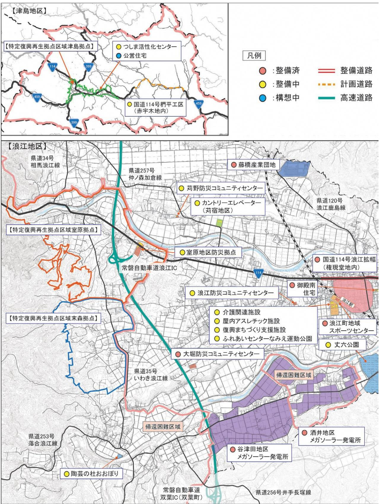
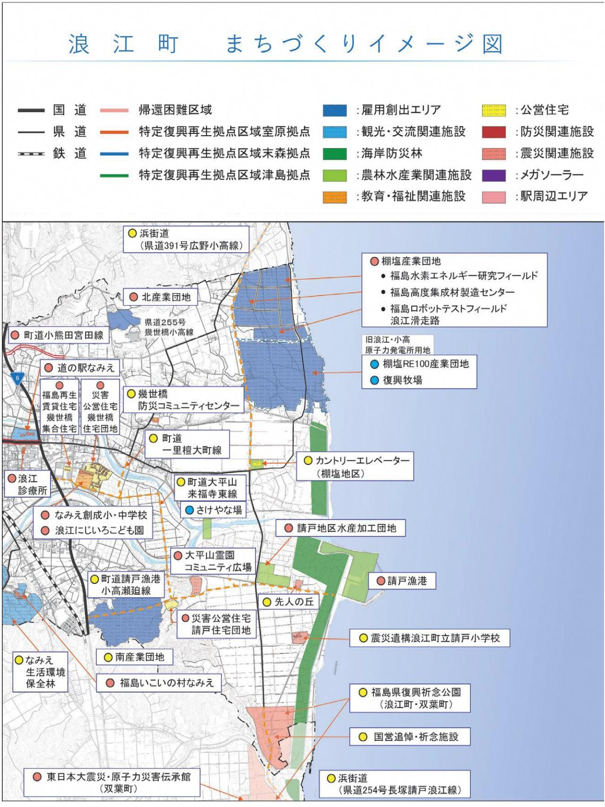
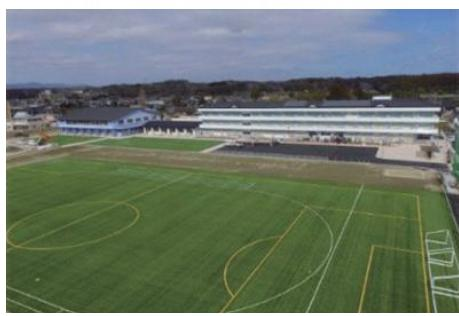
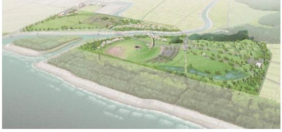

|  | 目次                |                                                        |  |  |  |
|--|--------------------|--------------------------------------------------------|--|--|--|
|  |                    |                                                        |  |  |  |
|  |                    | はじめに………………………………………………………………… 1                     |  |  |  |
|  | 第 1             | 章計画の策定にあたって………………………………… 1                         |  |  |  |
|  | 第 2             | 章復興の理念……………………………………………… 2                         |  |  |  |
|  | 第 3             | 章復興の基本方針………………………………………… 3                         |  |  |  |
|  |                    | Ⅰ 夢と希望のある産業と仕事づくり… …………………………… 8                 |  |  |  |
|  | 施策 1            | 農林水産業の再興……………………………………… 8                           |  |  |  |
|  | 施策 2            | 新たな産業と雇用の創出……………………………… 9                           |  |  |  |
|  |                    | Ⅱ 未来を担う人づくり… ……………………………………………10                    |  |  |  |
|  | 施策 1            | 子育て環境・学校教育の充実…………………………10                              |  |  |  |
|  | 施策 2            | 生涯学習環境の充実……………………………………11                              |  |  |  |
|  | 施策 3            | 震災の記憶の伝承………………………………………11                              |  |  |  |
|  |                    |                                                        |  |  |  |
|  |                    |                                                        |  |  |  |
|  |                    | Ⅲ 帰還困難区域の再生と住みよい環境づくり… …………………12                    |  |  |  |
|  | 施策 1            | 帰還困難区域の再生……………………………………12                              |  |  |  |
|  | 施策 2            | 社会基盤の維持・整備…………………………………12                              |  |  |  |
|  | 施策 3            | 防災・安全の強化………………………………………13                              |  |  |  |
|  | 施策 4            | ゼロカーボンシティの推進……………………………13                              |  |  |  |
|  |                    | Ⅳ 健康と福祉のまちづくり… ………………………………………14                    |  |  |  |
|  |                    |                                                        |  |  |  |
|  | 施策 1            | 健康づくりの推進・医療の充実………………………14                              |  |  |  |
|  | 施策 2 施策 3 | 介護・福祉の充実………………………………………15 放射線による健康不安への対策………………………15 |  |  |  |
|  |                    | Ⅴ 絆の維持と持続可能なまちづくり… ……………………………16                    |  |  |  |
|  |                    |                                                        |  |  |  |
|  | 施策 1            | 被災者生活支援・絆の維持……………………………16                              |  |  |  |
|  | 施策 2 施策 3 | 移住・定住の推進………………………………………17 地域コミュニティ活動の推進…………………………17 |  |  |  |

# **第1章計画の策定にあたって**

# **1 計画策定の目的**

浪江町復興計画【第三次】(以下「復興計画【第三次】」という。)は、平成23年 3 月11日に発生した国内観測史上最大規模の巨大地震とそれに伴う津波、更には東京電力ホールディングス株式会社(以下「東京電力」という。)の原子力発電所事故(以下「原発事故」という。)の被害という未曽有の複合災害により、甚大な被害を受けた本町が復旧・復興を実現していくための道標とするものです。

東日本大震災(以下「震災」という。)から10年の節目を迎えた今、町をとりまく状況は大きく変化してきていることから、これまでの復興の進捗や行政の取組を検証し、将来にわたって安心して豊かな生活を送れる「持続可能なまちづくり」が必要です。

これらの基本的な認識のもと、中長期的な視点に立って、総合的かつ計画的に復興を実現するため、復興計画【第三次】を策定します。

# **2 計画の構成と期間**

### (1)計画の構成

本計画は、町の最上位計画であり、基本構想及び計画で構成されます。

ア基本構想

基本構想は、「復興の理念」と、これを達成するための「復興の基本方針」を定めるものです。

- イ基本計画
基本計画は、基本構想を実現するための施策を定めるものです。

### (2)計画の期間

基本構想の期間は、令和 3 年度から令和12年度までの10年間とします。基本計画は社会情勢の変化に柔軟に対応するため、計画期間を前期と後期に区分し、それぞれ 5 年間とします。

# **3 将来人口の目標**

平成28年 3 月に町が策定した、「まち・ひと・しごと創生浪江町人口ビジョン」において、令和17年に約8,000人程度の目標人口を掲げています。

**夢と希望があふれ住んでいたいまち住んでみたいまち ~なかよくみんなえがおの花咲くまちなみえ~**

みんなの想いを一つに、復興を実現するまち

先人から受け継いできた "ふるさと" なみえを再生します。そして、震災から得た教訓をまちづくりに活かし、町民の想いに応える復興を実現します。 花言葉:想いを託します

紅房桜

ひとの縁を大切に、関わる人が増え、調和するまち

帰還されている町民、これから帰還する町民、すぐには帰還できない町民、新たに転入された町民、町で仕事をする方、町を訪れる方など、町に関わる全ての方を大切に、町に関わる方が増え、調和するまちづくりを進めます。 花言葉:調和

コスモス

先進的な取組で、夢と希望の未来を創るまち

震災で町は多くの課題を抱えています。町は新たな技術による課題解決の舞台となり、日本が直面する社会課題を解決するモデルとなる先進的な取組に積極的に挑戦します。 花言葉:希望

トルコギキョウ

### **Ⅰ 夢と希望のある産業と仕事づくり**

先人から受け継いできた農山漁村の風景を再生するとともに、生産者が自信と誇りをもって働ける環境づくりにより、農林水産業が盛んなまちを目指します。

福島イノベーション・コースト構想(以下「イノベ構想」という。)と連携しながら、新たな産業と雇用の創出を図るとともに、商工業の振興や観光交流の推進を図り、活気とにぎわいのあるまちを目指します。

### **Ⅱ 未来を担う人づくり**

出産・子育て支援の充実や、豊かな学びの環境づくりにより、子どもたちの明るい笑顔のあふれるまちを目指します。

芸術や文化に触れあえる機会の創出や、スポーツに親しめる環境づくりにより、生きがいを持って暮らせるまちを目指します。

被災の記憶と教訓を次の世代や世界に向けて発信し、復興を通じた交流が盛んなまちを目指します。

### **Ⅲ 帰還困難区域の再生と住みよい環境づくり**

帰還困難区域全域の避難指示解除に向けて、全ての町民が生活できる環境の再生を目指します。

上下水道や道路などのインフラ整備を推進するとともに、まちの顔である浪江駅周辺を核とした中心市街地整備を推進し、快適で利便性の高いまちを目指します。

震災から得た教訓を生かした防災体制の強化や、警察署や消防署等の関係機関との連携を推進し、安全に暮らせるまちを目指します。

再生可能エネルギーや水素などの新エネルギーの導入や、効率よくエネルギーや資源を活用する取組を推進することにより、原子力に依存せず二酸化炭素の排出量実質ゼロの環境にやさしいまちを目指します。

# **Ⅳ 健康と福祉のまちづくり**

総合的な保健サービスの提供や、地域医療体制の充実に努めることにより、心身ともに健康で元気なまちを目指します。

介護・福祉サービスの充実に努めることにより、高齢者や障がいのある人を含め、全ての町民がふれあい、支えあい、地域社会の中で安心して活動できる、思いやりのあふれるまちを目指します。

放射線による健康上の不安解消に努めることにより、安心して暮らせるまちを目指します。

### **Ⅴ 絆の維持と持続可能なまちづくり**

生活再建の支援の継続や、まちとの絆づくり、復興の様子等の情報発信に努めることにより、町民との絆を大切にするまちを目指します。

本町への興味関心からはじまり、交流や体験を通して、移住・定住の取組を推進し、町内の居住人口が増加していくまち、住んでみたいまちを目指します。

行政区等コミュニティ団体の活動の活性化を図るとともに、行政と町民が協働でまちづくりを推進し、町民が主役となるまちを目指します。

効率的な行政運営と財源の確保に取り組むことにより、本計画を着実に前進させ、将来にわたり持続可能なまちを目指します。

はじめにはじめに

### <施策体系>

| 復興の 基本方針                                                                                      | 施策 |                    | 取組                                                             |
|--------------------------------------------------------------------------------------------------|-----|--------------------|-----------------------------------------------------------------|
| Ⅰ 産 夢 業 と と 希 仕 望 事 の づ あ く る り                     |     | 施策1 農林水産業の再興       | (1)農業の再開 (2)林業の再開・漁業の再開 (3)魅力ある地場産品づくりと販売力強化 (4)鳥獣被害対策 |
|                                                                                                  |     | 施策2 新たな産業と雇用の創出    | (1)商工業の振興 (2)企業誘致の推進 (3)就労支援 (4)観光・交流の推進               |
| Ⅱ 人 未 づ 来 く を り 担 う                                                   |     | 施策1 子育て環境・学校教育の充実  | (1)子育て環境の充実 (2)学校教育の充実                                       |
|                                                                                                  |     | 施策2 生涯学習環境の充実      | (1)生涯学習環境の充実 (2)文化財保護・伝統芸能の継承                                |
|                                                                                                  |     | 施策3 震災の記憶の伝承       | (1)震災の記憶の伝承                                                     |
| Ⅲ 住 帰 み 還 よ 困 い 難 環 区 境 域 づ の く 再 り 生 と |     | 施策1 帰還困難区域の再生      | (1)帰還困難区域の再生                                                    |
|                                                                                                  |     | 施策2 社会基盤の維持・整備     | (1)浪江駅周辺を核とした中心市街地整備 (2)上下水道の整備 (3)交通網の充実                 |
|                                                                                                  |     | 施策3 防災・安全の強化       | (1)防災・安全の強化 (2)防犯・防火・交通安全の強化                                 |
|                                                                                                  |     | 施策4 ゼロカーボンシティの推進   | (1)ゼロカーボンシティの推進                                                 |
| Ⅳ ま 健 ち 康 づ と く 福 り 祉 の                                         |     | 施策1 健康づくりの推進・医療の充実 | (1)健康づくりの推進・医療の充実                                               |
|                                                                                                  |     | 施策2 介護・福祉の充実       | (1)介護・福祉の充実                                                     |
|                                                                                                  |     | 施策3 放射線による健康不安への対策 | (1)放射線による健康不安への対策 (2)除染の推進と安全対策                              |
| Ⅴ ま 絆 ち の づ 維 く 持 り と 持 続 可 能 な                     |     | 施策1 被災者生活支援・絆の維持   | (1)被災者生活支援 (2)絆の維持 (3)損害賠償対策の推進                           |
|                                                                                                  |     | 施策2 移住・定住の推進       | (1)移住・定住の推進                                                     |
|                                                                                                  |     | 施策3 地域コミュニティ活動の推進  | (1)地域コミュニティ活動の推進                                                |
|                                                                                                  |     | 施策4 復興を推進させる行財政運営  | (1)復興を推進させる行財政運営                                                |

はじめにはじめに

### はじめにはじめに

令和 3 年 3 月末時点

### 施策1 農林水産業の再興

先人から受け継いできた農山漁村の風景を再生するとともに、生産者が自信と誇りをもって働ける環境づくりにより、農林水産業が盛んなまちを目指します。

町内全域の農地を再生し、農業の再開を推進します

#### ア農業の担い手の確保

- 〇 新規就農の推進、農業法人の誘致など
### イ営農再開の推進

- 〇 農地等を貸したい農家から担い手への農地集積を推進など
#### ウ農業生産基盤の再生と強化

- 〇 カントリーエレベーター等の共同利用施設整備など
#### エ農業を再開できる環境の再生

- 〇 ため池の放射性物質対策や農業用水路等の復旧など
### 魅力ある地場産品づくりと販売力強化鳥獣被害対策

地場産品の魅力の発信と販売力の強化に取り組みます

- ア町内産農林水産物の安全性の情報発信 〇 地場産品に触れる機会の創出による風評被害払拭など
- イ地場産品の付加価値向上と販路の拡大
	- 〇 特産品の開発支援や農林水産物の六次化の支援など

#### 農業の再開林業の再開・漁業の再開

町の豊かな海、山、川を再生し、漁業・林業の再開を推進します

#### ア林業の再開

- 〇 「里山再生事業」や「ふくしま森林再生事業」の継続など
#### イ漁業の再開

- 〇 放射性物質に関するモニタリング調査の継続
- 〇 やな場・ふ化場の整備など

請戸漁港

イノシシ等からの鳥獣被害の対策に取り組みます

- ア農業被害防止対策の推進
	- 〇 浪江町有害鳥獣捕獲隊による個体数調整など

#### イ住宅被害防止対策の推進

- 〇 住宅の鳥獣被害防止柵の設置等の支援など
#### ウ生息環境管理の実施

- 〇 河川の竹林の伐採など
### 施策2 新たな産業と雇用の創出

福島イノベーション・コースト構想と連携しながら、新たな産業と雇用の創出を図るとともに、商工業の振興や観光交流の推進を図り、活気とにぎわいのあるまちを目指します。

### 商工業の振興

町内での事業再開・創業を支援し、町の商工業の振興に取り組みます

- ア町内での事業再開・新規開業・継続経営への支援
	- 〇 事業者に寄り添った相談体制の強化
	- 〇 チャレンジショップの整備など

### 企業誘致の推進

新たな産業の誘致を推進します

- ア町内での企業や大学の研究活動の推進
	- 〇 福島イノベーション・コースト構想の実現に向けた研究開発・実用化などの取組の推進など

### イ企業誘致活動の強化

- 〇 福島水素エネルギー研究フィールドや福島ロボットテストフィールド浪江滑走路等が立地する魅力ある研究・実証環境を発信し積極的な企業誘致の実施など

棚塩産業団地

### 就労支援

町内事業所の従業員の確保や、町内就労希望者への支援に取り組みます

### ア就労支援の充実

- 〇 関係機関と連携した就労支援の拡充
- 〇 地域おこし協力隊制度の活用など

### 観光・交流の推進

町のにぎわいを創出する様々なイベントの開催や町の魅力、復興の様子等の情報発信に取り組み、関係交流人口の拡大を推進します

- ア観光・交流イベントの充実
	- 〇 多様なイベントの開催・伝統行事等の再生の推進など
- イ周遊観光の推進及び誘致宣伝の強化
	- 〇 町の魅力をPRする動画・パンフレット等コンテンツの充実など

### ウ広域連携による観光・交流の推進

- 〇 周辺自治体や福島イノベーション・コースト構想推進機構等と連携し、魅力ある視察・観光の広域周遊ルートの創設など
### エ丈六地区周辺の環境整備

- 〇 丈六公園の整備など
### 施策1 子育て環境・学校教育の充実

出産・子育て支援の充実や、豊かな学びの環境づくりにより、子どもたちの明るい笑顔のあふれるまちを目指します。

### 子育て環境の充実

子育て環境の充実により、子育てしやすいまちづくりに取り組みます

- ア生み育てる環境の支援
	- 〇 なみえ子ども応援センターの設置など
- イ子どもと家族の健康支援
	- 〇 医療機関等と連携した相談支援体制の構築など
- ウ保育・子育て環境の充実
	- 〇 保育施設整備等の検討
	- 〇 屋内アスレチック施設の整備など
- エ経済的支援の継続
	- 〇 子ども医療費助成等の経済的支援など

屋内アスレチック施設完成イメージ

浪江にじいろこども園子育て支援教室

#### 学校教育の充実

#### 学校教育の充実により、未来を担う人材の育成に取り組みます

#### ア学習環境の充実

- 〇 地域ぐるみの学びの創出
- 〇 外国語指導助手配置による英語学習
- 〇 ICT等を活用した学習環境の充実など

#### イ安心して学習できる環境整備

- 〇 スクールカウンセラー・スクールソーシャルワーカーの配置の継続
- 〇 防災教育等の学びの場の提供など
- ウ経済的支援の継続
	- 〇 就学援助等各種助成制度による支援など

なみえ創成小・中学校

## 施策2 生涯学習環境の充実

芸術や文化に触れあえる機会の創出や、スポーツに親しめる環境づくりにより、生きがいを持って暮らせるまちを目指します。

### 生涯学習環境の充実

生涯学習に取り組める環境の充実により、町民の健康づくりと生きがいづくりを推進します

- アスポーツによる体力の向上や健康づくりの推進
	- 〇 ふれあいセンターなみえ運動公園の復旧
	- 〇 地域スポーツセンターの利活用など
- イ生涯学習を通じた生きがいづくりの推進
	- 〇 復興まちづくり支援施設の整備
	- 〇 芸能祭など各種活動への支援など

### 文化財保護・伝統芸能の継承

文化財保護・伝統芸能の継承支援により、町の豊かな文化の継承に取り組みます

### ア文化財の保護

- 〇 文化財の収蔵環境の整備
- 〇 文化財の修繕・保全など

### イ伝統芸能の継承

- 〇 伝承用記録映像作成の支援
- 〇 保存団体への活動費用の助成など

### 施策3 震災の記憶の伝承

被災の記憶と教訓を次の世代や世界に向けて発信し、復興を通じた交流が盛んなまちを目指します。

### 震災の記憶の伝承

### 震災の記憶の伝承に取り組みます

- ア震災の記憶を保存する施設整備
	- 〇 先人の丘の整備
	- 〇 震災の記憶を伝える物品・資料等の保存など

### イ震災の記憶を伝承する取組の推進

- 〇 震災遺構浪江町立請戸小学校での伝承活動
- 〇 「東日本大震災・原子力災害伝承館」 や「福島県復興祈念公園」等と連携した効果的な震災伝承など

震災遺構浪江町立請戸小学校完成イメージ

福島県復興祈念公園完成イメージ

### 施策2 社会基盤の維持・整備

上下水道や道路などのインフラ整備を推進するとともに、まちの顔である浪江駅周辺を核とした中心市街地整備を推進し、快適で利便性の高いまちを目指します。

### 浪江駅周辺を核とした中心市街地整備交通網の充実

浪江駅周辺を核とした復興を加速化させる中心市街地機能の整備に取り組みます

## ア浪江駅周辺を核とした中心市街地整備

- 〇 駅東西自由通路、店舗、オフィス、住宅等様々な機能の集積など
### 上下水道の整備

12

### 町民が安全で安定した水を使えるように取り組みます

- ア上水道の整備イ下水道の整備
町内の道路整備や公共交通の充実により、便利で機能的なまちづくりに取り組みます

### ア交通網の整備

- 〇 産業団地、住宅団地等を結ぶ新規路線の整備
- 〇 主要幹線道路の改良工事の早期実現に向けた要望など
- イ公共交通の充実
	- 〇 デマンドタクシーの運行
	- 〇 新たなモビリティーサービスの実証など

### 施策3 防災・安全の強化

震災から得た教訓を生かした防災体制の強化や、警察署や消防署等の関係機関との連携を推進し、安全に暮らせるまちを目指します。

防災・安全の強化

震災の教訓を生かした防災・安全のまちづくりに取り組みます

### ア防災対策の推進

- 〇 町民参加の防災訓練・教育の実施など
- イ防災情報を迅速に伝える体制の整備
	- 〇 廃炉作業の進捗状況等の定期報告や通報基準に基づく連絡体制の維持など
- ウ防災・減災施設等の整備推進
	- 〇 防災コミュニティセンターの整備など
- エ自主防災組織の設置促進と活動支援
	- 〇 官民協働による自主防災組織の育成など

### 防犯・防火・交通安全の強化

犯罪や火災、交通事故の少ない、安心して暮らせるまちづくりに取り組みます

- ア防火体制の強化
- 〇 消防団による防火パトロールの実施など
- イ防犯体制・対策の強化
	- 〇 防犯パトロールの実施
	- 〇 防犯カメラによる防犯対策など

#### ウ交通安全の強化

- 〇 警察署や交通安全協会等と連携した路上啓発活動の実施など

### 施策4 ゼロカーボンシティの推進

再生可能エネルギーや水素などの新エネルギーの導入や、効率よくエネルギーや資源を活用する取組を推進することにより、原子力に依存せず二酸化炭素の排出量実質ゼロの環境にやさしいまちを目指します。

ゼロカーボンシティの推進

ゼロカーボンシティの実現に向けて、再生可能エネルギーの地産地消や水素の利用等を推進します

- ア再生可能エネルギーや水素エネルギーの導入の推進
	- 〇 再生可能エネルギーの民間導入の支援
	- 〇 水素社会実現の先駆けとなるまちづくりの推進など
- イエネルギーの地産地消の取組の情報発信
	- 〇 公共施設でのエネルギーの見える化等の情報発信など
- ウゼロカーボンシティ実現に向けた計画の策定
- 〇 ゼロカーボンシティに向けた計画を策定し、町全体としての体制構築による推進など
- エ廃棄物の削減・リサイクルの推進
	- 〇 3R(発生抑制・再使用・再生利用)運動の実施など

### 施策1 健康づくりの推進・医療の充実

総合的な保健サービスの提供や、地域医療体制の充実に努めることにより、心身ともに健康で元気なまちを目指します。

### 健康づくりの推進・医療の充実

町民の健康づくりの推進と町内の医療の充実に取り組みます

- ア生活習慣病の発症及び重症化予防
	- 〇 特定保健指導や重症化予防のための訪問指導の強化
	- 〇 県民健康調査(健康診査)の継続実施など
- イ健康づくりの支援
	- 〇 健康づくりリーダーの育成等による自立的健康づくりへの支援など
- ウメンタルヘルスケアの実施
	- 〇 心のケアセンターなど関係機関と連携したメンタルヘルスケア、ゲートキーパーの養成講座等の実施など
- エ感染症の予防・対策 〇 予防接種等の感染症予防対策の実施など

### オ町内の医療体制の確保

- 〇 相双地域の医療機関や介護事業所と連携し、在宅医療と介護を一体的に提供できる体制構築を推進など

浪江診療所ダンベル体操

### 施策2 介護・福祉の充実

介護・福祉サービスの充実に努めることにより、高齢者や障がいのある人を含め、全ての町民がふれあい、支えあい、地域社会の中で安心して活動できる、思いやりのあふれるまちを目指します。

### 介護・福祉の充実

高齢者等が安心して生活できるよう、介護、生活支援など切れ目のない福祉サービスの充実に取り組みます

- ア町内の介護福祉サービス及び介護予防支援の充実
	- 〇 介護関連施設の整備
	- 〇 「地域共生社会」の実現に向け、地域での包括的な支援体制の構築など
- イ広域連携による障害福祉サービスの充実
	- 〇 広域連携による障がい福祉に関する相談支援窓口の設置
	- 〇 県や周辺自治体と連携した双葉圏域での地域生活支援拠点等整備の推進など
- ウ高齢者等の孤立防止、見守りの強化
	- 〇 高齢者の生活の変化による不安や不活発等の軽減のため、避難先自治体等と連携した支援の実施
	- 〇 交流サロンの立ち上げ支援など

### 施策3 放射線による健康不安への対策

放射線による健康上の不安解消に努めることにより、安心して暮らせるまちを目指します。

### 放射線による健康不安への対策除染の推進と安全対策

放射線による健康への影響等の不安解消に取り組みます

- ア放射線の健康への影響に関する検査体制の充実
	- 〇 内部被ばく検査の実施など
- イ放射線の影響を自分で計測できる環境づくり
	- 〇 空間線量計・個人線量計の貸出しなど
- ウ放射線に関する学習会の開催や相談体制の整備
	- 〇 大学や専門機関と連携した相談会・講習会の開催など

- 町民の除染に対する不安解消に取り組みます
	- ア国と連携し除染や対象区域内廃棄物処理の推進
		- 〇 仮設焼却施設(減容化施設)の監視など
	- イ町民の除染の不安に寄り添ったフォローアップの実施
		- 〇 除染検証委員会による除染の検証など

### 施策1 被災者生活支援・絆の維持

生活再建の支援の継続や、まちとの絆づくり、復興の様子等の情報発信に努めることにより、町民との絆を大切にするまちを目指します。

### 被災者生活支援

居住地にとらわれない行政サービスの提供や、町の生活支援制度に関する情報発信等に取り組みます

### ア避難先での行政サービスの提供

- 〇 避難先自治体との協力体制の継続
- 〇 避難先での出張所の設置など

#### 絆の維持

町民と町民・ふるさとをつなぐ絆の維持に取り組みます

- ア避難先での絆の維持への支援
	- 〇 復興支援員による避難先で絆を維持するコミュニティ活動の支援など

### イ復興の見える化の推進

- 〇 町内の状況や町民の生の声の情報発信など

浪江のこころ通信

#### 損害賠償対策の推進

全ての町民の暮らしの再建に向けて、適切な賠償を受けられるよう、賠償支援の継続に取り組みます

### ア賠償支援の実施

- 〇 相談会の開催
- 〇 HP等による賠償に関する情報発信など

### 施策2 移住・定住の推進

本町への興味関心からはじまり交流や体験を通して、移住・定住の取組を推進し、町内の居住人口が増加していくまち、住んでみたいまちを目指します。

### 移住・定住の推進

町民の帰還支援と、町への移住・定住を推進させる支援に取り組みます

- ア町への帰還支援
	- 〇 個人住宅の再建等の支援など
- ウ移住促進の情報発信・入口支援進など
	- 〇 移住・定住の総合相談窓口の強化
	- 〇 お試し住宅、お試し就労の実施など
- イ空き家対策の促進
- 〇 空き家等対策計画を策定し、空き家の適切な管理と流通・利活用の促
- エ移住者の定住促進支援
	- 〇 住宅取得に係る補助など

### 施策3 地域コミュニティ活動の推進

行政区等コミュニティ団体の活動の活性化を図るとともに、行政と町民が協働でまちづくりを推進し、町民が主役となるまちを目指します。

### 地域コミュニティ活動の推進

### 地域でのコミュニティ活動を支援します

ア行政区活動への支援

- 〇 コミュニティ活動や行政区の集会所整備等に対する補助など
- イ町内でのコミュニティ活動への支援
	- 〇 地域づくり専門員の配置による町内自治活動の活性化や地域課題解決への支援など

### 施策4 復興を推進させる行財政運営

効率的な行政運営と財源の確保に取り組むことにより、本計画を着実に前進させ、将来にわたり持続可能なまちを目指します。

### 復興を推進させる行財政運営

### 復興を支える人材や財源の確保に取り組みます

- ア効率的な行財政運営
	- 〇 適切な人員確保と組織の見直し
	- 〇 公共施設の統廃合や維持管理の負担軽減の取組の推進など
- イ復興を完遂させるための財源の確保
	- 〇 国・県等の財源の確保
	- 〇 ふるさと納税制度の活用促進など

浪江町復興計画【第三次】概要版 (令和3年度~令和12年度)