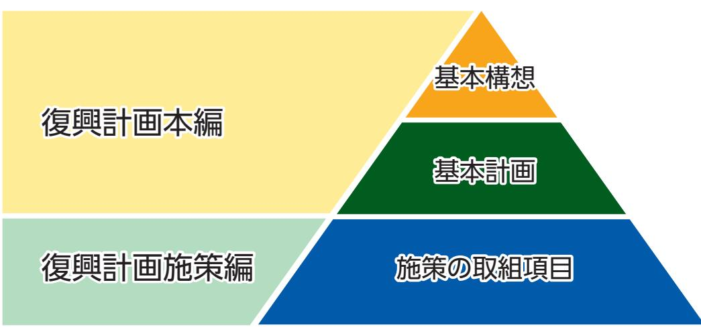
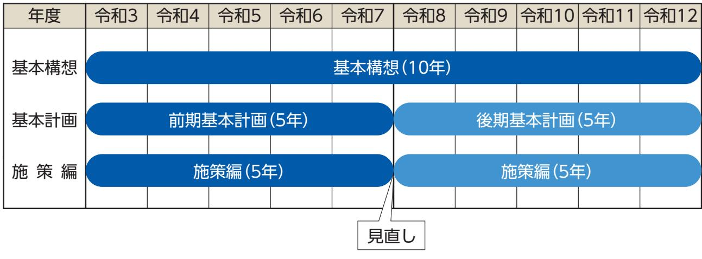
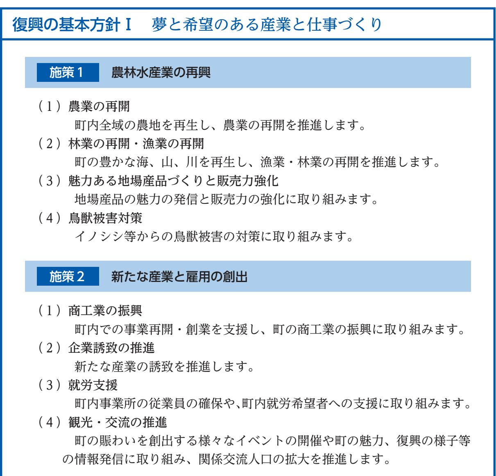
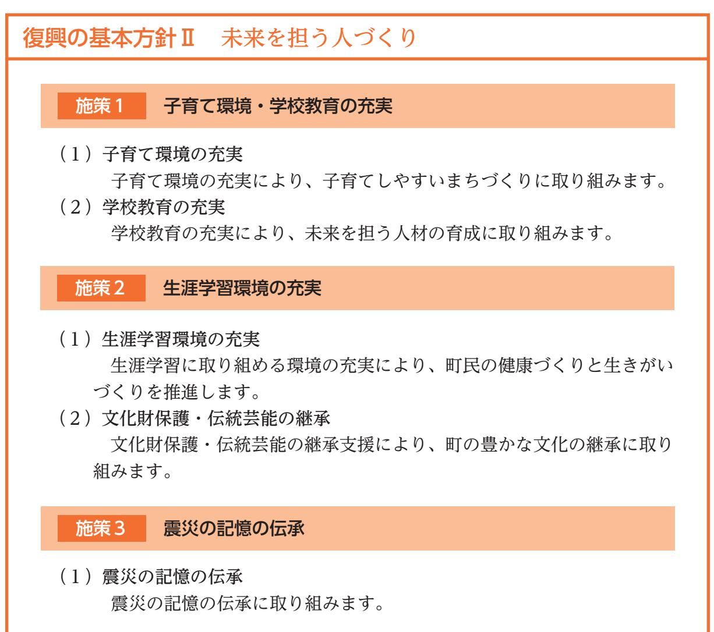
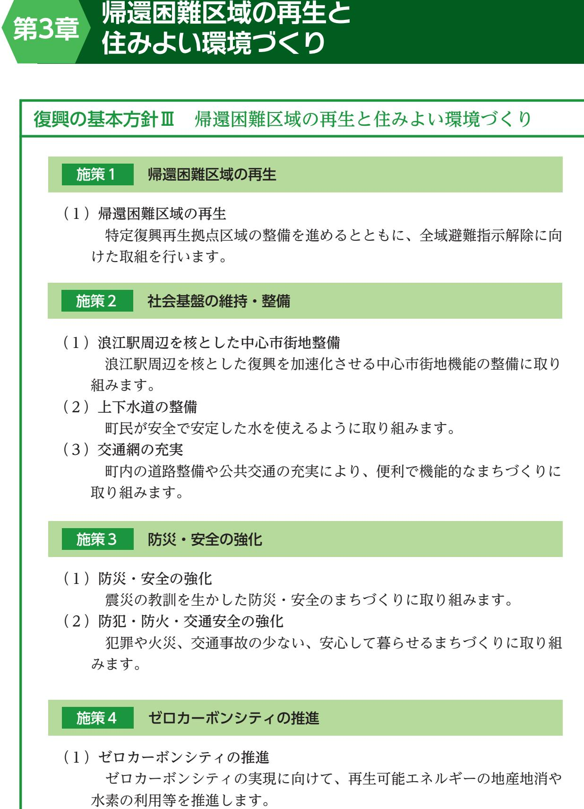
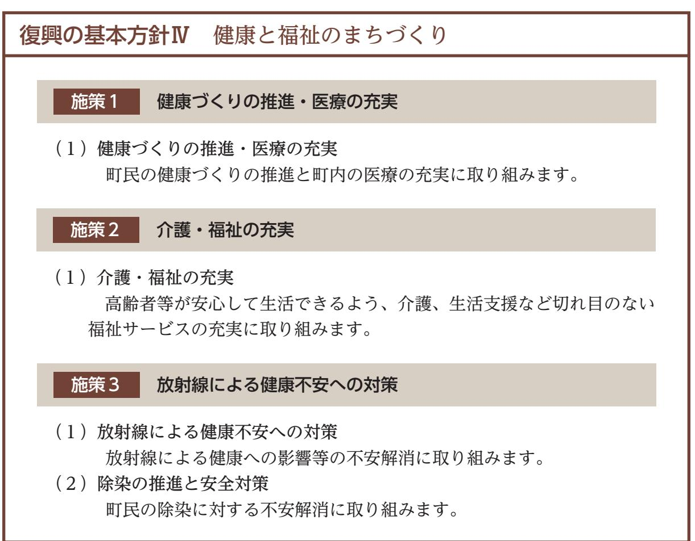
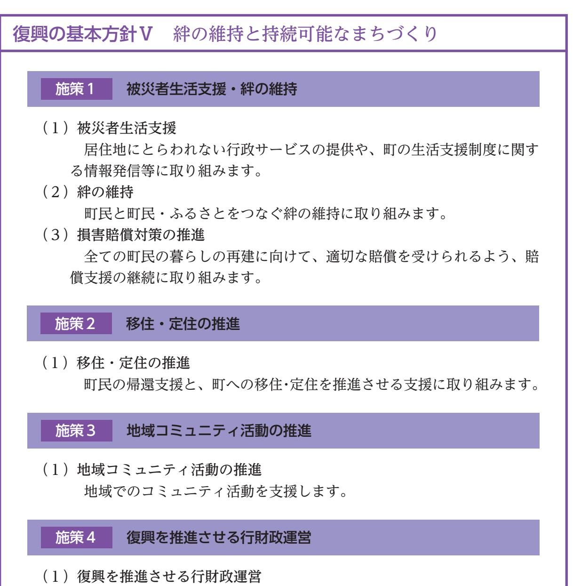

# **浪江町復興計画【第三次】**

夢と希望があふれ住んでいたいまち住んでみたいまち

令和 3 年 3 月浪江町

# 目次

| 序章施策編の策定について………………………………………… | 1 |
|-------------------------------|---|
|-------------------------------|---|

# **第 1 章夢と希望のある産業と仕事づくり**………………………… 3

- 施策 1 農林水産業の再興……………………………………… 4 施策 2 新たな産業と雇用の創出………………………………11
# **第 2 章未来を担う人づくり**……………………………………17

- 施策 1 子育て環境・学校教育の充実…………………………18
- 施策 2 生涯学習環境の充実……………………………………22
- 施策 3 震災の記憶の伝承………………………………………25

# **第 3 章帰還困難区域の再生と住みよい環境づくり**………………27

- 施策 1 帰還困難区域の再生……………………………………28
- 施策 2 社会基盤の維持・整備…………………………………30 施策 3 防災・安全の強化………………………………………35
- 施策 4 ゼロカーボンシティの推進……………………………38

# **第 4 章健康と福祉のまちづくり**……………………………………41

- 施策 1 健康づくりの推進・医療の充実………………………42 施策 2 介護・福祉の充実………………………………………44
- 施策 3 放射線による健康不安への対策………………………46

# **第 5 章絆の維持と持続可能なまちづくり**…………………………49

- 施策 1 被災者生活支援・絆の維持……………………………50
- 施策 2 移住・定住の推進………………………………………54 施策 3 地域コミュニティ活動の推進…………………………56
- 施策 4 復興を推進させる行財政運営…………………………58

# (1)策定の趣旨

施策編は、浪江町復興計画【第三次】の基本計画で定める「目指す姿と取組」の実現に向けて、各施策における取組項目の内容と工程を定めるものです。

# (2)計画の期間

浪江町復興計画【第三次】基本構想の計画期間は令和 3 年度から令和12年度までの 10年間とし、基本計画は社会情勢の変化に柔軟に対応するため、計画期間を前期と後期に区分し、それぞれ 5 年間とします。施策編は、基本計画の計画期間に合わせ、令和 3 年度から令和 7 年度の 5 年間とします。

# **第1章夢と希望のある産業と仕事づくり**

# **施策1 農林水産業の再興**

### (1)農業の再開

◆町内全域の農地を再生し、農業の再開を推進します

### ≪施策の成果目標≫

| 成果指標名                      | 現在値 (現在値の時点)    | 目標値 (令和7年度) |  |  |
|----------------------------|--------------------|----------------|--|--|
| 水 稲 作 付 面 積 | 90ha (令和2年9月末)  | 703ha          |  |  |
| 販 売 農 家 戸 数 | 44経営体 (令和2年9月末) | 89経営体          |  |  |
| 農業法人従業員数                   | 10人 (令和2年9月末)   | 25人            |  |  |

#### ≪これからの取組≫

#### ア農業の担い手の確保

- (ア)担い手の確保と育成
- (イ)担い手へ農地集積の支援
- (ウ)スマート農業の実用化に向けた実証の推進

#### イ営農再開の推進

- (ア)町内の営農再開が完了するまでの各支援制度の継続
- (イ)営農再開の推進
- (ウ)農業・農村の有する多面的機能の維持
- (エ)耕作放棄地発生防止の強化
- (オ)復興牧場の整備の推進

#### ウ農業生産基盤の再生と強化

- (ア)共同利用施設の整備
- (イ)県や請戸川土地改良区と連携したほ場整備の推進

#### エ農業を再開できる環境の再生

- (ア)農業用水の安全の確保
- (イ)農業用ため池の防災・減災の推進
- (ウ)農地や農業用施設の災害復旧の推進

### (2)林業の再開・漁業の再開

◆町の豊かな海、山、川を再生し、漁業・林業の再開を推進します

#### ≪施策の成果目標≫

| 成果指標名                           | 現在値 (現在値の時点)  | 目標値 (令和7年度) |  |  |
|---------------------------------|------------------|----------------|--|--|
| ふくしま森林再生事業 による森林整備面積         | 0ha (令和元年度)   | 215ha          |  |  |
| 請 戸 漁 港 漁 船 数 | 29隻 (令和2年9月末) | 32隻            |  |  |

#### ≪これからの取組≫

#### ア林業の再開

- (ア)里山の再生の推進
- (イ)県と連携し海岸防災林の整備の推進
- (ウ)福島高度集成材製造センターの施設機能強化の検討
- (エ)福島高度集成材製造センターと連携した森林施業の検討

#### イ漁業の再開

- (ア)国等と連携し海洋及び河川の放射性物質のモニタリング等の継続
- (イ)さけ漁再開のための施設整備の推進
- (ウ)水産品の安全安心及び販路拡大等の広報活動の強化

# (3)魅力ある地場産品づくりと販売力強化

◆地場産品の魅力の発信と販売力の強化に取り組みます

≪施策の成果目標≫

| 成果指標名                      | 現在値 (現在値の時点) | 目標値 (令和7年度) |  |  |
|----------------------------|-----------------|----------------|--|--|
| 道 の 駅 販 売 額 | ―               | 4億円/年          |  |  |

#### ≪これからの取組≫

ア町内産農林水産物の安全性の情報発信

- (ア)県等と連携した放射性物質の検査結果の情報発信
- (イ)就農体験等を通じた農業の魅力発信

#### イ地場産品の付加価値向上と販路の拡大

- (ア)地元産の食材や素材を使った商品開発の推進
- (イ)町の地場産品の魅力の情報発信の強化
- (ウ)町のブランド・イメージの回復への支援
- (エ)六次化を推進するための施設整備の検討

# (4)鳥獣被害対策

◆イノシシ等からの鳥獣被害の対策に取り組みます

# ≪施策の成果目標≫

| 成果指標名     | 現在値 (現在値の時点)   | 目標値 (令和7年度) |  |  |
|-----------|-------------------|----------------|--|--|
| 有害鳥獣捕獲依頼数 | 100件/年 (令和元年度) | 10件/年          |  |  |

#### ≪これからの取組≫

#### ア農業被害防止対策の推進

- (ア)広域連携による鳥獣被害対策の強化
- (イ)浪江町有害鳥獣捕獲隊による捕獲の実施
- (ウ)農地用鳥獣被害防止柵設置等への支援
- (エ)有害鳥獣捕獲体制の充実

#### イ住宅被害防止対策の推進

- (ア)住宅用鳥獣被害防止柵設置等への支援
#### ウ生息環境管理の実施

- (ア)被害防除のためのモニタリング調査
- (イ)鳥獣の隠れ家となる河川敷の竹林の伐採
- (ウ)鳥獣の餌となる管理されていない果樹の伐採

|                                                            | 取組項目           |  | R3                              | R4                                                                                                                                   | R5                                                                                                                                                                                                                                                                                          | R6    | R7                              | 担当課 |          |
|------------------------------------------------------------|----------------|--|---------------------------------|--------------------------------------------------------------------------------------------------------------------------------------|---------------------------------------------------------------------------------------------------------------------------------------------------------------------------------------------------------------------------------------------------------------------------------------------|-------|---------------------------------|-----|----------|
|                                                            | (1)農業の再開      |  |                                 |                                                                                                                                      |                                                                                                                                                                                                                                                                                             |       |                                 |     |          |
|                                                            | 農業の担い手の確保 ア |  |                                 |                                                                                                                                      |                                                                                                                                                                                                                                                                                             |       |                                 |     |          |
|                                                            |                |  | (ア)担い手の確保と育成                    | 県と連携し営農再開に必要な機械や施設の導入を支援 認定農業者制度の普及・啓発を実施 町独自の新規就農支援を実施 町独自の進出支援を実施 法人化に関する情報発信や関係機関と連携した伴走支援を実施 関係機関と連携し担い手への農地集積を推進 |                                                                                                                                                                                                                                                                                             |       | 農林水産課                           |     |          |
|                                                            |                |  | (イ)担い手へ農地集積の支援                  |                                                                                                                                      |                                                                                                                                                                                                                                                                                             |       | 農林水産課                           |     |          |
|                                                            |                |  | (ウ)スマート農業の実用化に 向けた実証の推進      |                                                                                                                                      | 研究機関と連携し実証・普及を推進                                                                                                                                                                                                                                                                            |       |                                 |     | 農林水産課    |
|                                                            | 営農再開の推進 イ   |  |                                 |                                                                                                                                      |                                                                                                                                                                                                                                                                                             |       |                                 |     |          |
|                                                            |                |  | (ア)町内の営農再開が完了する までの各種支援制度の継続 |                                                                                                                                      | 福島県営農再開支援事業等の支援制度を継続                                                                                                                                                                                                                                                                        |       |                                 |     | 農林水産課    |
|                                                            |                |  | (イ)営農再開の推進                      |                                                                                                                                      | 復興組合の事業実施に係る事務を支援 除染後農地の保全管理を支援 放射性物質の吸収抑制対策を実施 飼料の広域的利活用の推進に必要な経費を支援 除染により地力が低下した農地の地力回復を支援 イノシシ等に壊された田んぼの畔の復旧を支援 除染等により漏水が生じるようになった田んぼの耕盤の復旧を支援 地域の農業の担い手の管理耕作の取組を支援 地域で水稲苗の供給体制が整うまでの間、水稲苗の輸送費等を支援 すぐに帰還できない農家の農地について担い手とのマッチングを支援 農家が組織する団体の農業再生活動の活性化を支援 |       | 保全管理から段階的に管理耕作等 の作付再開への移行を推進 |     | 農林水産課    |
| (ウ)農業・農村の有する多面的 自然環境保全や良好な景観形成等の農村の多面的機能の発揮を支援 機能の維持 |                |  |                                 |                                                                                                                                      |                                                                                                                                                                                                                                                                                             | 農林水産課 |                                 |     |          |
|                                                            |                |  | (エ)耕作放棄地発生防止の強化                 |                                                                                                                                      | 遊休農地の実態把握と発生防止・解消の取組を実施                                                                                                                                                                                                                                                                     |       |                                 |     | 農業委員会事務局 |
|                                                            |                |  | (オ)復興牧場の整備の推進                   | 計画・実施                                                                                                                                |                                                                                                                                                                                                                                                                                             |       |                                 |     | 農林水産課    |

| 取組項目     |                | R3                                                                                     | R4                                    | R5                                         | R6   | R7                             | 担当課    |       |
|----------|----------------|----------------------------------------------------------------------------------------|---------------------------------------|--------------------------------------------|------|--------------------------------|--------|-------|
| (1)農業の再開 |                |                                                                                        |                                       |                                            |      |                                |        |       |
|          | ウ              | 農業生産基盤の再生と強化                                                                           |                                       |                                            |      |                                |        |       |
|          |                | 共同利用施設の整備 カントリーエレベーター (苅野地区) カントリーエレベーター (棚塩地区) (ア) 育苗センター (苅野地区) | 整備 供用開始 整備 供用開始 計画・ 整備 | 整備                                         | 供用開始 |                                |        | 農林水産課 |
|          |                | 共同利用施設 (イ) 県や請戸川土地改良区と 連携したほ場整備の推進                                               |                                       | 営農再開の段階に合わせて検討・実施 関係機関と連携し地域のほ場整備の取組を支援 |      |                                |        | 農林水産課 |
|          | エ              | 農業を再開できる環境の再生                                                                          |                                       |                                            |      |                                |        |       |
|          |                | (ア) 農業用水の安全の確保                                                                         | 放射性物質を含んだため 池の底質除去を実施              |                                            |      | 国と連携し大柿ダム取水口で放射性物質のモニタリング調査を継続 |        | 農林水産課 |
|          |                | (イ) 農業用ため池の防災・減災 の推進                                                                |                                       | ため池の老朽化・耐震・豪雨対策                            |      |                                |        | 農林水産課 |
|          |                | (ウ) 農地や農業用施設の災害 復旧の推進                                                               | 長期の管理不能により 使用できない農業用水路 の機能を回復   | 津波の被災を受けた請戸地区の農地復旧を実施                      |      |                                |        | 農林水産課 |
|          | (2)林業の再開・漁業の再開 |                                                                                        |                                       |                                            |      |                                |        |       |
|          | ア              | 林業の再開                                                                                  |                                       |                                            |      |                                |        |       |
|          |                | (ア) 里山の再生の推進                                                                           | 森林整備を推進                               | 県の福島森林再生事業を活用した 国や県と連携し里山再生事業を推進        |      | 整備範囲を段階的に拡大 整備範囲を段階的に拡大     |        | 農林水産課 |
|          |                | (イ) 県と連携し海岸防災林の 整備の推進                                                               |                                       | 県と連携し潮害・飛砂・風害を防備する海岸防災林の整備を推進              |      |                                |        | 建設課   |
|          |                | 福島高度集成材製造センター (ウ) の施設機能強化の検討                                                     | 機能強化を検討                               | CLT等の高付加価値な製品製造のための                        |      |                                | 具体化・実施 | 産業振興課 |
|          |                | 福島高度集成材製造センター (エ) と連携した森林施業の検討                                                   |                                       | 福島高度集成材製造センターと連携し事業化を検討                    |      |                                | 具体化・実施 | 産業振興課 |
|          | イ              | 漁業の再開                                                                                  |                                       |                                            |      |                                |        |       |
|          |                | 国等と連携し海洋及び河川の (ア) 放射性物質のモニタリング等 の継続                                           |                                       | 国等と連携し海洋や河川の放射性物質の動態監視を継続                  |      |                                |        | 農林水産課 |
|          |                | (イ) さけ漁再開のための施設整備 の推進                                                               | 実施設計                                  | 整備                                         | 供用開始 |                                |        | 農林水産課 |
|          |                | 水産品の安全安心及び販路 (ウ) 拡大等の広報活動の強化                                                     |                                       | 安全で高品質な「常磐もの」ブランドを発信                       |      |                                |        | 農林水産課 |

| 取組項目                 |   |      |                               | R3 | R4                           | R5 | R6                                | R7 | 担当課   |
|----------------------|---|------|-------------------------------|----|------------------------------|----|-----------------------------------|----|-------|
| (3)魅力ある地場産品づくりと販売力強化 |   |      |                               |    |                              |    |                                   |    |       |
|                      | ア | 情報発信 | 町内産農林水産物の安全性の                 |    |                              |    |                                   |    |       |
|                      |   |      | (ア)県等と連携した放射性物質 の検査結果の情報発信 |    | 米の全量全袋検査や食品放射性物質検査の結果等の情報を発信 |    |                                   |    | 農林水産課 |
|                      |   |      | (イ)就農体験等を通じた農業の 魅力発信       |    | 大学等と連携し町の農業の魅力発信の取組を推進       |    |                                   |    | 農林水産課 |
|                      | イ | の拡大  | 地場産品の付加価値向上と販路                |    |                              |    |                                   |    |       |
|                      |   |      | (ア)地元産の食材や素材を 使った商品開発の推進   |    | 地元産の食材を使った魅力ある商品開発を推進        |    |                                   |    | 産業振興課 |
|                      |   |      | (イ)町の地場産品の魅力の情報 発信の強化      |    | 県内外のイベント等へ参加し町の魅力を発信         |    |                                   |    | 産業振興課 |
|                      |   |      | (ウ)町のブランド・イメージの 回復への支援     |    | 町の特産品等の販売促進や町をPRする事業者への支援を実施 |    |                                   |    | 産業振興課 |
|                      |   |      | (エ)六次化を推進するための 施設整備の検討     |    | 町内の復興の段階に合わせて六次化加工施設の整備を検討   |    |                                   |    | 農林水産課 |
|                      |   |      | (4)鳥獣被害対策                     |    |                              |    |                                   |    |       |
|                      | ア |      | 農業被害防止対策の推進                   |    |                              |    |                                   |    |       |
|                      |   |      | (ア)広域連携による鳥獣被害 対策の強化       |    |                              |    | 避難12市町村鳥獣被害対策会議と連携した鳥獣被害対策の実証等を推進 |    | 農林水産課 |
|                      |   |      | (イ)浪江町有害鳥獣捕獲隊に よる捕獲の実施     |    | 農業被害防止のための個体数調整を実施           |    |                                   |    | 農林水産課 |
|                      |   |      | (ウ)農地用鳥獣被害防止柵設置 等への支援      |    | 農地への電気牧柵やワイヤーメッシュ柵等の設置を支援    |    |                                   |    | 農林水産課 |
|                      |   |      | (エ)有害鳥獣捕獲体制の充実                |    | 有害鳥獣捕獲体制強化を検討                |    | 具体化・実施                            |    | 農林水産課 |
|                      | イ |      | 住宅被害防止対策の推進                   |    |                              |    |                                   |    |       |
|                      |   |      | (ア)住宅用鳥獣被害防止柵設置 等への支援      |    |                              |    | 住宅へのワイヤーメッシュ柵設置や花火等の追い払い資材購入を支援   |    | 住宅水道課 |
|                      | ウ |      | 生息環境管理の実施                     |    |                              |    |                                   |    |       |
|                      |   |      | (ア)被害防除のための モニタリング調査       |    | センサーカメラによる野生鳥獣の生息状況調査を実施     |    |                                   |    | 住宅水道課 |
|                      |   |      | (イ)鳥獣の隠れ家となる河川敷 の竹林の伐採     |    | 請戸川・高瀬川の河川敷の竹林伐採を実施          |    |                                   |    | 建設課   |
|                      |   |      | (ウ)鳥獣の餌となる管理されて いない果樹の伐採   |    | 地域と連携し野生鳥獣の餌となる柿木等の伐採を実施     |    |                                   |    | 農林水産課 |

# **施策2 新たな産業と雇用の創出**

### (1)商工業の振興

◆町内での事業再開・創業を支援し、町の商工業の振興に取り組みます

≪施策の成果目標≫

| 成果指標名                      | 現在値 (現在値の時点)     | 目標値 (令和7年度) |
|----------------------------|---------------------|----------------|
| 町 内 事 業 者 数 | 169事業所 (令和2年9月末) | 274事業所         |

#### ≪これからの取組≫

ア町内での事業再開・新規開業・継続経営への支援

- (ア)国及び県に対し町内の事業再開・進出及び継続経営を支援する制度の継続を要望
- (イ)継続経営ができるよう町内で再開した事業者への支援
- (ウ)町内再開事業者物流課題の対策及び事業者支援
- (エ)チャレンジショップ等による新規参入事業者への支援
- (オ)浪江町商工会との連携強化
- (カ)まちづくり会社との連携強化
- (キ)福島県相双復興推進機構(福島相双復興官民合同チーム)との連携強化
- (ク)町内夜間交通事業者への支援

# (2)企業誘致の推進

◆新たな産業の誘致を推進します

≪施策の成果目標≫

| 成果指標名        | 現在値 (現在値の時点)   | 目標値 (令和7年度) |
|--------------|-------------------|----------------|
| 産業団地への立地事業所数 | 3事業所 (令和2年9月末) | 19事業所          |

≪これからの取組≫

ア町内での企業や大学の研究活動の推進

- (ア)イノベーション・コースト構想に関連する実証の推進
- (イ)イノベーション・コースト構想推進機構との連携強化

#### イ企業誘致活動の強化

- (ア)国と県に対し町内の企業進出を支援する制度の継続を要望
- (イ)企業誘致のための産業団地整備の推進
- (ウ)町の特性を発信しながら企業誘致の推進
- (エ)町独自の企業誘致支援策の検討

(3)就労支援

◆町内事業所の従業員の確保や、町内就労希望者への支援に取り組みます

≪施策の成果目標≫

| 成果指標名       | 現在値 (現在値の時点)  | 目標値 (令和7年度) |
|-------------|------------------|----------------|
| 合同就職面接会来場者数 | 50人/回 (令和元年度) | 80人/回          |

≪これからの取組≫

(ア)国や県等の関係機関と連携した技能訓練や資格取得等の人材育成の推進

(イ)地域おこし協力隊制度を活用した担い手の確保

(ウ)国や県等の関係機関と連携した求人等に関する情報発信や合同面接会等の開催

### (4)観光・交流の推進

◆町の賑わいを創出する様々なイベントの開催や町の魅力、復興の様子等の情報発信に取り組み、関係交流人口の拡大を推進します

≪施策の成果目標≫

| 成果指標名                         | 現在値 (現在値の時点)  | 目標値 (令和7年度) |  |  |
|-------------------------------|------------------|----------------|--|--|
| 道の駅来場者数                       | ―                | 49万人/年         |  |  |
| 観光・交流イベント 来 場 者 数 | 5万人/年 (令和元年度) | 10万人/年         |  |  |

#### ≪これからの取組≫

#### ア観光・交流イベントの充実

- (ア)町の伝統行事の継続的な開催支援
- (イ)集客効果を高めるイベントの開催支援
- (ウ)町が主体となった事業再開・帰還促進イベントの充実

#### イ周遊観光の推進及び誘致宣伝の強化

- (ア)町内の観光周遊ルート整備の推進
- (イ)町の観光情報の発信強化
- (ウ)関係団体と連携した観光推進体制の機能強化

#### ウ広域連携による観光・交流の推進

- (ア)県や近隣自治体などと連携し広域周遊ルート整備の推進
#### エ丈六地区周辺の環境整備

- (ア)なみえ生活環境保全林の整備
- (イ)丈六公園の整備

| 取組項目      |                |     |                                              | R3         | R4                                 | R5   | R6 | R7 | 担当課   |
|-----------|----------------|-----|----------------------------------------------|------------|------------------------------------|------|----|----|-------|
| (1)商工業の振興 |                |     |                                              |            |                                    |      |    |    |       |
|           | ア              |     | 町内での事業再開・新規開業・ 継続経営への支援                   |            |                                    |      |    |    |       |
|           |                | (ア) | 国及び県に対し町内の事業 再開・進出及び継続経営を 支援する制度の継続を要望 | 要望         | 福島県原子力被災事業者事業再開等支援補助金等の支援制度の継続を    |      |    |    | 産業振興課 |
|           |                |     | (イ)継続経営ができるよう町内 で再開した事業者への支援              |            | プレミアム商品券や水道光熱費補助等による経営継続支援を実施      |      |    |    | 産業振興課 |
|           |                |     | (ウ)町内再開事業者物流課題 の対策及び事業者支援                 |            | 国や周辺自治体と連携した対策や支援を実施               |      |    |    | 産業振興課 |
|           |                |     | (エ)チャレンジショップ等による 新規参入事業者への支援              |            | 新たに起業しようとする事業者への支援を実施              |      |    |    | 産業振興課 |
|           |                |     | (オ)浪江町商工会との連携強化                              |            | 浪江町商工会の部会等の活動活性化を支援                |      |    |    | 産業振興課 |
|           |                |     | (カ)まちづくり会社との連携強化                             |            | 町をより豊かで魅力的に再生・復興させるための基盤整備を支援      |      |    |    | 産業振興課 |
|           |                | (キ) | 福島県相双復興推進機構 (福島相双復興官民合同 チーム)との連携強化     | 伴走支援を実施    | 福島相双復興官民合同チームと連携し再開や開業する事業者の       |      |    |    | 産業振興課 |
|           |                |     | (ク)町内夜間交通事業者への 支援                         |            | 夜間の町民移動サービスを提供する事業者への支援を実施         |      |    |    | 産業振興課 |
|           | (2)企業誘致の推進     |     |                                              |            |                                    |      |    |    |       |
|           | ア              | の推進 | 町内での企業や大学の研究活動                               |            |                                    |      |    |    |       |
|           |                |     | (ア)イノベーション・コースト構想 に関連する実証の推進              |            | イノベ機構等と連携した新たな技術の実証等の取組を推進         |      |    |    | 企画財政課 |
|           |                |     | (イ)イノベーション・コースト構想 推進機構との連携強化              |            | イノベ機構との連携を密にしイノベ構想の具現化や関連施設の利活用を推進 |      |    |    | 企画財政課 |
|           | イ 企業誘致活動の強化 |     |                                              |            |                                    |      |    |    |       |
|           |                | (ア) | 国と県に対し町内の企業 進出を支援する制度の継続 を要望           |            | 自立・帰還支援雇用創出企業立地補助金等の支援制度の継続を要望     |      |    |    | 産業振興課 |
|           |                | (イ) | 企業誘致のための産業団地 整備の推進 南産業団地 RE100団地    | 整備 整備検討 | 具体化・実施                             | 供用開始 |    |    | 産業振興課 |
|           |                |     | (ウ)町の特性を発信しながら 企業誘致の推進                    |            | 県内外のイベント等への参加や企業訪問活動等の企業誘致活動を実施    |      |    |    | 産業振興課 |
|           |                |     | (エ)町独自の企業誘致支援策 の検討                        |            | 企業誘致を推進させる支援制度を検討                  |      |    |    | 産業振興課 |

| 取組項目    |                                                        |           | R4                            | R5 | R6 | R7 | 担当課   |
|---------|--------------------------------------------------------|-----------|-------------------------------|----|----|----|-------|
| (3)就労支援 |                                                        |           |                               |    |    |    |       |
| ア       | 就労支援の充実                                                |           |                               |    |    |    |       |
|         | 国や県等の関係機関と連携 (ア) した技能訓練や資格取得等 の人材育成の推進        |           | 関係団体と連携した技能訓練や資格取得講座を開催       |    |    |    | 産業振興課 |
|         | (イ)地域おこし協力隊制度を 活用した担い手の確保                           |           | 地域おこし協力隊の募集・事業者への派遣を実施        |    |    |    | 産業振興課 |
|         | 国や県等の関係機関と連携 した求人等に関する (ウ) 情報発信や合同面接会等の 開催 |           | 関係団体と連携し情報発信や合同企業面接会等を開催      |    |    |    | 産業振興課 |
|         | (4)観光・交流の推進                                            |           |                               |    |    |    |       |
| ア       | 観光・交流イベントの充実                                           |           |                               |    |    |    |       |
|         | (ア)町の伝統行事の継続的な 開催支援                                 |           | 十日市・相馬野馬追等の開催を支援              |    |    |    | 産業振興課 |
|         | (イ)集客効果を高めるイベント の開催支援                               |           | 町内でイベントを実施する団体を支援             |    |    |    | 産業振興課 |
|         | (ウ)町が主体となった事業再開・ 帰還促進イベントの充実                        |           | 道の駅なみえ等で定期イベントを開催             |    |    |    | 産業振興課 |
| イ       | 周遊観光の推進及び誘致宣伝 の強化                                   |           |                               |    |    |    |       |
|         | (ア)町内の観光周遊ルート整備 の推進                                 |           | 町内周遊マップの作成や観光案内の充実を実施         |    |    |    | 産業振興課 |
|         | (イ)町の観光情報の発信強化                                         |           | 町の特産品等の販売促進や町をPRする事業者への支援を実施  |    |    |    | 産業振興課 |
|         | (ウ)関係団体と連携した観光 推進体制の機能強化                            |           | 商工会やまちづくり会社等と連携した観光推進         |    |    |    | 産業振興課 |
| ウ       | 広域連携による観光・交流の 推進                                    |           |                               |    |    |    |       |
|         | 県や近隣自治体などと連携 (ア) し広域周遊ルート整備の 推進               |           | 広域連携によるイノベ地域や浜通り地域としての情報発信を強化 |    |    |    | 産業振興課 |
| エ       | 丈六地区周辺の環境整備                                            |           |                               |    |    |    |       |
|         | (ア)なみえ生活環境保全林の 整備                                   | 遊歩道 整備 | 整備拡大の検討・実施                    |    |    |    | 農林水産課 |
|         | (イ)丈六公園の整備                                             | 整備        | 供用開始                          |    |    |    | 建設課   |

# **第2章未来を担う人づくり**

# **施策1 子育て環境・学校教育の充実**

# (1)子育て環境の充実

◆子育て環境の充実により、子育てしやすいまちづくりに取り組みます

# ≪施策の成果目標≫

| 成果指標名                             | 現在値 (現在値の時点) | 目標値 (令和7年度) |  |  |
|-----------------------------------|-----------------|----------------|--|--|
| 認定こども園保育活動 アンケートの評価 (5段階評価) | ―               | 4.0            |  |  |

#### ≪これからの取組≫

#### ア産み育てる環境の支援

- (ア)妊婦の健康診査の支援
- (イ)子育て世代包括支援センターの利用促進
- (ウ)妊婦歯科健診の支援

#### イ子どもと家族の健康支援

- (ア)乳幼児健康診査や訪問活動の実施
- (イ)子育ての悩み相談の場づくりや産後の体調のケアの実施
- (ウ)幼児のフッ化物歯面塗布の実施

#### ウ保育・子育て環境の充実

- (ア)屋内アスレチック施設の整備
- (イ)こども園での保育の充実
- (ウ)町内の子どもの増加に応じた保育施設整備の検討
- (エ)子育てサロンの実施
- (オ)こども園行事への地域団体や住民の参加
- (カ)地域コーディネーターによる子育てイベントの実施

#### エ経済的支援の継続

- (ア)子ども医療費無料化事業の継続
- (イ)保育料の支援
- (ウ)子育て用品などの支援
- (エ)子育て世帯へ住居確保の支援

# (2)学校教育の充実

◆学校教育の充実により、未来を担う人材の育成に取り組みます

### ≪施策の成果目標≫

| 成果指標名                         | 現在値 (現在値の時点) | 目標値 (令和7年度) |  |  |
|-------------------------------|-----------------|----------------|--|--|
| 学校教育活動 アンケートの評価 (5段階評価) | 3.6 (令和元年度)  | 4.0            |  |  |

#### ≪これからの取組≫

#### ア学習環境の充実

- (ア)ふるさとを体験する学習プログラムの充実
- (イ)地域等との連携による学習や遊びの場づくりの継続
- (ウ)地域コーディネーターの配置による教育環境の充実
- (エ)外国語指導助手の配置による英語教育の充実
- (オ)ICT等を活用した学習環境の充実
- (カ)森林・環境学習の推進
- (キ)町内の子どもの増加に応じた教育施設整備の検討

#### イ安心して学習できる環境整備

- (ア)スクールバスによる通学支援
- (イ)教育施設における緊急時の安全対策の徹底
- (ウ)国と連携し学校や通学路の空間線量のモニタリングを継続
- (エ)スクールカウンセラー・スクールソーシャルワーカーの配置による心のケアの充実
- (オ)学校だよりの継続的発行及び学校のホームページによる情報発信

#### ウ経済的支援の継続

- (ア)遠距離通学の通学費の助成
- (イ)給食費などの就学援助費助成や就学用品支援の継続

|  | 取組項目            |  |                                  | R3         | R4                   | R5                                | R6 | R7 | 担当課          |
|--|-----------------|--|----------------------------------|------------|----------------------|-----------------------------------|----|----|--------------|
|  | (1)子育て環境の充実     |  |                                  |            |                      |                                   |    |    |              |
|  | ア 産み育てる環境の支援 |  |                                  |            |                      |                                   |    |    |              |
|  |                 |  | (ア)妊婦の健康診査の支援                    |            | 母子の健康を守る妊婦健診を支援      |                                   |    |    | 健康保険課        |
|  |                 |  | (イ)子育て世代包括支援センター の利用促進        |            |                      | 妊娠、出産、子育て期まで切れ目のない寄り添った支援を実施      |    |    | 健康保険課        |
|  |                 |  | (ウ)妊婦歯科健診の支援                     |            |                      | むし歯や歯肉炎などのトラブルが起きやすくなる妊娠中の歯科健診を支援 |    |    | 健康保険課        |
|  | イ               |  | 子どもと家族の健康支援                      |            |                      |                                   |    |    |              |
|  |                 |  | (ア)乳幼児健康診査や訪問活動 の実施           |            |                      | 子どもの健やかな成長のための健康診査や訪問活動を実施        |    |    | 健康保険課        |
|  |                 |  | (イ)子育ての悩み相談の場づくり や産後の体調のケアの実施 |            |                      | かもめっ子クラブ等の開催や赤ちゃん訪問等を実施           |    |    | 健康保険課        |
|  |                 |  | (ウ)幼児のフッ化物歯面塗布の 実施            |            |                      | 生えたばかりの歯質が未成熟な歯のフッ素塗布を支援          |    |    | 健康保険課        |
|  | ウ               |  | 保育・子育て環境の充実                      |            |                      |                                   |    |    |              |
|  |                 |  | (ア)屋内アスレチック施設の 整備             | 整備         | 供用開始                 |                                   |    |    | 教育委員会 事務局 |
|  |                 |  | (イ)こども園での保育の充実                   |            | こども園の保育充実を検討・実施      |                                   |    |    | 教育委員会 事務局 |
|  |                 |  | (ウ)町内の子どもの増加に応じた 保育施設整備の検討    | 検討・実施      |                      |                                   |    |    | 教育委員会 事務局 |
|  |                 |  | (エ)子育てサロンの実施                     |            |                      | 未就学児の保護者を対象としたぽかぽかテラス等の開催を継続      |    |    | 教育委員会 事務局 |
|  |                 |  | (オ)こども園行事への地域団体 や住民の参加        |            | こども園行事への参加を促進        |                                   |    |    | 教育委員会 事務局 |
|  |                 |  | (カ)地域コーディネーターによる 子育てイベントの実施   | 子育てイベントを実施 |                      |                                   |    |    | 教育委員会 事務局 |
|  | エ               |  | 経済的支援の継続                         |            |                      |                                   |    |    |              |
|  |                 |  | (ア)子ども医療費無料化事業の 継続            |            | 18歳以下の医療費無料化を継続      |                                   |    |    | 教育委員会 事務局 |
|  |                 |  | (イ)保育料の支援                        |            | 町立認定こども園や避難先での保育料を支援 |                                   |    |    | 教育委員会 事務局 |
|  |                 |  | (ウ)子育て用品などの支援                    |            |                      | 子育てに役立つ育児パッケージや絵本のプレゼントを実施        |    |    | 教育委員会 事務局 |
|  |                 |  | (エ)子育て世帯へ住居確保の 支援             |            | 子育て世帯の定住を目的に家賃補助を実施  |                                   |    |    | 教育委員会 事務局 |

|  | 取組項目       |     |                                                   | R3          | R4                           | R5 | R6                               | R7 | 担当課          |
|--|------------|-----|---------------------------------------------------|-------------|------------------------------|----|----------------------------------|----|--------------|
|  | (2)学校教育の充実 |     |                                                   |             |                              |    |                                  |    |              |
|  | ア          |     | 学習環境の充実                                           |             |                              |    |                                  |    |              |
|  |            |     | (ア)ふるさとを体験する学習 プログラムの充実                        |             |                              |    | 十日市等で避難中の子どもと町内の子ども同士の交流や学習の場を創出 |    | 教育委員会 事務局 |
|  |            |     | (イ)地域等との連携による学習 や遊びの場づくりの継続                    | 放課後学習支援を継続  |                              |    |                                  |    | 教育委員会 事務局 |
|  |            |     | (ウ)地域コーディネーターの 配置による教育環境の充実                    |             | 体操教室やダンス教室等の放課後学習の支援を充実      |    |                                  |    | 教育委員会 事務局 |
|  |            |     | (エ)外国語指導助手の配置による 英語教育の充実                       |             | 外国語指導助手の配置を継続                |    |                                  |    | 教育委員会 事務局 |
|  |            |     | (オ)ICT等を活用した学習環境の 充実                           |             | タブレット端末等の整備と授業での活用           |    |                                  |    | 教育委員会 事務局 |
|  |            |     | (カ)森林・環境学習の推進                                     |             | 森の案内人による自然観察や木工教室を実施         |    |                                  |    | 農林水産課        |
|  |            |     | (キ)町内の子どもの増加に応じた 教育施設整備の検討                     | 検討・実施       |                              |    |                                  |    | 教育委員会 事務局 |
|  | イ          |     | 安心して学習できる環境整備                                     |             |                              |    |                                  |    |              |
|  |            |     | (ア)スクールバスによる通学支援                                  | スクールバス運行を継続 |                              |    |                                  |    | 教育委員会 事務局 |
|  |            |     | (イ)教育施設における緊急時 の安全対策の徹底                        |             | 東日本大震災の教訓を生かした避難訓練等を実施       |    |                                  |    | 教育委員会 事務局 |
|  |            | (ウ) | 国と連携し学校や通学路の 空間線量のモニタリングを 継続                |             | 国と連携し学校敷地や通学路の放射線モニタリングを継続   |    |                                  |    | 教育委員会 事務局 |
|  |            | (エ) | スクールカウンセラー・ スクールソーシャルワーカー の配置による心のケアの 充実 |             | スクールカウンセラー・スクールソーシャルワーカーを配置  |    |                                  |    | 教育委員会 事務局 |
|  |            | (オ) | 学校だよりの継続的発行及び 学校のホームページによる 情報発信             |             | 学校だよりやホームページによる情報発信を継続       |    |                                  |    | 教育委員会 事務局 |
|  | ウ          |     | 経済的支援の継続                                          |             |                              |    |                                  |    |              |
|  |            |     | (ア)遠距離通学の通学費の助成                                   |             | 町内の高校生や避難先で遠距離通学する子どもの通学費を支援 |    |                                  |    | 教育委員会 事務局 |
|  |            |     | (イ)給食費などの就学援助費 助成や就学用品支援の継続                    |             | 就学援助の継続・町立学校の制服の支給等を実施       |    |                                  |    | 教育委員会 事務局 |

# **施策2 生涯学習環境の充実**

### (1)生涯学習環境の充実

◆生涯学習に取り組める環境の充実により、

町民の健康づくりと生きがいづくりを推進します

≪施策の成果目標≫

| 成果指標名     | 現在値 (現在値の時点) | 目標値 (令和7年度) |
|-----------|-----------------|----------------|
| 生涯学習推進事業数 | 1事業 (令和元年度)  | 3事業            |

≪これからの取組≫

22

アスポーツによる体力の向上や健康づくりの推進

- (ア)体育協会との連携強化
- (イ)スポーツ・レクリエーションイベントの充実
- (ウ)各種スポーツイベント参加者への支援
- (エ)ふれあいセンターなみえ運動公園の整備
- (オ)既存の各運動場の復旧やパークゴルフ場の再整備などの検討

イ生涯教育を通じた生きがいづくりの推進

(ア)芸術文化団体連絡協議会との連携推進

- (イ)婦人会と連携した男女共同参画の推進
- (ウ)復興まちづくり支援施設の整備(旧コスモス保育園)

# (2)文化財保護・伝統芸能の継承

◆文化財保護・伝統芸能の継承支援により、町の豊かな文化の継承に取り組みます

# ≪施策の成果目標≫

| 成果指標名     | 現在値 (現在値の時点) | 目標値 (令和7年度) |
|-----------|-----------------|----------------|
| 民俗芸能活動団体数 | 15団体 (令和元年度) | 16団体           |

### ≪これからの取組≫

# ア文化財の保護

- (ア)文化財の収蔵環境の整備
- (イ)文化財の修繕・保全
- (ウ)埋蔵文化財の発掘調査

### イ伝統芸能の継承

- (ア)伝統芸能の記録保存
- (イ)伝統芸能の担い手への活動支援

| 取組項目         |                  |     |                                     | R3          | R4                | R5                          | R6 | R7     | 担当課          |
|--------------|------------------|-----|-------------------------------------|-------------|-------------------|-----------------------------|----|--------|--------------|
| (1)生涯学習環境の充実 |                  |     |                                     |             |                   |                             |    |        |              |
|              | ア                |     | スポーツによる体力の向上や 健康づくりの推進           |             |                   |                             |    |        |              |
|              |                  |     | (ア)体育協会との連携強化                       | 体育協会との連携を継続 |                   |                             |    |        | 教育委員会 事務局 |
|              |                  |     | (イ)スポーツ・レクリエーション イベントの充実         |             |                   | 町民運動会等の町内でのスポーツを通じた交流の機会を創出 |    |        | 教育委員会 事務局 |
|              |                  |     | (ウ)各種スポーツイベント参加者 への支援            |             |                   | ふくしま駅伝や県民スポーツ大会等の出場を支援      |    |        | 教育委員会 事務局 |
|              |                  |     | (エ)ふれあいセンター なみえ運動公園の整備           | 整備          |                   | 供用開始                        |    |        | 教育委員会 事務局 |
|              |                  | (オ) | 既存の各運動場の復旧や パークゴルフ場の再整備 などの検討 |             |                   | 既存運動場の復旧・パークゴルフ場の再整備を検討     |    | 具体化・実施 | 教育委員会 事務局 |
|              | イ                | の推進 | 生涯学習を通じた生きがいづくり                     |             |                   |                             |    |        |              |
|              |                  |     | (ア)芸術文化団体連絡協議会 との連携推進            | 芸能祭等の活動を支援  |                   |                             |    |        | 教育委員会 事務局 |
|              |                  |     | (イ)婦人会と連携した男女共同 参画の推進            | 婦人会活動の支援を継続 |                   |                             |    |        | 教育委員会 事務局 |
|              |                  |     | (ウ)復興まちづくり支援施設の 整備(旧コスモス保育園)     | 整備          | 供用開始              |                             |    |        | 教育委員会 事務局 |
|              | (2)文化財保護・伝統芸能の継承 |     |                                     |             |                   |                             |    |        |              |
|              | ア                |     | 文化財の保護                              |             |                   |                             |    |        |              |
|              |                  | (ア) | 文化財の収蔵環境の整備                         | 検討・実施       |                   |                             |    |        | 教育委員会 事務局 |
|              |                  | (イ) | 文化財の修繕・保全                           |             |                   | 修復・保全の支援や保存のための調整・収集を実施     |    |        | 教育委員会 事務局 |
|              |                  | (ウ) | 埋蔵文化財の発掘調査                          |             |                   | 町内公共事業に係る埋蔵文化財の発掘調査を実施      |    |        | 教育委員会 事務局 |
|              | イ                |     | 伝統芸能の継承                             |             |                   |                             |    |        |              |
|              |                  |     | (ア)伝統芸能の記録保存                        |             | 伝統芸能の動画による記録保存を実施 |                             |    |        | 教育委員会 事務局 |
|              |                  |     | (イ)伝統芸能の担い手への活動 支援               |             |                   | 伝統芸能の維持のための活動に要する費用を支援      |    |        | 教育委員会 事務局 |

# **施策3 震災の記憶の伝承**

# (1)震災の記憶の伝承

◆震災の記憶の伝承に取り組みます

≪施策の成果目標≫

| 成果指標名    | 現在値 (現在値の時点) | 目標値 (令和7年度) |
|----------|-----------------|----------------|
| 震災遺構来場者数 | ―               | 3万5千人/年        |

≪これからの取組≫

|  | ア震災の記憶を保存する施設整備 |
|--|------------------|
|--|------------------|

(ア)先人の丘の整備

- (イ)災害の脅威や教訓を伝える物品等の収集・保存
#### イ震災の記憶を伝承する取組の推進

- (ア)東日本大震災の追悼式の実施
- (イ)復興祈念公園の整備や利活用に関する連携の強化
- (ウ)震災遺構浪江町立構請戸小学校の利活用の促進

| 取組項目        |   |    |                               | R3         | R4                  | R5 | R6 | R7 | 担当課          |
|-------------|---|----|-------------------------------|------------|---------------------|----|----|----|--------------|
| (1)震災の記憶の伝承 |   |    |                               |            |                     |    |    |    |              |
|             | ア |    | 震災の記憶を保存する施設整備                |            |                     |    |    |    |              |
|             |   |    | (ア)先人の丘の整備                    | 整備         | 供用開始                |    |    |    | 建設課          |
|             |   |    | (イ)災害の脅威や教訓を伝える 物品等の収集・保存  | 物品収集・保存を継続 |                     |    |    |    | 教育委員会 事務局 |
|             | イ | 推進 | 震災の記憶を伝承する取組の                 |            |                     |    |    |    |              |
|             |   |    | (ア)東日本大震災の追悼式の 実施          |            | 遺族会との調整と追悼式を実施      |    |    |    | 介護福祉課        |
|             |   |    | (イ)復興祈念公園の整備や利 活用に関する連携の強化 | 国・県との連携を継続 |                     |    |    |    | 建設課          |
|             |   |    | (ウ)震災遺構浪江町立 請戸小学校の利活用の促進   |            | 語り部等と連携し被災の記憶の伝承を推進 |    |    |    | 教育委員会 事務局 |

# **施策1 帰還困難区域の再生**

### (1)帰還困難区域の再生

◆特定復興再生拠点区域の整備を進めるとともに、全域避難指示解除に向けた取組を行います

≪施策の成果目標≫

| 成果指標名                  | 現在値 (現在値の時点) | 目標値 (令和7年度) |  |
|------------------------|-----------------|----------------|--|
| 特定復興再生拠点区域 避難指示解除面積 | 0ha (令和2年度)  | 661ha          |  |

≪これからの取組≫

ア全域避難指示解除に向けた取組

(ア)国・県と連携し帰還困難区域全域の避難指示解除に向けた取組の実施

#### イ生活環境の再生・整備

- (ア)国と連携し特定復興再生拠点区域内の除染の推進
- (イ)帰還に必要な生活インフラの復旧・整備
- (ウ)室原地区防災拠点の整備
- (エ)陶芸の杜おおぼりの再生
- (オ)つしま活性化センターの再生
- (カ)帰還の状況や住民の意向を踏まえた段階的な施設整備の検討

#### ウ帰還困難区域の立入支援

- (ア)立入環境の整備
- (イ)一時立入の実施
- (ウ)特例宿泊・準備宿泊の実施

| 取組項目         |   |                                                | R3    | R4                                          | R5   | R6                        | R7 | 担当課   |
|--------------|---|------------------------------------------------|-------|---------------------------------------------|------|---------------------------|----|-------|
| (1)帰還困難区域の再生 |   |                                                |       |                                             |      |                           |    |       |
|              | ア | 全域避難指示解除に向けた取組                                 |       |                                             |      |                           |    |       |
|              |   | 国・県と連携し帰還困難区 (ア) 域全域の避難指示解除に 向けた取組の実施 |       | 一日も早い町内全域避難指示解除の要望を継続                       |      |                           |    | 企画財政課 |
|              | イ | 生活環境の再生・整備                                     |       |                                             |      |                           |    |       |
|              |   | (ア)国と連携し特定復興再生拠 点区域内の除染の推進                  |       | 特定復興再生拠点区域内の除染や家屋解体を実施                      |      |                           |    | 住民課   |
|              |   | (イ)帰還に必要な生活インフラ の復旧・整備                      |       | 電気・ガス・水道等の生活インフラを復旧・整備                      |      |                           |    | 企画財政課 |
|              |   | (ウ)室原地区防災拠点の整備                                 | 整備    |                                             | 供用開始 |                           |    | 総務課   |
|              |   | (エ)陶芸の杜おおぼりの再生                                 | 整備    | 供用開始                                        |      |                           |    | 産業振興課 |
|              |   | (オ)つしま活性化センターの 再生                           | 整備    | 供用開始                                        |      |                           |    | 農林水産課 |
|              |   | 帰還の状況や住民の意向を (カ) 踏まえた段階的な施設整備 の検討     | 検討・実施 |                                             |      |                           |    | 企画財政課 |
|              | ウ | 帰還困難区域の立入支援                                    |       |                                             |      |                           |    |       |
|              |   | (ア) 立入環境の整備                                 |       | 帰還困難区域内の集会所等に仮設トイレを設置                       |      |                           |    | 住民課   |
|              |   | (イ) 一時立入の実施                                 |       | 帰還困難区域への立入許可証の交付窓口を設置 帰還困難区域へのバスによる立入を実施 |      |                           |    | 総務課   |
|              |   | (ウ)特例宿泊・準備宿泊の実施                                |       |                                             |      | 特定復興再生拠点区域内での特例宿泊・準備宿泊を実施 |    | 企画財政課 |

# **施策2 社会基盤の維持・整備**

# (1)浪江駅周辺を核とした中心市街地整備

◆浪江駅周辺を核とした復興を加速化させる

中心市街地機能の整備に取り組みます

≪施策の成果目標≫

| 成果指標名   | 現在値 (現在値の時点) | 目標値 (令和7年度) |  |
|---------|-----------------|----------------|--|
| 整備計画進捗率 | 0.2% (令和2年度) | 100%           |  |

≪これからの取組≫

ア浪江駅周辺を核とした中心市街地整備 (ア)まちなか居住機能の整備 (イ)商業・業務・生活利便機能の整備 (ウ)交通結節・交流機能の整備 (エ)駅の東西の連絡機能の整備

# (2)上下水道の整備

◆町民が安全で安定した水を使えるように取り組みます

# ≪施策の成果目標≫

| 成果指標名    | 現在値 (現在値の時点) | 目標値 (令和7年度) |
|----------|-----------------|----------------|
| 老朽管の改修延長 | ―               | 20㎞            |

#### ≪これからの取組≫

#### ア上水道の整備

- (ア)居住人口減に伴う料金収入の減少に対する財政支援策を要望
- (イ)飲料水のモニタリングの実施
- (ウ)未給水地域での飲料水の確保の支援
- (エ)水道施設の合理化や管路網の最適化の検討
- (オ)上水道施設の適切な更新や維持管理の実施

#### イ下水道の整備

- (ア)居住人口減に伴う料金収入の減少に対する財政支援策を要望
- (イ)下水道の復旧整備
- (ウ)合併処理浄化槽の設置の支援
- (エ)下水道施設の適切な更新や維持管理の実施
- (オ)国に対し浄化槽清掃の継続を要望

### (3)交通網の充実

◆町内の道路整備や公共交通の充実により、便利で機能的なまちづくりに取り組みます

#### ≪施策の成果目標≫

| 成果指標名                      | 現在値 (現在値の時点) | 目標値 (令和7年度) |  |
|----------------------------|-----------------|----------------|--|
| 橋 梁 の 修 繕 数 | ―               | 10橋梁           |  |

#### ≪これからの取組≫

#### ア交通網の整備

- (ア)町道や橋梁の適切な維持管理
- (イ)県道の復旧や未整備区間の整備を要望
- (ウ)国道114号及び国道288号の抜本的改良や高規格化を要望
- (エ)常磐自動車道の複車線化を要望
- (オ)町道の整備
- (カ)特別通過交通制度の適用路線の拡大を要望

#### イ公共交通の充実

- (ア)デマンドタクシーの運行
- (イ)周辺市町村等と連携しICTや自動運転技術の実用化に向けた実証等の推進
- (ウ)持続可能な公共交通の整備

| 取組項目                 |   |     |                                     | R3     | R4                         | R5 | R6                             | R7 | 担当課   |
|----------------------|---|-----|-------------------------------------|--------|----------------------------|----|--------------------------------|----|-------|
| (1)浪江駅周辺を核とした中心市街地整備 |   |     |                                     |        |                            |    |                                |    |       |
|                      | ア | 地整備 | 浪江駅周辺を核とした中心市街                      |        |                            |    |                                |    |       |
|                      |   | (ア) | まちなか居住機能の整備                         | 具体化・実施 |                            |    |                                |    | 建設課   |
|                      |   |     | (イ)商業・業務・生活利便機能 の整備              | 具体化・実施 |                            |    |                                |    | 建設課   |
|                      |   | (ウ) | 交通結節・交流機能の整備                        | 具体化・実施 |                            |    |                                |    | 建設課   |
|                      |   |     | (エ)駅の東西の連絡機能の整備                     | 具体化・実施 |                            |    |                                |    | 建設課   |
|                      |   |     | (2)上下水道の整備                          |        |                            |    |                                |    |       |
|                      | ア |     | 上水道の整備                              |        |                            |    |                                |    |       |
|                      |   | (ア) | 居住人口減に伴う料金収入 の減少に対する財政支援策 を要望 |        | 震災に起因する減収の賠償継続を要望          |    |                                |    | 住宅水道課 |
|                      |   |     | (イ)飲料水のモニタリングの 実施                |        | 取水場における24時間モニタリングや水質の管理を実施 |    | 未給水地域の井戸における放射性物質や水質のモニタリングを実施 |    | 住宅水道課 |
|                      |   |     | (ウ)未給水地域での飲料水の 確保の支援             |        | 未給水地域での生活再建に必要な井戸の設置を支援    |    |                                |    | 住宅水道課 |
|                      |   |     | (エ)水道施設の合理化や管路網 の最適化の検討          |        | 居住人口減少に対応した水道施設の最適化を検討     |    |                                |    | 住宅水道課 |
|                      |   |     | (オ)上水道施設の適切な更新 や維持管理の実施          |        | 老朽管や取水場の施設の適切な改修を実施        |    |                                |    | 住宅水道課 |
|                      | イ |     | 下水道の整備                              |        |                            |    |                                |    |       |
|                      |   | (ア) | 居住人口減に伴う料金収入 の減少に対する財政支援策 を要望 |        | 震災に起因する減収の賠償継続を要望          |    |                                |    | 住宅水道課 |
|                      |   |     | (イ)下水道の復旧整備                         | 整備     |                            |    |                                |    | 住宅水道課 |
|                      |   |     | (ウ)合併処理浄化槽の設置の 支援                |        | 良好な水環境の維持のため合併浄化槽の設置を支援    |    |                                |    | 住宅水道課 |
|                      |   |     | (エ)下水道施設の適切な更新や 維持管理の実施          |        | 下水道施設や農業集落排水施設の適切な改修を実施    |    |                                |    | 住宅水道課 |
|                      |   |     | (オ)国に対し浄化槽清掃の継続 を要望              |        | 長期避難で管理不能であった浄化槽清掃の継続を要望   |    |                                |    | 住民課   |

| 取組項目      |   |     |                            |                                | R3         | R4             | R5                                    | R6 | R7 | 担当課   |
|-----------|---|-----|----------------------------|--------------------------------|------------|----------------|---------------------------------------|----|----|-------|
| (3)交通網の充実 |   |     |                            |                                |            |                |                                       |    |    |       |
|           | ア |     | 交通網の整備                     |                                |            |                |                                       |    |    |       |
|           |   |     | (ア)町道や橋梁の適切な維持 管理       |                                |            |                | 道路パトロールや橋梁の点検を実施し危険個所を適切に修繕           |    |    | 建設課   |
|           |   |     | (イ)県道の復旧や未整備区間 の整備を要望   |                                |            |                | 県道253(落合浪江線)の復旧や県道391号(通称:浜街道)の整備等を要望 |    |    | 建設課   |
|           |   | (ウ) | 要望                         | 国道114号及び国道288号 の抜本的改良や高規格化を | 国・県への要望を継続 |                |                                       |    |    | 建設課   |
|           |   |     | 要望                         | (エ)常磐自動車道の4車線化を                | 国等への要望を継続  |                |                                       |    |    | 建設課   |
|           |   |     |                            | 請戸港小高瀬ᘒ線                       | 整備         | 供用開始           |                                       |    |    |       |
|           |   |     | (オ)町道の整備                   | 大平山来福寺東線                       | 整備         | 供用開始           |                                       |    |    | 建設課   |
|           |   |     |                            | 一理檀大町線                         | 整備         | 供用開始           |                                       |    |    |       |
|           |   |     | (カ)特別通過交通制度の適用 路線の拡大を要望 |                                |            | 国に対し適用路線の拡大を要望 |                                       |    |    | 総務課   |
|           | イ |     | 公共交通の充実                    |                                |            |                |                                       |    |    |       |
|           |   |     | (ア)デマンドタクシーの運行             |                                |            |                | 町内の帰還等を加速化させるためデマンド交通を運行              |    |    | 企画財政課 |
|           |   | (イ) | や自動運転技術の実用化 に向けた実証等の推進  | 周辺市町村等と連携しICT                  |            |                | イノベ構想関連事業の実用化に向けた取組を推進                |    |    | 企画財政課 |
|           |   |     |                            | (ウ)持続可能な公共交通の整備                |            |                | 運営経費や交通弱者への配慮等を総合的に勘案した公共交通を整備        |    |    | 企画財政課 |

# **施策3 防災・安全の強化**

### (1)防災・安全の強化

◆震災の教訓を生かした防災・安全のまちづくりに取り組みます

≪施策の成果目標≫

| 成果指標名     | 現在値 (現在値の時点)  | 目標値 (令和7年度) |  |  |
|-----------|------------------|----------------|--|--|
| 防災訓練の参加者数 | 50人/年 (令和元年度) | 100人/年         |  |  |

#### ≪これからの取組≫

#### ア防災対策の推進

- (ア)地域防災計画の適切な見直しと周知
- (イ)ハザードマップの見直しと周知
- (ウ)国土強靭化地域計画の策定及び適切な見直し
- (エ)防災訓練の実施

#### イ防災情報を迅速に伝える体制の整備

- (ア)廃炉に関する進捗状況等の情報共有や通報基準に基づく連絡体制の強化
- (イ)防災行政無線戸別受信機の配布

#### ウ防災・減災施設等の整備推進

- (ア)防災コミュニティセンターの整備
#### エ自主防災組織の設置促進と活動支援

- (ア)自主防災組織の設置促進
- (イ)自主防災組織の活動支援

### (2)防犯・防火・交通安全の強化

◆犯罪や火災、交通事故の少ない、安心して暮らせるまちづくりに取り組みます

#### ≪施策の成果目標≫

| 成果指標名   | 現在値 (現在値の時点) | 目標値 (令和7年度) |  |  |
|---------|-----------------|----------------|--|--|
| 刑法犯認知件数 | 68件/年 (令和元年) | 0件/年           |  |  |

#### ≪これからの取組≫

#### ア防火体制の強化

- (ア)消防団によるパトロールの実施
- (イ)消防施設の整備

#### イ防犯体制・対策の強化

- (ア)防犯カメラによる防犯対策の実施
- (イ)防犯パトロールの実施

#### ウ交通安全の強化

(ア)交通安全啓発活動の実施

- (イ)道路反射鏡補修等の交通安全施設の整備

| 取組項目                                                                                          | R3             | R4                   | R5                              | R6 | R7 | 担当課 |
|-----------------------------------------------------------------------------------------------|----------------|----------------------|---------------------------------|----|----|-----|
| (1)防災・安全の強化                                                                                   |                |                      |                                 |    |    |     |
| 防災対策の推進 ア                                                                                  |                |                      |                                 |    |    |     |
| (ア)地域防災計画の適切な 見直しと周知                                                                       | 町民への周知を実施      |                      | 地域防災会議を開催し適切な見直しを実施するとともに       |    |    | 総務課 |
| ハザードマップの見直しと (イ) 周知                                                                     | 見直しを実施         | 公共施設の整備等に合わせたハザードマップ |                                 |    |    | 総務課 |
| 国土強靭化地域計画の策定 (ウ) 及び適切な見直し                                                               | 適切な見直しを実施      |                      |                                 |    |    | 総務課 |
| (エ)防災訓練の実施                                                                                    |                |                      | 各種災害から町民の生命財産を守るため町民参加型の防災訓練を実施 |    |    | 総務課 |
| 防災情報を迅速に伝える体制の イ 整備                                                                     |                |                      |                                 |    |    |     |
| 廃炉に関する進捗状況等の (ア) 情報共有や通報基準に 基づく連絡体制の強化                                               | 連絡体制を継続        | 東京電力からの定期連絡や関係機関との   |                                 |    |    | 総務課 |
| (イ)防災行政無線戸別受信機の 配布                                                                         |                | 防災行政無線戸別受信機配布を継続     |                                 |    |    | 総務課 |
| ウ 防災・減災施設等の整備推進                                                                            |                |                      |                                 |    |    |     |
| 防災コミュニティセンターの 整備 浪江防災 コミュニティセンター (ア) 幾世橋防災 コミュニティセンター 苅野防災 コミュニティセンター | 整備 整備 整備 | 供用開始 供用開始 供用開始 |                                 |    |    | 総務課 |
| 自主防災組織の設置促進と活 エ 動支援                                                                     |                |                      |                                 |    |    |     |
| (ア) 自主防災組織の設置促進                                                                            |                | 自主防災組織の制度の周知や組織化を支援  |                                 |    |    | 総務課 |
| (イ) 自主防災組織の活動支援                                                                            |                |                      | 自主防災組織の活動に要する資材や経費を支援           |    |    | 総務課 |
| 防犯・防火・交通安全の強化 (2)                                                                          |                |                      |                                 |    |    |     |
| 防火体制の強化 ア                                                                                  |                |                      |                                 |    |    |     |
| (ア)消防団によるパトロールの 実施                                                                         |                | 消防団による町内のパトロールを実施    |                                 |    |    | 総務課 |
| (イ)消防施設の整備                                                                                    |                |                      | 消防屯所の消防車や消防施設について適宜改修整備を実施      |    |    | 総務課 |
| 防犯体制・対策の強化 イ                                                                               |                |                      |                                 |    |    |     |
| (ア)防犯カメラによる防犯対策 の実施                                                                        |                |                      | 町内の主要箇所において防犯カメラによる監視を実施        |    |    | 総務課 |
| (イ)防犯パトロールの実施                                                                                 |                |                      | 浪江町防犯見守り隊や警備会社による町内の防犯見守りを実施    |    |    | 総務課 |
| ウ 交通安全の強化                                                                                  |                |                      |                                 |    |    |     |
| (ア)交通安全啓発活動の実施                                                                                |                | 警察と連携した啓発活動を実施       |                                 |    |    | 総務課 |
| (イ)道路反射鏡補修等の交通 安全施設の整備                                                                     |                | カーブミラー等の整備を実施        |                                 |    |    | 総務課 |

# **施策4 ゼロカーボンシティの推進**

### (1)ゼロカーボンシティの推進

◆ゼロカーボンシティの実現に向けて、

再生可能エネルギーの地産地消や水素の利用等を推進します

≪施策の成果目標≫

| 成果指標名    | 現在値 (現在値の時点)        | 目標値 (令和7年度) |  |  |
|----------|------------------------|----------------|--|--|
| 二酸化炭素排出量 | 50.13千t-co2 (令和元年度) | 現在値を下回る        |  |  |

#### ≪これからの取組≫

ア再生可能エネルギーや水素エネルギーの導入の推進

- (ア)水素社会の実現に向けた事業化・実用化の推進
- (イ)住宅用再生可能エネルギー設備導入の支援
- (ウ)民間企業等と連携して再生可能エネルギー導入の推進
- (エ)公共施設等での再生可能エネルギー導入の推進

イエネルギーの地産地消の取組の情報発信

- (ア)再生可能エネルギーに関する積極的な情報発信
- (イ)EVによるカーシェアリングの普及推進

#### ウゼロカーボンシティ実現に向けた計画の策定

(ア)ゼロカーボンシティに向けた基本計画・実行計画の策定

#### エ廃棄物の削減・リサイクルの推進

(ア)廃棄物の削減・リサイクルの推進

| 取組項目 |                 |    |                                  | R3       | R4                 | R5                                 | R6 | R7 | 担当課   |
|------|-----------------|----|----------------------------------|----------|--------------------|------------------------------------|----|----|-------|
|      | (1)ゼロカーボンシティの推進 |    |                                  |          |                    |                                    |    |    |       |
|      | ア               |    | 再生可能エネルギーや水素エネ ルギーの導入の推進      |          |                    |                                    |    |    |       |
|      |                 |    | (ア)水素社会の実現に向けた 事業化・実用化の推進     |          |                    | 水素の柱状パイプラインの実証等様々な技術の事業化に向けた取組を推進  |    |    | 産業振興課 |
|      |                 |    | (イ)住宅用再生可能エネル ギー設備導入の支援       |          | 住宅用の太陽光発電設備の導入等を支援 |                                    |    |    | 住宅水道課 |
|      |                 |    | (ウ)民間企業等と連携して再生 可能エネルギー導入の推進  |          |                    | 再生可能エネルギー導入に関する相談支援のワンストップサービス等を提供 |    |    | 産業振興課 |
|      |                 |    | (エ)公共施設等での再生可能 エネルギー導入の推進     |          | 再生可能エネルギーの導入を拡大    |                                    |    |    | 産業振興課 |
|      | イ               |    | エネルギーの地産地消の取組 の情報発信           |          |                    |                                    |    |    |       |
|      |                 |    | (ア)再生可能エネルギーに 関する積極的な情報発信     |          |                    | 道の駅なみえのスマコミの庭等で町の再生可能エネルギーの取組を発信   |    |    | 産業振興課 |
|      |                 |    | (イ)EVによるカーシェアリング の普及推進        |          |                    | 町営住宅でEVによるカーシェアリングの実証を継続           |    |    | 産業振興課 |
|      | ウ               |    | ゼロカーボンシティ実現に向けた 計画の策定         |          |                    |                                    |    |    |       |
|      |                 |    | (ア)ゼロカーボンシティに向けた 基本計画・実行計画の策定 | 計画策定及び推進 |                    |                                    |    |    | 産業振興課 |
|      | エ               | 推進 | 廃棄物の削減・リサイクルの                    |          |                    |                                    |    |    |       |
|      |                 |    | (ア)廃棄物の削減・リサイクル の推進           |          |                    | ゴミの分別やリサイクルに関する啓発活動を実施             |    |    | 住民課   |

# **第4章健康と福祉のまちづくり**

# **施策1 健康づくりの推進・医療の充実**

### (1)健康づくりの推進・医療の充実

◆町民の健康づくりの推進と町内の医療の充実に取り組みます

≪施策の成果目標≫

| 成果指標名     | 現在値 (現在値の時点) | 目標値 (令和7年度) |
|-----------|-----------------|----------------|
| 特定保健指導実施率 | 41% (平成30年度) | 45%            |

#### ≪これからの取組≫

ア生活習慣病の発症及び重症化予防

- (ア)特定健診・がん検診・歯科健診等の各種健診の実施と勧奨
- (イ)特定保健指導や重症化予防のための訪問指導の強化
- (ウ)県と連携した県民健康調査の継続

#### イ健康づくりの支援

- (ア)健康づくりリーダーの育成等による自立的健康づくりへの支援
- (イ)健康相談・健康教室の充実

#### ウメンタルヘルスケアの実施

- (ア)ゲートキーパーの養成
- (イ)心の相談窓口の設置

#### エ感染症の予防・対策

- (ア)予防接種の実施と勧奨
- (イ)感染症の予防啓発

#### オ町内の医療体制の確保

- (ア)医師及び医療従事者の確保
- (イ)町内の復興の状況に合わせた医療環境の充実について検討
- (ウ)仮設津島診療所の運営の方向性について検討
- (エ)国に対し医療費免除措置等の継続を要望

| 取組項目              |     |                                      | R3        | R4                           | R5 | R6 | R7 | 担当課   |
|-------------------|-----|--------------------------------------|-----------|------------------------------|----|----|----|-------|
| (1)健康づくりの推進・医療の充実 |     |                                      |           |                              |    |    |    |       |
| ア                 | 予防  | 生活習慣病の発症及び重症化                        |           |                              |    |    |    |       |
|                   | (ア) | 特定健診・がん検診・歯科 健診等の各種健診の実施と 勧奨   | 各種健診を実施   |                              |    |    |    | 健康保険課 |
|                   |     | (イ)特定保健指導や重症化予防 のための訪問指導の強化       | 訪問指導を実施   |                              |    |    |    | 健康保険課 |
|                   |     | (ウ)県と連携した県民健康調査 の継続               | 県民健康調査を継続 |                              |    |    |    | 健康保険課 |
| イ                 |     | 健康づくりの支援                             |           |                              |    |    |    |       |
|                   | (ア) | 健康づくりリーダーの育成 等による自立的健康づくり への支援 |           | 自立的健康づくりへの支援を実施              |    |    |    | 健康保険課 |
|                   | (イ) | 健康相談・健康教室の充実                         |           | 健康相談・健康教室を開催                 |    |    |    | 健康保険課 |
| ウ                 |     | メンタルヘルスケアの実施                         |           |                              |    |    |    |       |
|                   | (ア) | ゲートキーパーの養成                           |           | 自殺対策のため医師や臨床心理士等による研修会を実施    |    |    |    | 健康保険課 |
|                   |     | (イ)心の相談窓口の設置                         |           | 保健師による相談窓口を設置                |    |    |    | 健康保険課 |
| エ                 |     | 感染症の予防・対策                            |           |                              |    |    |    |       |
|                   | (ア) | 予防接種の実施と勧奨                           | 予防接種を実施   |                              |    |    |    | 健康保険課 |
|                   | (イ) | 感染症の予防啓発                             |           | 感染症予防に関する情報提供を実施             |    |    |    | 健康保険課 |
| オ                 |     | 町内の医療体制の確保                           |           |                              |    |    |    |       |
|                   |     | (ア)医師及び医療従事者の確保                      |           | 地域の医療資源に配慮しながら医療人材の確保を継続     |    |    |    | 健康保険課 |
|                   | (イ) | 町内の復興の状況に合わせた 医療環境の充実について 検討   |           | 地域の医療機関や県との協力による医療サービスの充実を検討 |    |    |    | 健康保険課 |
|                   |     | (ウ)仮設津島診療所の運営の 方向性について検討          | 検討・実施     |                              |    |    |    | 健康保険課 |
|                   |     | (エ)国に対し医療費免除措置 等の継続を要望            |           | 医療費免除措置等の継続を要望               |    |    |    | 健康保険課 |

# **施策2 介護・福祉の充実**

#### (1)介護・福祉の充実

◆高齢者等が安心して生活できるよう、介護、生活支援など切れ目のない福祉サービスの充実に取り組みます

≪施策の成果目標≫

| 成果指標名                         | 現在値 (現在値の時点)   | 目標値 (令和7年度) |  |  |
|-------------------------------|-------------------|----------------|--|--|
| 町内の介護サービス 事 業 所 数 | 3事業所 (令和2年9月末) | 6事業所           |  |  |

#### ≪これからの取組≫

ア町内の介護福祉サービス及び介護予防支援の充実

- (ア)介護関連施設の整備
- (イ)民間の介護サービスや障がい福祉サービスの提供体制が整うまでのサポートセンターの継続
- (ウ)在宅医療と介護との連携の推進
- (エ)認知症の総合的な支援
- (オ)地域ケア会議の推進
- (カ)高齢者の日常生活支援体制の充実・強化
- (キ)緊急時通報システムの貸与

#### イ広域連携による障がい福祉サービスの充実

- (ア)基幹相談支援センターふたばと連携した相談支援
- (イ)県や周辺自治体と連携した双葉圏域での地域生活支援拠点等整備の推進

#### ウ高齢者等の孤立防止、見守りの強化

- (ア)社会福祉協議会や民生委員と連携した見守りの実施
- (イ)避難行動要支援者名簿の整備

| 取組項目        |     |                                                       | R3          | R4               | R5                                | R6 | R7 | 担当課   |
|-------------|-----|-------------------------------------------------------|-------------|------------------|-----------------------------------|----|----|-------|
| (1)介護・福祉の充実 |     |                                                       |             |                  |                                   |    |    |       |
| ア           |     | 町内の介護福祉サービス及び 介護予防支援の充実                            |             |                  |                                   |    |    |       |
|             |     | (ア)介護関連施設の整備                                          | 整備          | 供用開始             |                                   |    |    | 介護福祉課 |
|             | (イ) | 民間の介護サービスや障 がい福祉サービスの提供 体制が整うまでのサポート センターの継続 |             | サポートセンター設置を継続    |                                   |    |    | 介護福祉課 |
|             |     | (ウ)在宅医療と介護との連携の 推進                                 | との連携を推進     |                  | 高齢者が自宅で医療や介護サービスを受けられるように関係機関     |    |    | 介護福祉課 |
|             |     | (エ)認知症の総合的な支援                                         | 認知症予防の取組を支援 |                  |                                   |    |    | 介護福祉課 |
|             |     | (オ)地域ケア会議の推進                                          |             |                  | 高齢者個人への支援の充実とそれを支える社会基盤の整備を推進     |    |    | 介護福祉課 |
|             |     | (カ)高齢者の日常生活支援体 制の充実・強化                             |             |                  | 地域全体で高齢者の生活を支える体制づくりを推進           |    |    | 介護福祉課 |
|             |     | (キ)緊急時通報システムの貸与                                       | 通報システムを貸与   |                  | 高齢者等の急病や事故等の際の迅速な救援活動のための         |    |    | 介護福祉課 |
| イ           |     | 広域連携による障がい福祉 サービスの充実                               |             |                  |                                   |    |    |       |
|             |     | (ア)基幹相談支援センター ふたばと連携した相談支援                         |             |                  | 広域連携により障害福祉に関する相談支援の窓口を設置         |    |    | 介護福祉課 |
|             | (イ) | 県や周辺自治体と連携した 双葉圏域での地域生活支援 拠点等整備の推進              |             |                  | 広域連携により「親亡き後」を見据えた障がい児者の地域生活支援を推進 |    |    | 介護福祉課 |
| ウ           | 強化  | 高齢者等の孤立防止、見守りの                                        |             |                  |                                   |    |    |       |
|             |     | (ア)社会福祉協議会や民生委員 と連携した見守りの実施                        | 見守り活動を継続    |                  |                                   |    |    | 介護福祉課 |
|             |     | (イ)避難行動要支援者名簿の 整備                                  |             | 避難行動要支援者名簿を整備・更新 |                                   |    |    | 介護福祉課 |

# **施策3 放射線による健康不安への対策**

### (1)放射線による健康不安への対策

◆放射線による健康への影響等の不安解消に取り組みます

≪施策の成果目標≫

| 成果指標名                   | 現在値 (現在値の時点) | 目標値 (令和7年度) |  |  |
|-------------------------|-----------------|----------------|--|--|
| 個人被ばく線量計利用者へ の結果の送付率 | 97% (令和元年度)  | 100%           |  |  |

#### ≪これからの取組≫

46

ア放射線の健康への影響に関する検査体制の充実

- (ア)県と連携した内部被ばく検査測定の実施
- (イ)県と連携した甲状腺検査の実施

イ放射線の影響を自分で計測できる環境づくり

- (ア)個人積算線量計(D-シャトル)の貸出しの継続
- (イ)空間線量計の貸出しの継続
- (ウ)自家用食品検査の継続

#### ウ放射線に関する学習会の開催や相談体制の整備

- (ア)放射線の正しい知識理解に関する学習会の実施
- (イ)放射線の不安解消のための情報発信や相談体制の整備

# (2)除染の推進と安全対策

◆町民の除染に対する不安解消に取り組みます

# ≪施策の成果目標≫

| 成果指標名        | 現在値 (現在値の時点) | 目標値 (令和7年度) |
|--------------|-----------------|----------------|
| 除染検証委員会の開催回数 | 2回/年 (令和元年度) | 2回以上/年         |

#### ≪これからの取組≫

ア国と連携し除染や対象区域内廃棄物処理の推進

(ア)国と連携し除染や対象地域内廃棄物処理の推進

#### イ町民の除染の不安に寄り添ったフォローアップの実施

(ア)国に対し除染の長期目標の追加被ばく線量年間1mSv以下の達成を要望

- (イ)除染検証委員会による除染の検証
(ウ)モニタリングポスト等による空間線量率の測定と情報発信

|   |     | 取組項目                                      | R3                     | R4              | R5                          | R6              | R7 | 担当課   |
|---|-----|-------------------------------------------|------------------------|-----------------|-----------------------------|-----------------|----|-------|
|   |     | (1)放射線による健康不安への対策                         |                        |                 |                             |                 |    |       |
| ア |     | 放射線の健康への影響に関する 検査体制の充実                 |                        |                 |                             |                 |    |       |
|   |     | (ア)県と連携した内部被ばく 検査測定の実施                 |                        |                 | 県と連携しホールボディーカウンタによる検査体制を整備  |                 |    | 健康保険課 |
|   |     | (イ)県と連携した甲状腺検査の 実施                     |                        | 県と連携し甲状腺検査を継続   |                             |                 |    | 健康保険課 |
| イ |     | 放射線の影響を自分で計測でき る環境づくり                  |                        |                 |                             |                 |    |       |
|   |     | (ア)個人積算線量計(D-シャトル) の貸出しの継続             |                        | D-シャトルの貸出しを継続   |                             |                 |    | 健康保険課 |
|   | (イ) | 空間線量計の貸出しの継続                              |                        | 空間線量計の貸出しを継続    |                             |                 |    | 健康保険課 |
|   | (ウ) | 自家用食品検査の継続                                | 自家用食品検査を継続             |                 |                             |                 |    | 健康保険課 |
| ウ |     | 放射線に関する学習会の開催や 相談体制の整備                 |                        |                 |                             |                 |    |       |
|   |     | (ア)放射線の正しい知識理解に 関する学習会の実施              | 学習会の開催を継続              |                 |                             |                 |    | 健康保険課 |
|   | (イ) | 放射線の不安解消のための 情報発信や相談体制の整備              |                        | 不安解消の取組や相談体制を継続 |                             |                 |    | 健康保険課 |
|   |     | (2)除染の推進と安全対策                             |                        |                 |                             |                 |    |       |
| ア |     | 国と連携し除染や対象区域内 廃棄物の処理の推進                |                        |                 |                             |                 |    |       |
|   |     | (ア)国と連携し除染や対象地域 内廃棄物処理の推進              | 棚塩地区の仮設焼却炉での 減容化を推進 |                 | 次第仮設焼却施設の解体撤去               | 対象区域内廃棄物の処分が完了し |    | 住民課   |
| イ |     | 町民の除染の不安に寄り添った フォローアップの実施              |                        |                 |                             |                 |    |       |
|   | (ア) | 国に対し除染の長期目標の 追加被ばく線量年間1mSv 以下の達成を要望 |                        |                 | 年間追加被ばく線量1mSv以下の達成に向けた対策を要望 |                 |    | 住民課   |
|   |     | (イ)除染検証委員会による除染 の検証                    |                        | 除染検証委員会の開催を継続   |                             |                 |    | 住民課   |
|   | (ウ) | モニタリングポスト等による 空間線量率の測定と情報 発信        |                        | 国と連携し測定と情報発信を継続 |                             |                 |    | 総務課   |

# **第5章絆の維持と持続可能なまちづくり**

復興を支える人材や財源の確保に取り組みます。

# **施策1 被災者生活支援・絆の維持**

#### (1)被災者生活支援

◆居住地にとらわれない行政サービスの提供や、町の生活支援制度に関する情報発信等に取り組みます

≪施策の成果目標≫

| 成果指標名   | 現在値 (現在値の時点)    | 目標値 (令和7年度) |  |
|---------|--------------------|----------------|--|
| 出張所来所件数 | 12,373件 (令和元年度) | 現在値を上回る        |  |

≪これからの取組≫

| ア避難先での行政サービスの提供  |                      |
|-------------------|----------------------|
| (イ)避難先自治体での出張所の設置 | (ア)避難者受入自治体との協力体制の継続 |

# (2)絆の維持

◆町民と町民・ふるさとをつなぐ絆の維持に取り組みます

# ≪施策の成果目標≫

| 成果指標名                 | 現在値 (現在値の時点)    | 目標値 (令和7年度) |
|-----------------------|--------------------|----------------|
| 復興コミュニティ事業 活動支援団体数 | 32団体 /年 (令和元年度) | 40団体/年         |

#### ≪これからの取組≫

#### ア避難先での絆の維持への支援

- (ア)避難先でのコミュニティ活動への支援
- (イ)避難先での交流館の運営の継続
- (ウ)復興支援員による避難先での絆づくりや生活再建への支援
- (エ)避難先と町等をつなぐ交通手段等の確保

#### イ復興の見える化の推進

- (ア)各種イベントでの町の復興の取組の情報発信
- (イ)広報や町ホームページ等による情報発信の充実

# (3)損害賠償対策の推進

◆全ての町民の暮らしの再建に向けて、

適切な賠償を受けられるよう、賠償支援の継続に取り組みます

≪施策の成果目標≫

| 成果指標名      | 現在値 (現在値の時点)   | 目標値 (令和7年度) |  |
|------------|-------------------|----------------|--|
| 賠償に関する相談件数 | 150件/年 (令和元年度) | 0件/年           |  |

#### ≪これからの取組≫

52

#### ア賠償支援の実施

(ア)国や東京電力に対し、町民の実情に応じた適切な賠償を要望

(イ)説明会の開催や請求書作成の支援

| 取組項目         |   |     |                                    | R3                       | R4                  | R5                         | R6                | R7 | 担当課   |
|--------------|---|-----|------------------------------------|--------------------------|---------------------|----------------------------|-------------------|----|-------|
| (1)被災者生活支援   |   |     |                                    |                          |                     |                            |                   |    |       |
|              | ア |     | 避難先での行政サービスの提供                     |                          |                     |                            |                   |    |       |
|              |   |     | (ア)避難者受入自治体との 協力体制の継続           | 協力体制を継続                  |                     | 必要に応じて要請を実施                |                   |    | 総務課   |
|              |   |     | (イ)避難先自治体での出張所 の設置              | 生活再建を支援するため 町外の出張所を継続 |                     | 利用者の状況をみながら出張所 のあり方を検討  |                   |    | 介護福祉課 |
| (2)絆の維持      |   |     |                                    |                          |                     |                            |                   |    |       |
|              | ア |     | 避難先での絆の維持への支援                      |                          |                     |                            |                   |    |       |
|              |   |     | (ア)避難先でのコミュニティ活動 への支援           |                          | 避難先でのコミュニティ活動を支援    |                            |                   |    | 介護福祉課 |
|              |   |     | (イ)避難先での交流館の運営 の継続              |                          | 避難先での交流館の運営を継続      | のあり方を検討                    | 利用者の状況をみながら交流館    |    | 介護福祉課 |
|              |   | (ウ) | 復興支援員による避難先で の絆づくりや生活再建への 支援 | 復興支援員の配置を継続              |                     |                            |                   |    | 介護福祉課 |
|              |   |     | (エ)避難先と町等をつなぐ交通 手段等の確保          | 生活支援バスの運行を継続             |                     | のあり方を検討                    | 利用者の状況をみながら生活支援バス |    | 介護福祉課 |
|              | イ |     | 復興の見える化の推進                         |                          |                     |                            |                   |    |       |
|              |   |     | (ア)各種イベントでの町の復興 の取組の情報発信        |                          | イベントでの復興の取組の情報発信を継続 |                            |                   |    | 企画財政課 |
|              |   |     | (イ)広報や町ホームページ等 による情報発信の充実       |                          |                     | 広報や町ホームページ等での復興の取組の情報発信を継続 |                   |    | 企画財政課 |
| (3)損害賠償対策の推進 |   |     |                                    |                          |                     |                            |                   |    |       |
|              | ア |     | 賠償支援の実施                            |                          |                     |                            |                   |    |       |
|              |   | (ア) | 国や東京電力に対し町民の 実情に応じた適切な賠償を 要望 |                          | 町民に寄り添った適切な賠償の実行を要望 |                            |                   |    | 総務課   |
|              |   |     | (イ)説明会の開催や請求書作成 の支援             | 賠償支援を継続                  |                     |                            |                   |    | 総務課   |

# **施策2 移住・定住の推進**

#### (1)移住・定住の推進

◆町民の帰還支援と、町への移住・定住を推進させる支援に取り組みます

≪施策の成果目標≫

| 成果指標名                      | 現在値 (現在値の時点) | 目標値 (令和7年度) |  |  |
|----------------------------|-----------------|----------------|--|--|
| 移 住 相 談 件 数 | ―               | 250件           |  |  |

#### ≪これからの取組≫

ア町への帰還支援

- (ア)被災者生活再建支援法に基づく加算支援金の申請期間延長を要望
- (イ)住宅清掃への支援
- (ウ)町内での住宅リフォーム等への支援
- (エ)帰還のための家屋の状況調査(インスペクション)への支援
- (オ)避難先から町に住宅を移転する経費の支援
- (カ)情報格差を解消するための光回線やBSアンテナの設置工事費の支援

#### イ空き家対策の推進

(ア)空き家等対策計画の策定

#### ウ移住促進の情報発信・入口支援

- (ア)移住・定住のための積極的な情報発信
- (イ)移住・定住のための総合的な相談窓口の設置
- (ウ)移住希望者が町内で居住や就労の体験ができる環境整備

#### エ移住者の定住促進支援

54

(ア)移住・定住に要する経費の支援

- (イ)移住・定住のための住宅取得費の支援

| 取組項目 |     |                                         | R3           | R4                     | R5                         | R6                                | R7 | 担当課   |
|------|-----|-----------------------------------------|--------------|------------------------|----------------------------|-----------------------------------|----|-------|
|      |     | (1)移住・定住の推進                             |              |                        |                            |                                   |    |       |
| ア    |     | 町への帰還支援                                 |              |                        |                            |                                   |    |       |
|      | (ア) | 被災者生活再建支援法に 基づく加算支援金の 申請期間延長を要望   | 加算支援金の延長を要望  |                        |                            |                                   |    | 住宅水道課 |
|      |     | (イ)住宅清掃への支援                             | 住宅清掃に係る経費を支援 |                        |                            |                                   |    | 住宅水道課 |
|      |     | (ウ)町内での住宅リフォーム等 への支援                 |              |                        | 町に帰還するための住宅の修繕等の経費を支援      |                                   |    | 住宅水道課 |
|      | (エ) | 帰還のための家屋の状況 調査(インスペクション)へ の支援     |              |                        | 町に帰還するための家屋の損耗や劣化状況の調査を実施  |                                   |    | 住宅水道課 |
|      |     | (オ)避難先から町に住宅を移転 する経費の支援              |              | 町に帰還するための住宅移転の経費を支援    |                            |                                   |    | 介護福祉課 |
|      | (カ) | 情報格差を解消するための 光回線やBSアンテナの設置 工事費の支援 |              | 情報格差解消のための支援を継続        |                            |                                   |    | 企画財政課 |
|      | イ   | 空き家対策の推進                                |              |                        |                            |                                   |    |       |
|      |     | (ア)空き家等対策計画の策定                          | 計画策定         |                        |                            |                                   |    | 住宅水道課 |
| ウ    |     | 移住促進の情報発信・入口支援                          |              |                        |                            |                                   |    |       |
|      |     | (ア)移住・定住のための積極的 な情報発信                | 情報の発信        |                        |                            |                                   |    | 企画財政課 |
|      |     | (イ)移住・定住のための総合的 な相談窓口の設置             |              | 移住・定住に関するワンストップサービスの提供 |                            |                                   |    | 企画財政課 |
|      | (ウ) | 移住希望者が町内で居住 や就労の体験ができる環境 整備       |              |                        | 移住希望者が町の暮らしを体験できる取組の具体化・実施 |                                   |    | 企画財政課 |
| エ    |     | 移住者の定住促進支援                              |              |                        |                            |                                   |    |       |
|      |     | (ア)移住・定住に要する経費の 支援                   |              |                        |                            | 東京一極集中を是正するため首都圏からの移住者に対し移住の経費を支援 |    | 企画財政課 |
|      |     | (イ)移住・定住のための 住宅取得費の支援                |              |                        | 移住のために新たに町内で住宅を取得する際の費用を支援 |                                   |    | 企画財政課 |

# **施策3 地域コミュニティ活動の推進**

# (1)地域コミュニティ活動の推進

◆地域でのコミュニティ活動を支援します

≪施策の成果目標≫

| 成果指標名        | 現在値 (現在値の時点)  | 目標値 (令和7年度) |
|--------------|------------------|----------------|
| 地域コミュニティ活動件数 | 23件/年 (令和元年度) | 35件/年          |

#### ≪これからの取組≫

ア行政区活動への支援

- (ア)行政区等の活動への支援
- (イ)地区集会施設の修築への支援

#### イ町内でのコミュニティ活動への支援

- (ア)地域づくり専門員の配置による町内自治活動の再開や活性化への支援
- (イ)町内コミュニティ活動の推進

| 取組項目             |   |     |                                         | R3          | R4                   | R5 | R6 | R7 | 担当課   |
|------------------|---|-----|-----------------------------------------|-------------|----------------------|----|----|----|-------|
| (1)地域コミュニティ活動の推進 |   |     |                                         |             |                      |    |    |    |       |
|                  | ア |     | 行政区活動への支援                               |             |                      |    |    |    |       |
|                  |   |     | (ア)行政区等の活動への支援                          |             | 行政区が主体となった活動を支援      |    |    |    | 総務課   |
|                  |   |     | (イ)地区集会施設の修築への 支援                    | 地区集会所の修築を支援 |                      |    |    |    | 総務課   |
|                  | イ | 支援  | 町内でのコミュニティ活動への                          |             |                      |    |    |    |       |
|                  |   | (ア) | 地域づくり専門員の配置 による町内自治活動の 再開や活性化への支援 | 地域づくり専門員を設置 |                      |    |    |    | 総務課   |
|                  |   |     | (イ)町内コミュニティ活動の推進                        |             | 町民が主体となったコミュニティ活動を支援 |    |    |    | 企画財政課 |

# **施策4 復興を推進させる行財政運営**

# (1)復興を推進させる行財政運営

◆復興を支える人材や財源の確保に取り組みます

≪施策の成果目標≫

| 成果指標名                      | 現在値 (現在値の時点)   | 目標値 (令和7年度) |  |  |
|----------------------------|-------------------|----------------|--|--|
| 経 常 収 支 比 率 | 95.5% (平成30年度) | 90.5%          |  |  |

#### ≪これからの取組≫

ア効率的な行財政運営

- (ア)人材確保と適切な人員配置の実施
- (イ)必要に応じた組織体制の見直しの実施
- (ウ)指定管理者制度や民間委託等の民間活力導入の推進
- (エ)公共施設総合管理計画に基づく公共施設等マネジメントの推進
- (オ)公有地の有効活用の検討

#### イ復興を完遂させるための財源の確保

- (ア)受益者負担の適正化
- (イ)ふるさと納税制度の活用促進
- (ウ)国・県支出金の積極的な活用
- (エ)復興を完遂させるための財源を要望

| 取組項目 |   |     |                                      | R3 | R4                                | R5 | R6    | R7 | 担当課   |
|------|---|-----|--------------------------------------|----|-----------------------------------|----|-------|----|-------|
| (1)  |   |     | 復興を推進させる行財政運営                        |    |                                   |    |       |    |       |
|      | ア |     | 効率的な行財政運営                            |    |                                   |    |       |    |       |
|      |   |     | (ア)人材確保と適切な人員配置 の実施               |    | 復興庁や自治体へ職員の派遣を要望                  |    | 研修を充実 |    | 総務課   |
|      |   |     | (イ)必要に応じた組織体制の 見直しの実施             |    | 町の情勢の変化に対応するため適宜事務機構の改善を実施        |    |       |    | 企画財政課 |
|      |   |     | (ウ)指定管理者制度や民間委託 等の民間活力導入の推進       |    | 既存事業の見直しや新たな施設整備に合わせて適宜実施         |    |       |    | 企画財政課 |
|      |   | (エ) | 公共施設総合管理計画に 基づく公共施設等 マネジメントの推進 |    | 人口減少に対応した施設の統廃合や維持管理の負担軽減の取組を実施   |    |       |    | 企画財政課 |
|      |   |     | (オ)公有地の有効活用の検討                       |    | 公共施設跡地や防災集団移転元地等の利活用や処分を検討        |    |       |    | 企画財政課 |
|      | イ | 確保  | 復興を完遂させるための財源の                       |    |                                   |    |       |    |       |
|      |   |     | (ア)受益者負担の適正化                         |    | 手数料・使用料等受益者負担や減免等のあり方について適宜見直しを実施 |    |       |    | 企画財政課 |
|      |   |     | (イ)ふるさと納税制度の活用 促進                 |    | 個人や企業からのふるさと納税を財源とした施策の充実を推進      |    |       |    | 企画財政課 |
|      |   |     | (ウ)国・県支出金の積極的な 活用                 |    | 単独事業の適宜見直しを実施し国・県の補助事業等を積極的に活用    |    |       |    | 企画財政課 |
|      |   |     | (エ)復興を完遂させるための 財源を要望              |    | 国・県に対し復興関連事業の財源確保を要望              |    |       |    | 企画財政課 |

浪江町復興計画【第三次】施策編 (令和3年~令和12年度)