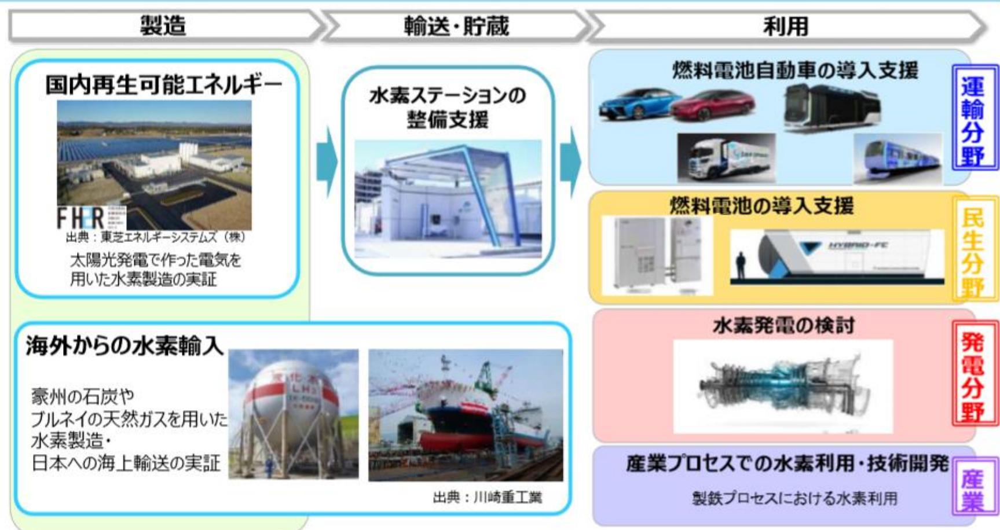
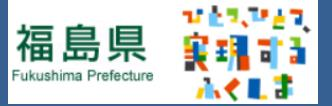
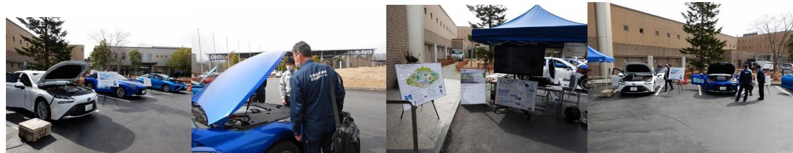

# 浪江町における水素利活用の取り組み

# 震災前の浪江町の姿による被災 **1 浪江町について** ~震災前の姿と発災後~

# **震災前の浪江町**

大堀相馬焼地酒

魚介類 (常磐もの)

(日本酒)

B級グルメなみえ焼きそば

DASH村

# **震災前の浪江の風景**

# **東日本大震災の発生**

# **東日本大震災の発生**

# **震度6強の揺れ 15メートルを超える津波**

約**1,000**事業所が被災死者**182**人うち特例死亡(行方不明)31人家屋倒壊による圧死は1人 **6** ㎢が浸水全壊家屋**651**戸 (流失586戸、地震65戸)

**翌日の原発事故発生により、助けられる命を助けられなかった。**

# **震災前の浪江町(請戸地区)**

# **震災翌日の浪江町(請戸地区)**

# **東京電力福島第一原子力発電所の事故**

## **情報が届かないため、高線量地区(津島支所)へ一時避難その後、町独自の判断で全町民約21,000人と町外避難**

- ◆ 役場機能の避難福島県二本松市へ避難 **1年半で4回移動**
- ◆ 全町の避難指示 **約6年間**(平成29年3月31日一部避難指示解除)
- ◆ 長引く避難生活による**震災関連死441人**(令和3年4月30日現在)

# **現在も残る帰還困難区域**

**◆町面積のおよそ8割が帰還困難区域**

- **◆帰還困難区域に3ヵ所の特定復興再生拠点を設置重点的に除染し、令和5年度の避難指示解除を目指す**
- **◆それ以外の地域は、2035年までに全域の復興を目指す**

# **復興に向けた動き**

# 震災前の浪江町の姿による被災 **2 NEDO実証について** ~FH2RとHDV~

# **棚塩産業団地について**

# 福島水素エネルギー研究フィールド (FH 2 R)

再生可能エネルギーを活用し、将来に向けた脱炭素化を実現します。

福島水素エネルギー研究フィールド(FukushimaHydrogenEnergyResearchField (FH2R))では再生可能エネルギーから水素を製造。水素を「つくる」ところからCO2 排出を抑えます。

2 再生可能エネルギーを利用した世界最大級の水素製造拠点です。

FH2Rでつくられる1日の水素製造量は、約150世帯の 1ヵ月分の電力に相当します。燃料電池車は560台充填できます。

FH2Rは、敷地内のPVからつくられる電力だけでなく、系統電力の需給バランスを見ながら、系統側の余剰電力を水素に変換します。

通常はFH2R敷地内のPVでつくられた電力を使用

FH2R敷地内

のPV

必要な水素量を把握し、効率良く製造 · 貯蔵 · 輸送します。

FH2Rは、水素供給先の水素需要を予測し、効率良く製造・貯蔵 · 輸送するととができます。

茶1 Nm²とは標準状態(OC、1 気圧)に換算した1m²のガス量
※2 1世帯あたり、平均的な1ヶ月の消費電力量から算出 ※3 燃料電池車を満タンとした場合

アイア

出典:国立研究開発法人新エネルギー・産業技術総合開発機構(NEDO) 13

# 大型FCモビリティ向け充填実証研究施設 (HDV)

### 背景・内容

- 国際的に大型車両(HeavyDutyVehicle:HDV)での燃料電 ● 池利用の期待が高まる。本格普及のためには、大容量かつ高速で水素を充填する技術・国際基準が不可欠。
- 将来的な各国との連携も視野に、HDV用水素充填・基準策定に ● 向けた研究施設を現在のFH2R敷地内に設置。
- 2021年度着工に向け、準備を進める。 ●

**3**

# **水素社会実現に向けた国及び県の取り組み**

### 福島新エネ社会構想の改定

#### これまでの取組と成果

- 2016年、福島イノベーション・コースト構想におけるエネルギー分野の取組を加速し、福島復興の後押しを一層強化するべく、福島県全体を未来の新エネ社会を先取りするモデルの創出拠点とすることを目指す「福島新エネ社会構想」を検定。
- 「再生可能エネルギーの導入拡大」「水素社会実現に向けたモデル構築」「スマートコミュニティの構築」を柱として、2020、 2030、2040年度頃をそれぞれ目途とする3つのフェーズを設定し、第1フェーズ(2020年度まで)の取組を着実に実施。
- 共用送電線事業に係る発電設備の大量導入や世界最大級の再工ネ田来水素の製造施設であるFH2Rの開所など主要事業が進捗。福島県内の再生可能エネルギー導入量の増加ペースは、構想策定前の約2億に向上。

#### 構想の改定

- 第2フェーズ(2021〜2030年度)を迎えるに当たり、総理が宣言した[2050年カーボンニュートラルの実現しという新たな目標を踏まえ、再生可能エネルギー | 「水素」について、これまでの取組を加速するとともに、多様な主体による導入拡大や社会実装への展開を目指し、「福島新工ネ社会構想」の改定を行う。
<踏まえるべき視点>

- 福島県再生可能エネルギー推進ビジョンの目標(2040年再エネ100%)達成への寄与 ●
- 2050年カーボンニュートラル宣言、新型コロナウイルス感染症の影響による大きな社会情勢の変化

#### 2050年カーボンニュートラルの実現に向けて

2020年10月26日菅総理所信表明演説 (抄)

菅政権では、成長戦略の柱に経済と環境の好循環を掲げて、グリーン社会の実現に最大限注力してまいります。

我が国は、2050年までに、温室効果ガスの排出を全体としてゼロにする、すなわち2050年カーボンニュートラル、脱尿素社会の実現を目指すことを、ここに宣言いたします。(略)

#### 2020年10月26日梶山大臣記者会見発言(抄)

カーボンニュートラルに向けては、温室効果ガスの8割以上を占めるエネルギー分野の取組が特に重要です。 カーボンニュートラル社会では、電力需要の増加も見込まれますが、これに対応するため再エネ・原子力など使えるものを最大限活用するとともに、水素など新たな選択肢も追求してまいります。

再エネは、コスト低減、系統の整備や柔軟な運用、蓄電池の活用を行いながら、最大限導入し、原子力も活用してまいります。 火力発電は、CCUSやカーボンリサイクルを最大限活用しながら利用してまいります。 産業・運輸・業務・家庭部門では、電化・水素化が基本になり、電化で対応できない製造プロセスなどでは、水素、CCUSやカーボンリサイクルを活用してまいります。

(略)

カーボンニュートラルを目指す上で不可欠な、水素、蓄電池、カーボンリサイクル、洋上風力などの重要分野について、①具体的な目標年限とターゲット、②規制・標準化などの制度整備、③社会実装を進めるための支援策などを盛り込んだ実行計画を、年末を目途に取りまとめてまいりたいと考えております。

水素は、これまで乗用車用途中心だったものを、新たな資源と位置付けて、幅広いプレーヤーを巻き込み、社会実装への道筋も検討をいたします。

- 
- 
- 

19 出典:令和2年度環境省低炭素水素の利活用拡大に向けた自治体連絡会議

#### 国際サプライチェーンの構築① 日豪水素プロジェクトの進捗

- 2019年12月11日に液化水素運搬船「すいそふろんていあ」の命名・進水式を開催。
- 今後、蒙州において掲示ガス化炉、液化・積荷基地が竣工し、秋頃に横装工事含めて「すいそふろんていあ」が完成する予定。
- 「すいそふろんていあ」は、2021年2月頃に世界初の液化水素の大規模海上輸送による掲示水素を日本に輸送する予定。

#### 進水式の様子

水素サプライチェーン

2019年12月11日川崎車丁神戸丁場・経産省中野政務官、在日豪州大使、蒙連邦政府フィンケル主席科学官、工藤水素社会推進議員連盟事務局長他が出席

- ・一般参加者を含め約4000人規模の式典

①水素製造

国際サプライチェーンの構築② 日ブルネイ水素サプライチェーン実証

完成した水素化プラント(ブルネイ)

- 2019年11月にブルネイの水素化プラントが開所。2020年5月、川崎の脱水素プラントが竣工。 実証のための全施設が整い、世界初となる国際サブライチェーンの実証運転が開始。
- これにより、ブルネイの天然ガスから水素を製造し、有機ハイドライドとして海上輸送し、日本で水素を取り出し、ガス火力発電の燃料として利用する、一気通貨したサプライチェーンが構築された。

・川崎脱水素ブラント外観

水素サブライチェーン

- 出典:令和2年度環境省低炭素水素の利活用拡大に向けた自治体連絡会議って

### カーボンニュートラルに向けた動き

第203回国会における菅内閣総理大臣所信表明演説(令和2年10月26日)

菅政権では、成長戦略の柱に経済と環境の好循環を掲げて、グリーン社会の実現に最大限注力してまいります。

我が国は、2050年までに、温室効果ガスの排出を全体としてゼロにする、すなわち2050年カーボンニュートラル、脱炭素社会の実現を目指すことを、ここに宣言いたします。

#### 地球温暖化対策推進本部における菅内閣総理大臣指示(令和2年10月30日)

「2050年カーポンニュートラルへの挑戦は、日本の新たな成長戦略です。この挑戦を産業構造や経済社会の発展につなげ、経済と環境の好循環を生み出していきたいと思います。

梶山大臣には、成長戦略策定の中心となって、厳しい課題でありますが、世界市場獲得の可能性のあるエネルギー・産業分野の変革という大きな課題を背負っていただきたいと思います。

小泉大臣には、新たな地域の創造や国民のライフスタイルの転換など、カーボンニュートラルへの需要を創出する経済社会の変革や、国際的な発信に取り組んでいただきたいと思います。

各閣僚には、それぞれの所掌分野の排出削減策、脱炭素技術の開発や実装、グリーンファイナンス促進、関連規制の改革などを検討いただきたいと思います。そして世界をリードする外交も進めていただきたいと思います。

このような課題について、成長戦略会議や、国と地方で検討する新たな場、こうしたところにおいて議論を重ね、地球温暖化対策計画、エネルギー基本計画、パリ協定に基づく長期戦略の見直しを加速していただきたいと思います。 全閣僚―丸となって取り組んでいただきますようお願いします。」

国会における「気候非常事態宣言」決議(令和2年11月19日衆議院、11月20日参議院)

### 環境省の水素利活用に関する取り組み

#### 地域連携・低炭素水素技術実証事業の採択案件

#### 白焼町PJ

小水力由来の再エネ水素の導入拡大と北海道の地域特性に適した水素活用モデルの構築実証(東芝ESS)

富谷市における既存物流網と純水素燃料電池を活用した低炭素サブライチェーン実証 (日立製作所)

使用済みプラスチック由来低炭素水素を活用した地域循環型水素地産地消モデル実証事業(昭和電工)

#### 京浜臨海部PJ

京浜臨海部での燃料電池フォークリフト導入とクリーン水素活用モデル構築実証 (トヨタ自動車)

- : 実証が行われている都道府県 (2020年3月現在)
: 既存インフラを活用したサブライチェーン事賞(2020年から) (北九州市、浪江町)

出典:浪江町水素シンポジウムin道の駅なみえ 24

出典:浪江町水素シンポジウムin道の駅なみえ 25

## ◇ 県有施設等への定置式燃料電池の設置

- ○「あづま総合運動公園」と「Jヴィレッジ」に県が設置した純水素定置式燃料電池(100kW・700W)が2020年6月29日より稼働を開始。
- NEDOとの協定に基づき「福島水素エネルギー研究フィールド」(FH2R)でつくられた県産水素を活用。

ル・アーケア : 100 般家庭約100世帯の電力需要に相当水素トレーラーにより月に2回程度、水素を搬入

あづま総合運動公園燃料電池 (100kW)

Jヴィレッジ燃料電池(700W)

般家庭約1世帯の電力需要に相当

水素力ードルにより月に1回程度水素を搬入

# **4** ~町の基本的考え~ **水素社会実現とゼロカーボンシティ達成に向けて**

# **水素の利活用について(詳細後述)**

・町としては、町内に立地したFH2R産水素を積極的に活用したい考え。 ・一方、水素の効率的導入にあたっては、技術面、法規制、コスト面等に課題が山積している。

- **・水素を「つくる」「はこぶ」「つかう」という各フェーズにおける課題の整理・解決を目指し、町を水素実証フィールドとして活用していただく。 ・それらのPDCAを繰り返すことにより、水素社会実現に寄与したい。**
# **ゼロカーボンシティについて**

・浪江町は、FH2R

2年3月5日にゼロカーボンシティを宣言。 ・ゼロカーボンシティの宣言は、全国では77番目。県内では郡山市、大熊町に続き3番目。 ・2050年までにCO2排出量実質ゼロを目指すため、様々な分野において低炭素・脱炭素に関する取り組みを進める必要がある。

開所に先立ち、令和

**商業、工業、農業、水産業、交通、教育、福祉等、様々な分野において、再エネ・省エネはもちろん、水素利活用及び実証を積極的に推進し、ゼロカーボンシティ達成を目指したい。**

# **町内における水素利活用の取り組み** ~なみえ水素タウン構想~

**5**

31

#### **概要**

道の駅なみえ(令和2年8月プレオープン)に純水素燃料電池を設置し、道の駅に対して電力及び熱(お湯) の供給を行う。

- ・FH2R産水素利活用の先駆けでもあるため、水素利活用のシンボルとして積極的にPRしていく。
- ・純水素燃料電池導入に伴うランニングコスト(修理、手間等)を確認し、現場で必要なコストを把握する。

#### **概要**

水素輸送のためのパイプラインを地中埋設するのではなく、柱上(電柱)に整備(共架)させることにより、低コスト化を実現できないか、技術的・法令的・効率的観点から実証を行う。

#### **今後の展望**

32 RE100産業団地をはじめ、町内における水素利活用事業・実証等に対し、柱上パイプラインを活用した水素供給ができないか、事業化に向けた具体の検討/実証を進める。

3 **生協による水素配送実証FS**

#### 委託事業構想策定詳細検討実証中施工段階実証完了設置完了普及啓発つくるはこぶつかう

一般家庭、商業施設、事務所等

#### **概要**

- ・浪江町を中心に、福島県浜通り地域の一般家庭及び商業施設等に純水素燃料電池を多数設置し、生協トラックによる配送・供給事業実施の可能性調査を行うもの。(宮城県富谷市で先行して行われた実証成果を活用。) ・FH2R水素だけではなく、県内の副生水素等も活用することで、様々な純度の水素利活用を可能とする。
#### **パートナー**

- ・事業可能性調査結果を踏まえ、R3年度に詳細FS、R4年度以降に燃料電池設置及び水素配送開始を目指す。 ・事業として全国展開可能な水素サプライチェーン「浪江モデル」として確立させ、水素社会実現に寄与する。

- ・令和2年度に基本計画を策定し、令和3年度より施工及び実証開始を目指す。
- ・将来的には、純水素燃料電池導入を拡大し、トレーラー巡回型による水素サプライチェーン確立を目指す。 また、柱上パイプラインによる水素供給もあわせて検討する。

(補助/優遇措置後は5,704千円~6,631千円)

- ・公用車としての導入を皮切りに、町内におけるFCV導入加速を目指す(水素充填環境整備も並行して議論) ・地元小中学生徒や住民等へPRすることで、水素の安全性や将来について、地域の理解も深める。

- ・R2年度:基本設計R3年度:実施設計、エネルギー供給スキーム検討R4年度:団地造成開始
- ・地域新電力会社の持続可能及び地域に裨益するあり方について十二分に検討し、モデルケースとしたい。

#### **概要**

- ・脱炭素及び水素利活用を切り口としたツーリズムを検討/実施し、関係人口拡大を目指す。
- ・教育プログラムの策定も行い、県内高校生も巻き込んだ情報発信を行う。
- ・また、脱炭素ツーリズムに資するFCモビリティの開発/運用についても検討する。

# **パートナー事業詳細/イメージ**

### **◆水素ツーリズム/教育プログラムの検討**

- ・浪江の水素利活用のフィールドに加え、被災地(請戸小学校、大平山霊園等)や復興事業(農林水産業関連施設、道の駅なみえ等)等を巡るツアーを開催。
- ・普通科生徒/SSH等、それぞれを対象とした教育プログラムの策定/事業検討。

#### **◆FCモビリティの開発/運用**

- ・ツーリズムのツールとなるモビリティもFC化し、脱炭素ツーリズム実現を目指す。
- ・特に、脱炭素ツーリズムの一翼を担うキッチンカーのFC化について、関係者と協議/検討を進め、使い勝手の良いモビリティ製作を目指す。

- ・町内で水素ツーリズムを開催し、モデルの構築及び事業性調査を行う。
- ・自動車メーカー等との連携し、脱炭素ツーリズムに資するFCモビリティの開発を検討/協議する。

- ・まずは、マルチ水素ステーション整備に向けた事業可能性調査を行う。(令和3年度~) ・あわせて、水素ステーション関連事業者や地元企業等に対し、ヒアリング・意見交換を進める。

- ・令和3年度:FS実施(エネルギー需給調査、水素調達スキーム等) 令和4年度以降:町内外の工場でFSの知見反映
- ・将来的には「浪江町ゼロカーボンシティモデル」として全国への水平展開を目指す。

# **水素利活用に関する連携**

#### ■ **水素利活用に関する協定締結**

□ NEDO(締結日:令和2年10月26日) FH2R水素利活用に関する協定を締結。

- □ 住友商事(締結日:令和3年1月25日)

マルチ水素ステーション整備に向けた検討を進める。

- □ 丸紅、日立製作所、みやぎ生協、Panasonic(締結日:令和3年7月2日) 水素配送事業推進や、RE100に関する取組み。
■ **新型ミライの県・町合同納車式を開催(令和3年3月1日)** 福島県と合同で、新型ミライ公用車の合同納車式を開催。

**■ トヨタ自動車㈱豊田社長来町及び水素事業への連携表明(令和3年3月5日)** トヨタ自動車㈱の豊田社長が来町され、FH2Rを視察。 浪江町、福島県内における水素事業への連携を進める。

40

# **水素利活用に関する普及啓発**

#### **■ 水素シンポジウムの開催**

平成30年2月8日福島県水素利用シンポジウム2018inなみえ【参加:約450名】

**■ 新型ミライ展示会の開催** 令和2年11月20日(金)~21日(土) 道の駅なみえにおいて新型ミライ展示会を開催。

あわせて、町内における水素利活用の取り組みの展示や、道の駅に設置した純水素燃料電池見学会、地元こども達向けの水素教室、シンポジウム等を開催。

**■ 東京オリンピック・パラリンピックでの浪江産水素活用** 浪江産CO2フリー水素が東京オリパラにて活用される

□ 聖火リレーのトーチ □ 聖火台

- □ 大会車両(ミライ500台) □ 選手村純水素燃料電池

# **水素利活用に関する普及啓発**

#### **■ 各種イベント・ツアーにおけるFCV活用・普及啓発**

年3月10日水素ツーリズム(環境省FS委託事業)【参加:約30名】

- 年3月6日相双地方親子連れモニターツアー(県主催)【参加:約20名】

年3月12日水素見学会(県主催)【参加:約100名】

**最後に・・・**

**原子力というエネルギーで被害を受けた浪江町は、水素という新たなエネルギーで復興まちづくりを実現するため、水素利活用に全力で取り組んでまいります! 皆様のご支援、ご協力、ご提案のほど、何卒よろしくお願いいたします。**

**【 本資料及び水素に関するお問い合わせ先 】 浪江町役場産業振興課新エネルギー推進係TEL:0240-23-5713**