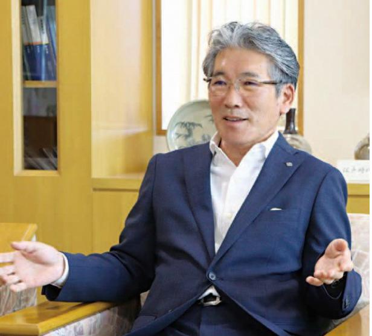
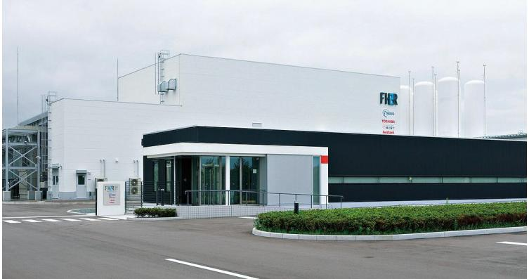
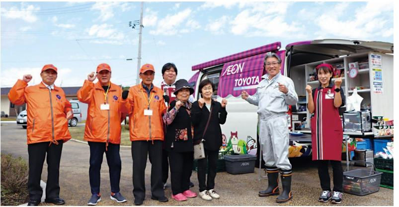

### はたです。
ここで、ここで、

### 知町が道吉日米

光

とを取り戻すために、ただきの一心で駆け抜けてまいた。 これからも子ども達の未来に素晴らしいほ江町をなると、なって、こので、ことで出てないというか、いつかないではないために全力で取り組んでまいりますにまずに年間景議会議員を経験者せていただき、あのの環深からいに年だが過ぎまし

アイアの通信」によって、避難先で即民の方々の状況を知進公よりの作の掲載作数となりました。「浪江再開に合わせて始まり、令和4年の月に終了 「浪江のシンシア通信」は、平成2年7月、「広報

> 。すみずしと出な感覚のお気になっています。 このサンコはなっていないという。
> このと、オンバインはなことがなことですけど、イヤビスタイルです。
> ここで、オンバインはなことがなことですけど、ことです。
> 2007年にはないと言うのはなっています。 スターさんのではあり、本当にはありなとですけどこ

## などが多いです

元成し、町民の皆さんや外から訪れる方々のはの町は、道の駅なみえやるれあいセンタルなー町に賑わいないかなかなかなかなかない

」」)立地が決まりました。世界の技術者がくこの度、浪江町に「福島国際研究教育機構

2

浪江駅周辺グランドデザイン基本計画

福島水素エネルギー研究フィールド (FH2R)

技術を世界に発信していくなる出の分部くいん使命感がなくてネルギー、浜通り地域ロいに

時生可能こんと連携し

> ンバイデザイン基本計画」の実現りなたとりかからなければならない切なものでんなども、今、す。 地域に根付

武の復興に向

。昨年でイッシーバ

つかないというなんなんているといないも

ります。 開拓ののご苦労、そして原

。今年のこことイベルト、アイデリアのアイデリアには、アプリンプルなど、

| 巻なくなって

# 4にメロゴの

などなん・対できる。
 『 』 『 』 『 』 『 』 『 』 『 』 『 』 『 』 『 』 『 』 『 』 『 』 『 』 『 』 『 』 『 』 『 』 『 』 『 』 『 』 『 』 『 』 『 』 『 』 『 』 『 』 『 』 『 』 『 』 『 』 『 』 『 』 『 』 『 』 『 』 『 』 『 』 『 』 『 』 『 』 『 』 『

立入規制の緩和による防災・防犯対策

明るい地域づくりの推進

向かって新しい渡江町を作をれず積み上げたもの死に生きてこちれたこし