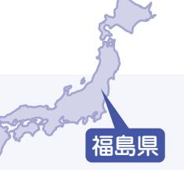
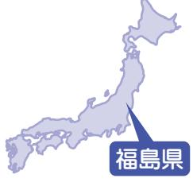
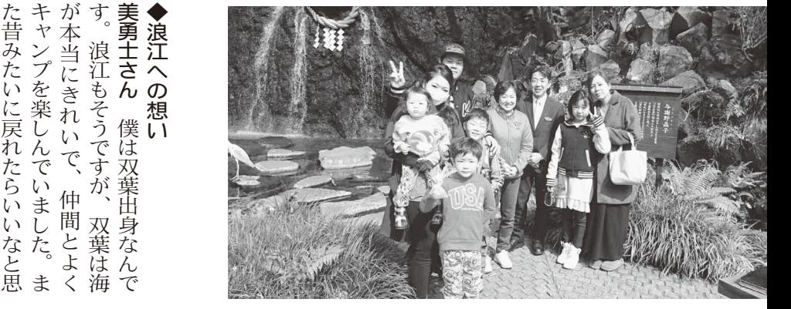
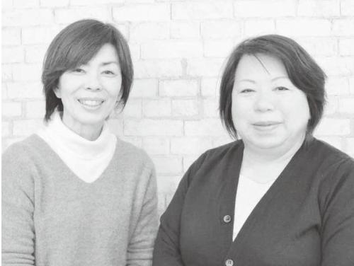
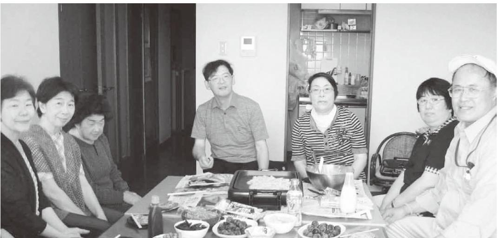
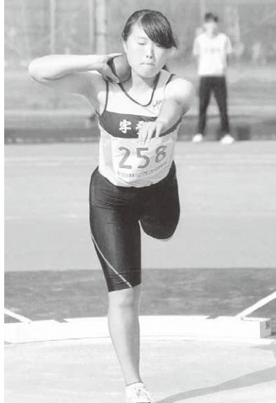
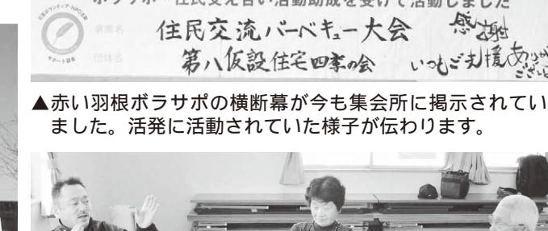

- 役場機能の大部分が本庁舎に戻るH29. 4月
	- JR常磐線浪江駅-小高駅間の運転再開災害公営住宅「幾世橋住宅団地」第1期 (22戸)が完成 4月 6月
	- 町内で夏まつり(心のイノベーション笑夏・サマーフェスティバルなみえ)を開催 8月
	- 災害公営住宅「幾世橋集合住宅」(2棟 80戸)が完成 8月
	- 国道114号の特別通過交通開始 9月
	- 町内で十日市祭を開催(浪江町地域スポーツセンター) 11月
	- 国が「特定復興再生拠点区域復興再生計画(津島、末森および室原)」を認定 12月
- 町内であるけあるけ初日詣大会を開催 (浪江町営大平山霊園ほか) H30. 1月
	- 請戸漁港出初式を実施 1月
	- 町内で成人式を開催(浪江町地域スポーツセンター) 1月
	- 「浪江町健康関連施設整備検討委員会」が町に提言 2月くさ
	- 䊭野神社(請戸地区)で町指定無形民俗文化財「請戸の安波祭」 2月
	- 浪江町東日本大震災追悼式(如水典礼さくらホール) 3月
	- 町内で浪江町芸能祭(浪江町地域スポーツセンター) 3月
	- 災害公営住宅「幾世橋住宅団地」第2期 (63戸)が完成 3月

ƛƵƞઌƽֲŻƻŹ£ ७ƒƔơƼƊơ Ƅƙଙƞࣰ

あるけあるけ初日詣(1月)

請戸の安波祭(2月)

なみえの夏まつり(8月) 復興なみえ十日市祭(11月)

### 髙橋俊正さん(赤宇木)

取材者:NPO法人市民公益活動パートナーズ古山・松田取材日:1月29日 「平成29年4月広報なみえ掲載」

#### 他所では死にたくない。 だから、今、帰るための準備をする

を

の

が

の

か

さ

◆

髙橋さんは若い頃からものづくりが大好きで、東京で大工さんをされていました。ご両親の介護のために津島に戻り、大工業と農業を兼ねながら、「りんどう」の栽培や畜産業にも挑み、牛を増やしながら、ようやく軌道に乗った頃に震災に遭いました。

震災後は、牛の世話をするために、避難をした福島市内の弟さんの家から約 1 か月ほど津島に通ったそうですが、7 月に牛を手放し、岳温泉「あづま三番館」に避難。その後、二本松市の仮設住宅を経て、現在、二本松市針道で花き栽培をしながら暮らしていらっしゃいます。

▲普段余り聞くことのできない、花き栽培のお話や農業にかける心意気をたくさん聞かせていただきました。

移

に

場

品

花

と

◆ 浪江のまちや人に対する、今のお気持ちはいかがですか 「 浪江のこころ通信 」 を読むと、町のみんなの様子はよく分かるんですよ 。 だけど、最近、帰還を前提に無理に急いでいるような気がします 。 農業は ? 商工業は ? 浪江町でサラリーマンをしていた人たちは ? と思うんです 。 特に、農業は技術と人手がなくては再興できません 。 そこが忘れられているような気がします 。 金銭的な支援として、国や県は耕作地の規模に応じて、あるいは組合などの組織に対していろいろな補助をしているようですが、私は一人でとことんやってみたいと思っています 。 とはいっても、手伝ってくれる人がいなければ仕方がない 。 町はシルバー人材センターなどを通じて、浪江に戻った高齢の方 々 が何かできるような仕組み

▲「夏の間は忙しくて、げそっと痩せてしまうんですよ」と、髙橋さん。80cm以上に仕上げたりんどうの花束は価値が高いそう

す 。 針道の気候は津島と異なり、夏は暑く、風が抜けない風土ですが、今はハウスと露地栽培の両を試しながら、流行のや花の付き方をいろい試しています 。 メインとなっているりんどう 」 の出荷は 6 半ばから 10 月頃まででが、そのピークはお盆らお彼岸です 。 夏の繁期は、地域の女性 2 人も手伝ってもらいなが、仕事をしています 。 んのこれからの目標は

か

地

く

ま

前

方色ろ 「 月すか忙にら ◆ 髙橋さ何でしょうか出荷時期の異なる 10 月から寒咲きの 「 輪菊 」 や 「 トルコききょう 」 などを市場向けの商品として作りながら、ミカンやデコポン、レモンなどの柑橘類はどうかとか、「 ゴクラクチョウカ 」 や 「 デンファーレ 」、「 ハラカンタ( ジャカランダ )」 などの寒さに弱い花 々 はどうかなど、日 々 勉強中です 。 また、津島では冬場の仕事として、伝統的に菜種やエゴマ、椿、トチの実、アケビなどの油搾りをしてきました 。 ぜひ復活させたいですね 。 そのためにも、まとまった耕地が必要ですし、再び牛も飼いながら、繁殖にも力を入れたいです 。 あと 5 年を目途に、帰郷に向けて本腰を入れて準備をしていくつもりです 。 です(ご本人から写真提供)。

脇坂明さん(権現堂)

茨城県

取材者:茨城NPOセンター・コモンズ菊池浪江町復興支援員八橋・森・小川取材日:2月10日 「平成29年4月広報なみえ掲載」

これからは楽しいことをやり続けたい

脇坂さんは、現在水戸で一人暮らしをされていますが、プロの資格を持っている社交ダンスをしたり、カラオケをしたり、自分で作詞してCDを作ったり、舞台に挑戦した

> ◆ 妻と一緒に避難所を転 々 として

> コミ等に対して意見書を送付した

り、県内外の各地でシンポジウムを

開いて発表したり、署名集めなどの

▲つくば市のオークラフロンティアホテルつくばで開かれたダンスパーティーに、デモンストレーションでダンスを披露

活動を展開しましたが、一緒に活動

してくれる人も現れなかったので、

気持ちを切り替えてこれからは楽し

いことをして過ごそうと思いました 。

◆ 一人暮らしでも趣味があれば生き

もありますが、身体もいたって健

康で大好きな社交ダンスやカラオ

ケをしながら充実した生活を送っ

ております 。 生きと過ごせます

現在の楽しみは、まずひとつは銀

行員時代に過ごした茨城県内外の各

地を思いながら作った詩や、恩人を

偲んで作った詞にプロの先生に曲を

つけてもらい、自分で歌ってCDを

「あの日を超えて」

作詞脇坂

1山脈はるか阿武隈の

うなばら

やまなみ

あぶくま

あの日あの時青き海原美しく

母なる海はゆれ動き

なすすべもなく押し寄せてきた

多くのくらし多くの命

あああの日を超えて

わが故郷へ呼べど答えぬ

ふるさと

2四季おりおりの麗しき恵みゆたかな山や川あの日あの時海辺から

いつの日か

うばわれた

父母と

魔の山となり

地響きに

明

作ることです 。 今後は蜷川幸雄さん

の奥様へCDをプレゼントすること

が目標で、そのために月に 2 回程度

カラオケに通っています 。

もうひとつは、自分が最も得意と

する社交ダンスです 。 社交ダンスは

プロの資格も持っていて、銀行員時

代には茨城県アマチュアダンス協会

を立ち上げて、社交ダンスの普及に

努め、銀行を退職後は水戸でダンス

教室を開き、 10 年ぐらい社交ダンス

の指導をしてきました 。 現在も週に

2 回程度ダンス教室に通っており、

昨年はつくば市のホテルで開かれた

ダンスパーティーにもデモンスト

レーションで踊ったりしました 。

また、昨年はさいたまスーパーア

リーナで開催された企画・原案蜷川

> 見えぬ汚れが風にのり

救いをもとめ染めつくされた

すまいを追われ無念の涙

あああの日を超えて

ひと

わが故郷へ住民はみんなで

ふるさと

いつの日か

散り散りに

呼ぶ声も

魔の手をひろげ

幸雄さんの 「 1 万人のゴールドシア

ター 2 0 1 6 」 という舞台に応募し

た結果、書類選考を通り舞台に出演

することができました 。 今年もチャ

ンスがあればチャレンジしたいと

思っています 。

このように今はひとりで寂しい時

3 月 11 日、介護が必要な妻をベッ

ドに寝かせていた時に地震が発生し

ました 。 しばらくすると町の防災無

線で津波が来るので直ぐに逃げるよ

う放送があったため、妻を車に乗せ

て井出に住む娘のところに避難し一

晩過ごしました 。

次の日には放射能が漏れ原発が危

ないとの情報があったため、原町に

移動しました 。 そして、 3 月 12 日の

原発の爆発によって、更に西に逃げ

て福島市まで移動し避難所にたどり

着きましたが、避難所暮らしは介護

が必要な妻と一緒だったため、トイ

レが本当に困りました 。

その後、福島県内や茨城県内の親

戚宅や知人宅を頼って 10 か所ぐらい

転 々 と避難し、 2 年ぐらい前から現

在の水戸の借上げアパートに落ち着

きました 。 妻は、息子が経営してい

る介護施設に入居させているため、

月に 1 回 〜 2 回面会に行きますが、

現在はひとり暮らしです 。

◆ 精神的損害に対する補償について

納得することができずに …

この地震に

よって原発が爆

発し、避難暮ら

しを余儀なくさ

れたことに対す

る精神的損害に

対する補償につ

いて、交通事故

▲脇坂さんが作詞し、歌って作ったCD「あの日を超えて」「天国からの手紙」と、出演した「1万人のゴールドシアター2016」のパンフレット

> と同じ基準で算

定されているこ

とに納得するこ

とができず、

国・県・町・マスりと、充実した生活を送っていらっしゃいます。

### 浅野勇太さん(権現堂)

取材者:NPO法人山形の公益活動を応援する会・アミル柴田取材日:1月29日 「平成29年4月広報なみえ掲載」

#### 山形に来たときは、ぜひりんご狩りを楽しんでください

理美容店「カットハウスハッピー」の常務取締役を務め、浪江店の店長をしていた浅野さん。現在、山形県白鷹町で家族5人で暮らしながら、妻・祥子さんと朝日町でりんごの農園を営んでいます。3人のお子さんもすくすく成長しており、長男・秦くんと次男・嵐くんはサッカー、長女・凜ちゃんはピアノを頑張っています。3人の冬の楽しみは、近くのスキー場で友達とスキーやそりで遊ぶことと教えてくれました。

サッカーのスポーツ少年団に入り、私も経験者なのでコーチを始めました 。 スポ少を始めたことで、地域とのつながりができ、どこに行っても誰かに会った時には声をかけてもらいます 。 最初の一年は孤独を感じていましたし、他の浪江のお母さん方からはいじめの話も聞き不安でしたが、年上のお兄ちゃんお姉ちゃんたちが随分声をかけてくれ、救われました 。 知らない土地知らない人の所に来て、子どもながらに不安があったと思いますが、よく頑張ってくれたなと思います 。 逆に、子どもたちが頑張っている姿を見てりんご栽培とスポ少の指導者をしてみようと励まされ

▲左から、嵐くん(小4)、凜ちゃん(小1)、勇太さん、秦くん(小6) 妻・祥子さんも一緒に、家族揃ってお話を聞かせてくださいました。

いるし、町の方があたたかく、子どもたちは地域に溶け込んでくれています 。 入学式はすでに終わっていたのですが、特別に長男一人だけの入学式をしていただきました 。 今年卒業なので、他の子と同じように卒業アルバムに入学式の写真が載ることをありがたく思い、成人して大人になっても、一生の友達となるよう大切にしてほしいです 。 また、子どもたちが

ました 。 長男は、海のある風景や散歩した妻の実家の浪江の風景を覚えており、いつか町に入れるようになれば、ここにいたんだよと浪江に連れていければいいですね 。 ◆ りんご農家として新しい挑戦 「 カットハウスハッピー 」 は、浪江駅前にあり、低料金の理美容店でした 。 たくさんのお客様に来ていただいていたこと感謝しています 。 このこころ通信で、お客様の元気な姿や事業を再開した情報を嬉しく見ています 。 震災後一年は、宮城県の震災復興の仕事につき週末だけ帰る生活をしていましたが、朝日町のりんごに興味を持ち訪れた農業支援センターで、師匠の阿部為吉さんに出会ったことで、りんごは面白いと思い就農に至りました 。 耕作放棄地を開墾して畑を作り、苗木を植えて一からのスタート 。 一昨年まで師匠の所で働き教わりながら朝夕で自分の畑の管理をし、昨年からは妻も仕事に加わってもらい、りんご約 3 0 0 本、ラフランス約 1 5 0 本を育てています 。 日に当てる無袋栽培を行っており、天災や病害虫に弱く手はかかりますが、甘いりんごができます 。 もし山形に来たら、皆さんにりんご狩りを楽しんでもらえたらと思っています 。

### 脇坂明さん(権現堂)

取材者:茨城NPOセンター・コモンズ菊池浪江町復興支援員八橋・森・小川取材日:2月10日 「平成29年4月広報なみえ掲載」

#### これからは楽しいことをやり続けたい

脇坂さんは、現在水戸で一人暮らしをされていますが、プロの資格を持っている社交ダンスをしたり、カラオケをしたり、自分で作詞してCDを作ったり、舞台に挑戦したりと、充実した生活を送っていらっしゃいます。

| こ の 地 震 に | 納 得 す る こ と が で き ず に … | ◆ 現 精 在 神 は ひ 的 と 損 り 害 暮 に ら 対 し す で る す 補 。 償 に つ い て | 月 に 1 回 〜 2 回 面 会 に 行 き ま す が 、 | る 介 護 施 設 に 入 居 さ せ て い る た め 、 | き ま し た 。 妻 は 、 息 子 が 経 営 し て い | 在 の 水 戸 の 借 上 げ ア パ ー ト に 落 ち 着 | 転 々 と 避 難 し 、 2 年 ぐ ら い 前 か ら 現 | 戚 宅 や 知 人 宅 を 頼 っ て 10 か 所 ぐ ら い | そ の 後 、 福 島 県 内 や 茨 城 県 内 の 親 | レ が 本 当 に 困 り ま し た 。 | が 必 要 な 妻 と 一 緒 だ っ た た め 、 ト イ | 着 き ま し た が 、 避 難 所 暮 ら し は 介 護 | て 福 島 市 ま で 移 動 し 避 難 所 に た ど り | 原 発 の 爆 発 に よ っ て 、 更 に 西 に 逃 げ | 移 動 し ま し た 。 そ し て 、 3 月 12 日 の | な い と の 情 報 が あ っ た た め 、 原 町 に | 次 の 日 に は 放 射 能 が 漏 れ 原 発 が 危 | 晩 過 ご し ま し た 。 | て 井 出 に 住 む 娘 の と こ ろ に 避 難 し 一 | う 放 送 が あ っ た た め 、 妻 を 車 に 乗 せ | 線 で 津 波 が 来 る の で 直 ぐ に 逃 げ る よ | ま し た 。 し ば ら く す る と 町 の 防 災 無 | ド に 寝 か せ て い た 時 に 地 震 が 発 生 し | 3 月 11 日 、 介 護 が 必 要 な 妻 を ベ ッ | ◆ 妻 と 一 緒 に 避 難 所 を 転 々 と し て |
|-----------------------|----------------------------------------------------------|------------------------------------------------------------------------------------------------------------------------------------------|------------------------------------------------------------------------------|------------------------------------------------------------------------------|------------------------------------------------------------------------------|------------------------------------------------------------------------------|------------------------------------------------------------------------------|-------------------------------------------------------------------------------|-------------------------------------------------------------------------|-----------------------------------------------------|------------------------------------------------------------------------------|------------------------------------------------------------------------------|------------------------------------------------------------------------------|------------------------------------------------------------------------------|-------------------------------------------------------------------------------|------------------------------------------------------------------------------|-------------------------------------------------------------------------|--------------------------------------|------------------------------------------------------------------------------|------------------------------------------------------------------------------|------------------------------------------------------------------------------|------------------------------------------------------------------------------|------------------------------------------------------------------------------|--------------------------------------------------------------------------|-------------------------------------------------------------------------|
|-----------------------|----------------------------------------------------------|------------------------------------------------------------------------------------------------------------------------------------------|------------------------------------------------------------------------------|------------------------------------------------------------------------------|------------------------------------------------------------------------------|------------------------------------------------------------------------------|------------------------------------------------------------------------------|-------------------------------------------------------------------------------|-------------------------------------------------------------------------|-----------------------------------------------------|------------------------------------------------------------------------------|------------------------------------------------------------------------------|------------------------------------------------------------------------------|------------------------------------------------------------------------------|-------------------------------------------------------------------------------|------------------------------------------------------------------------------|-------------------------------------------------------------------------|--------------------------------------|------------------------------------------------------------------------------|------------------------------------------------------------------------------|------------------------------------------------------------------------------|------------------------------------------------------------------------------|------------------------------------------------------------------------------|--------------------------------------------------------------------------|-------------------------------------------------------------------------|

| こ |  |
|---|--|
|   |  |
|   |  |
| と |  |
|   |  |
| が |  |
|   |  |
| で |  |
|   |  |
| き |  |
|   |  |
|   |  |
| ず |  |
|   |  |
| に |  |
|   |  |
| … |  |
|   |  |
|   |  |
|   |  |
|   |  |
|   |  |
|   |  |
|   |  |

▲脇坂さんが作詞し、歌って作ったCD「あの日を超えて」「天国からの手紙」と、出演した「1万人のゴールドシアター2016」のパンフレット

| 国 と と 定 と い 対 る れ し 発 よ ・                                                   | き |
|-----------------------------------------------------------------------------------------------------------------|---|
| に さ 同 て す 精 た を し っ こ が                                                        | ず |
| 県 納 れ じ 、 る 神 こ 余 、 て の で ・                                              | に |
| 交 補 的 と 儀 避 原 得 て 基 町 地 き                                                   | … |
| す い 準 通 償 損 に な 難 発 ・ 震 ず マ                                              |   |
| る る で 事 に 害 対 く 暮 が に ス 、 こ こ 算 故 つ に す さ ら 爆 |   |

| 思 ン す っ る こ ス て こ の が い と よ あ ま が う れ す で に ば 。 き 今 チ ま は ャ ひ し レ と た ン 。 り ジ 今 で し 年 寂 た し も い い チ 時 と ャ |
|-----------------------------------------------------------------------------------------------------------------------------------------------------------------------------------------------------------------------------------------------------------------------|
| た タ 結 ー 果 2 、 0 書 1 類 6 選 」 考 と を い 通 う り 舞 舞 台 台 に に 応 出 募 演 し                                                                                                          |
| 幸 リ 雄 ー さ ナ ん で の 開 「 催 1 さ 万 れ 人 た の 企 ゴ 画 ー ・ ル 原 ド 案 シ 蜷 ア 川                                                                                                          |
| レ ー ま シ た ョ 、 ン 昨 で 年 踊 は っ さ た い り た し ま ま ス し ー た パ 。 ー ア                                                                                                                    |
| ダ 昨 年 ン は ス つ パ く ー ば テ 市 ィ の ー ホ に テ も ル デ で モ 開 ン か ス れ ト た                                                                                                               |
| 2 の 回 指 程 導 を 度 ダ し ン て ス き 教 ま 室 し に た 通 。 っ 現 て 在 お も り 週 、 に                                                                                                          |
| 教 努 室 め を 、 開 銀 き 行 、 を 10 退 年 職 ぐ 後 ら は い 水 社 戸 交 で ダ ダ ン ン ス ス                                                                                                         |
| を 代 立 に ち は 上 茨 げ 城 て 県 、 ア 社 マ 交 チ ダ ュ ン ア ス ダ の ン 普 ス 及 協 に 会                                                                                                          |
| プ ロ の 資 格 も 持 っ て い て 、 銀 行 員 時                                                                                                                                                                                          |
| す る も 社 う 交 ひ ダ と ン つ ス は で 、 す 自 。 分 社 が 交 最 ダ も ン 得 ス 意 は と                                                                                                               |
| カ ラ オ ケ に 通 っ て い ま す 。                                                                                                                                                                                                              |
| が の 目 奥 標 様 で へ 、 C そ D の を た プ め レ に ゼ 月 ン に ト 2 す 回 る 程 こ 度 と                                                                                                          |
| 作 つ る け こ て と も で ら す い 。 、 今 自 後 分 は で 蜷 歌 川 っ 幸 て 雄 C さ D ん を                                                                                                          |
| 偲 ん で 作 っ た 詞 に プ ロ の 先 生 に 曲 を                                                                                                                                                                                          |
| 地 を 思 い な が ら 作 っ た 詩 や 、 恩 人 を                                                                                                                                                                                          |
| 行 員 現 時 在 代 の に 楽 過 し ご み し は た 、 茨 ま 城 ず 県 ひ 内 と 外 つ の は 各 銀                                                                                                               |
| 生 き と 過 ご せ ま す                                                                                                                                                                                                                                  |
| ◆ い こ 一 と 人 を 暮 し ら て し 過 で ご も そ 趣 う 味 と が 思 あ い れ ま ば し 生 た き 。                                                                                                     |
| 気 し 持 て ち く を れ る 切 り 人 替 も え 現 て れ こ な れ か か っ ら た は の 楽 で し 、                                                                                                          |
| 活 動 を 展 開 し ま し た が 、 一 緒 に 活 動                                                                                                                                                                                          |
| 開 り い 、 て 県 発 内 表 外 し の た 各 り 地 、 で 署 シ 名 ン 集 ポ め ジ な ウ ど ム の を                                                                                                          |
| コ ミ 等 に 対 し て 意 見 書 を 送 付 し た                                                                                                                                                                                               |

アホテルつくばで開かれたダンスパーティーに、デモンストレーションでダンスを披露

横断させながら、田んぼのあぜ

佐藤信一さん(権現堂)

取材者:NPO法人市民公益活動パートナーズ古山取材日:2月25日 「平成29年5月広報なみえ掲載」

### 私にとって「浪江」は、大人になってからの人生の半分です

佐藤信一さんは、現在、兼務校である福島市立岡山小学校に勤務されています(本務校は浪江町苅野小学校)。岡山小は在校生が407名で、浪江町のスクールバスで6名の児童 (うち3名はこの春卒業)が通っています。震災直後は市内の各学校にスクールバスなどで多くの児童が通学していましたが、徐々にその人数も減っているそうです。

震災当時は、東京のNPO法人が制作した紙芝居『請戸小学校物語-大平山をこえて』 で広く知られるようになった請戸小学校で教務主任をされており、折りに触れて避難の様子を詳細に伝えてこられました。今回の取材も、当時のお話しからお伺いしました。

◆ あの時に 6 年生だった子どもたちが、今、請戸を語り継いでくれていますまさに、あの日は 『 請戸小学校物語 』 そのものでしたね 。 卒業式準備のため、体育館には 5 年生がいて、「 しゃがめ ! 動くな ! 」 と指示を出して体育館の出口を開けに行きましたが、 2 分間くらい扉ごと左右に大きく振られました 。 揺れが収まり、教頭先生から避難を告げられ、既に下校していた 1 年生を除く、 2 年生 〜 6 年生までが校庭に集合しました 。 私は、取り残された子どもがいないか確認するために校舎の 2 階に行った時、海を見ましたが、何も変わった様子はありませんでした 。 6 年生を先頭に大平山に移動し始めましたが、浜街道は大渋滞 。 駆けつけた保護者の方 々 には、学校として全員避難を了承いただき、子どもたちを順番に

▲『浪江小学校物語』では語り尽くせなかったお話しもたくさんしてくださいました。 第69号(平成29年3月号)

に掲載された横山和佳奈さん(当時6年生)は、その時の教え子のお一人だそうです。

道を進みました 。 最後尾にいた私は、山を登り始めて直ぐに津波らしい音を聞きましたが、夢中で山を登っていた子どもたちにはおそらく解らなかったと思います 。 私は大平山の避難場所を確認するために一度下山しましたが、辺りは津波の痕跡がもう酷い状況でした 。 全員で 6 号線側に下山し、私はバスの手配をお願いするために役場に向かっていましたが、偶然通りかかったパトカーに伝言をお願いすることができました 。 子どもたちと先生方は、同じ場所に避難していた地域の人たちと共に、紙芝居にもあるように通りかかった運送会社のトラックに乗せてもらい、役場で保護者たちと合流することができました 。 私も、戻る途中でトラックに乗せてもらいました 。 子どもたち全員が無事だった最も大きな要因は、避難のタイミングや選択が全て合っていたことによると思っています 。 日頃から地元、請戸の人たちの学校に対する理解や協力、災害発生当時の先生方の冷静な判断や周りの人たちの支えなど、本当に多くの人に助けられた命だと感じています 。 ◆ これから先、何が出来て、どう進むか、思案中です私の自宅は役場のすぐ近くでしたが、家族との連絡は取れませんでした 。 翌朝、玄関の張り紙を見た妻と合流でき、相馬の実家に 2 日間避難しました 。 原発事故後に福島市のあづま総合体育館に行きましたが、犬がいたので車で寝泊まりしました 。 その後、会津若松市の県立会津学鳳高校へ 。 当初は、高校の先生方が運営する避難所でしたが、避難者で自治会組織を結成し、支援物資の配給などを行いました 。 3 月下旬には相馬に戻ったのですが、浪江町教育委員会から招集があり、福島市内の小学校に兼務辞令が出て勤務することになり、福島市にアパートを借りました 。 現在もここで妻と暮らしていますが、浜っ子なので、暮らすならば海の見えるところがいいですね 。 浪江町は 4 月から帰還が始まりますが、子どもたちが戻れる環境にならないと、保護者の方 々 も帰ろうとする状況にはならないでしょうから、町内の学校がどうなるか大変気がかりです 。 私の教師生活もあと 10 年ほどですが、出来ることなら最後は浪江で迎えたいと願っています 。

10

### 横山悟さん(棚塩)

取材者:NPO法人市民公益活動パートナーズ古山取材日:2月28日 「平成29年5月広報なみえ掲載」

# 商いを通じて、浪江町とつながっていたい福島県

▲ご自慢の「磐城壽」と「大堀相馬焼」を前にして。 鈴木酒造店の「ゴールデンスランバ」は、 3.11に合わせて昨年から造られているお酒で、お店では当時を思い起こしながら「献杯」をしているそうです。

#### **やきとり土竜** もぐら

の良さ

なりに

い

のコン

、素材

った会

本格焼

| 福島市万世町5-5 相良ビル2階 024(573)9555 営業時間:17時30分~24時 定休日:毎週日曜日、第1・第3月曜日                                                                                    |                                                                         | 商 新 い し 」 い を 世 学 界 | い 、 そ こ に | な の 人 ス や タ 同 ー じ ト | 席 の 小 さ な | を 決 断 し ま |  |
|--------------------------------------------------------------------------------------------------------------------------------------------------------------|-------------------------------------------------------------------------|------------------------------------------------|-----------------------|------------------------------------------------|-----------------------|-----------------------|--|
| 津 に セ ◆ い が ま 私 伝 を 地 こ プ っ 故 え す の 、 鶏 だ ト た 郷 。 た 店 私 の わ は の | が の 分 し は や た 自 、 お 。 信 こ 店 現 | ば が せ あ て り い 、 た      | は 勤 め 人 と | 志 で を し 持 た つ が 仲 、 | 「 屋 台 村 」 | し た 。 カ ウ |  |

横山さんは、福島市内の繁華街、パセオ通りで『やきとり土竜』 を営んでいらっしゃいます。この震災で一度は諦めた将来の夢でしたが、「やっぱり自分で飲食店をやりたい」という強い思いから、平成 25年2月、福島市内にある飲食店のチャレンジショップ「屋台村」 にて創業しました。今に至るまでには、さまざまなご苦労があっただろうと思いますが、平成27年7月に現在の場所に移転。本格的にオープンし、今年で丸2年を迎えるお店は順調とのことです。

◆ 料理人から会社勤めを経て、一念発起 。 チャレンジしまし 3 た月 11 日は勤めていた会社の中で地震に遭いました 。「 何が起こったんだ ? 」 という記憶しかないですね 。 自宅には戻れず、原発事故の恐怖から 「 とにかく遠くへ 」 と、福島市で両親や弟妹と合流して、知人を頼って新潟県柏崎市へ避難しました 。 あの時は、ガソリンも手に入らず、僅かな燃料で必死に雪道を走ったことを覚えています 。 何とか柏崎に到着し、知人宅に一泊しましたが、次の日から柏崎市立体育館で避難生活が始まりました 。 柏崎の方 々 は中越地震を経験していたため、地震直後、迅速な受入態勢をとってくれていて、私たち避難者を温

かく迎え入れてくださいました 。 炊き出しや、励ましの言葉をいただいたことを、今でも本当に感謝しています 。 柏崎市立体育館から市が用意してくれた旅館に移り、 1 、 2 か月後に市が提供してくれた住宅で過ごしました 。 新潟で約 1 年の避難生活を送った後、平成 24 年 3 月、生活基盤を福島市にと決めて、単身で戻りました 。 1 年ほど会社員として過ごしましたが、自分らしい生き方をしたいと思い、起業ウンター 8 」 の店から、さまざま仲間と出会とは違った、同時に 「 ただきま現在の自店があるこの経験信につなのだと思 。

き鳥と、地酒をゆっくりと楽しんでいただく 「 大人の焼き鳥店 」。 そして、もう一つは 「 浪江の良さを知ってもらうこと 」。 震災前は身近過ぎた鈴木酒造店さんの 「 磐城寿 」 や、歴史ある大堀相馬焼が、震災を機に、改めて良いものだと気付き、浪江町の伝統的な文化にも触れて喜んで欲しいと思いました 。 お客さまの約 9 割が福島市内の方で、大堀相馬焼はどこで作られているのか、或いは 「 磐城寿 」 の蔵元が山形県長井市にあることは知っていても、元 々 浪江のお酒だとは知らない方 々 も結構いらっしゃいますが、「 美味しいね、どこのお酒なの ? 」 とか、「 この酒器は二重構造で珍しいね 」 などと興味を持ってくださいます 。 また、偶然に浪江の方が来られることがありますが、「 大堀相馬焼で寿を飲めるなんて懐かしいね 」 と言ってくださることが嬉しいんです 。 浪江町の良さや頑張っている人 々 がいることを、この飲食業の仕事を通じて伝えていくことで、町の復興を応援出来るのではないかと思っています 。 故郷を離れて 6 年が経ちましたが、遠くからでも浪江町と細く長くつながっていきたいと思います 。

### 三瓶春江さん(南津島)

取材者:NPO法人市民公益活動パートナーズ古山取材日:3月10日 「平成29年5月広報なみえ掲載」

#### 「津島の家の枝垂桜の下、家族みんなでピクニック」が夢です福島県しだれざくら

浪江町津島で石材加工業「スガタ彫刻」を営む夫を手伝いながら、家事や内職に忙しい日々を送っていらっしゃった三瓶さん。

現在、家業は福島市郊外のご自宅から近い所に仕事場を構え、ご主人と長女の夫、次女の3人で頑張っていらっしゃるそうです。お家は、ご夫妻と夫の両親、長女夫婦と孫3人、次女の10人が同居する大所帯。長男夫婦も近所にお住まいとのことで、「家族12人全員で週末、食卓を囲めることが一番の幸せ」とおっしゃいます。

◆ 避難には、家族のドラマがたくさんありました震災が起きた時、長女夫婦は留守でしたが、私や夫の両親は家にいました 。 車が大きく揺れて、石材も壊れました 。 家の中は滅茶苦茶で、屋根のぐしも殆ど崩れました 。 余震も酷かったけれど、幸い家族に怪我はありませんでした 。 私は津島保育所にいる上の孫が気になって駆けつけると、子どもたちは薄着のまま園庭に避難したようで、とても寒そうでした 。 孫を連れて、 6 キロほど離れた実家の母の様子を見に行きました 。 独りで駐車場にいた母は、どんなに心細かったでしょう 。 母を連れて自宅に戻り、余震が収まるまで車に待機した後、家の片付けをしました 。 とはいっても、家族が座れるよう、

▲「子どもたちに頼りにしてもらっているうちは、母としてできることは何でもしてやりたい」とおっしゃる春江さんは、本当に明るい"おかあさん"。家族への思いは尽きることがないようです。

茶の間のスペースを確保しただけでしたが、夜になっても余震は続き、全員が茶の間で過ごしました 。 翌 12 日は、自宅と会社の片付けをしていました 。 区長さんから 「 町から多くの人たちが避難して来るので、炊き出しを手伝ってほしい 」 と言われ、近所の人たちや娘たちと一緒におにぎりを作りました 。 家の下に南津島の上集会所があり、中下グラウンドは避難して来た人たちの車でいっぱいでした 。 14 日には 3 号機が爆発したことをテレビで知って、小さい孫たちを連れて遠くへ逃げようということになり、東京に住む夫の妹を頼りました 。 深夜に出発し、 15 日の夕方にようやく着いたのですが、埼玉県越谷市のガソリンスタンドで受けた親切は今でも忘れられません 。 既に給油量の制限があったにもかかわらず、「 満タンに入れていいよ 」 と言ってくださったのです 。 今でも本当に感謝しています 。 ◆ 家族が一緒に住める家を探し続けて平成 23 年 3 月下旬には津島に一時帰宅をしたり、二本松市の親戚の空き家を下見するなど、

家族一緒に暮らせる算段をしました 。 4 月に入り家族全員で二本松市に移りましたが、二次避難所の情報が入り、猪苗代町長浜 「 レイクサイドホテルみなとや 」 に子どもたちや孫、両親たちは 4 月下旬から 7 月までお世話になりました 。 その間、仕事を再開していた夫は、宮城県角田市の仕事場へ通ったり、福島市内に拠点を移したりと大変な日 々 を送っていました 。 私も二本松市から田村市、福島市と住まいを変えながら、再び家族全員で暮らせる家を探し続けました 。 3 年前、たまたま今の家が広告に掲載され、リフォームをして平成 27 年 4 月に入居し、ようやく家族全員が再び一緒に暮らせることになりました 。 津島には、今住むことができなくても、きちんと除染や土地改良をして、いつでも訪ねて一日過ごせるような状態にして欲しい 。 行ったり来たりになっても、伝統芸能や盆踊り、運動会などを楽しめるといいですね 。 思い出がそこにあるんですもの、故郷を忘れずに済みますし、子どもたちにも孫たちにとっても津島が生き続けると思うんです 。

取材者:認定NPO法人市民公益活動パートナーズ古山取材日:4月24日 「平成29年6月広報なみえ掲載」

#### 自分の夢を応援してくれる家族がいる、本当に幸せなことです

震災発生当時、福島県立双葉高校の2年生だった恵美さんは、午前中の授業を終えて、友人たちと浪江町で昼食をとった後、帰宅する途中で地震に遭いました。幸い、仕事に出掛けていた母親と合流し、車で帰宅することができました。祖父母と両親、姉と恵美さんの家族6人で暮らしていた自宅は、家の中の物が落ちた程度だったそうです。 現在は、働きながら大学院に通っているため、福島市で一人暮らし。休日には、仲の良い友人たちと会ったり、南相馬市でのボランティア活動に参加したりするなど、アクティブな日々を送っていらっしゃいます。

◆ 震災当日より、翌朝からが大変でした朝、防災無線から次 々 と原発事故による避難指示が流れていました 。 家には、浪江町内の親戚や友人が 20 人ほど避難して来ました 。 自宅近くの集会所や津島小中学校、保育園などにも、大勢の人が避難しており、家族や近所の人と炊き出しのおにぎりを作り、届けました 。 家にいた親戚の人がもっと遠くへ避難するために少しずつ減り、近所の明かりがポツポツと消え始めた頃、私たちも家族会議をして避難することにしました 。 しかし、どの避難所もすでに満杯で、一旦は郡山市の親戚宅に身を寄せ、その後祖父母と父は県農業技術センターに、私と母はそのまま親戚宅に 2 か月間お世話になりました 。 まもなく父は南相馬市に単身赴任をし、姉は大学進学のため茨城県へ移

- ▲「医療関係の仕事を選んだ友人が多いですね」と、恵美さん。こうした若者たちが福島に戻り、地域で活躍されていることは、本当に心強いことです。
人

校

校

業

て

き

早

が

て

に

怖

る

保

浪

出

出

福島県

た

を

◆「

りました 。 双葉高校のサテライト本校が郡山市のあさか開成高校の中にでき、借上げ住宅から通いました 。 双葉高校 3 学年約 1 6 0 人のうち、 1 0 0 ほどが県内各地のサテライトに行きましたが、サテライトの開設によって双葉高校を卒できたこと、また、間借りしいる高校でも新たな友人がで、嬉しかったです 。 その頃、稲田大学の先生や学生さん方学習支援のボランティアに来くださり、進学を希望する私はありがたかったです 。 関東圏の大学に行くのは少しかったのですが、埼玉県にあ日本医療科学大学で看護師と健師を目指しました 。 最初は、江や避難の話はなかなか言いせずにおりましたが、勇気をして話し始めると大学の友人ちは皆耳を傾け、温かい言葉かけてくれました 。 資格は一生ものだよ 」 という母の言葉と、病気がちだった祖父が、進路を決めるきっかけになりました

保健師の仕事を目指すようになったのは、赤ちゃんから高齢者まで、地域の人たちを身近でケアできる職業であると感じたからです 。 また、震災後の福島では原子力発電所事故の避難の影響でさまざまな健康被害が出ていることを知りました 。 保健師として必要な知識を学びたいと思い、昨年 4 月から福島県立医科大学の大学院に通い始め、現在は福島市で暮らしています 。 自分の夢を応援してくれる家族がいるからこそ、今の私がいると強く感じています 。 大学院では、医科学研究科 ( 修士課程 ) 災害・被ばく医療科学共同専攻で、長崎大学との共同の講義や実習もあり、来年 ( 平成 30 年 ) 3 月に卒業予定です 。 就職は自治体の保健師を目指しています 。 週末のボランティア活動には大学の先生も関わっていて、南相馬市小高区内で帰還した住民の方とサロン活動をしたり、畑作りをしています 。 震災前に農家を営んでいた人がほとんどで、毎回畑作りの先生方から指導を受けています 。 小高の皆さんが私の顔や名前を憶えてくださることが本当に嬉しく、またやりがいにもつながっているんです 。

### 鈴木千尋さん・敏範さん(権現堂)

取材者:認定NPO法人市民公益活動パートナーズ古山取材日:4月30日 「平成29年6月広報なみえ掲載」

#### 震災からの6年間、本当にいろんなことがありました

▲「出会った頃は、頼りがいのあるお兄さん、お父さんみたいな感じだったんです」と千尋さん。ほのぼのとしたインタビューになりました。

避難先で出会ってから丸5年。平成28年5月に入籍し、平成29年4月22日、取材日のつい1週間前に結婚式を挙げられた千尋さん。夫の敏範さんにもお話しを伺うことができました。

素敵な偶然やさまざまな出来事を乗り越えて夫婦になられたお二人のこれからが、幸多いものであることをお祈りしたいと思います。

千尋さん私は、福島県立いわき総合高校 2 年生の終業式を終えたばかりで、震災当日は祖父の四十九日にあたり、納骨式でした 。 集まっていた親族が帰り、一緒に暮らす祖母と私、久しぶりに山口県から戻った母とで片付けをしている時でした 。 普段はおとなしい猫が鳴いたり、暴れたりして不審に思ったら、いきなり激しい揺れで、家の基礎はズレました 。 その日の夜は、自宅の駐車場に停めた車で過ごし、翌朝のテレビを見て、直ぐに 3 人で津島小学校に避難しましたが、原発事故が起こり、町の避難指示を待って移動 。 二本松市立岳下体育館で約週間過ごしました 。4

2

| か も し れ ま せ ん 。 | て 住 み た い で す 。 で も 、 仕 事 | 町 で す か ら 、 家 を リ フ ォ ー ム | ま す 。 幼 い 頃 か ら 慣 れ 親 し ん | 帰 れ る も の な ら 浪 江 に 、 と 思 | 入 籍 し ま し た 。 | と 就 職 を 待 っ て 平 成 28 年 5 月 | の プ ロ ポ ー ズ を 受 け 、 大 学 卒 | り 受 け ま し た 。 12 月 に は 夫 か | と 、 平 成 27 年 8 月 に こ の 家 を | し た 。 平 成 26 年 の 夏 か ら 冬 に | 仕 事 を し て い た 母 が 亡 く な り | 千 尋 さ ん 大 学 3 年 の 時 、 山 口 | 、 隣 同 士 だ っ た ん で す よ 。 | が 住 ん で い た 郭 内 仮 設 住 宅 で | に 避 難 所 を 出 て か ら 、 妻 の 祖 | そ う い え ば 、 震 災 の 年 4 月 下 | の 二 本 松 市 内 に 住 ん で い ま す | 家 の 家 族 は 、 こ こ か ら 15 分 ほ | 若 い 。 買 、 互 祖 て 。 す と け 商 奈 仕 際 そ 世 大 い 母 い 貰 夫 が て 社 川 事 、 し の 代 型 物 は に い に 、 福 で に を て 当 母 も 商 な 目 、 ま は 戻 島 、 本 し い 分 の 帰 業 ど の 私 し 、 っ で 職 社 て た は 形 る 施 日 が 届 た そ た 療 場 が い 頃 二 見 き 設 々 く 福 。 の 途 養 は あ ま は 本 で っ が の と 島 う 時 端 を 大 る し 物 す 松 か 出 生 こ で ち に の し 玉 産 た 流 。 で け 来 活 ろ 就 の 本 12 て 村 業 。 セ し に た を に 職 猫 当 月 い で 機 今 ン ょ な ら 考 居 し ナ に で た す 器 は タ る 、 う え ー |
|--------------------------------------|---------------------------------------------------------------|---------------------------------------------------------------|---------------------------------------------------------------|---------------------------------------------------------------|---------------------------------|----------------------------------------------------------------|---------------------------------------------------------------|----------------------------------------------------------------|----------------------------------------------------------------|----------------------------------------------------------------|---------------------------------------------------------------|---------------------------------------------------------------|----------------------------------------------------------|---------------------------------------------------------------|---------------------------------------------------------------|---------------------------------------------------------------|---------------------------------------------------------------|----------------------------------------------------------------|--------------------------------------------------------------------------------------------------------------------------------------------------------------------------------------------------------------------------------------------------------------------------------------------------------------------------------------------------------------------------------------------------------------------------------------------------------------------------------------------------------------------------------------------------------------------------------------------------------------------------------------------------------------------------------------------------------------------------------------------------------------------------------------------------------------------------------------------------------------------------------------------------------------------------------------------------|
|                                      | る や                                                        | し                                                             | だ                                                             | い                                                             |                                 | に                                                              | 業                                                             | ら                                                              | 譲                                                              | い ら は え た で か た た ナ 支 し の  | ま                                                             | で                                                             |                                                          | は                                                             | 母                                                             | 旬                                                             |                                                               | ど                                                              | ね                                                                                                                                                                                                                                                                                                                                                                                                                                                                                                                                                                                                                                                                                                                                                                                                                                                                                                                                                |
|                                      |                                                               |                                                               |                                                               |                                                               |                                 |                                                                |                                                               |                                                                |                                                                |                                                                |                                                               |                                                               |                                                          |                                                               |                                                               |                                                               |                                                               |                                                                |                                                                                                                                                                                                                                                                                                                                                                                                                                                                                                                                                                                                                                                                                                                                                                                                                                                                                                                                                  |
|                                      |                                                               |                                                               |                                                               |                                                               |                                 |                                                                |                                                               |                                                                |                                                                |                                                                |                                                               |                                                               |                                                          |                                                               |                                                               |                                                               |                                                               |                                                                |                                                                                                                                                                                                                                                                                                                                                                                                                                                                                                                                                                                                                                                                                                                                                                                                                                                                                                                                                  |
|                                      |                                                               |                                                               |                                                               |                                                               |                                 |                                                                |                                                               |                                                                |                                                                |                                                                |                                                               |                                                               |                                                          |                                                               |                                                               |                                                               |                                                               |                                                                |                                                                                                                                                                                                                                                                                                                                                                                                                                                                                                                                                                                                                                                                                                                                                                                                                                                                                                                                                  |
|                                      |                                                               |                                                               |                                                               |                                                               |                                 |                                                                |                                                               |                                                                |                                                                |                                                                |                                                               |                                                               |                                                          |                                                               |                                                               |                                                               |                                                               |                                                                |                                                                                                                                                                                                                                                                                                                                                                                                                                                                                                                                                                                                                                                                                                                                                                                                                                                                                                                                                  |
|                                      |                                                               |                                                               |                                                               |                                                               |                                 |                                                                |                                                               |                                                                |                                                                |                                                                |                                                               |                                                               |                                                          |                                                               |                                                               |                                                               |                                                               |                                                                |                                                                                                                                                                                                                                                                                                                                                                                                                                                                                                                                                                                                                                                                                                                                                                                                                                                                                                                                                  |
|                                      |                                                               |                                                               |                                                               |                                                               |                                 |                                                                |                                                               |                                                                |                                                                |                                                                |                                                               |                                                               |                                                          |                                                               |                                                               |                                                               |                                                               |                                                                |                                                                                                                                                                                                                                                                                                                                                                                                                                                                                                                                                                                                                                                                                                                                                                                                                                                                                                                                                  |
|                                      |                                                               |                                                               |                                                               |                                                               |                                 |                                                                |                                                               |                                                                |                                                                |                                                                |                                                               |                                                               |                                                          |                                                               |                                                               |                                                               |                                                               |                                                                |                                                                                                                                                                                                                                                                                                                                                                                                                                                                                                                                                                                                                                                                                                                                                                                                                                                                                                                                                  |
|                                      |                                                               |                                                               |                                                               |                                                               |                                 |                                                                |                                                               |                                                                |                                                                |                                                                |                                                               |                                                               |                                                          |                                                               |                                                               |                                                               |                                                               |                                                                |                                                                                                                                                                                                                                                                                                                                                                                                                                                                                                                                                                                                                                                                                                                                                                                                                                                                                                                                                  |
|                                      |                                                               |                                                               |                                                               |                                                               |                                 |                                                                |                                                               |                                                                |                                                                |                                                                |                                                               |                                                               |                                                          |                                                               |                                                               |                                                               |                                                               |                                                                |                                                                                                                                                                                                                                                                                                                                                                                                                                                                                                                                                                                                                                                                                                                                                                                                                                                                                                                                                  |
| 実                                    |                                                               |                                                               |                                                               |                                                               |                                 |                                                                |                                                               |                                                                |                                                                |                                                                |                                                               |                                                               |                                                          |                                                               |                                                               |                                                               |                                                               |                                                                | 売                                                                                                                                                                                                                                                                                                                                                                                                                                                                                                                                                                                                                                                                                                                                                                                                                                                                                                                                                |
| 。                                    |                                                               |                                                               |                                                               |                                                               |                                 |                                                                |                                                               |                                                                |                                                                |                                                                |                                                               |                                                               |                                                          |                                                               |                                                               |                                                               |                                                               |                                                                | 神                                                                                                                                                                                                                                                                                                                                                                                                                                                                                                                                                                                                                                                                                                                                                                                                                                                                                                                                                |
| 卸                                    |                                                               |                                                               |                                                               |                                                               |                                 |                                                                |                                                               |                                                                |                                                                |                                                                |                                                               |                                                               |                                                          |                                                               |                                                               |                                                               |                                                               |                                                                | で                                                                                                                                                                                                                                                                                                                                                                                                                                                                                                                                                                                                                                                                                                                                                                                                                                                                                                                                                |
| 、                                    |                                                               |                                                               |                                                               |                                                               |                                 |                                                                |                                                               | 。                                                              |                                                                |                                                                |                                                               |                                                               |                                                          |                                                               |                                                               |                                                               |                                                               |                                                                | 交                                                                                                                                                                                                                                                                                                                                                                                                                                                                                                                                                                                                                                                                                                                                                                                                                                                                                                                                                |

熊田伸一さん(請戸)

取材者:認定NPO法人市民公益活動パートナーズ古山取材日:3月31日 「平成29年6月広報なみえ掲載」

#### これから先のことは、孫が中学校を卒業するまでに考えます

平成25年6月に熊田さんに最初の取材をした時、福島市笹谷東部仮設住宅(以下、笹谷東部)の自治会長をされていました。そして、再び会長を今年3月末まで務められ、現在は、転居先の北沢又団地2号棟の管理人をされています。

ơƆƆǀࢉႜ§اࣰ **再取材シリーズ**

この北沢又団地は、集合住宅6棟と戸建て住宅70戸を抱える大きな復興公営住宅団地です。集合住宅1号棟~4号棟は1月末の入居開始で約 100世帯。5号棟は3月末に、そして6号棟は間もなく完成します。ペットが飼える戸建て住宅も3月末から入居が始まりました。住民のほとんどは浪江町の方々です。

一方、笹谷東部には、転居の準備をされている世帯が若干残っていらっしゃいますが、自治会は取材に伺った日が解散当日でした。仮設住宅の撤去にはまだ猶予があり、サークル活動を行っている住民のために東集会所を開けているとのことでした。

笹谷東部と北沢又団地、両方のお世話は、気苦労が多いのではないかと推察しますが、相変わらず穏やかに、前回から約4年の来し方をお話しくださいました。

▲別棟の集会所の軒先で。 この集会所から団地と地域の方々の新しく、賑やかな交流が始まるといいですね。

◆ 今、ご家族はどうされていますか検診関係の仕事をしていた妻は、昨年 3 月に退職しました 。 この北沢又団地には、市内小倉寺の介護施設にいる 91 歳の母と私たち夫婦が住むつもりで入居しましたが、母は不自由な車椅子生活のため、自宅に戻ることはなかなか難しそうです 。 娘家族は、同じ団地に住むことになりました 。 孫の優希は今年、岡山小学校を卒業し、福島第三中学校に進学します 。 残念だったことは、中学校進学を決める時期と、町の小・中学校通学に伴うスクールバスに関するアンケートの実施時期がずれてしまい、団地から近い信陵中学校ではなく、遠い中学校に通うことになったことです 。 これからの住まいについて、妻は 「 海が見える所がいい 」 と言っていますが、優希が中学校に行く 3 年間の間に、これから先のことを家族でいろいろ検討したいと思っています 。 ◆ 団地での暮らしはいかがでしょう北沢又団地では、 1 号棟 〜 4 号棟の管理人とNPO法人みんぷくさんが協力して管理人会を立ち上げており、ここの集会所は周辺地域の方 々 にも使っていただくことを目的に、別棟になっています 。 その集会所でのイベント 「 キが開催されますくださっていたさんに加えて、お馴染みの 「 け一郎 )」 も来てくます 。 また、震災の手、高橋樺子さ手伝いもしていばかりでなく、会所などを慰問 4 月 25 日には、「 ( 昭和 47 年 12 ン )」 で有名な平イントコンサーうほう・みんな島県文化センタの他にも、県外からの視察などや浪江町を案内それもこれもがあったからこ避難中にいただ恩返しが少しで取り組んでいま町に居たらありす 。 出会いを大すね 。

、 4 月 11 日に初めてャンドル・ナイト 」 。 笹谷東部にも来てキャンドル・ジュンNHK教育テレビでっさくくん ( 谷本賢れることになってい年にデビューした歌んのコンサートのおます 。 彼女は浪江町双葉郡の仮設住宅集してくれたんですよ 。 宗右衛門町ブルース月 5 日 / 日本クラウ和勝次さんとのジョトを、福島市の 「 との文化センター ( 旧福ー )」 で行います 。 そからの議員団や大学に同行し、仮設住宅したりしています 。 、大震災と原発事故そのこと 。 私たちがいた多くの支援へのもできればと思ってす 。 何事もなく浪江得なかったことで事にしていきたいで

### 岡部正人さん(権現堂)

取材者:認定NPO法人市民公益活動パートナーズ古山取材日:5月17日 「平成29年7月広報なみえ掲載」

#### 避難先の桑折町で得た知恵や経験を活かして、これからの浪江の役に立ちたい

平成27年8月から、桑折駅前団地の初代自治会長を務める岡部正人さん。 平成22年1月にお母様が亡くなり、家の片付けや大掃除に追われている時期に震災が起きました。あの日は、一人で拭き掃除をしていたそうですが、家がすっかり片付いていたため被害もなく、ライフラインも止まらなかったので、のんびりしていたそうです。 避難から桑折町の応急仮設住宅、桑折駅前団地(災害公営住宅)へと、暮らしは目まぐるしく変わりましたが、常に「何かお役に立ちたい」という思いを強く抱きながら、しかし軽やかに周りの方々のお世話に取り組んでおられます。

|                                           |                                                                                                                                                      |                                                               |                                                                                             |                                                               |                                                          |                                                               |                                                               |                                                          |                                                               |                                                               |                                                          |                                                                    |                                                                    |                                                                |                                                               | 翌 16 日 に 二 本 松 市 役 所 で 手 続     | 車 を 貸 し て く だ さ っ た ん で す 。 | さ ん の 車 で 避 難 す る こ と に な り 、 | に 避 難 し た 女 性 は 迎 え に 来 た 娘 | す る よ う に と の 指 示 が あ り 、 一 緒 | 3 月 15 日 、 も っ と 遠 く へ 避 難 | り 、 本 当 に 恵 ま れ て い ま し た 。 | ど を 頂 き ま し た 。 ス ト ー ブ も あ | 噌 汁 に 温 か い お に ぎ り 、 漬 物 な | て く だ さ っ て 、 夜 は 温 か い お 味 | が 、 津 島 の 方 々 が と て も 良 く し | 所 に 避 難 。 1 0 0 人 ほ ど で し た | え ら れ 、 車 に 便 乗 し て 津 島 保 育   | の 女 性 か ら 避 難 指 示 の こ と を 教                      | い つ も お 世 話 に な っ て い る 近 所      | 平 成 23 年 3 月 12 日 の 朝 6 時 頃 、 | ね                                                                   | か っ た 。 運 が よ か っ た ん で す | ◆ 避 難 中 、 辛 い こ と は 何 一 つ 無 |
|-------------------------------------------|------------------------------------------------------------------------------------------------------------------------------------------------------|---------------------------------------------------------------|---------------------------------------------------------------------------------------------|---------------------------------------------------------------|----------------------------------------------------------|---------------------------------------------------------------|---------------------------------------------------------------|----------------------------------------------------------|---------------------------------------------------------------|---------------------------------------------------------------|----------------------------------------------------------|--------------------------------------------------------------------|--------------------------------------------------------------------|----------------------------------------------------------------|---------------------------------------------------------------|--------------------------------------------------------------------|--------------------------------------------------------------------|-------------------------------------------------------------------------|--------------------------------------------------------------------|-------------------------------------------------------------------------|----------------------------------------------------------------|--------------------------------------------------------------------|--------------------------------------------------------------------|--------------------------------------------------------------------|--------------------------------------------------------------------|--------------------------------------------------------------------|--------------------------------------------------------------------|----------------------------------------------------------------------|-----------------------------------------------------------------------------------------|-------------------------------------------------------------------------|----------------------------------------------------------------------|---------------------------------------------------------------------|---------------------------------------------------------------|--------------------------------------------------------------------|
| 町 桑 折 出 張 所 の 臨 時 | ▲岡部正人さんを真ん中に、[右]妻の崔淑華さん(日本 語読み:サイシュクカ/中国語読み:ツイシュウ ファ)。[左]娘の岳瑋瑩さん(日本語読み:ガクイエ イ/中国語読み:ウェイユン) 乗 員 を し た り 、 浪 江 | 民 の 一 時 立 入 り の 添                     | 南 相 馬 市 で 浪 江 町                                                        | し た 。                                                   | 1 日 に 私 も 入 居 し ま                | う だ っ た の で 、 7 月                     | く と 住 環 境 が 良 さ そ                     | 仮 設 住 宅 に 入 居 。 聞                | 川 合 さ ん が 桑 折 町 の                     | 設 住 宅 が 出 来 始 め 、                     | 入 る と あ ち こ ち に 仮                | を し ま し た 。 4 月 に                          | や 支 援 物 資 の 仕 分 け                          | と な っ て 町 と の 交 渉                      | 決 め 、 私 が そ の 代 表                     | 旅 館 が あ り 、 そ れ ぞ れ 世 話 人 を | 相 部 屋 で し た 。 温 泉 に は 7 軒 の | り 、 川 合 さ ん と 息 子 さ ん 、 私 が      | 屋 」 に 二 次 避 難 を す る こ と に な | 猪 苗 代 町 の 中 ノ 沢 温 泉 「 平 澤           | 一 緒 で し た 。                                     | の 自 治 会 長 を さ れ た 川 合 さ ん も | よ 。 後 に 桑 折 駅 前 応 急 仮 設 住 宅 | の 仕 分 け な ど を 手 伝 っ た ん で す | と し て 役 場 と の 連 絡 や 支 援 物 資 | し 身 軽 だ っ た 私 は 、 8 班 の 班 長 | と し て 8 班 を 編 成 。 一 人 で 避 難 | ま せ ん で し た 。 30 〜 40 人 を 1 班 | 衣 食 住 に 不 自 由 す る こ と は あ り                      | 援 物 資 の 受 入 基 地 も あ っ た の で 、 | 江 の 仮 役 場 が す ぐ 傍 に あ り 、 支   | き 、 4 月 10 日 ま で い ま し た 。 浪 | 避 難 し て い た 東 和 体 育 館 に 行 | を し て 、 3 0 0 人 く ら い の 方 が |
| す ね 。                               | 鼓 」 の 保 存 活 動 も 応 援 し た い                                                                                        | た ら 郷 土 芸 能 「 標 葉 せ ん だ ん | は 珍 し い 標 し 葉 ね は 町 ま ち な の で 、 縁 が あ | い 。 ま た 、 私 の 本 籍 地 は 、 今 | か ら は 浪 江 の お 役 に も 立 ち | に な る か も し れ ま せ ん が 、 こ | す 。 桑 折 と 浪 江 を 往 復 す る 生 | 場 に で き な い か と 考 え て い | お 彼 岸 に 帰 省 す る 方 々 の 交 流 | 家 は 浪 江 駅 に 近 い の で 、 お 盆 | リ フ ォ ー ム が 済 ん だ 権 現 堂 | と を 良 く 知 っ て い る く ら い で す | 戻 っ た 浪 江 町 よ り も 、 桑 折 町 の | は 、 18 才 で 上 京 し て 母 の 介 護 | に 良 く し て く だ さ い ま す 。 今 | 折 町 役 場 や 地 域 の 人 た ち は 本      | へ の 貢 献 を 心 が け て い ま す 。      | 民 と の 交 流 を 図 り な が ら 、 地           | を 積 極 的 に 行 い 、 団 地 と 地 域      | ロ ン 活 動 や 周 辺 の 花 壇 整 備 な           | 長 と し て 、 集 会 所 を 活 用 し た  | 私 は 、 桑 折 駅 前 団 地 自 治 会           | ム と 貯 金 。 本 当 に 幸 せ で す 。      | 麗 好 き 。 趣 味 は 洋 服 の リ フ ォ      | れ り 尽 く せ り の 上 、 倹 約 家 で      | ま す 。 よ く で き た 妻 で 、 私 に は | 娘 は 美 容 師 を 目 指 し て 勉 強 し て | 女 性 と 結 婚 し ま し た 。 20 才 に な  | 平 成 27 年 4 月 に 中 国 遼 れ い 寧 ね い し 省 ょ | か ら の 浪 江                                                   | ◆ 桑 折 町 で の 新 た な 生 活 。 こ        |                                                                     | に 携 わ る よ う に な り ま し た 。 | 職 員 を 勤 め た 後 、 自 治 会 の 仕      |

事

れ

の

ょう

る

い

至

綺

ー

会

サ

ど

住

域

桑

当

で

で

こ

。

の

や

の

ま

活

れ

た

で

っ

太

で

高野一郎さん(請戸)

取材者:認定NPO法人市民公益活動パートナーズ古山取材日:5月29日 「平成29年7月広報なみえ掲載」

#### 原発20㎞圏内は、我々の魚場。 船方はやはり海にいるのが一番

震災前は、ヒラメやカレイ、小女子などの漁をされていた高野さん。現在も海の仕事をされていますが、奥様によると、震災後、日々の献立は大きく変わったそうです。獲れたての美味しい魚が毎日食べられなくなったことについて、「震災前は当たり前だったけれど、こんなに贅沢をしていたのか」と思うこともあるそうです。

来年春には浪江町の町営住宅に移られるそうで、今からご夫妻で楽しみにされていらっしゃいます。また、91才になるお母様も、少し足は弱くなったものの、とてもお元気とのことです。

| い く 12 の 。 請 滅 浦 避 台 は ま も 家 子 江 地 作 戸 時 3 浜 あ で し 日 通 で 戸 」 尻 難 に 散 兼 に を 震 町 業 支 刻 月 ち す た で り の す も と の し あ 々 ね 戻 見 内 用 所 11 に こ よ 。 に 道 朝 か 駄 い 船 ま る で て り る に 電 の は 日 ち 。 戻 は 、 ら 目 う 主 し 幾 し 向 、 た 住 源 職 、 、 避 り ガ 原 、 だ 話 さ た 世 た か 母 め む の ま 員 相 難 た タ 発 津 ろ を ん 。 橋 が い と に 長 位 た 馬 さ を か ガ 事 波 う 聞 か 午 小 、 ま 妻 、 男 置 ち 双 に し っ タ 故 は と き ら 後 学 皆 し を 港 の 決 と 葉 震 た た で に 見 思 、 「 4 校 無 た 伴 の 嫁 め 共 漁 災 が で し よ て い お 浦 時 に 事 。 っ す と を に 業 が 、 す た る い ま そ 尻 ご 一 で 家 て ぐ 孫 し 、 組 起 早 ね が 20 な し ら は ろ 緒 、 の 避 前 の て 港 合 き く 、 |
|------------------------------------------------------------------------------------------------------------------------------------------------------------------------------------------------------------------------------------------------------------------------------------------------------------------------------------------------------------------------------------------------------------------------------------------------------------------------------------------------------------------------------------------------------------------------------------------------------------------------------------------------------------------------------------------------------------------------------------------------------------------------------------------------------------------------------------------------------------------------------------------------------------------------------------------------------------------------------------------------------------------------------------------------------------------------------------------------------------------------------------------------------------------------------------------------------------------------------------------------------------------------------------------------------------------------------------------------|
| ㎞ 圏 内 の 避 難 指 示 が 出 て 、 南 相                                                                                                                                                                                                                                                                                                                                                                                                                                                                                                                                                                                                                                                                                                                                                                                                                                                                                                                                                                                                                                                                                                                                                                                                                                                                             |
|                                                                                                                                                                                                                                                                                                                                                                                                                                                                                                                                                                                                                                                                                                                                                                                                                                                                                                                                                                                                                                                                                                                                                                                                                                                                                                                                                |
|                                                                                                                                                                                                                                                                                                                                                                                                                                                                                                                                                                                                                                                                                                                                                                                                                                                                                                                                                                                                                                                                                                                                                                                                                                                                                                                                                |
|                                                                                                                                                                                                                                                                                                                                                                                                                                                                                                                                                                                                                                                                                                                                                                                                                                                                                                                                                                                                                                                                                                                                                                                                                                                                                                                                                |
|                                                                                                                                                                                                                                                                                                                                                                                                                                                                                                                                                                                                                                                                                                                                                                                                                                                                                                                                                                                                                                                                                                                                                                                                                                                                                                                                                |
|                                                                                                                                                                                                                                                                                                                                                                                                                                                                                                                                                                                                                                                                                                                                                                                                                                                                                                                                                                                                                                                                                                                                                                                                                                                                                                                                                |
|                                                                                                                                                                                                                                                                                                                                                                                                                                                                                                                                                                                                                                                                                                                                                                                                                                                                                                                                                                                                                                                                                                                                                                                                                                                                                                                                                |
| た                                                                                                                                                                                                                                                                                                                                                                                                                                                                                                                                                                                                                                                                                                                                                                                                                                                                                                                                                                                                                                                                                                                                                                                                                                                                                                                                              |
|                                                                                                                                                                                                                                                                                                                                                                                                                                                                                                                                                                                                                                                                                                                                                                                                                                                                                                                                                                                                                                                                                                                                                                                                                                                                                                                                                |
|                                                                                                                                                                                                                                                                                                                                                                                                                                                                                                                                                                                                                                                                                                                                                                                                                                                                                                                                                                                                                                                                                                                                                                                                                                                                                                                                                |
| 全                                                                                                                                                                                                                                                                                                                                                                                                                                                                                                                                                                                                                                                                                                                                                                                                                                                                                                                                                                                                                                                                                                                                                                                                                                                                                                                                              |
| に                                                                                                                                                                                                                                                                                                                                                                                                                                                                                                                                                                                                                                                                                                                                                                                                                                                                                                                                                                                                                                                                                                                                                                                                                                                                                                                                              |
| に                                                                                                                                                                                                                                                                                                                                                                                                                                                                                                                                                                                                                                                                                                                                                                                                                                                                                                                                                                                                                                                                                                                                                                                                                                                                                                                                              |
| 高                                                                                                                                                                                                                                                                                                                                                                                                                                                                                                                                                                                                                                                                                                                                                                                                                                                                                                                                                                                                                                                                                                                                                                                                                                                                                                                                              |
| 中                                                                                                                                                                                                                                                                                                                                                                                                                                                                                                                                                                                                                                                                                                                                                                                                                                                                                                                                                                                                                                                                                                                                                                                                                                                                                                                                              |
| 難                                                                                                                                                                                                                                                                                                                                                                                                                                                                                                                                                                                                                                                                                                                                                                                                                                                                                                                                                                                                                                                                                                                                                                                                                                                                                                                                              |
| の                                                                                                                                                                                                                                                                                                                                                                                                                                                                                                                                                                                                                                                                                                                                                                                                                                                                                                                                                                                                                                                                                                                                                                                                                                                                                                                                              |
| 様                                                                                                                                                                                                                                                                                                                                                                                                                                                                                                                                                                                                                                                                                                                                                                                                                                                                                                                                                                                                                                                                                                                                                                                                                                                                                                                                              |
| 浪                                                                                                                                                                                                                                                                                                                                                                                                                                                                                                                                                                                                                                                                                                                                                                                                                                                                                                                                                                                                                                                                                                                                                                                                                                                                                                                                              |
|                                                                                                                                                                                                                                                                                                                                                                                                                                                                                                                                                                                                                                                                                                                                                                                                                                                                                                                                                                                                                                                                                                                                                                                                                                                                                                                                                |
| い                                                                                                                                                                                                                                                                                                                                                                                                                                                                                                                                                                                                                                                                                                                                                                                                                                                                                                                                                                                                                                                                                                                                                                                                                                                                                                                                              |
| で                                                                                                                                                                                                                                                                                                                                                                                                                                                                                                                                                                                                                                                                                                                                                                                                                                                                                                                                                                                                                                                                                                                                                                                                                                                                                                                                              |
| 請                                                                                                                                                                                                                                                                                                                                                                                                                                                                                                                                                                                                                                                                                                                                                                                                                                                                                                                                                                                                                                                                                                                                                                                                                                                                                                                                              |
| た                                                                                                                                                                                                                                                                                                                                                                                                                                                                                                                                                                                                                                                                                                                                                                                                                                                                                                                                                                                                                                                                                                                                                                                                                                                                                                                                              |
|                                                                                                                                                                                                                                                                                                                                                                                                                                                                                                                                                                                                                                                                                                                                                                                                                                                                                                                                                                                                                                                                                                                                                                                                                                                                                                                                                |
|                                                                                                                                                                                                                                                                                                                                                                                                                                                                                                                                                                                                                                                                                                                                                                                                                                                                                                                                                                                                                                                                                                                                                                                                                                                                                                                                                |
| ◆                                                                                                                                                                                                                                                                                                                                                                                                                                                                                                                                                                                                                                                                                                                                                                                                                                                                                                                                                                                                                                                                                                                                                                                                                                                                                                                                              |

馬市小高区の妻の実家に移りました 。 その後、 30 ㎞ 圏内も避難指示となり、妻の姉の家族など 4 家族で飯舘村の親戚宅へ身を寄せ、 15 日までお世話になりました 。 飯舘では携帯電話がつながらず、埼玉県本庄市に住む妹とやっと連絡がとれたものの、ガソリンがなくて困っていたところ、義弟の新潟の友人が届けてくれて、 16 日朝に出発できました 。 一般道を走ったのですが、大渋滞 。 首都圏の道にも不慣れだったこともあり、ようやくその日の夜 12 時に到着しました 。 5 月 30 日まで約 2 か月半、本庄市にはお世話になりましたがその間、組合の役員として何度も福島との間を往復しました 。 6 月からは福島市御山の借上げ住宅に 1 年 3 か月ほど住みましたが、冬はいつも空がどんよりしていて、浜の抜けるような青空が見たかったですよ 。 ◆ 魚場の片付けやサンプリング調査が、今の仕事です平成 24 年 10 月 1 日に、この南相馬市原 ▲「年を取っても、自分たちの食べる分くらいの魚は獲るよ」とおっしゃる高野さんの言葉がとても印象的でした。

、

町区の借上げ住宅に移ることができました 。 その年、田んぼに打ち上げられて比較的損傷が少なかった船を宮城県の松島で修理し、平成 25 年 4 月から鹿島港に置いて、組合の持ち回りで行っている、福島県や東京電力の依頼による瓦礫の片付けや海水、砂、魚などのサンプリング調査に、私も 2 か月に 1 回程度携わっています 。 でも、その年の 7 月に脊髄梗塞を患い、車椅子の生活を約 1 か月強いられました 。 左手左足にやや麻痺が残っていますが、今は仕事ができるくらい回復しています 。 そして、今年の 2 月下旬からは請戸港を拠点に活動しているんですよ 。 海や魚のサンプリングをしているからよく分かりますが、第一原発の周辺 3 ㎞ 〜 5 ㎞ 圏内も含めて、福島の魚は安全ですよ 。 今、 11 種類の出荷制限をしていますが、ネックは風評被害だけ 。 震災以前より魚は増えていますが、仲買をする人が大幅に減っています 。 平成 30 年度中には、浪江でも市場が再開される予定ですので、この状況が好転するように頑張りたいと思っています 。

ơƆƆǀࢉႜ§اࣰ **再取材シリーズ**

松本サチ子さん(請戸)

取材者:NPO法人山形の公益活動を応援する会・アミル柴田取材日:5月27日 「平成29年7月広報なみえ掲載」

### 請戸の海や魚料理を懐かしく思い出しながら、これから自分の身体や時間も大切に過ごしたいです

▲お世話になった園長平塚堯子先生(左)と松本さん(右)。 松本さんと平塚先生は、同い年。明るく元気で活動的なお二人です。

平成24年4月号に掲載された松本サチ子さんは、息子さんと山形県山形市に暮らしています。 調理師の仕事、自宅近くの畑での野菜作り、朝のラジオ体操と、忙しくも楽しい毎日を過ごしておられます。

◆ 保育園調理師としての日 々 調理師として約 20 年、双葉厚生病院に勤めたので、そのことを知った友人から 「 どうしても手が足りないので手伝ってほしい 」 と言われ、山形市にあるひらつか保育園に勤めることになりました 。 リウマチも患っていたし、こんな風にこの年まで仕事できるとは思わなかったですね 。 調理師 2 名で 50 食分の食事を作るのですが、私は体が小さいから、鍋が大きくガス台も高くて大変 ! 背伸びして調理しています 。 やっぱり魚を煮るのは、浪江の時から慣れているので得意ですが、卵や小麦、乳製品などのアレルギーを持っている子もいるので、注意し

> て調理しています 。 子供たちに 「 どうだった ? 」 と聞くと 「 先生 ! 美味しかったよ ! 」 と言ってくれたり、嫌いな物があった子が 「 食べ終わったよ ! 」 と報告してくれたり 。 1 歳、 2 歳児の園児は、自分でぽろぽろこぼしながらも本当に頑張って食べてくれるし、大変なところもあるけど、にこにこした笑顔を見ると私も嬉しくなります 。 ◆ こ

た方

「 山

して

皆町

み県で復興支援員をしていが 2 か月に 1 回開催している形浪江コスモス会 」 にも参加います 。 15 名くらい集まり、のことが分かっている町民同士なのでいろんな事を話すことができるし、一品持ち寄りで気兼ねなく楽しい時間ですね 。 また、友人 3 人で畑を借りて野菜作りをしており、これからの季節は収穫が楽しみ 。 なすやきゅうり、玉ねぎ、にんにく、らっきょうが獲れます 。 肥料や虫よけにもみ殻を燃やしたものや燻炭を使い、工夫して育てており、土を触ってストレス解消にもなります 。 仕事

### 古山優太さん(南津島)

取材者:認定特定非営利活動法人市民公益活動パートナーズ古山・松田取材日:5月27日 「平成29年8月広報なみえ掲載」

> ◆ 父は

> は、預

0 0 頭

で、私

とにな

子世

。 とこ

破し

牧場

で営

諾が

探し

見つ

津島

代で

の三

て、

小学

たい

でき

たち

また、

すね 。

えま

平気を営ん

震災

生まれ

南相馬

戻って

た 。 地

が住む

私一人

辿って

トンネ

どく渋

ました

た牛たち

東和体育

私た

避難指

#### あれからほとんど休むことなく、再建を目指して

みわいわき市三和。南側が開けた丘陵地の山林に、親戚一同の力を借り4年をかけて整備してきた牛舎と、三世代の家族9人が住む家で新たな生活が始まったのが今年の2月。 今は、自前で飼う繁殖牛と子牛120頭を、以前の規模の300頭に戻し、さらに牧場を広げることを目標にしているとのことです。また今年9月、和牛のオリンピックとも言われる「第11回全国和牛能力共進会宮城大会」が仙台市で開かれるため、来月末に行われる福島県の予選会に向けた準備を進めていらっしゃるそうで、古山さん親子の奮闘は、まだまだ続きそうです。

> 同じ東

ること

いなか

福島県

| りく                        | みずき ▲右から、長男の璃久君6才、次男の水樹君4才、 |
|----------------------------|---------------------------------|
| さゆ 長女の沙優ちゃん2才に囲まれた優太さん |                                 |

きました 。

◆ 2 0 1 2 年春、

親子で牧場を再

開 。 今年からは

家族全員一緒で

す

に今日までやってば、 1 日も休まず

です 。 心友ですから … 。

「 いつまでいわき市に 」 と聞か

れることもありますが、戻って

も当分は住めないでしょうし、

牧草のことや牛肉の出荷制限も

あるでしょう 。 ひとの口に入る

ものを育てることは、かなり難

しいはずです 。 ですから、今は

ここでやっていきますよ 。

| 津 島 、 私 は 南 相 馬 で 牧 場      | そ の 後 は 毎 日 、 東 和 と 原 町 を 朝  | 父 が 営 む 遠 野 の 牧 場 に は       |
|----------------------------------------------------------|---------------------------------------------------------------------|-----------------------------------------------------------|
| ん で い ま し た                               | 夕 往 復 し な が ら 、 世 話 を す る 生  | 託 さ れ た 牛 も 含 め て 1 ,0 0 |
| の 年 の 1 月 1 日 に 長 男 が      | 活 が 続 き ま し た 。 妻 と 息 子 は 、  | ほ ど に 増 え て い ま し た の で  |
| 、 妻 と 息 子 が 3 月 3 日 に      | 大 原 の 自 宅 か ら 、 妻 の 姉 が 嫁 い  | も 一 緒 に 牧 場 を 続 け る こ と  |
| 市 原 町 区 大 原 の 自 宅 に           | だ 会 津 地 方 に 避 難 し 、 5 月 ま で  | り 、 同 じ 町 内 に 親 世 帯 と       |
| か ら ま も な く の 災 害 で し      | お 世 話 に な り ま し た 。                      | 帯 、 家 を 2 軒 借 り ま し た 。  |
| 震 発 生 後 、 祖 父 母 と 両 親      | 一 方 、 祖 父 母 は 二 本 松 市 の 二       | ろ が 、 大 雪 の 年 に 牛 舎 が 大  |
| 実 家 の 様 子 が 気 に な り 、      | 次 避 難 所 か ら 仮 設 住 宅 に 入 居 。  | て し ま い 、 い わ き 市 勿 来 に  |
| で 午 後 7 時 頃 に 34 号 線 を     | 父 は 県 に 頼 ん で 牧 場 を 探 し て も  | を 移 し て 2 0 1 6 年 3 月 ま  |
| 津 島 に 向 い ま し た 。 原 浪      | ら い 、 6 月 に 津 島 か ら い わ き 市  | 業 を 続 け ま し た 。                      |
| ル を 抜 け て 1 1 4 号 が ひ      | 遠 野 に 移 る た め 、 3 0 0 頭 近 く  | 牧 場 は 地 元 の 人 た ち の 承       |
| 滞 し て い て 、 変 だ と 思 い      | の 牛 を 移 動 さ せ ま し た 。 牛 の ス  | 必 要 で す の で 、 新 た な 土 地  |
| ね 。 翌 朝 、 父 は 飼 っ て い      | ク リ ー ニ ン グ も 大 変 で し た が 、  | は 苦 労 し ま し た が 、 や っ と  |
| ち に 3 日 分 の 餌 を 与 え て 、 | 移 送 が ま た 大 変 。 ト ラ ッ ク に は  | か り ま し た 。 私 も い ず れ は  |
| 育 館 に 避 難 し ま し た 。           | 15 頭 し か 乗 せ ら れ ず 、 そ の 上 、 | に 戻 る つ も り で し た が 、 10 |
| ち 家 族 は 自 宅 に 待 機 し て      | 牧 場 へ の 道 が と て も 狭 か っ た た  | 家 を 離 れ て か ら 、 久 し ぶ り  |
| 示 を 待 ち 、 3 月 15 日 か ら     | め 、 2 t ト ラ ッ ク に 数 頭 ず つ 移  | 世 代 同 居 に な り ま す 。 そ し  |
| 和 体 育 館 に 3 日 間 避 難 す      | し 替 え て 運 び ま し た 。 父 は 最 悪  | 震 災 の 年 に 生 ま れ た 長 男 は  |
| に な り ま し た 。 牛 と 共 に      | だ っ た と 話 し て い ま し た よ 。       | 1 年 生 に な り ま し た 。            |
| っ た の は そ の 間 だ け で 、      | 私 た ち 家 族 は 8 月 に 相 馬 市 大       | ふ る さ と の 津 島 を ど う し       |
|                                                          | 野 台 の 仮 設 住 宅 に                                | な ど と 考 え る こ と は 、 今 は  |
|                                                          | 移 り ま し た が 、 さ                                | ま せ ん 。 た だ 、 大 切 な 友 人  |
|                                                          | ら に 大 原 の 牧 場 に                                | と 過 ご し た ふ る さ と で す 。  |
|                                                          | 通 い な が ら 、 2 5                                | い つ も の 場 所 に 戻 り た い で  |
|                                                          | 0 頭 の 牛 の 世 話 を                                | 以 前 の よ う に は な か な か 会  |
|                                                          | 続 け ま し た 。 思 え                                | せ ん が 、 離 れ て い て も 私 は  |

# 髙倉孝二さん・幸子さん(権現堂)

取材者:NPO法人ちば市民活動・市民事業サポートクラブ鍋嶋取材日:6月8日 「平成29年8月広報なみえ掲載」

#### 孫を迎え入れることができる家に住みたい

震災当時、長男夫婦、お孫さんと一緒に暮らしていた髙倉さんご夫婦。長女、次女家族と津島小学校、あずま運動公園(福島市)を経て千葉県柏市に避難、今はNTT社宅で暮らしています。被災者用に提供されたNTT社宅には、震災直後には多くの人たちが暮らしていましたが、相次いで転居。今は一棟に数家族が暮らすという状況です。

◆ 家族はばらばらに震災後、私たち夫婦と長女次女家族、甥っ子の 11 人で避した 。 柏市の叔母さんに、空家になっていた家を提供してらったけれど、 3 か月ほどでざるを得なくなり、慌てて市所に通い、ここを紹介してもらた 。 次女は震災直後に、いわの病院で出産、生後 10 日の孫一緒にこの社宅に来た 。 不自な思いをさせてしまった 。 浪の家だったらと思ってしまうその後、長女夫婦は柏の葉にンションを買った 。 次女夫婦夫の転勤先で行った秋田で暮している 。 今は、夫婦二人で暮らし 。 娘たちの家を訪ねて孫たちの顔を見るのが何より楽しみになっている 。 でも、

▲畑の前で笑顔の髙倉さんご夫婦

、難きも出役っきと由江 。 マは、らの、のもし震災がなかったら、浪江の家で私たち夫婦が、子どもたち、孫たちを迎え入れることができたのにと思う 。 ◆ 診断書を書いてもらえない震災後、ストレスで眠れなくなったのに合わせて不整脈の症状が悪化し、いくつかの病院を受診した 。 東京電力の賠償手続をするためには、原発事故由来であるという診断書が必要なのだけれど、最初

にかかった病院では書いてもらえなかった 。「 どうして書いてくれないのか 」 と尋ねたら、「 ストレスは誰にもある、自分にだってある 。 この病院では、原発事故に関係のない病気には診断書は書けない 」 と言われ、説明を求めに行ったら、事務職員と事務長に抱きかかえられて外に放り出された 。 原発事故によって変えられた暮らしと通常の暮らしを同じ尺度ではかるとは 。 悔しかったね 。 震災前のかかりつけ医にも相談したが、「 しばらく診ていないから診断書は書けない 」 と言われた 。 二本松まで通院するわけにもいかない 。 その後、紹介された東葛病院付属診療所で胃がんの検査を受けたら、脳梗塞を起こす寸前だと言われ、即入院になった 。 そんなに悪い状態とは思ってもみなかった 。 これで人生終わりと思い、家族全員を集めた 。 手術をしてから 1 年余り、今も不整脈と、うつ症状で通院している 。 ◆ 野菜作りとパークゴルフが楽しみここに来てしばらくしてから野菜作りを始めた 。 もともと畑ではなかったが、スコップ一本で掘り起こし、落ち葉でたい肥を作り、 3 年目からやっと野菜が作れるようになった 。 できた野菜は周辺の人たちに配ったが、「 放射能がこわい 」 と受け取ってもらえないこともあった 。 そこで、市役所に放射線量の計測を依頼、畑は大丈夫だったが、集合住宅の雨どい

| と 入 況 ま ら て 除 て か 解 り ス の 備 や い 年 の ◆ か る な 城 回 フ も に 入 周 も れ で う な ほ 染 き っ で の 湿 に す る 3 住 新 っ 除 浪 い り 辺 時 い や は 。 う 畑 味 、                                                                                                                                                                      |          |
|-----------------------------------------------------------------------------------------------------------------------------------------------------------------------------------------------------------------------------------------------------------------------------------------------------------------------------------------------------------------------------------------------------------------------------------------------------------------------------------------|----------|
| る は の い し も た た 少 家 気 時 く 。 月 ま た し 禁 、 に 江 わ は 。 岩 集 震 一 の 気 い の 、 で と い し の の し 具 が 間 な 新 に い こ い 止 角 の な き 、 パ 手 ま 災 つ な 作 つ は 浪 は イ 。 て で が 困 が 部 を る 築 は を と 区 住 地 っ 避 市 悔 ー 、 っ 前 の い 業 |          |
| か 難 江 な ノ 住 、 は 残 っ 錆 屋 か と 一 完 行 を ま 域 1 た 難 の し ク 遠 て か 楽 が 生 は し の い シ む 皆 な 念 て び に け 思 戸 全 き 忘 に ㎡ い が 指 復 か ゴ 距 楽 ら し 活 な 帰 い 家 か シ 人 が か 。 い た こ て う 建 に 来 れ な 前                                                        |          |
| 、 示 興 っ ル 離 し の み だ か り 。 に 。 の 間 る 帰 っ 同 り も い が て 引 し ら っ 後 全 が 公 た フ で ん 仲 が っ っ た 今 孫 た 。 町 の れ た 時 、 り る 、 だ っ て れ た 5                                                                                                                                                                      |          |
| 域 3 営 こ を も で 間 パ た た い は た だ に 数 る か 解 臭 、 う 引 か 越 い る 。 か 解 月 住 と や 苦 い が ー と ら な 帰 ち 、 な が よ 。 除 い ス ち っ ら す た 。 所 除 31 宅 、 っ に る 週 ク 思 ぁ 、 れ を 今 っ 多 う 山 を が テ に 越 暮 予 が は                                        |          |
| 。 で 日 と 哀 て な な 迎 の て く に 林 訴 し ン 床 。 に ゴ う 本 し ら 定 、 立 く え 状 し な し の え な に た レ 下 準 し で 来 今 し い ら 茨 1 ル 。 当 ち                                                                                                                                                                                                         | ▲立ち入り禁止! |

### 田辺美保さん(棚塩)

取材者:(特活)くびき野NPOサポートセンター新保取材日:6月9日 「平成29年8月広報なみえ掲載」

#### 将来の夢に向かって自立を

新潟県

現在、新潟県新潟市で学生生活を送っている田辺美保さん。

髙倉孝二さん・幸子さん(権現堂)

取材日:6月8日 「平成29年8月広報なみえ掲載」

取材者:NPO法人ちば市民活動・市民事業サポートクラブ鍋嶋

孫を迎え入れることができる家に住みたい

震災当時、長男夫婦、お孫さんと一緒に暮らしていた髙倉さんご夫婦。長女、次女家族と津島小学校、あずま運動公園(福島市)を経て千葉県柏市に避難、今はNTT社宅で暮らしています。被災者用に提供されたNTT社宅には、震災直後には多くの人たちが暮らしていましたが、相次いで転居。今は一棟に数家族が暮らすという状況です。

> ◆ 家族はばらばらに

> にかかった病院では書いてもらえ

なかった 。「 どうして書いてくれ

ないのか 」 と尋ねたら、「 ストレ

▲立ち入り禁止!

スは誰にもある、自分にだってあ

る 。 この病院では、原発事故に関

係のない病気には診断書は書けな

い 」 と言われ、説明を求めに行っ

周辺、角地 1 ㎡ 前後 5 か所は立ち

入り禁止区域になった 。

畑の作業がなかったら、本当

に味気ない生活だったと思う 。

もう一つの楽しみがパークゴル

フ 。 震災前からの仲間が週に 1

回は集まって楽しんでいる 。 茨

城や岩手、遠距離でも苦になら

ない 。 パークゴルフをやってい

る時は、悔しかったこと、哀し

かったことを忘れられる 。

◆ 新しい住まい

いわき市の復興公営住宅と今

の住まいを行き来していたが、来

年 3 月には完全に引っ越す予定で

いる 。 新築一戸建てだから暮らし

やすくなると思うが、引っ越し準

備に時間をかけているうちに床下

の湿気が部屋にこもり、ステンレ

スの家具が錆びたり、臭いがした

りで少し困っている 。

浪江の避難指示が 3 月 31 日に

解除になったが、全域解除でな

かったのが残念 。 同時解除を訴え

てきたのではなかったか 。 山林の

除染もして、皆が帰れるようにし

てほしい 。 住む人間の数が多くな

らないとイノシシの町になってし

まうのではないか 。 ただ、今の状

況では、浪江の家に孫たちを迎え

入れるのは難しい 。 今は帰れなく

とも、いつかは帰りたいなぁ 。 たら、事務職員と事務長に抱きか

かえられて外に放り出された 。 原

発事故によって変えられた暮らし

と通常の暮らしを同じ尺度ではか

るとは 。 悔しかったね 。

震災前のかかりつけ医にも相

談したが、「 しばらく診ていない

から診断書は書けない 」 と言われ

た 。 二本松まで通院するわけにも

いかない 。 その後、紹介された東

葛病院付属診療所で胃がんの検査

を受けたら、脳梗塞を起こす寸前

だと言われ、即入院になった 。 そ

んなに悪い状態とは思ってもみな

かった 。 これで人生終わりと思

い、家族全員を集めた 。 手術をし

てから 1 年余り、今も不整脈と、

うつ症状で通院している 。

◆ 野菜作りとパークゴルフが楽

しみここに来てしばらくしてから

震災後、私たち夫婦と長女、

次女家族、甥っ子の 11 人で避難

した 。 柏市の叔母さんに、空き

家になっていた家を提供しても

らったけれど、 3 か月ほどで出

ざるを得なくなり、慌てて市役

所に通い、ここを紹介してもらっ

た 。 次女は震災直後に、いわき

の病院で出産、生後 10 日の孫と

一緒にこの社宅に来た 。 不自由

な思いをさせてしまった 。 浪江

の家だったらと思ってしまう 。

その後、長女夫婦は柏の葉にマ

ンションを買った 。 次女夫婦は、

夫の転勤先で行った秋田で暮ら

している 。 今は、夫婦二人での

暮らし 。 娘たちの家を訪ねて、

孫たちの顔を見るのが何よりの

楽しみになっている 。 でも、も

し震災がなかったら、

浪江の家で私たち夫

婦が、子どもたち、

孫たちを迎え入れる

ことができたのにと

思う 。

◆ 診断書を書いても

らえない

震災後、ストレス

野菜作りを始めた 。 もともと畑で

はなかったが、スコップ一本で掘

り起こし、落ち葉でたい肥を作

り、 3 年目からやっと野菜が作れ

るようになった 。 できた野菜は周

辺の人たちに配ったが、「 放射能

がこわい 」 と受け取ってもらえな

いこともあった 。 そこで、市役所

に放射線量の計測を依頼、畑は大

丈夫だったが、集合住宅の雨どいで眠れなくなったの

千葉県

に合わせて不整脈の

症状が悪化し、いく

つかの病院を受診し

▲畑の前で笑顔の髙倉さんご夫婦

た 。 東京電力の賠償

手続をするためには、

原発事故由来である

という診断書が必要

なのだけれど、最初

田辺さんの通っている専門学校で、学校生活や将来のこと、休日の楽しみ、最後には浪江町への想いについて伺いました。

| は |                                                               | て                                                                  | ま                                                             | も                                                             | 新                                                             |                                                               | に                                                             | 題                                         | ペ                                                             | な                                                             |                                                               |                                                                    |                                                                    |                                                          | ◆ |
|---|---------------------------------------------------------------|--------------------------------------------------------------------|---------------------------------------------------------------|---------------------------------------------------------------|---------------------------------------------------------------|---------------------------------------------------------------|---------------------------------------------------------------|-------------------------------------------|---------------------------------------------------------------|---------------------------------------------------------------|---------------------------------------------------------------|--------------------------------------------------------------------|--------------------------------------------------------------------|----------------------------------------------------------|---|
|   |                                                               |                                                                    |                                                               |                                                               |                                                               |                                                               |                                                               |                                           |                                                               |                                                               |                                                               |                                                                    |                                                                    |                                                          | シ |
|   |                                                               |                                                                    |                                                               |                                                               |                                                               |                                                               |                                                               |                                           |                                                               |                                                               |                                                               |                                                                    |                                                                    |                                                          | ス |
|   |                                                               |                                                                    |                                                               |                                                               |                                                               |                                                               |                                                               |                                           |                                                               |                                                               |                                                               |                                                                    |                                                                    |                                                          | テ |
|   |                                                               |                                                                    |                                                               |                                                               |                                                               |                                                               |                                                               |                                           |                                                               |                                                               |                                                               |                                                                    |                                                                    |                                                          | ム |
|   |                                                               |                                                                    |                                                               |                                                               |                                                               |                                                               |                                                               |                                           |                                                               |                                                               |                                                               |                                                                    |                                                                    |                                                          | エ |
|   |                                                               |                                                                    |                                                               |                                                               |                                                               |                                                               |                                                               |                                           |                                                               |                                                               |                                                               |                                                                    |                                                                    |                                                          | ン |
|   |                                                               |                                                                    |                                                               |                                                               |                                                               |                                                               |                                                               |                                           |                                                               |                                                               |                                                               |                                                                    |                                                                    |                                                          | ジ |
|   |                                                               |                                                                    |                                                               |                                                               |                                                               |                                                               |                                                               |                                           |                                                               |                                                               |                                                               |                                                                    |                                                                    |                                                          | ニ |
|   |                                                               |                                                                    |                                                               |                                                               |                                                               |                                                               |                                                               |                                           |                                                               |                                                               |                                                               |                                                                    |                                                                    |                                                          | ア |
|   |                                                               |                                                                    |                                                               |                                                               |                                                               |                                                               |                                                               |                                           |                                                               |                                                               |                                                               |                                                                    |                                                                    |                                                          | を |
|   |                                                               |                                                                    |                                                               |                                                               |                                                               |                                                               |                                                               |                                           |                                                               |                                                               |                                                               |                                                                    |                                                                    |                                                          | 目 |
|   |                                                               |                                                                    |                                                               |                                                               |                                                               |                                                               |                                                               |                                           |                                                               |                                                               |                                                               |                                                                    |                                                                    |                                                          | 指 |
|   |                                                               |                                                                    |                                                               |                                                               |                                                               |                                                               |                                                               |                                           |                                                               |                                                               |                                                               |                                                                    |                                                                    |                                                          | し |
|   | 、 趣 味 の 読 書 や 自 転 車 で 古 本 | バ イ ト の 両 立 は 大 変 で す 。 休 日 | き ま し た が 、 学 校 生 活 と ア ル | し た 。 新 生 活 も 少 し ず つ 慣 れ | と を 離 れ 、 一 人 暮 ら し を 始 め | 潟 県 内 の 三 条 市 に 住 む 家 族 の | 昨 年 、 進 学 を き っ か け に 同 じ | 取 り 組 ん で い ま す 。 | を 決 め て シ ス テ ム の 製 作 な ど | ー ジ を 製 作 し た り 、 自 分 で 課 | り ま し た 。 学 校 で は 、 W e b | 校 へ 通 っ て い て 、 今 年 2 年 生 に | タ ー 関 係 を 学 ぶ 4 年 制 の 専 門 学 | 私 は 、 新 潟 市 の コ ン ピ ュ ー | て |

▲「自転車で古本屋めぐりをするのが楽しいです」と笑顔をみせる田辺さん

内の借家に移りました 。

始めは、新潟の気候

| ◆ ▲「自転車で古本屋めぐりをするのが楽しいで 震 す」と笑顔をみせる田辺さん 災                                                                                                                                                                                                                                                                                                                                                                                                                                                                                                                                                                                                                                                               | え 来 と は 「 を 思 そ に な ね た き に て に 言 自 18 決 い 将 。 の 就 ど で ミ り い つ わ 分 歳 め ま よ く コ 来 、 ス す                                                                                                                                                                                                                                                                                                                                                                                                                                                                                                                                             |
|---------------------------------------------------------------------------------------------------------------------------------------------------------------------------------------------------------------------------------------------------------------------------------------------------------------------------------------------------------------------------------------------------------------------------------------------------------------------------------------------------------------------------------------------------------------------------------------------------------------------------------------------------------------------------------------------------------------------|------------------------------------------------------------------------------------------------------------------------------------------------------------------------------------------------------------------------------------------------------------------------------------------------------------------------------------------------------------------------------------------------------------------------------------------------------------------------------------------------------------------------------------------------------------------------------------------------------------------------------------------------------------------------------------------------------------------------------------------------------------------|
| は 誰 危 震 師 式 私 ご 体 三 バ な の 所 の ど 震 条 ス 後 へ 険 発 を の が し 育 せ で 災 、 館 市 で 、 避 性 生 し 日 中 い 避 が そ で へ た 学 難 を 時 て で 学 で 難 あ の 2 。 ま 校 し 教 す い し 1 も 生 た 年 っ ま 〜 三 た や ま え ぐ た な 活 に た 。 生 た ま 3 条 ま 親 し ら い を 新 戚 た れ 津 め 父 で の 同 か 市 送 じ 月 内 潟 の 。 高 波 、 が 卒 は り 市 過 の 県 家 そ い の 地 漁 業 、 、 | き い れ で を て す う の ン は 古 テ る た て て 考 過 い が な が ピ 、 本 リ の い こ い え ぎ ま 、 就 夢 ュ シ 屋 ー が で れ る て た せ 今 職 で ー ス で 小 ワ す か の 自 ら ん は 先 す タ テ 絶 説 。 ク ら で 立 、 。 ま が 。 ム ー 版 を ワ ゆ 、 し 自 両 だ あ 福 関 エ の 読 ク っ 自 な 分 親 「 れ 島 係 ン 本 む し く 分 さ の か 場 ば 県 の ジ を の ま り の い こ ら 所 と 内 仕 ニ 探 が 考 将 」 と は 」 も に 事 ア す し 好 |
|                                                                                                                                                                                                                                                                                                                                                                                                                                                                                                                                                                                                                                                                                                                     |                                                                                                                                                                                                                                                                                                                                                                                                                                                                                                                                                                                                                                                                                                                                                                  |

や生活環境など慣れないことも多かったです 。 特に戸惑ったのが 「 ごめんください 」 という言葉 。 新潟では、近所のお宅に訪問する時やスーパーなどで知っている人に会うと 「 こんにちは 」 の代わりに 「 ごめんください 」 を使うことが多いんです 。 あの日以来、地震や津波による甚大な被害、原発の問題などがありますが、震災は誰のせいでもないと思っています 。 沿岸部ではこんなに被害が大きくなると思わず油断していた人たちも多かったと思います 。 今までも私は何度か浪江町へ一時帰宅していますが、高校生の妹と中学生の弟は震災当時二人とも幼かったため、浪江町で過ごした記憶はほとんどないようです 。 私自身は、時間ができたらまた帰りたいなと思っています 。 震災で離ればなれになってしまった友人たちとはほとんど連絡を取れていないので、来年の成人式で会えたら嬉しいです 。

私が前回、こころ通信

された小学 5 年生の頃は

震災の爪痕が大きく残っ

ႜࢉ

時期でした 。 避難場所で

やっていけるのか不安な

で一杯でしたが、少しず

NQXG-

い生活に慣れていき、不

+-

持ちも少なくなり、普通

を送れるようになってい

た 。 その時は、将来なり

業として、「 人を助ける仕

答えており、今でもその

変わっていません 。

その後、私は中学生に

部活動はソフトボール部

しました 。 幾世橋小学校

### 福島西高校2年石井あかねさん(棚塩)

今回、平成23年12月号で取材させていただいた石井さんから、取材以降の気持ちの変化や近況をお知らせいただきました。 「平成29年9月広報なみえ掲載」

将来は「人を助ける仕事」に就きたい。 そして、これまで支えてくれた人への恩返しをしていきたい。

▲私は陸上部で、妹・弟も中学校の特設駅伝部で頑張っています。

に掲載、まだているうまく気持ちつ新し安な気に生活きましたい職事 」 とことはなり、に入部 4 年生の時にソフトボールを経験とても楽しかった思い出がさんあったので、またソボールをすることができ、もうれしかったです 。 中学生になってからは、特設陸と駅伝部にも入り、練習はも大変でしたが、より充実中学校生活を送ることがでした 。 高校は、福島西高校に進ました 。 部活動は、陸上部りました 。 走りにより磨きかるように日 々 努力してす 。 私の高校での目標は、と部活動の両立です 。 理由将来の夢に少しでも近づけう大学に進学したいと思っることと、そして、充実し校生活を送れるように部活頑張りたいからです 。 震災から 2 0 1 7 年で 6 経ち、震災直後の状況とは変わり、新しい生活場所で福島市でも環境に慣れ、震とほとんど変わらない日常を送っていますが、浪江町達とはなかなか会うことがず、寂しい気持ちもありま

震災によって変わってしまったことがたくさんありましたが、もう一度自分を見つめ直し、いろいろな可能性に挑戦していきたいと思います 。 そして、もう少し年月が経ち、浪江に完全に戻れるようになったら、今まで自分を支えてくださった人たちに少しでも恩返しができるように頑張りたいと思います 。 それまでは、家族と協力して今の生活を大切にし、喜びや悲しみを共有できるようにしたいと思います 。 最後に、今までいろいろな面で支えてくださいました皆さ

▲たまに時間が合えば3人で走っています。

- 左から、あかねさん、あゆみさん(妹)、京輔さん(弟)
し、

たく

フト

とて

2 年

上部

とて

した

きま

学し

に入

がか

いま

勉強

は、

るよ

てい

た高

動も

年が

随分

ある

災前

生活

の友

でき

す 。

しかし、これから先、成人式な

どで友達に会う機会があると思

ま、ありがとうございました 。

そしてこれからもよろしくお願

いします 。 うので、その時まで楽しみは

とっておきたいと思います 。

### 本田菜々さん(権現堂)

に転居しました。

自分のがんばりが浪江町の人たちの元気につながればと練習に励む日々です。

取材者:NPO法人ちば市民活動・市民事業サポートクラブ鍋嶋取材日:7月16日 「平成29年9月広報なみえ掲載」

#### 夢は東北の高校に女子野球部を創設すること

小学校6年生の時から硬式野球を始めた菜々さん。

◆ 「 マドン

私は今

平成国際

で学びな

し、毎日

平成国際

は、全国

校で部員

( 指名打

すが、ポ

女子硬式野球の強豪校への進学を機に、家族で埼玉県加須市

埼玉県

▲自宅前で、お父さんと菜々さん

ナジャパン 」 が憧れ、埼玉県加須市にある大学スポーツ健康学部がら硬式野球部に所属練習に励んでいます 。 大学の女子野球チームで 1 、 2 位を争う強豪は 41 人 。 今は、DH者 ) で試合に出ていまジションは、センターです 。 現在、女子硬式野球は、中学、高校、大学のチームや企業のクラブチームが関東と関西地域を中心に 30 数チームあり、年間を通して様 々 な大会が開催されています 。 全国の選手から選抜された 「 マドンナジャパン 」 は、女子野球ワールドカップを 5 連覇、世界ナンバー 1 の力を持っています 。 大学の先輩には日本代表 「 マドンナ

▲ユニフォーム姿の菜々さん

| で 時 す 間 。 野 大 球 学 の に 練 女 習 子 を 野 す 球 る 部 と の い 専 う 用 毎 グ 日                                              | 、 ー 週 は 末 職 に 場 な 近 る く と の 埼 会 玉 社 の の 家 社 に 宅 帰 に っ 居           | 母 ろ と っ 姉 て の 、 4 埼 人 玉 暮 に ら 転 し 居 で し す ま が し 、 た 父 。 | 所 に は 属 、 し 野 て 球 い 部 た 、 野 ソ 球 フ 一 ト 家 ボ で ー す ル 。 部                                                                                                                                                                                                                                                                                                                                                                                                                                                                                                                                                                                                                                                                                                                                                                                                                                                                     | プ の レ メ ー ン し バ ま ー し と た し 。 て 格 西 好 武 良 ド か ー っ ム た で | 前 て に 市 は 町 、「 村 対 オ 抗 ー 野 ル 球 い に わ 出 き 場 ク 、 ラ 3 ブ 」 年 | ◆ も い 父 て や 、 母 私 の の 応 憧 援 れ に で 支 す え 。 ら れ |
|-------------------------------------------------------------------------------------------------------------------------------------------------------------------------------------------------|----------------------------------------------------------------------------------------------------------------------------------------------------|------------------------------------------------------------------------------------------------------------------------------------------|---------------------------------------------------------------------------------------------------------------------------------------------------------------------------------------------------------------------------------------------------------------------------------------------------------------------------------------------------------------------------------------------------------------------------------------------------------------------------------------------------------------------------------------------------------------------------------------------------------------------------------------------------------------------------------------------------------------------------------------------------------------------------------------------------------------------------------------------------------------------------------------------------------------------------------------------------------------------------------------------------------|------------------------------------------------------------------------------------------------------------------------------------------|-------------------------------------------------------------------------------------------------------------------------------------------|-----------------------------------------------------------------------------------------------------------------|
|                                                                                                                                                                                                 | な 解 道 と に 応 進 援 む が こ あ と る が の で で き 、 て 自 い 分 る の と 好 思 き | て て デ く る と い う 生 活 で す 。 家 族 の 理                                                        | は 父 そ 高 た 豪 に 好 人 ア で 相 頃 し 校 。 校 い き 、 に ば 双 で た 職 震 に 震 に て で 女 入 ら 中 し ば 場 災 入 災 進 も し 子 部 ば 央 た か 前 が 学 後 学 苦 た は し ら シ 。 り 福 か す 、 し に か ま に ニ 震 で 私 島 ら る 希 な し な ア よ ら 一 災 、 な 、 り こ 望 う 、 人 た り の で 硬 の 高 ま と ど と 男 で 。 、 メ 、 式 で 校 せ が お 決 子 メ 私 ン 所 野 し 、 は ん で り め ば ン は バ 属 球 た ウ 野 で き 花 て か バ 福 ー し を 。 イ 球 、 咲 い し り ー 島 は て 始 野 ー の 家 徳 ま た の は シ 避 い め 球 ク 族 。 40 栄 し 強 中 ニ 難 た た が | に 代 震 災 の 時 、 私 は 小 学 校 を 卒 業                                                                  | で す 。 兄 や 姉 も 小 ・ 中 ・ 高 校 時                                                                        |                                                                                                                 |
| 以 ◆ 外 大 夢 は は 学 4 女 に コ 子 自 マ 野 転 の 球 車 授 部 で 業 の 通 の 創 学 後 設 、 、 月 3 曜 〜 4 日 |                                                                                                                                                    |                                                                                                                                          |                                                                                                                                                                                                                                                                                                                                                                                                                                                                                                                                                                                                                                                                                                                                                                                                                                                                                                                                                                                                         |                                                                                                                                          |                                                                                                                                           |                                                                                                                 |
| い ま す 。                                                                                                                                                                                |                                                                                                                                                    |                                                                                                                                          |                                                                                                                                                                                                                                                                                                                                                                                                                                                                                                                                                                                                                                                                                                                                                                                                                                                                                                                                                                                                         |                                                                                                                                          |                                                                                                                                           |                                                                                                                 |
|                                                                                                                                                                                                 |                                                                                                                                                    |                                                                                                                                          |                                                                                                                                                                                                                                                                                                                                                                                                                                                                                                                                                                                                                                                                                                                                                                                                                                                                                                                                                                                                         |                                                                                                                                          |                                                                                                                                           |                                                                                                                 |
|                                                                                                                                                                                                 |                                                                                                                                                    |                                                                                                                                          |                                                                                                                                                                                                                                                                                                                                                                                                                                                                                                                                                                                                                                                                                                                                                                                                                                                                                                                                                                                                         |                                                                                                                                          |                                                                                                                                           |                                                                                                                 |
|                                                                                                                                                                                                 |                                                                                                                                                    |                                                                                                                                          |                                                                                                                                                                                                                                                                                                                                                                                                                                                                                                                                                                                                                                                                                                                                                                                                                                                                                                                                                                                                         |                                                                                                                                          |                                                                                                                                           |                                                                                                                 |
| 我 が 家 は 、 父 は 町 の 代 表 と し                                                                                                                                   |                                                                                                                                                    |                                                                                                                                          |                                                                                                                                                                                                                                                                                                                                                                                                                                                                                                                                                                                                                                                                                                                                                                                                                                                                                                                                                                                                         |                                                                                                                                          |                                                                                                                                           |                                                                                                                 |

| ● ● ● ● 大 高 中 小 本 ( 女 相 学 校 学 苅 学 田 ピ 双 校 野 校 菜 子 ュ 中 平 花 1 ジ 4 々 プ ア 央 成 咲 年 ャ 年 さ ロ エ シ 国 徳 生 ガ 生 ん 野 ン ニ 際 栄 〜 ー 〜 プ 球 ジ ア 大 高 3 ズ 6 ロ ユ ェ 、福 学 校 年 所 年 フ ル ー 生 属 生 ィ 島 ) ス ー シ 所 チ ル ニ 属 ー ア | い に 子 に ん た ま 元 野 出 と ら 小 す 気 球 か よ と 学 。 を で 思 け く 校 応 い 送 頑 た 浪 の 援 ま る 張 の 江 時 し こ っ を の す に て と て 覚 海 。 は く が 、 え に 、 だ で 浪 て 「 お さ き 江 い ア じ い た の ま ジ い 。 ら 人 す 釣 ち と た 。 り | 北 い が 野 ん 高 な プ ナ す の る 、 球 。 校 り ロ ジ 。 私 高 と ほ を 私 に た 野 ャ あ の 校 思 と 続 は は い 球 パ り 夢 に い ん け 、 、 と を ン が は 女 ま ど る 家 女 思 経 」 た 、 子 す の こ 族 子 っ 験 で い 日 野 。 人 と の 野 で て し す 本 球 だ が す が 理 球 い て 。 代 部 。 か 途 で 解 部 ま か 将 表 を ら 中 き が が す ら 来 「 創 私 で て あ あ 。 、 は マ 設 は 諦 い っ り 東 教 、 ド で 、 め ま て ま 北 員 女 | 父 れ て で で 習 習 ド 整 ラ し 、 、 す の は を し ウ も か 1 苦 。 ほ 厳 借 た ン 母 っ 年 労 好 う し り り ド も た 生 は き が い て 、 は 試 で で な な 、 で 練 近 な 合 す も い こ も す 習 く く を 。 試 で と っ が を の 、 見 忙 合 す を と 、 し 施 男 に し に 。 続 し 高 て 設 子 来 い 出 大 け ん 校 い の 野 て 中 ら 学 て ど 時 ま グ 球 く で れ に い か 代 す ラ 部 れ も て 入 る っ の 。 ウ と |
|-----------------------------------------------------------------------------------------------------------------------------------------------------------------------------------------------------------------------------------------------------------------------------------------------------------------------------------------------------------------------------------------------------------------------------------------------------------------------------------------------|-----------------------------------------------------------------------------------------------------------------------------------------------------------------------------------------------------------------------------------------------------------------------------------------------------------------------------------------------------------------------------------------------------------------------------------------------------------|------------------------------------------------------------------------------------------------------------------------------------------------------------------------------------------------------------------------------------------------------------------------------------------------------------------------------------------------------------------------------------------------------------------------------------------------------------------------------------------------------------------------------------------------------------------------------------------------------------------------------------------------------------------------------------------------------------------------------------------------------------------|---------------------------------------------------------------------------------------------------------------------------------------------------------------------------------------------------------------------------------------------------------------------------------------------------------------------------------------------------------------------------------------------------------------------------------------------------------------------------------------------------------------------------------------------------------------------------------------------------------------------------------------------------------------------------------------------------------------------|
| ム 、                                                                                                                                                                                                                                                                                                                                                                                                                                                                                        | 思 ち 女 」 ゃ                                                                                                                                                                                                                                                                                                                                                                                                                                     | き 東 て す 、 せ の に 子 ン                                                                                                                                                                                                                                                                                                                                                                                                                                                                                                                                                                                                                                                                                                                   | ま 、 う っ の た 練 練 ン 調                                                                                                                                                                                                                                                                                                                                                                                                                                                                                                                                                                                                                                                                      |

ƗƝſǀŹ£ႜࢉơƆƆǀ ႭƐŹ£ƲdžƝơƆƆǀ

ǖȒ½ǽNJȚǥǹȌ½

取材者:茨城NPOセンター・コモンズ菊池 / 浪江町復興支援員茨城県駐在中嶋取材日:7月22日 「平成29年10月広報なみえ掲載」

#### 帰りたいけど帰れない…。気持ちが沈みがちになるけれど… そんなときには、「元気つく場」にみんなで集い、お互いに元気を分かち合っています。

▲左から、門馬信子さん・三浦和加子さん・澤田俊子さん・門馬久敏さん・大友静子さん・大友皓示さん・三浦秀一さん・伊藤幸治さん・古場泉さん・古場容史子さん

2012年6月に古場さんご夫妻が立ち上げた元気つく場会(いい仲間つく浪会)も今年で6年目に入っています。毎月定期的に開催している茶話会をメインとして、コンサート、収穫祭、バスツアーなども計画して浪江町民はもちろんのこと、双葉町や富岡町など様々な町の人たちが集まり交流を深めています。

今日(取材日)の交流会では、午前中に生でも食べられるトウモロコシの収穫祭、午後の茶話会では浪江弁で楽しくお話し、最後はみんなで「相馬盆歌」や「炭坑節」を踊って充実した楽しい1日を締めくくりました。

交流会終了後に浪江町民の方々に残っていただき、インタビューさせていただきました。

| う り と 、 決 そ 心 れ し な ま ら し ば た 自 。 力 で 開 催 し よ | き た こ と が 大 き な チ ャ ン ス と な | ん と の つ な が り を 持 つ こ と が で | た 結 が 、 果 計 は 画 残 段 念 階 な で が 、 ら 原 不 田 採 直 用 之 で さ し | こ と に し ま し た 。 | 者 の 集 い 〜 』 を 企 画 し 応 募 す る | し ょ ‼ 〜 つ く ば 市 ・ 浪 江 町 避 難 | 『 元 気 つ く 場 で お し ゃ べ り し ま | さ ん 」 を お 招 き し て の 交 流 会 | 江 町 出 身 の 民 謡 歌 手 「 原 田 直 之 | に な る の で は な い か と 思 い 、 浪 | べ り 場 立 上 げ の き っ か け づ く り | 会 貢 献 事 業 の 存 在 を 知 り 、 し ゃ | 元 の ス ー パ ー が 募 集 し て い た 社 | い か 』 と 考 え 始 め て い た 頃 、 地 | れ て い く う ち に 『 何 か 方 策 は な | そ れ で も 、 何 度 か 背 中 を 押 さ | り す る し か あ り ま せ ん で し た 。 | 状 況 で は 、「 無 理 で す … 」 と お 断 | 誰 が 住 ん で い る か も 分 か ら な い | も 聞 こ え て き ま し た が 、 ど こ に | を 作 っ て も ら え な い か 」 と の 声 | で も 飲 み な が ら 、 お 話 で き る 場 | さ ん も 同 様 だ っ た よ う で 、「 お 茶 | ン に 参 加 し た ほ か の 避 難 者 の 皆 | そ の よ う な 思 い は 、 交 流 サ ロ | し い 気 持 ち に な り ま し た 。 | 皆 さ ん が 帰 っ て し ま い 、 何 か 寂 | 説 明 が 終 わ る と 潮 が 引 く よ う に | が 、 知 ら な い 人 ば か り な の で 、 | 者 が 説 明 を 聞 き に 来 て い ま し た | 避 難 者 サ ロ ン で は 、 多 く の 避 難 | つ く ば 市 役 所 で 開 催 さ れ て い た | 古 場 さ ん 2 〜 3 か 月 ご と に 、 | ◆ 会 の 立 上 げ |
|-----------------------------------------------------------------------------------------------------------------|--------------------------------------------------------------------|--------------------------------------------------------------------|-------------------------------------------------------------------------------------------------------------------------------------|--------------------------------------|--------------------------------------------------------------------|--------------------------------------------------------------------|--------------------------------------------------------------------|---------------------------------------------------------------|--------------------------------------------------------------------|--------------------------------------------------------------------|--------------------------------------------------------------------|--------------------------------------------------------------------|--------------------------------------------------------------------|--------------------------------------------------------------------|--------------------------------------------------------------------|---------------------------------------------------------------|--------------------------------------------------------------------|---------------------------------------------------------------------|--------------------------------------------------------------------|--------------------------------------------------------------------|--------------------------------------------------------------------|--------------------------------------------------------------------|---------------------------------------------------------------------|--------------------------------------------------------------------|---------------------------------------------------------------|----------------------------------------------------------|--------------------------------------------------------------------|--------------------------------------------------------------------|--------------------------------------------------------------------|--------------------------------------------------------------------|--------------------------------------------------------------------|--------------------------------------------------------------------|---------------------------------------------------------------|----------------------------|
|-----------------------------------------------------------------------------------------------------------------|--------------------------------------------------------------------|--------------------------------------------------------------------|-------------------------------------------------------------------------------------------------------------------------------------|--------------------------------------|--------------------------------------------------------------------|--------------------------------------------------------------------|--------------------------------------------------------------------|---------------------------------------------------------------|--------------------------------------------------------------------|--------------------------------------------------------------------|--------------------------------------------------------------------|--------------------------------------------------------------------|--------------------------------------------------------------------|--------------------------------------------------------------------|--------------------------------------------------------------------|---------------------------------------------------------------|--------------------------------------------------------------------|---------------------------------------------------------------------|--------------------------------------------------------------------|--------------------------------------------------------------------|--------------------------------------------------------------------|--------------------------------------------------------------------|---------------------------------------------------------------------|--------------------------------------------------------------------|---------------------------------------------------------------|----------------------------------------------------------|--------------------------------------------------------------------|--------------------------------------------------------------------|--------------------------------------------------------------------|--------------------------------------------------------------------|--------------------------------------------------------------------|--------------------------------------------------------------------|---------------------------------------------------------------|----------------------------|

| 県 は 内 、 | 実 施 毎      | 祭 祭             | 今      | る こ | 回 た っ      | は 、 | よ う | 会 ど 」 そ | な パ | 生 の | を 開 | 時 か  | 交      | い ま | 口 コ | 新 た | も 来 | の 30 | の      | し      | 会       | 初 よ | り      | 1      | 古      | ◆ 会 | な が | い 仲  | え      | る      |        |
|------------------|------------------|--------------------|--------|--------|------------------|--------|--------|------------------|--------|--------|--------|---------|--------|--------|--------|--------|--------|---------|--------|--------|---------|--------|--------|--------|--------|--------|--------|---------|--------|--------|--------|
| へ 補           | 月 し           | 』と 』、 先 、 | 日      | と      | め て に      | よ      | 工      | を の           | フ      | 音      | 催      | ら       | 流      | す      | ミ      | に      | ら      | 名       | は 、 | 、 そ | 報       | り      | は 減 | 0 0 | 場 さ | の      | っ      | 間       | 、 現 | に は | イ ベ |
| の 助 バ 金 | て の い 活 | 大 月             | は 『 | も 多 | 『 、 ミ      | り つ | 夫 を | 加 時 え 々 | ォ ー | 楽 演 | し て | 15 時 | 会 は | 。      | で 参 | つ く | れ る | 程 度  | そ の | の う | を 毎  | は 増 | っ た | 名 で | ん      | 運 営 | て い | つ く  | 在 の | 、 一 | ン ト |
| ス 等           | 動 ま           | 変 は 好 『   | ト      | く な | つ ニ く      | く      | し      | 、 に           | マ      | 奏      | い      | ま で  | 毎      |        | 加      | ば      | 方      | で       | 時      | ち      | 月       | え て | も      | す      | 会      |        | き ま | 浪       | 『      | 定      | の      |
| ツ を ア 活 | す は が つ | 評 ブ で ル   | ウ モ | っ て | 収 ば 穫      | ば を | て い | マ 多 ン 彩 | ン ス | 、 市 | ま す | 茶       | 月 1 |        | さ れ | 市 に | が 多 | す 。  | 々 で | 活 動 | 50 世 | い      | の の | 。 ピ | 員      |        | し      | 会 )』 | 元 気 | の 組 | 自 力 |
| ー 用 を し | 、 く 一 ば | し ー た        | ロ コ | き      | 市 祭 内 』 | 知 っ | ま す | ネ な リ 「 | や 体 | 民 サ | が 、 | 話 会  | 回 開 |        | る 方 | 移 転 | い      | 参       | 差      | に      | 帯       | ま す | 、      | ー      | 登 録 |        | た 。 | の       | つ      | 織      | 開      |
| 企 て           | 年 市           | ベ 。 リ        | シ      | ま し | の を           | て      | 。      | 化 お           | 操      | ー      | 筑      | と イ  | 催      |        | も      | し      | の で | 加 者  | は あ | 参 加 | 以 上  | 。      | 会 の | ク の | 者      |        |        | 立 上  | く 場 | が 必 | 催 を |
| 画 、 し 福 | に 周 一 辺 | ー 収             | の 収 | た 。 | 農 企 園 画 | も ら | 最 近 | し 楽 な し | 教 室 | ク ル | 波 大 | ベ ン  | し 、 |        | 増 え | て き | す が | は い  | る も | さ れ | に 送  |        | 創 設 | 時 期 | 数 は |        |        | げ に  | 会 ( | 要 と | 遂 行 |
| 、 島           | 度 で           | 穫                  | 穫      |        | す を           | う      | で      | い み           | な      | 的      | 学      | ト       | 10     |        | て      | て      | 、      | つ       | の      | る      | 付       |        | 当      | よ      | 約      |        |        | つ       | い      | 考      | す      |

▼盆踊りの様子 ▼茶話会の様子

『 十日市祭 』 見学や交流会なを楽しんでいます 。 これからみんなで集まって楽しく過し、元気を分かち合える会でり続けることを願っています 。

ど

◆ 元気つく場会に参加して

も

ご

あ

| こ っ ち に 来 | か け で 参      | 行 き な さ い | 行 っ て い る | 「 大 友 さ      | が 、 浪 江 町 | 4 年 遅 れ て | 澤 田 さ ん      | い に な っ て | て い て 、 今 | が 最 初 で 、 | が 、 車 に 乗 | て 、 最 初 は | あ る か ら      | の 話 と 、 大 | 三 浦 さ ん      | 解 ら な い と | で 、 こ の      | な く て も      | か っ た 。      | し て 、 い      | し て き た      | に 参 加 す      | ま っ た の      | 門 馬 さ ん      | 時 か ら 毎 月 | に 話 せ る      | 達 が 集 ま      | す の が 辛      | か ら 避 難      | た し 、 地      | は 右 も 左      | ほ し い と      | の 会 を 立      | ロ ン で 、      | 大 友 さ ん      |
|-----------------------|-----------------------|-----------------------|-----------------------|-----------------------|-----------------------|-----------------------|-----------------------|-----------------------|-----------------------|-----------------------|-----------------------|-----------------------|-----------------------|-----------------------|-----------------------|-----------------------|-----------------------|-----------------------|-----------------------|-----------------------|-----------------------|-----------------------|-----------------------|-----------------------|-----------------------|-----------------------|-----------------------|-----------------------|-----------------------|-----------------------|-----------------------|-----------------------|-----------------------|-----------------------|-----------------------|
| た 当 時 は 、 | 加 す る よ う | 」 と 言 わ れ | か ら 、 そ の | ん と い う 人 | で 懇 意 に し | 参 加 す る よ | 私 は 皆 さ ん | 来 て い る 。 | で は 兄 弟 以 | そ れ か ら ず | せ て 行 く か | ど う し よ う | 参 加 し な い | 友 さ ん に こ | や っ ぱ り      | 思 う 。           | 気 持 ち は 当 | ス ト レ ス は | 年 数 が 経 っ | ろ い ろ 考 え | 当 時 は 無 我 | る よ う に な | が き っ か け | つ く ば           | 参 加 し て      | こ と が 楽 し | る 場 で 、 浪 | か っ た の で | し て き て い | 元 の 人 と 話 | も 分 か ら な | の 誘 い が あ | ち 上 げ る の | 古 場 さ ん が | 市 役 所 主      |
| 家 に こ も り | に な っ た 。 | た の が き っ | 人 を 頼 っ て | が つ く ば に | て い た 方 が | う に な っ た | よ り 3 年 〜 |                       | 上 の 付 き 合 | っ と 参 加 し | ら と い う の | か と 迷 っ た | か と 誘 わ れ | う い う 会 が | 市 役 所 か ら |                       | 事 者 に し か | 溜 ま る 一 方 | て も 、 何 が | る 余 裕 が な | 夢 中 で 過 ご | っ た 。 避 難 | で 、 こ の 会 | 市 役 所 に 集 | い る 。           | み で 発 足 当 | 江 弁 で 気 楽 | 、 町 民 の 人 | る こ と を 話 | す 時 は 福 島 | い 状 況 だ っ | っ た 。 当 時 | で 参 加 し て | つ く ば で こ | 催 の 交 流 サ |

| で も ど る ◆ え 見 何 く 続 担 こ の な ま 町 ぜ が 踊 先 ◆ い さ が 会 り り 出 な い 門 古 伊 て で 古 き な う け す 浪 つ か と 素 会 た 、 し か っ や ひ す っ た け り 程 ん 、 、 場 が 馬 場 い か 貰 晴 藤 の だ な い し が 場 こ て が れ 江 け し そ て … た 県 P を の の 会 家 の て ほ る さ さ え ら 今 い と 、 、 あ さ さ い 、 て ど 町 て ら の も 」 ら に R 楽 よ お を 族 開 ほ と と ん る し 後 て が そ こ ん る ん ん の こ い 。 に 存 会 状 良 と 、 申 し し う か 立 以 催 し ん こ の い に い で う の が 最 で れ い 帰 帰 は 続 を 況 い 皆 会 請 て ん に 会 げ ち 外 に 避 い ど ろ か し つ ま き い 会 、「 近 、 か か れ り 帰 さ 維 に の さ の し ほ だ 交 も で 上 の 至 難 で 」 不 自 い す な た っ に 、「 こ ら 分 な た り せ 持 至 で ん 運 て し り 流 7 元 げ 人 る 当 参 す 安 慢 。 て 。 た 参 と い の 建 か い い た て で っ 、 と 営 い い し 会 年 気 て と ま 初 加 補 。 も で 考 加 い 状 つ て ら 。 気 い い き た 会 話 を る 。 て の に を か 会 で か 費 助 あ き え す う 態 く る な 帰 持 と こ る 時 の し ど が 補 、 最 な い ら 話 の を 金 ら る る か る 声 で ば こ い っ ち 思 う 方 点 活 合 う 、 助 雰 後 自 が る っ は す 1 し 。 の ら よ も に と 。 て は い と 法 で 動 っ す し 己 な い 金 囲 に が ぱ 、 る 年 ゃ で 抜 う 住 も 家 も あ ま 考 を 、 多 を 負 た る く つ も 、 気 盆 、 い 皆 た 機 余 べ け に |
|-------------------------------------------------------------------------------------------------------------------------------------------------------------------------------------------------------------------------------------------------------------------------------------------------------------------------------------------------------------------------------------------------------------------------------------------------------------------------------------------------------------------------------------------------------------------------------------------------------------------------------------------------------------------------------------------------------------------------------------------------------------------------------------------------------------------------------------------------------------------------------------------------------------------------------------------------------------------------------------------------------------------------------------------------------------------------------------------------------------------------------------------------------------------------------------------------------------------------------------------------------------------------------------------------------------------------------------------------------------------------------------------------------------------------------------------------------------------------------------------------------------------------------------------------------------------------------------------------------------------------------------------------------------------------------------------------------------------------------------------------------------------------------------------------------------------------------------------------------------------------------------------------------------------------------------------------------------------------------------------------------------------------------------------------------------------------------------------------------------------------------------------------------------------------------------------------------------------------------------------------------------------------------------------------------------------------------------------------------------------|
|-------------------------------------------------------------------------------------------------------------------------------------------------------------------------------------------------------------------------------------------------------------------------------------------------------------------------------------------------------------------------------------------------------------------------------------------------------------------------------------------------------------------------------------------------------------------------------------------------------------------------------------------------------------------------------------------------------------------------------------------------------------------------------------------------------------------------------------------------------------------------------------------------------------------------------------------------------------------------------------------------------------------------------------------------------------------------------------------------------------------------------------------------------------------------------------------------------------------------------------------------------------------------------------------------------------------------------------------------------------------------------------------------------------------------------------------------------------------------------------------------------------------------------------------------------------------------------------------------------------------------------------------------------------------------------------------------------------------------------------------------------------------------------------------------------------------------------------------------------------------------------------------------------------------------------------------------------------------------------------------------------------------------------------------------------------------------------------------------------------------------------------------------------------------------------------------------------------------------------------------------------------------------------------------------------------------------------------------------------------------|

| 連 絡 0 0 先 9 9 電 0( 0( 話 7 7 番 7 0 号 9 7 ( ( 0 6 古 古 )9 )2 場 場 容 5 3 史 泉 7 7 子 ) 4 4 ) | お だ し の の 願 ち も 分 い ◆ 古 り さ 私 最 ゃ 機 市 っ と 、 る か ま い 場 後 た い 会 町 て 楽 元 方 ち す 。 に さ ち ま を 村 い し 気 た 合 。 ん は し 希 に ま く つ ち っ い た 望 避 す 交 く は こ て つ ら さ 難 。 流 場 、 の お で 、 れ し つ し で お 会 り も ぜ る て く て 、 互 に 、 お ひ 方 い ば い い い 参 こ 待 ご が て 市 き い に 加 れ ち 連 い 、 や た 仲 元 さ か し 絡 ら 交 周 い 間 気 れ て く っ 流 辺 と た ら を て | む 家 こ う う 茂 わ の い に 時 安 こ も む 澤 し と 大 も の 生 っ し っ 自 に 寄 に も と う か 田 友 心 か な 間 活 て て 宅 な っ 、 あ が 年 な さ に さ な い 自 は い い は っ て 小 る で 齢 ん い ぐ い ん の 宅 も る な 大 て 様 高 。 き 的 。 っ 帰 。 で を 私 う 状 い 堀 い 子 に 6 な に と り 、 解 も で 態 た 地 る を 帰 月 く も 来 た こ 体 帰 き な め 区 の 見 還 に な 高 た い の し り な の 木 で を た し 一 っ 齢 。 と つ た た い で や 、 見 時 た 時 て だ 思 く の い の 、 草 除 て に 兄 帰 し し っ ば で け か こ が 染 、 、 弟 宅 ま 、 て に 帰 ど と う 生 も 自 き の し う 家 も 住 る 、 思 い い 終 分 れ 家 た 不 の 、 |
|---------------------------------------------------------------------------------------------------------------------------------------------------------------------------------------------------------------|----------------------------------------------------------------------------------------------------------------------------------------------------------------------------------------------------------------------------------------------------------------------------------------------------------------------------------------------------------------------------------------------------------------------------------------------------------------------------------------------------------------------------------------------------------------------------------------------------------------------------------------------------------------------------------------------------------------------------------------------------------------------------|---------------------------------------------------------------------------------------------------------------------------------------------------------------------------------------------------------------------------------------------------------------------------------------------------------------------------------------------------------------------------------------------------------------------------------------------------------------------------------------------------------------------------------------------------------------------------------------------------------------------------------------------------------------------------------------------------------------------------------------------------------------------------------------------------------------------------------------------------------------------------------------------------------------------------------------------------------------------------------------------------------------------------------------------------------------------------------------------------------------------------|
|---------------------------------------------------------------------------------------------------------------------------------------------------------------------------------------------------------------|----------------------------------------------------------------------------------------------------------------------------------------------------------------------------------------------------------------------------------------------------------------------------------------------------------------------------------------------------------------------------------------------------------------------------------------------------------------------------------------------------------------------------------------------------------------------------------------------------------------------------------------------------------------------------------------------------------------------------------------------------------------------------|---------------------------------------------------------------------------------------------------------------------------------------------------------------------------------------------------------------------------------------------------------------------------------------------------------------------------------------------------------------------------------------------------------------------------------------------------------------------------------------------------------------------------------------------------------------------------------------------------------------------------------------------------------------------------------------------------------------------------------------------------------------------------------------------------------------------------------------------------------------------------------------------------------------------------------------------------------------------------------------------------------------------------------------------------------------------------------------------------------------------------|

### 舛田玲香さん(棚塩)

取材者:浪江町役場佐々木・鴫原取材日:9月5日 「平成29年10月広報なみえ掲載」

### "笑顔になれる作品であること"浪江から世界へ

浪江出身の日本画家として注目を集めている舛田さん。子どもの頃、海を眺めながら想像した異国の動植物を、海外で実際のものとして見たことが舛田さんの作品のテーマになりました。鮮やかで愛らしく力強い作品は、その感動から生まれています。"楽しい気持ちで描いたものを見た人が楽しい気持ちになってくれれば"というぶれない強い思いが、福島から世界へとつながる未来を照らしてくれるようです。

会津若松市老舗和菓子店の新商品パッケージに作品を描きおろし、

海が近い家で育った私は子どもの頃から海を眺めて、その向こうの日本と違う世界を想像して憧れていました 。 こんな生き物がいたらいいなと、空想画をよく描いており、成長とともに本格的に絵を勉強したくなっていきました 。 日本画を学ぼうと決めた理由は、その独特な画材に興味を持ったからです 。 天然の石を砕いた絵の具や金箔などを使って描く日本画は、作品がキラキラと輝きを放っており、その美しさと伝統技法の数 々 に惚れ込んでしまいました 。 大学で描いた作品の多くは実家にありました 。 卒業間際の震災 。 実家は津波に遭い、作品は失ってしまいました 。 友人を頼り、しばらく札幌に避難しました 。 避難先では、作品制作からは離れていたものの、絵をやってい

▲舛田さんと"FlyMEtoTheMoon羊羹ファンタジア"パッケージ原画

> ていました 。

海外に初め

て行ったのは

11 月 。 きっか

けは、パプア

ニューギニア

で友人が立ち上げた英語の本を寄附するプロジェクトにボランティアとして参加したことです 。 震災をきっかけに絵を続けることに迷いがあったのですが、生きている自分は本当にやりたいことに挑戦するべき 。 そのためには、描きたいものを現地で実際に目にしておかないと自分が満足したものが生み出せないのではという想いがあり、思いきって渡航しました 。 初めての異国の地なのに、どこか懐かしい気持ちで小さい頃の自分に戻れた、やっとここに来られたという思いに駆られました 。 幼い頃から海を見て想像していた、個性豊かな動植物が鮮やかに暮らす美しい世界が、目の前に現実として広がっていたのです 。 その後、オーストラリアを旅してから帰国し、半年後の 2 0 1 4 年の春、ワーキングホリデーでシドニーへ 。 自己の制作活動のほかにデッサン指導をしたり、在豪日本人主催の震災復興支援イベントでは作品展示をしました 。 大自然の中で、すぐそこに虹色のインコがいたり、野生コアラがいたりと、まるで動物園に住んでいるような素晴らしい環境でした 。 一つひとつ進んでいくうちに、出会いによって思いが人に伝わりつながり、日本画を通して伝えたいことが広く発信されるようになってきました 。

ることを職場

で話したこと

から、医療関

係のポスター

やイラスト、

論文の挿絵を

頼まれて描い

▲小学生の頃の帰り道を描いた"かえりみち、東の空" (2015公募ふるさとの風景in喜多方入選)

26

# 志賀利明さん・絹子さん(北幾世橋)

の家で暮らす毎日。

ていたそ

大渋滞の

宅、家族

夜は停電夫婦でからだをいたわりながら、浪江町内の自分

◆ 持病を

んは戦争中、

士の移送を

明さんとお

人になられ

出会いは、

のがきっか

がいて結婚利明さ

オペレー

てきまし

抱えなが

も共に働

ました 。

通院の日

ちょうど

時に大き

津波が気

たりしな

事先から

震災前の暮らしが少しずつ戻ってきました。

取材者:特定非営利活動法人寺子屋方丈舎江川取材日:9月10日 「平成29年11月広報なみえ掲載」

こころ落ち着く毎日

▲平成28年11月に準備宿泊が可能になった時、福島民報に掲載された記事を見せていただきました。 (福島民報 2016年11月2日掲載)

| お と い 家 き る 自 欠 や い な に ◆ 二 ま て か の ア ま が 住 暮 が は 分 時 現 人 せ ラ す ら ん す い で ら で な た 間 在 で な イ 。 お で 、「 し 。「 ま き ん の 、 ち し い グ 家 互 い を す ( た と の 流 息 安 た 」 マ の い ま 取 。「 獣 こ な 体 れ 子 心 。 と 、 周 の す り 害 と く の に さ 」 そ 言 ハ り 生 。 戻 対 が 落 も 中 ん を れ い ク に 活 時 す 策 、 ち 変 で 二 手 で ま ビ は を 々 の 幸 着 化 少 人 に も す シ 、 取 行 )電 せ く が し は 入 、 。 ン イ り き と 」 起 ず 郡 れ 自 気 も ノ 戻 来 い と る 分 き つ 山 柵 現 シ し を う こ い の て は れ シ て 、 し 市 | と る れ は 要 を 運 ん り く ら 人 さ 「 い 働 と ば の れ 、 握 転 。 し な 大 震 う き 子 ま 、「 こ 大 り で 今 た 車 変 災 の ま ど し ろ 変 ま は は り で だ 浪 後 が し も た が な す 、 、 、 江 す っ も お た に 。 あ 時 。 絹 福 軽 の 、 が た 二 。 も 共 れ も 通 子 島 い 町 肺 人 、 」 恵 に ば あ 院 さ 市 脳 に 炎 の ま 働 長 と 便 り 、 ん ま 梗 買 か 期 れ き 時 語 利 ま 買 が で 塞 い ら 待 て な 間 る だ す い ハ の が 物 心 で 、 が の 利 よ 。 物 ン 通 お が 臓 す ひ ら 運 明 ね で に ド 院 き で を 。 た 、 」 き き 転 必 ル の さ た 悪 す 二 |
|--------------------------------------------------------------------------------------------------------------------------------------------------------------------------------------------------------------------------------------------------------------------------------------------------------------------------------------------------------------------------------------------------------------------------------------------------------------------------------------------------------------------------------------------------------------------------------------------------------------------------------------------------------------------------------------------------------------------------------------------------------------------------------------------------------------------------------------------------------------------------------------------------------------------------------------------------------------------------------------------------------------------------------|--------------------------------------------------------------------------------------------------------------------------------------------------------------------------------------------------------------------------------------------------------------------------------------------------------------------------------------------------------------------------------------------------------------------------------------------------------------------------------------------------------------------------------------------------------------------------------------------------------------------------------------------------------------------------------------------------------------------------------------------------------------------------------------------------------------------------------------------------------------------------------------------------------------------------------------------------------------------------------|
|--------------------------------------------------------------------------------------------------------------------------------------------------------------------------------------------------------------------------------------------------------------------------------------------------------------------------------------------------------------------------------------------------------------------------------------------------------------------------------------------------------------------------------------------------------------------------------------------------------------------------------------------------------------------------------------------------------------------------------------------------------------------------------------------------------------------------------------------------------------------------------------------------------------------------------------------------------------------------------------------------------------------------------|--------------------------------------------------------------------------------------------------------------------------------------------------------------------------------------------------------------------------------------------------------------------------------------------------------------------------------------------------------------------------------------------------------------------------------------------------------------------------------------------------------------------------------------------------------------------------------------------------------------------------------------------------------------------------------------------------------------------------------------------------------------------------------------------------------------------------------------------------------------------------------------------------------------------------------------------------------------------------------|

### 菅野美勇士さん・智子さん(西台)

取材者:地域社会デザイン・ラボ中島取材日:9月24日 「平成29年11月広報なみえ掲載」

#### 支援者のご厚意で箱根旅行を楽しみました!

美勇士さんは双葉町、奥様の智子さんは浪江町生まれ。高校の先輩・後輩に当たり、ご結婚後は浪江町西台地区で暮らしていました。現在は長男の雄斗君(8歳)、次男の暖人君(5歳)、栞里ちゃん(2歳)とご家族5人、いわき市内の復興公営住宅で元気にお過ごしです。今年4月には箱根湯本温泉組合の招待で箱根への 1泊2日旅行を楽しまれました。

◆ 地域にだんだん馴染んできた美勇士さん震災後は親戚のいる長野県に避難しました 。 それから 3 か月ほど猪苗代のペンションにお世話になった後、僕の仕事の都合で千葉県、茨城県に移転し、 4 年前にいわき市に来たんです 。 智子さんその時はいわきに避難した方が多かったので貸し物件が見つからず、大変でした 。 今住んでいる復興住宅に入れたのは約 1 年前です 。 ママ友もできたし、何年も経てば第二の故郷になるのかもしれませんが、まだ落ち着かない感じですね 。 美勇士さんでも、長男が小学校に入学して地域の子ども会に入ってからは、地域の人と一緒に活動する機会も増えました 。 こないだは諏訪神社のお祭りで

▲菅野さんご夫妻と、雄斗君、暖人君、栞里ちゃんゆうとはるとしおり

> いますね 。

智子さん私は、浪江で一番思い

出深いのはやっぱり十日市 。 あの

賑わいが懐かしいです 。

美勇士さん・智子さん

どこに家を持つかは決めかねて

います 。 浪江に戻りたい気持ち

はあるけれど、うちは子どもが

小さいのでやはり線量が気に

なって 。 山の方も除染してもら

い、安心して暮らせるような浪

江になればと願っています 。

将来、

神輿を担いだんですよ 。 この地域にだんだん馴染んできています 。 ◆ 家族で楽しんだ箱根旅行美勇士さんいわきに来てからは家族で温泉に行ったり、漁師体験のイベントに参加したり、家族で過ごす時間を大切にしています 。 一番の思い出は箱根旅行ですね 。 被災地支援で箱根町から浪江町役場に派遣された方がすごく良い方で、その方のつながりで、箱根湯本温泉組合が毎年 1 、 2 組、浪江に住所登録のある人を箱根に招いてくれているんです 。 今年は運よく抽選に当たったので、家族 5 人で箱根に行ってきました 。 智子さんホテルに 1 泊し、翌日は大涌谷や美術館に案内していただいたんです 。 箱根も一時は火山が噴火して風評被害に遭いましたが、私たちが行った時はすごく賑わっていました 。 温泉もよかったしホテルのお料理も美味しくて 。 温泉組合の方の娘さんも手伝いに来てくれて、子どもの相手をしてくれたのもありがたかったです 。 美勇士さん僕は以前、長距離走をやっていたので、箱根駅伝の名所に案内してもらえたのが一番嬉しかったです 。 テレビで中継する箱根駅伝の道を生で見られて感動しました 。

| ▲箱根の名所「玉簾の滝」の前で、支援してくれた |  |  |
|-------------------------|--|--|
| 箱根の皆さんとともに              |  |  |

### 佐藤美峰さん(川添)

取材者:NPO法人まちなか研究所わくわく宮道・下地取材日:9月27日 「平成29年11月広報なみえ掲載」

#### 子どもたちとの生活を大切にしたい

菅野美勇士さん・智子さん(西台)

1泊2日旅行を楽しまれました。

まだ落ち着かない感じですね 。

美勇士さん

校に入学して地域の子ども会に

入ってからは、地域の人と一緒

に活動する機会も増えました 。

こないだは諏訪神社のお祭りで

でも、長男が小学

支援者のご厚意で箱根旅行を楽しみました!

美勇士さんは双葉町、奥様の智子さんは浪江町生まれ。高校の先輩・後輩に当たり、ご結婚後は浪江町西台地区で暮らしていました。現在は長男の雄斗君(8歳)、次男の暖人君(5歳)、栞里ちゃん(2歳)とご家族5人、いわき市内の復興公営住宅で元気にお過ごしです。今年4月には箱根湯本温泉組合の招待で箱根への

> ◆ 地域にだんだん馴染んできた

> 神輿を担いだんですよ 。 この地

域にだんだん馴染んできていま

す 。 ◆ 家族で楽しんだ箱根旅行

美勇士さん

る長野県に避難しました 。 それ

から 3 か月ほど猪苗代のペンショ

ンにお世話になった後、僕の仕

事の都合で千葉県、茨城県に移

美勇士さん

は家族で温泉に行ったり、漁師

体験のイベントに参加したり、

家族で過ごす時間を大切にして

▲箱根の名所「玉簾の滝」の前で、支援してくれた

箱根の皆さんとともに

います 。 一番の思い出は箱根旅

行ですね 。 被災地支援で箱根町

から浪江町役場に派遣された方

がすごく良い方で、その方のつ

ながりで、箱根湯本温泉組合が

毎年 1 、 2 組、浪江に住所登録

のある人を箱根に招いてくれて

いるんです 。 今年は運よく抽選

に当たったので、家族 5 人で箱

根に行ってきました 。

◆ 浪江への想い

美勇士さん僕は双葉出身なんで

す 。 浪江もそうですが、双葉は海

が本当にきれいで、仲間とよく

キャンプを楽しんでいました 。 ま

た昔みたいに戻れたらいいなと思

いますね 。

智子さん私は、浪江で一番思い

出深いのはやっぱり十日市 。 あの

賑わいが懐かしいです 。

美勇士さん・智子さん

どこに家を持つかは決めかねて

います 。 浪江に戻りたい気持ち

はあるけれど、うちは子どもが

小さいのでやはり線量が気に

なって 。 山の方も除染してもら

い、安心して暮らせるような浪

江になればと願っています 。

将来、智子さん

日は大涌谷や美術館に案内して

いただいたんです 。 箱根も一時

は火山が噴火して風評被害に遭

いましたが、私たちが行った時

はすごく賑わっていました 。 温

泉もよかったしホテルのお料理

も美味しくて 。 温泉組合の方の

ゆうとはるとしおり

娘さんも手伝いに来てくれて、

福島県

子どもの相手をしてくれたのも

ありがたかったです 。

▲菅野さんご夫妻と、雄斗君、暖人君、栞里

美勇士さん

走をやっていたので、箱根駅伝

の名所に案内してもらえたのが

一番嬉しかったです 。 テレビで

中継する箱根駅伝の道を生で見

ちゃん

られて感動しました 。

僕は以前、長距離ホテルに 1 泊し、翌

いわきに来てから

転し、 4 年前にいわき市に来た

んです 。

智子さん

難した方が多かったので貸し物

件が見つからず、大変でした 。

今住んでいる復興住宅に入れた

のは約 1 年前です 。 ママ友もで

きたし、何年も経てば第二の故

郷になるのかもしれませんが、

その時はいわきに避

震災後は親戚のい

取材者:地域社会デザイン・ラボ中島

取材日:9月24日 「平成29年11月広報なみえ掲載」

4歳と10歳のお子さんと一緒に過ごす沖縄での生活についてお話を伺いました。

▲美峰さんとお子さんの

でした 。 このままでは自分はダメになってしまうと思っていた時、イベントで初めてタヒチアンダンスを見ました 。 偶然、自宅近くにダンスのスタジオがあると聞き、スタジオに通い始めました 。 ホテルでのショーやビーチでのイベント等にも出演させてもらえるようになり、最近は、子どもも一緒に踊っています 。 タヒチアンダンスは、私にとってストレス発散になっています 。 ダンスを通して友達も増え、沖縄の暮らしや文化をたくさん経験させてもらっています 。 タヒチアンダンスとの出会いは沖縄での生活を続けていく中で大きな出来事でした 。 ◆ 親戚に会いたいときすぐに会いに行けた浪江町での暮らし浪江町で暮らしていたときの環境は、家の隣に田んぼがあ

てる環境としてパーフェクトな場所だと思います 。 親戚同士も仲が良く、従妹や祖父母もすぐ近くに住んでいて、会いたい時に会うことができました 。 その環境がとても好きで、自分の子どもにも味わわせてあげたかったなとすごく思います 。 現在、親戚は福島県、群馬県、千葉県にいます 。 浪江町は、田舎で何もありませんでしたが、会いたいときに友達や親戚に会えていた環境は、幸せなことだったなと今になって思います 。 近くにみんながいる震災前の環境に戻ることができたなら、子どもを連れて浪江町で生活したいと思うくらい良い場所です 。 ◆ 沖縄に来て良かった沖縄は、海で遊んだり、遠出してキャンプに行ったりと、子どと一緒に遊べる環境がたくさんります 。 友達家族と遊びに行くがとても楽しいし、外で遊んだうが子どもたちも強くなっていような気がします 。 沖縄で経験たこと、出会った人のことを考ると、沖縄に来て本当に良かっと思います 。 今、子どもがやってみたいとっていたスケートボードを子どと一緒にやっています 。 これかも海に行ったり、スケートボーをしたり子どもたちと過ごす生を大切にしていきたいです 。

◆ タヒチアンダ

ンスとの出会

沖い縄に来た

頃、私は友達も

壱天君(左)と怜ちゃん(右)

いなくて、家

引きこもりが

いってんれい

で、家族とし

会話がない状

### 木幡凉子さん(権現堂)

取材者:NPO法人くびき野NPOサポートセンター橋詰取材日:9月27日 「平成29年12月広報なみえ掲載」

#### 浪江のことは片時も忘れたことはない

ここ柏崎も良いところだけど、浪江に戻れるなら戻りたいと語られていたのが印象的でした。

◆ あっという間の 6 年震災発生から今日までの 6 年間は長いようであっという間でした 。 震災当時の事は今でも鮮明に覚えています 。 経験したことのないものすごい揺れで、自宅のブロック塀も倒れるほどでした 。 すぐに家を飛び出し、近くの駐車場にみんなで集まり、様子を見守っていました 。 翌朝、孫たちが一度戻ってきたタイミングで近くの体育館に避難しようとしましたが、満員で入ることができませんでした 。 その時はどうしようかと思いましたが、ガソリン

▲浪江の風景や当時の思い出を懐かしむ木幡さん

> ら、しばらく車で移動を続け、なんとか空いている体育館があるという情報を聞き、そこに駆け込みました 。 その後各地を転 々 とし、平成 23 年 8 月から福島市の仮設住宅に入りました 。 最初は知り合いもいなくて寂しさや不安を感じていましたが、偶然友人が隣の部屋に来てくれたのでとても助かりました 。 毎日お互いの部屋に遊びに行っては、夕方までお茶を飲んだりいろいろな話をしたりして過ごしていました 。 現在、

スタンドを探しなが

趣味で作っているクラフトパッチワーク▲

た

住

の

新

| 潟 県 柏 崎 市 に      | 6 月 に 現 在 の                | 宅 か ら 、 昨 年                | 福 島 市 の 仮 設                          | 約 5 年 過 ご し                     | 存 在                                         | 故 郷 は 特 別 な                     |                                           | い ま す 。                               | る こ と を 願 っ                     | で い て く れ て                     | り ま す が 、 元                     | し て は 寂 し く                     | す 。 時 々 思 い                     | 宅 に い る よ う                     | 相 馬 市 の 公 営           | 、 そ の 友 人 は | い ま し た 。 現                | い ろ な 話 を し                     | 、 夕 方 ま で お                     | お 互 い の 部 屋                     | の で と て も 助                     | 然 友 人 が 隣 の                | や 不 安 を 感 じ                     | 初 は 知 り 合 い                     | 市 の 仮 設 住 宅                     | 々 と し 、 平 成                     |                                           | き 、 そ こ に 駆 | る 体 育 館 が あ                     | 移 動 を 続 け 、                     |
|---------------------------------|-------------------------------------------|-------------------------------------------|-----------------------------------------------------|------------------------------------------------|------------------------------------------------|------------------------------------------------|-------------------------------------------|------------------------------------------------|------------------------------------------------|------------------------------------------------|------------------------------------------------|------------------------------------------------|------------------------------------------------|------------------------------------------------|--------------------------------------|----------------------------|-------------------------------------------|------------------------------------------------|------------------------------------------------|------------------------------------------------|------------------------------------------------|-------------------------------------------|------------------------------------------------|------------------------------------------------|------------------------------------------------|------------------------------------------------|-------------------------------------------|----------------------------|------------------------------------------------|------------------------------------------------|
| 願 っ て い ま す 。 | 浪 江 に 戻 っ て ほ し い | い つ か ま た 、 笑 顔 で | い つ ま で も 特 別 な 存 在 で | も い い 所 で す が 、 や は | 素 晴 ら し い 所 で す 。 周 | 思 っ て い ま す 。 も ち ろ | し 、 い つ か 帰 り た い | の こ と を 忘 れ た 日 は あ | い な い よ う で す 。 そ れ | し た が 、 現 在 も 周 り に | の 損 傷 は ほ と ん ど あ り | 荒 れ た ま ま で す 。 幸 い | れ で き て い な い の で 、 | が 、 浪 江 の 自 宅 は 庭 な | 震 災 か ら 6 年 が 経 | す 。                     | で は 、 手 芸 に も は ま | は す ご く 楽 し み で し た | 屋 上 に あ る レ ス ト ラ ン | に も よ く 行 っ て い ま し | あ っ た 「 マ リ ン パ ー ク | 思 っ て い ま す 。 ま た | も 機 会 が あ れ ば や っ て | 上 が れ る ス ポ ー ツ で す | フ よ り も 簡 単 で 老 若 男 | ン ド ゴ ル フ で し た 。 普 | 浪 江 に い た 頃 の 趣 味 | い ま す 。           | で す が 、 頑 張 っ て 日 々 | や っ て き ま し た 。 慣 れ |

ちました

ども手入

まだまだ

にも自宅

ませんで

帰宅者は

でも浪江

りません

といつも

ん柏崎も

りの環境

り故郷は

す 。

暮らせる

と心から南

住

で

出

な

気

い

て

◆

ない土地

生活して

はグラウ

通のゴル

女で盛り

。 柏崎で

みたいと

、浪江に

なみえ 」

た 。 特に

での食事

ね 。 最近

っていま

叶谷勇郎さん・タケ子さん(幾世橋)

取材者:特定非営利活動法人寺子屋方丈舎江川取材日:9月10日 「平成29年12月広報なみえ掲載」

#### 海の仕事を懐かしみながら

福島県

勇郎さんは、震災前は漁師で、家族で海の仕事をしながら生活してきました。かつての暮らしを懐かしみつつ、今はご夫婦で家庭菜園などを楽しみながら暮らしていらっしゃいます。

ơƆƆǀࢉႜ§اࣰ **再取材シリーズ**

◆

います 。」 という気持ちと、誰が

勇

て

家

け

て

震災後リフォームした町内のお家に、新しい住人の猫と一緒に帰ってきたお二人に現在の生活についてお話しいただきました。

仕

事

ラ

と

タ

結

し

事

す

親子で船に乗り魚を獲った毎日郎さん震災前には漁師とし、仕事をしていました 。 息子族も同居していたので、夜明前から息子と二人で漁に出、獲ってきた魚は、妻が港で分けてと、家族全員で海の仕をしていました 。 カレイやヒメ、小女子やシラスと季節ごの魚を獲っていました 。 ケ子さん夫とは昭和 46 年に婚しました 。 酒もタバコもたなまない、真面目で実直、仕熱心な夫のことを、私の母もごく気に入っていました 。 勇郎さん震災後は、家族全員で山形へと避難しました 。 福島から避難して来こうなご

た快い感一気しろだあ ▲浪江のご自宅でのお二人。 これからもお元気でお過ごしください。

方で、複雑

持ちもあり

た 。「 いろ

配慮してい

いて、本当

りがとうご謝していますということ

く受け入れ

ただき、深

でてく 。 なまいたにざ悪いとかではなく、人に世話になっている自分の存在がどこかやるせない、そんな気持ちになりましたね 。 ◆ 話をするとつながれます勇郎さん福島に戻り、相馬の仮設住宅での暮らしは 5 年 4 か月余り続いたので、運動不足で足が弱り、歩けなくなっては大変だから、毎日のように散歩をしました 。 タケ子さん近所の女同士でたくさん話をしました 。 昔からの知り合いというよりは、仮設で知り合った人が大半です 。 筋トレ体操をやったり、カラオケをしたりと、楽しい時間を過ごしました 。 勇郎さん仮設住宅時代の縁は今でも続いています 。 月一回は誘い合ってカラオケに出掛けています 。 歌が上手いわけではないけれど、話をするのがいいんです 。 ◆ 家庭菜園が喜び勇郎さん息子家族は、現在、神奈川県に住んでいます 。 時折、息子家族の所へ行きますが、そ

の度に孫の成長の早さを感じています 。 あれから 7 年目です 。 あっという間で、暮らしも変わりましたが、今は家庭菜園が一つの楽しみとなっています 。 海では、体を使って暮らしていたので、陸に上がると何にもできないから、せめてナス、キュウリ、アスパラ、にんじん、レタスなどの野菜を作りながら、夫婦で暮らしています 。 タケ子さん漁師は、昔から食べることが基本です 。 いっぱいご飯を作って、家族全員仲良く食事をしていた頃のことを思い出します 。 また、南相馬で買い物をしてストレスを発散しています 。 どこにいても、家族は一緒 。 息子家族にも今の暮らしを受け入れ、笑顔で暮らしていってほしいです 。

### 渡辺満さん・ルメ子さん(権現堂)

取材者:認定特定非営利活動法人市民公益活動パートナーズ掃部・古山取材日:10月30日 「平成30年1月広報なみえ掲載」

#### 浪江町のためにも若い人が働ける場を

渡辺満さんとルメ子さん夫妻は、JR浪江駅近くで息子さん(三代目)と会席、割烹、食堂 「都」を営んでいらっしゃいました。名物のB級グルメ「なみえ焼そば」が食べられるお店としても知られ、観光バスでやってくるお客さんにも好評だったそうです。 現在は、あさか野バイパスと郡山コスモス通りに挟まれている郡山市静町に居を構え、夫婦水入らずでお暮らしです。ルメ子さんの今の楽しみは、復活した7区の女性たちの集まり「菜の花会」で出かける旅行。今年は、12人で岳温泉に泊まり親睦を深めてこられたそうです。 一方、満さんは趣味のゴルフやマージャンを存分に楽しんでおられるとのことです。

◆ 津島から郡山、そして埼玉へ大地震の後、最初に向かったのが高瀬球場でした 。 そこで 「 請戸の方は津波で何もない 」 という話を聞きました 。 寒いし、暗くなってきたので一旦、自宅に戻り翌 12 日、お父さん ( 夫の満さん、以下同じ ) と息子と 3 人で津島に向かいました 。 津島の避難所はどこも一杯で、戸惑っていたら息子の友人からもっと遠くへ避難するようにと電話があり、郡山の義妹宅を目指すことにしました 。 その前に血圧の薬をと思って診療所に寄ったら 1 週間分くらい渡されました 。 明日にでも自宅に帰るつもりでいたので 「 なぜ ? 」 と思いました 。 途中、白い防護服を着た人

▲満さんとルメ子さん。お話は尽きず、ついつい長居をしてしまいました。

| い て 不 安 に な り ま し た 。 道 に                                                                            | た 。 遠 方 か ら 物 資 を 届 け に 来 て く                                                                             |
|------------------------------------------------------------------------------------------------------------------------------------------|-----------------------------------------------------------------------------------------------------------------------------------------------------|
| っ て い る 間 に ガ ソ リ ン が 無 く                                                                            | だ さ る 方 も い て ね え 。 そ う い っ た                                                                             |
| り 、 困 っ て い た と こ ろ を 親 切                                                                            | 方 た ち と は 、 今 で も お 付 き 合 い を                                                                             |
| 方 に 助 け て い た だ き 、 義 妹 宅                                                                            | 続 け て い ま す 。                                                                                                                     |
| 着 き ま し た 。 翌 13 日 、 早 朝 か                                                                           | 平 成 23 年 8 月 、 郡 山 市 西 田 町                                                                                      |
| ガ ソ リ ン ス タ ン ド に 並 ん で 埼                                                                            | の ア パ ー ト に 引 っ 越 し ま し た 。                                                                                  |
| の 長 女 の 家 を 目 指 し ま し た 。                                                                            | 大 熊 町 や 富 岡 町 、 津 波 で 自 宅 を                                                                                  |
|                                                                                                                                          | 流 さ れ た 人 も 住 ん で い て 、 隣 近                                                                                  |
| 忘 れ ら れ な い 娘 の 機 転 と 郵 便 局                                                                       | 所 仲 が 良 か っ た 。 毎 日 散 歩 し た                                                                                  |
| の 温 情 措 置                                                                                                                    | り 、 デ コ 屋 敷 に 行 っ た り 、 今 思 う                                                                             |
| 埼 玉 で 困 っ た の は お 金 で し た 。                                                                       | と 楽 し い 日 々 で し た 。 や が て 「 家                                                                             |
| し ろ 着 の 身 着 の ま ま で 来 た の                                                                            | を 買 っ た 」 と か 「 家 を 借 り た 」 と                                                                             |
| 。 お 父 さ ん は 免 許 証 を 持 っ て た                                                                       | か い う 話 が 聞 こ え て く る よ う に な                                                                             |
| ど 、 私 は 何 も な か っ た 。 娘 の 機                                                                       | り ま し た 。 私 た ち は 当 初 、 埼 玉 に                                                                             |
| と 郵 便 局 の 温 情 で 救 わ れ ま し                                                                            | い た の で 町 の 状 況 が よ く 分 か っ て                                                                             |
| 。 実 は 、 平 成 22 年 に う ち の 店 が                                                                      | い ま せ ん で し た 。「 も う 浪 江 に は                                                                                 |
| り 島 ま 民 し 友 た 新 。 聞 私 に た 紹 ち 介 の さ 写 れ 真 た 入 こ り と の が | て 帰 、 れ 平 な 成 い 26 」 年 み 3 た 月 い に な こ 雰 の 囲 家 気 を も 求 あ め っ |
| 事 を 娘 が 持 っ て い て 、 そ れ を 見                                                                       | ま し た 。                                                                                                                                    |
| せ た ら 本 人 と 確 認 し て い た                                                                                 | 今 の と こ ろ は 二 人 で 生 活 で き                                                                                       |
| だ き 通 帳 の 再 発 行 が で き ま                                                                                 | て い ま す が 、 知 ら な い 町 で 家 族 も                                                                             |
| し た 。 そ の 後 、 息 子 は 単 身                                                                                 | 隣 近 所 も バ ラ バ ラ で す 。 浪 江 は 良                                                                             |
| で い わ き へ 。今 も 息 子 は い わ                                                                                | か っ た 。 浪 江 を 思 わ な い 日 は あ り                                                                             |
| き で す 。                                                                                                                         | ま せ ん 。 切 な い の は 復 活 し た 「 菜                                                                             |
|                                                                                                                                          | の 花 会 」 の 仲 間 の ご 主 人 が 、 60 代                                                                            |
| ◆ 浪 江 を 思 わ な い 日 は あ り                                                                                 | で 2 人 、 70 代 で 2 人 も 亡 く な っ て                                                                            |
| ま せ ん                                                                                                                              | し ま っ た こ と で す 。 避 難 が な か っ                                                                             |
| 平 成 23 年 5 月 、 埼 玉 か ら                                                                                     | た ら 長 生 き で き た か も と 思 う と 残                                                                             |
| 横 向 温 泉 に 引 っ 越 し て 仲 間                                                                                 | 念 で な り ま せ ん 。                                                                                                                |
| 1 0 0 人 と 暮 ら し 始 め ま し                                                                                 | 浪 江 町 に は 雇 用 の 創 出 を 期 待                                                                                       |
| た 。 飯 舘 村 の 方 々 も 避 難 し                                                                                 | し て い ま す 。 お 父 さ ん は 、 今 も                                                                                  |
| て 来 ら れ 、 み ん な で 交 流 し                                                                                 | 店 ・ 事 業 を や っ て み た い と 言 っ て                                                                             |
| た ん で す よ 。 お 父 さ ん は 、                                                                                 | い ま す が も う 80 歳 で す 。 若 い 人 が                                                                            |
| 自 治 会 長 を 引 き 受 け て 支 援                                                                                 | 働 け る よ う な 場 所 が で き る こ と を                                                                             |
| 物 資 の 調 達 に 奔 走 し ま し                                                                                      | 願 っ て い ま す 。                                                                                                                     |

も

迷

な

な

に

ら

玉

◆

何

で

け

転

た

福

あ

記

### 山田千鶴さん(権現堂)

取材者:認定特定非営利活動法人市民公益活動パートナーズ古山・掃部取材日:10月30日 「平成30年1月広報なみえ掲載」

#### 自然豊かな福島の「この新しい家」で生きていきます

東北自動車道郡山インターチェンジから郡山市内に向かう国道49号と市内環状線「あさかのバイパス」の交差点から程近い閑静な住宅街に、山田さんが経営する美容室「すずらん」があります。お住まいと一緒の真新しい建物で「ここで今年初めての冬を迎えるのが、ちょっと心配」と笑っていらっしゃいました。

お店は毎日営業。山田さんは「車を使わない近所の方々、特に高齢者の方に利用していただきたいと思っていますし、気軽に立ち寄れる居場所づくりもできたら」とおっしゃいます。現在、美容専門学校に通う娘さんが卒業を迎え、母娘が一緒に立ち働く様子を見ることができる日も近いかもしれません。

| 隣 戻 え た の る る 」 ほ 小 と ま そ か 料 、 で う の 理 仕 小 で 子 す 屋 入 学 供 。 さ れ 校 た ん に に ち か 行 い の ら っ た 保 津 て 後 | た 校 が 3 と 校 の な ん テ て め ち 庭 破 軒 、 娘 ど す レ い の 当 震 に は に 裂 隣 ほ た と が ビ ま 昼 駆 時 災 「 避 し の こ 考 崩 を ち し 食 け 、 が 机 難 て 家 え り が れ 押 た を 付 小 起 て ご し い は と 通 た さ 。 と け 学 き い と て ま 大 ガ っ ら え 突 り る 校 た 傾 無 し き ス て ま ど な 然 な た 3 3 い 事 た く の い し こ が の が め 年 月 た で 。 傾 臭 る た へ ら 揺 ら に 生 11 の し 子 き い 近 。 逃 、 れ テ | ◆ 県 の 北 暮 地 ら 域 し を は 転 約 々 6 と 年 に |
|---------------------------------------------------------------------------------------------------------------------------------------------------------------------------------------------------------------------------------------------------|------------------------------------------------------------------------------------------------------------------------------------------------------------------------------------------------------------------------------------------------------------------------------------------------------------------------------------------------------------------------------------------------------------------------------------------------------------------------------------------------------------------------------------------------------------------------------------------------------------------------------------------------------------------------------------------------------------------------------------------------------------------------|----------------------------------------------------------------------------------------|
| 護 波 い 、 者 を た 自 が 見 2 宅 た 軒 に み                                                                                                                                                                      | 外 と 日 が た 供 、 が く げ 2 に レ に 6 は 怖 が た 水 し の よ 階 、 ビ 出 年 、 か 、 ち 道 て 小 う の 大 を っ 娘 は 管 、 る 学 生 か た 型 見 遅                                                                                                                                                                                                                                                                                                                                                                                                                                                                                                       | し 、 川 崎 市 で                                                             |

▲山田さん(左)と、取材の時に遊びに来られていた、幼馴染の八橋久枝さん(右)。 八橋さんは浪江町生まれ。双葉町に嫁ぎ、現在は福島市在住。偶然、遊びに来られていました。

う話を聞き、父と娘 2 人を連財布だけ持って上ノ原の叔母に避難しました 。 仕事中だっとは、夜に合流できました 。 朝、津島の体育館へ向いまが、途中でキノコ雲を見たんよ 。 もっと遠くへと思い、川の小さな体育館に 。 余震で揺度に外に出ましたね 。 ガソリ少なかったので南相馬市の夫や飯舘村の姉の親戚宅にもおになりました 。 その後、神奈川崎市の妹のところに避難近所の市営住宅に入居して約を過ごしました 。 福島から避た人たちも同じ団地に結構いしゃいましたが、交流はあまかったです 。 の間、美容師をしたり、ヘーの勉強をして介護施設で働りしました 。 仕事は思ったよりハードでしたね 。 単身赴任が多かった夫は家族と暮らすために、一緒に介護の仕事をしました 。 今は設備関係の仕事をしています 。 ◆ 私たちの新しいふるさとが、ここ娘たちの進学のこともあり、福島に戻りました 。 郡山市を選んだのは、市内に浪江町の人も多いし、二本松市

毎週月曜日、第1・第3日曜日は休み 070(2039)8787

とい

れ、

の家

た夫

翌

した

です

俣町

れる

ンが

の姉

世話

川県

し、

6 年

難し

らっ

り無

そ

ルパ

いた

取材者:特定非営利活動法人ちば市民活動・市民事業サポートクラブ鍋嶋取材日:10月10日 「平成30年1月広報なみえ掲載」

#### 帰った人にも、戻れない人にも誇れる浪江町に

▲松戸の支援者の方たちも一緒に、「お好み焼き」を囲んで、おしゃべりを楽しむ。

◆ 今の暮らしと思い森川さん震災後 2 年くらいの間は、避難指示区域外の方たちとも一緒に、いろいろな企画をやっていたのですが、時が経つにつれ 「 あの人たちは、東電の賠償や国の補償があるからいいよね 」 といったことが耳に入ってくるようになったんです 。 国や東京電力が決めたことで、自分たちでは、どうしようもないことと分かっていても、お互い感情的になってしまいます 。 境遇の違う人たちが一緒に活動する難しさを感じていたところ、応援してくれていた松戸市民の方たちから、新たに団体を立ち上げたらと勧められ、「 ともに生きる会 」 を立ち上げました 。 岩崎さん松戸市常盤平で暮らしています 。 震災の 1 〜 2 年前に両親は亡くなり、夫婦二人の

生活です 。 震災後の避難生活を思うと、両親には、大変な思いをさせなくて良かったかなと思います 。 松戸の暮らしにも、何とか慣れてきました 。 以前のように、ご近所で、挨拶したり、 「 お茶飲み 」 したりすることは、ほとんどありませんが、それも当たり前になってしまいました 。 長男も、こちらで就職が決まりました 。 浪江に帰る機会も少なくなり、お墓もこちらに移そうかと考えています 。 佐藤さん次男夫婦と一緒に、印西市で暮らしています 。 二世帯住宅を建ててもらって、恵まれていると思いますが、震災があっての同居で、お互いに気まずくなることも少なくありません 。 長男が、福島県内の復興公営住宅に入居申込みをしていて、来年には引っ越す予定に

「ともに生きる会」は、平成27 年7月に、千葉県松戸市に避難している森川さんや浪江町民、富岡町などの他市町村の方と、震災直後から、支援活動を行ってきた松戸市民の皆さんが一緒になって立ち上げました。

ǖȒ½ǽNJȚǥǹȌ½

名前のとおり、避難者と支援者が一緒になって、バス旅行や手芸の会、手作り品の販売などを企画・実施しています。森川さんが、以前に借上げ住宅として住んでいたマンションの一室を使用し、心地良く、賑やかな笑い声が絶えない「居場所」ができています。

代表の森川さんと参加された皆さんに、今の暮らしと思い、今後についてお話しいただきました。

▲左から、熊川さん、岩崎さん、森川さん。 ▲地元の銀行に「粘土教室」の作品が飾られました。

なっているので、一緒に、福島に戻ることも考えています 。 「 ともに生きる会 」 には、最初から関わってきました 。 やっぱり、浪江の人同士だと本音で話ができます 。 今のこと、将来の暮らしを相談するのは、「 ともに生きる会 」 の仲間たちです 。 熊川さん震災前は、父親から引き継いだ 「 大室屋 」 で終日、厨房に立っていました 。 町では、みんなが知っている店で、結構賑わっていました 。 震災から 6 年半 。 元の場所で、店を再開することは考えていません 。 前のような賑わいが戻ってくるとは思えませんし、心臓のバイパス手術を受けて、体力に自信もなくなりました 。「 ともに生きる会 」 の企画には、ほぼ毎回参加しています 。 ほかの場所だと、賠償金の話になることが多くて、気重になってしまうことが少なくありません 。 ここだと、みんなで好きなことをして、お昼を食べて、気楽におしゃべりして、ゆっくりできる 。 有り難いです 。 千葉での暮らしも長くなったけど、近所付き合いのある人は 2 〜 3 人で、浪江での暮らしとは比べようもありません 。 震災前から、収集していた骨董品が生きがいになっています 。 浪江にいた時には、参加でこっとうひん

| 活 か り 掛 ま る が 民 大 民 い と が す と 負 事 ◆ 森 す の 、 ま か 常 」 、 の と 事 同 中 は 、 。 2 担 務 。 川 も 重 安 磐 す る こ 力 人 だ 士 、 難 今 震 年 を 所 さ に 圧 心 。 と 道 と を た と が 同 し す 災 く 考 兼 ん 生 を す 心 、 を を 合 ち 感 本 じ い ぐ か ら え 交 「 き 和 る が ホ 通 実 わ と じ 音 よ と に ら い る 流 と る ま の 癒 ッ り 現 せ 避 て で う 思 、 6 か と ス も 会 す か さ と 広 で て 難 い 話 な っ 浪 年 な 、 ペ に の こ 、 れ す 野 き 「 し ま が 状 て 江 半 と 長 ー 生 今 と 都 る る 辺 れ と て す で 況 い 町 経 思 く ス き 後 が 会 と 自 り ば も い 。 き に る に ち っ と の る で で い 分 に と に る 松 る あ 人 帰 ま て も 家 会 き の う が 差 思 生 町 戸 場 る が る し い 、 賃 」 る 生 の あ し い き 民 市 は 町 多 こ た ま あ の の | し し る す ん を る に て い 会 き 犬 ま 暮 、 て 人 。 に 乗 会 で に な す 丸 ら 励 、 は ご 誘 り 」 す も か 。 み し さ 皆 な 近 っ 継 の ね 、 っ に て ん さ か 所 て い 企 。 参 た な い ん な で も で 画 次 甲 加 東 っ ま の か 、 ら 来 に 男 冑 で 京 て す 顔 い お え て は と 仲 き で い 。「 を ま し て い 、 埼 間 る の ま 見 せ ゃ 有 ま 毎 玉 も の 甲 か と す っ る ん べ り す 回 で 何 は 冑 ち も 。 ゅ と 。 り 難 。 、 、 う 人 う の に 安 こ で い 皆 電 一 か れ 審 生 心 う き で さ 車 き 緒 い し 査 |
|---------------------------------------------------------------------------------------------------------------------------------------------------------------------------------------------------------------------------------------------------------------------------------------------------------------------------------------------------------------------------------------------------------------------------------------------------------------------------------------------------------------------------------------------------------------------------------------------------------------------------------------------------------------------------------------------------------------------------------------------------------------------------------------------------------------------------------------------------------------------------------------------------------------------------------------------------------------------------------------------------------------------------------------------------------------------------------------------------------------------------------------------------------------------------------------------------------------------------------------------------------------------------------------------------------------------------------------------------------------------------|-----------------------------------------------------------------------------------------------------------------------------------------------------------------------------------------------------------------------------------------------------------------------------------------------------------------------------------------------------------------------------------------------------------------------------------------------------------------------------------------------------------------------------------------------------------------------------------------------------------------------------------------------------------------------------------------------------------------------------------------------------------------------------------------------------------------------------------------------------------------------------------------------------|
|---------------------------------------------------------------------------------------------------------------------------------------------------------------------------------------------------------------------------------------------------------------------------------------------------------------------------------------------------------------------------------------------------------------------------------------------------------------------------------------------------------------------------------------------------------------------------------------------------------------------------------------------------------------------------------------------------------------------------------------------------------------------------------------------------------------------------------------------------------------------------------------------------------------------------------------------------------------------------------------------------------------------------------------------------------------------------------------------------------------------------------------------------------------------------------------------------------------------------------------------------------------------------------------------------------------------------------------------------------------------------|-----------------------------------------------------------------------------------------------------------------------------------------------------------------------------------------------------------------------------------------------------------------------------------------------------------------------------------------------------------------------------------------------------------------------------------------------------------------------------------------------------------------------------------------------------------------------------------------------------------------------------------------------------------------------------------------------------------------------------------------------------------------------------------------------------------------------------------------------------------------------------------------------------|

ような気がします 。 これからの浪江はどうなって行くのか ? 遠く離れていても応援していくつもりです 。 今は、まだ月に 1 〜 2 回くらいは、帰ることができますが、 10 年も経ったらどの様になるのか 。 1 日 1 日を精一杯生活しているので、先の事など全く分かりません 。 いつも不安が頭を過ぎ去ります 。 帰った人にも、戻れない人にも、誇れる浪江町になればと願います 。

#### 「ともに生きる会」の定例企画

- ★1月10日(水) 10時~ 話しすっぺ会気軽に話しをしながら楽しみましょう ★1月12日(金) 10時~ 粘土教室
- 誰にでも出来る手に優しい粘土教室「クリスマス・お正月に向けた作品づくり」
- ★1月20日(土) 10時~ 「手作り品販売会」 会場:五香駅(新京成線)西口販売品:ビーズ小物、バック、帽子、ストラップ、手袋など

佐藤実さん(酒田)

取材者:地域社会デザイン・ラボ中島取材日:11月1日 「平成30年1月広報なみえ掲載」

#### いずれは浪江に戻りたい

いわき市に避難中の佐藤さんは今年、平成30年に還暦を迎えます。

現在、平日は南相馬市で単身赴任生活、週末はご自宅でご家族やお孫さんと楽しく過ごされていますが、「家内とも同郷の友人とも、何を話していても最後には浪江の話になる」とのこと。

「とても語り尽くせない」という浪江への思いをお話しくださいました。

| 少 の 不 便 は あ り ま す が 、 | 過 ご し て い ま す 。 一 人 暮 ら | 家 内 と 両 親 の 住 む い わ き 市 | 日 は 南 相 馬 市 で 単 身 生 活 、 | の 12 月 に 職 場 が 再 開 し た の | か り ま し て ね 。 私 の ほ う は | そ の 後 、 娘 は 結 婚 し て | し た 。 | で 、 そ こ に 転 が り 込 む と い | わ き 市 の ア パ ー ト に 住 ん で | で す 。 当 時 、 大 学 生 だ っ た | 日 に 家 族 と い わ き 市 に 避 難 | れ る こ と に な り 、 平 成 23 年 | い ま し た 。 そ れ か ら 職 場 が | 出 勤 し 、 社 員 の 安 否 確 認 な | す が 、 翌 日 に は 南 相 馬 市 の | 災 が 起 こ っ た 時 も 非 番 だ っ | 私 は い わ ゆ る 会 社 人 間 | ◆ 3 月 15 日 に い わ き 市 に 避 |
|-----------------------------------------------------|----------------------------------------------------------|----------------------------------------------------------|----------------------------------------------------------|-----------------------------------------------------------|----------------------------------------------------------|------------------------------------------------|-------------|----------------------------------------------------------|----------------------------------------------------------|----------------------------------------------------------|----------------------------------------------------------|-----------------------------------------------------------|----------------------------------------------------------|----------------------------------------------------------|----------------------------------------------------------|----------------------------------------------------------|------------------------------------------------|-----------------------------------------------------------|
| 南 相 馬 市                                    | し で 多                                              | の 家 で                                              | 週 末 は                                              | で 、 平                                               | そ の 年                                              | 孫 も 授                                    |             | う 形 で                                              | い た の                                              | 娘 が い                                              | し た ん                                              | 3 月 15                                              | 閉 鎖 さ                                              | ど を 行                                              | 職 場 に                                              | た ん で                                              | で 、 震                                    | 難                                                         |

▲原ノ町駅近くの喫茶店でお話しくださる佐藤さん

| か ら 願 っ て い ま す 。                                | た 時 は す ぐ に 浪 江 に 戻 れ る だ ろ う |
|--------------------------------------------------------------------------|-------------------------------------------------------------------------|
| る さ と ・ 浪 江 を 取 り 戻 せ た ら と 心  | を よ く 話 し ま す 。 み ん な 、 避 難 し |
| 供 世 代 、 孫 世 代 が 誇 れ る よ う な ふ  | 笑 っ た り し な が ら 震 災 当 時 の こ と |
| す 。 は い 、 可 愛 い で す よ( 笑 )。 子     | 職 場 の 同 僚 と も 、 泣 い た り                |
| を 見 る と 「 抱 っ こ 」 と せ が む ん で  | ◆ い ず れ は 浪 江 に 帰 り た い                |
| 孫 は 今 1 歳 2 か 月 で 、 私 の 顔            |                                                                         |
| た ら と 。                                                         | 熱 く な る こ と も あ り ま す 。                |
| 安 心 し て 遊 べ る よ う な 場 所 が で き  | ら 次 に 思 い 出 さ れ て 、 つ い 目 頭 が |
| い 、 将 来 的 に は 孫 が 戻 っ て き て も  | た な と か 、 そ う い っ た こ と が 次 か |
| 者 の 住 民 も 暮 ら し や す い 環 境 が 整  | 太 鼓 を た た き な が ら こ の 道 を 通 っ |
| と い い な と 思 い ま す 。 そ し て 高 齢  | し た 。 正 月 や お 祭 り の と き は 皆 で |
| と 明 る い 雰 囲 気 に し て い た だ け る  | 入 っ て い て 、 獅 子 舞 も や っ て い ま |
| ま だ 目 立 つ の で 、 特 に 駅 前 を も っ  | で ね 。 私 は 地 区 の 芸 能 保 存 会 に      |
| そ う で す ね 。 壊 れ た ま ま の 建 屋 も  | い ろ ん な 思 い 出 が あ り ま す の           |
| れ で も 復 興 に は ま だ 時 間 が か か り  | を 回 っ た り 。                                              |
| や っ て く れ て い る と 思 い ま す 。 そ  | 道 と か 友 達 と 遊 ん だ お 寺 さ ん と か |
| 役 場 の 方 は 本 当 に 一 生 懸 命                 | な っ て 覗 い た り 、 昔 学 校 に 通 っ た |
| ぎ る 頃 に 戻 れ る と い い ね っ て 。       | や っ て い る か ら 、 今 日 は 来 て る か |
| を 卒 業 す る 頃 、 自 分 た ち が 70 歳 過 | は 昼 間 だ け 浪 江 に 戻 っ て 農 業 を      |
| か は 分 か り ま せ ん が 、 孫 が 中 学 校  | 落 を 一 周 し ま す 。 幼 な じ み の 数 人 |
| 合 っ て る ん で す 。 実 際 に ど う な る  | が 落 ち 着 く の で 、 今 も 時 々 車 で 部 |
| 「 い ず れ は 帰 る よ ね 」 っ て 確 認 し  | 様 子 を 眺 め て い る だ け で も 気 持 ち |
| が 、 最 後 に は 浪 江 の 話 に な っ て       | 戻 っ て 写 真 を 撮 り ま し た 。 集 落 の |
| 家 内 と も い ろ ん な 話 を し ま す            | す 前 は 、 時 間 が あ る か ぎ り 家 に      |
| と 思 わ ず に は い ら れ ま せ ん 。            | し か 残 っ て い ま せ ん 。 家 を 取 り 壊 |
| な 事 が 起 き な け れ ば よ か っ た の に  | 損 傷 し 、 今 は 整 地 し て 植 木 く ら い |
| い 聞 か せ て い ま す が 、 や は り あ ん  | で 地 盤 が や わ い た め 建 屋 が 大 き く |
| た だ け で 有 り 難 い ん だ と 自 分 に 言  | で 、 浪 江 高 校 の 近 く で す 。 川 沿 い |
| は つ い て い な く て … 。 命 が 助 か っ  | 元 々 住 ん で い た の は 酒 田 地 区           |
| ま い ま し た 。 で も 未 だ に 心 の 整 理  | ◆ 浪 江 の 自 宅 跡 に 通 う 日 々                |
| し て い る 間 に 約 6 年 半 が 過 ぎ て し  |                                                                         |
| は 仕 事 が 忙 し く 、 慌 た だ し く 過 ご  | 持 ち も あ る ん で す よ 。                          |
| と 思 っ て い た ん で す よ ね 。 震 災 後  | は 浪 江 か ら 近 い の で ホ ッ と す る 気 |

### 木幡遥香さん(権現堂)

取材者:東北圏地域づくりコンソーシアム竹内浪江町復興支援員宮城県駐在村田取材日:11月12日 「平成30年2月広報なみえ掲載」

#### 陸上・砲丸投げに打ち込んだ中学生活全国大会で思わぬ再会が

北海道東部、オホーツク海沿岸の斜里町ウトロ地区で暮らしている木幡さん。

中学に入って本格的に始めた砲丸投げで全国大会に出場。 そこで偶然、浪江の頃の知り合いと再会したお話をしてくださいました。

◆ 斜里での暮らし小学 3 年生の時にウトロに来て、地区の小中一貫校に通っています 。 小学生はみんな複式学級の小さい学校です 。 生徒数が少ないので、先生も生徒もみんなお互いに知っています 。 運動会や文化祭も小中一緒 。 運動会は保育所も一緒になってやっています 。 家から学校までは 2 ・ 5 キロメートル程あります 。 急な坂道ばかりで、毎日そこを歩いているので、ウトロの子はみんな足が速く持久力があります 。 冬はスキーウェアに雪靴で登校しています 。 来た当初は寒さの程度が全く分からず、普通の長靴を履いたり、ベンチコートを着たりしていたのですが、とても寒くて耐えられませんでした 。 浪江の頃は冬も普通の靴を履いていたので、びっくりでした 。 朝は、家の雪かきから始まります 。 玄関の扉が凍ってしまうので、お湯をかけて氷を融かしながら開けます 。 雪や風がとても強い日は、と

▲最後に出場した大会の様子

学校も休みになってしまいます 。 ◆ 陸上競技に打ち込んだ中学生活小学校の頃から陸上をやりたいと思っていたのですが、浪江にいた頃はまだ 2 年生で部活に入れませんでした 。 斜里に来てからすぐに少年野球チームに入りました 。 すると野球をしている様子を見ていた陸上部の顧問の先生が、陸上部に入らないか、と勧誘してくれたのです 。 陸上部に入った頃は四種競技をしていたのですが、砲丸投げで全国大会に出た先輩がいたこともあり、途中から砲丸投げを専門にするようになりました 。 学校だと、平日、長くても 2 時間半しか練習できないので、毎週土曜日、網走の競技場まで 1 時間かけて通って練習していました 。 夏休みはほぼ毎日でしたので、母は送迎で大変だったと思います 。 投てきでも走る練習はします 。 投げる時に早く動くことが大事なので、短距離をすごく走ったり、タイヤを付けたロープを腰に巻いて走ったり、さらに、それに重りをつけたり 。 冬は、雪が降って外では練習できないので、階段を走ったり、体育館で筋トレをしたり、室内用の砲丸を使って練習したりしています 。 ◆ 全国大会で浪江の頃の知り合いと再会北海道内の大会で標準記録を超えることができたので、中学 3 年生の今年は、 8 月に熊本で開かれた全国大会に出場してきまし

▲全国大会で愛沢誠也さんと偶然の再会

### 玉野紘成さん(請戸)

取材者:認定非営利活動法人市民公益活動パートナーズ古山取材日:11月22日 「平成30年2月広報なみえ掲載」

#### いろんな経験をこれからの人生に活かしていきたい

震災当時、小学6年生だった玉野さんは今年、大学1年生になりました。東北福祉大学に決めた理由は、3.11の経験を活かして人の役に立てる資格を取りたいと、社会福祉士を目指して大学生活を過ごしています。 第69号(平成29年3月号)に登場いただいた横山和佳奈さんとは請戸小学校の同級生。大震災と原発事故からの避難という大変な体験を礎に社会貢献を願う頼もしい若者にまた一人、出会うことができました。 い

◆ 町内から南相馬市、福島市へ 。 さらに、県外へ避難卒業式を次の週に控えたあの震災の時は、ホームルームの時間で教室にいました 。 全員がまず校庭に避難し、大平山に走って逃げました 。 山頂に待機していたのですが、しばらくして下に降りてみると、山の際まで波が来ていて移動できない状況になっていました 。 でも、じっとしていても仕方ないので役場を目指そうということになり、動き始めました 。 紙芝居 『 請戸小学校物語 』 でもよく知られていますが、いわき市の運送会社の方にトラックの荷台に乗せていただき、役場へ無事に避難し、先に避難していた母と祖母に会えました 。 母は、「 役場の 4 階から請戸が津波にのみ込まれるのを見た 」

▲「僕を見かけたら、また集まろうよ。連絡をください」とおっしゃっていました。

|                                                          | て 生 、 も 親 先 切 生 に も し と て て く も だ 気 さ を っ 遣 た っ の て で く す れ |
|----------------------------------------------------------|----------------------------------------------------------------------------------------------------------------------------------------------------|
| 絡 が あ る と う れ し い で す 。 | だ ん だ ん 難 し く な り ま し た 。 同 級                                                                            |
| の 記 事 を 読 ん で く れ た 友 人 | う ま く 付 き 合 っ て い た の で す が 、                                                                            |
| 息 が わ か ら な い 友 人 も い ま | し た 。 最 初 の 頃 は 周 り の 人 た ち と                                                                            |
| 会 う 機 会 は あ る の で す が 、 | 僕 は 千 葉 の 中 学 校 に 入 学 し ま                                                                                      |
| 野 球 部 の 仲 間 を 始 め 、           | た 千 葉 で の 日 々                                                                                                                    |
| て い ま す 。                                    | ◆ 友 達 も 土 地 勘 も な く 、 つ ら か っ                                                                            |
| 人 は 増 え る の で は な い か な |                                                                                                                                                    |
| ん と 機 能 す る よ う に な れ ば | 来 し て い ま し た 。                                                                                                               |
| 店 な ど が 整 備 さ れ 、 町 と し | て い た 両 親 は 、 福 島 と の 間 を 行 き                                                                            |
| ン や 病 院 、 サ ン プ ラ ザ み た | に 行 っ て も 、 漁 業 関 係 の 仕 事 を し                                                                            |
| あ っ て 学 校 が 再 開 し 、 ラ イ | て 、 車 で 千 葉 の 叔 母 の 元 に 。 千 葉                                                                            |
| ろ う と 思 っ て い ま す が 、      | ま し た 。 ガ ソ リ ン も 何 と か 入 手 し                                                                            |
| 僕 は 浪 江 町 に 戻 る の は           | て 、 僕 も 妹 も 靴 を 買 う こ と が で き                                                                            |
| い 」 と 言 っ て 決 め ま し た 。 | 料 も 十 分 に あ り 、 店 も 開 い て い                                                                                 |
| で す が 、 母 が 「 こ こ ま で      | し 振 り に お 風 呂 に 入 れ ま し た 。 食                                                                            |
| の そ ば で 暮 ら し て き た 僕      | 町 で は 断 水 は し て い ま し た が 、 久                                                                            |
| 相 馬 市 の 山 側 に 家 が で き      | あ る 「 パ ル セ い い ざ か 」 に 。 飯 坂                                                                            |
| や っ と 安 心 し ま し た 。 近      | そ の 後 、 福 島 市 の 飯 坂 温 泉 に                                                                                      |
| の イ ン ト ネ ー シ ョ ン も 同      | 再 会 で き ま し た 。                                                                                                               |
| 浜 通 り で 土 地 柄 も 一 緒 だ      | 小 学 校 に 移 り 、 父 と 二 日 振 り に                                                                                 |
| 市 に 引 っ 越 し ま し た 。 浪      | に は 半 日 も 居 ず に 原 町 区 の 石 神                                                                                 |
| の こ と や 学 校 の こ と も あ      | 滞 の た め に 断 念 し ま し た 。 そ こ                                                                                 |
| 中 学 2 年 生 の 時 、 両 親           | す つ も り だ っ た の で す が 、 大 渋                                                                                 |
| り ま し た 。                                    | 難 し ま し た 。 本 当 は 津 島 を 目 指                                                                                 |
| す 。 似 た よ う な 出 来 事 が      | 南 相 馬 市 小 高 区 の 浮 舟 会 館 に 避                                                                                 |
| 級 生 を 、 先 生 が き つ く 叱      | 翌 日 、 家 族 と 親 戚 の 車 2 台 で                                                                                      |
| 下 に 潜 り 込 ん だ の を 見 て      | 難 し ま し た 。                                                                                                                         |
| い の 地 震 が 起 こ り 、 僕 が      | 妹 と 一 緒 に 町 内 の 親 戚 の 家 に 避                                                                                 |
| す 。 例 え ば 、 あ る 時 、 震      | れ ま せ ん で し た が 、 祖 母 と 母 、                                                                                 |
| 訳 な く て 、 負 担 が 大 き か      | 仕 事 を し て い た 父 と は 連 絡 が 取                                                                                 |
| が 、 そ の 気 遣 い が 重 た く      | と 言 っ て い ま し た 。 い わ き 市 で                                                                                 |

て、申し

かったで

度 3 くら

卓球台の

笑った同

ったんで

何度かあ

親の仕事

り、相馬

江と同じ

し、言葉

同じで、

いうちに

ます 。 海

たち家族

波は来な

。

無理だ

産業が

イフライ

たいなお

してきち

ば、帰る

なと思っ

友達と

、まだ消

ます 。 こ

人から連

。

### 渡部友綱さん(末森)

取材者:認定非営利活動法人市民公益活動パートナーズ古山取材日:12月11日 「平成30年2月広報なみえ掲載」

### 仕事で「ありがとう」と言われる時が、一番うれしい

渡部さんは双葉地方広域市町村圏組合浪江消防署に勤務され、5年のキャリアを持つ消防士です。救急車で病人やけが人を病院に搬送することも多く、とてもやりがいのある仕事だとおっしゃいます。 震災の時は南相馬市原町区から山形県、福井県へと避難したため、浪江にいた頃の友達とはどうしても疎遠になってしまっているとか。 この記事を通じて、そんな方々とのご縁が再びつながりますように。

◆ 避難先の福井県で高校 3 学年に転入、進学東日本大震災が起きた日、僕は福島県立双葉高校の 2 年生でした 。 午後から野球部のバッティング練習を始めて間もなく、今までに経験したことのない大きな揺れに部員全員が地面に伏せました 。 その時は、逃げることなど考えられませんでした 。 学校がすぐに避難所になり、近所の人たちや車椅子の方が集まってきました 。 津波警報が出たので先生の車で高台に避難することになり、僕たちも手伝いましたが、高齢者が多かったので何往復もしました 。 それから双葉中学校に避難しましたが、野球着のままだったので寒かったですね 。 両親が迎えに来てくれたのは、結構暗くなってからでした 。 家は地震の被害はほとんど無く、レトル

▲国家資格である救急救命士を目指したいと将来の抱負を話してくださいました。

|                                  | 怪 我 で 救 急 車 の お 世 話 に な っ た           |
|----------------------------------|------------------------------------------------------------------------------|
| で す ね 。                 | 学 け 校 が に 進 学 し ま し た 。 震 災 前 に |
| 緒 に 楽 し め る 場  | 高 校 卒 業 後 、 福 井 市 内 の 専 門                |
| だ と 思 い ま す し  | る た め に                                                             |
| 合 病 院 。 高 齢 者  | ◆ 小 さ い 頃 か ら 憧 れ た 消 防 士 に な      |
| ま す 。 町 に 必 要  |                                                                              |
| く 違 う 景 色 に 悲  | か な か の も の で し た 。                               |
| が 明 か り も 無 く  | 頑 張 ろ う と 思 い 、 個 人 の 成 績 は な      |
| す 。 夜 、 パ ト ロ  | 出 場 で し た の で 、 そ の 人 の 分 ま で      |
| ら 、 い ざ と い う  | ラ ー 候 補 だ っ た 部 員 に 替 わ っ て の      |
| り 、 筋 ト レ な ど  | 回 戦 で 敗 退 し ま し た が 、 レ ギ ュ           |
| 替 勤 務 。 み ん な  | ば れ 、 出 場 し ま し た 。 チ ー ム は 1      |
| 約 30 人 が 所 属 し | 迫 っ た 春 の 県 大 会 の メ ン バ ー に 選      |
| 双 葉 消 防 署 浪       | れ る か 不 安 で し た が 、 1 週 間 後 に      |
| 確 認 し ま し た 。  | し た 。 野 球 部 で は レ ギ ュ ラ ー を と      |
| い バ ッ グ で 山 に  | 僕 は 福 井 県 立 勝 山 高 校 に 転 入 し ま      |
| 悪 条 件 の 山 中 だ  | 福 井 県 勝 山 市 へ 再 び 避 難 し 、                |
| が っ た 消 防 車 も  | 油 を し ま し た 。                                              |
| し た が 、 双 葉 町  | 見 に 行 き 、 父 に 連 絡 を し て 車 に 給      |
| す 。 12 日 間 燃 え | な が ら ガ ソ リ ン ス タ ン ド の 様 子 を      |
| 月 末 に 浪 江 で 発  | 避 難 し て い ま し た 。 毎 朝 散 歩 を し      |
| に 残 っ た 出 来 事  | の 体 育 館 へ 。 何 百 人 も の 人 た ち が      |
| 消 防 士 に な っ       | お 世 話 に な っ た 後 、 山 形 県 米 沢 市      |
| ら い ま し た 。       | 実 家 に 避 難 し ま し た 。 1 週 間 近 く      |
| 研 ぎ 方 。 母 に 電  | と 妹 た ち 、 両 親 は 南 相 馬 市 の 母 の      |
| ら し で 、 一 番 困  | 母 と 祖 父 母 た ち は 親 戚 の 所 に 、 僕      |
| 人 暮 ら し を 始 め  | 仕 事 の 都 合 も あ り 、 数 日 後 に 曾 祖      |
| 妹 た ち は 相 馬 市  | た こ と や 、 看 護 師 を し て い る 母 の      |
| 立 ち た い と 思 い  | 1 1 4 号 の 避 難 に よ る 渋 滞 を 避 け      |
| や は り 消 防 士 に  | 人 の 8 人 家 族 で し た が 、 国 道                |
| 部 の 活 動 を 知 っ  | 曾 祖 母 と 祖 父 母 、 両 親 、 妹 2                |
| 葉 地 方 広 域 市 町  | べ ま し た 。                                                        |
| り 、 震 災 の 時 の  | ト カ レ ー を ス ト ー ブ で 温 め て 食           |

東京消防庁や双村圏組合消防本たりする中で、なって人の役にました 。 両親やに戻ったので一ました 。 一人暮ったのはお米の話して教えてもて一番強く印象は、平成 29 年 4 生した山火事で続けて鎮火しまと浪江町にまた入れないようなったので、背負登っては状況を江臨時庁舎には、丸 1 日ごとの交でご飯を作ったをしたりしなが時に備えていまールをするのです、震災以前とは全しくなる時もありなものは、まず総のために一番大事、町民の方 々 が一所もできたらいい

取材日:1月13日 「平成30年3月広報なみえ掲載」

#### 「相馬市大野台第8応急仮設住宅自治会」 役員さん方に聴く、これまでとこれから

▲集まってくださった自治会役員の方々。 左から小松さん、佐藤さん、髙野さん、山田さん。

ましたね 。

相馬市大野台第8応急仮設住宅は、平成23年 8月に入居が始まりました。それから6年半以上が過ぎ、今年3月末にその役目を終えます。

ႭƐŹ£ƲdžƝơƆƆǀ ǖȒ½ǽNJȚǥǹȌ½

今回、その自治会役員6名のうち、4名の方々が集まってくださいました。

お二人ずついる副会長と会計担当のうち、お二人は残念ながら欠席されましたが、自治会設立から2代目に当たる会長、副会長、会計と防犯担当の役員さん方に約6年にわたるこれまでの活動と、皆さん方それぞれのこれからに向けたお話をじっくりお聴きすることができました。

| 方 々 が 手 伝 っ て く れ ま し た | 替 て え た の り 時 、 に 水 は や 団 り 地 を の し 10 た 〜 り | に 配 ら れ た プ ラ ン タ ー の | 髙 野 さ ん 私 は 花 の 会 。 | み に し て い ま し た 。 | ら 定 期 的 に 開 催 し 、 み ん | で 、 毎 週 金 曜 日 の 夜 6 時 | 中 心 的 な メ ン バ ー は 7 | 名 称 は 特 に 付 い て い ま せ | 佐 藤 さ ん 私 は カ ラ オ ケ | た 。 | 作 品 を 作 り 、 活 動 を し て | 招 い て 楽 し く ク ラ フ ト テ | 後 に ク ラ フ ト 会 に な り 、 | 芸 山 の 田 会 さ と ん し て 最 始 初 め は ま 個 し 人 た の | 活 動 サ ポ ー ト 募 金 」 の 略 。 | ※ 社 羽 会 根 福 「 祉 災 法 害 人 ボ 中 ラ 央 ン 共 テ 同 ィ 募 ア 金 ・ 会 | で 活 動 を 継 続 し て い ま す よ | く な り ま し た が 、 今 も そ | 第 に 多 く な っ て メ ン バ ー | ス 農 園 で す 。 仮 設 を 出 る | の 会 、 カ ラ オ ケ 、 そ し て | め る 四 季 の 会 、 ク ラ フ ト | 自 治 会 役 員 が そ れ ぞ れ 代 | の 活 動 グ ル ー プ を 作 り ま | 根 ボ ラ サ ポ ※ の 支 援 を 受 け | 私 た ち の 役 員 会 で は 、 | 日 中 は 人 が 少 な い ん で す よ | 住 宅 は 単 身 赴 任 者 が 約 半 | 小 松 さ ん 大 野 台 第 8 応 | 会 の 活 動 を 振 り 返 っ て | ◆ 大 野 台 第 8 応 急 仮 設 |
|----------------------------------------------------------|-------------------------------------------------------------------------------------------------------------|-----------------------------------------------------|------------------------------------------------|-------------------------------------------|-----------------------------------------------------|-----------------------------------------------------|------------------------------------------------|-----------------------------------------------------|------------------------------------------------|--------|-----------------------------------------------------|-----------------------------------------------------|-----------------------------------------------------|-------------------------------------------------------------------------------------------------------|----------------------------------------------------------|--------------------------------------------------------------------------------------------------------------------------------|----------------------------------------------------------|-----------------------------------------------------|-----------------------------------------------------|-----------------------------------------------------|-----------------------------------------------------|-----------------------------------------------------|-----------------------------------------------------|-----------------------------------------------------|----------------------------------------------------------|------------------------------------------------|----------------------------------------------------------|-----------------------------------------------------|------------------------------------------------|------------------------------------------------|------------------------------------------------|
| ね 。                                                   | 20 。 人 植 の え                                                                                 | 花 を 育                                         | 各 世 帯                                    |                                           | な 楽 し                                         | 30 分 か                                        | 〜 10 名                                   | ん が 、                                         | 。 会 の                                    |        | い ま し                                         | ー プ で                                         | 講 師 を                                         | 。 方 そ が の 手                                                                            |                                                          | N ・ P 赤 O い                                                                                                     | 。                                                        | れ ぞ れ                                         | が 少 な                                         | 人 も 次                                         | コ ス モ                                         | 会 、 花                                         | 表 を 務                                         | し た 。                                         | て 五 つ                                              | 赤 い 羽                                    | 。                                                        | 分 で 、                                         | 急 仮 設                                    |                                                | 住 宅 自 治                               |

▲髙野さん(防犯担当) ▲佐藤さん(副会長) ▲小松さん(会長)

しょ 。 支援でお世話になった大

▲今年3月末、その役目を終えることになった大野台第8応急仮設住宅

▲インタビューの様子

| す で 。 仕 浪 事 江 を に す 道 る の か 駅 も が し で れ き な る い で で | て 分 い か る り か ま も せ し ん れ 。 な 会 い 社 し 勤 、 め 浪 を 江 続 町 け | 私 自 身 は こ れ か ら ど う な る か | 齢 い 者 っ が て 多 も い 役 で 場 す の し 関 ね 係 。 者 以 外 は 高 | か 。 浪 江 町 へ 4 0 0 人 帰 っ た と | の 移 こ れ と る を そ 考 う え で て す い が る 、 の 本 で 当 し に ょ 町 う 民 | い 人 は 南 相 馬 市 八 方 内 の 団 地 へ | じ み が あ り ま し た 。 家 が ま だ 無 | す が 、 そ れ な り の 付 き 合 い と な | 仮 小 設 松 住 さ 宅 ん は 3 こ 月 の で 大 閉 野 鎖 台 に 第 な 8 り 応 ま 急 | ◆ こ れ か ら の 暮 ら し へ の 想 い | で 即 売 を し ま し た 。 | 菜 を 作 っ て 、 集 会 所 脇 の 直 売 所 | コ ス モ ス 農 園 で は み ん な で 野 | 6 0 0 本 送 り ま し た 。 | 5 0 0 ミ リ リ ッ ト ル の ボ ト ル を | い い と い う 私 た ち の 経 験 か ら 、 | ト ル よ り 小 さ い の を 配 っ た 方 が | ん か で し た ね 。 水 は 、 大 き い ボ | 上 コ ン ロ と か お し め 、 日 用 品 な | は 支 援 物 資 を 送 り ま し た よ 。 卓 | だ か ら 平 成 28 年 熊 本 地 震 の 時 | に お 世 話 に な り ま し た 。 | に 来 ら れ て い る ん で す よ 。 本 当 | 約 50 ト ン 。 そ の 上 、 何 度 も 福 島 | い て い る ミ カ ン で 、 こ の 5 年 で | 屋 さ ん か ら 年 2 回 送 っ て い た だ | イ ベ ン ト の 景 品 は 熊 本 の 大 嶌 |
|--------------------------------------------------------------------------------------------------------------------------------|------------------------------------------------------------------------------------------------------------------------------------------|---------------------------------------------------------------|----------------------------------------------------------------------------------------------------------------------|--------------------------------------------------------------------|------------------------------------------------------------------------------------------------------------------------------------------|--------------------------------------------------------------------|--------------------------------------------------------------------|--------------------------------------------------------------------|-------------------------------------------------------------------------------------------------------------------------------------|---------------------------------------------------------------|-------------------------------------------|--------------------------------------------------------------------|---------------------------------------------------------------|------------------------------------------------|--------------------------------------------------------------------|--------------------------------------------------------------------|--------------------------------------------------------------------|--------------------------------------------------------------------|--------------------------------------------------------------------|--------------------------------------------------------------------|----------------------------------------------------------------|-----------------------------------------------------|--------------------------------------------------------------------|---------------------------------------------------------------------|--------------------------------------------------------------------|--------------------------------------------------------------------|---------------------------------------------------------------|
|--------------------------------------------------------------------------------------------------------------------------------|------------------------------------------------------------------------------------------------------------------------------------------|---------------------------------------------------------------|----------------------------------------------------------------------------------------------------------------------|--------------------------------------------------------------------|------------------------------------------------------------------------------------------------------------------------------------------|--------------------------------------------------------------------|--------------------------------------------------------------------|--------------------------------------------------------------------|-------------------------------------------------------------------------------------------------------------------------------------|---------------------------------------------------------------|-------------------------------------------|--------------------------------------------------------------------|---------------------------------------------------------------|------------------------------------------------|--------------------------------------------------------------------|--------------------------------------------------------------------|--------------------------------------------------------------------|--------------------------------------------------------------------|--------------------------------------------------------------------|--------------------------------------------------------------------|----------------------------------------------------------------|-----------------------------------------------------|--------------------------------------------------------------------|---------------------------------------------------------------------|--------------------------------------------------------------------|--------------------------------------------------------------------|---------------------------------------------------------------|

| 会 生 い だ た っ い た で 同 す 級 ね 生 。 や お 母 さ ん 方 | 式 で そ れ す 。 か 次 ら 、 男 の 来 当 年 時 は 大 次 堀 男 小 の 6 成 | て い ま す 。 | か 後 に は 資 格 を 取 り た い と 考 | 今 は 仕 事 を し て い ま す 。 何 | し い な ぁ っ て 思 い ま す 。 | の 家 が 私 の 本 当 の 家 な の で 、 | し 、 17 年 間 家 族 と 暮 ら し た 小 | で ね す 」 け っ ど て 、 言 浪 わ 江 れ に る は こ お と 墓 も も 多 あ い | 「 実 家 が 相 馬 だ か ら 、 い い | 家 を 造 り 、 引 っ 越 し ま し た | 山 田 さ ん 昨 年 10 月 に 相 馬 市 | じ ゃ な い か と 思 っ て い ま す 。 | た 仕 事 づ く り が 求 め ら れ る | 7, 0 0 0 人 も の 人 た ち を 生 か | る 廃 炉 作 業 に 関 わ っ て い | よ り も 、 こ れ か ら 何 十 年 も か | と が 多 い し 、 町 民 の 帰 還 を 促 | 住 ん で み な き や 分 か ら な い | か 。 | せ る と か で き な い も の で し ょ | た め に 、 マ イ ク ロ バ ス を 巡 回 | せ め て 隣 町 の 歯 科 と 眼 科 に 行 | で き た け ど 、 総 合 病 院 は 無 い | ス は 必 要 で し ょ 。 浪 江 診 療 所 | と っ て 移 動 販 売 や 配 達 の サ ー | い か ら 、 車 を 運 転 し な い 人 | 物 は 原 町 ま で 行 か な き ゃ な ら | 以 上 の 高 齢 者 が 7 、 8 割 。 買 | 小 松 さ ん 今 の 浪 江 町 に は 65 | ね 。 | を 買 う の は ま だ ま だ 不 便 で |
|-------------------------------------------------------------------------------------------------------|---------------------------------------------------------------------------------------------------------------------------|-----------------------|---------------------------------------------------------------|----------------------------------------------------------|-----------------------------------------------------|---------------------------------------------------------------|----------------------------------------------------------------|--------------------------------------------------------------------------------------------------------------------------------|----------------------------------------------------------|----------------------------------------------------------|-----------------------------------------------------------|---------------------------------------------------------------|----------------------------------------------------------|----------------------------------------------------------------|-----------------------------------------------------|---------------------------------------------------------------|---------------------------------------------------------------|----------------------------------------------------------|--------|---------------------------------------------------------------|---------------------------------------------------------------|---------------------------------------------------------------|---------------------------------------------------------------|---------------------------------------------------------------|---------------------------------------------------------------|----------------------------------------------------------|---------------------------------------------------------------|---------------------------------------------------------------|-----------------------------------------------------------|--------|----------------------------------------------------------|
| に                                                                                                     | 年 人                                                                                                                    |                       | え                                                             | 年                                                        |                                                     | 寂                                                             | 丸                                                              | る ん                                                                                                                         | よ                                                        | 。                                                        | に                                                         |                                                               | ん                                                        | し                                                              | る                                                   | か                                                             | す                                                             | こ                                                        |        | う                                                             | さ                                                             | く                                                             | 。                                                             | は                                                             | ビ                                                             | に                                                        | な                                                             | い                                                             | 歳                                                         |        | す                                                        |

畑中武さん(中浜)

取材者:地域社会デザイン・ラボ中島取材日:12月23日 「平成30年2月広報なみえ掲載」

いろんなことがありましたが、今はとても幸せです

▲ご自宅にて仲睦まじい武さんとヤイさんご夫妻

第41号(平成26年11月号)に掲載された畑中さんは、86歳になられました。

津波で流された浪江のご自宅跡は堤防建設の用地となり、帰還できない状態に。また震災後は会津・東京で避難生活を送るなど苦労されましたが、現在はいわき市に建てた二世帯住宅で、奥様のヤイさん、息子さん夫婦、 3人のお孫さんに囲まれ、元気にお過ごしです。

| 今 年 成 人 を 迎 え る こ と が で き 、 | お か げ で 、 私 の 一 番 上 の 孫 | た 。 | こ と で 請 戸 小 は 全 員 が 無 事 で | ら 生 徒 を 背 負 っ て 避 難 し て く れ | 先 生 が す ぐ に 正 し い 判 断 を し 、 | 跡 」 と 呼 ば れ て い る よ う に 、 広 | げ で 助 か り ま し た 。「 請 戸 の | た 2 人 の 孫 は 広 坂 校 長 先 生 の お | が 、 当 時 、 請 戸 小 学 校 に 通 っ て | に お 話 し た の で 今 回 は 省 き ま | 私 た ち 夫 婦 と 息 子 の こ と は | れ 、 九 死 に 一 生 を 得 た ん で す 。 | の う ち 5 人 が 間 一 髪 で 津 波 か ら | 震 災 当 日 、 う ち の 家 族 は 7 | ◆ 請 戸 小 の 広 坂 校 長 先 生 に 感 謝 |
|--------------------------------------------------------------------|----------------------------------------------------------|--------|---------------------------------------------------------------|--------------------------------------------------------------------|--------------------------------------------------------------------|--------------------------------------------------------------------|-----------------------------------------------------------|--------------------------------------------------------------------|--------------------------------------------------------------------|---------------------------------------------------------------|----------------------------------------------------------|--------------------------------------------------------------------|--------------------------------------------------------------------|----------------------------------------------------------|--------------------------------------------------------------------|
| 二                                                                  | は                                                        |        | し                                                             | た                                                                  | 自                                                                  | 坂                                                                  | 奇                                                         | か                                                                  | い                                                                  | す                                                             | 前                                                        |                                                                    | 逃                                                                  | 人                                                        |                                                                    |

| い ま す 。            | 自 慢 す る わ け じ ゃ あ り ま せ ん が 、  |
|-----------------------------|--------------------------------------------------------------------------|
| 付 け て 明 る く  | 船 大 工 を 生 業 に し て お り ま し た 。  |
| に し 、 家 族 に  | 私 は 生 ま れ も 育 ち も 浪 江 で 、            |
| ま す 。 こ れ か  | ◆ 孫 た ち の 成 長 と 浪 江 の 絆                 |
| の で 、 毎 号 と  |                                                                          |
| ろ 通 信 」 も 皆  | 感 に つ な が っ て い ま す 。                      |
| を い た だ く こ  | 山 霊 園 に お 墓 も 作 っ た こ と も 安 心  |
| 「 福 島 民 報 、  | た が 、 今 は と て も 幸 せ で す 。 大 平  |
| オ に 原 稿 を 投  | 津 波 で 家 も 家 財 も 全 て 無 く し ま し  |
| は 時 々 、 福 島  | 迎 え る こ と が で き ま し た 。 震 災 ・  |
| て 、 心 の 支 え  | お か げ さ ま で 今 年 86 歳 の 誕 生 日 を |
| 紙 の や り 取 り  | 杯 1 杯 ぐ ら い ず つ 飲 ん で い ま す 。  |
| そ し て 浪 江       | 35 度 の 焼 酎 に 漬 け た も の を 朝 晩 、 |
| る の が 楽 し み  | に 良 い と 聞 い て 、 野 ブ ド ウ の 実 を  |
| で す 。 そ う い  | 類 を バ ラ ン ス 良 く 。 そ れ か ら 病 後  |
| る 」 と 言 っ て  | 胚 芽 米 、 魚 を 毎 日 食 べ 、 肉 や 野 菜  |
| 孫 は 「 お じ い  | く れ て い ま す 。 お 米 は 3 分 づ き の  |
| 無 欠 席 だ っ た  | り 、 妻 は 食 事 に す ご く 気 を 遣 っ て  |
| 常 小 学 校 か ら  | 前 、 前 立 腺 が ん を 患 っ た こ と も あ  |
| と 11 年 間 、 学 | く れ た お か げ で 回 復 し ま し た 。 以  |
| る の か 、 三 番  | く れ た り 、 家 族 み ん な が 気 遣 っ て  |
| 孫 た ち に も       | れ た り 、 息 子 が 青 汁 を 買 っ て き て  |
| こ ろ が 一 番 の  | い る 娘 が 貴 重 な 漢 方 薬 を 送 っ て く  |
| の 子 供 た ち も  | で も 息 が 切 れ ま し た 。 で も 東 京 に  |
| 付 い て い る の  | 患 い 、 一 時 は ち ょ っ と 歩 い た だ け  |
| て い た の で 、  | 私 の 方 は 震 災 後 に ぜ ん そ く を            |
| く な 」 と 、 遺  | ◆ 家 族 に 支 え ら れ て                                |
| 「 よ く 働 け 。  |                                                                          |
| が あ り ま し た  | て も 感 謝 し き れ ま せ ん 。                      |
| の 造 船 所 で 褒  | た 。 広 坂 先 生 に は ど ん な に 感 謝 し  |
| 我 な が ら よ く  | 番 目 の 孫 は 高 校 2 年 生 に な り ま し  |

42

働いたし、行く先 々

められ、腕には自信

。 亡くなった父親が

そして絶対に嘘をつ

言みたいによく言っ

この言葉が体に染み

かもしれません 。 私

努力をいとわないと

長所だと思います 。

そういう一面があ

目の孫は小・中・高

校を無欠席 。 私が尋

中学校までの 8 年間

という話をしたら、

ちゃんの記録を破

、それを実行したん

う孫たちの成長を見

です 。

の友人たちとも手

はずっと続いてい

になっています 。 私

民報やNHKのラジ

稿するんですが、

見ましたよ 」 と連絡

とも 。「 浪江のここ

さんの近況が分かる

ても楽しみにしてい

らも浪江の絆を大事

感謝し、健康に気を

過ごしたいと思って

長岡新一さん・仁子さん(苅宿) 福島県

取材者:認定特定非営利活動法人市民公益活動パートナーズ佐藤取材日:12月22日 「平成30年3月広報なみえ掲載」

今年、浪江に帰ります!

▲6年前と同じ、笑顔がすてきな長岡さんご夫妻

第6号(平成23年12月号)掲載時、金婚式を迎えたご夫妻が、5年後のエメラルド婚式を浪江で迎えたいとおっしゃっていました。あれから6 年、浪江でエメラルド婚式がかなえられたのを願って再び伺いました。

ơƆƆǀࢉႜ§اࣰ **再取材シリーズ**

6 年前、「 今、一番の思いは 『 浪江に帰りたい 。 必ず浪江に帰る 。』」 のタイトルで掲載されました 。 あれから 6 年、まだ 「 必ず帰る 」 を果たせずにいますが、やっと今年( 平成 30 年 )12 月に浪江に帰れる目途がつきました 。 何年も人が住んでいなかった家は荒れるがままで、思い出いっぱいの家を思い切って壊すことにしました 。 けれど、なかなか工事の順番が回ってこず、やっと除染、除却が済み、今は新築工事が始まるのを待っているところです 。 ただ、今 「 浪江に帰

| て を 日 か 祝 遅 12 こ い 、 だ ら い れ 月 と き 日 と こ ま の に は た 々 思 そ す エ 新 で い の い 、 。 メ 居 き と 暮 ま 迎 二 ラ が ま 思 ら す え 人 ル 完 せ い し 。 ら そ ド 成 ん ま を 生 れ ろ 婚 し で す 、 か る っ 式 た し 。 大 さ 結 て を ら た 切 れ 婚 健 浪 、 。 に た 記 康 江 2 今 し 命 念 だ で 年 年 | に に う 生 官 う に に の 帰 」 パ 就 練 な か 顔 れ と ト く 習 く さ が ず 言 カ も を て れ 今 に い ー 、 切 も て も い ま と 警 り 浪 い 思 ま す す 戒 上 江 る い す 。 れ の げ の と 出 が 今 違 た 、 文 つ さ 、 は っ め 何 れ 化 く 体 ま た 海 と 、「 だ づ は だ 時 に か け く 浪 浪 の 私 向 帰 は 江 江 思 は 警 か 路 |
|----------------------------------------------------------------------------------------------------------------------------------------------------------------------------------------------------------------------------------------------------------------------------------------------------------------------------------------------------------------------------------------------------------------------------------------------------------------------------------------------------------------------------------------------------------------|---------------------------------------------------------------------------------------------------------------------------------------------------------------------------------------------------------------------------------------------------------------------------------------------------------------------------------------------------------------------------------------------------------------------------------------------------------------------------------------------------------------------------------------------------------------------|
| ( い 子 結 ! 6 」 婚 」 年 と 55 前 話 周 、「 し 年 ま 次 ) し の は た エ 浪 が メ 江 、 ラ で か ル 迎 な ド え え 婚 る た 式                                                                                                                                                                                                                                                                                                                                     | 館 13 会 妻 で 日 主 練 に を は 習 発 し 「 中 表 て 武 で 会 い 扇 し を て 会 た 控 、 」 。 え と 震 大 、 災 い き 棚 時 う な 塩 は 踊 揺 公 3 り れ 民 月 の                                                                                                                                                                                                                                                                                    |
| お こ が と 、 借 が い り ま か し ま ん て な せ 、「 り ん 来 ま 集 た せ っ れ ん て 〜 。 練 浪 紙 習 江 面 す 女 を る                                                                                                                                                                                                                                                                                                                                                     | ま べ 家 す な 族 。 が や ら 知 、 人 野 の 菜 喜 作 ぶ り 顔 に を 励 思 ん い で 浮 い か                                                                                                                                                                                                                                                                                                                                                                                                             |
| 絶 す く 浪 行 。 江 わ や れ こ の れ し 、 の 巫 た た 私 み 浦 女 昭 く ま こ 安 5 憲 な で の 人 皇 い 誇 舞 が 太 と ら を 堂 后 思 し 何 々 百 う か と と 年 の っ し 舞 祭 で た て っ で す も で て 、                                                                                                                                                                                                     | に ま 自 で 暮 畑 し 分 も ら を た た 土 し 借 。 ち に て り 運 ら 親 い る よ し し ま こ く く む し と 、 居 こ た が 今 ら と の で の れ が で き 家 る 、 、 、 の と 何 こ 今 近 思 よ ち は く い り ら                                                                                                                                                                                                          |
| す 社 う 。 で の 平 す 浦 成 。 安 26 目 の 年 下 舞 4 の の 月 懸 後 に 案 継 明 は 者 治 、 探 神 標 し 宮 葉 で で 神                                                                                                                                                                                                                                                                                                                                                     | 江 複 雑 浪 の な 土 江 心 に で 境 生 は で き 米 い 、 や ま 土 野 す の 菜 。 恵 を み 作 を り 得 、 て 浪                                                                                                                                                                                                                                                                                                                                                                               |
| 交 開 に か 流 く か っ 会 こ 慣 た が と れ 高 、 が て 速 励 で き 道 み き た 路 に る よ の な よ う 運 っ う で 転 て に す も い な 。 、 る っ 毎 ど よ た 年 う                                                                                                                                                                                                                                                                           | も は 安 と う 浪 が 、 し 江 よ 除 ば に ぎ 染 ら 帰 り が く り ま 済 し ま す ん て す 。 だ か が 今 と ら 、 年 は … 子 、 い と や 私 え 正 孫 た 、 直 は ち 不                                                                                                                                                                                                                                                                                |
| と 県 の 守 を 内 人 っ 回 各 を て っ 地 つ い て の な き い お ぐ た ま 弟 こ い す 子 と 、 。 さ が 文 危 ん で 化 な た き こ っ ち る そ か の 、 が し も と 町                                                                                                                                                                                                                                                                           | で 線 江 る 線 量 に 」 量 を 足 が に 測 を 現 変 り 運 実 動 、 ぶ に が そ よ な 見 の う り ら 日 に 、 れ の な た た 天 っ び り 候 て た す な 都 び る ど 度 浪                                                                                                                                                                                                                                                                                |