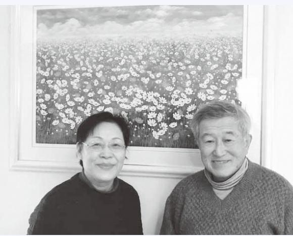
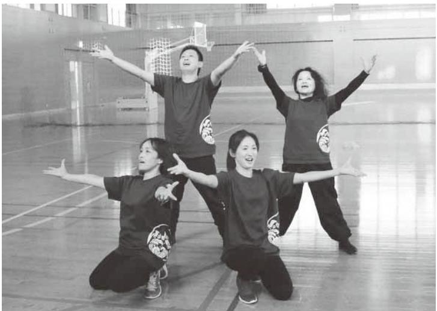

- 町内に「浪江町立なみえ創成小学校・中学校」 が開校H30. 4月
	- 町内に「浪江町認定こども園浪江にじいろこども園 」が開園 4月
	- なみえ桜まつり花火大会 4月
	- 県道50号(浪江三春線)の特別通過交通開始 4月
	- 8年ぶりに「日山(天王山)の山開き」 6月
	- 「 福島いこいの村なみえ」が再開 6月
	- 町内で8年ぶりに標葉郷野馬追祭 7月
	- 国道399号(国道114号から帰還困難区域境(葛尾村方面))および国道459号(国道 114号から帰還困難区域境(川俣町方面)) の特別通過交通開始 8月
	- 吉田数博氏が浪江町長に就任(昭和31年の合併以降第17代・10人目) 8月
	- 浪江消防署の本格運用開始 8月
	- 町内で「ふたばワールド」(浪江町地域スポーツセンター)を開催 9月
	- 浪江町イメージアップキャラクターに 「 うけどん」が就任 10月
	- 「なみえ町民号」が復活(志戸平温泉と世界遺産平泉への旅) 11月
	- 町内で大堀相馬焼「大せとまつり」が十日市祭と同時開催 11月
- 「 震災遺構検討委員会」が町に提言浪江町健康づくり総合計画を策定H31. 2月 3月

浪江町イメージアップキャラクターに 「うけどん」が就任(10月)

大堀相馬焼「大せとまつり」(11月)

平成30年4月号~平成31年3月号掲載分

この時期の復興に向けた主な動き ཱིဖƫƗƝƃ ະݭƫơय़ŷ

> ग़ƜƵƒƔơ ࠢ۵Ɲྏƾŷଝƛ ະݭơಣױſݱƂ

日山(天王山)の山開き(6月)

ふたばワールド2018 inなみえ(9月)

### てるみち戸川瑛道さん(藤橋)

取材者:認定非営利活動法人市民公益活動パートナーズ古山・松田取材日:2月17日 「平成30年4月広報なみえ掲載」

# 僕は、浪江とこの体験を"歴史"にしたくない。 伝えていきたい

戚宅、会津若松市、そして埼玉県

▲左から、母の祥子さん、瑛道君、3歳違いの弟翔瑛君ようこしょうえい

> 釣り、蛍も見に行きました 。 城西

小 6 年の時にバスケの県選抜に選

ばれて、大会で白河のチームに

入っていた浪江の友達と 5 年振り

に再会したことが新聞に載ったり

しました 。

福島市に来て市立信陵中学校

に入学しましたが、考え方が違っ

高校受験の真っ最中の取材にも関わらず、震災当時の様子や、各地に避難して後に一旦落ち着いた会津若松市の思い出、福島市に引っ越してからの体験などを、時には母の祥子さんの記憶も借りながら、いろいろお話しくださいました。

目指す高校での新しい友人との出会いや、これからのご活躍を心から祈っています。

◆ 僕には、ふるさとが二つある震災の時、僕は浪江小学校 2 年生で、地震が起きる直前まで遊んでいたと思います 。 保育園に行っていた弟の翔瑛は祖父が迎えに行きました 。 大熊町で教師をしていた母は、夕方学校を出ましたが渋滞に巻き込まれ、帰宅したのは夜の 9 時過ぎで、家はいろんなものが倒れたり落ちたりしていたので、すぐそばにあった父の事務所に泊まりました 。 翌朝 5 時頃から避難を呼び掛ける放送があり、母の実家のある南相馬市へ、それから郡山市の親

| ん ね な あ ト 生 ル ◆ 仲 年 友 ス た く い と 遊 ど 世 校 津 す だ 。 い れ と や 猪 浪 間 団 達 替 い れ ま は び 、 に 若 る 震 人 会 の こ 浪 の か の 別 に 苗 江 で は え で て し す ま 積 4 松 こ 式 災 も 津 と 江 で も ら 再 れ 代 の 始 皆 が す 、 た ぐ し も 月 市 と な か の 若 で 小 、 浪 会 別 で ク 恵 め 一 あ 。 本 。 に た っ 6 へ に ら ら 松 と す の み 江 の れ 浪 ラ ま た 緒 っ 高 当 い 打 。 た 日 会 戻 な 1 は は 。 思 ん の 集 に 江 ス れ バ で た 学 に ろ ち に え 城 雪 り り 年 思 雪 縄 い な 友 い な 小 会 ま ス し け 転 る 年 第 ん 解 西 に 、 、 余 え が 跳 出 に 達 が っ 学 、 し 入 か ケ た れ に 二 な け 小 寝 市 僕 り な 凄 び は 会 と あ た 校 し た し な ッ 。 ど な の こ た 学 転 内 た 後 か く や 外 い は 。 り ク の た ト ス 、 る ふ と し 校 ん ま の ち 、 っ て ザ で た 会 ま ラ 担 い ボ ポ 仲 時 る を 、 の だ し 城 は リ た 、 リ よ い っ し ス 任 な ー ー の に さ 助 気 同 り た 西 再 ス け こ ガ く で て た メ の 。 ル ツ 良 ク と け が 級 。 し 小 び ニ 遊 す い 。 イ 先 テ 成 の 少 い ラ み て 合 生 て れ の 学 会 | し な て ど い を た 転 学 々 校 と が し 会 ま 津 し 若 た 松 。 市 母 で が 再 勤 開 務 |
|-----------------------------------------------------------------------------------------------------------------------------------------------------------------------------------------------------------------------------------------------------------------------------------------------------------------------------------------------------------------------------------------------------------------------------------------------------------------------------------------------------------------------------------------------------------------------------------------------------------------------------------------------------------------------------------------------------------------------------------------------------------------------------------------------------------------------------------------------------------------------------------------------------------------------------------------------------------------------------------------------------------------------------------------------------------------------------------------------------------------------------------------------------------------------------------------------------------------------------------------------------------------------------------------------------------------------------------------------------------------------------------------------------------------------------------------------------------------------------------------------------------------------------------------------------------------------------------------------------------------------------------------------------------------------------------------------------------------------------------------------------------------------------------------------------------------------------------------------------------------|----------------------------------------------------------------------------------------------------------------------------------------------------|
|-----------------------------------------------------------------------------------------------------------------------------------------------------------------------------------------------------------------------------------------------------------------------------------------------------------------------------------------------------------------------------------------------------------------------------------------------------------------------------------------------------------------------------------------------------------------------------------------------------------------------------------------------------------------------------------------------------------------------------------------------------------------------------------------------------------------------------------------------------------------------------------------------------------------------------------------------------------------------------------------------------------------------------------------------------------------------------------------------------------------------------------------------------------------------------------------------------------------------------------------------------------------------------------------------------------------------------------------------------------------------------------------------------------------------------------------------------------------------------------------------------------------------------------------------------------------------------------------------------------------------------------------------------------------------------------------------------------------------------------------------------------------------------------------------------------------------------------------------------------------|----------------------------------------------------------------------------------------------------------------------------------------------------|

| い と 思 っ て い ま す 。 | あ る か ら 大 好 き で す 。 会 津 若 松 市 | 浪 江 は 自 然 や 気 候 も い い し 、 海 も | 浪 江 の 自 宅 は 改 装 し て 泊 ま れ | い ま し た 。 | に な っ て い る こ と を 実 感 し 、 福 島 | と っ て 事 故 は す で に 歴 史 の 出 来 事 | の 体 験 者 ま で 幅 広 い 年 代 の 方 々 の | で は 子 供 か ら チ ェ ル ノ ブ イ リ 事 故 | 父 の 知 人 が 主 催 し て い て 、 い わ き | 学 ぶ 「 ベ ラ ル ー シ 友 好 訪 問 団 」 を |  | に ベ ラ ル ー シ 共 和 国 に 行 っ て き ま | 昨 年 8 月 、 中 学 3 年 の 夏 休 み | ◆ ベ ラ ル ー シ で の 12 日 間 は 、 貴 重 | い ま す 。 | 復 話 じ や 被 ノ し さ ろ の あ 僕 興 、 く 福 連 よ こ を っ 害 ブ た ん ん か る は 相 な を 父 さ 島 れ う と 聞 て を イ 。 い な も 友 、 経 馬 支 の ん 市 て に を き 参 受 リ 隣 て 考 し 達 会 験 な え 仕 あ で 行 な 伝 、 加 け 原 国 、 え れ が 津 ど 、 事 り は っ っ え 特 し た 発 ウ 都 方 ま 多 若 浜 浪 ( ま 体 て て て に ま ベ 事 ク 会 を せ い 松 通 江 建 す 験 も い い 小 し ラ 故 ラ な す ん か や り 町 設 。 で ら る か さ た ル に イ ん る が ら 相 の を 業 だ き っ の な い 。 ー よ ナ だ 人 、 余 馬 高 有 ) か な て で け 子 ベ シ っ で な た 福 計 に 校 名 を ら い い 、 れ 供 ラ の て の と ち 島 に ゆ 生 に 継 僕 こ ま 父 ば た ル 現 多 チ 思 が 市 感 か に し い は と す に と ち ー 状 大 ェ っ た は じ り た で 将 も 。 よ 思 に シ 交 を な ル て く い る の |
|-------------------------------------------|-------------------------------------------------------------------------|-------------------------------------------------------------------------|---------------------------------------------------------------|-----------------------|-------------------------------------------------------------------------|-------------------------------------------------------------------------|-------------------------------------------------------------------------|-------------------------------------------------------------------------|-------------------------------------------------------------------------|-------------------------------------------------------------------------|--|-------------------------------------------------------------------------|---------------------------------------------------------------|--------------------------------------------------------------------------|------------------|--------------------------------------------------------------------------------------------------------------------------------------------------------------------------------------------------------------------------------------------------------------------------------------------------------------------------------------------------------------------------------------------------------------------------------------------------------------------------------------------------------------------------------------------------------------------------------------------------------------------------------------------------------------------------------------------------------------------------------------------------------------------------------------------------------------------------------------------------------------------------------------------------------------------------------------------------------------------------------------------------------------------------------------------------------------------------------------------------------------------------------------------------------------------------------------------------------------------------------------------------------------------------------------------------------------------------------------------------------------------------------|
|                                           |                                                                         | や                                                                       | く                                                             | る                     |                                                                         | の                                                                       |                                                                         |                                                                         |                                                                         |                                                                         |  |                                                                         |                                                               |                                                                          |                  |                                                                                                                                                                                                                                                                                                                                                                                                                                                                                                                                                                                                                                                                                                                                                                                                                                                                                                                                                                                                                                                                                                                                                                                                                                                                                                                                                                                |
| 来                                         |                                                                         |                                                                         |                                                               |                       |                                                                         |                                                                         |                                                                         |                                                                         |                                                                         |                                                                         |  |                                                                         |                                                               |                                                                          |                  |                                                                                                                                                                                                                                                                                                                                                                                                                                                                                                                                                                                                                                                                                                                                                                                                                                                                                                                                                                                                                                                                                                                                                                                                                                                                                                                                                                                |
| た                                         |                                                                         |                                                                         |                                                               |                       |                                                                         |                                                                         |                                                                         |                                                                         |                                                                         |                                                                         |  |                                                                         |                                                               |                                                                          |                  |                                                                                                                                                                                                                                                                                                                                                                                                                                                                                                                                                                                                                                                                                                                                                                                                                                                                                                                                                                                                                                                                                                                                                                                                                                                                                                                                                                                |
|                                           |                                                                         |                                                                         |                                                               |                       |                                                                         |                                                                         |                                                                         |                                                                         |                                                                         |                                                                         |  |                                                                         |                                                               |                                                                          |                  |                                                                                                                                                                                                                                                                                                                                                                                                                                                                                                                                                                                                                                                                                                                                                                                                                                                                                                                                                                                                                                                                                                                                                                                                                                                                                                                                                                                |
|                                           |                                                                         |                                                                         |                                                               |                       |                                                                         |                                                                         |                                                                         |                                                                         |                                                                         |                                                                         |  |                                                                         |                                                               |                                                                          |                  |                                                                                                                                                                                                                                                                                                                                                                                                                                                                                                                                                                                                                                                                                                                                                                                                                                                                                                                                                                                                                                                                                                                                                                                                                                                                                                                                                                                |
|                                           |                                                                         |                                                                         |                                                               |                       |                                                                         |                                                                         |                                                                         |                                                                         |                                                                         |                                                                         |  |                                                                         |                                                               |                                                                          |                  | て い て 戸 惑 う こ と も あ り ま し た 。                                                                                                                                                                                                                                                                                                                                                                                                                                                                                                                                                                                                                                                                                                                                                                                                                                                                                                                                                                                                                                                                                                                                                                                                                                                                                                        |

# 佐藤光琉さん(棚塩)

取材者:NPO法人つなぎteおおむた彌永・竹下取材日:2月17日 「平成30年4月広報なみえ掲載」

### 三年後、成人式で元気に会いましょう

伯母さんの嫁ぎ先である宮崎で避難生活を送る光琉さん。 忘れることのない故郷・浪江と、今の生活の場・宮崎のことを、丁寧に言葉を選びながらお話しくださいました。

▲応援団長として凛々しい演舞姿 (光琉さんの通う高校の体育祭にて) りり

◆ 浪江での日 々 浪江では幾世橋ドジャースというチームで、友達と野球をしていました 。 と言うより、野球を通した友達との楽しい時間を過ごしていました 。 監督は 「 宿題が終わらないと練習には参加させない 」 という厳しさだったので、学校が終わると一目散に体育館の周りの土間に集まり、宿題を終わらせました 。 急ぐあまり下敷きも使わず、ブスブスとプリントに穴が空いたりしました 。 僕はもらったばかりの 5 番のユニフォームを着る日を楽

| で で 僕 多 し 話 、 た く れ し 機 ち の ま | す 誘 て 団 る っ を 高 い 気 て 校 兼 ま に も 部 生 す は ら し 活 。 な は い て 宮 れ ま 、 バ 崎 ま し 練 ス に せ た 習 ケ 来 ん が に ッ て で 、 明 ト 野 し 野 け と 球 た 球 暮 応 。 を に れ 援 |
|-------------------------------------------------------------------------|--------------------------------------------------------------------------------------------------------------------------------------------------------------------------------------------------------------------------------------------------------------------------------------------------------------------------------------------------|
| 少 へ ま 行 し 浪 す け ず 江 。                     | も こ 毎 が な と 日 、 く も で 今 な 、 す は り 話 。 生 ま す 震 活 し こ 災 に た と の も 。 で 話 慣 の 題 れ 気 を て ま 避 快 ず け 適 さ る な                                                                                      |
| う に ろ は い か な う 、 で 、 っ し 会      | ろ い か 家 ま あ ら も と す 、 な の 大 。 宮 く ま 変 こ ま 崎 て な こ に 大 福 こ に 来 変 島 と 来 て だ に が る よ っ い あ ま か た た り で っ で ら ま い た し 、 し ろ と ょ 住 た い 思 う む |
| ま て も い す も そ 」 。 何 う っ                | ◆ だ で 今 な 、 の 、 や 生 と っ 活 だ と 。そ け 暖 思 か し い い て ま 所 、将 し に た 来 行 。 の け こ る と ん                                                                                                                                                |
| い ◆ 浪 浪 う 江 江                                         | 避 か 行 い 遠 く 気 難 い と 持 所 と 聞 ち は か い だ と は た っ に 思 と た か わ き ん く ず に で 寒 、 は す か 県 、 。 っ 内 嫌 宮 た で だ 崎 の の と に                                                                  |
| け す を で が 進 は 、 む                               | で え ま も た し し か た て も 。 い し 傍 な れ 目 い な に と い は や け 楽 っ れ し て ど そ ら 、 う れ そ に な う 見                                                                                                                                   |
| な し た 来 の か 年 で                                    | キ ま 当 ャ 転 ッ て 々 チ も と な ボ は 避 た ー く 難 め ル 不 し を 安 て し な い て 気 る 遊 持 間 ん ち も で の い 、 ま                                                                                                                              |
| だ け 江 野 ド れ の 球 ジ ど                          | 何 い 家 し も 、 と み 手 野 と に 元 球 も し に の に て 残 思 津 い っ い 波 ま て 出 で し い の 流 た ま も さ が せ の れ 、 ん は て 大 。 も し 切 う ま な                                                                  |

| 話      | 、      | た      | く      | れ      | し      | 浪      | 行      | す      | か      | な      | う      | 、      | で | す      | も      | そ      | 」      | う  | 浪      | 浪      | で      | が      | 進      | の      | 来      | た      | ド      | れ      | の      | 球      |
|--------|--------|--------|--------|--------|--------|--------|--------|--------|--------|--------|--------|--------|---|--------|--------|--------|--------|----|--------|--------|--------|--------|--------|--------|--------|--------|--------|--------|--------|--------|
| し      | 機      | ち      | の      | ま      | ず      | 江      | け      | 。      | 、      | っ      | し      | 会      | す | 。      | 何      | う      | っ      | よ  | 江      | 江      | は      | 、      | む      | で      | 年      | か      | ジ      | ど      | 友      | を      |
| た      | 会      | を      | 人      | せ      | つ      | の      | る      | 大      | 今      | た      | 、      | い      | ね | や      | に      | だ      | て      | り  | の      | へ      | あ      | は      | と      | 、      | は      | っ      | ャ      | 、      | 達      | し      |
| い と | が      | 忘      | に      | ん      | 忘      | こ      | だ ろ | 人      | は      | 以      | 自      | た      | 。 | っ      | つ      | し      | 感      |    | こ      | の 思 | り ま | っ      | い      | 社      | 受      | た      | ー      | あ      | に      | て      |
| 思      | あ      | れ      | あ      | 。      | れ      | と      | う      | に      | 、      | 上      | 分      | い      | で | ぱ      | け      | 、      | じ      | 、「 | と      | い      | せ      | き      | う      | 会      | 験      | … 。 | ス      | の      | 会      | い      |
| っ      | っ      | ず      | の      | だ      | ら      | は      | し      | な      | そ      | 、      | の      | 人      | も | り      | て      | 浪      | で      | 忘  | は      |        | ん      | り      | 選      | 科      | 生      |        | の      | 時      | え      | た      |
| て      | た ら | に      | 震      | け      | れ      | 、      | 。      | れ      | れ      | 仕      | 生      | に      | 、 | 、      | も      | 江      | す      | れ  | 「      |        | 。      | と      | 択      | の      | 。      |        | み      | の      | た      | ら      |
| い      | 自      | い て | 災 と | ど 、 | て い | 月 日 |        | ば 自 | で い | 方 が | 活 の | は 会 | 今 | 友 達 | 、 浮 | の 食 | 。 野 | る  | 思 い |        |        | 決 め | も 考 | 教      | 世      |        | ん      | 僕      | か      | 、      |
| ま      | 分      | 欲      | そ      | 一      | く      | が      |        | 由      | い      | な      | 場      | え      | の | に      | か      | べ      | 球      | こ  | 出      |        |        | て      | え      | 師 に | 界 史 |        | な と | は 、 | も し | ど こ |
| す 。 | の      | し      | の      | 人      | の      | 経      |        | に      | と      | い      | が      | な      | 浪 | 会      | ん      | 物      | を      | と  | す      |        |        | い      | て      | な      | が      |        | 野      | た      | れ      | か      |
|        | 言      | い      | 後      | で      | か      | て      |        | 福      | 思      | と      | 宮      | い      | 江 | い      | で      | が      | 見      | は  | 」      |        |        | る      | い      | る      | 好      |        | 球      | だ      | な      | で      |
|        | 葉      | の      | の      | も      | も      | ば      |        | 島      | い      | い      | 崎      | だ      | で | た      | き      | 出      | て      | な  | と      |        |        | わ      | ま      | 道      | き      |        | が      | た      | い      | 浪      |

取材者:地域社会デザイン・ラボ遠藤取材日:1月31日 「平成30年4月広報なみえ掲載」

### 南相馬でサークルが作れたらいいな

福島県

▲自宅の居間にて。 「南相馬にお越しの際は、ぜひご連絡ください!」 連絡先 090(2271)8861(柴佳男)

震災前は、柴油店を経営していた柴さんご夫妻。請戸のほとんどの住民の方とお付き合いがあったそうです。当時のお休みは月2回。精力的に事業を展開されていました。今だからこそ、地域の皆さんへ感謝の気持ちを伝えたいそうです。

現在は、南相馬市の新築したご自宅に娘さんと3人でお住まいです。浪江の家にあった庭石を自宅の玄関前に配置して、当時を懐かしんでおられます。

| 佳 男 さ ん                          | 着 い て き た      | 1 年 を 迎                               | ら ず 苦 労                               | う な っ て                               | か 、 町 内                               | は 、 ご み                               | 馬 市 に 移                          | そ の 後                                     | き ま し た 。 | し て た く                               | え 、 習 い                               | た 。 そ の                          | く だ さ っ                               | 「 つ な が                               | 玉 県 に 避                               | 美 江 さ ん                          | に 感 謝 | ◆ 埼 玉 で                               |
|-------------------------------------------|----------------------------|------------------------------------------------|------------------------------------------------|------------------------------------------------|------------------------------------------------|------------------------------------------------|-------------------------------------------|-------------------------------------------------|-----------------------|------------------------------------------------|------------------------------------------------|-------------------------------------------|------------------------------------------------|------------------------------------------------|------------------------------------------------|-------------------------------------------|-------------|------------------------------------------------|
| 初 め は 、 い わ き 市 に | と こ ろ で す 。 | え る 今 、 よ う や く 落 ち | も し ま し た 。 間 も な く | い る の か 、 な ど が 分 か | 会 な ど 区 の 仕 組 み が ど | を ど こ に ど う 捨 て る の | り 住 み ま し た 。 当 初 | 、 平 成 29 年 3 月 に 南 相 |                       | さ ん 楽 し ま せ て い た だ | 事 や 体 験 活 動 な ど を 通 | お 陰 で 知 り 合 い も 増 | て い て よ く 参 加 し ま し | り カ フ ェ 」 を 実 施 し て | 難 し ま し た 。 そ こ で は | 私 た ち は 被 災 後 、 埼 |             | の 「 つ な が り カ フ ェ 」 |

| 思 っ て い ま す 。 | 域 の 方 々 と 仲 良 く 過 ご せ た ら | い こ れ く で か し ら ず ょ う っ 。 と だ 南 か 相 ら 馬 こ に そ 住 、 ん | け れ ば う れ し い で す 。 | た い と い う 方 か ら 連 絡 を い た | 緒 に 南 相 馬 で サ ー ク ル を 楽 し | 動 に は 移 し て は い ま せ ん が 。 | と 思 っ て い ま す 。 で も 、 ま だ | ら な い 形 で 実 施 で き た ら い い | 、 な る べ く 参 加 者 に 経 費 が か | う こ と を 聞 い た り も し た の | ー ク ル 活 動 に 助 成 金 が 出 る と | 」 と い う こ と で す 。 被 災 者 の | る サ ー ク ル を 作 れ た ら い い | 手 芸 や 編 み 物 が 好 き な 人 が 集 | 江 さ ん 最 近 考 え て い る の は | 地 域 の 方 と 仲 良 く | り 、 本 当 に 感 謝 し て い ま す 。 | 私 た ち に と て も 良 く し て く だ | い ま す 。 南 相 馬 に 来 た ば か り | 避 難 し た 住 民 の 皆 さ ん が 集 っ | 体 操 に は 、 浪 江 町 か ら 南 相 馬 | も 通 っ て い ま す 。 こ の ダ ン ベ | 。 ま た 、 月 2 回 ダ ン ベ ル 体 操 | 飾 り の 講 座 」 に 参 加 し て い ま | 習 セ ン タ ー で 企 画 す る 「 吊 る | す る 「 お 茶 会 」 や 原 町 の 生 涯 | 、 浪 江 町 社 会 福 祉 協 議 会 が 実 | 江 さ ん 南 相 馬 に 住 ん で か ら | の も 楽 し い で す ね 。 | 人 と 話 し て ど ん な 人 か 理 解 す | で す が 、 人 が 好 き で 、 知 ら な |
|---------------------------------|---------------------------------------------------------------|--------------------------------------------------------------------------------------------------------------------------------|------------------------------------------------|---------------------------------------------------------------|---------------------------------------------------------------|---------------------------------------------------------------|---------------------------------------------------------------|---------------------------------------------------------------|---------------------------------------------------------------|----------------------------------------------------------|---------------------------------------------------------------|---------------------------------------------------------------|----------------------------------------------------------|---------------------------------------------------------------|----------------------------------------------------------|--------------------------------------|---------------------------------------------------------------|---------------------------------------------------------------|---------------------------------------------------------------|---------------------------------------------------------------|---------------------------------------------------------------|---------------------------------------------------------------|---------------------------------------------------------------|---------------------------------------------------------------|---------------------------------------------------------------|---------------------------------------------------------------|---------------------------------------------------------------|----------------------------------------------------------|-------------------------------------------|---------------------------------------------------------------|---------------------------------------------------------------|
|---------------------------------|---------------------------------------------------------------|--------------------------------------------------------------------------------------------------------------------------------|------------------------------------------------|---------------------------------------------------------------|---------------------------------------------------------------|---------------------------------------------------------------|---------------------------------------------------------------|---------------------------------------------------------------|---------------------------------------------------------------|----------------------------------------------------------|---------------------------------------------------------------|---------------------------------------------------------------|----------------------------------------------------------|---------------------------------------------------------------|----------------------------------------------------------|--------------------------------------|---------------------------------------------------------------|---------------------------------------------------------------|---------------------------------------------------------------|---------------------------------------------------------------|---------------------------------------------------------------|---------------------------------------------------------------|---------------------------------------------------------------|---------------------------------------------------------------|---------------------------------------------------------------|---------------------------------------------------------------|---------------------------------------------------------------|----------------------------------------------------------|-------------------------------------------|---------------------------------------------------------------|---------------------------------------------------------------|

中野卓さん・フキ子さん(高瀬)

取材者:NPO法人つなぎteおおむた彌永取材日:1月24日 「平成30年4月広報なみえ掲載」

### 浪江への想い

▲フキ子さんのお誕生日にお子さまたちから贈られたコスモス畑の絵の前で、笑顔のお二人

長年連れ添った夫婦でも、思いはそれぞれ。 「状況さえ整えば、浪江に戻って生活をしたい。」 とおっしゃるフキ子さんと、「浪江に定住とは考えていないけれど、折に触れて足を運ぼう。」とお考えの卓さん。お二人のお気持ちを様々な角度からお聞かせいただきました。

◆ 先週、浪江町主催の交流会にご夫婦で参加されたそうですが、いかがでしたか卓さん初めてお会いする方もいらしたけれど、浪江というだけで、親しみが湧くね 。 浪江時代には知らない同士だったのに、避難してから知り合って仲良しになった方もいます 。 フキ子さん役場の方に話を聞いて、町が徐 々 に復興し始めていることはよく分かりましたよ 。 でも、今はまだ、私がすぐに帰れる場所ではないって感じました 。 卓さんリフォームしたばかり

| も 長 い 浪 ん 江 だ の か 方 ら が 、 ず 仕 っ 事 と 仲 多 間 い も ん 友 だ 人 | た 卓 っ さ て ん 、 浪 江 で の 生 活 の ほ う が | な ぁ 。」 と 私 。 も 佐 世 保 出 身 と い っ | と 言 う よ り 、 年 々 、「 こ こ は 違 う | た っ て も 違 和 感 が あ る の よ 。 … | だ け れ ど 、 や っ ぱ り い つ ま で | う 保 と は 決 避 め 難 た 場 の 所 は 。 確 こ か こ に に 自 避 分 難 た し ち よ | え な い で し ょ う け ど 、 こ の 佐 世 | 「 こ こ は 嫌 、 戻 り た い 。」 と は 言 | 都 の 合 が で 正 引 直 っ な 越 と し こ て ろ い で る す の 。 な 仕 ら 事 、 の | は 同 じ で も 何 か が 違 う 、 と い う | て い る 「 浪 江 に 帰 る 」 は 、 言 葉 | 身 の お 父 さ ん ( 卓 さ ん ) の 言 っ | も 浪 江 。 避 難 先 で あ る 佐 世 保 出 | フ キ 子 さ ん 私 は 生 ま れ も 育 ち | ◆ 画 楽 さ し れ そ て う い で る す ん ね で 。 す お か 二 人 で 計 |  | で す か 。 | 今 の 生 活 も 楽 し く な る じ ゃ な い | が あ る 。』 そ れ だ け で 、 こ こ で の | た 。『 何 日 か だ け で も 帰 れ る 場 所 | 大 い に 利 用 し た い と 思 い ま し | ス 」 と 聞 い て 、 浪 江 に 帰 る 時 、 | 会 で 「 い こ い の 村 に ロ グ ハ ウ | い の が 実 情 で す 。 そ れ で 、 交 流 | は 帰 る と い っ て も 帰 る 家 さ え な | 更 地 に な り ま し た 。 だ か ら 、 今 | だ っ た 浪 江 の 自 宅 は 、 解 体 し て |
|-------------------------------------------------------------------------------------------------------------------------------------|-----------------------------------------------------------------------------------|--------------------------------------------------------------------------|---------------------------------------------------------------------|--------------------------------------------------------------------|---------------------------------------------------------------|------------------------------------------------------------------------------------------------------------------------------------------|--------------------------------------------------------------------|---------------------------------------------------------------------|------------------------------------------------------------------------------------------------------------------------------------------|--------------------------------------------------------------------|--------------------------------------------------------------------|--------------------------------------------------------------------|--------------------------------------------------------------------|---------------------------------------------------------------|----------------------------------------------------------------------------------------------------------------------|--|------------------|--------------------------------------------------------------------|---------------------------------------------------------------------|---------------------------------------------------------------------|---------------------------------------------------------------|--------------------------------------------------------------------|---------------------------------------------------------------|--------------------------------------------------------------------|--------------------------------------------------------------------|--------------------------------------------------------------------|--------------------------------------------------------------------|
|-------------------------------------------------------------------------------------------------------------------------------------|-----------------------------------------------------------------------------------|--------------------------------------------------------------------------|---------------------------------------------------------------------|--------------------------------------------------------------------|---------------------------------------------------------------|------------------------------------------------------------------------------------------------------------------------------------------|--------------------------------------------------------------------|---------------------------------------------------------------------|------------------------------------------------------------------------------------------------------------------------------------------|--------------------------------------------------------------------|--------------------------------------------------------------------|--------------------------------------------------------------------|--------------------------------------------------------------------|---------------------------------------------------------------|----------------------------------------------------------------------------------------------------------------------|--|------------------|--------------------------------------------------------------------|---------------------------------------------------------------------|---------------------------------------------------------------------|---------------------------------------------------------------|--------------------------------------------------------------------|---------------------------------------------------------------|--------------------------------------------------------------------|--------------------------------------------------------------------|--------------------------------------------------------------------|--------------------------------------------------------------------|

| め ろ る よ ラ て 術 フ 卓 、 。 た ウ い を の で と う キ さ | ◆『 な 子 カ お す も に ら た は で け ら 送 し さ よ フ い 供 ナ も 嫁 れ 思 は 、 ん 、 ど 、 れ ん 。 迎 |
|-------------------------------------------------------------------------------------------------------|-----------------------------------------------------------------------------------------------------------------------------------------------------------------------------------|
| っ は め ン ま し に い か て 子 ん い に ド 徐 う す て           | 2 わ キ や が ダ に ば い 、 送 だ 娘 、 な な ) だ を 年 け 子 っ 生 に 行 孫                                               |
| し 思 か さ 、 ゴ が 今 私 々 目 え ん                                         | ま ち 迎 な と 少 か い に け 頑 後 で て さ ま い く も す ょ も 、 孫 し な ね し ど 張 に は ん                 |
| ら が 何 ル 、 は は に 標 ば で 。 か そ フ 自 障 震 体 を      | み れ る こ 高 け っ 嫌 と の 、 か 。 て 、 浪 っ な た る 三 と 校 ど と で 思 力 私 何 自 今 み お 江       |
| ね す 運 う を 分 害 災 を 立 浪 。 か 動 ね 楽 の 者 直 鍛 て | い て ら か 女 が 卒 ね お は う に が か 分 は れ 母 に の ど く ら に 決 業                                                    |
| 江 を 。 し ペ 手 後 え て に                                                        | ( 休 な ん な こ 体 の 、 ば さ 帰 よ う れ 、 は ま で 笑 み い で る こ に 時 孫 、 ん っ 。 だ                 |
| し 健 ん ー 帳 に る 、 帰 て 康 で ス を 肺 と そ                     | て 楽 一 っ 、 ) し し す た へ い 間 の そ ( て ろ い し 人 た 次 後 た 。 。 め 来 い も み 学 う フ う  |
| る 頑 で ま で 持 の い れ た 張 い す グ っ 手 う ま                | る み 目 し 女 2 い た る だ だ た こ な 校 か キ 。 が 』 の 、 は 年 と ま か っ の と い か の も 子       |

石川康夫さん(請戸)

取材者:地域社会デザイン・ラボ中島取材日:2月24日 「平成30年5月広報なみえ掲載」

体が動く限り漁師を続け、漁業で浪江を盛り上げたい

お父さんの代から請戸で漁業を営んできた第8康勝丸の船長・石川さん(62歳)。

会津や米沢で避難生活を送った後、南相馬市原町区に自宅を再建されました。

現在は試験操業を行いつつ、漁業協同組合の皆さんと共に浪江の漁業再生に向けて活動されています。

◆ 震災当時のこと今も鮮明に覚えています 。 漁業組合の集まりに行く途中に地震が起き、家族を浪江の親戚の家に避難させ、私は船で沖に避難しました 。 誰も経験したことのない大津波でしたから、舵を取るのに必死で 。 あの状況では流された方を助けられなかったのは仕方がないと割り切ってはいますが、もしかしたら一人くらい助けられたんじゃないかと、やりきれない気持ちで思い返すこともあります 。 当日は沖に避難した 16 隻の船と一晩中、無線で連絡を取り合い、翌朝、全船が請戸の港に戻りました 。 そうしたら、何もない … 。 請戸漁港から歩いて 5 分のかじ

▲請戸とご自宅を行き来する毎日の石川さん。 南相馬・道の駅にて。

| ん で す 。                                                                       | く 、 当 た り 前 で す が 、 地 場 で 水 揚 |
|----------------------------------------------------------------------------------------|-------------------------------------------------------------------------|
| る か ら 、 我 々 も 頑 張 ろ う と 思 え る                | は 時 季 ご と に 捕 れ る 魚 の 種 類 が 多 |
| す ご く 強 い 。 青 年 部 が 頑 張 っ て い                | 回 っ て い ま す 。 元 々 、 こ の 辺 の 浜 |
| 出 れ ば ラ イ バ ル だ け ど 、 団 結 心 は                | ど の 魚 種 は 国 の 定 め た 基 準 値 を 下 |
| 大 体 み ん な 負 け ん 気 が 強 く 、 沖 に                | 魚 を 流 通 さ せ て い ま す が 、 ほ と ん |
| こ と も あ り ま す 。 漁 師 と い う の は                | び 、 放 射 能 検 査 を し た 上 で 安 全 な |
| 我 々 が 教 え る し 、 逆 に 教 え ら れ る                | 現 在 、 捕 っ た 魚 は 相 馬 に 運                |
| の 若 手 は 20 代 。 分 か ら な い こ と は               | な い か と 思 っ て い ま す 。                     |
| 代 、 50 代 も 頑 張 っ て い る し 、 一 番               | で 、 少 し は 町 の 力 に な れ る ん じ ゃ |
| 頑 張 っ て く れ て い ま す 。 30 代 、 40              | を 合 わ せ て 漁 業 を 復 興 さ せ る こ と |
| が あ り ま す が 、 請 戸 は 若 い 漁 師 も                | 開 に 力 を 入 れ て く れ ま し た し 、 力 |
| ど の 地 域 も 後 継 者 不 足 の 問 題                          | る 見 通 し で す 。 浪 江 町 も 漁 港 の 再 |
| 願 っ て い ま す 。                                                        | 今 年 の 4 月 頃 に 建 設 工 事 が 着 工 す |
| ず れ 社 を 再 建 し て い た だ け た ら と                | い ま す 。 ま た 、 請 戸 漁 港 の 市 場 も |
| 神 社 も 津 波 で 流 さ れ ま し た が 、 い                | は 」 と い う 当 初 の 目 標 に 近 づ い て |
| て 海 に 飛 び 込 ん だ も の で す 。 野                     | 造 船 さ れ る 予 定 で 、「 せ め て 30 隻    |
| お り ま し た 。 私 も 昔 は 若 さ に 任 せ                | せ ん が 、 来 年 度 の 予 算 で も う 2 隻 |
| を 毎 年 2 月 の 第 3 日 曜 日 に や っ て                | 1 0 0 隻 く ら い 。 そ れ に は 及 び ま |
| 神 み 輿 こ し を 担 い で 海 に 入 る と い う 祭 り | た 。 震 災 前 は 小 さ い 船 も 含 め る と |
| 祭 と い っ て 、 漁 業 組 合 の 青 年 部 が                | 港 が 再 開 し 、 26 隻 が 帰 還 し ま し     |
| な 儀 式 で す 。 ま た 震 災 前 に は 安 波                | に 出 て い ま す 。 昨 年 2 月 に 請 戸 漁 |
| と 大 漁 を お 祈 り す る と い う 伝 統 的                | 今 は 試 験 操 業 で 週 1 、 2 回 漁           |
| 社 の 沖 合 で お 神 酒 を さ さ げ 、 安 全                | ◆ 漁 業 で 浪 江 を 盛 り 上 げ た い           |
| て 、 出 初 式 を 行 い ま し た 。 く さ 野 の 神      |                                                                         |
| 今 年 1 月 2 日 に は 震 災 後 初 め                          | の で は と 思 い ま す 。                               |
| ◆ 若 手 の 漁 師 も 頑 張 っ て い ま す                     | も 帰 れ な い 方 が た く さ ん お ら れ る |
|                                                                                        | い 。 同 じ よ う な 事 情 で 帰 り た く て |
| と こ ろ で す 。                                                             | し た 。 で も 本 当 は 浪 江 に 戻 り た      |
| 払 拭 し て い く か を 話 し 合 っ て い る                | を 過 ご せ る よ う 原 町 に 家 を 建 て ま |
| 心 配 な の は 風 評 被 害 。 ど の よ う に                | 送 っ た 後 、 両 親 が 落 ち 着 い て 余 生 |
| 原 発 に 一 番 近 い 港 と い う こ と で 、                | そ れ か ら 4 年 近 く 避 難 生 活 を           |
| は 味 が 全 然 違 い ま す 。 た だ 請 戸 は                | 一 面 が れ き と 水 で し た 。                     |
| げ さ れ た 魚 は ス ー パ ー で 買 う 魚 と                | 場 所 に あ っ た 私 の 家 も 流 さ れ 、      |

取材者:認定特定非営利活動法人市民公益活動パートナーズ古山・松田取材日:3月17日 「平成30年6月広報なみえ掲載」

### 集まって、しゃべって、歌って、運動して! 淑美会は、皆さんの心と健康を支えたい

取材に伺った日は月1回の「みんなのカラオケお茶っこ会」の活動日でした。浪江町地域スポーツセンターに歌声と笑い声が響いていました。

ǖȒ½ǽNJȚǥǹȌ½

「誰でも大歓迎。一緒に楽しい時間を過ごしましょう」と、浪江町地域スポーツセンターを訪れる人々にも声を掛ける会主の根岸さん。浪江に戻った方も、近隣から駆けつけた方も和気あいあいと、思い思いに楽しんでいらっしゃいました。

今回は淑美会のメンバー7名に集まっていただき、お話を伺いました。

▲月1回の淑美会に集った方々(3月17日午前撮影)

▲安倍さん

思い、ボランティア活動を始め

ました 。

▲紺野さん ▲落合さん

▲川﨑さん

加していこうと思います 。

根岸さん

宅に避難している人たちが孤立

し、悩んでいる人たちが多かっ

たので、笑顔になれるようにと

仮設住宅や借上げ住

淑美会 「唄・舞・楽の共演復興祭」

南相馬市文化会館「ゆめはっと」

今年で4回目。ぜひ、私たちの日頃の成果を見に来てください!そし

〈問合せ・連絡先〉 根岸淑子 090(6781)6003

●6月17日(日)

●9時30分開演/無料

て、仲間になってください。

▲柴さん ▲鈴木さん ▲根岸さん

▲グループインタビューの風景

緒に活動を始めました 。 会員は

約 3 0 0 人、役員は 7 人、ほか

に連絡員 10 名ほどがいました 。

新年には 「 ミニ芸能祭 」 、花

見や芋煮会もやりました 。 最

初、なみえ相双会の催しは、原

町区の喫茶 「 いこい 」 から始ま

り、南相馬市立中央図書館を借

りていたのですが、南相馬市社

会福祉協議会の計らいで視聴覚区の仮設住宅を経て、戻りまし

室をお借りして 4 年間活動を続

◆ 最後に、皆さんから一言、コ

メントをお聞かせください

落合さん

とても楽しみです 。「 ゆめはっ

と 」 のステージで歌うのは、本

当に気持ちがいいんですよ 。

紺野さん

たのが、今は歌うことが楽しみ

になりました 。

柴さん

きながら、参加を続けたいと

思っています 。

川﨑さん

楽しみます 。

鈴木さん

みに参加します 。

根岸さん

うけれども、みんなで一緒に楽し

んでいきたいです 。 一人で考え込

む時間は少ない方がいいんです

から、ね 。 みんなと力を合わせ

て笑顔を取り戻していきます 。

一人一人の事情は違会が続く限り、楽し体をかばいながら、皆さんに支えていただ

以前は鼻歌程度だっ

6 月 17 日の復興祭が

けることができました 。

根岸さん

いな存在ですよ 。

柴さん

われて入会しました 。 実は、お

互い請戸小・中学校の同級生な

んです 。 原町教室やこのお茶会

に参加するようになりました 。

地域の人たちとばったりと再会

して電話番号を交換することも

あります 。 自分で体を守ろうと、

腰が少しくらい痛くても、お茶

会や体操には通っています 。

落合さん

の連絡員をしており、慰安旅行

に同行した時に、カラオケが楽

しかったので、帰って来てから

私も淑美会に入会しました 。

紺野さん

後、福島に戻り、南相馬市原町

区の八方内仮設住宅に 3 年いま

した 。 仮設でなみえ相双会と一

緒に芋煮会を 2 回開催した時に

根岸さんと知り合いになり、夫

が 2 年くらい先に淑美会のメン

バーになったんです 。 その後、

私も入会しました 。 これからも

できる限り、ボランティアに参

富山などに避難したもともと妻が自治会私は、鈴木さんから誘

淑美会の 「 母 」 みたた 。 一人暮らしをしていたら、

浪江町社会福祉協議会にこの会

を紹介され、問い合わせました 。

だから、外に出るようになった

のは会がきっかけです 。

鈴木さん

ら南相馬市原町区に移った時に、

誰も知っている人がいなくて心

細く、根岸さんに電話しました 。

点在する借上げ住宅の人たちは

「 集まる場所がない、淋しい 」

と言っていたので、借上げ住宅

自治会 「 なみえ相双会 」 を 4 〜

5 人で立ち上げ、会員として一

避難先だった埼玉か

> ◆ どのような活動グループなのか、教えてください根岸さん ( 淑美会会主 ) もともとはカラオケが中心の会でしたが、今では避難されている方、そして浪江町に帰られた方 々 の心の支えになれたらという考えの下に、活動を続けています 。 さらに、南相馬市などのデイサービスや特別養護老人施設などを訪問し、ボランティア活動も行っています 。 施設入居者の皆さまも一緒になって歌ったり、踊れたりできるプログラム内容に努め、最後に握手をして別れますが、涙を流しながら 「 また来てくださいね 」 と手を握られると、メンバーも心を打たれ、練習に力が入るようです 。 また、年に一度、研修を兼ねた慰安旅行( 2 泊 3 日 )も行っており、これまで那須塩原、土湯、野地温泉など送迎付きのリーズナブルな宿泊先を探して楽しんでいます 。 今年は 7 月初旬を予定しており、ご連絡いただければどなたでも参加できます 。 ◆ 皆さんのお得意のジャンルをお聞かせください鈴木さん演歌や懐メロです 。 柴さん演歌や歌謡曲ですね 。 落合さん演歌 。 最近は、福田こうへいの曲をよく歌っています 。 紺野さん演歌や歌謡曲が大好きです 。 川﨑さん 3 か月前に入会しま

| 川 俣 町 | て い ま | 新 居 が | ら 、 こ | が 川 添 | 町 に 戻 | ん で い | 川 﨑 さ | 分 か り | 帰 っ て | う か と | 年 を 取 | の か も | し 、 あ | ら し や | は 全 然 | あ ん な | に 戻 り | と 、 浪 | ま う と | イ グ マ | 所 は い | て き ま | ら す ぐ | な く て | し た が | 安 倍 | く だ | 会 と | ◆ 皆 さ | が 難 点 | を や っ | 安 倍 | や 申 請 | 江 町 地 | し た 。 |
|-------------|-------------|-------------|-------------|-------------|-------------|-------------|-------------|-------------|-------------|-------------|-------------|-------------|-------------|-------------|-------------|-------------|-------------|-------------|-------------|-------------|-------------|-------------|-------------|-------------|-------------|--------|--------|--------|-------------|-------------|-------------|--------|-------------|-------------|-------------|
| や           | し           | 震           | ち           | の           | り           | ま           | ん           | ま           | こ           | 迷           | り           | し           | と           | す           | 違           | に           | た           | 江           | さ           | ば           | な           | し           | 帰           | 「           | 、           | さ ん | さ      | の      | ん           | か           | て           | さ ん | 手           | 域           | 浪           |
| 福 島      | た 。      | 災 の      | ら に      | 出 身      | ま し      | し た      | 僕           | す よ      | な い      | っ て      | ま す      | れ な      | 2 〜      | く           | い ま      | 帰 り      | か っ      | へ で      | え 思      | っ か      | く て      | た 。      | る 」      | 避           | 浪           |        | い      | 関      | の           | な 。      | い           |        | 続 を      | ス ポ      | 江 に      |
| 市           | 震           | 3           | 住           | だ           | た           | が           | は           | 。           | 人           | い           | の           | い           | 3           | な           | す           | た           | た           | は           | い           | り           | 、           | で           | と           | 難 指      | 江 の      | あ ち |        | わ り | 日 頃      |             | ま す      | ぼ け | 手           | ー           | 住           |
| 、           | 災           | か           | む           | っ           | 。           | 、           | 仕           |             | の           | ま           | で           | が           | 歳           | る と      | 。           | か           | ん           | な           | ま           | 。           | イ           | も           | 言           | 示           | 生           | こ      |        | な      | の           |             | 。           | 防      | 伝 っ      | ツ セ      | ん で      |
| 南 相      | 後 、      | 月 前      | こ と      | た も      | 亡 く      | 震 災      | 事 で      |             | 気 持      | す 。      | ね 、      | 、 一      | 若 け      | は           | 町 が      | っ た      | だ よ      | く 、      | し た      | 頭 が      | ノ シ      | 、 親      | い 続      | 解 除      | 活 が      | ち に |        | ど を | 暮 ら      |             | 覚 え      | 止 に | て           | ン           | い           |
| 馬           | 避           | に           | に           | の           | な           | 前           | 広           |             | ち           | だ           | ど           | 日           | り           | 思           | す           | 気           | ね           | 昔           | ね           | 狂           | シ           | 戚           | け           | に           | 忘           | 避      |        | 聞      | し           |             | が           | カ      | い ま      | タ ー      | る の      |
| 市 鹿      | 難 し      | 完 成      | し           | で           | っ           | に           | 島           |             | も           | か           | う           | ご           | ゃ           | え な      | ぐ           | 持           | 。           | の           | 。           | っ           | や           | や           | て           | な           | れ           | 難      |        | か      | ぶ           |             | 悪           | ラ      | す           | の           | で           |
| 島           | て           | し           | て 、      | す か      | た 妻      | 浪 江      | に 住      |             | よ く      | ら 、      | し よ      | と に      | い い      | い           | に 暮      | ち と      | 今 は      | 生 活      | き っ      | て し      | ア ラ      | 隣 近      | 戻 っ      | っ た      | ら れ      | し ま |        | せ て | り 、      |             | い の      | オ ケ | 。           | 予 約      | 、 浪      |

▲柴さん ▲鈴木さん ▲根岸さん

▲グループインタビューの風景

区の仮設住宅を経て、戻りました 。 一人暮らしをしていたら、浪江町社会福祉協議会にこの会を紹介され、問い合わせました 。 だから、外に出るようになったのは会がきっかけです 。 鈴木さん避難先だった埼玉から南相馬市原町区に移った時に、誰も知っている人がいなくて心細く、根岸さんに電話しました 。 点在する借上げ住宅の人たちは 「 集まる場所がない、淋しい 」 と言っていたので、借上げ住宅自治会 「 なみえ相双会 」 を 4 〜 5 人で立ち上げ、会員として一緒に活動を始めました 。 会員は約 3 0 0 人、役員は 7 人、ほかに連絡員 10 名ほどがいました 。 新年には 「 ミニ芸能祭 」 、花見や芋煮会もやりました 。 最初、なみえ相双会の催しは、原町区の喫茶 「 いこい 」 から始まり、南相馬市立中央図書館を借りていたのですが、南相馬市社会福祉協議会の計らいで視聴覚

▲紺野さん ▲落合さん

▲川﨑さん

▲安倍さん

室をお借りして 4 年間活動を続けることができました 。 根岸さん淑美会の 「 母 」 みたいな存在ですよ 。 柴さん私は、鈴木さんから誘われて入会しました 。 実は、お互い請戸小・中学校の同級生なんです 。 原町教室やこのお茶会に参加するようになりました 。 地域の人たちとばったりと再会して電話番号を交換することもあります 。 自分で体を守ろうと、腰が少しくらい痛くても、お茶会や体操には通っています 。 落合さんもともと妻が自治会の連絡員をしており、慰安旅行に同行した時に、カラオケが楽しかったので、帰って来てから私も淑美会に入会しました 。 紺野さん富山などに避難した後、福島に戻り、南相馬市原町区の八方内仮設住宅に 3 年いました 。 仮設でなみえ相双会と一緒に芋煮会を 2 回開催した時に根岸さんと知り合いになり、夫が 2 年くらい先に淑美会のメンバーになったんです 。 その後、私も入会しました 。 これからもできる限り、ボランティアに参加していこうと思います 。 根岸さん仮設住宅や借上げ住宅に避難している人たちが孤立し、悩んでいる人たちが多かったので、笑顔になれるようにと思い、ボランティア活動を始めました 。

| 淑美会 「唄・舞・楽の共演復興祭」 ●6月17日(日) 南相馬市文化会館「ゆめはっと」 ●9時30分開演/無料 今年で4回目。ぜひ、私たちの日頃 の成果を見に来てください!そし て、仲間になってください。 | て か む ん う み 楽 思 き に た 当 と と ◆ 根 鈴 川 柴 紺 落 笑 で け に し っ な に ら 時 の 」 メ 最 な て 顔 い れ 岸 参 木 み 﨑 て さ り 野 合 気 、 ン 間 が の 後 も が を き ど 加 さ さ ま さ い ま 持 ん さ さ ト ね は 、 ス に 楽 ら 取 た も し す ま し ち を ん ん ん ん ん 。 少 皆 今 テ 、 し 、 り い 、 ま 。 す た が お み な 一 会 体 さ は 以 ー 6 皆 み 参 で み 戻 す 。 。 い 聞 ん い 人 が を ん 歌 前 ジ 月 さ で す し ん 加 。 い か な 方 一 続 か に う は で 17 ん す 。 て な ん を せ と が 人 く ば 支 こ 鼻 歌 日 か 。「 一 で い で く 続 力 い の 限 い え と 歌 う の ら 人 一 き す だ け ゆ を い 事 り な て が 程 の 復 一 で 緒 ま よ さ た め 合 ん 情 、 が い 楽 度 は 興 言 考 に す 。 い |
|-----------------------------------------------------------------------------------------------------------------------------|------------------------------------------------------------------------------------------------------------------------------------------------------------------------------------------------------------------------------------------------------------------------------------------------------------------------------------------------------------------------------------------------------------------------------------------------------------------------------------------------------------------------------------------------------------------------------------------------------------------------------------------------------------------------------------------------------------------------------------------------------------------------------------------------------------------------------------------------------------------------------------------------------------------------------------------------------------------------------------------------------------------------------------------------------------------------------------------------------------------------------------------------------------------------------------------------------------------------------------------------|
| 〈問合せ・連絡先〉 根岸淑子  090(6781)6003                                                                                            | い わ で は 楽 ら た し だ 、 は 祭 、 え 楽 。 せ す 込 し 違 し 、 と だ み っ 本 っ が コ                                                                                                                                                                                                                                                                                                                                                                                                                                                                                                                                                                                                                                                                                                                                                                                                                                                                                                                                                                                                                                                                                        |

ơƆƆǀࢉႜ§اࣰ **再取材シリーズ**

和弘さん

時は、義父と娘と私たち夫婦の

4 人で借上げ住宅に暮らしてい

ました 。 一昨年、京成本線志津

駅から 10 分の場所に土地を購

入、家を建てました 。 その後、

義父が亡くなり、娘も仕事の関

係で会社の寮に移り、今は夫婦

二人と愛犬ゆず( 15 歳 )とで元気

に暮らしています 。 息子夫婦と

孫たちは、ここから車で 1 時間

ほどの所に住んでいます 。 娘も

この秋には、結婚の予定です 。

昨

して

以前、取材を受けた

# 亀田和弘さん・玲子さん(樋渡)

取材者:NPO法人ちば市民活動・市民事業サポートクラブ鍋嶋取材日:3月19日 「平成30年6月広報なみえ掲載」

ださった亀田さんご夫婦。

決めました。

した

らの

す 。

ち、

### 落ち込むよりは、前を向いて生きていきたい

4年前、和弘さんが浪江町復興支援員の仕事に就いて半年たった頃に、借上げ住宅で取材を受けてく

避難先の佐倉市で土地を求め暮らしていくことを

千葉県

▲亀田さんご夫婦と愛犬ゆず

年、福島の仮設住宅で暮らいた父を千葉に連れてきま 。 一年がたち、やっとこち生活にも慣れてきたようで父も私も浪江町で生まれ育町への思いはあります 。 し

| ▲料理教室風景 |
|---------|
|---------|

| ▲料理教室風景                                                                                                                                                                                                                                                                                                                                                                                                                                                                                                                                                                                                    |                                                                                                                                                                                                                                              | て き 年 い だ 。                                                                                                                                                       | あ 会 社 千                                                                                                                                                                 | そ 月 あ の に る                                                                                                                                             | が そ 生 震                                                                                                                                                                           | た た                                                                                                                         | 初 め の                                                                                                                                                                                     | そ か                                                                                                                         |
|------------------------------------------------------------------------------------------------------------------------------------------------------------------------------------------------------------------------------------------------------------------------------------------------------------------------------------------------------------------------------------------------------------------------------------------------------------------------------------------------------------------------------------------------------------------------------------------------------------|----------------------------------------------------------------------------------------------------------------------------------------------------------------------------------------------------------------------------------------------|----------------------------------------------------------------------------------------------------------------------------------------------------------------------------------|----------------------------------------------------------------------------------------------------------------------------------------------------------------------------------|------------------------------------------------------------------------------------------------------------------------------------------------------------------------|--------------------------------------------------------------------------------------------------------------------------------------------------------------------------------------------|--------------------------------------------------------------------------------------------------------------------------------|-------------------------------------------------------------------------------------------------------------------------------------------------------------------------------------------------|--------------------------------------------------------------------------------------------------------------------------------|
| て で ら ま の の で て と 玲 き い し す 人 状 の 、 思 子 れ た を 。 た 況 暮 震 い ば さ 「 同 避 ち 、 ら 災 ま と ん タ じ 難 に 自 し 前 す 思 ッ 震 町 先 話 分 や の 。 っ パ 災 民 で す の 浪 様 て 依 ー 前 と の 機 思 江 子 い 頼 ウ か し 町 会 い 町 、 ま を ェ ら て 民 が を 民 避 す 受 ア 行 支 の あ 一 の 難 。 料 っ 援 暮 り 般 今 先 け | 町 こ と ら 民 と 、 、 の が こ み 橋 分 れ ん 渡 か か な し る ら が 役 の 必 困 を で 要 っ 担 、 と て え 役 さ い れ 場 れ る ば と る こ | ま っ も す た と 。 の も 自 で と 分 楽 人 も し と 同 く 話 じ 仕 す 町 事 こ 民 が と だ で は か き 好 | っ で 葉 て ア に 復 ル 避 興 バ 難 支 イ し 援 ト 、 員 。 3 に そ 年 な の 間 っ 後 は て 、 造 4 縁 園 | 家 は の に 父 で 泊 を 、 ま 連 お っ れ 盆 て て や き 浪 お ま 江 彼 す に 岸 。 帰 、 り お 、 正 | れ 活 災 で す 前 も る に 、 の 建 浪 は て 江 諦 た に め ば は た か お よ り 墓 う の と で 家 義 す が 父 。 | し が 、 、 自 浪 分 江 も の 高 家 齢 も の 取 た り め 壊 戻 し っ ま て し | め 住 交 は む 流 帰 こ も り と 深 た を ま い 決 り と め 、 言 ま 千 っ し 葉 て た に い 。 家 ま 父 を し も 求 | の し 間 、 に 6 、 年 こ の ち 避 ら 難 で 生 の 活 皆 は さ 長 ん く と 、 |

| さ い | お           | 事 に      | な が      | に な      | 島 と      | す る      | か ら      | 会 い      | と 気      | 線 が      | で い      | き て      | 「 落 | す 。 | ク ッ      | で 、 | で は | き ま      | に 入      | ン グ      | は 、      | り ま | く れ      | ス を      | と も      | て く | て 食 | な で | 「 避 | す 。 | 内 各 | 直 後 | 理 教 |
|--------|-------------|-------------|-------------|-------------|-------------|-------------|-------------|-------------|-------------|-------------|-------------|-------------|--------|--------|-------------|--------|--------|-------------|-------------|-------------|-------------|--------|-------------|-------------|-------------|--------|--------|--------|--------|--------|--------|--------|--------|
| !      | 近 く      | し て い | り と      | り ま      | 千 葉      | だ け      | の 友      | に 行      | 軽 に      | 浪 江      | ら れ      | い た      | ち 込 |        | キ ン      | 料 理 | 佐 倉 | し た      | っ て      | 、 寄      | パ ン      | せ ん | る 人      | 利 用      | あ っ      | れ ま | べ る | 料 理 | 難 先 | 以 前 | 地 、 | か ら | 室 、 |
|        | の 方 、 | け れ      | 自 分 た | す が 、 | の 行 き | で 元 気 | 人 と      | け る      | 相 双      | ま で      | れ ば      | い 」      | む よ |        | グ な      | 講 習 | 市 を | 。 ご      | 、 た      | せ 植      | 教 室      | 。 避 | が い      | し ま      | て 、      | す 。 | の は | を 作 | で の | か ら | つ く | 、 千 | み そ |
|        | ぜ ひ      | ば と      | ち の      | 友 人      | 来 を      | に な      | 気 軽 に | と 思 い | 地 域 の | 開 通 し | と 思 い | 物 は 失 | り は |        | ど を 開 | 、 ボ | 中 心 | 縁 が 広 | く さ      | え な      | 、 洋      | 難 先 | る と      | す が      | 移 動      | 東 京 | 楽 し | り 、 | 暮 ら | の 生 | ば 市 | 葉 県 | 作 り |
|        | お 越      | 思 い      | 暮 ら      | た ち      | 続 け      | り ま      | お し      | ま す      | 仲 間      | た ら      | ま す      | っ て      | 前 を |        | 催 し      | ラ ン | に 県 | が っ      | ん の 仲 | ど の サ | 裁 や ガ | の 佐 | 思 う と | 、 待 っ | に は 電 | 出 身 | い ! | お し | し の | 徒 さ | で 行 | 近 郊 | 教 室 |
|        | し く      | ま す      | し を      | と の      | る こ      | す 。      | ゃ べ      | 。 古      | た ち      | 、 も      | 。 常      | も 健      | 向 い |        | て い      | テ ィ | 内 各 | て 、      | 間 が      | ー ク      | ー           | 倉 市 | 苦           | て           | 車           | と い | 」 と | ゃ べ | 中 、 | ん た | っ て | 、 福 | 」 を |
|        | だ           | 。           | 大           | つ           | と           | 福           | り           | く           | に           | っ           | 磐           | 康           | て 生 |        | ま           | ア      | 地      | 今           | で           | ル           | デ ニ      | で      | に な      | い て      | や バ      | う こ | 言 っ | り し | み ん | ち は | い ま | 島 県 | 避 難 |

# 安齋政夫さん・チエ子さん(両竹)

取材者:特定非営利活動法人寺子屋方丈舎江川取材日:平成29年11月20日 「平成30年7月広報なみえ掲載」

> 災当日は、地

> した 。

◆ 人の

働くの

も、時

います

日働き

うこと

所で簡

いるん

震災

でなく

係もと

避難先

や、踊

た 。 い

料理教

輪を広

70 歳代ですが、知らない土地で

年たちま

も積極的に参加すれば受け入れ

てもらえるし、そこでは人の輪

ます 。 人も樹木も根付く

の防災無線を

### 今を大切に生きる

▲政夫さんとチエ子さんご自宅玄関前で

震が起きた後、町聞き避難することを決めました 。 請戸は遠浅で、津波が来ないと言われていたんだけれど、とにかく、親戚と一緒に行政の指示に従って、サンシャイン浪江へと避難しました 。 翌 3 月 12 日朝には、津島経由で福島市まで避難しました 。 その後、二本松市内のアパートに落ち着いて避難生活を続けま

いわき市内に自宅を新築されて5年。 夫婦二人で、体と心の満足を大事にしながら 「さみしさもエネルギーに」変えて元気に楽しく毎日暮らしていらっしゃいます。

> ◆ 不安な中でも決断を早く政夫さん若い頃から漁師として、北洋の豊かな海で船に乗って働いていました 。 漁師の仕事は、とても厳しかったですが、仲間にも恵まれ楽しく仕事をしていました 。 チエ子さん私は、双葉町の生まれです 。 昭和 38 年に結婚をして、二人の娘にも恵まれ、幸せに暮らしていました 。 政夫さん自宅があったのは、原発から 6 キロメートル余り離れたところでした 。 東日本大震

> した 。 請戸の家は全損 。 残念だけれども、もう請戸には戻れない 。 幸い、子供たちも独立して暮らしている 。「 小さくてもいいから家を建てて残りの人生を暮らしたい 」 と夫婦で相談をし、いわき市内に家を建てました 。 震災から 2 年後のことです 。 それからもう 5

▲大好きなカラオケで歌う政夫さん

役に立つことが大好き政夫さん私は、体を動かしてが大好きです 。 77 歳の今 々 、植木屋の仕事をして 。 忙しいときは週 2 〜 4 ます 。 誰かに喜んでもらが嬉しくて、今でもご近単な庭木の手入れをしてです 。 後は、親戚付き合いだけ、ご近所のお互い様の関ても大事にしています 。 の二本松でも夫婦で卓球り、温泉通いを楽しみましわきに来てからは 「 男の室 」 にも参加し、友達のげています 。 皆さん 60 〜 もできこと ◆ 健家庭庭のりをちはちでかしりまがなれので車こにある

で元気になれるんですね 。 康こそが何よりも大切夫婦で楽しむのは菜園と週 2 回の卓球です 。 野菜も季節ごとに豊かな実与えてくれます 。 動けるう、自分たちのことは自分たやって、できるだけ体を動

チエ子さん、たいです 。 大変なことはあしたが、自分の気持ちを塞いように暮らしています 。 政夫さん時折は、庭木の手入仕事で、浪江の町にも自分を運転して向かいます 。 どいても、思い出のたくさん浪江町のことは深く心に残っています 。

佐藤希さん(棚塩) のぞみ

取材者:地域社会デザイン・ラボ中島取材日:6月3日 「平成30年8月広報なみえ掲載」

# 避難中、多くの人に助けてもらった恩返しができたら

震災発生時、小学校2年生(8歳)だった佐藤さんは、今春から高校1 年生。震災後は7回の引っ越しを余儀なくされましたが、現在はいわき市内に建てた自宅でご家族と共に元気にお暮らしです。避難中のご苦労についてはあまり語らず、「たくさんの人に助けてもらった」「友達が増えた」 と話す満面の笑顔が印象的でした。

| は な い け れ ど 、 高 校 を 卒 業 し | 将 来 の こ と は ま だ 具 体 的 | 練 習 を 頑 張 っ て い ま す 。 | げ る よ う に な れ た ら な と 思 っ | で 、 そ う い う 伝 統 を 私 も 引 き | い で す 。 先 輩 た ち が 結 構 強 い | 習 が あ っ て 、 忙 し い け れ ど 楽 | 練 習 、 大 会 の 前 な ど は 土 日 も | ら っ て い ま す 。 平 日 は ほ ぼ 毎 | い っ た 基 本 を 丁 寧 に 教 え て | の 伸 ば し 方 や 肩 の 骨 の 入 れ 方 | 今 は ま だ 弓 を 持 た ず に 、 | し た 。 | て 、 ま す ま す 興 味 が 湧 い て き | あ る こ と な ど を 先 輩 か ら 教 わ | 一 連 の 動 作 に は 一 つ 一 つ 意 味 | ら れ て い る こ と 、 弓 を 引 く 前 | が 、 弓 は 〝 神 様 の 道 具 〞 と 考 | か っ こ い い な と 思 っ た か ら で | で 先 輩 た ち が 弓 を 引 く 姿 を 見 | い ま す 。 き っ か け は 、 部 活 紹 | 高 校 で は 弓 道 部 に 所 属 し | ◆ 高 校 で は 弓 道 に 熱 中 |
|---------------------------------------------------------------|-----------------------------------------------------|-----------------------------------------------------|---------------------------------------------------------------|---------------------------------------------------------------|---------------------------------------------------------------|---------------------------------------------------------------|---------------------------------------------------------------|---------------------------------------------------------------|----------------------------------------------------------|---------------------------------------------------------------|-----------------------------------------------------|-------------|---------------------------------------------------------------|---------------------------------------------------------------|---------------------------------------------------------------|---------------------------------------------------------------|---------------------------------------------------------------|---------------------------------------------------------------|---------------------------------------------------------------|---------------------------------------------------------------|-----------------------------------------------------|------------------------------------------------|
| た                                                             | で                                                   |                                                     | て                                                             | 継                                                             | の                                                             | し                                                             | 練                                                             | 日                                                             | も                                                        | と                                                             | 腕                                                   |             | ま                                                             | っ                                                             | が                                                             | の                                                             | え                                                             | す                                                             | て                                                             | 介                                                             | て                                                   |                                                |

▲ご自宅の庭にて、佐藤さん

ます。

なくても心が通じ合える気がし

氏家美智子さん(津島)

取材者:バーグ・プラン研究室深田取材日:7月12日 「平成30年9月広報なみえ掲載」

## 多くの人たちとの出会いに支えられて、今の私たちがあります

二本松市針道では、今年も「中島の地蔵桜」観桜会が行われました。 針道で5年間避難生活を送った氏家さんは毎年参加され、地域の方々 との交流を続けていらっしゃいます。現在は、同市安達地区に家を建てられ、新たな暮らしを始められて3年目を迎えます。そんな氏家さんに、針道との関わりや現在の暮らしぶりについてお聞きしました。

▲氏家さんご自宅玄関前で

こうしたご恩にた。私たちは、になっていましく飲み合う間柄つの間にか親しただくなど、い会等に誘っていバーベキュー大やカラオケ、もらい、焼肉会

|                       |                       |                       | で 、 そ の 後 5 年 | 地 」 で し た 。 私 | ん だ の が 針 道 の | 息 子 が ネ ッ ト で | 宅 で の 避 難 生 活 | を 使 い 過 ぎ る こ | 主 人 の 性 格 が | 二 本 松 市 に 避 難 | 夫 婦 と そ の 孫 2 | さ を 防 ぐ 布 団 だ | た 私 た ち 夫 婦 は | 浪 江 町 津 島 で | ◆ 針 道 で の 避 難 | ま し た 。 | き れ い な 色 の 花 | 婦 で 寄 贈 し た し | た 。 今 年 は 、 4 | た 浪 江 町 民 と 共 | 私 た ち 夫 婦 も 針 | 場 で 盛 大 に 行 わ | ん で き た 地 蔵 桜 | 蔵 桜 」 観 桜 会 が | 二 本 松 市 針 道 | ◆ 今 年 も 観 桜 会 |
|-----------------------|-----------------------|-----------------------|---------------------------------|---------------------------------|---------------------------------|---------------------------------|---------------------------------|---------------------------------|----------------------------|---------------------------------|---------------------------------|---------------------------------|---------------------------------|----------------------------|---------------------------------|------------------|---------------------------------|---------------------------------|---------------------------------|---------------------------------|---------------------------------|---------------------------------|---------------------------------|---------------------------------|----------------------------|---------------------------------|
| 迎 え 入 れ て | 方 々 に は 温 | こ の 間 、 地 | 過 ご し ま し           | 家 族 は こ こ           | 佐 勢 ノ 宮 団           | け て 移 り 住           | 理 と 考 え 、           | ら 、 仮 設 住           | 変 繊 細 で 気      | し た 。                     | 家 族 6 人 で           | 持 っ て 長 男           | 災 直 後 、 寒           | 業 を し て い      |                                 |                  | か せ 感 激 し           | 桜 が 初 め て           | に 私 た ち 夫           | 参 加 し ま し           | 避 難 し て い           | 招 待 さ れ た           | の さ く ら 広           | ぼ み が 膨 ら           | 「 中 島 の 地      | 加                               |

| 家 う 思 て く 車 に 桜 は な の は 犬 し ち 加 区 ◆ の に っ は 実 て を し 咲 や 暑 状 で 掃 に 避 ん や し サ 故 前 も て 草 家 寂 見 か き 梅 か 態 、 除 餌 で 地 、 ポ 郷 難 の な い 刈 し か 誇 を っ で 家 や を い 域 団 ー が し 津 中 道 ら ま り あ い け り 始 た す ・ 草 や ま の 地 ト 、 島 は 路 な す や る 気 る 津 き め せ 。 屋 刈 り す 新 に セ の 、 の い が 掃 持 こ れ い い ま 敷 り に 。 し 住 ン う 島 現 置 側 イ 、 除 ち ち と い ろ か た は を 定 い む タ に 状 い 溝 ノ 私 を は に は 帰 で ん 、 、 比 し 期 友 浪 ー て に シ た 続 、 な ほ っ し な 家 今 較 て 的 達 江 の き た シ ち け り と た 花 の 年 的 い に と 町 催 時 て た ま 対 で た 々 ま ん も 。 が 周 の き ま 帰 共 の し 飼 っ 策 は い 帰 す ど 人 一 り 春 れ し っ に 人 に た や ど と っ 。 無 や 斉 の 先 い た て い 楽 た 参 |
|-----------------------------------------------------------------------------------------------------------------------------------------------------------------------------------------------------------------------------------------------------------------------------------------------------------------------------------------------------------------------------------------------------------------------------------------------------------------------------------------------------------------------------------------------------------------------------------------------------------------------------------------------------------------------------------------------------------------------------------------------------------------------------------------------------------------------------------------------------------------------------------------------------------------------------------------------------------------------------------------------------------------------------------------------------------------------------------------------------------------------------------------------------------------------------------------------------------------------------------------------------------------------------------------------------------------------------------------------------------------------------------------------------------------------------|
| な の 週 と ま な の 知 年 建 に た 相 何 ◆ っ 3 は し ど 周 り 目 て 、 現 。 談 か 安 卓 た 回 、 た の り 合 に 、 息 し お 達 在 球 こ 、 ふ 。 野 に い な 新 子 、 礼 で は を と 近 さ 何 菜 畑 も り た 家 桜 し の 、 楽 で く ぎ よ 作 を で ま な 族 の た 新 二 し 、 の が り り 借 き す 暮 と 苗 い た む 本 今 体 ち 一 や り た 。 ら の 木 と な 松 な は 育 だ 番 花 て こ 近 し 二 を 事 暮 市 ど 夫 館 っ 良 作 ジ と く を 世 寄 務 ら 社 安 も で た か り ャ か に 始 帯 贈 局 し 達 交 私 仲 主 っ を ガ ら 農 め 住 し の 的 地 も 間 人 た 始 イ 、 家 て 宅 ま 方 地 に と が こ め モ 家 の 3 を 区 し に                                                                                                                                                                                                                                                                                                                                                          |
|                                                                                                                                                                                                                                                                                                                                                                                                                                                                                                                                                                                                                                                                                                                                                                                                                                                                                                                                                                                                                                                                                                                                                                                                                                                                                                                                                                                                                             |

◆孫たちの成長が楽しみす。 土砂や流木の撤去に困っていま孫は専門学生 (男) と高校生 (女) になりました。 上の孫はカヌーにはまり、 ◆ す。 してくれているのが何よりで友達がいて、元気に、日々成長打ち込むものがあって、仲間や上部に入っています。2人ともきな明るい子で、今は高校の陸顔で写っていて走ることが大好走っている時の写真はどれも笑動会ではいつもリレー選手。 頑張っていました。下の孫は運さらに本格的なトレーニングを入賞、高校生になってからも、中学生の時には全国大会で5位大変な避難生活の中でも私多くの方々との出会いに感謝つでも会うことができます。 内で一緒に住み、孫たちともいで、今はこの二本松市安達地区たことです。針道では同じ団地は、家族一緒に避難生活ができたちが恵まれていたと思うこともう一つは、避難先々で多いです。 方々との絆を大切にしていきたするとともに、今後もこれらのら今の私たちがあることに感謝恵まれ、その励ましがあったか友人や仲間たちなどいい方々にで出会った浪江の方々、郷里のことです。地域の方々や避難先くの方々と出会い、支えられた

# 門馬文雄さん・けい子さん(請戸)

取材者:地域社会デザイン・ラボ谷津取材日:7月18日 「平成30年9月広報なみえ掲載」

# 明日どうなるかなんて分からないから、普通に暮らせればそれでいい

いわき市の復興公営住宅に暮らす文雄さん・けい子さんご夫妻。2年前に福島市内の仮設住宅から移り住みました。 ここでの生活は、支援団体などのお陰もあり不自由なく充実しているとのことですが、どこか落ち着かない気持ちも抱えていらっしゃいます。

▲ご自宅居間にて、文雄さんが手にしているのはカラオケ大会入賞でもらった盾

が、今も海の

今はここで不自由なく暮ら

◆浜通りの気候が合っています 2人とも浪江町で生まれ育ちました。3月 11日の震災発興公営住宅に移りました。 在暮らしているいわき市の復年暮らし、2年前の春に、現は、福島市内の仮設住宅に数戻ることにしました。その後そういうわけにはいかないと、残してきていたこともあり、言われましたが、福島に母をのままここに住んではどうかとにも大変よくしていただき、こ滞在しました。現地の役場の方ろを貸していただき、8月までつて三菱自動車の寮だったとこ広に行きました。帯広では、かとした後、娘のいる北海道の帯災後は福島県内の避難所を転々

ここは買物していましたの近くに暮ら浪江町では海しています。 屈せずに暮らあるので、退り旅行などもベントや日帰が企画するイり、支援団体イムがあったやコーヒータ回のカラオケ集会所で週2 の便もよく、

◆カラオケ大会に参加思っています。 やはり浜通りが合っているなとたえました。 いわきに移って、も、海風がない内陸の暑さがこし、雪道の運転が怖かった。夏きをしなくてはならなかったでは雪が多くて、冬は毎日雪かやっぱり落ち着きます。福島市近くなので気候が似ていて、去年、NPO法人みんぷくの審査員特別賞を受賞しました。 て出場し、 「対馬海峡」を歌ってした。私はこの団地の代表とし宅対抗のカラオケ大会がありま企画でいわき市内の復興公営住同じ団地に住む人たちが 30 〜 40人くらい応援団として駆け付さで負けてしまいました (笑) 。 かったのですが、うちわの大き援団の人数はこちらの方が多ころが表彰されていました。応よりも大きなうちわを作ったと応援の賞もあるのですが、うち作って客席で振ってくれました。 けてくれて、応援用のうちわをカラオケは浪江町に住んで ◆時の流れに身を任せてす。 からも楽しく続けたいと思いま会に出たりしていました。これの友人と5、6人でカラオケ大す。福島市にいた時も、浪江町ラオケ大会に出たこともありまいる時からやっていて、町のカ

とは決められていません。 らすつもりかというとはっきりしていますが、ずっとここに暮浪江町ではずっと持ち家のかないかなと思っています。 ながら時の流れに身を任せるしることができず、ここで暮らしす。いろいろ考えると心を決め由にしていたい気持ちがありまつしかないので、まだここで自すが、私たちが使える部屋は一が「来たら」とも言ってくれまません。郡山に家を建てた長男家族の意見がなかなかまとまり戻りたい気持ちもありますが、た所なので愛着もありますし、ないものですね。浪江町は育っか思うようなところは見つからりもしているのですが、なかなが残念です。中古住宅を探したは土いじりが自由にできないの前は畑も持っていましたが、今にはなんとなく慣れません。以一軒家だったので、団地住まい被災して最初の頃はご飯をカップラーメンを3、思うように食べられず、一つの 4人で食います。 ができればそれでいいと思ってりませんが、普通に暮らすことくれます。先がどうなるか分か郡山の孫たちも時々遊びに来てそれを思えば、今は幸せです。 と漬物だけだったりしました。 べたり、少したってもおにぎり

# 戸川謙一さん(川添)

取材者:認定特定非営利活動法人市民公益活動パートナーズ古山・松田取材日:7月21日 「平成30年10月広報なみえ掲載」

# この川俣町と、ふるさと浪江町の懸け橋になりたい

避難生活を送ってきた川俣町山木屋地区の人たちと自治体や国とをつなぐ仕事に取り組む戸川さんは、「避難指示解除後のこれからが "正念場"。川俣も浪江も一緒ですよ。山木屋900人ではなく、一人一人、 (1/900ではなく)1/1人の暮らしへの要望や不安などの声を拾い、丹念に伝えることが私の役目だと思っています。」とおっしゃっていました。

が、一番上は就職し、2番目と

| 10 す 山 な ま じ 小 難 か ン る 工 世 世 し ま 学 所 っ で 避 こ 業 帯 帯 た ふ 校 も た 起 難 と 団 は と 。 る に 満 も こ 避 も さ 歩 も は か た 本 第 ◆ し に 地 、 南 当 さ 約 杯 の さ 難 無 ほ で の 何 と 。 一 震 ご 暮 川 館 た 10 な 応 川 相 時 と で の れ を 事 ど 帰 の 事 思 最 原 災 縁 俣 ら に 当 り 急 俣 馬 一 交 日 、 、 ま 呼 で 被 り 道 も い 初 子 当 で 町 し 滞 初 ま 仮 町 市 緒 流 間 川 す し び し 害 ま 路 な ま は 力 日 す に も 在 、 し 設 が 4 だ 館 。 俣 で た 掛 た も し は く し プ 発 は 避 仕 通 し た 住 管 世 っ に そ 町 に 。 け が 無 た 大 、 た ラ 電 、 難 て 事 勤 。 宅 理 帯 た 夏 の 立 ど 津 る 、 く 。 渋 退 が ン 所 東 。 い も が に す な 浪 ま 後 川 こ 島 サ 翌 、 自 滞 社 1 ト の 京 以 ま ま そ 入 る ど 江 で 、 俣 の に イ 朝 家 宅 。 し 号 事 事 電 後 ま 居 中 主 町 い お 南 避 向 レ は 族 は 徒 た 機 故 し 務 力 の 、 |  |
|--------------------------------------------------------------------------------------------------------------------------------------------------------------------------------------------------------------------------------------------------------------------------------------------------------------------------------------------------------------------------------------------------------------------------------------------------------------------------------------------------------------------------------------------------------------------------------------------------------------------------------------------------------------------------------------------------------------------------------------------------------------------------------------------------------------------------------------------------------------------------------------------------------------------------------------------------------------------------------------------------------------------------------------------------------------------------------------------------------------------------------------------------------------------------------------------------------------------------------------------------------------------------------------------------------------------------------------------------------------------------------------------------------------------------------------------------------------------------------------------------------------------|--|
|                                                                                                                                                                                                                                                                                                                                                                                                                                                                                                                                                                                                                                                                                                                                                                                                                                                                                                                                                                                                                                                                                                                                                                                                                                                                                                                                                                                                                                                                                                                    |  |
|                                                                                                                                                                                                                                                                                                                                                                                                                                                                                                                                                                                                                                                                                                                                                                                                                                                                                                                                                                                                                                                                                                                                                                                                                                                                                                                                                                                                                                                                                                                    |  |
|                                                                                                                                                                                                                                                                                                                                                                                                                                                                                                                                                                                                                                                                                                                                                                                                                                                                                                                                                                                                                                                                                                                                                                                                                                                                                                                                                                                                                                                                                                                    |  |
|                                                                                                                                                                                                                                                                                                                                                                                                                                                                                                                                                                                                                                                                                                                                                                                                                                                                                                                                                                                                                                                                                                                                                                                                                                                                                                                                                                                                                                                                                                                    |  |
| な ら な い こ と も あ り 職 場 を 退 職                                                                                                                                                                                                                                                                                                                                                                                                                                                                                                                                                                                                                                                                                                                                                                                                                                                                                                                                                                                                                                                                                                                                                                                                                                                                                                                                                                                                                                                 |  |
| 課 対 し ) 策 ま で 室 し 絆 ( た づ 現 が く 在 、 り は 川 支 原 俣 援 子 町 員 力 原 と 災 子 な 害 力 り 対 災 、 策 害                                                                                                                                                                                                                                                                                                                                                                                                                                                                                                                                                                                                                                                                                                                                                                                                                                                                                                                                                                                                                                                                                                                                                                                                                                                                                                     |  |
| き 放 ま 射 し 線 た や 。 放 仮 射 設 能 住 測 宅 定 で の は 業 自 務 治 に 会 就                                                                                                                                                                                                                                                                                                                                                                                                                                                                                                                                                                                                                                                                                                                                                                                                                                                                                                                                                                                                                                                                                                                                                                                                                                                                                                                                                                           |  |
| 住 員 長 民 さ も の ん 務 要 が め 望 常 ま や に し 提 近 た 案 く が な に 、 ど い 川 は た 俣 伝 の 町 え で の や 、 職                                                                                                                                                                                                                                                                                                                                                                                                                                                                                                                                                                                                                                                                                                                                                                                                                                                                                                                                                                                                                                                                                                                                                                                                                                                                                                     |  |
| 援 年 住 す 職 4 宅 か 平 員 月 壁 っ 成 28 と 沢 た か し ら 団 で 年 11 て は 地 す 、 復 に ね 月 以 転 。 興 に 前 居 庁 、 と の し 復 同 市 、 興 じ 平 町 公 部 成 村 30 署 営 応                                                                                                                                                                                                                                                                                                                                                                                                                                                                                                                                                                                                                                                                                                                                                                                                                                                                                                                                                                                                                                                                                                                                                                                              |  |

◆浪江出身と伝えることで、ます。 で生活相談員として勤務してい川俣町の一部避難地区となっ心の垣根を超えていますります。 り、お気遣いいただくこともあち解けたり、逆に励まされた浪江町出身と伝えると一気に打て自己紹介をする時、真っ先にが深いんです。ですから、訪ねすから、昔から往来があって縁ます。山木屋と浪江は隣同士で還に関する相談などを行っていしの様子や放射線への不安、帰た山木屋の方々を訪問し、暮ら平成 29年7月1日、国道あり、希望の場です。 こは浪江とつながる重要拠点でたいんです。私にとっても、こにもどんどん活用していただき通りと浜通りを行き交う人たちろんですが、浪江町を始め、中ました。山木屋の人たちはもち設「とんやの郷」がオープンし 114号沿いに復興拠点商業施町では、この施設が地区のに伴トや折々のPRなど周知活動が用者数の増加を図るにはイベンない方も多いようですから、利超えましたが、まだまだご存じ利用者は予想より早く5万人をを寄せています。お蔭さまで、足掛かりの場として大きな期待ぎわいを復活させ、帰還を促すになるかと思っています。 ◆いつか浪江に。子供たちのうちには子供が3人おります成長と仕事が今は優先ですね

ります。 ら、当分は川俣町にお世話になです。私の仕事もありますか 3番目は来春、大学と高校進学妻と2人になり、浪江町にこできたらいいですね。 とは言えませんが、戻ることが仕事があるようでしたら、いつれまでの経験を生かせるような

▲利用促進の仕掛けの一つである「食品検査」 販売目的以外の食品の持込みは約10分で測れます。平成30年2月から、どなたでも利用できるようになりました。 受付:情報発信コーナー(平日10時~16時 30分)※最終持込みは16時10分まで

▲山木屋地区復興拠点商業施設「とんやの郷」 浪江にお越しの際は、休憩、お買物やお食事に、ぜひご利用ください。 トイレは24時間利用できます。お買物は10 時から18時まで、お食事処(定休日:日曜日) は11時から14時までです。

今野満里実さん(南津島) まりの

取材者:地域社会デザイン・ラボ中島取材日:8月11日 「平成30年10月広報なみえ掲載」

# ふるさと・津島の伝統芸能を継承し、次の世代につなげたい

津島で生まれ育った今野さんは、二本松市の高校を卒業後、短期大学と専門学校を卒業し、西白河郡中島村役場に就職しました。 現在は仕事に邁進しつつ、ふるさとの伝統芸能を継承しようと 「津島の田植踊」の早乙女役の振り付けを習得。今年1月には二本松市で開催された発表会で早乙女役を踊り、好評を博しました。 まい

▲平日は役場の仕事でお忙しい今野さん。 白河駅にて。

時間だったんだと思います。 年間の学生生活は私には必要なも職場で役立っていますし、2 ました。短期大学で学んだこと

◆ふるさと再生への思い変だったろうと思います。 さったのは想像を絶するほど大震災が起きた年は、私は憧れした。 何かできないかなと強く思いまを見た時、自分も地域のために示がそのまま残っていて…それおめでとう」というお祝いの掲津島の中学校を訪ねたら「卒業とがありました。ただ、ある日ごく無気力になってしまったこています。けれど避難直後はすいう道も良かったんだなと思っ友人もできたので、今ではこうの人に支えてもらい、大好きなたんです。転校してからは周りから二本松市内の高校に転校し県の親戚宅に避難した後、5月が起き、福島市、それから岩手みにしていました。けれど震災し、4月からの高校生活を楽していた南相馬市の高校に進学津島は山林が多い地域ですかに入りなおし、今の仕事に就きだいたのがきっかけで専門学校もあるよ〞とアドバイスをいた大学の先生に〝公務員という道ムではなかったんですが、短期想像していたようなカリキュラんです。私のリサーチ不足で、神奈川県の短期大学に進学した役に立てるかもしれないと思い、ら、森林について学んだら何か

◆心をつなぐ津島の伝統芸能両親は大玉村に住み、私は中りましたし。 でキャンプに出掛ける機会もあ初は、津島出身の児童と保護者つながっています。避難した当が、浪江の方とはいろんな形で島村で一人暮らしをしていますそれから地域の伝統芸能「津て。今年1月いこうという取組がありまし島の田植踊」を保存・継承して 14日には二本松市せていただきました。 けいただいて、早乙女役を踊らで発表会が催され、私もお声掛元々は男性だけが参加する踊受けながら特訓しました。 いるので、家族から駄目出しを踊り手で、母もお手本を知ってごいなあと。うちは祖父も父もし、とても優雅に踊るので、す年を召した方も腰を低く落と足が相当に疲れます。先輩はおるほど美しいといわれますが、 (笑) 。中腰で、腰を低くして踊踊ってみるとなかなか難しくてた記憶があります。でも実際に習に誘われるのを羨ましく思っりなので、子供の頃は兄だけ練会場には、震災後会えなかっています。 んとつながっていけたらと願っですし、これからも浪江の皆さあったら踊らせていただきたい会いできました。また機会がくださり、懐かしい方たちとおた浪江の方がたくさん見にきて

# 原茂さん(酒田)

取材者:認定特定非営利活動法人市民公益活動パートナーズ古山取材日:8月7日 「平成30年11月広報なみえ掲載」

# 多少の不便は覚悟の上。 何と言っても、浪江の我が家が一番

茂さんと幸子さんご夫妻は、現在お二人暮らし。 手入れの行き届いた自宅や庭木は、避難生活の最中も欠かさず丹精を込めた賜物なのでしょう。お気に入りの庭を見渡せる特等席に座る茂さんに、この7年の来し方をお聞きしました。 たかこたまもの

| よ 。      | ち ゃ      | し た | 最 初      | 開 く      | 発 し      | 優 れ      | 回 、      | 家 に      | に 二      | ま で      | う ち      | ま で      | 平            | て           | ◆ 特      |  |
|-------------|-------------|--------|-------------|-------------|-------------|-------------|-------------|-------------|-------------|-------------|-------------|-------------|--------------|-------------|-------------|--|
| 特 例      | っ て      | け れ | の 頃      | の を      | て 、      | な い      | 天 候      | 通 っ      | 本 松      | も 、      | は 真      | 特 例      | 成 28      | 、 間      | 例 宿      |  |
| 宿 泊      | 弁 当      | ど 、 | は 外      | 待 っ      | 葛 尾      | 時 以      | が 悪      | て い      | 市 郭      | 妻 と      | っ 先      | 宿 泊      | 年 9       | も な      | 泊 か      |  |
| が 決 ま | を 作      | そ の | で 弁 当 | て 浪 江 | の 検 問 | 外 は 、 | か っ た | た ん だ | 内 の 仮 | 2 人 で | に 戻 っ | が 実 施 | 月 1       | く 丸 2 | ら 準      |  |
| っ た      | っ て      | う ち | を 買      | に 入      | 所 が      | 朝 5      | り 、      | 。 月      | 設 住      | 毎 日      | た よ      | さ れ      | 日 か       | 年           | 備 宿      |  |
| ら す ぐ | 通 っ た | 飽 き | っ た り | っ た 。 | 6 時 に | 時 に 出 | 体 調 が | 1 、 2 | 宅 か ら | の よ う | 。 そ れ | た 時 、 | ら 26 日 |             | 泊 を 経 |  |

▲幼馴染同士で結婚し、いつも一緒に過ごす仲睦まじいご夫妻です。 おさななじみ

| ん 本 だ 当 。 に 20 素 日 早 間 い く 対 ら 応 い を 滞 し 在 て し く た れ け た | 居 た を 。 セ 成 ッ 田 ト 市 で は 探 孫 し た て ち く の れ 学 た 校 り と 、 住 | 千 葉 県 成 田 市 に 行 く こ と に し | う ち は 息 子 た ち が 避 難 し て い る | へ 避 難 す る と い う 話 を 聞 い て 、 | 南 相 馬 市 が 大 型 バ ス で 新 潟 | だ 。 | が 大 の お 気 に 入 り に な っ た ん | 駅 で 頂 い た 「 モ ヤ シ の 味 噌 汁 」 | よ 。 一 緒 に 避 難 し た 孫 は 、 道 の | 第 一 小 学 校 な ど に 移 っ た ん だ | 聞 い て 、 原 町 区 の 道 の 駅 や 原 町 | だ 。 そ こ で 一 緒 に な っ た 人 か ら | 市 原 町 区 の 馬 事 公 苑 に 行 っ た ん | 難 を 告 げ ら れ て 、 家 族 で 南 相 馬 | は 、 巡 回 し て い た パ ト カ ー に 避 | あ の 大 震 災 ・ 原 発 事 故 の 時 | ◆ 8 か 所 く ら い 避 難 し た か な | と び っ く り し た ね 。 | さ れ ち ゃ っ た 。 あ れ に は ち ょ っ | ま っ て 、 帰 還 第 1 号 と し て 紹 介 | な ど マ ス コ ミ の 人 た ち も 大 勢 集 | 署 や 浪 江 町 役 場 、 テ レ ビ や 新 聞 | と 連 絡 が あ っ て 、 家 に 双 葉 警 察 | 「 セ レ モ ニ ー を や り ま す か ら 」 | に 準 備 宿 泊 が 始 ま っ た 時 に は 、 | そ し て 、 同 じ 年 の 11 月 1 日 | 備 万 端 に 整 え た ん だ 。 | イ ラ ー な ど を 替 え た り し て 、 準 | 期 か ら 畳 や 建 具 、 エ ア コ ン や ボ | 快 適 に 暮 ら せ る よ う に 、 早 い 時 |
|-------------------------------------------------------------------------------------------------------------------------------------------|------------------------------------------------------------------------------------------------------------------------------------------|---------------------------------------------------------------|--------------------------------------------------------------------|--------------------------------------------------------------------|----------------------------------------------------------|--------|---------------------------------------------------------------|--------------------------------------------------------------------|--------------------------------------------------------------------|---------------------------------------------------------------|--------------------------------------------------------------------|--------------------------------------------------------------------|--------------------------------------------------------------------|--------------------------------------------------------------------|--------------------------------------------------------------------|----------------------------------------------------------|---------------------------------------------------------------|-------------------------------------------|--------------------------------------------------------------------|--------------------------------------------------------------------|--------------------------------------------------------------------|--------------------------------------------------------------------|--------------------------------------------------------------------|--------------------------------------------------------------------|--------------------------------------------------------------------|-----------------------------------------------------------|------------------------------------------------|--------------------------------------------------------------------|--------------------------------------------------------------------|--------------------------------------------------------------------|
|                                                                                                                                           |                                                                                                                                          |                                                               |                                                                    |                                                                    |                                                          |        |                                                               |                                                                    |                                                                    |                                                               |                                                                    |                                                                    |                                                                    |                                                                    | 脳                                                                  |                                                          |                                                               |                                           |                                                                    |                                                                    |                                                                    |                                                                    |                                                                    |                                                                    |                                                                    |                                                           |                                                |                                                                    |                                                                    |                                                                    |

| ◆ 、 か ょ 。 い 所 一 。 ぎ っ 痛 伷 に 残 昨 ら で 子 る て 週 楽 に っ そ が も 番 今 に た 症 塞 持 ね 念 年 も 2 や 生 2 し 買 ち れ だ 含 の は は し だ を ち 、 3 な の 分 孫 活 、 く 物 ゅ で い め 気 、 寝 、 っ 疑 づ の 秋 か た を 3 回 暮 は う も ぶ て 掛 闘 て 相 た わ ら 70 は 、 っ ち 元 日 、原 ら ち 訪 、 亡 か 病 、 変 ん れ く 、 箸 て 、 気 で し ょ ね 浪 く 歳 り 中 午 わ だ た な 町 親 仮 に 歩 や い て っ て 江 な 代 だ の 前 ら 。 け っ へ 設 筆 た 戚 続 け い と く の っ 前 ね 次 3 ず で れ て 買 の 記 こ な け る る 遠 れ 自 た 後 。 男 時 午 も ど 、 い ん 頃 て よ 用 と よ い る 宅 こ の の に 後 、 、 当 出 の 具 だ か い う 。 け し に と 知 様 は 6 入 急 初 し れ 、 が は だ り 隣 子 る 起 時 に 院 性 は が か 。 | こ ら 宅 月 、 っ ど 東 っ い と し に 避 野 て 、 和 て こ が は 入 難 地 、 浪 の い と つ 相 っ し 温 福 江 下 い と く 当 た た 泉 島 町 太 の 、 づ な ん 後 ( 県 の 田 か こ く ス だ 、 福 に 情 小 と ん 分 ト 。 郭 島 戻 報 学 い な か レ 仮 内 市 っ が 校 う に っ ス 設 応 ) て 全 に 思 世 た が 住 急 に 二 く 4 い 話 よ た 宅 仮 約 本 入 。 ま の 設 2 日 松 が に ら |
|---------------------------------------------------------------------------------------------------------------------------------------------------------------------------------------------------------------------------------------------------------------------------------------------------------------------------------------------------------------------------------------------------------------------------------------------------------------------------------------------------------------------------------------------------------------------------------------------------------------------------------------------------------------------------------------------------------------------------------------------------------------------------------------------------------------------------------------------------------------------------------------------------------------------------------------------------------------------------------------------------------------------------------------------------------------------------------------------------------------------------------------------------------------------------------------------------------------------------------------------------------------------------------------------------------------|---------------------------------------------------------------------------------------------------------------------------------------------------------------------------------------------------------------------------------------------------------------------------------------------------------------------------------------------------------------------------------------------------------------------------------------------------------------------------------------------------------------------------------------------------------------------------------------------------------------------------------------------------------|
|---------------------------------------------------------------------------------------------------------------------------------------------------------------------------------------------------------------------------------------------------------------------------------------------------------------------------------------------------------------------------------------------------------------------------------------------------------------------------------------------------------------------------------------------------------------------------------------------------------------------------------------------------------------------------------------------------------------------------------------------------------------------------------------------------------------------------------------------------------------------------------------------------------------------------------------------------------------------------------------------------------------------------------------------------------------------------------------------------------------------------------------------------------------------------------------------------------------------------------------------------------------------------------------------------------------|---------------------------------------------------------------------------------------------------------------------------------------------------------------------------------------------------------------------------------------------------------------------------------------------------------------------------------------------------------------------------------------------------------------------------------------------------------------------------------------------------------------------------------------------------------------------------------------------------------------------------------------------------------|

# 心を寄せ合い支え合いながら、花を楽しむ

伊東さん

んでしょうね。

浪江にはいい思い出がたくさんあります。避難している時

●

震災直後からいわき市に。 伊藤ハル子さん(樋渡)

●

叶靜江さん(北幾世橋) 郡山から本宮へと避難し、 5

●中野友子さん(立野)

避難した矢吹町では家族離

メンバーの

皆さんから一言

(五十音順)

●

いわき市で8年目になりま池田チヨ子さん(谷津田)

●

岩倉和子さん(川添) 白河に避難していましたが、

●

●

茂木文子さん(樋渡) 震災の年の7月にはいわき

りました。

かけもできて、気持ちも楽にないただき、今では外に出るきっ途中でしたがすぐに入会させて交流館を訪ねました。会の期の半年以上家にこもってしまい、き市に。近所付き合いもなく、れ離れで4年暮らした後、いわ

じで、今は材料探しに夢中です。 を見た途端 「うわぁっ」 という感入りました。 花が好きで、押し花生に誘われ、知り合いもいたので会のお世話をされている志賀先先生の教室は知っていましたが、

年前にいわき市へ。 以前から松田 80歳を超した夫は病気がちなのいわき市に住んで3年目です。 佐藤ユウ子さん(北幾世橋)

考えてしまいます。

草花を見ると作品作りのことをき、私も入会しました。日々、田先生に講師になっていただ生の地域を回っていました。松ぐるりんこ隊の一員で、松田先

探しに行ったりしています。 と楽しく話したり、山に材料を経っても1年生。でも、みんなきた時からの会員ですが、何年まだ習えませんでした。会がで友人がいたのですが、その頃はす。浪江で押し花をやっていた

味です。

花が大好きなので、うれしい趣叶さんに誘われて入会しました。 過ごしたいと思っていた時に、ですが、毎日を明るく、楽しく

平成

年に入会。材料探しも楽

飾る楽しみも大きいですね。 しいですが、作品ができて家に

27

との付き合いもなかったので、市に。市内を転々とし、隣近所

感動しています。

う、押した花の美しさにいつもを見て入会。生きた花とは違ます。交流館を訪れた時に案内 3年前からいわき市に住んでい

付き合えなかった人も多かった上がりました。隣近所とうまくり、次々といろんな教室が立ちね。押し花教室がきっかけとなに、交流の場って大事ですよてくださったんですよ。それ願いしたところ、すぐに承諾しして講師になってくださいとおの交流館のサロン活動第1号と員として松田先生に出会い、こ震災後、「ぐるりんこ隊」の一護師として勤務していました。 「福島県浪江ひまわり荘」に看

り組んでいます。

「押し花」というと、新聞紙や電

きましたが、平成

解散。同年

10

状の贈呈を受けました。

月に浪江町から感謝

康相談などの活動を5年間行って当者が戸別訪問し、困りごとや健月に発足。エリア別に月1回、担

29

年3月に一旦

部の押し花」は、植物学的な知識かべがちですが、 「ふしぎな花倶楽話帳に挟んで作ったものを思い浮

域に根ざした押し花普及活動に取国の倶楽部グループリーダーが地貨店の催事等に数多く参加し、全各自治体イベントや文化事業、百な花倶楽部」が発足。以来、全国グ社と提携し押し花の会「ふしぎ花研究所が、株式会社日本ヴォー

震災前は、救護施設

*1

ふしぎな花倶楽部

参考:日本ヴォーグ社

花倶楽部ホームページ

*2ぐるりんこ隊

いわき市内で避難生活を送る浪

属する女性を中心に、平成るため、 「なみえ絆いわき会」に所江町民同士のつながりや心を支え

24 年4

ふしぎな

て、絵画のごとく創るものです。 がら、多様な表現方法を駆使し学技術や様々な制作道具を用いなはもちろん、乾燥や保存などの化

平成4年、杉野俊幸㈲杉野押し

に過ごしたいと思っています。 は前向きにのんびり、気負わずに大病をしましたが、これから

「いわき浪江押花会(以下、会)」の主な活動は、いわき市の「なみえ交流館 (以下、交流館)」での月に一度の教室です。伺った午前中も、メンバーの方々が楽しそうに制作をされていました。

熱心に指導をされているのは、なんと 92歳になる松田先生(雅号靜華)と、そのお弟子さんの細田さん(雅号靜恵)。

会のお世話役をされている志賀さん、伊東さんにも加わっていただき、日頃の暮らしや会の活動についてお話いただきました。

加えて、当日教室に来られていた7人のメンバーからもコメントを聞かせていただきました。

左から(上段)松田先生、細田さん (下段)志賀さん、伊東さん

松田先生以前は浪江の町中、後、んでいました。お店を閉めた新町で豆腐屋「のんきや」を営 *1「ふしぎな花倶楽部」 か、もうていた影響もあるのでしょうい始めました。夫が油絵を描いの第1期生として、押し花を習 30余年になります。平成 21年には、静岡県で開催され 9 た「世界押し花絵芸術祭200 in浜松」で浜松市商工会議所賞を受賞しました。 震災後はいわきから東京、 *2 ました。声掛け訪問活動を行うそして再びいわき市に戻ってき 「ぐるりんこ隊」の伊東さはうれしかったですね。発足当時した。お声掛けいただいた時はくださって、この会が生まれまん、志賀さんが自宅を訪問して 30人くらいでしたが、今は私たちを含めて 13人ですが、みんですよ。 から長生きしているようなものようになっています。会があるな腕を上げて一人で額が作れる私はできれば浪江に帰りた細田さん返してと言いたいですよ。 室が行える、元どおりの浪江をになりますから、採集や野外教あるものならば何でも押す材料てきました。押し花は、自然に会)も、作品も額も、全て置いいですね。四つの教室(靜華の祖母の代から「のん

| ラ 市 ク 、 タ そ ー し 展 て ( 今 仙 年 台 は 市 東 ) 北 で イ す ン 。 ス | 。 」 全 の 国 作 大 品 会 展 ( に 日 出 光 掛 市 け ) て や い 八 王 ま | 旅 な 行 ど と を し し て て 「 い ふ ま し す ぎ 。 な 毎 花 年 倶 、 楽 研 | 室 の 日 程 調 整 、 研 修 会 の お 世 | 先 日 生 頃 の 、会 元 の 気 事 も 務 大 や き 会 な 計 励 、毎 み で 月 す の | 作 る と 達 成 感 が あ り ま す 。 松 | が あ 楽 り し ま い す で 。 す で し も 、 今 作 は 品 会 も の 額 お ま 世 | に な っ て い る だ け に 心 苦 し く | 民 。 に そ も う な は り 言 き っ れ て ず も 、 、 長 い く わ お き 世 の | 浪 江 町 の 今 後 は 気 掛 か り で | い 日 た 市 ん の で 時 す に よ お 。 店 で の 展 示 も 見 | う わ さ は 聞 い て い ま し た し 、 | 頃 か ら 、 松 田 先 生 や 押 し 花 の | 市 経 に て 住 、 ん 平 で 成 24 い ま 年 す 6 。 月 浪 か 江 ら に い 居 わ | 賀 さ ん 仙 台 市 か ら 二 本 松 市 | よ り う れ し い で す 。 | タ 仙 ー 台 展 市 に ) 出 で 品 の で 東 き 北 た イ こ ン と ス が ト 、 ラ | 、 せ ん だ い メ デ ィ ア テ ー ク | て い た だ こ う と 制 作 し た 作 品 | か 今 り 年 ま 、 し 浪 た 江 。 の 仲 間 の 方 々 に | ー の 資 格 を 取 る ま で に 約 4 年 | か ら 習 い 始 め 、 イ ン ス ト ラ ク | っ て て 、 い 松 ま 田 し 先 た 生 。 の 押 こ し と 花 は は 10 良 年 く | や 」 の お 豆 腐 を ひ い き に し て |  |
|--------------------------------------------------------------------------------------------------------------------------------|---------------------------------------------------------------------------------------------------------------------------|--------------------------------------------------------------------------------------------------------------------------------|---------------------------------------------------------------|-------------------------------------------------------------------------------------------------------------------------------|---------------------------------------------------------------|--------------------------------------------------------------------------------------------------------------------------------|---------------------------------------------------------------|--------------------------------------------------------------------------------------------------------------------------------|----------------------------------------------------------|--------------------------------------------------------------------------------------------------|---------------------------------------------------------------|---------------------------------------------------------------|---------------------------------------------------------------------------------------------------------------------------------|----------------------------------------------------------|-------------------------------------------|--------------------------------------------------------------------------------------------------------------------------------|----------------------------------------------------------|---------------------------------------------------------------|----------------------------------------------------------------------------------------|---------------------------------------------------------------|---------------------------------------------------------------|----------------------------------------------------------------------------------------------------------------------------|---------------------------------------------------------------|--|
|--------------------------------------------------------------------------------------------------------------------------------|---------------------------------------------------------------------------------------------------------------------------|--------------------------------------------------------------------------------------------------------------------------------|---------------------------------------------------------------|-------------------------------------------------------------------------------------------------------------------------------|---------------------------------------------------------------|--------------------------------------------------------------------------------------------------------------------------------|---------------------------------------------------------------|--------------------------------------------------------------------------------------------------------------------------------|----------------------------------------------------------|--------------------------------------------------------------------------------------------------|---------------------------------------------------------------|---------------------------------------------------------------|---------------------------------------------------------------------------------------------------------------------------------|----------------------------------------------------------|-------------------------------------------|--------------------------------------------------------------------------------------------------------------------------------|----------------------------------------------------------|---------------------------------------------------------------|----------------------------------------------------------------------------------------|---------------------------------------------------------------|---------------------------------------------------------------|----------------------------------------------------------------------------------------------------------------------------|---------------------------------------------------------------|--|

# メンバーの皆さんから一言 (五十音順)

● いわき市で8年目になりま池田チヨ子さん(谷津田) 探しに行ったりしています。 と楽しく話したり、山に材料を経っても1年生。でも、みんなきた時からの会員ですが、何年まだ習えませんでした。会がで友人がいたのですが、その頃はす。浪江で押し花をやっていた

| 浪 江 に           | ん で し ょ | 付 き 合 え           | 上 が り ま           | り 、 次 々           | ね 。 押 し           | に 、 交 流      | て く だ さ      | 願 い し た           | し て 講 師           | の 交 流 館           | 員 と し て           | 震 災 後 、           | 護 師 と し           | 「 福 島 県           | 伊 東 さ ん      |
|-----------------------|------------------|----------------------------|----------------------------|----------------------------|----------------------------|-----------------------|-----------------------|----------------------------|----------------------------|----------------------------|----------------------------|----------------------------|----------------------------|----------------------------|-----------------------|
| は い い 思 い | う ね 。      | な か っ た 人 も | し た 。 隣 近 所 | と い ろ ん な 教 | 花 教 室 が き っ | の 場 っ て 大 | っ た ん で す | と こ ろ 、 す ぐ | に な っ て く だ | の サ ロ ン 活 動 | 松 田 先 生 に 出 | 「 ぐ る り ん こ | て 勤 務 し て い | 浪 江 ひ ま わ り | 震 災 前 は 、 |
| 出 が た く      |                  | 多 か っ た           | と う ま く           | 室 が 立 ち           | か け と な           | 事 で す よ      | よ 。 そ れ      | に 承 諾 し           | さ い と お           | 第 1 号 と           | 会 い 、 こ           | 隊 」 の 一           | ま し た 。           | 荘 」 に 看           | 救 護 施 設      |

*1 に過ごしたいと思っています。 は前向きにのんびり、気負わずに大病をしましたが、これからふしぎな花倶楽部平成4年、杉野俊幸㈲杉野押しり組んでいます。 域に根ざした押し花普及活動に取国の倶楽部グループリーダーが地貨店の催事等に数多く参加し、全各自治体イベントや文化事業、百な花倶楽部」が発足。以来、全国グ社と提携し押し花の会「ふしぎ花研究所が、株式会社日本ヴォー 「押し花」というと、新聞紙や電かべがちですが、 「ふしぎな花倶楽話帳に挟んで作ったものを思い浮

参考:日本ヴォーグ社て、絵画のごとく創るものです。 がら、多様な表現方法を駆使し学技術や様々な制作道具を用いなふしぎな花倶楽部ホームページ *2ぐるりんこ隊いわき市内で避難生活を送る浪属する女性を中心に、平成るため、 「なみえ絆いわき会」に所江町民同士のつながりや心を支え 24年4 きましたが、平成康相談などの活動を5年間行って当者が戸別訪問し、困りごとや健月に発足。エリア別に月1回、担 29年3月に一旦 10

はもちろん、乾燥や保存などの化

部の押し花」は、植物学的な知識

解散。同年

状の贈呈を受けました。

月に浪江町から感謝

# ● 伊藤ハル子さん(樋渡)

さんあります。避難している時

震災直後からいわき市に。 考えてしまいます。 草花を見ると作品作りのことをき、私も入会しました。日々、田先生に講師になっていただ生の地域を回っていました。松ぐるりんこ隊の一員で、松田先

白河に避難していましたが、う、押した花の美しさにいつもを見て入会。生きた花とは違ます。交流館を訪れた時に案内 3年前からいわき市に住んでい

感動しています。

味です。

●

岩倉和子さん(川添)

| ● 叶 靜 江 さ ん ( 北 幾 世 橋 )                | ● 中 野 友 子 さ ん ( 立 野 )                 |
|-------------------------------------------------------------------------|---------------------------------------------------------------------|
| 郡 山 か ら 本 宮 へ と 避 難 し 、 5              | 避 難 し た 矢 吹 町 で は 家 族 離            |
| 年 前 に い わ き 市 へ 。 以 前 か ら 松 田    | れ 離 れ で 4 年 暮 ら し た 後 、 い わ  |
| 先 生 の 教 室 は 知 っ て い ま し た が 、 | き 市 に 。 近 所 付 き 合 い も な く 、  |
| 会 の お 世 話 を さ れ て い る 志 賀 先      | 半 年 以 上 家 に こ も っ て し ま い 、  |
| 生 に 誘 わ れ 、知 り 合 い も い た の で    | 交 流 館 を 訪 ね ま し た 。 会 の 期 の  |
| 入 り ま し た 。 花 が 好 き で 、押 し 花       | 途 中 で し た が す ぐ に 入 会 さ せ て  |
| を 見 た 途 端 「 う わ ぁ っ 」 と い う 感       | い た だ き 、 今 で は 外 に 出 る き っ  |
| じ で 、今 は 材 料 探 し に 夢 中 で す 。    | か け も で き て 、 気 持 ち も 楽 に な  |
| ● 佐 藤 ユ ウ 子 さ ん ( 北 幾 世 橋 )      | り ま し た 。                                               |
| い わ き 市 に 住 ん で 3 年 目 で す 。      | ● 茂 木 文 子 さ ん ( 樋 渡 )                 |
| 80 歳 を 超 し た 夫 は 病 気 が ち な の     | 震 災 の 年 の 7 月 に は い わ き            |
| で す が 、 毎 日 を 明 る く 、 楽 し く      | 市 に 。 市 内 を 転 々 と し 、 隣 近 所  |
| 過 ご し た い と 思 っ て い た 時 に 、      | と の 付 き 合 い も な か っ た の で 、  |
| 叶 さ ん に 誘 わ れ て 入 会 し ま し た 。 | 平 成 27 年 に 入 会 。 材 料 探 し も 楽 |
| 花 が 大 好 き な の で 、 う れ し い 趣      | し い で す が 、 作 品 が で き て 家 に  |
|                                                                         |                                                                     |

### ●中野友子さん(立野) 避難した矢吹町では家族離りました。 かけもできて、気持ちも楽にないただき、今では外に出るきっ途中でしたがすぐに入会させて交流館を訪ねました。会の期の半年以上家にこもってしまい、き市に。近所付き合いもなく、れ離れで4年暮らした後、いわ茂木文子さん(樋渡) 震災の年の7月にはいわき市に。市内を転々とし、隣近所

飾る楽しみも大きいですね。

ơƆƆǀࢉႜ§اࣰ **再取材シリーズ**

# 荒川勝己さん(請戸)

取材者:認定特定非営利活動法人市民公益活動パートナーズ古山・松田取材日:9月7日 「平成30年11月広報なみえ掲載」

# 切り花作りはまだまだ勉強です。 それでも、農業は楽しい

き震災前は請戸に暮らし、津波と原発事故により秋田に避難されていた荒川さんにお話を伺ったのは、第6号(平成23年12月号)の時です。それから7年近くが過ぎ、浪江に戻られた現在は、花卉専業農家として加倉地区で再起を図っていらっしゃいます。

◆私の浪江の暮らしに、花卉研今は下加倉に自宅を移しま在です究会の仲間たちは大切な存丸2日後の3月の活動をしていたものですから、家族のことは父に任せて消防団した。災害発生当時、私は母やラメンなどの鉢物を作っていましたが、以前は請戸で米とシク 13日まで家族とにしてやりたいと思っています。 たいし、娘なりの繋がりを大事事故のリスクを最小限に減らし妻と共に秋田に居ますが、原発は今、中学2年生になりました。 時、児童館の年長さんだった娘秋田へ避難しました。震災当ち夫婦と娘は、妻の実家がある埼玉に住む私の姉の所へ、私たは会えなかったんです。両親は花卉栽培で農業を再開しようと、平成 29年4月からほぼ毎トックなどを作っています。 こで父とトルコギキョウやスました。避難指示解除後は、こけないし、戻ることは決めていすからね、墓守もしなくちゃい往復しました。農家の長男坊で月、準備のために秋田と浪江を請戸で作っていた鉢物は花たなしの酷暑だったでしょう、ています。その上、今年は待っばならず、試行錯誤を繰り返しングを計りながら出荷しなけれはつぼみから開花までのタイミが咲いてからでしたが、切り花つな

ら、りの「初心者マーク」ですか大変でした。そんな切り花づく *浪江町花卉研究会に入っうにはいかないんですよ。 いますが、なかなか先輩方のよて仲間と共に品質向上を図ってうちのトルコギキョウは2 をずらして期に向けて出荷するもの、時期のや、5月から定植しお盆の時月に定植して初夏に出荷するも 10月出しの商品テストを行うもの、そして 12月には ◆家ができたことで、人が立ちめて育てているところです。 る友達と式に使う花を丹精を込今年の秋に結婚式を予定していして忙しくしています。今は、ストックの出荷など、年間を通 6月から7月、ビニールハした寄ってくれるようになりまださるようになりました。 が、ちょこちょこ立ち寄ってく父の友人・知人ではありますが、結構目立ちます。だいたいめに赤色灯をつけるためですトルコギキョウの開花抑制のたウスが「真っ赤」になります。 今の浪江町内には、戻ってうなショッピングタウンがないね。近隣の富岡町や楢葉町のよく、活気もあまりありません戻ってきた方も年配の方が多る人が多いように感じます。 きた人より避難先から通ってい

▲ビニールハウスにて。このハウスが時期によって赤く光るそうです。(福浪線沿い)

### *農業者組織「花・夢・想みらい塾浪江町花卉研究会」 はなむそう

原発事故の被災地である浪江町を花の一大産地にしようと平成29年8月 19日に発足。

いち早く浪江町に戻り、農業による復興を目指す会長の川村博さん (NPO法人Jin理事長)を中心に、花卉農家や新規就農者など14人が集い、活動を行っている。荒川さんによると、花卉農家仲間は準備中も含めて現在7軒。

じ1本買うのも浪江では、買物が大変です。ね 30分かけて原町欲しいと思っています。 る程度充実しているスーパーがさくてもいいから品ぞろえがあ出しが必要です。ですから、小なりません。日々の食品も買い (南相馬市)まで行かなくては

保田健治さん・美智子さん(樋渡)

取材者:NPO法人ちば市民活動・市民事業サポートクラブ鍋嶋取材日:9月21日 「平成30年12月広報なみえ掲載」

### 浪江町での暮らしを楽しみにしています

 保田さん夫婦は、健治さんの会社の関係で、千葉県館山市に避難し暮らしていましたが、樋渡の自宅をリフォームし、今年10月中旬に戻ることにしました。健治さんは、何度か浪江町の自宅に行き来し、家の前の畑を耕すなど、準備を進めてきました。

千葉県

浪江町での暮らしへの期待と不安をお聞きしました。

美智子さん震災の後、私は、父家族、全部でしました。実家には姉家族や叔主人と一緒に津島の実家に避難 10人が避難してンで約2週間、多い時にはに向かいました。弟のマンショで車に分乗し、弟のマンション迎えに来てくれました。みんなころ、郡山に住む弟が心配してどうしたものかと思っていたとの水素爆発と避難指示を受け、いましたが、2日後の第一原発 16 中、とにかく食べてニュースななと思います。先が見えない句を言わずよく一緒に過ごせたも十分に取れないのに、誰も文ると、横になって寝るスペースが一緒に暮らしました。今考え

人

▲館山の借上げ住宅にて

| ん 、 よ ろ し く お 願 い し ま す 。      | な り ま し た が 、 浪 江 に い た 時 の |
|--------------------------------------------------------------------|--------------------------------------------------------------------|
| し み に し て い ま す 。 浪 江 の 皆 さ | と 教 え て も ら え る よ う な 関 係 に |
| こ れ か ら の 浪 江 で の 暮 ら し を 楽 | 降 っ た ら 「 洗 濯 物 が ぬ れ る よ 」 |
| ん に 感 謝 し て い ま す 。 そ し て 、 | は 、 挨 拶 を 交 わ し た り 、 雨 が      |
| 館 山 で お 世 話 に な っ た 皆 さ           | し た 。 そ の う ち 近 所 の 人 た ち と |
| す 。                                                             | 寝 て 過 ご す と い う こ と も あ り ま |
| 仕 事 も で き た ら と 思 っ て い ま      | か っ た の で 、 家 事 を 済 ま せ た ら |
| と 2 人 で 暮 ら し 、 落 ち 着 い た ら | ば ら く の 間 は 話 す 相 手 も い な      |
| う け れ ど 生 ま れ 育 っ た 土 地 で 妻 | 美 智 子 さ ん 館 山 に 移 っ て 、 し      |
| 帰 っ て 、 不 便 な こ と も 多 い と 思 | し た い で す ね 。                                    |
| に 住 み た い と 思 い ま す 。 浪 江 に | し た り 、 畑 を 耕 し た り し て 過 ご |
| 庭 が あ っ て 土 い じ り が で き る 家 | の で 、 浪 江 に 帰 っ た ら 、 散 歩 を |
| た い と 思 い ま す し 、 や っ ぱ り 、 | た 。 じ っ と し て い る の が 嫌 い な |
| い ま す 。 兄 弟 で 墓 を 守 っ て い き | ビ リ も 兼 ね て ジ ム に 通 い ま し      |
| り 、 親 戚 も 浪 江 町 近 隣 に 住 ん で | 手 術 で 入 院 、 退 院 し た 後 は リ ハ |
| な っ て い ま す が 、 先 祖 の 墓 が あ | 年 退 職 し た 後 、 痛 め て い た 膝 の |
| で 、 小 高 に あ る 実 家 も 更 地 に      | か っ た で す ね 。 私 は 、 会 社 を 定 |
| 健 治 さ ん 私 は 7 人 兄 弟 の 次 男      | ら し で 疲 れ て い た の で あ り が た |
| 思 っ て い ま す 。                                    | れ ま し た 。 慣 れ な い 場 所 で の 暮 |
| タ ー か 自 転 車 を 買 お う か な と も | 難 者 向 け に 無 料 券 を 配 布 し て く |
| 買 物 の こ と も 考 え て 、 ス ク ー      | 湯 」 が 震 災 後 し ば ら く の 間 、 避 |
| 付 き 合 い を 楽 し み た い で す ね 。 | 利 で す 。 近 く に あ る 「 里 見 の      |
| く な り ま す 。 帰 っ た 人 同 士 の お | レ ス ト ラ ン が あ り 暮 ら す に は 便 |
| と 暮 ら す 母 の 世 話 に も 行 き や す | 歩 い て 行 け る 距 離 に ス ー パ ー や |
| 浪 江 に 帰 っ た ら 、 郡 山 で 弟           | 借 上 げ 措 置 を し て く れ ま し た 。 |
| ま り ま せ ん で し た 。                          | 住 ん で い る の は 社 宅 で 、 会 社 が |
| は 、 口 惜 し く て 、 悲 し く て 、 た | へ の 転 勤 を 希 望 し ま し た 。 今 、 |
| し ょ 、 い い ね 」 と 言 わ れ た 時 に | 前 働 い て い た こ と も あ り 、 館 山 |
| 「 賠 償 金 も ら っ て 、 お 金 あ る で | か れ ま し た 。 館 山 の 営 業 所 で 以 |
| た だ 、 親 し く な っ た 相 手 か ら 、 | ち ら で の 勤 務 を 希 望 す る か と 聞 |
| 取 り を す る 友 達 も で き ま し た 。 | あ り 、 宮 城 と 館 山 の 営 業 所 の ど |
| 菜 を も ら っ た り 、 お か ず の や り | ほ ど た っ た 頃 、 会 社 か ら 連 絡 が |
| こ こ で 暮 ら し て 7 年 、 今 で は 野 | 健 治 さ ん 郡 山 に 避 難 し 2 週 間      |
| が な い の で 寂 し か っ た で す ね 。 | も な か っ た ん だ と 思 い ま す 。      |
| し ゃ べ り を し た り と い っ た こ と | か っ た の で 、 不 満 を 感 じ る 余 裕 |
| よ う に 、 お 茶 を 飲 ん だ り 、 お      | ど で 状 況 を 見 る こ と し か で き な |

私は将来、廃炉や復興の仕

### 取材者:地域社会デザイン・ラボ遠藤取材日:10月17日 「平成30年12月広報なみえ掲載」 木村知宙さん(権現堂)

ちひろ

# 将来、高校と連携して復興の仕事ができたら最高!

震災時は小学5年生だった木村さん。その後、二本松市東和中学校、ふたば未来学園高等学校を卒業し、今年4月からは東京電力ホールディングスに入社。現在は福島第二原子力発電所に配属になり研修を受ける日々です。

仕事での目標と、プライベートでの目標の二つを大事にして暮らしています。

会社には、4月に入社した ◆復興に関わりたい食べるように意識しています。 けていて、自炊では野菜を多く困るので、体調管理には気を付休むと遅れが出てしまい自分がまった研修内容で、風邪で1日じています。毎日ぎっしり詰いるスキルが高くて、焦りを感業の方が多いので、身に付いてています。会社の同期は大学卒練習する等、経験の場をもらっ方に納得してもらえるかどうかテーションをして、聞いているでディスカッションやプレゼンを学びながら、グループワークす。施設や機械の概要や仕組みばかりで、今はまだ研修中で

▲優しい笑顔が印象的な木村さん

| 事 を 通 じ て 人 の 役 に 立 つ 仕 事 が | う 時 、 浪 江 町 を 通 っ た こ と が      |
|--------------------------------------------------------------------|--------------------------------------------------------------------|
| し                                                                  | き                                                                  |
| た                                                                  | っ                                                                  |
| い                                                                  | か                                                                  |
| と                                                                  | け                                                                  |
| 考                                                                  | で                                                                  |
| え                                                                  | す                                                                  |
| て                                                                  | 。                                                                  |
| い                                                                  | そ                                                                  |
| ま                                                                  | の                                                                  |
| す                                                                  | 際                                                                  |
| 。                                                                  | に                                                                  |
| 会                                                                  | 浪                                                                  |
| 社                                                                  | 江                                                                  |
| と                                                                  | の                                                                  |
| し                                                                  | 活                                                                  |
| て                                                                  | 気                                                                  |
| も                                                                  | の                                                                  |
| 福                                                                  | な                                                                  |
| 島                                                                  | い                                                                  |
| の                                                                  | 町                                                                  |
| 復                                                                  | の                                                                  |
| 興                                                                  | 風                                                                  |
| に                                                                  | 景                                                                  |
| 寄                                                                  | を                                                                  |
| 与                                                                  | 見                                                                  |
| し                                                                  | る                                                                  |
| た                                                                  | う                                                                  |
| い                                                                  | ち                                                                  |
| と                                                                  | に                                                                  |
| 考                                                                  | 「                                                                  |
| え                                                                  | い                                                                  |
| て                                                                  | ろ                                                                  |
| い                                                                  | ん                                                                  |
| る                                                                  | な                                                                  |
| し                                                                  | 人                                                                  |
| 、                                                                  | を                                                                  |
| だ                                                                  | 巻                                                                  |
| か                                                                  | き                                                                  |
| ら                                                                  | 込                                                                  |
| こ                                                                  | ん                                                                  |
| そ                                                                  | で                                                                  |
| 新                                                                  | 元                                                                  |
| し                                                                  | の                                                                  |
| い                                                                  | 町                                                                  |
| 復                                                                  | の                                                                  |
| 興                                                                  | よ                                                                  |
| 事                                                                  | う                                                                  |
| 業                                                                  | に                                                                  |
| を                                                                  | 戻                                                                  |
| つ                                                                  | せ                                                                  |
| く                                                                  | た                                                                  |
| ろ                                                                  | ら                                                                  |
| う                                                                  | な                                                                  |
| 、                                                                  | 」                                                                  |
| と                                                                  | と                                                                  |
| 私                                                                  | 考                                                                  |
| も                                                                  | え                                                                  |
| 力                                                                  | る                                                                  |
| が                                                                  | よ                                                                  |
| 入                                                                  | う                                                                  |
| り                                                                  | に                                                                  |
| ま                                                                  | な                                                                  |
| す                                                                  | り                                                                  |
| 。                                                                  | ま                                                                  |
| あ                                                                  | し                                                                  |
| と                                                                  | た                                                                  |
| は                                                                  | 。                                                                  |
| 、                                                                  | こ                                                                  |
| プ                                                                  | れ                                                                  |
| ラ                                                                  | か                                                                  |
| イ                                                                  | ら                                                                  |
| ベ                                                                  | は                                                                  |
| ー                                                                  | 、                                                                  |
| ト                                                                  | 町                                                                  |
| に                                                                  | の                                                                  |
| つ                                                                  | 行                                                                  |
| い                                                                  | 事                                                                  |
| て                                                                  | に                                                                  |
| も                                                                  | 参                                                                  |
| 仕                                                                  | 加                                                                  |
| 事                                                                  | し                                                                  |
| だ                                                                  | た                                                                  |
| け                                                                  | り                                                                  |
| の                                                                  | 、                                                                  |
| 生                                                                  | 町                                                                  |
| 活                                                                  | づ                                                                  |
| に                                                                  | く                                                                  |
| な                                                                  | り                                                                  |
| ら                                                                  | の                                                                  |
| ず                                                                  | 事                                                                  |
| に                                                                  | 業                                                                  |
| 、                                                                  | や                                                                  |
| 浪                                                                  | イ                                                                  |
| 江                                                                  | ベ                                                                  |
| 町                                                                  | ン                                                                  |
| 出                                                                  | ト                                                                  |
| 身                                                                  | を                                                                  |
| 者                                                                  | 手                                                                  |
| の                                                                  | 伝                                                                  |
| 住                                                                  | え                                                                  |
| 民                                                                  | た                                                                  |
| に                                                                  | り                                                                  |
| 近                                                                  | で                                                                  |
| い                                                                  | き                                                                  |
| 存                                                                  | た                                                                  |
| 在                                                                  | ら                                                                  |
| と                                                                  | い                                                                  |
| し                                                                  | い                                                                  |
| て                                                                  | な                                                                  |
| 、                                                                  | と                                                                  |
| 町                                                                  | 思                                                                  |
| づ                                                                  | っ                                                                  |
| く り の 活 動 も や っ て み た い と      | て い ま す 。                                              |
| 思 っ て い ま す 。                                    |                                                                    |
| こ ん な 風 に 復 興 や 町 づ く り           | ◆ 1 年 後 の 成 人 式 が 気 に な る      |
| に 関 心 を 持 っ た の は 、 高 校 で の | 私 に 貴 重 な 体 験 の 場 を く れ           |
| 経                                                                  | た                                                                  |
| 験                                                                  | ふ                                                                  |
| や                                                                  | た                                                                  |
| 学                                                                  | ば                                                                  |
| び                                                                  | 未                                                                  |
| の                                                                  | 来                                                                  |
| お                                                                  | 学                                                                  |
| 陰                                                                  | 園                                                                  |
| で                                                                  | の                                                                  |
| す                                                                  | 後                                                                  |
| 。                                                                  | 輩                                                                  |
| 福                                                                  | の                                                                  |
| 島                                                                  | み                                                                  |
| 大                                                                  | ん                                                                  |
| 学                                                                  | な                                                                  |
| の                                                                  | と                                                                  |
| 学                                                                  | 連                                                                  |
| 生                                                                  | 携                                                                  |
| さ                                                                  | し                                                                  |
| ん                                                                  | て                                                                  |
| が                                                                  | 、                                                                  |
| 勉                                                                  | 仕                                                                  |
| 強                                                                  | 事                                                                  |
| を                                                                  | や                                                                  |
| 教                                                                  | 事                                                                  |
| え                                                                  | 業                                                                  |
| に                                                                  | が                                                                  |
| 来                                                                  | 実                                                                  |
| て く れ た り 、 ゲ ス ト テ ィ ー           | 施 で き た ら 最 高 だ な と 思 い ま      |
| チ                                                                  | す                                                                  |
| ャ                                                                  | 。                                                                  |
| ー                                                                  | 震                                                                  |
| が                                                                  | 災                                                                  |
| 来                                                                  | が                                                                  |
| て                                                                  | 無                                                                  |
| く                                                                  | け                                                                  |
| れ                                                                  | れ                                                                  |
| た                                                                  | ば                                                                  |
| り                                                                  | 行                                                                  |
| 、                                                                  | く                                                                  |
| い                                                                  | こ                                                                  |
| ろ                                                                  | と                                                                  |
| ん                                                                  | の                                                                  |
| な                                                                  | な                                                                  |
| 人                                                                  | か                                                                  |
| と                                                                  | っ                                                                  |
| 関                                                                  | た                                                                  |
| わ                                                                  | 高                                                                  |
| り                                                                  | 校                                                                  |
| 刺                                                                  | で                                                                  |
| 激                                                                  | す                                                                  |
| を                                                                  | が                                                                  |
| 受                                                                  | 、                                                                  |
| け                                                                  | 学                                                                  |
| る                                                                  | 校                                                                  |
| こ                                                                  | 生                                                                  |
| と                                                                  | 活                                                                  |
| が                                                                  | は                                                                  |
| で                                                                  | 楽                                                                  |
| き                                                                  | し                                                                  |
| ま                                                                  | か                                                                  |
| し                                                                  | っ                                                                  |
| た                                                                  | た                                                                  |
| 。                                                                  | 思                                                                  |
| ま                                                                  | い                                                                  |
| た                                                                  | 出                                                                  |
| 新                                                                  | で                                                                  |
| 設                                                                  | い                                                                  |
| 高                                                                  | っ                                                                  |
| 校                                                                  | ぱ                                                                  |
| の                                                                  | い                                                                  |
| 1                                                                  | で                                                                  |
| 期                                                                  | す                                                                  |
| 生                                                                  | 。                                                                  |
| だ                                                                  | 社                                                                  |
| っ                                                                  | 会                                                                  |
| た                                                                  | 人                                                                  |
| の                                                                  | に                                                                  |
| で                                                                  | な                                                                  |
| 、                                                                  | っ                                                                  |
| 仕                                                                  | た                                                                  |
| 組                                                                  | 今                                                                  |
| み                                                                  | 、                                                                  |
| が                                                                  | 高                                                                  |
| 無                                                                  | 校                                                                  |
| い                                                                  | の                                                                  |
| 中                                                                  | 同                                                                  |
| 、                                                                  | 級                                                                  |
| 自                                                                  | 生                                                                  |
| 分                                                                  | と                                                                  |
| た                                                                  | 会                                                                  |
| ち                                                                  | う                                                                  |
| で                                                                  | と                                                                  |
| 考                                                                  | 「                                                                  |
| え                                                                  | 高                                                                  |
| な                                                                  | 校                                                                  |
| が                                                                  | 生                                                                  |
| ら                                                                  | に                                                                  |
| 文                                                                  | 戻                                                                  |
| 化                                                                  | り                                                                  |
| 祭                                                                  | た                                                                  |
| や                                                                  | い                                                                  |
| 部                                                                  | ね                                                                  |
| 活                                                                  | 〜                                                                  |
| 動                                                                  | 」                                                                  |
| 、                                                                  | と                                                                  |
| 授                                                                  | い                                                                  |
| 業                                                                  | う                                                                  |
| な                                                                  | 話                                                                  |
| ど                                                                  | で                                                                  |
| に                                                                  | 盛                                                                  |
| 何                                                                  | り                                                                  |
| で                                                                  | 上                                                                  |
| も 取 り 組 み ま し た 。 授 業 の 「 未 | が っ た り す る ほ ど な ん で す 。      |
| 来 創 造 探 究 」 で は 再 生 可 能 エ ネ | 先 日 、 小 学 校 の 同 級 生 と 話           |
| ル                                                                  | を                                                                  |
| ギ                                                                  | し                                                                  |
| ー                                                                  | て                                                                  |
| に                                                                  | い                                                                  |
| 取                                                                  | た                                                                  |
| り                                                                  | ら                                                                  |
| 組                                                                  | 、                                                                  |
| む                                                                  | 1                                                                  |
| こ                                                                  | 年                                                                  |
| と                                                                  | 後                                                                  |
| に                                                                  | の                                                                  |
| 決                                                                  | 成                                                                  |
| め                                                                  | 人                                                                  |
| 、                                                                  | 式                                                                  |
| 調 べ て い く 中 で 「 振 動 発 電 」 に | の 話 に な り ま し た 。 「 浪 江 の 成    |
| 出 会 い 、 夢 中 で 勉 強 し ま し た 。 | 人 式 に 行 く ? 」 「 二 本 松 の 成 人    |
| 国 道 6 号 を 通 る ト ラ ッ ク の 多 さ | 式 に 行 く ? 」 「 何 人 く ら い 参 加    |
| か ら 実 現 可 能 で は な い か と ア イ | す る の か な ? 」 。 小 学 校 の 同 級    |
| デ ア が 浮 か ん だ の で す 。                | 生 と は 、 な か な か 集 ま る 機 会 が |
| 浪 江 町 の こ と を 考 え る よ う           | な い の で 、 会 い た い 気 持 ち で      |
| に                                                                  | い                                                                  |
| な                                                                  | っ                                                                  |
| っ                                                                  | ぱ                                                                  |
| た                                                                  | い                                                                  |
| の                                                                  | で                                                                  |
| は                                                                  | す                                                                  |
| 、                                                                  | 。                                                                  |
| 広                                                                  | 今                                                                  |
| 野                                                                  | か                                                                  |
| 町                                                                  | ら                                                                  |
| や                                                                  | 、                                                                  |
| 楢                                                                  | 成                                                                  |
| 葉                                                                  | 人                                                                  |
| 町                                                                  | 式                                                                  |
| か ら 自 宅 が あ る 二 本 松 市 に 向 か | が 楽 し み で す 。                                    |

髙木七美さん(幾世橋)

取材者:地域社会デザイン・ラボ谷津取材日:10月22日 「平成30年12月広報なみえ掲載」

## 被災したからこその経験を生かして、人の役に立てるようになりたい

小さい頃から積極的な性格で、面白そうなことを見つけると何でも参加するという中学3年生の髙木さん。避難先でもたくさんのことを吸収し、力強く成長しています。

大好きな音楽やアートで人の役に立ちたいと、将来に向けて頑張っています。

◆避難生活での出会い被災した時は小学1年生で暮らしています。 き市に引っ越してからは3人でにいたので、5年生の時にいわた。父が仕事の関係でいわき市ことになり、3年間暮らしました祖父の知人の別荘に母と住むた後、二本松市の岳温泉にあっした。避難所や親戚宅に滞在し岳温泉では周りの人がとてと可愛がってくれました。あっが強く、みんな「七美、七美」 街で、地域の人たちのつながり然違うことに驚きました。温泉て、同じ福島県内でも気候が全登山も体験しました。雪が多くには無かったスキーの授業や、すぐに打ち解けました。浪江町めは緊張しましたが、友達ともうこともありませんでした。初もよくしてくれて、いじめに遭

という間でしたが、被災しなけ

▲「人前で話すのは平気だけれど写真は苦手」と照れる髙木さん

▲復興大使の活動では何度も新聞に紹介されました

◆ 「ふくしま復興大使」 を経験す。 も時々連絡を取り合っていまます。岳温泉の友達とは、今でればできなかった体験だと思い中学2年生の時、福島民報ました。大舞台でとても緊張し代表として活動内容の発表をしントでは、ふくしま復興大使の催された「全国植樹祭」のイベました。今年6月に大玉村で開いうイベントができたらと思いイベントで、福島でも何かこう全体で参加できるとても大きな園」の取組を学びました。地域が俳句の腕前を競う「俳句甲子山市に派遣され、全国の高校生ら1年間務めました。愛媛県松興大使」に応募し、昨年8月か社で募集している「ふくしま復町の復興や地域づ土地でもみんな、きました。どこの災地の視察にも行浪江町と、原発被広野町、楢葉町、験になりました。 ましたが、いい経

| こ か く 興 が 岳 ま と 域 大 も を り ズ 参 間 ダ さ す に 美 の し 好 ◆ 的 と に れ し で 温 ず 思 を 学 し 使 ま 」 の ン い 。 術 よ て き ア に 被 小 し 加 よ を な ば て き 泉 は っ 元 に て っ す に レ ス 頃 音 も う い で た ー 参 災 さ す く 願 る 、 ほ ま 、 高 て 気 進 い て 。 参 ッ 動 に 楽 好 な ま 、 ト 加 い し い る 連 っ と ま し し い 校 い に み ま 自 今 加 ス 画 企 や き 古 す 中 や し た 頃 「 れ て 思 た い た わ 受 ま す 、 す 分 は し ン を 業 ダ で 典 。 学 音 て こ か ヤ て い う 前 で 。 き 験 す る 音 。 で 、 た で 投 の ン 、 も ル で 楽 い と ら ン 行 ま の の す 浪 市 を 。 活 楽 将 デ ペ り 英 稿 キ ス 県 好 ノ は で き で グ っ 絵 す で よ 。 江 の 頑 そ 動 や 来 ザ ン し 語 し ャ も 内 き ワ 美 地 た 、 を ア て 。 、 う 人 町 三 張 の が ア は イ タ た の た ン 好 外 だ ー 術 域 い 浪 メ も 描 そ に が も つ り た で ー 芸 ン ブ 経 シ り ペ き の し ル 部 を で 江 リ ら く う に 戻 早 の ま め き ト 術 や レ 験 ョ 、 ー で 美 、 や に 元 す 町 の カ い な ぎ っ く 故 す に た で 系 作 ッ も ー 3 ン 、 術 現 モ 所 気 。 る や て 復 郷 、 。 、 ら 地 の 曲 ト あ ン に 日 に 小 ま 館 代 ネ 属 が に | ど 終 は 思 ろ な も 了 1 っ な っ あ 後 年 て 地 た る も で い 域 の の 参 終 ま の で で 加 了 す 人 、 、 で し 。 の 私 こ き ま 復 役 も れ る し 興 に も か イ た 大 立 っ ら ベ が 使 て と も ン 、 の た い 積 ト 任 任 ら ろ 極 な 期 期 と い |
|----------------------------------------------------------------------------------------------------------------------------------------------------------------------------------------------------------------------------------------------------------------------------------------------------------------------------------------------------------------------------------------------------------------------------------------------------------------------------------------------------------------------------------------------------------------------------------------------------------------------------------------------------------------------------------------------------------------------------------------------------------------------------------------------------------------------------------------------------------------------------------------------------------------------------------------------------------------------------------------------------------------------------------------------------------------------------------------------------------------------------------------------------------------------------------------------------------------------------------------------------------------------------------------------------------------------------------------------------------------------------------------------------------------------------------------------------------------------------------------------------------------------------------------------------------------------------------------------------------------------------------------------------------------------------------------------------------------------------------------------------------------------------------------------------------------------------------------------------------------------------------------------------------------------------------------------------------------------------------------------|----------------------------------------------------------------------------------------------------------------------------------------------------------------------------------------------------------------------------------------------------------------------------------------------------------------------------------------------------------------------------------------------------------------------------------|
|----------------------------------------------------------------------------------------------------------------------------------------------------------------------------------------------------------------------------------------------------------------------------------------------------------------------------------------------------------------------------------------------------------------------------------------------------------------------------------------------------------------------------------------------------------------------------------------------------------------------------------------------------------------------------------------------------------------------------------------------------------------------------------------------------------------------------------------------------------------------------------------------------------------------------------------------------------------------------------------------------------------------------------------------------------------------------------------------------------------------------------------------------------------------------------------------------------------------------------------------------------------------------------------------------------------------------------------------------------------------------------------------------------------------------------------------------------------------------------------------------------------------------------------------------------------------------------------------------------------------------------------------------------------------------------------------------------------------------------------------------------------------------------------------------------------------------------------------------------------------------------------------------------------------------------------------------------------------------------------------|----------------------------------------------------------------------------------------------------------------------------------------------------------------------------------------------------------------------------------------------------------------------------------------------------------------------------------------------------------------------------------------------------------------------------------|

ろな方にお世話にして全国のいろいありました。被災地域ごとの良さがて取り組んでいて、くりに力を合わせ

# 佐藤秀三さん(権現堂)

取材者:認定特定非営利活動法人市民公益活動パートナーズ古山・松田取材日:11月13日 「平成31年1月広報なみえ掲載」

# 浪江の子供たちから元気をもらいながら、新しい浪江を創っていきたい

佐藤種苗店を営む佐藤さんは、権現堂区長会、浪江町行政区区長会の会長を務めておられます。

震災前からの区長のご経験を生かし、「浪江の復興は、人が住めるようになること、誰もが立ち寄りたくなる町になること」をモットーに、新たな浪江のまちづくりに奔走していらっしゃいます。

▲復興祈念として収集を続けていらっしゃる御札と御朱印帳を収めた部屋に案内していただきました。「震災前と同じように家族全員で氏神様への初詣ができたことがうれしかった」そうです。

◆避難中、厳しいと思ったことあの大震災が起きた日は、はなかったですねは3月い皆無事でしたが、私たち家族で地区内を一回りしました。幸になるお年寄りが何人かいたの報が鳴り、区長だった私は、気ことのない大きな揺れ。津波警を手に店に戻ったら、経験したの更新に出掛け、新しい免許証私の誕生日でした。運転免許証 15日まで津島活性化センた。 の片付けの相談をしていまし堂の区長さん方数人と震災ごみ戻れると思っていたので、権現したね。その間、すぐに自宅にの情報は全く入ってきませんでターに避難しました。原発事故その後、全町避難となり、

| 書 江 い 町 た 内 こ の と ご が み き 拾 っ い か を け し で よ 、 う ま 」 ち と |
|------------------------------------------------------------------------------------------------------------------------------------------|
| と 伝 こ わ ろ る で か す 、 。 い 七 ろ 夕 い の ろ 短 試 冊 し に て 「 い 浪 る |
| に 伝 え た ら よ い か 、 ど う し た ら                                                                       |
| 達 回 が 覧 難 板 し が い 町 こ 内 と に で 回 す せ 。 ず ど 、 の 情 よ 報 う 伝 |
| 区 長 と し て の 今 の 悩 み は 、                                                                                 |
| こ に 毎 日 訪 れ て く れ ま す 。                                                                                 |
| を 訪 れ て く だ さ る 人 た ち が 、 こ                                                                       |
| り 、 浪 江 に 戻 っ た 人 た ち や 浪 江                                                                       |
| て く れ た 手 芸 グ ル ー プ か ら 始 ま                                                                       |
| す よ 。 最 初 に テ ー ブ ル を 活 用 し                                                                       |
| て た 、 。 い そ の し 一 て 番 帰 に 還 町 準 に 備 戻 期 っ 間 た を ん で 経      |
| 大 き な テ ー ブ ル を 改 修 し ま し                                                                            |
|                                                                                                                                          |
| ろ う と 、 種 苗 の 陳 列 を し て い た                                                                       |
| 浪 江 町 内 で 人 の 集 ま れ る 場 を 作                                                                       |
| 特 例 宿 泊 の 時 か ら 、 う ち の 店 に                                                                       |
| 平 成 28 年 9 月 に 実 施 さ れ た                                                                                |
| 毎 日 、 大 勢 の 方 が 訪 れ ま す                                                                                 |
| ◆ 「 困 っ た 時 の 秀 三 さ ん 」 と 、                                                                             |
| た 。                                                                                                                                   |
| で 、 初 代 自 治 会 長 を 務 め ま し                                                                            |
| 人 の 最 も 大 き な 仮 設 住 宅                                                                                      |
| 5 仮 6 設 0 住 宅 は 、 当 時 2 4 4 世 帯                                                             |
| き ま し た 。 中 で も 、 安 達 運 動 場                                                                       |
| 日 を 一 生 懸 命 に 楽 し く 過 ご し て                                                                       |
| 地 元 の 方 々 と 関 わ り な が ら 、 毎                                                                       |
| も 自 治 会 を 立 ち 上 げ 、 避 難 先 の                                                                       |
| 避 難 先 の ホ テ ル で も 仮 設 住 宅 で                                                                       |
| 「 こ の 場 を 何 と か し た い 」 と 、                                                                       |
| 動 場 仮 設 住 宅 へ と 移 り ま し た 。                                                                       |
| 温 泉 へ 。 そ し て 二 本 松 市 安 達 運                                                                       |
| 二 本 松 市 あ だ た ら 体 育 館 か ら 岳                                                                       |

| し | し | 統 て | り |   | て  | 今 | ら | で | う | な | れ | 発 |   |   |   | ◆ | よ | の | 励 | 人 | 動 | 掛 | り | 掃 | い | 小 | ん   | ( |     | ま 会 | 作 | づ |
|---|---|--------|---|---|----|---|---|---|---|---|---|---|---|---|---|---|---|---|---|---|---|---|---|---|---|---|-----|---|-----|--------|---|---|
| て | 続 | 文 、 | た | こ | は  | 、 | れ | も | に | っ | て | 事 | 大 | 復 | い | 廃 | 。 | 方 | ま | も | 会 | け | 。 | 、 | な | ・ |     | G | ま   | っ 津 | 戦 | く |
| い | け | 化 こ |   |   | 、  | 浪 |   | 必 | な | た | 、 | 故 |   |   |   |   |   |   | す | 集 | の | て | 夏 | 給 | が | 中 | ) 」 | は |     | て 地 | を | り |
|   |   |        | く | れ |    |   | る |   |   |   |   |   | 震 | 興 | 。 | 炉 |   | が |   |   |   |   |   |   |   |   | を   | 但 | た   |        |   |   |
| き | な | 、 れ | な | か | 復  | 江 | と | ず | れ | 浪 | 町 | で | 災 | し | 人 | や |   | 元 | つ | ま | 開 | い | 休 | 食 | ら | 学 | 立   |   | 、 「 | く 方 | 行 | の |
| た | が | 季 か | る | ら | 興  | に | 私 | 復 | ば | 江 | の | 全 | に | ま | が | 復 |   | 気 | も | り | 催 | ま | み | を | 、 | 校 |     | ち |     | れ な | っ | 団 |
| い | ら | 節 ら | 浪 | も | 度  | 帰 | は | 旧 | 、 | で | 人 | 町 | よ | す | 住 | 興 |   | を | り | 大 | も | す | に | 作 | 校 | の | ち   | ゃ | チ   | ま ど | た | 体 |
| と | 、 | の も |   |   | 88 | っ |   | 、 | 震 | も | た | 避 |   |   |   |   |   |   | で | 盛 | 呼 | 。 | は | っ | 内 | 子 | 上   | ん | ー   | し か | と | と |
| 思 | 日 | 行 町 | 江 | 「 | %  | て | 信 | 復 | 災 | 、 | ち | 難 | る |   | め | は |   | も | し | 況 | び | 地 | バ | て | の | 供 | げ   |   | ム   | た ら | こ | 一 |
| っ | 々 | 事 の | 町 | 誰 | な  | い | じ | 興 | 前 | 人 | が | を | 津 |   | ば | 急 |   | ら | た | 。 | 掛 | 域 | ス | 一 | 花 | た | 、   | 、 | な   | 。 大 | ろ | 緒 |
|   |   |        | 」 | で |    |   | て |   |   |   |   |   | 波 |   | 、 | が |   | っ |   |   |   |   |   |   |   |   | な   | B | み   |        |   |   |
| て | 楽 | な い |   |   | ん  | る |   | は | と | が | 離 | 余 |   |   |   |   |   |   | が | 子 | け | ぐ | 旅 | 緒 | 壇 | ち |     | は |     | 勢      | 、 | に |
| い | し | ど い | を | も | で  | 私 | い | 成 | 違 | 住 | れ | 儀 | 被 |   | 町 | ず |   | て | 、 | 供 | 、 | る | 行 | に | 作 | と | み   |   | え   | の      | 福 | ク |
| ま | く | を 所 | 目 | 立 | す  | に | ま | し | っ | め | 離 | な | 害 |   | は | と |   | い | 私 | た | 2 | み | に | 食 | り | 触 | え   | 婆 | G   | 人      | 島 | リ |
| す | 過 | 発 や | 指 | ち | よ  | と | す | 遂 | た | る | れ | く | と |   | 必 | も |   | ま | た | ち | 5 | の | も | べ | や | れ | 創   | ち | &   | が      | 市 | ー |
| 。 | ご | 信 伝 | し | 寄 | 。  | っ | 。 | げ | 形 | よ | に | さ | 原 |   | ず | い |   | す | ち | を | 0 | 運 | 出 | た | 清 | 合 | 成   | ゃ | B   | 集      | や | ン |

# 白瀬美智男さん(田尻)

取材者:NPO法人つなぎteおおむた彌永取材日:10月10日 「平成31年1月広報なみえ掲載」

除染待つ仮設の壁に農事暦

「震災前に川柳との出会いがありました。原発事故で被災し、各地を転々。そんな時、出会って間もない川柳が避難生活に生きがいをもたらしてくれました」と語る白瀬さん。第13号(平成24年7月号)掲載時、「今の生活を少しでも活力あるものとするために、前向きに頑張りたい」とお話されていた言葉どおり、川柳づくりとウォーキングで、頭と心と体の健康を保ちながら、現在もご家族そろって京都でお過ごしです。 ▲合同句集を手に笑顔の

京都府

ơƆƆǀࢉႜ§اࣰ **再取材シリーズ**

白瀬さん

りました。 本当に有り難く胸がいっぱいにながあるから、とのことでしたが、た。阪神淡路大震災の受入れ経験皆さんが待っていてくださいましこうして京都での避難生活を始 ◆家族の思いちらこちらを歩いていますよ。 5、6回は京都府内を中心に、あキング協会にも所属していて、月ングを日課にしています。ウォーは1日1万歩を目指し、ウォーキウォーキングで救われました。今からやっていたもう一つの趣味、ていたでしょうが、浪江にいた時ました。川柳だけでは引きこもっいないないの、そんな日々が続ききない、パークゴルフもない、ないた農作業もできない、釣りもでめましたが、浪江で楽しみにして受け入れていただいた京都の無くなったからといっいません。でも、家がの後、 1年くらい行ってどをやりましたが、そ解体し、庭の片付けなと朽ちていく我が家をていました。だんだんの野ネズミがすみ着いので、とんでもない数家には米を置いていた購入しました。浪江のをはたき、マンションをるよりも」と、全財産が、 「いつまでも他人様の家にい府営住宅で2年半過ごしました

の下ごしらえを手伝ったりね。

「浪江・福島の料理や酒を通じ

すが、これは息子だけではなく材を受けたときの息子の言葉であり続けたい」 。開店時に新聞取時に、自分自身も故郷の一員でて福島の今を知ってもらい、同

▲ランチタイムはバイキング形式。 イカニンジン、ひきないり、いわき市から取り寄せているトマト等から、お好みのものを。

**『瀬のしろ』**~**和ダイニングバー**~

京都市伏見区桃山町山ノ下55-15 075(644)5770 http://senoshiro.seesaa.net/

67

| す 。      | 妻           | オ ー      | 積 ん       | 専 門      | 決 め      | を 持      | 職 。      | し を      | ん で      | 東 京      | 京           | た わ      | て 、      |  |
|-------------|-------------|-------------|--------------|-------------|-------------|-------------|-------------|-------------|-------------|-------------|-------------|-------------|-------------|--|
| 自 宅 で | は 避      | プ ン し | で 、       | 学 校 に | た ん で | っ た 、 | 自 炊 し | 大 事 に | す が      | を 往 復 | 都 へ      | け で は | 決 し て |  |
| 、 息      | 難 後      | ま し      | 平 成 29 | 通 い      | す 。      | 料 理      | て い      | し た      | 、 「 家    | す る      | 避 難      | な い      | 町 へ      |  |
| 子 の      | も 元 気 | た 。      | 年 8       | 、 料      | 京 都      | の 道      | た 学      | い 」      | 族 で 支 | 生 活      | 後 、 息 | ん で      | の 思      |  |
| 店 に 出 | に し      |             | 月 に       | 亭 で の | 市 内 の | に 進 む | 生 時 代 | と 考 え | え 合      | を 続 け | 子 は      | す 。      | い が 無 |  |
| す 料      | て い      |             | お 店       | 経 験      | 調 理      | こ と      | に 興      | て 、      | う 暮      | て い      | 京 都      |             | く な      |  |
| 理           | ま           |             | を            | も           | 師           | を           | 味           | 退           | ら           | た           | と           |             | っ           |  |

# ふるさと浪江会

取材者:NPO法人ちば市民活動・市民事業サポートクラブ鍋嶋取材日:11月9日 「平成31年1月広報なみえ掲載」

# 「ふるさと」の復興を応援したい東京都

ふるさと浪江会は平成22年に、「ふるさと納税制度」を活用して浪江町を応援しようと、関東圏に暮らす浪江町出身者で立ち上げられました。

東日本大震災後は、「ふるさとを忘れない」という思いで、支援のための寄附活動や浪江町への視察バス旅行などを行っています。

会長の原田直之さんは、福島県内はもちろん全国各地で公演を行い、歌を通して浪江町民の交流と元気づくりを進めています。

▲ふるさと浪江会役員メンバー

●

木幡正行さん

田尻出身です。父母は震災

しています。実家は、

19

代続く

私も高校卒業以降、東京で暮ら男以外は浪江から出ています。 てきました。7人兄弟ですが長江会の立ち上げの時から関わっ

▲浪江町訪問旅行についての打合せ

5年

なりません。

●

090(5585)3861

設立当時の会員は70人、現在

**ふるさと浪江会**

浪江町出身者で関東圏に暮ら

連絡先:ふるさと浪江会事務局

の会員数は120人。

す人たちがメンバー。

木幡正行さん

吉田敏英さん

苅宿出身です。震災前は、

るのは辛いです。

さんある家が荒れていくのを見てしまいました。思い出がたく庭にあった灯籠まで持ち去られす。家の中は泥棒に荒らされ、いといまだに入れない状況でれます。実家には、申請をしながくぜんとしたことが思い出さないでください」という言葉にれている光景や「車の窓は開けけが残り、内陸に船が押し流さの家並みが津波で流され土台だか月目に町に入りました。請戸係の仕事をしていて、震災後4 かしさを感じます。妹が映画関れど入れないという現実にもどターチェンジから見えるのだけとはありません。浪江のインりの時にしか実家に立ち寄るこ農家ですが、震災以降はお墓参

●

作間清子さん(浅野さんの妹) 室原出身です。 「ふるさとは

5月に開かれていますが、新しは、震災で休校。同窓会が毎年が悲しいです。母校の双葉高校前でしたが、それができないのいました。帰れることが当たりお盆と年末年始に浪江に帰って

るさとがもう無くなってしまっいつでも帰れると思っていたふ遠くなりにけり」と言いつつ、

にぎわいが思い出されます。 た。丈六公園の風景や十日市の同窓生に会えるのが楽しみでし災前は、浪江に帰ると同級生、援を行ってくれたらと思う。震福島県がもっと復興に向けた支ら違ってくると思います。国や全線開通し、企業誘致が進んだ者が働く場所がない。常磐線がなりました。今の浪江には、若に、母が避難先の二本松で亡くに驚きました。震災から4年目浜は何もない野原のような様子の周辺は草ぼうぼうで、請戸の年目に実家に行きました。実家

年後はどうなっているの

か、元の町に戻れるのか心配で

10

▲和やかに意見交換

ことは応援いたします。今後、戻られた皆さまが頑張っているうか。役場関係者さまや地元に浪江はどうなって行くのでしょじがします。昔ながらの田尻、ほとんどいない町は不思議な感ります。浪江に行っても、人がれていく家を見るたびに辛くな江に帰りますが、行くたびに壊す。震災後、年に4、5回は浪 「帰りたい」とよく口にしまは母一人になりました。母はいましたが、父は亡くなり、今の私の所に来て一緒に暮らしてに避難しました。その後、東京で、浪江から秋田の姉夫婦の所

●

山田攻さん

牛渡出身です。震災後、2

ことがないか考える日々です。 しでもふるさとのためにできるります。しゃくに障ります。少ないと思うと余計に行きたくなた。無くなると行きたい、行け

ます。

る日が早く来ることを願っていで、ゆっくりと手を合わせられ行けません。父や母のお墓の前前登録をしないとお墓参りにも

●

浅野節子さん

室原出身です。ふるさと浪

現実に寂しさが募ります。 い卒業生が入ってこないという

| ら の ち ● 「 家 も 樋 能 住 の 浪 勢 渡 め 屋 江 出 る 根 で 秀 身 当 を 、 幸 で て 直 震 さ す も し 災 ん 。 な た 後 生 い ら 、 ま の 、 先 れ に 親 祖 も ば 戚 代 か か 々 育 | と う う ら 兄 力 時 し ね 勉 中 ん の ● 思 ち こ す 弟 の に な 。 強 泳 ぼ 裏 酒 斉 80 い に と 今 、 お 走 い は い あ 側 藤 井 ま 浪 が 、 皆 陰 り で 歳 あ で り に の す 江 難 お そ と 回 い を ん い の 実 仁 出 。 の し 墓 れ 思 っ ら 越 ま ま 環 家 也 身 復 い 参 ぞ っ て れ え り し 境 が さ で 興 。 り れ て 遊 る て し た で あ ん す が 自 に 遠 い ん の も ま 。 し り 。 見 分 も く ま で は 、 せ わ た 、 丈 ら が 皆 離 す 培 、 病 ん ん 。 林 六 れ 元 が れ 。 っ 小 気 で ぱ 川 あ 公 た 気 そ て 5 た さ 一 し く で り ら な ろ 暮 人 体 い つ た で 年 田 園 | て が ち ま で 楽 と を 出 思 離 り ● い で が い 、 っ 挙 は い れ 、 浪 原 し ま き 浪 ま 浪 て げ 十 歌 て 自 田 江 み 55 す る 江 し 江 も て 日 っ 然 町 で 。 よ に た の 大 の 市 て 年 豊 直 は し う 戻 が 実 人 イ で い 余 か 之 、 た に っ 、 家 に ベ す ま り な さ 。 海 な て 次 も と ン ね す 、 町 ん も 東 っ 、 の 無 っ ト 。 。 い 。 日 あ た 暮 世 く て で 3 一 つ ふ り 本 ら ら 代 な も 、 日 番 も る 山 大 と す の っ 大 子 間 の 浪 さ 震 も 願 こ 人 て き 供 、 思 江 と っ と た し な に 町 い を を あ 災 |
|---------------------------------------------------------------------------------------------------------------------------------------------------------------------------------------------------------------------------------------------------------------------------------------------------------------|----------------------------------------------------------------------------------------------------------------------------------------------------------------------------------------------------------------------------------------------------------------------------------------------------------------------------------------------------------------------------------------------------------------------------------------------------------------------------------------------------------------------------------------------------------------------------------------------------------------------------------------------------------------------------------------------------------------------------------------------------------------------------------------------------------------------------------------------------------------------------------------------------------------------------------------------------------------------------------------------------|--------------------------------------------------------------------------------------------------------------------------------------------------------------------------------------------------------------------------------------------------------------------------------------------------------------------------------------------------------------------------------------------------------------------------------------------------------------------------------------------------------------------------------------------------------------------------------------------------------------------------------------------------------------------------------------------------------------------------------------------------------------------------------------------------------------------------------------------------------------------------------------------------------------------|
|---------------------------------------------------------------------------------------------------------------------------------------------------------------------------------------------------------------------------------------------------------------------------------------------------------------|----------------------------------------------------------------------------------------------------------------------------------------------------------------------------------------------------------------------------------------------------------------------------------------------------------------------------------------------------------------------------------------------------------------------------------------------------------------------------------------------------------------------------------------------------------------------------------------------------------------------------------------------------------------------------------------------------------------------------------------------------------------------------------------------------------------------------------------------------------------------------------------------------------------------------------------------------------------------------------------------------|--------------------------------------------------------------------------------------------------------------------------------------------------------------------------------------------------------------------------------------------------------------------------------------------------------------------------------------------------------------------------------------------------------------------------------------------------------------------------------------------------------------------------------------------------------------------------------------------------------------------------------------------------------------------------------------------------------------------------------------------------------------------------------------------------------------------------------------------------------------------------------------------------------------------|

| も と 庭 こ た の ご は 「 相 ● ま が 先 と 。 皆 ち 、 窯 馬 大 見      | い 依 と 集 ま 浪 取 い い 浪 ● ま 頼 思 ま せ 江 り ま ま 江 幾 大      | 行 で 遊 供 状 ら 修 戻 愛 ね く 、 ん た 況 れ 繕 し 着 ! |
|----------------------------------------------------------------------------------------------------------------------|----------------------------------------------------------------------------------------------------------------------|--------------------------------------------------------------------------------------------------|
| だ 思 で や 壊 さ そ 請 入 焼 山 堀 、 い 炭 、 れ ん う 戸 れ の ミ      | す が い る ん の 、 し す 会 世 清 。 あ ま こ 。 こ 思 た 。 」 橋 水 | こ 取 だ ち に て を た が 」 と り 家 に な 取 終 か あ と |
| 出 避 出 火 高 た と が の 」 窯 チ 身                                                        | れ す の 浪 と い 。 高 設 善 出                                                                  | に 壊 を 話 っ り え っ る 言                                                   |
| 難 さ 焼 瀬 器 一 た 浜 や 元 子 で 指 れ き 川 で 緒 く で 「 で さ す | ば 。 場 江 は 出 フ 校 立 信 身 、 町 が 町 い は ナ 卒 の さ で           | な し 見 し て 壊 た た の わ り 前 て た し し 後 ん で れ |
| 示 ま に で ま に さ 取 窯 す ん 。 区 す し 取 ま い ん れ 出 。           | 対 役 あ 出 つ た 釣 業 時 ん す 応 場 っ 身 も く り ま か                     | ま に み ら ま せ 、 で 、 ま し 一 た 、 い ざ イ す 住 し |
| 実 域 。 て れ ご た 並 た し 登 家                                                             | 。 「 し か て の 心 さ 、 で ら ふ                                                                | た 緒 い 小 ま る ノ 。 め た                                                   |
| な 大 食 た と だ び 魚 」 り は の 堀 べ ア を き 、 な の 窯                | た ら 良 人 か ん ド は 関 る い 協 か た ら あ ジ 浪 わ                          | 。 に と さ し を シ し る 。 浪 言 い た 得 シ か 状 や      |
| 大 で は た ユ し ま 職 ど 時 へ 事 今 こ を た し 人 、 に の 堀           | さ と 力 っ ち 離 り ョ 江 っ 思 の た が れ 、 ウ に て と                     | 江 う 頃 。 な に し 態 は に の に 子 い 入 、 に り           |

▲和やかに意見交換

### **ふるさと浪江会**

設立当時の会員は70人、現在の会員数は120人。 浪江町出身者で関東圏に暮らす人たちがメンバー。 連絡先:ふるさと浪江会事務局木幡正行さん 090(5585)3861

> ます。 る日が早く来ることを願っていで、ゆっくりと手を合わせられ行けません。父や母のお墓の前前登録をしないとお墓参りにも

● 木幡正行さん田尻出身です。父母は震災 5年ことは応援いたします。今後、戻られた皆さまが頑張っているうか。役場関係者さまや地元に浪江はどうなって行くのでしょじがします。昔ながらの田尻、ほとんどいない町は不思議な感ります。浪江に行っても、人がれていく家を見るたびに辛くな江に帰りますが、行くたびに壊す。震災後、年に4、5回は浪 「帰りたい」とよく口にしまは母一人になりました。母はいましたが、父は亡くなり、今の私の所に来て一緒に暮らしてに避難しました。その後、東京で、浪江から秋田の姉夫婦の所 10年後はどうなっているのなりません。 か、元の町に戻れるのか心配で

# 吉田敏英さん

●

苅宿出身です。震災前は、 5月に開かれていますが、新しは、震災で休校。同窓会が毎年が悲しいです。母校の双葉高校前でしたが、それができないのいました。帰れることが当たりお盆と年末年始に浪江に帰って

> 現実に寂しさが募ります。 い卒業生が入ってこないという

● 浅野節子さん室原出身です。ふるさと浪しています。実家は、私も高校卒業以降、東京で暮ら男以外は浪江から出ています。 てきました。7人兄弟ですが長江会の立ち上げの時から関わっ 19代続く ● るのは辛いです。 さんある家が荒れていくのを見てしまいました。思い出がたく庭にあった灯籠まで持ち去られす。家の中は泥棒に荒らされ、いといまだに入れない状況でれます。実家には、申請をしながくぜんとしたことが思い出さないでください」という言葉にれている光景や「車の窓は開けけが残り、内陸に船が押し流さの家並みが津波で流され土台だか月目に町に入りました。請戸係の仕事をしていて、震災後4 かしさを感じます。妹が映画関れど入れないという現実にもどターチェンジから見えるのだけとはありません。浪江のインりの時にしか実家に立ち寄るこ農家ですが、震災以降はお墓参作間清子さん(浅野さんの妹) 室原出身です。 「ふるさとは

ことがないか考える日々です。

●

山田攻さん

牛渡出身です。震災後、2

▲浪江町訪問旅行についての打合せ

にぎわいが思い出されます。 た。丈六公園の風景や十日市の同窓生に会えるのが楽しみでし災前は、浪江に帰ると同級生、援を行ってくれたらと思う。震福島県がもっと復興に向けた支ら違ってくると思います。国や全線開通し、企業誘致が進んだ者が働く場所がない。常磐線がなりました。今の浪江には、若に、母が避難先の二本松で亡くに驚きました。震災から4年目浜は何もない野原のような様子の周辺は草ぼうぼうで、請戸の年目に実家に行きました。実家

るさとがもう無くなってしまっいつでも帰れると思っていたふ遠くなりにけり」と言いつつ、

Wonderなみえ常盤香世さん(川添)・大原陽子さん(川添) 鈴木純さん(田尻)・佐々木和子さん(本宮市)

取材者:地域社会デザイン・ラボ谷津取材日:11月10日 「平成31年2月広報なみえ掲載」

活動を続けることがみんなの心をつないでいます

11月24日と25日、浪江町地域スポーツセンターで「復興なみえ町十日市祭」が開催されました。

昨年に引き続き、十日市祭でのステージ発表に向け、浪江町地域スポーツセンターに集まって練習をしているよさこいチーム 「Wonderなみえ」の皆さんを訪ねました。12月には、浪江町仮設商店街まち・なみ・まるしぇの「まるしぇの日」と同時開催された「浪江ふるさとまつり北海道・東北復興YOSAKOI」でも華麗な演舞を披露。地元よさこいチームとして、各地に引っ張りだこです。これまでの経緯と今の想いをお聞きしました。

▲前列左から常盤さん、大原さん後列左から鈴木さん、佐々木さん

| ◆ チ ー ム 結 成 か ら こ れ ま で の 経                                                             | フ ォ ン や タ ブ レ ッ ト な ど で 使                                                        |
|--------------------------------------------------------------------------------------------------------------------------------|----------------------------------------------------------------------------------------------------------------------|
| 緯 を 教 え て く 13 だ さ い                                                                                | で き る ソ ー シ ャ ル ・ ネ ッ ト                                                             |
| し 常 ま 盤 未 さ 来 ん 博 」 平 の 成 時 年 に 、 の 商 「 工 う つ 会 が く | 画 キ を ン 共 グ 有 ・ し サ て ー 、 ビ そ ス れ の を 一 見 つ な ) |
| 主 導 し て 県 内 各 地 に よ さ こ い                                                                  | 各 自 自 宅 で 練 習 す る な ど し                                                             |
| チ ー ム が で き ま し た 。                                                                                 | な ん と か こ な し て い ま す 。                                                             |
| 「 W o n d e r な み え 」 も そ                                                                  | や 東 京 に も メ ン バ ー が い る                                                             |
| の 時 に 発 足 し て 、 震 災 前 は 週 2                                                             | す け ど 、 本 番 に 駆 け 付 け て                                                             |
| 回 練 習 を し て い ま し た 。 小 中 学                                                             | て い ま す 。                                                                                                |
| 生 も 合 わ せ て 50 人 く ら い い た で                                                            | 大 原 さ ん 毎 月 何 か と イ ベ                                                                  |
| し ょ う か 。 震 災 で ば ら ば ら に な                                                             | が あ る の で 、 そ れ で 日 々 が                                                             |
| り 「 解 散 す る し か な い か な 」 と                                                             | て い き ま す 。 長 く や っ て い                                                             |
| 思 い ま し た が 、 そ の 年 の 夏 に 二                                                             | で 、 も し 無 く な っ た ら 何                                                                  |
| 本 松 で 開 催 さ れ た 夏 祭 り に 「 踊                                                             | す っ ぽ り 抜 け た み た い に な                                                             |
| ら な い か 」 と 声 を 掛 け て い た だ                                                             | し ま う と 思 い ま す 。 み ん な                                                             |
| い て 。 メ ン バ ー に 連 絡 し て み た                                                             | で い る と こ ろ は 違 う の で 、                                                             |
| ら 、 当 日 は 結 構 な 人 数 が 集 ま っ                                                             | が 無 け れ ば 会 う 機 会 も 無                                                                  |
| た ん で す 。 そ れ で 「 続 け よ う 」                                                             | し ょ う か ら 、 貴 重 な つ な が                                                             |
| と い う こ と に な っ て 、 そ れ か ら                                                             | す 。 あ ま り 来 ら れ な い 人 と                                                             |
| は 月 に 2 、 3 回 、 い わ き 市 な ど                                                             | L I N E で い つ も 会 話 し て                                                             |
| で 練 習 を し な が ら 、 続 け て き ま                                                             | と 離 れ て い る 感 じ が し な                                                                  |
| し た 。                                                                                                                    | す 。 お 互 い の 場 所 で 災 害 が                                                             |
|                                                                                                                                | と 自 然 と 「 大 丈 夫 だ っ た ?                                                             |
| ◆ イ ベ ン ト に 出 る 機 会 は ど の く                                                             | 声 を 掛 け 合 っ た り し て い ま                                                             |
| ら い あ る の で し ょ う か ?                                                                            |                                                                                                                      |
| 常 盤 さ ん 今 は 年 に 20 回 以 上 あ                                                                 | ◆ 各 地 に メ ン バ ー が 散 ら ば                                                             |
| り ま す 。 避 難 指 示 が 一 部 解 除 に                                                             | い て 大 変 で は な い で す か                                                                  |
| な っ て か ら 増 え ま し た 。 相 双 地                                                             | 大 原 さ ん 毎 回 数 人 し か 集                                                                  |
| 域 の 他 の チ ー ム は 解 散 し た と こ                                                             | な い の で 、 何 度 も 心 が 折 れ                                                             |
| ろ も あ る の で 余 計 に 声 が 掛 か る                                                             | に な り ま し た 。 一 度 「 も う                                                             |
| の か も し れ な い で す ね 。 メ ン                                                                  | よ う 」 と い う こ と に な っ た                                                             |
| バ ー が 各 地 に 散 ら ば っ て い る の                                                             | す が 、 あ る 人 か ら 「 避 難 先                                                             |
| で 、 練 習 に は 数 人 し か 来 ら れ な                                                             | 自 分 の 境 遇 を 分 か っ て く れ                                                             |
| い こ と が 多 い ん で す が 、 本 番 に                                                             | が い な い 。 練 習 で 集 ま っ た                                                             |
| は な ん だ か ん だ で 15 人 く ら い 集                                                            | だ け 気 持 ち を 話 す こ と が                                                                  |
| ま り ま す 。 L I N E ( ス マ ー ト                                                             | る 。 そ れ を 楽 し み に 日 々 頑                                                             |

した (笑) 。やっぱり続けていな踊ったときは息が切れて大変で

▲子供たちやお年寄りにもその場で参加してもらえる曲なども工夫しています

▲活動を「育休」中のメンバーも集まり、にぎやかな練習となりました

す。 会ってしゃべるのも楽しみで習も楽しみだけど、久しぶりにがなかなか始まらない (笑) 。練まずしゃべってしまって、練習るところがあります。集まると

鈴木さんね (笑) 。

私たち自身も、お互

いに会うのが楽しみでやってい

あんまり来られないんですけどうことになりました。その人もわれて、やっぱり続けようといているから、辞めないで」と言

佐々木さんイベントに出るがあるな、と思います。 ら、大変だけどやっている意味持ちのつながりがある。だかても、同じメンバーとしての気今は踊る側と見る側に別れていよかった」と言ってくれます。 も見に来て「やっててもらってと、練習に来られないメンバー

◆佐々木さんは浪江町民ではあメンバーになられましたりませんでしたが、震災後に佐々木さん私はもともと本宮常盤さんりがたいです。 動かなくなってしまうので、あしています。機会が無いと全く越したんですが、そのまま参加て。今は宮城県の登米市に引っ常盤さんに声を掛けてもらっすが、たまたま家が近くなった会のサポーターをしていたんでたいないので県のよさこい振興です。そのまま離れるのももっし前に自然消滅してしまったんが、メンバーが減って震災の少市のチームで踊っていたんです震災後に久しぶりに

| し ま す ね 。                                                               |
|-------------------------------------------------------------------------------------|
| 戻 っ て こ よ う か な と 考 え た り は                  |
| 知 っ た り す る と 、 私 も い ず れ は                  |
| め に 家 を 建 て 直 し て い る の を                       |
| 常 盤 さ ん 同 世 代 の 人 が 戻 る た                       |
| の で 複 雑 で は あ り ま す が 。                            |
| 福 島 市 内 に 家 を 建 て て し ま っ た                  |
| あ 、 普 通 に 住 め る ん だ な 」 と 。                  |
| て い た り す る の を 見 る と 「 あ                       |
| た 職 場 の 後 輩 が 戻 っ て き て 働 い                  |
| う 感 覚 で し た が 、 以 前 勤 め て い                  |
| う 戻 っ て く る 場 所 で は な い と い                  |
| 大 原 さ ん 解 除 に な る 前 は 、 も                       |
| た 。                                                                              |
| だ よ 」 な ん て 話 し な が ら 来 ま し                  |
| ん の お 母 さ ん の 家 が あ る と こ ろ                  |
| 行 く の ? 」 「 浪 江 だ よ 。 お 父 さ                     |
| う に な り ま し た 。 今 日 も 「 ど こ                  |
| し た が 、 今 は 楽 し く 来 ら れ る よ                  |
| ち を 連 れ て 来 る こ と に ちゅ 躊 うち 躇 ょ し ま |
| 鈴 木 さ ん 最 初 の 頃 は 、 子 供 た                       |
| 変 化 に 感 動 が あ り ま す ね 。                            |
| が 走 っ て る ! 」 と か 、 そ う い う                  |
| じ ゃ な く な っ た ! 」 と か 「 電 車                  |
| 佐 々 木 さ ん 「 信 号 が 点 滅 信 号                       |
| か ?                                                                              |
| て ど ん な こ と を 感 じ て い ま す                       |
| に な り ま し た 。 町 の 様 子 を 見                       |
| て 、 浪 江 町 で 練 習 で き る よ う                       |
| ◆ 避 難 指 示 が 一 部 解 除 に な っ                       |
| の か な と 思 い ま す 。                                           |
| ま す が 、 や っ て い る か ら 元 気 な                  |
| 人 に は 「 元 気 だ ね 〜 」 と 言 わ れ                  |
|                                                                                     |
| い と 駄 目 で す ね 。 や っ て い な い                  |

◆これからの活動の展望について教えてください常盤さんここ数年、ずっと同鈴木さんいですね。 しずつ新しい挑戦もしていきたを作っています。そうやって少にしました。衣装も新しいものに羽ばたくようなイメージの曲いましたが、今度は明るくて空復興のイメージに重ねて踊って帰ってくる」という内容の曲をでは「鮭が荒波を越えて故郷に新しい曲を作りました。これまじ曲を踊っていましたが、最近私は 23歳の時にメンバーになってから 15年続けてい佐々木さんしく続けられたらと思います。 いるので、これからも一緒に楽娘も旗振りをやりたいと言ってありますし、震災後に生まれた子供たちも一緒に踊ったこともて、メンバーと結婚しました。 今日も、踊れるの大原さんうになるのが楽しみです。 ので、これから一緒に踊れるよす。子供たちが増えてきているびに来てくれている仲間がいまは4人ですが、子供を連れて遊体力的にきついとき声を掛けてください! も募集していますので、気軽にきたいです。メンバーはいつでか無いのでこれからも続けていなれます。そういう場はなかな動できるので心身ともに元気にもありますが、仲間と一緒に運

### 酒井の人たちにふるさとの記録を手渡すために

ႭƐŹ£ƲdžƝơƆƆǀ ǖȒ½ǽNJȚǥǹȌ½

◆あの大震災からの避難の様子せくださいや今までのお暮らしをお聞か中谷さん勤務していたJAふ側の道を通ってようやくたが、道路は至る所で陥没。山た。帰宅指示に従い退社しましたばの社内で地震に遭いまし 18時ごろに浪江に戻りました。翌朝、

全町避難となり、すでに津島の

帰還困難区域となっている酒井地区の様々な記憶を集め、記録として残すために、「ふるさと酒井誌編集委員会」が編さんに取り組んでいる『ふるさと酒井』(以下、冊子)は、目下、最後の編集・印刷入稿作業の段階です。 編集委員11人の中から代表として4人の方々に、それぞれの暮らしや編さんにまつわるお話などを伺いました。

| た れ | 高 | ◆                | が 年 温 よ 兼 て      | を 電 震 区 と 高 | す 住 世 し 浜 せ      | い た の た な の た は       |
|--------|---|------------------|---------------------------------|----------------------------|---------------------------------|--------------------------------------------|
| な い | 田 | ど か す を | あ は 泉 か ね 、 震 | 話 災 の し 田 転 | 。 宅 話 ま 市 ん 家 | る よ で 。 妹 め 甥 く       |
| い      | 勝 | せ か 発 の | っ 確 全 で っ た 災 | を 直 皆 て 勝      | で に に し に 族      | の う 地 当 の 、 の            |
| と 、 | 人 | く 。 行 よ | た 認 戸 開 た 「 の | 々 持 後 さ 一 人 | し 移 な た 住 で      | あ で で 区 時 家 前 結       |
| い      |   |                  | ん 作                          | と                          | た                               | の                                          |
| ふ う | さ | だ う 編 す | 住 催 の 会 翌 で 業 | っ 、 ん 番 さ さ | り っ 。 む 話 。      | ど す の 、 に 日 婚 11 大 |
| る 話 | ん | さ さ る な | 民 し 会 え 年           | て 高 の 先 ん れ | 、 た そ 義 し           | う が こ 夫 向 式 震            |
| さ が |   | い ん こ い | す は の て 」 て か | お 齢 安 に て      | 現 後 し 姉 合           | す 、 と は か 日 が 災       |
| と 出 | 帰 | 中 と き      | よ 大 7 い を よ ら | ら 者 否 し 酒 い | 在 、 て 夫 い           | る 避 が 酒 い の 予 が       |
| の て | り | さ の に      | 。 変 割 ま 郡 か 毎 | ず の 確 た 井 た | に 近 、 婦 、           | こ 難 気 井 、 午 定 起       |
| 記 、 | た | こ な つ      | で 近 す 山 っ 年      | 、 方 認 こ 行 方 | 至 所 6 の 私           | と 指 掛 区 到 後 さ こ       |
| 録 一 | く | と っ で      | し く 。 市 た 、      | 避 々 で と 政 も | っ の か 家 た           | も 示 か 長 着 、 れ り       |
| を      | て | も た 、      | た の 最 の 総           | 難 は し は 区      | て 借 月 に ち           | で が り だ 後 郡 て            |
| 昨 残 | も | お の 冊      | 。 参 初 月 来 会      | 多 場 携 た 、 区 | い 上 間 避 は           | ま き 出 だ っ 間 山 い       |
| 年 し | 帰 | 聞 で 子      | 加 の 光 て を           | く 所 帯 。 地 長 | ま げ お 難 横           | ま て っ た し も 市 た       |

し、電話や訪問をさせていただ

じて冊子の編集状況などを伝え

(平成 29年)の臨時総会で予算井戸川さん始まりました。 出してもらい、本格的な活動が月には各隣組から編集委員を選に配ることにしました。昨年4 会までに冊子を発行し、皆さんた。そして、今年3月の通常総化し、編集委員会が発足しまし冊子は180ペー成されています。 て」 「4. 資料」の4つの章で構への想いと原発災害を経験し伝えと祭り」 「3. ふるさと酒井政区のあゆみ」 「2. 酒井の言いジを超える予定で、 「1. 酒井行特に、第3章は昨年の総会後から区民の方々に執筆をお願い

井戸川さん

中谷さん高田トシ子さん

高田勝人さんるようにしてきました。 んの方々の声を掲載でききながら取材し、たくさ酒井は行していたんですよ。 た。震災後も作って郵送情報公開に努めてきましさと会便り』を発行し、として、毎月『酒井ふるが盛んでした。私も区長業など、いろいろな取組防災への備えや祭り、農政区がまとまっており、震災直後は帰りたい先への定住も増えてきまが多いこともあり、避難かったのですが、高齢者と言う声が圧倒的に多実な思いから、編集委員全て無になってしまうという切録があれば一目瞭然。無ければした。酒井を後世に残すには記 11人で井戸川さん取り組んできました。 皆さんからお寄せがします。中にはの歴史を再確認できるような気と、酒井地区の良さやこれまで動、伝統芸能などの写真を見るいただいた文章や様々な地域活 60年も前の写高田勝人さんす。 作業を進めることができていまて、とてもうれしい思いで編集真を送ってくださった方もい地区の皆さんには、 『編集委員会だより』を通

どの負担は大きいです。 議に参加する交通費や通信費な報交換をしています。一方、会員たちとはLINEで折々の情市、いわき市など遠方の編集委ています。また、茨城県や仙台伝統やいわれを掘り起こすた ◆これからのふるさとへの思いいと思っています。 すから、今のうちに書き留めたの話を直接聞くことが少ないでうです。若い人たちはふるさと関心を持ってくれる人も多いよど、一生懸命活動していると、めにお年寄りから話を聞くななどをお聞かせください中谷さん震災がなければ、た高田勝人さん思います。 り、新たな組織で進んで行くとので、今後は太陽光発電に変わません。ただ営農ができません産業化で機能していたかもしれ産、加工、販売までを行う6次ぶん生産組合が中心になり生震災後すぐに、者の組合が末永く地元の人たち光発電所ができますので、地権困難区域として初の大規模太陽すべきか分かりませんが、帰還かです。私には酒井や町をどうているため、帰還する人はわずし、現在は皆、居を構え生活して発言をしたりしました。しかしたり、復興計画策定委員とし町へ復興について提案書を提出

> よ。 の絆となればよいと思います町の復興計画にはまったく新井戸川さんならないと思っています。 ちに正確に伝えていかなければ計り知れない影響を多くの人たし、一方、私たちは原発事故のしい発想が必要だと思います帰還困難区域であいくことを望みます。 なる施策が、今後、具体化してて、復興への対策や心の支えと郷に帰還できない私たちにとっく末に不安を感じています。故ていく家を見ながら、今後の行何一つ示されていない中、朽ちる酒井地区再建のための方針がそして、この現状を風化させと思っています。 がいかに深刻かを考えてほしいず、多くの方々に原発事故災害

▲インタビュー風景

取材者:NPO法人ちば市民活動・市民事業サポートクラブ鍋嶋取材日:1月15日 「平成31年3月広報なみえ掲載」

# 「相馬野馬追」に出たい、出なくては

吉田百花さん(権現堂)

震災の時、小学6年生だった吉田さん。 現在は、神奈川県の大学に在学し、ご両親が福島市内で経営する和風ダイニング「きち傳」の経営をサポートしたいと勉学に励んでいます。 でん

◆ 「相馬野馬追」に出たい震災の前の年、小学5年生江町で開催すると聞き、過した昨年は、震災後初めて浪出ました。震災から約7年が経の時に初めて「相馬野馬追」に 19歳のていただきました。本当にお世上に、浪江町まで馬の移動をしは、乗馬訓練をしていただいたしました。乗馬クラブの方ににある乗馬クラブの馬をお借り今回は、大学の近くの伊勢原市方から馬をお借りしましたが、た。8年前は、父の幼なじみのい、出なくては」と思いまし私は最後のチャンス、 「出た

宝物の一番旗と肩証

▲

神奈川県

|                                                                              | ▲小学5年生の時に 初めて出陣              |                                      |                                      |                                      |                                      |                                      |                                      |                                 |        |                                      |
|------------------------------------------------------------------------------|---------------------------------|--------------------------------------|--------------------------------------|--------------------------------------|--------------------------------------|--------------------------------------|--------------------------------------|---------------------------------|--------|--------------------------------------|
| 中 り 学 、 校 福 に 島 入 市 学 立 し 信 ま 夫 | 月 に は 福 島 に 戻 | 親 の 思 い か ら 、 4 | や り た い と い う 両 | 入 学 式 に 出 さ せ て | し た 後 、 中 学 校 の | の 親 戚 の 所 に 避 難 | 小 学 6 年 生 。 新 潟 | 震 災 の 時 、 私 は | 生 活 | ◆ 震 災 で 変 わ っ た |

**『 和風ダイニング「きち傳」 』** 福島県福島市陣場町5-20 024(563)4896

# 石川史織さん(樋渡)

取材者:バーグ・プラン研究室深田取材日:平成30年12月29日 「平成31年3月広報なみえ掲載」

### 「ふるさと復興応援楽団NEO」の第2回吹奏楽演奏会を浪江町地域スポーツセンターで開催します。ぜひ、聴きに来てください! ネオ

建築デザイナーを目指して大学の建築学科に通いながら、仲間たちとふるさとを元気づけるため吹奏楽団を結成し、今後も浪江町で演奏会を続けて行きたいと頑張る石川さん。現在の活動や将来の夢、浪江町の復興への想いなどについてお伺いしました。

◆浪江での吹奏楽団演奏会平成 30年3月、仲間と結成の予想を大きく上回る催しました。会場には、私たち江町地域スポーツセンターで開EO」の吹奏楽団演奏会を、浪した「ふるさと復興応援楽団N 70人以上てくださった方もいました。 中には、福島市など遠くから来もの方が詰め掛けてくださり、浪江で演奏会をやろうと相談したのが始まりでした。 方々を元気づけたい」と先生に江町で演奏会を開いて、住民のきっかけです。 「仲間と共に浪先生が赴任して来られたのが吹奏楽部の顧問に、浪江高校の思ったのは、福島の高校時代の楽団名の「NEO」は、Namieの「N」 、Energyの 「E」 、Organizationの「O」 う意味です。 の力となる組織になりたいといであり、復興を応援し、皆さま

▲来場を呼び掛ける石川さん

◆福島市で家族と生活震災前は、父母と姉、祖父の救いでした。しかし、つも一緒だったことがせめても不安な毎日でしたが、家族がい難した当時、私は小学6年生で宅に家族と暮らしています。避在は両親が福島市に購入した住福島市のアパートへと避難、現市東山温泉、茨城県の親戚宅、島に2〜3泊した後、会津若松に住んでいました。震災後、津母と私の6人家族で、樋渡地区 80歳を ◆私の夢は建築デザイナーまいました。 越えていた祖父母は他界してし私の夢は建築デザイナーです。 ◆浪江の思い出・風景に活躍したいと思っています。 て、地元浪江町や福島県のためのですが、福島県内に就職しす。今年から就職活動が始まる大学で建築学科を専攻していま業高校の建築科で学び、現在は、に興味があったので、高校は工どをデザインし、設計すること建物や住宅の間取り、色合いな浪江では、田んぼや畑に囲まもいいのが浪江町の良さでした。 出します。山と海があって空気馬がかっこよかったことを思い行われていた野馬追の時に見たりをして遊んだことや、町内でれた自宅周辺で鬼ごっこや缶蹴行ってみたい場所は、祖母焼築です。周りに家も少ない山のお姉さんの家があった小丸のうぞお気軽にご連絡ください。

ことができません。 区域に指定されているので帰るにぎやかでした。今は帰還困難になると、親戚一同が集まっての中の集落ですが、お盆や正月 95歳になる ◆若者を呼び込むまちづくりています。 育った我が家に帰りたいと言っが、生きているうちに生まれ祖母のお姉さんは今も健在です町は除染も進み、帰れる地区 ◆第2回演奏会に向け準備中トができればいいなと思います。 ような〞参加型の企画・イベンて、外部の人も入ってもらえるですし、 〝みんなが主役になれ新しいもの・プラスα〞が必要人を呼び込むためにはこれに〝 ているのはいいんですが、若いた祭りやイベントも復活してきうでしょうか。 また、今まであっして、広く移住をPRしてはど環境や、住民の人柄などを生かが多いと聞きます。浪江の自然る住民はまだ少なく、高齢の方も多くなりましたが、戻ってく現在は、3月 30 日 (土)に、浪 (開場催する第2回吹奏楽団演奏会江町地域スポーツセンターで開 13時、開演 13 時 30分)にひ、聴きに来てください。 向けて準備中です。皆さん、ぜまた、私たち吹奏楽団の浪江くれる方を募集しています。どいきたいので、一緒に演奏して町の演奏会はこれからも続けて