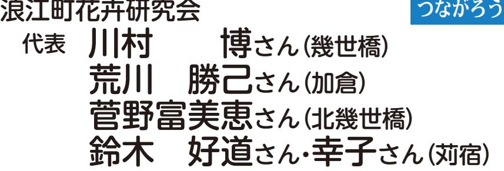

#### この時期の復興に向けた主な動き

- 請戸荷捌き施設で9年ぶりに競りが再開R2. 4月さば
	- 「道の駅なみえ」プレオープン 8月

ơƆƆǀࢉႜ§اࣰ **再取材シリーズ**

R2. 4月

8月R2. 3月

> 3月 3月

この時期の復興に向けた主な動き

津島小学校が休校

競りが再開

プン

請戸荷捌き施設で9年ぶりに

「道の駅なみえ」プレオープン 「道の駅なみえ」グランドオー

町内を「東京2020オリンピック聖火リレー」が巡行

俊惠さん

最初の頃は、河原に

シシ駆除の仕事を始めました。 メンバーとして、浪江町のイノに住み、 「有害鳥獣捕獲隊」の職を機に一人でいわき市小名浜

50

頭を超え

裕子さん

平成30年11月に避難先の山梨県から、新築した浪江町の自宅に戻った森野さんご夫婦。娘さん家族の家や、裕子さんのかかりつけの病院がある山梨県と往復する暮らしとのこと。不便さはあっても、浪江は空気が違う、

ほっとすると笑顔で話してくださいました。

2年前に山梨県の病

が、仕方がありません。

ど処分しました。寂しいですくさんあった家財道具もほとんしまいます。布団やら何やらたなくなると、途端に家は荒れて前に取り壊しました。人が住ま思い出の残る家でしたが、8年

▲庭仕事が大好きな裕子さん。取材日も花がきれいに咲いていました。

4年前の春、定年退

取材者:NPO法人ちば市民活動・市民事業サポートクラブ鍋嶋

森野俊惠さん・裕子さん(川添)

取材日:1月24日 「令和2年4月広報なみえ掲載」

空気が違う、ほっとする場所

かかったイノシシを殺処分した曜日にわなを見て回り、わなにあり、仲間と一緒に火曜日と木町のあちこちにわなを仕掛けてグラムを超える大物もいます。 分します。中には、100キロでも年間550頭くらいは殺処が減ってきているけれど、それいっぱいでした。今は、随分数も逃げず、銃で追い払うのが精こともありました。人間を見てるイノシシが群れを成している

ます。

震災前の我が

きました。 仲間が集まってなると、大勢の家には、猟期に

▲仲むつまじく浪江での生活を楽しむ森野さんご夫婦

らのたくさんのた。父母の代か家族のようでして、さながら大ちも一緒になっ共にし、子供たぎわい、寝食をを超える人でに

どうしてもばらばらになってし作るんですけど、イモの厚さはにしています。天ぷらも好きで

らと思います。

え、震災前の暮らしに近づけたずつでも町に戻ってくる人が増いった不安はありますが、少し先はどうなるか分からないと

ていけたらと思います。

料理もできるだけするよう

節ごとの花を植え、野菜も作っしました。これから、庭には季全く問題ないとの結果で、安心リーニング検査でも、食べてもつきました。弘前大学のスク去年の秋には100個もの実がが、震災後に植えた柿の木に、木々は全部切ってしまいましたがたくさん植えてありました。 は、竹林がありドウダンツツジにしています。震災前の庭に事の支度はできるだけするようん。でも、大好きな庭仕事や食ビの画面もほとんど見えませ表情は読み取れませんし、テレでも、顔の輪郭は分かっても、態になりました。近くにいる人く、半年後にはほとんど失明状見えるようになるものではな目を手術しました。手術しても院で、緑内障で失明直前だった

ます。皆、

70

歳代前後で、

10 年所さんも少しずつ戻って来ていに、親しく行き来していたご近ていけたらと思います。震災前婦で力を合わせて浪江で暮らしいことも多いと思うけれど、夫います。目が不自由になりつらた。本当にありがたいと思ってや母の世話をよくしてくれまし

20 人分場に運んでい後、富岡町の処

俊惠さん

震災前後、妻は、弟

す。苦にせずやってくれます。 ね。洗濯や掃除は、夫の担当で人でやれば何とかなるものですす。一人ではできませんが、二夫がそばにいて手伝ってくれままいます。料理をするときは、

- 「浪江町地域職業相談室」がサンシャイン浪江内で再開 8月
- 環境省福島環境事務所が「浜通り北支所浪江分室」を開設 8月
- 災害公営住宅「請戸住宅団地」26戸が完成、10月1日より順次入居開始 9月
- 「ゆるキャラⓇグランプリ2020 THEFINAL」でうけどんが全国26位になり、2年連続で福島県内1位に輝く 10月
- 「道の駅なみえ」グランドオープンR3. 3月
	- 津島小学校が休校 3月
	- 町内を「東京2020オリンピック聖火リレー」が巡行 3月
	- 延べ1万人超が来場した「思い出の品展示場」が閉鎖 3月

#### 令和2年4月号~令和3年3月号掲載分

# ƨƾƈƛƝƲŻDž੬Ƽƌ ×ະݭơࡤØ

道の駅なみえグランドオープン(3月)

請戸荷捌き施設(4月) 東京オリンピック2020聖火リレー(3月)

らのたくさんの

ơƆƆǀࢉႜ§اࣰ **再取材シリーズ**

俊惠さん

4年前の春、定年退

# 森野俊惠さん・裕子さん(川添)

取材者:NPO法人ちば市民活動・市民事業サポートクラブ鍋嶋取材日:1月24日 「令和2年4月広報なみえ掲載」

### 空気が違う、ほっとする場所

平成30年11月に避難先の山梨県から、新築した浪江町の自宅に戻った森野さんご夫婦。娘さん家族の家や、裕子さんのかかりつけの病院がある山梨県と往復する暮らしとのこと。不便さはあっても、浪江は空気が違う、ほっとすると笑顔で話してくださいました。

福島県

▲仲むつまじく浪江での生活を楽しむ森野さんご夫婦

職を機に一人でいわき市小名浜頭を超え分場に運んでい後、富岡町の処震災前の我がきました。 仲間が集まってなると、大勢の家には、猟期に 20 人た。父母の代か家族のようでして、さながら大ちも一緒になっ共にし、子供たぎわい、寝食をを超える人でに

裕子さんが、仕方がありません。 ど処分しました。寂しいですくさんあった家財道具もほとんしまいます。布団やら何やらたなくなると、途端に家は荒れて前に取り壊しました。人が住ま思い出の残る家でしたが、8年 2年前に山梨県の病ていけたらと思います。 節ごとの花を植え、野菜も作っしました。これから、庭には季全く問題ないとの結果で、安心リーニング検査でも、食べてもつきました。弘前大学のスク去年の秋には100個もの実がが、震災後に植えた柿の木に、木々は全部切ってしまいましたがたくさん植えてありました。 は、竹林がありドウダンツツジにしています。震災前の庭に事の支度はできるだけするようん。でも、大好きな庭仕事や食ビの画面もほとんど見えませ表情は読み取れませんし、テレでも、顔の輪郭は分かっても、態になりました。近くにいる人く、半年後にはほとんど失明状見えるようになるものではな目を手術しました。手術しても院で、緑内障で失明直前だった料理もできるだけするようどうしてもばらばらになってし作るんですけど、イモの厚さはにしています。天ぷらも好きで

▲庭仕事が大好きな裕子さん。取材日も花がきれいに咲いていました。

俊惠さんす。苦にせずやってくれます。 ね。洗濯や掃除は、夫の担当で人でやれば何とかなるものですす。一人ではできませんが、二夫がそばにいて手伝ってくれままいます。料理をするときは、震災前後、妻は、弟ます。皆、所さんも少しずつ戻って来ていに、親しく行き来していたご近ていけたらと思います。震災前婦で力を合わせて浪江で暮らしいことも多いと思うけれど、夫います。目が不自由になりつらた。本当にありがたいと思ってや母の世話をよくしてくれまし 70歳代前後で、 10 年らと思います。 え、震災前の暮らしに近づけたずつでも町に戻ってくる人が増いった不安はありますが、少し先はどうなるか分からないと

य़ŷDžƢƎƾႜࢉơƆƆǀ ႜࢉಉƹžƽơ

ǖȒ½ǽNJȚǥǹȌ½

# 神奈川県鎌田正彦さん(幾世橋出身・神奈川県在住)

取材者:NPO法人ちば市民活動・市民事業サポートクラブ鍋嶋取材日:2月17日 「令和2年5月広報なみえ掲載」

#### 〝見ていられない、ほっとけない〟 みんなが幸せな社会になったらいいね。

▲良き理解者である奥さん(千代子さん)と

けない 〞 性分で、そうした人た

ちの支援活動や防犯のための活

動を続けてきました 。 また、国

際交流協会の支援員として、イ

タリア、カナダ、ベトナムと

小学校6年生まで、幾世橋小学校に在学。 その後、ご家族の仕事の都合で神奈川県相模原市に転居された鎌田さん。相模原市の小学校の同窓会会長や「NPO法人神奈川県被害者支援センター」のメンバーとして活躍されています。

◆ 浪江町とのつながり友達と幾世橋の川でドジョウやカジカ捕りをしたり、校庭の藤づるで 〝 ターザンごっこ 〞 をして遊んだりしたこと、給食のけんちん汁がおいしかったことなど、思い出がたくさんあります 。 自然が豊かでしたね 。 亡くなった父は、銀行員や 〝 炭鉱マン 〞 と職を転 々 としていました 。 幾世橋で魚屋を営んでいたこともありました 。 4 男 1 女の子育てで忙しいなか、母も一生

| ま に 私 ◆ う て れ た 人 浜 校 み 年 は 橋 ら を の の 相 父 ま 懸 う は は 犯 世 か お な 。 で の え に 現 小 し 卒 高 小 模 夫 私 す 命 ほ 人 、 、 罪 界 、 ら い 東 開 同 」 浪 在 学 が 業 校 ・ 原 婦 が 。 に ど た 被 小 困 声 平 と れ 人 日 催 窓 で 江 も 校 長 、 を 中 市 の 手 の ち を 害 和 気 る も 本 さ 会 開 続 の く 就 経 学 に 世 学 っ 町 伝 人 も て 出 に へ に だ 多 大 れ に 催 い 同 な 職 て 校 転 話 校 っ 「 た 少 い せ あ の な ろ く 震 た 参 さ 福 て 窓 り と 、 、 居 で 6 て ち な る な っ 思 り う 、 災 同 加 れ 島 い 生 ま 、 東 神 し 、 年 い が く 人 く た い ま か ど 後 窓 。 た ま と し 関 京 奈 ま 家 生 た い 集 あ を て 人 す 、 こ 、 会 翌 幾 す の た 東 都 川 し 族 の 姿 こ り ま 〝 諦 た 。 元 で 連 に 々 世 。 つ が 圏 内 県 た そ と が い ま り ほ め ち 気 暮 絡 は 年 橋 の 平 な 、 で の 藤 。 ろ き 浮 せ ま っ て の だ ら が 、 、 中 成 が 幾 の 大 沢 地 っ 、 か 村 20 15 ん と し 中 ろ し 取 横 学 り 世 暮 学 市 元 て 叔 び し な 。 |  |
|-------------------------------------------------------------------------------------------------------------------------------------------------------------------------------------------------------------------------------------------------------------------------------------------------------------------------------------------------------------------------------------------------------------------------------------------------------------------------------------------------------------------------------------------------------------------------------------------------------------------------------------------------------------------------------------------------------------------------------------------------------------------------------------------------------------------------------------------------------------------------------------------------------------------------------------------------------------------------------------------------------------------------------------------------------------------------------------------------------------------------------------------------------------------------------------------------------------------------------------------------------------------------------------------------------------------------------------------------------------------------------------------------------------------------------------------------------------------------------------------------------------------------------------------------------------------------------------------------------------------------------------------------------------------------------------------------------------|--|
|-------------------------------------------------------------------------------------------------------------------------------------------------------------------------------------------------------------------------------------------------------------------------------------------------------------------------------------------------------------------------------------------------------------------------------------------------------------------------------------------------------------------------------------------------------------------------------------------------------------------------------------------------------------------------------------------------------------------------------------------------------------------------------------------------------------------------------------------------------------------------------------------------------------------------------------------------------------------------------------------------------------------------------------------------------------------------------------------------------------------------------------------------------------------------------------------------------------------------------------------------------------------------------------------------------------------------------------------------------------------------------------------------------------------------------------------------------------------------------------------------------------------------------------------------------------------------------------------------------------------------------------------------------------------------------------------------------------|--|

| で た き ち れ と ば 会 と っ 願 て っ 励 て ま い し ま 合 す う 。 こ と | 思 私 い は ま 陰 す な 。 が そ ら し 応 て 援 、 し 浪 続 江 け 町 た の い | 援 が も っ と あ れ ば と 思 い ま す | 被 災 し た 人 た ち へ の 国 か ら の | 題 が 残 る 〝 ふ る さ と 浪 江 町 | 力 を 発 行 電 っ 所 て の い 廃 ま 炉 す の 。 問 福 題 島 な 第 ど 一 、 原 | 難 し て 暮 ら す 人 た ち の 支 援 活 | し て 、 福 島 県 か ら 神 奈 川 県 に | と 共 に あ ゆ む 会 」 の メ ン バ ー | た 。 現 在 は 、「 か な が わ 避 難 | 島 県 人 会 の 会 長 も 務 め て い ま | 熱 く 、 数 年 前 ま で 相 模 原 市 の | 〝 ふ る さ と 福 島 〞 へ の 思 い | ◆ 浪 江 町 へ の 思 い | け て い き た い と 思 い ま す 。 | 政 治 に 届 け る た め に 、 活 動 を | い は 変 わ り ま せ ん 。 弱 者 の 声 | 選 は で き な か っ た の で す が 、 | 立 候 補 し ま し た 。 残 念 な が ら | 昨 年 の 市 議 会 議 員 選 挙 の 二 つ | 募 り 、4 年 前 の 県 議 会 議 員 選 | 政 に ! 」 届 け た い と い う 思 い | 平 和 を 願 い 、 弱 者 市 民 の 声 を | 様 々 な 活 動 を 通 し て 、「 世 | す 。 | 人 た ち と の 交 流 も 進 め て い | い っ た 様 々 な 国 の 在 日 外 国 人 |
|---------------------------------------------------------------------------------------------------------------------------|--------------------------------------------------------------------------------------------------------------------------------|---------------------------------------------------------------|---------------------------------------------------------------|----------------------------------------------------------|--------------------------------------------------------------------------------------------------------------------------------|---------------------------------------------------------------|---------------------------------------------------------------|---------------------------------------------------------------|-----------------------------------------------------------|---------------------------------------------------------------|---------------------------------------------------------------|----------------------------------------------------------|--------------------------------------|----------------------------------------------------------|---------------------------------------------------------------|---------------------------------------------------------------|---------------------------------------------------------------|---------------------------------------------------------------|---------------------------------------------------------------|-----------------------------------------------------------|---------------------------------------------------------------|---------------------------------------------------------------|------------------------------------------------------|--------|----------------------------------------------------------|---------------------------------------------------------------|
| が                                                                                                                         | 人 と                                                                                                                         | 。                                                             | 支                                                             | 〞、                                                       | 難 子                                                                                                                         | 動                                                             | 避                                                             | と                                                             | 者                                                         | し                                                             | 福                                                             | は                                                        |                                      |                                                          | 続                                                             | を                                                             | 思                                                             | 当                                                             | に                                                             | 挙                                                         | が                                                             | 市                                                             | 界                                                    |        | ま                                                        | の                                                             |

は

福

し

ま

界

、

に

当

思

を

続

य़ŷDžƢƎƾႜࢉơƆƆǀ ႜࢉಉƹžƽơ

ǖȒ½ǽNJȚǥǹȌ½

も全

> りに行

荷物は

県人会

市まで

新米を

防、バ

…

自分

れませ

れると

けたし、

昔のよ

ったこ

れでも、

き、十

る、こ

〞 をう

のた

の

い

「 ま

県

と

者

局

日か

ン

言

島

す 」

は

の

# 諏訪園厚子さん(川添出身・鹿児島県在住)

取材者:NPO法人つなぎteおおむた彌永取材日:1月21日 「令和2年5月広報なみえ掲載」

#### 昔の浪江町に戻ってほしい。 心の底から、そう思っています。

結婚を機に鹿児島へ移られた諏訪園さん。震災直後、「うつくしま福島の会(福島県人会・鹿児島)」を立ち上げられました。発足当時から書き続けておられる何冊もの記録ノートには、打合せメモや活動が掲載された新聞の切り抜きなどがびっしり。 故郷への温かい思いがあふれていました。

▲「福島復興支援ツアー」取材記事が掲載された新聞を手にほほ笑む諏訪園さん

震災直後、年齢も生活の状況く違うけれど、「〝 故郷福島 〞 めに何かできることを 」 と共通の思いを持つ 3 人が出会、県人会を立ち上げました 。 ずは、鹿児島県にいる福島出身者へ呼び掛けてみよう 」 、記者会見を開き、私が年長なので会長を引き受け、事務も私の職場にしたら、会見翌ら職場の電話が〝 ジャンジャ 〞 鳴って、若い職員が 「 何をっておられるのか …。〝 鹿児の 〞〝 福島の 〞だけ、分かりまと私のもとへ 。 九州の人に聞き取りづらい、懐かしい私故郷の言葉で、受話器の向こうから切 々 と思いを伝えてくださいました 。 こうした鹿児島県在住の福島県出身の皆さんと、翌月に 「 第 1 回昼食懇談会 」 を開きました 。 懇談会は今も 6 月と 11 月に開催していますよ 。 春には 「 福島復興支援ツアー 」 を行っています 。「 私、ここで生まれたのよ 」 と、浪江駅前に残っていた西病院の前で皆さんにお話ししたこともあります 。 今回が 8 回目ですが、鹿児島県の皆さんに 「 今だからこそ、福島県を見てほしい 」 と思っています 。「 報道だけではわからない 。 参加して良かった 」 との感想が、活動継続の励みです 。 震災の年の秋、「 浜通く運転手がいないから、福島駅止め 」 と言われ、発起人の 3 人で、南相馬鹿児島県のサツマイモや運びました 。 決壊した堤リケードでふさがれた道の目で見たあの景色は忘ん 。 故郷にはいつでも帰思っていたから遠くに行遠くに居られたんです 。 うには帰れない場所になとが、悲しく切ない 。 そスーパーや歯科医院がで日市祭も町内で開催されの少しずつの 〝 動き出しれしく思っています 。

य़ŷDžƢƎƾႜࢉơƆƆǀ ႜࢉಉƹžƽơ

ǖȒ½ǽNJȚǥǹȌ½

## 群馬県今野義雄さん(津島出身・群馬県在住)

取材者:高崎子ども劇場大澤・関根取材日:1月22日 「令和2年5月広報なみえ掲載」

#### 帰ると〝ほっ〟とさせてくれる空気、津島はかけがえのない故郷!

今野さんは、津島小・津島中学校を経て小高工業高校を卒業後、東京都で就職。国立病院への転職を機に群馬県での生活を開始。過疎地の医療確保や医師不足問題に取り組む中で、「医療法人大戸診療所」の設立・運営に携わり、平成25年には地域医療に貢献した人に贈られる「若月賞」を受賞しました。

73歳となった現在も大戸診療所の顧問として過疎地の医療を見守る一方で、居住地である群馬県渋川市の「北毛保健生活協同組合」の理事として地域医療の充実に向けた取り組みを進めています。

| ◆ 震 災 前 後                                               | ◆ 現 在 の 活 動                                          |
|---------------------------------------------------------------------|---------------------------------------------------------------------|
| 故 郷 の 津 島 に は 母 が 一 人 で            | 群 馬 県 東 吾 妻 町 に 避 難 し て            |
| 暮 ら し て い ま し た 。 盆 や 暮 れ は  | き た 南 相 馬 市 や 浪 江 町 の 人 た ち  |
| も と よ り 、 事 あ る ご と に 帰 省       | の 医 療 支 援 や 交 流 を 始 め 、 現 地  |
| し 、 近 所 の 人 た ち や 親 戚 ・ 同 級  | 視 察 や 福 島 県 の 仮 設 住 宅 や 復 興  |
| 生 と 会 い だ ん ら ん す る の が 楽 し  | 住 宅 で の 健 康 相 談 ・ お 茶 会 な       |
| み で し た 。 震 災 直 後 、 南 会 津 町  | ど を 行 っ て き ま し た 。 と に か       |
| に 避 難 し た 母 の も と に 駆 け つ け  | く 、〝 被 災 地 浪 江 〞 の 現 状 を 知 っ |
| ま し た が 、 避 難 の 長 期 化 や 高 齢  | て も ら う こ と が 必 要 と 、 こ の 8  |
| と な っ て き た 母 の 健 康 が 心 配 で  | 年 、 医 療 関 係 団 体 ・ 自 治 会 な ど  |
| 群 馬 県 に 来 て も ら い ま し た 。 母  | の 皆 さ ん を こ れ ま で に 延 べ 8 0  |
| は そ の 後 、 娘 の い る 千 葉 県 に 避  | 0 人 余 り 、 浪 江 町 な ど に 案 内 し  |
| 難 し 、 昨 年 3 月 に 93 歳 の 天 寿 を | て き ま し た 。                                          |
| 全 う し ま し た 。 生 き て い る う ち  | 帰 還 困 難 地 域 で 9 年 も 放 置            |
| に 故 郷 に 帰 れ な か っ た の が 悔 や  | さ れ た ま ま の 実 家 は 、 人 が 住 め  |
| ま れ ま す 。                                               | る 状 況 で は な く 、 母 も 亡 く な っ  |
|                                                                     | た こ と か ら 解 体 す る こ と に な り  |
|                                                                     |                                                                     |
|                                                                     |                                                                     |
|                                                                     |                                                                     |

▲浪江から離れて暮らしていても、多方面から浪江町のサポートを続ける今野さん

| で す 。 町 職 員 | る 状 況 を 早 く | 環 境 ・ 子 供 た | て い る 町 民 が | が 少 な い の は | 〝 帰 還 解 除 | に 伝 え た い も | の 姿 ・ 実 家 の | な っ て し ま う | 像 の 完 成 が | を 映 像 で 残 す | 津 島 の 有 | ◆ こ れ か ら の | 点 で あ っ た と | 医 療 確 保 に 携 | 島 の 思 い 〞 が | 努 力 し て い ま | 守 る 会 」 が あ | 震 災 前 の 津 | 〝 ほ っ 〞 と す | よ り も 空 気 が | い つ も 変 わ | 踊 り 〞 を 懐 か | す〝 。津 島 の 獅 | も 守 り 続 け | ま し た が 、 先 |
|----------------------------|----------------------------|----------------------------|----------------------------|----------------------------|-----------------------|----------------------------|----------------------------|----------------------------|-----------------------|----------------------------|------------------|----------------------------|----------------------------|----------------------------|----------------------------|----------------------------|----------------------------|-----------------------|----------------------------|----------------------------|-----------------------|----------------------------|-------------------------|-----------------------|----------------------------|
| の 皆                     | 作 っ                     | ち が                     | 帰 る                     | 残 念                     | 〞 さ                | の で                     | 姿 を                     | か も                     | 楽 し                | 会 」                     | 志 「           | 浪 江                     | 思 い                     | わ っ                     | 群 馬                     | し た                     | り 医                     | 島 に は           | る の                     | 違 い                     | ら ぬ                | し く                     | 子 舞                  | た い                | 祖 か                     |
| さ ん も                | て 欲 し                | 安 心 し                | 判 断 の                | で す が                | れ て も           | す 。                     | 、 孫 や                | 知 れ な                | み で す           | の ド ロ                | ふ る さ      | 町                          | ま す 。                | て き た                | 県 の 過                | が 、 こ                | 師 確 保                | 、「 診               | が 故 郷                | ま す 。                | 山 や 川           | 思 い ま                | 〞 や 〝             | と 思 っ           | ら の 墓                |
| 本 当                     | い も                     | て 帰                     | で き                     | 、 迷                     | 戻 る                |                            | 次 世                     | い 故                     | 。 無                | ー ン                     | と 津           |                            |                            | 私 の                     | 疎 地                     | の 〝                     | な ど                     | 療 所                | で す                     | 帰 る                     | 、 な                | す し                     | 田 植                  | て い                | も 故                     |

島

映

く

郷

代

人

っ

る

れ

の

に

よくやっています 。

郷

ま

え

、

に

と

。

を

、

津

で

原

# 佐々木光惠さん(昼曽根)

取材者:認定特定非営利活動法人市民公益活動パートナーズ古山・松田取材日:5月19日 「令和2年7月広報なみえ掲載」

#### いろいろな人が訪ねてくれる本宮の暮らしは、気晴らしになっています

平成

した。

その1年後には本宮市に移

に入居し、夫も後から合流しまもに郡山市田村町の借上げ住宅

年4月には、姉夫婦とと

23

転々としましたが、比較的早く離れでした。何か所か避難所をたため、私や子供たちとは離れ町民の皆さんの避難を助けていとして役場の職員さんと一緒に

◆本宮に住んで、早や丸8年あの震災当時、夫は消防団

本宮市市街地から車で約20分、阿武隈高原の里山に囲まれた白沢地区のご自宅を訪ねました。母屋の奥に2階建ての倉庫があり、その2階が光惠さんや夫の保彦さん(第2号「平成 23年8月号」掲載)が訪問客を迎えたり、仕事をしたりする〝基地〟になっています。 現在、保彦さんは本宮市や大玉村に暮らす浪江町民でつくる「コスモス南達会」の会長として、光惠さんは会の女子部であり、手仕事を中心に活動する「サークルりんどう」のお世話役として活躍されています。

> ことが決め手になりました。 本松市の浪江町役場が近かったを楽しんでもらえることと、二ます。この家は、義母に畑仕事義母と夫との3人で暮らしていり、栃木県に一時避難していた

| ▲集いの場である倉庫2階のスペースでほほ笑む、 |  |
|-------------------------|--|
| 光惠さんと保彦さん               |  |

す。大玉村や本宮市に住むメン金申請もしながら活動していまを立ち上げ、赤十字などの助成 10人で、編み物や縫いがいも倍増しているようです。 では販売をし、メンバーのやりりを楽しんでいます。十日市祭物をしながら、自由におしゃべまた、1階の車庫ではバー ◆大震災と原発事故が招いた子に楽しんでいます。 をし、男性も交えて、にぎやかベキューや季節の天ぷら会など今の暮らしを手放しでは喜供たちへの影響は、今でも気残念でした。 式や卒業式に行くことができず生と中学生になる孫たちの入学は新型コロナ禍の影響で、高校とが悔しいです。その上、今年い、会いたいときに会えないこ供や孫たちが遠くに離れてしまいるような感覚です。でも、子つかの間のお休みをいただいてたちは独り立ちしましたから、んではいませんが、4人の子供あれから丸9年が過ぎましかと、今でも心配になることがスを抱えたりしなかっただろう人以上に複雑な気持ちやストレのために何度も転校をして、大たが、幼かった子供たちが避難

取材者:認定特定非営利活動法人市民公益活動パートナーズ古山・松田取材日:3月3日 「令和2年6月広報なみえ掲載」

#### 八坂神社の再建とともに、集落の新しい歴史が始まる

樋渡・牛渡地区の人たちの心のよりどころだった八坂神社は、震災時に拝殿や本殿などが倒壊。様々な人たちの尽力により、足掛け5年の歳月をかけて、昨年、再建されました。10月13日には竣工落成式が開かれる予定でしたが、台風19号の豪雨被害により、今年の1月12日に延期。当日は、避難先などから地区の人たち約80人が駆けつけ、にぎやかに再建を祝いました。

大切な神社の行事である夏の例大祭の再開ももうすぐです。この再建の取組に中心的に関わってこられたお三方に、震災からこれまでの暮らしと、神社再建にまつわるお話を伺いました。

◆八坂神社再建の発端、実現ま

共有地からの一括寄付や

にもおよぶ個人寄付が約

50数件

32パー行ってくださいました。また、田村さんが交渉から契約まで

での経緯などを教えてくだ

さい

鈴木さん

佐藤さん

ました。平成

ど、いろいろな声が上がっていたい」 「簡素に祠だけでも」なた当時から、 「昔通りに復元し

27

ど学識経験者と合わせて集落の各団体長、区長経験者なや氏子代表5人(後に6人) 、会を立ち上げました。大字三役を開いたときに、再建検討委員に地区住民が集まり、大字総会の岳下体育館そばの岳下公民館

13

人で構成。み

でした。しかし、

せんざしき

た遷座式や落成式は台風の影響

8月5日に完成、引き渡す予定ら、約5年の歳月をかけ、昨年再建委員会へと名称を変えなが委員会となり、最後の約2年は

10

月に予定し

佐藤さん

神社と住民のつなが

遂げていただきたいですね。 たちに伝えながら、復興を成し年後という長いスパンで若い人

と、宮司さんの

〔神社と再建報告会〕

(令和2年1月12日撮影)

左上:竣工落成式当日の八坂神社右上:参列者全員で記念撮影左下:八坂会によって奉納された神楽右下:樋渡牛渡田植踊保存会による田植踊り

ね。

施工業者の選定では会津建

「

んとでは思いが少し違いましたたが、高齢の皆さんと若い皆さんな、再建には賛成のようでし

で今年

1月 12

した。雨天続きで心配でしたが終わりよければ、すべてよ

日に延期となりま

12 人年5月、避難先

おおあざ

ね。

再建検討委員会は再建準備

田村さん

集落の再建は難しい

10

かもしれませんが、5年後、

参りできるようにしたいですね。 に来たときはいつでも神社にお戻る、戻らないは別として、地元へつないでいきたい。浪江町に大切な神社を、私たち世代が次ましたが、先達が残してくれた自慢で、再建にその一部を使い

心のよりどころなんでしょう頃からの思い出などがあって、への通り道にある神社には幼い思いを感じました。集落のお墓とに、改めて皆さんの神社への個人寄付がこれほど集まったこなどの付帯工事もできました。 げさまで、参道の整備や土留め島県神社庁の助成金です。おか倍もいただきました。さらに福セントと、寄付予算の約2 ・ 3

震災で神社が倒壊し

ほこら

佐藤さんが一番詳し

◆最後に、八坂神社への思いを

聞かせてください

鈴木さん

この神社は彫り物が

せんだつ

ないでしょうか。

地域と町の全面協力が必要では域の芸能を継承していくには、ば継続できないと思います。地力してくれる人たちがいなけれ引っ張ってくれるリーダーと協事に集まることが大変です。 れになっているため、練習や行ちが一緒に踊りました。離れ離代、育てた人たちと習った人た

いから、お任せしましょう。

ちも福島市で暮らしています。 避難8か所目の一軒家。子供たた。その後福島市に移り、今はためラジオ体操もしたりしましオケや餅つきをしたり、健康のただき、8世帯の皆さんとカラんにはいろいろな配慮をしてい館と移動しました。旅館の皆さリゾート、五色沼近くの秋元旅

たりしました。

再建の財源は、東京電力

ホールディングス株式会社から 66

の賠償金が約

パーセントで、

田神社など数か所の視察を行っや川俣町、南相馬市鹿島区の山の見学に行ったり、また福島市

たちも参加して、

小学生に教えていた頃の若い人

70

代から

20

ちが落ち着きました。

それから、耶麻郡北塩原村にある裏磐梯グランデコスノー

員で会社や加工場、材木保管所工実績を知ったことでした。役カタログを見て、神社仏閣の施た親戚を訪ねたときに会社案内です。きっかけは、自宅を建て設さんとの出会いが大きかった

鈴木さん

八坂会による神楽と

人です。以前、田植踊保存会が田植踊保存会、いずれも今は8

すよ。

7月には夏の例大祭も再開しまて話すこともできるでしょう。 とができれば、みんなが集まっですね。新しい機会をつくるこな、復興の象徴となれたらいい一人、二人と増えていくようす。 「家に帰るか」と言う人がを思う気持ちになってほしいでりというか、どこにいても古里

て本当によかったです。

た。神楽と田植踊りを奉納できし」 。見事な晴天となりまし

あり、知人も多かったので気持ここは衣服や食品などの物資も東和町の体育館へ移りました。 れないよ」と言われ、二本松市 「地元に戻らないと情報が得ら三週間。その後、知り合いからら群馬県前橋市の弟を頼って約も整備されていました。そこか段ボールや毛布、食事もトイレ市が準備してくださったのか、下体育館に移りました。二本松一斉避難をすることになり、岳本当につらかった。二本松市にしたが、暖房も食べ物も無く、

ႭƐŹ£ƲdžƝơƆƆǀ ǖȒ½ǽNJȚǥǹȌ½

鈴木さん田村さん佐藤さん

◆皆さんの震災当時の様子や今の暮らしをお聞かせください鈴木さんその日は町議会に出りましたが、区に行き、一週間ほど世話になた。妻の姉が住む南相馬市原町ましたが、渋滞で引き返しまし避難となり、津島方面に向かいなどをするうちに、原発事故のえませんでした。翌朝、水くみぶれ、停電のため自家水道も使でした。自宅に戻ると納屋がつするのは大変だぞ」ということた。真っ先に思ったのは「再建と、無残にも倒壊していまし中、八坂神社の前を通ってみる散になりました。自宅に戻る途席しており、地震発生直後に解 20キロメートル圏しました。 玉県の娘の家に1か月ほど避難内であったため、家族4人で埼その後、東京都の東雲住宅リやスイカなどを作っています。 樋渡の家では、自家用のキュウみ、樋渡と行き来しています。 息子の家族と名取市に一緒に住団地に移って5年過ごし、今はあちこちを転々としました田村さんすよ。救いでしたね。 碁会所仲間がすぐにできるんでが、囲碁の趣味が功を奏して、建てて間もない家でました。国道6号は上下線とも日すぐに原発事故で避難になり体育館に避難したのですが、翌しました。その日は役場の隣ので、近所の高齢者の安否確認を時、民生委員を務めていたのしたが、瓦が落ちました。当

いです。 や孫が頻繁に集まるので、楽しり合わせで住んでいます。家族いわき市を選び、長男世帯と隣よ。そこで、浪江町に一番近いで切られるような寒さなんですなりましたが、風が吹くと刃物の親戚宅の離れを借りることにきました。その後、白河市の妻後、娘夫婦を頼って仙台市へ行り、飯舘村、福島市へと移ったしたが、そこもすぐに避難となを頼るために山回りで移動しまない。南相馬市原町区に住む妹動かず、国道114号にも入れ今は、皆さんが避難先で建佐藤さんうかと考えているところです。 を考え、そろそろ幾世橋に戻ろこの八坂神社と初發神社のことの主な仕事になっていますが、てた家の地鎮祭が、宮司としてあの日は檀家の集いの段差がひどく、約に迂回しましたが、ここも道路町では国道6号が大渋滞。山手の車で地震に遭いました。双葉で富岡町夜ノ森に出掛け、帰り 60分もかけている光景は衝撃的でした。 などが海水に流されながら燃え手県陸前高田市の倒壊した家屋状況を見ていましたが、特に岩た。一晩中テレビで各地の震災したが、電気や水道は使えまし落下、家財道具などが倒壊しまて帰宅しました。家は屋根瓦が翌日早朝、妻と車で請戸やへ避難。体育館に二晩泊まりま避難指示を聞き、そのまま津島幾世橋の様子を見に行く途中でしょはつだんかうかい

〔神社と再建報告会〕 左上:竣工落成式当日の八坂神社右上:参列者全員で記念撮影左下:八坂会によって奉納された神楽右下:樋渡牛渡田植踊保存会による田植踊り (令和2年1月12日撮影)

ちが落ち着きました。 あり、知人も多かったので気持ここは衣服や食品などの物資も東和町の体育館へ移りました。 れないよ」と言われ、二本松市 「地元に戻らないと情報が得ら三週間。その後、知り合いからら群馬県前橋市の弟を頼って約も整備されていました。そこか段ボールや毛布、食事もトイレ市が準備してくださったのか、下体育館に移りました。二本松一斉避難をすることになり、岳本当につらかった。二本松市にしたが、暖房も食べ物も無く、それから、耶麻郡北塩原村にある裏磐梯グランデコスノー

| ね 。 施 工 業 者 の 選 定 で は 会 津 建 | ん た ん と ど 集 や 会 を に の ま ど た た 佐 い 鈴 ◆ と が な 、 落 を 開 地 岳 し 、 藤 か 木 八 氏 い 当 さ で 学 で 、 、 宮 の 立 い 区 下 た い さ ら さ 坂 い 子 」 「 時 の 識 は 高 再 司 各 ち た 住 体 。 ろ ん 、 ん 神 か 代 経 経 簡 思 齢 建 さ 団 上 と 民 育 平 い お 社 表 ら 緯 験 素 い の に ん 体 げ き が 館 成 ろ 震 任 佐 再 5 、 「 27 な 者 に が 皆 は の 長 ま に 集 そ な 災 せ 藤 建 ほこ 人 13 ど と 祠 昔 少 さ 賛 、 し 、 ま ば 年 声 で し さ の ら ( を 合 だ 通 5 し ん 成 人 区 た 再 り の が 神 ま ん 発 後 わ 教 け り 違 と の で 長 。 建 、 岳 月 上 社 し が 端 に おお え せ で に い 若 よ 構 経 大 検 大 下 、 が が ょ 一 、 6 あざ て て も 復 ま い う 成 験 字 討 字 公 避 っ 倒 う 番 実 12 人 く し 皆 で 。 者 三 委 総 民 難 て 」 元 壊 。 詳 現 ) 、 た さ し み 人 な 役 員 会 館 先 い な し し し だ ま | ち 避 た た オ た ん 館 リ も 難 。 め ケ だ に と ゾ 福 8 そ ラ や き は 移 ー 島 か の ジ 餅 、 い 動 ト 市 所 後 オ つ 8 ろ し 、 で 目 福 体 き 世 い ま 五 暮 の 島 操 を 帯 ろ し 色 ら 一 市 も し の な た 沼 し 軒 に し た 皆 配 。 近 て 家 移 た り さ 慮 旅 く い 。 り り 、 ん を 館 の ま 子 、 し 健 と し の 秋 す 供 今 ま 康 カ て 皆 元 。 た は し の ラ い さ 旅 |
|--------------------------------------------------------------------|---------------------------------------------------------------------------------------------------------------------------------------------------------------------------------------------------------------------------------------------------------------------------------------------------------------------------------------------------------------------------------------------------------------------------------------------------------------------------------------------------------------------------------------------------------------------------------------------------------------------------------------------------------------------------------------------------------------------------------------------------------------------------------------------------------------------------------------------------------------------------------------------------------------------------------------------------------------------------------------------------------------------------------------------------------------------------------------------------------------------------------------------------------------------------------------------------------------------------------------------------------------------------------------------------------------------------------------------------------------------------------------------------------------------------------------------------|----------------------------------------------------------------------------------------------------------------------------------------------------------------------------------------------------------------------------------------------------------------------------------------------------------------------------------------------------------------------------------------------------------------------------------------------------------------------------------------------------------------------------------------------------------------------------------------------------------------------------------------------------|
|--------------------------------------------------------------------|---------------------------------------------------------------------------------------------------------------------------------------------------------------------------------------------------------------------------------------------------------------------------------------------------------------------------------------------------------------------------------------------------------------------------------------------------------------------------------------------------------------------------------------------------------------------------------------------------------------------------------------------------------------------------------------------------------------------------------------------------------------------------------------------------------------------------------------------------------------------------------------------------------------------------------------------------------------------------------------------------------------------------------------------------------------------------------------------------------------------------------------------------------------------------------------------------------------------------------------------------------------------------------------------------------------------------------------------------------------------------------------------------------------------------------------------------|----------------------------------------------------------------------------------------------------------------------------------------------------------------------------------------------------------------------------------------------------------------------------------------------------------------------------------------------------------------------------------------------------------------------------------------------------------------------------------------------------------------------------------------------------------------------------------------------------------------------------------------------------|

たりしました。 田神社など数か所の視察を行っや川俣町、南相馬市鹿島区の山の見学に行ったり、また福島市再建の財源は、東京電力の賠償金が約ホールディングス株式会社から 66パーセントで、共有地からの一括寄付や行ってくださいました。また、田村さんが交渉から契約まで 50数件にもおよぶ個人寄付が約 32パーね。 心のよりどころなんでしょう頃からの思い出などがあって、への通り道にある神社には幼い思いを感じました。集落のお墓とに、改めて皆さんの神社への個人寄付がこれほど集まったこなどの付帯工事もできました。 げさまで、参道の整備や土留め島県神社庁の助成金です。おか倍もいただきました。さらに福セントと、寄付予算の約2 ・ 3 再建検討委員会は再建準備でした。しかし、 8月5日に完成、引き渡す予定ら、約5年の歳月をかけ、昨年再建委員会へと名称を変えなが委員会となり、最後の約2年は 10月に予定しで今年た遷座式や落成式は台風の影響 1月 12日に延期となりま 「 した。雨天続きで心配でしたが終わりよければ、すべてよ鈴木さんて本当によかったです。 た。神楽と田植踊りを奉納できし」 。見事な晴天となりまし八坂会による神楽と人です。以前、田植踊保存会が田植踊保存会、いずれも今は8 せんざしき

たちも参加して、小学生に教えていた頃の若い人 70代から 20 ◆最後に、八坂神社への思いをないでしょうか。 地域と町の全面協力が必要では域の芸能を継承していくには、ば継続できないと思います。地力してくれる人たちがいなけれ引っ張ってくれるリーダーと協事に集まることが大変です。 れになっているため、練習や行ちが一緒に踊りました。離れ離代、育てた人たちと習った人た聞かせてください鈴木さんこの神社は彫り物が田村さん参りできるようにしたいですね。 に来たときはいつでも神社にお戻る、戻らないは別として、地元へつないでいきたい。浪江町に大切な神社を、私たち世代が次ましたが、先達が残してくれた自慢で、再建にその一部を使い集落の再建は難しいかもしれませんが、5年後、 10 佐藤さん遂げていただきたいですね。 たちに伝えながら、復興を成し年後という長いスパンで若い人神社と住民のつながすよ。 7月には夏の例大祭も再開しまて話すこともできるでしょう。 とができれば、みんなが集まっですね。新しい機会をつくるこな、復興の象徴となれたらいい一人、二人と増えていくようす。 「家に帰るか」と言う人がを思う気持ちになってほしいでりというか、どこにいても古里せんだつ

取材者:認定特定非営利活動法人市民公益活動パートナーズ古山・松田取材日:5月22日 「令和2年8月広報なみえ掲載」

#### 花作りで浪江町を再興するために、これからも力を合わせて花を作る

浪江町内で花卉栽培に取組む農業者や事業所に加え、新規就農者でつくる「浪江町花卉研究会」の月例勉強会にお邪魔し、中心的なメンバー4人と、出席された鈴木さんの妻、幸子さんも交えてお話を伺いました。

当日は、「新型コロナウイルス感染症」の予防のためマスクを着けたままではありましたが、楽しく、にぎやかなグループインタビューとなりました。

かき

鈴木幸子さん鈴木好道さん菅野さん荒川さん川村さん

いますね。 3時間になってめ、いつも2〜 に学び合うたが集まって熱心新規就農者などす。花卉農家や回開催していま

菅野さん

北幾世橋の自宅前

菅野さん

基本通りにはなかな

たいと思っています。

種があります。

農家は一人一人の仕事ですか

荒川さんたいですね。

まず、きれいな花を

かも高く売れる花作りを目指し咲かせたい。丈夫で長持ち、し

ずです。その他にも試作中の品トレチア)は、今年花が咲くは 3年目のゴクラクチョウカ(スなど3種類ほど。栽培を始めてウ、ラナンキュラスやストック

て基本に忠実に取り組んでいきいですが、品質の良さを目指しかいかないし、難しいことも多

て、うれしいですね。

中心メンバー

所、合わせて9 人と一つの事業には花卉農家8 すが、今年度中を含めて6人では今日の出席者

◆最後に、皆さんから花作りへ

の思いを聞かせてください

川村さん

かりやざきしょうご

浪江町の花作りを

作りがしたいですね。

夫婦でできる仕事として、妻

緒に人生を歩いていきたいです。 とも同じ目標を持ちながら、一

が欲しい」と言われるような花たまりません。 「鈴木さんの花ていても楽しいし、ストレスがかな。品質の高い良い花は作っ

事です。

い人たちと話ができることは大ら、このメンバーのような温か特にハウスでは独りきりですかた人の輪は本当に大切ですね。 ら、研究会の和気あいあいとし

> 鈴木さんたいです。

く、花を作りたい。

や、父が畑仕事をしながら

まで長生きしましたから、

健康で少しでも長

80

歳、い

90 歳

85 歳

件になる予定です。その他に、十数人のオブザーバーや応援者

鈴木さんなどがいます。

インタビュー風景

▲

もありました。

ださって

、本当に励みになります

また、来年の東京オリンピッ

。

信をしてくれるなど広報してくワープロジェクトとして動画配くださるそうです。役場もフラカレンダーに浪江の花を載せて家の假屋崎省吾さんが、来年のずっと応援いただいている華道

でも花のことは全くで、トル

しょう。

女性を美しく装う仕事をして

は「美」という点で共通していきたので、美しい花を作ること

切り花はメインのトルコギキョウンリュウヤナギなど4種類、ンゴミズキやヒュウガミズキ、事をしています。今、花木はサ加え、新しいハウスも使って仕した時に建てた3棟のハウスに

できるように、応援もしていきすが、若い人たちが花で生活がに乗せるお手伝いはもちろんでが一番。メンバーの経営を軌道て、今は栽培技術の取得や向上

出しても値崩れが少ないので作れない。だからこそ、市場にを得たり、勉強したりしないと要です。この花は一通りの知識作れませんから、設備投資も必思いました。ハウス栽培でしかが簡単に作れるものじゃないとが高い品種というか、誰も彼もです。いざ始めてみると、難度コギキョウすら知らなかったん

> 荒川さんるんですよ。

加倉で花作りを再開

十分に整えておきたいですね。 最高級の花が出荷できる態勢をつでもエントリーできるよう、まっていますが、浪江の花をいコギキョウが使われることが決リーブーケ」に福島県産のトルストたちに贈られる「ビクトク・パラリンピックで、メダリ

浪江ブランドの確立を目指し

事務局長の清水さんに憧れていい、参加しました。川村さんや事として花作りがしたいと思川の仕事とは別に、私自身の仕て、私もその一員になりたい、た。研究会の立ち上げを知っどはいつも気になっていましの活動を取り上げた新聞記事なえたような川村さんの姿や、そ作りに取組む、どっしり根を構も浪江に帰って来ない頃から花知っていたと言いましたが、誰

導や工場管理に行っていた時期ナム、ミャンマーなどへ技術指後は中国やインドネシア、ベト製造会社を経営していて、震災

震災前はアパレルの

花作りはやれていません。 できる。皆さんがいなければ、トラブルがスピーディーに解決ます。相談できる仲間がいて、かあったら駆けつけてくださいシェアしてくださいますし、何モ〞まで惜しげもなく情報をていただけない花レシピの〝キバーの皆さんも、なかなか教えいろいろ試しています。メン中身の濃い資料を確認しながら、勉強会で川村さんからいただくまくいかないことも多いので、が違うと同じことをやってもうして作っていますが、作る土地で、水田を転用した畑をお借り

先ほど、以前から川村さんを

▲取材終了後、参加者が1人加わって、すぐに勉強会が開始。ちなみに記念すべき第1回は、平

成30年4月30日に行われたそうです

| 浪 い 江 避 わ 町 難 き で 指 市 何 示 に か 解 行 仕 除 っ 事 に て を な い し っ ま た て す い か 。 と ら 考 、 | 日 ほ ど 避 難 し 、 そ の 後 、 い わ | 鈴 木 さ ん 震 災 直 後 は 埼 玉 県 に | 花 作 り を 始 め ま し た 。 | と な っ て 、 震 災 後 の 3 年 目 か ら | 量 が 検 出 さ れ た こ と が き っ か け | 川 も 村 に さ 、 ん 浪 江 (第 30 町 に 号 「 戻 平成 25 り ま 年 12 し 月号 た 」 掲 。 載) | 月 日 の 一 部 避 難 指 示 解 除 と と | け て い ま し た の で 、 平 成 年 3 | 射 線 量 の 測 定 な ど 川 の 仕 事 を 続 | そ の 間 も 通 い な が ら 、 放 流 や 放 | 伊 達 市 保 原 町 で 避 難 生 活 を し 、 | よ く 知 っ て い ま し た 。 | す い す れ 家 き ま 出 に に に 所 て 災 ぐ て 高 菅 ◆ 31 く ら 。 ま 。 を の 市 し 荷 最 戻 、 周 い か に 福 い 瀬 野 あ 再 だ れ 私 す 妻 リ 母 で た し 初 り 平 辺 る ら 南 島 て 川 さ の 編 も の は フ 屋 暮 が た は ま 成 が N 相 市 、 漁 ん さ た 日 2 さ 25 週 で 、 ォ は ら 、 り ニ し 避 P 年 馬 に そ 業 い 経 の れ に 、 母 ー 解 し 野 、 ワ た 年 難 O 目 市 避 の 協 震 緯 避 た を 1 ま が ム 体 ま 菜 野 ト 。 4 指 法 、 に 難 頃 同 災 難 こ 〜 だ 元 し し し か 菜 リ 月 示 人 以 移 し か 組 前 簡 か と 2 向 気 て ま た ら を を 1 解 J 前 り ま ら 合 か 単 ら を 度 こ で 住 し 。 高 作 飼 日 除 i か ま し 川 で ら に 浪 き く う 小 ん た 苅 い っ っ に 準 n ら し た 村 仕 室 お 江 29 っ ら に 名 で が 宿 放 た て 浪 備 の 運 た が さ 事 原 聞 町 か い い 浜 い 、 の 射 り 卵 江 区 事 営 。 、 ん を 川 か に は ま に ま 離 実 線 し を 町 け 域 務 し 震 す を し ・ せ 戻 |
|-------------------------------------------------------------------------------------------------------------------------------------------------------------------------------------------------|---------------------------------------------------------------|---------------------------------------------------------------|------------------------------------------------|--------------------------------------------------------------------|--------------------------------------------------------------------|------------------------------------------------------------------------------------------------------------------------------------------------|---------------------------------------------------------------|---------------------------------------------------------------|--------------------------------------------------------------------|--------------------------------------------------------------------|--------------------------------------------------------------------|------------------------------------------------|-----------------------------------------------------------------------------------------------------------------------------------------------------------------------------------------------------------------------------------------------------------------------------------------------------------------------------------------------------------------------------------------------------------------------------------------------------------------------------------------------------------------------------------------------------------------------------------------------------------------------------------------------------------------------------------------------------------------------------------------------------------------------------------------------------------------------------------------------------------------------------------------------------------------------------------------------------------------------------------------------------------------------------------------------------------------------------------------------------------------------------------------------------------------------------------------------------------------------------------------------------------------------------------------------------------------------------------------------------------------------------------------------------------------------------------------------------------------------------------------------------------------------------------------------------------------------|
|                                                                                                                                                                                                 |                                                               |                                                               | 20                                             |                                                                    |                                                                    |                                                                                                                                                |                                                               |                                                               |                                                                    |                                                                    |                                                                    |                                                |                                                                                                                                                                                                                                                                                                                                                                                                                                                                                                                                                                                                                                                                                                                                                                                                                                                                                                                                                                                                                                                                                                                                                                                                                                                                                                                                                                                                                                                                                                                                                                       |
|                                                                                                                                                                                                 |                                                               |                                                               |                                                |                                                                    |                                                                    |                                                                                                                                                |                                                               |                                                               |                                                                    |                                                                    |                                                                    |                                                |                                                                                                                                                                                                                                                                                                                                                                                                                                                                                                                                                                                                                                                                                                                                                                                                                                                                                                                                                                                                                                                                                                                                                                                                                                                                                                                                                                                                                                                                                                                                                                       |
|                                                                                                                                                                                                 |                                                               |                                                               |                                                |                                                                    |                                                                    |                                                                                                                                                |                                                               |                                                               |                                                                    |                                                                    |                                                                    |                                                |                                                                                                                                                                                                                                                                                                                                                                                                                                                                                                                                                                                                                                                                                                                                                                                                                                                                                                                                                                                                                                                                                                                                                                                                                                                                                                                                                                                                                                                                                                                                                                       |
|                                                                                                                                                                                                 |                                                               |                                                               |                                                |                                                                    |                                                                    |                                                                                                                                                |                                                               |                                                               |                                                                    |                                                                    |                                                                    |                                                |                                                                                                                                                                                                                                                                                                                                                                                                                                                                                                                                                                                                                                                                                                                                                                                                                                                                                                                                                                                                                                                                                                                                                                                                                                                                                                                                                                                                                                                                                                                                                                       |
|                                                                                                                                                                                                 |                                                               |                                                               |                                                |                                                                    |                                                                    |                                                                                                                                                |                                                               |                                                               |                                                                    |                                                                    |                                                                    |                                                |                                                                                                                                                                                                                                                                                                                                                                                                                                                                                                                                                                                                                                                                                                                                                                                                                                                                                                                                                                                                                                                                                                                                                                                                                                                                                                                                                                                                                                                                                                                                                                       |
|                                                                                                                                                                                                 |                                                               |                                                               |                                                |                                                                    |                                                                    |                                                                                                                                                |                                                               |                                                               |                                                                    |                                                                    |                                                                    |                                                |                                                                                                                                                                                                                                                                                                                                                                                                                                                                                                                                                                                                                                                                                                                                                                                                                                                                                                                                                                                                                                                                                                                                                                                                                                                                                                                                                                                                                                                                                                                                                                       |
|                                                                                                                                                                                                 |                                                               |                                                               |                                                |                                                                    |                                                                    |                                                                                                                                                |                                                               |                                                               |                                                                    |                                                                    |                                                                    |                                                |                                                                                                                                                                                                                                                                                                                                                                                                                                                                                                                                                                                                                                                                                                                                                                                                                                                                                                                                                                                                                                                                                                                                                                                                                                                                                                                                                                                                                                                                                                                                                                       |
|                                                                                                                                                                                                 |                                                               |                                                               |                                                |                                                                    |                                                                    |                                                                                                                                                |                                                               |                                                               |                                                                    |                                                                    |                                                                    |                                                |                                                                                                                                                                                                                                                                                                                                                                                                                                                                                                                                                                                                                                                                                                                                                                                                                                                                                                                                                                                                                                                                                                                                                                                                                                                                                                                                                                                                                                                                                                                                                                       |
|                                                                                                                                                                                                 |                                                               |                                                               |                                                |                                                                    |                                                                    |                                                                                                                                                |                                                               |                                                               |                                                                    |                                                                    |                                                                    |                                                |                                                                                                                                                                                                                                                                                                                                                                                                                                                                                                                                                                                                                                                                                                                                                                                                                                                                                                                                                                                                                                                                                                                                                                                                                                                                                                                                                                                                                                                                                                                                                                       |
|                                                                                                                                                                                                 |                                                               |                                                               |                                                |                                                                    |                                                                    |                                                                                                                                                |                                                               |                                                               |                                                                    |                                                                    |                                                                    |                                                |                                                                                                                                                                                                                                                                                                                                                                                                                                                                                                                                                                                                                                                                                                                                                                                                                                                                                                                                                                                                                                                                                                                                                                                                                                                                                                                                                                                                                                                                                                                                                                       |
|                                                                                                                                                                                                 |                                                               |                                                               |                                                |                                                                    |                                                                    |                                                                                                                                                |                                                               |                                                               |                                                                    |                                                                    |                                                                    |                                                |                                                                                                                                                                                                                                                                                                                                                                                                                                                                                                                                                                                                                                                                                                                                                                                                                                                                                                                                                                                                                                                                                                                                                                                                                                                                                                                                                                                                                                                                                                                                                                       |
|                                                                                                                                                                                                 |                                                               |                                                               |                                                |                                                                    |                                                                    |                                                                                                                                                |                                                               |                                                               |                                                                    |                                                                    |                                                                    |                                                |                                                                                                                                                                                                                                                                                                                                                                                                                                                                                                                                                                                                                                                                                                                                                                                                                                                                                                                                                                                                                                                                                                                                                                                                                                                                                                                                                                                                                                                                                                                                                                       |
|                                                                                                                                                                                                 |                                                               |                                                               |                                                |                                                                    |                                                                    |                                                                                                                                                |                                                               |                                                               |                                                                    |                                                                    |                                                                    |                                                |                                                                                                                                                                                                                                                                                                                                                                                                                                                                                                                                                                                                                                                                                                                                                                                                                                                                                                                                                                                                                                                                                                                                                                                                                                                                                                                                                                                                                                                                                                                                                                       |
|                                                                                                                                                                                                 |                                                               |                                                               |                                                |                                                                    |                                                                    |                                                                                                                                                |                                                               |                                                               |                                                                    |                                                                    |                                                                    |                                                |                                                                                                                                                                                                                                                                                                                                                                                                                                                                                                                                                                                                                                                                                                                                                                                                                                                                                                                                                                                                                                                                                                                                                                                                                                                                                                                                                                                                                                                                                                                                                                       |
|                                                                                                                                                                                                 |                                                               |                                                               |                                                |                                                                    |                                                                    |                                                                                                                                                |                                                               |                                                               |                                                                    |                                                                    |                                                                    |                                                |                                                                                                                                                                                                                                                                                                                                                                                                                                                                                                                                                                                                                                                                                                                                                                                                                                                                                                                                                                                                                                                                                                                                                                                                                                                                                                                                                                                                                                                                                                                                                                       |
|                                                                                                                                                                                                 |                                                               |                                                               |                                                |                                                                    |                                                                    |                                                                                                                                                |                                                               |                                                               |                                                                    |                                                                    |                                                                    |                                                |                                                                                                                                                                                                                                                                                                                                                                                                                                                                                                                                                                                                                                                                                                                                                                                                                                                                                                                                                                                                                                                                                                                                                                                                                                                                                                                                                                                                                                                                                                                                                                       |
|                                                                                                                                                                                                 |                                                               |                                                               |                                                |                                                                    |                                                                    |                                                                                                                                                |                                                               |                                                               |                                                                    |                                                                    |                                                                    |                                                |                                                                                                                                                                                                                                                                                                                                                                                                                                                                                                                                                                                                                                                                                                                                                                                                                                                                                                                                                                                                                                                                                                                                                                                                                                                                                                                                                                                                                                                                                                                                                                       |
|                                                                                                                                                                                                 |                                                               |                                                               |                                                |                                                                    |                                                                    |                                                                                                                                                |                                                               |                                                               |                                                                    |                                                                    |                                                                    |                                                |                                                                                                                                                                                                                                                                                                                                                                                                                                                                                                                                                                                                                                                                                                                                                                                                                                                                                                                                                                                                                                                                                                                                                                                                                                                                                                                                                                                                                                                                                                                                                                       |
|                                                                                                                                                                                                 |                                                               |                                                               |                                                |                                                                    |                                                                    |                                                                                                                                                |                                                               |                                                               |                                                                    |                                                                    |                                                                    |                                                |                                                                                                                                                                                                                                                                                                                                                                                                                                                                                                                                                                                                                                                                                                                                                                                                                                                                                                                                                                                                                                                                                                                                                                                                                                                                                                                                                                                                                                                                                                                                                                       |
|                                                                                                                                                                                                 |                                                               |                                                               |                                                |                                                                    |                                                                    |                                                                                                                                                |                                                               |                                                               |                                                                    |                                                                    |                                                                    |                                                |                                                                                                                                                                                                                                                                                                                                                                                                                                                                                                                                                                                                                                                                                                                                                                                                                                                                                                                                                                                                                                                                                                                                                                                                                                                                                                                                                                                                                                                                                                                                                                       |
|                                                                                                                                                                                                 |                                                               |                                                               |                                                |                                                                    |                                                                    |                                                                                                                                                |                                                               |                                                               |                                                                    |                                                                    |                                                                    |                                                |                                                                                                                                                                                                                                                                                                                                                                                                                                                                                                                                                                                                                                                                                                                                                                                                                                                                                                                                                                                                                                                                                                                                                                                                                                                                                                                                                                                                                                                                                                                                                                       |
|                                                                                                                                                                                                 |                                                               |                                                               |                                                |                                                                    |                                                                    |                                                                                                                                                |                                                               |                                                               |                                                                    |                                                                    |                                                                    |                                                |                                                                                                                                                                                                                                                                                                                                                                                                                                                                                                                                                                                                                                                                                                                                                                                                                                                                                                                                                                                                                                                                                                                                                                                                                                                                                                                                                                                                                                                                                                                                                                       |

インタビュー風景

▲

インタビュー風景

所、合わせて9 人と一つの事業には花卉農家8 すが、今年度中を含めて6人では今日の出席者

いますね。 3時間になってめ、いつも2〜 に学び合うたが集まって熱心新規就農者などす。花卉農家や回開催していま

中心メンバー

件になる予定です。その他に、十数人のオブザーバーや応援者鈴木さんなどがいます。 震災前はアパレルのもありました。 導や工場管理に行っていた時期ナム、ミャンマーなどへ技術指後は中国やインドネシア、ベト製造会社を経営していて、震災でも花のことは全くで、トルを得たり、勉強したりしないと要です。この花は一通りの知識作れませんから、設備投資も必思いました。ハウス栽培でしかが簡単に作れるものじゃないとが高い品種というか、誰も彼もです。いざ始めてみると、難度コギキョウすら知らなかったん

しょう。

女性を美しく装う仕事をして

は「美」という点で共通していきたので、美しい花を作ること

切り花はメインのトルコギキョ

出しても値崩れが少ないので作れない。だからこそ、市場に

菅野さんて、うれしいですね。 北幾世橋の自宅前花作りはやれていません。 できる。皆さんがいなければ、トラブルがスピーディーに解決ます。相談できる仲間がいて、かあったら駆けつけてくださいシェアしてくださいますし、何モ〞まで惜しげもなく情報をていただけない花レシピの〝キバーの皆さんも、なかなか教えいろいろ試しています。メン中身の濃い資料を確認しながら、勉強会で川村さんからいただくまくいかないことも多いので、が違うと同じことをやってもうして作っていますが、作る土地で、水田を転用した畑をお借り先ほど、以前から川村さんを荒川さんるんですよ。 事務局長の清水さんに憧れていい、参加しました。川村さんや事として花作りがしたいと思川の仕事とは別に、私自身の仕て、私もその一員になりたい、た。研究会の立ち上げを知っどはいつも気になっていましの活動を取り上げた新聞記事なえたような川村さんの姿や、そ作りに取組む、どっしり根を構も浪江に帰って来ない頃から花知っていたと言いましたが、誰加倉で花作りを再開ウンリュウヤナギなど4種類、ンゴミズキやヒュウガミズキ、事をしています。今、花木はサ加え、新しいハウスも使って仕した時に建てた3棟のハウスに

種があります。 ずです。その他にも試作中の品トレチア)は、今年花が咲くは 3年目のゴクラクチョウカ(スなど3種類ほど。栽培を始めてウ、ラナンキュラスやストック農家は一人一人の仕事ですか ◆最後に、皆さんから花作りへ事です。 い人たちと話ができることは大ら、このメンバーのような温か特にハウスでは独りきりですかた人の輪は本当に大切ですね。 ら、研究会の和気あいあいとしの思いを聞かせてください川村さん浪江町の花作りをださって信をしてくれるなど広報してくワープロジェクトとして動画配くださるそうです。役場もフラカレンダーに浪江の花を載せて家の假屋崎省吾さんが、来年のずっと応援いただいている華道、本当に励みになります 。 また、来年の東京オリンピッ十分に整えておきたいですね。 最高級の花が出荷できる態勢をつでもエントリーできるよう、まっていますが、浪江の花をいコギキョウが使われることが決リーブーケ」に福島県産のトルストたちに贈られる「ビクトク・パラリンピックで、メダリ浪江ブランドの確立を目指しできるように、応援もしていきすが、若い人たちが花で生活がに乗せるお手伝いはもちろんでが一番。メンバーの経営を軌道て、今は栽培技術の取得や向上かりやざきしょうご

菅野さんたいと思っています。 基本通りにはなかな荒川さんたいですね。 て基本に忠実に取り組んでいきいですが、品質の良さを目指しかいかないし、難しいことも多まず、きれいな花を鈴木さんたいです。 かも高く売れる花作りを目指し咲かせたい。丈夫で長持ち、し健康で少しでも長く、花を作りたい。 80歳、いや、父が畑仕事をしながら 90 歳まで長生きしましたから、 85 歳作りがしたいですね。 が欲しい」と言われるような花たまりません。 「鈴木さんの花ていても楽しいし、ストレスがかな。品質の高い良い花は作っ夫婦でできる仕事として、妻緒に人生を歩いていきたいです。 とも同じ目標を持ちながら、一

▲取材終了後、参加者が1人加わって、すぐに勉強会が開始。ちなみに記念すべき第1回は、平成30年4月30日に行われたそうです

# 西内隆さん・昭子さん(藤橋)

取材者:認定特定非営利活動法人市民公益活動パートナーズ古山取材日:6月21日 「令和2年9月広報なみえ掲載」

#### 我が家の農地は守れた。 これからは地区の人たちと営農を広げていきたい

西内さんご夫妻を取材した翌日(6月22日)の「河北新報」朝刊によれば、浪江町では今年のコメ栽培面積が昨年の3倍超となったことや、それでも震災前の約1割にも満たないことなどを改めて知りました。

浪江町で農業を再開され、その発展を願う隆さんの思いなどをお聞きした直後だけに、その数字に一層重みを感じるとともに、これからの奮闘にエールを送りたいと思いました。

| 30 で 前 し な た し 会 勤 中 て み 。 社 私 年 、 務 は お え た を た か 浪 し 農 り 」 ま 早 ち ら 江 て 業 、 が た 期 町 の 町 い を 採 再 ま 退 藤 の で ま し 用 開 「 職 橋 補 仕 す 、 さ の 福 す 助 地 事 。 午 れ た 島 る 区 を を 後 ま め い こ 受 で 探 か し に こ と け は し ら た 募 い を な 平 ま 夜 。 集 の 決 が 成 ま 午 を 村 し 心 | 切 た る に 農 に 味 6 さ こ 会 活 家 い が 以 月 や と 」 動 や た な に 前 楽 が に す 周 頃 か 亡 の し き 勤 る 辺 、 っ く 私 さ っ め 「 地 市 た な は が か 、 N 域 内 ん り 農 分 け 畑 P へ 渡 で ま 業 か で 仕 O の 利 す し に る 、 事 花 貢 地 が た は じ よ 農 を 見 献 区 、 。 一 い う 業 手 山 を の 福 |
|--------------------------------------------------------------------------------------------------------------------------------------------------------------------------------------------------------------------------------------------------------------------------------------------------------------------------------------------------------------------------------------------------------------------------------------------------------------------------------------------------------------------------------------------------------------------------------------------------------|-----------------------------------------------------------------------------------------------------------------------------------------------------------------------------------------------------------------------------------------------------------------------------------------------------------------------------------------------------------------------------------------------------------------------------------------------------------------------------------------------------------------------------------------------------|
| か 栃 て を ら ら 木 お 立 、 通 県 り ち 有 っ 宇 、 上 志 て 都 今 げ 十 い 宮 年 て 数 る 市 で 水 人 人 や 3 稲 が も 隣 年 作 藤 い の 目 付 橋 ま 南 。 を 生 す 相 中 再 産 。 馬 に 開 組 10 市 は し 合                                                                                                                                                                                                                                            | す 充 手 ど り 。 伝 も ま 実 い 園 し し や に た た 家 勤 。 日 庭 務 今 々 菜 し は を 園 、 浪 過 を 週 江 ご し 末 に                                                                                                                                                                                                                                                                                                                                           |
| が が わ 年 ふっ 払 で れ 、 20 しょ 拭 き た く で た こ 年 き 時 の は た に 土 コ ん は 地 メ で 抱 で を す い 、 作 よ て 収 れ 。 い 穫 な た と い 不 販 と 安 売 言                                                                                                                                                                                                                                                                                                                | ◆ 藤 れ 隆 た さ 橋 妻 ん 地 に 区 感 一 だ 謝 緒 け し に で て つ な い い                                                                                                                                                                                                                                                                                                                                                                                                                      |
| ◆ 昭 楽 し 子 さ さ を ん 知 り 今 ま に し な た っ て 農 業 の                                                                                                                                                                                                                                                                                                                                                                                                                                                                                             | ん ん で い す て 。 、 こ 空 れ い か て ら い の る 農 土                                                                                                                                                                                                                                                                                                                                                                                                                                                    |
| で 調 震 理 災 員 当 を 時 し は て コ お ス り モ 、 ス 保 保 育 育 園 が 園                                                                                                                                                                                                                                                                                                                                                                                                                                                                         | 人 で を は 集 な め く な 、 が 法 ら 人 、 や 規 組 模 合                                                                                                                                                                                                                                                                                                                                                                                                                                                    |
| ど 安 避 で 否 難 忙 が 所 し 心 に く 配 な 、 で っ な し た か た た な が め か 、 に 帰 炊 、 宅 出 家 で し 族 き な の                                                                                                                                                                                                                                                                                                                                                                                         | 員 図 私 と る し 時 た て 代 ち 関 で 藤 わ す 橋 っ の 生 て で 産 い 、 組 ま 私                                                                                                                                                                                                                                                                                                                                                                                                            |
| に 母 ま 避 、 せ 難 子 ん を ど で し も し ま た た し ち 。 た と 翌 。 一 朝 翌 緒 、 年 に 夫 に 福 や は 島 義 市 義                                                                                                                                                                                                                                                                                                                                                                                              | り 種 J 、 A で ち ( あ ょ 農 る う 業 タ ど 協 マ 今 同 ネ が 組 ギ 収 合 も 穫 )                                                                                                                                                                                                                                                                                                                                                                                                       |
| し 母 と て 娘 埼 が 玉 茨 県 城 へ 県 、 に 学 、 校 長 の 男 都 は 合 就 が 職                                                                                                                                                                                                                                                                                                                                                                                                                                                                    | 使 台 っ の て 西 い 内 た 食 だ 堂 い で て は い 、 ま か                                                                                                                                                                                                                                                                                                                                                                                                                                                    |
| り あ 、 っ 家 た 族 次 が 男 3 と か 私 所 は に 福 離 島 れ 市 た に こ と 残                                                                                                                                                                                                                                                                                                                                                                                                                                                                    | た も り な し く な 開 が 業 ら す 、 る 販 道 路 の を 駅                                                                                                                                                                                                                                                                                                                                                                                                                                                    |
| ま 介 も し 護 あ た の り 。 た ま め し 、 た 私 。 も そ 茨 の 城 後 県 、 に 義 移 母 り の                                                                                                                                                                                                                                                                                                                                                                                                                                           | す き 。 妻 た 茨 い に 城 で は 県 す 心 へ 。 か の ら 避 感 難 謝 か                                                                                                                                                                                                                                                                                                                                                                                                                                |
| 農 業 が 大 好 き で 「 一 人 で も                                                                                                                                                                                                                                                                                                                                                                                                                                                                                                                                               | 町 に 戻 っ て 農 業 を す る                                                                                                                                                                                                                                                                                                                                                                                                                                                                                                      |
| は 浪 、 江 帰 に 還 帰 を る 果 」 た と せ 言 ず っ に て 平 い 成 た 28 義 年 母                                                                                                                                                                                                                                                                                                                                                                                                                                                              | 助 時 か も っ つ て い い て ま き す て 。 く れ て                                                                                                                                                                                                                                                                                                                                                                                                                                                              |

福島県

#### あやか小野田恵佳さん(小野田)

取材者:認定特定非営利活動法人市民公益活動パートナーズ古山・松田取材日:8月13日 「令和2年10月広報なみえ掲載」

### 心に響く影響力を持った発信者になりたい

恵佳さんは千葉県柏市の麗澤大学3年生ですが、「新型コロナウイルス感染症」の拡大防止に伴い、大学がリモート授業となり、履修する授業はほとんど自宅で受講できるため、今は二本松市の実家でご両親や妹さんと過ごしていらっしゃいます。

この取材は、ご実家のすぐそばにある、NPO法人コーヒータイムが経営するカフェ「OBRI(オブリ)」で行いました。浪江を思う恵佳さんとの新しいご縁が、またここで生まれたらすてきなことでしょう。

| 人 こ と 員 わ 立 ま 時 と 学 す い も う て 避 と と で や れ 候 す 間 や 校 。 か 、 で あ っ な 難 し が 、 部 ま 補 。 が 友 で 進 、 た の も ぱ く な て で や 活 し し か 達 は 学 引 だ 頃 、 い 、 ど 徐 き り 動 た た か を 、 し 越 親 は 2 だ 生 に 々 、 が の 。 こ っ 作 そ た し に 大 学 っ 活 対 に リ い 部 高 と た る の 二 も つ 地 期 た し す 自 ー や 長 校 が こ こ 環 本 突 い 震 に よ て る 信 ダ 達 を で き と と 境 松 然 て や 学 う い 知 を ー 成 経 は っ を に に 市 で 行 原 級 に く 識 持 と 感 験 生 か 覚 、 慣 立 考 っ 発 委 思 の が つ し を し 徒 け え と れ 東 え た 事 員 い に な こ て 得 た 会 で て て る 和 る と 故 と 、 る こ 役 変 に い も こ 中 ま 精 暇 い く 、 | ◆ 「 ま ら い き て き 江 な 緒 は 人 な と 30 す 、 ま た 、 町 じ の と る 思 大 8 母 た 新 。 力 し い い の み 子 人 行 と っ 学 月 校 の 型 を た 、 つ 道 の も で き 聞 て は 1 の で きず コ 発 。 地 か の 絆 い し ま き い オ 日 な 大 す ロ 揮 人 方 幼 駅 は て た し 、 ま ン に 堀 が ナ で に で な に 強 、 が た 7 す ラ 禍 オ 小 、 き 関 活 じ 、 い 何 、 。 月 。 」 の イ 温 ー 学 そ わ 躍 み 家 で 年 幼 私 に ン プ 校 か う れ し と 族 す た 稚 た 、 一 授 さ ン が な る た 一 と ね っ 園 ち 同 年 業 を し 廃 気 仕 い 緒 行 。 て か の 級 に た 校 感 が 事 と に っ も ら 学 生 |
|---------------------------------------------------------------------------------------------------------------------------------------------------------------------------------------------------------------------------------------------------------------------------------------------------------------------------------------------------------------------------------------------------------------------------------------------------------------------------------------------------------------------------------------------------------------------------------------------------------------------------------------------------------------------------------------------------------------------------------------------------------------------------------------------------------------------------------------------------------------------------------------------------------------------------------------------------------------------------------------------------------------------------------------------------------------------------------------------------------------------------------------------------------------------------------------------------------------------|-----------------------------------------------------------------------------------------------------------------------------------------------------------------------------------------------------------------------------------------------------------------------------------------------------------------------------------------------------------------------------------------------------------------------------------------------------------------------------------------------------------------------------------------------------------------------------------------------------------------------------------------------------------------------------------------------------------------------------------------------------------------------------------------------------------------------------------------------------------------------------------------------------------------------------------------------------------------------------------------------------------------------------|
| ◆ が 興 で 避 味 き 難 ・ ま 所 関 し で 心 た 福 が 。 岡 多 い 県 の か が ら 悩 来 み た の ボ 種                                                                                                                                                                                                                                                                                                                                                                                                                                                                                                                                                                                                                                                                                                                                                                                                                                                                                                                                                                                                                                              | 捉 ま に り え す な 、 て が っ 住 い 、 た ん ま 福 た で す 島 め い 。 を 、 た 福 知 実 寮 島 る 家 も の 良 に 4 人 い 戻 月 た 機 っ に                                                                                                                                                                                                                                                                                                                                                                                                                                                                                                                                                                                                                                                                                                                                                                                |
| 1 が ラ き ン っ テ か ィ け ア で さ 、 ん 中 に 学 出 生 会 か っ ら た 高 こ 校 と                                                                                                                                                                                                                                                                                                                                                                                                                                                                                                                                                                                                                                                                                                                                                                                                                                                                                                                                                                                                                                                                       | る も た っ め と に 関 、 わ 学 っ び た の り 機 、 会 福 を 島 増 を                                                                                                                                                                                                                                                                                                                                                                                                                                                                                                                                                                                                                                                                                                                                                                                                                                                                                                        |
| 救 構 イ え ) ) 年 カ ( る 生 の 独 人 の よ 立 に 頃 う 行 な は に 政 り 、 、 法 J た 世 人 い I 界 国 と C で 際 思 A 誰 協 っ ( て か 力 ジ い を 機 ャ                                                                                                                                                                                                                                                                                                                                                                                                                                                                                                                                                                                                                                                                                                                                                                                                                                                                                                                                           | い 境 想 た で に を り す 適 切 、 。 応 り 家 し 替 族 て え と 、 て 話 も い を っ ま す と す る 成 。 こ 長 こ と                                                                                                                                                                                                                                                                                                                                                                                                                                                                                                                                                                                                                                                                                                                                                                                                                        |
| 日 た ま 2 々 い 、 し で こ 3 た し と 年 。 た が 生 県 。 多 に 立 す な 安 ぎ る 達 て と 高 自 、 校 問 や に 自 っ 進 答 て ん の み で                                                                                                                                                                                                                                                                                                                                                                                                                                                                                                                                                                                                                                                                                                                                                                                                                                                                                                                                                                        | バ ジ で ー ー 「 7 に ズ S 月 な D か ア り G ら サ 、 s 、 カ 大 朝 フ ツ 学 活 ( ) 」 ェ の イ エ 協 の ス ス 力 運 ブ デ も 営                                                                                                                                                                                                                                                                                                                                                                                                                                                                                                                                                                                                                                                                                                                                                                                                |
| L り や 大 G 地 学 B 域 生 T 活 に な 性 な ど 化 っ の 、 テ て ジ 、 ー ェ ま マ ン に ち ダ づ 加 ー え や く                                                                                                                                                                                                                                                                                                                                                                                                                                                                                                                                                                                                                                                                                                                                                                                                                                                                                                                                                                                                                     | 動 ト が を に ら 通 取 、 じ り 様 て 組 々 、 ん な 影 で 大 響 い 人 力 ま と を す プ 持 。 ロ っ こ ジ                                                                                                                                                                                                                                                                                                                                                                                                                                                                                                                                                                                                                                                                                                                                                                                                                                            |
| が こ を ら っ ひ 福 て か 島 い れ や る て 浪 出 い 江 来 て 町 事 、 で に 今 活 目 は 躍 を 世 し 向 界 た け で い な 起                                                                                                                                                                                                                                                                                                                                                                                                                                                                                                                                                                                                                                                                                                                                                                                                                                                                                                                                                                                                      | い ア の か ク よ と シ う 期 ョ な 待 ン 存 し に 在 て つ に い な な る が れ ん る た で の ら す で 、                                                                                                                                                                                                                                                                                                                                                                                                                                                                                                                                                                                                                                                                                                                                                                                                                                            |

ơƆƆǀࢉႜ§اࣰ **再取材シリーズ**

# 東京都

村井阿理沙さん(棚塩)

取材者:NPO法人ちば市民活動・市民事業サポートクラブ鍋嶋取材日:9月5日(オンラインによる取材) 「令和2年11月広報なみえ掲載」

### 今ある暮らしをより大事に思えるようになりました

2年間の青年海外協力隊としての活動を経て復職、今は東京都で暮らす村井さん。 今年のお正月は、祖父母との思い出がたくさん詰まった浪江町の家で、家族4人で3 日間過ごされたとのことです。

◆

カ

は

弟

直

絡

で

れ

で

家

に

て

家

た

の

連

の

取

ん

、

時

建

ち

、

た

た

に

学

、

と

に

い

も

震

草

避

に

正

の

▲地元の人たちとペットボトルのグリーンハウスのプロジェクトを立ち上げる

浪江町とのつながり震災の時、私は仕事でアメリにいました 。 浪江町の家に、両親と当時は高校生だっが暮らしていました 。 地震後にSkype ( 電話 )で父とが取れ、無事を確認できたすが、その後 3 日間連絡がず、不安が募って仕事も休いました 。 後日、連絡が取れ族全員の無事が確認できたは、本当にホッとしました 。 浪江町の家は、祖父母が、暮らしていました 。 私た族は、私が高校生の時まで双葉町で暮らしていましが、祖父母が高齢になっこともあり、祖父母の家転居しました 。 私は、大進学を機に家を出たので浪江町の家で暮らしたこはありません 。 でも、父とっては、祖父母との思出があり、自分たち家族暮らした大事な家です 。 災から 9 年を過ぎた今も取りや家の中の整理に、難先の茨城県から定期的通っています 。 今年のお月は家族 4 人で、浪江町家で過ごしました 。 2 泊だけでしたが、とても、心地良い時間でした 。 ◆ 青年海外協力隊の活動ジャマイカでの青年海外協力隊の活動は、思った以上に大変でした 。 行く前には、現地のNGOのサポートがあると聞いていたのですが、全くなく、ゼロからよ

のスタートになってしまいました 。 私の職種はコミュニティ開発 。 地域のコミュニティづくり、ごみに関しての改善が目的でした 。 業務についての資料はありましたが、一緒に動いてくれるスタッフはおらず、はじめの数か月は町中を歩いて回り、これはと思う人に話しかけて情報収集しました 。 私が派遣されたのは、ジャマイカの都市部から少しはずれた田舎町でした 。 町の一番の課題は、ごみ問題 。 雨が降ると排水路にごみが詰まって、あちらこちらで冠水していました 。 ジャマイカにはリサイクルという概念があまりなく、町中にはごみ箱もないので、町の人たちは、ごみをポイ捨てしています 。 プラボトルがあちらこちらに転がっている様子を見て、思いついたのは、プラボトルを使ったごみ箱づくり 。 声を掛けることで少しずつ広がった、コミュニティの仲間と一緒に 5 つ作成、町中に置きました 。 次に私は、地元農家のグループと一緒に、「 グリーンハウス 」 を作りました 。 鉄骨で枠組みを作り、数千というペットボトルをワイヤーでくくりつけていく作業は思った以上に時間と労力が必要で、 2 年間の派遣期間のぎりぎりまでかかりました 。 私が帰国した後に、現地ではジャマイカ政府の職員も招いて、オープニング祝賀会を開催したという連絡をもらいました 。 ペットボトルが有用な資源として活用できる事例となり、

| あ 思 さ を と な 解 も た い れ い れ は 思 町 除 一 震                                                        | わ め よ あ く な た う し く り っ る 多                                    | い 力 す 仕 人 ジ て や は に が っ し 事 震 っ 、 た ャ く 帰 も 、                                                              | ◆ ば ジ 当 と ャ 前                          |                            |
|----------------------------------------------------------------------------------------------------------------------------------------------------|-------------------------------------------------------------------------------------------------------|------------------------------------------------------------------------------------------------------------------------------------------------------------------------------|----------------------------------------------------------|----------------------------|
| と さ 部 ば ま て じ い づ 災 思 め ま く れ 地 、 す い か っ で し る 多 す り 、 域 ら | に 暮 て な 前 た く な ら し る だ と の り し ま 。 っ 思 人 | た て を て 災 れ 同 ち マ 国 つ 今 気 す よ が く な 僚 と イ し な は 持 」「 れ る あ カ い に の 復 が | 願 で た マ っ な り イ て く 前 カ |                            |
| て き 、 こ く 。 」 町 を 9 い 民 除 る 私 と の そ が 年 ま 人 の 進 が い が 限 に に | ま 大 た い を う た し よ 経 切 生 ま ち た り 験 な 活 す の | 、「 ち て こ っ 対 関 で の 職 ど っ に た 、 と 」 し 係 の し や う て な が こ あ と て 性 体 た っ し | い な だ 国 ま る っ 内 す た で      |                            |
| す で 感 た た め 「 て 過 り 。 の き 謝 ち め ら 戻 避 ぎ れ 難 こ る し が に れ 、      | 。 大 を 人 が 。 考 や 当 そ 事 通 え に し も た れ                | い り り 多 と 験 い 「 を 今 て て ま ま で が か 見 は 、 っ こ く す す す 、 と っ た の 直 、 れ ぐ  | 。 こ 取 と 組 2 が が                     |                            |
| 、 て る 指 浪 と こ た 汗 と い を 役 き よ 示 江 は し が と 流 場 た う が 町                | 方 思 て の り ま が え 、 を 前 で な で 当 変 る 今                | 。 。 私 う た て 思 ぐ す 周 年 に を 」 の 以 、 囲 間 い ら こ や 含 と 協 で 前 と の の で っ い       | 当 広 た が り れ                               | ▲ジャマイカ政府関係者お よび自治体の議員が見 |

学に(左端が村井さん)

# 鈴木大介さん(請戸)

取材者:特定非営利活動法人山形の公益活動を応援する会・アミル石山取材日:8月21日 「令和2年11月広報なみえ掲載」

#### よみがえ地域の誇りとつながりを酒造りで甦らせたい

山形県

◆長井市での経験を

浪江町でのチャ

浪江町での事業

業を始めたときから再開は、長井市で事

レンジへ

おも江戸時代からの老舗、浪江町の鈴木酒造店。現在は、山形県長井市で株式会社鈴木酒造店長井蔵として、伝統を継承しながら、新しい縁を結び「誇り持てる酒造り」をされています。10年ぶりに浪江町で酒造りを再開される鈴木さん。その想いをお聞きしました。

ơƆƆǀࢉႜ§اࣰ **再取材シリーズ**

> ◆ 浪江町とのつながり

のスタートになってしまいまし

た 。 私の職種はコミュニティ開

発 。 地域のコミュニティづく

▲ジャマイカ政府関係者および自治体の議員が見学に(左端が村井さん)

り、ごみに関しての改善が目的

でした 。 業務についての資料は

ありましたが、一緒に動いてく

れるスタッフはおらず、はじめ

の数か月は町中を歩いて回り、

ジャマイカ国内で取組が広がれ

ばと願っています 。

◆ 当たり前だったことが当たり

前でなくなる

帰国し復職した今、 2 年間の

ジャマイカでの体験は、周囲の

人たちとの関係性を見直すこと

にもつながっています 。 以前

は、同僚に対して 「 このぐらい

やってよ 」「 どうしてすぐにやっ

てくれないの 」 といった思いで

仕事をすることが多かったので

すが、今は、「 やってくれて、協

力してくれて、ありがとう 」 と

いった気持ちになります 。

震災があったことで、私を含

め多くの人たちの考え方が変

わったと思います 。 それまで当

たり前だった生活が当たり前で

なくなる 。 大切な人やものをな

くしてしまう経験を通して、今

ある暮らしをより大事に思える

ようになりました 。

震災から 9 年が過ぎ、浪江町

も一部地域を除いて避難指示が

解除され、町民が 「 戻れるよう

な町づくり 」 が進められてきた

と思います 。 そのために、役場

をはじめ多くの人たちが汗を流

されていることに感謝したいと

思いますし、私にできることが

あれば、できる限りのことはし

たいと思っています 。

これはと思う人に話しかけて情

報収集しました 。

私が派遣されたのは、ジャマ

イカの都市部から少しはずれた

田舎町でした 。 町の一番の課題

は、ごみ問題 。 雨が降ると排水

路にごみが詰まって、あちらこ

ちらで冠水していました 。 ジャ

マイカにはリサイクルという概

念があまりなく、町中にはごみ箱

もないので、町の人たちは、ごみ

をポイ捨てしています 。 プラボト

ルがあちらこちらに転がっている

様子を見て、思いついたのは、プ

ラボトルを使ったごみ箱づくり 。

声を掛けることで少しずつ広がっ

た、コミュニティの仲間と一緒に

5 つ作成、町中に置きました 。

次に私は、地元農家のグルー

プと一緒に、「 グリーンハウ

ス 」 を作りました 。 鉄骨で枠組

みを作り、数千というペットボ

トルをワイヤーでくくりつけて

いく作業は思った以上に時間と

労力が必要で、 2 年間の派遣期

間のぎりぎりまでかかりまし

た 。 私が帰国した後に、現地で

はジャマイカ政府の職員も招い

て、オープニング祝賀会を開催

したという連絡をもらいまし

た 。 ペットボトルが有用な資源

として活用できる事例となり、

震災の時、私は仕事でアメリ

カにいました 。 浪江町の家に

は、両親と当時は高校生だった

弟が暮らしていました 。 地震の

直後にSkype ( 電話 )で父と連

絡が取れ、無事を確認できたの

2年間の青年海外協力隊としての活動を経て復職、今は東京都で暮らす村井さん。 今年のお正月は、祖父母との思い出がたくさん詰まった浪江町の家で、家族4人で3

> ですが、その後 3 日間連絡が取

れず、不安が募って仕事も休ん

でいました 。 後日、連絡が取れ、

日間過ごされたとのことです。

家族全員の無事が確認できた時

には、本当にホッとしました 。

浪江町の家は、祖父母が建

て、暮らしていました 。 私たち

家族は、私が高校生の時まで、

双葉町で暮らしていました

が、祖父母が高齢になった

こともあり、祖父母の家に

転居しました 。 私は、大学

進学を機に家を出たので、

村井阿理沙さん(棚塩)

浪江町の家で暮らしたこと

はありません 。 でも、父に

とっては、祖父母との思い

出があり、自分たち家族も

暮らした大事な家です 。 震

災から 9 年を過ぎた今も草

取りや家の中の整理に、避

難先の茨城県から定期的に

▲地元の人たちとペットボトルのグリーンハウスのプロジェクトを立ち上げる

通っています 。 今年のお正

月は家族 4 人で、浪江町の

家で過ごしました 。 2 泊だ

東京都

けでしたが、とても、心地

よ

良い時間でした 。

◆ 青年海外協力隊の活動

ジャマイカでの青年海外

協力隊の活動は、思った以

上に大変でした 。 行く前に

は、現地のNGOのサポー

トがあると聞いていたので

すが、全くなく、ゼロから

取材者:NPO法人ちば市民活動・市民事業サポートクラブ鍋嶋

取材日:9月5日(オンラインによる取材) 「令和2年11月広報なみえ掲載」

今ある暮らしをより大事に思えるようになりました

◆浪江町から長井市へ移り住ん長井市に移り住んで9年にでの酒造り良い水も流れません。また自分した。しかし、雪がなければ、が降ることや冬の辛さがありまいところだ」と。それまでは雪見て感じたんです「ここは、良りばめられていた。その灯りをりぽつりと未明の雪原の中に散で散居集落。住宅の灯りがぽつりました。長井盆地は水田地帯元日の午前3時ごろから山に登登山している人たちに誘われ、移り住んで、2年目の冬、元朝れるまで時間がかかりました。 覚が通じないところもあり、慣造るには、今まで培ってきた感気候が全く違い、長井市で酒をなります。浪江町と長井市ではだと思えたのです。 につながっているの風土がすべて酒造り景色を見た時、この始まらない。雪原のす。雪がないと何も酒の貯蔵をしていまたちは、雪を使ってあかつら

していこうと思っています。 し、付加価値の高いものを生産が利きます。その強みを活かあまり大きくないので、小回り品種。一つ一つの製造ロットがています。現在は、小ロット多の事業につながっていくと考えマートにしたものが、浪江町でこでのやり方、事業の形をスずっと想い続けてきたこと。こまた、浪江町の原材料をメいきたいです。 指し、自分たちも力を尽くして産者の持続力を高めることを目インに使うことで、浪江町の生浪江町で造る酒は3つの柱造っていく酒です。 は、自由な発想でチャレンジし組んでいきます。そして3つ目がかかるかもしれませんが取りんと共に造っていきたい。時間なってくるので、地元の農家さ作るためには、原料が大切に狙えるくらいの酒です。これをでのコンクールに出しても賞を人たちが誇りを持てる酒。海外らえる酒。2つ目は、浪江町のた人たちが懐かしいと飲んでもセプトは、浪江町で暮らしていで考えています。1つ目のコン浪江町のものづくりで大事くれます。その期待を超えるらかの価値を見出して購入してを買ってくれるお客さんは、何なことは、安全。浪江町の商品おもいだい

ます。 大きな可能性があると考えていきる。浪江町の環境と人には、町のものづくりの魅力を発信でものづくりをすることで、浪江そして自分たちが、チャレンいます。 世代で、経験と人脈を持って自分は年齢的に何でもできるジできることはとても嬉しい。 人の縁で可能性を切り開い ◆被災地の食文化を次世代にていける世代だと思っています。 今、災害によって分断されがたいです。 んにも協力してもらえたらありが増していくと考えます。皆さとで、地域のものづくりの魅力それらを次世代に繋げていくことの大切さも伝えていきたい。 伝統を自分たちで守っていくこきたい。また、土地の暮らし、で、伝統食・郷土食を残してい新しいものづくりを進める中が形成されていると思います。 で生きていたからこその精神性ことは、忘れられない。浪江町どこで暮らしていても浪江町のは、致し方ないこと。ですが、感を抱いている人がいることでいます。浪江町の将来に不安のプロジェクト」にも取り組んう危機感をもっており「甦る食た地域の食文化が途絶えてしまよみがえつな

取材者:認定特定非営利活動法人市民公益活動パートナーズ古山・松田取材日:8月24日 「令和2年12月広報なみえ掲載」

田中ヨリ子さん(権現堂)

瀬尾惠子さん(西台)

#### ちょっと不便だけれど、やっぱり浪江がいい。毎日が楽しい

安達運動場応急仮設住宅(二本松市)で知り合ったお二人は、浪江町に戻ってからも仲良しです。

一緒に〝ジョイビート〟やダンベル体操などの活動に参加したり、浪江町の子供たちと高齢者の交流を図ったり、環境美化活動に取り組むチームなみえG&Bでも活動されるなど、ふるさとの暮らしを生き生きと楽しんでいらっしゃいます。

▲瀬尾惠子さん(左)、田中ヨリ子さん(右) せっかくの機会なので、あえてマスクを外していただき、撮影させていただきました

11発生から避難された時の様子などを聞かせてくだ田中さん地震が起きた時は、は、友人の親戚がいる宅に。避難指示が出た翌日から友人が来てくれ、その晩は友人新町のアパートに一人でした。 葛尾村やました。 栃木県宇都宮市でお世話になりその後、千葉県にいた私の友人の家に約ほとんど眠れなくて、川俣町の松市の岳下体育館へ。ここでは連れていってもらった後、二本に避難していると知って、弟にリーナ」 (埼玉県さいたま市) 友人が「さいたまスーパーアていたので1泊だけ。双葉町の弟を頼りましたが、入院を控え 20日間、そして猪瀬尾さんち着いたんですよ。 設住宅(以下、安達仮設)に落く7か所目で安達運動場応急仮苗代町のホテルを経て、ようやあると合流。嫁の実家が避難し、長男夫婦ら次男と苅野小学校にしのげました。翌日、は使えたので寒さはていましたが、電気ました。物が散乱し後4時ごろに帰宅し屋に勤めていて、午南相馬市小高区の花葛尾村へ向かいました。 その後、福島市内の「あづま総合運動

俣町の道の駅で、福島ながら立ち寄った川さらに避難所を探し私の母を迎えに行き、公園」避難所にいた

田中さんたね。 達仮設には6年ほど暮らしましこで合流できました。そして安別々に避難していた夫とは、こでもお付き合いがあります。 泊まりに行ったりするなど、今安達仮設に移った後も孫たちがには本当によくしていただき、間、お世話になりました。旅館泉の「はるみや旅館」に半年ンター」に移り、最後は土湯温ですから「ふくしま自治研修セ寄りの体調が優れなかったものり紙を見て、行きました。年県立西高等学校の避難所の貼安達仮設は500人は今でも交流があるんですよ。 をしたりしました。卒業生たちとんだ「いるだけ支援」のお手伝い生さんたちが3か月交代で取り組イベントをしたり、福島大学の学さんやボランティアの皆さんと自治会が立ち上がり、住民の皆くなり、一番楽しかったです。 かった人たちが安達仮設で仲良江町でも震災前は全く交流のな班に分かれていました。同じ浪以上、240棟の大所帯で、7 そうした活動の一つに、カ回でしています。最初の頃は、週1 回、権現堂集会所を借りて活動た。浪江に戻ってからは、週2 〝ジョイビート〞がありましラオケに合わせて体を動かす 20人くらいだったのですやっと通常に戻りました。 ら再開しました。7月になってり、換気や消毒をしたりしながて、6月から時間を短縮した止のために4、5月はお休みしも、新型コロナウイルス感染防が、週2回に増えました。でそれと、役場の呼び掛けで

ダンベル体操も月 2回、やって ◆浪江にはどんな思いで戻られいます。 しておられますかましたか。どのように暮ら田中さん震災の前の年に母がれるようになり、最高です。 帰って来てからは、ぐっすり眠穏やかではありませんでした。 者という感覚が付きまとい、心二本松にいた頃は、いつもよそ思いが強かったですね。それと、亡くなり、墓を守りたいという私は1人暮らしなので、誰の戦いですよ。 無くなったらおしまい。自分と出掛けています。人間、気力がを動かす活動には何があってもでいることが一番。だから、体にも迷惑を掛けないように健康ところで、町には飲食店が増瀬尾さんや商工会さんへのお願いです。 めにぜひ実現させてほしい。町でしょうが、住んでいる人のたています。なかなか商売は大変を扱う専門店もあるといいと思っえましたが、衣料品や日用雑貨夫は大工なので、震を動かし始めています。 ト〞などに参加したりして、体菜園をやったり、 〝ジョイビー昨年秋、体調を崩しましたが、と息子と3人で住んでいます。 た。西台の家は少し直して、夫自宅を直す暇はありませんでし災後、仕事にかかりっきりで、帰って来た浪江は、震災前とらしています。3・り感じません。毎日、楽しく暮気がしますが、不自由さはあまは気候も町の景色も違うような 11のようなげたくはありませんね。 大きな地震が起きても、もう逃

◆3・

さい

てね。南津島ではリせずにいられないっはしましたが、何もかったんです。避難る範囲で仕事をしたることもあり、できリウマチを患ってい

# 佐野久美子さん(南津島)

取材者:認定特定非営利活動法人市民公益活動パートナーズ古山・松田取材日:令和2年12月9日 「令和3年2月広報なみえ掲載」

▲ご自宅の玄関前にて。安達太良連峰の山並みと広々とした田畑の景色が「南津島を思い起こさせる」とおっしゃる佐野さん

> ◆大玉村での暮らしいが残っています。 たのではないかと悔かできることがあっしたが、もう少し何

私は震災前から

憧れていたトルコギキョウに挑戦。 大玉村で頑張っています

うちおいぱし取材の当日は快晴。美しい大玉村の景色を眺めながら、佐野さんのご自宅を訪ねました。玄関には手作りのプリザーブドフラワーが飾られ、いかにも花を作る方のお家とお見受けしました。 ふるさと津島の料理も大好きという佐野さんがお茶請けに供してくださった美味しい白菜漬け。ごんぼっ葉の凍み餅で作ったじゅうねん餅も、本当にごちそうさまでした。

◆避難を思い返してあの時は、まず義母の姉の家に親戚 10人くらいが避難し、一旦お世話になりました。私たちは 14日に南津島に戻りましたが、 15日に区長さんから避難を平成やみなし仮設住宅に移った後、和の太田住民センター、岳温泉告げられ、親戚宅や二本松市東 24年9月から大玉村のこの似ていて、私が決めました。 はふるさとの南津島に雰囲気が補は2か所ありましたが、ここ山々も一望できます。自宅の候の前は牧草地で、安達太良の家で暮らしています。うちの庭避難で一番苦労したのは、当時、 80歳を過ぎた義母だったり、不整脈や脳梗塞、大腿骨骨ので、避難の中で認知症になを出たことがなかった人でした繰り返していましたが、南津島と思います。震災後も入退院を逝きました。 年9月に大動脈瘤で折なども患って、今 93歳でだいたいりゅう

みたいと思い、平成いる知人の仕事を見て、作って舘村でトルコギキョウを育ててンドウを作っていましたが、飯 26年から始めました。 まず作業しやすい土地を探りることができ、したところ、幸い隣の土地を借 10間(約 18 玉村でた1、 2年は大変でしたが、大りっきりになります。作り始め 00本の収穫をするまでかかから始まり、7、 8月に約6, 0 コギキョウは1月中旬の土作り風ネットも設置しました。トル大玉村は春先に風が強いので防リング (掘削) して水を引き、量に必要なので自宅敷地をボーウスを2棟建てました。水が大メートル)の頑丈なビニールハ 20年以上花作りをしていなと感じています。 と聞き、やっと軌道に乗れたか京の市場からも評価が高かったが、何とか対応できました。東今年は注文も多くて大変でしたきながら取り組んできました。 る先輩方にアドバイスをいただ花は農協と農産物直売所に納上げる楽しみがあるんですよ。 菜も友人・知人やご近所に差し渣を利用するためです。この野の肥やしを吸わせるというか、残す。私たちが食べたいし、花作りいろな種類の野菜を作っていまニールハウスでは、無農薬のいろすから。花が終わった後のビ方々とは仲良く付き合いたいでに配ったりしています。近所のめるほか、自宅で売ったり、隣組ざんさ

◆ふるさと津島への複雑な思い夫は定年後に南津島へ帰りしないで欲しいんです。 たいことは、除染をせずに解除り分かりません。町に申し上げすが、我が家周辺の状況はあま染などの話は聞こえてくるので道路や帰還困難区域の一部の除ばかりです。それに、町の幹線かしいふるさとへの思いは募るければ離れることのなかった懐す。けれども、原発事故さえなあまり考えないようにしていまるし、ここに馴染んでいるのでたいようですが、私は病気もあ話は変わりますが、大玉村思っています。 しょう。大きな収穫、財産だとは知り合うこともなかったでら、きっと浪江地区の人たちとます。避難することがなかったの出会いは私の支えになっていづくりの会「りんどうの会」でや本宮市などに住む人たちの手なじ

▲8月初め、丹精を込めたトルコギキョウの傍らで。今年はセレブホワイトなど白い花の人気が高かったそうです