- 新常磐交通が町内を運行開始R3. 4月
	- 「 NAMIEWATER」がモンドセレクション「金賞」を受賞 6月
	- 標葉郷野馬追祭が開催 7月
	- いこいの村なみえがグランドオープン 8月
	- なみえ水素祭り開催 8月
	- 隈研吾氏らと「浪江駅周辺整備事業に関する連携協定」を締結 9月
	- 苅宿カントリーエレベーターが完成 9月
	- 米国ランカスター市と「水素社会の実現に向けた自治体パートナーシップ宣言」 に調印 10月
	- 震災遺構浪江町立請戸小学校が開館 10月
	- 棚塩カントリーエレベーターが完成 10月
- 県内外で浪江町町政懇談会および帰還困難区域に関する住民説明会を実施 10月~11月
- なみえスマートモビリティの実証実験を実施 11月~2月
	- 第4回ふくしま植樹祭を町内で開催 11月
	- 請戸漁港竣工式を実施 11月
	- 「 ラッキー公園inなみえまち」が完成 12月

#### 令和3年4月号~令和4年3月号掲載分

この時期の復興に向けた主な動き ႜࢉಉະ؞ߥݭ ÛఆसঈÜDžठ

# ༝žƝଙٽ£ུၛŵƨƿƾ ƱƔƘƂƽDžྫॠƊƙ

「NAMIEWATER」 モンドセレクション 「金賞」受賞(6月)

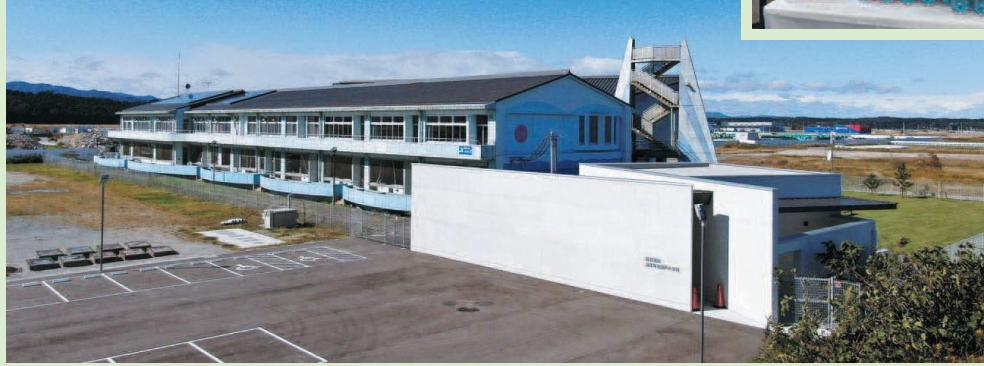

震災遺構浪江町立請戸小学校開館(10月)

なみえスマートモビリティ実証実験(11月~2月)

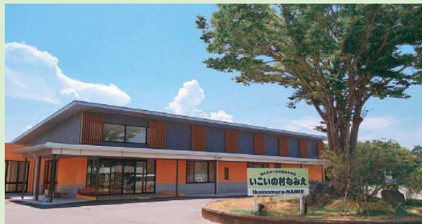

いこいの村なみえグランドオープン(8月)

取材者:認定特定非営利活動法人市民公益活動パートナーズ古山・松田取材日:1月12日 「令和3年4月広報なみえ掲載」

ます。

その後、原発事故もあり、

したので今でも鮮明に覚えていんできました。衝撃的な映像で寄せた津波の映像が目に飛び込ビを付けると、仙台空港に押しず外に出ましたが、戻ってテレが、すごい揺れでしたね。思わ神奈川県にある寮にいました

◆あの東日本大震災の時は、ど

当時、私は大学3年生で、うしていらっしゃいましたか

#### じか浪江町の変化を直に感じたいと思い、戻りました

していましたね。

小学校3年生から高校3年

たので、正月などはそこに帰省家族は福島市に避難していまし

大学生から社会人となった20代のほとんどの間、浪江町を離れて首都圏におられた吉田さんだからこそ、同じ年代の友人・知人とつながりたいという思いが強いのでしょう。 ご友人たちとの交流の場として開設を計画されているウェブサイトが盛んになり、若い世代が結集して、これからの浪江町や相双地方の大きな力となることを願っています。

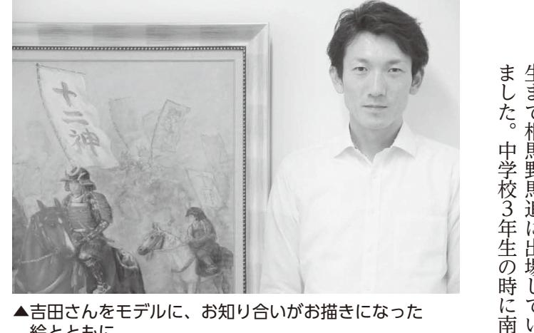

福島県

▲吉田さんをモデルに、お知り合いがお描きになった絵とともに

| 農 業 法 人 ラ ン ド ビ ル ド フ ァ ー ム                  |
|-------------------------------------------------------------------------------------|
| と 解 除 後 の 活 用 の た め 、 昨 年 、                  |
|                                                                                     |
| 元 さ れ ま し た 。 解 除 ま で の 保 全                  |
| 荒 れ て い た 土 地 も 農 地 と し て 復                  |
| 除 染 も し て い た だ き 草 木 な ど で                  |
| は 現 在 も 帰 還 困 難 区 域 で す が 、                  |
| ま た 、 実 家 の あ る 室 原 地 区                            |
| す 。                                                                              |
| 一 助 と な り た い と 思 っ て い ま                       |
| 興 」 と 新 た な 「 ま ち づ く り 」 の                  |
| お り 、 双 葉 郡 や 浪 江 町 の 「 復                       |
| エ ネ ル ギ ー 事 業 な ど に 携 わ っ て                  |
| で は 、 主 に 復 興 事 業 や 再 生 可 能                  |
| 代 表 を 務 め る 株 式 会 社 S A M                       |
| し て い き た い と 思 っ て い ま す 。                  |
| も 大 好 き な 野 馬 追 の 歴 史 を 継 承                  |
| 守 り 続 け て お ら れ ま す の で 、 私                  |
| 降 も 先 輩 方 が 地 域 の 伝 統 文 化 を                  |
| 気 持 ち も あ り ま し た が 、 震 災 以                  |
| イ ル ス に よ り 規 模 縮 小 と 残 念 な                  |
| て い ま す 。 昨 年 は 新 型 コ ロ ナ ウ                  |
| 願 だ っ た 相 馬 野 馬 追 に も 出 場 し                  |
| そ の 後 、 浪 江 町 に 戻 り 、 念                            |
| 歳 で 退 職 し ま し た 。                                           |
| ラ ブ に 就 職 し て 7 年 間 勤 め 、 29                 |
| 県 富 里 市 の 有 限 会 社 成 田 乗 馬 ク                  |
| し た ね 。 大 学 を 卒 業 後 は 、 千 葉                  |
| よ う な 清 潔 感 の な い 学 生 生 活 で                  |
| 3 人 ず つ 。 18 人 ほ ど で 生 活 す る                 |
| の 上 に 男 ば か り 約 6 畳 の 部 屋 に                  |
| い た の で す が 、 1 階 が きゅ 厩 うし 舎 ゃ で そ |
| し た 。 当 時 、 強 豪 と 言 わ れ て は                  |
| ら 声 を 掛 け て い た だ き 進 学 し ま                  |
| り 馬 術 競 技 を 始 め 、 明 治 大 学 か                  |
| 相 馬 市 小 高 区 の 乗 馬 ク ラ ブ に 入                  |

を立ち上げました。

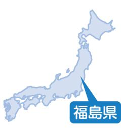

ふくしま花フェスプロジェクト特定非営利活動法人Jin代表清水裕香里さん(幾世橋) かつらお胡蝶蘭合同会社業務執行役杉下博澄さん(葛尾村) Smilefarm代表谷口豪樹さん(川俣町) fukufarmingflowers代表福塚裕美子さん(川内村) こちょうらん

取材者:認定特定非営利活動法人市民公益活動パートナーズ古山・松田取材日:2月5日 「令和3年6月広報なみえ掲載」

## 花を通してふるさとの復興を目指す、4人の挑戦

つく今回は、浪江町と隣り合う町村の方々もお迎えしてのグループインタビューになりました。いずれも花に関わる仕事を通じて、震災やコロナ禍を超えて新たな地域産業を創ろうとする若い世代の人たちです。

それぞれのフィールドは、生まれ育ったふるさとであったり、新たなふるさとになったりと様々ですが、その地域で新たな仕事を介して復興を願う思いや今の状況、そして地域や事業へのこれからの抱負などについて、お話を伺いました。

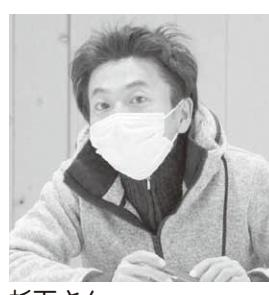

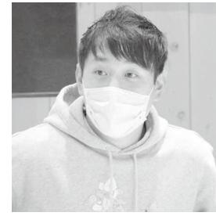

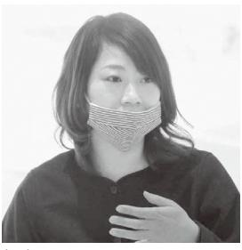

清水さん杉下さん谷口さん福塚さん

◆東日本大震災・福島原発事故れていましたかが起きた時は、どこで何をさ福塚さん大阪府貝塚市生まれの震災が起きました。 の仕事を始め、その1年目にあう目標を持って花屋で園芸と花たらドイツに学びに行こうといの私は、東京で3年間仕事をし園芸の同僚であり、大切な友の年(平成人のふるさとが川内村で、震災 23年)の8月に村を清水さんベントなどを手伝いました。 住して米作りや畑仕事、復興イたん離れ、翌年5月から村に移た。そこで、花の仕事からいって、役に立ちたいと思いましのいない村を見て悲しむ姿を見訪れた時、荒れ果てた田畑や人あの時は、勤務する市から通勤しました。 勤務だったので、避難先の福島に事務所を置き、私は二本松市た。Jinが県北方部3か所共に郡山市へ移動したりしまし朝、原発事故が起き、利用者と用者さんを送り届けました。翌間帯で、揺れが収まった後、利ビスがまもなく終わるという時NPO法人Jinのデイサー平成 25年に町内への立ち入りました。翌春(平成ングの結果で出荷できなくなりを作り始めましたが、モニタリができるようになり、まず野菜 26年)かほうぶ

すが、来年度は独立するための

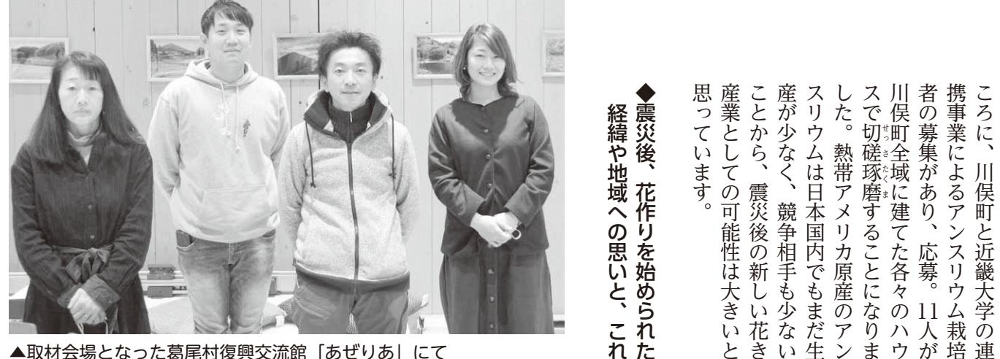

11人が

▲取材会場となった葛尾村復興交流館「あぜりあ」にて

てお聞かせくださいからの事業計画などについ杉下さん会社員として職場のやろうと思いました。 と考え、基幹産業である農業を合って何ができることはないかじながらも、真正面から向きという理不尽な災害に義憤を感しまうのではないか。原発事故葛尾村は地図の上からも消えてえた景色の無残さを見ながら、かりました。人がいない冬を迎村避難した生まれ故郷が気に掛再開に向けて尽力しつつも、全村が胡蝶蘭栽培にチャレンジ点に、平成葉タバコの乾燥ハウス跡地を拠応募したことがきっかけです。 業計画の精度の高さに共感してする有志を募っていて、その事 29年1月に3軒の農市場を視察したりしました。 県などに研修に行ったり、花きるために千葉県や群馬県、山梨立上げました。栽培指導を受け家と1つの法人とで合同会社をこれからは葛尾をはじめ、浜ロナ)の影響で少し遅れていまイルス感染拡大(以下、新型コとが前提でした。新型コロナウ年後には各々が独り立ちするこ業に取り組むために法人化、3 先ほど話した合同会社は村の事できることを目指しています。 通りに胡蝶蘭栽培の産地形成が

段階に入ります。 できましたが、波及させていくを作り、増やすことに取り組ん準備をします。これまでは仕事また、アグリカレッジや農業や浜通り高校などとの連携を図り、村内 12市町村で次世代の担清水さん環境を作っていきたいですね。 花き栽培が生業として成り立つ移住定住促進につながるよう、い手を育てたい。同時に、村の私にとって花作りはた。 り、トルコギキョウに絞りまし岩手県が盛んということもあウでしたが、リンドウの栽培は初めはトルコギキョウとリンドことはいいなと感じています。 きれいな花を育て、出荷できる初めてでしたが、畑のハウスでJinが法人として花で収平成をしたい人を応援したいです。 いことを伝えながら、花で営農い・汚い・儲からない」ではなすが、花き農家は決して「きつ益を上げることは当然のことで 27、 28年頃から営農の相談福塚さんを予定しています。 度は研修制度を導入し、受入れれて指導したりしました。来年を受けたり、職員として受け入川内村で3年目を迎たので、念願のドイツ行きを叶頃、復興支援も充実してきましえ、活動に限界を感じていたています。 もうかな

た時、発に際して村の仲間たちに話しえるために村を離れました。出 「川内に戻ります」ってび直して平成には1年滞在した後、東京で学な思いだったんですね。ドイツ言っちゃったんです。私の正直 30年に村に帰っていと思っています。 行きたい、村の復興を見届けたきましたが、今はここで生きて 30年以降は自宅で教室を開いきました。 りしながら、ファン作りをしてたり、双葉郡内を営業に回ったそして3年目となる今年4月店になります。 を併設する全国でも珍しい広いです。切り花、園芸、ガーデン中旬頃に店をオープンする予定花を軸にしながら、本当にや谷口さんいと思っています。 りたいことを少しずつ形にした先の未来の話より発信していきたいです。 や福島の良さを、もっと全国にんでいることを通じて、川俣町も、アンスリウム栽培に取り組今、新型コロナ禍の影響で外楽しさを体験して欲しいと思っ狩りやイチゴ狩りなど、農業の挑戦しています。アンスリウムと、クラウドファンディングに数・予約制の観光農園を開こう出が難しい家族に向けて、少人

ơƆƆǀࢉႜ§اࣰ **再取材シリーズ**

取材者:認定特定非営利活動法人市民公益活動パートナーズ古山・松田取材日:2月24日 「令和3年5月広報なみえ掲載」

### 浪江町は、ブレイクした楽しい思い出ばかりです

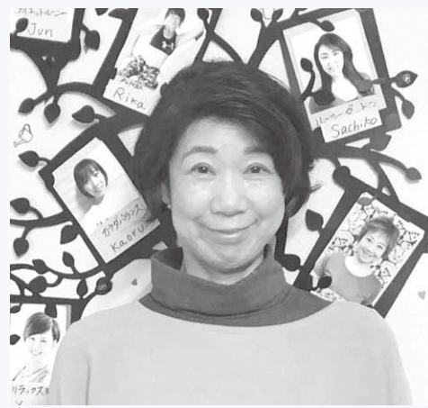

福島県

浪江町から福島市に避難し、その年の5月には市内に女性専門フィットネス・スタジオ「UP-BEAT(アップビート)」 (以下、スタジオ)をオープン。浪江町の頃と変わらぬ活躍をされてきた長山さんに、この10年間を振り返りつつ、これからについても聞かせていただきました。

また、ご結婚後、30年近く浪江町で暮らし、生まれ育った神奈川県よりも長く親しんだ浪江町で過ごした日々を懐かしそうに話してくださいました。

◆この新型コロナウイルス感染平成転機になりました拡大による自粛が、大きな 23年5月に福島市でスだけでした。転機は、平成タジオを再開した頃は、口コミ 27 ンマガジン「HOTどの街の情報を掲載したクーポに飲食店や美容院、スクールなの若い会員さんも増え、平成ガ」も始めたことで、会社帰りスタジオがなかった「ホットヨしょう。まだ福島市には専門のタジオの宣伝をした頃からでWeb予約サイトを開設し、スER (ホットペッパー) 」の会員さんになっていましたね。 て、思い返すと100人以上の年頃にはようやく軌道に乗れスタッフや会員の方々と

▲共に活動するスタッフさん方の写真の前で

年PEPP 29 10 ました。 染拡大が起き型コロナ)感ス(以下、新コロナウイル矢先に、新型を考えていた年目のお祝い 10 年したが、当時加いただきま方々も結構参前は浪江町の 50、 60歳の方

「

| は も う 60 、 70 歳 で し ょ う 。 体 調 | す 。 サ ン プ ラ ザ 近 く に あ っ た |
|----------------------------------------------------------------------|---------------------------------------------------------------|
| の 変 化 や 家 族 の 介 護 、 さ ら に 新   | 宅 は も う 住 む こ と は で き ま      |
| 型 コ ロ ナ の 影 響 で 、 な か な か お   | ん 。 ご 近 所 の 方 々 や 浪 江 の ス |
| 越 し に な れ ま せ ん 。                            | ジ オ の 会 員 さ ん 方 に は 、 お 別 |
| ス タ ジ オ で は こ の 新 型 コ ロ             | の 挨 拶 も せ ず に 避 難 し て し ま |
| ナ 禍 に 立 ち 向 か う た め に 、 令 和   | ま し た が 、 本 当 に あ り が と う |
| 2 年 5 月 か ら 自 宅 で も で き る オ   | ざ い ま し た 。 か わ い が っ て い |
| ン ラ イ ン ・ レ ッ ス ン に 切 り 替 え   | だ い た 息 子 も 、 高 校 を 卒 業 し |
| ま し た が 、 イ ン ス タ グ ラ ム や        | 春 に は 仙 台 の 専 門 学 校 生 で す |
| フ ェ イ ス ブ ッ ク な ど ソ ー シ ャ        | 思 い 返 せ ば 、 浪 江 町 が 私           |
| ル ・ ネ ッ ト ワ ー キ ン グ ・ サ ー ビ   | と っ て 一 番 は じ け て い た 時 代 |
| ス ( S N S ) を 使 い 慣 れ て い な   | し た 。 バ ブ ル 景 気 の 頃 、 ス タ |
| い 年 代 の 方 に は 、 難 し い よ う で   | オ の 皆 さ ん と 町 の 「 サ ン バ カ |
| す 。 一 方 、 全 国 の 様 々 な 人 た ち   | ニ バ ル 」 で 優 勝 し た こ と 。      |
| と つ な が る こ と が で き る お も し   | た 、 福 島 県 の 歩 け 歩 け 大 会 や |
| ろ さ も あ り ま す よ 。                            | の 秋 の 運 動 会 で 準 備 体 操 の リ |
| ま た 、 新 型 コ ロ ナ の 自 粛 中 、        | ダ ー を 務 め た こ と 、 札 幌 で 開 |
| 50 代 か ら の イ ン ナ ー チ ャ イ ル       | さ れ た Y O S A K O I ソ ー ラ |
| ド ダ イ エ ッ ト 」 を 書 き 、 令 和 2   | 祭 り に 「 ワ ン ダ ー な み え 」 の |
| 年 10 月 に A m a z o n ( ア マ ゾ  | 間 た ち と 出 場 し た こ と な ど 、 |
| ン ) か ら 電 子 書 籍 と し て 発 行 し   | え 切 れ な い 思 い 出 が あ り ま す |
| ま し た 。 ダ イ エ ッ ト ア ド バ イ        | 本 当 に 楽 し く 、 懐 か し い 日 々 |
| ザ ー と し て 実 体 験 に 基 づ い た ノ   | 忘 れ ら れ ま せ ん ね 。                     |
| ウ ハ ウ を 伝 え る と と も に 、 浪 江   | 今 後 は 、 ヨ ー ク カ ル チ ャ           |
| の 思 い 出 や 3 ・ 11 の こ と も 織 り  | 福 島 や 二 本 松 駅 前 市 民 交 流 セ |
| 交 ぜ ま し た 。                                           | タ ー な ど 、 一 部 の サ ー ク ル      |
|                                                                      | レ ッ ス ン は 続 け ま す が 、 こ の |
| ◆ 浪 江 の 近 所 の 方 々 や ス タ ジ オ   | 島 市 大 森 の ス タ ジ オ は 3 月 で |
| の 会 員 さ ん に 、 こ れ ま で の             | じ ま す 。 そ し て 、 オ ン ラ イ ン |
| 感 謝 と 、 こ れ か ら の 抱 負 を             | レ ッ ス ン で ヨ ガ や ダ イ エ ッ ト |
| 伝 え た い                                                     | 座 を 発 信 し な が ら 、 私 し か で |
| 浪 江 町 高 瀬 の ス タ ジ オ は 今 、        | な い レ ッ ス ン を こ れ か ら も お |
| 夫 が 事 務 所 と し て 使 っ て い ま        | け し て い く つ も り で す 。           |

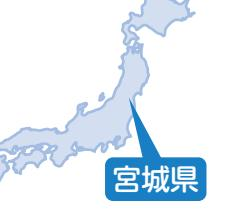

# 只野玲子さん(請戸)

取材者:一般社団法人東北圏地域づくりコンソーシアム村田・吉田取材日:12月10日 「令和4年3月広報なみえ掲載」

## お世話になった皆さんに「笑い文字」で感謝の想いを伝えたい

宮城県名取市にお住まいの只野玲子さん。 現役の保育士として仕事をしながら、かわいい「笑い文字」の普及活動を行っています。渡した相手が自然に笑顔になり、ほっこりと幸せな気持ちになれる「笑い文字」。そこに込められたふるさとの皆さんへの想いを伺ってきました。

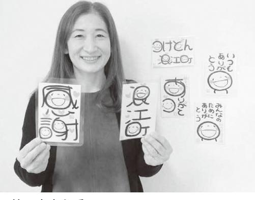

▲笑い文字を手に

ると、原発がダメの手伝いをしていた。翌朝炊き出し手伝いをしましも一晩、避難所のしました。夫も私を確認でき、安堵たがみんなの無事の被害を受けまし

|   | が 取 れ 、 家 は 津 波                |             |
|---|-----------------------------------------------------|-------------|
|   | 娘 と 息 子 に も 連 絡                |             |
|   | 避 難 出 来 ま し た 。                |             |
|   | を 連 れ て 保 育 園 に                |             |
|   | な が ら も 母 と 愛 犬                |             |
|   | 波 に 追 い か け ら れ                |             |
|   | 避 難 誘 導 の 中 、 津                |             |
|   | が 、 見 回 り や 津 波 か ら の | い た 夫 |
|   | の 消 防 団 の 分 団 長 を し て | 請 戸      |
|   | て 安 心 し ま し た 。                | が 出 来 |
|   | 、 無 事 全 員 引 き 渡 す こ と | し た が |
|   | っ て 夜 遅 く ま で か か り ま | 害 も あ |
|   | お 迎 え も 仕 事 や 道 路 の 被 | た ち の |
|   | 動 き に 感 動 で し た 。 子 供 | 素 早 い |
|   | 難 し ま し た 。 子 供 た ち の | 外 に 避 |
| 、 | れ が 収 ま っ て 、靴 を 履 き    | た 。 揺    |
|   | ち の 安 全 確 保 に 努 め ま し | 子 供 た |
|   | な い 程 の 揺 れ で し た が 、 | い ら れ |
|   | し た 。 震 度 6 強 で 立 っ て | た 時 で |
|   | お 昼 寝 か ら 起 こ そ う と し | た ち を |
|   | 、 地 震 が 来 た の は 、 子 供 | 勤 務 し |
|   | 時 は 、 コ ス モ ス 保 育 園 に | 震 災      |
|   |                                                     | し た 。 |
|   | 幼 稚 園 に も 勤 務 し て い ま | や 大 堀 |
|   | 、 請 戸 小 学 校 児 童 ク ラ ブ | 保 育 園 |
|   | 臨 時 職 員 と し て コ ス モ ス | 浪 江 町 |
|   | 嫁 ぎ 、 子 育 て を し な が ら | 請 戸 に |
|   | 新 潟 県 の 出 身 で 、 結 婚 し | 私 は      |
|   | 日 に は 町 外 へ                          | 〜 翌      |
|   | 園 で 被 災                                    | ◆ 保 育 |

| に 家 を 建 て 引 っ 越 し ま し た 。 近                                                                       |
|------------------------------------------------------------------------------------------------------------------------------------------|
| 探 し 、 2 0 1 4 年 宮 城 県 名 取 市                                                                       |
| そ し て 、 家 族 の 集 ま れ る 家 を                                                                            |
| い っ ぱ い で す 。                                                                                                          |
| 頂 い た 方 々 に 感 謝 の 気 持 ち で                                                                            |
| た ち の そ れ ぞ れ の 進 路 に ご 尽 力                                                                       |
| て る よ う 頑 張 っ て い ま す 。 子 供                                                                       |
| 震 災 の 経 験 を 活 か し 、 お 役 に 立                                                                       |
| 大 学 へ 。 そ し て 、 公 務 員 と し て                                                                       |
| 仲 間 に 巡 り 会 え 、 無 事 卒 業 し 、                                                                       |
| こ て と 、 が 県 で 立 き 新 ま 発 し 田 た 高 。 校 素 に 晴 編 ら 入 し す い る |
|                                                                                                                                          |
| 生 に な る 時 で 、 4 月 に 面 接 を 経                                                                       |
| し た 。 息 子 は 県 立 双 葉 高 校 3 年                                                                       |
| と し て 社 会 に 出 る こ と が で き ま                                                                       |
| 支 援 を 頂 き 無 事 卒 業 し 、 保 育 士                                                                       |
| に な る 時 で 、 い ろ い ろ な 方 の ご                                                                       |
| け て い ま し た 。 娘 は 短 大 2 年 生                                                                       |
| 勤 め る こ と が で き 、 保 育 士 を 続                                                                       |
| 活 で し た 。 私 は 地 元 の 保 育 園 に                                                                       |
| き 、 週 末 は 新 潟 に 帰 っ て 来 る 生                                                                       |
| き の 撤 去 の た め 単 身 で 仕 事 に 行                                                                       |
| て い た の で 、 す ぐ に 捜 索 と が れ                                                                       |
| 夫 は 浪 江 町 の 泉 田 組 に 勤 務 し                                                                            |
| 移 り 3 年 間 過 ご し ま し た 。                                                                                 |
| テ り ル ま ) み し た な 。 し そ 仮 の 設 ( 後 、 ア 避 パ 難 ー 所 ( ト ) に ホ        |
| 難 し 、 実 家 に か 月 お 世 話 に な                                                                            |
| 実 家 が あ る 新 1 潟 県 新 発 田 市 に 避                                                                  |
| 原 発 の 水 素 爆 発 に よ り 、 私 の                                                                            |
| ◆ 新 潟 か ら 宮 城 へ                                                                                                     |
| る 福 島 市 ま で 行 き ま し た 。                                                                                 |
| 援 活 動 し 、 私 た ち は 夫 の 妹 が い                                                                       |
| は 、 津 島 の 避 難 所 に と ど ま り 支                                                                       |
| だ か 分 か ら ず の 避 難 で し た 。 夫                                                                       |
| 警 察 官 の 姿 が 見 ら れ 、 何 が な ん                                                                       |
| 車 で 出 発 。 外 に は 防 護 服 を 着 た                                                                       |
|                                                                                                                                          |
| な の で す ぐ に 避 難 だ と 伝 え ら れ 、                                                                  |

◆宮城県名取市での暮らし行き来させて頂いています。 現在、名取市の公立保育所で 〜笑い文字の活動げてもらいました。 テレビや福島の新聞にも取り上インでも開講しています。昨年います。コロナ禍なのでオンランター、社員研修などで教えてを取りました。公民館や児童セに共感し、3年前に講師の資格伝えたり応援したり出来ることれたり元気になったり、感謝をて完成」 。受け取った方が癒さ界を作る」 「書いて半分、渡し字。 「感謝と喜びの循環する世い文字は、満面の笑顔の筆文文字」の活動をしています。笑ています。空いた時間に「笑い会計年度任用職員として勤務し請戸でお世話になった、名取の発信にもご協力頂いていますた鈴木酒造店さんには笑い文字さんや道の駅なみえで再開され市閖上で事業を再開された鈴栄り笑い文字を渡しています。 場や道の駅なみえさんに立ち寄墓参りに帰った際は、浪江町役飾ってくれています。請戸のお文字を喜んでくださり、お店に永窯さん。皆さん、渡した笑いた大堀相馬焼の錨屋窯さんや松大堀幼稚園時代にお世話になっ笑い文字が家庭に一枚あるこ縁に感謝です。 ていきたいです。たくさんのごも、皆さまへ感謝の想いを伝え欲しい願いも込めて、これからとで笑顔になり、活力になって

。