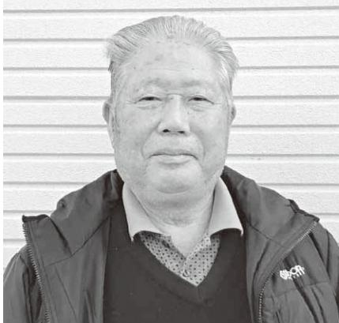
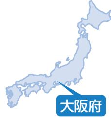
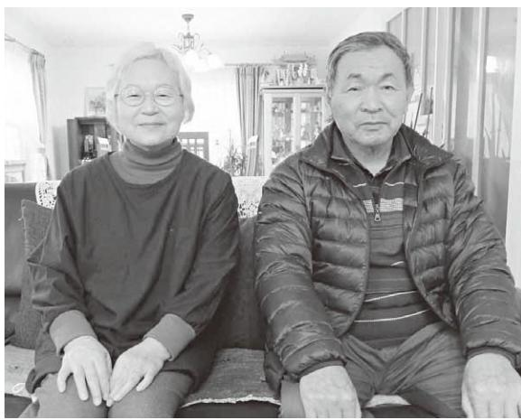
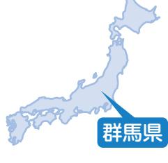

 

 

> ◆ 10 年以上経った今の方が、震

災にまつわる話をするのが難

しい大震災から約

達郡川俣町で ㈲

させました 。 あ

役を務めてきま

息子に代を譲り

和 3 ) 年 11 月よ

ています 。

国有林での林

の事業でしたが

きく変わりまし

避

木の

獣に

ど、

んど

様 々

によ

し直

植

、

な

々

大

伊

開

締

は

令

い

### 山崎安男さん(権現堂)

取材者:認定NPO法人市民公益活動パートナーズ古山・松田取材日:2021年12月21日

#### 動けるうちに活動の輪を広げたい

東日本大震災・福島原発事故から1年後、2012(平成 24)年夏に、川俣町の社屋で取材させていただいてから、ほぼ10年。あの時の記憶をお互いにたどりながらの再会インタビューになりました。

仕事のフィールドである山や川を本来の姿で守りたいという思いは、年を重ねて、なお募る一方のご様子です。

|                                                          | し      | っ な           | で      | 個      | 荒      | 抜      | 難      |
|----------------------------------------------------------|--------|------------------|--------|--------|--------|--------|--------|
| ▲「視力が衰えてきたんだよ」とおっ                                        | た      | て 重 機      | す 。 | 人 や | ら      | 根 や | に      |
| しゃっていましたが、森林ボランティ                                        | り 、 | 修 理 は      | 震      | 浪      | さ      | 庭      | よ っ |
| アも大好きなゴルフにも意欲満々のよ                                        | 新      | も 放           | 災      | 江      | れ      | 石      | て      |
| うです                                                      | た      | ま 射           | 前      | 町      | た 農 | 、      | 荒      |
| が 除 避 葉 は 津 後 で 経 ど り 材 | な 作 | ま 能 な 汚 | に 使 | の 仕 | 地      | 竹 藪 | れ た |

4 カ月後に、山崎興業を再れから代表取したが、現在、 2 0 2 1 ( り会長職に就業の仕事が元、震災以降はた 。 家屋のの除去の整備事がほってい染の懸らず調業用のを揃えする、会社営も大した 。 も浪江島地区じめ、郡全体避難指示除区域がうです

た

念

達

機

た

な

の

変

今

町

を

双

に

解

広

がるでしょ

と

| し 果 て 的 い に ま 深 す め 。 て く れ る 支 援 も | ど 道 と し て 、 多 く く だ の さ ら 人 た な ち い の だ 理 ろ 解 う | 俯 瞰 し た 提 言 な ど を 積 極 的 | の 境 保 呼 び 全 か に け 対 す や 、 る 保 法 全 的 計 な 画 規 全 制 | ま た 、 新 聞 な ど の メ デ ィ ア | げ て み よ う か と 考 え て い ま | の 区 長 さ ん 方 へ の 呼 び か け | 山 た 木 番 屋 組 地 と 区 連 や 携 福 し 島 て 市 お 立 隣 子 の 山 川 | て ゴ ミ 拾 い 旅 」 を 見 て 、 こ | 映 さ れ た 「( 鈴 木 )ブ ン ケ ン | 例 え ば 、 福 島 中 央 テ レ ビ | え て い ま す 。 | 関 心 を 持 っ て い た だ け る か | 人 た ち な の で す が 、 ど う し | で 動 け そ う な 75 才 く ら い ま | 金 支 給 が 始 ま る 65 才 か ら 、 | 活 動 に 巻 き 込 み た い の は | 何 か 工 夫 を | ◆ 自 然 を 一 緒 に 守 る た め | 討 し て 欲 し い と 思 っ て い ま | た ゴ ミ の 処 理 方 法 を 具 体 的 | す 。 そ の た め に 、 役 場 に は | 是 非 と も 浪 江 町 で と 願 っ て | 拾 い を し た り し て き た 活 動 | ど の 注 意 を 呼 び か け た り 、 | 板 を 作 っ て 山 火 事 や 不 法 投 | け て 活 動 を 続 け た い で す ね | て い た O B な ど に 新 た に 声 | 区 長 さ ん 方 や 国 有 林 で 仕 事 |
|----------------------------------------------------------------------------------------|----------------------------------------------------------------------------------------------------------------------|----------------------------------------------------------|----------------------------------------------------------------------------------------------------------------------|----------------------------------------------------------|----------------------------------------------------------|----------------------------------------------------------|----------------------------------------------------------------------------------------------------------------------|----------------------------------------------------------|-------------------------------------------------------|-----------------------------------------------------|----------------------------|----------------------------------------------------------|----------------------------------------------------------|-----------------------------------------------------------|-----------------------------------------------------------|-----------------------------------------------------|-----------------------|-----------------------------------------------------|----------------------------------------------------------|----------------------------------------------------------|----------------------------------------------------------|----------------------------------------------------------|----------------------------------------------------------|----------------------------------------------------------|----------------------------------------------------------|----------------------------------------------------------|----------------------------------------------------------|----------------------------------------------------------|
| 期                                                                                      | を か                                                                                                               | に                                                        | 体 緩                                                                                                               | が                                                        | す                                                        | を                                                        | 地 俣                                                                                                               | う                                                        | 歩                                                     | で                                                   |                            | を                                                        | た                                                        | で                                                         | 元                                                         | 、                                                   |                       | に                                                   | す 。                                                   | に                                                        | 集                                                        | い                                                        | を                                                        | ゴ                                                        | 棄                                                        | 。                                                        | を                                                        | を                                                        |

害

請戸

をす

、先

同級

人

会の

同じ

集ま

が、

くて

昨年

には

した

にい

とも

に集

の模

存分

学の

ずに

この

に出

たが、

交流

景も

近隣

風景

ろい

って

況に

す 。

故

ア

進

ル

体

新

控

も

サ

り

か

一

り

東

館

証

ち

る

ら

## 横山和佳奈さん(請戸)

取材者:認定特定非営利活動法人市民公益活動パートナーズ古山・松田取材日:2021年12月28日

### 大震災の記憶と体験を、さまざまな視点で伝え続けたい

横山さんへの最初の取材は、大学受験を目前にした高校3年生の時でした。

そして約5年後、社会人となった横山さんにお話を伺うことができました。大学時代や今の仕事に就いた経緯、ふるさと請戸地区に対する思いやこれからしてみたいことなど、あれこれとお聞かせいただきました。

◆ 社会人の第一歩は、 「 東日本大震災・原子力災伝承館 」 から東日本大震災・福島原発事からの避難体験から、心のケに活かせる心理学を学ぼうとんだ大学では、授業やサーク活動を通じて、様 々 な学びや験などができました 。 でも、型コロナ禍の影響で、卒業をえた 4 年生の一年間、授業はちろん、担当教授の卒論のポートを受けることもままなませんでした 。 また、大学に入学した頃ら、県外のNPO法人さんと緒に語り部ボランティアに取組んだり、現在の職場である日本大震災・原子力災害伝承 ( 以下、伝承館 ) が制作した言映像に出演したりするうに、心理学を専門的に探究すよりも、災害を様 々 な角度か

▲お仕事も地域の活動も、思い切り楽しんでください(写真:原子力災害伝承館ご提供)

| 早 く な る こ と を 願 っ て い ま す   | 伝 え る 機 会 を 創 る こ と が 必 要 だ                |
|-----------------------------------------------------------------|-----------------------------------------------------------------------------------|
| い る の で 、 出 か け ら れ る 状 況   | く た め に は 、 地 元 の 学 校 な ど で                |
| ろ な こ と を 吸 収 で き る と 思 っ   | と 年 下 の 子 ど も た ち に 伝 え て い                |
| を 眺 め る の も い い 。 旅 は い ろ   | か り で す 。 10 代 の 若 者 や 、 も っ               |
| の 伝 承 館 巡 り で も い い し 、 風   | し か し 、 踊 り 子 の 継 承 が 気 が                     |
| 楽 し む こ と が で き ま し た 。 近   | が 活 動 の 醍 醐 味 で す ね 。                               |
| や 、 ま だ 知 ら な い 日 本 の 風 景   | 人 た ち に も 会 う こ と が で き る の                |
| 長 崎 の 語 り 部 さ ん た ち と の 交   | 応 援 し て く だ さ っ て い る 様 々 な                |
| 張 し ま し た 。 駆 け 足 で し た        | す 。 観 客 ば か り で な く 、 ず っ と                |
| 間 、 伝 承 館 の 仕 事 で 長 崎 県 に   | ち の 協 力 を 得 て 活 動 を し て い ま                |
| 残 念 な 思 い を し ま し た が 、 こ   | O 団 体 、 ま ち づ く り 会 社 の 方 た                |
| 時 に は 卒 業 旅 行 さ え も 行 け ず   | に 興 味 を 持 っ て く れ た 方 や N P                |
| 新 型 コ ロ ナ の 影 響 で 、 大 学        | な く な り 、 現 在 は こ の 伝 統 芸 能                |
| に し て み た い で す 。                       | 後 か ら 参 加 し て い る 踊 り 子 は 少                |
| 型 を 見 な が ら 何 気 な い 話 を 存   | 演 か ら 再 開 し て い ま す 。 震 災 直                |
| ま り 、 震 災 前 の 写 真 や 請 戸 の   | 災 遺 構 請 戸 小 )」 の 式 典 で の 公                    |
| だ か ら 、 広 く 伝 え て 一 堂 に        | 浪 江 町 立 請 戸 小 学 校 ( 以 下 、 震                |
| 知 ら な い か も し れ ま せ ん 。        | 昨 年 10 月 に 開 館 し た 「 震 災 遺 構               |
| る 人 た ち は 遺 構 に な っ た こ と   | ど 活 動 を 休 止 し て い ま し た が 、                |
| が 、 特 に 実 家 を 離 れ て 県 外 に   | 新 型 コ ロ ナ の 影 響 で 1 年 半 ほ                     |
| 4 人 の 同 級 生 が 参 加 し ま し        | さ い 頃 か ら 参 加 し て い ま し た 。                |
| の 震 災 遺 構 請 戸 小 の 開 館 式 に   | 公 民 館 で 踊 り を 教 え て い て 、 小                |
| 続 き ま せ ん で し た 。 ま た 、 昨   | て も 身 近 な も の で す 。 保 存 会 が                |
| 特 定 の 人 た ち し か 集 ま ら な く   | く 䊭 さ の 野 神 社 の 安 波 祭 や 田 植 踊 は と |
| る 企 画 を や っ て み た の で す が   | 請 戸 に 生 ま れ 育 っ た 私 に は 、                     |
| 頃 、 同 級 生 と オ ン ラ イ ン で 集   | 「 請 戸 の 田 植 踊 」                                              |
| 場 が で き た と 思 い ま し た 。 同   | ◆ こ れ か ら も 伝 え 続 け た い                          |
| も 来 た ん で す よ 。 や っ と 再 会   | 日 の 誘 導 な ど に 従 事 し て い ま す 。           |
| 会 を 開 い た ら 、 学 年 19 人 中 13 | 体 さ ん へ の プ ロ グ ラ ム 手 配 や 当                |
| 立 っ て 1 月 3 日 に 福 島 市 で 同   | フ ト を 組 ん だ り 、 訪 問 さ れ る 団                |
| 成 人 式 を 迎 え た 3 年 前 、             | 所 属 し 、 主 に 語 り 部 さ ん 方 の シ                |
| る こ と                                                     | に 幸 運 で し た 。 現 在 は 事 業 課 に                |
| 小 で の 同 級 会 開 催 と 、 旅 を        | 伝 承 館 に 就 職 で き た の は 本 当                     |
| ◆ 今 や っ て み た い こ と は 、 請   | く な っ て い き ま し た 。                                    |
| と 感 じ て い ま す 。                            | 伝 え て い き た い と い う 思 い が 強                |

### 伊藤暢秀さん(権現堂)

取材者:認定特定非営利活動法人市民公益活動パートナーズ古山・松田取材日:2021年12月28日

### まさかの「さか」は必ずある。 私たちの経験や教訓を、次の世代に伝えたい

福島市の借上げ住宅自治会の連合会「福島市なみえ会」が結成された頃、2012(平成24)年冬に取材して以来、約10年ぶりの再取材となりました。

広域避難を余儀なくされ、避難先で自治会の長を務められた伊藤さんに、改めて災害時の「つながり」についてお聞きしました。

◆ 団体を創ることで、町との対話を円滑にあの大震災・原発事故からの避難で福島市春日町のマンションに入居すると、そこには同級生が 4 人もいました 。 周辺にも浪江町から避難した人たちがいましたから、すぐに 「 福島市春日町借上げ住宅浪江会 ( 以下、春日町 )」 をつくりました 。 翌年 ( 2 0 1 2 年 ) 7 月には、福島市内の 3 つの借上げ住宅自治会が集まって 「 福島市なみえ会 」 を立ち上げました 。 私は神輿に担がれたようなものですが、本当に心強かったでね 。 人と人のつながりが支えくれました 。 点在している自治会よりもより人数がまとまった連合会組織して、町と話を進めるこが肝心と考えました 。 会員の戚、友人知人などの消息が早

▲「東日本大震災・福島原発事故は、いい経験をしました。これをどう伝えていくか思案中」とおっしゃる伊藤さん。闊達なお話しぶりに、私たちも励まされます

。

知りたかったし、避難生活を送るうえでの要望などを叶えて欲しかったからです 。「 春日町 」 が約 70 名、「 福島市中央浪江町自治会 」 が 1 4 0 名余、「 福島市浪江自治会 」 が約 50 名、合わせて 2 6 0 名以上の大所帯でしたので、会ごとに要望をまとめました 。 一人ひとりが言いたいことを言うのではなく、役場に対しても組織として話をしてきました 。 一番の成果は、「 あつまっぺ交流館 ※ 」 の開設でしたね 。 点在して暮らす借上げ住宅住民にとっては、近隣の町内会集会所をお借りしたりすることもありましたが、市街地に集まる拠点を持つことは大事だったと思います 。 互いに顔を合せておしゃべりすればホッとするし、家族以外の人と話ができることは大切ですよ 。 私たちは、比較的早い時期に、浪江町に近い南相馬市原町区に移転しましたので、会の人たちにお会いする機会は少なく、最近では新型コロナ禍の影響で訪ねることも難しいですが、お元気でいらっしゃるようです 。 ※ 開設当初は福島市方木田にあり、現在は福島市渡利に移転

す

て

、

を

と

親

、

く

◆ 振り返ると楽しかった、南相馬市の暮らし南相馬市原町区の家は昭和 40 年代後半に開発された団地の一角にあります 。 我が家の玄関と差向いになっている近隣の方 々 とは親しくさせていただいています 。 反面、隣組組長も務めましたが、回覧などはポスティングで、顔が分からないお宅もあります 。 団地は子どもたちを介してのお付き合いが主になりますから、高齢者ばかりになると交流が少なくなるのは仕方ないのでしょう 。 私たちは、 2 0 2 2 年には浪江町に帰ります 。 転居先で 「 浪江町民です 」 とはもう言いたくないし、少ない人数でも戻った方が賑わいの助けになるでしょう ( 笑 ) 大震災の時は金婚式でしたが 10 年経って、老いることは大変だなぁと思います 。 身軽に動きたい思いとは裏腹に、気持ちが億劫になることも知りました 。 その上、この 2 年、新型コロナ禍に追い打ちをかけられたようなものです 。 けれども、避難の体験やみんなで助け合った経験などを年下の世代、できれば 20、 30 代の若い人たちに伝えていきたいですね 。 浪江の家に気軽にお立ち寄りいただければと願っています

124

くさの

志賀隆充さん(大堀)

取材者:認定特定非営利活動法人市民公益活動パートナーズ古山・松田取材日:2022年1月7日

#### かつて誰も経験したことのない「消防行政」の取り組みは、まだまだ終わりません

志賀さんには、東日本大震災・原発事故から間もない2012(平成 24)年に、避難先の本宮市で避難にまつわるお話をお聞きしました。 今回の再取材では、消防士のお立場から、この10年頻発した自然災害などを通した体験や、日常生活や心身を脅かすような災害から身を守る術など、お仕事にまつわるお話を中心にお聞きしました。

ド

くさの

す

の

で

ơƆƆǀࢉႜ§اࣰ **再取材シリーズ**

震

に

。

べ

あ

え

。

も

川

屋

ま

め

設

な

休

け

家族には、風雨が強くなる前

▲お仕事中は引き締まったお顔でしょうから、記事には柔らかな表情の写真を選びました。大変なお仕事です。くれぐれもお身体おいといください

に車を高台に移動させ、ハザードマップで予測される浸水は家の 1 階で留まるはずだから、 2 階で生活し、避難指示が出た場合は安全な高台に避難するようにと伝えました 。 皆さんもお住いの市町村が作成しているハザードマップで、ご自宅と職場、この 2 カ所に関して洪水や津波、土砂災害、火山などの様 々 な災害がもたらす被害予測や状況、避難場所などを日頃から調べておくことをお願いします 。 今は携帯電話やパソコン ※ などで簡単に調べることもできるので、台風などの場合は、安全なうちに近くの河川がどのような状態になっているのかをネット上で確認して、避難などの対応を判断してください 。 災害を最小限に防ぐために何より大切なのは、自治体が発する警報などを待つのではなく、自ら情報を取りに行くことです 。 それから、日頃からよく見るサイトを決めておくことです 。 私は 「 川の防災 」 などをよくチェックしていますよ 。 ◆ 避難された皆さんが安心して帰れる双葉郡を目指して私が勤務する双葉地方広域市町村圏組合消防本部 ( 以下、双葉地方消防本部 ) の業務エリアは広く、双葉 8 く、双葉町の方日和田の仮設住も行っています暖房器具による洗面所でのヒーえや、新型コロなどに力を入れます 。 私たちが喜んでくださりただいていますそのほかに災・原発事故の験や教訓、 10 年葉地方消防本部を、講習会など方 々 に伝えてい震災以前に私でいた大堀地区葉郡のほかの町区域がありますに浪江町で起き火災の消火活動いふるさとも守全国、いや世界たことのない消索しながら、避れた時に皆さんていただけるよも地域を守ってます 。

町村ばかりでな 々 が住む郡山市宅への戸別訪問 。 特に冬期は、火災や入浴時やトショックの備ナ感染拡大防止てお伝えしてい訪ねると本当に、逆に元気をい 。 、東日本大震災害現場での体以上にわたる双の災害対応などを通して多くのます 。 たち家族が住んや津島地区、双村にも帰還困難 。 2 0 1 7 年春た大規模な山林など、誰もいなり続けています 。 中の誰も経験し防行政を常に模難指示が解除さが安心して帰っうに、これからいきたいと思い

※ウェブサイト(参考)「川の防災情報/国土交通省」 https://www.river.go.jp/index 「わがまちハザードマップ/国土交通省国土地理院」 https://disaportal.gsi.go.jp/

### 今野秀則さん(下津島)

取材者:認定特定非営利活動法人市民公益活動パートナーズ古山・松田取材日:2022年1月11日

#### 記録誌作りには、お会いしてお話を聞ける嬉しさがありました

今野さんが執筆し、(社福)福島県社会福祉協議会が2014(平成26)年 3月に発行した『3.11ある被災地の記録浪江町津島地区のこれまで、あのとき、そしてこれから』は、東日本大震災・福島原発事故によって全戸避難を余儀なくされた津島地区住民の声などを収録し、記録誌の先駆けとなった一冊です。

改めて、「ふるさとの記憶を記録した頃」を振り返っていただくとともに、5カ所目の避難先である大玉村での暮らしについてもお聞きしました。

◆「 津島が消えてしまう 」とう切実な思いがありましたね大震災当時は、( 社福 ) 福県社会福祉協議会 ( 以下、県協 ) に勤めていました 。 そのの 5 月にいったん職場を離れしたが、その後、大震災・原事故における県社協の活動をとめた 『 東日本大震災福島社会福祉協議会活動の記録 』 携わりました 。 その仕事を終えた時、「 退して、津島地区の記録を遺しい 」 と決めていました 。 避難よって散り散りになってしまた津島地区の先人の経験や知識地域の歴史や暮らしなどを今まとめておかなければ 。 手をまねいていては、故郷の記憶消えてしまうと思ったからですそれがきっかけとなり、県社が平成 25 年度事業として採りげてくれたので、 2 0 1 3 年

職

た

に

っ

、

、

こ

が

。

協

上

4

▲大玉村のご自宅玄関で。「地域そのものを消されたようで、本当に悔しい」と何度も話され、その無念さが胸に迫りました

月から 1 年間をかけてまとめました 。大震災以前から、勤めの傍ら、下津島行政区の区長を務めており、地区のミニコミ紙 『 ILOVE下津島 』 を発行していました 。 下津島地区の故事来歴、先輩方や地区で活躍する人たちへのインタビュー、語り継がれている民話や昔話などをシリーズで掲載していましたので、それらの記事や資料、取り組んだ経験が礎になりました 。 『 3 ・ 11 ある被災地の記録 』 では、津島の 7 地区の高齢者 16 人に生い立ちから避難までをお聞きしました 。 津島の自然や歴史、暮らし、文化などにも話が波及し、新しい発見もあって、避難している最中でしたが本当に楽しい作業でした 。 県内外の避難先への訪問回数は平均 2 、3 回 。多い方で 4 〜 6 回に及びました 。 それにつけても、未曽有の原発事故によって地域社会の全てが消滅するような避難を強いるのですから、国は率先して被災者の話を聞き、地域の歴史なり、有り様を記録に遺すべきではないかと思うのです 。 役員を務める福島原発事故津島被害者原告団の活動が落ち着いたら、震災前に考えていたことですが、できれば旧津島村役場の記録や地区の故事来歴を調べて、旧津島村の記録をまとてみたいと思ったりしています ◆ この 2 年、新型コロナ禍でを合わせる機会がますますりました 。 仲立ちをしてくださる方がて、安達郡大玉村に家を建て 2 0 1 6 ( 平成 28) 年暮れ引っ越しました 。 それまで 5 年間住んでいた宮市白沢の和田地区 ( 以下、沢 ) は、気候風土が津島と似おり、人情が厚い土地柄で気入っていたのですが、やむをない事情があり、転居しました白沢は津島よりも古い風習遺していて、地区ごとに「 どん焼 」や「 山の神講 」、「 さなぶりなど年中行事を行います 。 白に越してきた時には、隣組のさんが歓迎会を開いてくださて、その後、地区の行事に参し、6 軒の隣組の方 々 とはすかり顔なじみになっていました白沢も大玉村もそうですが孤立して暮らすことはできまん 。 地域に溶け込むことで、かく受け入れていただけるもと思っています 。 しかし、こ 2 年は新型コロナ禍で、役員務める地元の大玉村十三区老クラブや、南達地方 ※ に避難た浪江町民で結成するコスモ南達会も実施できなくて、寂い思いをしています 。

せ ※安達郡大玉村や南に隣り合う本宮市など一定の地域を差す呼称です

温

の

の

を

人

し

ス

し

め

。

顔

減

い

、

に

本

白

て

に

得

。

を

と

」

沢

皆

っ

加

っ

。

、

い

くさの

島

社

年

ま

発

ま

県

に

### 今野義人さん(赤宇木)

取材者:認定特定非営利活動法人市民公益活動パートナーズ古山・松田取材日:2022年1月11日

#### 赤宇木の子どもたちが、その子どもたちに伝えられる記録を遺すためにあこうぎ

2014(平成25)年春に着想し、協力者の方々と共に足かけ約7年を費やした赤宇木地区の記録誌『百年後の子孫(子ども)たちへ』は現在、印刷に入っています。そして、今年春頃に開催を予定している地区総会で配布するとのことです。

赤宇木地区区長として、ふるさとの様々な記憶を記録する取り組みに掛けた思いや、制作の道のりを振り返っていただきました。

◆ 赤宇木地区を余すところく、子どもたちに伝えたい東日本大震災・原発事故か半年後、津島地区住民が集めれ、開かれた国の説明会で、「 のまま何もしなければ 1 0 0 は帰れないと思います 」 とい担当者の言葉を聞きました 。 のことがきっかけとなり、赤木地区の記録をなんとしてもしたい、子どもたちに伝えなればならないと決心しました最初に取り組んだことは、 80 歳以上の住民の方 々 に、家族歴史や思い出を書いていただるようお願いをしました 。 返のない方 々 には、避難先を訪ね聞き取りをしながら、それぞのお話をまとめました 。 古い真などもずいぶんお貸しいたきました 。 そのほか、赤宇木地区の歴

な

くさの

も

い

、

、

、

ち

も

め

し

た

5

年

で

、

い

て

て

、

区

し

き

辞

※安達郡大玉村や南に隣り合う本宮市など一定の地域を差す呼称です

て

。

役

超

ら

い

ら

ら

ら

こ

年

う

こ

宇

遺

け

。

の

け

信

、

れ

写

だ

史

や言い伝え、民話や方言、先祖

▲取材させていただいた私たちも、記録誌を拝見することを楽しみにしています。本当に頭の下がる取り組みをお聞かせいただきました

から受け継がれてきた慣習や生活の様子などを収録し、地区に特化した記録誌を作ろうと考えていました 。 しかし、旧津島村には 7 つの地区があって、お互いに重なり合った地域の取り組みを綿 々 と続けてきたことを考えると、そういった取り組みや旧村役場のことなども加えるべきだと思いました 。 こうした幾つかの柱を整理した上で原稿を作ることにしましたが、私はパソコンが苦手でしたので、こうしたことに詳しい今野邦彦さんに協力を求めました 。 今野さんは二本松市の仮設住宅を退去後、伊達郡桑折町に転居しましたので、私が桑折町まで足しげく通っていました 。 また、赤宇木地区の四季の風景写真などを誌面に収録するために、私や今野さんを含めた 7 人で写真撮影も行いました 。 こうして制作した記録誌は、最終的に約 5 0 0 ページになりました地 。 区住民の中で、原稿を書いてくださった人たちが 10 数人 。 残りの約 60 数人には取材をさせてもらいました 。 各家庭を廻り、両親に取材をしていると、子どもたちが一緒に聞いてくれる 。 地区や先祖のことを尋ねてくれる 。 これは嬉しかったですね 。 始めてよかったと勇気をらいました 。 ◆「 遺すこと 」への飽くなき思現在、赤宇木地区は 80 世帯約 2 4 0 人です 。 残念なことに避難しているこの 10 年の間に 478 人が亡くなっています 。 もろん、その中には取材した方いらっしゃいます 。 記録誌の制作中に、肩を痛たり、腰の具合を悪くしたりて治療しなければならなかっ期間が二度あって、計画した年より 2 年延びましたが、今度中に総会などで配ることがきそうです 。 欠席された方 々 は直接訪問して日頃の様子を伺ながら手渡しをしたいと思っいます 。 原発事故発生以来、継続しきた有志による放射線量測定とこの記録誌の制作は赤宇木地の事業として取り組んできまたが、ある程度の区切りがつそうですので、今期で区長をしたいと思っています 。 これからしてみたいと思っいることは、写真集づくりです記録誌のために、赤宇木地区員会の協力で 1 ,0 0 0 点をえる写真を撮りました 。 これをお蔵入りさせるのはもったない 。 できることなら、これを一冊の本にまとめたいと思ています 。

っ

## 志賀伸子さん(川添)

取材者:NPO法人つなぎteおおむた彌永取材日:2022年1月15日

#### 心温かだった時代を振り返りながら

2021年秋、志賀さんは、絵本「長いおるすばん」(2019年9月浪江のこころ通信第99号掲載)に続き2冊目の絵本「カミナリおじさん」を出版されました。昔を振り返り幼い自分を投影させたとおっしゃるその作品の根底には、互いを受け入れ支え合って生活していた人々の温かさがあります。取材時の志賀さんの言葉一つ一つから、懐かしむことはできても再び味わうことのできない時代への思いと、震災前の姿には戻ることのできない故郷への思いとが、重なって感じられました。

▲「幅広い年代の方に読んでいただきたい」 と、著書を手にされる志賀さん

※安達郡大玉村や南に隣り合う本宮市など一定の地域を差す呼称です

◆ ふるさと浪江への思い避難生活 10 年 。 その間、ぼんやり過ごしたくないと頑張ってきましたが、 80 代に突入した身は、気力と体力が伴わず 。 浪江の家には 4 年前に出かけたきりで、その後コロナ騒ぎとなり、その機会は遠のくばかりです 。 戦後を必死で生き、浪江を安住の地と定め、終の住処と信じていたのに … 今では自宅は廃屋同然、精魂込めた庭木は放射能汚染の理由で根元から伐られ、草茫 々 の荒れ地と化しています 。一度は知人の好意で草を刈り取ってもらいましたが、その後も雑草との戦いは続き、その都度、知人の恩情に頼る心苦しさはつのるばかり 。 この先、どうしたらよいものかと悩みは尽きず … これもあれも原発事故さえなかったらと、無念でなり

ません 。 先日、テレビで、未だに 「 還困難 」 にある津島の現状をて、かつての教え子たちの顔浮かびました 。「 今、どこでどうしているのかしら 」 と 。 いて、浪江中学校の生徒たち顔も 。 もう各 々 、父・母とり、孫も … という年齢になっいるでしょう 。 でも、私の頭中では、いまも坊主頭やオカパの姿で走り回っています 。 照りの夏も凍える冬も通った舎の姿、青い空に響いた校歌何一つ忘れることはありまん 。 ですが、その思い出の学は解体され、校名も校歌も新く変わると知りました 。 時代流れとともに、仕方がないこかも知れませんが、故郷がどどん遠くなっていくように感られます 。

◆ 出版への思い今回出版した 「 カミナリおじさん 」 は、今から 70 余年も昔、戦後の、誰もが貧しく娯楽らしいものなどなかった時代の話です 。 当時、街角には、戦地で負傷した兵隊さん ( 傷病兵 ) がおられ、紙芝居で生計を立てている方も少なくなかったのです 。 当時の子どもの遊びはと言えば 「 鬼ごっこ 」 や 「 かくれんぼ 」。 テレビも映画も身近にはありません 。 おじさんの語りと共に一枚一枚めくられる絵を見ながら、その物語の世界に入り込み、主人公と一体になったり、空想したりと、ワクワク胸躍らせたものです 。 今の時代の子どもたちには想像できないかも知れませんが、「 こんな時代もあったんだ 」 と知ることは、無駄ではないと思います 。 あの時代を生きた私たちがいなくなったら、もう忘れ去られるでしょう 。 だから、書き留めておきたいと思ったのです 。 同年代の方 々 から 「 懐かしい 」「 思い出話に花が咲いたわよ 」 との声を、そして、学校での 「 読み聞かせ 」 で知ったという子どもたちからは感想文が届きました 。 その中には 「 水あめ 」 についての感想が多くありました 。 おいしいお菓子が自由に手に入る時代になったのに、よほど珍しかったのでしょう 。 昭和は遠くなりましたね 。

帰

くさの

見

が

、

続

の

な

て

の

ッ

日

校

…

せ

校

し

の

と

ん

じ

さんけっこう沢

ơƆƆǀࢉႜ§اࣰ **再取材シリーズ**

岡田有一さん・貞子さん(大堀)

取材者:一般社団法人東北圏地域づくりコンソーシアム村田・吉田取材日:2022年1月21日

#### コロナがおさまったら、またみんなで集まりたい

浪江のこころ通信第21号(2013年3月)と第69号 (2017年3月)に登場いただいた岡田さんご夫妻。有一さんは、山形市周辺にお住まいの浪江の方の集まり「山形浪江コスモス会」の会長をされています。今は新型コロナウィルス感染症の影響で集まりができませんが、落ち着いたらすぐにでも再開したい、と話されていました。

> ◆ 山形浪江コスモス会につい有一さん会を作ったのは 2 0 1 5 年の春だったと思いす 。 当時、浪江町復興支援だった佐藤眞敏さんが支援員辞めるタイミングでした 。 浪の方 々 はこれから大変なのに助け合う相手や話し相手がいいと大変だろうということで山形市内の浪江の方で会を作ました 。 段取りはすべて佐藤んにやってもらい、会長はやてくれと言われて私が引き受ました 。 コロナ前は、皆で手作りののを持ち寄ってお茶飲みするを、 2 か月に 1 回開催していした 。 曜日の固定などはなく佐藤さんとうちで手分けして

> > て

くさの

、

ま

員

を

江

、

な

、

。

り

さ

っ

け

も

会

ま

、

電

話し、皆さんの予定を聞いて都

合が合う日にしていました 。

はじめは私

の自宅でやっていましたが、皆さんが 「 悪い、気を遣う 」 というので、公民館を借りるようになりました 。 会費は 5 0 0 円ですが、前回の余りがあるときは徴収しないなど、皆さんの負担にならないようにしていました 。 毎回、午前中から集まって午後 3 時くらいまでずっと話をしていました 。 皆 ▲山形市内のご自宅で

※安達郡大玉村や南に隣り合う本宮市など一定の地域を差す呼称です

山持ってくるので食べきれないくらいでした 。 貞子さん話題は 「 これどうやって作ったの 」 から始まり、体調や健康にいい体操のことなど 。 浪江の情報や賠償のことは話しましたが、家の話や子どもの話など家庭内の話はあまりしませんでした 。 子どもと住んでいる人が少なかったということもあるかもしれません 。 有一さんメンバーは全員高齢、 60 代後半から 70 代で若い人はいません 。 最初は 15 人位いましたが、今は 8 人位になっています 。 貞子さんもともとは夫婦での参加が何組もいましたが、今は夫婦で参加しているのは我 々 くらいです 。 家を建てたりして生活が安定した頃から、ご主人か奥さんのどちらかが体調を崩されたり亡くなられたりという話を聞くようになりました 。 一緒に事務局をしていた佐藤さんも亡くなられてしまいました 。 有一さん新型コロナ以降は集まっていません 。 新年会、忘年会をしたいという話はありましたができませんでした 。 個人的に行き来している人はいますが、会としては活動していません 。 コロナが落ち着いたらすぐにでも再開したいと思っています 。 ◆ 最近の生活について貞子さんこれまではなんとか生活しようとして必死にやってきました 。 これからのことはまだあまり考えられませんね 。 いろいろな所に行きましたが、東北はやはり雰囲気が良いです 。

今の家は国道 13 号線が近く、ずっと行けば福島だというのも良いです 。 有一さん山形は、雪が多いのがまだ慣れないですね 。 60 歳を過ぎてから仲間、話し相手を作るのは大変だとつくづく感じます 。 地元に溶け込むというが、話題がなければ溶け込めません女性は家事のことなど話すことがあるかもしれないが、男性はやっていないか、こちらがやっていても相手がやっていないから話題にならない 。 健康の話は 70 代になると口には出さないが諦めを感じます 。 そうすると、こうすると健康に良い、こういう食品が良い、といった話に乗って来なくなります 。 貞子さん前はこういうイベントがある、といった電話がよく来ていましたが、コロナでそういうのもなくなりました 。 最近は福島の友達のグループLINEに一言でも何か入れるようにしています 。 おはよう、の一言などでも 。 そうすると皆返事をしてくれます 。 新型コロナで会えず交流が自然消滅してしまいそうで、古い同級生に連絡したりしています 。 有一さん同じ大堀の人に連絡したところ、地元なら野菜を作ったり、近くの人との付き合いでいろいろ貰ったりとできたのに、そういうのがなくなってしまった、と話していました 。 避難というのは深刻なことだとつくづく思いますが、まだまだやればできるという心は持ち続

け生活しています 。

長竹麻弘さん(川添)

取材者:高崎経済大学櫻井取材日:2022年2月28日

#### 浪江小の頃からの目標を実現し、充実した日々

長竹麻弘さんの取材は、2011年7月(第1回)、2013年8月 (第2回)に続き3回目となる。幼い頃からの目標であった鉄道関連の会社に就職して4年。大変なことも多いが、充実した日々 とのこと。ここまでの歩みや近況を、とても気さくに明るい雰囲気でお話しいただいた。

▲取材させていただいた私たちも、記録誌を拝見することを楽しみにしています。本当に頭の下がる取り組み

※安達郡大玉村や南に隣り合う本宮市など一定の地域を差す呼称です

をお聞かせいただきました

ていることから、ほとんどの業務を自分の判断と責任で進めなくてはなりません 。 それでも、少しずつ仕事の面白さを知り、今では充実した日 々 を送っています 。 幼い頃、プラレールで遊んだ時に抱いた思いが、そのまま現実になったようで不思議ですね 。 今後は乗務員になることが目標です 。 順調に行っても最短であと 5 年はかかりますが、地道に勉強しながら頑張って行くつもりです 。 休日の楽しみは、高校時代や職場の仲間との野球ですね 。 大好きな日本ハムの応援に都内の球場で観戦したり、千葉・船橋のグラウンドを借りて草野球を楽しんだりしています 。 目標であった高校への進学も就職も、そして最近の休日の楽しみも、群馬県という東京圏へのアクセスの良さがあったからできたことだと思います 。 そして中学、高校、現在の職場と、それぞれの場面で親身に支えてくれた人がいたことに感謝しています 。 11 年前、偶然この土地に避難したのですが、ここに来たからこそ様 々 なことが実現できたのだとふり返っています 。 成人式は群馬での式に参加しました 。 浪江町の成人式は、町の広報で見ました 。 掲載されて

> いた写真から懐かしい同級生の顔を見ることができました 。 浪江町の復興の様子は、家族が撮ってきてくれた写真などで知ることがあります 。 私の住んでいた上ノ原の団地があった所は、今は更地になり、近くの公園も遊具は錆びて、雑草が生い茂っている状態でした 。 町の中心部は道の駅などの整備が進んでいるようですが、町の周辺部のさびしい様子には少し残念な気持ちになります 。 私にとっての浪江は、震災当時の小学 5 年生の記憶のままで止まっています 。 でも、もう現在の浪江にその面影を感じることは難しいです 。 私の家族も、以前は浪江町に帰るときにはワクワクしたというけれど、新しい土地にも長く暮らして慣れ親しみ、さらに大きく変わってしまった浪江の姿からは複雑な心境になると言います 。 残念ではありますが、これも仕方のないことだと思います 。 それでも浪江への思いは大切にしていきたいです 。 私自身、これまで同様に前を向いて元気に頑張って行きます 。

勢

くさの

ま

会

ま

木

い

と

し

希

等

に

校

通

と

た

に

客

変

務

れ

宮崎県

## 佐藤啓子さん(棚塩)

取材者:NPO法人つなぎteおおむた彌永取材日:2022年3月2日

#### 「ただいま」といえる日まで・・・

2014年の初回取材時、お父様(忠夫さん)が「毎日、浪江のこころ通信を暗記するほど読んでるよ」とおっしゃいました。それは、故郷への深い想いや帰還の前に立ちはだかる諸々の課題の複雑さを含んだ言葉でした。遠い宮崎の地で暮らす佐藤家の皆さんにとって、その大切な「こころ通信」が今年度で終了と知り、啓子さんが「なかなか再会がかなわない懐かしい皆さんへの近況報告と故郷への手紙」という思いでペンをとってくださいました。

◆ あれから 11 年震災から 11 回目の春 。 桜が咲くこの季節は、 11 年前のあの日起こったことや浪江の桜の景色を思い出しては寂しい気もちになる季節です 。 この 11 年は、見知らぬ土地で、年老いていく両親の生活のこと、 4 人の子どもたちを何とか成長させることだけに走り続けてきた日 々 でした 。 振り返ると短く感じる一方、遠くなっていく故郷を思う毎日は、長くも感じる年月でもありました 。 当時は今後の生活のことを考えるために、宮崎に住む私の姉を頼り、ほんの少し身を寄せるつもりでしたが、子どもたちの学校のことや夫婦の仕事のことがあり、気がつけばもう 11 年が経ってしまいました

時

さの

も

道

最

ơƆƆǀࢉႜ§اࣰ **再取材シリーズ**

生

た

仲

た

流

が

時

て

京

光

会

す

院

張

▲啓子さん、お母様(陽子さん)、そして「僕と思って」と光琉さんが贈ってくださったお人形く

※安達郡大玉村や南に隣り合う本宮市など一定の地域を差す呼称です

2 0 1 8 年のこころ通信取材には高校生だった息子・光琉、もう大学 4 年生 。 進みたいを見つけ、ただ今、就活真っ中です 。 震災当時は小学 4 年 。 あれ以来一度も会えなかっ同級生や幾世橋ドジャースの間との再会を楽しみにしてい浪江での成人式も、コロナの行で参加できずとても残念っていました 。 宮崎に来た当は 「 浪江に帰りたい 」 と泣いばかりいた長女の千春は、東で雑誌編集の仕事を、二女のは広島県呉市の社会福祉協議で福祉の仕事に携わっていま 。 三女のえみるは、東京の病で救命救急の看護師として頑っています 。 宮崎に来たとき、 8 人家族 + 1 匹の大所帯でしたが、 2 0 1 5 年 3 月 11 日に父が亡くなり、昨年 8 月には、震災の浪江を後にした時から、今後の生活に不安を抱える私たち家族をずっと癒してくれた愛犬クーも、 13 歳で亡くなりました 。 子どもたちも家を離れた今は、母と私たち夫婦 3 人暮らしです 。 ◆ 浪江への想い浪江も少しずつ復興が進み、景色もずいぶん変わったと聞いています 。 父も母も私も子どもたちも通った幾世橋小学校も、取り壊さ

。

は

れたそうですね 。 それでも、私の心の中にある浪江の風景は、震災当時の豊かな自然と温かい人たちが住む浪江のままです 。 震災後、はじめて浪江に行った時のこと 。 がれきはまだ残っており、津波で流された自宅付近では、荒涼とした風景が広がるばかり 。 それでも木 々 は茂り、花さえ咲いているのを見た時、 「 誰もいなくなってしまったこの場所で、いったい何度、花を咲かせたり、冷たい風に吹かれたりを繰り返したのだろう … 」 と思うと、傷ついた故郷を本当に愛しく思うと同時に、仕方がなかったとはいえ、傷ついた故郷の復興のために何もできなかったことを申し訳なく思ったものです 。 私が育った浪江、そして、泣き笑いしながら子どもたちを育てた浪江は、姿を変えてもずっと私たちの故郷です 。 「 こころ通信 」 は、読むたびに、遠くなる故郷を思い出させてくれました 。 新たな道で懸命に頑張っている方の記事には、いつも励まされてきました 。 「 浪江に帰りたい 」 という方の記事には、 「 まだ寂しいのは、自分だけではないんだ 」 と慰められもしました 。 もし、今後浪江に帰れる日 ( まだあきらめていません ) が来たら、これからの浪江のために今度こそ何かで

きれば … と思っています 。

取材者:NPO法人ちば市民活動・市民事業サポートクラブ鍋嶋

柴孝一さん・タケ子さん(請戸)

取材日:2022年3月24日

覚悟を決めての工場再建

### 古農満さん(酒井)

取材者:特定非営利活動法人あきたパートナーシップ高杉取材日:2022年3月12日

#### それでも前を向いて進んでいます

日本ナシや水稲を栽培する専業農家を営んでいた古農満さんは、震災当時、長女が秋田市の大学の寮にいたことから、発災4日後の3月15 日、浪江町酒井から家族5人で秋田市へ避難してきました。その後、 2013年、この「浪江のこころ通信」の第23号で、当時、秋田に暮らす次女の方にインタビューさせていただいたこともあり、今回はお父さんの古農満さんにその後の家族の様子や、これまでの変遷を伺いました。

◆ 秋田で暮らした 5 年間秋田に来た当初は、一時的娘の寮にお世話になりましが、これからの生活、二人の校生の入学や編入のことで、つく暇もなく、行政機関や高を訪ねました 。 幸い、秋田県とり生活創造センター 「 遊舎 」 のパソコンがフリーで使たので、情報入手をするにはいぶん助かりました 。 子どもたちの高校も紆余曲はあったものの何とか決まりそれぞれが高校生活を謳歌す一方、私自身も、浪江ではナや米、キウイを育てる農家だたため、秋田でも何か仕事を考え、大潟村の農家へ繋げてれる人がいて、春の農作業を伝うことになりました 。 6 月らは秋田市の知的障がい者施などの仕事に携わることとなました 。 それまでのネットワクでできていた農業関係の人にずいぶん助けられもしましし、新たな人脈も大事だと考いろいろなところに出かけま

◆ 避難先の千葉での暮らし

ていた浪江周辺の漁師仲間たち

りに、話ができてほんとに嬉し

かった 。

◆ 浪江町の復興

浪江での漁は試験操業が続い

ていて、請戸でのセリは週に 2

回、震災前に 30 名いた仲買人も

今は、うちだけ、セリの時には

相馬原佂やいわきから、仲買人

がやってきます 。 本格操業にな

れば、毎日セリが立って、浪江

の仲買人も増えると思うけれ

ど、補償のこと、原発の処理水

のこと等もあって難しい状況で

す 。 調整しながらやっていくし

かないと思っています 。

震災から 11 年、浪江に戻った

人は約 1 割、町民の多くは避難

先で生活基盤ができていると思

います 。 仕事がないと町に戻っ

て来ることはできない、帰って

来られない理由はそれぞれ他に

もあると思うのです 。 遠くにい

ても、町のことを思い、復興を

願ってくれればイイと思うので

す 。 これから

も、私は自分

のできること

を積み上げて

いきたいと思

います 。

▲道の駅なみえの販売コーナーと「請戸産佂揚げしらす丼」

※安達郡大玉村や南に隣り合う本宮市など一定の地域を差す呼称です

からも、再建してほしい、との

強い依頼もあり覚悟を決めまし

た 。 その後、馬場前町長のとこ

ろに挨拶に行った時には、とて

も喜んでくれて、再建を決めて

良かったと思ったものでした 。

◆ 再建に向けて

再建を決めてからの道は平坦

ではありませんでした 。 国や県

の補助があっても、自己資金は

必要です 。 すべてを流され、負

債を抱えてのマイナスからの再

出発です 。 工場が稼働したのは

今から 3 年前、工場再開が 2 0

2 0 年 4 月、「 やる 」 と決めて

から約 6 年かかりました 。 我な

がら、よくやったと思います 。

今では、平目やスズキといった

活魚やしらすやシラウオの加工

品等を豊洲市場をはじめ関東圏

に出荷し、質が良いとの評価を

得ています 。

工場の再建とあわせて、自宅

の建設も進めました 。 まだ、浪

江町は避難指示が解除になって

ない頃でしたから、隣町の南相

馬市原ノ町に土地を確保し、家

を建てました 。 同じ敷地内に

は、小さな加工場を作り、佃煮

や 「 食べるラー油 」 などの加工

品を製造、昨年の 7 月から工場

に隣接の直売所や道の駅などで

販売しています 。 工場や直売所

に、県外から観光バスで来てく

れる人たちもいます 。 昨年のお

盆には、大平山霊園に墓参りに

来た人たちが立ち寄ってくれ

て、あいさつで大忙し、久しぶ

千葉での最初の避難先は、 3

LDKのマンションの 1 室に、

小中学生だった 3 人の孫たちを

含め、私の姉、親子三世代 8 人

ơƆƆǀࢉႜ§اࣰ **再取材シリーズ**

> が一緒に暮らす生活でした 。 請

戸の水産加工場は、土台を残し

て根こそぎ津波にさらわれ、再

建することは無理、千葉で長く

暮らすことになるだろうと思っ

請戸で息子の強さんと一緒に、水産加工会社を再建した柴孝一さんご夫婦、仕事への誇りと町への思いの

> ていました 。 そうした思いもあ

り、数か月後、散歩の途中で見

つけた建売住宅を購入、私たち

夫婦と姉の 3 人が転居、息子た

ち家族とわかれて、暮らすこと

にしました 。

強さを感じました。

千葉に避難し 3 年ほど経った

ころ、浪江町の漁業関係者によ

る 「 復興 」 に向けた視察があり、

参加しました 。 視察先は、東京

の築地市場、現在

は豊洲に移転して

いますが、その当

時は、近海もの、

マグロ、たこ、しら

す等、魚種ごとに

6 か所のセリ市場

があり、にぎわっ

ていました 。 市場

の人に 「 請戸の柴

福島県

栄水産の鮮魚は

トップ引き ( 一番

高い値段での取引

き ) だった 」 と声

を掛けられ、それ

まで諦めていた会

社再建への思いが

▲柴さんご夫婦

強くなりました 。

震災後も漁を続け

> た 。 秋田で暮らした 5 年間は、慣れない施設職員という仕事や先の見えない生活、どうしても他の土地で暮らさなくはならない理不尽さに気持ちの整理は大変でしたが、知り合った人にずいぶん良くしていただきました 。 ◆ 秋田から宮城へ秋田に暮らす中でも、以前、浪江の広 々 とした大地で農業をして暮らしていたころの想いはいつも心の底にありました 。 以前から青年団の全国組織に加わっていたこともあり、秋田でも人脈やインターネットを駆使し農地を探していましたが、農業委員会との話し合いも重ね、新規農業就労者として宮城県大衡村で養蜂業を開始するめどができ、構想から 2 年、秋田に暮らして 5 年目に転居をしました 。 浪江町にいたころも趣味で養蜂をしていたこともあり、養蜂に必要な蜜源植物の調査や種まきなどを経て、現在は蜂蜜を製品化し、道の駅なみえでも販売をしています 。 ◆ 生きる力、切り開いていく力自分はずっと農家だったので自然相手に自分で判断して自分で行動することが身についていたと思います 。 それが災害時には大事で、とっさの時に誰かの判断を仰ぐのではなく、自分で考えて動かなくてはなりません日頃から今、災害が起きたら、自分はどうするかをイメージトレーニングしておくと、いざという時に役に立つのではないでしょうか 。 東日本大震災を知らない世代がますます増えていくくさの

#### ●インタビュー後に林律子さん(幾世橋)と再会!

※安達郡大玉村や南に隣り合う本宮市など一定の地域を差す呼称です

ここまで話をお聞きしていたところ、同じ浪江町の請戸出身、秋田在住の林律子さんが、古農さんに会いたいとインタビュー会場の遊学舎に顔を出してくださいました。林さんは発災直後から現在まで秋田にお住まいですが、古農さんとは浪江にいたころからの知り合いで、それが偶然、避難先が同じ秋田だったためそこでめぐり逢い、不安定な避難先の生活の間も連絡を取り合っていました。

この日のインタビュー後も、避難生活中の苦労、理不尽な出来事への想

いなど、そしてふるさと浪江のことなど共通の話題で話は尽きませんでしたが、林さんも、「この道はもう戻れない。だったら先に進むしかない。時間が止まっているのではなく、自分が止まっていたのだと気づいた」と語り、古農さんも深く頷いていました。

▲取材させていただいた私たちも、記録誌を拝見することを楽しみにしています。本当に頭の下がる取り組み

をお聞かせいただきました

。

中で、どう伝えていったらよいのか 。 東北では自治体の避難訓練などを 3 月 11 日に行っているところもありますが、次世代に伝えるという意味ではとても良い取組みだと思います 。 どんな時も罹災証明書が手放せない私たちですが、秋田に住んでいても宮城に住んでいても、自分の人生ですから前を向いて進んでいくしかありません 。 今は今で幸せなのでしょう 。 子どもたちも結婚したり仕事に燃えていたりと、自分の人生を歩んでいま

に

くさの

た

高

息

校

ゆ

学

え

ず

、

折

、

る

シ

すからね 。

っ

と

く

手

か

設

り

ー

脈

た

え

し

### 柴孝一さん・タケ子さん(請戸)

取材者:NPO法人ちば市民活動・市民事業サポートクラブ鍋嶋取材日:2022年3月24日

#### 覚悟を決めての工場再建

請戸で息子の強さんと一緒に、水産加工会社を再建した柴孝一さんご夫婦、仕事への誇りと町への思いの強さを感じました。

◆ 避難先の千葉での暮らし千葉での最初の避難先は、LDKのマンションの 1 室に小中学生だった 3 人の孫たち含め、私の姉、親子三世代 8 が一緒に暮らす生活でした 。 戸の水産加工場は、土台を残て根こそぎ津波にさらわれ、建することは無理、千葉で長暮らすことになるだろうと思ていました 。 そうした思いもり、数か月後、散歩の途中でつけた建売住宅を購入、私た夫婦と姉の 3 人が転居、息子ち家族とわかれて、暮らすこにしました 。 千葉に避難し 3 年ほど経っころ、浪江町の漁業関係者に

3

くさの

、

を

人

請

し

再

く

っ

あ

見

ち

た

と

た

よ

る 「 復興 」 に向けた視察があり、

参加しま

、東京

、現在

転して

その当

もの、

、しら

ごとに

リ市場

ぎわっ

した 。 視察先はの築地市場は豊洲に移いますが、時は、近海マグロ、たこす等、魚種 6 か所のセがあり、にていましたの人に 「 請栄水産のトップ引き高い値段でき ) だったを掛けられまで諦めて社再建への強くなりま ▲柴さんご夫婦

> 。 市場

戸の柴

鮮魚は

( 一番

の取引

」 と声

、それ

いた会

思いが

した 。

震災後も漁を続け

ていた浪江周辺の漁師仲間たちからも、再建してほしい、との強い依頼もあり覚悟を決めました 。 その後、馬場前町長のところに挨拶に行った時には、とても喜んでくれて、再建を決めて良かったと思ったものでした 。 ◆ 再建に向けて再建を決めてからの道は平坦ではありませんでした 。 国や県の補助があっても、自己資金は必要です 。 すべてを流され、負債を抱えてのマイナスからの再出発です 。 工場が稼働したのは今から 3 年前、工場再開が 2 0 2 0 年 4 月、「 やる 」 と決めてから約 6 年かかりました 。 我ながら、よくやったと思います 。 今では、平目やスズキといった活魚やしらすやシラウオの加工品等を豊洲市場をはじめ関東圏に出荷し、質が良いとの評価を得ています 。 工場の再建とあわせて、自宅の建設も進めました 。 まだ、浪江町は避難指示が解除になってない頃でしたから、隣町の南相馬市原ノ町に土地を確保し、家を建てました 。 同じ敷地内には、小さな加工場を作り、佃煮や 「 食べるラー油 」 などの加工品を製造、昨年の 7 月から工場に隣接の直売所や道の駅などで販売しています 。 工場や直売所に、県外から観光バスで来てくれる人たちもいます 。 昨年のお盆には、大平山霊園に墓参りに来た人たちが立ち寄ってくれて、あいさつで大忙し、久しぶ

りに、話ができてほんとに嬉しかった 。 ◆ 浪江町の復興浪江での漁は試験操業が続いていて、請戸でのセリは週に 2 回、震災前に 30 名いた仲買人も今は、うちだけ、セリの時には相馬原佂やいわきから、仲買人がやってきます 。 本格操業になれば、毎日セリが立って、浪江の仲買人も増えると思うけれど、補償のこと、原発の処理水のこと等もあって難しい状況です 。 調整しながらやっていくしかないと思っています 。 震災から 11 年、浪江に戻った人は約 1 割、町民の多くは避難先で生活基盤ができていると思います 。 仕事がないと町に戻って来ることはできない、帰って来られない理由はそれぞれ他にもあると思うのです 。 遠くにいても、町のことを思い、復興を願ってくれればイイと思うのです 。 これからも、私は自分のできることを積み上げていきたいと思います 。

▲道の駅なみえの販売コーナーと「請戸産佂揚げしらす丼」

※安達郡大玉村や南に隣り合う本宮市など一定の地域を差す呼称です

。

# 添田隆幸さん(権現堂)

取材者:NPO法人ちば市民活動・市民事業サポートクラブ鍋嶋・石井取材日:2022年4月21日

### お互いを認め合い、笑顔で暮らせたら

千葉県

▲添田隆幸さんと次男の哲平さん

▲響堂ホール・添田音楽教室

わせて、河合出版か

ら指導法についての

テキストを出版して

います 。 世田谷区民

合唱団の副団長も務

。

浪江町で音楽教室を開いていた添田さんご夫婦、現在は、息子さんやお義母さまと一緒に東京都世田谷区経堂で、音楽教室とコンサートホールを運営されています。

◆ 義父の病気と避難義父の入院治療のために、震災 2 年前まで義父母が住んでいた世田谷区経堂に避難しました震災時、義父は南相馬市の病院に入院していましたが、医師や看護師が不足し、薬品もないので転院してほしいとの連絡がありました 。 転院先が見つからない中での退院、病人を抱えて南相馬市から米沢市を経て経堂まで避難しましたが、今思っても本当に大変でした 。 義父は、避難移動の間、適切な投薬も受けられず多剤耐性緑膿菌 ( 感染症 ) に罹患しました 。 受け入れてくれた経堂の病院も救急病院だったので、 3 カ月で退院しなければなりませんでした 。 転院先を探したのですが治療ができる適切な病院が見つからず、訪問介護を受けながら 2 年間ほど自宅で介護し

、

◆ ピアノ教室の再開震災で無くしたものはたくんあります 。 相馬の私の実家津波で流され、両親は無事でたが親戚 6 人が亡くなっていす 。 音楽教室を兼ねていた権堂の自宅は解体、 5 台あったピアノを持ち出すことはできませんでした 。 避難先の経堂でピアノ教室を再開する時は、妻が所属している全日本ピアノ指導者協会の会員の先生方がピアノを譲ってくださいました 。 最初は避難先でのマンションで始めたピアノ教室ですが、 8 年前に近所に売地を見つけ、亡くなった義父の遺産等をもとに教室を兼ねた自宅を建てました 。 加えて 6 年前には、自宅から 5 分ほどの所に新たな売地を見つけ、小さなコンサートホールも建てました 。 グランドピアノを 2 台設た音響が素晴らしいホーとして演奏会の場して活用されていすし、息子の哲平

、

と

暮

、

功

年

。

や

な

。

、

フ

の

身

の

※安達郡大玉村や南に隣り合う本宮市など一定の地域を差す呼称です

い

顔

楽

めていて、毎日忙しくしていす 。 私は義父が亡くなった後時間の余裕ができたので 「 シニアタレント募集 」 に応募、事務所に所属し、時 々 テレビ出演もしています 。 最近は、寝具のCMに出演することが多く、夫婦で出演することも間 々 あります 。 震災前も今も、こうしなければ、ああしなければというのではなく、良い意味で成り行きに任せてきました 。 人との縁、タイミングがあって今がある思います 。 ◆ お互いを認め合い、笑顔でらせたら私が一番大切にしているのは気功と整体です 。 20 年来、気に取り組んできましたが、 9 前に整体師の資格も取りました今は、ケガや体の不調、がん難病で悩んでいる人など様 々 人に依頼され施術しています施術代の設定はしていませんが寄付をお願いし、毎月ユニセに寄付しています 。 困った人役に立てるというのは、私自の励みにもなります 。 浪江町が震災前の姿に戻るは難しいと思います 。 どこにても、お互いを認め合い、笑で暮らせたらと思います 。 音教室に来る子どもたちの笑い声が私の元気の源です 。 私は、気功や整体を通して多くの人を元気づけられたと思っています 。 どうぞお気軽に声をおかけください 。 たくさんの笑顔の出会いを楽しみに、お待ちしています

ル

と

ま

の

音楽教室として使用

しています 。

◆ 人との縁、タイミ

ングを大事に

妻の満江は、高い

指導力が評価されて

います 。 幼児や小学

生のピアノ指導とあ

ま

、

さ

は

し

ま

現