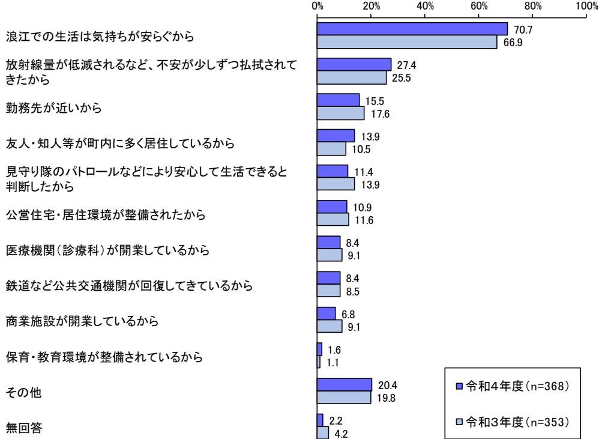

調査結果(速報版)の見方

- ・「n」とは、質問に対する回答者数であり、100%が何世帯の回答に相当するかを示すものである。
- ・回答の構成比は百分率をあらわし、小数点第2位を四捨五入して算出しているため、回答比率の合計が 100%にならない場合がある。
- ・回答者が2つ以上の回答をすることができる多肢選択式の質問においては、全ての選択肢の比率を合計すると 100%を超える。
- ・図表中で、選択肢の語句等を一部簡略化している場合がある。

- 2.現在の職業(就業形態)

# 3.現在の居住自治体

< 令和4年度 >

< 令和3年度 >

### 2.浪江町への帰還を決めた理由

※〔1.浪江町への帰還意向〕で「すでに浪江町に戻っている」と回答した方のみ ※複数回答可

5

## 3.浪江町内での今後の生活において必要だと感じていること

※〔1.浪江町への帰還意向〕で「すでに浪江町に戻っている」と回答した方のみ ※複数回答可

## 4.浪江町へ帰還する場合の家族

※〔1.浪江町への帰還意向〕で「戻りたいと考えている」と回答した方のみ

7

# 7.浪江町へ帰還する場合に不足していると感じること

※〔6.浪江町への帰還時期〕で「すぐに戻りたい」と回答した方のみ ※複数回答可

|                      | 0%         | 20%          | 40%          | 60%          | 80%         | 100% |
|----------------------|------------|--------------|--------------|--------------|-------------|------|
| 健康や介護に関する支援          |            |              |              | 54.2         | 66.7        |      |
| 買い物環境への支援            |            |              |              | 58.0 55.6 |             |      |
| 住宅の修繕や建て替えへの支援       |            |              |              | 44.9 45.8 |             |      |
| 生活交通の支援              |            |              | 40.3         | 44.9         |             |      |
| 住宅の新築・購入の支援          |            |              | 39.1 31.9 |              |             |      |
| 被ばく低減対策              |            |              | 34.8 37.5 |              |             |      |
| 携帯電話やインターネット等通信環境の改善 |            | 22.2         | 26.1         |              |             |      |
| 災害公営住宅や民間賃貸住宅への入居支援  | 4.2        | 17.4         |              |              |             |      |
| 就業支援                 |            | 13.0 9.7  |              |              |             |      |
| 子育てや学校教育への支援         | 1.4        | 7.2          |              |              |             |      |
| 従業員の確保への支援           | - 1.4   |              |              |              |             |      |
| 特にない                 | 2.9 4.2 |              |              |              |             |      |
| その他                  |            | 10.1 12.5 |              |              | 令和4年度(n=69) |      |
| 無回答                  | 2.9 1.4 |              |              |              | 令和3年度(n=72) |      |
|                      |            |              |              |              |             |      |

#### 8.浪江町への帰還時期を判断するために必要な条件

※〔6.浪江町への帰還時期〕で「いずれ帰りたい(数年で帰りたい・当面は帰ることができないが、いずれ帰りたい・分からない)」と回答した方のみ ※複数回答可

|                         | 0%         | 20%          | 40%          | 60%          | 80%          | 100% |
|-------------------------|------------|--------------|--------------|--------------|--------------|------|
| 医療・介護などが整うこと            |            |              |              | 55.4         | 64.9         |      |
| 商業やサービス業などの施設が整うこと      |            |              |              | 49.2 42.9 |              |      |
| 住宅の新築や購入により居住できる環境が整うこと |            |              | 28.8 28.5 |              |              |      |
| 元の家屋に住めるようになること         |            |              | 28.4 27.2 |              |              |      |
| 放射線量の低下や除染成果が分かってから     |            |              | 27.2 26.0 |              |              |      |
| バスなどの公共交通が整うこと          |            | 22.7 23.7 |              |              |              |      |
| 住民の帰還がある程度進んでから         |            | 22.0 19.6 |              |              |              |      |
| 仕事(事業再開を含む)ができるようになること  |            | 19.2 18.9 |              |              |              |      |
| 放射線の人体への影響が分かってから       |            | 16.9 15.4 |              |              |              |      |
| 原子力発電所が安全と分かってから        |            | 15.7 14.7 |              |              |              |      |
| 中間貯蔵施設の状況が分かってから        |            | 10.2 10.3 |              |              |              |      |
| 受け取る賠償額が分かってから          |            | 8.9 5.8   |              |              |              |      |
| 町内の災害公営住宅などの賃貸住宅が整うこと   |            | 8.3 7.7   |              |              |              |      |
| 教育環境が整うこと               |            | 8.3 9.3   |              |              |              |      |
| 避難中の今の場所での子育てを終えるまで     |            | 8.3 8.3   |              |              |              |      |
| 分からない                   | 1.9 1.9 |              |              |              |              |      |
| その他                     |            | 10.5 11.2 |              |              | 令和4年度(n=313) |      |
| 無回答                     |            | 9.9 11.2  |              |              | 令和3年度(n=312) |      |

## 9.浪江町への帰還を判断するために必要なこと

※〔1.浪江町への帰還意向〕で「まだ判断がつかない」と回答した方のみ ※複数回答可

医療・介護の復旧時期の目途商業やサービス業などの施設の復旧時期の目途どの程度の住民が戻るかの状況住宅確保への支援に関する情報放射線量の低下の目途、除染成果の状況原子力発電所に関する情報(事故収束や廃炉の状況) 放射線の人体への影響に関する情報バスなどの公共交通機関の復旧時期の目途中間貯蔵施設の情報就労の支援情報の提供元の住宅の住宅修繕に関する情報避難指示解除となる時期の目安に関する情報学校などの教育環境の復旧時期の目途事業再開の目途現時点ではどのような情報があれば判断できるかわからないその他無回答 57.4 36.3 33.8 24.6 21.8 20.4 18.2 17.9 13.6 12.1 11.5 11.4 5.4 4.8 5.8 4.1 14.0 55.1 34.7 35.7 24.4 26.4 26.4 21.4 16.0 18.5 12.1 11.7 12.8 5.8 3.8 5.7 6.3 11.7 0% 20% 40% 60% 80% 100% 令和4年度(n=877) 令和3年度(n=914)

#### 10.浪江町への帰還についてまだ判断がつかない理由・帰還しない理由

※〔1.浪江町への帰還意向〕で「まだ判断がつかない」「戻らないと決めている」と回答した方のみ ※複数回答可

