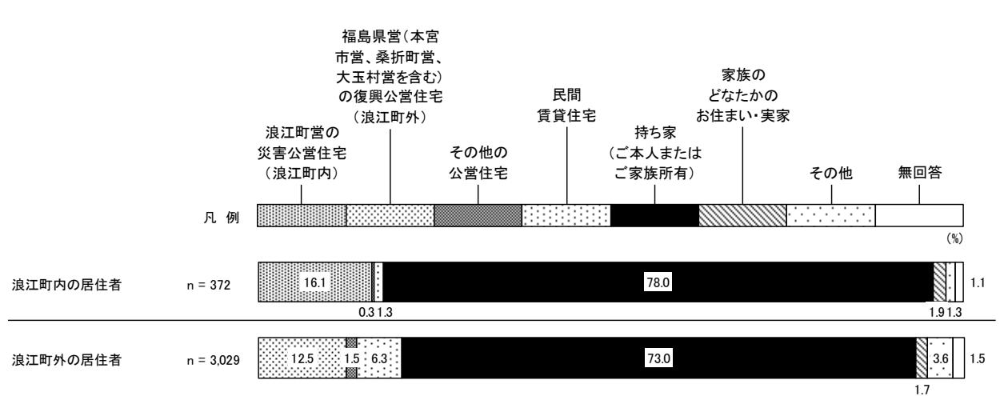
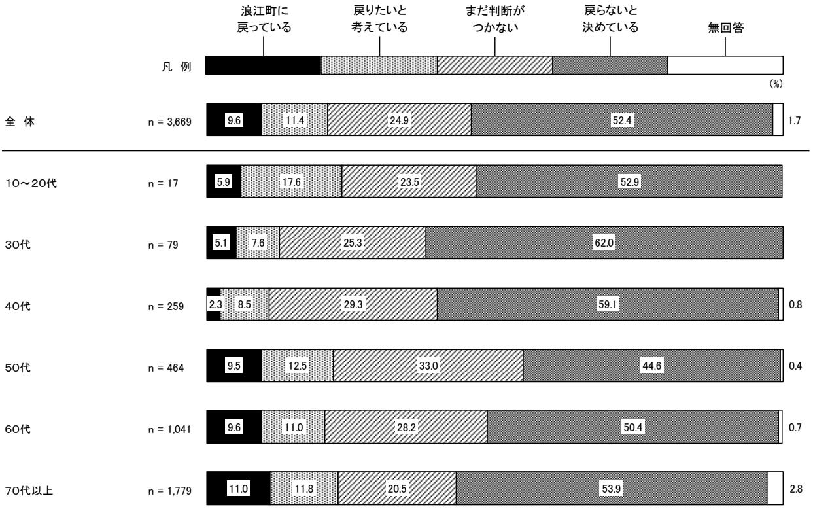
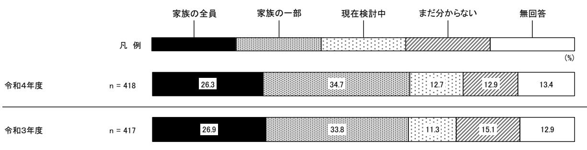
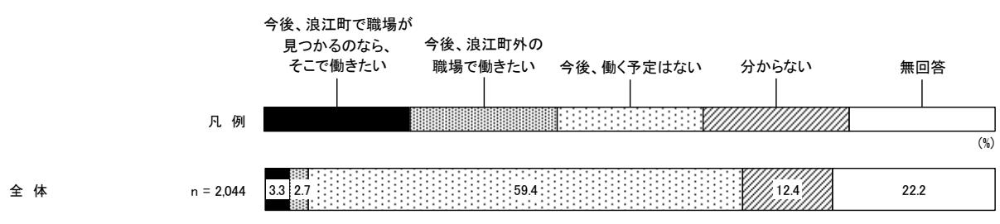
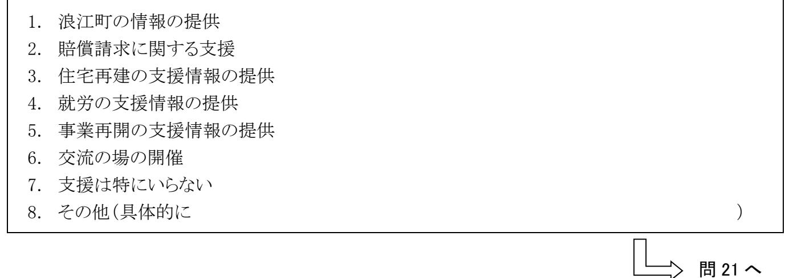

# 浪江町住民意向調査報告書

浪江町住民意向調査報告書令和

5年3月復興庁福島県浪江町

令和5年3月

# 浪江町住民意向調査

報告書

|        | 目 次                                                              |  |
|--------|---------------------------------------------------------------------|--|
|        | Ⅰ 調査の概要 ······························· 1                           |  |
| 1-1    | 調査目的 ···························· 3                                 |  |
| 1-2    | 調査内容 ···························· 3                                 |  |
| 1-3    | 調査設計 ···························· 3                                 |  |
| 1-4    | 回収結果 ···························· 3                                 |  |
| 1-5    | 報告書の見方 ·························· 3                                 |  |
|        | Ⅱ 調査結果(主要項目) ·························· 5                           |  |
| 2-1    | 回答者の属性・状況 ······················· 7                                 |  |
| 2-1-1  | 現在の職業(就業形態)(問 2(1)) ·········· 7                                 |  |
| 2-1-2  | 現在の居住自治体(問 4) ················ 7                                 |  |
| 2-1-3  | 現在の住居形態(問 5) ················· 8                                 |  |
| 2-2    | 調査結果 ···························· 9                                 |  |
| 2-2-1  | 浪江町への帰還意向(問 6) ··············· 9                                 |  |
| 2-2-2  | 浪江町への帰還を決めた理由(問 7) ·········· 11                                 |  |
| 2-2-3  | 浪江町内での今後の生活において必要だと感じている こと(問 8) ····················· 12     |  |
| 2-2-4  | 浪江町へ帰還する場合の家族(問 12) ········· 13                                 |  |
| 2-2-5  | 浪江町へ帰還した場合に希望する住居形態(問 13) ··· 13                                 |  |
| 2-2-6  | 浪江町への帰還時期(問 14) ············· 14                                 |  |
| 2-2-7  | 浪江町へ帰還する場合に不足していると感じること (問 14-1) ···················· 15   |  |
| 2-2-8  | 浪江町への帰還時期を判断するために必要な条件 (問 14-2) ···················· 16    |  |
| 2-2-9  | 浪江町への帰還を判断するために必要なこと(問 16) ··· 17                                |  |
| 2-2-10 | 浪江町への帰還についてまだ判断がつかない理由・ 帰還しない理由 (問 15・問 19) ··········· 18 |  |
|        | Ⅲ 調査結果(全項目) ·························· 19                           |  |
| 3-1    | 回答者の属性 ························· 21                                 |  |
| 3-1-1  | 性別 ························· 21                                     |  |

| 3-1-2  | 年齢 ························· 21                              |  |
|--------|--------------------------------------------------------------|--|
| 3-1-3  | 現在の職業(就業形態) ················ 22                              |  |
| 3-1-4  | 現在の業種 ······················ 23                              |  |
| 3-1-5  | 今後の就業意向 ···················· 24                              |  |
| 3-1-6  | 今後、浪江町で職場が見つかるならば希望する職業 (就業形態) ····················· 24   |  |
| 3-1-7  | 今後、浪江町で職場が見つかるならば希望する業種 ···· 25                              |  |
| 3-2    | 東日本大震災発生時の状況 ··················· 26                          |  |
| 3-2-1  | 震災発生当時の住まいの行政区 ············· 26                              |  |
| 3-3    | 現在の状況 ·························· 27                          |  |
| 3-3-1  | 現在の居住自治体 ··················· 27                              |  |
| 3-3-2  | 現在の住居形態 ···················· 28                              |  |
| 3-4    | 将来の意向 ·························· 29                          |  |
| 3-4-1  | 浪江町への帰還意向 ·················· 29                              |  |
| 3-4-2  | 浪江町への帰還を決めた理由 ·············· 33                              |  |
| 3-4-3  | 浪江町内での今後の生活において必要だと感じている こと ························· 34  |  |
| 3-4-4  | 浪江町内での今後の生活において必要だと感じている ことの具体的な内容 ·················· 35  |  |
| 3-4-5  | 浪江町に戻る頻度〔回答者ご自身〕 ··········· 36                              |  |
| 3-4-6  | 浪江町に戻る頻度〔回答者のご家族〕 ·········· 36                              |  |
| 3-4-7  | 回答者またはその家族が浪江町に定期的に戻る理由 ···· 37                              |  |
| 3-4-8  | 浪江町へ帰還する場合の家族 ·············· 38                              |  |
| 3-4-9  | 浪江町へ帰還する場合の世帯構成・人数 ········· 39                              |  |
| 3-4-10 | 浪江町へ帰還した場合に希望する住居形態 ········ 39                              |  |
| 3-4-11 | 浪江町へ帰還した場合に元の住居と違う場所を希望する 理由 ························· 40 |  |
| 3-4-12 | 浪江町へ帰還して元の住居と違う場所に住む場合に希望 する地区 ······················· 40 |  |
| 3-4-13 | 浪江町への帰還時期 ·················· 41                              |  |
| 3-4-14 | 浪江町へ帰還する場合に不足していると感じること ···· 42                              |  |
| 3-4-15 | 浪江町への帰還時期を判断するために必要な条件 ····· 43                              |  |
| 3-4-16 | 浪江町に帰還するまでの間に必要な支援 ········· 44                              |  |
| 3-4-17 | 浪江町への帰還についてまだ判断がつかない理由 ····· 45                              |  |
| 3-4-18 | 浪江町への帰還を判断するために必要なこと ······· 46                              |  |
| 3-4-19 | 浪江町への帰還を判断するまでの間に今後の住まいと して希望する住居形態 ················· 47  |  |

| 3-4-20 | 浪江町への帰還を判断するまでの間に必要な支援 ····· 47                             |  |
|--------|-------------------------------------------------------------|--|
| 3-4-21 | 浪江町に帰還しない理由 ················ 48                             |  |
| 3-4-22 | 浪江町に帰還しない場合に必要な支援 ·········· 49                             |  |
| 3-4-23 | 震災発生当時の居住地域に望む将来の姿 ········· 50                             |  |
| 3-5    | 復興公営住宅 ························· 52                         |  |
| 3-5-1  | 福島県営の復興公営住宅(浪江町外)への入居意向 ···· 52                             |  |
| 3-5-2  | 福島県営の復興公営住宅への入居を希望する時期 ····· 52                             |  |
| 3-5-3  | 福島県営の復興公営住宅への入居を希望する市町村 ···· 53                             |  |
| 3-6    | 不動産の取り扱い意向 ····················· 54                         |  |
| 3-6-1  | 浪江町内に保有する家屋の利用意向 ··········· 54                             |  |
| 3-6-2  | 浪江町内に保有する宅地の利用意向 ··········· 54                             |  |
| 3-7    | 情報入手 ··························· 55                         |  |
| 3-7-1  | 浪江町に関する情報の入手経路 ············· 55                             |  |
| 3-7-2  | 浪江町役場からの情報提供に対する満足度 ········ 55                             |  |
| 3-7-3  | 浪江町役場から欲しい情報 ··············· 56                             |  |
| 3-8    | 浪江町に対する思い ······················ 57                         |  |
| 3-8-1  | 浪江町への誇り・愛着を持っているか ·········· 57                             |  |
| 3-8-2  | 浪江町の自慢できるところ ··············· 57                             |  |
| 3-9    | 事業承継に対する考え ····················· 58                         |  |
| 3-9-1  | 浪江町内若しくは避難先で事業を営んでいるか ······ 58                             |  |
| 3-9-2  | 今後の事業承継についての考え ············· 58                             |  |
| 3-9-3  | 具体的な承継先 ···················· 59                             |  |
| 3-9-4  | 事業承継に関する制度等の説明機会があった場合に                                     |  |
|        | 話を聞いてみたいか ·················· 59                             |  |
| 3-10   | 特定復興再生拠点区域外の帰還に関する考え ·········· 60                          |  |
| 3-10-1 | 特定復興再生拠点区域外に関する国方針への意見等 ···· 60                             |  |
| 3-10-2 | 特定復興再生拠点区域外の土地、家屋等についての                                     |  |
|        | 不安・困りごと ···················· 62                             |  |
| 3-11   | 特定復興再生拠点区域内の環境整備に関する考え ········ 63                          |  |
| 3-11-1 | 特定復興再生拠点区域内の除染・インフラ整備状況、 その他困りごと等への意見 ··············· 63 |  |
| 3-12   | 意見・要望 ························· 64                          |  |
| 3-12-1 | 意見に係る記入内容の分類結果 ············· 65                             |  |
| 3-12-2 | 生活について ····················· 66                             |  |
| 3-12-3 | 震災発生前の居住地について ·············· 67                             |  |
| 3-12-4 | 賠償について ····················· 68                             |  |

| 3-12-5 | 帰還について ····················· 69           |  |
|--------|-------------------------------------------|--|
| 3-12-6 | 避難期間中及び将来の住宅について ··········· 70           |  |
| 3-12-7 | 除染について ····················· 72           |  |
| 3-12-8 | 復旧・復興について ·················· 74           |  |
| 3-12-9 | 原発の安全性について ················· 75           |  |
|        | 3-12-10 原発事故に対する対応について ············· 76   |  |
|        | 3-12-11 その他 ························ 77   |  |
|        | Ⅳ 参考資料 ······························· 79 |  |
| 4-1    | 使用調査票 ·························· 81       |  |

## 調査の概要

#### 1-1 調査目的

本調査は、東京電力福島第一原子力発電所の事故により避難生活を余儀なくされていた浪江町住民の 「帰還後の生活環境の改善」、「帰還に向けた諸施策の適切な実施に向けた取り組み」を検討するための基礎資料とすることを目的とする。

#### 1-2 調査内容

※4-1 使用調査票を参照のこと

#### 1-3 調査設計

- (1)調査地域浪江町
- (2)調査対象と標本数世帯の代表者 7,272世帯
- (3)調査手法郵送にて配布・回収(自記式)
- (4)調査期間令和4年11月21日(月)~令和4年12月5日(月)
- (5)調査主体復興庁、福島県、浪江町
- (6)調査機関株式会社サ-ベイリサ-チセンタ-

#### 1-4 回収結果

有効回収数 3,430世帯(有効回収率47.2%)

#### 1-5 報告書の見方

- ・調査数(n = Numberofcases)とは、回答者総数あるいは分類別の回答者数のことである。
- ・回答の構成比は百分率であらわし、小数点第2位を四捨五入して算出している。従って、回答比率の合計が 100%にならない場合がある。
- ・回答者が2つ以上の回答をすることができる多肢選択式の質問においては、全ての選択肢の比率を合計すると 100%を超える。
- ・「その他」に内訳を記載している項目に関しては、個別の項目を合算して構成比を改めて算出している。 従って、内訳の回答比率の合計が、グラフ記載の「その他」の回答比率と合致しない場合がある。
- ・図表および文章中で、選択肢の語句等を一部簡略化している場合がある。
- ・調査数(n値)が少数(概ね 30 を下回る)のものは、回答構成比の信頼性が低いため、文章中の分析では言及していない。
- ・Ⅱ調査結果(主要項目)の設問ごとのコメントについては、令和4年度について述べている。 (令和3年度の結果は、参考値として掲載)

# 調査結果(主要項目)

#### 2-1 回答者の属性・状況

#### 2-1-1 現在の職業(就業形態)(問 2(1))

現在の職業(就業形態)については、「無職(職を探していない)」以外では、「会社員(勤め人)(労務や外勤を主とする業務)」が 9.0%と最も高く、次いで「自営業・会社経営者」が 7.5%となっている。

<図表2-1-1 現在の職業(就業形態)>

#### 2-1-2 現在の居住自治体(問 4)

現在の居住自治体については、「福島県外」が 22.2%と最も高く、次いで「いわき市」が 15.7%、 「福島市」が 13.1%となっている。

<図表2-1-2 現在の居住自治体>

#### 2-1-3 現在の住居形態(問 5)

現在の住居形態について、浪江町内の居住者では「持ち家(ご本人またはご家族所有)」が 78.0%と最も高く、次いで「浪江町営の災害公営住宅(浪江町内)」が 16.1%となっている。 浪江町外の居住者では「持ち家(ご本人またはご家族所有)」が 73.0%と最も高く、次いで「福島県営(本宮市営、桑折町営、大玉村営を含む)の復興公営住宅(浪江町外)」が 12.5%、「民間賃貸住宅」 が 6.3%となっている。

<図表2-1-3 現在の住居形態(現在の居住地域別)>

#### 2-2 調査結果

#### 2-2-1 浪江町への帰還意向(問 6)

浪江町への帰還意向については、「戻らないと決めている」が 50.0%と最も高く、次いで「まだ判断がつかない」が 25.6%、「戻りたいと考えている」が 12.2%、「すでに浪江町に戻っている」が 10.7% となっている。

回答者の年齢別にみると、「すでに浪江町に戻っている」「戻りたいと考えている」を合わせると浪江町への帰還意向のある人は、40 代以外では 2 割以上となっている。

<図表2-2-1-1 浪江町への帰還意向:令和4年度(年齢別)>

<図表2-2-1-2 浪江町への帰還意向:令和3年度(年齢別)>

すでに

#### 2-2-2 浪江町への帰還を決めた理由(問 7)

浪江町への帰還を決めた理由については、「浪江での生活は気持ちが安らぐから」が 70.7%と最も高く、次いで「放射線量が低減されるなど、不安が少しずつ払拭されてきたから」が 27.4%、「勤務先が近いから」が 15.5%となっている。

※問6で「すでに浪江町に戻っている」と回答した方のみ ※複数回答可

### 2-2-3 浪江町内での今後の生活において必要だと感じていること(問 8)

浪江町内での今後の生活において必要だと感じていることについては、「医療機関(診療科)の拡充」 が 85.6%と最も高く、次いで「介護・福祉施設の充実」が 57.3%、「商業施設の再開・充実」が 56.3% となっている。

※問6で「すでに浪江町に戻っている」と回答した方のみ ※複数回答可

#### 2-2-4 浪江町へ帰還する場合の家族(問 12)

浪江町へ帰還する場合の家族については、「家族の一部」が 34.7%と最も高く、次いで「家族の全員」 が 26.3%、「まだ分からない」が 12.9%となっている。

※問6で「戻りたいと考えている」と回答した方のみ

#### 2-2-5 浪江町へ帰還した場合に希望する住居形態(問 13)

浪江町へ帰還した場合に希望する住居形態については、「元の持ち家(自宅)(建て替える場合を含む)」 が 62.4%と最も高く、次いで「新たに一戸建の持ち家を新築または購入」が 14.6%、「新たに(災害) 公営住宅(一戸建)を借用」が 6.5%となっている。

※問6で「戻りたいと考えている」と回答した方のみ

#### 2-2-6 浪江町への帰還時期(問 14)

浪江町への帰還時期については、「当面は帰ることができないが、いずれ帰りたい(6年以降)」が 34.9%と最も高く、次いで「数年で帰りたい(5年以内)」が 25.8%、「すぐに戻りたい」が 16.5%となっている。

※問6で「戻りたいと考えている」と回答した方のみ

#### 2-2-7 浪江町へ帰還する場合に不足していると感じること(問 14-1)

浪江町へ帰還する場合に不足していると感じることについては、「健康や介護に関する支援」が 66.7% と最も高く、次いで「買い物環境への支援」が 58.0%、「住宅の修繕や建て替えへの支援」と「生活交通の支援」がともに 44.9%となっている。

<図表2-2-7 浪江町へ帰還する場合に不足していると感じること>

※問 14 で「すぐに戻りたい」と回答した方のみ ※複数回答可

#### 2-2-8 浪江町への帰還時期を判断するために必要な条件(問 14-2)

浪江町への帰還時期を判断するために必要な条件については、「医療・介護などが整うこと」が 64.9% と最も高く、次いで「商業やサービス業などの施設が整うこと」が 49.2%、「住宅の新築や購入により居住できる環境が整うこと」が 28.8%となっている。

※問 14 で「いずれ帰りたい(数年で帰りたい・当面は帰ることができないが、いずれ帰りたい・分からない)」と回答した方のみ ※複数回答可

#### 2-2-9 浪江町への帰還を判断するために必要なこと(問 16)

浪江町への帰還を判断するために必要なことについては、「医療・介護の復旧時期の目途」が 57.4% と最も高く、次いで「商業やサービス業などの施設の復旧時期の目途」が 36.3%、「どの程度の住民が戻るかの状況」が 33.8%となっている。

&lt;図表2-2-9 浪江町への帰還を判断するために必要なこと>

※問6で「まだ判断がつかない」と回答した方のみ ※複数回答可

## 2-2-10 浪江町への帰還についてまだ判断がつかない理由・帰還しない理由 (問 15・問 19)

浪江町への帰還についてまだ判断がつかない理由は、「医療環境に不安があるから」が 62.6%と最も高く、次いで「避難先の方が、生活利便性が高いから」が 41.3%、「生活に必要な商業施設などが不足しているから」が 40.8%となっている。

帰還しない理由は、「すでに生活基盤ができているから」が 52.2%と最も高く、次いで「元の住家を解体しており、戻る家がないから」が 49.7%、「避難先の方が、生活利便性が高いから」が 43.0%となっている。

|                       |                              | 戻らないと決めている方      |              |                  |                          |              |              |      |              |                   |      |  |  |
|-----------------------|------------------------------|------------------|--------------|------------------|--------------------------|--------------|--------------|------|--------------|-------------------|------|--|--|
|                       |                              | 0% 20% 40% | 60%          | 80%              | 100%                     | 0%           | 20%          | 40%  | 60%          | 80%               | 100% |  |  |
| 【 関 わ 健      | 原子力発電所の安全性に不安があるから           | 30.4 35.7     |              |                  |                          |              | 24.0         | 26.1 |              |                   |      |  |  |
| る 康 も に の | 水道水などの生活用水の安全性に不安がある から   | 27.5 31.0     |              | 16.1 18.5     |                          |              |              |      |              |                   |      |  |  |
| 】                     | 放射線量が低下せず不安だから               | 23.4 25.2     |              |                  |                          |              | 13.8 17.9 |      |              |                   |      |  |  |
| 【 町                | 医療環境に不安があるから                 |                  | 60.5         | 62.6             | 39.3 36.5             |              |              |      |              |                   |      |  |  |
| 内 の                | 元の住家を解体しており、戻る家がないから         | 38.5 39.1     | 49.7 46.0 |                  |                          |              |              |      |              |                   |      |  |  |
| 復 旧 状           | 生活に必要な商業施設などが不足しているから        | 37.1             | 40.8         | 25.2 22.0     |                          |              |              |      |              |                   |      |  |  |
| 況 に                | 介護・福祉サービスに不安があるから            | 36.5 36.8     |              |                  |                          | 24.7 22.7 |              |      |              |                   |      |  |  |
| 関 わ                | 浪江町外への移動交通が不便だから             | 20.6 16.7     |              | 13.5 12.0     |                          |              |              |      |              |                   |      |  |  |
| る も の           | 自宅が帰還困難区域内だから                | 14.9 17.1     | 8.6 10.4  |                  |                          |              |              |      |              |                   |      |  |  |
| 】                     | 家が汚損・劣化し、住める状況ではないから         | 15.1 14.0     |              |                  |                          |              | 7.9 9.6   |      |              |                   |      |  |  |
|                       | 浪江町に戻っても仕事がなさそうだから           | 13.6 15.8     |              |                  | 7.6 7.3               |              |              |      |              |                   |      |  |  |
|                       | 道路、鉄道等の交通インフラに不安があるから        | 11.1 10.9     |              | 8.3 6.8       |                          |              |              |      |              |                   |      |  |  |
|                       | 営農などができそうにないから               | 10.3 10.2     |              |                  | 5.7 6.0 4.2 3.9 |              |              |      |              |                   |      |  |  |
|                       | 浪江町での事業の再開が難しいから             | 6.2 7.7       |              |                  |                          |              |              |      |              |                   |      |  |  |
|                       | 保育・教育環境に不安があるから              | 5.5 5.3       |              | 4.1 4.7       |                          |              |              |      |              |                   |      |  |  |
|                       | 公営住宅の整備が進んでいないから             | 4.0 2.7       |              | 0.8 0.8       |                          |              |              |      |              |                   |      |  |  |
| 【 今                | 避難先の方が、生活利便性が高いから            |                  | 41.3 40.9 | 43.0 38.4     |                          |              |              |      |              |                   |      |  |  |
| 後 の                | すでに生活基盤ができているから              | 24.4 25.4     | 52.2 49.8 |                  |                          |              |              |      |              |                   |      |  |  |
| 生 活 に           | 高齢者・要介護者のいる世帯なので生活が 不安だから | 31.2 30.6     |              |                  |                          |              |              |      | 23.8 23.1 |                   |      |  |  |
| 関 わ                | 他の住民も戻りそうにないから               | 23.3 25.7     | 13.8 15.1 |                  |                          |              |              |      |              |                   |      |  |  |
| る も                | 鳥獣による被害が心配だから                | 16.8 19.0     |              |                  |                          |              |              |      | 7.8 9.4   |                   |      |  |  |
| の 】                | 避難先で仕事を見つけているから              | 7.8 9.8       |              |                  |                          |              | 9.8 12.0  |      |              |                   |      |  |  |
|                       | 今の環境で子どもの教育を継続させたいから         | 5.7 8.3       | 5.7 6.9   |                  |                          |              |              |      |              |                   |      |  |  |
|                       | 今後の津波被害を受ける可能性があるから          | 2.7 2.4       |              |                  |                          | 2.7 1.8   |              |      |              |                   |      |  |  |
|                       | 子どもの遊び場(屋内・屋外)が無いから          | 2.2 3.3       |              | 令和4年度            |                          | 1.6 2.3   |              |      |              | 令和4年度             |      |  |  |
|                       | その他                          | 7.2 8.4       |              | (n=877)          |                          |              | 9.3 8.2   |      | (n=1715)     |                   |      |  |  |
|                       | 無回答                          | 6.3 5.5       |              | 令和3年度 (n=914) |                          | 5.7 7.7   |              |      |              | 令和3年度 (n=1921) |      |  |  |

<図表2-2-10 浪江町への帰還についてまだ判断がつかない理由・帰還しない理由(浪江町への帰還意向別)>

※問6で「まだ判断がつかない」「戻らないと決めている」と回答した方のみ ※複数回答可

# 調査結果(全項目)

## 3-1 回答者の属性

#### 3-1-1 性別

#### 3-1-2 年齢

凡例

#### 3-1-3 現在の職業(就業形態)

問 2 現在のあなたの就業形態を教えてください。仕事に就いている方は、業種も教えてください。 なお、2つ以上の仕事に就いている場合は、主な収入源になっている就業形態・業種を教えてください。 (1) 就業形態(○は1つ)

<図表3-1-3 現在の職業(就業形態)(年齢別)>

#### 3-1-4 現在の業種

【※問 2(1)で「1」~「7」、「11」と回答した方にうかがいます。】 問 2 現在のあなたの就業形態を教えてください。仕事に就いている方は、業種も教えてください。 なお、2つ以上の仕事に就いている場合は、主な収入源になっている就業形態・業種を教えてください。 (2) 業種(○は1つ) ※問 2(1) :1.自営業・会社経営者 2.自営業・会社経営者(休業中であり、今後再開予定) 3.会社員(勤め人)(事務や内勤を主とする業務) 4.会社員(勤め人)(労務や外勤を主とする業務) 5.団体職員 6.公務員 7.パート・アルバイト 11.その他

<図表3-1-4-1 現在の業種>

<図表3-1-4-2 現在の業種(年齢別)>

)

)

|        |            |        |        |        |             |             |             |                                           |             |             |                  |             |                                 |                                                                                                       |                                                                                   |             |             |        |                       |        |        |             | (%)         |
|--------|------------|--------|--------|--------|-------------|-------------|-------------|-------------------------------------------|-------------|-------------|------------------|-------------|---------------------------------|-------------------------------------------------------------------------------------------------------|-----------------------------------------------------------------------------------|-------------|-------------|--------|-----------------------|--------|--------|-------------|-------------|
|        |            | 農 業 | 林 業 | 漁 業 | 畜 産 業 | 建 設 業 | 製 造 業 | 電 気 ・ ガ ス ・ 水 道 業 | 運 輸 業 | 卸 売 業 | 小 売 り 業 | 宿 泊 業 | 飲 食 サ ー ビ ス 業 | な 生 ( ど 理 活 容 関 ) ・ 連 美 サ 容 ー ・ ビ 洗 ス 濯 業 | 分 サ 類 ー さ ビ れ ス な 業 い ( も 他 の に ) | 金 融 業 | 保 険 業 | 医 療 | 福 祉 ・ 介 護 | 教 育 | 公 務 | そ の 他 | 無 回 答 |
| 全体    | n 1,242 | 8.1    | 0.5    | 1.4    | 0.6         | 21.5        | 10.5        | 4.4                                       | 3.9         | 1.0         | 4.3              | 0.5         | 1.9                             | 1.4                                                                                                   | 10.1                                                                              | 0.5         | 0.7         | 2.8    | 4.0                   | 3.4    | 5.0    | 6.1         | 7.6         |
| 10~20代 | 7          | -      | -      | -      | -           | 14.3        | 14.3        | -                                         | -           | -           | -                | -           | -                               | -                                                                                                     | 14.3                                                                              | -           | -           | 14.3   | -                     | -      | 14.3   | 14.3        | 14.3        |
| 30代    | 38         | 2.6    | -      | -      | -           | 23.7        | 15.8        | 5.3                                       | -           | -           | 2.6              | -           | 2.6                             | -                                                                                                     | 10.5                                                                              | -           | -           | 5.3    | 10.5                  | -      | 18.4   | 2.6         | -           |
| 40代    | 190        | 1.6    | 0.5    | 1.1    | 0.5         | 16.3        | 15.8        | 8.9                                       | 4.7         | 0.5         | 5.3              | 1.1         | 0.5                             | 1.6                                                                                                   | 4.7                                                                               | 1.1         | 0.5         | 7.4    | 6.3                   | 6.8    | 7.9    | 2.6         | 4.2         |
| 50代    | 301        | 1.7    | 0.3    | 1.3    | 0.3         | 22.6        | 16.3        | 5.0                                       | 4.3         | 1.3         | 3.7              | 0.7         | 2.3                             | 0.7                                                                                                   | 10.3                                                                              | 1.0         | 1.0         | 1.7    | 4.3                   | 5.6    | 7.0    | 3.7         | 5.0         |
| 60代    | 420        | 8.3    | 0.5    | 1.7    | 1.2         | 26.0        | 7.9         | 4.0                                       | 5.0         | 0.7         | 4.8              | 0.2         | 1.4                             | 1.9                                                                                                   | 14.5                                                                              | 0.2         | 0.7         | 1.2    | 3.6                   | 2.4    | 3.8    | 4.5         | 5.5         |
| 70代以上  | 286        | 19.6   | 0.7    | 1.4    | -           | 17.1        | 4.2         | 1.4                                       | 1.7         | 1.4         | 3.8              | 0.3         | 2.8                             | 1.7                                                                                                   | 6.6                                                                               | -           | 0.7         | 2.8    | 2.1                   | 0.7    | 0.7    | 13.6        | 16.4        |

#### 3-1-5 今後の就業意向

【問 2(1)で「8.自営業者・会社経営者(休業中であり、職を探している)」「9.無職(職を探していない)」 「10.無職(職を探している)」と回答した方にうかがいます。】 問 2-1 今後の就業意向を教えてください。(○は1つ)

<図表3-1-5 今後の就業意向>

#### 3-1-6 今後、浪江町で職場が見つかるならば希望する職業(就業形態)

【問 2-1 で「1.今後、浪江町で職場が見つかるのなら、そこで働きたい」と回答した方にうかがいます。】 問 2-2 今後希望する就業形態・業種を教えてください。なお、2つ以上の職業・業種を希望する場合は、主な収入源にしたいと考えている就業形態・業種を教えてください。 (1) 就業形態(○は1つ)

#### 3-1-7 今後、浪江町で職場が見つかるならば希望する業種

| 【※問 2-2(1)で「1」~「6」、「8」と回答した方にうかがいます。】 問 2-2 今後希望する就業形態・業種を教えてください。なお、2つ以上の職業・業種を希望する場合は、主な 収入源にしたいと考えている就業形態・業種を教えてください。 (2) 業種(○は1つ) |                                                   |
|------------------------------------------------------------------------------------------------------------------------------------------------------|---------------------------------------------------|
| ※問 2-2(1):1.自営業・会社経営者 3.会社員(勤め人)(労務や外勤を主とする業務) 5.公務員 8.その他                                                                                  | 2.会社員(勤め人)(事務や内勤を主とする業務) 4.団体職員 6.パート・アルバイト |

容・

れな

<図表3-1-7 今後、浪江町で職場が見つかるならば希望する業種>

#### 3-2 東日本大震災発生時の状況

#### 3-2-1 震災発生当時の住まいの行政区

問 3 震災発生当時にお住まいだった行政区を教えてください。(○は1つ)

<図表3-2-1 震災発生当時の住まいの行政区>

村

#### 3-3 現在の状況

#### 3-3-1 現在の居住自治体

問 4 あなたが現在住まわれている市町村を教えてください。(○は1つ)

<図表3-3-1 現在の居住自治体>

#### 3-3-2 現在の住居形態

問 5 現在お住まいになっている住宅はどのような住居形態ですか。(○は1つ)

<図表3-3-2 現在の住居形態>

| 親戚・知人宅 | 0.7% |
|--------|------|
| その他    | 2.1% |
|        |      |

### 3-4 将来の意向

#### 3-4-1 浪江町への帰還意向

問 6 浪江町への帰還について、現時点でどのようにお考えですか。 「1」~「4」の中から1つ選び、それぞれの質問にお答えください。(○は1つ)

<図表3-4-1-1 浪江町への帰還意向(年齢別)>

<図表3-4-1-2 浪江町への帰還意向(震災発生当時の住まいの行政区別)>

|       |           | すでに 浪江町に 戻っている | 戻りたいと 考えている | まだ判断が つかない | 戻らないと 決めている | 無回答          |
|-------|-----------|----------------------|----------------|---------------|----------------|--------------|
|       | 凡例       |                      |                |               |                | (%)          |
| 全体   | n = 3,430 | 10.7 12.2         | 25.6           |               | 50.0           | 1.5          |
| 1区    | n = 72    | 18.1                 | 4.2 27.8    |               | 47.2           | 2.8          |
| 2区    | n = 29    | 10.3 10.3         | 37.9           |               | 41.4           |              |
| 3区    | n = 28    | 17.9                 | 3.6 32.1    |               | 46.4           |              |
| 4区    | n = 119   | 15.1                 | 9.2 25.2    |               | 50.4           |              |
| 5区    | n = 72    | 13.9 5.6          | 25.0           |               | 52.8           | 2.8          |
| 6区    | n = 40    | 12.5                 | 17.5           | 22.5          | 47.5           |              |
| 7区    | n = 38    | 10.5 15.8         |                | 36.8          |                | 36.8         |
| 8区    | n = 81    | 7.4 11.1          | 28.4           |               | 51.9           | 1.2          |
| 佐屋前   | n = 86    | 12.8 5.8          | 27.9           |               | 52.3           | 1.2          |
| 川添北   | n = 166   | 12.7 9.6          | 19.9           |               | 56.6           | 1.2          |
| 川添南   | n = 130   | 14.6 7.7          | 24.6           |               | 51.5           | 1.5          |
| 上ノ原   | n = 234   | 8.1 8.5           | 21.4           |               | 61.1           | 0.9          |
| 樋渡・牛渡 | n = 177   | 7.9 11.3          | 29.9           |               | 49.7           | 1.1          |
| 高瀬    | n = 93    | 24.7                 | 5.4            | 25.8          | 43.0           | 1.1          |
| 幾世橋   | n = 120   | 10.0 3.3          | 26.7           |               | 57.5           | 2.5          |
| 北幾世橋北 | n = 106   | 20.8                 | 5.7            | 28.3          | 43.4           | 1.9          |
| 北幾世橋南 | n = 54    | 24.1                 | 5.6            | 29.6          | 38.9           | 1.9          |
| 北棚塩   | n = 46    | 21.7                 | 15.2           | 30.4          |                | 32.6         |
| 南棚塩   | n = 49    | 6.1 6.1 12.2   |                |               | 73.5           | 2.0          |
| 請戸北   | n = 115   | 8.7 8.7           | 17.4           |               | 64.3           | 0.9          |
| 請戸南   | n = 84    | 8.3 3.6           | 26.2           |               | 60.7           | 1.2          |
| 中浜    | n = 24    | 8.3 12.5          |                |               | 79.2           |              |
| 両竹    | n = 23    | 8.7 4.3           | 21.7           |               | 60.9           | 4.3          |
| 小丸    | n = 22    | 22.7                 | 27.3           |               | 27.3           | 18.2 4.5  |
| 畑川    | n = 8     | 25.0                 |                | 50.0          |                | 12.5 12.5 |

#### <図表3-4-1-2 浪江町への帰還意向(震災発生当時の住まいの行政区別)続き>

|       |         | すでに 浪江町に 戻っている | 戻りたいと 考えている | まだ判断が つかない | 戻らないと 決めている | 無回答         |
|-------|---------|----------------------|----------------|---------------|----------------|-------------|
|       | 凡例     |                      |                |               |                | (%)         |
| 井手    | n = 73  | 1.4 31.5          |                | 35.6          |                | 30.1 1.4 |
| 田尻    | n = 165 | 6.7 12.7          | 25.5           |               | 53.3           | 1.8         |
| 末ノ森   | n = 16  | 6.3 12.5          | 25.0           |               | 56.3           |             |
| 大堀    | n = 81  | 1.2 22.2          | 29.6           |               | 44.4           | 2.5         |
| 小野田   | n = 53  | 5.7 9.4           | 30.2           |               | 49.1           | 5.7         |
| 谷津田   | n = 52  | 5.8 7.7           | 13.5           |               | 71.2           | 1.9         |
| 酒井    | n = 39  | 2.6                  | 38.5           | 25.6          |                | 33.3        |
| 室原    | n = 107 | 4.7 15.0          | 32.7           |               | 45.8           | 1.9         |
| 立野上   | n = 42  | 7.1 19.0          | 11.9           |               | 59.5           | 2.4         |
| 立野中   | n = 47  | 19.1                 | 8.5 19.1    |               | 53.2           |             |
| 立野下   | n = 57  | 15.8                 | 15.8           | 36.8          |                | 29.8 1.8 |
| 苅宿    | n = 48  | 18.8                 | 14.6           | 20.8          | 45.8           |             |
| 加倉    | n = 131 | 11.5 9.9          | 22.1           |               | 55.0           | 1.5         |
| 酒田    | n = 97  | 20.6                 | 8.2            | 26.8          | 41.2           | 3.1         |
| 西台    | n = 70  | 12.9 10.0         | 30.0           |               | 47.1           |             |
| 藤橋    | n = 58  | 13.8 10.3         | 22.4           |               | 50.0           | 3.4         |
| 羽附    | n = 31  | 3.2                  | 58.1           |               | 22.6           | 16.1        |
| 津島    | n = 64  | 15.6                 | 26.6           |               | 54.7           | 3.1         |
| 下津島   | n = 27  | 11.1                 | 22.2           |               | 66.7           |             |
| 南津島上  | n = 24  | 29.2                 | 16.7           |               | 54.2           |             |
| 南津島下  | n = 48  |                      | 50.0           |               | 25.0           | 20.8 4.2 |
| 赤宇木   | n = 50  | 22.0                 | 34.0           |               | 44.0           |             |
| 手七郎   | n = 21  | 28.6                 |                | 33.3          |                | 38.1        |
| 大昼    | n = 13  |                      | 46.2           |               | 30.8           | 15.4 7.7 |
| 分からない | n = -   |                      |                |               |                |             |

<図表3-4-1-3 浪江町への帰還意向(避難指示区域別)>

※1 平成 29 年3月31日に避難指示解除済み

※2 平成 29 年3月31日に避難指示解除済み

※3 「拠点」とは特定復興再生拠点のこと

#### 3-4-2 浪江町への帰還を決めた理由

【問 6 で「1.すでに浪江町に戻っている」と回答した方にうかがいます。】 問 7 浪江町内に戻られた判断材料はどのようなことですか。(○はいくつでも)

#### <図表3-4-2 浪江町への帰還を決めた理由(年齢別)>

|                                     | 全体       |      | 10~20代 n = 368 n = 2 |             |    | 30代 n = 6 |      | 40代 n = 11 |      |      | 50代 n = 39 |      |      | 60代 n = 98 |      |      | 70代以上 n = 212 |      |      |
|-------------------------------------|-----------|------|----------------------------|-------------|----|--------------|------|---------------|------|------|---------------|------|------|---------------|------|------|------------------|------|------|
|                                     | 0% 50% | 100% | 0%                         | 50% 100% | 0% | 50%          | 100% | 0%            | 50%  | 100% | 0%            | 50%  | 100% | 0%            | 50%  | 100% | 0%               | 50%  | 100% |
| 浪江での生活は気持ちが安らぐから                    |           | 70.7 | -                          |             |    | 50.0         |      |               | 36.4 |      |               | 53.8 |      |               |      | 61.2 |                  |      | 81.1 |
| 放射線量が低減されるなど、不安が 少しずつ払拭されてきたから   | 27.4      |      |                            | 50.0        |    | 16.7         |      |               | 27.3 |      |               | 17.9 |      |               | 24.5 |      |                  | 30.7 |      |
| 勤務先が近いから                            | 15.5      |      |                            | 50.0        |    | 50.0         |      |               | 36.4 |      |               | 43.6 |      |               | 23.5 |      | 4.2              |      |      |
| 友人・知人等が町内に多く居住して いるから            | 13.9      |      | -                          |             | -  |              |      | -             |      |      | 5.1           |      |      |               | 11.2 |      |                  | 17.9 |      |
| 見守り隊のパトロールなどにより安心 して生活できると判断したから | 11.4      |      | -                          |             | -  |              |      | -             |      |      | 5.1           |      |      |               | 11.2 |      |                  | 13.7 |      |
| 公営住宅・居住環境が整備されたから                   | 10.9      |      | -                          |             |    | 16.7         |      | 9.1           |      |      | 10.3          |      |      |               | 14.3 |      |                  | 9.4  |      |
| 医療機関(診療科)が開業しているから                  | 8.4       |      | -                          |             | -  |              |      | -             |      |      | -             |      |      | 7.1           |      |      |                  | 11.3 |      |
| 鉄道など公共交通機関が回復してきて いるから           | 8.4       |      | -                          |             | -  |              |      | -             |      |      | -             |      |      | 7.1           |      |      |                  | 11.3 |      |
| 商業施設が開業しているから                       | 6.8       |      | -                          |             |    | 16.7         |      | -             |      |      | 2.6           |      |      | 8.2           |      |      | 7.1              |      |      |
| 保育・教育環境が整備されているから                   | 1.6       |      | -                          |             |    | 16.7         |      | 9.1           |      |      | -             |      |      | 1.0           |      |      | 1.4              |      |      |
| その他                                 | 20.4      |      |                            | 50.0        |    | 50.0         |      |               | 36.4 |      |               | 33.3 |      |               | 24.5 |      |                  | 14.2 |      |
| 無回答                                 | 2.2       |      | -                          |             | -  |              |      | -             |      |      | 2.6           |      |      | 4.1           |      |      | 1.4              |      |      |

#### 3-4-3 浪江町内での今後の生活において必要だと感じていること

【問 6 で「1.すでに浪江町に戻っている」と回答した方にうかがいます。】 問 8 浪江町内での今後の生活において、必要だと感じていることについて教えてください。(○はいくつでも)

#### <図表3-4-3 浪江町内での今後の生活において必要だと感じていること(年齢別)>

|                                          | 全体 n = 368    | 10~20代 n = 2   | 30代 n = 6      | 40代 50代 n = 11 n = 39 |                   | 60代 n = 98     | 70代以上 n = 212  |  |  |
|------------------------------------------|-------------------|-------------------|-------------------|--------------------------------|-------------------|-------------------|-------------------|--|--|
|                                          | 0% 50% 100% | 0% 50% 100% | 0% 50% 100% | 0% 50% 100%              | 0% 50% 100% | 0% 50% 100% | 0% 50% 100% |  |  |
| 医療機関(診療科)の拡充                             | 85.6              | 100.0             | 66.7              | 81.8                           | 87.2              | 84.7              | 86.3              |  |  |
| 介護・福祉施設の充実                               | 57.3              | 50.0              | -                 | 63.6                           | 46.2              | 54.1              | 62.3              |  |  |
| 商業施設の再開・充実                               | 56.3              | 100.0             | 50.0              | 90.9                           | 69.2              | 60.2              | 50.0              |  |  |
| 有害鳥獣対策の強化                                | 42.4              | -                 | 16.7              | 27.3                           | 48.7              | 45.9              | 41.5              |  |  |
| 防犯体制の強化                                  | 35.1              | -                 | 33.3              | 36.4                           | 33.3              | 35.7              | 35.4              |  |  |
| バスなどの公共交通機関の再開・充実                        | 28.5              | 100.0             | 16.7              | 27.3                           | 25.6              | 24.5              | 30.7              |  |  |
| 継続的な健康管理などの、放射線に対する 不安解消への取組、放射線量低減対策 | 26.4              | -                 | -                 | 27.3                           | 20.5              | 25.5              | 28.8              |  |  |
| 見守り活動の継続                                 | 23.6              | -                 | -                 | 9.1                            | 20.5              | 20.4              | 27.4              |  |  |
| 町内コミュニティ活動(行政区などの活動も 含む)や生涯学習環境の機会    | 21.7              | 100.0             | -                 | 9.1                            | 20.5              | 22.4              | 22.2              |  |  |
| 保育・教育環境の充実                               | 19.0              | 50.0              | 33.3              | 36.4                           | 17.9              | 29.6              | 12.7              |  |  |
| 就業支援                                     | 16.6              | -                 | 33.3              | 36.4                           | 25.6              | 20.4              | 11.8              |  |  |
| 従業員の確保への支援                               | 9.8               | -                 | 66.7              | 27.3                           | 10.3              | 16.3              | 4.2               |  |  |
| 公営住宅・居住環境の整備                             | 8.4               | -                 | 33.3              | -                              | 5.1               | 11.2              | 7.5               |  |  |
| その他                                      | 8.2               | -                 | -                 | 9.1                            | 15.4              | 9.2               | 6.6               |  |  |
| 無回答                                      | 1.6               | -                 | -                 | -                              | -                 | 1.0               | 2.4               |  |  |

#### 3-4-4 浪江町内での今後の生活において必要だと感じていることの具体的な内容

【問 6 で「1.すでに浪江町に戻っている」と回答した方にうかがいます。】

問 8―1 問 8 で選択した「必要だと感じていること」のうちで、具体的なお考えがあれば、選択肢番号の欄にご記入ください。

そして、その「必要だと感じていること」について、自由なお考えをご回答ください。

<浪江町内での今後の生活において必要だと感じていることの具体的な内容(上位項目の主な意見)>

#### [医療機関(診療科)の拡充]

- ・子供に対する医療の充実化を図ってほしい。小児科。子供が入院可能。(30代)
- ・病院へ行くにも遠いから近くにほしい。(40代)
- ・平日のみの診療所では働いていると受診が出来ない。月1回だけでも良いので土曜日診療をしてほしい。 (50代)
- ・少なくとも内科、外科、眼科、歯科はあってほしい。(60代)
- ・診療所はあるものの、医療機関がほとんどない。高齢者が大多数であり、他市町村への通院、入院に苦労が多い。(70代以上)

#### [介護・福祉施設の充実]

- ・親は遠くの施設にお世話になっている。毎週通うが遠い。(40代)
- ・デイサービスはあるが、リハビリをしてくれるデイケアがあれば良いと思う。(50代)
- ・介護職員が少ない。増やしてほしい。施設も同じ。(50代)
- ・浪江町内の人口は60才以上が多くを占めているので、介護、福祉施設、老人ホームの建設、誘致をしてほしい。(60代)
- ・介護施設(長期入所)がないので他市町村に行かなければならない。知らない所に行くのは不安。 (70代以上)

#### [商業施設の再開・充実]

- ・スーパー、ドラッグストア等を充実して欲しい。現状、少なすぎて不便である。(30代)
- ・スーパーの店舗数を増やして欲しい。(40代)
- ・衣料品、家電品、生活雑貨、書籍、娯楽品等々、全て南相馬市まで行かねば買えず、不便である。(50代)
- ・プレミアム商品券がある事で町内商業施設を利用するが、商品の価格や種類によっては町外に頼る他なく、高齢者には交通の便が不足している。町に戻り、畑仕事を楽しむ老人が多いのでホームセンターがあれば、非常に助かる。(60代)
- ・すべてにおいて 1 ヶ所で買い物ができる施設がほしい。(70代以上)

#### 3-4-5 浪江町に戻る頻度〔回答者ご自身〕

【問 6 で「2.戻りたいと考えている」「3.まだ判断がつかない」「4.戻らないと決めている」と回答した方にうかがいます。】 問 9 あなたは現在、浪江町にどのくらいの頻度で定期的に戻られていますか。(○は1つ)

<図表3-4-5 浪江町に戻る頻度〔回答者ご自身〕>

#### 3-4-6 浪江町に戻る頻度〔回答者のご家族〕

【問 6 で「2.戻りたいと考えている」「3.まだ判断がつかない」「4.戻らないと決めている」と回答した方にうかがいます。】 問 10 あなたのご家族は現在、浪江町にどのくらいの頻度で定期的に戻られていますか。(○は1つ)

<図表3-4-6 浪江町に戻る頻度〔回答者のご家族〕>

#### 3-4-7 回答者またはその家族が浪江町に定期的に戻る理由

【問 6 で「2.戻りたいと考えている」「3.まだ判断がつかない」「4.戻らないと決めている」と回答した方にうかがいます。】 問 11 あなたもしくはあなたのご家族が浪江町に定期的に戻られる理由は何ですか。(○はいくつでも)

<図表3-4-7 回答者またはその家族が浪江町に定期的に戻る理由>

#### 3-4-8 浪江町へ帰還する場合の家族

【問 6 で「2.戻りたいと考えている」と回答した方にうかがいます。】 問 12 帰還する場合に家族の全員か一部かについて教えてください。(○は1つ)

<図表3-4-8 浪江町へ帰還する場合の家族(年齢別)>

#### 3-4-9 浪江町へ帰還する場合の世帯構成・人数

【問 12 で「1.家族の全員」「2.家族の一部」と回答した方にうかがいます。】 問 12-1 帰還する場合の家族の人数を教えてください。 あなた自身を含めて、現在の年齢・学齢にあてはまる人数でご回答ください。(人数で回答)

<図表3-4-9 浪江町へ帰還する場合の世帯構成・人数>

#### 3-4-10 浪江町へ帰還した場合に希望する住居形態

【問 6 で「2.戻りたいと考えている」と回答した方にうかがいます。】 問 13 帰還した場合のお住まいは、どのような形態を希望されますか。(○は1つ)

> 元の給与住宅(社宅など) - 親戚・知人宅 0.2% その他 1.2%

<図表3-4-10 浪江町へ帰還した場合に希望する住居形態>

#### 3-4-11 浪江町へ帰還した場合に元の住居と違う場所を希望する理由

【※問 13 で「1」~「5」と回答した方にうかがいます。】 問 13-1 元の住居と違う場所を希望される理由は、何ですか。(○はいくつでも) ※問 13 :1.新たに一戸建の持ち家を新築または購入 2.新たに民間賃貸住宅(一戸建)を借用 3.新たに民間賃貸住宅(集合住宅)を借用 4.新たに(災害)公営住宅(一戸建)を借用 5.新たに(災害)公営住宅(集合住宅)を借用

#### <図表3-4-11 浪江町へ帰還した場合に元の住居と違う場所を希望する理由>

#### 3-4-12 浪江町へ帰還して元の住居と違う場所に住む場合に希望する地区

| 【※問 13 で「1」~「5」と回答した方にうかがいます。】 問 13-2 町内のどの地区にお住まいを希望されますか。(○は1つ)       |                                              |
|-------------------------------------------------------------------------------|----------------------------------------------|
| ※問 13 :1.新たに一戸建の持ち家を新築または購入 3.新たに民間賃貸住宅(集合住宅)を借用 5.新たに(災害)公営住宅(集合住宅)を借用 | 2.新たに民間賃貸住宅(一戸建)を借用 4.新たに(災害)公営住宅(一戸建)を借用 |

#### <図表3-4-12 浪江町へ帰還して元の住居と違う場所に住む場合に希望する地区>

#### 3-4-13 浪江町への帰還時期

【問 6 で「2.戻りたいと考えている」と回答した方にうかがいます。】 問 14 浪江町へ帰還する時期を教えてください。(○は1つ)

- <図表3-4-13 浪江町への帰還時期(年齢別)>

- 3-4-14 浪江町へ帰還する場合に不足していると感じること
【問 14 で「1.すぐに戻りたい」と回答した方にうかがいます。】 問 14-1 浪江町に帰還する場合に、不足していると感じるものを教えてください。(○はいくつでも)

<図表3-4-14 浪江町へ帰還する場合に不足していると感じること>

#### 3-4-15 浪江町への帰還時期を判断するために必要な条件

【問 14 で「2.数年で帰りたい(5年以内)」「3.当面は帰ることができないが、いずれ帰りたい(6年以降)」 「4.分からない」と回答した方にうかがいます。】 問 14-2 帰還する時期を判断する条件を教えてください。(○はいくつでも)

<図表3-4-15 浪江町への帰還時期を判断するために必要な条件(年齢別)>

|                             | 全体 n = 313       | 10~20代 n = - | 30代 n = 2      | 40代 n = 21     | 50代 n = 40     | 60代 n = 96     | 70代以上 n = 153  |
|-----------------------------|----------------------|-----------------|-------------------|-------------------|-------------------|-------------------|-------------------|
|                             | 0% 50% 100% 0% | 50% 100%     | 0% 50% 100% | 0% 50% 100% | 0% 50% 100% | 0% 50% 100% | 0% 50% 100% |
| 医療・介護などが整うこと                | 64.9                 |                 | 50.0              | 61.9              | 62.5              | 69.8              | 63.4              |
| 商業やサービス業などの施設が整う こと      | 49.2                 |                 | -                 | 61.9              | 35.0              | 55.2              | 48.4              |
| 住宅の新築や購入により居住できる 環境が整うこと | 28.8                 |                 | -                 | 47.6              | 35.0              | 35.4              | 20.9              |
| 元の家屋に住めるようになること             | 28.4                 |                 | 50.0              | 19.0              | 17.5              | 29.2              | 31.4              |
| 放射線量の低下や除染成果が 分かってから     | 27.2                 |                 | 50.0              | 28.6              | 7.5               | 39.6              | 24.2              |
| バスなどの公共交通が整うこと              | 22.7                 |                 | -                 | 14.3              | 17.5              | 19.8              | 27.5              |
| 住民の帰還がある程度進んでから             | 22.0                 |                 | 50.0              | 14.3              | 7.5               | 30.2              | 21.6              |
| 仕事(事業再開を含む)ができるように なること  | 19.2                 |                 | -                 | 42.9              | 40.0              | 17.7              | 11.8              |
| 放射線の人体への影響が分かって から       | 16.9                 |                 | 50.0              | 19.0              | 5.0               | 24.0              | 15.0              |
| 原子力発電所が安全と分かってから            | 15.7                 |                 | 50.0              | 23.8              | 7.5               | 22.9              | 11.8              |
| 中間貯蔵施設の状況が分かってから            | 10.2                 |                 | 50.0              | 19.0              | 7.5               | 14.6              | 6.5               |
| 受け取る賠償額が分かってから              | 8.9                  |                 | 50.0              | 9.5               | 7.5               | 8.3               | 9.2               |
| 町内の災害公営住宅などの賃貸住宅 が整うこと   | 8.3                  |                 | -                 | 9.5               | 7.5               | 11.5              | 6.5               |
| 教育環境が整うこと                   | 8.3                  |                 | -                 | 23.8              | 5.0               | 9.4               | 6.5               |
| 避難中の今の場所での子育てを 終えるまで     | 8.3                  |                 | 100.0             | 42.9              | 12.5              | 4.2               | 3.9               |
| 分からない                       | 1.9                  |                 | -                 | -                 | -                 | 1.0               | 3.3               |
| その他                         | 10.5                 |                 | -                 | 9.5               | 22.5              | 12.5              | 6.5               |
| 無回答                         | 9.9                  |                 | -                 | 4.8               | 5.0               | 5.2               | 15.0              |

#### 3-4-16 浪江町に帰還するまでの間に必要な支援

【問 14 で「2.数年で帰りたい(5年以内)」「3.当面は帰ることができないが、いずれ帰りたい(6年以降)」 「4.分からない」と回答した方にうかがいます。】 問 14-3 帰還するまでの間、浪江町から必要な支援について教えてください。(○はいくつでも)

<図表3-4-16 浪江町に帰還するまでの間に必要な支援(年齢別)>

|              | 全体 n = 313 0% 50% 100% 0% | 10~20代 n = - 50% 100% | 30代 n = 2 0% 50% 100% | 40代 n = 21 0% 50% 100% | 50代 n = 40 0% 50% 100% 0% | 60代 n = 96 50% 100% | 70代以上 n = 153 0% 50% 100% |  |
|--------------|----------------------------------------|--------------------------------|-----------------------------------|------------------------------------|------------------------------------------|------------------------------|---------------------------------------|--|
| 浪江町の情報の提供    | 55.6                                   |                                | 100.0                             | 52.4                               | 60.0                                     | 54.2                         | 55.6                                  |  |
| 住宅再建の支援情報の提供 | 45.0                                   |                                | 50.0                              | 61.9                               | 47.5                                     | 45.8                         | 41.8                                  |  |
| 賠償請求に関する支援   | 31.0                                   |                                | 50.0                              | 38.1                               | 25.0                                     | 33.3                         | 29.4                                  |  |
| 就労の支援情報の提供   | 17.9                                   |                                | 50.0                              | 38.1                               | 37.5                                     | 18.8                         | 9.2                                   |  |
| 交流の場の開催      | 17.6                                   |                                | -                                 | 4.8                                | 12.5                                     | 17.7                         | 20.9                                  |  |
| 事業再開の支援情報の提供 | 13.4                                   |                                | -                                 | 9.5                                | 15.0                                     | 13.5                         | 13.7                                  |  |
| 支援は特にいらない    | 4.2                                    |                                | -                                 | 9.5                                | 10.0                                     | 4.2                          | 2.0                                   |  |
| その他          | 4.8                                    |                                | -                                 | 9.5                                | 7.5                                      | 3.1                          | 4.6                                   |  |
| 無回答          | 20.4                                   |                                | -                                 | 4.8                                | 15.0                                     | 17.7                         | 26.1                                  |  |

#### 3-4-17 浪江町への帰還についてまだ判断がつかない理由

【問 6 で「3.まだ判断がつかない」と回答した方にうかがいます。】 問 15 浪江町への帰還について、「まだ判断がつかない」理由を教えてください。(○はいくつでも)

<図表3-4-17 浪江町への帰還についてまだ判断がつかない理由(年齢別)>

|                       |                              | 全体 n = 877 |      |    | 10~20代 n = 1 |      |     | 30代 n = 13 |      |      | 40代 n = 63 |      | 50代 n = 136 |      |     | 60代 n = 281 |      |      | 70代以上 n = 382 |      |
|-----------------------|------------------------------|----------------|------|----|-----------------|------|-----|---------------|------|------|---------------|------|----------------|------|-----|----------------|------|------|------------------|------|
|                       |                              | 0% 50%      | 100% | 0% | 50%             | 100% | 0%  | 50%           | 100% | 0%   | 50%           | 100% | 0% 50%      | 100% | 0%  | 50%            | 100% | 0%   | 50%              | 100% |
| 【 関 わ 健      | 原子力発電所の安全性に 不安があるから       | 30.4           |      | -  |                 |      |     | 15.4          |      |      | 27.0          |      | 30.9           |      |     | 33.8           |      |      | 29.1             |      |
| る 康 も に の | 水道水などの生活用水の 安全性に不安があるから   | 27.5           |      | -  |                 |      |     | 23.1          |      |      | 39.7          |      | 29.4           |      |     | 27.4           |      | 24.9 |                  |      |
| 】                     | 放射線量が低下せず不安 だから           | 23.4           |      | -  |                 |      | 7.7 |               |      | 20.6 |               |      | 17.6           |      |     | 25.3           |      |      | 25.1             |      |
| 【 町                | 医療環境に不安があるから                 |                | 62.6 | -  |                 |      |     | 46.2          |      |      | 57.1          |      |                | 64.7 |     |                | 66.9 |      |                  | 60.2 |
| 内 の 復           | 生活に必要な商業施設などが 不足しているから    | 40.8           |      |    | 100.0           |      |     | 46.2          |      |      | 49.2          |      | 49.3           |      |     | 43.8           |      | 34.0 |                  |      |
| 旧 状                | 元の住家を解体しており、戻る 家がないから     | 38.5           |      | -  |                 |      |     | 23.1          |      |      | 47.6          |      | 39.0           |      |     | 38.1           |      |      | 37.7             |      |
| 況 に 関           | 介護・福祉サービスに不安が あるから        | 36.5           |      | -  |                 |      |     | 23.1          |      |      | 28.6          |      | 30.9           |      |     | 39.9           |      |      | 37.7             |      |
| わ る も           | 浪江町外への移動交通が不便 だから         | 20.6           |      |    | 100.0           |      |     | 15.4          |      | 15.9 |               |      | 15.4           |      |     | 21.4           |      |      | 22.5             |      |
| の 】                | 家が汚損・劣化し、住める状況 ではないから     | 15.1           |      | -  |                 |      |     | 15.4          |      | 11.1 |               |      | 20.6           |      |     | 17.8           |      | 11.5 |                  |      |
|                       | 自宅が帰還困難区域内だから                | 14.9           |      | -  |                 |      | -   |               |      | 7.9  |               |      | 14.0           |      |     | 18.1           |      |      | 14.7             |      |
|                       | 浪江町に戻っても仕事が なさそうだから       | 13.6           |      |    | 100.0           |      |     | 23.1          |      |      | 42.9          |      | 25.7           |      |     | 12.8           |      | 4.2  |                  |      |
|                       | 道路、鉄道等の交通インフラに 不安があるから    | 11.1           |      | -  |                 |      | 7.7 |               |      | 15.9 |               |      | 11.8           |      |     | 11.0           |      | 9.9  |                  |      |
|                       | 営農などができそうにないから               | 10.3           |      | -  |                 |      | -   |               |      | 4.8  |               |      | 7.4            |      |     | 13.5           |      | 10.2 |                  |      |
|                       | 浪江町での事業の再開が 難しいから         | 6.2            |      | -  |                 |      | -   |               |      | 4.8  |               |      | 10.3           |      |     | 6.8            |      | 4.7  |                  |      |
|                       | 保育・教育環境に不安がある から          | 5.5            |      | -  |                 |      |     | 30.8          |      | 23.8 |               |      | 8.1            |      | 3.9 |                |      | 1.8  |                  |      |
|                       | 公営住宅の整備が進んで いないから         | 4.0            |      | -  |                 |      | 7.7 |               |      | 4.8  |               |      | 2.2            |      |     | 3.6            |      | 4.7  |                  |      |
| 【 今 後           | 避難先の方が、生活利便性が 高いから        | 41.3           |      |    | 100.0           |      |     | 30.8          |      |      | 54.0          |      | 42.6           |      |     | 44.8           |      |      | 36.4             |      |
| の 生                | 高齢者・要介護者のいる世帯 なので生活が不安だから | 31.2           |      | -  |                 |      | -   |               |      | 22.2 |               |      | 35.3           |      |     | 28.8           |      |      | 34.0             |      |
| 活 に 関           | すでに生活基盤ができている から          | 24.4           |      | -  |                 |      |     | 46.2          |      |      | 42.9          |      | 36.8           |      |     | 27.0           |      |      | 14.4             |      |
| わ る                | 他の住民も戻りそうにないから               | 23.3           |      |    | 100.0           |      | -   |               |      | 17.5 |               |      | 22.8           |      |     | 24.6           |      |      | 24.1             |      |
| も の                | 鳥獣による被害が心配だから                | 16.8           |      | -  |                 |      |     | 15.4          |      | 7.9  |               |      | 18.4           |      |     | 18.5           |      |      | 16.2             |      |
| 】                     | 避難先で仕事を見つけている から          | 7.8            |      | -  |                 |      | 7.7 |               |      |      | 30.2          |      | 14.0           |      |     | 7.8            |      | 1.8  |                  |      |
|                       | 今の環境で子どもの教育を 継続させたいから     | 5.7            |      | -  |                 |      |     | 30.8          |      |      | 44.4          |      | 7.4            |      | 1.4 |                |      | 1.0  |                  |      |
|                       | 今後の津波被害を受ける 可能性があるから      | 2.7            |      | -  |                 |      | 7.7 |               |      | 1.6  |               |      | 3.7            |      | 2.1 |                |      | 2.9  |                  |      |
|                       | 子どもの遊び場(屋内・屋外) が無いから      | 2.2            |      | -  |                 |      | 7.7 |               |      | 12.7 |               |      | 0.7            |      | 2.5 |                |      | 0.5  |                  |      |
|                       | その他                          | 7.2            |      | -  |                 |      | -   |               |      | 1.6  |               |      | 5.9            |      |     | 8.9            |      | 7.6  |                  |      |
|                       | 無回答                          | 6.3            |      | -  |                 |      | 7.7 |               |      | 3.2  |               |      | 2.2            |      | 4.3 |                |      | 9.7  |                  |      |

#### 3-4-18 浪江町への帰還を判断するために必要なこと

【問 6 で「3.まだ判断がつかない」と回答した方にうかがいます。】 問 16 浪江町へ帰還することを判断するために必要なことを教えてください。(○はいくつでも)

<図表3-4-18 浪江町への帰還を判断するために必要なこと(年齢別)>

|                                 | 全体 n = 877 0% 50% 100% | 10~20代 n = 1 0% 50% 100% | 30代 n = 13 0% 50% 100% | 40代 n = 63 0% 50% 100% | 50代 n = 136 0% 50% 100% | 60代 n = 281 0% 50% 100% | 70代以上 n = 382 0% 50% 100% |
|---------------------------------|-------------------------------------|--------------------------------------|------------------------------------|------------------------------------|-------------------------------------|-------------------------------------|---------------------------------------|
| 医療・介護の復旧時期の目途                   | 57.4                                | -                                    | 53.8                               | 46.0                               | 65.4                                | 58.4                                | 55.8                                  |
| 商業やサービス業などの施設の復旧 時期の目途       | 36.3                                | 100.0                                | 46.2                               | 47.6                               | 48.5                                | 37.0                                | 29.1                                  |
| どの程度の住民が戻るかの状況                  | 33.8                                | 100.0                                | 23.1                               | 28.6                               | 33.1                                | 35.6                                | 33.5                                  |
| 住宅確保への支援に関する情報                  | 24.6                                | -                                    | 30.8                               | 38.1                               | 36.0                                | 23.8                                | 18.8                                  |
| 放射線量の低下の目途、除染成果の 状況          | 21.8                                | -                                    | 30.8                               | 20.6                               | 19.9                                | 21.0                                | 22.8                                  |
| 原子力発電所に関する情報(事故収束 や廃炉の状況)    | 20.4                                | -                                    | 7.7                                | 17.5                               | 22.1                                | 19.9                                | 20.9                                  |
| 放射線の人体への影響に関する情報                | 18.2                                | -                                    | 23.1                               | 17.5                               | 22.8                                | 18.5                                | 16.2                                  |
| バスなどの公共交通機関の復旧時期 の目途         | 17.9                                | -                                    | 15.4                               | 12.7                               | 14.7                                | 17.1                                | 20.7                                  |
| 中間貯蔵施設の情報                       | 13.6                                | -                                    | 15.4                               | 7.9                                | 14.7                                | 13.5                                | 14.1                                  |
| 就労の支援情報の提供                      | 12.1                                | 100.0                                | 23.1                               | 31.7                               | 27.9                                | 10.7                                | 3.7                                   |
| 元の住宅の住宅修繕に関する情報                 | 11.5                                | -                                    | 7.7                                | 7.9                                | 17.6                                | 14.9                                | 7.3                                   |
| 避難指示解除となる時期の目安に 関する情報        | 11.4                                | -                                    | -                                  | 9.5                                | 8.8                                 | 13.5                                | 11.3                                  |
| 学校などの教育環境の復旧時期の 目途           | 5.4                                 | -                                    | 38.5                               | 22.2                               | 8.8                                 | 3.2                                 | 1.8                                   |
| 事業再開の目途                         | 4.8                                 | -                                    | 7.7                                | 3.2                                | 9.6                                 | 4.6                                 | 3.4                                   |
| 現時点ではどのような情報があれば 判断できるかわからない | 5.8                                 | -                                    | 38.5                               | 12.7                               | 8.1                                 | 4.3                                 | 3.9                                   |
| その他                             | 4.1                                 | -                                    | -                                  | 3.2                                | 2.2                                 | 4.3                                 | 5.0                                   |
| 無回答                             | 14.0                                | -                                    | -                                  | 6.3                                | 5.1                                 | 11.4                                | 20.9                                  |

#### 3-4-19 浪江町への帰還を判断するまでの間に今後の住まいとして希望する住居形態

【問 6 で「3.まだ判断がつかない」と回答した方にうかがいます。】 問 17 今後のお住まいとして、検討する(既に居住している場合を含む)住宅はどのような形態ですか。 (○は1つ)

<図表3-4-19 浪江町への帰還を判断するまでの間に今後の住まいとして希望する住居形態>

#### 3-4-20 浪江町への帰還を判断するまでの間に必要な支援

【問 6 で「3.まだ判断がつかない」と回答した方にうかがいます。】 問 18 今後、浪江町から必要な支援について教えてください。(○はいくつでも)

<図表3-4-20 浪江町への帰還を判断するまでの間に必要な支援(年齢別)>

|              | 全体 n = 877 0% 50% 100% | 10~20代 n = 1 0% 50% 100% | 30代 n = 13 0% 50% 100% | 40代 n = 63 0% 50% 100% | 50代 n = 136 0% 50% 100% 0% | 60代 n = 281 50% 100% | 70代以上 n = 382 0% 50% 100% |  |
|--------------|-------------------------------------|--------------------------------------|------------------------------------|------------------------------------|-------------------------------------------|-------------------------------|---------------------------------------|--|
| 浪江町の情報の提供    | 52.6                                | -                                    | 46.2                               | 52.4                               | 50.7                                      | 53.4                          | 52.9                                  |  |
| 賠償請求に関する支援   | 34.2                                | -                                    | 46.2                               | 42.9                               | 41.9                                      | 33.1                          | 30.4                                  |  |
| 住宅再建の支援情報の提供 | 33.9                                | -                                    | 38.5                               | 42.9                               | 45.6                                      | 36.3                          | 26.2                                  |  |
| 交流の場の開催      | 15.4                                | 100.0                                | 15.4                               | 20.6                               | 8.1                                       | 14.9                          | 17.0                                  |  |
| 就労の支援情報の提供   | 14.9                                | 100.0                                | 46.2                               | 47.6                               | 29.4                                      | 11.4                          | 5.8                                   |  |
| 支援は特にいらない    | 6.5                                 | -                                    | 15.4                               | 7.9                                | 3.7                                       | 7.5                           | 6.3                                   |  |
| その他          | 4.3                                 | -                                    | 7.7                                | 3.2                                | 4.4                                       | 5.3                           | 3.7                                   |  |
| 無回答          | 13.6                                | -                                    | -                                  | 9.5                                | 3.7                                       | 12.5                          | 19.1                                  |  |

#### 3-4-21 浪江町に帰還しない理由

【問 6 で「4.戻らないと決めている」と回答した方にうかがいます。】 問 19 現時点で戻らないと決めている理由を教えてください。(○はいくつでも)

| <図表3-4-21 浪江町に帰還しない理由(年齢別)> |
|--------------------------------|
|--------------------------------|

|                                           |                              | 全体 n = 1,715 |      | 10~20代 n = 4 |      |      | 30代 n = 21 |      | 40代 n = 121 |      |      | 50代 n = 174 |      |      | 60代 n = 445 |      |      | 70代以上 n = 947 |      |
|-------------------------------------------|------------------------------|------------------|------|-----------------|------|------|---------------|------|----------------|------|------|----------------|------|------|----------------|------|------|------------------|------|
|                                           |                              | 0% 50%        | 100% | 0% 50%       | 100% | 0%   | 50%           | 100% | 0% 50%      | 100% | 0%   | 50%            | 100% | 0%   | 50%            | 100% | 0%   | 50%              | 100% |
| 【 関 わ 健 る 康 も に の | 原子力発電所の安全性に 不安があるから       | 24.0             |      | 25.0            |      |      | 23.8          |      | 26.4           |      |      | 33.9           |      |      | 26.1           |      |      | 20.9             |      |
|                                           | 水道水などの生活用水の 安全性に不安があるから   | 16.1             |      | -               |      |      | 28.6          |      | 24.0           |      |      | 26.4           |      |      | 17.1           |      | 12.6 |                  |      |
| 】                                         | 放射線量が低下せず不安 だから           | 13.8             |      | -               |      | 9.5  |               |      | 19.0           |      |      | 18.4           |      | 13.3 |                | 12.7 |      |                  |      |
| 【 町                                    | 元の住家を解体しており、戻る 家がないから     | 49.7             |      | 25.0            |      |      | 38.1          |      | 39.7           |      |      | 47.7           |      |      | 57.1           |      | 48.3 |                  |      |
| 内 の 復                               | 医療環境に不安があるから                 | 39.3             |      | 25.0            |      |      | 38.1          |      | 31.4           |      |      | 43.7           |      | 42.0 |                | 38.4 |      |                  |      |
| 旧 状                                    | 生活に必要な商業施設などが 不足しているから    | 25.2             |      | -               |      |      | 47.6          |      | 31.4           |      |      | 36.2           |      | 29.2 |                | 20.2 |      |                  |      |
| 況 に 関                               | 介護・福祉サービスに不安が あるから        | 24.7             |      | 25.0            |      | 9.5  |               |      | 17.4           |      |      | 23.0           |      | 24.7 |                | 26.3 |      |                  |      |
| わ る も                               | 浪江町外への移動交通が不便 だから         | 13.5             |      | -               |      | 14.3 |               | 10.7 |                |      | 16.1 |                |      | 16.0 |                | 12.4 |      |                  |      |
| の 】                                    | 自宅が帰還困難区域内だから                | 8.6              |      | -               |      | 4.8  |               | 5.8  |                |      | 7.5  |                | 7.6  |      |                | 9.7  |      |                  |      |
|                                           | 道路、鉄道等の交通インフラに 不安があるから    | 8.3              |      | -               |      | 4.8  |               | 10.7 |                |      | 12.1 |                | 10.1 |      |                | 6.7  |      |                  |      |
|                                           | 家が汚損・劣化し、住める状況 ではないから     | 7.9              |      | 25.0            |      | -    |               | 9.1  |                |      | 10.9 |                | 8.1  |      | 7.3            |      |      |                  |      |
|                                           | 浪江町に戻っても仕事が なさそうだから       | 7.6              |      | 50.0            |      | 42.9 |               | 22.3 |                |      | 21.3 |                | 8.3  |      | 1.9            |      |      |                  |      |
|                                           | 営農などができそうにないから               | 5.7              |      | -               |      | -    |               | 3.3  |                |      | 2.9  |                | 4.9  |      | 7.0            |      |      |                  |      |
|                                           | 浪江町での事業の再開が 難しいから         | 4.2              |      | -               |      | -    |               | 10.7 |                |      | 7.5  |                | 4.0  |      | 3.0            |      |      |                  |      |
|                                           | 保育・教育環境に不安がある から          | 4.1              |      | 25.0            |      | 38.1 |               | 19.0 |                |      | 9.2  |                | 2.9  |      | 1.0            |      |      |                  |      |
|                                           | 公営住宅の整備が進んで いないから         | 0.8              |      | -               |      | -    |               | -    |                |      | 0.6  |                | 1.1  |      | 0.7            |      |      |                  |      |
| 【 今 後                               | すでに生活基盤ができている から          | 52.2             |      | 50.0            |      |      | 76.2          |      |                | 68.6 |      |                | 72.4 |      | 60.0           |      |      | 42.3             |      |
| の 生                                    | 避難先の方が、生活利便性が 高いから        | 43.0             |      | 100.0           |      | 57.1 |               | 46.3 |                |      | 48.9 |                | 49.4 |      | 37.9           |      |      |                  |      |
| 活 に 関 わ る も の 】      | 高齢者・要介護者のいる世帯 なので生活が不安だから | 23.8             |      | -               |      | 4.8  |               | 5.8  |                |      | 21.8 |                | 19.1 |      | 29.3           |      |      |                  |      |
|                                           | 他の住民も戻りそうにないから               | 13.8             |      | 25.0            |      | 14.3 |               | 14.0 |                |      | 16.1 |                | 17.1 |      | 11.7           |      |      |                  |      |
|                                           | 避難先で仕事を見つけている から          | 9.8              |      | 50.0            |      | 42.9 |               | 33.1 |                |      | 29.3 |                | 11.0 |      | 1.8            |      |      |                  |      |
|                                           | 鳥獣による被害が心配だから                | 7.8              |      | -               |      | -    |               | 9.1  |                |      | 6.9  |                | 9.7  |      | 7.1            |      |      |                  |      |
|                                           | 今の環境で子どもの教育を 継続させたいから     | 5.7              |      | -               |      | 57.1 |               | 35.5 |                |      | 12.6 |                | 2.5  |      | 1.0            |      |      |                  |      |
|                                           | 今後の津波被害を受ける 可能性があるから      | 2.7              |      | -               |      | -    |               | 3.3  |                |      | 6.9  |                | 2.2  |      | 2.2            |      |      |                  |      |
|                                           | 子どもの遊び場(屋内・屋外)が 無いから      | 1.6              |      | 25.0            |      | 4.8  |               | 9.9  |                |      | 4.0  |                | 1.3  |      |                | -    |      |                  |      |
|                                           | その他                          | 9.3 - 4.8  |      |                 | 9.9  |      |               | 5.2  |                |      | 8.5  |                |      | 10.6 |                |      |      |                  |      |
|                                           | 無回答                          | 5.7              |      | -               |      | -    |               |      | -              |      |      | 1.1            |      | 2.2  |                |      | 8.9  |                  |      |

#### 3-4-22 浪江町に帰還しない場合に必要な支援

【問 6 で「4.戻らないと決めている」と回答した方にうかがいます。】 問 20 今後、浪江町から必要な支援について教えてください。(○はいくつでも)

#### <図表3-4-22 浪江町に帰還しない場合に必要な支援(年齢別)>

|               | 全体 n = 1,715 0% 50% 100% | 10~20代 n = 4 0% 50% 100% | 30代 n = 21 0% 50% 100% | 40代 n = 121 0% 50% 100% | 50代 n = 174 0% 50% 100% 0% | 60代 n = 445 50% 100% | 70代以上 n = 947 0% 50% 100% |  |
|---------------|---------------------------------------|--------------------------------------|------------------------------------|-------------------------------------|-------------------------------------------|-------------------------------|---------------------------------------|--|
| 浪江町の情報の提供     | 63.4                                  | 25.0                                 | 47.6                               | 51.2                                | 57.5                                      | 65.6                          | 65.7                                  |  |
| 賠償請求に関する支援    | 34.8                                  | 50.0                                 | 38.1                               | 41.3                                | 39.1                                      | 33.0                          | 33.8                                  |  |
| 交流の場の開催       | 14.1                                  | -                                    | 9.5                                | 8.3                                 | 6.3                                       | 11.9                          | 17.4                                  |  |
| 住宅再建の支援情報の提供  | 5.2                                   | -                                    | 23.8                               | 5.8                                 | 4.6                                       | 7.6                           | 3.7                                   |  |
| 町内での就労支援情報の提供 | 2.7                                   | -                                    |                                    | 9.1                                 | 2.9                                       | 4.5                           | 1.1                                   |  |
| 支援は特にいらない     | 10.7                                  | 25.0                                 |                                    | 24.8                                | 15.5                                      | 13.7                          | 6.1                                   |  |
| その他           | 5.2                                   | -                                    | 9.5                                | 5.8                                 | 6.3                                       | 5.2                           | 4.9                                   |  |
| 無回答           | 12.1                                  | -                                    | -                                  | 2.5                                 | 5.2                                       | 7.4                           | 16.9                                  |  |

#### Ⅲ 調査結果(全項目)

- 3-4-23 震災発生当時の居住地域に望む将来の姿
問 21 震災前に浪江町でお住まいだった地区について、将来、望む姿を教えてください。ご自由にお書きください。

<図表3-4-23-1 震災発生当時の居住地域に望む将来の姿(分類結果)>

#### <図表3-4-23-2 震災発生当時の居住地域に望む将来の姿(その他の再分類)>

上位項目についての主な意見は以下のとおり。

#### [元通りの地域の姿に戻っている・被災の形跡が無くなっている]

- ・中学校が近くにあり、子供達の元気な声が聞こえていたが、あの頃のような姿に戻ってほしい。都会ではないけれど、生活するには不自由がなかったあの頃に戻ってほしい。(40代)
- ・震災前に住んでいた人々や自給自足していた環境が戻れば良いと思っています。のどかな景色や自然あふれる様子をもう一度見たいと思っています。(50代)
- ・元に戻る必要はないと思うが、今の状況、時代に合った状況で、進んで行ってほしいと思う。ただ、基本的に震災前の周囲の状況だったのと同じ状態は整備してもらいたい。かつ、進歩は望む。(60代)

#### [生活基盤(公共施設、ライフラインなど)の復旧・整備がされている]

- ・もっと明るくなって小さな公園など復活してほしい。(10~20代)
- ・道路の整備(草、木の除去)。持ち主が手入れしていない空家の撤去、空地の整備。(50代)
- ・町の中心部から離れているので必要はないと考えられているのか、街灯が足りていないと思う。有害鳥獣や防犯を思うと、もう少し街灯が必要だと思う。(60代)

#### [安心・安全や、住みたくなる生活環境がある]

- ・外で子供が元気に走り回る姿。田んぼや畑でとれた食物を不安なく食べれる事。(30代)
- ・放射線の低下、除染をしていただき、震災前のように、ご近所の方と交流を深めたり、地域の行事が活性化していったり、安心して生活できるようになってほしいです。震災時、幼かった娘達も浪江町への深い思い入れもあり、忘れることはできない様子です。少しでも昔の浪江町の雰囲気を戻してもらい、昔の楽しい思い出を語りあえるような場所にしてほしいです。(40代)
- ・鳥獣による被害で土地が荒らされている。役場に檻を掛けてもらったりしたが、その後もサル、イノシシが住宅地を荒らしている。環境が良くなればいいですね!(50代)

#### 3-5 復興公営住宅

#### 3-5-1 福島県営の復興公営住宅(浪江町外)への入居意向

問 22 福島県営の復興公営住宅(浪江町外)への入居意向について教えてください。(○は1つ)

<図表3-5-1 福島県営の復興公営住宅(浪江町外)への入居意向(年齢別)>

#### 3-5-2 福島県営の復興公営住宅への入居を希望する時期

| 【問 22 で「2.今後、入居の申込みをしたい」と回答した方にうかがいます。】 問 22-1 入居を希望する時期について教えてください。(○は1つ) |  |
|----------------------------------------------------------------------------------|--|
|                                                                                  |  |
|                                                                                  |  |
|                                                                                  |  |

#### <図表3-5-2 福島県営の復興公営住宅への入居を希望する時期>

#### 3-5-3 福島県営の復興公営住宅への入居を希望する市町村

【問 22 で「2.今後、入居の申込みをしたい」と回答した方にうかがいます。】 問 22-2 入居を希望する市町村について教えてください。(○は1つ)

#### <図表3-5-3 福島県営の復興公営住宅への入居を希望する市町村>

〔福島県内のその他の市町村の内訳〕

| 会津若松市        | -     |
|--------------|-------|
| 白河市          | -     |
| 田村市          | -     |
| 本宮市          | -     |
| 福島県内のその他の市町村 | 34.5% |

#### 3-6 不動産の取り扱い意向

#### 3-6-1 浪江町内に保有する家屋の利用意向

問 23 町内に保有している家屋の利用意向についてうかがいます。 現時点でのご意向に関して、もっとも近いものはどれですか。(○は1つ)

<図表3-6-1 浪江町内に保有する家屋の利用意向>

#### 3-6-2 浪江町内に保有する宅地の利用意向

問 24 町内に保有している宅地の利用意向についてうかがいます。 現時点でのご意向に関して、もっとも近いものはどれですか。(○は1つ)

<図表3-6-2 浪江町内に保有する宅地の利用意向>

#### 3-7 情報入手

#### 3-7-1 浪江町に関する情報の入手経路

問 25 浪江町に関する情報を、どこでお知りになりますか。(○はいくつでも)

&lt;図表3-7-1 浪江町に関する情報の入手経路>

#### 3-7-2 浪江町役場からの情報提供に対する満足度

<図表3-7-2 浪江町役場からの情報提供に対する満足度> 凡例 (%) 全体n = 3,430 満足しているやや満足しているどちらともいえないあまり満足していない満足していない無回答 26.4 29.4 25.5 6.8 2.8 9.1 問 26 浪江町役場からの情報提供にどの程度満足していますか。(○は1つ)

#### Ⅲ 調査結果(全項目)

#### 3-7-3 浪江町役場から欲しい情報

問 27 ホームページ、広報なみえ、なみえ新聞で、浪江町役場から提供してほしい情報はありますか。 (○はいくつでも)

報

<図表3-7-3 浪江町役場から欲しい情報>

#### 3-8 浪江町に対する思い

#### 3-8-1 浪江町への誇り・愛着を持っているか

問 28 浪江町への誇り・愛着を持っていますか。(○は1つ)

<図表3-8-1 浪江町への誇り・愛着を持っているか>

#### 3-8-2 浪江町の自慢できるところ

問 29 浪江町の自慢できるところは何ですか。(○はいくつでも)

全

- <図表3-8-2 浪江町の自慢できるところ>
#### 3-9 事業承継に対する考え

#### 3-9-1 浪江町内若しくは避難先で事業を営んでいるか

問 30 あなたは現在、町内若しくは避難先で何らかの事業を営んでいますか。(○は1つ)

<図表3-9-1 浪江町内若しくは避難先で事業を営んでいるか>

#### 3-9-2 今後の事業承継についての考え

【問 30 で「1.営んでいる(現在休業中も含む)」と回答した方にうかがいます。】 問 30-1 今後の事業承継について、どのような考えを持っていますか。(○は1つ)

- <図表3-9-2 今後の事業承継についての考え>

#### 3-9-3 具体的な承継先

【問 30-1 で「1.具体的に検討中である」と回答した方にうかがいます。】 問 30-2 承継先については、具体的にどのように考えていますか。(○は1つ)

<図表3-9-3 具体的な承継先>

#### 3-9-4 事業承継に関する制度等の説明機会があった場合に話を聞いてみたいか

#### <図表3-9-4 事業承継に関する制度等の説明機会があった場合に話を聞いてみたいか>

#### 3-10 特定復興再生拠点区域外の帰還に関する考え

#### 3-10-1 特定復興再生拠点区域外に関する国方針への意見等

【帰還困難区域内で、特定復興再生拠点区域外に住所を有する方にうかがいます。】 問 33 ※上記方針について、ご意見等を自由にお書きください。

※上記方針: 特定復興再生拠点区域外については、令和 3 年 8 月 31 日に国より「2020 年代をかけて、帰還意向のある住民が帰還できるよう、帰還意向を個別に丁寧に把握し、拠点区域外の避難指示解除の取組を進める」という方針が示されました。 一方で、帰還したくてもできない方や帰還意向のない方の土地・家屋等については「残された課題」として、未だ方針が示されていない状況となっています。

#### <図表3-10-1 特定復興再生拠点区域外に関する国方針への意見等(分類結果)>

上位項目についての主な意見は以下のとおり。

#### [区域や帰還意向を問わない全面的な除染・解体の実施について]

- ・拠点区域外であっても1日も早い除染、解体を進めてもらいたい。それから判断してもいいのでは! (50代)
- ・全ての土地を除染し解除するのが原発被害の解消だと思う。国で事故当時、避難をするように指示し、私達は不自由な生活をしてきたのだから、安心して暮らしていけるようにしてほしいです。(60代)
- ・帰還意向の有無に関係なく、除染、解体を実施するのが本来のあるべき方向性です。町には、国の方針に屈することなく、根気強く訴えてもらいたい。(70代以上)

#### [除染作業の早期な実施、実施箇所の要望等について]

- ・1日も早い帰還は望みますが、今の現状では住める状態ではないので、早く除染、整備を進めてほしい。 「1回除染(テスト的)に行った所は除染しない」と言われましたが、もう10年以上経っていて、他の土地と同じように荒れ放題です。(60代)
- ・特定復興再生拠点区域外を早く除染して、いつでも戻れるようにしてほしい。(60代)
- ・1日も早く帰還意向調査を個別に丁寧に把握し、除染作業を進めてほしい。健康な日常生活ができる(車の運転ができる)うちに帰還出来るように。(70代以上)

#### [国方針に基づく取組の進め方について]

- ・帰還意向があろうが、なかろうが国は責任をもって、元の状態に戻す(原状回復)義務があるのではないでしょうか。「未だ方針が示されていない状況」なんてもってのほか。10年以上も経っているのに、蔑ろにされたままである。方針を示すよう、県や町はもっと強く要望すべき。(40代)
- ・あまりにも遅すぎる対応だと思います。津島は全域を除染しないと山林が近いので不安しかありません。 (50代)
- ・国の方針に従うのではなく、町としてのビジョンを持ち住民の思いを汲み取った方針を国に提示し、町が主導権をもった交渉をしてもらいたい。(60代)

#### 3-10-2 特定復興再生拠点区域外の土地、家屋等についての不安・困りごと

【帰還困難区域内で、特定復興再生拠点区域外に住所を有する方にうかがいます。】 問 34 特定復興再生拠点区域外の土地、家屋等についてご不安な点やお困りごとなどについて、お書きください。

上位項目についての主な意見は以下のとおり。

#### [家屋の再建・改築・解体について]

- ・住宅を再建するとなった場合、また農耕作物を作るとなった場合に支援をしてもらえるのか。(40代)
- ・家屋は解体するしかないが、その費用はどうなるのか。(50代)
- ・土地、家屋は住める状態ではなく、家の中は動物や人の入った跡があり、散らかっています。建物は、傾いていて、いつ壊れるか?わからない状態です。早く撤去してほしいです。(60代)

#### [家屋の損壊・老朽化、土地の荒廃等について]

- ・10年以上経ち、雨漏りもしている状況。もう住めないと分かってはいるが、建てて6年足らずの思い出の家が傷んでいくのは悲しい。せめて、電気、水道がきていれば清掃できるのだが。(40代)
- ・11年の年月が過ぎ、家屋等の老朽化が進み、倒壊や火災の心配がある。土地に関しては、木が育ち大木になりつつある。(50代)
- ・家屋は年々損壊、汚損、鳥獣の被害、風水害による被害、目に見る事の出来ない放射線により汚染され、足を踏み入れることさえできない。土地も竹が生い茂り、家が見えないほどであり、一人暮らしの為対処することができない。年を重ねていく毎に、解決できない問題として残されている。(60代)

#### [今後の土地、家屋等の管理・処分・相続について]

- ・いずれ浪江に帰りたいとは思っているが、帰らなかった時の土地をどうすればいいのかわからない。 (40代)
- ・家屋は解体し更地にしてしまえばそれで済むが、農地同様にその後の管理が困難になってくる。宅地・農地などを定期的に除草なりの管理体制を構築していただきたい。(50代)
- ・農地や山林、土地は負の財産のまま子供に相続しなければならない。なんとかしてほしい。(60代)

#### 3-11 特定復興再生拠点区域内の環境整備に関する考え

#### 3-11-1 特定復興再生拠点区域内の除染・インフラ整備状況、その他困りごと等への意見

【帰還困難区域内で、特定復興再生拠点区域内に住所を有する方にうかがいます。】 問 35 現在の特定復興再生拠点区域(室原・末森・津島地区)の除染状況、インフラ整備状況等、その他お困りごとなどについて、率直なご意見をお聞かせください。

<図表3-11-1 特定復興再生拠点区域内の除染・インフラ整備状況、その他困りごと等への意見(分類結果)>

上位項目についての主な意見は以下のとおり。

#### [住居や土地の管理・処分について]

- ・今後、田畑の手入れを自分達でやるようにとのことですが、草木が成長して、それを管理することができない状況のため、どうしたら良いのか大変不安です。(50代)
- ・農地や宅地の除染、除草で一時的に景観が良くなっても、すぐ荒地へ逆戻りの繰り返し。高齢化や遠隔地のため定期的な管理が行えず、膨大な公費(税金)が無駄になっていると思う。(60代)
- ・除染が済んで、保有している宅地、田畑の維持管理に苦労している。復興組合に入って、自己保有の不動産を管理しているが、思うようにいかない。来年4月に解除になる予定で、公共料金や税金の徴収がされる様になるが、その負担に耐えられるかが不安。(70代以上)

#### [ライフライン・インフラの整備について]

- ・都心のような街灯は無理だろうが、夜間、車が走行するに危険な箇所に反射板とかがほしい。(50代)
- ・特定拠点区域になっても、インフラ整備がない。今後インフラ整備ができることを願っています。(60代)
- ・電気、水道などインフラの整備状況がわからない。又、電気の引き込みなど、復旧計画はどうなっているのか。(70代以上)

#### [所有する住まい・土地の現状や被害について]

- ・イノシシによる土手の損壊により、水路が雨の都度オーバーフローする(農地、住宅地に浸水)。(60代)
- ・更地にしたが草がいっぱい生えた。草刈りが大変だ。(60代)
- ・月に一度程自宅に戻り清掃作業をしますが、イノシシ等に荒らされ、また放射線量も一部高い場所があるので困っている。(70代以上)

#### 3-12 意見・要望

問 37 国や自治体への要望、復興に対するあなたの展望やお気持ちなどをご自由にお書きください。

国や自治体への要望、復興に対する展望や気持ちなどについて、911 世帯から回答があった。ここでは、記入された回答を下記項目に分類し、代表的なものを抜粋して掲載する。

| ●生活について ・避難生活の長期化への不安 ・元の生活が取り戻せるかどうかの不安 ・元の生活、安定した生活の回復 ・元の生活に戻ることについてのあきらめ ・現在の生活について ・現在の生活の人間関係・コミュニティについて ・現在の生活の健康に関する不安について ・現在の生活の仕事・学業に関する不安について ・現在の生活全般の不安について ・将来の生活に関する考えについて ・将来の生活の経済的な不安について ・将来の生活の健康に関する不安について ・将来の生活全般の不安について ・生活(再建)支援について ・その他 | ●除染について ・除染作業の意識について ・除染作業の効果等について ・除染作業の実施箇所等について ・除染作業の早期・迅速・的確な実施について ・除染作業スケジュールの明確化について ・除染産廃物の処理について ・その他                                                                                                            |
|------------------------------------------------------------------------------------------------------------------------------------------------------------------------------------------------------------------------------------------------------------------------------------------------------------------|-------------------------------------------------------------------------------------------------------------------------------------------------------------------------------------------------------------------------------------------------|
| ●震災発生前の居住地について ・帰還困難区域への立入りについて ・帰還困難区域等の設定について ・所有する住まい・土地の買取りについて ・自宅の現状(被害状況)について ・自宅の再建・改築・解体について ・元の住居や土地等の管理・処分について ・元の住居や土地に対する税について ・所有する墓地の維持・管理・移転について ・その他                                                                                                                 | ●復旧・復興について ・復旧・復興の遅れ、長期化について ・復旧・復興のスケジュールについて ・復旧・復興の進め方(地域の開発、再編、その他)について ・町村合併について ・ライフライン・インフラの整備について ・社会福祉施設の整備について ・医療施設の復興・充実について ・学校の復興・充実について ・商業の復興・充実について ・住民の参加・自助努力について ・早期の原状回復・復興実現について ・その他 |
| ●賠償について ・賠償内容・方法について ・賠償の取り組みの迅速化、方針やスケジュールの明確化について ・所有する住まい・土地に対する賠償全般について ・その他                                                                                                                                                                                                                     | ●原発の安全性について ・廃炉作業の迅速な実施について ・廃炉作業全般について ・その他                                                                                                                                                                                           |
| ●帰還について ・帰還への不安 ・帰還可能時期の明確化について ・帰還したい ・帰還しない ・現時点では帰還の判断ができない ・帰還に関する施策について ・帰還を望まない人への対応について ・その他                                                                                                                                                                                      | ●原発事故に対する対応について ・行政や東電の対応について ・情報の開示・発信について                                                                                                                                                                                               |
| ●避難期間中及び将来の住宅について ・復興公営住宅の建設地・形態等について ・復興公営住宅に係る経済的負担について ・復興公営住宅への入居について ・居住場所の確保について ・住宅の購入について ・その他                                                                                                                                                                                         | ●その他 ・今後のエネルギー政策について ・行政に対する謝意、励まし ・その他                                                                                                                                                                                                |

※掲載する文章は原文を基本とするが、固有名詞が含まれている場合や長文の場合などは、一部省略している。 ※一世帯の回答の内容が、複数のテ-マにわたる場合は、それぞれの項目へ分類している。

#### 3-12-1 意見に係る記入内容の分類結果

<図表3-12-1 意見に係る記入内容の分類結果>

#### 3-12-2 生活について

<図表3-12-2 生活についての意見>

上位項目についての主な意見は以下のとおり。

#### [現在の生活について]

- ・浪江町商工会青年部の方達が、浪江町を盛り上げるために、いろいろとがんばっているので、うれしく思います。イベントは毎回楽しみにしております。復興に携わるみなさんのおかげで、浪江町も再建できてきていると思います。(40代)
- ・国や自治体に頼らずに自立した生活を送るよう努力しています。(50代)
- ・浪江町からの様々なご支援いつも感謝しています。震災から12年。息子や嫁の仕事、孫達の学校、避難先での生活が長くなり、私達も浪江が恋しくもあり足が遠のいている現状でもあります。しかし、これから数年後、孫達の教育が終わり、大人だけの生活になった時に、私達の健康状態が良好であれば浪江での生活も可能になるのではないかと考えています。又、浪江に戻りたいと考えた時にそれが可能な状況になっていればと願っています!(60代)

#### [生活(再建)支援について]

- ・未だにまだ帰れない状況が続き、避難している状況で、生活の支援などが一番大事だと思っています。物価の高騰、生活の困窮など、国と自治体を守らなければいけないと思いますが、本当に困っている人に支援、給付金が渡っていないのかなと感じております。人の笑顔が、復興に繋がると思います。(30代)
- ・生活支援、健康維持の支援を継続してほしい。(40代)
- ・津波被災者に対する支援を考えて頂きたい。被災者ということで一緒にされているが、原発事故と津波被害に対する支援方法は別にして考えて頂きたい。(50代)

#### [将来の生活に関する考えについて]

- ・生まれ育った郷土で新しい何かを立ち上げていきたい。(40代)
- ・やっと復興拠点ができ、地元に戻って事業を再開したいので、補助金を出してほしい。(60代)
- ・東日本大震災より10年余りを過ぎ、復興が色々と進んでおりますが少しでもより良い方向にと願っております。震災以前は40年余り会社(営業)をしておりましたが、避難後10年余りが過ぎ、現在は時代の変化と共に人間関係もさまざまで考え方も変わりつつあります。年齢的なこともあり、今後に向けて生活基盤を決めていきたいと思います。(70代以上)

#### 3-12-3 震災発生前の居住地について

<図表3-12-3 震災発生前の居住地についての意見>

上位項目についての主な意見は以下のとおり。

#### [元の住居や土地等の管理・処分について]

- ・解体の終わった土地や田畑を今後どのようにしたら良いのか。次世代には受け継いでもらえなさそうです。 大勢の人達が、この問題に悩まされているのではないでしょうか。国から何らかの指針が欲しいです。 (50代)
- ・今は浪江町に所有する土地の除草をしていますが、高齢になった時に荒れ果てるのかと思うとかなしいです。復興して多くの人が住める町にして欲しい。(60代)
- ・県外移住となり、浪江町内の土地が不要となりました。現在、空地バンクに登録して売却処理を進めています。また、多くの人が同様に進められています。今日まで売却の見通しが無いまま、先行き非常に心配になっております。同時に、固定資産税の支払い、土地の管理(除草と費用)が生じています。勝手な考えですが、権利放棄(無償提供)してでも手放す方策等が有れば利用したいと思っています。(70代以上)

#### [自宅の再建・改築・解体について]

- ・家の解体、もしくは修繕の支援をしていただきたいです。(40代)
- ・残っている郊外の空き家について、解体されずに放置されているので、所有者の意向を確認し、そのまま残すか、又は無償解体するかを出来たらよいと思う。そのまま残すのであれば、宅地周辺の雑草の除去をしてほしい。この光景を見ると街中心部は開発が進んでいても、復興していないと感じてしまう。(50代)
- ・R5年から自分でも解体等を始めたいと考えています。支援いただける内容を教えて下さい! (70代以上)

#### [所有する住まい・土地の買取りについて]

- ・浪江町に持っている土地の買い上げを国へ要望、または売却を早急にしたい。(40代)
- ・家屋は解体されてないが、土地が残るので買い上げてほしい。固定資産税だけ徴収されるのは納得できない。(50代)
- ・自宅は解体し、昨年庭木も伐採し更地になりました。土地の管理が大変になり売却を考えています。子供達に残る事なく自分達の代で処分したいと思っております。よい方法があればと思います。情報がほしいです。国や県・町では買い取るという事はないのでしょうか。(60代)

#### 3-12-4 賠償について

、

<図表3-12-4 賠償についての意見>

上位項目についての主な意見は以下のとおり。

#### [賠償内容・方法について]

- ・帰還困難区域とそうじゃない区域との賠償の差がありすぎて納得できない。(50代)
- ・損害賠償について、いろいろな賠償判決が出ていますが、訴えた人達だけでなく、平等にしてほしいです。 ふるさとを追われて苦労しているのは、一緒です。賠償の見直しは一律にお願いします。(60代)
- ・家が流出した人々に、もう少し賠償請求についてお考えいただきたい!(70代以上)

#### [賠償の取り組みの迅速化、方針やスケジュールの明確化について]

- ・賠償問題の早期解決をお願いします。(40代)
- ・賠償の見直しを早急に行ってほしい。(50代)
- ・賠償請求の住民側に沿った支援をお願いします。(60代)

#### [所有する住まい・土地に対する賠償全般について]

- ・家、土地、農機械(個人事業に対して)、帰宅困難区域に対して賠償してくれること、お願いします。 (50代)
- ・今後の農地(畑)の扱い方。変わり果てた景色になってしまったのに、生業も何もない土地を見て賠償は無いのか。(60代)
- ・山林賠償については毎木調査をすること。正確な伐採樹予定の確認のため、現在の賠償では納得出来ない。 (70代以上)

#### 3-12-5 帰還について

<図表3-12-5 帰還についての意見>

上位項目についての主な意見は以下のとおり。

#### [帰還に関する施策について]

- ・浪江町に戻る人、戻りたい人、生活上戻るに戻れない人、いろいろあると思います。その中で、「町に戻る人には手当を…」などの不平等なことはないよう願いたいです。(40代)
- ・復興に対する浪江町の取り組みについては満足しています。ただ帰還に踏み切れないのは、自身が働ける環境がないことが前提にあります。企業が戻れる環境づくりを行って頂き、浪江町に貢献できる場所を作って頂きたいと思っております。(50代)
- ・帰還住人が未だ少ないのが残念です。魅力ある帰還のプログラムを充実させていただいて活気溢れる浪江町の再興を切望いたしております。(70代以上)

#### [帰還したい]

- ・今は子供の環境を変えず、生活を送っていくつもりではいるが、何年後か老後は浪江町もしくは福島へ戻りたい気持ちはある。そういう人達に帰るための支援はずっと続けていただきたい。(40代)
- ・浪江の生活に戻りたい気持ちはいつも心にある。すでに家も無く、人もいない、家族もバラバラで悲しい。 浪江町の復興に期待しています。(50代)
- ・年を取ってくると浪江が恋しくなり、帰りたいと思う今日この頃です。家もないので帰れないのですが、仕事をやめたら、どうするか考えています。(70代以上)

#### [帰還しない]

- ・原発の廃炉が完全に出来る日がいつかわからない中、また同じ事故が発生するのではと思うと双葉郡には帰れない。(60代)
- ・既に生活拠点が確立されて戻るつもりは無いが、どこかで繋がっていたいので情報は欲しい。(60代)
- ・避難当初はひとりでも帰りたいと考えていたが、高齢となってしまい、帰還することができなくなりました。今でもふるさとへの強い愛着があります。(70代以上)

#### 3-12-6 避難期間中及び将来の住宅について

<図表3-12-6 避難期間中及び将来の住宅についての意見>

上位項目についての主な意見は以下のとおり。

#### [復興公営住宅に係る経済的負担について]

- ・現在復興公営住宅に入居していますが、家賃が毎月の収入で高くなります。(60代)
- ・復興住宅の家賃が高いので苦労しました。年金だけの収入なのに、収入が多いからとの理由でした。 (70代以上)
- ・復興公営住宅に住んでいます。6年目に入りました。安心、安全な場所と思い喜んでおります。公営住宅と言えども、年々住宅費が上昇していきます。年金生活者にとって、値上がりはとても苦しいことです。一時的に支援を受けたこともありましたが、この先も居住年数が増す毎に値上がりは、避けられません。ベースの値上げ率を下げて頂きたいと思います。年金は上がらず、家賃は値上げというのは、皆、バランスが取れません。支援をお願いいたします。(70代以上)

#### [居住場所の確保について]

- ・家が更地で家を建てられない人もいるのでその地区ごとに復興住宅を建ててほしい。もしくは今まで住んでいた土地に一戸建ての住宅を建て、家賃をとるようにしてでも、今までの土地に住めるようにしてほしい。(50代)
- ・町営住宅への入居をこちらで仕事が終えた数年後に希望しているが、相談窓口支援など情報がほしい。 (60代)
- ・住宅建築費が高騰しているので補助が必要。また公営住宅の準備も必要。(70代以上)

#### [復興公営住宅への入居について]

- ・復興公営住宅の住み替えをできるようにしてほしい。せめて空いている住宅ぐらいは住み替えできるようにしてほしい。できないなら理由を教えて下さい。(60代)
- ・夫婦2人暮らしの私たちはいずれかが亡くなった時点で浪江に戻るつもりでいます。でも残りの人生2人共元気なうちに浪江に戻り余生を送りたいとも思っています。ただ我が家は解体され更地となってしまったので復興住宅に入居したいと考えています(家を新たに建てる資金はありませんので)。更地が売却出来て、避難先の処分の見通しがついたらいつでも帰還したいです。(60代)
- ・国や自治体の働きかけで他県にも避難者用の公営住宅を整備していただきたい。又、それを利用希望者へ (避難者の入居希望がない場合には、その土地の方が入居できるよう)事前に知らせ、確認していただきたい。そして家賃収入は、国や自治体で検討し一人でも多くの避難者が今後も安心して住める(賠償の家賃が期限切れになってしまう現状)対策を切に望みます。(70代以上)

#### 3-12-7 除染について

<図表3-12-7 除染についての意見>

上位項目についての主な意見は以下のとおり。

#### [除染作業の早期・迅速・的確な実施について]

- ・帰還する意向の有無関係なく除染をしっかりしていただいて、帰還する(したい)意向の方々が安心して帰還し、生活できるようにしてほしいです。また、帰還したくても、すぐには帰還できない様々な理由に理解を示していただけると、嬉しいです。浪江町への思いは変わりませんし、忘れることは、できません。そういう思いの方々が多いと思います。(50代)
- ・一日も早く、浪江町の帰還困難区域でも除染が終わることを希望します。町全体に活気が戻ってくれたらと思っています。(60代)
- ・震災前までは山や川等自然とともに歩んできた。震災後は双葉郡の山や川に入ったことはない。本当に残念だ。早く元に戻してくれと言いたいが、山や川の除染、整備には時間がかかるだろう。また、どこを優先するかもあるだろう。だが、美しい自然は必ず取り戻さなければならない。国、県、町はこの状況を踏まえ、いくら時間がかかろうと除染等に継続して取り組んでいくことをお願いしたい。(70代以上)

#### [除染作業の実施箇所等について]

- ・帰還困難区域以外の森林の除染について、全て実施して下さい。(60代)
- ・国からの説明では、帰りたい人の所だけ除染・解体をして、帰れるようにするということですが、田畑は、山林になり、山からは汚染水が流れてきて、すべての除染が必要と思われます。(60代)
- ・国道、県道の除染整備だけではなく町道沿いも全てやってほしいと強く要望します。国道沿いはだいぶ進んでいるようですが町道、旧道などはまだまだです。もう10年以上経過しているのです。1年でも早く進んでほしいと願います。(70代以上)

#### [除染作業の効果等について]

- ・広報等では放射線量は順調に減少している旨の報告がされてますが、私が浪江から配られた放射線測定器で計測すると安全といわれている場所内でも想定以上の高い線量の所が点在しています。その辺を隠さず公表して欲しいと思います。そこのあいまいさが帰還を迷わせている一因になっているかと思います。 (50代)
- ・原発事故後11年を経ても魚や干し柿から放射性物質が検出されている。避難指示が解除されたからと言っても安全が担保された訳ではない。現状の正確な発信と、検査をお願いします。(60代)
- ・原発事故後の浪江町は西に行くほど放射線量が高かった。除染工事が終わったものの、この傾向は変わっていない。地区内には除染工事が不十分な山林が点在しているほか、各所にホットスポットが残されている。(70代以上)

#### [除染産廃物の処理について]

- ・処理水の海洋放出についてとても不安があります。福島県民が納得いく説明をして欲しいです。(40代)
- ・海への放流は地球全体に関わるのでもっともっといろいろ検討してこれなら安全であると確信してから処理して欲しいと思います。お願いいたします。(60代)
- ・除染廃棄物の保管をすみやかに撤去すること。(70代以上)

#### 3-12-8 復旧・復興について

<図表3-12-8 復旧・復興についての意見>

上位項目についての主な意見は以下のとおり。

#### [復旧・復興の進め方(地域の開発、再編、その他)について]

- ・浪江町が住みやすい環境になれるように、もっと仕事の支援などに力を入れてほしい。サービス業の施設など多く増えていく事を望みたい。(40代)
- ・福島イノベーション・コースト構想、主要プロジェクトの実現に向け、教育人材の育成、また、交流人口の拡大を図っていただきたい。(60代)
- ・駅前再開発、教育機構の決定でこれから若干の人口が見込まれると思いますが、安心して住める医療施設が整ってないので国の方へ要望して欲しいです。(70代以上)

#### [ライフライン・インフラの整備について]

- ・インフラを整備し、帰れる、戻れる状態にしてほしい。通信網の整備を要望。(40代)
- ・帰ったときに、道が草でいっぱいなので、除草をして欲しい。せめて太い道路だけでもお願いします。 (60代)
- ・福島市から浪江行きのバスがあったらいいなあと思っています。毎日でなくても週何回かでも良いです。 (70代以上)

#### [医療施設の復興・充実について]

- ・医療機関を早く整備してもらいたい。(50代)
- ・医療の充実、子どもの発育発達に関わる専門科医師の確保。思春期外来など、個別相談が出来る場。 (60代)
- ・年齢を重ねるにつれて眼科、耳鼻科など南相馬まで行かねばならないのが困ることです。(70代以上)

#### 3-12-9 原発の安全性について

<図表3-12-9 原発の安全性についての意見>

上位項目についての主な意見は以下のとおり。

#### [廃炉作業全般について]

- ・活気があって安心、安全に暮らせる町。原発の安全な、確実な廃炉をお願いしたいです。(50代)
- ・原発廃炉の安全性を望む。10年以上経過しているにも関わらず原子炉の詳細状況がわかっていない。自然災害により安全性は本当に確保されるのか不安であるため。(60代)
- ・この先原発が不安です。特にこの先デブリ取出しが心配です。(70代以上)

#### [廃炉作業の迅速な実施について]

- ・早期の安全な廃炉作業。(70代以上)
- ・早く原発が落ち着くようにお願いします。(70代以上)

#### 3-12-10 原発事故に対する対応について

<図表3-12-10 原発事故に対する対応についての意見>

上位項目についての主な意見は以下のとおり。

#### [行政や東電の対応について]

- ・最優先事項は、二度と同様の事故を起こさないこと。それを徹底して下さい。(50代)
- ・国や東電はもっと真摯に受けとめて町民に対応してもらいたい。(60代)
- ・国と東京電力は良くやってくれていると思っています。(70代以上)

#### [情報の開示・発信について]

- ・国には真実をしっかり伝えて欲しいということです。燃料デブリの取り出しができるかどうかもわかりませんが、その事実は偽らず伝えて欲しいです。(50代)
- ・廃炉の状況が心配です。新聞だけの情報なのでわかりやすく、丁寧な説明がほしいです。(60代)
- ・福島第一原発を建設した時、政府は地元の地方自治体に対して、どのような説明をしたのか、そのどこが虚偽だったのか、実態はどうだったのか、町民にわかりやすく説明してほしい。原子力発電の推進は、国策であり、その安全対策も基本的には国の責任と思う。(70代以上)

#### 3-12-11 その他

<図表3-12-11 その他についての意見>

上位項目についての主な意見は以下のとおり。

#### [行政に対する謝意、励まし]

- ・浪江町へ行くたびに町内がきれいに整備されており、復興が進んでいるととても感じます。終わりがない復興事業は大変だと思いますが、これからもがんばってほしいです。いつも丁寧な情報共有ありがとうございます。浪江町民であることは私の誇りです。子どもたちへも自慢できる町です。(30代)
- ・浪江町や福島県以外にも大勢の方々の関わりがあって復興に向けて取り組んでいただいていることに感謝しております。(40代)
- ・浪江は町長をはじめ、役場の皆さんの頑張りで復興のスピードは他町村より速く進んでいると感じております。浪江を守って下さっている姿にとても感謝しております。(50代)

#### [今後のエネルギー政策について]

- ・電気に関して、発電所の役割や原発事業など、今後ブレずに運営されることをお願いしたい。(60代)
- ・住宅近くのソーラーの建設は反対したいです。(70代以上)
- ・県内から原発関係の施設を全て無くして欲しいです。人生の終盤でこんなに苦労するとは思いませんでした。(70代以上)

78

Ⅲ 調査結果(全項目)

# 参考資料

# 浪江町住民意向調査

~「町内のまちづくり」「町外の支援の方向性」へのご意向をお聞かせください~

## 【この調査について】

## ●調査対象者:各世帯の代表者

 ※ 現在の世帯が何カ所かに分かれて避難されている場合は、それぞれの場所にお住まいの代表者の方

#### ●実施主体:復興庁・福島県・浪江町

#### ●提出期限:12月5日(月)まで

 ※ 記入済みの調査票を同封の返信用封筒に入れ、郵便ポストにご投函ください。 (切手は不要です。)

#### ●ご回答にあたっての注意事項

- ・本調査は、「記名式」の手法でお願いしています。次のページに「氏名」の記入をお願いします。
#### 以下の方法でご回答ください。

- ・選択肢のうち、当てはまる番号を選び、その番号に 〇 を記入してください。
- ・「その他」に 〇 をされた場合は、( )内に具体的な内容を記入してください。
- ・内には、具体的な内容(市町村名、人数など)を記入してください。

#### ●この意向調査で得られた情報(個人情報を含む)の取り扱い

- ・調査票に記載いただいた個人情報は、復興庁、福島県及び浪江町において適切に管理し、各種施策の検討・推進の目的以外には使用いたしません。
- ・また、回答はすべて統計的な処理を行いますので、個人の特定につながるような内容が公表されることはありません。
	- ※ この意向調査への回答は、あくまでも現在の考えを聞くものであり、町内に戻ることを求めるものではありません。

## 【お問い合わせ先】

| 復興庁 「住民意向調査」 問い合わせセンター | 調査の趣旨、記入方法について フリーダイヤル 0120-951-342 [設置期間:11 月 22 日(火)~12 月 5 日(月) 平日 10 時~17 時] |
|------------------------------|-------------------------------------------------------------------------------------------------------------------------|
| 福島県                          | 〒960-8670 福島県福島市杉妻町2番 16 号 避難地域復興局避難地域復興課 電話:024-521-8439                                                  |
| 浪江町                          | 〒979-1592 福島県双葉郡浪江町大字幾世橋字六反田7番地2 浪江町役場企画財政課企画調整係 電話:0240-34-0240                                                |

#### はじめに、ご記入いただく「あなた」ご自身のことについて教えてください。

【すべての方にうかがいます。】

問 1 あなたの氏名、性別、現在の年齢を教えてください。

(1) 氏名

(2) 性別 (○は1つ)

| 1. 男性 2. 女性 3. 無回答 |
|--------------------------------|
|--------------------------------|

#### (3) 年齢 (○は1つ)

| 1. | ~19歳   | 8. 50~54歳  |
|----|--------|---------------|
| 2. | 20~24歳 | 9. 55~59歳  |
| 3. | 25~29歳 | 10. 60~64歳 |
| 4. | 30~34歳 | 11. 65~69歳 |
| 5. | 35~39歳 | 12. 70~74歳 |
| 6. | 40~44歳 | 13. 75~79歳 |
| 7. | 45~49歳 | 14. 80歳以上  |

#### 【すべての方にうかがいます。】

- 問 2 現在のあなたの就業形態を教えてください。仕事に就いている方は、業種も教えてください。 なお、2つ以上の仕事に就いている場合は、主な収入源になっている就業形態・業種を教えてください。
(1) 就業形態 (○は1つ)

| 1. | 自営業・会社経営者              | 7. パート・アルバイト                 |   |
|----|------------------------|---------------------------------|---|
| 2. | 自営業・会社経営者(休業中であり、      | 8. 自営業者・会社経営者                |   |
|    | 今後再開予定)                | (休業中であり、職を探している)                |   |
| 3. | 会社員(勤め人)(事務や内勤を主とする業務) | ⇒問 2-1 9. 無職(職を探していない) | へ |
| 4. | 会社員(勤め人)(労務や外勤を主とする業務) | 10. 無職(職を探している)              |   |
| 5. | 団体職員                   | 11. その他 具体的に              |   |
| 6. | 公務員                    |                                 |   |

Ⅳ 参考資料

【問 2(1)で「1」~「7」、「11」と回答した方にうかがいます。】

#### (2) 業種 (○は1つ)

| 1.  | 農業        | 12. 飲食サービス業               |
|-----|-----------|------------------------------|
| 2.  | 林業        | 13. 生活関連サービス業(理容・美容・洗濯など) |
| 3.  | 漁業        | 14. サービス業(他に分類されないもの)     |
| 4.  | 畜産業       | 15. 金融業                   |
| 5.  | 建設業       | 16. 保険業                   |
| 6.  | 製造業       | 17. 医療                    |
| 7.  | 電気・ガス・水道業 | 18. 福祉・介護                 |
| 8.  | 運輸業       | 19. 教育                    |
| 9.  | 卸売業       | 20. 公務                    |
| 10. | 小売り業      | 21. その他 具体的に           |
| 11. | 宿泊業       |                              |
|     |           |                              |
|     |           |                              |

問 3 へ

#### 【問 2(1)で「8」~「10」と回答した方にうかがいます。】

#### 問 2-1 今後の就業意向を教えてください。(〇は1つ)

| 1. | 今後、浪江町で職場が見つかるのなら、そこで働きたい |              | ⇒問 2-2 へ |
|----|---------------------------|--------------|----------------|
| 2. | 今後、浪江町外の職場で働きたい           |              |                |
| 3. | 今後、働く予定はない                | ⇒問 3 へ |                |
| 4. | 分からない                     |              |                |

【問 2-1 で「1.今後、浪江町で職場が見つかるのなら、そこで働きたい」と回答した方にうかがいます。】

- 問 2-2 今後希望する就業形態・業種を教えてください。なお、2つ以上の職業・業種を希望する場合は、主な収入源にしたいと考えている就業形態・業種を教えてください。
(1) 就業形態 (○は1つ)

| 1. 自営業・会社経営者 6. パート・アルバイト                  |        |
|-----------------------------------------------------|--------|
| 2. 会社員(勤め人)(事務や内勤を主とする業務) 7. 特に希望はない ⇒問 | 3 へ |
| 3. 会社員(勤め人)(労務や外勤を主とする業務) 8. その他具体的に      |        |
| 4. 団体職員                                          |        |
| 5. 公務員                                           |        |

#### Ⅳ 参考資料

【問 2-2(1)で「1」~「6」、「8」と回答した方にうかがいます。】

(2) 業種 (○は1つ)

| 1.  | 農業        | 飲食サービス業               |  |
|-----|-----------|-----------------------|--|
| 2.  | 林業        | 生活関連サービス業(理容・美容・洗濯など) |  |
| 3.  | 漁業        | サービス業(他に分類されないもの)     |  |
| 4.  | 畜産業       | 金融業                   |  |
| 5.  | 建設業       | 保険業                   |  |
| 6.  | 製造業       | 医療                    |  |
| 7.  | 電気・ガス・水道業 | 福祉・介護                 |  |
| 8.  | 運輸業       | 教育                    |  |
| 9.  | 卸売業       | 公務                    |  |
| 10. | 小売り業      | その他具体的に              |  |
| 11. | 宿泊業       |                       |  |

#### 東日本大震災発生時のあなたの状況について教えてください。

【すべての方にうかがいます。】

| 問 3 |       |     |       |     | 震災発生当時にお住まいだった行政区を教えてください。(○は1つ) |     |       |
|--------|-------|-----|-------|-----|----------------------------------|-----|-------|
| 1.     | 1区    | 14. | 高瀬    | 27. | 田尻                               | 40. | 西台    |
| 2.     | 2区    | 15. | 幾世橋   | 28. | 末ノ森                              | 41. | 藤橋    |
| 3.     | 3区    | 16. | 北幾世橋北 | 29. | 大堀                               | 42. | 羽附    |
| 4.     | 4区    | 17. | 北幾世橋南 | 30. | 小野田                              | 43. | 津島    |
| 5.     | 5区    | 18. | 北棚塩   | 31. | 谷津田                              | 44. | 下津島   |
| 6.     | 6区    | 19. | 南棚塩   | 32. | 酒井                               | 45. | 南津島上  |
| 7.     | 7区    | 20. | 請戸北   | 33. | 室原                               | 46. | 南津島下  |
| 8.     | 8区    | 21. | 請戸南   | 34. | 立野上                              | 47. | 赤宇木   |
| 9.     | 佐屋前   | 22. | 中浜    | 35. | 立野中                              | 48. | 手七郎   |
| 10.    | 川添北   | 23. | 両竹    | 36. | 立野下                              | 49. | 大昼    |
| 11.    | 川添南   | 24. | 小丸    | 37. | 苅宿                               | 50. | 分からない |
| 12.    | 上ノ原   | 25. | 畑川    | 38. | 加倉                               |     |       |
| 13.    | 樋渡・牛渡 | 26. | 井手    | 39. | 酒田                               |     |       |

#### 現在のあなたの状況について教えてください。

【すべての方にうかがいます。】

| 問 4 |       | あなたが現在住まわれている市町村を教えてください。(○は1つ) |                            |
|--------|-------|---------------------------------|----------------------------|
|        | 【浜通り】 | 【中通り】                           | 【会津】                       |
| 1.     | いわき市  | 13.福島市                          | 26. 会津若松市               |
| 2.     | 相馬市   | 14.郡山市                          | 27. 喜多方市                |
| 3.     | 南相馬市  | 15.白河市                          | 28. 会津美里町               |
| 4.     | 浪江町   | 16.須賀川市                         |                            |
| 5.     | 大熊町   | 17.二本松市                         | 【福島県内のその他の市町村(1~28 以外)】 |
| 6.     | 富岡町   | 18.田村市                          | 29. 福島県内のその他の市町村        |
| 7.     | 楢葉町   | 19.伊達市                          | →具体的にご記入ください               |
| 8.     | 広野町   | 20.本宮市                          |                            |
| 9.     | 葛尾村   | 21.桑折町                          | (市・町・村)                    |
| 10.    | 川内村   | 22.川俣町                          |                            |
| 11.    | 新地町   | 23.大玉村                          | 【福島県外】                     |
| 12.    | 飯舘村   | 24.西郷村                          | 30. 福島県外                |
|        |       | 25.三春町                          | →具体的にご記入ください               |
|        |       |                                 | (都・道・府・県)                  |
|        |       |                                 | (市・区・町・村)                  |

【すべての方にうかがいます。】

#### 問 5 現在お住まいになっている住宅はどのような住居形態ですか。(○は1つ)

| 1. 浪江町営の災害公営住宅(浪江町内)     | 5. 持ち家(ご本人またはご家族所有) |
|--------------------------|---------------------|
| 2. 福島県営(本宮市営、桑折町営、大玉村営を  | 6. 家族のどなたかのお住まい・実家  |
| 含む)の復興公営住宅(浪江町外)         | 7. 給与住宅(社宅、公務員宿舎など) |
| 3. その他の公営住宅(「1」、「2」は除く。) | 8. 親戚・知人宅           |
| 4. 民間賃貸住宅                | 9. その他 具体的に      |
|                          |                     |
|                          |                     |

#### 将来に関するご意向についてお聞かせください。

【すべての方にうかがいます。】

 問 6 浪江町への帰還について、現時点でどのようにお考えですか。 「1」~「4」の中から1つ選び、それぞれの質問にお答えください。(○は1つ)

| すでに浪江町に戻っている 1. | ⇒問 7~8 へ             |
|--------------------|----------------------------|
| 戻りたいと考えている 2.   | ⇒問 9~14 へ            |
| まだ判断がつかない 3.    | ⇒問 9~11、問 15~18 へ |
| 戻らないと決めている 4.   | ⇒問 9~11、問 19~20 へ |

問 7~8 は、問 6 で「1.すでに浪江町に戻っている」と回答した方にうかがいます。

【問 6 で「1.すでに浪江町に戻っている」と回答した方にうかがいます。】

#### 問 7 浪江町内に戻られた判断材料はどのようなことですか。(○はいくつでも)

| 1. | 浪江での生活は気持ちが安らぐから     | 8. 勤務先が近いから            |  |
|----|----------------------|---------------------------|--|
| 2. | 友人・知人等が町内に多く居住しているから | 9. 見守り隊のパトロールなどにより安心して |  |
| 3. | 商業施設が開業しているから        | 生活できると判断したから              |  |
| 4. | 保育・教育環境が整備されているから    | 10. 公営住宅・居住環境が整備されたから  |  |
| 5. | 医療機関(診療科)が開業しているから   | 11. その他 具体的に        |  |
| 6. | 鉄道など公共交通機関が回復してきて    |                           |  |
|    | いるから                 |                           |  |
| 7. | 放射線量が低減されるなど、不安が少しずつ |                           |  |
|    | 払拭されてきたから            |                           |  |

Ⅳ 参考資料

【問 6 で「1.すでに浪江町に戻っている」と回答した方にうかがいます。】

問 8 浪江町内での今後の生活において、必要だと感じていることについて教えてください。

(○はいくつでも)

| 1. | 医療機関(診療科)の拡充 | 10. バスなどの公共交通機関の再開・充実    |
|----|--------------|-----------------------------|
| 2. | 介護・福祉施設の充実   | 11. 町内コミュニティ活動(行政区などの活動も |
| 3. | 保育・教育環境の充実   | 含む)や生涯学習環境の機会               |
| 4. | 見守り活動の継続     | 12. 公営住宅・居住環境の整備         |
| 5. | 就業支援         | 13. 継続的な健康管理などの、放射線に対する  |
| 6. | 従業員の確保への支援   | 不安解消への取組、放射線量低減対策           |
| 7. | 防犯体制の強化      | 14. その他 具体的に          |
| 8. | 有害鳥獣対策の強化    |                             |
| 9. | 商業施設の再開・充実   |                             |

【問 6 で「1.すでに浪江町に戻っている」と回答した方にうかがいます。】

 問 8-1 問 8 で選択した「必要だと感じていること」のうちで、具体的なお考えがあれば、選択肢番号の欄にご記入ください。そして、その「必要だと感じていること」について、自由なお考えをご回答ください。

| 問 8 の 選択肢番号 | お考え                  |
|----------------------|----------------------|
| (例) 5                | 町内で就職する際のサポートをして欲しい。 |
|                      |                      |
|                      |                      |
|                      |                      |
|                      |                      |
|                      |                      |
|                      |                      |
|                      |                      |
|                      |                      |
|                      |                      |
|                      |                      |

問 21 へ

#### Ⅳ 参考資料

問 9~11 は、問 6 で「2.戻りたいと考えている」「3.まだ判断がつかない」「4.戻らないと決めている」と回答した方にうかがいます。

【問 6 で「2」~「4」と回答した方にうかがいます。】

問 9 あなたは現在、浪江町にどのくらいの頻度で定期的に戻られていますか。(○は1つ)

- 1. 週の半分以上戻っている
- 2. 週に半分程度戻っている
- 3. 月に1回程度戻っている
- 4. ほとんど戻っていない
- 5. 戻ったことがない

#### 【問 6 で「2」~「4」と回答した方にうかがいます。】

問 10 あなたのご家族は現在、浪江町にどのくらいの頻度で定期的に戻られていますか。

(○は1つ)

- 1. 家族の一部はすでに戻っている 2. 週の半分以上戻っている 3. 週に半分程度戻っている 4. 月に1回程度戻っている 5. ほとんど戻っていない 6. 戻ったことがない
#### 【問 6 で「2」~「4」と回答した方にうかがいます。】

#### 問 11 あなたもしくはあなたのご家族が浪江町に定期的に戻られる理由は何ですか。

(○はいくつでも)

- 1. 財産(自宅やお墓等)の管理をするため 2. 地域の行事に参加するため 3. 心身のリフレッシュをするため 4. 地域の復興組合の作業のため 5. 家族に会いにいくため 6. 知人に会いにいくため 7. 仕事のため 8. その他(具体的に )

⇒問 14 へ

問 12~14 は、問 6 で「2.戻りたいと考えている」と回答した方にうかがいます。

【問 6 で「2.戻りたいと考えている」と回答した方にうかがいます。】 問 12 帰還する場合に家族の全員か一部かについて教えてください。(○は1つ)

| 1. 家族の全員 2. 家族の一部 | ⇒問 12-1 へ | 3. 現在検討中 4. まだ分からない | ⇒問 13 へ |
|----------------------------|-----------------|------------------------------|---------------|

【問 12 で「1.家族の全員」「2.家族の一部」と回答した方にうかがいます。】

問 12-1 帰還する場合の家族の人数を教えてください。

あなた自身を含めて、現在の年齢・学齢にあてはまる人数でご回答ください。(人数で回答)

| ア)未就学児(小学校入学前) | 人 | エ)15 歳以上 18 歳未満 (中学生を除く) | 人 |
|----------------|---|--------------------------------------|---|
| イ)小学生          | 人 | オ)18 歳以上 65 歳未満             | 人 |
| ウ)中学生          | 人 | カ)65 歳以上の方                        | 人 |

【問 6 で「2.戻りたいと考えている」と回答した方にうかがいます。】

問 13 帰還した場合のお住まいは、どのような形態を希望されますか。(○は1つ)

#### 【元の住居と違う場所】

- 1. 新たに一戸建の持ち家を新築または購入
- 2. 新たに民間賃貸住宅(一戸建)を借用
- 3. 新たに民間賃貸住宅(集合住宅)を借用
- 4. 新たに(災害)公営住宅(一戸建)を借用
- 5. 新たに(災害)公営住宅(集合住宅)を借用

#### 【元の住居と同じ場所】

- 6. 元の持ち家(自宅)(建て替える場合を含む)
- 7. 元の民間賃貸住宅(一戸建)
- 8. 元の民間賃貸住宅(集合住宅)
- 9. 元の給与住宅(社宅など)

#### 【その他】

- 10. 家族のどなたかのお住まい・実家
- 11. 親戚・知人宅
- 12. 現時点では判断できない
- 13. その他(具体的に )

$$\begin{array}{c} \begin{array}{|c|c|} \hline \end{array} \implies \begin{array}{|c|c|} \hline \end{array} \sim \begin{array}{|c|c|} \hline \end{array} \sim \begin{array}{|c|c|} \hline \end{array} \end{array} \implies \begin{array}{|c|c|} \hline \end{array} \sim \begin{array}{|c|c|} \hline \end{array} \sim \begin{array}{|c|c|} \hline \end{array} \sim \begin{array}{|c|c|} \hline \end{array} \sim \begin{array}{|c|c|} \hline \end{array} \sim \begin{array}{|c|c|} \hline \end{array} \sim \begin{array}{|c|c|} \hline \end{array} \sim \begin{array}{|c|c|} \hline \end{array} \sim \begin{array}{|c|c|} \hline \end{array} \sim \begin{array}{|c|c|c|} \hline \end{array} \sim \begin{array}{|c|c|c|c|} \hline \end{array} \sim \begin{array}{|c|c|c|c|c|} \hline \end{array} \sim \begin{array}{|c|c|c|c|c|c|} \hline \end{array} \sim \begin{array}{|c|c|c|c|c|c|c|c|} \hline \end{array} \sim \begin{array}{|c|c|c|c|c|c|c|c|} \hline \end{array} \sim \begin{array}{|c|c|c|c|c|c|c|c|c|c|c|c} \hline \end{array} \sim \begin{array}{|c|c|c|c|c|c|c|c|c|c|c|c} \hline \end{array} \sim \begin{array}{|c|c|c|c|c|c|c|c|c} \hline \end{array} \sim \begin{array}{|c|c|c|c|c|c|c|c|c|c} \hline \end{array}$$

#### Ⅳ 参考資料

#### 【問 13 で「1」~「5」と回答した方にうかがいます。】

#### 問 13-1 元の住居と違う場所を希望される理由は、何ですか。(○はいくつでも)

- 1. 元の住居が帰還困難区域内にあるから
- 2. 元の住居周辺の放射線量の高さが心配だから
- 3. 元の住居周辺に住む人が少ないと思うから
- 4. 浪江町内の新たな場所で生活を開始したいから
- 5. 今後、津波の被害を受けることが心配だから
- 6. 津波被災により災害危険区域となったため住めないから
- 7. 元の住居が荒廃しているから
- 8. 元の住居を解体したから
- 9. その他(具体的に )

#### 【問 13 で「1」~「5」と回答した方にうかがいます。】

#### 問 13-2 町内のどの地区にお住まいを希望されますか。(○は1つ)

- 1. 現在、住まいの希望先を検討している
- 2. 現時点では判断できない
- 3. 住まいの希望先を決めている(具体的な行政区 : )

#### 【問 6 で「2. 戻りたいと考えている」と回答した方にうかがいます。】

#### 問 14 浪江町へ帰還する時期を教えてください。(○は1つ)

| 1. | すぐに戻りたい ⇒問 14-1 へ      |                 |
|----|---------------------------------|-----------------|
| 2. | 数年で帰りたい(5 年以内)               |                 |
| 3. | 当面は帰ることができないが、いずれ帰りたい(6 年以降) | ⇒問 14-2 へ |
| 4. | 分からない                           |                 |

#### 【問 14 で「1.すぐに戻りたい」と回答した方にうかがいます。】

#### 問 14-1 浪江町に帰還する場合に、不足していると感じるものを教えてください。(○はいくつでも)

- 1. 被ばく低減対策
- 2. 住宅の修繕や建て替えへの支援
- 3. 住宅の新築・購入の支援
- 4. 災害公営住宅や民間賃貸住宅への入居支援
- 5. 買い物環境への支援
- 6. 健康や介護に関する支援
- 7. 子育てや学校教育への支援
- 8. 生活交通の支援
- 9. 就業支援
- 10. 従業員の確保への支援
- 11. 携帯電話やインターネット等通信環境の改善
- 12. 特にない
- 13. その他(具体的に )

問 21 へ

#### 【問 14 で「2」~「4」と回答した方にうかがいます。】

#### 問 14-2 帰還する時期を判断する条件を教えてください。(○はいくつでも)

- 1. 仕事(事業再開を含む)ができるようになること 2. 元の家屋に住めるようになること 3. 住宅の新築や購入により居住できる環境が整うこと 4. 町内の災害公営住宅などの賃貸住宅が整うこと 5. バスなどの公共交通が整うこと 6. 医療・介護などが整うこと 7. 商業やサービス業などの施設が整うこと 8. 教育環境が整うこと 9. 避難中の今の場所での子育てを終えるまで 10. 住民の帰還がある程度進んでから 11. 放射線量の低下や除染成果が分かってから 12. 放射線の人体への影響が分かってから 13. 中間貯蔵施設の状況が分かってから 14. 原子力発電所が安全と分かってから 15. 受け取る賠償額が分かってから 16. 分からない 17. その他(具体的に )
#### 【問 14 で「2」~「4」と回答した方にうかがいます。】

#### 問 14-3 帰還するまでの間、浪江町から必要な支援について教えてください。(〇はいくつでも)

問 15~18 は、問 6 で「3.まだ判断がつかない」と回答した方にうかがいます。

【問 6 で「3.まだ判断がつかない」と回答した方にうかがいます。】

問 15 浪江町への帰還について、「まだ判断がつかない」理由を教えてください。(○はいくつでも)

#### 【健康に関わるもの】

- 1. 放射線量が低下せず不安だから
- 2. 原子力発電所の安全性に不安があるから
- 3. 水道水などの生活用水の安全性に不安があるから

#### 【町内の復旧状況に関わるもの】

- 4. 自宅が帰還困難区域内だから
- 5. 浪江町に戻っても仕事がなさそうだから
- 6. 浪江町での事業の再開が難しいから
- 7. 営農などができそうにないから
- 8. 家が汚損・劣化し、住める状況ではないから
- 9. 公営住宅の整備が進んでいないから
- 10. 浪江町外への移動交通が不便だから
- 11. 道路、鉄道等の交通インフラに不安があるから
- 12. 医療環境に不安があるから
- 13. 介護・福祉サービスに不安があるから
- 14. 保育・教育環境に不安があるから
- 15. 生活に必要な商業施設などが不足しているから
- 16. 元の住家を解体しており、戻る家がないから

#### 【今後の生活に関わるもの】

- 17. 高齢者・要介護者のいる世帯なので生活が不安だから
- 18. 子どもの遊び場(屋内・屋外)が無いから
- 19. 他の住民も戻りそうにないから
- 20. 今後の津波被害を受ける可能性があるから
- 21. 鳥獣による被害が心配だから
- 22. 避難先で仕事を見つけているから
- 23. 今の環境で子どもの教育を継続させたいから
- 24. 避難先の方が、生活利便性が高いから
- 25. すでに生活基盤ができているから
- 26. その他具体的に

【問 6 で「3.まだ判断がつかない」と回答した方にうかがいます。】

#### 問 16 浪江町へ帰還することを判断するために必要なことを教えてください。(○はいくつでも)

- 1. 避難指示解除となる時期の目安に関する情報
- 2. 事業再開の目途
- 3. 就労の支援情報の提供
- 4. 元の住宅の住宅修繕に関する情報
- 5. 住宅確保への支援に関する情報
- 6. バスなどの公共交通機関の復旧時期の目途
- 7. 医療・介護の復旧時期の目途
- 8. 商業やサービス業などの施設の復旧時期の目途
- 9. 学校などの教育環境の復旧時期の目途
- 10. どの程度の住民が戻るかの状況
- 11. 放射線量の低下の目途、除染成果の状況
- 12. 放射線の人体への影響に関する情報
- 13. 中間貯蔵施設の情報
- 14. 原子力発電所に関する情報(事故収束や廃炉の状況)
- 15. 現時点ではどのような情報があれば判断できるかわからない
- 16. その他(具体的に )

Ⅳ 参考資料

【問 6 で「3.まだ判断がつかない」と回答した方にうかがいます。】

 問 17 今後のお住まいとして、検討する(既に居住している場合を含む)住宅はどのような形態ですか。(○は1つ)

| 1. | 持ち家(一戸建)         | 7. | 家族のどなたかのお住まい・実家 |  |
|----|------------------|----|-----------------|--|
| 2. | 持ち家(集合住宅)        | 8. | 親戚・知人宅          |  |
| 3. | 民間賃貸住宅(一戸建)      | 9. | その他             |  |
| 4. | 民間賃貸住宅(集合住宅)     |    | 具体的に            |  |
| 5. | 公営住宅             |    |                 |  |
| 6. | 給与住宅(社宅、公務員宿舎など) |    |                 |  |

#### 【問 6 で「3.まだ判断がつかない」と回答した方にうかがいます。】 問 18 今後、浪江町から必要な支援について教えてください。(〇はいくつでも)

問 19~20 は、問 6 で「4.戻らないと決めている」と回答した方にうかがいます。

【問 6 で「4.戻らないと決めている」と回答した方にうかがいます。】 問 19 現時点で戻らないと決めている理由を教えてください。(○はいくつでも)

#### 【健康に関わるもの】

- 1. 放射線量が低下せず不安だから
- 2. 原子力発電所の安全性に不安があるから
- 3. 水道水などの生活用水の安全性に不安があるから

#### 【町内の復旧状況に関わるもの】

- 4. 自宅が帰還困難区域内だから
- 5. 浪江町に戻っても仕事がなさそうだから
- 6. 浪江町での事業の再開が難しいから
- 7. 営農などができそうにないから
- 8. 家が汚損・劣化し、住める状況ではないから
- 9. 公営住宅の整備が進んでいないから
- 10. 浪江町外への移動交通が不便だから
- 11. 道路、鉄道等の交通インフラに不安があるから
- 12. 医療環境に不安があるから
- 13. 介護・福祉サービスに不安があるから
- 14. 保育・教育環境に不安があるから
- 15. 生活に必要な商業施設などが不足しているから
- 16. 元の住家を解体しており、戻る家がないから

#### 【今後の生活に関わるもの】

- 17. 高齢者・要介護者のいる世帯なので生活が不安だから
- 18. 子どもの遊び場(屋内・屋外)が無いから
- 19. 他の住民も戻りそうにないから
- 20. 今後の津波被害を受ける可能性があるから
- 21. 鳥獣による被害が心配だから
- 22. 避難先で仕事を見つけているから
- 23. 今の環境で子どもの教育を継続させたいから
- 24. 避難先の方が、生活利便性が高いから
- 25. すでに生活基盤ができているから
- 26. その他具体的に

#### 【問 6 で「4.戻らないと決めている」と回答した方にうかがいます。】 問 20 今後、浪江町から必要な支援について教えてください。(〇はいくつでも)

- 1. 浪江町の情報の提供
- 2. 賠償請求に関する支援
- 3. 住宅再建の支援情報の提供
- 4. 町内での就労支援情報の提供
- 5. 交流の場の開催
- 6. 支援は特にいらない
- 7. その他(具体的に )

#### 問 21 は、すべての方にうかがいます。

【すべての方にうかがいます。】

 問 21 震災前に浪江町でお住まいだった地区について、将来、望む姿を教えてください。ご自由にお書きください。

#### 復興公営住宅についてうかがいます。

◆復興公営住宅とは◆

将来の帰還に向け、仮設住宅等から安定的な居住・生活環境に移っていただくためなど、原子力災害により避難の継続を余儀なくされている方々の居住の安定を確保するため、福島県が主体となり整備している公営住宅。

※浪江町が整備した町内の災害公営住宅とは異なりますのでご注意ください。

【すべての方にうかがいます。】

問 22 福島県営の復興公営住宅(浪江町外)への入居意向について教えてください。(○は 1 つ)

| 1. すでに入居している、もしくは入居の申 | 3. 入居を希望しない           |  |
|--------------------------|--------------------------|--|
| 込み中である                   | 4. 判断できない 判断できない理由 |  |
| 2. 今後、入居の申込みをしたい      |                          |  |
| ⇒ 問 22-1 へ         |                          |  |

問 22 で「1」「3」「4」と回答した方は問 23 へ

#### 【問 22 で「2.今後、入居の申込みをしたい」と回答した方にうかがいます。】

問 22-1 入居を希望する時期について教えてください。(○は1つ)

| 1. 令和4年度 | 3. 令和6年度   | 5. その他 具体的に |  |
|-------------|---------------|-------------------|--|
| 2. 令和5年度 | 4. 令和7年度以降 |                   |  |

【問 22 で「2.今後、入居の申込みをしたい」と回答した方にうかがいます。】

問 22-2 入居を希望する市町村について教えてください。(○は1つ)

| 1. | 福島市   | 6. | 二本松市 | 10. | 福島県内のその他の市町村 |         |
|----|-------|----|------|-----|--------------|---------|
| 2. | 会津若松市 | 7. | 田村市  |     | →具体的にご記入ください |         |
| 3. | 郡山市   | 8. | 南相馬市 |     |              |         |
| 4. | いわき市  | 9. | 本宮市  |     |              | (市・町・村) |
| 5. | 白河市   |    |      |     |              |         |

※この質問への回答により、入居申込み等に影響があるものではありません。

不動産(土地・家屋)の取り扱い意向についてお聞かせください。

【すべての方にうかがいます。】

- 問 23 町内に保有している家屋の利用意向についてうかがいます。 現時点でのご意向に関して、もっとも近いものはどれですか。(〇は1つ)

| 1. | 既に使用している   | 8. 既に解体されて更地になっている  |
|----|------------|------------------------|
| 2. | 解体して建て替えたい | 9. もともと保有している家屋はない  |
| 3. | 解体して更地にしたい | 10.津波により既に家屋は流出している    |
| 4. | 修繕して自ら使いたい | 11.帰還困難区域内にあるため、判断できない |
| 5. | 売却したい      | 12. その他具体的に        |
| 6. | 貸したい       |                        |
| 7. | 今後判断したい    |                        |

#### 【すべての方にうかがいます。】

#### 問 24 町内に保有している宅地の利用意向についてうかがいます。 現時点でのご意向に関して、もっとも近いものはどれですか。(〇は1つ)

| 1. | 既に使用している | 6. | もともと保有している宅地はない     |  |
|----|----------|----|---------------------|--|
| 2. | 自ら使いたい   | 7. | 帰還困難区域内にあるため、判断できない |  |
| 3. | 売却したい    | 8. | その他具体的に            |  |
| 4. | 貸したい     |    |                     |  |
| 5. | 今後判断したい  |    |                     |  |
|    |          |    |                     |  |

#### 浪江町からの情報入手についてお聞かせください。

【すべての方にうかがいます。】

#### 問 25 浪江町に関する情報を、どこでお知りになりますか。(○はいくつでも)

| 1. | 広報なみえ                | 7. | 新聞(福島県内の地方紙)      |  |
|----|----------------------|----|-------------------|--|
| 2. | 浪江町メールマガジン           | 8. | 新聞(全国紙、福島県以外の地方紙) |  |
| 3. | なみえ新聞(タブレット)         | 9. | テレビ               |  |
| 4. | 浪江町ホームページ            |    | 10.ラジオ            |  |
| 5. | 浪江町フェイスブック(つながろうなみえ) |    | 11.友人・知人からの口コミ    |  |
| 6. | 地域情報メディア(なみえまるみえ)    |    | 12.その他具体的に       |  |
|    |                      |    |                   |  |

#### 【すべての方にうかがいます。】

| 問 26 | 浪江町役場からの情報提供にどの程度満足していますか。(○は1つ) |
|---------|----------------------------------|
|         |                                  |

- 1. 満足している 2. やや満足している
 

- 3. どちらともいえない
- 4. あまり満足していない
- 5. 満足していない

#### 【すべての方にうかがいます。】

#### 問 27 ホームページ、広報なみえ、なみえ新聞で、浪江町役場から提供してほしい情報はありますか。(○はいくつでも)

| 1. | 現在の浪江町内の様子    | 8.  | 浪江町民の声   |
|----|---------------|-----|----------|
| 2. | 復興計画の進行状況     | 9.  | 除染の進捗状況  |
| 3. | 浪江町内の求人情報     | 10. | 浪江町長の動向  |
| 4. | 浪江町民からのよくある質問 | 11. | 浪江町議会の様子 |
| 5. | 昔なつかしい浪江町内の写真 | 12. | 賠償に関する動向 |
| 6. | 浪江町内でのイベントの様子 | 13. | その他具体的に |
| 7. | こども園・小中学校の情報  |     |          |

#### 浪江町に対する思いについてお聞かせください。

【すべての方にうかがいます。】

#### 問 28 浪江町への誇り・愛着を持っていますか。(○は1つ)

1. 持っている

3. どちらともいえない

- 2. 持っていない
【すべての方にうかがいます。】

#### 問 29 浪江町の自慢できるところは何ですか。(○はいくつでも)

| 1. 自然   | 6. 福祉安全     |
|---------|-------------|
| 2. 気候   | 7. 人間性      |
| 3. 観光資源 | 8. 自然環境保全   |
| 4. 特産品  | 9. その他具体的に |
| 5. 伝統行事 |             |

#### Ⅳ 参考資料

#### 現在若しくは震災時に営んでいる(いた)事業の「事業承継」についてお聞かせください。

国、県、町では、東日本大震災および原子力災害により被災された町内事業者のみなさまが今後、事業承継をしていくために必要となる支援策の検討を進めています。

より実情に即した制度を検討するために、事業承継に対する今のお考えをお聞かせください。

【すべての方にうかがいます。】

問 30 あなたは現在、町内若しくは避難先で何らかの事業を営んでいますか。(○は1つ)

1. 営んでいる(現在休業中も含む) ⇒ 問 30-1~問 32 へ

- 2. 営んでいない(廃業を含む) ⇒ 問 33 へ
#### 【問 30 で「1.営んでいる(現在休業中も含む)」と回答された方にうかがいます。】 問 30-1 今後の事業承継について、どのような考えを持っていますか。(〇は1つ)

| 1. 具体的に検討中である ⇒ 問 30-2 へ 2. 関心がある 3. 関心がない | 4. あまり考えたことがない 5. その他具体的に |  |
|--------------------------------------------------------|-------------------------------|--|
|                                                        |                               |  |

問 30-1 で「2」~「5」と回答した方は問 31 へ

#### 【問 30-1 で「1.具体的に検討中である」と回答された方にうかがいます。】 問 30-2 承継先については、具体的にどのように考えていますか。(〇は1つ)

- 1. 親族内の承継 2. 従業員への承継 3. 第三者への承継 4. 承継先は具体的に決まっていない
- 【問 30 で「1.営んでいる(現在休業中も含む)」と回答された方にうかがいます。】
- 問 31 福島相双復興推進機構(福島相双復興官民合同チーム)※等から、「事業承継」に関する制度等の説明機会があった場合に、話を聞いてみたいと思いますか。(〇は1つ)

1. 聞いてみたい 2. 聞かなくてよい

※福島相双復興官民合同チームは、国・県・民間が一体となって創設した組織であり、原子力事故による被災事業者等の生活再建、事業の再生や活性化、生業や就労の回復を目的に活動しています。

【問 30 で「1.営んでいる(現在休業中も含む)」と回答された方にうかがいます。】

 問 32 上記、問 30~問 31 までのご回答を国、県、関係機関等に情報提供することについて同意いただける場合には、事業者名等を教えてください。

事業者名:

所在地:

代表者名:

## ◆ 事業承継に関するお問い合わせはこちらへ ◆

浪江町役場産業振興課商工労働係TEL:0240-34-0247

#### 特定復興再生拠点区域外の帰還に関する考え方についてお聞かせください。

特定復興再生拠点区域外については、令和 3 年 8 月 31 日に国より「2020 年代をかけて、帰還意向のある住民が帰還できるよう、帰還意向を個別に丁寧に把握し、拠点区域外の避難指示解除の取組を進める」という方針が示されました。

一方で、帰還したくてもできない方や帰還意向のない方の土地・家屋等については「残された課題」として、未だ方針が示されていない状況となっています。

本年 8 月に実施させていただいた帰還に向けた行政区別意見交換会でも多くの住民の皆さまにご参加いただき、様々なご意見・ご要望を頂戴しております。今後、個別に帰還意向をお伺いする際にも、国と町が一体となって、住民の皆さまのご不安等を最大限解消するための取組みを進めて参りますので、引き続きご理解、ご協力を賜りますようお願いいたします。

また、町としても、国が決意した帰還困難区域全ての避難指示解除のための実施計画を示すよう、引き続き強く要望してまいります。

【帰還困難区域内で、特定復興再生拠点区域外に住所を有する方にうかがいます。】 ※それ以外の方は、次ページの問 35 にお進みください

問 33 上記方針について、ご意見等を自由にお書きください。

【帰還困難区域内で、特定復興再生拠点区域外に住所を有する方にうかがいます。】

 問 34 特定復興再生拠点区域外の土地、家屋等についてご不安な点やお困りごとなどについて、自由にお書きください。

#### 特定復興再生拠点区域内の避難指示解除に向けた環境整備についてお聞かせください。

町では、国と連携しながら、特定復興再生拠点区域(室原・末森・津島地区)について、令和 5 年 3 月の避難指示解除を目標とし、除染、インフラの整備等を進めてまいりました。9 月 1 日からは、事前登録を行っていただいた上で、特定復興再生拠点区域内のご自宅へ特例的に宿泊いただける「準備宿泊」も開始しているところでございます。

避難指示解除に向けて、今後もより一層住民の皆さまが安心、安全にお戻りいただけるための環境整備を進めてまいりますので、引き続きご理解、ご協力を賜りますようお願いいたします。

【帰還困難区域内で、特定復興再生拠点区域内に住所を有する方にうかがいます。】 ※それ以外の方は、問 36 にお進みください

 問 35 現在の特定復興再生拠点区域(室原・末森・津島地区)の除染状況、インフラ整備状況等、その他お困りごとなどについて、率直なご意見をお聞かせください。

#### 住民意向調査について意見をお聞かせください。

【すべての方にうかがいます。】

#### 問 36 本調査において、次年度以降、追加した方が良いと思う調査項目がありましたら、内容と理由をお書きください。

| 追加した方が良いと思う 調査項目の内容        | その理由                                 |
|-------------------------------|--------------------------------------|
| (例)帰還する場合に、町内に特 に必要な生活関連施設 | 帰還に向けた町内の整備にあたって、生活関連施設は重要だ と思うから |
|                               |                                      |
|                               |                                      |
|                               |                                      |

#### 国や福島県、浪江町へのご意見などについてお聞かせください。

【すべての方にうかがいます。】

問 37 国や自治体への要望、復興に対するあなたの展望やお気持ちなどをご自由にお書きください。

以上でご回答いただく内容は終わりです。

ご協力いただきまして、誠にありがとうございました。

同封の返信用封筒にご記入済み調査票を入れて、

12月5日(月)までに郵便ポストに投函してください(切手は不要です)。

## 浪江町住民意向調査

## 報告書

令和5年3月

### 復興庁福島県浪江町

調査機関:株式会社サ-ベイリサ-チセンタ-