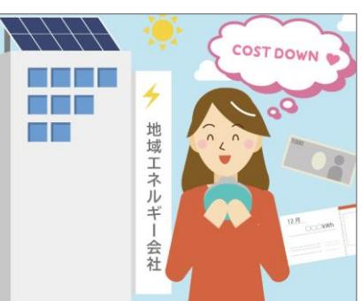

表紙

### **地球温暖化対策総合計画策定の背景・意義 (第1章)**

## ⚫ **地球温暖化の影響と世界の動向**

- ➢ 現在世界で異常気象が頻発しており、その要因の一つとして温室効果ガス排出量の増加が挙げられています。
- ➢ 世界の年平均気温は年々上昇傾向であり、日本の年平均気温も100年あたり1.26℃の割合で上昇しています。
- ➢ これらを受けて、世界的に温室効果ガス排出量ゼロを目指す「カーボンニュートラル」の考え方が広まっています。

## ⚫ **地球温暖化対策に係る本町の主な動向**

- ➢ 2020年3月に2050年までにCO2排出量実質ゼロを目指す「ゼロカーボンシティ宣言」を表明
- ➢ 福島水素エネルギー研究フィールド(FH2R)を誘致し、水素等の先進的な技術情報の収集や関連事業者・国内外の自治体との連携を推進
- ➢ 浪江駅周辺をゼロカーボンシティの核となる先進的なエリアとして整備予定

## ⚫ **本計画の策定意義と期間**

- ➢ 策定意義・原発被災からの復興としての「エネルギーの地産地消」の推進・継続的な産業振興をはじめとする復興活動の支援とCO2排出量低減の両立・既存エネルギー計画を包括する形での地球温暖化対策実行計画の策定
- ➢ 計画期間:2023年度~2030年度(中間年度となる2026年度頃に見直し予定)

# **温室効果ガス排出量の現況と将来推計 (第2章)**

## ⚫ **温室効果ガス排出量の現況と将来推計**

- ➢ 2020年度温室効果ガス排出量:25.3千t-CO2 東日本大震災の影響で2017年3月まで全町避難が継続し、震災直前の2010年度と比較して17%に減少
- ➢ 2030年度温室効果ガス排出量(推計):50.8千t-CO2 2050年度温室効果ガス排出量(推計):65.7千t-CO2 復興の進展とともに経済活動が従来のレベルまで戻ることで、本町のCO2排出量は大きく増加する見込み

## ⚫ **森林吸収量**

- ➢ 森林吸収量は29.6千-CO2となり、2020年度の温室効果ガス排出量を4.3千t-CO2上回る。
森林吸収量が2020年度温室効果ガス排出量を上回っており、現在カーボンニュートラルを達成している状況です。

# **再生可能エネルギー導入ポテンシャルと地域特性**

**(第3章)**

| 項目                              |             | ポテンシャル量 | 特性                                                                                           |
|---------------------------------|-------------|---------|----------------------------------------------------------------------------------------------|
| 太 陽 光 発 電           | 野立て 太陽光  | 96MW    | 既に町域全体で87MWの導入が進んでいるが、電力会社に売電され ているため、地産地消ができていない状況である。                                   |
|                                 | 屋根置き 太陽光 | 9.9MW   | 既に町域全体で0.2MWの導入が進んでいる。国の方針にて、「公共 施設の設置可能な屋根に100%太陽光を設置する」ことが求められ ており、行政としての率先行動が必要である。 |
| 風力発電                            |             | 1,086MW | 帰還困難区域への導入可能性を検討することが課題である。                                                                  |
| 中小水力発電                          |             | 3.8MW   | 現在、大柿ダムにおける発電事業の検討が行われている。合意形成な どが求められるため、導入までに時間を要することが想定される。                            |
| 発 バ イ 電 オ マ ス | 木質系         | 10.4MW  | 町内の森林エリアは線量が高止まりのため、ポテンシャルをそのまま 利用することは難しい状況である。                                          |
|                                 | 廃棄物系        | 1.2MW   | ポテンシャルは最も少ないが、棚塩地区に計画する復興牧場では牛の 糞尿を活用したバイオガス発電を行う予定である。                                   |

## ⚫ **基本理念**

- ➢ 環境への負荷の少ない持続的発展が可能な社会を構築し、人と自然が共生できる地球にやさしいまち浪江を実現します。
- ➢ 今後、本町で復興がさらに加速化し経済・社会活動が従前に戻り、エネルギー使用や温室効果ガス排出量も増加していく事が予想される中で「自ら勝ち取るカーボンニュートラル」を目指します。

## ⚫ **2030年の町の将来像(拡大版は最終ページに掲載)**

## ⚫ **基本方針**

### **再生可能エネルギー導入の促進と省エネルギー対策の徹底**

積極的な再生可能エネルギーの導入を促進していくとともに、徹底した省エネルギー対策を進めることで、温室効果ガスの削減を目指します。

#### **水素エネルギーの実装と新たな産業の創出**

将来的なカーボンニュートラルの核となる再生可能エネルギー由来の水素エネルギーの実装と、それによる新たな産業の創出を目指します。

### **エネルギー地産地消と地産外消の推進による社会・経済活動の向上と人材の育成**

本町の中で作られたエネルギーの地産地消を進めるとともに、本町の付加価値として地域外に輸出することにより、社会・経済活動の活性化を目指すとともに、次世代の人材育成を行います。

## **気候変動に適応していくための方策の推進**

近年進行する地球温暖化による影響を観察しながら、適応していくための方策を検討し、気候変動の適応と環境保全を推進します。

### **カーボンニュートラルを目指すための町の率先的な行動**

町・町民・事業者が一体となって、カーボンニュートラルを実現していくために、町(行政)が主体的・率先的な再生可能エネルギー導入の促進と省エネルギー対策の徹底、水素エネルギーの利活用を行います。

- ⚫ **カーボンニュートラル達成に向けた考え方**
	- ➢ 本町では、すでに皆さんが使うエネルギーより多くの再生可能エネルギーが導入されていますが、固定価格買取制度(FIT)で売電されている量が多いうえ、今後は復興の進展に伴い、エネルギー使用量が大きく増大していくことが予想されます。
	- ➢ また、再生可能エネルギーや水素の先進的な町として、再生可能エネルギーを多く必要とする都市部自治体への供給や、水素等の新たなエネルギーに付与していくことも重要です。
	- ➢ 以上の内容を包括した上でカーボンニュートラルを達成することが、本町の目指すところです。
- ⚫ **温室効果ガス排出量の抑制目標**

**2030年度**までに本町から排出される温室効果ガスを**40千t-CO2**に抑制します。 カーボンニュートラルに向けた達成率、 **50%**を目指します。

**2035年度**を待たずにカーボンニュートラルを目指します。 (カーボンニュートラルの達成率、 **100%**を目指します。)

【町の状態】

- 公共施設におけるエネルギー需要の100%を再生可能エネルギーで賄っている。
- 駅周辺整備エリアの新しいまちにおけるエネルギー需要の100%を再生可能エネルギーで賄っている。
- 町内の産業団地におけるエネルギー需要の半分(50%)を再生可能エネルギーで賄っている。

## ⚫ **2030年の将来像の実現に向けた取組**

- ➢ 共通の施策
	- 1. 再生可能エネルギー導入促進のための情報発信
	- 2. カーボンニュートラル関連施策推進のための補助金等の情報発信
	- 3. 地域内のエネルギーマネジメントへの加速化
	- 4. 次世代再生可能エネルギー技術の加速化支援
	- 5. 地域内のエネルギー利用や調達に関する条例等の整備
	- 6. 浪江町ゼロカーボンシティに向けた条例等の整備 (促進区域の設定)
	- 7. 他地域とのエネルギーに関する連携
	- 8. 福島国際研究教育機構とのエネルギーに関する連携
	- 9. 農林水産分野との連携を通じた炭素固定・貯留や吸収源対策の推進
	- 10.未来を担う子どもたちへの脱炭素・エネルギー教育の実施
	- 11.浪江町民向けの脱炭素・エネルギーに係る学びの機会の創出
- ➢ 各部門における施策
- A) 新規産業団地のRE100化と既存産業団地の省エネ推進
- B) 再エネを活用した農林水産業の発展
- C) 建物ZEB化の推進
- D) 水素製造・運用の推進と需要設備の整備
- E) オンサイト・オフサイトPPA事業の普及促進
- F) 浪江駅周辺エリアのカーボンニュートラル化
- G) 家庭の省エネ改修および再エネ導入の促進
- H) 水素ステーション・EVステーションの整備図3 各種施策のロードマップ

## **浪江町の地球温暖化対策の適応策 (第6章)**

## ⚫ **適応策の必要性**

- ➢ 近年、気温上昇、集中豪雨の頻度の増加、それに伴う農作物の品質低下や熱中症リスクの増加といった気候変動によると思われる影響が全国各地で発生しており、さらに今後、これら影響が長期にわたり拡大する恐れがあると考えられています。
- ➢ そのため、地球温暖化の要因である温室効果ガスの排出を削減する対策(緩和策)のほか、気候変動の影響による被害の回避・軽減対策(適応策)に取り組んでいく必要があります。

## ⚫ **基本方針**

#### **科学的知見に基づく情報の収集**

地域特性などに応じた適応策を検討・推進するにあたり、気候変動適応情報プラットフォーム(A-PLAT) を活用して、科学的知見・情報の収集・整理に努めます。

**地域の実情に応じた気候変動への適応の取組の推進**

各分野において将来予測される影響について、浪江町の地域特性を勘案した適応の重点施策を推進します。

**2**

**町民、事業者等の理解及び行動の促進に資する情報の発信**

気候変動への適応の重要性について、住民の理解・行動につながるような効果的な広報や啓発活動を行います。

## ⚫ **主な重点施策**

- ➢ 農業、林業、水産業分野:新たな品種や栽培方法の導入(水稲、野菜等、畜産)
- ➢ 自然災害分野:防災体制の整備や地域防災力の向上、治水対策などの推進
- ➢ 産業・経済活動分野:事業継続計画(BCP)の策定支援、気候変動ビジネスの展開支援
- ➢ 国民生活・都市生活分野:災害時における停電対策の充実を推進

# **浪江町公共施設における率先行動 (第7章)**

## ⚫ **公共施設における温室効果ガス排出量の現況と将来推計**

- ➢ 2021年度の温室効果ガス排出量:1.3千t-CO2 (公共施設11施設)
- ➢ 2030年度温室効果ガス排出量(推計):2.3千t-CO2 2050年度温室効果ガス排出量(推計):3.2千t-CO2 復興の進展とともに事務事業におけるCO2排出量は大きく増加する見込み
- ⚫ **公共施設における温室効果ガス排出量の抑制目標**

**2030年度**までに基準年度(2010年度)比で**19%(1.0千t-CO2)**に抑制します。 基準年度比の削減目標率は81%(4.3千t-CO2) ※森林吸収量は数値目標に含みません。

## ⚫ **基本方針と対策項目**

- ➢ 「浪江町のさらなる復興と持続可能なまちづくりに【つなげる】」を前提として、「エネルギー資源を【活かす】」、 「エネルギーを【減らす】」、「エネルギーを【賢く使う】」の3つの観点から、カーボンニュートラルに資する施策を推進します。

| 基本方針                       | 対策項目                          |
|----------------------------|-------------------------------|
| 【エネルギー資源を活かす】 再エネ・水素の導入 | FH2R由来水素の導入、再エネ電源の導入          |
| 【エネルギーを減らす】                | 燃料転換による再エネ電源比率の向上、外皮などの断熱性の向上 |
| 省エネ対策(設備更新)                | 等                             |
| 【エネルギーを減らす】                | 設備の適切な稼働時間・可動範囲の設定、照明照度の設定    |
| 省エネ対策(運用改善)                | 等                             |
| 【エネルギーを賢く使う】               | 庁内推進体制の構築、エネルギーの見える化          |
| カーボン・マネジメント                | 等                             |

**先人たち、そして私たち浪江町民が大事にしてきた風土や暮らしを大切にする**

**先進的な技術が集まることで、来訪人口が増加観光業等が再興して、町の知名度も向上する**

**老若男女問わずエネルギーリテラシーが進み、デジタル技術等を用いて住民に還元されている**

**多様な雇用と人材が集積。駅周辺整備により、町内の中心部が活性化し、にぎわいが生まれる**

**地域エネルギー会社によるお得で環境に優しいエネルギーが利用できる**

**エネルギーや脱炭素に関する学習の機会が浪江の未来を語らう素養ができている**

**町全体の取組みが進むことで、浪江への誇りや郷土愛が醸成される**

**次世代自動車が普及し、カーシェアや公共交通が発達して、移動が便利になっている**

**行政からも積極的な支援や後押しを受け、新たな分野へのスタートアップ・挑戦が容易にできる**

**電気自動車と水素自動車 (バス含む)の運行開始**

**RE100の一環としてPPA事業なども展開**

**電気やガスが止まっても、再生可能エネルギーや水素で安全・安心な暮らしができる(その①)**

**電気やガスが止まっても、再生可能エネルギーや水素で安全・安心な暮らしができる(その②)**

**RE100産業団地の本格稼働**

**柱上パイプラインによる水素供給**

再生可能エネルギー・水素エネルギーの

トップランナー浪江町

**職場でも再生可能エネルギーやグリーン水素が導入されて、より身近な存在になるとともに、CO2ゼロが当たり前になっている**

**地域エネルギー会社を核としたエネルギー供給**

**2030年の将来像**

**周辺環境と調和した**

**帰還困難区域の一部エリアで**

**再エネ開発**

**水素が住宅に普及し、町民や事業者の皆さんが便利さを享受している**

-

**電気やガスが止まっても、再生可能エネルギーや水素で安全・安心な暮らしができる(その①)**

**周辺環境と調和した**

**再エネ開発**

**地域エネルギー会社による**

**お得で環境に優しいエネルギーが利用できる**

**エネルギーや脱炭素に関する学習の機会が**

**浪江の未来を語らう素養ができている**

**町全体の取組みが進むことで、浪江への誇りや**

**郷土愛が醸成される**

**たくさん設けられ、知識や情報を手に入れることで、**

**老若男女問わずエネルギーリテラシーが進み、デジタル技術等を用いて住民に還元されている**

**先人たち、そして私たち浪江町民が大事にしてきた**

**先進的な技術が集まることで、来訪人口が増加観光業等が再興して、町の知名度も向上する**

**多様な雇用と人材が集積。駅周辺整備により、町内の中心部が活性化し、にぎわいが生まれる**

> **水素が住宅に普及し、町民や事業者の皆さんが便利さを享受している**

**風土や暮らしを大切にする**

**次世代自動車が普及し、カーシェアや公共交通が発達して、移動が便利になっている**

**職場でも再生可能エネルギーやグリーン水素が導入されて、より身近な存在になるとともに、CO2ゼロが当たり前になっている**

**行政からも積極的な支援や後押しを受け、新たな分野へのスタートアップ・挑戦が容易にできる**

**電気やガスが止まっても、再生可能エネルギーや水素で安全・安心な暮らしができる(その②)**

裏表紙

7