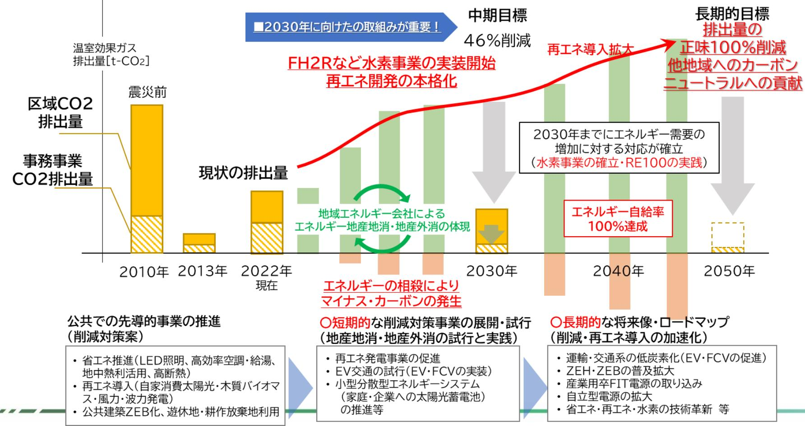

#### 令和4年度第1回浪江町環境審議会

- (仮称)浪江町地球温暖化対策総合計画第 1 回計画策定委員会 -

日時:令和 4 年 11 月 1 日(火) 場所:浪江町役場 301 会議室

#### 次第

- 1 開会挨拶
- 2 自己紹介、会長の選出
- 3 議題
- (1)(仮称)浪江町地球温暖化対策総合計画の策定の流れ・資料説明および質疑応答
- (2)昨年度からの検討内容・論点・資料説明および質疑応答・意見交換
- (3)(仮称)浪江町地球温暖化対策総合計画計画骨子(案)について・資料説明および意見交換
- (4)その他、意見交換
- (5)今後のスケジュール

・次回の日程確認

- 4 閉会
#### 配布資料

- 資料1:出席者名簿
- 資料2:座席表
- 資料3:(仮称)浪江町地球温暖化対策総合計画の策定の流れ
- 資料4:昨年度からの検討内容・論点
- 資料5:(仮称)浪江町地球温暖化対策総合計画計画骨子(案)

#### 出席者名簿

【浪江町環境審議会委員】

|           | 所 属                  | 氏 名                                  | 備考 |
|-----------|-------------------------|-----------------------------------------|----|
|           | 福島大学共生システム理工学類          | かわ さき こう た 川 﨑 興 太 |    |
| 学識 経験者 | 東京大学先端科学技術研究センター        | こうの たつ おき 河野 龍 興         |    |
|           | 福島大学共生システム理工学類          | ごとう しのぶ 後藤 忍                   | 欠席 |
|           | 株式会社 伊達重機            | ぜんじ あきひろ 前司 昭博                 |    |
|           | 株式会社 舞台ファーム          | いとう けいいち 伊藤 啓一                 |    |
| 事業者       | 株式会社 スマートアグリ・リレーションズ | なかやち よし あき 中谷内 美 昭       |    |
| 団体 町民  | 行政区長会                   | さとう ひでぞう 佐藤 秀三                 |    |
|           | 會澤高圧コンクリート 株式会社      | あい ざわ たいし 會 澤 大志         |    |
|           | 浪江町民                    | さわむら 澤村 なつみ                       |    |

【資料2】

#### 座席表

浪江町役場 3 階 301会議室

# **第1回計画策定委員会 (仮称)浪江町地球温暖化対策総合計画の策定の流れ**

**カーボンニュートラル推進部カーボンニュートラル・コンサルティングG**

**2022/11/1**

- 1 計画策定の背景・意義
- 2 計画策定のスケジュール
- 3 各委員会の主な議題事項と到達点

#### **計画策定に関するこれまでの経緯**

| 時期             | 取組み概要                                                                            |
|----------------|----------------------------------------------------------------------------------|
| 平成29年3月        | 「浪江町復興計画[第二次]」において、エネルギーの地産地消 の実現と新しい産業の創出を目標に掲げる。                            |
| 平成30年3月        | 「浪江町再生可能エネルギー推進計画 」を策定し、再エネ導入 目標を設定する 。                                 |
| 令和2年3月         | 浪江町として「 ゼロカーボンシティ 」を宣言。(全国77 番目、 県内で郡山市、大熊町に続き3番目)                      |
| 令和3年3月         | 「浪江町環境基本条例 」を制定。                                                              |
| 令和5年3月 (予定) | 地球温暖化対策計画にかかわる「ゼロカーボンマスタープラ ン」を策定し、2050 年ゼロカーボン達成に向けたステップ と具体的な取組みを明らかにする。 |

商業、工業、農業、水産業、交通、教育、福祉等、様々な分野において再エネ、省エネはもちろん、水素利活用及び実証を積極的に推進し、ゼロカーボンシティ達成を目指したい。

#### **浪江町を取り巻く背景と総合計画の意義について**

#### **<原発被災からの復興>**

- ⚫ 浪江町復興計画【第二次】以降における「エネルギーの地産地消」の表明
#### **<本町特有の課題>**

- ⚫ 帰還困難区域の一部解除に伴う地球温暖化対策の始動
	- ✓ 継続的な産業振興をはじめとする復興活動の支援とCO2排出低減の両立
	- ✓ 限定的な帰還人口の中で、いかなる合意形成を図るか
- ⚫ 地球温暖化対策実行計画の事務事業編・区域施策編ともに未策定の状況
- ⚫ 先行するエネルギー政策(「浪江町再生可能エネルギー推進計画」、町内進出企業による先進的な再生可能エネルギー及び水素に係る実証や事業の展開)と地球温暖化対策の整合

**上記の背景をふまえた統合的な地球温暖化対策のマスタープランの必要性**

**「(仮称)浪江町地球温暖化対策総合計画」の策定**

| 浪江町の動向                                                     |                                                                                                                                                               |
|------------------------------------------------------------|---------------------------------------------------------------------------------------------------------------------------------------------------------------|
| 浪江町復興計画【第三次】 [2021年3月】                                  | ア 再生可能エネルギーや水素エネルギーの導入の推進 イ エネルギーの地産地消の取組みの情報発信 ウ ゼロカーボンシティ実現に向けた計画の策定 エ 廃棄物の削減・リサイクルの推進                                                 |
| ゼロカーボンシティ宣言 [2020年3月7日】                                 | ア 再生可能エネルギーを利用したスマートコミュニティの構築 イ エネルギーの地産地消 ウ 再生可能エネルギー産業の育成、支援 エ 浪江産の水素を活用した町づくり オ 低炭素型社会への貢献                                      |
| 浪江町再生可能 エネルギー推進計画 [2018年 3 月]                     | ➢再生可能エネルギーに関する積極的な情報配信 ➢再生可能エネルギー導入に関する積極的な措置 ➢再エネ経済価値の地域還元・循環の仕組みの構築 ➢再エネによる持続的なまちづくりの実現 ➢再エネ導入拡大のための基盤の整備 ➢再エネの自給率を2020年度に40%、2027年度に54%を目指す |
| 浪江町復興計画【第 三次】の策定やゼロ カーボンシティ宣言 などにより町内で の事業が加速化 | ① なみえ水素タウン構想 ② 浪江駅周辺の中心市街地のまちづくり ③ 水素及び再生可能エネルギーを活用したRE100産業団地                                                                                 |

#### **世界的な地球温暖化の潮流と国の地球温暖化対策の方向性**

- 京都議定書(COP※3) 2008年~2012年の5年間に1990年比6%の削減目標 1997年
- パリ協定(COP21) SDGs持続可能な開発目標日本もパリ協定の国際的な枠組みに合意 2015年 「誰一人取り残さない」持続可能な社会の実現のために定められた、環境・経済・社会についての国際的な目標
- 2016年地球温暖化対策計画中期目標(2030年):26%削減、長期目標(2050年):80%削減
- **2020年 「2050年カーボンニュートラル」宣言**

菅元首相は所信表明にて、2050年までに温室効果ガスの排出量を全体としてゼロにする、すなわち**2050年カーボンニュートラル、脱炭素社会の実現**を目指すことを宣言した。

※COP・・・**C**onference **o**fthe **P**arties (国連気候変動枠組条約締約国会議) 2021年 **地球温暖化対策計画改定** イギリスグラスゴー(COP26) 「2050年カーボンニュートラル」宣言等の達成に向け計画を改定

#### **自治体の地球温暖化対策に係る計画と本町の計画の位置付け**

**『地球温暖化対策の推進に関する法律』(温対法)**に基づき、地方公共団体が策定する計画 (地球温暖化対策実行計画)は、2種類。これに気候変動適応法に基づく「気候変動適応計画」、これらを実現するための施策の1つとして、再生可能エネルギーの導入について具体的な計画を定め、総合計画とする予定。

#### **浪江町地球温暖化対策総合計画**

#### **「カーボンニュートラル」とは**

- ⚫ 2020年10月、政府は2050年までに温室効果ガスの排出を全体としてゼロにする、カーボンニュートラルを目指すことを宣言。
- ⚫ 「排出を全体としてゼロ」というのは、二酸化炭素をはじめとする温室効果ガスの「排出量」※ から、植林、森林管理などによる「吸収量」※ を差し引いて、合計を実質的にゼロにすること。 ※人為的なもの
- ⚫ カーボンニュートラルの達成のためには、温室効果ガスの排出量の削減並びに吸収作用の保全及び強化をする必要がある。

#### **浪江町のカーボンニュートラルに向けて**

- ⚫ 省エネ対策を行いながら、再生可能エネルギーの導入を推進していく。
- ⚫ エネルギーの地産地消と余剰となるエネルギーを地産外消していく。
- ⚫ グリーン水素事業を推進し、浪江町から県、東北、全国へのエネルギー発信拠点へ。

#### **計画策定のスケジュール**

|              |    | 11月 |                          |    | 12月 |    |    | 1月 |                         |    | 2月 |              |               | 3月 |    |
|--------------|----|-----|--------------------------|----|-----|----|----|----|-------------------------|----|----|--------------|---------------|----|----|
|              | 上旬 | 中旬  | 下旬                       | 上旬 | 中旬  | 下旬 | 上旬 | 中旬 | 下旬                      | 上旬 | 中旬 | 下旬           | 上旬            | 中旬 | 下旬 |
| 第1回 策定委員会 |    |     | 11/1(火)開催(議論および計画骨子案の確認) |    |     |    |    |    |                         |    |    |              |               |    |    |
|              |    |     |                          |    |     |    |    |    |                         |    |    |              |               |    |    |
| 計画素案の作成      |    |     | 議題事項および計画素案の作成           |    |     |    |    |    |                         |    |    |              |               |    |    |
|              |    |     |                          |    |     |    |    |    |                         |    |    |              |               |    |    |
| 第2回 策定委員会 |    |     |                          |    |     |    |    |    | 12月下旬開催予定(計画素案に関する議論)   |    |    |              |               |    |    |
|              |    |     |                          |    |     |    |    |    |                         |    |    |              |               |    |    |
| パブリックコメント    |    |     |                          |    |     |    |    |    | 委員会内容を反映の上、パブリックコメントの実施 |    |    |              |               |    |    |
| の実施          |    |     |                          |    |     |    |    |    |                         |    |    |              |               |    |    |
| パブリックコメント    |    |     |                          |    |     |    |    |    |                         |    |    | 応方針の共有(各委員へ) | パブリックコメントの意見対 |    |    |
| の意見対応方針      |    |     |                          |    |     |    |    |    |                         |    |    |              |               |    |    |
|              |    |     |                          |    |     |    |    |    |                         |    |    |              | 2月下旬開催予定      |    |    |
| 第3回 策定委員会 |    |     |                          |    |     |    |    |    |                         |    |    |              | (計画案の確定)      |    |    |
|              |    |     |                          |    |     |    |    |    |                         |    |    |              |               |    |    |

## 各委員会の主な議題事項と到達点

#### **第1回計画策定委員会(今回)**

- ⚫ 主な議題事項
	- 委員・事務局の顔合わせと懇親
	- 環境審議会開催(計画策定)に係る認識合わせ
	- 昨年度までの検討状況の理解
	- 計画骨子(案)全体に対する意見出し
	- 気候変動適応計画・事務事業編で必要な視点の共有 (追加調査で必要な内容)
- ⚫ 到達点
	- 浪江町特有の事情や地域性への理解と共感
	- 計画策定に向けた不足事項の棚卸し
	- 自由で闊達な議論が行われる会合の雰囲気の形成

### **第2回計画策定委員会(12月下旬想定)**

#### ⚫ 主な議題事項

- 第1回での指摘事項への対応状況確認
- 地域エネルギー会社との連動性について
- 計画の進捗確認・モニタリング手法に関する意見交換
- 個別の施策内容に関する意見交換
- 計画素案に対する意見交換

### ⚫ 到達点

- 計画素案全体の構成に対する承認の獲得
- 個別具体の内容に対する意見集約と計画への反映
- 議論が必要な事項の深堀とその方向性の獲得

#### **第3回計画策定委員会(2月下旬想定)**

#### ⚫ 主な議題事項

- ① 第2回での指摘事項への対応状況確認
- ② パブリックコメントの実施結果の共有
- ③ 計画素案(最終案)の読み合わせと内容調整

#### ⚫ 到達点

① 計画に対する委員からの承認獲得

## **計画策定の流れのまとめ** 第1回 (11月-今回) 第2回 (12月下旬予定) ① 委員・事務局の顔合わせと懇親 ② 環境審議会開催(計画策定)に係る認識合わせ ③ 昨年度までの検討状況の理解 ④ 計画骨子(案)全体に対する意見出し ⑤ 気候変動適応計画・事務事業編で必要な視点の共有 (追加調査で必要な内容)

- ① 第1回での指摘事項への対応状況確認
- ② 地域エネルギー会社との連動性について
- ③ 計画の進捗確認・モニタリング手法に関する意見交換
- ④ 個別の施策内容に関する意見交換
- ⑤ 計画素案に対する意見交換

#### 第3回 (2月下旬予定)

- ① 第2回での指摘事項への対応状況確認
- ② パブリックコメントの実施結果の共有
- ③ 計画素案(最終案)の読み合わせと内容調整

- ② 計画策定に向けた不足事項の棚卸し ③ 自由で闊達な議論が行われる会合の雰囲気の形成
① 浪江町特有の事情や地域

**到達点**

性への理解と共感

- ① 計画素案全体の構成に対する承認の獲得
- ② 個別具体の内容に対する意見集約と計画への反映
- ③ 議論が必要な事項の深堀とその方向性の獲得
- ① 計画に対する委員からの承認獲得

# **第1回計画策定委員会昨年度からの検討内容・論点**

**カーボンニュートラル推進部カーボンニュートラル・コンサルティングG**

**2022/11/1**

- **昨年度からの検討内容の紹介** 1 区域施策編及び再生可能エネルギー※導入に係る検討事項
- 2 **昨年度からの検討内容の紹介** 気候変動適応に係る検討事項

※本資料では、「再生可能エネルギー」を、以下「再エネ」と表記。

- 3 **昨年度からの検討内容の紹介** 事務事業編に係る検討事項
- 今年度の対応予定事項 4
- 5 参考資料

## **ご議論いただきたい事項**

- ⚫ 区域施策編における目指す方向性 ✓ 2030年、2050年に目指していきたい将来像 ✓ 2030年へエネルギー関連の施策展開していく内容 ✓ 地域内で再エネを増やしていくこと ✓ 水素事業を推進して町の復興・活性化につなげること
	- ✓ 地域エネルギー会社を設立して、エネルギーの地産地消・地産外消をしていくこと
- ⚫ 浪江町の再エネ・復興まちづくりに関する課題 ✓ 「こんな町に住みたい」、「こんな町で仕事をしたい」といった理想や希望をお聞かせください。
- ⚫ 気候変動適応に関するご意見・ご感想
- ⚫ 事務事業編に関するご意見・ご感想

#### 昨年度からの検討内容の紹介区域施策編及び再エネ導入に係る検討事項

#### **【説明資料の構成】**

- 浪江町のCO2排出量はどのくらいか。(現況把握)
- 将来的なCO2排出量はどのくらいになるか。(将来推計)
- 再エネのポテンシャルがどのくらいあるか。(再エネポテンシャル)
- 再エネを導入していくための課題、復興まちづくりの課題は何か。
- 2030年、2050年に向けて、どのような将来像を目指していくか。
- 温室効果ガス削減や再エネ導入の目標はどのようになるか。
- 脱炭素シナリオに向けた導入目標(再エネ・省エネ等)は何か。
- 各部門で、どのような施策(取組み)を、どのように進めていくか。

# ① 浪江町のCO2排出量はどのくらいか。(現況把握)

#### **浪江町のCO2排出量の推移**

- ⚫ 環境省が示す「標準的手法」を用いて算定。 ✓ 元となる活動量データは、国が公表している値を基にしており、町や県が公表する諸データを基に再構築し算定。
- ⚫ 震災後、2013年以降のCO2排出量が著しく減少している。

# ② 将来的なCO2排出量はどのくらいになるか。 (将来推計)

## **浪江町の温室効果ガス排出量の将来推計の結果**

- ⚫ 通常シナリオ(※)におけるCO2排出量の推移

## **震災前(2010年度)に比べて2050年段階においても、半分以下の排出量となる。**

※浪江町復興計画【第三次】の目標を想定 ※シナリオを3パターン設定して検討した。シナリオの内容は巻末の参考資料P.52に掲載した。

#### **浪江町のエネルギー需要の将来推計結果**

#### ⚫ 通常シナリオのエネルギー需要量の推移

## **エネルギー需要量はCO2排出量と連動 =エネルギー需要量の削減がCO2削減につながる**

#### **区域施策編及び再エネ導入に係る検討事項**

# ③ 再エネのポテンシャルがどのくらいあるか。 (再エネポテンシャル)

**【再エネのポテンシャルとは・・・】** ➢ 賦存量のうち、エネルギーの採取・利用に関する種々の制約要因(土地の傾斜、法規制、土地利用、居住地からの距離等)により利用できないものを除いたエネルギー資源量

#### **再エネ導入ポテンシャルの推計結果**

- ⚫ 環境省(REPOS)や町の最新情報より、再エネ導入ポテンシャルを推計

|         | 1,200    |       |             |       |                                                                                                                                                                                                                                                     |       |       |           |    |       |              |
|---------|----------|-------|-------------|-------|-----------------------------------------------------------------------------------------------------------------------------------------------------------------------------------------------------------------------------------------------------|-------|-------|-----------|----|-------|--------------|
|         | 1,000    |       |             |       | ※波力発電などの最新 導入ポテンシャル 技術は見込んでいない。 種別 ①区域指 ②帰還困 定なし 難区域 太陽光(住宅系) 0 0 公共施設 0 0 低未利用地 0 0 太陽光 耕作放棄地 0 0 (公共施設系) 小計 0 0 4 10 1 陸上風力 0 1,006 廃棄物系 中小水力(河川) | [MW]  |       |           |    |       |              |
|         | 800      |       |             |       |                                                                                                                                                                                                                                                     |       |       |           |    |       | ③帰還困難 区域外 |
|         |          |       |             |       |                                                                                                                                                                                                                                                     |       |       |           |    |       | 8            |
| W] M | 600      |       |             | 1,006 |                                                                                                                                                                                                                                                     |       |       |           |    |       | 2            |
| 量[      | 400      |       |             |       |                                                                                                                                                                                                                                                     |       |       |           |    |       | 8            |
| 容 備  |          |       |             |       |                                                                                                                                                                                                                                                     |       |       |           |    |       | 89           |
| 設       | 200      | 8     |             |       |                                                                                                                                                                                                                                                     |       |       |           |    |       | 98           |
|         | 0        |       | 98          | 80    |                                                                                                                                                                                                                                                     |       |       |           |    |       | 80           |
|         |          | 太陽光   | 太陽光         |       | 中小水力                                                                                                                                                                                                                                                | 木質系   | バイオマス |           | 0  | 4     | 0            |
|         |          | (住宅系) | (公共施設 系) | 陸上風力  | (河川)                                                                                                                                                                                                                                                | バイオマス | (家畜糞  | 木質系バイオマス  | 10 | 0     | 0            |
|         |          |       |             |       |                                                                                                                                                                                                                                                     |       | 尿)    | 廃棄物系バイオマス | 1  | 0     | 0            |
| ①区域指定なし |          | 0     | 0           | 0     | 0                                                                                                                                                                                                                                                   | 10    | 1     | 合計        | 12 | 1,010 | 186          |
|         | ②帰還困難区域  | 0     | 0           | 1,006 | 4                                                                                                                                                                                                                                                   | 0     | 0     | 総計        |    |       | 1,207        |
|         | ③帰還困難区域外 | 8     | 98          | 80    | 0                                                                                                                                                                                                                                                   | 0     | 0     |           |    |       |              |

※ 既存発電所に関わる情報は参考資料参照。

# ④ 再エネを導入していくための課題、復興まちづくりの課題は何か。

**地域特性・課題の分析 (再エネ導入に係る地域特性・課題)**

#### **<太陽光発電>**

- ①野立て太陽光
- 新規導入は、震災後の土地利用状況を考慮し、適地検討することが課題。 ②屋根置き太陽光
- 8MWを見込めるが人が住んでいない住宅等も集計対象として含まれている、環境省「REPOS」による住宅地図から判定のため、可能性がある。

#### **<風力発電>**

条件を勘案し適地選定も含め、帰還困難区域への導入の検討が課題。

#### **<中小水力発電>**

大柿ダムにおける発電事業の検討が行われている。 帰還困難区域の山間部において流量・落差の河川で4MWのポテンシャル。

#### **<バイオマス発電>**

立野地区において約2MWの木質バイオマス発電事業が計画されている。 木質バイオマス発電は10MW、廃棄物系バイオマス発電は1MWのポテンシャル。

**地域特性・課題の分析 (復興まちづくりやゼロカーボンに向けた地域の現状と課題の整理)**

**<産業分野の現状と課題>**

- ⚫ 農業用水が利用可能になった農地においても、作付が再開された農地面積は134ha(令和 2 年度)に過ぎないため、営農再開を一層加速させていくことが課題。
- ⚫ 町民の豊かな生活に必要な専門店などの再開は不十分であり、更なる事業再開・創業支援が課題。
- ⚫ 積極的な企業誘致活動や事業者の再開・創業支援を行い、帰還町民や移住・定住者に向けて働く場を確保していくことが課題。

**地域特性・課題の分析 (復興まちづくりやゼロカーボンに向けた地域の現状と課題の整理)**

- **<住民生活分野の現状と課題>**
- ⚫ 浪江駅周辺を中心とした区域に、駅東西自由通路、店舗、オフィス、住宅等様々な機能の集積や道路整備を進め、誰もが住みやすい快適な暮らし、商業機能の活性化、にぎわいの回復等につながる中心市街地整備を進める。
- ⚫ 震災の影響で町内の各種公共施設は再開を開始したばかり又は再開に向けた準備を進めている状況、生涯学習を推進するための環境整備が課題。
- ⚫ 将来的には、高齢者等交通弱者のニーズに対応して民間事業者の活用や未来技術を生かした新たな移動手段の検討など地域公共交通の充実に向けた推進が課題。

**地域特性・課題の分析**

**(復興まちづくりやゼロカーボンに向けた地域の現状と課題の整理)**

- **<ゼロカーボンシティの実現に向けた現状と課題>**
- ⚫ 公共施設に太陽光発電設備を設置し、再エネ導入を推進。
- ⚫ 「幾世橋住宅団地」では、蓄電池とHEMSを導入するとともに、電気自動車のカーシェアリングの実証実験を実施。
- ⚫ 「道の駅なみえ」では、水素、太陽光、風力発電設備等を設置するとともに、CEMSを導入し、スマートコミュニティを推進。
- ⚫ 公用車として災害発生時の電源としても活用できるEVを導入。
	- ✓ 地元企業と連携したマルチ急速充電器の開発や住宅用太陽光発電設備導入の支援などによりエネルギーの地産地消を推進し、町民の理解向上に努めている。
- ⚫ ゼロカーボンシティ実現のためには、町が一つになって再エネや資源の効率的利用に積極的に取り組むことが課題。
	- ⚫ 第一に町の復興課題(産業振興・社会基盤の整備・帰還人口の増加)、第二にゼロカーボンシティの実現であると認識する。
	- ⚫ 複合的な要素を解決していくための、一つの手法として**地域新エネルギー会社のような地域エネルギーマネジメント等を担う組織体**を検討していくことが課題解決に資するものと考える。

#### **浪江町の地域エネルギー会社(構想イメージ)**

#### **浪江町の地域エネルギー会社(構想イメージ)**

# ⑤ 2030年、2050年に向けて、どのような将来像を目指していくか。

## **カーボンニュートラルへ向けた将来像の検討(2030年段階)**

#### **2030年段階で想定する状況**

- ⚫ 地域エネルギー会社を核として、RE100産業団地やJR浪江駅の再開発、道の駅・役場庁舎の他、一般家庭などにも地域エネルギー会社から再エネ電力だけでなく、水素供給も行われている。
- ⚫ 都市部のエリアに再エネ電気を供給して、エネルギー地産外消を行い、地域外のエネルギー代金を獲得している。
- ⚫ 水素研究拠点として、国内外から移住者も増えはじめ、町の産業も活発化している。
- ⚫ PPA事業などが進むとともに、市街地エリアでは再エネ導入が進んでいる。
- ⚫ RE100産業団地が本格稼働をしており、産業団地内では、RE100の一環としてPPA事業なども行われている。
- ⚫ 交通は、電気自動車と水素自動車、電気バス・水素バスなどが運行し始めている。
- ⚫ 主要建物はZEB化が進み、また、一般家庭はZEHが進み始めている。
- ⚫ 帰還困難区域での風力発電や太陽光発電などの開発が進み始めている。

## **カーボンニュートラルへ向けた将来像の検討(2050年段階)**

#### **2050年段階で想定する状況**

- ⚫ 地域の中で再エネが普及しており、震災前以上に町も賑わいを取り戻している。
- ⚫ エネルギー地産地消・外消が体現されており、町の産業振興がエネルギーを軸として安定している。
- ⚫ 地域エネルギー会社が成熟しており、核とする電力・水素事業を国内および国外にも発信している。
- ⚫ エネルギーの最適化としてエネルギーマネジメントが町全体として機能している。
- ⚫ 波力発電は、技術革新が起こり、新たな再エネ発電として機能している。
- ⚫ 復興牧場などが発展し、酪農における家畜糞尿を利用したバイオガス発電や食品残渣により資源循環がしている。
- ⚫ 震災前もしくは昔の浪江町の伝統を踏襲した文化も育まれ、温故知新の町として成熟している。

# ⑥ 温室効果ガス削減や再エネ導入の目標はどのようになるか。

#### **国の地球温暖化対策計画の目標**

- ⚫ 2021年10月「地球温暖化対策計画」の閣議決定
	- 既存計画 : 2013年度比で2030年度排出量を26%削減
	- 改定計画 : 2013年度比で2030年度排出量を**46%削減**
- ⚫ 産業部門(▲6.5%から▲37%に変更)や家庭部門(▲40%から▲66%に変更)の削減目標が大幅に増加となり、これまで以上に温室効果ガス排出削減の取組が必要。

|  |  |  | Copyright © KokusaiKogyoCo., Ltd. AllRightsReserved. |  |  |
|--|--|--|----------------------------------------------------------|--|--|

## **基準年度の設定および短期・中期・長期の温室効果ガス削減目標**

- ⚫ 通常シナリオにおける町の現状とすう勢による排出量 ➢ 基準年度は、国の計画との整合から2013年度とするが、浪江町の2013年度の排出量は極小 ➢ 2013年度に対する削減比率の算定に加え、震災前の2010年度についても参考として示す。

# ⑦ 脱炭素シナリオに向けた導入目標 (再エネ・省エネ等)は何か。

#### **部門別の省エネ対策と再エネの推進目標**

- ⚫ 2030年、2050年を目指して、省エネ対策と再エネ推進目標を設定 ⚫ 省エネ対策(エネルギー転換を含む)目標

|      | 2030年段階                   |        |  |  |  |  |
|------|---------------------------|--------|--|--|--|--|
|      | 省エネ目標(2020比)              | 再エネ目標  |  |  |  |  |
| 産業部門 | -10.0%                    | 24.5MW |  |  |  |  |
| 業務部門 | -19.0%                    | 24.5MW |  |  |  |  |
| 家庭部門 | -19.5%                    | 4MW    |  |  |  |  |
| 運輸部門 | 電化率 30% 水素化率 10% | 39.1MW |  |  |  |  |

➢ 熱(燃料)需要による排出量削減対策に、運輸部門の電化もしくは水素化が有効的に寄与する。

- ⚫ エネルギー事業の展開の早い浪江町にとって、試算を行った省エネ対策や再生エネ導入の方策について、町の地球温暖化対策の総合計画を策定し、PDCAサイクルによる進捗管理を行っていく必要がある。
※ 詳細の設定数値は、参考資料参照。

#### **カーボンニュートラルへ向けた将来推計(通常シナリオ)**

#### ⚫ **目標値を勘案したエネルギー需要量と再エネ導入量**

- ➢ 通常シナリオの現状すう勢のエネルギー需要量に対して、再エネ導入量を整理
- ➢ 省エネ対策を考慮すると、エネルギー需要量と再エネ導入目標量との比較より ✓ 2030段階には、エネルギー自給率の100%以上が想定される。
	- ✓ 2030年以降の**RE100からカーボン・ニュートラル**を目指していくには、熱エネルギーのエネルギー転換が必要。(**技術革新が必要**)

#### ⚫ **導入効果をCO2排出量換算**

# ⑧ 各部門で、どのような施策(取組み)を、どのように進めていくか。

#### **目標達成に向けた施策の体系**

- ⚫ 2030年、2050年の将来像に向けた浪江町のまちづくりを、目標達成に向けた施策を設定・推進していくことで、温暖化対策・エネルギーの観点から盛り上げていく。
	- ➢ 共通の施策と各部門別の施策に整理し、検討を実施。

#### **目標達成に向けた施策の検討(共通施策)**

| 情 報 | 1 | 再生可能エネルギー導入促進のための情報発信 太陽光、陸上風力、バイオマス、中小水力などの発電事業促進のための情報発信 ◆ 帰還困難区域への再生可能エネルギー導入に向けた情報発信 ◆                |
|--------|---|-----------------------------------------------------------------------------------------------------------------------|
| 発 信 | 2 | カーボン・ニュートラル関連施策推進のための補助金等の情報発信 再生可能エネルギー導入と省エネルギー対策を促進していくためのコスト負担軽減の ◆ ための補助金情報、固定資産税減免等の情報発信と普及啓発          |
| 技 術 | 3 | 地域内のエネルギーマネジメントへの加速化 地域新エネルギー会社によるエネルギー地産地消と地産外消の推進 ◆ 町内のエネルギーマネジメント(最適化)の実施 ◆                            |
| 支 援 | 4 | 次世代再生可能エネルギー技術の加速化支援 波力発電や潮力発電などの次世代の再生可能エネルギー技術の加速化に向けた支援 ◆                                                    |
| 条 例 | 5 | 地域内再生可能エネルギー導入の条例等の整備 太陽光、陸上風力、バイオマス、中小水力などの発電事業をする場合の町への届け出 ◆ 制度等の整備                                        |
| 整 備 | 6 | 浪江町ゼロカーボンシティに向けた条例等の整備(促進区域の設定) 産業団地や駅前再開発等の新規開発に関するカーボン・ニュートラル条例の検討 ◆ 再生可能エネルギー促進区域の設定、耕作放棄地の取扱い緩和措置など ◆ |
| 連 携 | 7 | 他地域とのエネルギーに関する連携 浜通り地区の他自治体や、都市部自治体とのエネルギーによる連携の推進 ◆                                                            |

## **目標達成に向けた施策の検討(各部門別)**

#### **短期・中期・長期におけるロードマップの検討**

- ⚫ **2050年を待たずに、カーボンニュートラルを達成**
- ⚫ **福島県が目指す2040年エネルギー自給率100%を達成**
- ⚫ **浪江町の地域エネルギー会社と伴走しながら、町のエネルギーマネジメントを確立**

## **短期・中期・長期におけるロードマップの検討(部門別)**

- 気候変動適応の法的位置づけを明確にし、関係者が一丸となって一層強力に推進していくべく、平成30年6月に「気候変動適応法」が成立し、同年12月1日に施行

<地域気候変動適応センターの概要>

- 地域気候変動適応センターの設置状況は、東北地方では宮城県と山形県が設置済み、福島県は未設置
- 浪江町としては、国立環境研究所の情報プラットフォームや、福島県地球温暖化対策計画等から情報収集を行い、適応策を推進する必要あり

#### **地球温暖化による福島県の気候への影響**

<IPPCによる代表経路(RCP)シナリオ> <福島県の気候変動シナリオ>

- IPCC第5次評価報告書で用いられたRCPシナリオは、将来の温室効果ガスが安定化する濃度レベルと、そこに至るまでの経路のうち代表的なものを選び作成されたもので、RCPに続く数値が大きいほど2100年における放射強制力(地球温暖化を引き起こす効果)が大きいことを意味している。
- 気象庁によると福島県では、最も気候変動が進んだ場合(RCP8.5シナリオ)では、21世紀末 (2076年~2095年)には現在(1980年~1999年)よりも、いずれの季節においても大幅な気温上昇がみられ、年平均気温が約4.5℃↑、猛暑日が14日↑、激しい雨(1時間降水量30㎜以上)が2倍に増加すると予測されている。

## **○基本方針1**

# **科学的知見に基づく情報の収集**

## **○基本方針2**

**地域の実情に応じた気候変動への適応の取組みの推進**

## **○基本方針3**

## **町民、事業者等の理解及び行動の促進に資する情報の発信**

#### **浪江町の気候変動適応策の基本方針**

#### **○基本方針1:科学的知見に基づく情報の収集** 地域特性などに応じた適応策を検討・推進するにあたり、気候変動適応情報プラットフォーム(A-PLAT)等を活用して科学的知見・情報の収集・整理に努める。

「気候変動適応情報プラットフォーム(A-PLAT)は、気候変動による悪影響をできるだけ抑制・回避し、また正の影響を活用した社会構築を目指す施策(気候変動適応策、以下「適応策」という)を進めるために参考となる情報を、分かりやすく発信するための情報基盤

#### **浪江町の気候変動適応策の基本方針**

**○基本方針2:地域の実情に応じた気候変動への適応の取組みの推進** 科学的知見に基づいて策定された福島県地球温暖化対策計画の適応策等を参考にして、浪江町の地域特性を勘案した適応の重点施策を推進する。

| 分 野        | 適応の重点施策                                                                           |
|---------------|-----------------------------------------------------------------------------------|
| 農業、林業、水産業     | ・新たな品種や栽培方法の導入(水稲、野菜等、畜産)                                                         |
| 水環境・水資源       | ・ため池整備工事等の洪水の増加に伴う生産基盤の強化 ・モニタリング調査を通じた影響の把握、水環境の保全の推進                         |
| 自然生態系 自然災害 | ・生物多様性の保全のため従前実施してきた施策に、予測される気候変動の影響も 考慮しながら、より一層の推進を図る                        |
|               | ・福島県の野生鳥獣保護管理等に関する各種計画に基づき捕獲対策等を推進                                                |
|               | ・防災体制の整備や地域防災力の向上、治水対策などの推進 ・浪江町防災ハザードマップ(令和2年4月改訂)を活用した「マイ避難シート作成」の 取組みの推進 |
| 健康・住民生活       | ・災害に強い水道施設や交通基盤の整備推進 ・暑さ指数を活用した保育施設・小中学校・高齢者施設における対策・予防の啓発                     |
| 産業・経済活動       | ・事業継続計画(BCP)策定支援 ・災害用電源設備の確保支援                                                 |
| 国民生活・都市生活     | ・災害時における停電対策の充実を推進 ・水道施設の耐災害性強化対策等の促進                                          |

#### **浪江町の気候変動適応策の基本方針**

**○基本方針3:町民、事業者等の理解及び行動の促進に資する情報の発信** 気候変動への適応の重要性について、住民の理解・行動につながるようの効果的な広報や啓発活動を行う。

A-PLATでは、全国で実施されている地域の適応策のインタビュー記事や、市民、企業、研究者なども含めた多様な主体との連携・協働のための情報を提供していることから、このような地域の適応策の事例も参考にして情報発信を行う。

<段ボールジオラマ防災授業(宮城県戸部市)> <独自のマスコットキャラクターを活用した普及啓発資料 (大分県)>

**現況施設のエネルギー起源CO2排出量の整理**

<対象施設>

- ⚫現状で稼働済み、または、稼働予定の施設22施設と公用車。
<方法>

- ⚫施設の使用電力量については、2021年度の年間の実績値を採用
- ⚫主要施設以外の施設および燃料利用量については、施設用途別のエネルギー原単位(MJ/m2)を用いてエネルギー利用量を推計

<課題>

- ⚫事務事業編を作成するにあたってのエネルギー使用量データの集計する機能が出来てない状況。
	- ➢エネルギー使用量データを収集し、CO2排出量を算定。

#### **現況施設のエネルギー起源CO2排出量の整理**

- 公共施設22施設全体で、エネルギー利用は53,812MJ、CO2排出量は3,356t-CO2となっている。
- CO2排出量の内訳として、電気利用が 75%、燃料利用が25%となっている。
- CO2排出量およびCO2排出原単位(t-CO2/m2)が高い施設として、道の駅なみえ、介護関連施設が挙げられる。

X軸:エネルギー起源CO2排出量CO2排出量

<エネルギー使用に伴うCO2排出量とCO2原単位の関係性>

#### <エネルギー起源CO2排出量の内訳>

#### **エネルギー起源CO2排出量の将来シナリオの検討**

#### <方法>

- 対象施設22施設の現状のエネルギー起源CO2排出量3.4千t-CO2を基準にして、昨年度業務で検討した「業務その他部門」の現状すう勢シナリオのトレンドを採用して将来推計を実施
- 震災の影響を勘案して、基準年は2010年に設定

- 2030年度に着目すると、**通常シナリオ・ネガティブシナリオ**は、何も対策を設定しない現状すう勢シナリオのみで目標を達成する状況
- 2030年以降、浪江町のさらなる復興により事務事業において増加が見込まれるCO2排出を対象とした対策が必要

震災前現状 2010年度 2018年度 2030年度 2040年度 2050年度ネガティブシナリオ千t-CO2 15.2 3.4 4.4 4.6 4.9 通常シナリオ千t-CO2 15.2 3.4 6.6 7.8 9.1 ポジティブシナリオ千t-CO2 15.2 3.4 13.3 15.7 18.1 2030年国が掲げる目標業務その他部門 - - - 7.5 (基準年比 49%) - - 単位将来推計(現状すう勢)

#### **エネルギー起源CO2排出量の将来シナリオの検討**

#### **■現状すう勢+各種対策による削減シナリオの検討(通常シナリオ)**

2050年ゼロカーボンニュートラルの達成を想定して、 【現況施設】を対象とした対策と 【新規追加分(浪江町のさらなる復興に伴い事務事業で新たに増加するCO2排出増加分)】 に分類して、各種対策による削減シナリオを以下のように設定。

➢2030年および2040年目標を検討。

| 区分        | 2030年                                                                                                                                                | 2040年                                                                                | 2050年                                          |  |  |  |
|-----------|------------------------------------------------------------------------------------------------------------------------------------------------------|--------------------------------------------------------------------------------------|------------------------------------------------|--|--|--|
| ①設備更新     | 【現況施設】 浪江庁舎ZEB化                                                                                                                                   | 【新規増加分】 ・革新的な技術革新による削減効果 (2010年度比10%程度↓)                                       | 【新規増加分】 ・革新的な技術革新による削減効 果(2010年度比20%程度↓) |  |  |  |
| ②再エネの利用促進 | 【現況施設】 ・既設PV導入実績+新規PV(5kW)導入 見込み ・地域エネ会社による再エネ電源(再エネ 比率40%想定)を全施設に導入                                                                     | 【現況施設】 ・地域エネ会社による再エネ電源(再エネ 比率60%想定)を全施設に導入 【新規増加分】 ・再エネ導入(2010年度比10%程度↓) | 【新規増加分】 ・再エネ導入 (2010年度比20%程度↓)           |  |  |  |
| ③運用改善     | 【現況施設】【新規増加分】 全施設でエネルギー設備の運用改善措置の取組みを推進するものとし、2030年までに運用改善措置効果の50%程度、2050 年に100%程度を見込んでいる。                                                     |                                                                                      |                                                |  |  |  |
| ④現況すう勢    | 【現況施設】【新規増加分】 現況すう勢によるCO 2排出量の増減については、基準年から2018年度まではCO 2排出量は大幅な減少となる一方で、将来的 に浪江町の復興に伴い増加するCO 2排出量を見込んだシナリオとなっており、この増減分を考慮したシナリオを検討した。 |                                                                                      |                                                |  |  |  |

#### **通常シナリオ+対策をもとにした目標設定**

- <目標設定の結果>
- ・通常シナリオ+対策で、2030年に基準年比71%↓
- ・通常シナリオ+対策で、2040年に基準年比90%↓

|            | 2030年度中間目標   |       | 2040年度目標     |       | 2050年度目標     |       |  |
|------------|--------------|-------|--------------|-------|--------------|-------|--|
| 対策項目       | (基準年2010年度比) |       | (基準年2010年度比) |       | (基準年2010年度比) |       |  |
|            | 削減量          | 削減率   | 削減量          | 削減率   | 削減量          | 削減率   |  |
|            | [千t-CO2]     |       | [千t-CO2]     |       | [千t-CO2]     |       |  |
| ①設備更新      | 0.3          | 2%    | 1.8          | 12%   | 3.3          | 22%   |  |
| 【現況施設】     | 0.3          | 1.8%  | 0.3          | 1.8%  | 0.3          | 1.8%  |  |
| 【新規増加分】    | 0.0          | 0.0%  | 1.5          | 10.0% | 3.04         | 20.0% |  |
| ②再エネの利用促進  | 1.5          | 10%   | 3.6          | 24%   | 5.2          | 34%   |  |
| 【現況施設】     | 1.5          | 9.6%  | 2.1          | 14.0% | 2.1          | 14.0% |  |
| 【新規増加分】    | 0.0          | 0.0%  | 1.5          | 10.0% | 3.0          | 20.0% |  |
| ③運用改善      | 0.4          | 3%    | 0.8          | 6%    | 0.8          | 6%    |  |
| 【現況施設】     | 0.2          | 1.4%  | 0.4          | 2.8%  | 0.4          | 2.8%  |  |
| 【新規増加分】    | 0.2          | 1.4%  | 0.4          | 2.8%  | 0.4          | 2.8%  |  |
| ④現況すう勢     | 8.6          | 57%   | 7.4          | 48%   | 6.1          | 40%   |  |
|            |              |       |              |       |              |       |  |
| Ⅰ【現況施設】合計  | 1.9          | 12.7% | 2.8          | 18.5% | 2.8          | 18.5% |  |
| Ⅱ【新規増加分】合計 | 0.2          | 1.4%  | 3.5          | 22.8% | 6.5          | 42.8% |  |
| 総計(④+Ⅰ+Ⅱ)  | 10.7         | 71%   | 13.7         | 90%   | 15.5         | 102%  |  |

## **今年度の対応予定事項**

- ⚫ 昨年度検討内容の精査
	- ➢ 国の公開データの一部改変などがあり、必要に応じて情報のアップデートを実施
	- ➢ 計画策定委員会における意見項目の内容を反映
- ⚫ 地域気候変動適応計画の取り纏め
	- ➢ 既存施策の対応力の検討
	- ➢ 基本的考え方、適応策の検討
- ⚫ 事務事業編に各種調査検討及び取り纏め
	- ➢ 庁内のエネルギー使用量データの収集整理
	- ➢ 現地調査の実施(省エネ診断もしくは再生可能エネルギーの導入簡易検討を予定)
	- ➢ 対策立案および施策検討
	- ➢ 温室効果ガスの削減効果の算定
	- ➢ 基準年度の設定や削減目標・ロードマップの検討
	- ➢ 計画の推進体制・進行管理の検討

# **(仮称)浪江町地球温暖化対策総合計画に反映**

#### **エネルギー需要及び温室効果ガス排出量の将来推計シナリオ**

- ⚫ 今後、浪江町の復興が一定程度以上進捗していくことを前提に、下記の通常シナリオおよびポジティブシナリオの2ケースを念頭にエネルギー需要の将来推計や再エネ導入目標等を算定・検討した。
- ⚫ なお、エネルギー需要の将来推計等については、最も現在の浪江町の実態に沿うものとして通常シナリオに関する内容を中心に掲載している。

※検討は、現状のまま進む想定の「ネガティブシナリオ」についても実施

#### **■通常シナリオ**

- ⚫ 2035年度に目標人口約8,000人に達し、その後は減少に転じる。(減少率は、「福島12市町村の将来像の検討に資する将来人口見通し(参考試算)」を用いる)
- ⚫ 産業、業務、運輸(貨物)に関する活動量は、2025年度には「浪江町復興計画【第三次】」が挙げる各目標値を達成し、その後は「中長期の経済財政に関する試算(令和3年7月21日)」(内閣府)成長実現ケースに基づき、ベースラインケースよりも高位で成長を続ける。
- ⚫ ただし、2050年度には2035年度の8割(人口減少に併せた割合)まで成長率が減少する。 運輸(旅客)は人口と同様の増減とする。

#### **■ポジティブシナリオ**

- ⚫ 2030年度以降は国際教育研究拠点が作られ、研究者やその関係者などが移住すると仮定。
- ⚫ その結果、2035年度には通常シナリオの2倍程度までに人口が戻り、その後は減少に転じると仮定する。(減少率は、通常シナリオと同様)
- ⚫ 産業、業務、運輸に関する活動量については、通常シナリオの2倍程度の活動量とする。

### **浪江町の温室効果ガス排出量の将来推計の結果(詳細)**

- ⚫ 通常シナリオ(浪江町復興計画【第三次】の目標想定)におけるCO2排出量の推移

|         | 震災前      | 現状       |          | 将来推計(現状すう勢) |          |          |       |          |       |
|---------|----------|----------|----------|-------------|----------|----------|-------|----------|-------|
|         | 平成22年度   | 平成25年度   | 平成30年度   | 令和1年度       | 令和2年度    | 令和12年度   |       | 令和32年度   |       |
|         | (2010年度) | (2013年度) | (2018年度) | (2019年度)    | (2020年度) | (2030年度) |       | (2050年度) |       |
|         | 排出量      | 排出量      | 排出量      | 排出量         | 排出量      | 排出量      | 震災前比  | 排出量      | 震災前比  |
|         | (千t-CO2) | (千t-CO2) | (千t-CO2) | (千t-CO2)    | (千t-CO2) | (千t-CO2) | (%)   | (千t-CO2) | (%)   |
| 産業部門    | 38.0     | 0.7      | 4.8      | 7.2         | 9.6      | 17.2     | -58.7 | 23.5     | -42.4 |
| 業務その他部門 | 29.0     | 5.0      | 6.4      | 6.8         | 7.1      | 12.6     | -60.2 | 17.3     | -44.5 |
| 家庭部門    | 31.0     | 0.0      | 2.1      | 1.9         | 2.4      | 6.7      | -84.2 | 6.8      | -76.5 |
| 運輸部門    | 50.0     | 0.0      | 3.1      | 4.5         | 6.0      | 13.8     | -78.0 | 17.6     | -65.4 |
| 廃棄物分野   | 2.0      | 0.0      | 1.0      | 0.1         | 0.1      | 0.5      | -85.6 | 0.5      | -71.9 |
| 合  計    | 150.0    | 5.7      | 17.5     | 20.5        | 25.3     | 50.8     | -66.1 | 65.7     | -56.2 |

### **浪江町の温室効果ガス排出量の将来推計の結果**

- ⚫ ポジティブシナリオ(通常シナリオの2倍程度)におけるCO2排出量の推移
震災前に比べて2035年段階で震災前以上の排出量となる。

#### **浪江町の既存発電所の状況**

- ⚫ 町内既存の発電所施設を調査
	- ✓ 太陽光発電が主として稼働
	- ✓ 特に市街地周辺での発電所立地が多い
	- ✓ その他、町の自然的・経済的・社会的条件の諸整理を実施

#### **脱炭素に向けたシナリオ (カーボンニュートラルに向けて)**

#### **部門別の省エネ対策の推進目標**

- ⚫ 省エネ対策(エネルギー転換を含む)目標の整理結果

|      |                             | 取組み目標                     |                           |                           |  |
|------|-----------------------------|---------------------------|---------------------------|---------------------------|--|
|      | 取組み内容                       | 2030年段階                   | 2040年段階                   | 2050年段階                   |  |
| 産業部門 | エネルギー消費原単位を 年平均1%以上の低減推進 | -10.0%                    | -18.0%                    | -26.0%                    |  |
| 業務部門 | ZEBの普及の推進 設備の高効率化        | -19.0%                    | -27.0%                    | -40.0%                    |  |
| 家庭部門 | 新築ZEH化の推進 既築の省エネ改修       | -19.5%                    | -27.0%                    | -46.5%                    |  |
| 運輸部門 | 電化および水素化の促進 (エネルギー転換)    | 電化率 30% 水素化率 10% | 電化率 50% 水素化率 30% | 電化率 50% 水素化率 50% |  |

➢ 熱(燃料)需要による排出量削減対策に、運輸部門の電化もしくは水素化が有効的に寄与する。

- ⚫ エネルギー事業の展開の早い浪江町にとって、試算を行った省エネ対策や再生エネ導入の方策について、町の地球温暖化対策の総合計画を策定し、PDCAサイクルによる進捗管理を行っていく必要がある。
- ⚫ 技術革新の一次情報を得やすい環境下にある町であるため、推進目標もその技術革新による変革を逐次取り入れていくことで、推進力を持たせる。

#### **部門別の再エネの推進目標**

- ⚫ 再エネ導入目標の整理
#### ➢ 再エネポテンシャルを需要とのマッチングを想定して、暫定的に分配

%の数値は、再エネポテンシャル比に対する値を示す。

|      | 再エネ種別 (ポテンシャル量)             | 2030年段階                                                                 | 2040年段階          | 2050年段階          |
|------|--------------------------------|-------------------------------------------------------------------------|------------------|------------------|
| 産業部門 | 太陽光(公共施設系)                     | 24.5MW                                                                  | 58.8MW           | 58.8MW           |
|      | (405TJ=97.9MW)                 | (25%)                                                                   | (60%)            | (60%)            |
| 業務部門 | 太陽光(公共施設系)                     | 24.5MW                                                                  | 39.2MW           | 39.2MW           |
|      | (405TJ=97.9MW)                 | (25%)                                                                   | (40%)            | (40%)            |
| 家庭部門 | 太陽光(住宅系)                       | 4MW                                                                     | 8MW              | 8MW              |
|      | (33TJ=8MW)                     | (50%)                                                                   | (100%)           | (100%)           |
|      | 既存太陽光                          | 86.9MW                                                                  | 86.9MW           | 86.9MW           |
|      | (360TJ=86.9MW)                 | (100%-進捗率)                                                              | (100%-進捗率)       | (100%-進捗率)       |
|      | 既存計画 陸上風力 (237TJ=37.5MW) | 37.5MW (100%)                                                        | 37.5MW (100%) | 37.5MW (100%) |
|      | 陸上風力(町内全域)                     | 0MW                                                                     | 23.9MW           | 124.9MW          |
|      | (6850TJ=1086MW)                | (0%)                                                                    | (2.2%)           | (11.5%)          |
| 運輸部門 | 木質バイオマス                        | 1.6MW                                                                   | 3.2MW            | 3.2MW            |
|      | (229TJ=10.4MW)                 | (15%)                                                                   | (30%)            | (30%)            |
|      | 廃棄物系バイオマス                      | 0MW                                                                     | 0.4MW            | 0.4MW            |
|      | (27TJ=1.2MW)                   | (0%)                                                                    | (30%)            | (30%)            |
|      | 中小水力 (24TJ=3.8MW)           | 0MW (0%) Copyright © KokusaiKogyoCo., Ltd. AllRightsReserved. | 1.1MW (30%)   | 1.1MW (30%)   |

#### **カーボンニュートラルへ向けた将来推計詳細数値 (導入効果をCO2排出量に変換)**

| 単位 千t-CO2 | 2010年 (H22) | 2013年 (H25) | 2020年 (R2) |           | 2030年 (R12) |              | 2040年 (R22) |              | 2050年 (R32) |              |
|--------------|----------------|----------------|---------------|-----------|----------------|--------------|----------------|--------------|----------------|--------------|
|              | 参考             | 基準             | 現状            | 域内 再エネ | 域内再エネ 考慮    | 域内再エネ 余剰分 | 域内再エネ 考慮    | 域内再エネ 余剰分 | 域内再エネ 考慮    | 域内再エネ 余剰分 |
| 産業部門         | 38.0           | 0.7            | 9.6           |           | 3.6            |              | 0.6            |              | 1.4            |              |
| 業務部門         | 29.0           | 0.0            | 7.1           | -21.0     | 3.6            |              | 0.2            | -42.1        | 0.0            | -68.3        |
| 家庭部門         | 31.0           | 5.0            | 2.4           |           | 4.3            | -29.1        | 3.4            |              | 1.5            |              |
| 運輸部門         | 50.0           | 0.0            | 6.0           |           | 6.2            |              | 5.7            |              | 0.3            |              |
| 廃棄物部門        | 2.0            | 0.0            | 0.1           |           | 0.5            |              | 0.6            |              | 0.5            |              |
| 合計           | 150.0          | 5.7            | 25.3          | +4.3      | 18.1           | -11.0        | 10.5           | -31.5        | 3.4            | -64.6        |

| 1                |
|------------------|
| 1 œ + œ |
|                  |

|     | 第1章.  浪江町地球温暖化対策総合計画策定の背景・意義                                                                                                                                                  |  |
|-----|-------------------------------------------------------------------------------------------------------------------------------------------------------------------------------|--|
|     | 1.1 地球温暖化対策を巡る動向                                                                                                                                                              |  |
|     | 1.2 浪江町の取り巻く背景と状況                                                                                                                                                             |  |
|     | 1.3 浪江町の目指す将来像                                                                                                                                                                |  |
|     | 1.4 浪江町地球温暖化対策総合計画の策定意義と位置づけ ……………………………………………………………………………………………………………………………………………………………………………………………………………………………………………………………………………………………………………………………………………………………………………………………… |  |
|     | 第2章. 浪江町の温室効果ガス排出量の現況と将来推計                                                                                                                                                    |  |
| 2.1 | 温室効果ガス排出量に関わる基本的事項 ………………………………………………………………………………………………………………………………………………………………………………………………………………………………………………………………………………………………………………………………………………………………………………………………………………………… |  |
| 2.2 | 温室効果ガス排出量の現況把握                                                                                                                                                                |  |
| 2.3 | 温室効果ガス排出量の将来推計 …………………………………………………………………………………………………………………………………………………………………………………………………………………………………………………………………………………………………………………………………………………………………………………………………………………………………… |  |
|     | 第3章. 再生可能エネルギーの導入ポテンシャルと地域特性と課題………………………………………………10                                                                                                                           |  |
| 3.1 | 再生可能エネルギー導入ポテンシャル                                                                                                                                                             |  |
| 3.2 | 再生可能エネルギーに関わる地域特性                                                                                                                                                             |  |
| 3.3 | 復興まちづくりやカーボンニュートラルに向けた地域の現状と課題の整理 11                                                                                                                                          |  |
|     | 第 4 章. 本計画の基本方針と目標設定                                                                                                                                                          |  |
| 4.1 | 本計画の基本方針                                                                                                                                                                      |  |
| 4.2 | 本計画における目標設定 …………………………………………………………………………………………………………………………………………………………………………………………………………………………………………………………… 12                                                                |  |
| 4.3 | 温室効果ガス総排出量の削減目標                                                                                                                                                               |  |
| 4.4 | 部門別の二酸化炭素排出量の削減目標                                                                                                                                                             |  |
| 4.5 | 再生可能エネルギーの導入目標 …………………………………………………………………………………………… 13                                                                                                                         |  |
|     | 第 5 章. 目標達成に向けた施策                                                                                                                                                             |  |
| 5.1 | 温室効果ガス排出量削減、再生可能エネルギー導入に関する対策                                                                                                                                                 |  |
| 5.2 | 施策に対するKPI目標設定                                                                                                                                                               |  |
|     | 5.3 町民・町内外事業者・研究者等に向けた目線                                                                                                                                                      |  |
|     | 5.4 本町の将来像・未来像に向けた施策                                                                                                                                                          |  |
| 5.5 | 対策・施策の体系的な整理                                                                                                                                                                  |  |
| 5.6 | 促進区域に関わる取組み                                                                                                                                                                   |  |
|     | 5.7 目標達成に向けた施策のロードマップ                                                                                                                                                         |  |
|     | 第 6 章. 浪江町の地球温暖化対策の適応策                                                                                                                                                        |  |
|     | 6.1 適応策とは                                                                                                                                                                     |  |
|     | 6.2 適応策に関わる基本的事項                                                                                                                                                              |  |

| 6.3 気候変動に関する影響……………………………………………………………………………………………………………………………………………………………………………………………………………………………………………………………… 22                                                                                                                                                                                                                                                |  |
|------------------------------------------------------------------------------------------------------------------------------------------------------------------------------------------------------------------------------------------------------------------------------------------------------------------------------------------------------------------|--|
| 6.4 適応に向けた基本方針と取組み                                                                                                                                                                                                                                                                                                                                               |  |
| 第 7 章. 浪江町公共施設における率先的行動                                                                                                                                                                                                                                                                                                                                          |  |
| 7.1 浪江町地球温暖化対策実行計画事務事業編における基本的事項                                                                                                                                                                                                                                                                                                                                 |  |
| 7.2 温室効果ガス排出量と削減目標                                                                                                                                                                                                                                                                                                                                               |  |
| 7.3 温室効果ガス排出削減等に関する対策・施策…………………………………………………………………… 32                                                                                                                                                                                                                                                                                                            |  |
| 7.4 対策・施策の体系的整理とロードマップ                                                                                                                                                                                                                                                                                                                                           |  |
| ------------------------------------------------------------------------------------------------------------------------------------------------------------------------------ 7.5 進捗管理方法 ………………………………………………………………………………………………………………………………………………………………………………………………………………………………………………………………………………………………………………………………………………………………………………………………………………………………………………… |  |
| 第8章. 資料編 35                                                                                                                                                                                                                                                                                                                                                   |  |