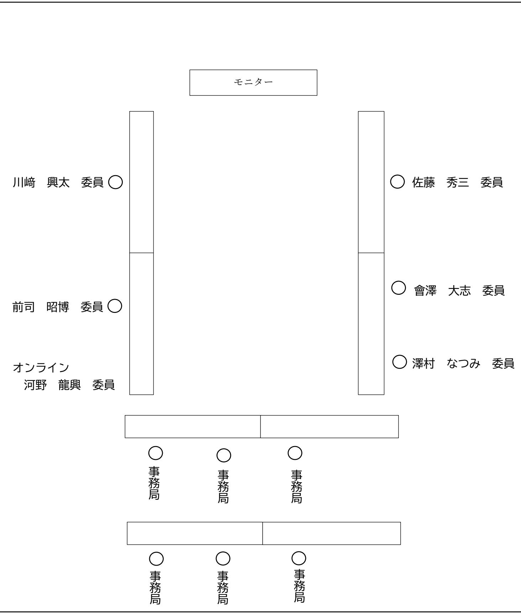
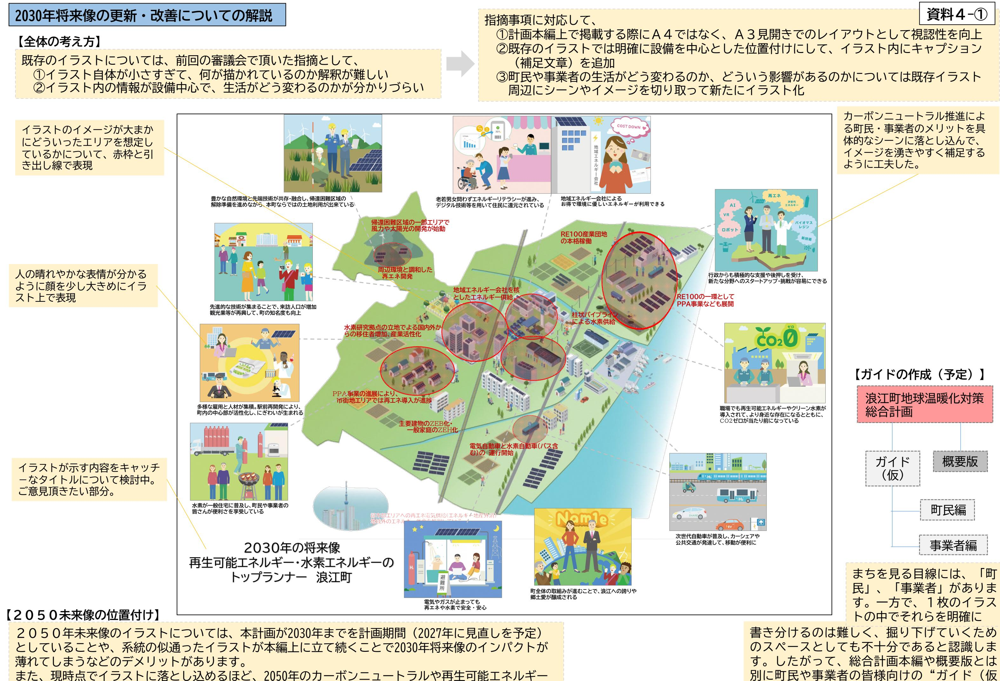
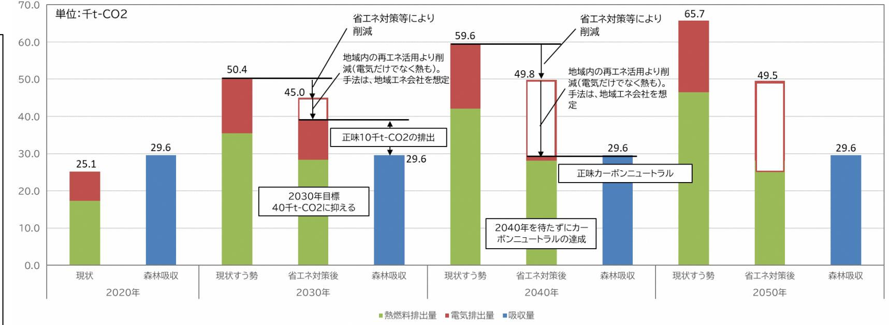
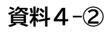
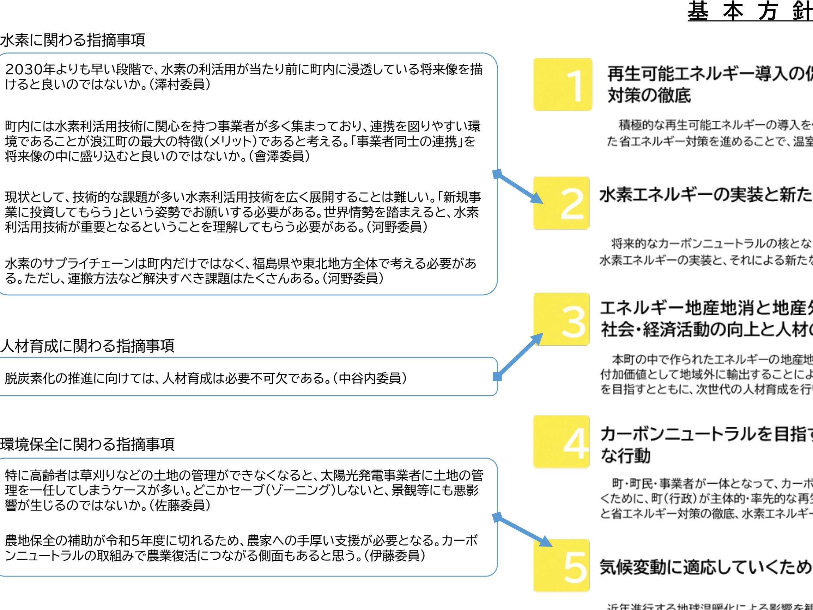
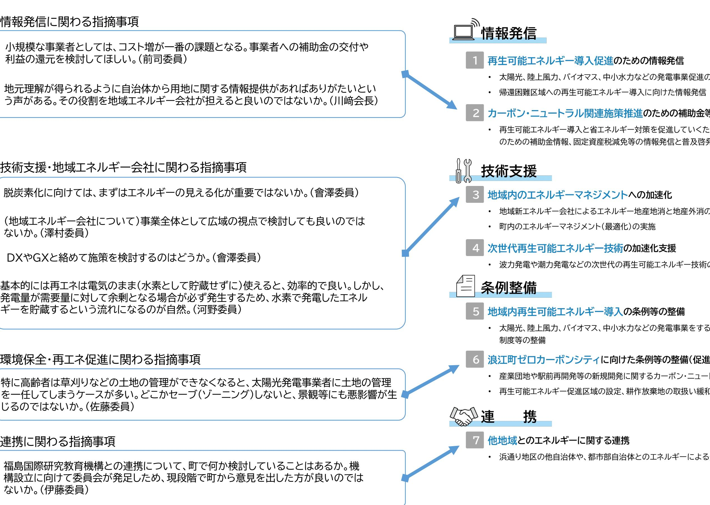
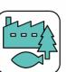
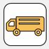

# 令和4年度第2回浪江町環境審議会

- (仮称)浪江町地球温暖化対策総合計画第2回計画策定委員会 -

日にち:令和 4 年 12 月 22 日(木) 場所:浪江町役場 301 会議室

# 次第

- 1 開会挨拶
- 2 議題
- (1)前回指摘事項と対応方針
- ・資料説明および質疑応答
- (2)計画素案の内容に関する要点について
	- ・資料説明
- (3)(仮称)浪江町地球温暖化対策総合計画の素案について・資料説明
- (4)計画素案および全体を通しての質疑応答・意見交換
- (5)今後のスケジュール
	- ・パブリックコメントまでのスケジュール確認
	- ・次回の日程確認
- 3 閉会

### 配布資料

- 資料1:出席者名簿
- 資料2:座席表
- 資料3:前回指摘事項と対応方針
- 資料4:計画素案の内容に関する要点
- 資料5:(仮称)浪江町地球温暖化対策総合計画の素案
- 資料6:今後のスケジュール

# 出席者名簿

【浪江町環境審議会委員】

|           | 所 属                  | 氏 名                                  | 備考    |
|-----------|-------------------------|-----------------------------------------|-------|
|           | 福島大学共生システム理工学類          | かわ さき こう た 川 﨑 興 太 | 現地    |
| 学識 経験者 | 東京大学先端科学技術研究センター        | こうの たつ おき 河野 龍 興         | オンライン |
|           | 福島大学共生システム理工学類          | ごとう しのぶ 後藤 忍                   | 欠席    |
|           | 株式会社 伊達重機            | ぜんじ あきひろ 前司 昭博                 | 現地    |
|           | 株式会社 舞台ファーム          | いとう けいいち 伊藤 啓一                 | 欠席    |
| 事業者       | 株式会社 スマートアグリ・リレーションズ | なかやち よし あき 中谷内 美 昭       | 欠席    |
| 団体 町民  | 行政区長会                   | さとう ひでぞう 佐藤 秀三                 | 現地    |
|           | 會澤高圧コンクリート 株式会社      | あい ざわ たいし 會 澤 大志         | 現地    |
|           | 浪江町民                    | さわむら 澤村 なつみ                       | 現地    |

【事務局】

|      | 所 属               | 氏 名    |
|------|----------------------|-----------|
|      | 産業振興課 課長          | 清水 中   |
| 浪江町  | 産業振興課新エネルギー推進係 係長 | 小林 直樹  |
|      | 産業振興課新エネルギー推進係 主事 | 木原 可南子 |
|      | 国際航業株式会社             | 直井 隆行  |
| 委託業者 | 国際航業株式会社             | 近藤 隼人  |
|      | 国際航業株式会社             | 高橋 春那  |

【資料2】

座席表

浪江町役場 3 階 301会議室

# **浪江町第1回環境審議会指摘事項と対応方針**

| No. | 内容                                                                                                                     | 対応方針                                                                                                                                                                                                | 反映箇所                                                                                            |
|-----|------------------------------------------------------------------------------------------------------------------------|-----------------------------------------------------------------------------------------------------------------------------------------------------------------------------------------------------|-------------------------------------------------------------------------------------------------|
| 1   | 再エネ発電量は気候変動の影響を直接的に受けると考えられている。気候変動について計画書内で触 れるのであれば、気候変動と再エネ発電量の関係性についても触れた方が良いのではないか。                            | 気候変動が再エネポテンシャル量に与える影響はもちろんあると考えるが、日々進歩する技術についても モニタリングを行い、現状ポテンシャル量が小さい再エネも同様に導入可能性を検討する必要がある。 計画書上で触れるには専門性が高い内容のように感じるため、コラムとして載せる等の工夫を施しながら 計画書に反映する。                                   | P.36 コラム 非常に簡易な内容にして取り纏めま した。情報の真偽は再精査するとと もに、表現にも工夫の余地があると 認識しております。               |
|     | 2 将来像を定量的に整理できれば分かりやすくなるのではないか。                                                                                        | 数字の細かい内容については、巻末の参考資料パートに掲載することで対応する。本編はあくまでも簡潔に 読みやすい内容を心掛ける。                                                                                                                                   | 参考資料パートは現在取り纏め中 (パブコメ前の再回覧時までに準備 予定)                                                      |
| 3   | 2030年よりも早い段階で、水素の利活用が当たり前に町内に浸透している将来像を描けると良いの ではないか。                                                               | 行政として広域的な支援を行うことで町全体で水素の利活用や脱炭素化の取組を推進したいと考えてい る。民間事業者に任せきってしまうような方針とはしない。全国に先駆けて水素利用のモデル都市として、 エネルギー利用の高度化やゼロカーボンの達成が実現できていることを計画に記載する。また、そのための ロードマップや連携等を計画の中で位置づける。                    |                                                                                                 |
| 4   | 町民が自分事と捉えられるような、自分たちの将来の暮らしをイメージできるような将来像や目標があ ると良いのではないか。                                                          | 脱炭素化の推進によって町民の暮らしが大きく変わることはないと考えている。便利というよりは不便な 暮らしに変わると考えるが、重要なのは便利さよりも社会的責任を果たすことである。行政の役割は、いか に町民の脱炭素化に向けた取組に対して利益を還元するかであると考える。 設備の導入を通じて、安全安心で安価なエネルギー利用が実現できることを前面に押し出していく。最先端       | P.44-45 将来像としての視覚化 P.46 2 P.50 L5~10 すでにカーボンニュートラル達成状 況にあることを提示 P.55 D        |
| 5   | 2030年と2050年の将来像の違いが分かり辛い。行政だけではなく町民も一緒に取り組む計画を策 定するのであれば、町民の視点も取り入れた内容にする必要がある。                                     | の技術・再生可能エネルギーの導入を通じて何が町にもたらされるのか、までを描くことで将来像への理 解・共感が得られる内容とする。 将来像のそれぞれのシーンが小さくなってしまっているので、全体をパースとして示しながらも何が起こっ ているのか、イラストの見せ方やキャプションの追加で補足する。目線別(町民・事業者・農家・漁業者…etc) で描きたい未来をシーンとして示す。 | P.61 図39 P.82-83 図52・表14                                                                     |
| 6   | 町内には水素利活用技術に関心を持つ事業者が多く集まっており、連携を図りやすい環境であることが 浪江町の最大の特徴(メリット)であると考える。「事業者同士の連携」を将来像の中に盛り込むと良いの ではないか。           | 事業者に対しては、計画書をどんな人に読んで欲しいのか、最初に示すべきだという話もあったので、冒頭 の一番最初に概念図のようなものが示せないか検討する。企業同士の連携は、プラットフォームの設立等、 町との協議の上で施策や推進体制に位置付ける                                                                       | P.46 2 P.55 D No.22に関連し、今後の個別ガイド (町民編・事業者編)にて作成・掲載予 定                               |
|     | 7 脱炭素化の推進に向けては、人材育成は必要不可欠である。                                                                                          | 小中学生だけでなく、旧町民や意識の高い新町民まで様々な人に主体性を持ってもらうための多種多様な 教育プラグラムなどが考えられる。市民講座の開設、それに対する進出企業からの協力獲得等、浪江町でし か提供できない内容を大事にする。                                                                             | P.46 3 人材育成に伴う内容として設定 P.74 3 広報・啓発の中に環境教育を内包 P.83 表14 庁内職員の人材教育に言及               |
|     | 8 バイオチャーをクレジットとして売買するのはどうか。                                                                                            | 炭素貯留等の個別具体の話がまだ落とし込めていないので、当然すすめていくべきと考える。環境価値取 引は経済的合理性の追求の面で不可欠な要素であり、両立していく。 計画の中で個別具体に章立てなどを行って触れるものではなく、施策の中に多種多様なクレジットの売買 を組みこむことで対応する。                                              | P.55 B クレジットと明言はしていないもの の、森林吸収クレジットやブルーカー ボンなども含め、農林水産業から生 まれる価値のクレジットとして位置付 けた。 |
| 9   | 農地保全の補助が令和5年度に切れるため、農家への手厚い支援が必要となる。カーボンニュートラル の取組みで農業復活につながる側面もあると思う。                                              | 区域施策編もしくは気候変動適応計画の中でも触れることとする。総合計画として、単なる農家への支援を 位置づけるのではなく、エネルギーやゼロカーボンとの関連付けやストーリー性を検討する必要がある。                                                                                                 | P.55 B                                                                                          |
|     | 10 経済面以外のメリット(関係人口の増加)などについても整理し、提示する必要がある。                                                                            | No.4・5に関連して、地球温暖化対策・エネルギー政策を進める事によって、町にどんな波及効果があるの か、全体像が分かるような将来像といった見せ方と内容の工夫を行う。根幹に当たる部分なので、計画書上 では冒頭で触れていく。                                                                               | P.44-45 追記・改変にて対応。(ただし、計画書 上のバランスに鑑みて冒頭ではな く、中段に掲載とした。)                                |
|     | 11 小規模な事業者としては、コスト増が一番の課題となる。事業者への補助金の交付や利益の還元を検討 してほしい。                                                            | 町として出来る事、出来ないことがあると思うので、それをどこまで計画に書き込むか検討する。                                                                                                                                                        | P.54 2 補助関連について記載                                                                            |
| 12  | 現状として、技術的な課題が多い水素利活用技術を広く展開することは難しい。「新規事業に投資しても らう」という姿勢でお願いする必要がある。世界情勢を踏まえると、水素利活用技術が重要となるとい うことを理解してもらう必要がある。 | 水素の情勢については、序章の部分で動向含めて整理していく。                                                                                                                                                                       | P.16 コラム コラムとして新たに水素の状況と、浪 江町で推進していく意義を表記しま した。 P.46 2 P.55 D                    |

# 資料3

# **浪江町第1回環境審議会指摘事項と対応方針**

# 資料3

| No. | 内容                                                                                                                   | 対応方針                                                                                                                                                        | 反映箇所                                                                                 |
|-----|----------------------------------------------------------------------------------------------------------------------|-------------------------------------------------------------------------------------------------------------------------------------------------------------|--------------------------------------------------------------------------------------|
|     | 13 水素のサプライチェーンは町内だけではなく、福島県や東北地方全体で考える必要がある。ただし、運搬 方法など解決すべき課題はたくさんある。                                            | 時間軸で整理すべきなので、ロードマップにて示す。ただし、地域エネルギー会社の事業内容とラップする ので、整合を取ることを意識する。                                                                                        | P.46 2 P.55 D P.61 図39 県単位でや東北エリア単位でのサプ ライチェーン構築を以下にロードマッ プに反映するかは議論中 |
|     | 14 非常時に町民がまちのエネルギーを使える「自立分散型のまち」となる将来像を2030年までに描きた い。                                                             | No.4・5・9に共通。                                                                                                                                                | P.44-45 追記・改変にて対応                                                                 |
| 15  | 風力発電は日中の発電量よりも夜間の発電量の方が大きい傾向があるため、日中しか発電しない太陽 光発電と併せて導入すると安定した発電量となる。太陽光発電と風力発電の両方の導入をセットで検討 するのはどうか。          | 現行の再エネ推進計画では、ポテンシャル上では自然が豊かで水力や風力がベース電源としてミックスして いけると記している。いきなり全域は出来ないので順番に役場、駅前、研究拠点から取り組んでいく。                                                          | P.83 風力までを視野に入れるかは庁内で も検討中                                                     |
| 16  | 基本的には再エネは電気のまま(水素として貯蔵せずに)使えると、効率的で良い。しかし、発電量が需要 量に対して余剰となる場合が必ず発生するため、水素で発電したエネルギーを貯蔵するという流れにな るのが自然。         | 町としても水素単体ではなく再エネとセットで検討を進めていくつもりである。しかし、水素利活用技術に も将来性があるということを計画書の中で示していく。                                                                               | P.54 3 P.61 L1~3(+図39)                                                            |
|     | 17 特に高齢者は草刈りなどの土地の管理ができなくなると、太陽光発電事業者に土地の管理を一任して しまうケースが多い。どこかセーブ(ゾーニング)しないと、景観等にも悪影響が生じるのではないか。                  | 一定の規制はできるが、現状としてPVの導入自体を制限することはできない。また、浪江町の脱炭素化に 向けては、現段階では「規制」ではなく「規制緩和」の方が重要と考えている。 町内では耕作放棄地以外にも以前宅地だった場所など、未利用地は非常に増加している状況。                      | P.46 5 P.54 6 P.62 コラム 促進地域コラムでの紹介と実施予定 について言及。                          |
|     | 18 福島国際研究教育機構との連携について、町で何か検討していることはあるか。機構設立に向けて委員 会が発足しため、現段階で町から意見を出した方が良いのではないか。                                | まだ具体な話は未定のため、立地する機構側も現在検討中の状況で、これから予算取りの段階である。機 構側の提案を待つのではなく、町側の考えを整理して持ち込めるようにしたい。 計画の中で個別具体に章立てなどを行って触れるものではなく、施策の中に機構との連携に関係するもの を組みこむことで対応する。 | P.54 7 文脈としては「連携」の中に内包する 形とした。                                                 |
|     | 19 アセットを持つことのリスクはあるが、自社電源を持つことも必要であり、双方のバランス・割合が最も 気にすべき点                                                         |                                                                                                                                                             | P.54 2・3 「補助金等」としているが、周辺情報 として指摘事項を内包するものと位                                    |
|     | 20 (地域エネルギー会社について)事業全体として広域の視点で検討しても良いのではないか。                                                                        | 地域エネルギー会社の設立に係る部分として、検討を進める。                                                                                                                                | 置付け                                                                                  |
|     | 21 地元理解が得られるように自治体から用地に関する情報提供があればありがたいという声がある。その 役割を地域エネルギー会社が担えると良いのではないか。                                      |                                                                                                                                                             | 地域エネルギー会社の設立検討/ パートナー企業公募/パートナー企業 との協議の中で、事業計画等に盛り 込むべき内容でもある               |
| 22  | 総合計画は最終的に行政計画としてまとめることになるが、本編と概要版が一般的であるが、今日の議 論を受けて「町民版」や「事業者版」のような本編と概要版の中間レベルの計画書を作成するなど、工夫 して分かりやすくとりまとめる。 | 最終的な取り纏めの方法である。パブコメ完了後に内容がおおかた固まってきた段階で、抜粋するパート等 を検討し、それぞれ作成を進める。                                                                                        | 計画素案が概ね固まった段階で中間 レベルの計画書(ガイド)の作成に入 る。                                          |

# **カーボンニュートラル推進部**

**カーボンニュートラル・コンサルティングG**

# **第2回計画策定委員会計画素案に対する要点について**

**2022/12/22**

**【資料構成】**

**①2030年将来像の更新・改善についての解説 ②実行計画区域施策編の目標設定に係る検討 ③前回の指摘事項を加味した基本方針・施策 ④施策に対するKPI指標について**

称)"の作成を検討中。(A3版数枚程度)

# **2030年将来像の更新・改善についての解説**

①イラスト自体が小さすぎて、何が描かれているのか解釈が難しい ②イラスト内の情報が設備中心で、生活がどう変わるのかが分かりづらい (補足文章)を追加

また、現時点でイラストに落とし込めるほど、2050年のカーボンニュートラルや再生可能エネルギー技術について予見性が無いことから、本編ではなく、巻末の資料編に掲載することとしました。

**実行計画区域施策編の目標設定に係る検討資料4-②**

計画素案P.49

様々な自治体で地球温暖化対策実行計画(区域施策編)が策定されている状況ですが、福島県浜通りエリアを中心とする、東日本大震災の被災エリアにおいては、通常の手法と同様に目標策定を行うことが現実的ではないことを説明しています。

現状の森林吸収量を算定すると、温室効果ガス排出量よりも森林吸収量の方がやや多く、カーボンニュートラルの状況になっていることを記載しています。 一方で、帰還人口や経済活動の状況から町の目指す本当の姿とはなっていない状況でのカーボンニュートラルであり、町の賑わいが戻ってくると2030年には森林吸収量よりも温室効果ガス排出量が多くなることを記載してます。

今後、復興が進展していくにつれて、温室効果ガスの排出量は増加していきますが、基準年度の設定は、震災前(2010年度)もしくは国目標(2013年度)が適切なのかの判断が難しい状況となります。

| 部門  | 2013 年度 排量量 基準年度 | 項目               | 2020 年度 | 2030 年度 | 2040 年度 | 2050 年度 |
|-----|------------------------|------------------|---------|---------|---------|---------|
| 産業  |                        | 排元量 (+t-CO2)  | 9.6     | 17.2    | 20.3    | 23.5    |
|     | 0.7                    | 变化率 (2013年度比) | 1219%   | 2251%   | 2678%   | 3110%   |
| 業務  |                        | 排山重 (+t-CO2)  | 7.1     | 12.6    | 14.9    | 17.3    |
|     | 5.0                    | 变化率 (2013年度比) | 43%     | 154%    | 200%    | 247%    |
|     |                        | 排出量 (千t-CO2)  | 2.4     | 6.7     | 7.7     | 6.8     |
| 家庭  | 0.0                    | 爱化率 (2013年度比) | -       | -       | -       | -       |
|     |                        | 排山重 (+t-CO2)  | 6.0     | 13.8    | 17.0    | 17.6    |
| 運輸  | 0.0                    | 变化率 (2013年度比) | -       | -       | -       | -       |
| 廃棄物 |                        | 排出量 (+t-CO2)  | 0.1     | 0.5     | 0.6     | 0.5     |
| ※参考 | 0.0                    | 变化率 (2013年度比) | -       | -       | -       | -       |
| 合計  | 5.7                    | 排行量 (+t-CO2)  | 25.3    | 50.8    | 60.5    | 65.7    |
|     |                        | 变化率 (2013年度比) | 344%    | 790%    | 960%    | 1052%   |

**実行計画区域施策編の目標設定に係る検討資料4-②**

計画素案P.50

2030年度の目標は、森林吸収との兼ね合いで、40千t-CO2の排出量(正味10千t-CO2の排出量)でカーボンニュートラルに向けた達成率50%と設定しました。 カーボンニュートラル達成率は、50.4-29.6=20.8千t-CO2の排出量に対して、10千t-CO2の正味の排出量としての達成率として設定しました。

目標は、削減目標ではなく、抑制目標としました。

カーボンニュートラルの目標は、2040年度を待たずしてという表現としています。 また、その時の達成率は100%となります。 上図の2040年時点で言えば、30.0千t-CO2(59.6-29.6)の排出量に対し、省エネ対策やエネルギー地産地消により削減するという考え方としています。

このそれぞれの目標の持つ意味として、現状カーボンニュートラルの状況ではあるものの、復興の道半ばであることから浪江町が目指す「真のカーボンニュートラル」とは言えない状況と考えます。

将来、2030年と2040年は新たな町の賑わいや復興が進んでいくことを見込む中で、生活の利便性やにぎやかさが従前に戻る過程でいったんはカーボンニュートラルから離れるものの、2040年より早期に「真のカーボンニュートラル」をみずから勝ち取ることを計画の中で表現しました。

⇒ 計画素案P.41の基本理念にも同様の内容を示しています。

前回の委員会において、指摘を受けた内容を加味して、基本方針に内包。

**資料4-③**

前回の委員会において、指摘を受けた内容を加味して、施策に内包しています。

# **共通施策**

# **前回の指摘事項を加味した基本方針・施策資料4-③**

前回の委員会において、指摘を受けた内容を加味して、施策に内包しています。

2030年よりも早い段階で、水素の利活用が当たり前に町内に浸透している将来像を描けると良いのではないか。(澤村委員)

町内には水素利活用技術に関心を持つ事業者が多く集まっており、連携を図りやすい環境であることが浪江町の最大の特徴(メリット)であると考える。「事業者同士の連携」を将来像の中に盛り込むと良いのではないか。(會澤委員)

現状として、技術的な課題が多い水素利活用技術を広く展開することは難しい。「新規事業に投資してもらう」という姿勢でお願いする必要がある。世界情勢を踏まえると、水素利活用技術が重要となるということを理解してもらう必要がある。(河野委員)

農地保全の補助が令和5年度に切れるため、農家への手厚い支援が必要となる。カーボンニュートラルの取組みで農業復活につながる側面もあると思う。(伊藤委員)

水素のサプライチェーンは町内だけではなく、福島県や東北地方全体で考える必要がある。ただし、運搬方法など解決すべき課題はたくさんある。(河野委員)

# 水素に関わる指摘事項

DXやGXと絡めて施策を検討するのはどうか。(會澤委員)

脱炭素化に向けては、まずはエネルギーの見える化が重要ではないか。(會澤委員)

(地域エネルギー会社について)事業全体として広域の視点で検討しても良いのではないか。(澤村委員)

基本的には再エネは電気のまま(水素として貯蔵せずに)使えると、効率的で良い。しかし、発電量が需要量に対して余剰となる場合が必ず発生するため、水素で発電したエネルギーを貯蔵するという流れになるのが自然。(河野委員)

# エネルギーマネジメントに関わる指摘事項

# 農林水産業に関する指摘事項

# **部門別施策**

| 普及促進 |  |
|------|--|
|      |  |

# **施策に対するKPI指標について資料4-④**

目標・期限については、KPI指標の内容と削減目標・2030年の到達イメージから、逆算をして概数を精査する予定です。

検討した各施策について、計画推進のため、進捗を管理するための指標(KPI;KeyPerformanceIndicator、重要業績評価指標)を設定しました。 KPI指標について、内容の追加や削除についてご意見を頂きたいです。

# **各部門における施策**

### **共通施策** 計画素案P.●

| 各部門の施策                                   | KPI指標(内容)                                   | 現状                        | 目標                                   | 直掲 (年度) |
|------------------------------------------|---------------------------------------------|---------------------------|--------------------------------------|------------|
| A. 新規産業団地の                               | RE100 産業団地の竣工・稼働 開始                      | 用し                        | 1 同地の 稼働開始                        | 2030       |
| RE100 化と既存産業 団地、製造業・建設業等              | 再工不電気・水素の供給                                 | ●件                        | 5件                                   | 2030       |
| の省工ネの推進                                  | 産業団地立地企業のエネルギ 一使用量の把握                    | 無し                        | 把握率 100%                          | 2030       |
| B.再生可能エネルギ- を活用した農林水産業 の発展         | 農林水産業に関連する再エネ 発電の導入・検討                   | 1 件検討中                    | 7件                                   | 2030       |
|                                          | ZEB相談窓口の開設                                 | 無し                        | 開設                                   | 2025       |
|                                          | 事業所ビルZEB化の実現件 教                        | 無し                        | 10 件以上                               | 2030       |
| C.建物ZEB化の推進                            | 公共施設のZEB化の実現件 载                        | 1 件                       | 5 件以上                                | 2030       |
|                                          | 福島県地域まるごと省エネ計 画の活用                       | 用し                        | 3 件以上                                | 2030       |
|                                          | FH2Rの運営方策の明確化                              | 木定                        | 明確化                                  | 2030       |
| D.水素製造・運用の推 進と需要設備の整備                 | 水素設備の導入・供給                                  | 工場:無し 事業所:2 件 家庭:●件 | 工場:10 件以上 事業所:10 件以上 家庭:10 件以上 | 2030       |
|                                          | PPA事業アライアンス先開拓                             | 0 社                       | 5社以上                                 | 2025       |
| E.オンサイトPPA事 業・オフサイトPPA事 業の普及促進 | オンサイトPPA事業(自家消 费型)実施                   | 工場:無し 事業所:無し 家庭:無し  | 工場:10 件以上 事業所:10 件以上 家庭:10 件以上 | 2030       |
|                                          | オフサイトPPA事業実施                              | 業し                        | 5 件以上                                | 2030       |
| F.駅前再開発のカーボ ンニュートラル化                  | 環境省「脱炭素先行地域」への 採択                        | 申請予定                      | 採択                                   | 2025       |
| (脱炭素先行地域への 取組み)                       | カーボンニュートラル街区創設                              | 検討中                       | 創設                                   | 2025       |
|                                          | ZEH相談窓口の開設                                 | 無し                        | 開設                                   | 2025       |
| G.家庭の省エネルギ 改修および再生可能』 ネルギー導入の促進    | ZEH住宅の実現件数                                 | 無し                        | 30 件以上                               | 2030       |
|                                          | 既存住宅の太陽光・蓄電池設備 の導入、断熱改修や高効率機器 の導入等の推進 | ●件                        | 30 件以上                               | 2030       |
| H.水素ステーション・                              | 水素ステーション整備数                                 | ●件                        | 5 箇所                                 | 2030       |
| EVステーションの整備                             | EVステーション整備数                                | ●件                        | 5 箇所                                 | 2030       |

| 表 3 共通施策におけるKPI指標         |                                                     |        |      |            |  |  |  |  |  |
|-----------------------------|-----------------------------------------------------|--------|------|------------|--|--|--|--|--|
| 共通施策                        | KPI指標(内容)                                           | 現状     | 目標   | 期限 (年度) |  |  |  |  |  |
| 1.再生可能エネルギー導                | 発信媒体の確立                                             | 無し     | 3 件  | 2023       |  |  |  |  |  |
| 入促進のための情報発信                 | 太陽光、陸上風力、バイオマス、中小水 力などの発電事業促進の情報発信               | 無し     | 6件/年 | 2030       |  |  |  |  |  |
| 2.カーボンニュートラル関               | 情報発信の仕組み構築                                          | 無し     | 構築   | 2023       |  |  |  |  |  |
| 連施策推進のための補助 金等の情報発信      | コスト軽減のための補助金情報発信                                    | 無し     | 2件/年 | 2024       |  |  |  |  |  |
|                             | 固定資産税減免等の税制優遇の検討                                    | 無し     | 実施   | 2025       |  |  |  |  |  |
| 3.地域内のエネルギーマ                | 地域エネルギー会社の創設                                        | 無し     | 創設   | 2023       |  |  |  |  |  |
| ネジメントへの加速化                  | 町内のエネルギーマネジメント(最適化) の仕組み構築                       | 無し     | 構築   | 2025       |  |  |  |  |  |
| 4.次世代再生可能エネル ギー技術の加速化支援  | 洋上風力発電や波力発電、潮力発電等 の次世代技術の検討と実施                   | 実証 1 件 | 3件   | 2030       |  |  |  |  |  |
|                             | 再エネ事業の届け出制度の条例整備                                    | 無し     | 1 件  | 2024       |  |  |  |  |  |
| 5.地域内再生可能エネル ギー導入の条例等の整備 | RE100 産業団地の造成に関わる条例 の整備                          | 検討中    | 1 件  | 2025       |  |  |  |  |  |
|                             | 耕作放棄地の取扱い緩和措置の整備                                    | #      | 1 件  | 2025       |  |  |  |  |  |
| 6.浪江町ゼロカーボンシ ティに向けた条例等の整 | RE100 産業団地や駅前再開発等の新 規開発に関するカーボンニュートラルに 向けた条例化 | #1     | 条例化  | 2024       |  |  |  |  |  |
| 備(促進区域の設定)                  | 町内の促進区域の設定                                          | 検討中    | 設定   | 2024       |  |  |  |  |  |
| 7.他地域とのエネルギ- に関する連携      | 地産外消先との連携確立                                         | 検討中    | 3件   | 2025       |  |  |  |  |  |
|                             |                                                     |        |      |            |  |  |  |  |  |

計画素案P.● 共通施策は早期に、部門別は着実に重点をおいて実施していく内容です。 共通施策は、条例や届け出制度などの仕組み構築なども注力する必要があります。

| 第1章. 浪江町地球温暖化対策総合計画策定の背景・意義 …………………………………………………………………………………………………………………………………………………………………………………………………………………………………………………………………………………………………………………………………………………………………………………………………         |  |
|---------------------------------------------------------------------------------------------------------------------------------------------------------------------------------------|--|
| 1.1 地球温暖化対策を巡る動向……………………………………………………………………………………………………………………………………………………………………………………………………………………………………………………………………………………………………………………………………………………………………………………………………………………………………………  |  |
| 本町の地域の特性(自然・社会・経済の特徴) 1.2                                                                                                                                                          |  |
| 浪江町地球温暖化対策総合計画の策定意義と位置づけ………………………………………………………………………………… 23 1.3                                                                                                                     |  |
| 第2章. 浪江町の温室効果ガス排出量の現況と将来推計……………………………………………………………………………………………………………………………………………………………………………………………………………………………………………………27                                                              |  |
| 温室効果ガス排出量の現況把握…………………………………………………………………………………………………………………………………………………………………………………………………………………………………………………………………………………………………………………………… 27 2.1                                       |  |
| 温室効果ガス排出量の将来推計 …………………………………………………………………………………………………………………………………………………………………………………………………………………………………………………………………… 28 2.2                                                           |  |
| 森林による温室効果ガス吸収量 2.3                                                                                                                                                                 |  |
| 第3章. 再生可能エネルギーの導入ポテンシャルと地域特性………………………………32                                                                                                                                            |  |
| 3.1 再生可能エネルギー導入ポテンシャル                                                                                                                                                                 |  |
| 再生可能エネルギーに関わる地域特性……………………………………………………………………………………………………… 37 3.2                                                                                                                    |  |
| 復興まちづくりやカーボンニュートラルに向けた地域の現状と課題の整理…… 39 3.3                                                                                                                                         |  |
| 第4章本町の目指す将来像と基本方針 …………………………………………………………………………………………………………………………………………………………………………………………………………………………………………………………………………………………………………………………………………………………………………………………………………………………         |  |
| 4.1 基本理念                                                                                                                                                                              |  |
| 4.2 基本理念に基づき目指す将来像                                                                                                                                                                    |  |
| 基本方針 4.3                                                                                                                                                                           |  |
| 第5章. 目標設定と達成に向けた施策                                                                                                                                                                    |  |
| 本計画における目標設定………………………………………………………………………………………………………………………………………………………………………………………………………………………………………………………………………………………………………………………………………………………………………………………………………………………………………………… 5.1 |  |
| 温室効果ガス排出量の抑制目標 --------------------------------------------------------------------------------------------------------------------------------------------------------------- 5.2 |  |
| 再生可能エネルギーの導入目標 -------------------------------------------------------------------------------------------------------------------------------------------------------------- 5.3  |  |
| 目標達成にむけた施策 ………………………………………………………………………………………………………………………………………………………………………………………………………………………………………………………………………………… 54 5.4                                                          |  |
| 施策に対するKPI指標 5.5                                                                                                                                                                  |  |
| 5.4 2030 年の将来像の実現に向けた取組み……………………………………………………………………………………………………………………………………………………………………………………………………………………………………………………………………………………………………………………………………………………………………………………………………………         |  |
| 5.5 ロードマップ                                                                                                                                                                            |  |
| 第6章. 浪江町の地球温暖化対策の適応策……………………………………………………………………………………………………………………………………………………64                                                                                                        |  |
| 6.1 適応策とは……………………………………………………………………………………………………………………………………………………………………………………………………………………………………………………………………………………………………………………………………………………………………………………………………………………………………………………         |  |
| 適応策に関わる基本的事項………………………………………………………………………………………………………………………………………………………………………………………………………………………………………………………………………………………………………………………………………………………………………………………………………………………………………… 6.2   |  |
| 気候変動に関する影響 ……………………………………………………………………………………………………………………………………………………………………………………………………………………………………………………………………………………………………………………………………………………………………………………………………………………………………………… 6.3  |  |
| 第7章. 浪江町公共施設における率先的行動                                                                                                                                                                 |  |
| 7.1 はじめに ……………………………………………………………………………………………………………………………………………………………………………………………………………………………………………………………………………………………………………………………………………………………………………………………………………………………………………………         |  |
| 温室効果ガス排出量と削減目標 -------------------------------------------------------------------------------------------------------------------------------------------------------------- 7.2  |  |
| 温室効果ガス排出削減に向けた対策・施策 7.3                                                                                                                                                            |  |
| 第8章資料編                                                                                                                                                                               |  |

# **第2回計画策定委員会今後のスケジュール**

**カーボンニュートラル推進部カーボンニュートラル・コンサルティングG**

**2022/12/22**

# **計画策定のスケジュール**

|                        | 月  | 12月 |   | 1月                 |   |   |   | 2月                                |   |   |   | 3月 |                                       |   |      |   |
|------------------------|----|-----|---|--------------------|---|---|---|-----------------------------------|---|---|---|----|---------------------------------------|---|------|---|
|                        | 週数 | 4   | 5 | 1                  | 2 | 3 | 4 | 5                                 | 1 | 2 | 3 | 4  | 1                                     | 2 | 3    | 4 |
| 第2回 策定委員会           |    |     |   | 12月22日(計画素案に関する議論) |   |   |   |                                   |   |   |   |    |                                       |   |      |   |
| パブリックコメント 前の計画素案の回覧 |    |     |   |                    |   |   |   | 1/16の週パブリックコメント内容の回覧・指摘事項確認(各委員へ) |   |   |   |    |                                       |   |      |   |
| パブリックコメント の実施       |    |     |   |                    |   |   |   | 1/23~2/3(2週間のパブリックコメント募集)         |   |   |   |    |                                       |   |      |   |
| パブリックコメントの意 見対応方針   |    |     |   |                    |   |   |   |                                   |   |   |   |    | 2/6~2/10パブリックコメントの 意見対応方針の共有(各委員へ) |   |      |   |
| 第3回 策定委員会           |    |     |   |                    |   |   |   |                                   |   |   |   |    | 2月27の週 (計画案の確定)                    |   | 開催予定 |   |

# **計画策定の流れのまとめ(前回資料から一部修正)**

**到達点**

① 浪江町特有の事情や地域

② 計画策定に向けた不足事

③ 自由で闊達な議論が行わ

れる会合の雰囲気の形成

性への理解と共感

項の棚卸し

# 第1回 (11月-前回)

- ① 委員・事務局の顔合わせと懇親 ② 環境審議会開催(計画策定)に係る認識合わせ ③ 昨年度までの検討状況の理解 ④ 計画骨子(案)全体に対する意見出し
- ⑤ 気候変動適応計画・事務事業編で必要な視点の共有 (追加調査で必要な内容)

# 第2回 (12月-今回)

- ① 第1回での指摘事項への対応状況確認
- ② 計画の目標値設定に関する考え方
- ③ 基本方針や個別の施策内容に関する意見交換
- ④ 計画の進捗確認・モニタリング手法に関する意見交換
- ⑤ 計画素案に対する意見交換

# 第3回 (2月下旬予定)

- ① 第2回での指摘事項への対応状況確認
- ② パブリックコメントの実施結果の共有
- ③ 計画素案(最終案)の読み合わせと内容調整
- ① 計画素案全体の構成に対する承認の獲得
- ② 個別具体の内容に対する意見集約と計画への反映
- ③ 議論が必要な事項の深堀とその方向性の獲得

① 計画に対する委員からの承認獲得

