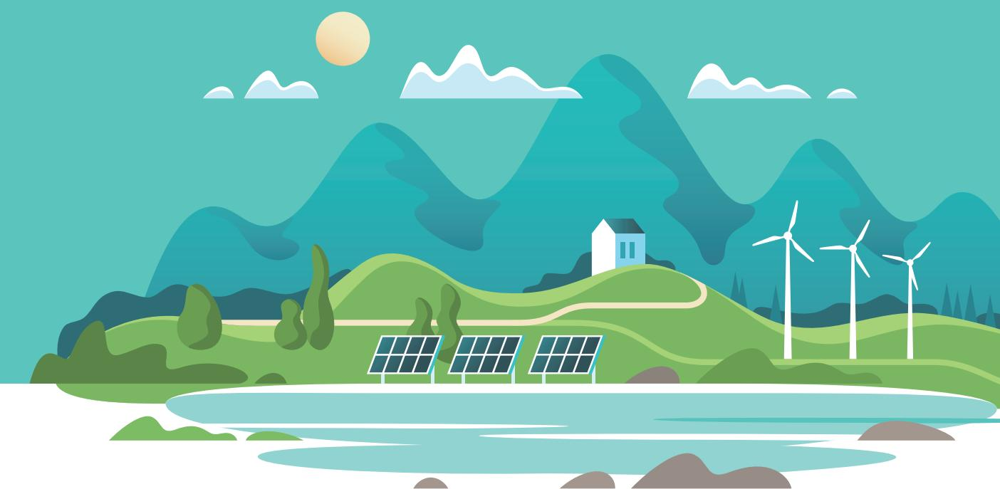
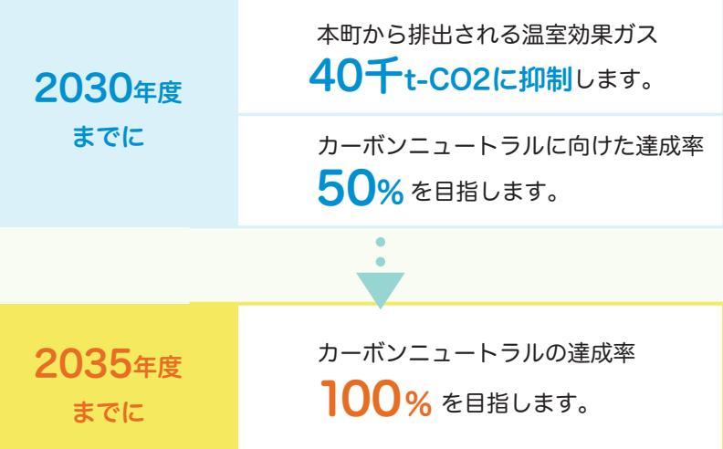

#### 令和4年度第3回浪江町環境審議会

(仮称)浪江町地球温暖化対策総合計画第3回計画策定委員会一 |

> 日にち:令和5年2月28日(火) 場所:浪江町役場 402 会議室

#### 次第

- 開会挨拶ー
- 2 議題
- (1) 前回審議会及びパブリックコメントにおける指摘事項と対応方針
	- ・資料説明
	- ・質疑応答・意見交換
- (2)(仮称)浪江町地球温暖化対策総合計画(案)について
	- ・資料説明
	- ・質疑応答・意見交換
- (3) 計画案および全体を通しての質疑応答・意見交換
- (4) 今後のスケジュール
	- ・審議会での指摘事項の反映と再回覧
	- ・来年度環境審議会の予定

#### 3 閉会挨拶

| 配布資料                     |  |
|--------------------------|--|
| 資料 1 :出席者名簿              |  |
| 資料2:座席表                  |  |
| 資料3:前回審議会での指摘事項と対応方針     |  |
| 資料4:パブリックコメントでの指摘事項と対応方針 |  |
| 資料5:(仮称)浪江町地球温暖化対策総合計画   |  |
| 資料6:総合計画ガイド版(町民編)        |  |
| 資料7:総合計画ガイド版(事業者編)       |  |
| 資料8:今後のスケジュール            |  |

#### 出席者名簿

【浪江町環境審議会委員】

|          | 所 属                  | 氏 名    | 備 考 |
|----------|-------------------------|-----------|--------|
|          | 福島大学共生システム理工学類          | 川﨑 興太  |        |
| 学識       | 東京大学先端科学技術研究センター        | 河野 龍興  | オンライン  |
| 経験者      | 福島大学共生システム理工学類          | 後藤 忍   | オンライン  |
|          | 株式会社 伊達重機            | 前司 昭博  |        |
|          | 株式会社 舞台ファーム          | 伊藤 啓一  | オンライン  |
| 事業者      | 株式会社 スマートアグリ・リレーションズ | 中谷内 美昭 |        |
| 団体 町民 | 行政区長会                   | 佐藤 秀三  |        |
|          | 會澤高圧コンクリート 株式会社      | 會澤 大志  | 欠席     |
|          | 浪江町民                    | 澤村 なつみ |        |

【事務局】

|      | 所 属               | 氏 名    |
|------|----------------------|-----------|
| 浪江町  | 産業振興課 課長          | 清水 中   |
|      | 産業振興課新エネルギー推進係 係長 | 小林 直樹  |
|      | 産業振興課新エネルギー推進係 主事 | 木原 可南子 |
| 委託業者 | 国際航業株式会社             | 直井 隆行  |
|      | 国際航業株式会社             | 近藤 隼人  |
|      | 国際航業株式会社             | 高橋 春那  |

【資料2】

座席表

浪江町役場 4 階 402 会議室

## 資料3

#### **前回審議会での指摘事項と対応方針**

浪江町第2回環境審議会論点事項リスト 2023/4/4

| No. | 内容                                                                                                                                                                                          | 審議会中の事務局(浪江町・国際航業)の回答                                                                                                                                | 対応方針・考え方                                                                                                               |
|-----|---------------------------------------------------------------------------------------------------------------------------------------------------------------------------------------------|------------------------------------------------------------------------------------------------------------------------------------------------------|------------------------------------------------------------------------------------------------------------------------|
| 1   | 町の人に対するメリットを将来像のイラスト1ページで理解してもらおうとするのは難しいので、 作成予定のガイド版で対応できれば良い。資料が誰のために誰に向けて何のために作っているかが 曖昧になっている。1つですべてを見れるようにしなくてもいいのではないか。                                                        | 計画素案の内容も詰めさせていただきつつ、誰のためにという部分がポイントなので、計画の内容がオーソ ライズいただけた段階でお示しできる機会を作りたい。                                                                        | ガイド版(町民編)、ガイド版(事業者編)の作成により対応。                                                                                          |
| 2   | 作成した後の冊子物をどのように見てもらえるように届けるかが重要。町のホームページに載って も届いていないケースがある。                                                                                                                              | 概要版やガイド版は広報紙と合わせて全戸配布をすることになる。その後も広報が届かない方にもしっかり 届けていくことが必要。情報のプラットフォーム的なものを作っていきたい。ふるさと納税を使ってプロ ジェクトを立ち上げるのもアイデアとして入れてもいい。                    | 計画策定後の具体施策の中で実施を検討、推進していく。                                                                                             |
| 3   | 専門用語が多いので、言葉の解説が必要。あまり文字が多くなく、見やすさ重視であれば読む気も 出てくると思う。明るい色で漫画のような見せ方をすると興味が出てくるかもしれない。                                                                                                    |                                                                                                                                                      | ガイド版(町民編)、ガイド版(事業者編)の作成により対応。                                                                                          |
| 4   | 将来像イラストがわかりにくい。 浪江の行政区域が南相馬に見えて仕方がないので、デザインの面で工夫できると良い。                                                                                                                                  |                                                                                                                                                      | 本編P.44-45 本編中のイラストの掲載について、サイズを大きくしてレイアウトした。 図面中にもキャプションを加え、わかりやすさの改善策とした。 内陸の帰還困難区域の行政界を修正+サイズ変更して行政界のわかりづらさを改善。 |
| 5   | カーボンニュートラルの実現は大変だが、福島、特に浪江から達成しなくては難しい。目標をもっ とアピールしてカーボンネガティブまでもっていく勢いで設定してはどうか。他の自治体で2040年 で100%達成、2035年で50%達成というところは結構あるので、無難に感じる。 浜通り地区の自治体に共通して、こういった目標が立てづらいのではないか。FREIの本格稼働も | 50%達成がどういう試算で、どのエリアは再エネ化しているよ等がわからないと何とも言えないと感じた。 目標が達成された時の電気とか燃料といったエネルギーの使い方がどうなっていれば、この目標が達成され るというところまで、書き下さないといけない。                      | 本編P.51 2030年の50%についてはどういう状況かについて本編にも記載。 委員のご意見も踏まえて、2035年をカーボンニュートラルの最終目標年度とした。                                     |
| 6   | 2030年前後で、結構大きな要素になる。変化の要因が大きいので、目標の意味合いや積み上げ式で やっていくことに無理があるのではないか。                                                                                                                      |                                                                                                                                                      |                                                                                                                        |
| 7   | 指標については後で検証ができるようにデータが取れないと意味がないわけですが、今日出されて いる案はデータ取れる確証はなさそう。データを取る体制の整備は、力のいる作業になると思う。                                                                                                | 引き続き精査はしていく。データを取るうえで一番重要になのは共通施策の中の届け出制度の条例整備と いった町民や事業者に協力していただき、なおかつデジタルで集約していける体制を作っていくこと。各部 門の施策については直ちにとれるものもあれば現状難しいものも混在している状況と理解している。 | 条例整備などの中で町民や事業者の自主的な取組を含めて、情報を把握する仕組みづくりに務め ていく。また、ガイド編の中で協力を呼び掛ける文言を入れて、理解促進を進める。                                  |
| 8   | FCVに興味ある人は多いが、価格面で乗らないという人は多い。ミライの中古車を200万円くらい で販売していることをアピールする方が有効なのかもしれない。                                                                                                             |                                                                                                                                                      | 情報発信に関する施策の中で連動して、水素自動車をアピールする機会を積極的に設けたい。                                                                             |
|     | それぞれの施策は予算との紐づけや整合が取れているのか。計画には書けないと思うが、施策を講 じるには資金が必要なのではないか。                                                                                                                           | すべてに対して予算が担保できているかといわれるとできていないものもたくさんある。ただ、環境省の脱 炭素先行地域や重点対策加速化事業を始め、環境系の補助メニューは豊富になっているので、この施策はこ の補助金を使えばいけるなというイメージはつけて記載をしている。              | 計画策定後の具体施策の中で実施を検討、推進していく。                                                                                             |
| 9   | デジタルだからこそできるムーブメントを創っていく必要がある。ブロックチェーンのような技術 を活用することで、取り組みに対して誰が、どの会社がやったのか、ムーブメントがどれくらいす ごいのかを可視化することが大事。                                                                            | 情報の透明性や公開性みたいなのをしっかり高めて、誰でも見られる情報プラットフォームを作る。                                                                                                        | 計画策定後の具体施策の中で実施を検討、推進していく。                                                                                             |
| 10  | 施策の中に子ども・環境教育関連が入っていなかったのが反省。子どもから大人が批判されるのが 一番影響があると思う。環境教育系の話もしっかり盛り込んだ方がいいと思うので、検討させてい ただきたい。                                                                                      |                                                                                                                                                      | 本編P.54 共通施策の中に教育の項目を追加。(合わせてロードマップなどにも明記)                                                                              |
|     | 11 子どもたちと一緒に学べるサロンがあるとよいのではないか。                                                                                                                                                             |                                                                                                                                                      | 本編P.54 共通施策の中に教育の項目を追加。 計画策定後の具体施策の中で実施を検討、推進していく。                                                                  |

#### 資料4

| 町からの同答 | (案) |
|--------|-----|

浪江町地球温暖化対策総合計画パブリックコメント回答案 2023/2/28

| No | 章・項        | 意見・要望                                                                                                                                                                                                                                                                                                                                                                                                                                                                                                                                                                                                                                                                                                                                                                                                                                              | 対応区分 | 町からの回答(案)                                                                                                                                              |
|----|------------|----------------------------------------------------------------------------------------------------------------------------------------------------------------------------------------------------------------------------------------------------------------------------------------------------------------------------------------------------------------------------------------------------------------------------------------------------------------------------------------------------------------------------------------------------------------------------------------------------------------------------------------------------------------------------------------------------------------------------------------------------------------------------------------------------------------------------------------------------|------|--------------------------------------------------------------------------------------------------------------------------------------------------------|
| 1  | 第3章 3.3 | P.39 産業-課題雇用の場・働く場と同じくいまから労働力の確保も課題にはならないでしょうか。                                                                                                                                                                                                                                                                                                                                                                                                                                                                                                                                                                                                                                                                                                                                                                                                   | 反映   | ご意見ありがとうございます。いただいたご意見を反映し、「復興とともに活性化 していく経済や産業を支える労働力の確保」を追加させていただきました。                                                                            |
| 2  | 第5章 5.3 | P.52 森林吸収クレジットの意味が分かりませんでした。                                                                                                                                                                                                                                                                                                                                                                                                                                                                                                                                                                                                                                                                                                                                                                                                                       | 反映   | 森林吸収クレジットは、「間伐などの森林の適切な管理を行うことによるCO2吸収量 をクレジットとして国が認証したもの」になります。こういった一般的でない用語 を取り扱う際には注記を設け、巻末の用語集に掲載いたします。                                      |
| 3  | 第5章 5.4 | P.54 条例整備乱開発を規制する内容も入れてほしいです。例えば、太陽光パネルの廃棄の責任、景観への配 慮、地盤への悪影響を考えた内容のものです。                                                                                                                                                                                                                                                                                                                                                                                                                                                                                                                                                                                                                                                                                                                                                                      | 参考   | ご指摘の個所のうち、「浪江町ゼロカーボンシティに向けた条例等の整備(促進区 域の設定)」は促進と同時に、町民の方の暮らしや町の自然を保全する一定の規制 (ゾーニング)を敷いていくことも検討しております。皆様の理解も得ながら、再 生可能エネルギーの取り組みを進めていきたいと思います。 |
| 4  | 第5章 5.4 | P.54 機構との模索 4~5年後には完成し、利用する皆様が移住してこられると思います?!が、早い段階で模索 され、2030年には実践されますか。                                                                                                                                                                                                                                                                                                                                                                                                                                                                                                                                                                                                                                                                                                                                                                       | 参考   | F-REIにつきましては、町内への立地が決まってから、町としてどういった連携や要 望をしていくかについて検討を行っています。機構関係者と密にコミュニケーショ ンを図りながら、早期の実践につなげてまいります。                                          |
| 5  | 第5章 5.6 | P.59(2)4行目 「必要」の前に「が」が要りませんか。                                                                                                                                                                                                                                                                                                                                                                                                                                                                                                                                                                                                                                                                                                                                                                                                                      | 反映   | ご指摘ありがとうございます。修正させていただきます。                                                                                                                             |
| 6  | 第6章 6.3 | P.71 4 適応策の文中 「関」の後のスペースは不要ですか。                                                                                                                                                                                                                                                                                                                                                                                                                                                                                                                                                                                                                                                                                                                                                                                                                    | 反映   | ご指摘ありがとうございます。修正させていただきます。                                                                                                                             |
| 7  | 第5章 5.7 | P.61 G2 日常的の対象となる一般家庭は町内に賃貸アパートなど多いかと思いますが、参加する方法はありま すか。                                                                                                                                                                                                                                                                                                                                                                                                                                                                                                                                                                                                                                                                                                                                                                                       | 参考   | 集合住宅への供給にあたっては、その手法について検討や実証を重ねている段階で すが、駅周辺整備エリアでモデル的な実装を目指しております。ここでのノウハウ の蓄積を一般家庭への普及の足がかりにしていきたいと考えています。                                     |
| 8  | 第6章 6.3 | P.67 海水温の資料は要らなかったでしょうか。                                                                                                                                                                                                                                                                                                                                                                                                                                                                                                                                                                                                                                                                                                                                                                                                                           | 反映   | ご意見ありがとうございます。資料に追加させていただきます。                                                                                                                          |
| 9  | 第6章 6.3 | P.71 4の適応策に悪質な開発を規制する内容は要らないでしょうか。                                                                                                                                                                                                                                                                                                                                                                                                                                                                                                                                                                                                                                                                                                                                                                                                                 | 参考   | ご意見ありがとうございます。いただいたご意見につきまして今後の具体的な施策 検討の参考とさせていただきます。                                                                                              |
| 10 | 第7章 7.3 | P.87 私的な飲食等のごみ、紙パックや包み紙等の持ち帰りは可能でしょうか。率先的な取り組みが必要だから でしょうか。                                                                                                                                                                                                                                                                                                                                                                                                                                                                                                                                                                                                                                                                                                                                                                                     | 参考   | 町としての率先的な行動の一つとして、職員の意識啓発にも取り組んで行きたいと 考えております。いただいたご意見は、計画策定・推進にあたっての参考とさせて いただきます。                                                              |
| 11 | その他        | 浪江に戻れない家の更地後にソーラーを設置し、電気を蓄電し、売電をして その代金を土地提供した地主に還元してほしいと思っています。 更地をそのままにしておくのは町がすたれていく要素だと思います。 どうか検討して頂ける様願います。                                                                                                                                                                                                                                                                                                                                                                                                                                                                                                                                                                                                                                                                                                                         | 参考   | 他地域では市民ファンド(基金)を立ち上げたり、土地を借り受けて、再生可能エ ネルギーの導入を進めている事例があります。いただいたご意見は今後の具体的な 取組の1つとして、検討を進めていきたいと思います。                                            |
| 12 | その他        | 地球温暖化対策は今や一刻の猶予もありません。市町村単位から国を挙げて一丸となって取り組まなければなら ない喫緊の課題です。言うまでもなく地球環境の激変は顕著に表れています。先日もイワシの大群が海岸に押し 寄せる、大型のクジラが迷い込むそして南極大陸の棚氷は5年以内に崩壊すると言われています。影響は海洋生 物ばかりではありません。 気候変動の激甚化により最高最低温度の更新、過去にない大きな台風による被害が毎年発生します。そして近年 春と秋の季節が短くなってきたことに気が付きませんか。急に暑くなったり、寒くなったりします。私たちの日 常生活の物心両面に多大な影響を及ぼしています。 さて温暖化の原因となる温室効果ガスの排出規制はあらゆる分野で厳しい制限があります。温暖化に大きな影響 をもたらすごみは家庭生活から宇宙活動まですべての分野で発生します。これまでごみの処理や対策を行政の問 題と考えていませんか。こんなデータがあります。お隣の韓国は食品廃棄物リサイクル率95%、一般生ごみのリ サイクル率60%に達していますが、日本は20%と低迷しています。日本は焼却が主流で世界の焼却炉の約半数があ り、リサイクルできるごみまで燃やしています。ここにごみ焼却の前提の温暖化対策は大いに矛盾を感じます。 リサイクル先進国のEUと韓国の優れたシステムを学び廃棄焼却処分されるゴミの量を減らさなければなりませ ん。特にプラスチックごみ問題は我々が対処できると思います。簡単に言えば使い捨てのプラごみを無くす努力 で、浪江町はゼロ・ウェイストタウンを目指して向かうべきです。重要なことは脱プラスチックと食品ロスを平 行して進めることです。ごみ問題と温暖化対策は同時並行の喫緊対策で、浪江町は地方都市の見本となるべく姿 を示せたら素晴らしいことです。 | 参考   | ご指摘のとおり、温室効果ガスを減らし、ゼロカーボンシティの実現を進めていく 上では、廃棄物対策も重要であると認識しております。 町のごみ処理は、双葉地方広域市町村圏組合の「北部衛生センター」で行われてお り、周辺自治体と連携して施策を進めてまいりたいと思います。           |

# 浪江町地球温暖化対策総合計画 (仮称)

# 2023(令和5)年 3 月

福島県浪江町

|     | 第1章. 浪江町地球温暖化対策総合計画策定の背景・意義                                                                                                                                                    |  |
|-----|--------------------------------------------------------------------------------------------------------------------------------------------------------------------------------|--|
| 1.1 | 地球温暖化対策を巡る動向……………………………………………………………………………………………………………………………………………………………………………………………………………………………………………………………………………………………………… 2                                                  |  |
| 1.2 | 本町の地域の特性(自然・社会・経済の特徴) ………………………………………………… 17                                                                                                                                   |  |
| 1.3 | 浪江町地球温暖化対策総合計画の策定意義と位置づけ…………………………………………………… 23                                                                                                                                |  |
|     | 第 2 章浪江町の温室効果ガス排出量の現況と将来推計                                                                                                                                                    |  |
| 2.1 | 温室効果ガス排出量の現況把握………………………………………………………………………………………………………………………………………………………………………………………………………………………………………………………………………… 27                                                          |  |
| 2.2 | 温室効果ガス排出量の将来推計 ………………………………………………………………………………………………………………………………………………………………………………………………………………………………………………………… 28                                                               |  |
| 2.3 | 森林による温室効果ガス吸収量                                                                                                                                                                 |  |
|     | 第3章. 再生可能エネルギーの導入ポテンシャルと地域特性……………………………32                                                                                                                                      |  |
|     | 3.1 再生可能エネルギー導入ポテンシャル                                                                                                                                                          |  |
| 3.2 | 再生可能エネルギーに関わる地域特性………………………………………………………………………………………………… 37                                                                                                                      |  |
| 3.3 | 復興まちづくりやカーボンニュートラルに向けた地域の現状と課題の整理…… 39                                                                                                                                         |  |
|     | 第4章. 本町の目指す将来像と基本方針                                                                                                                                                            |  |
|     | 4.1 基本理念                                                                                                                                                                       |  |
|     | 4.2 基本理念に基づき目指す将来像                                                                                                                                                             |  |
|     | 4.3 基本方針………………………………………………………………………………………………………………………………………………………………………………………………………………………………………………………………………………………………………………………………………………………………………………………………………………………………………………………… |  |
|     | 第5章. 目標設定と達成に向けた施策                                                                                                                                                             |  |
|     | 5.1 本計画における目標設定                                                                                                                                                                |  |
| 5.2 | 温室効果ガス排出量の抑制目標                                                                                                                                                                 |  |
| 5.3 | 再生可能エネルギーの導入目標 --------------------------------------------------------------------------------------------------------------------------------------------------------------  |  |
| 5.4 | 目標達成にむけた施策                                                                                                                                                                     |  |
| 5.5 | 施策に対するKPI指標                                                                                                                                                                  |  |
| 5.6 | 2030 年の将来像の実現に向けた取組み…………………………………………………………………………………………………………………………………………………… 59                                                                                                |  |
| 5.7 | ロードマップ                                                                                                                                                                         |  |
|     | 第6章. 浪江町の地球温暖化対策の適応策                                                                                                                                                           |  |
|     | 6.1 適応策とは……………………………………………………………………………………………………………………………………………………………………………………………………………………………………………………………………………………………………………………………………………………………………………………………………………………………………………………  |  |
| 6.2 | 適応策に関わる基本的事項 ………………………………………………………………………………………………………………………………………………………………………………………………………………………………………………………… 65                                                                 |  |
| 6.3 | 気候変動に関する影響                                                                                                                                                                     |  |
| 6.4 | 適応に向けた基本方針と取組み …………………………………………………………………………………………………………………………………………………………………………………………………………………………………………………………… 74                                                              |  |
|     | 第7章. 浪江町公共施設における率先的行動                                                                                                                                                          |  |
| 7.1 | はじめに ………………………………………………………………………………………………………………………………………………………………………………………………………………………………………………………………………………………………………………………………………………………………………………………………………………………………………………………………  |  |
| 7.2 | 温室効果ガス排出量と抑制目標 --------------------------------------------------------------------------------------------------------------------------------------------------------------- |  |
| 7.3 | 温室効果ガス排出削減に向けた対策・施策                                                                                                                                                            |  |
|     | 第8章.資料編…………………………………………………………………………………………………………………………………………………………………………………………………………………………………………………………………………………………………………………………………………………………………………………………………………………………………………………………  |  |
| 8.1 | 温室効果ガスの算定方法…………………………………………………………………………………………………………………………………………… 93                                                                                                            |  |
| 8.2 | 用語集 …………………………………………………………………………………………………………………………………………………………………………………………………………………………………………………………………………………………………………………………………………………………………………………………………………………………………………………………………… |  |

## **はじめに**

浪江町地球温暖化対策総合計画の本編では、主に町が果たすべき役割や行動について詳しく書かれています。

一方、このガイド版(町民編)では、浪江町地球温暖化対策総合計画を進めることで、実現したい将来の浪江町のくらしのイメージを町民の皆様と分かち合うために、絵を中心にした分かりやすさ重視の構成になっています。

一般に、自分事として理解しにくい「環境」・「地球温暖化」・「脱炭素」等といった内容を日常生活の中に落とし込み、モチベーションにしながら読んでいただけたら幸いです。

また、町民の皆様にもできることを、お願いしたいこととして合わせて記載しました。 町一丸で地球温暖化に立ち向かい、カーボンニュートラル(脱炭素)社会を目指していきましょう!

#### **地球温暖化とは?何もしないとどうなるの?**

日本の平均気温は、100年あたり1.26℃の割合で上昇しています(世界の平均気温上昇は0.72℃)。豪雨災害や農作物の品質低下、熱中症の搬送者数の増加などがすでに起こっており、地球温暖化が今後も同じペースで進むことで、地球規模で深刻で取り返しのつかない影響が起こると言われています。

#### **浪江町が目指す目標**

#### 01 2030年

老若男女問わずエネルギーへの正しい理解が進み、デジタル技術等を用いて省エネルギーの頑張りなどが町民に還元されている浪江のくらしがこう変わる

浪江のくらしがこう変わる優しいエネルギーが利用できる 2030年 02

地域エネルギー会社によるお得で環境に

COSTDOWN

孫や息子に教わって頑張った省エネルギーと再生可能エネルギーで、ポイントをもらえました。省エネルギーって我慢ばかりだと思っていたけど、今の浪江では普段通りの生活をするだけで、エコな暮らしができるんですね。このポイントを使って今日はみんなでご飯を食べに行きます。

再生可能エネルギーが普及した浪江町では、スマートフォンやタブレット端末で電力状況が見える化されて、生活しているだけでエコポイントが貯まったり、自然とエコな生活ができる仕組みが広がっていきます。

- LED照明への交換、古くなった家電の省エネルギーモデルへの買い替え
- 町民の皆様への
- 
- 太陽光パネルや蓄電池、エコキュートや水素燃料電池の積極的な導入
- 住宅の断熱性の向上
- ゼロエネルギーハウス(ZEH)への改修や新築時の検討
- エコポイント関連サービス(仮)への積極的な参加と利用
- エネルギーデータの町への提供

大手じゃない電力会社から電気を買うのって心配だったけど、浪江町の地域エネルギー会社の電気はお得で、しかもCO2ゼロ。将来を生きる子どもたちのためにも、今できることを着実に進めることが出来てなんだか嬉しい。

**地域エネルギー会社**

1000

○○○kWh

12月

解説解説

浪江町が出資・経営参画する地域エネルギー会社は、CO2を出さない電気や熱をできる限り安価に町の皆さんへお届けする会社です。2024年度の設立・事業開始を予定しています。

- 地域エネルギー会社との電力契約
- 自宅への太陽光パネル設置時に、地域エネルギー会社への相談をする

# 浪江のくらしがこう変わるや水素で安全・安心

#### 電気やガスが止まっても、再生可能エネルギー 2030年 03 先人たち、そして私たち浪江町民が大事に

# 2030年 04

# 浪江のくらしがこう変わるしてきた風土や暮らしを大切にする。

災害や停電が起きると、少し昔の震災のことを思い出します。ただ、今は再生可能エネルギーや水素が家や避難所にも当たり前に入っているので、なんら日常と変わらない暮らしが送れます。娘夫婦も「移住してもいいかも」なんて話をしていました。

浪江町では、自らが使うエネルギーを自らが生み出す、「地産地消」を進めていきます。ご家庭でも、太陽光パネルや蓄電池、水素の燃料電池などの設置が進み、緊急の際も安全・安心な暮らしを目指します。

町民の皆様へのお願い

解説

- 太陽光パネルや蓄電池、エコキュートや水素燃料電池の積極的な導入
- モデルケースとしての情報提供(⇒情報発信などへの匿名での掲載)

再生可能エネルギーってあんまり見た目が良くなくて好きじゃなかったんです。だから、調査をする私もかなり後ろ向きな気持ちでいました。でも、浪江町はむやみに進めるんじゃなくて、まちなかの暮らしもとても大事にしているのが好印象ですね。

解説

再生可能エネルギー発電所を整備する際は、周辺の暮らしや自然も大切にしながら、むやみやたらな開発が行われないように町と町民で協力をしていきます。

- 太陽光発電事業者へ所有地を貸与する際の届け出への協力
- 町が行う再生可能エネルギーに関する立地検討への協力・意見出し

#### 先進的な技術が集まることで、来訪人口が増加浪江のくらしがこう変わる観光業等が再興して、町の知名度も向上 2030年 05 多様な雇用と人材が集積。駅周辺整備により、

2030年 06

# 浪江のくらしがこう変わる町内の中心部が活性化し、にぎわいが生まれる

今日はお母さんとお買い物。僕の住む町は、再生可能エネルギーや水素というものを、生活でたくさん使っていて、日本や海外の人から注目されているんだって。 たくさんの人が来るようになって、いろんなお店が増えました。昔から住んでいるおじいちゃんも嬉しそう。

解説解説

再生可能エネルギーや水素の取り組み、技術開発が町全体に進み、カーボンニュートラルが現実味を帯びることで、多くの来訪者がやってきて、商観光業が活性化し、賑わいにつながります。

現在、町内には日本を代表するような企業が再生可能エネルギーや水素の事業に取り組んでおり、新しい技術・事業開発にチャレンジする企業も続々と集まっています。これらの動きを浪江町としても支援するため、各企業との協定締結や国際会議での発信など行い、浪江の存在感を国内外にPRしています。

この成果もあって、様々な企業・自治体・団体の方から問合せや視察依頼をいただいており、たくさんの方にお越しいただいています。

長年バスの運転手をしてきたけど、水素で走るバスなんて初めてだ。浪江町の水素は全部CO2を出さない 「グリーン水素」っていうらしいんだ。新しくなった駅周辺は、世界的な研究拠点も出来て、最先端の技術がこの町に集まるらしい。僕の仕事もそうだけど、他のまちでは経験出来ないことがたくさんあるね。

世界的な建築家、隈研吾氏監修による新たな駅周辺エリアには、暮らしに必要な商業施設、移動手段、働く場所が集まり、カーボンニュートラルを共通のキーワードに町のシンボルになっています。

- 新しい技術や情報がたくさん集まるので、みずから触れて楽しみ、理解を深める
- 町内にある様々な仕事の機会を大切にし、技術を身に着ける
- 出身や国籍など多様な人材とコミュニケーションを図り、お互いの理解を深める
- 公共交通機関を積極的に利用する

#### 水素が住宅に普及し、町民や事業者の皆さんが便利さを享受している浪江のくらしがこう変わる郷土愛が醸成される 2030年 07 浪江のくらしがこう変わる

2030年 08

町全体の取組みが進むことで、浪江への誇りや

仕事の関係で、浪江町に妻と移住してきました。 水素って怖い印象があったのですが、実はプロパンガスと同じかそれ以上に安全と知り、安心して使っています。暖房も灯油ではなく水素、バーベキューでも水素コンロを使っています。仙台に住む義両親が、自宅にも欲しいと羨ましがっていました。

各ご家庭に水素がエネルギーのインフラとして成り立つような仕組みや環境を整備していきます。水素が使われることによる町民の皆さんへの利便性や、安全性に関する情報発信も進めます。

- 太陽光パネルや蓄電池、エコキュートや水素燃料電池の積極的な導入
- 水素を日常的に使うことの安全性や便利さを理解する
- 水素の様々な使い方を経験して、浪江町全体のノウハウにしていく

テレビで異常気象の被害を目にするたびに、未来への危機感や、将来世代への負い目を感じていました。 浪江では、住人が一丸となってCO2を出さない生活の実現に向かって進んでいるのが自慢です。ニュースで、私たちの町の取組みが報じられるたびに嬉しくなります。

解説解説

すでに浪江町は再生可能エネルギー、水素、カーボンニュートラル、復興といった観点で国内外から注目を集めています。町民の皆さんと町の取り組みを今後も広く発信して、町の価値向上に努めます。

町民の皆様へのお願い

- 各家庭でカーボンニュートラルやRE100へ主体的にチャレンジしていく
- 1人1人が再生可能エネルギー導入や省エネルギーを自ら進める意欲を持つ
- 町が行う様々な情報発信に関する取材や情報提供に協力する
- 家庭でもたまに話題にするなどの意識づけを行う

#### 次世代自動車が普及し、カーシェアや公共交通浪江のくらしがこう変わるが発達して、移動が便利に 2030年 09 職場でも再生可能エネルギーやグリーン水素

2030年 10

## が導入されて、より身近な存在になるとともに、CO2ゼロが当たり前になっている浪江のくらしがこう変わる

この町ではマイカーを持たなくても不便なく移動が出来ます。カーシェアやレンタルできる乗り物がたくさんあって、車に積んである電気や水素は、建物や住宅と分け合い、よりエコに生活ができるらしいです。そういえば、道路脇を歩いてもあまり空気の汚れを感じなくなりました。健康にも良さそうです。

次世代自動車の購入・レンタルが容易で、電気自動車への充電や水素自動車への充填が簡単にできるまちにしていきます。家やビルとそのエネルギーを分け合えたり、将来的には電車にも供給できるような社会を考えます。

- 自家用車の次世代自動車(電気自動車・水素自動車)への買い替え
- カーシェアリングの積極的な利用
- 車と家同士がエネルギーを分け合える設備に関する、自宅への導入

自分の職場で電気やガスをどれくらい使っているかなんて、興味を持ったことも無かったけど、浪江町だとみんな当たり前に知ってるんですよね。電気は再生可能エネルギー、エアコンやお湯は水素由来のエネルギーを使ってるらしいんです。会社でも出来るなら、自宅でもCO2ゼロで過ごせないかチャレンジしてみたいな。

ゼロ

CO20

解説解説

町内のビルや工場は、再生可能エネルギーや水素、エネルギーをスマートに利用できる装置などにより、地域エネルギー会社*とも連携して、CO2ゼロを全国に先駆けてゼロにしていきます。

#### *P4を参照ください。

- 町民の皆様へのお願い
	-
- 会社での取り組み内容を家族とおしゃべりして共有する
- 他の会社と比べて、自分の勤務先がどれくらいCO2削減を進めているか調べてみる
- 会社で実施している事柄の家庭での導入(真似をする)

## **町民の皆様にご協力いただきたいこと**

浪江町では全国に先駆けて、2035年までにカーボンニュートラルを実現し、震災や原子力災害からの復興と新しいまちづくりの答えを全国に示していきます。

そのために、町も本気で取り組んでいきますので、町民の皆さんにもこのガイドに載っている自らできそうなことを本気で考え、チャレンジしてほしいと願っています。

皆さんの自発的な行動は町でも積極的に取り上げて、補助金等による費用面での支援はもちろん、モチベーションにつながる仕組みづくりなどの面でも、最大限の支援と伴走をさせていただきます。

ご協力のほど、なにとぞよろしくお願いいたします。

(仮称)地域エネルギー会社*からの電力供給契約への前向きなご検討再生可能エネルギー導入や省エネルギーを自ら進める意欲

#### 皆様のくらしにおけるエネルギー利用情報の共有

家庭でお使いになった電気・ガス・灯油・ガソリン等の量を教えてください。 「つかった」情報

家庭やご自身が所有する敷地で発電した再生可能エネルギー(太陽光発電)の量を教えてください。 「つくった」情報

浪江町地球温暖化対策総合計画ガイド版(町民編)

**浪江で事業をされているみなさんの声**

## **浪江町から事業者の皆様へのお願い**

志の高い皆様に、私たち浪江町とともに進めていただきたいことを書かせていただきました。町も伴走支援をしていきますので、ご協力をお願いします。

# **浪江町から事業者のみなさんへの**

当たり前の地域社会を浪江に実現し、 「浪江に立地している」こと自体が価値となるようなブランディングを行っていきます。

#### 対外的な浪江町の「ゼロカーボンブランド」 の確立と発信

設立予定の地域エネルギー会社を中心に、他地域ではまだまだ調達の難しいグリーン水素やRE100 電源を調達し、可能な限り安価な供給を実現。職場のカーボンニュートラル達成に貢献します。

## 安価なグリーン水素やRE100電源の調達

浪江にはカーボンニュートラルに積極的で挑戦者マインドを持った事業者様がたくさん集まっています。そうした事業者様同士や浪江町と事業者様がつながり、また新しい展開ができるような場や機会を創出します。

#### プラットフォームの構築

浪江にはカーボンニュートラルに積極的で挑戦者マインドを持った事業者様がたくさん集まっています。そうした事業者様同士や浪江町と事業者様がつながり、また新しい展開ができるような場や機会を創出します。 また、各社様のお困り事やチャレンジへの伴奏支援や財源情報の共有、事業環境の提供なども可能な範囲で必要に応じて、ご協力します。

#### カーボンニュートラルに資する挑戦への後押し

カーボンニュートラルやRE100への主体的なチャレンジ

皆様の事業活動におけるエネルギー利用情報の共有

(仮称)地域エネルギー会社* からの電力供給契約への前向きなご検討

再生可能エネルギー導入や省エネルギーを自ら進める意欲

再生可能エネルギーや水素を町内で製造又は利用状況を把握する仕組みへの協力

町内の事業者様が多く集まる 「水素関連事業等連絡会」への参加・情報共有

年間のエネルギー利用状況を把握する仕組みへの協力

カーボンニュートラルに資する技術開発・事業実施などに取り組む

浪江町への事業進出・起業・開業をお考えの皆様に、なみえで事業を行う意義やメリットをご提示します。

*令和5年3月現在、設立に向けて準備中

## 株式会社○○○○○○○ ○○○○ ○○○○氏

#### 株式会社○○○○○○○ ○○○○ ○○○○氏

### 株式会社○○○○○○○ ○○○○ ○○○○氏

ここにインタビューの回答内容を入れます。ここにインタビューの回答内容を入れます。ここにインタビューの回答内容を入れます。ここにインタビューの回答内容を入れます。ここにインタビューの回答内容を入れます。ここにインタビューの回答内容を入れます。ここにインタビューの回答内容を入れます。ここにインタビューの回答内容を入れます。ここにインタビューの回答内容を入れます。ここにインタビューの回答内容を入れます。(200字以内)

ここにインタビューの回答内容を入れます。ここにインタビューの回答内容を入れます。ここにインタビューの回答内容を入れます。ここにインタビューの回答内容を入れます。ここにインタビューの回答内容を入れます。ここにインタビューの回答内容を入れます。ここにインタビューの回答内容を入れます。ここにインタビューの回答内容を入れます。ここにインタビューの回答内容を入れます。ここにインタビューの回答内容を入れます。(200字以内)

ここにインタビューの回答内容を入れます。ここにインタビューの回答内容を入れます。ここにインタビューの回答内容を入れます。ここにインタビューの回答内容を入れます。ここにインタビューの回答内容を入れます。ここにインタビューの回答内容を入れます。ここにインタビューの回答内容を入れます。ここにインタビューの回答内容を入れます。ここにインタビューの回答内容を入れます。ここにインタビューの回答内容を入れます。(200字以内)

# 真のカーボンニュートラルをなみえで実現する(仮題)

# 浪江町地球温暖化対策総合計画ガイド版(事業者編) 資料

イメージ展開図

PACテンプレート

仕上げA4(297mm×627mm)巻き三つ折り左展開

* A面を表紙にしたい場合は、巻き三つ折り ( 右展開 ) のテンプレートをご利用ください。

## 表面(外側)

**共通施策**

| 部 門 |  |
|--------|--|
| 別      |  |
| 施 策 |  |
|        |  |
|        |  |
|        |  |
|        |  |
|        |  |
|        |  |
|        |  |
|        |  |
|        |  |
|        |  |
|        |  |
|        |  |
|        |  |
|        |  |
|        |  |
|        |  |
|        |  |

# **浪江町の温室効果ガス排出量の抑制目標**

2050年の温室効果ガスの排出量実質ゼロを目指し、浪江町では 「地球温暖化対策総合計画」を令和5年4月に新たに定めました。

> 浪江町をはじめとする福島県浜通りの多くの自治体は、復興の道半ば。経済活動もこれから震災前の勢いを目指していくところであり、現時点ですでに「カーボンニュートラルを達成した状態」になっている状況です。今後、多くの事業者の皆様に浪江町へ進出いただき、経済活動が活発になる中でも早期にカーボンニュートラルの達成がなされるように、取り組みを進めていく所存です。

本町の短期目標とカーボンニュートラルの最終目標は以下のとおりです。2030年度の目標を達成するには、町内のエネルギー需要の10%を再生可能エネルギーで賄ったうえ、駅前の再開発エリアや公共施設でRE100、棚塩RE100産業団地で半分が再生可能エネルギーで賄われている必要があります。

**まえがき・**

# **浪江町の理念の紹介**

- 環境への負荷の少ない持続的発展が可能な社会の構築
- 人と自然が共生できる地球にやさしいまち浪江の実現

を目指します。

「自ら勝ち取るカーボンニュートラル」を合言葉に、

# **浪江町が事業者の皆様と進めていく施策**

## PACテンプレート

仕上げA4(297mm×627mm)巻き三つ折り左展開

#### *A面を表紙にしたい場合は、巻き三つ折り(右展開)のテンプレートをご利用ください。

# **第3回計画策定委員会今後のスケジュール**

**カーボンニュートラル推進部カーボンニュートラル・コンサルティングG**

**2023/2/28**

# **計画策定の流れのまとめ(前回資料から一部修正)**

**到達点**

① 浪江町特有の事情や地域

② 計画策定に向けた不足事

③ 自由で闊達な議論が行わ

れる会合の雰囲気の形成

性への理解と共感

項の棚卸し

### 第1回 (11月-前回) ① 委員・事務局の顔合わせと懇親 ② 環境審議会開催(計画策定)に係る認識合わせ ③ 昨年度までの検討状況の理解 ④ 計画骨子(案)全体に対する意見出し ⑤ 気候変動適応計画・事務事業編で必要な視点の共有 (追加調査で必要な内容)

## 第2回 (12月-今回)

- ① 第1回での指摘事項への対応状況確認
- ② 計画の目標値設定に関する考え方
- ③ 基本方針や個別の施策内容に関する意見交換
- ④ 計画の進捗確認・モニタリング手法に関する意見交換
- ⑤ 計画素案に対する意見交換

# 第3回 (2月下旬予定)

- ① 第2回での指摘事項への対応状況確認
- ② パブリックコメントの実施結果の共有
- ③ 計画素案(最終案)の読み合わせと内容調整

① 計画に対する委員からの承認獲得

① 計画素案全体の構成に対

② 個別具体の内容に対する

③ 議論が必要な事項の深堀とその方向性の獲得

意見集約と計画への反映

する承認の獲得

# **計画策定のスケジュール**

|                            | 月  |   | 12月                |   |   | 1月 |   |                                    | 2月 |   |   | 3月 |   |       |    |   |
|----------------------------|----|---|--------------------|---|---|----|---|------------------------------------|----|---|---|----|---|-------|----|---|
|                            | 週数 | 4 | 5                  | 1 | 2 | 3  | 4 | 5                                  | 1  | 2 | 3 | 4  | 1 | 2     | 3  | 4 |
| 第2回 策定委員会               |    |   | 12月22日(計画素案に関する議論) |   |   |    |   |                                    |    |   |   |    |   |       |    |   |
| パブリックコメント 前の計画素案の回覧     |    |   |                    |   |   |    |   | 1/16の週パブリックコメント内容の回覧・指摘事項確認(各委員へ)  |    |   |   |    |   |       |    |   |
| パブリックコメント の実施           |    |   |                    |   |   |    |   | 1/23~2/3(2週間のパブリックコメント募集)          |    |   |   |    |   |       |    |   |
| パブリックコメントの意 見対応方針       |    |   |                    |   |   |    |   | 1/31~2/13パブリックコメントの意見対応方針の共有(各委員へ) |    |   |   |    |   |       |    |   |
| 第3回 策定委員会               |    |   |                    |   |   |    |   |                                    |    |   |   |    |   | 2月28日 | 開催 |   |
| 委員会での指摘事項や 検討事項の反映 等 |    |   |                    |   |   |    |   |                                    |    |   |   |    |   |       |    |   |
| 最終調整・策定                    |    |   |                    |   |   |    |   |                                    |    |   |   |    |   |       |    |   |

# 来年度の環境審議会の予定

# 1.環境審議会の位置づけ

全庁的な施策展開のため、庁内の推進体制「浪江町地球温暖化対策推進本部(仮)」を設置。推進本部で協議・検討した施策等について、本審議会へ報告し、町への助言や意見、事業の進捗管理を行っていただきます。

# 来年度の環境審議会の予定

# 2.今後予定している審議事項

- ・(仮称)浪江町地球温暖化対策総合計画の進捗管理
- ・再エネ推進に係る条例整備や施策等について
- ・その他、個別施策について

(浪江駅周辺整備事業、地域エネルギー会社設立等)

- 3.来年度スケジュール(予定)
審議事項に応じて2,3回程度行います。

|     | 時期      | 議事内容(予定)                                 |
|-----|---------|------------------------------------------|
| 第1回 | 7月頃     | 地球温暖化対策総合計画の進捗管理方法について 個別施策について       |
| 第2回 | 11月頃    | 地球温暖化対策総合計画の進捗管理について 再エネ推進に係る条例整備について |
| 第3回 | 2月頃(予備) | (事業の推進状況や議事の有無により実施)                     |