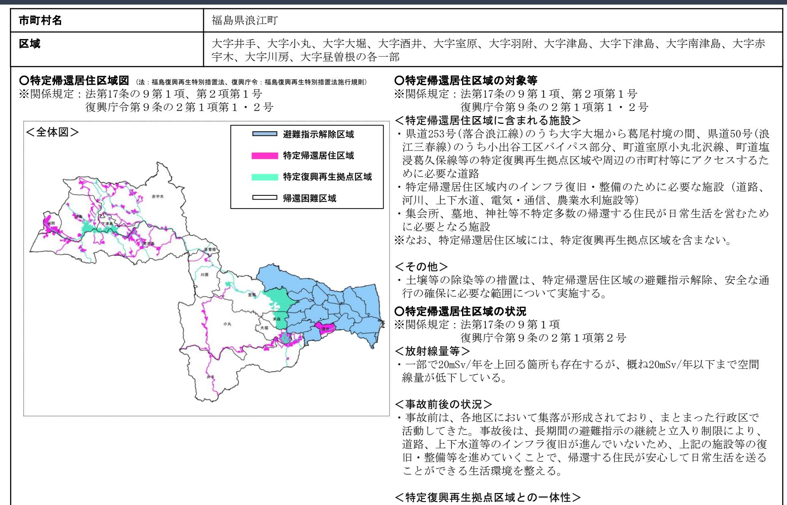
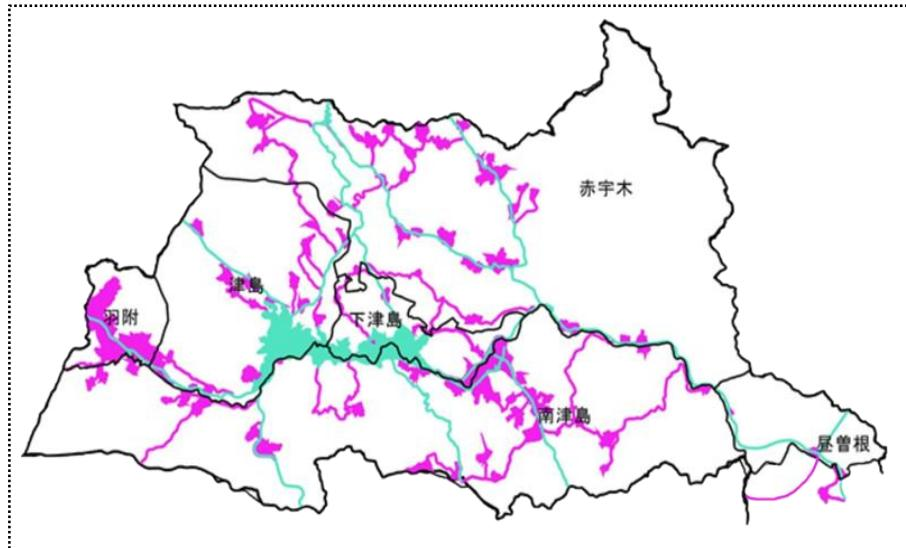
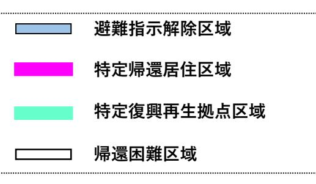
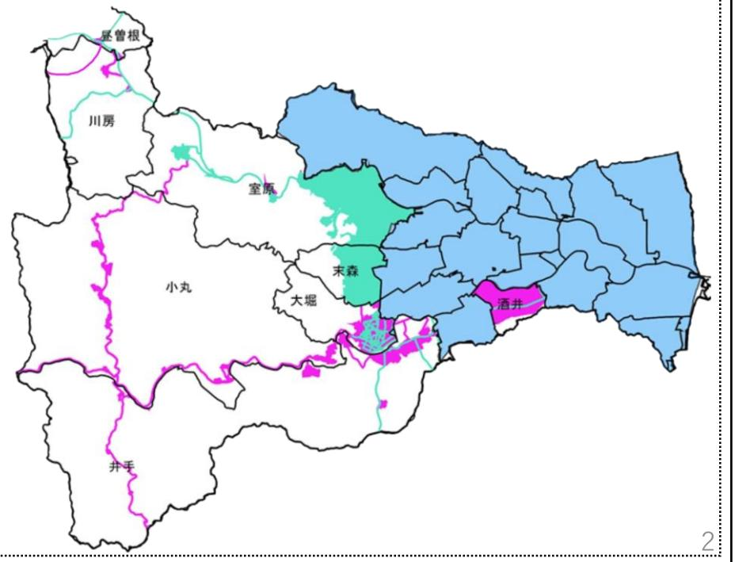

# 特定帰還居住区域復興再生計画

## 福島県浪江町

令和5年12月

## 1.特定帰還居住区域-区域の範囲

- ・当町の特定復興再生拠点区域やその他の市街地には、国道114号や町道等が通じており、一体的に復興及び再生を図ることが可能。
### 1.特定帰還居住区域-区域の範囲

#### ○特定帰還居住区域図(拡大図)

- 上図:大字羽附、大字津島、大字下津島、大字南津島、大字赤宇木、大字昼曽根
- 右図:大字井手、大字小丸、大字大堀、大字酒井、大字室原、大字川房

### 2.計画の意義・目標 ※関係規定:法第17条の9第2項第2号

・浪江町は、帰還困難区域を含む町内全域で、帰還できる環境が整った段階で帰町宣言を行うこととしている。よって、長い年月を要するとしても、帰還困難区域全域を避難指示解除することを目標とする。

・そのうえで、「特定帰還居住区域」は、2020年代をかけて、帰還意向のある住民全員が帰還することができる環境を整える。

3.計画の期間 ※関係規定:法第17条の9第2項第3号

・国の認定があった日~令和11年(2029年)12月31日

### 4.特定帰還居住区域の整備等(事業再開のための支援、道路その他の公共施設の整備、生活環境の整備に関する事項)

### <特定帰還居住区域外とのアクセスの確保>

・避難指示解除済みの国道114号、国道399号等の維持管理・修繕や、県道253号(落合浪江線)のうち大字大堀から葛尾村境の間、県道50号(浪江三春線)のうち小出谷工区バイパス部分、町道室原小丸北沢線、町道塩浸葛久保線等の除染・整備により特定復興再生拠点区域や周辺の市町村等へのアクセス道路を確保する。

### <特定帰還居住区域内の整備の概要>

・除染・家屋解体を進め、道路、河川、電気・通信、上下水道等の生活インフラの復旧・整備を実施する。

・集会所等については、利用ニーズへの対応や効率的な運営を考慮し、住民のコミュニティ再生に寄与するものとなるよう再整備を進める。

・農業水利施設の復旧・整備等については、各地域における営農再開に向けた検討状況等に留意しつつ、関係者と協議の上、営農に必要な範囲での実施に向けて調整を進める。

・その他生活関連サービスについては、避難指示解除時のサービス提供を目指し、関係者と調整を進める。

・インフラ整備と土壌等の除染等の措置などについては、特定復興再生拠点区域復興再生計画の際と同様に、一体的かつ効率的に実施する。

### 5.土壌等の除染等の措置及び除去土壌の処理

※関係規定:法第17条の9第2項第7号、第17条の23第1・2項

・本計画、関係法令及び「除染関係ガイドライン(環境省平成25年5月第2版(平成30年3月追補))」に従って、特定帰還居住区域において避難指示解除に必要な範囲について、国が土壌等の除染等の措置及び除去土壌の処理を行う。

6.廃棄物の処理 ※関係規定:法第17条の9第2項第7号、第17条の23第3・4項

・本計画、関係法令及び「廃棄物関係ガイドライン(環境省平成25年3月第2版)」に従って、特定帰還居住区域において国が認定特定復興再生拠点区域等内廃棄物の処理を行う。

・また、本計画に基づき各事業主体が実施するインフラ整備事業に伴い発生する廃棄物についても、国は個別に各事業実施主体と相談しながら、当該インフラ整備事業の実施に支障が生じないよう対応する。

### ※関係規定:法第17条の9第2項第8号

#### <生活関連サービス、防犯・防災等>

- ・生活ごみ処理サービスの再開にかかる調整を実施する。
- ・防犯については、地域防犯パトロール及び防犯カメラの継続、防犯灯の設置に向けた調整を実施する。
- ・医療・介護については、解除済み区域や避難先自治体において整備・実施している診療所や介護事業所等を活用する。
- ・特定帰還居住区域の避難指示解除にあわせて郵便物を受けることができるよう、郵便局と調整する。
- ・地上デジタル放送の視聴及び携帯電話の使用が可能となるよう、必要な難視・不感対策を行う。

#### <その他(立入管理等)>

・認定後、空間線量率の状況等を踏まえ、必要に応じ帰還困難区域における立入規制の緩和を内閣府に協議する。