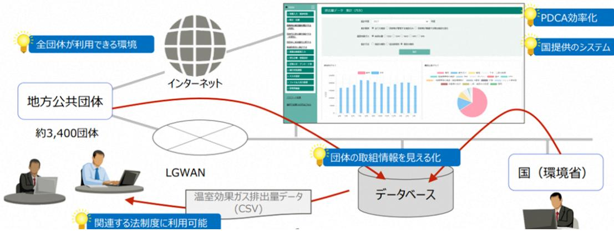

#### 令和5年度第1回浪江町環境審議会

 日にち:令和 5 年 11 月 29 日(水) 場所:浪江町役場 401 会議室

#### 次第

- 1 開会
	- ・産業振興課長あいさつ
- ・会長あいさつ
- 2 議題
- (1) 浪江町地球温暖化対策総合計画の推進と今年度の事業報告について
- (2) 脱炭素施策検討ワーキンググループの活動報告について
- (3) 事務局からの施策検討状況について

3 閉会

配布資料資料1:出席者名簿資料2:座席表資料3: 浪江町地球温暖化対策総合計画の推進及び今年度の取組について資料4:脱炭素施策検討ワーキンググループの活動報告について資料5:事務局からの施策検討状況について参考:脱炭素ワーキンググループ施策検討結果・提案施策集

#### 出席者名簿

【浪江町環境審議会委員】

|                 | 所 属                  | 会長 | 氏 名                                  | 備考    |
|-----------------|-------------------------|----|-----------------------------------------|-------|
| 学識 経験者       | 福島大学共生システム理工学類          | 〇  | かわ さき こう た 川 﨑 興 太 |       |
|                 | 東京大学先端科学技術研究センター        |    | こうの たつ おき 河野 龍 興         | オンライン |
|                 | 福島大学共生システム理工学類          |    | ごとう しのぶ 後藤 忍                   | 欠席    |
| 事業者 団体 町民 | 株式会社 伊達重機            |    | ぜんじ あきひろ 前司 昭博                 |       |
|                 | 株式会社 舞台ファーム          |    | いとう けいいち 伊藤 啓一                 | オンライン |
|                 | 株式会社 スマートアグリ・リレーションズ |    | なかやち よし あき 中谷内 美 昭       |       |
|                 | 行政区長会                   |    | さとう ひでぞう 佐藤 秀三                 |       |
|                 | 會澤高圧コンクリート 株式会社      |    | あい ざわ たいし 會 澤 大志         | オンライン |
|                 | 浪江町民                    |    | さわむら 澤村 なつみ                       |       |

【事務局】

|     | 所 属                   | 氏 名    |
|-----|--------------------------|-----------|
| 浪江町 | 産業振興課 課長              | 蒲原 文崇  |
|     | 産業振興課 主幹              | 板垣 貴之  |
|     | 産業振興課 新エネルギー推進係長      | 小林 直樹  |
|     | 産業振興課 新エネルギー推進係 主査 | 藤田 知宏  |
|     | 産業振興課 新エネルギー推進係 主事 | 木原 可南子 |

【資料2】

座席表

浪江町役場 4 階 401 会議室

# **議題(1) 浪江町地球温暖化対総合計画の推進と今年度の事業報告について**

○浪江町環境審議会規則

(趣旨)

- 第1条この規則は、浪江町環境基本条例(令和3年浪江町条例第2号)第20条第2項の規定に基づき、浪江町環境審議会(以下「審議会」という。)の組織及び運営に関し必要な事項を定めるものとする。
- [浪江町環境基本条例(令和3年浪江町条例第2号)第20条第2項]

(所管事務)

- 第2条審議会は、次に掲げる事務をつかさどる。
- (1) 町長の諮問に応じ、環境基本計画に関する事項並びに環境の保全及び創造に関する基本的事項及び重要事項を調査審議すること。
- (2) 法令等の規定によりその権限に属させられた事項
- (3) 前2号に掲げるもののほか、他の条例の規定によりその権限に属させられた事項
- 2 審議会は、環境の保全及び創造に関する基本的事項及び重要事項に関し町長に意見を述べることができる。 (委員の任期等)

第3条審議会は、委員10人以内で組織する。

- 2 委員は、環境の保全及び創造に関し識見を有する者のうちから町長が委嘱する。
- 3 委員の任期は、2年とする。ただし、補欠の委員の任期は、前任者の残任期間とする。

(会長)

- 第4条審議会に、会長を置き、委員の互選によりこれを定める。
- 2 会長は、審議会を代表し、会務を総理する。
- 3 会長に事故があるときは、会長があらかじめ指名する委員が、その職務を代理する。

(会議)

- 第5条審議会の会議は、会長が招集し、会長がその議長となる。
- 2 審議会の会議は、委員の過半数が出席しなければ開くことができない。
- 3 審議会の議事は、出席委員の過半数をもって決し、可否同数の場合は、会長の決するところによる。 (庶務)
- 第6条審議会の庶務は、産業振興課において処理する。

(その他)

- 第7条この規則に定めるもののほか、審議会の運営に関し必要な事項は、会長が審議会に諮って定める。
### **浪江町地球温暖化対策総合計画~なみえエネルギーチャレンジ2035~**

「浪江町地球温暖化対策総合計画~なみえエネルギーチャレンジ2035~」は地方公共団体実行計画と気候変動適応計画をまとめた計画。

### **◇地方公共団体実行計画**

地球温暖化対策の推進に関する法律(地球温暖化対策推進法)第21条に基づき地方公共団体が定めるもので、事務事業編と区域施策編の2種類あり。

### ≪**事務事業編**≫

- ・すべての地方公共団体に策定義務あり。
・地方公共団体自らの事務事業に伴い発生する温室効果ガスの排出削減などの措置を定めるもの。

### ≪**区域施策編**≫

- ・都道府県、中核市等に策定義務あり。中核市等以外の市町村は策定の努力義務あり。
- ・区域の自然的社会条件に応じ、温室効果ガスの排出抑制などを行うための施策に関する事項を定めるもの。

### **◇気候変動適応計画**

- ・都道府県及び市町村に策定の努力義務あり。
- ・その区域における自然的経済的社会的状況に応じた気候変動適応に関する計画を定めるもの。 2

#### **町内におけるカーボンニュートラルに向けた達成目標** 17.5 20.5 25.3 0

### ◆ **現状すう勢によるCO2排出量(千t-CO2)** 2010 2018 2019 2020 2025 2030 2035 2040 2045 2050

150.0

50

100

150

200

**<千t-CO2>**

◆**温室効果ガス排出量の抑制目標**

**2030年度**までに本町から排出される温室効果ガスを**40千t-CO2**に抑制します。 カーボンニュートラルに向けた達成率、 **50%**を目指します。

**2035年度**を待たずにカーボンニュートラルを目指します。 (カーボンニュートラルの達成率、 **100%**を目指します。)

43.4 50.8 57.9 60.5 63.1 65.7

## **事務事業に関する現況と目標**

## **公共施設における温室効果ガス排出量の現況と将来推計**

温室効果ガス排出量

➢2010年度:5.3千t‐CO2 ➢2021年度:1.3千t-CO2 ➢2030年度(推計):2.3千t-CO2 ➢2050年度(推計):3.2千t-CO2

復興の進展とともに事務事業におけるCO2排出量は大きく増加する見込み

**2030年度**までに基準年度(2010年度)比で **19%(1.0千t-CO2)**に抑制します。 基準年度比の削減目標率は81%(4.3千t-CO2) ※森林吸収量は数値目標に含みません。

## **今年度の事業報告**

## 1.推進本部の立上げとワーキンググループの実施

≪目的≫

地球温暖化対策総合計画に基づき、2035年までにカーボンニュートラルを達成するため、具体的な施策を立案・推進し、事業の進行管理を行うことにより全庁的な推進を図る。

≪浪江町地球温暖化対策推進本部の役割≫

- ・事務事業や町内全域内における施策立案と事業の推進を図る。
- ・各施策について情報共有し、庁内での連携図る。
- ・事業の進行管理を行い、施策の見直しを図る。

≪脱炭素施策検討ワーキンググループの役割≫

- ・担当業務における具体的な施策立案、事業検討を図る。
- ・全庁的な推進に向け、情報共有しながら部署間連携を図る。

≪浪江町環境審議会の役割≫

- ・町民、事業者、学識経験者の各立場から施策への審議や助言、計画の進行管理を行う。

### 2.進捗管理手法について

◇事務事業編(役場内の取組)について今年度LAPSS(地方公共団体実行計画策定・管理等支援システム)の運用を開始した。データに基づき事務事業編の進捗管理を行う。

※LAPSSとは、地方自治体内の温室効果ガス排出量を算出する環境省提供システム

◇区域施策編について現状:実績値を把握できない状態。 今後:来年度以降、町内事業者等からのエネルギーデータ収集などにより把握する仕組みづくりを行う。→条例等の策定も検討 (参考:令和6年10月に福島県でカーボンニュートラル推進条例を策定予定)

### 浪江町LAPSSデータ【R5.4月~10月分】

施設分類別温室効果ガス排出量

| 分 類 名   | 総排出量(t-CO2) | 編成比率(%) |
|---------------|-------------|---------|
| 観光・レクリエーション施設 | 280.19      | 21.7    |
| 水道施設          | 211.43      | 16.4    |
| 保養施設          | 176.00      | 13.6    |
| 下水道施設         | 84.66       | 6.6     |
| 庁舎            | 78.68       | 6.1     |
| スポーツ施設        | 74.92       | 5.8     |
| 水産施設          | 72.62       | 5.6     |
| 自動車           | 55.69       | 4.3     |
| 産業施設          | 54.56       | 4.2     |
| 小学校           | 37.95       | 2.9     |
| 福祉施設          | 37.08       | 2.9     |
| 図書館           | 32.50       | 2.5     |
| 医療施設          | 25.09       | 1.9     |
| 公営住宅          | 19.44       | 1.5     |
| 博物館等          | 17.14       | 1.3     |
| 集会施設(市民文化系)   | 14.34       | 1.1     |
| 幼稚園           | 10.66       | 0.8     |
| 防災・治水施設       | 3.53        | 0.3     |
| その他施設         | 2.57        | 0.2     |
| 農業施設          | 2.36        | 0.2     |
| 合 計        | 1291.41     |         |

#### 施設分類別構成比

◇職員への周知

5月24~26日、職員向けのエネチャレ勉強会を開催(計128名参加)

### ◇町民・町内事業者への周知

- ・町ホームページや広報紙により周知
- ・概要版とガイド版町民編を町民へ配布【広報なみえ12月号(12月1日発行)】
- ・概要版とガイド版事業者編を町内事業者へ配布予定

### ◇イベント出展による周知

町内外で開催されるイベントに参加し、町のエネルギーの取組や計画についての啓発を行った。

- ・ 6月 3日~ 4日大せとまつり@浪江町
- ・10月12日~13日REIFふくしま@郡山市
- ・10月28日~29日ロボテス縁日@南相馬市
- ・11月11日~12日eco縁日@大阪市
- ・11月18日~19日十日市祭@浪江町など 8

# **議題(1) 脱炭素施策検討ワーキンググループの活動報告について**

### 脱炭素施策検討ワーキンググループの活動内容について

【目標】:町のカーボンニュートラルに向けた取り組みを全庁的なものとするため、組織横断的に施策を検討し、最終的に推進本部へ提案、来年度以降の事業展開を図る。

|             | 第1回WG (8/29)                                       | 第2回WG (9/28)                                                                    | 第3回WG (10/19)                                                      | 第4回WG (11/22)                                                                         |
|-------------|-------------------------------------------------------|------------------------------------------------------------------------------------|-----------------------------------------------------------------------|------------------------------------------------------------------------------------------|
| フェーズ        | 役割・進め方確認                                              | アイディア出し                                                                            | アイディア深堀・ 絞り作業                                                      | 施策提案の準備                                                                                  |
| 内容          | WGの位置づけや役 割、今後の進め方 について説明し、 職員の理解増進を 図った。 | ワークショップを開 催し、町のカーボン ニュートラルに向け て何が必要か担当業 務など関係なく幅広 くアイディアを出し 合った。 | 第2回WGで出たア イディアについて、 得られる効果やデメ リット等を話し合い、 事業化について検討 した。 | 各施策の予算感や費 用対効果を確認し、 「来年度から実施、 次々年度以降実施、 不採択」に分類し、 推進本部への提案に 向けて準備を行った。 |
| 参加者         | 係長等 29名                                            | 係長等 33名                                                                         | 係長等 30名                                                            | 係長等 35名                                                                               |
| アイディア 件数 |                                                       | 98件                                                                                | アイディアの統合により 74件                                                    | 来年度実施 24件 次々年度以降 20件                                                            |
|             |                                                       |                                                                                    |                                                                       |                                                                                          |

### WG内で出たアイディア・施策を以下の分類により一覧にまとめました。

事務事業編 …役場内の事務事業における温室効果ガス排出抑制に関する施策

区域施策編 …町全域における温室効果ガス排出抑制に関する施策

**部門別分類**

- 議会費議会運営のための経費
- 総務費全般的な事務や財産管理、統計、税の課税や徴収にかかる経費
- 民生費障がい者や高齢者に対する福祉の充実、子育て支援などの経費
- 衛生費環境保全、疾病予防、健康増進などの経費
- 労働費失業対策や勤労者のための各種施設の設置、管理に係る経費

農林水産業費農林水産業の振興や農・林道の整備、漁港整備などに係る経費

- 商工費商工業や観光の振興などの経費
- 土木費道路や河川、公園などの社会資本整備のための経費
- 消防費消防や火災予防などの災害対策のための経費
- 教育費学校教育や社会教育活動などに関する経費
- 災害復旧費災害により被災した施設などを復旧する経費 2

**事務事業編**に関する施策一覧

| 施策No. | 施策名称                    | 担当部署 |  | 部門 | 実施検討状況   |
|-------|-------------------------|------|--|----|----------|
| A-01  | みんなのマイバック(かご)           | 総務課  |  | 総務 | 来年度から実施  |
| A-02  | 毎週がプレミアムフライデー           | 総務課  |  | 総務 | 来年度から実施  |
| A-03  | 脱ビジネスウェア                | 総務課  |  | 総務 | 来年度から実施  |
| A-04  | オンライン会議推進事業             | 総務課  |  | 総務 | 来年度から実施  |
| A-05  | 通勤車両次世代化事業              | 総務課  |  | 総務 | 次々年度以降実施 |
| A-06  | 休み方改革事業                 | 総務課  |  | 総務 | 次々年度以降実施 |
| A-07  | 働き方改革事業                 | 総務課  |  | 総務 | 次々年度以降実施 |
| A-08  | 脱炭素施策推進事業               | 総務課  |  | 総務 | 次々年度以降実施 |
| A-10  | 出張時の公用車乗り合い・公共交通機関利用の推進 | 総務課  |  | 総務 | 不採択      |
| A-11  | 徒歩通勤コンテスト               | 総務課  |  | 総務 | 不採択      |
| A-12  | 自転車通勤・公共交通機関利用・集団通勤の促進  | 総務課  |  | 総務 | 不採択      |
| A-13  | マイ弁当・マイボトル推進            | 総務課  |  | 総務 | 不採択 3 |

| 施策No. | 施策名称                  | 担当部署 |  | 部門 | 実施検討状況   |
|-------|-----------------------|------|--|----|----------|
| A-14  | 職員の給食化・食堂設置           | 総務課  |  | 総務 | 不採択      |
| A-15  | クレームのエネルギー転換          | 総務課  |  | 総務 | 不採択      |
| A-16  | 会議での紙資料配布原則廃止         | 総務課  |  | 総務 | A-04に統合  |
| A-17  | 席の自由化                 | 総務課  |  | 総務 | A-04に統合  |
| A-18  | ノーマイカーデーの推進           | 総務課  |  | 総務 | A-09に統合  |
| A-19  | 自転車購入・保険補助            | 総務課  |  | 総務 | A-09に統合  |
| B-01  | 環境に配慮した事業活動の促進        | 総務課  |  | 総務 | 来年度から実施  |
| B-02  | 公共施設への太陽光発電・蓄電池導入推進事業 | 総務課  |  | 総務 | 来年度から実施  |
| B-03  | 浪江町公用車ZEV化事業          | 総務課  |  | 総務 | 次々年度以降実施 |
| B-07  | 不要な公共施設の廃止、縮減、見直し     | 総務課  |  | 総務 | 不採択      |
| B-08  | コピー機の半減               | 総務課  |  | 総務 | 不採択      |
| B-09  | 雨水のトイレ利用              | 総務課  |  | 総務 | 不採択 4 |

| 施策No. | 施策名称                       | 担当部署  |  | 部門 | 実施検討状況       |
|-------|----------------------------|-------|--|----|--------------|
| B-10  | 公共施設への植林の義務化               | 総務課   |  | 総務 | 不採択          |
| B-11  | 公用自転車・電動スクーター・キックボードの導入・活用 | 総務課   |  | 総務 | B-01に統合      |
| B-12  | 庁舎内ごみの分別・リサイクル推進・コンポスト設置   | 総務課   |  | 総務 | B-01に統合      |
| B-13  | 事務所の設定温度最適化                | 総務課   |  | 総務 | B-01に統合      |
| B-14  | コピー用紙の削減                   | 総務課   |  | 総務 | B-01に統合      |
| B-15  | 各課・個人で使用する用紙の見える化          | 総務課   |  | 総務 | B-01に統合      |
| B-16  | 各課への雑誌回収袋配布                | 総務課   |  | 総務 | B-01に統合      |
| B-17  | 庁内EV充電設備の導入                | 総務課   |  | 総務 | B-02に統合      |
| B-18  | 公用車全てを共用車化                 | 総務課   |  | 総務 | B-03に統合      |
| C-01  | 来庁者向け新聞の廃止事業               | 総務課   |  | 総務 | 来年度から実施      |
| C-02  | 予算書・決算書のペーパーレス化事業          | 企画財政課 |  | 総務 | 来年度から実施      |
| C-03  | 口座振込通知書の一部廃止事業             | 出納室   |  | 総務 | 来年度から実施 5 |

| 施策No. | 施策名称                    | 担当部署   |       | 部門 | 実施検討状況   |
|-------|-------------------------|--------|-------|----|----------|
| C-04  | 電子決裁の導入事業               | 総務課    | 企画財政課 | 総務 | 次々年度以降実施 |
| C-05  | 職員業務用タブレット導入事業          | 企画財政課  |       | 総務 | 次々年度以降実施 |
| C-06  | 生成AI活用事業                | 企画財政課  |       | 総務 | 次々年度以降実施 |
| C-07  | 電子広報紙配布事業               | 企画財政課  |       | 総務 | 次々年度以降実施 |
| C-08  | 電子窓口の導入(申請書の電子化)        | 住民課    | 全課    | 総務 | 不採択      |
| C-10  | 伝票の電子化                  | 企画財政課  | 出納室   | 総務 | C-04に統合  |
| B-06  | 公共事業での脱炭素型資材の積極活用(方針策定) | 建設課    | 住宅水道課 | 土木 | 不採択      |
| D-09  | 新たに建設する施設への発電設備等の設置     | 市街地整備課 | 農林水産課 | 土木 | 不採択      |

**区域施策編**に関する施策一覧

| 施策No. | 施策名称                       | 担当部署  |       | 部門 | 実施検討状況       |
|-------|----------------------------|-------|-------|----|--------------|
| C-09  | 双葉地域国際社会との連携               | 企画財政課 |       | 総務 | 不採択          |
| D-06  | 企業のCO2削減推進事業               | 住民課   |       | 総務 | 次々年度以降実施     |
| D-11  | 電気自動車に対する軽自動車税(種別割)の減免     | 住民課   |       | 総務 | 不採択          |
| D-12  | 水素ST及び充電設備に係る固定資産税(償却資産)減免 | 住民課   |       | 総務 | 不採択          |
| A-09  | 健康促進事業                     | 健康保険課 | 企画財政課 | 民生 | 次々年度以降実施     |
| D-05  | バイオ燃料推進事業                  | 産業振興課 |       | 衛生 | 次々年度以降実施     |
| E-01  | 環境基本計画への反映                 | 住民課   | 産業振興課 | 衛生 | 来年度から実施      |
| E-02  | CO2排出量の見える化(アプリ)           | 産業振興課 | 住民課   | 衛生 | 来年度から実施      |
| E-09  | 核廃棄物の電池(半永久的)の活用           | 住民課   |       | 衛生 | 不採択          |
| E-11  | プラスチック製品のリサイクル化            | 住民課   |       | 衛生 | E-01に統合      |
| E-12  | テイクアウトプラスチックの廃止            | 住民課   |       | 衛生 | E-01に統合      |
| E-13  | ごみ分別の徹底                    | 住民課   |       | 衛生 | E-01に統合 7 |

| 施策No. | 施策名称                      | 担当部署  |       | 部門 | 実施検討状況        |
|-------|---------------------------|-------|-------|----|---------------|
| E-14  | リサイクルハウスの推進               | 住民課   |       | 衛生 | E-01に統合       |
| E-15  | 緑のカーテン推進                  | 住民課   |       | 衛生 | E-01に統合       |
| F-01  | 脱炭素アワード                   | 産業振興課 | 産業振興課 | 衛生 | 来年度から実施       |
| F-02  | FH2Rの水素本格供給に向けた需要創出       | 産業振興課 |       | 衛生 | 来年度から実施       |
| F-03  | ゼロカーボンシティ達成状況のモニタリング      | 産業振興課 |       | 衛生 | 来年度から実施       |
| F-04  | 町内水素供給網整備                 | 産業振興課 |       | 衛生 | 来年度から実施       |
| F-05  | 再エネ促進区域設定による再エネ導入促進       | 産業振興課 |       | 衛生 | 来年度から実施       |
| F-06  | ZEV導入補助金(補助額UP)           | 産業振興課 |       | 衛生 | 来年度から実施       |
| F-07  | 新エネルギー会社によるエネルギー地産地消モデル構築 | 産業振興課 |       | 衛生 | 来年度から実施       |
| F-08  | 町内EV充電環境構築                | 産業振興課 |       | 衛生 | 来年度から実施       |
| F-13  | 未利用エネルギー活用検討              | 産業振興課 |       | 衛生 | 次々年度以降実施      |
| F-14  | 脱炭素ポイント                   | 産業振興課 |       | 衛生 | 次々年度以降実施 8 |

| 施策No. | 施策名称              | 担当部署  | 部門        | 実施検討状況   |
|-------|-------------------|-------|-----------|----------|
| F-17  | ガスボンベを水素に         | 産業振興課 | 衛生        | 不採択      |
| F-18  | 振動発電              | 産業振興課 | 衛生        | 不採択      |
| F-19  | ハイブリットカーの導入補助     | 産業振興課 | 衛生        | 不採択      |
| F-20  | 町民、事業者の取組発信       | 産業振興課 | 衛生        | F-01に統合  |
| F-21  | 省エネコンテスト          | 産業振興課 | 衛生        | F-01に統合  |
| F-22  | 脱炭素優良企業などの表彰・アワード | 産業振興課 | 衛生        | F-01に統合  |
| F-23  | 次世代自動導入補助金の強化     | 産業振興課 | 衛生        | F-06に統合  |
| D-01  | 農地等の炭素貯留事業        | 農林水産課 | 農林 水産業 | 来年度から実施  |
| D-02  | 水素農機等実証推進事業       | 農林水産課 | 農林 水産業 | 次々年度以降実施 |
| D-03  | 水素農機等実証推進事業       | 農林水産課 | 農林 水産業 | 次々年度以降実施 |
| D-04  | 牛のメタンガス発生抑制事業     | 農林水産課 | 農林 水産業 | 次々年度以降実施 |
| D-07  | 農地転用の禁止           | 農林水産課 | 農林 水産業 | 不採択 9 |

| 施策No. | 施策名称                      | 担当部署  |  | 部門        | 実施検討状況         |
|-------|---------------------------|-------|--|-----------|----------------|
| D-08  | 農地の削減(土地の活用)              | 農林水産課 |  | 農林 水産業 | 不採択            |
| D-10  | 竹酢液の活用                    | 農林水産課 |  | 農林 水産業 | 不採択            |
| E-03  | みんなの森林見守りプロジェクト           | 農林水産課 |  | 農林 水産業 | 次々年度以降実施       |
| E-04  | 国有林で発生する間伐材の利用(木質バイオマス利用) | 農林水産課 |  | 農林 水産業 | 不採択            |
| E-05  | 森林整備                      | 農林水産課 |  | 農林 水産業 | 不採択            |
| E-06  | 森林開発の禁止                   | 農林水産課 |  | 農林 水産業 | 不採択            |
| E-07  | 津島松の復活                    | 農林水産課 |  | 農林 水産業 | 不採択            |
| E-08  | 僕と私の森(もり)づくり              | 農林水産課 |  | 農林 水産業 | 不採択            |
| E-10  | 町内の緑地化推進                  | 農林水産課 |  | 農林 水産業 | E-01に統合        |
| F-09  | イベントの脱炭素化促進事業             | 産業振興課 |  | 商工        | 来年度から実施        |
| F-10  | 脱炭素ツーリズム推進                | 産業振興課 |  | 商工        | 来年度から実施        |
| F-16  | 脱炭素エネルギー転換                | 産業振興課 |  | 商工        | 次々年度以降実施 10 |

| 施策No. | 施策名称                     | 担当部署  |     | 部門 | 実施検討状況   |
|-------|--------------------------|-------|-----|----|----------|
| F-24  | 事業用太陽光発電補助               | 産業振興課 |     | 商工 | F-16に統合  |
| B-04  | 無意味な道路舗装をやめる             | 建設課   |     | 土木 | 不採択      |
| B-05  | 町道、橋を減らす                 | 建設課   |     | 土木 | 不採択      |
| F-15  | ガソリン車規制区域設置              | 建設課   | 住民課 | 土木 | 次々年度以降実施 |
| F-11  | 学校教育を通じた脱炭素化推進事業         | 教育総務課 |     | 教育 | 来年度から実施  |
| F-12  | "浪江で作ってる水素ってどうやって使うの?"講座 | 生涯学習課 |     | 教育 | 来年度から実施  |

**脱炭素ワーキンググループ検討状況①**

▷ ワーキンググループで当初、 **全98件** のアイディアが提案されました。

検討結果

▷ それらを担当係などで構成された各グループにおいて、実施内容、効果、費用などを踏まえて「来年度から実施」「次々年度以降に実施」「不採択」「他の事業と統合」と4つの検討結果に分類いたしました。 ▷ その結果は以下のとおりです。

12

**脱炭素ワーキンググループ検討状況②**

**担当課ごとの施策提案状況**

※重複するものがありますので、総数と合致しません。

| 課名称    | 来年度実施 | 次々年度 以降実施 |
|--------|-------|--------------|
| 総務課    | 7     | 6            |
| 企画財政課  | 1     | 5            |
| 住民課    | 2     | 2            |
| 健康保険課  | 0     | 1            |
| 介護福祉課  | 0     | 0            |
| 住宅水道課  | 0     | 0            |
| 産業振興課  | 13    | 4            |
| 建設課    | 0     | 1            |
| 市街地整備課 | 0     | 0            |
| 農林水産課  | 1     | 4            |
| 教育総務課  | 1     | 0            |
| 生涯学習課  | 1     | 0            |
| 議会事務局  | 0     | 0            |
| 出納室    | 1     | 0            |

**脱炭素ワーキンググループ検討状況③**

#### **部門ごとの施策提案件数**

| 部門名称  | 来年度実施 | 次々年度 以降実施 |
|-------|-------|--------------|
| 議会    | 0     | 0            |
| 総務    | 9     | 10           |
| 民生    | 0     | 1            |
| 衛生    | 10    | 3            |
| 労働    | 0     | 0            |
| 農林水産業 | 1     | 4            |
| 商工    | 2     | 1            |
| 土木    | 0     | 1            |
| 消防    | 0     | 0            |
| 教育    | 2     | 0            |

※重複するものがありますので、総数と合致しません。

# **議題(3) 事務局からの施策検討状況について**

## 1. 重点対策加速化事業

- 2. 地域脱炭素化促進事業(促進区域の設定)
- 3. 地域エネルギー会社設立に向けた検討状況

### **事務・事業における施策推進**

- (1)政府実行計画における取組内容
	- ・太陽光発電・・・設置可能な政府保有の建築物(敷地含む)の約50%以上に太陽光発電設備を設置。
	- ・新築建築物・・・今後予定する新築事業について原則ZEB化。
	- ・公用車・・・代替可能な電動車がない場合等を除き、2030年度までに全て電動車とする。
	- ・LED照明・・・LED照明導入割合を2030年度までに100%とする。
	- ・再エネ電力調達・・・2030年までに各府省庁で調達する電力の60%以上を再エネ電力とする。 ⇒温対法において地方公共団体も、上記に準じた取組を図ることが求められている。

### (2)今後の方向性

・町としてもカーボンニュートラルに向けて、公共施設等への再エネの最大限導入、新築建築物のZEB化、電動車・LED照明の導入徹底、積極的な再エネ電力調達等を取り組むことが必要である。

- ・個別に検討するのではなく、全庁的に検討することで、より計画的かつ着実に財源の確保を図る必要がある。
- (3)財源の確保

環境省事業の「重点対策加速化事業」の活用を検討。

## **重点対策加速化事業**

≪事業の目的≫

浪江駅周辺整備事業等の面的整備や公共施設等において率先的に再エネの導入やエネルギーマネジメント等に取り組むことで、町のカーボンニュートラルを促進する。

### ≪事業の概要≫

環境省による補助事業。再エネ発電設備を一定以上導入すること等を要件に、再エネ発電設備の導入や、住宅・建築物の省エネ性能の向上、ゼロカーボン・ドライブ等の複合実施を支援することで地方自治体における脱炭素化を推進する。

補助率:2/3~1/3、定額補助額上限:15億円(促進区域においては+5億円) 事業期間:おおむね5年間

≪環境審議会の役割≫

- ・補助事業採択後の重点対策加速化事業の進捗確認
≪今後の進め方≫

- ・今年度中に事業計画を立て、次回公募時期(未定)に申請する予定。

- 

| ■事業形態 | 交付率: (1) @、 (2) 原則2/3※ 2/3~1/3 交付金                                                                                                                                          |
|-------|--------------------------------------------------------------------------------------------------------------------------------------------------------------------------------|
| ■交付対象 | ※財政力指数が全国平均(0.51)以下の地方公共団体は一部3/4 地方公共団体等                                                                                                                                    |
|       | ------------------------------------------------------------------------------------------------------------------------------------------------------------------------------ |

- 

|      | 地域脱炭素移行·再工ネ推進交付金                                                                                                                                                                                                                                                                                                                                                                                                                                                                                     |                                                                                                                                                                                                                                                                                                                                                                                                                                                                                   | 特定地域脱炭素移行                                                                                                                                                     |  |
|------|------------------------------------------------------------------------------------------------------------------------------------------------------------------------------------------------------------------------------------------------------------------------------------------------------------------------------------------------------------------------------------------------------------------------------------------------------------------------------------------------------|-----------------------------------------------------------------------------------------------------------------------------------------------------------------------------------------------------------------------------------------------------------------------------------------------------------------------------------------------------------------------------------------------------------------------------------------------------------------------------------|---------------------------------------------------------------------------------------------------------------------------------------------------------------|--|
| 事業区分 | 脱炭素先行地域づくり事業                                                                                                                                                                                                                                                                                                                                                                                                                                                                                         | 重点対策加速化事業                                                                                                                                                                                                                                                                                                                                                                                                                                                                         | 加速化交付金                                                                                                                                                        |  |
| 交付要件 | ○脱炭素先行地域に選定されていること (一定の地域で民生部門の電力消費に伴うCO2排出実質ゼロ達成 을)                                                                                                                                                                                                                                                                                                                                                                                                                                           | ○再エネ発電設備を一定以上導入すること (都道府県・指定都市・中核市・施行時特例市: 1MW以上、その他の市町村:0.5MW以上)                                                                                                                                                                                                                                                                                                                                                                                                           | ○脱炭素先行地域に選定されて いること                                                                                                                                        |  |
| 対象事業 | (1) CO2排出削減に向けた設備導入事業 (①は必須) 1再工ネ設備整備(自家消費型、地域共生·地域神益型) 地域の再工ネポテンシャルを最大限活かした再工ネ設備の導入 (公共施設への太陽光発電設備導入はPPA等に限る) ・再エネ発電設備:太陽光、風力、中小水力、バイオマス等 ・再工ネ熱利用設備/未利用熱利用設備: 地中熱、温泉熱等 2基盤インフラ整備 地域再エネ導入・利用最大化のための基盤インフラ設備の導入 ・自営線、熱導管 · 蓄電池、充放電設備 · 再工ネ由来水素関連設備 業 ・エネマネシステム 3省CO2等設備整備 地域再エネ導入・利用最大化のための省CO2等設備の導入 ·ZEB·ZEH、断熱改修 ・ゼロカーボンドライブ(電動車、充放電設備等) · その他省CO2設備(高効率換気 · 空調、コジェネ等) (2)効果促進事業 (1)「CO2排出削減に向けた設備導入事業」と一体と なって設備導入の効果を一層高めるソフト事業等 | 1~5のうち2つ以上を実施 (1又は2は必須) 1屋根置きなど自家消費型の太陽光発電 (公共施設への太陽光発電設備導入はPPA等に限る) (例:住宅の屋根等に自家消費型太陽光発電 設備を設置する事業) 2地域共生・地域神益型再工ネの立地 (例:未利用地、ため池、廃棄物最終処分場 等を活用し、再工ネ設備を設置する事業) 3業務ビル等における徹底した省エネと改修 時等のZEB化誘導 (例:新築 · 改修予定のの業務ビル等におい て省工ネ設備を大規模に導入する事業) 4住宅・建築物の省工ネ性能等の向上 (例:ZEH、ZEH+、既築住宅改修補助事業) 6 ゼロカーボン・ドライブ ※2 (例:地域住民のEV購入支援事業、EV公用 車を活用したカーシェアリング事業) ※2 再エネとセットでEV等を導入する場合に限る ①⑤は国の目標を上回る導入量、④は国の基準を上回る 要件とする事業の場合、それぞれ単独実施を可とする。 | 民間襖益型自営線マイクログ リッド事業 官民連携により民間事業者 が神益する自営線マイクログ リッドを構築する地域(特定 地域)において、自営線に接 続する温室効果ガス排出削減 効果の高い主要な脱炭素製 品・技術(再工ネ・省工ネ・ 蓄工ネ)等の導入を支援する。 |  |
| 交付率  | 原則2/3 ※1 1(太陽光発電設備除く)及び②について、財政力指数が全 国平均(0.51)以下の地方公共団体は3/4。23の一部は定額                                                                                                                                                                                                                                                                                                                                                                                                                              | 2/3~1/3、定額                                                                                                                                                                                                                                                                                                                                                                                                                                                                        | 原則2 / 3 ×1                                                                                                                                                    |  |
| 事業期間 | おおむね 5年程度                                                                                                                                                                                                                                                                                                                                                                                                                                                                                            |                                                                                                                                                                                                                                                                                                                                                                                                                                                                                   |                                                                                                                                                               |  |
| 偏考   | ○複数年度にわたる交付金事業計画の策定・提出が必要(計画に位置づけた事業は年度間調整及び事業間調整が可能 〇各種設備整備・導入に係る調査・設計等や設備設置に伴う付帯設備等は対象に含む                                                                                                                                                                                                                                                                                                                                                                                                       |                                                                                                                                                                                                                                                                                                                                                                                                                                                                                   |                                                                                                                                                               |  |
|      |                                                                                                                                                                                                                                                                                                                                                                                                                                                                                                      |                                                                                                                                                                                                                                                                                                                                                                                                                                                                                   |                                                                                                                                                               |  |

# **議題(2) 事務局の施策検討状況について**

### 1. 重点対策加速化事業

- 2. 地域脱炭素化促進事業(促進区域の設定) 3. 地域エネルギー会社設立に向けた検討状況
### **地域脱炭素化促進事業(促進区域の設定)**

≪事業の目的≫

地域内へ再生可能エネルギーの「促進区域」を設定することで、円滑な合意形成を図り、適正に環境に配慮し、地域のメリットにもつながる、地域と共生する再エネ事業の導入を促進する。

≪制度の概要≫

国や県の基準に基づき、町が再エネ導入目標に基づき「促進区域」を設定。これに基づき「促進区域」において事業者は事業計画の策定を行い、町により事業計画の認定を行う。

≪法的位置づけ≫

市町村は、地方公共団体実行計画(区域施策編)において、地域脱炭素加速化事業の促進に関する事項を定めるよう努めることとされている。

≪事業メリット≫

・環境アセスメントの配慮書手続きの省略や関係法令の許可手続きのワンストップ化等の特例措置が受けられる。

・環境省の重点対策加速化事業の交付限度額15億円のところ、促進区域において5億円追加

・地域の環境保全、社会・経済に貢献する取組みの要件認定により、地域に裨益する再エネ事業を誘致可能。

### 地域脱炭素化促進事業(促進区域の設定)について

#### 地域脱炭素促進事業制度とは

促進区域

2022年4月、改正温対法により創設。円滑な合意形成を図り、適正に環境に配慮し、地域のメリットにもつながる、地域と共生する再エネ事業の導入を促進するもの。市町村は国や県が定める環境保全に係る基準に基づき、「促進区域」 を設定することができる。

事業提案型 ―

### 町の役割

①地域脱炭素化促進事業の促進に関する事項の策定

- ➢ 市町村は、地方公共団体実行計画(区域施策編)において、以下の地域脱炭素加速化事業の促進に関する事項を定めるよう努めることとされている。
≪地域脱炭素化促進事業の促進に関する事項≫

- ・事業の目標
- ・事業の対象となる区域(促進区域)
- ・促進区域において整備する地域脱炭素化促進施設の種類及び規模
- ・地域脱炭素化促進施設の整備と一体的に行う地域の脱炭素化のための取組
- ・地域脱炭素化促進施設の整備と併せて実施すべき取組地域の環境の保全のための取組地域の経済及び社会の持続的発展に資する取組

②促進区域の設定に係る合意形成

区域の設定を円滑に進めるため、地域の合意形成を行うことが必要である。

- 例)協議会、個別ヒアリング、有識者ヒアリング、説明会、アンケート、パブリックコメント等
③事業計画の認定

事業者から促進区域における事業計画の申請があった場合に、その申請に係る地域脱炭素化促進事業計画が認定要件に該当するものであると認めるときは、その認定を行う。

### **地域脱炭素化促進事業(促進区域の設定)**

≪浪江町における促進区域の検討≫

浪江駅周辺整備エリア、公共施設、防災集団移転元地(請戸地区)

### ≪策定方法≫

- ・地球温暖化対策総合計画(区域施策編)への位置づけ)が必要。 ⇒別冊での作成が可能なことから、計画の別冊として策定する。
・住民や協議会等との合意形成を図るため、町民への意見募集、事業案を地球温暖化対策推進本部会議、環境審議会へ諮り、計画へ位置付けることにより策定する。

### ≪環境審議会の役割≫

- ・事業案の確認
・促進区域設定後の電源開発等の計画に関する協議

| スケジュール(案)           |            |
|---------------------|------------|
| 事業内容                | 時期         |
| 地球温暖化対策推進本部での事業案の確認 | 12月4日(月)予定 |
|                     |            |

| 地球温暖化対策推進本部での事業案の確認    | 12月4日(月)予定 |
|------------------------|------------|
| 環境審議会での事業案の確認(書面により実施) | 12月頃       |
| 町民への意見募集               | 1~2月頃      |
| 地球温暖化対策推進本部での事業承認      | 2月頃        |
| 環境審議会での事業承認            | 2月頃        |

10

# **議題(2) 事務局の施策検討状況について**

- 1. 重点対策加速化事業
- 2. 地域脱炭素化促進事業(促進区域の設定)
- 3. 地域エネルギー会社設立に向けた検討状況

### **地域エネルギー会社の設立について**

≪事業の目的≫

浪江駅周辺整備事業やRE100産業団地をはじめとする町のカーボンニュートラルを達成するために、水素や再生可能エネルギーの地産地消を図るための核となる地域エネルギー会社を設立する。

≪事業の概要≫

地域エネルギー会社を町と共に設立検討するパートナー事業者を公募により選定。パートナーとなった事業者と協議・調整を図り、設立・事業開始を目指す。

≪設立により期待される効果≫

- ・エネルギーの地産地消の実現
- ・温暖化対策、カーボンニュートラルの促進
- ・地域内での資金循環と復興の推進
- ・町との連携による行政サービスの充実等

≪環境審議会の役割≫

- ・地域エネルギー会社の設立に向けた検討状況の情報共有
- ・各種施策との連携検討

**事業の背景とコンセプト**

#### 震災からの復興

- ⚫ 原発事故により多大な被害を受けたことをふまえ、原子力に依存しない町民レベルからのエネルギー構造転換の必要性
- ⚫ エネルギーの地産地消の実現と新しい産業の創出を目標に挙げ復興事業を展開

特有の課題への対応本町ならではの

- ⚫ 産業活性化や経済活動の拡大と、それに応じ拡大するCO2排出量の抑制(カーボンニュートラルの実現)
- ⚫ 帰還人口の増加

- ⚫ 豊富な再生可能エネルギーのポテンシャル
- ⚫ 福島水素エネルギー研究フィールド(FH2R)の立地
- ⚫ 様々なカーボンニュートラルに向けた取組が展開中

**町の中でエネルギー事業と、それに関連するまちづくりを主体的に推し進めていくことのできる組織とプレーヤーが必要**

#### **事業コンセプト**

- ① 水素および再生可能エネルギーの地産地消・地産外消の実現
- ② まちの経済発展や魅力あるまちづくりへの展開
- ③ 浪江の復興のさらなる加速

#### **3つのコア事業**

- ① 電力事業
- ② 水素事業
- ③ エネルギーマネジメント事業

#### **関連するカーボンニュートラル・復興まちづくり事業**

- ④ 電源開発事業(その他事業)
- ⑤ 視察事業(その他事業)
- ⑥ 環境教育事業(その他事業)
- ⑦ 指定管理関連事業(将来事業)
- ⑧ データ販売事業(将来事業)
- ⑨ 地域交通関連事業(将来事業)

### **地域エネルギー会社設立に至るまでの流れについて**

### **【公募から事業開始まで】**

- 公募により地域エネルギー会社設立に向けて検討・協議を行うパートナー企業を選定する。
- パートナー企業の選定と地域エネルギー会社の法人設立までの大きな流れは以下のとおり。

