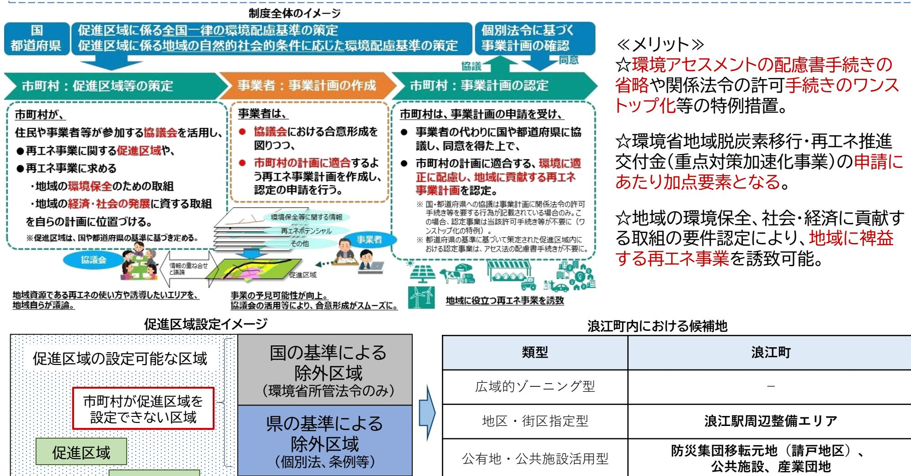
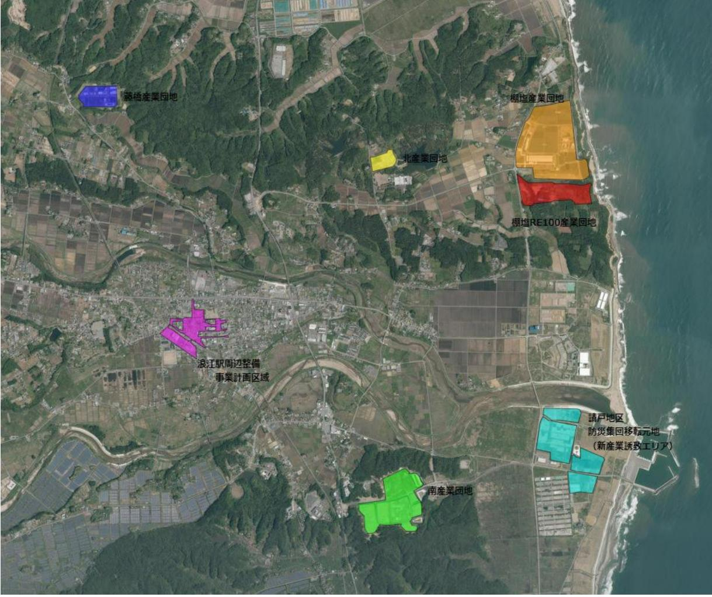
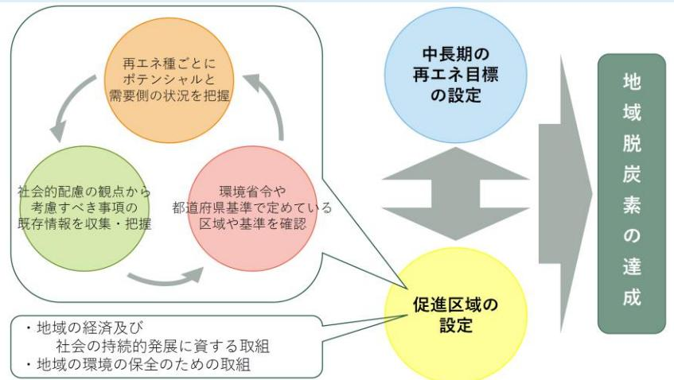
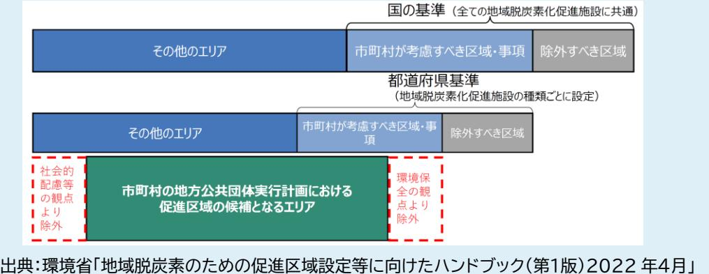
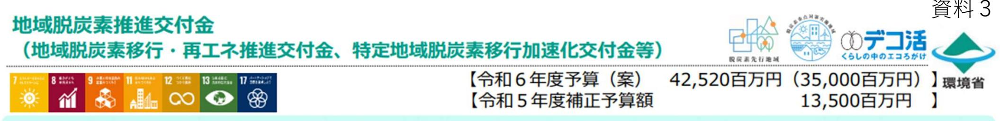
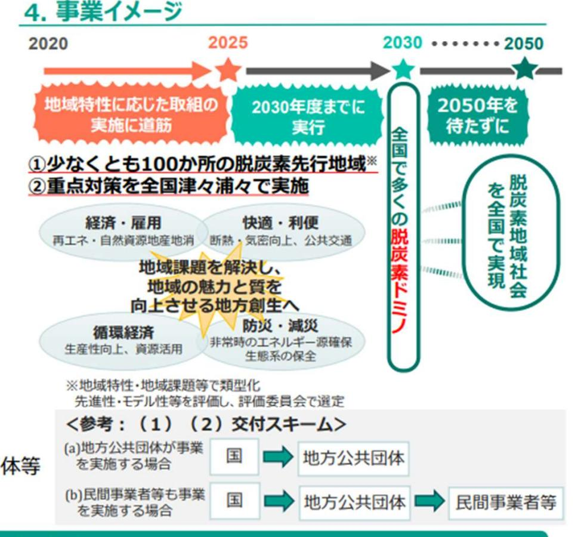
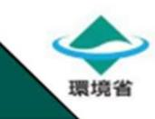
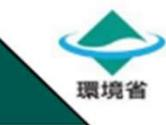

## 令和5年度第2回浪江町環境審議会

 開催日:令和 6 年 2 月 27 日(火) 場所:浪江町役場 402 会議室

### 次第

1 開会

- ・産業振興課長あいさつ
- ・会長あいさつ
- 2 議題
- (1) 地域脱炭素化促進事業(案)の策定について(資料1・2) ・再エネ促進区域の設定
- (2) 重点対策加速化事業の申請について(資料3・4)
- (3) 来年度の事業計画について(資料5・6)

### 3 閉会

| 配布資料                           |
|--------------------------------|
| 出席者名簿                          |
| 資料1:地域脱炭素化促進事業(案)について          |
| 資料2:地域脱炭素化促進事業(案)に対する意見と回答について |
| 資料3:重点対策加速化促進事業概要              |
| 資料4:重点対策加速化事業事業計画(案)           |
| 資料5:令和6年度脱炭素施策 進行管理         |
| 資料6:令和6年度環境審議会の予定              |
|                                |

### 出席者名簿

【浪江町環境審議会委員】

|           | 所 属                  | 会長 | 氏 名                                  | 備考    |
|-----------|-------------------------|----|-----------------------------------------|-------|
|           | 福島大学共生システム理工学類          | 〇  | かわ さき こう た 川 﨑 興 太 | オンライン |
| 学識 経験者 | 東京大学先端科学技術研究センター        |    | こうの たつ おき 河野 龍 興         | オンライン |
|           | 福島大学共生システム理工学類          |    | ごとう しのぶ 後藤 忍                   | 欠席    |
|           | 株式会社 伊達重機            |    | ぜんじ あきひろ 前司 昭博                 |       |
|           | 株式会社 舞台ファーム          |    | いとう けいいち 伊藤 啓一                 | オンライン |
| 事業者       | 株式会社 スマートアグリ・リレーションズ |    | なかやち よし あき 中谷内 美 昭       | オンライン |
| 団体 町民  | 行政区長会                   |    | さとう ひでぞう 佐藤 秀三                 |       |
|           | 會澤高圧コンクリート 株式会社      |    | あい ざわ たいし 會 澤 大志         | 欠席    |
|           | 浪江町民                    |    | さわむら 澤村 なつみ                       |       |

【事務局】

|     | 所 属                   | 氏 名    |
|-----|--------------------------|-----------|
|     | 産業振興課 課長              | 蒲原 文崇  |
| 浪江町 | 産業振興課 主幹              | 板垣 貴之  |
|     | 産業振興課 新エネルギー推進係長      | 小林 直樹  |
|     | 産業振興課 新エネルギー推進係 主査 | 藤田 知宏  |
|     | 産業振興課 新エネルギー推進係 主事 | 木原 可南子 |

# 地域脱炭素化促進事業(促進区域の設定)について

地域脱炭素化促進事業制度とは

促進区域

2022年4月、改正温対法により創設。円滑な合意形成を図り、適正に環境に配慮し、地域のメリットにもつながる、地域と共生する再エネ事業の導入を促進するもの。市町村は国や県が定める環境保全に係る基準に基づき、「促進区域」 を設定することができる。

事業提案型 -

資料1

# 浪江町地球温暖化対策総合計画 (別冊) 地域脱炭素化促進事業(案)

# 2024(令和6)年月浪江町

# 目次

# 地域脱炭素化促進事業

| 1 | 地域脱炭素化促進事業の概要 …………………………………………………………………………………………………………………………………………………………………………………………………………………………………………………………………………………………………………………………………………………………………………………………………………………………………………       |  |
|---|--------------------------------------------------------------------------------------------------------------------------------------------------------------------------------------|--|
|   | (1)事業の目的………………………………………………………………………………………………………………………………………………………………………………………………………………………………………………………………………………………………………………………………………………………………………………………………………………………………………………………        |  |
|   | (2)本事業により期待される効果 ………………………………………………………………………………………………………………………………………………………………………………………………………………………………………………………………………………………………………………………………… 1                                         |  |
|   | 2  地域脱炭素化促進事業の促進に関する事項 …………………………………………………………………………………………………………………………………………………………………………………………………………………………………………………… 1                                                                |  |
|   | (1)地域脱炭素化促進事業の目標…………………………………………………………………………………………………………………………………………………………………………………………………………………………………………………………………………………………………………………………………………………………………………………………………………………………………        |  |
|   | (2)地域脱炭素化促進事業の対象区域……………………………………………………………………………………………………………………………………………………………………………………………………………………………………………………………………………………………………………………………………………………………………………………………………………………………        |  |
|   | (3)促進区域において整備する地域脱炭素化促進施設の種類と規模…………………………………………………………………………………………………………………………………………………………………………………………………………………………………………………………………………………………………………………………………………………………………………………………        |  |
|   | (4)地域脱炭素化促進施設の整備と一体的に行う地域の脱炭素化のための取組…………………… 2                                                                                                                                       |  |
|   | 地域脱炭素化促進施設の整備と併せて実施すべき取組…………………………………………………………………………………………………………………………………………………………………………………………………………………………………………………………………………………………………………………………………………………………………………………………………………… (5) |  |
|   | (ア)地域の環境の保全のための取組 ……………………………………………………………………………………………………………………………………………………………………………………………………………………………………………………………………………………………………………………………………………………………………………………………………………………………        |  |
|   | (イ)地域の経済及び社会の持続的発展に資する取組 …………………………………………………………………………………………………………………………………………………………………………………………………………………………………………………………………………………………………………………………………………………………………………………………………………        |  |
|   | (6)浪江町再エネ促進区域マップ 3                                                                                                                                                               |  |

## 地域脱炭素化促進事業

### <spanid="page-5-0">1 地域脱炭素化促進事業の概要

2021 年に改正された地球温暖化対策推進法では、地方公共団体実行計画制度を拡充し、円滑な合意形成を図りながら、適正に環境に配慮し、地球に貢献する再エネ事業の導入拡大を図るため、地域脱炭素化促進事業の促進に関する制度が盛り込まれました。本制度では、国や都道府県基準に基づき、市町村が地域脱炭素化促進事業の対象となる区域を「促進区域」として定めるよう努めることとされています。

### <spanid="page-5-1">(1)事業の目的

本事業は、円滑な合意形成を図り、適正に環境に配慮し、地域のメリットにもつながる、地域と共生する再生可能エネルギー事業の普及・促進を図ることを目的とします。

- <spanid="page-5-2">(2)本事業により期待される効果
本事業により促進区域として設定した地域における再生可能エネルギー設備について、設置までの手続きが効率化され、市町村から認定を受けた事業者は、関係許可等手続きのワンストップ化や配慮書手続きの省略などの特例を受けることができます。

### <spanid="page-5-3">2 地域脱炭素化促進事業の促進に関する事項

本町では福島県の「地球温暖化対策の推進に関する法律に基づく促進区域の設定に係る基準」(以下、「県基準」とする。)に基づき、以下の通り「地域脱炭素化促進事業の促進に関する事項」を定めます。

- <spanid="page-5-4">(1)地域脱炭素化促進事業の目標
町内の再生可能エネルギー導入量基準:令和 4(2022)年度 101,100kW目標:令和 12(2030)年度 206,600kW

### <spanid="page-5-5">(2)地域脱炭素化促進事業の対象区域

- (ア) 町が所有する公共施設
- (イ) 請戸地区防災集団移転元地における新産業誘致エリア
- (ウ) 浪江駅周辺整備事業計画区域
- (エ) 藤橋産業団地、南産業団地、北産業団地、棚塩産業団地、棚塩RE100 産業団地
- なお、上記以外においても促進区域の対象とする区域を継続して検討することとします。
- <spanid="page-6-0">(3)促進区域において整備する地域脱炭素化促進施設の種類と規模種類:太陽光発電、風力発電規模:促進区域の状況に応じて適切な規模とすること
- <spanid="page-6-1">(4)地域脱炭素化促進施設の整備と一体的に行う地域の脱炭素化のための取組

地域脱炭素化促進施設から得られたエネルギーを町内の公共施設、地域住民、事業者に供給することや町が設立を検討する地域エネルギー会社との連携することなど、町が主導するエネルギーマネジメントに関する取組に協力することとします。

- <spanid="page-6-3"><spanid="page-6-2">(5) 地域脱炭素化促進施設の整備と併せて実施すべき取組
	- (ア)地域の環境の保全のための取組

騒音や反射光など周辺地域の生活環境に配慮するとともに、景観や生態系への影響についても十分留意すること。なお、県基準「第2章 3 考慮すべき事項に関する基準」に基づき、環境の保全に考慮し、必要な措置を講じることとします。

<spanid="page-6-4">(イ)地域の経済及び社会の持続的発展に資する取組

地域脱炭素化促進事業の実施にあたっては、県基準に基づき、以下の事項について地域脱炭素化促進施設の整備と併せて取り組むよう努めることとします。

- ・地域・近隣住民との合意形成に努めること
- ・災害時の非常用電源として活用すること
- ・環境教育への活用による地域の環境意識の向上を図ること
- ・課題解決など地域に還元すること
- ・地域づくりの取組に参加すること
- ・再生可能エネルギー電気の地域内経済循環に取り組むこと
- ・地域産業へ貢献すること
- ・事業実施により得られた知識や技術を積極的に地域に共有されること
- ・地元資本の事業者との連携を行うこと

<spanid="page-7-0">(6)浪江町再エネ促進区域マップ

【対象区域】

- 町が所有する公共施設(下図での記載は省略する)
- 請戸地区防災集団移転元地における新産業誘致エリア
- 浪江駅周辺整備事業計画区域
- 藤橋産業団地、南産業団地、北産業団地、棚塩産業団地、棚塩RE100 産業団地

### **コラム促進区域に関わる取組み**

再生可能エネルギーの導入を通じたカーボンニュートラル達成は、本計画の最大の目的ではあるものの、日本全国各地において、無秩序な発電所の開発や杜撰な管理運営によって、美しい自然環境や景観が損なわれたり、住民の生活利便性の低下、反射光による光害といった弊害も生まれています。

これを受けて、国では 2022 年 4 月に施行された改正温対法により「地域脱炭素化促進事業」制度を創設し、再生可能エネルギーの「促進区域」を設定することができようになりました。これは、地域の中で再生可能エネルギーの導入を促進していくエリアについて、様々 な分野の土地利用規制や住民の意向などを反映して、抽出・設定していくものとなります。

本町では、東日本大震災を受けて、防災集団移転促進事業の実施が行われたほか、現在も帰還困難区域が町の大部分を占める等、従前の土地利用が一変しています。

これまでの暮らしや文化を十分に尊重したうえで促進区域を設定することで、地域へ裨益する再生可能エネルギー事業を展開し、エネルギーの地産地消を推進します。促進区域の詳細は別冊を参照してください。

図 46 促進区域設定の考え方とその位置付け

| No. | 意見·要望                 | 町からの回答                                       |  |  |
|-----|-----------------------|----------------------------------------------|--|--|
| 7   | 水素エネルギーの利活用促進         | ご意見ありがとうございます。町内で水素の                         |  |  |
|     | ・地元浪江町の誘致企業からの水素エネル   | 利活用の促進には、活用する企業等のご協力 が重要と認識しております。国等に対し支援 |  |  |
|     | ギーの利活用促進。             |                                              |  |  |
|     | ・活用企業、法人等について、利用活用し   | の働きかけを行うとともに町としても普及啓                         |  |  |
|     | やすい環境にするため町として国に国か    | 発、支援に取り組んでまいりたいと思います。                        |  |  |
|     | らの補助金等引き出し利用するメリットを   |                                              |  |  |
|     | 働きかける。                |                                              |  |  |
|     | ・また活用・促進先については公表するこ   |                                              |  |  |
|     | とをお断りしひとつのPR財源の引き金、 |                                              |  |  |
|     | 発端となるよう施策に取り組む。       |                                              |  |  |
|     | ・活用、促進先の雇用形態についても各企   |                                              |  |  |
|     | 業にまかせるだけでなく町としても積極的   |                                              |  |  |
|     | に推進支援に取組む。            |                                              |  |  |
|     | ・水素エネルギー活用について専門家を招   |                                              |  |  |
|     | き講演会を催し、関心を浸透させる。     |                                              |  |  |
| 2   | 緑の植林の推進               | ご意見ありがとうございます。植林、緑の推進                        |  |  |
|     | ・山間部はもとより、空地・公園等へ植林及  | についても温暖化対策にあたって重要な観点                         |  |  |
|     | び緑化的公園の推進             | であり、支援策等も含めた具体的な施策につ                         |  |  |
|     | ・植林については面積に応じて補助金の援   | いては今後の検討としたいと思います。                           |  |  |
|     | 助とかなんらかのメリットがないと積極推   |                                              |  |  |
|     | 進は難しいと思えるのでそうしたことも合   |                                              |  |  |
|     | わせて考える必要があると思える。      |                                              |  |  |

### (約2%炭素の取組を行う地方公共団体等に対して、地域脱尿素推進交付金により支援します。

「地域脱炭素ロードマップ」(令和3年6月9日第3回国・地方脱炭素実現会議決定)、地球温暖化対策計画(令和3年10月22日閣議決定及び脱炭素成長型経済構造移行推進戦略(「GX推進戦略」、令和5年7月28日間議決定)等に基づき、民間と共同して意欲的に脱炭素に取り組む地方公共団体等に対して、地域の脱炭素への移行を推進するために本交付金を交付し、複数年度にわたり継続的かつ包括的に支援する。さ 1. 喜堂目的れにより、地球温暖化対策推進法と一体となって、少なくとも100か所の「脱炭素先行地域」で、脱炭素に向かう地域特性等に応じた先行的な取組を実施するとともに、脱炭素の基盤となる「重点対策」を全国で実施し、国・地方連携の下、地域での脱炭素化の取組を推進する。

### 2. 事業内容

足元のエネルギー価格高騰への対策の必要性も踏まえつつ、民間と共同して取り組む地方公共団体を支援することで、地域全体で再エネ・省エネ・蓄工ネといった脱炭素製品・技術の新たな需要創出・投資拡大を行い、地域・くらし分野の脱炭素化を推進する。

- (1) 地域脱炭素移行 · 再工ネ推進交付金
1脱炭素先行地域づくり事業への支援

2重点対策加速化事業への支援

- (2)特定地域脱炭素移行加速化交付金【GX】
民間神益型自営線マイクログリッド等事業への支援

### (3) 地域脱炭素施策評価・検証・監理等事業

脱炭素先行地域・重点対策加速化事業を支援する地域脱炭素推進交付金についてデータ等に基づき評価・検証し、事業の改善に必要な措置を講ずるとともに、適正かつ効率的な執行監理を実施する。

## 3. 事業スキーム

- (1) (2)交付金、(3) 委託費 ■ ■ ■ 壁形能
- ■交付対象・委託先 (1)(2)地方公共団体等、(3)民間事業者・団体等
- 令和4年度~令和12年度 ■実施期間

お問合せ先: 環境省大臣官房地域脱炭素推進審議官グループ地域脱炭素事業推進課電話:03-5521-8233

| 2 |  |  |  |
|---|--|--|--|

# 変更点① 採択制の本格実施

・脱炭素ドミルに資する地域脱炭素の基盤構築(地域エネルギー会社・地域金融機関との連携、地元業者等育成、クリウチ直展開・横展開、等)をより重視し、要件や評価の水準を引き上げるともに、評価の高いものから採択する。

# 変更点② 交付限度額の変更等

・これまでの採択実績も踏まえ、1計画あたり、以下のとおり交付限度額を変更する。

| 区分             | これまでの限度額 | 今後の限度額 |         |
|----------------|----------|--------|---------|
| 都道府県           | 20       | 15     |         |
| 政令市、中核市、施行時特例市 | 15       | 12     |         |
| その他市町村         | 15       | 10     | (単位:億円) |

・交付限度額における間接事業について、都道府県10億円、市区町村5億円までの上限要件は撤廃する。 ・今後は、直接事業(PPA・リース等により民間事業者が地方公共団体の公共施設に導入する事業を含む)の交付限度額が全体の交付限度額のうち、1/2以下であることを評価事項とする。 (詳細は11頁 2. (1) 参照)

# 変更点③ 地方公共団体実行計画の策定・改定時期の厳格化

・改正温対法を受けた地球温暖化対策計画の改定から一定経過したことを踏まえ、地方公共団体実行計画(事務事業編、区域施策編)の策定・改定時期について、以下のとおり変更する。

| 現行                               | 今後                                                             |
|----------------------------------|----------------------------------------------------------------|
| に基づく地方公共団体実行計画(事務事業編・区域施策編)を策    | 改正温対法を受けて改定された地球温暖化対策計画に即して、同法  令和6年度末までに、改正温対法を受けて改定された地球温暖化対 |
| 定若しくは改定していること、又は策定若しくは改定の予定時期の目安 |                                                                |
| 等が示されていること。                      | 編・区域施策編)の策定もしくは改定がなされること。                                      |

## 変更点④ 地域脱炭素の基盤構築を念頭に置いた審査基準の変更

・本事業を契機とした脱炭素ドラノの基盤の構築を図る取組として、ノウハウを他の自治体へ展開する取組や地域エネルギー会社・地域金融機関との連携した取組、地元業者育成のための取組等について高く評価する。 (詳細は12頁 2. (2) 、 (3) 、 (4) 、 (5) 参照)

# 変更点5 中間評価の実施

・令和6年度採択自治体は、事業計画の3年度目(令和8年度)において執行状況等を踏まえた中間評価を実施することし、当該事業の評価・分析を行い、必要に応じ計画の見直し等を行う。

| 令和6年度脱炭素施策進行管理一覧 【資料5】 |                                        |                                                                                                               |       |                                                                                   |                                                  |                                                                                                  |
|----------------------------|----------------------------------------|---------------------------------------------------------------------------------------------------------------|-------|-----------------------------------------------------------------------------------|--------------------------------------------------|--------------------------------------------------------------------------------------------------|
| 施策番号計画区分                  | 施策名称                                   | 施策概要                                                                                                          | 担当部署  | 指標                                                                                | 現況値(令和5年度末)                                      | 目標値(令和6年度末)                                                                                      |
|                            | A-01 事務事業エコライフ推進事業                    | レジ袋を減らすために共有のバックを各課へ配備する。バックの利用を促し、レジ袋削 減への意識啓発する。                                                         |       | 総務課レジ袋の削減を図るため各課へエコバックを配布                                                        | エコバック未配布                                         | バッグを配布し効果検証を行う                                                                                   |
|                            | A-02 事務事業ワークライフバランス推進事業               | 残業を常態化させないため、ノー残業デーを実施し、省エネやコスト削減、職員の業務 の質を向上させる。                                                          | 総務課   | 残業を常態化させないことでコスト削減と生産性を向上さ せる。職員の仕事と生活の調和を保ち休息やリフレッシュ の機会を設けることで業務の質を向上させる。 | ノー残業デー未実施                                        | ノー残業デーを試験的に実施し、次年度の 本格実施に向けて考察する。                                                             |
|                            | A-03 事務事業エコスタイル化事業                    | 季節及び業務内容に合わせた服装の基準を策定し、過度な冷暖房に頼らずとも高温時等 に服装を軽装化又は低温時等に温かく過ごせる等を推奨し、適切な温度での空調の使用 を促し省エネを推進する。            | 総務課   | 環境省が推奨するクールビズ・ウォームビズ等を参考と し、省エネ脱炭素に向けた取り組みの推進を目的として、 軽装勤務の通年実施を検討する。        | 5月1日~10月31日期間においてのクールビ ズを実施                   | 軽装勤務の通年実施に向けた準備を終える                                                                              |
|                            | A-04 事務事業オンライン会議推進事業                  | オンライン会議の推進により、出張に係るガソリン使用量の削減や会議室の利用、移動 時間を削減する。                                                           |       | 総務課会議等の出張回数を減らす                                                                  | 企画財政課の端末貸し出し状況及び各課の オンライン会議の実施状況等把握していな い。 | オンライン会議の実施状況を把握し、必要 があればタブレット端末の利用促進につい て周知する。 A:月平均10回(稼働日の半数)                         |
|                            | B-01 事務事業環境に配慮した事業活動の促進               | ISOに準ずる環境に配慮した事業活動の推進に取り組むことで、無駄なゴミや処分費を 削減する。また、公用車の稼働状況を把握し、適切な公用車台数を見極め、EV車・ FCV車等の環境性能車への切り替えを検討する。 | 総務課   | A:公用自転車活用回数 B:公用車燃料(ガソリン)使用量 C:可燃ごみ排出量                                      | A:― B:年間約40,000L C:年間約12t                | B:前年度比5%削減/年間 C:前年度比5%削減/年間 (目安:年間0.6t⇒運用開始後、月 100kg)                                   |
|                            | B-02 事務事業公共施設への太陽光発電・蓄電池導入推 進事業    | 令和5年度に改定する「公共施設等総合管理計画」を推進する。                                                                                 |       | 総務課 「個別施設計画」の策定(作成着手)                                                             | 計画策定数:0件/約50件(総数)                                | 策定件数:25件/約50件(全件作成着手)                                                                            |
|                            | C-01 事務事業来庁者向け新聞の廃止事業                 | 来庁者用に配置している新聞について、来庁者の利用が低い一部の新聞を廃止する。                                                                        |       | 総務課来庁者用の新聞の廃止                                                                    | 2階東側スペース分:毎日6社の新聞を購 入。主に職員が閲覧。                | 廃止                                                                                               |
|                            | C-02 事務事業予算書・決算書のペーパーレス化事業            | 予算書や決算書について紙の印刷を廃止し、電子データで共有する。                                                                               |       | 企画財政課予算書・決算書の印刷部数                                                                | 70部(議員+執行部+保存用)                                  | 45部(議員+保存用)                                                                                      |
|                            | C-03 事務事業口座振込通知書の一部廃止事業               | 口座振込通知書を段階的に廃止し、用紙や経費を削減する。                                                                                   |       | 出納室口座振込通知書の作成(用紙代)及び送付(郵送料)に係る経 費の削減                                          | 約2,000通                                          | 1,000通                                                                                           |
|                            | D-01 区域施策農地等の炭素貯留事業                   | 農地改善用の緑肥作物の種子購入費の補助を実施し土壌炭素の貯留により、CO2の純排 出量を減らす。また、R8稼働予定の大規模酪農施設からの堆肥散布体制の構築や耕畜 連携を体制の確立する。            |       | 農林水産課緑肥作物の種子購入補助件数                                                               | 0件                                               | 5件                                                                                               |
|                            | E-01 区域施策環境基本計画への反映                   | 浪江町環境基本条例に基づく環境基本計画を2か年かけて策定し、町の環境保全等につ いて指針を示す。令和6年度に基礎調査と計画骨子を作成し、令和7年度に計画策定す る。                      | 住民課   | 産業振興課環境基本計画策定骨子                                                                  | 未作成                                              | 作成済                                                                                              |
|                            | E-02 区域施策CO2排出量の見える化(アプリ)             | 町民一人当たりの排出量を計算することで、そのデータをもとにゼロカーボンの進捗率 を確認する。長期的に利用できるよう国や県に対し統一基準のアプリの作成を要望す る。                       | 産業振興課 | 住民課統一基準のアプリ作成                                                                    | 国・県に未要望                                          | 国・県に要望済                                                                                          |
|                            | F-01 区域施策脱炭素アワード                      | 役場内の脱炭素優良事例や町民・事業者の脱炭素優良事例を表彰し、町内外へ取組を広 く発信する。                                                             |       | 産業振興課脱炭素の取組み実施団体(≒応募件数)                                                          | 0件                                               | 10件                                                                                              |
|                            | F-02 区域施策町内水素需要創出事業                   | 駅周辺整備、F-REI、RE100団地など面的整備に合わせたでの水素利用方策検討し、町 内の水素需要先を創出する。                                                  |       | 産業振興課 (公共施設含む)水素需要先(※モビリティを除く)                                                    | 6か所                                              | 8か所                                                                                              |
|                            | F-03 区域施策脱炭素モニタリング                    | 家庭や事業所等の脱炭素の取組を定量的に把握するための仕組みづくりを行い、ゼロ カーボンシティの達成状況を把握する。                                                  |       | 産業振興課 ①役場のCO2排出量 ②町のCO2排出量の測定方法                                                | ①未実施 ②未把握                                     | ①定量的に把握する ②確立する                                                                               |
|                            | F-04 区域施策水素供給網構築事業                    | FH2Rの水素本格供給の関係者協議と並行して、町内に安定的かつ安価に水素を供給す るための方策を検討し、財源確保、供給網の整備を段階的に進める。                                   |       | 産業振興課水素パイプライン整備の方針や方法                                                            | 不明確                                              | 明確化する                                                                                            |
|                            | F-06 区域施策ZEV導入促進事業                    | 補助金の拡充や周知により、町民や町内事業者のZEV導入を促進する。                                                                             |       | 産業振興課補助金を活用してZEVを導入した件数                                                          | 4件(令和5年度)                                        | 10件                                                                                              |
|                            | F-08 区域施策町内EV充電環境構築事業                 | 町内のEV充電インフラを推進する。                                                                                             |       | 産業振興課EV充電環境構築の将来像                                                                | 不透明                                              | 明確化する                                                                                            |
|                            | F-10 区域施策脱炭素ツーリズム推進                   | 民間事業者へ働きかけを行い脱炭素ツーリズムの実施を推進する。                                                                                |       | 産業振興課ツアー本数増                                                                      | 未把握                                              | 増加                                                                                               |
|                            | F-11 区域施策学校教育を通じた脱炭素化推進事業             | 学校内のイベントや行事で児童生徒が自ら考え実践する体験型の脱炭素教育を行う。                                                                        |       | 教育総務課グリーンカーテンの制作 ソーラークッキング調理実習                                                | 未実施                                              | 実施                                                                                               |
|                            | F-12 区域施策 "浪江で作ってる水素ってどうやって使う の?"講座 | 脱炭素へ向けてクリーンエネルギーへの転換の意識づけを行うため、町民向け講座を開 催する。                                                               |       | 生涯学習課町民の水素に対する知識                                                                 | 浪江で作られている水素は何に使われてい るかわからない方が多い。              | 水素エネルギーについて知識を得ることに より、水素エネルギーを身近に感じ、水素 自動車の購入検討やリース契約などの促進 になり、クリーンエネルギーへの転換につ ながる。 |

# 令和6年度環境審議会の予定

# 今後予定している議題

- ・浪江町地球温暖化対策総合計画の進行管理
- ・重点対策加速化事業の進行管理
- ・地域エネルギー会社設立に向けた検討状況報告
- ・浪江町環境基本計画骨子について(令和7年度策定予定)
- ・脱炭素アワード等

スケジュール(予定)

事業の進捗等に応じて2,3回程度行います。 また、11月に委員の改選を予定しています。

|     | 時期    | 議事内容(予定)                                                      |  |
|-----|-------|---------------------------------------------------------------|--|
| 第1回 | 7~8月頃 | 庁内エネルギー使用状況(LAPSSデータ)報告 脱炭素アワード要綱(案)について その他事業進捗報告 等 |  |
| -   | 10月末  | 環境審議会委員任期(R4.11.1~R6.10.31)終了                                 |  |
| -   | 11月   | 環境審議会委員の改選 ※再任の場合あり                                        |  |
| 第2回 | 1~2月頃 | 環境基本計画骨子について 脱炭素アワード表彰について その他事業進捗報告 等               |  |