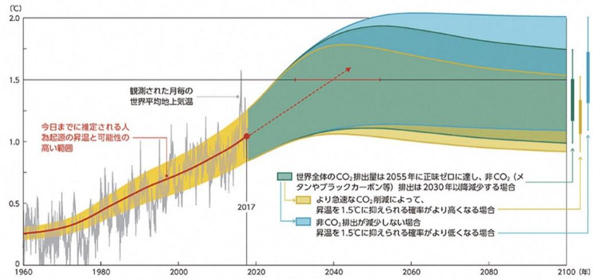
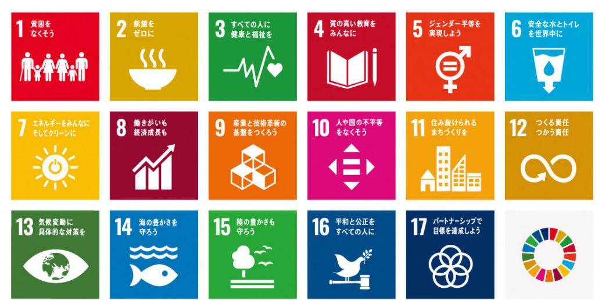
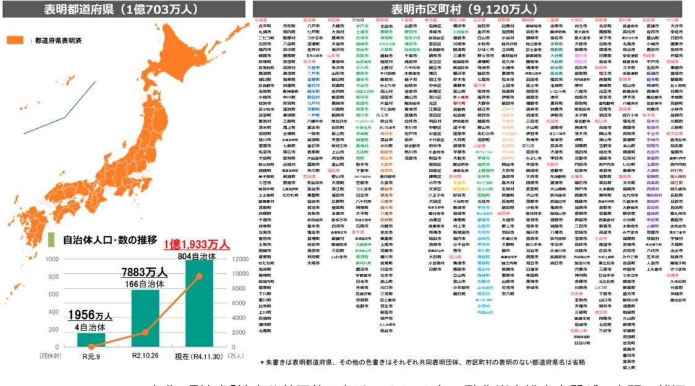
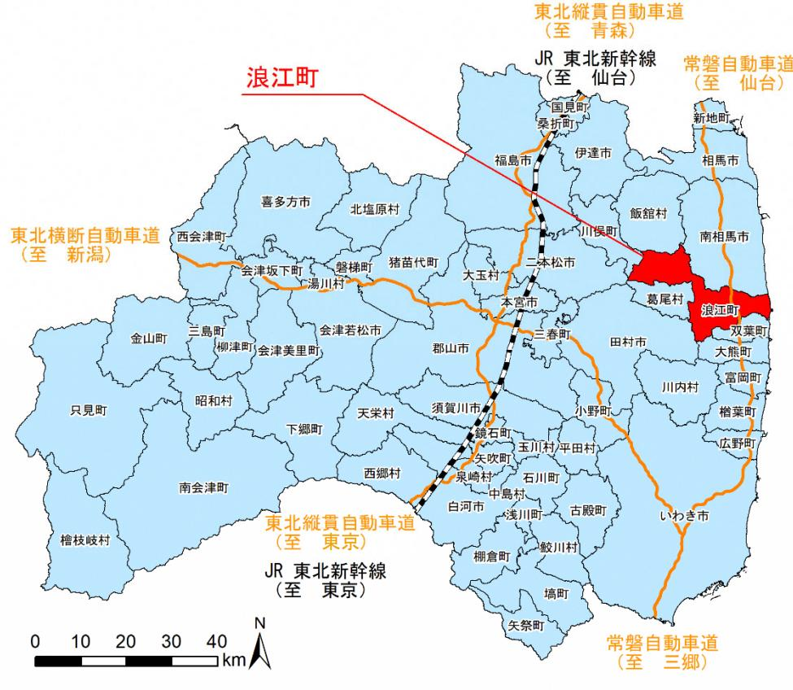

# 地球温暖化対策

# 総合計画

2023(令和5)年3月

157kWh

**+-**

**地域エネルギー会社**

SHARE

1000

12月

○○○kWh

COSTDOWN

> 321PP

月日日直ゼロ

CO20

# **NAMIEENERGYCHALLENGE 2035**

#### 序章~はじめに~

近年の地球温暖化の進行に伴う気候変動は、町においても局地的な豪雨などによる自然災害や一次産業への被害、熱中症などの健康被害にまで及び、私たちの身近な暮らしに大きな影響をもたらす問題となっています。

東日本大震災及び原子力災害により大きな被害を受けた本町は、浪江町復興計画【第二次】 以降、「エネルギー地産地消のまちづくり」を掲げ、原子力や化石燃料に頼らない再生可能エネルギーの導入推進と、エネルギー地産地消によるスマートコミュニティの構築に取り組んできました。2020 年 3 月には福島水素エネルギー研究フィールド(FH2R)の開所に伴い、浪江産水素を活用した「水素社会実現の先駆けとなるまちづくり」を推進することとし、 「ゼロカーボンシティ(2050 年二酸化炭素排出実質ゼロ)」を宣言しました。そして 2021 年 3 月に改定した浪江町復興計画【第三次】においても、復興に向けた施策の 1 つとして「ゼロカーボンシティの推進」を掲げ、取り組んでいるところです。

本町はいまだ復興の道半ばであり、すでに「カーボンニュートラル」を達成している状況にありますが、復興により経済・社会活動がますます増加していくこととなります。そこで、 「自ら勝ち取るカーボンニュートラル」を理念に掲げ、復興への歩みを止めることなく、これまで以上に、カーボンニュートラルに向けた実効的な施策を展開するため、「浪江町地球温暖化対策総合計画~なみえエネルギーチャレンジ 2035~」を策定しました。本計画の推進によって、温室効果ガスの排出削減につながるとともに、浪江町及び浜通り地域全体の復興に寄与するものと考えております。特に、「まちの顔」である浪江駅周辺エリアの整備や、福島国際研究教育機構(F-REI)の設立、産業の再興等のさまざまな復興まちづくりにおいて、カーボンニュートラルとの両立を図ることで持続可能な社会を実現してまいります。計画の推進にあたっては、町民や事業者の皆さまと協働し、全力で取り組んでまいりたいと思

いますので、皆さまの一層のご理解とご協力をお願い申し上げます。

最後になりましたが、本計画の策定にあたり多大なご尽力や貴重なご意見を賜りました浪江町環境審議会の皆さまをはじめ、ご協力いただいた町民、関係者の皆さまに心より感謝申し上げます。

浪江町長吉田栄光

| 第 1       | 章. 浪江町地球温暖化対策総合計画策定の背景・意義  2              |  |
|--------------|-------------------------------------------|--|
|              | 1.1 地球温暖化対策を巡る動向  2                       |  |
|              | 1.2 本町の地域の特性(自然・社会・経済の特徴)  17             |  |
|              | 1.3 浪江町地球温暖化対策総合計画の策定意義と位置づけ 23           |  |
| 第 2       | 章. 浪江町の温室効果ガス排出量の現況と将来推計  27              |  |
|              | 2.1 温室効果ガス排出量の現況把握  27                    |  |
|              | 2.2 温室効果ガス排出量の将来推計  28                    |  |
|              | 2.3 森林による温室効果ガス吸収量  30                    |  |
| 第 3       | 章. 再生可能エネルギーの導入ポテンシャルと地域特性  32            |  |
|              | 3.1 再生可能エネルギー導入ポテンシャル  32                 |  |
|              | 3.2 再生可能エネルギーに関わる地域特性 37                  |  |
|              | 3.3 復興まちづくりやカーボンニュートラルに向けた地域の現状と課題の整理  40 |  |
| 第 4       | 章. 本町の目指す将来像と基本方針  42                     |  |
|              | 4.1 基本理念  42                              |  |
|              | 4.2 基本理念に基づき目指す将来像  43                    |  |
|              | 4.3 基本方針  46                              |  |
| 第 5 章. | 目標設定と達成に向けた施策 49                          |  |
|              | 5.1 本計画における目標設定 49                        |  |
|              | 5.2 温室効果ガス排出量の抑制目標  51                    |  |
|              | 5.3 再生可能エネルギーの導入目標  53                    |  |
|              | 5.4 目標達成にむけた施策  55                        |  |
|              | 5.5 施策に対する KPI 指標と役割  57            |  |
| 5.6          | 2030 年の将来像の実現に向けた取組み 61                |  |
|              | 5.7 ロードマップ  63                            |  |
|              | 第6章. 浪江町の地球温暖化対策の適応策 66                   |  |
|              | 6.1 適応策とは  66                             |  |
|              | 6.2 適応策に関わる基本的事項  67                      |  |
|              | 6.3 気候変動に関する影響  68                        |  |
|              | 6.4 適応に向けた基本方針と取組み  76                    |  |
|              | 第7章. 浪江町公共施設における率先的行動 82                  |  |
|              | 7.1 はじめに  82                              |  |
|              | 7.2 温室効果ガス排出量と抑制目標  82                    |  |
|              | 7.3 温室効果ガス排出削減に向けた対策・施策  90               |  |

| 第8章.資料編  95                      |  |
|----------------------------------|--|
| 8.1 温室効果ガスの算定方法 95               |  |
| 8.2 再生可能エネルギーの導入ポテンシャルの推計方法  100 |  |
| 8.3 用語集  101                     |  |
| 8.4 パブリックコメントの実施  105            |  |
| 8.5 浪江町環境審議会と計画策定までの経過 107       |  |

# chapter**01**

第 **1** 章

# **浪江町地球温暖化対策総合計画策定の背景・意義**

**気候変動の現状と気候変動対策に関する国内外の動向、福島県と浪江町の動向について記載しています。 また、本町の将来像や本戦略の位置づけについても記述します。**

# **第 1 章. 浪江町地球温暖化対策総合計画策定の背景・意義**

## **1**.**1 地球温暖化対策を巡る動向**

#### **(1)地球温暖化(気候変動)の影響**

近年、世界各地で異常気象による災害が頻発しています。日本においても、豪雨災害や農作物の品質低下、熱中症の搬送者数の増加など気候変動の影響が発生しています。

世界気象機関(WMO)は要因の一つとして、温室効果ガス排出量の増加による長期的な地球温暖化の傾向との関連を分析しており、地球温暖化の進行によって、地球規模にわたる深刻で不可逆的な影響をもたらす恐れがあります。

世界の年平均気温は、様々な変動を繰り返しながら上昇しており、長期的には 100 年当たり 0.72℃の割合で上昇しています。また、日本の年平均気温も、様々な変動を繰り返しながら上昇しており、長期的には 100 年あたり 1.26℃の割合で上昇しています。特に 1990 年代以降、高温となる年が頻出しています。

出典:熱中症ゼロへホームページ(一般社団法人日本気象協会) 図 1 気候変動の影響

#### **(2)国際的な動向**

①地球温暖化の科学的根拠

「気候変動に関する政府間パネル(IPCC)*01」は、気候変動に関連する科学的、技術的、社会・経済的な情報の評価を行い、得られた知見を広く一般に利用するために国連に設立された組織です。IPCCは 2013 年から 2014 年にかけて「第5次評価報告書」を公表しており、「気候システムの温暖化に疑う余地のないこと」、「人為起源の温室効果ガスの排出が20 世紀半ば以降に観測された温暖化の支配的な原因であった可能性が極めて高いこと」、「21 世紀終盤及びその後の世界平均の地表面の温暖化の大部分は二酸化炭素の累積排出量によって決められること」などが示されています。

出典:気候変動に関する政府間パネル(IPCC)『1.5℃特別報告書』より環境省作成資料図 2 1850~1900 年を基準とした気温上昇の変化

出典:環境省「気候変動の、いまを伝える。IPCCreportcommunicatorガイドブック~基礎知識編~」 ※RCPとはRepresentativeConcentrationPathways(代表的濃度経路)の略称

図 3 温室効果ガス排出量の将来予測とその影響

②持続可能な開発目標(SDGs)と地球温暖化

2015 年 9 月の国連総会において、SDGs(持続可能な開発目標)を掲げる「持続可能な開発のための 2030 アジェンダ」が採択され、2020 年 1 月には、SDGs達成のための「行動の 10 年」がスタートしました。

SDGsは、17 の目標と 169 のターゲットを設定し、「誰一人取り残さない」社会の実現を目指し、環境・経済・社会をめぐる広範な課題について、統合的に取り組むことを掲げています。

ゴール 7 には「エネルギーをみんなにそしてクリーンに」、ゴール 13 には「気候変動に具体的な対策を」が掲げられており、再生可能エネルギーや地球温暖化(気候変動)にかかる具体的な行動を起こすことが求められています。

図 4 SDGsにおける 17 の目標

#### ③「パリ協定」の影響

2015 年 12 月にフランス・パリで開催された気候変動に関する国際連合枠組条約第 21 回締約国会議(COP21)で、2020 年以降の地球温暖化対策の国際的な枠組みとして、「パリ協定」が採択されました。主要排出国を含む多くの国が参加。締結国だけで、世界の温室効果ガス排出量の約 86%、159 か国・地域をカバーするものとなっています(2017 年 8 月当時)。

パリ協定では、長期目標として 2℃目標を設定し、工業化以降の気温上昇を「2℃未満」、できれば「1.5℃未満」に抑えること、今世紀中に温室効果ガス排出量と吸収量との均衡を達成し、温室効果ガス排出量実質ゼロを目指すことが掲げられました。この内容に基づき、世界各国が目標達成のための具体的な数値目標を設定しています。

| 国名    | 1990年比                                                              | 2005年比                            | 2013年比 削減目標       |  |  |  |
|-------|---------------------------------------------------------------------|-----------------------------------|----------------------|--|--|--|
| 日本    | ▲18.0%                                                              | ▲25.4% 削減目標                    | ▲26.0% (2030年までに) |  |  |  |
| 米国    | ▲14~16% 削減目標                                                     | ▲26~28% (2025年までに)             | ▲18~21%              |  |  |  |
| EU    | ▲ 40% (2030年までに)                                                 | ▲35%                              | ▲ 24%                |  |  |  |
| 中国    | 2030年までに2005年比でGDP当たりの二酸化炭素排出を60~ 65%削減 2030年頃に二酸化炭素排出のピークを達成 |                                   |                      |  |  |  |
| FETER |                                                                     | 2030年までに、対策を講じなかった場合の2030年比で37%削減 |                      |  |  |  |

#### 表 1 パリ協定における主要国の約束草案(当初段階)

※パリ協定締結時の数値。2022 年現在は、カーボンニュートラルの表明などを受け、2013 年度比で 46%の温室効果ガス排出量削減を我が国の目標としている。

出典:資源エネルギー庁「今さら聞けない「パリ協定」 ~何が決まったのか?私たちは何をすべきか?~」

#### ④ESG投資の発展

世界では、脱炭素社会への移行や持続可能な経済社会づくりに向けたESG金融*02(環境(Environment)・社会(Social)・企業統治(Governance)といった要素を考慮する投融資)への取組が、パリ協定やSDGs等を背景として、欧米から先行して普及・拡大してきました。こうした資金の流れは、我が国においても近年急速に拡大しています。世界全体のESG投資残高に占める我が国の割合は、2016 年時点では約 2%でしたが、2018 年には世界全体の約 7%を占め、成長率では世界一です。2019 年時点の日本のESG投資残高は約 3 兆ドル(336 兆円)と、2016 年からの直近 3 年で約 6 倍にまで拡大しています。

出典:環境省

図 5 ESG投資の発展状況

#### **(3)国の政策動向**

#### ①脱炭素社会の実現

2020 年 10 月 26 日の所信表明及び米国主催「気候サミット」(2021 年 4 月 22 日~23 日)において、「2050 年カーボンニュートラル*03 の長期目標と整合的で、野心的な目標として、我が国が 2030 年度において、温室効果ガスの 2013 年度からの 46%削減を目指すことを宣言するとともに、さらに、50%の高みに向け、挑戦を続けていく」ことを表明しました。

この表明の中で、「2030 年における温室効果ガス排出量を基準年の 2013 年度比で 46%削減する」という目標が掲げられ、これを受け「地球温暖化対策推進法」(2021 年 3 月 2 日)の改訂が閣議決定されました。この法律の中では、(1)パリ協定・2050 年カーボンニュートラル宣言等を踏まえた基本理念の新設、(2)地域の再エネを活用した脱炭素化を促進する事業を推進するための計画・認定制度の創設、(3)脱炭素経営の促進に向けた企業の排出量情報のデジタル化・オープンデータ化*04 の推進等、といった項目が改訂されています。

図 6 地球温暖化対策推進法の一部を改正する法律案

なお、これに関連して国内でも「ゼロカーボンシティ宣言」と呼ばれる 2050 年までに温室効果ガス排出量を実質ゼロとする表明を自治体が行う動きが加速しています。

2022 年 11 月現在、804 自治体が「ゼロカーボンシティ宣言」を表明しています。表明された自治体に在住の人口合計は 1 億 1,933 万人に及び、日本国民のほとんどがこの動きに連動して進んでいくことになります。

出典:環境省「地方公共団体における 2050 年二酸化炭素排出実質ゼロ表明の状況」 図 7 2050 年二酸化炭素排出実質ゼロ表明自治体(2022 年 11 月 30 日時点)

②地球温暖化対策計画の改定

2016 年に初めて策定された地球温暖化対策計画は、2021 年 10 月に地球温暖化対策推進法に基づいて、新たな計画として改訂されました。

2050 年カーボンニュートラル実現という新たな命題に対し、中期目標として 2030 年度において、温室効果ガスを 2013 年度比 46%削減することを目指し、さらに 50%の高みに向け挑戦を続けていくことが明記され、先述のとおり、パリ協定締結時の約束草案から大幅な引き上げがなされました。

| 温学効果加家   H-        |                     |         | 2013排出実績                                                                                    | 2030排量量 | 削減率   | 従来目標          |  |
|---------------------|---------------------|---------|---------------------------------------------------------------------------------------------|---------|-------|---------------|--|
| ·吸収量 (単位:億t-CO2) |                     |         | 14.08                                                                                       | 7.60    | ▲46%  | ▲26%          |  |
| エネルキー起源CO2          |                     |         | 12.35 6.77                                                                               |         | ▲45%  | ▲25%          |  |
|                     |                     | 産業      | 4.63                                                                                        | 2.89    | ▲38%  | ▲ 7%          |  |
|                     |                     | 業務その他   | 2.38                                                                                        | 1.16    | A 51% | ▲40%          |  |
|                     | 글 Pil            | 家庭      | 2.08                                                                                        | 0.70    | ▲66%  | 439%          |  |
|                     |                     | 運輸      | 2.24                                                                                        | 1.46    | ▲35%  | ▲27%          |  |
|                     |                     | エネルギー転換 | 1.06                                                                                        | 0.56    | ▲47%  | ▲27%          |  |
|                     | 非エネルギー起源CO2、メタン、N2O |         | 1.34                                                                                        | 1.15    | ▲14%  | ▲ 8%          |  |
| HFC等4ガス(フロン類)       |                     |         | 0.39                                                                                        | 0.22    | ▲44%  | ▲25%          |  |
| 吸収源                 |                     |         | ▲0.48 -                                                                                  |         |       | (▲0.37億t-CO2) |  |
| 二国間クレジット制度(JCM)     |                     |         | 官民連携で2030年度までの累積で1億t-CO>程度の国際的な排出削減・ 吸収量を目指す。我が国として獲得したクレジットを我が国のNDC達成のため に適切にカウントする。 | -       |       |               |  |

表 2 温室効果ガスの削減目標

出典:環境省「地球温暖化対策」

- 7 -

③第 6 次エネルギー基本計画の改定

エネルギー基本計画は3年ごとに見直しを行っており、2021 年 10 月に第 6 次計画を決定して、中長期的なエネルギー政策の方針を示しています。

新たな計画では、脱炭素社会を見据え、徹底した省エネの更なる追求とともに、2030 年度の電源構成について、再生可能エネルギー比率を前計画の 22~24%から 36~38%に引き上げ、火力発電を 56%から 41%に引き下げることとしています。

エネルギー政策を進める上では、安全性を前提とした上で、エネルギーの安定供給を第一とし、経済効率性の向上による低コストでのエネルギー供給を実現し、同時に、環境への適合を図る視点が重要としています。再生可能エネルギーに関しては、2050 年における主力電源として最優先の原則の下で国民負担の抑制と地域との共生を図りながら最大限の導入に取り組むこととしています。

出典:経済産業省「2030 年度におけるエネルギー需給の見通し(関連資料)」 図 8 2030 年度の電力需要と電源構成の見通し

#### **(4)福島県の動向**

①福島県地球温暖化対策推進計画の改定

2050 年までに脱炭素社会の実現を目指す「福島県 2050 年カーボンニュートラル」の宣言、県総合計画に地球温暖化対策を主要施策として位置づけ全庁を挙げて取り組む等の背景を受け、2021 年 12 月に改訂されました。

「県民総ぐるみの地球温暖化対策の推進による福島県 2050 年カーボンニュートラルの実現」を基本目標として掲げ、省エネの徹底、再エネの最大限の活用、吸収源対策、気候変動への適応の推進を基本姿勢として、2013 年度比で 2030 年度までに 50%、2040 年度までに 75%、2050 年度までにカーボンニュートラルを目指すこととしています。

出典:福島県「福島県地球温暖化対策推進計画」

#### ②福島県再生可能エネルギー推進ビジョン 2021 の策定

2030 年を見据えた、次の 10 年の新たなビジョンとして 2021 年 12 月に策定されました。「2040 年頃を目途に県内エネルギー需要の 100%以上に相当するエネルギーを再生可能エネルギーから生み出す」という目標をより着実に達成するため、持続可能な社会を目指すという認識のもと、「再生可能エネルギーの導入推進」と「再生可能エネルギー関連産業集積」という従来から進めてきた柱となる施策に加え、「持続可能なエネルギー社会の構築」、 「水素社会の実現」を新たに追加し、これらを連動させながら、2030 年度の中間目標である再エネ導入量 70%の達成、そして、福島県の更なる復興の加速と持続可能な社会づくりを目指していくこととしています。

③福島イノベーション・コースト構想

福島イノベーション・コースト構想は、東日本大震災及び原子力災害によって失われた浜通り地域等の産業を回復するため、当該地域の新たな産業基盤の構築を目指す構想のことです。廃炉、ロボット、エネルギー、農林水産等の分野におけるプロジェクトの具体化を進めるとともに、産業集積*05 や人材育成、交流人口の拡大等に取り組んでいます。

出典:福島県ふくしま復興ステーション「福島イノベーション・コースト構想の概要図」 図 11 福島イノベーション・コースト構想の概要

#### ④福島新エネ社会構想

再生可能エネルギーの最大限の導入拡大を図るとともに、再生可能エネルギーから水素を「作り」、「貯め・運び」、「使う」、未来の新エネルギー社会実現に向けたモデルを福島で創出することを目指すものです。「再生可能エネルギーの導入拡大」、「水素社会実現に向けたモデル構築」、「スマートコミュニティの構築」を柱として、その実現に向けては、2020、 2030、2040 年頃をそれぞれ目途とする 3 つのフェーズを設定し、それぞれのフェーズ*06 で目指す姿を可能な限り明らかにしつつ、着実に取組んでいます。

出典:資源エネルギー庁「福島新エネ社会構想」 図 12 構想に関連する県内の取組み

#### **(5)本町の動向**

本町では、浪江町復興計画【第三次】を中心に各種計画の策定が進められており、エネルギー関連政策も同様です。ここでは、関連する計画や施策の内容を整理しました。

①ゼロカーボンシティ宣言

2020 年 3 月に 2050 年までにCO2 排出量実質ゼロを目指すことを表明しました。このゼロカーボンシティ宣言の表明は、全国では 77 番目で、県内では郡山市、大熊町に続き 3 番目です。

本町の環境保全について、基本理念を定め、町、事業者及び町民の責務を明らかにするとともに、環境の保全等に関する施策の基本となる事項を定め、その施策を総合的かつ計画的に推進し、もって現在及び将来の町民の健康で文化的な生活の確保を目指すものとして制定しています。

出典:浪江町

図 14 浪江町環境基本条例の概要

③浪江町再生可能エネルギー推進計画

再生可能エネルギーの活用や関連産業の育成に努め、魅力的かつ持続可能なまちづくりを目指すことを目的に策定された計画です。

浪江町では、浪江町復興計画【第二次】において「エネルギーの地産地消」へのチャレンジが提言され、エネルギーの地産地消を住民生活の中に定着させていくことを施策の柱の 1 つとしており、再生可能エネルギーの導入推進が本町のまちづくりに相乗効果を生み出すような具体的な計画として位置づけています。

出典:浪江町「浪江町再生可能エネルギー推進計画」 図 15 計画表紙

#### ④スマートコミュニティ*07 事業

エネルギーマネジメントシステム*08 による制御、太陽光発電や電気自動車等の組合せと活用により、エネルギーの効率的な利用や安全・安心なまちづくりを目指しています。

期待される効果として、エネルギーマネジメントシステムの構築による 500t-CO2 あまりの温室効果ガス削減、太陽光発電等の積極的導入を通じた再生可能エネルギーの導入率の向上、電気自動車等を活用した災害時の重要拠点への電力供給やエネルギーの自立による災害時の町民等の安全・安心の確保等があります。

図 16 スマートコミュニティ事業の全体像

#### ⑤棚塩産業団地へのFH2Rの誘致

国の福島水素エネルギー研究フィールド(FH2R)を誘致し、その先進的な技術情報の収集や関連事業者との連携を進めています。

出典:国立研究開発法人新エネルギー・産業技術総合開発機構(NEDO) 写真 1 福島水素エネルギー研究フィールド(FH2R)の構成と外観

⑥浪江駅周辺整備事業におけるカーボンニュートラル先進モデルエリアの構築

中心市街地の再生とゼロカーボンシティの核となる先進的なモデルエリアの確立を目指します。詳細は後述しますが、再開発を通じて駅周辺の整備と先行的にカーボンニュートラルとRE100*09 を実現するエネルギーの先進モデルエリアとして位置づける予定です。

出典:浪江町

図 17 駅周辺整備によるエリアイメージ

#### ⑦水素タウン構想の策定

FH2Rとの連携を活かすとともに、水素利用において山積する「つくる」「はこぶ」「つかう」 という各フェーズにおける課題の整理・解決を目指し、水素の活用によって目指すべきまちの絵姿を示しています。

図 18 なみえ水素タウン構想の概要

#### **コラム水素利用に関する国際情勢と浪江町への期待について**

日本では 2017 年に「水素基本戦略」を国家戦略として世界に先駆けて打ち出したほか、その以前から車両メーカーや電機メーカーが関連技術の開発を進め、数多くの特許を取得しており、世界をこれまでも、これからもリードする分野として期待されています。しかしながら、欧米諸国や中国などを中心に莫大な国家予算が投入され、国家間での技術開発と普及に向けた競争は激化の一途をたどっており、いち早く水素利活用技術を確立し、実際に運用するくらしの姿を作っていくことが重要です。

水素が一般に普及するための課題はまだまだ山積みです。具体的には水素利用の用途拡大、安価な水素の確保、国内外に向けた流通体制の構築、貯蔵と製造効率の最適化等が挙げられます。現時点では、特に他のエネルギーに比べて高価で採算性が見込みづらい点がネックとなっていますが、本町には国の福島エネルギー研究フィールド「FH2R」が立地し、水素利用が身近な存在になる可能性を秘めています。

水素を利活用した社会をいち早く本町で実現し、将来の地域づくりのモデルケースとなることを目指していきます。その上で、町自身が積極的に取り組むことは当然のことながら、町民や事業者の皆さんとも一緒に「新しい事業へ協力・投資する」姿勢で水素を見つめ、考え、取り組み、浪江町全体での動きを加速していきたいと考えています。

#### ⑧パートナーシップの推進・対外発信

国、民間企業、海外の都市などとの各種協定を積極的に締結し、人的交流や情報交換、技術提供等を進めています。また、国際会議や国内のシンポジウム*10 などで本町の取組みを広く紹介し、エネルギー分野における本町の先端性や存在感を高めています。

写真 2 様々な関係者との連携・協定の様子

# **1.2 本町の地域の特性(自然・社会・経済の特徴)**

#### **(1)本町の歴史とアイデンティティ***11

本町の歴史は、古くは縄文時代までさかのぼることが出来ます。現在の浪江町の東部、高瀬川と請戸川の 2 河川による河岸段丘の台地上には、古くから文明の形跡が確認できます。

一方、貞観の津波、慶長の津波等、古くから津波災害の被害を受けてきた地域でもあり、さらに月日を経て、再び東日本大震災に見舞われることとなりました。

1859(安政 6)年には、西からの強風にあおられた大火災が発生しました。翌年の 1860 (安政 7)年、町並みは抜本的に変更され、南北に長い新町通りの建設が、防火思想を結集して開始されました。この経験を後世に受け継ぐための「裸参り」と呼ばれる火防祈祷祭が始まり、その伝統は現代にも継承されています。

このように、本町はこれまでも様々な天災・災害被害を受けてきた地域であるとともに、力を結集して何度も立ち上がってきた歴史があります。

2011 年 3 月 11 日の東日本大震災は、福島、宮城、岩手を中心とした東日本全体に甚大な被害をもたらしました。福島県では、東京電力福島第一原子力発電所の事故のため、双葉郡の市町村の住民は避難を余儀なくされ、浪江町 21,000 人の町民は全国に散り散りになってしまいました。避難指示が継続するなか、避難指示解除準備区域、居住制限区域については、除染・インフラ復旧・生活基盤の再生を進め、2017 年 3 月 31 日に避難指示が解除されました。しかし、帰還困難区域の避難指示がすべて解除されていないため、「帰町宣言」はしていません。また、これらの状況を受け、2013 年 3 月に、約 40 年間にわたって計画されていた棚塩への浪江小高原子力発電所の建設が白紙撤回されました。建設予定地は、東北電力株式会社より本町に無償譲渡され、現在はこの土地に福島水素エネルギー研究フィール(FH2R)を誘致して水素の利活用について連携を図っています。

様々な理由で町に戻れない方が、それぞれの場所で生活再建を果たせるよう町はできる限り支援を続けていきます。復興計画をもとに震災前と全く同じ町でなくとも、苦難から立ち上がった町民の方々が笑顔で生活している町を目指して、復興を進めています。

写真 3 避難指示区域一部解除以降の復興の進展

#### **(2)自然的特徴(位置、地形、気象)**

①位置・面積

本町は、福島県の最東端、浜通りの中央部、双葉郡の北部に位置し、東は太平洋に面しています。主要都市との距離では、福島市までは約 70km、郡山市まで約 75km、いわき市まで約 60km、仙台市まで約 95km、東京まで約 260kmとなっています。

町を縦断する幹線として、町の東部を常磐自動車道、国道 6 号が首都圏と仙台方面を結んでいます。面積は約 223km2と双葉郡8町村の中で最も大きい自治体となります。

出典:国土交通省「国土数値情報(行政区域等)」 図 19 本町の位置・面積

#### ②地形

北部には請戸川、南部には高瀬川が流れ、河口近くで合流し太平洋に注ぎ、山・川・海と変化に富む地形条件となっています。

町域の西方の阿武隈高地は、双葉郡、田村郡、安達郡の境界をなす日山(約 1,058m)、白馬石山(約 821m)、高太石山(約 863m)が連なっており、町域の中央部の手倉山の標高は約 631mと高く、古くから登山客の憩いの場となっていました。町域の東方は、中心市街地を含み比較的平らな土地が広がっています。

出典:国土交通省「基盤地図情報(数値標高モデル 10m)」 図 20 本町の地形

③気象

本町は、「東日本型海洋性」に区分され、年間平均気温は12.7℃と東北地方の中では温暖な気候です。

降水量は秋季に多くなりますが、年間の降水量は約 1,539mmとなり、全国平均の約 1,700mmを下回ります。日照時間は、1 月から 5 月に多くなり、最も多いのは 5 月の 194.3 時間です。

表 3 本町の気象状況(統計期間 1991 年~2020 年)

| 項目            | 1 月   | 2 月   | 3 月   | 4 月   | 5 月   | 6 月   | 7 月   | 8 月   | 9 月   | 10 月  | 11 月  | 12 月  |            | 年間値      |
|---------------|-------|-------|-------|-------|-------|-------|-------|-------|-------|-------|-------|-------|------------|----------|
| 最高気温 (℃)   | 7.4   | 8.0   | 11.1  | 16.2  | 20.9  | 23.3  | 26.9  | 28.5  | 25.2  | 20.3  | 15.4  | 10.1  |            | 17.8 年平均 |
| 平均気温 (℃)   | 2.2   | 2.7   | 5.7   | 10.7  | 15.5  | 18.8  | 22.6  | 24.0  | 20.6  | 15.1  | 9.7   | 4.7   |            | 12.7 年平均 |
| 最低気温 (℃)   | -3.0  | -2.7  | 0.1   | 5.0   | 9.9   | 14.6  | 19.1  | 20.3  | 16.5  | 10.0  | 3.7   | -0.7  |            | 7.7 年平均  |
| 降水量 (mm)   | 59.0  | 45.6  | 94.5  | 119.6 | 125.8 | 156.3 | 193.4 | 163.4 | 238.2 | 225.9 | 71.1  | 44.2  | 1539.7 年合計 |          |
| 日照時間 (時間)  | 170.5 | 171.7 | 183.0 | 186.6 | 194.3 | 145.8 | 136.7 | 164.6 | 126.8 | 137.3 | 152.6 | 159.1 | 1926.1 年合計 |          |
| 平均風速 (m/s) | 2.0   | 2.0   | 2.2   | 2.1   | 1.8   | 1.5   | 1.3   | 1.4   | 1.4   | 1.4   | 1.6   | 1.8   |            | 1.7 年平均  |
| 最多風向          | 西北西   | 西北西   | 北西    | 北西    | 南南東   | 東南東   | 東南東   | 南南東   | 北北西   | 西北西   | 西北西   | 西北西   | 西北西        | 年最多      |

#### **(3)社会的・経済的特徴(帰宅困難区域、人口・世帯、産業)**

#### ①帰還困難区域

東日本大震災(2011 年 3 月)以前は、津島地区の山村や、室原、大堀地区等以東の肥沃な水田を擁する農村地帯が形成されていましたが、震災後 10 年が経過する現在(2021 年時点)も、町域の西部は帰還困難区域に指定され住民の立入が制限されており、その割合は町域面積の約 80%を占めています。

出典:浪江町ホームページ「すぐわかる浪江町の現況」 図 21 帰還困難区域

#### ②人口・世帯

震災前となる 2010 年は、21,434 人で 7,710 世帯となっていましたが、震災を機に避難を余儀なくされ、2017 年の一部地域での避難指示解除まで 0 が続きました。 2020 年現在で、1,467 人、950 世帯が町内に在住となっています。

図 22 本町の居住人口・世帯数の推移

#### ③産業

震災前の 2009 年、直近の 2020 年の浪江町の事業所の割合は以下の通りです。2009 年時点の浪江町は「卸売業,小売業」が最も多く、2020 年の浪江町は「建設業」の事業所数が最も多い状況です。

出典:経済産業省「地域経済分析システムRESAS」 図 23 産業別事業所の割合(2009 年)

# **1.3 浪江町地球温暖化対策総合計画の策定意義と位置づけ**

#### **(1) 本計画の策定意義と趣旨**

原発被災からの復興として、浪江町復興計画【第二次】以降における「エネルギーの地産地消*12」の表明がありました。その後、一部地域での避難指示解除に伴うエネルギー・地球温暖化対策関連事業が始動しました。この背景には、継続的な産業振興をはじめとする復興活動の支援とCO2 排出低減の両立が求められること、限定的な帰還人口の中で、いかなる合意形成を図るかが継続的な課題になっています。

また、地球温暖化対策実行計画の事務事業編・区域施策編ともに未策定の状況にあります。これを受け、本計画の策定が行われますが、先行するエネルギー政策(「浪江町再生可能エネルギー推進計画」、町内進出企業による先進的な再生可能エネルギー及び水素に係る実証や事業の展開)と地球温暖化対策の整合を図っていく必要があります。

そこで、上記の背景をふまえた統合的な計画の策定をすべく、既存の浪江町再生可能エネルギー推進計画を包括し、かつ、地球温暖化対策実行計画(区域施策編・事務事業編)として運用なされる計画として、本計画を策定するものとします。

図 25 本計画の位置付けと構成

#### **(2) 計画の期間と最終目標年度の考え方**

計画の期間は、2023 年度から 2030 年度までの 8 年間とし、社会情勢の変化や町の環境に対する制度の進捗に合わせ、おおむね中間年度となる 2026 年度を目途に見直しを行います。

なお、本計画は先行して策定された「浪江町再生可能エネルギー推進計画」を含むものです。当該計画の計画期間は、2018 年度から 2027 年度となるため、本計画の見直しに合わせて、適宜更新を行います。

なお、本町は東日本大震災からの復興と将来のまちづくりを進めている最中であり、その将来予測を含めた町の未来の姿を描く「浪江町復興計画【第三次】」を策定しています。「エネチャレ 2035」(本計画)でも復興計画に基づく試算や検討を行っています。したがって、「浪江町復興計画【第三次】」の最終年度である 2030 年に歩調を合わせる形で、本計画の最終目標年度を設定することとしています。

#### **(3) 計画推進に向けた体制**

本計画の着実な推進を図るために、町民の日頃の生活スタイル、町内事業者による事業活動、町が主体となる公共交通機関や公共施設の稼働、復興まちづくりに係る内容など、様々な分野にまたがった幅広い取組みをカバーしていく必要があります。

こうした取組みを適切に進めていくために、行政・町民・事業者等、多種多様な地域の関係者同士が積極的なコミュニケーションがとれる体制を構築し、連携を深めます。

進捗の管理を行うため、町民や町内事業者、学識経験者等で構成する「浪江町環境審議会」を中心に、産学官民のあらゆる主体が連携した推進体制を整えます。

庁内組織である「浪江町地球温暖化対策推進本部」は、各分野での施策をリード、支援するとともに計画達成の責務を果たします。

図 26 推進体制のイメージ

図 27 推進および進捗管理のためのPDCAサイクル

#### **(4) 対象とする温室効果ガスの種類・対象とする範囲**

「地球温暖化対策の推進に関する法律」第 2 条第 3 項において規定されている温室効果ガスには、7 種類(二酸化炭素、メタン、一酸化二窒素、ハイドロフルオロカーボン類、パーフルオロカーボン類、六ふっ化硫黄、三ふっ化窒素)あり、これらのうち温室効果ガスの 90% 程度を占めると言われる二酸化炭素(エネルギー起源CO2)について、排出量の算定を行います。

#### 温室効果ガスの種類と排出要因

| 温室効果ガスの種類          | 排出に伴う主な活動例                         |  |  |  |  |  |
|--------------------|------------------------------------|--|--|--|--|--|
| 二酸化炭素(CO2)         | 燃料や電気の使用、一般廃棄物の焼却など                |  |  |  |  |  |
| メタン(CH4)           | 燃料の使用、自動車の走行、廃棄物の埋立・焼却、下           |  |  |  |  |  |
| 一酸化二窒素(N2O)        | 水・し尿及び雑排水の処理など                     |  |  |  |  |  |
| ハイドロフルオロカーボン(HFCs) | カーエアコンの使用、廃棄など                    |  |  |  |  |  |
| パーフルオロカーボン(PFCs)   | 半導体基板の洗浄剤や代替フロンの使用、廃棄など            |  |  |  |  |  |
| 六ふっ化硫黄(SF6)        | 絶縁体として用いられる工業用ガスの使用、廃棄な ど      |  |  |  |  |  |
| 三ふっ化窒素(NF3)        | 半導体素子等の洗浄剤に用いられる工業用ガスの使 用、廃棄など |  |  |  |  |  |

# chapter**02**

第**2**章

# **浪江町の温室効果ガス排出量の現況と将来推計**

浪江町における温室効果ガス排出量の現況について記載しています。

また、現況の温室効果ガス排出量に基づいて、2050 年までの温室効果ガス排出量を推計した結果を合わせて記載しています。

# **第 2 章. 浪江町の温室効果ガス排出量の現況と将来推計**

### **2.1 温室効果ガス排出量の現況把握**

本町の温室効果ガスは、算定できる最新年度となる 2020 年度において 25.3 千t-CO2 です。2011 年に発生した東日本大震災の影響で 2017 年 3 月まで全町避難が継続したことで、震災直前の 2010 年度と比較して 17%まで減少しています。

2017 年 3 月に町域の一部で避難指示区域が解除となり、その後は居住人口の増加や町内での新たな事業の開始に伴い、町内における温室効果ガスの排出量は年々増加する傾向にあります。

図 28 浪江町の部門別CO2排出量

## **2.2 温室効果ガス排出量の将来推計**

将来に削減が必要な温室効果ガスの排出量や、導入が必要な再生可能エネルギーの導入量を明らかにするため、CO2排出量の将来予測を行いました。この将来予測は、過去の本町における温室効果ガス排出量や「浪江町復興計画【第三次】」における将来の復興シナリオに基づき、特段の温暖化対策を施さなかった際の推移を推計したものです。

その結果、2030 年度では 50.8 千トン(震災前の約 34%の排出量)、2050 年度では 65.7 千トン(震災前の約 44%の排出量)と推計されました(図 29)。

復興の進展とともに経済活動が従来のレベルまで戻っていくことで、本町のCO2 排出量は大きく増えることとなります。

また、これらの結果をエネルギーベース(TJ)に換算した結果も示します(図 30・図 31)。 特に、図 31 に着目すると、本町では電力よりも熱・燃料等に由来するエネルギー需要が多く、その割合はおおよそ電気が 33~34%、熱・燃料等が 66%程度となっています。

なお、これらの予測にあたっての考え方や計算過程については、第 8 章資料編の 8.1 温室効果ガスの算定方法(P.95-99)に詳細を掲載しておりますので、ご参照ください。

図 31 エネルギー需要のうち、電力/熱・燃料等の割合

# **2.3 森林による温室効果ガス吸収量**

森林(植物)は成長する過程でCO2を吸収することから、地球温暖化対策の手法の一つとして注目されています。そこで、公開されている各種統計資料より、本町における森林吸収量の算定を行いました。

森林によるCO2 吸収量は、最新年度である 2012 年度と 2017 年度の数値を用いたところ、年間で 29.6 千トン/年であることが分かりました。この吸収量を 2020 年度の本町のCO2排出量と比較すると、吸収量はCO2排出量を 4.3 千トン上回る結果となっています。

# chapter **0 3**

# **再生可能エネルギーの導入ポテンシャルと地域特性** 第 **3** 章

浪江町における再生可能エネルギーの導入余地(ポテンシャル)がどの程度あるのかを記載しています。 また、再生可能エネルギーの種類別に、浪江町での特性を取り纏めるとともに、暮らしや仕事に関する実情や課題も合わせて示しました。

# **第 3 章. 再生可能エネルギーの導入ポテンシャルと地域特性**

# **3.1 再生可能エネルギー導入ポテンシャル**

#### **(1) 導入ポテンシャルの定義**

本計画における再生可能エネルギーの導入ポテンシャルを整理します。図 32 に示すとおり、導入ポテンシャルとは、全体の自然エネルギー資源量から、現在の技術水準で利用困難なエリアや、土地利用の法的規制や制限エリアを除外したものとして取り扱います。

出典:環境省「我が国の再生可能エネルギー導入ポテンシャル」 図 32 導入ポテンシャルの定義

#### **(2) 対象とする再生可能エネルギー**

ここでは、本町における再生可能エネルギーについて、既存の資料・文献等に基づき、種別ごとの利用可能量(ポテンシャル)を推計します。

検討対象とする再生可能エネルギーは、太陽光発電、陸上風力発電、中小水力発電、木質系バイオマス発電、廃棄物バイオマス発電の5項目です。

詳細な算定手順や、算定に用いた数値などは巻末資料(P.100)をご参照ください。

#### **(3) 本町における再生可能エネルギーのポテンシャル**

本町の再生可能エネルギーのポテンシャルとして、最も多かったのは陸上風力になります。 ただし、大半が内陸の帰還困難区域に集中しており、土地利用のあり方を含め、今後のさらなる検討が必要です。次いで多かったのは太陽光発電になります。

以降、それぞれの再生可能エネルギーのポテンシャルの分布とその規模を示します。

- ※太陽光発電については、帰還困難区域の土地利用が森林かつ山間の複雑地形であり、自然環境との調和、面的開発を行う際の森林伐採費用・造成費用等が大きくなること、山間では日照時間が短くなることを理由に今後も慎重な議論が必要であることから、帰還困難区域外のみをポテンシャルの推計対象としています。
- ※バイオマス発電については、エネルギーの原料の分布だけでなく、輸送系統の整備、安定供給の担保といった複合的な要素がポテンシャルに影響するほか、公開されている統計資料を基に推計した結果となるため、帰還困難区域内外の区分を無しとしています。

図 33 本町の再生可能エネルギーのポテンシャル(総括)

本町の太陽光発電(屋根置き)導入ポテンシャルは、9.9MWとなります。

一般の住宅系の建物と商業系の建物および公共施設を対象とした際に屋根に設置することのできる太陽光の規模を示しています。基本的に発電した場所で消費できること(自家消費)を前提に推計した結果になるため、住宅密集区域でのポテンシャルが高い傾向となります。

※出典先および図中のデータにおいては、公共施設のポテンシャルは含まれていない。 出典:環境省「再生可能エネルギー情報提供システム(REPOS)」 図 34 太陽光発電(屋根置き)の導入ポテンシャル

②太陽光(野立て)

本町の太陽光発電(野立て)導入ポテンシャルは、96MWとなります。

低未利用地、耕作放棄地を対象とした際に野立て(地面に太陽光パネルを設置する方式) で設置することのできる太陽光の規模を示しています。

#### ③陸上風力

本町の陸上風力発電導入ポテンシャルは、帰還困難区域外で 80MW、帰還困難区域で 1,006MWとなっています。

国が行った過年度の再生可能エネルギー導入ポテンシャル調査によれば、陸上風力で事業者が採算性を見込める風速として、年間平均風速 5m/s以上とされています。この条件に適合するのは、図 35 における着色部となり、とりわけ町の南部から西部にかけてのオレ

- 34 -

ンジ色から赤色のエリアはポテンシャルの高さが際立っています。

ただし、この数値は一定の条件のみを除外した最大限のエネルギー資源量として示したものであり、具体的な事業化を行う際には、環境配慮や事業性をより詳細に調査・評価した適地選定を行うため、実際の導入可能量はより小さい値となる可能性があります。

出典:環境省「再生可能エネルギー情報提供システム(REPOS)」 図 35 陸上風力の導入ポテンシャル

④中小水力

本町の中小水力発電導入ポテンシャルは、3.8MWとなっており、すべて帰還困難区域に位置しています。

河川などの高低差を活用して、水車を回して発電する方法で、安定した流量や、流速(落差)が必要で、事前調査に時間を要するなどの課題があるほか、水利権者や関係者との調整や合意形成が必要不可欠です。

図 36 中小水力発電の導入ポテンシャル

⑤木質系バイオマス

本町の木質系バイオマスの導入ポテンシャルは、10.4MWとなっています。

「2017 年福島県森林・林業統計書(2016 年)」に記載の森林成長量 16,740m3/年間を熱量換算し、木質バイオマスの熱電併給システムの利用を想定して、平均的な発電効率と設備利用率を設定し、導入ポテンシャルを推計しています。

#### ⑥廃棄物系バイオマス

本町の廃棄物系バイオマスの導入ポテンシャルは、1.2MWとなっています。 既存計画である「浪江町再生可能エネルギー推進計画」をもとに、2024 年度に完成予定の「復興牧場」から排出されるバイオガスについても追加計上した値としています。

#### **コラム地球温暖化が与える再エネポテンシャルへの影響**

再生可能エネルギーは、まさに今起こっている地球温暖化への対策として、今後積極的に取り組むべきものですが、地球温暖化の着実な進行により、再生可能エネルギーにも影響が出ています。具体的には、北極との気温差が小さくなり、北半球の風が弱まり、風力発電の発電量が減少するといったネガティブな内容や、森林の生長量が大きくなり、木質系バイオマスの利用可能量やCO2 の吸収量(詳細は 2.3 項)が増大するといったポジティブな内容まで様々です。こうした情報を適切に追いかけ、取組みを進めていくことが重要です。

## **3.2 再生可能エネルギーに関わる地域特性**

3.1 再生可能エネルギー導入ポテンシャルの内容を整理し、本町における再生可能エネルギーの導入に際しての地域特性や課題を検討しました。

今後、本町で再生可能エネルギーの導入を積極的に推進していくために、以下の項目を念頭に導入施策を進めていく必要があります。

#### **(1)太陽光発電**

太陽光発電自体は、製品価格の下落や導入ノウハウの蓄積が進み、他の再生可能エネルギーと比べても、最も導入障壁が低いとされており、本町においても最も優先して導入を進めていくことが想定されます。「野立て」と「屋根置き」のそれぞれについて、本町の特性を記しました。

#### ①野立て太陽光

町内では、すでに谷津田地区や酒井地区で稼働しているメガソーラーを含めて、町域全体で 87MWの設備導入が進んでいます。ただし、これらはいずれも固定価格買取制度(FIT)に基づいて、電力会社に売電されているため、地産地消できていない状況です。

したがって、既設の発電設備の利用可能性・連携の余地を検討するともに、新たに導入する設備については、震災後の土地利用状況を勘案して適地検討を実施することが課題です。無秩序な開発が進んでおり、規制とのバランスや誘導が求められます。

なお、帰還困難区域の開発は地形的課題があるため、広大なエリアの中から適地選定をしていくことも必要になります。

#### ②屋根置き太陽光

本町はすでに公共施設への導入が積極的に行われており、およそ 0.2MW程度の導入が進んでいます。ただし、国のロードマップでは、「公共施設の設置可能な屋根に 100%太陽光を設置する」ことが求められており、行政としての率先行動が必要です。

9.9MWのポテンシャルを見込めますが、環境省「REPOS」による住宅地図から判定したものであるため、人が住んでいない住宅等も集計対象として含まれている可能性があります。実際の導入可能な容量はより少なくなる可能性があるため、復興

が進展する中で情報として宅地の開発と太陽光の設置状況などを紐づけておくことで、進捗をモニタリングしていくことも求められます。

#### **(2)風力発電**

一定の開発不可条件を勘案して推計したものであるため、今後は適地選定も含め、帰還困難区域等への導入可能性を検討することが課題です。本町として今後の帰還困難区域等の土地利用のあり方を示し、対外的な理解を求めていくことも重要です。

#### **(3)中小水力発電**

町内では、大柿ダムにおける発電事業の検討が行われています。帰還困難区域の山間部において流量・落差の河川で 3.8MWの導入ポテンシャルが見込めます。大柿ダムの発電事業は県や民間事業者等が関係しており、それ以外の小水力発電の新たな開発においても水利権といった利害調整、合意形成が求められるため、導入までに時間を要することが想定されます。

#### **(4)バイオマス発電**

①木質系

木質バイオマス発電は 10.4MWの導入ポテンシャルを見込みますが、発電所の事故の影響により空間放射線量が高止まりのため、ポテンシャルをそのまま利用することは難しい状況です。

立野地区において民間事業者による約 2MWの木質バイオマス発電事業が計画されていますが、町外からの燃料材調達が中心となっています。

#### ②廃棄物系

廃棄物バイオマス発電は 1.2 MWの導入ポテンシャルとなっています。棚塩地区に計画する復興牧場では牛の糞尿を活用しバイオガス発電を行い場内電気に充当する予定です。

水素は空気と同じ無色透明の気体ですが、実はその作り方によって「グリーン」・「ブルー」・「グレー」と区別して呼ばれます。

**コラムエネルギーとしての水素の特性と役割** 

■水素には色がある?!

まず、加工が不要のエネルギーを「一次エネルギー」といいます。水素は、この「一次エネルギー」を使って加工が必要な「二次エネルギー」に分けられます。水素を作る際に使う燃料 (一次エネルギー)が化石燃料かどうか、化石燃料の場合は排出されたCO2を処理するか否かで区別が変わります。

ちなみに、総合的な変換効率としては、再生可能エネルギーによる電気(一次エネルギー) をそのまま使う方が効率がよいですが、浪江町では、再生可能エネルギーによる余剰電力を使ってグリーン水素を作る方法に重点を置いています。

■水素ってどのように使われるの?!

再生可能エネルギー由来の電気を貯める方法として、蓄電池が広く普及していますが、最近は水素の活用も注目を集めています。水素の製造や貯蔵は高価であるなど課題はありますが、水素には蓄電池と比較して電気を貯蔵することができる時間が長いことや、持ち運びがしやすいなどのメリットもあります。

再生可能エネルギーの導入を推進していくためには、蓄電池と水素のそれぞれのメリットを理解した上で活用していくことが重要です。

# **3.3 復興まちづくりやカーボンニュートラルに向けた地域の現状と課題の整理**

本町の復興まちづくりやカーボンニュートラルに関連する各分野の状況や課題について、 「浪江町復興計画【第三次】」等を中心に指摘されている内容を下表に整理しました。 以下の内容を念頭に、本町の温室効果ガス排出量の削減とその施策を進めます。

| 項目     | 課 題                                        |
|--------|-----------------------------------------------|
| 農業     |  農業用水が利用可能になった農地においても、作付再開面積は 134ha(2020 年度) |
|        |  営農再開を一層加速させていくことが課題                         |
|        |  担い手不足対策として、新規就農者確保のため町独自の収入補填や家賃補助を実施       |
|        |  限られた担い手で効率的に農地を管理していくため、農地の集約化、ほ場整備等に基      |
|        | づく大区画化で農業の生産基盤強化を進めていくことが課題                   |
| 町民生活   |  小売業や理美容店のほか、地域の各種拠点施設も再開・創業を果たし、町内の買い物・     |
|        | 生活環境等が向上                                      |
|        |  町民の豊かな生活に必要な専門店などの再開は不十分                    |
|        |  更なる事業再開・創業支援が課題                             |
| 産業     |  新たな企業の進出による雇用の場を確保するため、産業団地を整備              |
|        |  町内では事業者が少しずつ再開・創業を果たしている                    |
|        |  積極的な企業誘致活動や事業者の再開・創業支援を行い、帰還町民や移住・定住者に      |
|        | 向けて働く場を確保していくことが課題                            |
|        |  復興とともに活性化していく経済や産業を支える労働力の確保                |
| 行政     |  復興に係る事業がさまざま進んでおり、民間企業や国からの支援施策が多数あり        |
|        |  町内で進展する各種事業等の情報整理が追い付いていない状況が課題             |
|        |  地域のエネルギーマネジメントを担いつつ、町内のエネルギー関連情報の取りまとめな     |
|        | どを通じて、町や町民への支援の活動を担う組織体(地域エネルギー会社)を構成する       |
|        | ことが課題                                         |
| ゼロカーボン |  「浪江町再生可能エネルギー推進計画」に基づき、公共施設への太陽光発電設備設置      |
|        | など、設備の導入推進を通じ、再生可能エネルギーを利用したまちづくりを展開          |
|        |  幾世橋住宅団地で蓄電池とHEMS*13 を導入するとともに、電気自動車のカーシェアリ  |
|        | ング*14 の実証を実施                                  |
|        |  「道の駅なみえ」においては、水素、太陽光、風力発電設備等を設置するとともに、CE    |
|        | MS*15 を導入し、エネルギーのスマートな利用を推進                   |
|        |  公用車として災害発生時の電源としても活用できるEVの導入                |
|        |  地元企業と連携したマルチ急速充電器の開発や住宅用太陽光発電設備導入の支援        |
|        |  再生可能エネルギーの地産地消を推進し、町民の理解向上に尽力               |
|        |  2020 年 3 月に、町は「ゼロカーボンシティ」を宣言                |
|        |  ゼロカーボンシティ実現のためには、町が一つになって再生可能エネルギーや資源の      |
|        | 効率的利用に積極的に取り組むことが課題                           |
|        |  まちの各種産業が活発化するほど、温室効果ガスの排出量は一般的に増えていくた       |
|        | め、将来的な排出量をいかに抑制していくかが課題                       |

表 4 本町の各分野における現状と課題

# chapter**04**

# 第**4**章

# **本町の目指す将来像と基本方針**

浪江町の特色を活かしながら、地球温暖化対策や再生可能エネルギーの力を通じて目指していく将来像を示します。 その将来像を実現するために、必要となる基本方針も合わせて記載していきます。

# **第 4 章. 本町の目指す将来像と基本方針**

### **4.1 基本理念**

基本理念は、以下の 2 点とします。

浪江町環境基本条例を踏襲し、**「環境への負荷の少ない持続的発展が可能な社会を構築し、人と自然が共生できる地球にやさしいまち浪江を実現する」**こととします。

私たちは、資源に限りがあることや、破壊された地球環境を回復することが困難であることを深く認識し、資源の効率的利用や再生可能エネルギーの普及により原子力や化石燃料のエネルギー依存の低減に寄与するなど、社会経済活動や生活様式を見直すとともに、**町、町民及び事業者が一体**となって、**環境の保全及び創造のため行動**し、健全で恵み豊かな環境を、**子や孫など将来の世代に引き継**がなければなりません。

 私たちは、このような認識の下で、**環境への負荷の少ない持続的発展が可能な社会を構築**し、**人と自然が共生できる地球にやさしいまち浪江**を実現します。

(浪江町環境基本条例条文より)

また、詳細は以降の章で掲載しますが、すでに本町は他地域と比べて多くの再生可能エネルギーが導入されており、町内のエネルギー需要に相当する水準(≒カーボンニュートラル) まで到達しています。しかしながら、この状況は 2011 年に被災し現在の復興の道半ばで町内のエネルギー使用量が少ないこともあって、結果的に享受することになったものであると捉えることもできます。

今後、本町で復興がさらに加速化し経済・社会活動が従前に戻り、エネルギー使用や温室効果ガス排出量も増加していく事が予想される中で、今度は**「自ら勝ち取るカーボンニュートラル」**を町として目指していきます。

- 42 -

# **4.2 基本理念に基づき目指す将来像**

#### **(1) 2030 年に向けた本町の将来像**

基本理念に基づいて、本計画の最終年度である 2030 年の時点で町のありたい姿を共有するため、目指していくために将来像を描きました。

復興の加速、町の賑わいを取り戻していきながら、本町に関係する人たちの暮らしが豊かになることを目指すとともに、温室効果ガス排出量の抑制と、それに関連する再生可能エネルギーや水素、省エネルギー対策を積極的に進めていきます。

**2030 年将来像の温暖化対策とエネルギーに関わる主なポイント** 

- 浪江駅周辺の整備やRE100 産業団地、道の駅・役場庁舎の他、一般家庭などにも地域エネルギー会社から再エネ電力だけでなく、水素供給も行われている。
- 都市部のエリアに再エネ電気を供給して、エネルギーの地産外消*16 を行い、地域外のエネルギー代金を獲得している。
- 水素研究拠点として、国内外から移住者も増え、町の産業も活発化している。
- PPA*17 事業などが進むとともに、市街地エリアでは再エネ導入が進んでいる。
- RE100 産業団地が本格稼働をしており、産業団地内では、RE100 の一環としてPPA事業なども行われている。
- 電気自動車と水素自動車、電気バス・水素バスなどが運行し始めている。
- 主要建物はZEB*18 化が進み、また、一般家庭はZEH*19 が進み始めている。
- 帰還困難区域での風力発電や太陽光発電などの開発が進み始めている。

#### **(2) 2050 年の未来像**

国全体がカーボンニュートラル達成する目標としている 2050 年には、本町では日本のカーボンニュートラル先進地として新しい町が形成されている状況を想定しています。

#### **2050 年の未来像と温暖化対策とエネルギーに関わる主なポイント**

- 地域の中で再エネや水素が普及し、次世代エネルギー先進地となっている。
- エネルギー地産地消・外消が体現され、産業振興の軸となっている。
- 地域エネルギー会社が成熟しており、核とする電力・水素事業を国内および国外にも発信している。
- 波力発電や潮力発電、バイオガス発電などは、技術革新が起こり、新たな再エネ発電として機能している。
- 復興牧場などが発展し、酪農における家畜糞尿を利用したバイオガス発電や食品残さにより資源循環がしている。
- 震災前もしくは昔の浪江町の伝統を踏襲した文化も育まれ、温故知新の町として成熟している。

#### コラム浪江町の"地域エネルギー会社"

自治体が出資または経営に参画する小売電気事業体のことを「地域新電力」と言います。 本町ではこれを発展的組織として構成し、電気だけでなく水素やエネルギーマネジメント、再エネ導入事業を中心的に行う「地域エネルギー会社」として立ち上げることを検討しています。

#### 地域エネルギー会社の役割

地域に裨益する再生可能エネルギーの最大限の導入を体現し、機能していくための役割を担う会社として、活躍する。

- 地域エネルギー会社のコアビジネスは、電力供給、水素供給、エネルギーマネジメントなどを想定し、再生可能エネルギーの電力供給を中心として収益の柱を確立し、その他事業も含めて安定した収益となるようにビジネスモデルを構築していく事業体
- 帰還人口、定住人口の増加、地域サービス向上の取組も併せて行い、地域になくてはならない地域エネルギー会社

# **4.3 基本方針**

先に示した将来像・未来像を実現するため、以下の5つの基本方針を定めて計画を推進します。

# **1 再生可能エネルギー導入の促進と省エネルギー対策の徹底**

積極的な再生可能エネルギーの導入を促進していくとともに、徹底した省エネルギー対策を進めることで、温室効果ガスの削減を目指します。

**2 水素エネルギーの実装と新たな産業の創出**

将来的なカーボンニュートラルの核となる再生可能エネルギー由来の水素エネルギーの実装と、それによる新たな産業の創出を目指します。

# **3 エネルギー地産地消と地産外消の推進による社会・経済活動の向上と人材の育成**

本町の中で作られたエネルギーの地産地消を進めるとともに、本町の付加価値として地域外に輸出することにより、社会・経済活動の活性化を目指すとともに、次世代の人材育成を行います。

# **4 気候変動に適応していくための方策の推進**

 近年進行する地球温暖化による影響を観察しながら、適応していくための方策を検討し、気候変動の適応と環境保全を推進します。

# **5 カーボンニュートラルを目指すための町の率先的な行動**

町・町民・事業者が一体となって、カーボンニュートラルを実現していくために、町(行政)が主体的・率先的な再生可能エネルギー導入の促進と省エネルギー対策の徹底、水素エネルギーの利活用を行います。

- 47 -

# chapter**05**

# 第**5**章

# **目標設定と達成に向けた施策**

本計画が目指す目標とその達成に向けて、取り組むべき施策の内容について記載しています。また、進捗を管理するための指標を設定しました。

# **第 5 章. 目標設定と達成に向けた施策**

### **5.1 本計画における目標設定**

#### **(1) 目標設定の種別**

本計画では、以下の4つの目標を設定し、計画を推進します。目標の設定は、町・町民・事業者が一体となって取組む地域全体の温室効果ガス排出抑制の目標と、再生可能エネルギー導入目標、また、それらの目標を達成するためのKPI指標(KeyPerformanceIndicator:重要業績評価指標)、加えて、町全体で取組む目標に対して、町(行政)が率先して取り組むべき温室効果ガス削減に対する目標とします。町の行政運営に関わる温室効果ガス削減に対する目標は第 7 章に示します。

これらの目標設定により、本計画の目的である地球温暖化対策の取組みを進めます。

#### **1. 町・町民・事業者が一体となり取組む温室効果ガス排出抑制の目標**

**2. 町・町民・事業者が一体となり再生可能エネルギー導入に関わる導入目標** 

**3. 目標達成に向けた施策を推進していくためのKPI指標** 

**4. 町の行政運営における温室効果ガス削減に対する目標** 

#### **(2) 基準年度**

本計画において基準年度は、設定しません。

ただし、進捗管理の指標の1つとして、2030 年度の温室効果ガス排出量の推計値に対し、直近年の温室効果ガス排出量がどのような状況にあるかについては、今後もモニタリングを進めていく必要があります。

#### **(3) カーボンニュートラルの達成に向けた考え方**

カーボンニュートラルは、人間の活動で排出されたCO2 の量と人間の活動で吸収されたCO2の量を差し引きで実質ゼロにすることを指します。CO2の排出量は、エネルギーの使用量と、エネルギーを製造する際のCO2 排出度合いに比例するので、エネルギーの使用量を提言しながら、使うエネルギーを再生可能エネルギー由来のものにシフトしていくことが重

- 49 -

要です。

本町では、すでに皆さんが使うエネルギーより多くの再生可能エネルギーが導入されていますが、固定価格買取制度(FIT)で売電されている量が多いうえ、今後は復興の進展に伴い、エネルギー使用量が大きく増大していくことが予想されます。

また、再生可能エネルギーや水素の先進的な町として、再生可能エネルギーを多く必要とする都市部自治体への供給や、水素等の新たなエネルギーに付与していくことも重要です。 こうした内容も包括して、その上でカーボンニュートラルを達成することが本町の目指すところです。

**◆一般的な市町村の取組み**

省エネによって使うエネルギーを減らす、再生可能エネルギーを導入して増やす,森林による吸収量を増やす

**◆一般的な市町村のカーボンニュートラル** 使うエネルギーの総量と、地域で使う再生可能エネルギーの総量+森林による吸収量が同じになれば実質的にカーボンニュートラル

#### **◆浪江町の取組み**

復興の進展で増えるエネルギー使用量を長期的に抑える、再生可能エネルギーを導入して増やす ※本町は現時点で使うエネルギーより再生可能エネルギーの方が多い

#### **◆浪江町のカーボンニュートラル**

①地域外に再生可能エネルギーを供給する ②クリーンな水素の製造に再生可能エネルギーを使う ①と②を行ったうえでも使うエネルギーの総量が、地域で使う再生可能エネルギーの量+森林による吸収量より少なくなる

| 本町のエネルギー消費量               | 再生可能エネルギー導入量 | 森林吸収量 |
|---------------------------|--------------|-------|
| 余ったエネルギーを地域外へ供給 (地産外消) | 水素製造への利用に活用  |       |

図 38 本町が目指すカーボンニュートラル達成の考え方

## **5.2 温室効果ガス排出量の抑制目標**

#### **(1) 目標設定の考え方と本町の特殊性**

温室効果ガス排出量に関わる目標設定は、国の「地球温暖化対策計画」が 2013 年度を基準とした 2030 年度比で設定することが一般的です。

しかしながら、東日本大震災とそれに伴う原子力災害の影響を受けた本町では、2013 年度の経済活動実態がほとんどなく、下表のとおり、ほとんど二酸化炭素を排出していません。

また、2020 年度時点での森林による吸収量は 29.6 千t-CO2 となっており、二酸化炭素排出量の合計値 25.3 千t-CO2(温室効果ガス総排出量 29.4 千t-CO2)よりも多く、カーボンニュートラルの状況となっています。このカーボンニュートラルの状況は、震災復興からの途中段階であり、今後、本町が賑わいを取り戻し、経済活動が発展していく 2030 年には、二酸化炭素排出量の合計値 50.8 千t-CO2 と、森林による吸収量よりも多くなることが予想されます。

そこで、本計画における温室効果ガス排出量に関わる目標設定は、削減目標ではなく、排出量抑制目標として設定をします。

| 部門  | 2013 年 度排出量 基準年度 | 項目                | 2020 年度 | 2030 年度 | 2035 年度 | 2040 年度 | 2050 年度 |
|-----|------------------------|-------------------|------------|------------|------------|------------|------------|
| 産業  |                        | 排出量 (千t-CO2)  | 9.6        | 17.2       | 18.7       | 20.3       | 23.5       |
|     | 0.7                    | 変化率 (2013 年度比) | 1,219%     | 2,251%     | 2,463%     | 2,678%     | 3,110%     |
| 業務  |                        | 排出量 (千t-CO2)  | 7.1        | 12.6       | 13.8       | 14.9       | 17.3       |
|     | 5.0                    | 変化率 (2013 年度比) | 43%        | 154%       | 177%       | 200%       | 247%       |
|     |                        | 排出量 (千t-CO2)  | 2.4        | 6.7        | 8.1        | 7.7        | 6.8        |
| 家庭  | 0.0                    | 変化率 (2013 年度比) | -          | -          | -          | -          | -          |
|     |                        | 排出量 (千t-CO2)  | 6.0        | 13.8       | 16.6       | 17.0       | 17.6       |
| 運輸  | 0.0                    | 変化率 (2013 年度比) | -          | -          | -          | -          | -          |
| 廃棄物 | 0.0                    | 排出量 (千t-CO2)  | 0.1        | 0.5        | 0.6        | 0.6        | 0.5        |
| ※参考 |                        | 変化率 (2013 年度比) | -          | -          | -          | -          | -          |
|     |                        | 排出量 (千t-CO2)  | 25.3       | 50.8       | 57.9       | 60.5       | 65.7       |
| 合計  | 5.7                    | 変化率 (2013 年度比) | 344%       | 790%       | 915%       | 960%       | 1052%      |

表 5 2013 年度排出量と現状すう勢*22 による排出量

#### **(2) 本町の温室効果ガス排出量の抑制目標**

以上のことから、温室効果ガス排出量の抑制目標を以下の通り設定します。また、加えてカーボンニュートラルに向けた達成率を設定します。

本町では、省エネルギー対策の取組みを実施し、再生可能エネルギーの導入とそのエネルギーの地産地消により、2030 年度までに本町から排出される温室効果ガスを 40 千t-CO2 に抑制します。森林の吸収量と合わせることで、カーボンニュートラルに向けた達成率は、50%を目指します。

また、カーボンニュートラルの達成率を 100%は、2035 年を待たずしてカーボンニュートラルの達成を目指します。このカーボンニュートラルの達成には、現状のカーボンニュートラとは異なり、町が未来像に描くような震災前のような賑わいや経済活動を取り戻し、日本・世界を代表するエネルギー先進地として活躍する上でのカーボンニュートラルを意味していています。

#### **温室効果ガス排出量の抑制目標**

【町の状態】

- 公共施設におけるエネルギー需要の 100%を再生可能エネルギーで賄っている。
- 駅周辺整備エリアの新しいまちにおけるエネルギー需要の 100%を再生可能エネルギーで賄っている。
- 町内の産業団地におけるエネルギー需要の半分(50%)を再生可能エネルギーで賄っている。

#### **カーボンニュートラルの目標**

**2035 年度** を待たずにカーボンニュートラルを目指します。 (カーボンニュートラルの達成率、**100%**を目指します。)

### **5.3 再生可能エネルギーの導入目標**

温室効果ガス排出量の抑制目標に基づき、目標達成に必要な再生可能エネルギーの導入目標を以下のように設定します。

再生可能エネルギーの導入目標は、本町において導入される再生可能エネルギーの量と本町全体のエネルギー需要量との兼ね合いを考慮して再エネ種別に設定します。森林吸収量との相殺を考慮すると、各段階で大幅な再生可能エネルギーの導入目標となりますが、今後のエネルギーの地産外消や、森林吸収クレジット*23 の活用などの様々な発展性を狭めず、エネルギー資源の有効な活用を目指す野心的な目標とします。

また、福島県が目指すエネルギービジョンの中で示されている 2040 年段階のエネルギー需要量に対するエネルギー自給率 100%の達成も可能な目標設定とします。

|                  | 再エネ種別 (ポテンシャル量) | 2030 年段階 | 2040 年段階 | 2050 年段階 |
|------------------|--------------------|----------|----------|----------|
|                  | 太陽光(野立て)           | 48.0MW   | 96.0MW   | 96.0MW   |
|                  | (397TJ=96MW)       | (50%)    | (100%)   | (100%)   |
|                  | 太陽光(屋根置き)          | 5MW      | 9.9MW    | 10MW     |
|                  | (41TJ=9.9MW)       | (50%)    | (100%)   | (100%)   |
| ポ                | 陸上風力(町内全域)         | 23.9MW   | 23.9MW   | 124.9MW  |
| テ                | (6,850TJ=1,086MW)  | (2.2%)   | (2.2%)   | (11.5%)  |
| ンシ               | 木質バイオマス            | 5.2MW    | 10.4MW   | 10.4MW   |
| ャル               | (229TJ=10.4MW)     | (50%)    | (100%)   | (100%)   |
|                  | 廃棄物系バイオマス          | 0MW      | 1.2MW    | 1.2MW    |
|                  | (27TJ=1.2MW)       | (0%)     | (100%)   | (100%)   |
|                  | 中小水力               | 0MW      | 3.8MW    | 3.8MW    |
|                  | (24TJ=3.8MW)       | (0%)     | (100%)   | (100%)   |
| 既 既 存      | 太陽光                | 87.0MW   | 87.0MW   | 87.0MW   |
| 設 計 ・ 画 | 陸上風力               | 37.5MW   | 37.5MW   | 37.5MW   |
|                  | 合計                 | 206.6MW  | 269.7MW  | 370.8MW  |

表 6 本町の再生可能エネルギー導入目標

※表中の「導入目標」における()内のパーセントは、各再生可能エネルギーの種別における、導入ポテンシャルの総量全体に対する割合を指します。

※四捨五入の関係で各数値の合計と小計に示す値が一致しない場合があります。 ※2021 年現在の数値です。

部門別のエネルギー需要に対する再生可能エネルギー導入目標は、下表に示すとおりです。既設・既存計画を除く、再生可能エネルギーの導入ポテンシャルのうち、各部門で充当 (地産地消)すべき導入量を示しています。なお、町内の再生可能エネルギーの導入ポテンシャルは、震災前の町の状況に即して公表された統計データを基に算出しており、今後はその数量の増減に注視し、適宜見直しや修正をしていくことが必要です。

| 部門  | 2030 年段階 | 2040 年段階 | 2050 年段階 |
|-----|----------|----------|----------|
| 産業  | 24.0MW   | 57.6MW   | 57.6MW   |
| 業務  | 24.0MW   | 38.4MW   | 38.4MW   |
| 家庭  | 5.0MW    | 9.9MW    | 9.9MW    |
| 運輸※ | 1.6MW    | 11.8MW   | 42.0MW   |

表 7 部門別の再生可能エネルギー導入目標

※運輸部門では、既設・既存計画の再生可能エネルギーの一部を地産地消する前提の数値

#### **コラムエネルギーの単位について**

J(ジュール)は、エネルギーの単位の 1 つです。「熱量」、「電力量」を表します。 T(テラ)は、G(ギガ)、M(メガ)と同様に単位の大きさを表し、G(ギガ)の 1000 倍です。 例)1TJ=1000GJ=1000,000MJ=1000,000,000kJ=1000,000,000,000JkWh(キロワットアワー)は、主に電力の積算値(電力使用量)として用いられます。 例)10kWの電力が 1 時間使われる=10kWh=10,000WhW(ワット)は、一定期間の間に消費される電気エネルギーの大きさを表します。1 秒当たりのJ(ジュール)がW(ワット)となります。 例)1kWh=1,000Wh=1,000J/s(秒)×3,600s(秒)=3,600,000J=0.0000036TJ

# **5.4 目標達成にむけた施策**

温室効果ガス排出量の削減目標、再生可能エネルギー導入目標を達成するため、共通施策と「産業」、「業務」、「家庭」、「運輸」の各部門施策を計画します。

| (2) 各部門における施策 | 産業部門業務部門 | 家庭部門 | 運輸部門 |
|---------------|-----------|------|------|
|               |           |      |      |
|               |           |      |      |
|               |           |      |      |
|               |           |      |      |
|               |           |      |      |
|               |           |      |      |
|               |           |      |      |
|               |           |      |      |

# **5.5 施策に対するKPI指標と役割**

#### **(1) 各部門の詳細目標設定**

前頁までに掲げた各施策の進捗を管理するための指標(KPI;KeyPerformanceIndicator、重要業績評価指標)を設定し、実効性ある計画の推進を図ります。

KPIは、共通施策と部門別施策に分けて設定しますが、共通施策は計画前期となる 2026 年度までにスピード感を持って実施し、部門別施策は計画開始から 2030 年度まで、特に重点をおいて実施する内容とします。また、適宜見直しを図ります。

| 共通施策                                   | KPI指標(内容)                                      | 現状              | 目標          | 期限 (年度) |
|----------------------------------------|-------------------------------------------------|-----------------|-------------|------------|
|                                        | 発信媒体の確立                                         | 無し              | 3 件         | 2023       |
| 1.再生可能エネルギー導 入促進のための情報発信            | 太陽光、陸上風力、バイオマス、中小水力などの 発電事業促進の情報発信           | 無し              | 6 件/年       | 2030       |
| 2.カーボンニュートラル                           | 情報発信の仕組み構築                                      | 無し              | 構築          | 2023       |
| 関連施策推進のための補                            | コスト軽減のための補助金情報発信                                | 無し              | 2件/年        | 2024       |
| 助金等の情報発信                               | 税制優遇措置等の検討                                      | 無し              | 実施          | 2025       |
| 3.地域内のエネルギーマ                           | 地域エネルギー会社の創設                                    | 無し              | 創設          | 2023       |
| ネジメントへの加速化                             | 町内のエネルギーマネジメント(最適化)の 仕組み構築                   | 無し              | 構築          | 2025       |
| 4.次世代再生可能エネル ギー技術の加速化支援             | 洋上風力発電や波力発電、潮力発電等の 次世代技術の検討と実施               | 実証 1 件          | 3 件         | 2030       |
|                                        | 再エネ事業の届け出制度の条例整備                                | 無し              | 1 件         | 2024       |
| 5.地域内再生可能エネル ギー導入の条例等の整備            | RE100 産業団地の造成に関わる条例の整備                          | 検討中             | 1 件         | 2025       |
|                                        | 耕作放棄地の取扱い緩和措置の整備                                | 無し              | 1 件         | 2025       |
| 6.浪江町ゼロカーボンシ ティに向けた条例等の整            | RE100 産業団地や駅周辺整備等の新規開発 に関するカーボンニュートラルに向けた条例化 | 無し              | 条例化         | 2024       |
| 備(促進区域の設定)                             | 町内の促進区域の設定                                      | 検討中             | 設定          | 2025       |
| 7.他地域とのエネルギー に関する連携                 | 地産外消先との連携確立                                     | 検討中             | 3 件         | 2025       |
| 8.福島国際研究教育機 構とのエネルギーに関す る連携      | 再生可能エネルギーや水素に係る研究テーマ の設定と町内における実証等の連携確立      | 検討中             | 確立          | 2023       |
| 9.農林水産分野との連 携を通じた炭素固定・貯             | 現状の森林吸収量の確保と拡大                                  | 29.6 千t-CO2 | 現状維持・ 拡大 | 2030       |
| 留や吸収源対策の推進                             | 農地における炭素貯留技術の実証と普及                              | 無し              | 実証実施        | 2027       |
| 10.未来を担う子どもた ちへの脱炭素・エネルギ ー教育の実施  | エネルギ-・水素に関連した教育プログラムの 設定                     | 無し              | 実施          | 2024       |
|                                        | 町内事業者と連携した環境教育の実施                               | 検討中             | 実施          | 2024       |
| 11.浪江町民向けの脱炭 素・エネルギーに係る学 びの機会の創出 | エネルギ-・水素に関連した教育プログラムの 無し 提供               |                 | 実施          | 2024       |

表 8 共通施策におけるKPI指標

| 各部門の施策                                   | KPI指標(内容)                                  | 現状                        | 目標                                   | 期限 (年度) |
|------------------------------------------|---------------------------------------------|---------------------------|--------------------------------------|------------|
| A. 新規産業団地の                         | RE100 産業団地の竣工・稼 働開始                      | 無し                        | 1 団地の 稼働開始                        | 2030       |
| RE100 化と既存産 業団地、製造業・建設                | 再エネ電気・水素の供給                                 | -                         | 5 件                                  | 2030       |
| 業等の省エネの推進                                | 産業団地立地企業のエネル ギー使用量の把握                    | 無し                        | 把握率 100%                          | 2030       |
| B.再生可能エネルギ ーを活用した農林水 産業の発展         | 農林水産業に関連する再エ ネ発電の導入・検討                   | 1 件検討中                    | 7件                                   | 2030       |
|                                          | ZEB相談窓口の開設                                 | 無し                        | 開設                                   | 2025       |
| C.建物ZEB化の推 進                        | 事業所ビルZEB化の実現 件数                        | 無し                        | 10 件以上                               | 2030       |
|                                          | 公共施設のZEB化の実現 件数                        | 1 件                       | 5 件以上                                | 2030       |
|                                          | FH2Rの運営方策の明確化                              | 未定                        | 明確化                                  | 2030       |
| D.水素製造・運用の 推進と需要設備の整 備             | 水素設備の導入・供給                                  | 工場:無し 事業所:2 件 家庭:1件 | 工場:10 件以上 事業所:10 件以上 家庭:10 件以上 | 2030       |
|                                          | PPA事業アライアンス先開 拓                         | 0 社                       | 5社以上                                 | 2025       |
| E.オンサイトPPA事 業・オフサイトPPA事 業の普及促進 | オンサイトPPA事業(自家 消費型)実施                   | 工場:無し 事業所:無し 家庭:無し  | 工場:10 件以上 事業所:10 件以上 家庭:10 件以上 | 2030       |
|                                          | オフサイトPPA事業実施                              | 無し                        | 5 件以上                                | 2030       |
| F.浪江駅周辺エリア のカーボン・ニュート ラル化          | カーボンニュートラル 街区創設                          | 検討中                       | 創設                                   | 2025       |
|                                          | ZEH相談窓口の開設                                 | 無し                        | 開設                                   | 2025       |
| G.家庭の省エネルギ ー改修および再生可                  | ZEH住宅の実現件数                                 | 無し                        | 30 件以上                               | 2030       |
| 能エネルギー導入の 促進                          | 既存住宅の太陽光・蓄電池 設備の導入、断熱改修や高 効率機器の導入等の推進 | -                         | 30 件以上                               | 2030       |
| H.水素ステーション・                              | 水素ステーション整備数                                 | 2 件                       | 5 件                                  | 2030       |
| EVステーションの整 備                         | EVステーション整備数                                | 2 件                       | 5 件                                  | 2030       |

#### **コラム環境基本条例における町・町民・事業者の責務**

本町では、2021 年 4 月 1 日から浪江町環境基本条例が施行されました。本条例では、基本理念を定めるとともに、町や町民、事業者に対しての責務が明示されています。各主体への責務を明確にしていますが、重要なポイントは、「**町・町民・事業者が一体となって、環境への負荷の少ない持続的発展が可能な社会を構築し、人と自然が共生できる地球にやさしいまち浪江を実現する**」ことと考えています。

#### **目的(第1条)**

この条例は、環境の保全について、基本理念を定め、並びに町、事業者及び町民の責務を明らかにするとともに、環境の保全等に関する施策の基本となる事項を定めることにより、その施策を総合的かつ計画的に推進し、もって現在及び将来の町民の健康で文化的な生活の確保に寄与することを目的とする。

#### **基本理念(第3条)**

- 環境の保全及び創造は、町民が健康で文化的な生活を営むことができる健全で恵み豊かな環境を確保するとともに、これを将来の世代へ継承できるよう適切に行われなければならない。
- 環境の保全等は、生態系が健全に維持され、人と自然との共生が確保されるよう適切に行わなければならない。
- 環境の保全等は、資源の適切な管理及び循環的な利用の推進により環境への負荷の少ない持続的発展が可能な社会を構築することを目的とし、町、事業者及び町民の適正な役割分担の下に自主的かつ積極的に行わなければならない。
- 環境の保全等は、人間のあらゆる行為が地域の環境のみならず地球全体の環境と深く関わっていることを認識し、全ての事業活動及び日常生活において積極的に行わなければならない。

| 町   | 町の責務(第4条) 町は、町民及び事業者が環境への理解を深め、かつ意欲を高める  ため必要な措置を講じなければならない。                                                                                                                                                                                                                                                                                                                                                                        |
|-----|-----------------------------------------------------------------------------------------------------------------------------------------------------------------------------------------------------------------------------------------------------------------------------------------------------------------------------------------------------------------------------------------------------------------------------------------------|
| 町民  | 町民の責務(第5条) 町民は、基本理念に基づき、日常生活における資源及びエネルギー  の節約、廃棄物の排出の抑制等環境への負荷を減らすことに努め なければならない。 町民は、基本理念に基づき、環境の保全に自ら積極的に努めるとと  もに、町が実施する環境に関する施策に協力しなければならない。                                                                                                                                                                                                                                                                      |
| 事業者 | 事業者の責務(第6条) 事業者は、基本理念に基づき、その事業活動を行うに当たっては、  これに伴って生ずる公害の防止はもとより、自然環境を適正に保 全するため、積極的に必要な措置を講じなければならない。 事業者は、基本理念に基づき、その事業活動を行うに当たっては、  これに伴って生ずる公害の防止はもとより、自然環境を適正に保 全するため、積極的に必要な措置を講じなければならない。 事業者は、基本理念に基づき、物の製造、加工、販売その他の事業  活動を行うに当たっては、廃棄物の抑制及びこれの適正な処理を 図るとともに、再生資源その他の環境への負荷の低減につながる 原材料、役務等の利用に努めなければならない。 事業者は、基本理念に基づき、環境の保全に自ら積極的に努める  とともに、町が実施する環境の保全に関する施策に協力しなけれ ばならない。 |

#### **(2) 各施策における役割**

施策において、事業者・町民・町がそれぞれ果たすべき役割を以下に示します。それぞれの立場で協力し合い、主体的な取り組みを進めることで着実に計画を達成していきます。

|           |          |                                   | 主体的に取り組む役割 ○ 主体的な取組を支援する役割 | 用   三 | 一年在 |  |
|-----------|----------|-----------------------------------|-------------------------------|-------|-----|--|
|           |          | 再生可能エネルギー                         | 発信媒体の確立                       |       |     |  |
|           |          | 導入促進のための情報発信                      | 発電事業促進の情報発信                   |       |     |  |
|           | 情報       |                                   | 情報発信の仕組み構築                    |       |     |  |
|           | 発信       | カーボン・ニュートラル関連施策                   | コスト軽減のための補助金情報発信              |       |     |  |
|           |          | 推進のための補助金等の情報発信                   | 税制優遇措置等の検討                    |       |     |  |
|           |          |                                   | 地域エネルギー会社の創設                  |       |     |  |
|           |          | 地域内のエネルギーマネジメントへの加速化              | 町内のエネルギーマネジメント(最適化)の仕組み構築     |       |     |  |
|           | 技術 支援 | 次世代再生可能エネルギー技術の 加速化支援          | 洋上風力発電や波力発電、潮力発電等の次世代技術の検討と実施 |       |     |  |
|           |          |                                   | 洋上風力発電や波力発電、潮力発電等の理解促進・周知     |       |     |  |
|           |          | 地域内のエネルギー利用や調達に関する 条例等の整備      | 再エネ事業の届け出制度の条例整備              |       |     |  |
|           |          |                                   | RE100産業団地の造成に関わる条例の整備         |       |     |  |
|           | 条例       |                                   | 耕作放棄地の取扱い緩和措置の整備              |       |     |  |
| 通施        | 警肩       |                                   | RE100産業団地に関する脱炭素に向けた条例化       |       |     |  |
|           |          | 浪江町ゼロカーボンシティに向けた 条例等の整備        | 駅周辺整備等の新規開発に関する脱炭素に向けた条例化     |       |     |  |
|           |          |                                   | 町内の再生可能エネルギー促進区域の設定           |       |     |  |
|           |          | 他地域とのエネルギーに関する連携                  | 地産外消先との連携確立                   |       |     |  |
|           |          | 福島国際研究教育機構との エネルギーに関する連携       | エネルギー・水素に係る研究テーマの設定を通じた連携     |       |     |  |
|           | 連携       |                                   | エネルギー・水素に係る町内での実証等を通じた連携      |       |     |  |
|           |          | 農林水産分野との連携を通じた                    | 森林吸収量の確保と拡大                   |       |     |  |
|           |          | 炭素固定・貯留や吸収源対策の推進                  | 農地における炭素貯留技術の実証と普及            |       |     |  |
|           |          | 未来を担う子どもたちへの 脱炭素・エネルギー教育の実施    | エネルギー・水素に関連した教育ブログラムの提供       |       |     |  |
|           | 教育       |                                   | 町内事業者と連携した環境教育の実施             |       |     |  |
|           |          | 浪江町民向けの脱炭素・エネルギーに係る 学びの機会の創出   | エネルギー・水素に関連した教育プログラムの提供       |       |     |  |
|           |          |                                   | 町内事業者と連携した環境教育の実施             |       |     |  |
|           |          | 新規産業団地のRE100化と 改仔産業団地の省エネ推進    | RE100産業団地の竣工・稼働開始             |       |     |  |
|           | A        |                                   | 再エネ電気・水素の供給                   |       |     |  |
|           |          |                                   | 産業団地立地企業のエネルギー使用量の把握          |       |     |  |
|           | B        | 再エネを活用した農林水産業の発展                  | 農林水産業に関連する再エネ発電の導入・検討         |       |     |  |
|           |          |                                   | ZEB相談窓口の開設                    |       |     |  |
|           | C        | 建物ZEB (ZeroEnergyBuilding) 化の推進 | 事業所ビルZEB化                     |       |     |  |
|           |          |                                   | 公共施設のZEB化                     |       |     |  |
|           |          |                                   | FH2Rの運営方策の明確化                 |       |     |  |
|           | D        | 水素製造・運用の推進と需要設備の整備                | 水素設備の導入・供給                    |       |     |  |
| ជាច       |          | オンサイト・オフサイトPPA事業の普及促進             | PPA事業アライアンス先開拓                |       |     |  |
| laa 別施 | E        |                                   | オンサイトPPA事業(自家消費型)実施           |       |     |  |
|           |          |                                   | オフサイトPPA事業実施                  |       |     |  |
|           | F        | 浪江駅周辺エリアのカーボンニュートラル化              | カーボンニュートラル街区創設                |       |     |  |
|           |          |                                   | ZEH相談窓口の開設                    |       |     |  |
|           |          |                                   | ZEH住宅の普及・拡大                   |       |     |  |
|           | G        | 家庭の省エネ改修および再エネ導入の促進               | 既存住宅の太陽光・蓄電池設備の導入推進           |       |     |  |
|           |          |                                   | 既存住宅の断熱改修や高効率機器の導入推進          |       |     |  |
|           |          |                                   | 水素ステーションの整備                   |       |     |  |
|           | H        | 水素ステーション・EVステーションの整備              | EVステーションの整備                   |       |     |  |

- 60 -

# **5.6 2030 年の将来像の実現に向けた取組み**

#### **(1) 浪江駅周辺整備事業におけるカーボンニュートラル先進モデルエリアの構築**

浪江駅周辺整備事業では、浪江駅東西の役割分担と連携強化を考え、「先導整備エリア」をとしてまちづくりを進めます。駅周辺エリアは、従来市街地であった駅東側で、商業施設や交流施設、集合住宅などの整備を行うとともに、

そこでは太陽光発電や蓄電池など

図 41 水素ステーション利活用のイメージ

を中心とする再生可能エネルギーや、水素エネルギーの活用を計画しています。このエリアを本町のカーボンニュートラルに向けたモデルエリアとして開発を進めていきます。町の賑わいを取り戻しながら、エネルギーの先進モデルを作り上げていく取組みを進めていきます。

出典:浪江町「浪江駅周辺グランドデザイン基本計画(2022 年 8 月)」 図 42 将来の浪江駅周辺のエネルギーの流れ

#### **(2) 浪江町地域エネルギー会社**

復興まちづくりやゼロカーボンに向けた取組みとしての根本は、第一に町の復興課題(産業振興・社会基盤の整備・帰還人口の増加)、第二にゼロカーボンシティの実現が必要と考えます。その複合的な要素を解決していくための、一つの手法として地域エネルギー会社のような地域エネルギーマネジメント等を担う組織体を検討していくことが必要で、その取組を具体化していきます。

#### **(3) 棚塩地区におけるRE100 産業団地の造成**

本町では、棚塩産業団地に立地する福島水素エネルギー研究フィールド(FH2R)で製造される水素の積極的な活用に向けて「なみえ水素タウン構想」を策定しました。効率的な水素の活用導入に向けた課題の整理や解決を目指し、町内において様々な実証事業が進められています。その中で、再生可能エネルギーや水素エネルギーを活用する棚塩RE100 産業団地の取組みを進めます。

- 

- 62 -

# **5.7 ロードマップ**

施策のロードマップを以下に示します。2030年以降の社会は、①再エネ電気の多種多様化、②再エネ電気の普及、③水素技術の実装などが予見され、技術革新なども進んでいくものと考えられます。このような社会動向も考慮して計画を進めます。

|                                                                                                                                                                                                                                                                                                                                                                                                                                                                                                                                                                                   | 中国 (2031年~2040年) | 長期 (2041年~2050年)                       |
|-----------------------------------------------------------------------------------------------------------------------------------------------------------------------------------------------------------------------------------------------------------------------------------------------------------------------------------------------------------------------------------------------------------------------------------------------------------------------------------------------------------------------------------------------------------------------------------|---------------------|-------------------------------------------|
| SDGS 知事 最終年 (~2030年)                                                                                                                                                                                                                                                                                                                                                                                                                                                                                                                                                     |                     | 福島県 工ネ需要100% RE達成                   |
| 福島イノベーション・コースト構想 를 福島新エネ社会構想 部の面積関連・南関 浪江町復興計画(第三次) 浪江町再エネ推進計画 出了 同運 再エネ導入および推進の目標設定 地球温暖化対策実行計画総合計画                                                                                                                                                                                                                                                                                                                                                                                                                                                  | 맥왕                  | ※コツ                                       |
| 再エネ促進区域の設定 帰還困難区域における 再エネ用地利用の検討・評画・導入 5 再エネの積極推進にむけた 士地利用規制の見直し 7 県との連携強化 共 4 カーボンニュートラル街区創設 7 浜通り地区を中心 道 とする他自治体との連携強化 への看手と各種取組みの加速化支援 加 1 2 再エネの優遇施策の継続・情報発信 (情報のブラットフォームとしての位置付けを確立) 業 3 地域全体のエネルギーの最適化(エイマネ) 8 福島国際研究教育機構(FREI)との連携・協働 10    環境教育に関する環境・体制の整備と実践 農林水産分野との連携を通じた炭素固定・貯留や吸収源対策の推進 (c)                                                                                                                                                                                                             |                     | 2 E 0 0 S 180              |
| A-1 ノウハウの横展開 造成 · 竣工 RE100産業団地 高効率設備機器 A-2 導入・更新等によるエネルギー効率の向上 既存産業団地への A-1 再エネ電気の供給 座業部部 柱上パイプラインによる水素供給 D-2 水素熱電併給システムの構築と利用 D-3 復興牧場によるスマート酪農 B-1 バイオガスの利活用 B-1 B-2 次世代型農業の検討・実施 B-3 B-4 水産業への再エネ・水素の導入 PPA事業の推進(オフサイト・オンサイト) E-1 道の駅のRE100 化 F-3 業務知 E-3 役場周辺施設のエネマネ運用構築 新築建物ZEB標準化 役場のZEB化 他へZEB化展開 E-3 主要公共施設へ燃料電池導入 業務用燃料電池の普及 燃料電池の 股化 F-3 F-1 駅前のZEB・ZEH、水素・再エネ利用の実装 般家庭におけるZEHの普及 新築住居のZEB標準化 G-1 一般家庭の水素利用の推進 日常的水素利用 G-2 | · 二十八二八             | なる音 なカーボン・ニュートレラル 違 成 (産業の安定・ |
| 般車・公用車のEV化の促進 H-1 (再工ネ電気活用) 公共交通のEV・FCV運用 H-1 カーシェア事業の構築(EV・FCV) H-1 水素STの実証・整備 水素STの拡充 H-1                                                                                                                                                                                                                                                                                                                                                                                                                                                            |                     |                                           |

図 45 各種施策のロードマップ

# chapter**06**

# **浪江町の地球温暖化対策の適応策** 第**6**章

地球温暖化対策にあたっては、主に温室効果ガスの削減を進める「緩和策」と、地球温暖化が進むことを前提にその影響が可能な限り小さくなるように対策する「適応策」があります。 ここでは本町の「適応策」について内容を示します。

# **第6章. 浪江町の地球温暖化対策の適応策**

### **6.1 適応策とは**

#### **(1) 気候変動適応に係る背景**

近年、気温上昇、集中豪雨の頻度の増加、それに伴う農作物の品質低下や熱中症リスクの増加といった気候変動によると思われる影響が全国各地で発生しており、さらに今後、これら影響が長期にわたり拡大する恐れがあると考えられています。

そのため、地球温暖化の要因である温室効果ガスの排出を削減する対策(緩和策)のほか、気候変動の影響による被害の回避・軽減対策(適応策)に取り組んでいく必要があります。

このような状況下、気候変動に関する国際的な動きとして、2015 年 12 月に気候変動枠組み条約の下で「パリ協定」が採択されました。

パリ協定では、世界全体の平均気温の上昇を、工業化以前の水準に比べて 2℃以内より十分に下回るよう抑えること並びに 1.5℃までに制限するための努力を継続するという「緩和」に関する目標に加え、気候変動の悪影響に適応する能力並びに強靱性を高めるという 「適応」も含め、気候変動の脅威への対応を世界全体で強化することを目的としています。

国内では気候変動適応の法的位置づけを明確にし、関係者が一丸となって一層強力に推進していくべく、2018 年 6 月に「気候変動適応法」が成立し、同年 12 月 1 日に同法が施行されています。

出典:気候変動プラットフォームHP「気候変動適応法の概要」 図 47 気候変動適応法の概要

## **6.2 適応策に関わる基本的事項**

#### **(1) 計画策定の趣旨**

本町においても今後の気候変動の進行により、これまで以上に様々な分野で影響が生じると考えられます。そのため、本町の気候・気象などの特性を理解した上で、既存及び将来の様々な気候変動による影響を計画的に回避・軽減し、安心して暮らすことのできるまちを実現することを目的として、気候変動適応計画を策定します。

#### **(2) 計画の位置付け**

本計画は、地域気候変動適応計画(2018 年 6 月)の法令第十二条に基づき、地域特性を踏まえて地域気候変動適応対策の基本的な施策の方向性を定めました。

気候変動適応策に関連する情報収集の方法としては、国立環境研究所の気候変動適応センターによるA-PLAT(気候変動適応情報プラットフォーム)を活用した科学的な知見に基づいた施策を推進します。

また、気候変動の影響は地域性により大きく異なるため、地域特性を勘案した施策を展開します。

出典:A-PLAT(気候変動適応情報プラットフォーム)HP図 48 地域気候変動適応センターの概要

## **6.3 気候変動に関する影響**

福島県において、これまでの気候変動について整理を行った上で、気候変動に関する政府間パネル(IPCC)が公表する温室効果ガスの将来予測に基づいた将来の気候変動の影響を勘案し、本町において将来予測される気候変動影響について以下に整理を行いました。

#### **(1) 気温**

アメダス気象観測所「福島」の年平均、最低、最高気温は、短期的な変動を繰り返しながら上昇し、長期的には年平均気温において、100 年あたり約 1.9℃上昇しています。

なお、2021 年の福島県の平均気温の基準値(1991~2020 年の 30 年平均値)からの偏差は+0.60℃で、1912 年以降、7 番目に高い値となっています。

出典:気象庁「福島観測所」

図 49 年平均・最低・最高気温の経年変化(1921 年~2021 年)

#### **(2) 真夏日・猛暑日**

真夏日(日最高気温が 30℃以上)、猛暑日(日最高気温が 35℃以上)のいずれの年間日数も、長期的に増加傾向がみられ、それぞれ 100 年あたり約 1 日および約 4 日の割合で増加しています。

出典:気象庁「福島観測所」

図 51 真夏日日数の経年変化(1921 年~2021 年)

図 52 猛暑日日数の経年変化(1921 年~2021 年)

#### **(3) 冬日・真冬日**

冬日(日最低気温が 0℃未満)、真冬日(日最高気温が 0℃)のいずれの年間日数も、長期的に減少傾向がみられ、それぞれ 100 年あたり約 50 日および約 2 日の割合で減少しています。

出典:気象庁「福島観測所」 図 53 冬日(左)及び真冬日(右)日数の経年変化(1921 年~2021 年)

出典:気象庁「福島観測所」 図 54 冬日(左)及び真冬日(右)日数の経年変化(1921 年~2021 年)

#### **(4) 降水量**

降水量及び降雪量の経年変化をみると、降水量は上昇傾向、降雪量は減少傾向となっています。

出典:気象庁「福島観測所」

図 55 降水量の経年変化(1921 年~2021 年) 出典:気象庁「福島観測所」

図 56 降雪量(右)の経年変化(1921 年~2021 年)

#### **(5) 海水温**

福島沖が含まれる「関東の東」海域(気象庁による区分)では、2021 年までのおよそ 100 年間にわたる海域平均海面水温(年平均)の上昇率は、+0.91℃/100 年です。日本の気温及び海水温の平均上昇率よりも小さくなっていますが、世界全体(+0.60℃/100 年)や北太平洋全(+0.62℃/100 年)体で平均した海面水温の上昇率より大きくなっています。

季節別にみると、関東の東では、春季、夏季、秋季に海面水温が上昇し、冬季には海面水温が上昇しているとみられます。

#### **(6) 将来の気候・気象の変化予測**

気候変動に関する政府間パネル(IPCC)では、世界の将来シナリオを予測し、警鐘を鳴らしています。有名なものの 1 つに、IPCC第5次評価報告書で用いられたRCPシナリオがあります。

このRCP値が大きいほど 2100 年における放射強制力(地球温暖化を引き起こす効果) が大きいことを示しています。

出典:環境省「気候変動の、いまを伝える。IPCCreportcommunicatorガイドブック~基礎知識編~」 図 59 国際機関による世界の将来シナリオ(一部、再掲)

なお、気象庁は、IPCC第5次評価報告書で用いられたRCPシナリオのうち、最も気候変動が進んだ場合(RCP8.5 シナリオ)に基づく、福島県の気候変化の予測結果を公表しています。

これに基づいた福島県内の現在(1980年~1999年)と21世紀末(2076年~2095年) との予測影響評価によると、年間平均気温が約 4.5 度高くなると言われています。

| 項目      | 予測される変化                                                             |  |
|---------|---------------------------------------------------------------------|--|
| 気温      | 年平均気温が約 4.5℃高くなる                                                    |  |
| 真夏日・猛暑日 | 猛暑日が 100 年間で年間約 14 日増加。また、真夏日も約 44 日増加                              |  |
| 冬日・真冬日  | 真冬日が 100 年間で年間約 10 日減少。また、冬日も約 63 日減少                               |  |
| 降水量・降雪量 | 激しい雨(1 時間降水量 30 ㎜以上)が 100 年間で約 2 倍に増加。また、降水の無い 日(日降水量 1mm未満)が増加 |  |

#### 表 10 福島県で予測される影響

#### **(7) 本町で将来予測される気候変動の影響**

「福島県地球温暖化対策実行計画(2021 年 12 月)」では、気候変動適応策として「農業、林業、水産業」・「水環境・水資源」・「自然生態系」・「自然災害」・「健康・住民生活」・「産業・経済活動」・「国民生活・都市生活」の 7 分野を対象としています。

したがって、本町における気候変動適応策として、上記の7分野の気候変動影響について、本町の地域特性を勘案して適応策を定めることとしました。

| No | 分野            | 気候変動の影響                                                                  | 適応策                                                 |  |  |
|----|---------------|--------------------------------------------------------------------------|-----------------------------------------------------|--|--|
| 1  | 農業、林業、 水産業 | 高温による一等米比率の低下、果樹の品 質低下、サンマやイカナゴ等の漁場形成 の縮小等                         | 高温による障害の少ない品種の選定や 開発、水産資源調査による魚介類への 影響把握等     |  |  |
| 2  | 水環境・水資源       | 気温上昇によるダム等の水質悪化、大雨 の増加、無降水日の増加による渇水の増 加等                           | ダム等のモニタリングと異常時の対 策、ダム貯水率の迅速な情報共有等                |  |  |
| 3  | 自然生態系         | 植物種の変化による生物多様性の損失、 降雪量の減少に伴うニホンジカ、イノシ シ等の生息域拡大等                    | 希少種の損失防止対策、ニホンジカ、 イノシシ等の捕獲等                      |  |  |
| 4  | 自然災害・ 沿岸域  | 2019 年東日本台風等の自然災害の増 加、大雨の発生数や降雨量の増加による 土砂災害の発生等                    | 県危機管理センターを中心とした総合 的な災害対応、砂防関係施設の整備等              |  |  |
| 5  | 健康            | 熱中症搬送者数の増加、一部地域でデン グ熱を媒介する蚊(ヒトスジシマカ)の 生息確認                         | 新たな生活様式も踏まえた熱中症予防 策や注意情報の周知、蚊に刺されない 等の予防対策の周知 |  |  |
| 6  | 産業・ 経済活動   | 災害時のサプライチェーンの寸断等に よる企業の生産力低下、経済活動の停 滞、強い台風等による再生可能エネルギ ー発電設備の被害 | 企業の事業継続計画(BCP)策定の促進 等自立分散型の再生可能エネルギー 等の導入拡大等 |  |  |
| 7  | 国民生活・ 都市生活 | 2019 年東日本台風による停電、水道施 設等被害                                             | 電力事業者等との連携強化による停電 対策の推進、水道施設等の耐災害性強 化対策等      |  |  |

表 11 福島県の主な気候変動影響と適応策

<福島県内のこれまでの気候変動の影響>

2019 年 10 月の東日本台風では、県内で初めて大雨特別警報が発表され、人的被害や阿武隈川や夏井川などの決壊による人家の床上・床下浸水、土砂崩れによる住家の全壊の発生など、甚大な被害がありました。

本町内では、請戸川、高瀬川の堤防の決壊等はありませんでしたが、50 数戸で浸水被害が発生しました。この台風は、温暖化の影響による大気中の水蒸気量が増加等により勢力が増大したと指摘されています。

福島県の主要産業である農業分野では、水稲の一等米の比率の低下が確認されています。 特に「ひとめぼれ」クラスの熟期*29 で影響が顕著になっているほか、温暖化の影響により野生鳥獣の生息域が拡大し、農作物や希少動植物の被害が増加することが懸念されています。

<浪江町内で将来予測される気候変動の影響>

福島県内のこれまでの気候変動の影響を勘案して、本町で将来予測される影響については、農作物の品質低下や水不足、洪水や土砂災害など、多岐にわたります。

| No | 分野       | 将来予測される影響                                                                                                                         |  |  |  |  |
|----|-----------|-----------------------------------------------------------------------------------------------------------------------------------|--|--|--|--|
| 1  | 農業、林業、水産業 | ・品質・収量の減少(水稲、野菜等、畜産) ・新たな病害虫や雑草の発生(水稲、野菜等) ・暖冬による生育ステージの前進化や生育異常(麦、大豆、飼料作物等) ・洪水の増加に伴う農業生産基盤の保全への対応 ・漁場形成の縮小、増養殖業への影響 |  |  |  |  |
| 2  | 水環境・水資源   | ・積雪の減少や融雪の早期化による水資源の不足 ・渇水の頻発化・長期化・深刻化                                                                                         |  |  |  |  |
| 3  | 自然生態系     | ・野生生物の分布の変化 ・外来種の侵入・定着                                                                                                         |  |  |  |  |
| 4  | 自然災害      | ・洪水をおこす大雨事象の増加、土砂災害の発生件数の増加                                                                                                       |  |  |  |  |
| 5  | 健康・住民生活   | ・熱中症や感染症のリスク増加、短時間強雨等によるライフラインへの 影響                                                                                            |  |  |  |  |
| 6  | 産業・経済活動   | ・強い台風等による発電設備への被害 ・自然災害等によるサプライチェーンの寸断等による企業の生産力低 下、経済活動の停滞                                                                 |  |  |  |  |
| 7  | 国民生活・都市生活 | ・水道水源のダム水や井戸水等で枯渇や減水が頻発 ・短時間強雨や渇水の頻度の増加、強い台風の増加等による、インフラ・ ライフライン等への影響                                                       |  |  |  |  |

表 12 本町で将来予測される影響

## **6.4 適応に向けた基本方針と取組み**

#### **(1)基本方針**

「緩和策」によるCO2削減を進めてもなお、気候変動の影響は残ることから、それを低減・回避するため、我々が気候変動に適応していく対策が重要です。

「適応策」を進めるにあたり、科学的な根拠がある効果的かつ地域特性にあった施策を実行していく必要があります。

そのため、本町における適応計画では、以下の 3 つの基本方針をもとに取組みを進めていきます。

# **1 科学的知見に基づく情報の収集**

地域特性などに応じた適応策を検討・推進するにあたり、気候変動適応情報プラットフォーム(A-PLAT)を活用して科学的知見・情報の収集・整理に努めます。

※A-PLATでは、全国で実施されている地域の適応策のインタビュー記事や、市民、企業、研究者なども含めた多様な主体との連携・協働のための情報を提供していることから、このような地域の適応策の事例も参考にして情報発信を行う。

# **2 地域の実情に応じた気候変動への適応の取組の推進**

各分野において将来予測される影響について、浪江町の地域特性を勘案した適応の重点施策を推進します。

# **3 町民、事業者等の理解及び行動の促進に資する情報の発信**

気候変動への適応の重要性について、住民の理解・行動につながるような効果的な広報や啓発活動を行います。

#### **(2)適応の重点施策**

本町における気候変動適応に向けて、地域特性を勘案して各分野における重点施策を以下の通り定めます。

| No                                                                                  | 分野       | 適応の重点施策                                                                                              |  |  |
|-------------------------------------------------------------------------------------|-----------|------------------------------------------------------------------------------------------------------|--|--|
| 1                                                                                   | 農業、林業、水産業 | ・新たな品種や栽培方法の導入(水稲、野菜等、畜産)                                                                            |  |  |
|                                                                                     |           | ・ため池整備工事等の洪水の増加に伴う生産基盤の強化                                                                            |  |  |
| 2                                                                                   | 水環境・水資源   | ・モニタリング調査を通じた影響の把握、水環境の保全の推進                                                                         |  |  |
| 3                                                                                   | 自然生態系     | ・生物多様性の保全のため従前実施してきた施策に、予測される気候 変動の影響も考慮しながら、より一層の推進を図る ・福島県の野生鳥獣保護管理等に関する各種計画に基づき捕獲対策等 を推進 |  |  |
| 4                                                                                   | 自然災害      | ・防災体制の整備や地域防災力の向上、治水対策などの推進 ・浪江町防災ハザードマップ(2020年4月改訂)を活用した「マイ避 難シート作成」※1の取組の推進                  |  |  |
| ・災害に強い水道施設や交通基盤の整備推進 5 健康・住民生活 ・暑さ指数※2を活用した保育施設・小中学校・高齢者施設における対 策・予防の啓発 |           |                                                                                                      |  |  |
| 6                                                                                   | 産業・経済活動   | ・民間企業に向けた適応策の取組み支援 ・事業継続計画(BCP)策定支援 ・気候変動ビジネスの展開支援 ・災害用電源設備の導入支援                            |  |  |
| 7                                                                                   | 国民生活・     | ・災害時における停電対策の充実を推進                                                                                   |  |  |
|                                                                                     | 都市生活      | ・水道施設の耐災害性強化対策等の促進                                                                                   |  |  |

表 13 本町における気候変動適応に向けた重点施策

※1 マイ避難シートとは

一人ひとりの家族構成や、自宅や職場の水害リスクに合わせて、どのような避難行動が必要か、どのタイミングでどこへ避難するのが適切なのかを事前に考え、家族で共有しておく避難計画であり、福島県がホームページにて「ふくしまマイ避難シート」を公表しています。

ハザードマップにより自宅が災害危険エリア内に位置しているのか、最寄の避難所までの避難経路や避難に要する移動時間などを確認することが可能であり、災害危険レベルによってどのような避難が必要になるか事前にシミュレーションできるツールとなっています。

図 60 ふくしまマイ避難ノート避難行動判定フロー

※2 暑さ指数とは

暑さ指数の単位は気温と同じ摂氏度で示されますが、その値は気温とは異なります。 暑さ指数(WBGT)が 28℃を超える場合、屋外活動や小中学校における部活動等の運動の制限を行うこととなります。

| 员温 (参考) | 宮古指数 (WBGT) | 注意すべき活動の目安                    | 日常生活における注意事項                                                     | 熟中症予防のための運動方針                                                                                              |
|------------|----------------|-------------------------------|------------------------------------------------------------------|------------------------------------------------------------------------------------------------------------|
| 35℃以上      | 31°C以上         |                               | 高齢者においては安静状態 でも発生する危険性が大き 61- 外出はなるべく避け、涼し い室内に移動する。 | 運動は原則中止 特別の場合以外は運動を中止 dsa 特に子どもの場合は中止すべ หนึ                                                   |
| 31~35℃     | 28~31 C        | すべての生活活動でおこる 危険性           | 外出時は炎天下を避け、室 内では室温の上昇に注意す 态。                               | 嚴重注意 激しい運動や持久走などの体 温が上昇しやすい運動は避け る。 10〜20分おきに休憩をとり 水分・塩分の補給を行う。 暑さに弱い人は運動を解減ま だは中止する。 |
| 28~31℃     | 25~28℃         | 中等度以上の生活活動でお   り入れる。 こる危険性 | 運動や激しい作業をする際 は定期的に充分に休息を取                                     | 当戒 積極的に休憩をとり適宜、水 分・塩分を補給する。 激しい運動では、30分おきく らいに休憩をとる。                                          |
| 24~28℃     | 21~25℃         | 強い生活活動でおこる危険 性             | 一般に危険性は少ないが激 しい運動や重労働時には発 生する危険性がある。                       | 注意 死亡事故が発生する可能性が ある。 熱中症の兆候に注意するとと もに運動の合間に積極的に水 分・塩分を補給する。                                 |

出典:環境省「熱中症予防情報サイト」

出典:福島県「ふくしまマイ避難ノート」

図 61 日常生活・運動に関する指針

#### **(3)民間企業における適応策の推進**

気候変動適応情報プラットフォーム(A-PLAT)では、民間企業における気候変動適応の取組を進める際のガイドブックとして、「民間企業の気候変動適応ガイド-気候リスクに備え、勝ち残るために-」を 2022 年 3 月に改訂しました。

本ガイドでは、気候変動の事業活動への影響と適応取組の基本的な進め方、民間企業が適応に取組むメリットなどを紹介しています。

出典:気候変動適応情報プラットフォーム(A-PLAT)

図 62 民間企業向けの適応策についてのガイドブック

気候変動の「適応策」は地域や業種に関わらず、全ての企業に関係することから、企業による気候変動への将来を見通した備えにより、戦略的な気候変動ビジネスの展開も期待されます。

出典:気候変動適応情報プラットフォーム(A-PLAT) 図 63 戦略的な気候変動適応から生まれる利益

本町としては気候変動の「緩和策」と同様に、「適応策」についても民間企業が企業活動の中で推進することによるメリットについて理解を深め、今後、本町が主体となって情報収集・発信を推進します。

#### **(4)推進のための役割**

気候変動による影響は様々な分野に及ぶため、適応策は分野横断的に推進する必要があり、本町が主体となって、「適応策」についての情報収集・発信を行います。

町民・企業が果たすべき役割を明確にした上で、各主体と連携して「適応策」に取り組みます。

| 主体   | 果たすべき役割                                                                              |  |  |  |
|------|--------------------------------------------------------------------------------------|--|--|--|
| 行政   | ・国等の関係機関との連携を強化 ・A-PLAT等を活用した気候変動に係る最新の情報を収集・発信 ・気候変動適応策の進捗管理、見直し              |  |  |  |
| 町民   | ・気候変動の影響への理解 ・気候変動に関連する情報を積極的に収集して適応策を実行 ・影響に対処する取組を実行                         |  |  |  |
| 民間企業 | ・事業活動での気候変動の影響を把握 ・気候変動の将来予測を見据えた事業内容 ・気候変動ビジネスの展開 ※環境省「民間企業の気候変動適応ガイド」等を活用 |  |  |  |

#### 表 14 各主体に求められる役割

# chapter**07**

# **浪江町公共施設における率先的行動** 第**7**章

本町の行政行為(事務事業)によって排出される温室効果ガスの排出状況と、その対策について記載しています。

# **第7章. 浪江町公共施設における率先的行動**

## **7.1 はじめに**

浪江町全体の温室効果ガス排出量を 2050 年までにゼロしていく必要があり、浪江町の事務事業において、短期的及び中長期的な視点から、段階的に、効果的かつ実効性のある取組みを推進していく必要があります。

そのため、事務事業における温室効果ガス抑制目標と、その達成に向けた施策を具体化して、脱炭素に向けて取組むべき事項を明確に整理しました。

## **7.2 温室効果ガス排出量と抑制目標**

#### **(1) 温室効果ガスの排出量の状況**

本町は 2011 年 3 月には発生した東日本大震災の影響を受け、震災前後で大幅に公共施設の稼働が減少している状況です。

また、2022 年に新設された公共施設が複数あるものの、数カ月のエネルギー使用となっていることから、現況の温室効果ガスの排出量は 2021 年度を採用して温室効果ガス抑制目標を設定しました。

施設稼働状況としては、浪江町が所管する公共施設 24 施設のうち、2021 年度時点で稼働している施設は 15 施設であり、このうち 11 施設のエネルギーデータを収集済みとなっています。

したがって、現状は 2021 年度から稼働している 15 施設のうち、収集済みのエネルギーデータ 11 施設をもとに、現況の温室効果ガスを算定しています。

その結果、2021 年度の現況の温室効果ガス排出量の推計結果は、全体で 1.3 千t- CO2 となっています。

| No           | 施設名               | 施設 用途 | 延床面積 [ m2] | 施設の 稼働・稼働予定状況 | エネルギー起源CO2排出量 [千t-CO2] |      |      |
|--------------|-------------------|----------|---------------|------------------|---------------------------|------|------|
|              |                   |          |               |                  | 合計 (①∔②)               | ①電気  | ②燃料  |
| 01           | 浪江町役場             | 事務所等     | 7,693         | 稼働済 2021年度       | 0.5                       | 0.26 | 0.20 |
| 02           | 苅野防災コミュニティセンター    | 事務所等     | 326           | 稼働済 2022年4月      | 0.0                       | 0.00 | 0.00 |
| 03           | 浪江防災コミュニティセンター    | 事務所等     | 327           | 稼働済 2022年4月      | 0.0                       | 0.00 | 0.00 |
| 04           | 幾世橋防災コミュニティセンター   | 事務所等     | 327           | 稼働済 2022年4月      | 0.0                       | 0.00 | 0.00 |
| 05           | 大堀防災コミュニティセンター    | 事務所等     | 333           | 稼働済 2021年度       | 0.0                       | 0.00 | 0.00 |
| 06           | サンシャインなみえ         | 事務所等     | 1,306         | 稼働済 2021年度       | 0.0                       | 0.03 | 0.00 |
| 07           | なみえ創成小・中学校        | 学校等      | 4,871         | 稼働済 2021年度       | 0.1                       | 0.05 | 0.01 |
| 08           | 浪江にじいろこども園        | 学校等      | 196           | 稼働済 2021年度       | 0.0                       | 0.01 | 0.01 |
| 09           | 浪江診療所             | 病院等      | 565           | 稼働済 2021年度       | 0.0                       | 0.02 | 0.00 |
| 10           | ふれあい福祉センター        | 病院等      | 1,937         | 稼働済 2022年6月      | 0.0                       | 0.00 | 0.00 |
| 11           | ふれあい元気パーク         | 集会所等     | 979           | 稼働済 2022年6月      | 0.0                       | 0.00 | 0.00 |
| 12           | ふれあい交流センター        | 集会所等     | 1,524         | 稼働済 2022年6月      | 0.0                       | 0.00 | 0.00 |
| 13           | ふれあいグラウンド         | その他      | -             | 稼働済 2022年6月      | 0.0                       | 0.00 | 0.00 |
| 14           | 震災遺構浪江町立請戸小学校     | 集会所等     | 4,180         | 稼働済 2021年度       | 0.0                       | 0.02 | 0.00 |
| 15           | 陶芸の杜おおぼり          | 集会所等     | 967           | 未稼働              | 0.0                       | 0.00 | 0.00 |
| 16           | 浪江町地域スポーツセンター     | 集会所等     | 3,998         | 稼働済 2021年度       | 0.1                       | 0.08 | 0.00 |
| 17           | いこいの村なみえ          | 集会所等     | 6,626         | 稼働済 2021年度       | 0.2                       | 0.17 | 0.00 |
| 18           | 道の駅なみえ            | その他      | 3,427         | 稼働済 2021年度       | 0.4                       | 0.42 | 0.00 |
| 19           | 室原防災拠点            | その他      | 2,152         | 未稼働              | 0.0                       | 0.00 | 0.00 |
| 20           | 福島高度集成材製造センター     | その他      | 17,417        | 稼働済              | 0.0                       | 0.00 | 0.00 |
| 21           | カントリーエレベーター(苅宿地区) | その他      | 4,095         | 稼働済              | 0.0                       | 0.00 | 0.00 |
| 22           | カントリーエレベーター(棚塩地区) | その他      | 4,201         | 稼働済              | 0.0                       | 0.00 | 0.00 |
| 23           | 請戸漁港水産業共同利用施設     | その他      | 5,141         | 稼働済              | 0.0                       | 0.00 | 0.00 |
| 24           | つしま活性化センター        | その他      | 不明            | 稼働済 2021年度       | 0.0                       | 0.02 | 0.00 |
| CO2合計[t-CO2] |                   |          |               |                  | 1.3                       | 1.1  | 0.2  |

#### 表 15 現況の温室効果ガス排出状況(2021 年度)

#### **(2) 温室効果ガスの将来推計**

地球温暖化対策実行計画(区域施策編)によって試算した、何も対策を行わなかった場合の将来の温室効果ガス排出シナリオ(業務その他部門)のトレンドと、2021 年度の温室効果ガス排出量 1.3 千t- CO2 を用いて、浪江町の事務事業に伴う温室効果ガスの将来推計の結果を以下に示します。

ここで、2011 年 3 月に発生した東日本大震災の影響で、震災前より現況の温室効果ガスが大幅に削減傾向になる一方で、今後、浪江町のさらなる復興が進むことで事務事業における温室効果ガスが徐々に増加傾向になることを想定したものとなっています。

図 64 温室効果ガスの将来推計(現状すう勢)

また、2021 年度の温室効果ガスの構成比としては、電気由来 84%、燃料由来 16%となっています。

## 本町は 2011 年 3 月に発生した東日本大震災の影響を受け、震災前後で大幅に公共施設の稼働が減少していることから、従来の地球温暖化対策実行計画における温室効果ガス削減目標の基準年 2013 年を採用せずに、震災前の 2010 年を基準年として定めます。 但し、2010 年を基準年とした場合、震災の影響による温室効果ガスの減少幅が大きく、現況からどれくらいの温室効果ガス削減が必要となるか判断しにくいため、現況の 2021

温室効果ガスの削減シナリオとして、浪江町の事務事業におけるゼロカーボンの達成に向けて、「①FH2R水素及び再エネの導入促進」「②設備更新(省エネ)」「③運用改善(省エネ)」を3本の柱として、脱炭素化に向けて温室効果ガスを削減し、増加を抑制する取組みを推進します。

現在稼働中の施設を対象とするほか、浪江町のさらなる復興が進むことで、将来的に新規に建設される施設も対象として、ゼロカーボンのシナリオを以下の通り、設定します。

①FH2R水素及び再エネ導入促進

**(3) 温室効果ガスの削減シナリオ** 

年と比較した温室効果ガス削減割合を併記することとします。

現在、いこいの村なみえ(1施設)および、ふれあいセンターなみえ(3施設)では、FH2R由来の水素を施設へ運搬し、敷地内に設置したカードルに貯めて、定置型純水素燃料電池により発電した電気を施設の需要電力に応じて供給する仕組みの実証が実施されており、このような国や民間の活力を用いた実証段階の取組みが実用化された際の温室効果ガスの削減効果を計上します。

また、2023 年より、地域マネジメント会社からの再エネ電源比率の高い電気を公共施設において積極的に利用した場合の温室効果ガスの削減効果を見込みます。 ②設備更新(省エネ)及び電化等

設備更新対策については、すでに浪江町役場はZEB化済みであることや、震災後に新設された公共施設が多い状況であり、老朽化設備の更新による効果は限定的と言えます。

そのため、現況施設においては可能な範囲で老朽化設備の更新および、設備の電化による再エネ電気の利用率の向上などの削減効果を見込みます。一方で新設施設については、施設の稼働状況に応じて適宜、ZEB化を検討します。

また、公用車は、現状のガソリン車から段階的にEV、FCV*30 への転換を図ります。 ③運用改善対策

短期的に全庁的なカーボン・マネジメント体制を構築し、全施設を対象として効果的な運用改善を推進します。

④革新的な技術革新

今後、省エネ・再エネ等の革新的な技術開発が進むことを考慮して、上記以外の革新的な

#### ⑤現状すう勢による増減

現状すう勢として、東日本大震災の前後の温室効果ガスの大幅な減少を見込む一方で、震災後の復興により温室効果ガスの増加が想定されます。そのため、このような社会情勢の変化による温室効果ガスの増減を見込みます。

| 表 16 ゼロカーボンに向けた削減シナリオ(詳細設定)                                                 |                                                                                                                                |                                                                                                                  |                                                                                                |  |
|-----------------------------------------------------------------------------|--------------------------------------------------------------------------------------------------------------------------------|------------------------------------------------------------------------------------------------------------------|------------------------------------------------------------------------------------------------|--|
| 区分                                                                          | 2030 年度まで                                                                                                                      | 2040 年度まで                                                                                                        | 2050 年度まで                                                                                      |  |
| ①FH2R水素及び再エ ネ導入促進                                                       | 【現況施設】【新設施設】 ・実証実験中のFH2R由 来の再エネ水素の導 入実用化(4 施設)※ ※いこいの村なみえ1 施設、ふれあいセンタ ーなみえ3施設                              | 【現況施設】【新設施設】 ・FH2R由来の再エネ水 素の導入拡大(追加 4 施設程度)                                                            | 【現況施設】【新設施設】 ・FH2R由来の再エネ水 素の導入拡大(追加 4 施設)                                            |  |
|                                                                             | ・地域エネ会社の再エネ 電源への切替え(全施 設、再エネ電源比率 40%想定)                                                                               | ・地域エネ会社の再エネ 電源への切替え(全施 設、再エネ電源比率 60%想定)                                                                 | ・地域エネ会社の再エネ 電源への切替え(全施 設、再エネ電源比率 80 想定)                                               |  |
| ②設備更新(省エネ) 及び電化等                                                         | 【現況施設】 ・燃料転換による冷暖房 機器等の電化(可能な 範囲で) ・照明、街路灯LED化 (可能な限り) 【公用車】 ・公用車のEV・FCV 化(全車両の 20%程 度)            | 【現況施設】 ・燃料転換による冷暖房 機器等の電化(可能な 限り) 【新設施設】 ・ZEB化の検討推進 【公用車】 ・公用車のEV・FCV 化(全車両の 50%程 度) | 【現況施設】 ・燃料転換による冷暖房 機器の電化(全施設) 【新設施設】 ・ZEB化の検討推進 【公用車】 ・公用車のEV・FCV 化(全車両) |  |
| ③運用改善 (省エネ)                                                              | ・全施設を対象として効果的な運用改善の取組みを推進することで、現況から 5%程度の省エネ効果を見込む。 ・エネマネの体制構築・強化とともに効果的な取組みについては、庁内で気づ きの共有を図る。                      |                                                                                                                  |                                                                                                |  |
| ④革新的な技術の導 入                                                              | 今後、省エネ・再エネ等の革新的な技術開発が進むことを考慮して、革新的な 技術の導入による削減効果を見込む。                                                                       |                                                                                                                  |                                                                                                |  |
| ⑤現状すう勢による 増減                                                             | 東日本大震災の前後の温室効果ガスの推移として、震災後の温室効果ガスは大 幅な減少となる。一方で、将来的に浪江町のさらなる復興に伴い増加する温室 効果ガスの増加分することが想定される。このような社会情勢により、変化す る増減分を見込む。 |                                                                                                                  |                                                                                                |  |
| 【現況施設】2021年度に稼働済みの施設 【新設施設】2021年度以降に稼働済み、また、浪江町さらなる復興が進むことにより、新設されることが想定 |                                                                                                                                |                                                                                                                  |                                                                                                |  |

表 16 ゼロカーボンに向けた削減シナリオ(詳細設定)

【新設施設】2021年度以降に稼働済み、また、浪江町さらなる復興が進むことにより、新設されることが想定される施設

|                   | 2030 年度中間目標             |           | 2040 年度目標 |           | 2050 年度目標 |       |
|-------------------|-------------------------|-----------|-----------|-----------|-----------|-------|
| 対策項目              | 削減量 削減率 「千t-CO2」 |           | 削減量       | 削減率       | 削減量       | 削減率   |
|                   |                         | 「千t-CO2」 |           | 「千t-CO2」 |           |       |
| ①FH2R水素及び再エネ導入促進 | 0.78                    | 14.6%     | 1.38      | 26.0%     | 2.13      | 40.1% |
| 【現況施設】            | 0.44                    | 8.2%      | 0.66      | 12.3%     | 0.87      | 16.5% |
| 【新規増加分】           | 0.34                    | 6.4%      | 0.73      | 13.6%     | 1.26      | 23.6% |
| ②設備更新(省エネ)及び電化等   | 0.31                    | 5.8%      | 0.47      | 8.9%      | 0.81      | 15.3% |
| 【現況施設】            | 0.18                    | 3.3%      | 0.24      | 4.4%      | 0.36      | 6.8%  |
| 【新規増加分】           | 0.13                    | 2.5%      | 0.24      | 4.5%      | 0.45      | 8.5%  |
| ③運用改善(省エネ)        | 0.06                    | 1.1%      | 0.07      | 1.3%      | 0.08      | 1.5%  |
| 【現況施設】            | 0.03                    | 0.6%      | 0.03      | 0.6%      | 0.03      | 0.6%  |
| 【新規増加分】           | 0.03                    | 0.5%      | 0.04      | 0.7%      | 0.05      | 0.9%  |
| ④革新的な技術の導入        | 0.16                    | 3.0%      | 0.16      | 3.0%      | 0.16      | 3.0%  |
| 【現況施設】            | 0.08                    | 1.5%      | 0.08      | 1.5%      | 0.08      | 1.5%  |
| 【新規増加分】           | 0.08                    | 1.5%      | 0.08      | 1.5%      | 0.08      | 1.5%  |
| ⑤現況すう勢による増減       | 3.01                    | 56.6%     | 2.58      | 48.4%     | 2.15      | 40.3% |
| Ⅰ【現況施設】合計         | 0.73                    | 13.7%     | 1.00      | 18.9%     | 1.35      | 25.4% |
| Ⅱ【新規増加分】合計        | 0.58                    | 10.8%     | 1.08      | 20.3%     | 1.84      | 34.5% |
| 各種対策の合計(Ⅰ+Ⅱ)      | 1.30                    | 24.5%     | 2.09      | 39.2%     | 3.19      | 59.9% |
| 総計(各種対策の合計+⑤)     | 4.31                    | 81%       | 4.66      | 88%       | 5.33      | 100%  |

表 17 ゼロカーボンに向けた削減シナリオ(基準年 2010 年度)

【現況施設】2021年度に稼働済みの施設

【新設施設】2021年度以降に稼働済み、また、浪江町さらなる復興が進むことにより、新設されることが想定される施設

|                   | 2030 年度中間目標 |        | 2040 年度目標 |        | 2050 年度目標 |        |
|-------------------|-------------|--------|-----------|--------|-----------|--------|
| 対策項目              | 削減量         | 削減率    | 削減量       | 削減率    | 削減量       | 削減率    |
|                   | 「千t-CO2」   |        | 「千t-CO2」 |        | 「千t-CO2」 |        |
| ①FH2R水素及び再エネ導入促進 | 0.78        | 59.6%  | 1.38      | 106.1% | 2.13      | 163.7% |
| 【現況施設】            | 0.44        | 33.6%  | 0.66      | 50.4%  | 0.87      | 67.2%  |
| 【新規増加分】           | 0.34        | 26.0%  | 0.73      | 55.7%  | 1.26      | 96.5%  |
| ②設備更新(省エネ)及び電化等   | 0.31        | 23.6%  | 0.47      | 36.4%  | 0.81      | 62.4%  |
| 【現況施設】            | 0.18        | 13.5%  | 0.24      | 18.1%  | 0.36      | 27.7%  |
| 【新規増加分】           | 0.13        | 10.0%  | 0.24      | 18.3%  | 0.45      | 34.7%  |
| ③運用改善(省エネ)        | 0.06        | 4.5%   | 0.07      | 5.4%   | 0.08      | 6.2%   |
| 【現況施設】            | 0.03        | 2.5%   | 0.03      | 2.5%   | 0.03      | 2.5%   |
| 【新規増加分】           | 0.03        | 2.0%   | 0.04      | 2.8%   | 0.05      | 3.7%   |
| ④革新的な技術の導入        | 0.16        | 12.3%  | 0.16      | 12.3%  | 0.16      | 12.3%  |
| 【現況施設】            | 0.08        | 6.1%   | 0.08      | 6.1%   | 0.08      | 6.1%   |
| 【新規増加分】           | 0.08        | 6.1%   | 0.08      | 6.1%   | 0.08      | 6.1%   |
| ⑤現況すう勢による増減       | -1.01       | -77%   | -1.44     | -111%  | -1.87     | -144%  |
| Ⅰ【現況施設】合計         | 0.73        | 55.8%  | 1.00      | 77.2%  | 1.35      | 103.6% |
| Ⅱ【新規増加分】合計        | 0.58        | 44.2%  | 1.08      | 83.0%  | 1.84      | 141.1% |
| 各種対策の合計(Ⅰ+Ⅱ)      | 1.30        | 100.0% | 2.09      | 160.2% | 3.19      | 244.7% |
| 総計(各種対策の合計+⑤)     | 0.29        | 23%    | 0.65      | 50%    | 1.31      | 101%   |
|                   |             |        |           |        |           |        |

表 18 ゼロカーボンに向けた削減シナリオ (基準年 2021 年度)

【現況施設】2021年度に稼働済みの施設

【新設施設】2021年度以降に稼働済み、また、浪江町さらなる復興が進むことにより、新設されることが想定される施設

#### **(4) 温室効果ガスの抑制目標**

本町として率先して地球温暖化対策を推進するため、ゼロカーボンに向けた抑制目標を次のとおりとします。

なお、本町は 2011 年 3 月に発生した東日本大震災の影響を受け、震災前後で公共施設の稼働が大幅に低減していることから、基準年を震災前の 2010 年度に定めて抑制目標を設定しました。

一方で、現況からどれくらい温室効果ガスを削減することが必要となるかを明確にするため、2021 年と比較した温室効果ガスの削減目標も表に併記しました。

# **2030年度** までに**基準年度(2010 年度)比で 19%に抑制 (1.0 千t-CO2 に抑制)※ 基準年度比の削減目標率は 81%(4.3 千t-CO2) ※森林吸収量は、数値目標に含みません。**

| 対策項目                  | 2030 年度中間目標 (基準年比) |                   | 2040 年度目標 (基準年比) |                    | 2050 年度目標 (基準年比) |                    |
|-----------------------|-----------------------|-------------------|---------------------|--------------------|---------------------|--------------------|
|                       | 削減量 [千t-CO2]       | 削減率               | 削減量 [千t-CO2]     | 削減率                | 削減量 [千t-CO2]     | 削減率                |
| ①FH2R水素及び 再エネ導入促進 | 0.78                  | 14.6% (59.6%)  | 1.38                | 26.0% (106.1%)  | 2.13                | 40.1% (163.7%)  |
| ②設備更新(省エネ)            | 0.31                  | 5.8% (23.6%)   | 0.47                | 8.9% (36.4%)    | 0.81                | 15.3% (62.4%)   |
| ③運用改善(省エネ)            | 0.06                  | 1.1% (4.5%)    | 0.07                | 1.3% (5.4%)     | 0.08                | 1.5% (6.2%)     |
| ④革新的な技術革新 の導入      | 0.16                  | 3.0% (12.3%)   | 0.16                | 3.0% (12.3%)    | 0.16                | 3.0% (12.3%)    |
| ⑤現況すう勢                | 3.01 (-1.01)       | 56.6% (-77.5%) | 2.58 (-1.44)     | 48.4% (-110.6%) | 2.15 (-1.87)     | 40.3% (-143.7%) |
| 各種対策の合計 (①+②+③+④)  | 1.30                  | 24.5% (100.0%) | 2.09                | 39.2% (160.2%)  | 3.19                | 59.9% (244.7%)  |
| 総計 (①+②+③+④+⑤)     | 4.31 (0.29)        | 81% (23%)      | 4.66 (0.65)      | 88% (50%)       | 5.33 (1.31)      | 100% (101%)     |

#### 表 19 ゼロカーボンに向けた削減目標

※基準年度の温室効果ガス排出量 5.3 千t-CO2 から 2030 年度削減目標率 81%(4.3 t-CO2)を差し引いた 1.0 t-CO2 を抑制目標としました。

※()の数値は、2021 年度の温室効果ガス排出量 1.3 千t-CO2 を基準にした削減率。端数処理のため、合計値は必ずしも全体と一致しません。

# **7.3 温室効果ガス排出削減に向けた対策・施策**

#### **(1) 事務事業編の基本方針**

基本方針として、「浪江町のさらなる復興と持続可能なまちづくりに【つなげる】」を前提として、「エネルギー資源を【活かす】」、「エネルギーを【減らす】」、「エネルギーを【賢く使う】」 の 3 つの観点からカーボンニュートラルに資する施策を推進します。

#### **浪江町のさらなる復興と持続可能なまちづくりに【つなげる】**

・脱炭素化とともに、浪江町のさらなる復興と持続可能なまちづくりにつなげる

- ・福島水素エネルギー研究フィールド(FH2R)由来の再エネ水素導入の拡大
- ・地域エネルギー会社を核とした再エネ電気の供給を視野に入れ、排出係数の低い電源調達を推進
- ・災害レジリエンスの強化対策として再エネ、水素を活用したEV化、FCV化による防災拠点化、

| エネルギー資源を【活かす】                                                                                                                  | エネルギーを【減らす】                                                                                                                                                                      | エネルギーを【賢く使う】                                                                                                                                         |
|--------------------------------------------------------------------------------------------------------------------------------|----------------------------------------------------------------------------------------------------------------------------------------------------------------------------------|------------------------------------------------------------------------------------------------------------------------------------------------------|
| 【水素】 ・FH2R 由来水素の導入 【再エネ】 ・再エネ電源の導入促進 ・自家消費型再エネ電源の導 入促進 【災害レジリエンスの強化】 ・防災拠点化 ・災害用電源の確保 ・充電インフラの整備 | 【設備更新】 ・燃料転換による再エネ電源 比率の向上 ・公用車の脱炭素化 ・外皮断熱性の向上 ・省エネ効果の高い冷暖房設 備の更新 ・照明設備の LED 化など 【運用改善】 ・こまめな電源の ON・OFF ・空調設備の適正な温度設定 管理 ・照明照度の調整など | 【庁内推進体制の構築】 ・定期的な勉強会の開催によ る職員の意識啓発 ・エネルギーの見える化によ るモニタリングによる進捗 管理 ・適切なメンテナンスによる 施設の機能維持 ・効果的かつ実効性のある取 組みについて「気づき」の共 有など |

図 68 基本方針の体系

#### **(2) 事務事業編における重点施策**

浪江町の事務事業における重点施策として、以下の取組みにより、ゼロカーボンの達成を目指します。

| 対策区分                        | 対策項目 内容               |                                                                                                        |
|-----------------------------|--------------------------|--------------------------------------------------------------------------------------------------------|
|                             | FH2R由来水素の導入              | 現在、実証実験中であるFH2R由来の水素を導入 する仕組みの横展開を図り、水素により電力・給湯 需要を賄う。                                         |
| 【エネルギー資源を活かす】 再エネ・水素の導入  | 再エネ電源の導入                 | 地域エネルギー会社を核とした再エネ電気を公共 施設へ積極的に導入を図る。 防災拠点や避難所へ太陽光&蓄電池を導入し、災 害用電源として確保する。                      |
|                             | 燃料転換による再エネ 電源比率の向上    | 燃料由来の温室効果ガスの低減を図るため熱源の 電化を図り、再エネ電源比率を高めることで脱炭素 化を推進する。 公用車のEV化、FCV化を図り、災害レジリエンス の強化を図る。 |
| 【エネルギーを減らす】                 | 外皮などの断熱性の向 上          | 外皮への断材、窓ガラスへの遮熱カーテンなど建物 の断熱性の高めることで省エネ化を図る。                                                         |
| 省エネ対策(設備更新)                 | 空調設備、熱源機、変 圧機、モーターの更新 | 省エネ効果の高いトップランナー方式に適合した製 品等の機器に更新することで省エネを図る。 また、熱源方式の見直しにより、温室効果ガス排出 量の削減を図る。                 |
|                             | 照明設備のLED化              | 施設内の照明・街路灯・防犯灯のLED化により省エ ネを図る。                                                                    |
|                             | 設備の適切な稼働時 間・稼働範囲の設定   | 設備のスイッチごとの稼働範囲の表示、季節・時間 帯ごとに稼働時間の調整、こまめな電源のON・ OFFを行い、無駄な稼働時間を削減することで省 エネを図る。               |
|                             | 照明照度の調整                  | 利用用途以上に明るい場合は、照明スイッチによる 消灯や照明の間引き等により省エネを図る。                                                        |
| 【エネルギーを減らす】 省エネ対策(運用改善)  | 空調設備の間欠運転                | 従来は連続運転していた空調機を計画的に間欠運 転することで、省エネを図る。                                                               |
|                             | 空調設備の適正な温度 設定管理       | 過度な冷暖房の運用を避け、室内の温度を測定し ながら適正な温度管理を行う。                                                               |
|                             | 空調設備の点検・清掃               | エアコンのフィルターや空調室外機(フィンコイル) を清掃することで、空調機の運転効率の向上を図 る。また、未使用期間は主電源をOFFにする。                         |
|                             | 庁内推進体制の構築                | 庁内推進体制を構築し、PDCAによる計画の進捗 管理と計画内容の見直しを図る。                                                            |
| 【エネルギーを賢く使う】 カーボン・マネジメント | エネルギーの見える化               | エネルギーマネジメントシステムの導入ほか、環境 省が推奨する地方公共団体実行計画策定・管理等 支援システム(LAPSS)の活用による進捗管理を図 る。                   |
|                             | 職員の意識啓発                  | 定期的な勉強会の開催などによる職員への意識啓 発に取り組む。                                                                      |

表 20 浪江町の事務事業における重点対策

#### **(3) 職員の日常の取組み**

日常業務における取組み内容については、以下の定義により、温室効果ガス排出量の削減に①直接的に関与するもの(エネルギー消費によるもの)と、②間接的に関与するもの(用紙の使用制限、節水、物品の購入制限など)に区分して、取組みを推進します。

表 21 直接的取組みと間接的取組みの定義

| 区分      | 定義                                                                                          |
|---------|---------------------------------------------------------------------------------------------|
| ①直接的取組み | ・取組みを行うことにより、温室効果ガスの排出削減に直接結びつくもの ・電気や燃料の使用等、エネルギーの使用に直接関わるもの ・温室効果ガスの排出量が把握できるもの     |
| ②間接的取組み | ・使用済用紙の再利用、再生紙の使用、節水等、エネルギーの使用に関わらないもの ・取組みそのものが電気や燃料の使用に直結しないため、温室効果ガスの排出量が 把握できないもの |

表 22 温室効果ガス排出量の削減に直接的に関与する主な取組み(①直接的取組み)

| 配慮項目   |        |        |                          |   |        | 取組み内容                                                                                                                                                               |
|--------|--------|--------|--------------------------|---|--------|---------------------------------------------------------------------------------------------------------------------------------------------------------------------|
| 電      |        | 気      | 冷 照                   | 暖 | 房 明 | ○昼休み、未使用の会議室、トイレ、通路、ホール等の冷暖房・照明設備の 電源のON・OFFを徹底する。 ○時間外は必要最低限の照明を使用する。 ○照明器具を定期的に清掃・交換し、照度を確保する。 ○照明スイッチに点灯範囲を表示し、無駄な点灯・消し忘れを防ぐ。                      |
| A 灯 | 重      | 油 油 | 冷                        | 暖 | 房      | ○電気冷暖房の取り組み内容に準じて節減に努める。 ○灯油ストーブの使用を控える。 ○こまめに給油状況を点検し、使用量を適正に把握する。                                                                                           |
| ガ 軽 | ソ リ | ン 油 | 自                        | 動 | 車      | ○エコドライブの徹底を図る。 ・緩やかに発進する。(最初の 5 秒で時速 20km/hを目安に) ・車間距離は十分とり、一定速度での走行に努める。 ・早めにアクセルから足を離し、エンジンブレーキで減速する。 ・アイドリングストップを徹底する。 ○出張時の公共交通機関利用と乗り合わせを徹底する。 |
| L      | P ガ | ス      | 給                        | 湯 | 器      | ○目的にあわせて設定温度をこまめに調整する。 ○湯を沸かす時は給湯器のお湯から沸かす。 ○火力の調整を徹底する。(やかんから炎がはみ出ないように) ○笛付きやかんやタイマー等を使用して、ガスの消し忘れやお湯の沸かし すぎを防ぐ。 ○ガス使用後は必ず種火を消し、元栓を閉める。            |
| そ      | の      | 他      | 施設の新築 改 修 等 |   |        | ○太陽光などの自然エネルギーを活用した装置を数多く導入する。 ○断熱材の効果的な利用、通風に優れた構造を採用するなど、省エネル ギーへの配慮に努める。 ○省エネルギー型の材料及び機器を使用するよう努める。                                                     |
|        |        |        | そ                        | の | 他      | ○新規購入の際には、省エネルギータイプを選ぶ。 ○ノー残業デーの推進を図る。                                                                                                                           |

| 配慮項目            | 取組み内容                                 |
|-----------------|---------------------------------------|
|                 | ○タブレットなどの電子媒体の活用によるペーパーレス化に努める。       |
|                 | ○庁舎内の連絡文書等は、ミスコピー等の裏紙を使用する。           |
|                 | ○事務用紙のコピー及び印刷は、両面を使用する。               |
|                 | ○会議資料等は、内容を精査し、使用枚数を最小限にする。           |
| 事務用紙等 使用量の削減 | ○パソコン等から印刷する際は、不必要な印刷をしないよう、印刷プレビューで確 |
|                 | 認してから行う。                              |
|                 | ○FAXを送信する際には、表紙をつけないなど、必要最小限の枚数で行う。   |
|                 | ○庁内及び出先機関等に送る封筒は、再利用の封筒を使用する。         |
|                 | ○紙類分別収集の徹底のため、事務室内に「古紙回収ボックス」を設置する。   |
| 廃棄物の削減          | ○包装は、できるだけ断る。                         |
|                 | ○使い捨ての物品、容器等を購入しない。会議や打ち合わせ等での弁当の容器、  |
|                 | 飲料の容器等は使い捨てでないものをできるだけ使用する。           |
|                 | ○不要となったものでも修理等で再利用を心がける。              |
|                 | ○廃棄する場合は、可能な限り再生資源物とし、再生不能なもののみ廃棄物とし  |
|                 | て排出する。                                |
|                 | ○私的な飲食等で出たごみは、各自持ち帰るとともに、家庭内分別を行い、リサイ |
|                 | クルに努める。                               |
|                 | ○生ごみの有効活用を推進する。                       |
|                 | ○食べ残しを減らすように努める。                      |
| 節水              | ○節水を励行する。                             |
|                 | ○蛇口を開けっ放しにしない。                        |
|                 | ○トイレ用擬音装置を使用するなどして、何度も水を流さない。         |
|                 | ○定期的に水道メーターを確認し、漏水の有無を確認する。           |
| 環境整備            | ○公共施設の緑化を推進します。                       |
|                 | ○「緑のカーテン」の設置を行います。                    |
|                 | ○ノーマイカー通勤*31 を推進します。                  |
|                 |                                       |

表 23 温室効果ガス排出量の削減に間接的に関与する主な取組み(間接的取組み)

# chapter**08**

# 第**8**章

**資料編**

本計画の策定にあたって用いた計算過程や根拠資料を整理しています。 また、本編の内容に関連して参考となる資料等も合わせて掲載しています。

# **第8章.資料編**

### **8.1 温室効果ガスの算定方法**

#### **(1) 温室効果ガス算定方法の基本的な考え方**

本計画における温室効果ガス算定の基本的な考え方として、国が集計し、都道府県ごとに公表されている「都道府県エネルギー消費統計」および「総合エネルギー統計」で示されたエネルギー消費量等の値を、「活動量」と称する指標で案分する手法を採用しました。また、将来のエネルギー消費量やCO2排出量の推計は、「要因分解法」と呼ばれる手法を採用しました。

いずれも環境省が示す「地方公共団体実行計画(区域施策編)策定・実施マニュアル(算定手法編)」や「地方公共団体における長期の脱炭素シナリオ作成方法とその実現方策に係る参考資料ver.1.0」に記載された標準的手法とされています。

#### 図 70 CO2排出量の将来推計方法

#### **(2) 温室効果ガスの現況値の見直しの必要性**

自治体におけるエネルギー需要量と温室効果ガス排出量は「自治体排出量カルテ(環境省)」 などを利用し、直近の複数年度分の排出量等を部門別に経年で把握することができます。「自治体排出量カルテ」では、福島県のCO2 排出量原単位に浪江町の活動量(人口・世帯数、製造品出荷額、産業分類別の従業者数、自動車保有台数)を乗じて浪江町相当のCO2 排出量を推計しています。これらの活動量には、住民基本台帳や自動車車検登録情報、あるいは 5 年に 1 回実施される経済センサスなどによる統計値が用いられています。

以上の方法及び活動量を用いて推計されている「自治体排出量カルテ」による温室効果ガス排出量は、2011~2018 年度の排出量については、2017 年 3 月 31 日に避難指示解除(帰還困難区域を除く)された浪江町の活動実態と合っていません。

図 71 自治体排出量カルテによる浪江町の温室効果ガス排出量

#### **(3) 活動量の見直し**

(2)の内容を踏まえ、本計画では「見直し後」の活動量を採用しました。

産業部門の活動量である製造品出荷額については、2014 年度以降の浪江町における製造品出荷額が秘匿(1事業所となっており、企業情報が数値を公表することでわかってしまうため、当該データが除外)されたことから、浪江町の町内総生産で代用することとしました。

業務部門の活動量である浪江町の従業者数についても、震災後は調査されていないことから、浪江町の町内総生産で代用することとしました。なお、町内総生産は福島県が毎年度推計しており、震災後の浪江町の経済活動が反映されているものと考えられます。

また、家庭部門の活動量である世帯数、運輸部門(鉄道)及び廃棄物部門の活動量である総人口は、「なみえ復興レポート」(復興庁福島 12 市町村の将来像に関する有識者検討会資料)や「浪江町復興計画【第三次】」に基づく居住世帯数・人口を代用することとしました。

運輸部門(旅客自動車・貨物自動車)の活動量である「自動車保有台数」は、旅客自動車については、「震災前の人口あたりの保有台数」を原単位とし、「震災後の居住人口」を乗じました。貨物自動車については、「震災前の町内総生産(運輸・郵便業)あたりの保有台数」を原単位とし、「震災後の町内総生産(運輸・郵便業)」を乗じることによって保有台数を補正しました。

|       | 部門等   | 見直し前        | 見直し後                                                                                                               |
|-------|-------|-------------|--------------------------------------------------------------------------------------------------------------------|
|       | 農林水産業 | 従業者数(第一次産業) |                                                                                                                    |
| 産業    | 建設鉱業業 | 従業者数(建設鉱業)  | 福島県:県内総生産(産業・業務部門)                                                                                                 |
|       | 製造業   | 製造品出荷額(製造業) | 浪江町:町内総生産(産業・業務部門)                                                                                                 |
| 業務    |       | 従業者数(第三次産業) |                                                                                                                    |
| 家庭    |       | 住民基本台帳登録世帯数 | 福島県:住民基本台帳登録世帯数 浪江町:居住世帯数                                                                                       |
| 運輸    | 旅客自動車 | 登録自動車数(旅客)  | <エネルギー消費量> 全国 :登録自動車数(旅客) 浪江町:登録自動車数(旅客)補正値 <co2排出量> 福島県:登録自動車数(旅客) 浪江町:登録自動車数(旅客)補正値</co2排出量>    |
|       | 貨物自動車 | 登録自動者数(貨物)  | <エネルギー消費量> 全国 :登録自動車数(貨物) 浪江町:登録自動車数(貨物)補正値 <co2排出量> 福島県:県内総生産(運輸・郵便業) 浪江町:町内総生産(運輸・郵便業)</co2排出量> |
|       | 鉄道    | 総人口         | 福島県:住民基本台帳登録人口 浪江町:居住人口                                                                                         |
| 廃棄物注) |       | 総人口         | 福島県:住民基本台帳登録人口 浪江町:居住人口                                                                                         |

表 24 エネルギー需要量及び温室効果ガス排出量の推計に用いる活動量

図 72 活動量見直しの概要

#### **(4) 将来推計におけるシナリオ**

復興の進展度合いにより、将来の活動量は異なる推移を見せると考えられることから、いくつかのシナリオを検討しました。現実に即したシナリオとして、本計画では「通常シナリオ」 を選定し、将来推計を行いました。

#### **■ネガティブシナリオ**

2030 年度までは現状の居住人口の推移で増加し、その後は減少に転じる。(増減率は、人口ビジョン 「帰還後の人口推計」を用いる)

産業、業務、運輸(貨物)に関する活動量は、「中長期の経済財政に関する試算(2021 年 7 月 21 日)」 (内閣府)ベースラインケースに基づき、緩やかに成長を続ける。ただし、2050 年度の成長率は 2030 年度の 6 割 (人口減少に併せた割合)まで成長率が減少する。運輸(旅客)は人口と同様の増減とする。

#### **■通常シナリオ**

2035 年度に目標人口約 8,000 人に達し、その後は減少に転じる。(増減率は、「福島 12 市町村の将来像の検討に資する将来人口見通し(参考試算)」を用いる)

産業、業務、運輸(貨物)に関する活動量は、2025 年度には「浪江町復興計画【第三次】」(2021 年 3 月、浪江町)が挙げる各目標値を達成し、その後は「中長期の経済財政に関する試算(2021 年 7 月 21 日)」(内閣府)成長実現ケースに基づき、ベースラインケースよりも高位で成長を続ける。ただし、 2050 年度には 2035 年度の 8 割(人口減少に併せた割合)まで成長率が減少する。運輸(旅客)は人口と同様の増減とする。

#### **■ポジティブシナリオ**

2030 年度以降は福島国際研究教育機構が作られることにより、研究者やその関係家族などが移り住むなどし、2035 年度には通常シナリオの 2 倍程度までに人口が戻り、その後は減少に転じると仮定する。(増減率は、「福島 12 市町村の将来像の検討に資する将来人口見通し(参考試算)」を用いる)産業、業務、運輸に関する活動量については、通常シナリオの 2 倍程度の活動量とする。

#### **(5) 部門別の目標の考え方と目標設定**

本町における温室効果ガスの抑制目標は、「2030 年度までに本町から排出される温室効果ガスを 40 千t-CO2 に抑制」としています。

これを達成するためには、現状すう勢における 2030 年度の温室効果ガス排出量からおよそ 10 千t-CO2 の削減が求められます。このおよそ 10 千t-CO2 分の削減量を各部門における 2030 年度と 2020 年度の増加量で構成割合を算出し、案分することによって 2030 年度における部門別の温室効果ガス削減目標とみなすこととしました。

ただし、RE100 産業団地や福島国際研究教育機構の設立といった、一部の部門に対する大きな影響を与える施策や取組が、本町では今後も次々と進んでいくとみられることから、適宜見直しや修正をしていくことが必要です。

| 部門 |         | 現状すう勢における 温室効果ガス排出量 [千t-CO2] | 増加量 [千t-CO2] | 増加量の合計に 占める割合 | 必要削減量 =目標 [千t-CO2] |
|----|---------|-------------------------------------|------------------|------------------|---------------------------|
|    | 2020 年度 | 2030 年度                             |                  |                  |                           |
| 産業 | 9.6     | 17.2                                | 7.6              | 30.3%            | 3.1                       |
| 業務 | 7.1     | 12.6                                | 5.5              | 21.9%            | 2.3                       |
| 家庭 | 2.4     | 6.7                                 | 4.3              | 17.1%            | 1.8                       |
| 運輸 | 6.0     | 13.8                                | 7.8              | 31.1%            | 3.2                       |
| 合計 | 25.2    | 50.3                                | 25.1             | -                | 10.3                      |

表 25 部門別の温室効果ガス削減目標

# **8.2 再生可能エネルギーの導入ポテンシャルの推計方法**

本計画における再生可能エネルギーの導入ポテンシャルの推計方法を以下に示します。環境省が整備・公開している「REPOS(リーポス;RenewableEnergyPotentialSystem)」の手法を参考に算出したほか、一部の種別については、「浪江町再生可能エネルギー推進計画」にて採用されている手法を用いました。

| 種別               | 導入ポテンシャルの推計方法                                                                                    | 現在面積等の出典                                                                                                                                                                                   | 備考                                                                                  |  |
|------------------|--------------------------------------------------------------------------------------------------|--------------------------------------------------------------------------------------------------------------------------------------------------------------------------------------------|-------------------------------------------------------------------------------------|--|
| ①-1太陽光 (屋根置き) | ア)戸建住宅 延床面積×設置係数×1/10 kW/m2 イ)戸建て住宅以外 延床面積×設置係数×1/12kW/m2                               | ア),イ)住宅地図データ(Zmap-AREAⅡ (地域別詳細図))                                                                                                                                                       | REPOSを 採用                                                                       |  |
| ①-2太陽光           | ウ)公共施設 延床面積×設置係数×1/12kW/m2 ア)耕作放棄地                                                         | ウ)公共施設 「浪江町提供資料」の公共施設延床面積 ア)耕作放棄地:農業林業センサス(2005)                                                                                                                                     | 公共施設面積か ら推計 耕作放棄地面積                                                           |  |
| (野立て)            | 用地面積×設置係数×1/16kW/m2 イ)低未利用地 用地面積×設置係数×1/12kW/m2                                            | の浪江町の耕作放棄地面積 イ)低未利用地 「平成 25 年世帯土地統計調査」より、福島 県内の宅地面積に対する、現住居以外の所 有地のうち「屋外駐車場」「資材置き場」「そ                                                                                          | から推計 浪江町再生可能 エネルギー推進 計画のポテンシ ャルを採用                                      |  |
|                  |                                                                                                  | の他」として利用されている敷地の面積及 び「利用していない(農地、空き地など)」敷 地面積の割合を算出し、これに平成 28 年度 固定資産の価格等の概要調書から把握した 浪江町の宅地面積を乗じて設置面積を推計                                                                       |                                                                                     |  |
| ②陸上風力            | 500mメッシュ内に 2.5MWの風車 を設置する想定で算出、土地利用の 法的規制・制限が重なるメッシュは除 外。1 万kW/km2 として推計。              | 環境省「風況マップ 500mメッシュ」                                                                                                                                                                       | REPOSを 採用                                                                       |  |
| ③中小水力            | 全国の約 300 の河川流量観測地点 の実測値から流況を分析して最大流 量を推計し、河川分岐地点の仮想発電 所毎に算出、土地利用の法的規制・制 限が重なるメッシュは除外 | 国土数値情報「河川」                                                                                                                                                                                 | REPOSを 採用                                                                       |  |
| ④バイオマス           | ア)木質バイオマス 人工林の森林成長量からポテンシャ ルを推計した。含水率や発電効率は平 均的な値を見込み算出した。                              | ア)木質バイオマス 「平成 29 年福島県森林・林業統計書(201 6年)」の人工林の森林成長量により、熱電 併給システムを想定して試算                                                                                                              | 木質バイオマス は、人工林の森 林成長量から試 算                                                  |  |
|                  | イ)バイオガス 畜産頭数と家畜糞尿の排出原単位を 用いて試算                                                             | イ)バイオガス 廃棄物系バイオマス利活用導入マニュアル、 福島県浪江町畜産累年統計(農水省 2005 年)より畜産頭数と、都道府県・市町村バイオ マス活用推進計画作成の手引き(農水省、 2012 年 9 月)から家畜糞尿の排出原単位 を用いて試算 さらに、2024 年に完成予定の「復興牧場」 から排出されるバイオガスを計上 | バイオガスは、浪 江町再生可能エ ネルギー推進計 画のポテンシャ ルをもとに、復 興牧場から排出 されるポテンシ ャルを追加 |  |

表 26 導入ポテンシャルの推計方法と出典

# **8.3 用語集**

|  | No. | ページ | 用語                                | 説明                                                                                                                                                                                                                                                                      |
|--|-----|-----|-----------------------------------|-------------------------------------------------------------------------------------------------------------------------------------------------------------------------------------------------------------------------------------------------------------------------|
|  | 01  | 3   | 気候変動に関する 政府間パネル(IPCC)          | 「IntergovernmentalPanelonClimateChange」の略で 1988 年に世界気象機関(WMO)と国連環境計画(UNEP)によっ て設立された政府間組織である。各国政府の気候変動に関する政策 に対し、科学的な基礎を提供している。ただし、IPCCは研究機関で はなく、世界中の科学者が協力して、科学誌などに掲載された論文 などの文献に基づいた定期的な報告書を作成し、公表している。 2022 年 3 月時点における参加国と地域は 195 となっている。   |
|  | 02  | 5   | ESG金融                            | 企業分析・評価を行ううえで長期的な視点を重視し、環境 (Environment)、社会(Social)、ガバナンス(Governance)情 報を考慮した投融資行動をとることを求める取り組み。 ESG金融を通して解決を目指すべき課題としては、気候変動、生物 多様性保全、サーキュラー・エコノミー(循環経済)といった世界的な 環境・社会課題などが挙げられる。特に、気候変動については日本政 府が 2050 年カーボンニュートラル宣言により、脱炭素化に向けた 取り組みが進められている。 |
|  | 03  | 6   | カーボンニュートラル                        | 何かを生産したり、一連の人為的活動を行ったりした際に、排出され る二酸化炭素と吸収される二酸化炭素が同じ量であるという概念。 地球温暖化による世界的な平均気温の上昇が問題視されており、 2100 年までに産業革命以降の気温上昇を 1.5℃以内に抑えるた めに世界で 2050 年ごろまでに達成を目指す必要がある。                                                                                                |
|  | 04  | 6   | オープンデータ化                          | 行政機関等が保有する公共データを機械判読に適したデータ形式 で、かつ誰もが二次利用を可能とするルールによって公開されたデ ータのこと。 オープンデータを有効活用することで、公共サービスの向上はもと より、行政の透明性・信頼性の向上、官民協働・市民参加の推進、新 たなサービスやビジネスの創出による経済の活性化につながること が期待されており、国をはじめ自治体においても取組が活発化して いる。                                               |
|  | 05  | 11  | 産業集積                              | 比較的狭い地域に相互に関連の深い多くの企業が集積している状 態のこと。                                                                                                                                                                                                                                  |
|  | 06  | 11  | フェーズ                              | 「段階」や「区切り」、また「局面」という意味があり、ビジネスシーンで は、企画やプロジェクトの進捗や成長過程を区切る際に使われる。                                                                                                                                                                                                    |
|  | 07  | 14  | スマートコミュニティ                        | まち単位でのエネルギーの有効活用や環境保全が図られた居住空間 や商業空間、又はその構想を指す。「スマートタウン」とも呼ばれる。                                                                                                                                                                                                      |
|  | 08  | 14  | エネルギーマネジメン トシステム/エネマネ (EMS) | 家庭や工場、ビルなどの施設におけるエネルギー使用状況を把握し た上で、最適なエネルギー利用を実現するための活動を支援するシ ステム。                                                                                                                                                                                                |

| No. | ページ | 用語                  | 説明                                                                                                                                                                                                        |  |
|-----|-----|---------------------|-----------------------------------------------------------------------------------------------------------------------------------------------------------------------------------------------------------|--|
| 09  | 15  | RE100(アールイー 100) | 「RenewableEnergy 100%(再生可能エネルギー100%)」の略 で、事業に使用されるエネルギーを 100%再生可能エネルギーでま かなうことを目指す国際的なイニシアティブを指す。                                                                                                  |  |
| 10  | 16  | シンポジウム              | 特定のテーマに対して異なる意見を持った複数の専門家を招き、報 告や意見を聞いたあとに聴衆からの質問に答えるといった形式で行 われるイベント。                                                                                                                              |  |
| 11  | 17  | アイデンティティ            | 自分が自分であること、さらにはそうした自分が、他者や社会から認 められているという感覚。 日本語では「自我同一性」、「存在証明」と 呼ばれることもある。                                                                                                                        |  |
| 12  | 23  | エネルギーの地産地消          | 「地産地消」は「地元で生産されたものを地元で消費する」ことを指 す。すなわち、地域内の再生可能エネルギーを地域内で消費するこ と。地域内での経済循環活性化、災害時対策、温室効果ガスの排出 抑制等の面で効果がある。                                                                                       |  |
| 13  | 40  | HEMS(ヘムス)           | 「HomeEnergyManagementSystem(ホームエネルギーマ ネジメントシステム)」の略で、「エネルギーマネジメントシステム (EMS)」の1つ。 家庭で使うエネルギーを節約するための管理シス テムを指す。 家電や電気設備とつないで、電気やガスなどの使用量 をモニター画面などで「見える化」したり、家電機器を「自動制御」し たりする。       |  |
| 14  | 40  | カーシェアリング            | 登録を行った会員間で車を共同で使用するサービス。短い時間から 車を借りることができる。短い時間であればレンタカーよりも安価に なるように設定されていることが多い。                                                                                                                   |  |
| 15  | 40  | CEMS(セムス)           | 「CommunityEnergyManagementSystem(コミュニティ エネルギーマネジメントシステム」の略で、「エネルギーマネジメント システム(EMS)」の1つ。地域やコミュニティのエネルギーを管理す るシステムを指す。太陽光や風力を含む発電所での電力供給量と地 域内(工場・ビル・家庭のエネルギーなど)を総合的に管理する。                 |  |
| 16  | 43  | エネルギーの地産外消          | 地域を飛び越え、首都圏等の大消費地、ひいては海外で消費される ことを「地産外消」といい、本計画では、余ることが予見される地域 内の再生可能エネルギーを需要の大きい都市部へ供給し、外貨の獲 得や交流人口の増加を目指していくことを意味する。                                                                           |  |
| 17  | 43  | PPA(ピーピーエー)         | 「PowerPurchaseAgreement」の略。電気を利用者に売る電 気事業者と発電事業者の間で結ぶ「電力販売契約」のこと。企業・自 治体が保有する施設の屋根や遊休地を事業者が借り、無償で発電設 備を設置し、発電した電気を企業・自治体が施設で使うことで、電気 料金とCO₂排出の削減ができる。                                       |  |
| 18  | 43  | ZEB(ゼブ)             | 「NetZeroEnergyBuilding」の略。快適な室内環境を実現しな がら、建物で消費する年間の一次エネルギーの収支をゼロにするこ とを目指した建物のこと。人の活動により、エネルギー消費量を完全 にゼロにすることは不可能だが、省エネで使うエネルギーを減らし、 創エネで使う分のエネルギーをつくることで、エネルギー消費量を正 味(ネット)ゼロにすることが可能。 |  |

| No. | ページ | 用語         | 説明                                                                                                                                                                         |  |
|-----|-----|------------|----------------------------------------------------------------------------------------------------------------------------------------------------------------------------|--|
| 19  | 43  | ZEH(ゼッチ)   | 「NetZeroEnergyHouse」の略。外皮の断熱性能等を大幅に向 上させるとともに、高効率な設備システムの導入により、室内環境の 質を維持しつつ、大幅な省エネを実現した上で、再生可能エネルギー の導入により、年間の一次エネルギー消費量の収支がゼロとするこ とを目指した住宅。               |  |
| 20  | 44  | 次世代自動車     | 次世代自動車は、窒素酸化物(NOx)や粒子状物質(PM)等の大気 汚染物質の排出が少ない、または全く排出しない、燃費性能が優れ ているなどの環境にやさしい自動車を広く指す用語。具体的には、 ハイブリッド自動車、電気自動車、プラグインハイブリッド自動車、燃 料電池自動車、クリーンディーゼル車、CNG自動車等がある。 |  |
| 21  | 45  | 柱上パイプライン   | 本町が2020年度から民間事業者と実証を行った、水素の新しい輸 送方法のことを指す。従来のパイプラインによる輸送は地中が中心 であるが、柱に吊るしたパイプ(チューブ)を用いることで水素をより 安全かつ安価に運ぶことが期待されている。                                              |  |
| 22  | 51  | すう勢        | 物事の動向や成り行きなどを意味する表現。現在から将来にかけて の移り変わり。                                                                                                                                  |  |
| 23  | 53  | 森林吸収クレジット  | 間伐などの森林の適切な管理を行うことによるCO2 吸収量をクレ ジットとして国が認証したもの。                                                                                                                        |  |
| 24  | 56  | バイオマスレジン   | お米(非食用)などを由来とする国産バイオマスプラスチックを指す。 食用に適さない古米、米菓メーカーなどで発生する破砕米など、飼 料としても処理されず、廃棄されてしまうお米を、新しいテクノロジ ーでプラスチックにしている。                                                   |  |
| 25  | 56  | 営農型ソーラーシェア | 農地に支柱等を立てて、その上部に設置した太陽光パネルを使って 日射量を調節し、太陽光を農業生産と発電とで共有する取組や事業 のこと。                                                                                                   |  |
| 26  | 56  | オンサイト(PPA) | 「現地で」「現場で」を意図する際に用いられる用語。発電事業者が需 要家の敷地内に発電設備を設置して、電気を提供する仕組みをオン サイトPPAと呼ぶ。                                                                                         |  |
| 27  | 56  | オフサイト(PPA) | 「現地から離れた」「場外の」「遠隔地の」を意図する際に用いられる 用語。発電設備が電力を利用する場から離れた敷地にある電気を特 定の一般需要家に提供する仕組みをオフサイトPPAと呼ぶ。                                                                       |  |
| 28  | 56  | レジリエンス     | 「弾力性」「柔軟性」「回復力」を意味し、災害や不況、危機など想定外 の事態に対し社会や組織が機能を速やかに回復する強靭さを指す。                                                                                                        |  |
| 29  | 75  | 熟期(登熟期)    | 穀物の種子が次第に発育・肥大することを「登熟(とうじゅく)」と言 う。稲穂が出て、開花・受粉すると登熟を開始する。稲の場合は、開 花から約 40~50 日間が登熟期で、光合成によりデンプンを生産 し、胚乳(はいにゅう)に溜め、稲の種子であるお米を充実させてい く。                           |  |
| 30  | 85  | FCV        | 「FuelCellVehicle(燃料電池自動車)」の略。燃料電池内で水素 と酸素の化学反応によって発電した電気エネルギーで、モーターを 回して走る自動車。ガソリン車が、ガソリンスタンドで燃料を補給す るように、燃料電池自動車は水素ステーションで燃料となる水素を 補給する。                    |  |

| No. | ページ | 用語       | 説明                                                               |
|-----|-----|----------|------------------------------------------------------------------|
| 31  | 93  | ノーマイカー通勤 | 自家用車を用いるのではなく、公共交通(電車・バス等)・単車・自転 車・徒歩・自家用車相乗り等の手段で移動しようという運動。 |

# **8.4 パブリックコメントの実施**

2023年1月31日(火)から2月13日(月)の期間において、本計画の検討案に関するパブリックコメントを実施し、その結果、12件の意見を頂きました。意見に関する内容は以下のとおりとなります。

| No | 章・項        | 意見・要望                                                                                  | 対応 | 町からの回答                                                                                                                                                             |
|----|------------|----------------------------------------------------------------------------------------|----|--------------------------------------------------------------------------------------------------------------------------------------------------------------------|
| 1  | 第3章 3.3 | P.40 産業-課題雇用の場・働く場と同 じくいまから労働力の確保も課題にはなら ないでしょうか。                               | 反映 | ご意見ありがとうございます。いただいたご意 見を反映し、「復興とともに活性化していく経 済や産業を支える労働力の確保」を追加させて いただきました。                                                                                |
| 2  | 第5章 5.3 | P.53 森林吸収クレジットの意味が分かり ませんでした。                                                       | 反映 | 森林吸収クレジットは、「間伐などの森林の適 切な管理を行うことによるCO2 吸収量をクレジ ットとして国が認証したもの」になります。こ ういった一般的でない用語を取り扱う際には注 記を設け、巻末の用語集に掲載いたします。                                        |
| 3  | 第5章 5.4 | P.55 条例整備乱開発を規制する内容も 入れてほしいです。例えば、太陽光パネル の廃棄の責任、景観への配慮、地盤への悪 影響を考えた内容のものです。  | 参考 | ご指摘の個所のうち、「浪江町ゼロカーボンシ ティに向けた条例等の整備(促進区域の設 定)」は促進と同時に、町民の方の暮らしや町 の自然を保全する一定の規制(ゾーニング)を 敷いていくことも検討しております。皆様の理 解も得ながら、再生可能エネルギーの取り組み を進めていきたいと思います。 |
| 4  | 第5章 5.4 | P.55 機構との模索 4~5 年後には完成 し、利用する皆様が移住してこられると思 います?!が、早い段階で模索され、2030 年 には実践されますか。 | 参考 | F-REIにつきましては、町内への立地が決まっ てから、町としてどういった連携や要望をして いくかについて検討を行っています。機構関係 者と密にコミュニケーションを図りながら、早 期の実践につなげてまいります。                                             |
| 5  | 第5章 5.6 | P.61(2) 4 行目 「必要」の前に「が」が 要りませんか。                                                    | 反映 | ご指摘ありがとうございます。修正させていた だきます。                                                                                                                                     |
| 6  | 第5章 5.7 | P.63 G2 日常的の対象となる一般家庭は 町内に賃貸アパートなど多いかと思います が、参加する方法はありますか。                       | 参考 | 集合住宅への供給にあたっては、その手法につ いて検討や実証を重ねている段階ですが、駅周 辺整備エリアでモデル的な実装を目指しており ます。ここでのノウハウの蓄積を一般家庭への 普及の足がかりにしていきたいと考えていま す。                                     |
| 7  | 第6章 6.3 | P.72 海水温の資料は要らなかったでしょ うか。                                                           | 反映 | ご意見ありがとうございます。資料に追加させ ていただきます。                                                                                                                                  |
| 8  | 第6章 6.3 | P.74 4 適応策の文中 「関」の後のス ペースは不要ですか。                                                    | 反映 | ご指摘ありがとうございます。修正させていた だきます。                                                                                                                                     |
| 9  | 第6章 6.3 | P.74 4 の適応策に悪質な開発を規制する 内容は要らないでしょうか。                                                | 参考 | ご意見ありがとうございます。いただいたご意 見につきまして今後の具体的な施策検討の参考 とさせていただきます。                                                                                                      |
| 10 | 第7章 7.3 | P.93 私的な飲食等のごみ、紙パックや包 み紙等の持ち帰りは可能でしょうか。率先 的な取り組みが必要だからでしょうか。                     | 参考 | 町としての率先的な行動の一つとして、職員の 意識啓発にも取り組んで行きたいと考えており ます。いただいたご意見は、計画策定・推進に あたっての参考とさせていただきます。                                                                      |

| No | 章・項 | 意見・要望                                                                                                                                                                                                                                                                                                                                                                                                                                                                                                                                                                                                                                                                                                                                                                                                                                                                                                                                                     | 対応 | 町からの回答                                                                                                                                                   |  |
|----|-----|-----------------------------------------------------------------------------------------------------------------------------------------------------------------------------------------------------------------------------------------------------------------------------------------------------------------------------------------------------------------------------------------------------------------------------------------------------------------------------------------------------------------------------------------------------------------------------------------------------------------------------------------------------------------------------------------------------------------------------------------------------------------------------------------------------------------------------------------------------------------------------------------------------------------------------------------------------------|----|----------------------------------------------------------------------------------------------------------------------------------------------------------|--|
| 11 | その他 | 浪江に戻れない家の更地後にソーラーを設 置し、電気を蓄電し、売電をしてその代金 を土地提供した地主に還元してほしいと思 っています。更地をそのままにしておくの は町がすたれていく要素だと思います。 どうか検討して頂ける様願います。                                                                                                                                                                                                                                                                                                                                                                                                                                                                                                                                                                                                                                                                                                                                                                                                                        | 参考 | 他地域では市民ファンド(基金)を立ち上げた り、土地を借り受けて、再生可能エネルギーの 導入を進めている事例があります。いただいた ご意見は今後の具体的な取組の 1 つとして、検 討を進めていきたいと思います。                                    |  |
| 12 | その他 | 地球温暖化対策は今や一刻の猶予もありま せん。市町村単位から国を挙げて一丸とな って取り組まなければならない喫緊の課題 です。言うまでもなく地球環境の激変は顕 著に表れています。先日もイワシの大群が 海岸に押し寄せる、大型のクジラが迷い込 むそして南極大陸の棚氷は 5 年以内に崩壊 すると言われています。影響は海洋生物ば かりではありません。 気候変動の激甚化により最高最低温度の更 新、過去にない大きな台風による被害が毎 年発生します。そして近年春と秋の季節が 短くなってきたことに気が付きませんか。 急に暑くなったり、寒くなったりします。 私たちの日常生活の物心両面に多大な影響 を及ぼしています。 さて温暖化の原因となる温室効果ガスの排 出規制はあらゆる分野で厳しい制限があり ます。温暖化に大きな影響をもたらすごみ は家庭生活から宇宙活動まですべての分野 で発生します。これまでごみの処理や対策 を行政の問題と考えていませんか。こんな データがあります。お隣の韓国は食品廃棄 物リサイクル率 95%、一般生ごみのリサイ クル率 60%に達していますが、日本は 20% と低迷しています。日本は焼却が主流で世 界の焼却炉の約半数があり、リサイクルで きるごみまで燃やしています。ここにごみ 焼却の前提の温暖化対策は大いに矛盾を感 じます。リサイクル先進国のEUと韓国の 優れたシステムを学び廃棄焼却処分される ゴミの量を減らさなければなりません。特 にプラスチックごみ問題は我々が対処でき ると思います。簡単に言えば使い捨てのプ ラごみを無くす努力で、浪江町はゼロ・ウ ェイストタウンを目指して向かうべきで す。重要なことは脱プラスチックと食品ロ スを平行して進めることです。ごみ問題と 温暖化対策は同時並行の喫緊対策で、浪江 町は地方都市の見本となるべく姿を示せた ら素晴らしいことです。 | 参考 | ご指摘のとおり、温室効果ガスを減らし、ゼロ カーボンシティの実現を進めていく上では、廃 棄物対策も重要であると認識しております。 町のごみ処理は、双葉地方広域市町村圏組合の 「北部衛生センター」で行われており、周辺自 治体と連携して施策を進めてまいりたいと思い ます。 |  |

# **8.5 浪江町環境審議会と計画策定までの経過**

#### **(1) 浪江町環境審議会委員名簿**

| 区分       | 専門分野・分類       | 所属                                      | 氏名    | 備考 |
|-----------|---------------|------------------------------------------|--------|----|
| 学識 経験者 | まちづくり分野       | 福島大学理工学群共生システム理工学類                     | 川﨑 興太  | 会長 |
|           | エネルギー分野       | 東京大学先端科学技術研究センター 大学院工学系研究科先端学際工学専攻  | 河野龍興  |    |
|           | 環境分野          | 福島大学理工学群共生システム理工学類 大学院共生システム理工学研究科 | 後藤忍   |    |
| 事業者 団体 | まちづくり         | 浪江町行政区長会                                 | 佐藤秀三  |    |
|           | 商工業           | 株式会社伊達重機                                | 前司昭博  |    |
|           | 農業            | 株式会社舞台ファーム                              | 伊藤啓一  |    |
|           | 農業            | 株式会社スマートアグリ・リレーションズ                     | 中谷内美昭 |    |
|           | 環境意識の高い 企業 | 會澤高圧コンクリート株式会社                          | 會澤大志  |    |
| 町民        | 環境意識の高い 町民 |                                          | 澤村なつみ |    |

(敬称略、順不同)

#### **(2) 浪江町環境審議会の開催と計画策定の経過**

| 時期      | 内容                                        |
|----------|--------------------------------------------|
| 11/1(火)  | 第 1 回浪江町環境審議会                        |
|          | ・前年度検討状況と計画骨子(案)について                       |
| 12/22(木) | 第 2 回浪江町環境審議会                        |
|          | ・第 1 回指摘事項対応報告と計画素案、パブリックコメントの実施について |
| 1/31(火)~ | パブリックコメントの実施                               |
| 2/13(月)  |                                            |
| 2/28(火)  | 第 3 回浪江町環境審議会                        |
|          | ・第 2 回指摘事項及びパブリックコメントの対応報告と計画最終案について |

浪江町役場産業振興課新エネルギー推進係TEL:0240-23-5713 FAX:0240-34-2135