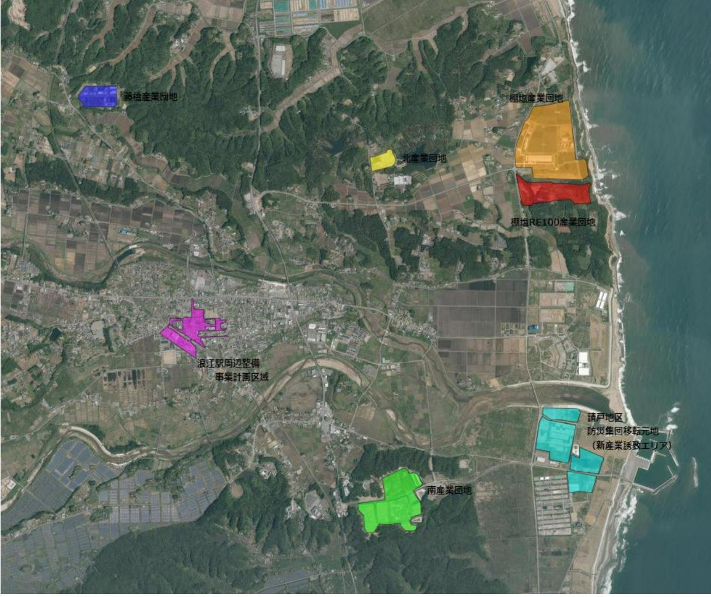

# 浪江町地球温暖化対策総合計画 (別冊) 地域脱炭素化促進事業

2024(令和6)年3月浪江町

## 目次

## 地域脱炭素化促進事業

| 1 | 地域脱炭素化促進事業の概要 ………………………………………………………………………………………………………………………………………………………………………………………………………………………………………………………………………………………………………………………………………………………………………………………………………………………………………… |
|---|--------------------------------------------------------------------------------------------------------------------------------------------------------------------------------|
|   | (1)事業の目的………………………………………………………………………………………………………………………………………………………………………………………………………………………………………………………………………………………………………………………………………………………………………………………………………………………………………………………  |
|   | (2)本事業により期待される効果 ………………………………………………………………………………………………………………………………………………………………………………………………………………………………………………………………………………………………………………………………… 1                                   |
|   | 2 地域脱炭素化促進事業の促進に関する事項 …………………………………………………………………………………………………………………………………………………………………………………………………………………………………………………………… 1                                                        |
|   | (1)地域脱炭素化促進事業の目標…………………………………………………………………………………………………………………………………………………………………………………………………………………………………………………………………………………………………………………………………………………………………………………………………………………………………  |
|   | (2)地域脱炭素化促進事業の対象区域……………………………………………………………………………………………………………………………………………………………………………………………………………………………………………………………………………………………………………………………………………………………………………………………………………………………  |
|   | (3)促進区域において整備する地域脱炭素化促進施設の種類と規模…………………………………………………………………………………………………………………………………………………………………………………………………………………………………………………………………………………………………………………………………………………………………………………………  |
|   | (4)地域脱炭素化促進施設の整備と一体的に行う地域の脱炭素化のための取組…………………… 2                                                                                                                                 |
|   | (5)地域脱炭素化促進施設の整備と併せて実施すべき取組 …………………………………………………………………………………………………………………………………………………………………………………………………………………………………………………………………………………………………………………………………………………………………………………………………  |
|   | (ア)地域の環境の保全のための取組 ……………………………………………………………………………………………………………………………………………………………………………………………………………………………………………………………………………………………………………………………………………………………………………………………………………………………  |
|   | (イ)地域の経済及び社会の持続的発展に資する取組 …………………………………………………………………………………………………………………………………………………………………………………………………………………………………………………………………………………………………………………………………………………………………………………………………………  |
|   | (6)浪江町再エネ促進区域マップ 3                                                                                                                                                         |

### 地域脱炭素化促進事業

#### <spanid="page-2-0">1 地域脱炭素化促進事業の概要

2021 年に改正された地球温暖化対策推進法では、地方公共団体実行計画制度を拡充し、円滑な合意形成を図りながら、適正に環境に配慮し、地域に貢献する再エネ事業の導入拡大を図るため、地域脱炭素化促進事業の促進に関する制度が盛り込まれました。本制度では、国や都道府県基準に基づき、市町村が地域脱炭素化促進事業の対象となる区域を「促進区域」として定めるよう努めることとされています。

#### <spanid="page-2-1">(1)事業の目的

本事業は、円滑な合意形成を図り、適正に環境に配慮し、地域のメリットにもつながる、地域と共生する再生可能エネルギー事業の普及・促進を図ることを目的とします。

- <spanid="page-2-2">(2)本事業により期待される効果
本事業により促進区域として設定した地域における再生可能エネルギー設備について、設置までの手続きが効率化され、市町村から認定を受けた事業者は、関係許可等手続きのワンストップ化や配慮書手続きの省略などの特例を受けることができます。

#### <spanid="page-2-3">2 地域脱炭素化促進事業の促進に関する事項

本町では福島県の「地球温暖化対策の推進に関する法律に基づく促進区域の設定に係る基準」(以下、「県基準」とする。)に基づき、以下の通り「地域脱炭素化促進事業の促進に関する事項」を定めます。

- <spanid="page-2-4">(1)地域脱炭素化促進事業の目標
町内の再生可能エネルギー導入量基準:令和 4(2022)年度 101,100kW目標:令和 12(2030)年度 206,600kW

#### <spanid="page-2-5">(2)地域脱炭素化促進事業の対象区域

- (ア) 町が所有する公共施設
- (イ) 請戸地区防災集団移転元地における新産業誘致エリア
- (ウ) 浪江駅周辺整備事業計画区域
- (エ) 藤橋産業団地、南産業団地、北産業団地、棚塩産業団地、棚塩RE100 産業団地
- なお、上記以外においても促進区域の対象とする区域を継続して検討することとします。
- <spanid="page-3-0">(3)促進区域において整備する地域脱炭素化促進施設の種類と規模種類:太陽光発電、風力発電規模:促進区域の状況に応じて適切な規模とすること
- <spanid="page-3-1">(4)地域脱炭素化促進施設の整備と一体的に行う地域の脱炭素化のための取組

地域脱炭素化促進施設から得られたエネルギーを町内の公共施設、地域住民、事業者に供給することや町が設立を検討する地域エネルギー会社との連携することなど、町が主導するエネルギーマネジメントに関する取組に協力することとします。

- <spanid="page-3-3"><spanid="page-3-2">(5)地域脱炭素化促進施設の整備と併せて実施すべき取組
(ア)地域の環境の保全のための取組

騒音や反射光など周辺地域の生活環境に配慮するとともに、景観や生態系への影響についても十分留意すること。なお、県基準「第2章 3 考慮すべき事項に関する基準」に基づき、環境の保全に考慮し、必要な措置を講じることとします。

<spanid="page-3-4">(イ)地域の経済及び社会の持続的発展に資する取組

地域脱炭素化促進事業の実施にあたっては、県基準に基づき、以下の事項について地域脱炭素化促進施設の整備と併せて取り組むよう努めることとします。

- ・地域・近隣住民との合意形成に努めること
- ・災害時の非常用電源として活用すること
- ・環境教育への活用による地域の環境意識の向上を図ること
- ・課題解決など地域に還元すること
- ・地域づくりの取組に参加すること
- ・再生可能エネルギー電気の地域内経済循環に取り組むこと
- ・地域産業へ貢献すること
- ・事業実施により得られた知識や技術を積極的に地域に共有されること
- ・地元資本の事業者との連携を行うこと

<spanid="page-4-0">(6)浪江町再エネ促進区域マップ

【対象区域】

- 町が所有する公共施設(下図での記載は省略する)
- 請戸地区防災集団移転元地における新産業誘致エリア
- 浪江駅周辺整備事業計画区域
- 藤橋産業団地、南産業団地、北産業団地、棚塩産業団地、棚塩RE100 産業団地

