#### 令和6年度第1回浪江町環境審議会

日にち:令和6年10月9日(水) 時間:10:00~11:30

場所:浪江町役場中会議室

#### 次第

- 1 開会
- 2 会長あいさつ
- 3 議事
- (1) 報告事項
	- ・浪江町の脱炭素施策について
- (2) 協議事項
	- ・今後の環境審議会の進め方について
- 4 閉会

| 配布資料          |  |
|---------------|--|
| 資料1:出席者名簿     |  |
| 資料2:座席表       |  |
| 資料3:議事(1)報告事項 |  |
| 資料4:議事(2)協議事項 |  |
|               |  |

#### 出席者名簿

【浪江町環境審議会委員】

|           | 所 属                  | 会長 | 氏 名                                  | 備考    |
|-----------|-------------------------|----|-----------------------------------------|-------|
|           | 福島大学共生システム理工学類          | 〇  | かわ さき こう た 川 﨑 興 太 | オンライン |
| 学識 経験者 | 東京大学先端科学技術研究センター        |    | こうの たつ おき 河野 龍 興         | 欠席    |
|           | 福島大学共生システム理工学類          |    | ごとう しのぶ 後藤 忍                   | 欠席    |
|           | 株式会社 伊達重機            |    | ぜんじ あきひろ 前司 昭博                 |       |
|           | 株式会社 舞台ファーム          |    | いとう けいいち 伊藤 啓一                 | オンライン |
| 事業者       | 株式会社 スマートアグリ・リレーションズ |    | なかやち よし あき 中谷内 美 昭       | 欠席    |
| 団体 町民  | 行政区長会                   |    | さとう ひでぞう 佐藤 秀三                 |       |
|           | 會澤高圧コンクリート 株式会社      |    | あい ざわ たいし 會 澤 大志         |       |
|           | 浪江町民                    |    | さわむら 澤村 なつみ                       |       |

【事務局】

|     | 所 属                    | 氏 名   |
|-----|---------------------------|----------|
|     | 産業振興課 主幹               | 板垣 貴之 |
| 浪江町 | 産業振興課 新エネルギー推進係長       | 小林 直樹 |
|     | 産業振興課 新エネルギー推進係 副主査 | 藤坂 浩暉 |

【資料2】

座席表

浪江町役場 2 階中会議室

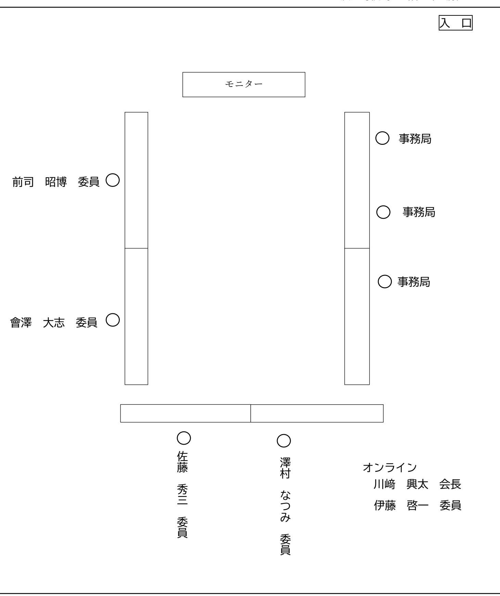

【資料3】

# 議事(1)報告事項

# 浪江町の脱炭素施策について

# 再エネ導入支援施策について

◆ **個人住宅向け**再生可能エネルギー設備等導入補助金

- ➢ 家庭向けの太陽光発電設備等の導入助成を行い、家庭での脱炭素化を推進。
- ➢ 令和4年度から、蓄電池やHEMS(エネルギーマネジメントシステム)を補助対象機器に追加。

➢ これまでのPV導入件数

合計 89件:**345.72**㎾

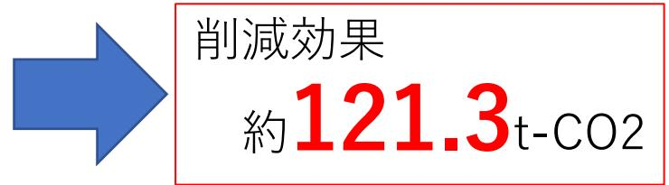

※ 年間発電量は1kWあたり816.025kWhと仮定(本庁舎の発電量より算定)

※ 火力発電1kWhあたりの排出係数(477g)-PV1kWhあたりのCO2排出係数(47g)=430g-CO2 として計算

#### ◆ **事業者向け**再生可能エネルギー設備等導入補助金

- ➢ 既存の制度ではカバーできていなかった町内の事業者向けに太陽光発電設備等の導入助成を行い、産業部門での脱炭素化を推進。
- ➢ 交付対象機器と補助額
	- ⚫ 太陽光発電システム 1kWあたり 5万円 【定額 】 上限 250 万円 (50kW分)まで
	- ⚫ 蓄電池

蓄電池価格の 1/3 以内上限 106 万円 (20 kWhまで )

- ➢ 令和6年10月より運用開始
地域エネルギー会社の設立検討状況

- 既存の再生可能エネルギー発電量は約87MW < 現状 > 地産外消
	- → 発電量の多くがFITで買い取られ、東京など町外に送られている
	- 原子力に頼らない電源への転換が必要
	- 駅周辺整備などの復興に向けた取り組みに対して、総合的なまちづくりを見据えた継続的かつ強力な活力が必要

#### < 事業内容 >

- エネルギーの地産地消体制の構築(電力供給)
- 安定した電力供給のための自社電源の開発
- 復興まちづくりや雇用創出などの地域課題の解決

〇 家庭や産業部門でも地域エネルギー会社から再エネ電力を購入できる環境を整備 ⇒ 全町的なCO2間接排出量の削減が可能

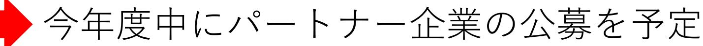

地産地消

## RE100エリアの創出 <浪江駅周辺整備事業>

浪江駅周辺エリアにおいて、太陽光パネルなどの**再エネ設備・蓄電池・水素設備の導入**、電力の一括受電とCEMSを活用しエリア内の**エネルギーを融通することで効率化**し、カーボンニュートラルの先進モデルエリアとして整備し、カーボンニュートラルを町内全域へ広げていきます。

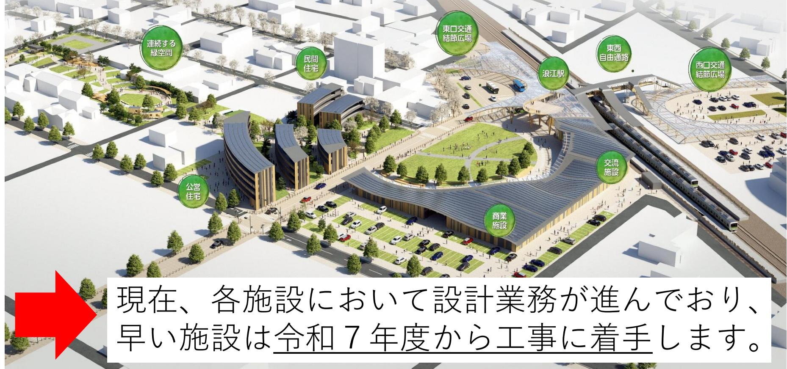

## RE100エリアの創出 <RE100産業団地整備事業>

➢ 立地企業の使用電力が「 **RE100** 」 (100%再生可能エネルギーで賄う)となる産業団地を整備。

➢ 再エネ電力と水素の活用で、**環境負荷低減**と**レジリエンス確保**。

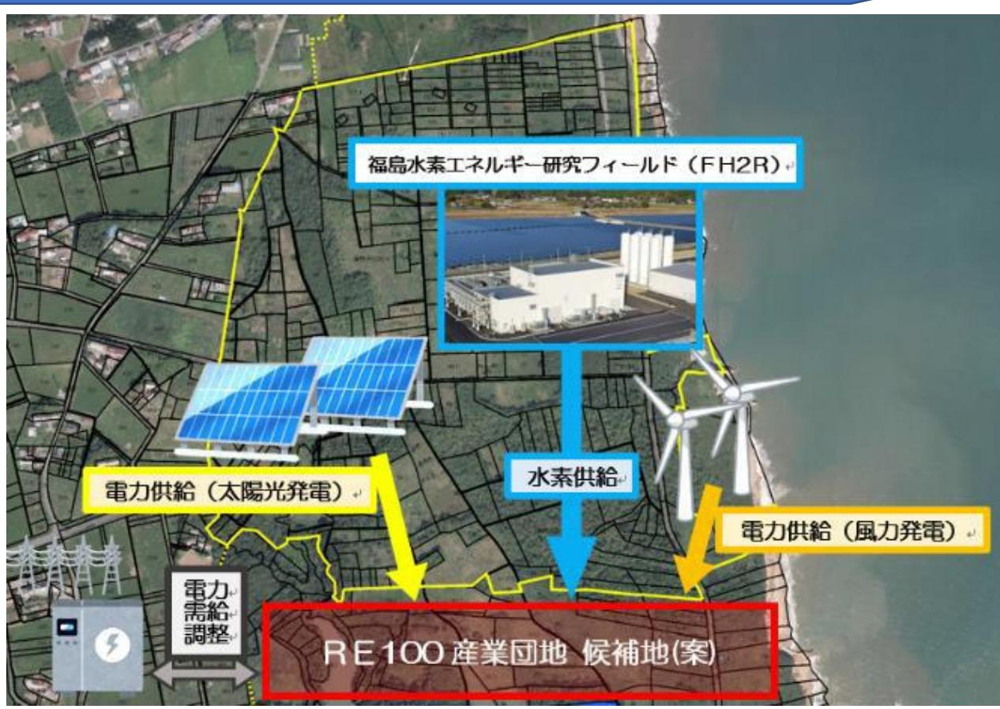

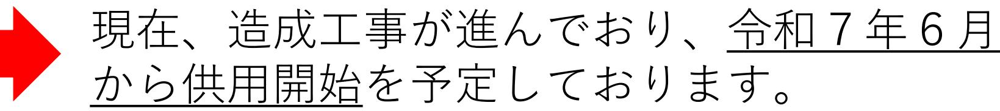

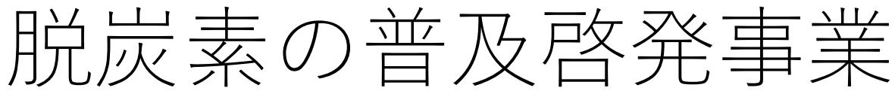

◆学校での授業 ➢水素教室を継続して実施中。

◆ 町民向け水素講座 ➢年度内に実施予定。

### ◆ 脱炭素アワード

➢町内における脱炭素に関する先進的な取組・活動を町内に広く共有し、町全体でのカーボンニュートラル達成の機運をより高める。令和6年度より実施。

◆ イベントでの広報 ➢県内外でイベント等に出展し、浪江町の取組をPR。 ➢水素まつりを定期的に開催しており、今年度も開催予定。

水素の普及拡大事業

# ①FCEVスクールバスの導入 ②FCVによる移動販売事業 ③FCVの普及拡大(ZEV購入補助事業) ④公共施設等への純水素燃料電池導入(町内3施設)

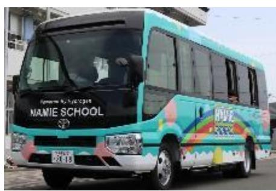

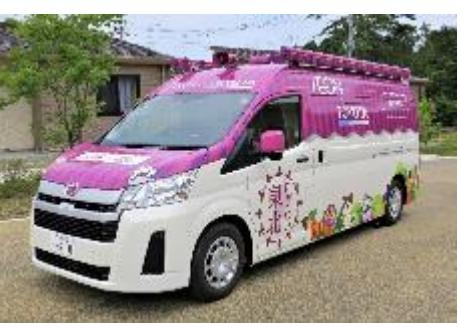

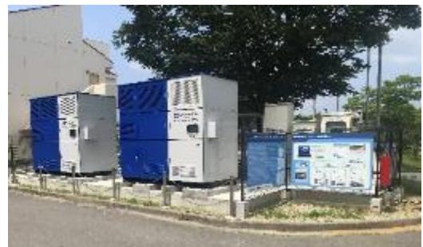

↑FCスクールバス ↑FC移動販売車 ↑公共施設への燃料電池設置

など

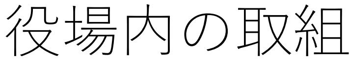

#### <庁舎ZEBの推進(浪江町本庁舎ZEB化改修事業)>

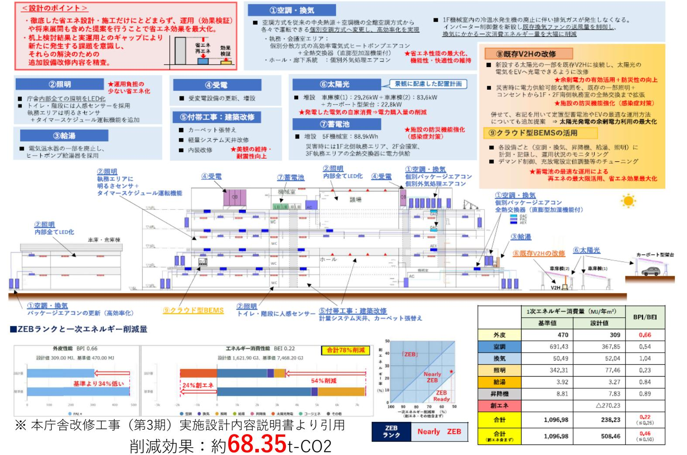

# 脱炭素モニタリングの実施

LAPSS(環境省提供のクラウドシステム)の導入により、電気使用量などを入力することで、公共施設のCO2間接排出量を定量的に把握が可能になりました。

⇒公共施設においてPV導入の余地が多いことなどが判明

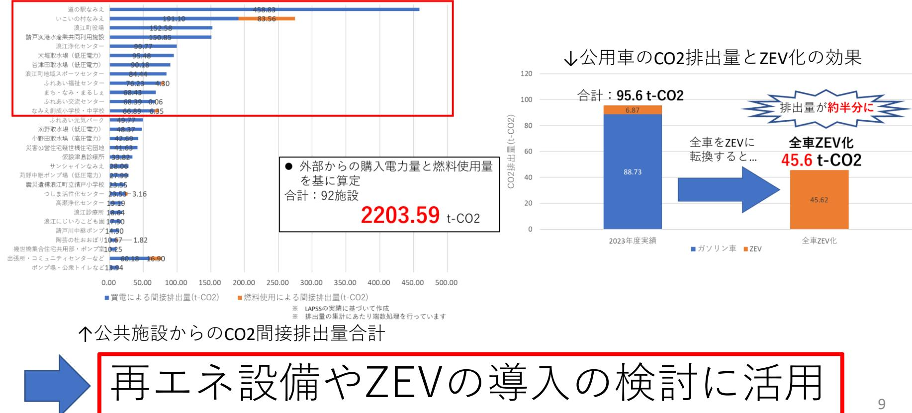

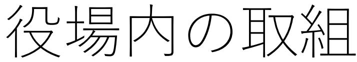

## **< ペーパーレス化・DX化の推進 >**

- ◆ 予算書・決算書 ➢浪江町議会の資料において実施済み。 ➢各種会議のオンライン化の推進も並行して実施。
- ◆口座振込通知書の一部廃止
	- ➢債権者コードの統廃合作業の結果、通知書の部数削減に成功(約100通分)。

#### ◆新聞の廃止

➢デジタルへの移行を検討中。

| ્રી ﺍﻟﻤﺮﺍﺟﻊ   ﺍﻟﻤﺮﺍﺟﻊ   ﺍﻟﻤﺮﺍﺟﻊ   ﺍﻟﻤﺮﺍﺟﻊ HJソノ | 協議事 | 町の将来像や計画 浪江町温暖化対策総合計画について、前年度の検討事項の整理、骨子について議論いただいた。 | らに議論を重ねていただい 量の抑制目標も具体化していただいた。 ಳು 第1回にて議論した点を反映した計画素案について、 温室効果ガスの排出 た。 | 良江町 パブリックコメントの結果も踏まえた最終案について議論していただき、地球温暖化対策総合計画~なみえエネルギーチャレンジ2035~」が完成。 | 脱炭素施策検討ワーキンググループから提出された脱炭素施策案の評価を行ってい ただいた。 | 重点対策加速化事業について審議して 「 (促進区域の設定) 事業の実施を承認いただいた 地域脱炭素化促進事業 いただき、 |
|-------------------------------------------------------|-----|---------------------------------------------------------|-----------------------------------------------------------------------------------------|------------------------------------------------------------------------------|------------------------------------------------|-----------------------------------------------------------------------------|
|                                                       |     | 令和4年度 第1回                                            | 第2回                                                                                     | 第3回                                                                          | 令和5年度第1回                                      | 第2回                                                                         |

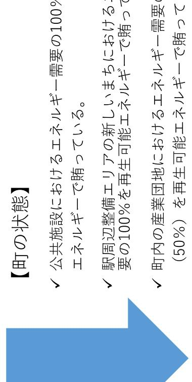

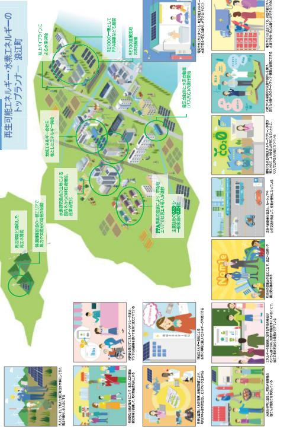

- 
- -
- 
- 

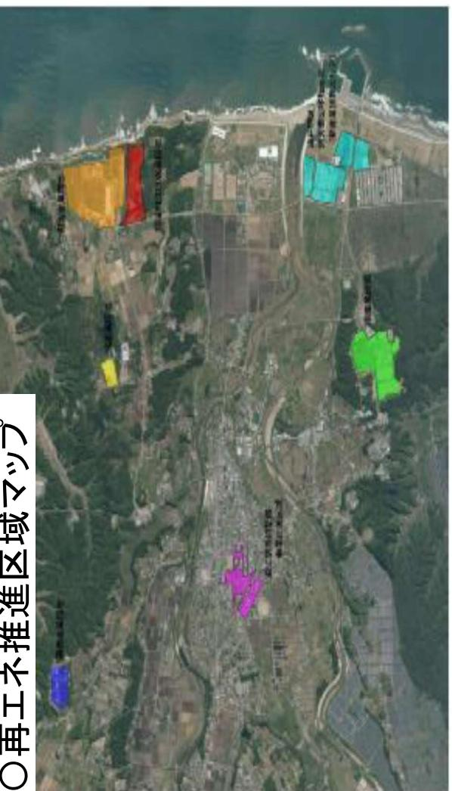

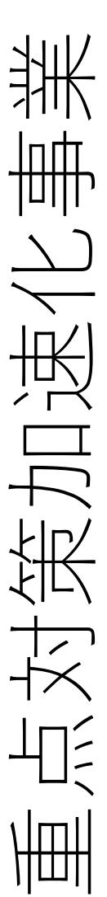

- 
- 

| 業計画の概要                                                                                                                                                                                      | IT : 800K     |           |                  | 業計画の効果              |
|---------------------------------------------------------------------------------------------------------------------------------------------------------------------------------------------|---------------|-----------|------------------|---------------------|
| 収組(個人                                                                                                                                                                                       |               |           | 02前              |                     |
| 大腸光発電設備の可                                                                                                                                                                                   | OOKW          | 1,266kV   | 15,056           | 22,6優円              |
| 喜電池のJ                                                                                                                                                                                       | 00kW 043   |           |                  |                     |
|                                                                                                                                                                                             |               |           |                  | 数組のイメー              |
| 太陽光発電設備の導入                                                                                                                                                                                  | 600KW         |           | 江駅周辺整備エリアにおける取組イ |                     |
| 蓄電池の導                                                                                                                                                                                       | 80kW 2449  |           |                  | アレミーミストレス大気付け直送(7) |
| 業計画の概要(公共)                                                                                                                                                                                  |               |           |                  |                     |
| 取得                                                                                                                                                                                          |               | SCA . 056 |                  | 15 -                |
| 公営住宅等への太陽光発電政備の導. (PPA等)                                                                                                                                                                    | 66kW          |           |                  |                     |
| 客電池の導                                                                                                                                                                                       | 00kWH િત્ત |           |                  |                     |
| CEMSの導入                                                                                                                                                                                     | 1件            |           |                  |                     |
| amacabominummanumimanumanumanumanumanumanumanumanumanumanumaramaramaramaramaramaramaramaramaramaramaramaramaramaramaramaramaramaramaramara 純水表燃料電池の濾ス | · 2件          |           |                  |                     |

|  |  | ) ) ( 2 8 (1) (2) 2 3 4 5 ( |
|--|--|--------------------------------------------------------------|

|    | KPI   |               |        |      |
|----|-------|---------------|--------|------|
|    |       |               | 3      | 2023 |
| 1. |       |               | / 6 | 2030 |
|    |       |               |        | 2023 |
| 2. |       |               | /      | 2024 |
|    |       |               |        | 2025 |
| 3. |       |               |        | 2023 |
|    |       |               |        | 2025 |
| 4. |       | 1             | 3      | 2030 |
|    |       |               | 1      | 2024 |
| 5. | RE100 |               | 1      | 2025 |
|    |       |               | 1      | 2025 |
| 6. | RE100 |               |        | 2024 |
|    |       |               |        | 2025 |
| 7. |       |               | 3      | 2025 |
|    |       |               |        | 2023 |
|    |       | t-CO2 29.6 |        | 2030 |
|    |       |               |        |      |
| 10 |       |               |        | 2024 |
|    |       |               |        | 2024 |
|    |       |               |        | 2024 |

KPI

|     | 2030 1   | 2030 5 | 2030 100 | 2030 | 2025 | 2030 10 | 2030 5 1 | 2030 | 2030 1010 10 2 | 2025 0 | 2030 1010 10 | 2030 5 | 2025 | 2025 | 2030 30 | 2030 30 | 2030 5 2 |  |
|-----|-------------|-----------|-------------|------|------|------------|----------------|------|-------------------------|-----------|--------------------|-----------|------|------|------------|------------|----------------|--|
| KPI | RE100       |           |             | 1    | ZEB  | ZEB        | ZEB            | FH2R |                         | PPA       | PPA                | PPA       |      | ZEH  | ZEH        |            |                |  |
|     | RE100 A. |           |             | B.   |      | ZEB C.  |                |      | D.                      |           | PPA PPA E.   |           | F.   |      | G.         |            | H.             |  |