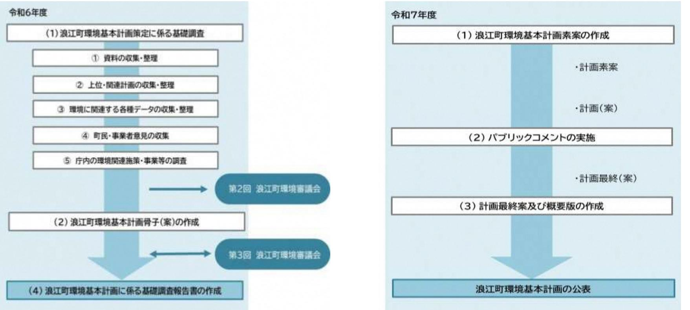

#### 令和6年度第2回浪江町環境審議会

日にち:令和6年11月29日(水) 時間:10: 3 0~11:3 0

- 
- 場所:浪江町役場 4 階全員協議会室

#### 次第

- 1 開会あいさつ
- 2 自己紹介、会長の選出
- 3 議事
- (1) 確認事項
	- ・環境審議会について
	- ・今後の審議事項について
	- ・浪江町の脱炭素施策について
- (2) 協議事項
	- ・来年度実施予定の脱炭素施策について
- (3) その他
	- ・スケジュールについて
- 4 閉会

| 配布資料           |
|----------------|
| 資料1:出席者名簿      |
| 資料2:座席表        |
| 資料3:議事(1)確認事項  |
| 資料4:議事(2)協議事項  |
| 資料5:議事(3)その他   |
| 補足資料:浪江町環境基本条例 |
| 浪江町環境審議会規則     |
|                |

#### 出席者名簿

【浪江町環境審議会委員】

|           | 所 属                | 会長 | 氏                  | 名                      | 備考    |
|-----------|-----------------------|----|--------------------|------------------------|-------|
|           | 国立環境研究所 福島地域協働研究拠点 |    | ご み 五味       | けい 馨                |       |
|           | 東京大学 先端科学技術研究センター  |    | こうの 河野          | たつ おき 龍 興     | 欠席    |
| 学識 経験者 | 福島大学 経済経営学類        |    | ぬまた 沼田          | だいすけ 大輔             | オンライン |
|           | 弘前大学 被ばく医療総合研究所    |    | あかた 赤田          | なおふみ 尚史             |       |
|           | 商工会 会長             |    | すずき 鈴木          | ひと ね 仁 根      | 欠席    |
|           | 行政区長会                 |    | さとう 佐藤          | ひでぞう 秀三             |       |
| 事業者       | 農業委員会会長               |    | かんの 菅野          | ふ み え 富 美恵 |       |
| 団体 町民  | 株式会社 舞台ファーム        |    | いとう 伊藤          | けいいち 啓一             | オンライン |
|           | 株式会社 伊達重機          |    | ぜんじ 前司          | あきひろ 昭博             |       |
|           | 會澤高圧コンクリート 株式会社    |    | あい ざわ 會 澤 | たいし 大志              | オンライン |

【事務局】

|     | 所 属                    | 氏 名   |
|-----|---------------------------|----------|
|     | 産業振興課 課長               | 蒲原 文崇 |
|     | 産業振興課 新エネルギー推進係長       | 小林 直樹 |
|     | 産業振興課 新エネルギー推進係 主査  | 藤田 知宏 |
| 浪江町 | 産業振興課 新エネルギー推進係 副主査 | 藤坂 浩暉 |
|     | 住民課 課長                 | 柴野 一志 |
|     | 住民課 除染環境係長兼課長補佐        | 佐藤 貴徳 |
|     | 住民課 除染環境係 主査        | 吉本 幸弘 |

【資料2】

座席表

浪江町役場 4階全員協議会室

【資料3】

# 議事(1) 確認事項

# ⚫**環境審議会について** ⚫今後の審議事項について ⚫浪江町の脱炭素施策について

## 環境審議会について

- 浪江町環境基本条例に基づき組織される審議会
- 定員は10名、任期は2年間。再任も可能。
- 主な役割は、「町長の諮問に応じ、環境基本計画に関する事項並びに環境の保全及び創造に関する基本的事項及び重要事項を調査審議すること。」(浪江町環境審議会規則第2 条第1項)
- 報酬日額5,000円 (職務時間が4時間以内の場合は4,000円) (特別職の職員で非常勤のものの報酬及び費用弁償に関する条例)
- 旅費距離に応じ浪江町の規定(職員等の旅費に関する条例)に基づき支給。
- 令和4年11月から令和6年10月にかけて、「浪江町地球温暖化対策総合計画~なみえエネルギーチャレンジ2035~」の策定や重点対策加速化事業について審議していただいた。

環境審議会の活動スケジュール

| 令和6年度          | 会議名           | 内容                                                                 |
|----------------|---------------|--------------------------------------------------------------------|
| 令和6年11月1日      | 任期開始          | 2年間(令和6年11月1日から ➢ 令和8年10月31日まで)                              |
| 令和6年11月29日(本日) | 令和6年度第2回環境審議会 | 環境審議会の活動について ➢ 来年度実施予定の脱炭素施策について ➢                        |
| 令和7年2月下旬(予定)   | 令和6年度第3回環境審議会 | 環境基本計画の骨子(案)の審議 ➢ 浪江町の脱炭素施策の評価・助言 ➢                       |
| 令和7年度          | 会議名           | 内容                                                                 |
| 令和7年9月頃(予定)    | 令和7年度第1回環境審議会 | 環境基本計画(素案)の諮問 ➢                                                 |
| 令和7年11月頃(予定)   | 令和7年度第2回環境審議会 | 環境基本計画(案)の審議 ➢ パブリックコメントの結果報告 ➢ 来年度実施予定の脱炭素施策について ➢ |
| 令和8年2月(予定)     | 令和7年度第3回環境審議会 | 環境基本計画(最終案)の審議・答申 ➢ 浪江町の脱炭素施策の評価・助言 ➢                     |
| 令和8年度          | 会議名           | 内容                                                                 |
| 令和8年9月頃(予定)    | 令和7年度第1回環境審議会 | 次期環境審議会の方針について ➢                                                |
| 令和8年10月31日     | 任期満了          | 2年間 ➢ 再任可能 ➢                                              |

推進本部とワーキンググループ

≪目的≫

地球温暖化対策総合計画に基づき、2035年までにカーボンニュートラルを達成するため、具体的な施策を立案・推進し、事業の進行管理を行うことにより全庁的な推進を図る。

≪浪江町地球温暖化対策推進本部の役割≫

- ・事務事業や町内全域内における施策立案と事業の推進を図る。
- ・各施策について情報共有し、庁内での連携図る。
- ・事業の進行管理を行い、施策の見直しを図る。

#### ≪脱炭素施策検討ワーキンググループの役割≫

- ・担当業務における具体的な施策立案、事業検討を図る。
- ・全庁的な推進に向け、情報共有しながら部署間連携を図る。

≪浪江町環境審議会の役割≫

- ・町民、事業者、学識経験者の各立場から施策への審議や助言、計画の進行管理を行う。

### 進捗管理手法について

◇事務事業編(役場内の取組)について

今年度LAPSS(地方公共団体実行計画策定・管理等支援システム)の運用を開始した。データに基づき事務事業編の進捗管理を行う。

※LAPSSとは、地方自治体内の温室効果ガス排出量を算出する環境省提供システム

◇区域施策編について現状:実績値を把握できない状態。 今後:来年度以降、町内事業者等からのエネルギーデータ収集などにより把握する仕組みづくりを行う。→条例等の策定も検討 (参考:令和6年10月に福島県でカーボンニュートラル推進条例を策定予定)

# これまでの活動について

|              | 協議事項                                                                         |
|--------------|------------------------------------------------------------------------------|
| 令和4年度 第1回 | 浪江町温暖化対策総合計画について、前年度の検討事項の整理、町の将来像や計画骨子 について議論いただいた。                      |
| 第2回          | 第1回にて議論した点を反映した計画素案について、さらに議論を重ねていただいた。 温室効果ガスの排出量の抑制目標も具体化していただいた。       |
| 第3回          | パブリックコメントの結果も踏まえた最終案について議論していただき、「浪江町地球 温暖化対策総合計画~なみえエネルギーチャレンジ2035~」が完成。 |
| 令和5年度 第1回 | 脱炭素施策検討ワーキンググループから提出された脱炭素施策案の評価を行っていただ いた。                               |
| 第2回          | 地域脱炭素化促進事業(促進区域の設定)、重点対策加速化事業について審議していた だき、事業の実施を承認いただいた。                 |
| 令和6年度 第1回 | 今後の町の脱炭素施策方針について審議いただいた。                                                     |
|              |                                                                              |

#### 委員改選(~令和6年10月31日)

|         | 協議事項                       |
|---------|----------------------------|
| 令和6年度   | ・環境審議会の全体像や活動スケジュールについての説明 |
| 第2回(本日) | ・浪江町の取り組む脱炭素施策についての報告など    |

**2030年度** までに本町から排出される温室効果ガスを

**40千t-CO2**に抑制します。

カーボンニュートラルに向けた達成率**50%**を目指します。

#### 【町の状態】

- ✓ 公共施設におけるエネルギー需要の100%を再生可能エネルギーで賄っている。
- ✓ 駅周辺整備エリアの新しいまちにおけるエネルギー需要の100%を再生可能エネルギーで賄っている。
- ✓ 町内の産業団地におけるエネルギー需要の半分 (50%)を再生可能エネルギーで賄っている。

**2035年度** を待たずにカーボンニュートラルを目指します。 (カーボンニュートラルの達成率**100%**を目指します。)

↑町の将来像

#### **町内におけるカーボンニュートラルに向けた達成目標** 17.5 20.5 25.3 0

2019

2020

2025 2030

2018

#### ◆ **現状すう勢によるCO2排出量(千t-CO2)**

150.0

2010

50

100

150

200

**<千t-CO2>**

◆**温室効果ガス排出量の抑制目標** 29.6千t-CO₂

**2030年度**までに本町から排出される温室効果ガスを**40千t-CO2**に抑制します。 カーボンニュートラルに向けた達成率、 **50%**を目指します。

**2035年度**を待たずにカーボンニュートラルを目指します。 (カーボンニュートラルの達成率、 **100%**を目指します。)

43.4 50.8 57.9 60.5 63.1 65.7

2040 2045 2050

2035

### **事務事業に関する現況と目標**

### **公共施設における温室効果ガス排出量の現況と将来推計**

温室効果ガス排出量

➢2010年度:5.3千t‐CO2 ➢2021年度:1.3千t-CO2 ➢2030年度(推計):2.3千t-CO2 ➢2050年度(推計):3.2千t-CO2

復興の進展とともに事務事業におけるCO2排出量は大きく増加する見込み

**2030年度**までに基準年度(2010年度)比で **19%(1.0千t-CO2)**に抑制します。 基準年度比の削減目標率は81%(4.3千t-CO2) ※森林吸収量は数値目標に含みません。

# 再エネ促進区域の設定

- 環境アセスメントの配慮書手続きの省略や関係法令の許可手続きのワンストップ化等の特例措置が受けられるため、再エネ電源事業の参入の促進に繋がる。
### <設定したエリア>

- 浪江駅周辺整備エリア
- 公共施設
- 工業団地
- 防災集団移転元地(請戸地区)

## 再エネの導入を促進する対象区域や導入目標を設定いただきました。

# 重点対策加速化事業

- 再エネ発電設備を一定以上導入すること等を要件に、地方自治体における脱炭素化を推進する環境省による補助事業。
- 事業の主旨や目標について審議会の承認を経て令和6年3月に応募。

【資料3】

# ⚫環境審議会について ⚫**今後の審議事項について** ⚫浪江町の脱炭素施策について

# 今後の審議事項について

# ① 環境基本計画(案)の審議

➢ 浪江町環境基本条例第8条第3項に基づき、環境審議会から意見をお願いいたします。

- ② 地球温暖化対策総合計画の進行管理
	- ➢ 町が取り組む施策や事業について、なみチャレにおいて設定したKPI指標に基づき、進行管理をお願いいたします。

## ① 環境基本計画(案)の審議

### 1.浪江町環境基本計画とは?

### 【浪江町環境基本条例】第8条

第1項町長は、環境の保全等に関する施策を総合的かつ計画的に推進するため、環境の保全に関する基本的な計画(以下「環境基本計画」という。)を定めなければならない。

第2項環境基本計画は、次に掲げる事項について定めるものとする。

- (1) 環境の保全等に関する総合的かつ長期的な目標、施策及び配慮の方針
- (2) 前号に掲げるもののほか、環境の保全等に関する必要な事項

・浪江町地球温暖化対策総合計画(先行して令和5年3月制定)との整合を要する。

### 2.環境基本計画と環境審議会との関係

#### 【浪江町環境基本条例】第8条

第3項町長は、環境基本計画を定めるに当たっては、浪江町環境審議会の意見を聴かなければならない。

【浪江町環境審議会規則】第2条第1項第1号

14 町長の諮問に応じ、環境基本計画に関する事項並びに環境の保全及び創造に関する基本的事項及び重要事項を調査審議すること。

制定スケジュール

次回の環境審議会での議題(予定) ・浪江町環境基本計画骨子(案)の審議

# ② 地球温暖化対策総合計画の進行管理

- 1. 町が取り組む施策や事業について、なみチャレにおいて設定したKPI指標に基づき、評価・助言をお願いいたします。 (第3回審議会でお諮りします。)
- 2. 町がこれから始める脱炭素施策・事業についても、助言をお願いいたします。 (本日の議事(2)でお諮りします。)

【資料3】

# 議事(1) 確認事項

# ⚫環境審議会について ⚫今後の審議事項について ⚫浪江町の脱炭素施策について

なみチャレに基づく施策について

温室効果ガス排出量の削減目標、再生可能エネルギー導入目標を達成するため、以下の施策を計画しました。

### **< 共通施策 >**

「情報発信」「技術支援」「条例整備」「連携」「教育」それぞれの区分において、再生可能エネルギーや脱炭素に関する施策を計画。

### **< 各部門施策 >**

「産業」「業務」「家庭」「運輸」 の4分野に関する8つの区分で施策を計画。

各施策において、目標年度・数値を設定しているため、環境審議会ではこれらの指標を基に評価・助言をお願いします。

【なみチャレにおける施策体系】

### 共通施策におけるKPI指標と個別事業WG施策は★

未実施施策は赤字

|                      | 共通施策                                 | KPI指標(内容)                                      | 個別事業                                  |
|----------------------|--------------------------------------|------------------------------------------------|---------------------------------------|
| 情報 情報 発信 発信 | ①再生可能エネルギー導入促進のため                    | 発信媒体の確立                                        | なみチャレNEWS ★生成AI活用事業 ★電子広報紙配布事業  |
|                      | の情報発信                                | 太陽光、陸上風力、バイオマス、中小水力などの発 電事業促進の情報発信          | HP・各種SNSを活用                           |
|                      | ②カーボンニュートラル関連施策推進 のための補助金等の情報発信   | 情報発信の仕組み構築 コスト軽減のための補助金情報発信                 | ★生成AI活用事業 ★電子広報紙配布事業 ★脱炭素アワード   |
|                      |                                      | 税制優遇措置等の検討                                     | ★脱炭素ポイント                              |
| 技術 技術 支援 支援 | ③地域内のエネルギーマネジメントへ                    | 地域エネルギー会社の創設                                   | 設立準備中(p30)                            |
|                      | の加速化                                 | 町内のエネルギーマネジメント(最適化)の 仕組み構築                  | CEMS実証(本庁舎と道の駅)/ 駅前エリアでのエネマネ事業     |
|                      | ④次世代再生可能エネルギー技術の加 速化支援            | 洋上風力発電や波力発電、潮力発電等の 次世代技術の検討と実施              | 実証の誘致                                 |
|                      | ⑤地域内再生可能エネルギー導入の条 例等の整備           | 再エネ事業の届け出制度の条例整備                               | 条例の整備                                 |
|                      |                                      | RE100産業団地の造成に関わる条例の整備                          | 検討中                                   |
| 条例 条例             |                                      | 耕作放棄地の取扱い緩和措置の整備                               | 要検討                                   |
| 整備 整備             | ⑥浪江町ゼロカーボンシティに向けた 条例等の整備(促進区域の設定) | RE100産業団地や駅周辺整備等の新規開発に関する カーボンニュートラルに向けた条例化 | 条例の整備                                 |
|                      |                                      | 町内の促進区域の設定                                     | 設定済み(令和6年3月)                          |
|                      | ⑦他地域とのエネルギーに関する連携                    | 地産外消先との連携確立                                    | 検討中                                   |
| 連携 連携 教育 教育 | ⑧福島国際研究教育機構とのエネル ギーに関する連携         | 再生可能エネルギーや水素に係る研究テーマの設定 と町内における実証等の連携確立     | 研究テーマ設定済み 連携に向けて要協議                |
|                      | ⑨農林水産分野との連携を通じた炭素                    | 現状の森林吸収量の確保と拡大                                 | 現状:29.6千t-CO 2 ★みんなの森林見守りプロジェクト |
|                      | 固定・貯留や吸収源対策の推進                       | 農地における炭素貯留技術の実証と普及                             | ★緑肥作物の種子購入補助事業                        |
|                      | ⑩未来を担う子どもたちへの脱炭素・                    | エネルギ-・水素に関連した教育プログラムの設定                        | ★なみえ創生小中学校での授業                        |
|                      | エネルギー教育の実施                           | 町内事業者と連携した環境教育の実施                              | 駅前エリマネ事業者での実施を検討中                     |
|                      | ⑪浪江町民向けの脱炭素・エネルギー に係る学びの機会の創出     | エネルギ-・水素に関連した教育プログラムの提供                        | ★町民向け水素講座 20 ★健康促進事業            |

### 部門別施策におけるKPI指標と個別事業

#### WG施策は★ 未実施施策は赤字

 **家庭部門**

 **運輸部門**

 **運輸部門**

| 各部門の施策                                                                        | KPI指標(内容)                                     | 個別事業                                          |  |
|-------------------------------------------------------------------------------|-----------------------------------------------|-----------------------------------------------|--|
|                                                                               | RE100産業団地の竣工・稼働開始                             | R7年度団地造成完了予定(p32)                             |  |
| 産業部門 A_産業のRE100                                                            | 業務部門 家庭部門 運輸部門 再エネ電気・水素の供給           | ★地域エネルギー会社の設立(p30) ★町内水素供給網整備事業★脱炭素エネルギー転換 |  |
|                                                                               | 産業団地立地企業のエネルギー使用量の把握                          | ★CO2排出量の見える化(アプリ)                             |  |
|                                                                               | 町内企業の再生可能エネルギーへの転換                            | 事業者向け再エネ設備導入補助金(p29) 他                     |  |
| 産業部門 B_再エネを活用した農林水産業                                                       | 業務部門 家庭部門 運輸部門 農林水産業に関連する再エネ発電の導入・検討 | 産業部門 ソーラーシェアリングの普及                         |  |
| 産業部門 業務部門                                                                  | ZEB相談窓口の開設 家庭部門 運輸部門                    | 要検討 産業部門 業務部門                           |  |
| C_ZEB化の推進                                                                     | 事業所ビルZEB化の実現件数                                | 補助事業の創設                                       |  |
|                                                                               | 公共施設のZEB化の実現件数                                | 本庁舎のZEB化改修(p24) 産業部門 業務部門 家庭部門       |  |
| 産業部門                                                                          | 業務部門 家庭部門 運輸部門 FH2Rの運営方策の明確化         | 未定                                            |  |
| D _水素の利活用 産業部門 業務部門 家庭部門 産業部門 業務部門                          | 水素設備の導入・供給 運輸部門 家庭部門 運輸部門            | ★FH2Rの水素本格供給に向けた需要創出 ★町内水素供給網整備事業          |  |
|                                                                               | 農林業における水素の活用                                  | ★水素農機等実証推進事業                                  |  |
| 産業部門                                                                          | 業務部門 家庭部門 運輸部門 PPA事業アライアンス先開拓        | ★地域エネルギー会社の設立(p30)                            |  |
| E _再エネPPA事業 産業部門 業務部門 産業部門 業務部門 家庭部門                        | オンサイトPPA事業(自家消費型)実施 家庭部門 運輸部門 運輸部門   | ★公共施設への太陽光発電設備・蓄電池導入推進事                       |  |
|                                                                               | オフサイトPPA事業実施                                  | 業                                             |  |
| 産業 業務 家庭 産業 業務 家庭 部門 部門 部門 部門 部門 F_駅周辺エリアのCN | 運輸 運輸 部門 部門 部門 カーボンニュートラル街区創設  | 駅前エリアなどで検討中 (★ガソリン車規制区域設置)                 |  |
|                                                                               | ZEH相談窓口の開設                                    | 要検討                                           |  |
| 業務部門 産業部門 家庭部門                                                          | 運輸部門 ZEH住宅の実現件数                            | 補助事業の創設                                       |  |
| G_ZEH化の推進                                                                     | 既存住宅の太陽光・蓄電池設備の導入、断熱改修 や高効率機器の導入等の推進       | 個人住宅向け再エネ設備導入補助金(p29)                         |  |
| 産業部門 業務部門 家庭部門 運輸部門                                                  | 水素ステーション整備数                                   | 2か所整備済み                                       |  |
| H_グリーンモビリ ティの普及と運用                                                         | EVステーション整備数                                   | ★町内EV充電環境構築                                   |  |
|                                                                               | ZEVの導入促進                                      | ★ZEV導入補助金 ★公用車のZEV転換                       |  |

# 浪江町の脱炭素施策

区域施策編 …町全域における温室効果ガス排出抑制に関する施策

# 浪江町の脱炭素施策

### ⚫継続して実施するもの/実施済みのもの ➢ 事務事業編/区域施策編

### <庁舎ZEBの推進(浪江町本庁舎ZEB化改修事業)>

# 脱炭素モニタリングの実施

### LAPSS(環境省提供のクラウドシステム)の導入により、電気使用量などを入力することで、公共施設のCO2間接排出量を定量的に把握が可能になりました。

⇒公共施設においてPV導入の余地が多いことなどが判明

### **< ペーパーレス化・DX化の推進 >**

### ◆ 予算書・決算書 ➢浪江町議会の資料において実施済み。 ➢各種会議のオンライン化の推進も並行して実施。

- ◆口座振込通知書の一部廃止 ➢債権者コードの統廃合作業の結果、通知書の部数削減に成功(約100通分)。
### ◆新聞の廃止

➢デジタルへの移行を検討中。

### **(参考)事務事業編**に関する施策一覧(WG成果:R6実施分)

| 施策No. | 施策名称                  |       | 担当部署 | 部門 | 実施検討状況 |
|-------|-----------------------|-------|------|----|--------|
| A-01  | みんなのマイバック(かご)         | 総務課   |      | 総務 | 廃止予定   |
| A-02  | 毎週がプレミアムフライデー         | 総務課   |      | 総務 | 実施中    |
| A-03  | 脱ビジネスウェア              | 総務課   |      | 総務 | 実施中    |
| A-04  | オンライン会議推進事業           | 総務課   |      | 総務 | 実施中    |
| B-01  | 環境に配慮した事業活動の促進        | 総務課   |      | 総務 | 実施中    |
| B-02  | 公共施設への太陽光発電・蓄電池導入推進事業 | 総務課   |      | 総務 | 実施中    |
| C-01  | 来庁者向け新聞の廃止事業          | 総務課   |      | 総務 | 実施中    |
| C-02  | 予算書・決算書のペーパーレス化事業     | 企画財政課 |      | 総務 | 実施中    |
| C-03  | 口座振込通知書の一部廃止事業        | 出納室   |      | 総務 | 実施中    |

# 浪江町の脱炭素施策

### ⚫継続して実施するもの/実施済みのもの ➢ 事務事業編/区域施策編

# 再エネ導入支援施策について

◆ **個人住宅向け**再生可能エネルギー設備等導入補助金

- ➢ 家庭向けの太陽光発電設備等の導入助成を行い、家庭での脱炭素化を推進。
- ➢ 令和4年度から、蓄電池やHEMS(エネルギーマネジメントシステム)を補助対象機器に追加。

➢ これまでのPV導入件数

合計 89件:**345.72**㎾

※ 年間発電量は1kWあたり816.025kWhと仮定(本庁舎の発電量より算定)

※ 火力発電1kWhあたりの排出係数(477g)-PV1kWhあたりのCO2排出係数(47g)=430g-CO2 として計算

### ◆ **事業者向け**再生可能エネルギー設備等導入補助金

- ➢ 既存の制度ではカバーできていなかった町内の事業者向けに太陽光発電設備等の導入助成を行い、産業部門での脱炭素化を推進。
- ➢ 交付対象機器と補助額
	- ⚫ 太陽光発電システム 1kWあたり 5万円 【定額 】 上限 250 万円 (50kW分)まで
	- ⚫ 蓄電池蓄電池価格の 1/3 以内上限 106 万円 (20 kWhまで )
- ➢ 令和6年10月より運用開始

# 地域エネルギー会社の設立検討状況

- 既存の再生可能エネルギー発電量は約87MW < 現状 > 地産外消
	- → 発電量の多くがFITで買い取られ、東京など町外に送られている
	- 原子力に頼らない電源への転換が必要
	- 駅周辺整備などの復興に向けた取り組みに対して、総合的なまちづくりを見据えた継続的かつ強力な活力が必要

### < 事業内容 >

- エネルギーの地産地消体制の構築(電力供給)
- 安定した電力供給のための自社電源の開発
- 復興まちづくりや雇用創出などの地域課題の解決
- 〇 家庭や産業部門でも地域エネルギー会社から再エネ電力を購入できる環境を整備 ⇒ 全町的なCO2間接排出量の削減が可能
	- 今年度中にパートナー企業の公募を予定

地産地消

### RE100エリアの創出 <浪江駅周辺整備事業>

浪江駅周辺エリアにおいて、太陽光パネルなどの**再エネ設備・蓄電池・水素設備の導入**、電力の一括受電とCEMSを活用しエリア内の**エネルギーを融通することで効率化**し、カーボンニュートラルの先進モデルエリアとして整備し、カーボンニュートラルを町内全域へ広げていきます。

### RE100エリアの創出 <RE100産業団地整備事業>

➢ 立地企業の使用電力が「 **RE100** 」 (100%再生可能エネルギーで賄う)となる産業団地を整備。

➢ 再エネ電力と水素の活用で、**環境負荷低減**と**レジリエンス確保**。

# 脱炭素の普及啓発事業

### ◆学校での授業 ➢水素教室を継続して実施中。

### ◆ 町民向け水素講座 ➢年度内に実施予定。

### ◆ 脱炭素アワード

➢町内における脱炭素に関する先進的な取組・活動を町内に広く共有し、町全体でのカーボンニュートラル達成の機運をより高める。令和6年度より実施。

### ◆ イベントでの広報

➢県内外でイベント等に出展し、浪江町の取組をPR。

➢水素まつりを定期的に開催しており、今年度も開催予定。

# 水素の普及拡大事業

# ①FCEVスクールバスの導入 ②FCVによる移動販売事業 ③FCVの普及拡大(ZEV購入補助事業) ④公共施設等への純水素燃料電池導入(町内3施設)

↑FCスクールバス ↑FC移動販売車 ↑公共施設への燃料電池設置

など

### **(参考)区域施策編**に関する施策一覧①(WG成果:R6実施分)

| 施策No. | 施策名称                      | 担当部署  |       | 部門 | 実施検討状況 |
|-------|---------------------------|-------|-------|----|--------|
| E-01  | 環境基本計画への反映                | 住民課   | 産業振興課 | 衛生 | 実施中    |
| E-02  | CO2排出量の見える化(アプリ)          | 産業振興課 | 住民課   | 衛生 | 実施中    |
| F-01  | 脱炭素アワード                   | 産業振興課 | 産業振興課 | 衛生 | 実施中    |
| F-02  | FH2Rの水素本格供給に向けた需要創出       | 産業振興課 |       | 衛生 | 実施中    |
| F-03  | ゼロカーボンシティ達成状況のモニタリング      | 産業振興課 |       | 衛生 | 実施中    |
| F-04  | 町内水素供給網整備                 | 産業振興課 |       | 衛生 | 実施中    |
| F-05  | 再エネ促進区域設定による再エネ導入促進       | 産業振興課 |       | 衛生 | 実施中    |
| F-06  | ZEV導入補助金(補助額UP)           | 産業振興課 |       | 衛生 | 実施中    |
| F-07  | 新エネルギー会社によるエネルギー地産地消モデル構築 | 産業振興課 |       | 衛生 | 実施中    |

### **(参考)区域施策編**に関する施策一覧②(WG成果:R6実施分)

| 施策No. | 施策名称                     | 担当部署  | 部門        | 実施検討状況 |
|-------|--------------------------|-------|-----------|--------|
| F-08  | 町内EV充電環境構築               | 産業振興課 | 衛生        | 実施中    |
| D-01  | 農地等の炭素貯留事業               | 農林水産課 | 農林 水産業 | 実施中    |
| F-10  | 脱炭素ツーリズム推進               | 産業振興課 | 商工        | 実施中    |
| F-11  | 学校教育を通じた脱炭素化推進事業         | 教育総務課 | 教育        | 実施中    |
| F-12  | "浪江で作ってる水素ってどうやって使うの?"講座 | 生涯学習課 | 教育        | 実施中    |

【資料4】

# 議事(2)協議事項

# 来年度実施予定の脱炭素施策について

1

## 本日お諮りすること

- •浪江町の取り組んでいる脱炭素施策について ➢ 施策全体について説明 ⇒施策全般についてのご意見をお願いいたします。
- •来年度から新規に取り組む事業について ➢ 事業についての説明 ⇒事業の内容についてのご意見をお願いいたします。

【なみチャレにおける施策体系】

### 共通施策におけるKPI指標と個別事業WG施策は★

未実施施策は赤字

|                      | 共通施策                                 | KPI指標(内容)                                      | 個別事業                                  |
|----------------------|--------------------------------------|------------------------------------------------|---------------------------------------|
| 情報 情報 発信 発信 | ①再生可能エネルギー導入促進のため                    | 発信媒体の確立                                        | なみチャレNEWS ★生成AI活用事業 ★電子広報紙配布事業  |
|                      | の情報発信                                | 太陽光、陸上風力、バイオマス、中小水力などの発 電事業促進の情報発信          | HP・各種SNSを活用                           |
|                      | ②カーボンニュートラル関連施策推進 のための補助金等の情報発信   | 情報発信の仕組み構築 コスト軽減のための補助金情報発信                 | ★生成AI活用事業 ★電子広報紙配布事業 ★脱炭素アワード   |
|                      |                                      | 税制優遇措置等の検討                                     | ★脱炭素ポイント                              |
|                      | ③地域内のエネルギーマネジメントへ                    | 地域エネルギー会社の創設                                   | 設立準備中                                 |
| 技術 技術             | の加速化                                 | 町内のエネルギーマネジメント(最適化)の 仕組み構築                  | CEMS実証(本庁舎と道の駅)/ 駅前エリアでのエネマネ事業     |
| 支援 支援             | ④次世代再生可能エネルギー技術の加 速化支援            | 洋上風力発電や波力発電、潮力発電等の 次世代技術の検討と実施              | 実証の誘致                                 |
|                      | ⑤地域内再生可能エネルギー導入の条 例等の整備           | 再エネ事業の届け出制度の条例整備                               | 条例の整備                                 |
|                      |                                      | RE100産業団地の造成に関わる条例の整備                          | 検討中                                   |
| 条例 条例             |                                      | 耕作放棄地の取扱い緩和措置の整備                               | 要検討                                   |
| 整備 整備             | ⑥浪江町ゼロカーボンシティに向けた 条例等の整備(促進区域の設定) | RE100産業団地や駅周辺整備等の新規開発に関する カーボンニュートラルに向けた条例化 | 条例の整備                                 |
|                      |                                      | 町内の促進区域の設定                                     | 設定済み(令和6年3月)                          |
|                      | ⑦他地域とのエネルギーに関する連携                    | 地産外消先との連携確立                                    | 検討中                                   |
| 連携 連携 教育 教育 | ⑧福島国際研究教育機構とのエネル ギーに関する連携         | 再生可能エネルギーや水素に係る研究テーマの設定 と町内における実証等の連携確立     | 研究テーマ設定済み 連携に向けて要協議                |
|                      | ⑨農林水産分野との連携を通じた炭素                    | 現状の森林吸収量の確保と拡大                                 | 現状:29.6千t-CO 2 ★みんなの森林見守りプロジェクト |
|                      | 固定・貯留や吸収源対策の推進                       | 農地における炭素貯留技術の実証と普及                             | ★緑肥作物の種子購入補助事業                        |
|                      | ⑩未来を担う子どもたちへの脱炭素・                    | エネルギ-・水素に関連した教育プログラムの設定                        | ★なみえ創生小中学校での授業                        |
|                      | エネルギー教育の実施                           | 町内事業者と連携した環境教育の実施                              | 駅前エリマネ事業者での実施を検討中                     |
|                      | ⑪浪江町民向けの脱炭素・エネルギー に係る学びの機会の創出     | エネルギ-・水素に関連した教育プログラムの提供                        | ★町民向け水素講座 ★健康促進事業                  |

令和7年度実施施策一覧表<共通施策> 1/2

| 見公丶六世紀末 / | 上 / |  |
|------------|-----|--|
| 米結 /       | I   |  |

| 体系          | 事業名称                 | 継続/ 新規 | 概要                                              | 予算規模 (千円)   | 目標(R7年度末)                      |
|-------------|----------------------|-----------|-------------------------------------------------|----------------|--------------------------------|
| 情報発信 ①   | なみチャレ NEWS        | 継続        | 事業者向けのメールマガジンを令和6年度よ り実施。現在登録社約10社。          | 0              | 登録社数50社                        |
| 情報発信 ①・② | 生成AI活用事 業         | 新規        | チャットGPT機能を導入し、HPや電話応対 での対応を自動化する。            | 1,694          | R7年度から検討を 開始しつつ導入準備 を進める |
| 情報発信 ①・② | 電子広報紙配 布事業        | 新規        | 広報紙を電子化し、紙の使用量を削減。                              | 1,474          | 導入に向け作業 開始                  |
| 情報発信 ②   | 脱炭素アワー ド          | 継続        | 町内での脱炭素社会実現につながる取組を表 彰し、意識醸造を図る。             | 200            | 脱炭素の取組み 実施団体10件             |
| 技術支援 ③   | 地域エネル ギー会社の創 設 | 継続        | 町内への再エネ由来電力の供給やエネルギー の地産地消・地産外消を実現するため創設。    | 設立金(未 定)    | R7年度中の会社 設立                 |
| 技術支援 ③   | CEMS実証(本 庁舎と道の駅)  | 継続        | 浪江町役場本庁舎と道の駅をCEMSで管理し、 電力の見える化とスマコミの実現につなげる。 | 保守点検料 8,855 | 事業継続                           |
| 技術支援 ③   | 駅前エリアでの エネマネ事業    | 継続        | 駅前エリアにおいて、電力の一括受電と電力 融通を行い、エネルギーを効率的に運用する。   | 171,000        | 駅前エリアの完 成と共に実施              |

令和7年度実施施策一覧表<共通施策> 2/2

| 体系        | 事業名称                  | 継続/ 新規 | 概要                                                                            | 予算規模 (千円) | 目標(R7年度末)         |
|-----------|-----------------------|-----------|-------------------------------------------------------------------------------|--------------|-------------------|
| 条例整備 ⑥ | 再エネ促進区 域の設定        | 実施 済み  | 再生可能エネルギーの導入における事務手続 きの簡素化などができる区域の設定                                      | ー            | ―                 |
| 連携 ⑧   | F-REIとの連携             | 継続        | 再生可能エネルギーや水素に係る研究テーマ は設定済み。町内における実証等の連携確立 に向け協議を継続中。                    | 0            | 連携確立に向け た協議を継続 |
| 連携 ⑨   | 森林吸収量の確 保と拡大       | 継続        | 現状:29.6千t-CO 。なみえ創生小中学校で 2 の森林環境学習などを実施中。                            | ー            | 事業継続              |
| 連携 ⑨   | 緑肥作物の種子 購入補助事業     | 継続        | 農地改善用の緑肥作物の種子購入費を補助。 有機物の施用等による土壌炭素の貯留によ り、CO2の純排出量を減らす。                | 2,500        | 申請 5件          |
| 教育 ⑩   | なみえ創生小 中学校での授 業 | 継続        | 職員を講師としたエネルギ-・水素に関連し た授業を実施。                                               | 0            | 事業継続              |
| 教育 ⑪   | 町民向け水素 講座          | 継続        | 外部から講師を招き、町内の水素に関する水 取組を見学する講座を実施。                                         | 500          | 事業継続              |
| 教育 ⑪   | 健康促進事業                | 新規        | 既存の福島健民カードを利用した、ウォーキ ングによる健康ポイント事業をSNSも活用し て広め、町民の移動によるCO2排出量を削減 する。 | 50           | 利用者倍増             |

### 部門別施策におけるKPI指標と個別事業

#### WG施策は★ 未実施施策は赤字

 **家庭部門**

 **運輸部門**  **家庭部門**

 **運輸部門**

 **運輸部門**

| 各部門の施策                                                                        | KPI指標(内容)                                        | 個別事業                                     |  |
|-------------------------------------------------------------------------------|--------------------------------------------------|------------------------------------------|--|
|                                                                               | RE100産業団地の竣工・稼働開始                                | R7年度団地造成完了予定                             |  |
| 産業部門 A_産業のRE100                                                            | 業務部門 家庭部門 運輸部門 再エネ電気・水素の供給              | ★地域エネルギー会社の設立 ★町内水素供給網整備事業★脱炭素エネルギー転換 |  |
|                                                                               | 産業団地立地企業のエネルギー使用量の把握                             | ★CO2排出量の見える化(アプリ)                        |  |
|                                                                               | 町内企業の再生可能エネルギーへの転換                               | 事業者向け再エネ設備導入補助金 他                     |  |
| 産業部門 B_再エネを活用した農林水産業                                                       | 業務部門 家庭部門 運輸部門 農林水産業に関連する再エネ発電の導入・検討    | 産業部門 ソーラーシェアリングの普及                    |  |
| 産業部門 業務部門                                                                  | ZEB相談窓口の開設 家庭部門 運輸部門                       | 要検討 産業部門 業務部門                      |  |
| C_ZEB化の推進                                                                     | 事業所ビルZEB化の実現件数                                   | 補助事業の創設                                  |  |
|                                                                               | 公共施設のZEB化の実現件数                                   | 本庁舎のZEB化改修 産業部門 業務部門 家庭部門       |  |
| 産業部門                                                                          | 業務部門 家庭部門 運輸部門 FH2Rの運営方策の明確化            | 未定                                       |  |
| D _水素の利活用 産業部門 業務部門 家庭部門 産業部門 業務部門 家庭部門                  | 水素設備の導入・供給 運輸部門 運輸部門                       | ★FH2Rの水素本格供給に向けた需要創出 ★町内水素供給網整備事業     |  |
|                                                                               | 農林業における水素の活用 業務部門 家庭部門 運輸部門             | ★水素農機等実証推進事業                             |  |
| 産業部門                                                                          | PPA事業アライアンス先開拓                                   | ★地域エネルギー会社の設立                            |  |
| E _再エネPPA事業 産業部門 業務部門 産業部門 業務部門 家庭部門                        | オンサイトPPA事業(自家消費型)実施 家庭部門 運輸部門 運輸部門      | ★公共施設への太陽光発電設備・蓄電池導入推進事                  |  |
|                                                                               | オフサイトPPA事業実施                                     | 業                                        |  |
| 産業 業務 家庭 産業 業務 家庭 部門 部門 部門 部門 部門 F_駅周辺エリアのCN | 運輸 運輸 部門 部門 部門 カーボンニュートラル 街区創設 | 駅前エリアなどで検討中 (★ガソリン車規制区域設置)            |  |
|                                                                               | ZEH相談窓口の開設                                       | 要検討                                      |  |
| 産業部門 業務部門 家庭部門 G_ZEH化の推進                                             | 運輸部門 ZEH住宅の実現件数                               | 補助事業の創設                                  |  |
|                                                                               | 既存住宅の太陽光・蓄電池設備の導入、断熱改修 や高効率機器の導入等の推進          | 個人住宅向け再エネ設備導入補助金                         |  |
| 産業部門 業務部門 家庭部門 運輸部門                                                  | 水素ステーション整備数                                      | 2か所整備済み                                  |  |
| H_グリーンモビリ ティの普及と運用                                                         | EVステーション整備数                                      | ★町内EV充電環境構築                              |  |
|                                                                               | ZEVの導入促進                                         | ★ZEV導入補助金 ★公用車のZEV転換                  |  |

令和7年度実施施策一覧表<部門別施策> 1/2

| 体系             | 事業名称                                | 継続/ 新規 | 概要                                                                                                         | 予算規模 (千円) | 目標(R7年度末)                   |
|----------------|-------------------------------------|-----------|------------------------------------------------------------------------------------------------------------|--------------|-----------------------------|
| A_産業の RE100 | RE100産業団 地の竣工・稼 働開始           | 継続        | R7年6月に造成完了予定。                                                                                              | ―            | 稼働開始 事業者募集               |
| A_産業の RE100 | 再エネ電気・ 水素の供給                     | 継続        | 地域エネルギー会社や、水素のサプライ チェーンの構築実証などを通じてRE100産業 団地に再エネ電気を水素を供給する。                                          | 未定           | 新エネルギー会社の 設立 水素実証事業継続 |
| A_産業の RE100 | 事業者向け再 エネ設備導入 補助金             | 継続        | 町内事業者へのPV導入を補助し、使用電力 を再エネ由来に転換していくことで産業分野 におけるCO2排出量を削減する。                                           | 9,266        | PV導入量 100kW以上/年          |
| D_水素の 利活用   | FH2Rの水素本 格供給に向け た需要創出         | 継続        | 駅周辺整備事業、RE100産業団地における大 規模水素需要を創出する。 併せて、2026以降のFH2Rからの水素供給の 要件や、水素供給に必要なインフラ整備、規 制緩和等の働きかけを行う。 | 未定           | 国との協議継続                     |
| D_水素の 利活用   | 町内水素供給 網整備事業                     | 継続        | FH2Rの水素本格供給の関係者協議と並行し て、町内に安定的かつ安価に水素を供給する ための方策を実証結果を基に検討する。                                        | 不明           | 水素供給グラン ドデザインの策 定     |
| E_再エネ PPA事業 | 公共施設への 太陽光発電設 備・蓄電池導 入推進事業 | 継続        | 公共施設へのPV・蓄電池導入を促進し、使 用電力を再エネ由来に転換していくことで公 共施設におけるCO2排出量を削減する。                                        | 施設毎に 検討   | PV導入計画を策 定               |

### 令和7年度実施施策一覧表<部門別施策> 2/2

| 体系                        | 事業名称                     | 継続/ 新規 | 概要                                                            | 予算規模 (千円)     | 目標(R7年度末)                          |
|---------------------------|--------------------------|-----------|---------------------------------------------------------------|------------------|------------------------------------|
| G_ZEH化 の推進             | 個人住宅向け 再エネ設備導 入補助金 | 継続        | 個人住宅における再エネ関連設備の導入を補 助し、民間における電力の再エネ転換を促進 する。           | 5,200            | PV導入 10件以上                      |
| H_グリーン モビリティの 普及と運用 | 水素ステー ション整備事 業     | 継続        | 将来における水素社会実現につなげるため、 水素ステーションを町内に導入する。 2024年時点で2か所整備    | ―                | 水素需要に合わ せて拡充を検討                 |
| H_グリーン モビリティの 普及と運用 | 町内EV充電環 境構築事業         | 継続        | EVの普及拡大に伴う充電環境の需要増加が 見込まれるため、EVステーションや公共施 設にEV充電器を導入する。 | 0 (補助金活 用) | EV充電器 1件以上導入                    |
| H_グリーン モビリティの 普及と運用 | ZEV導入補助 金             | 継続        | 町民を対象に、EVおよびFCVの購入に係る 費用を助成し、ZEVの普及を促進する。                  | 2,650            | EV:10台 FCV:5台                   |
| H_グリーン モビリティの 普及と運用 | 公用車のZEV 転換            | 新規        | 公用車の入れ替え指針を作成し、公用車の ZEV転換を促進する。                            | 0                | 入替対象車両の 整理・充電設備 の整備計画の作 成 |

令和7年度実施施策一覧表<事務事業編> 1/1

| 施策名称                  | 継続/ 新規 | 概要                                                                       | 予算規模 (千円) | 目標(R7年度末)                    |
|-----------------------|-----------|--------------------------------------------------------------------------|--------------|------------------------------|
| 環境基本計画の策定             | 継続        | 計画を策定することによって、全ての脱炭素に 向けた施策の基礎となり、効果的に進めること ができる                   | 6,000        | 策定完了                         |
| ノー残業デー導入事業            | 継続        | ノー残業デーを実施し、職員のワークライフバ ランスの向上とCO2排出量の削減を図る。                            | 0            | 事業継続                         |
| クールビス導入事業             | 継続        | クールビズ・ウォームビズを実施し、エアコン の設定温度の最適化によって省エネ、CO2排出 量の削減を図る。              | 0            | 事業継続                         |
| オンライン会議推進事業           | 継続        | 会議のオンライン化を推進し、移動によるCO2排 出量の削減を図る。                                     | 0            | 内部会議のペーパー レス化も視野に事業 継続 |
| 環境に配慮した事業活動の 促進    | 継続        | ごみの分別やエアコンの設定温度の最適化などに ついてのルール策定を検討                                   | 0            | ルール定着                        |
| 来庁者向け新聞の廃止事業          | 継続        | デジタル化について導入費用などを整理し検討中。                                                  | -372         | 事業継続                         |
| 予算書・決算書のペーパー レス化事業 | 継続        | 令和6年3月議会から実施中(印刷部数70→45) 作業時間短縮とコピー用紙の削減に成功                           | 0            | 議員分の発行部数削 減               |
| 口座振込通知書の一部廃止 事業    | 継続        | 債権者コードの重複や古いデータの統廃合作業を 実施し、通知書の発行部数を1割削減                              | 0            | 事業継続                         |
| 生ごみ処理容器購入補助事 業     | 継続        | 生ごみをコンポストで堆肥化することでごみが減 り、ごみ処理に係るCO2排出量の削減を図る。                         | 180          | 申請:6件                        |
| 電子決済の導入事業             | 新規        | DX推進計画と整合性が取れる形で実施し、ペー パーレス化によるCO2排出量の削減を図る。R9 年度に他のシステムの更新に併せて導入。 | 39,303       | WG等を実施し導 入に向けた検討を 進める  |
| 職員向けタブレット導入事 業     | 新規        | DX推進計画と整合性が取れる形で実施し、ペー パーレス化によるCO2排出量の削減を図る。                          | 57,000       | 導入に向けた内部 10 調整の完了      |

【なみチャレにおける施策体系】

# R7新規事業について

- 脱炭素施策検討ワーキンググループにて実施を検討したもの
	- 区域施策編 …町全域における温室効果ガス排出抑制に関する施策
	- ◆共通施策:3件
	- ◆部門別施策:1件
	- 事務事業編 …役場内の事務事業における温室効果ガス排出抑制に関する施策 ◆事務事業編:2件
		- ⇒ **計6件**についてお諮りします。

## 新規事業< 共通施策 >

**< 共通施策 >**

| 体系                 | 事業名称          | 概要                                                                                | 予算規模 (千円) | 目標(R7年度末)                      |
|--------------------|---------------|-----------------------------------------------------------------------------------|--------------|--------------------------------|
| 情報 発信 ① ② | 生成AI活用事業      | チャットGPT機能を導入し、 HPや電話応対での対応を自 動化する。                                          | 1,694        | R7年度から検討 を開始しつつ導 入準備を進める |
| 情報 発信 ① ② | 電子広報紙配 布事業 | 広報紙を電子化し、紙の使用 量を削減。                                                            | 1,474        | 導入に向け作業 開始                  |
| 教育 ⑪            | 健康促進事業        | 既存の福島健民カードを利用 した、ウォーキングによる健 康ポイント事業をSNSも活用 して広め、町民の移動による CO2排出量を削減する。 | 50           | 利用者倍増                          |

# 新規事業< 部門別施策・事務事業編 >

#### **< 部門別施策 >**

| 体系                                    | 事業名称          | 概要                                     | 予算規模 (千円) | 目標(R7年度 末)                      |
|---------------------------------------|---------------|----------------------------------------|--------------|------------------------------------|
| H_グ リーン モビリ ティの 普及と 運用 | 公用車のZEV転 換 | 公用車の入れ替え指針を作 成し、公用車のZEV転換を促 進する。 | 0            | 入替対象車両 の整理・充電 設備の整備計 画の作成 |

### **< 事務事業編 >**

| 体系       | 事業名称              | 概要                                                                               | 予算規模 (千円) | 目標(R7年度末)                   |
|----------|-------------------|----------------------------------------------------------------------------------|--------------|-----------------------------|
| 事務 事業 | 電子決済の導入事 業     | DX推進計画と整合性が取れる形 で実施し、ペーパーレス化によ るCO2排出量の削減を図る。R9 年度に他のシステムの更新に併 せて導入。 | 39,303       | WG等を実施し 導入に向けた検 討を進める |
| 事務 事業 | 職員向けタブレッ ト導入事業 | DX推進計画と整合性が取れる形 で実施し、ペーパーレス化によ るCO2排出量の削減を図る。                              | 57,000       | 導入に向けtあ 内部調整の完了          |

【なみチャレにおける施策体系】

### 共通施策におけるKPI指標と個別事業WG施策は★

未実施施策は赤字

|                      | 共通施策                                 | KPI指標(内容)                                      | 個別事業                                  |    |
|----------------------|--------------------------------------|------------------------------------------------|---------------------------------------|----|
| 情報 情報 発信 発信 | ①再生可能エネルギー導入促進のため                    | 発信媒体の確立                                        | なみチャレNEWS ★生成AI活用事業 ★電子広報紙配布事業  |    |
|                      | の情報発信                                | 太陽光、陸上風力、バイオマス、中小水力などの発 電事業促進の情報発信          | HP・各種SNSを活用                           |    |
|                      | ②カーボンニュートラル関連施策推進 のための補助金等の情報発信   | 情報発信の仕組み構築 コスト軽減のための補助金情報発信                 | ★生成AI活用事業 ★電子広報紙配布事業 ★脱炭素アワード   |    |
|                      |                                      | 税制優遇措置等の検討                                     | ★脱炭素ポイント                              |    |
|                      | ③地域内のエネルギーマネジメントへ                    | 地域エネルギー会社の創設                                   | 設立準備中                                 |    |
| 技術 技術             | の加速化                                 | 町内のエネルギーマネジメント(最適化)の 仕組み構築                  | CEMS実証(本庁舎と道の駅)/ 駅前エリアでのエネマネ事業     |    |
| 支援 支援             | ④次世代再生可能エネルギー技術の加 速化支援            | 洋上風力発電や波力発電、潮力発電等の 次世代技術の検討と実施              | 実証の誘致                                 |    |
|                      |                                      | 再エネ事業の届け出制度の条例整備                               | 条例の整備                                 |    |
|                      | ⑤地域内再生可能エネルギー導入の条 例等の整備           | RE100産業団地の造成に関わる条例の整備                          | 検討中                                   |    |
| 条例 条例             |                                      | 耕作放棄地の取扱い緩和措置の整備                               | 要検討                                   |    |
| 整備 整備             | ⑥浪江町ゼロカーボンシティに向けた 条例等の整備(促進区域の設定) | RE100産業団地や駅周辺整備等の新規開発に関する カーボンニュートラルに向けた条例化 | 条例の整備                                 |    |
|                      |                                      | 町内の促進区域の設定                                     | 設定済み(令和6年3月)                          |    |
|                      | ⑦他地域とのエネルギーに関する連携                    | 地産外消先との連携確立                                    | 検討中                                   |    |
| 連携 連携             | ⑧福島国際研究教育機構とのエネル ギーに関する連携         | 再生可能エネルギーや水素に係る研究テーマの設定 と町内における実証等の連携確立     | 研究テーマ設定済み 連携に向けて要協議                |    |
|                      | ⑨農林水産分野との連携を通じた炭素                    | 現状の森林吸収量の確保と拡大                                 | 現状:29.6千t-CO 2 ★みんなの森林見守りプロジェクト |    |
|                      | 固定・貯留や吸収源対策の推進                       | 農地における炭素貯留技術の実証と普及                             | ★緑肥作物の種子購入補助事業                        |    |
| 教育 教育             | ⑩未来を担う子どもたちへの脱炭素・                    | エネルギ-・水素に関連した教育プログラムの設定                        | ★なみえ創生小中学校での授業                        |    |
|                      | エネルギー教育の実施                           | 町内事業者と連携した環境教育の実施                              | 駅前エリマネ事業者での実施を検討中                     |    |
|                      | ⑪浪江町民向けの脱炭素・エネルギー に係る学びの機会の創出     | エネルギ-・水素に関連した教育プログラムの提供                        | ★町民向け水素講座 ★健康促進事業                  | 17 |

令和7年度実施施策一覧表<共通施策> 1/3

| 体系          | 事業名称                       | 継続/ 新規 | 概要                                                              | 予算規模 (千円)   | 目標(R7年度末)                           |
|-------------|----------------------------|-----------|-----------------------------------------------------------------|----------------|-------------------------------------|
| 情報発信 ①   | なみチャレ NEWS              | 継続        | 事業者向けのメールマガジンを令和6年度よ り実施。現在登録社約10社。                          | 0              | 登録社数50社                             |
| 情報発信 ①・② | 生成AI活用事 業               | 新規        | チャットGPT機能を導入し、HPや電話応対 での対応を自動化する。                            | 1,694          | R7年度から検討を 開始しつつ導入準備 を進める      |
| 情報発信 ①・② | 電子広報紙配 布事業              | 新規        | 広報紙を電子化し、紙の使用量を削減。                                              | 1,474          | 導入に向け作業 開始                       |
| 情報発信 ②   | 脱炭素アワー ド                | 継続        | 町内での脱炭素社会実現につながる取組を表 彰し、意識醸造を図る。                             | 200            | 脱炭素の取組み 実施団体10件                  |
| 情報発信 ②   | 脱炭素ポイン ト                | 予定        | 個人や事業者の脱炭素の取組みに応じた地域 ポイントなどによる還元の仕組みを構築し、 脱炭素の取組みを一層推進する。 | 未定             | 新エネ会社設立に向 けたパートナー企業 とともに検討する。 |
| 技術支援 ③   | 地域エネル ギー会社の創 設       | 継続        | 町内への再エネ由来電力の供給やエネルギー の地産地消・地産外消を実現するため創設。                    | 設立金(未 定)    | R7年度中の会社 設立                      |
| 技術支援 ③   | CEMS実証(本 庁舎と道の駅)        | 継続        | 浪江町役場本庁舎と道の駅をCEMSで管理し、 電力の見える化とスマコミの実現につなげる。                 | 保守点検料 8,855 | 事業継続                                |
| 技術支援 ③   | 駅前エリアでの エネマネ事業          | 継続        | 駅前エリアにおいて、電力の一括受電と電力 融通を行い、エネルギーを効率的に運用する。                   | 171,000        | 駅前エリアの完 成と共に実施                   |
| 技術支援 ④   | 再生可能エネ ルギ―の次世 代技術の検討 | 予定        | 洋上風力発電や波力発電、潮力発電等の 次世代技術の検討と実施                               | 未定             | 実証の誘致                               |

令和7年度実施施策一覧表<共通施策> 2/3

| 体系        | 事業名称                          | 継続/ 新規 | 概要                                                             | 予算規模 (千円) | 目標(R7年度末)         |
|-----------|-------------------------------|-----------|----------------------------------------------------------------|--------------|-------------------|
| 条例整備 ⑤ | 再エネ事業の 届け出制度               | 予定        | 再生可能エネルギー発電所の設置に関して、 届け出制度を導入し、乱開発を抑える。                     | 0            | 制度創設に向け 検討を進める |
| 条例整備 ⑤ | RE100産業団地 の造成に関わる 条例の整備 | 予定        | RE100産業団地の造成に関わる条例を整備す る。内容については現在検討中。                      | 0            | 条例制定              |
| 条例整備 ⑤ | 耕作放棄地の取 扱い緩和措置の 整備      | 予定        | 耕作放棄地への導入について緩和できないか 検討する。                                  | 0            | 制度創設に向け 検討を進める |
| 条例整備 ⑥ | カーボンニュートラル条 例整備            | 予定        | 生活環境や景観配慮再生可能エネルギーの調 和に向けたルール作りとして検討する。                     | 0            | 条例制定に向け 検討を進める |
| 条例整備 ⑥ | 再エネ促進区 域の設定                | 実施 済み  | 再生可能エネルギーの導入における事務手続 きの簡素化などができる区域の設定                       | ー            | ―                 |
| 連携 ⑦   | 地産外消先との 連携確立               | 予定        | 浜通り地域や都市部の自治体、海外との連携 を推進する                                  | 未定           | 検討継続              |
| 連携 ⑧   | F-REIとの連携                     | 継続        | 再生可能エネルギーや水素に係る研究テーマ は設定済み。町内における実証等の連携確立 に向け協議を継続中。     | 0            | 連携確立に向け た協議を継続 |
| 連携 ⑨   | 森林吸収量の確 保と拡大               | 継続        | 現状:29.6千t-CO 。なみえ創生小中学校で 2 の森林環境学習などを実施中。             | ー            | 事業継続              |
| 連携 ⑨   | 緑肥作物の種子 購入補助事業             | 継続        | 農地改善用の緑肥作物の種子購入費を補助。 有機物の施用等による土壌炭素の貯留によ り、CO2の純排出量を減らす。 | 2,500        | 申請 5件          |

令和7年度実施施策一覧表<共通施策> 3/3

| 体系      | 事業名称                      | 継続/ 新規 | 概要                                                                            | 予算規模 (千円) | 目標(R7年度末)          |
|---------|---------------------------|-----------|-------------------------------------------------------------------------------|--------------|--------------------|
| 教育 ⑩ | なみえ創生小中 学校での授業         | 継続        | 職員を講師としたエネルギ-・水素に関連し た授業を実施。                                               | 0            | 事業継続               |
| 教育 ⑩ | 町内事業者と連 携した環境教育 の実施 | 予定        | 駅前エリアマネジメント事業者による、視察 型のプログラム実施を検討中。                                        | 未定           | 実施に向けた検 討・協議を継続 |
| 教育 ⑪ | 町民向け水素講 座              | 継続        | 外部から講師を招き、町内の水素に関する水 取組を見学する講座を実施。                                         | 500          | 事業継続               |
| 教育 ⑪ | 健康促進事業                    | 新規        | 既存の福島健民カードを利用した、ウォーキ ングによる健康ポイント事業をSNSも活用し て広め、町民の移動によるCO2排出量を削減 する。 | 50           | 利用者倍増              |

### 部門別施策におけるKPI指標と個別事業

#### WG施策は★ 未実施施策は赤字

 **家庭部門**

 **運輸部門**  **家庭部門**

 **運輸部門**

 **運輸部門**

| 各部門の施策                                                                        | KPI指標(内容)                                        | 個別事業                                     |  |
|-------------------------------------------------------------------------------|--------------------------------------------------|------------------------------------------|--|
|                                                                               | RE100産業団地の竣工・稼働開始                                | R7年度団地造成完了予定                             |  |
| 産業部門 A_産業のRE100                                                            | 業務部門 家庭部門 運輸部門 再エネ電気・水素の供給              | ★地域エネルギー会社の設立 ★町内水素供給網整備事業★脱炭素エネルギー転換 |  |
|                                                                               | 産業団地立地企業のエネルギー使用量の把握                             | ★CO2排出量の見える化(アプリ)                        |  |
|                                                                               | 町内企業の再生可能エネルギーへの転換                               | 事業者向け再エネ設備導入補助金 他                     |  |
| 産業部門 B_再エネを活用した農林水産業                                                       | 業務部門 家庭部門 運輸部門 農林水産業に関連する再エネ発電の導入・検討    | 産業部門 ソーラーシェアリングの普及                    |  |
| 産業部門 業務部門                                                                  | ZEB相談窓口の開設 家庭部門 運輸部門                       | 要検討 産業部門 業務部門                      |  |
| C_ZEB化の推進                                                                     | 事業所ビルZEB化の実現件数                                   | 補助事業の創設                                  |  |
|                                                                               | 公共施設のZEB化の実現件数                                   | 本庁舎のZEB化改修 産業部門 業務部門 家庭部門       |  |
| 産業部門                                                                          | 業務部門 FH2Rの運営方策の明確化 家庭部門 運輸部門            | 未定                                       |  |
| D _水素の利活用 産業部門 業務部門 家庭部門 産業部門 業務部門 家庭部門                  | 水素設備の導入・供給 運輸部門 運輸部門                       | ★FH2Rの水素本格供給に向けた需要創出 ★町内水素供給網整備事業     |  |
| 産業部門                                                                          | 農林業における水素の活用 業務部門 家庭部門 運輸部門             | ★水素農機等実証推進事業                             |  |
|                                                                               | PPA事業アライアンス先開拓                                   | ★地域エネルギー会社の設立                            |  |
| E _再エネPPA事業 産業部門 業務部門 産業部門 業務部門 家庭部門                        | オンサイトPPA事業(自家消費型)実施 家庭部門 運輸部門 運輸部門      | ★公共施設への太陽光発電設備・蓄電池導入推進事                  |  |
|                                                                               | オフサイトPPA事業実施                                     | 業                                        |  |
| 産業 業務 家庭 産業 業務 家庭 部門 部門 部門 部門 部門 F_駅周辺エリアのCN | 運輸 運輸 部門 部門 部門 カーボンニュートラル 街区創設 | 駅前エリアなどで検討中 (★ガソリン車規制区域設置)            |  |
|                                                                               | ZEH相談窓口の開設                                       | 要検討                                      |  |
| 産業部門 業務部門 家庭部門                                                          | 運輸部門 ZEH住宅の実現件数                               | 補助事業の創設                                  |  |
| G_ZEH化の推進                                                                     | 既存住宅の太陽光・蓄電池設備の導入、断熱改修 や高効率機器の導入等の推進          | 個人住宅向け再エネ設備導入補助金                         |  |
| 産業部門 業務部門 家庭部門 運輸部門                                                  | 水素ステーション整備数                                      | 2か所整備済み                                  |  |
| H_グリーンモビリ ティの普及と運用                                                         | EVステーション整備数                                      | ★町内EV充電環境構築                              |  |
|                                                                               | ZEVの導入促進                                         | ★ZEV導入補助金 ★公用車のZEV転換                  |  |

令和7年度実施施策一覧表<部門別施策> 1/4

| 体系                      | 事業名称                       | 継続/ 新規        | 概要                                                                                       | 予算規模 (千円) | 目標(R7年度末)                    |
|-------------------------|----------------------------|------------------|------------------------------------------------------------------------------------------|--------------|------------------------------|
| A_産業の RE100          | RE100産業団 地の竣工・稼 働開始  | 継続               | R7年6月に造成完了予定。                                                                            | ―            | 稼働開始 事業者募集                |
| A_産業の RE100          | 再エネ電気・ 水素の供給            | 継続               | 地域エネルギー会社や、水素のサプライ チェーンの構築実証などを通じてRE100産業 団地に再エネ電気を水素を供給する。                        | 未定           | 新エネルギー会社の 設立 水素実証事業継続  |
| A_産業の RE100          | CO2排出量の 見える化(ア プリ)   | 予定               | 民間部門のCO2の排出量が不明であり、統一 的な基準に基づくアプリで見える化する。                                             | 0            | 国に対し、統一 基準のアプリ作 成を要望する |
| A_産業の RE100          | 事業者向け再 エネ設備導入 補助金    | 継続               | 町内事業者へのPV導入を補助し、使用電力 を再エネ由来に転換していくことで産業分野 におけるCO2排出量を削減する。                         | 9,266        | PV導入量 100kW以上/年           |
| A_産業の RE100          | 未利用エネル ギー活用検討           | 予定 (R8以 降) | 町内未利用エネルギーを活用した発電事業の 是非・可否などを検討し、地産地消を前提と した電源開発を推進する。                             | 未定           | 新エネルギー会 社の設立と併せ て検討開始  |
| A_産業の RE100          | 脱炭素エネル ギー転換             | 予定 (R8以 降) | 既存の事業者向け光熱水費補助事業において、 再エネ由来のエネルギーを使用している対象 者の補助率の上昇などを行い、再エネ転換に よるCO2排出量の削減を図る。 | 14,400       | 新エネルギー会 社の設立と併せ て検討開始  |
| B_再エネを 活用した農 林水産業 | 農林水産業に 関連する再エ ネ発電の導入 | 予定               | ソーラーシェアリングの普及等、農林水産業 と再エネの共存を図りながら導入を進める。                                             | 未定           | 実施に向けて関 係課と協議             |

令和7年度実施施策一覧表<部門別施策> 2/4

| 体系            | 事業名称                        | 継続/ 新規        | 概要                                                                                                         | 予算規模 (千円) | 目標(R7年度末)               |
|---------------|-----------------------------|------------------|------------------------------------------------------------------------------------------------------------|--------------|-------------------------|
| C_ZEB化 の推進 | ZEB相談窓口 の開設              | 予定               | 事業所などのZEB化を促進するため、相談窓 口を開設する。                                                                           | 未定           | 窓口開設に向け て検討開始        |
| C_ZEB化 の推進 | 事業所ビル ZEB化の実現            | 予定               | ZEB化のための改修費用を助成する補助制度 を創設するなどして、町内事業所のZEB化を 促進する。                                                    | 未定           | 補助事業の創設 に向け検討開始      |
| C_ZEB化 の推進 | 公共施設の ZEB化の実現            | 予定               | 本庁舎のみ実施済み。他の公共施設のZEB化 改修にも推進する。                                                                         | 未定           | 実施に向けて施設管 理部署と協議     |
| D_水素の 利活用  | FH2Rの運営方 策の明確化           | 予定 (R8以 降) | 2026年度以降のFH2Rの実証終了後の運営 方針が不明確であるため、国との協議を継 続中。                                                       | 未定           | 国との協議継続                 |
| D_水素の 利活用  | FH2Rの水素本 格供給に向け た需要創出 | 継続               | 駅周辺整備事業、RE100産業団地における大 規模水素需要を創出する。 併せて、2026以降のFH2Rからの水素供給の 要件や、水素供給に必要なインフラ整備、規 制緩和等の働きかけを行う。 | 未定           | 国との協議継続                 |
| D_水素の 利活用  | 町内水素供給 網整備事業             | 継続               | FH2Rの水素本格供給の関係者協議と並行し て、町内に安定的かつ安価に水素を供給する ための方策を実証結果を基に検討する。                                        | 不明           | 水素供給グラン ドデザインの策 定 |
| D_水素の 利活用  | 水素農機等実 証推進事業             | 予定               | 開発中の水素農機や水素重機の実証地を提供 することで開発を支援する。                                                                      | 未定           | 実証誘致継続                  |

令和7年度実施施策一覧表<部門別施策> 3/4

| 体系                  | 事業名称                                | 継続/ 新規        | 概要                                                                     | 予算規模 (千円) | 目標(R7年度末)                     |
|---------------------|-------------------------------------|------------------|------------------------------------------------------------------------|--------------|-------------------------------|
| E_再エネ PPA事業      | PPA事業アライアン ス先開拓                  | 予定 (R8以 降) | PPA事業者の浪江町への参入を促進するため、 地域エネルギー会社と連携しながら働きかけ を行う                  | 未定           | 地域エネルギー 会社と連携しな がら実施を検討 |
| E_再エネ PPA事業      | 公共施設への 太陽光発電設 備・蓄電池導 入推進事業 | 継続               | 公共施設へのPV・蓄電池導入を促進し、使 用電力を再エネ由来に転換していくことで公 共施設におけるCO2排出量を削減する。    | 施設毎に 検討   | PV導入計画を策 定                 |
| F_駅周辺 エリアの CN | カーボン ニュートラル 街区創設              | 予定               | 駅前エリアなどのRE100エリアをカーボン ニュートラル街区として設定しつつ、ガソリ ン車規制区間の設置なども並行して検討する。 | 未定           | 街区創設に向け 検討を継続              |
| G_ZEH化 の推進       | ZEH相談窓口 の開設                      | 予定               | 住宅のZEH化を促進するため、相談窓口を開 設する。                                          | 未定           | 窓口開設に向け て検討開始              |
| G_ZEH化 の推進       | ZEH住宅の実 現                        | 予定               | ZEH化のための改修費用を助成する補助制度 を創設するなどして、町内事業所のZEH化を 促進する。                | 未定           | 補助事業の創設 に向け検討開始            |
| G_ZEH化 の推進       | 個人住宅向け 再エネ設備導 入補助金            | 継続               | 個人住宅における再エネ関連設備の導入を補 助し、民間における電力の再エネ転換を促進 する。                    | 5,200        | PV導入 10件以上                 |

令和7年度実施施策一覧表<部門別施策> 4/4

| 体系                        | 事業名称                 | 継続/ 新規 | 概要                                                            | 予算規模 (千円)     | 目標(R7年度末)                          |
|---------------------------|----------------------|-----------|---------------------------------------------------------------|------------------|------------------------------------|
| H_グリーン モビリティの 普及と運用 | 水素ステー ション整備事 業 | 継続        | 将来における水素社会実現につなげるため、 水素ステーションを町内に導入する。 2024年時点で2か所整備    | ―                | 水素需要に合わ せて拡充を検討                 |
| H_グリーン モビリティの 普及と運用 | 町内EV充電環 境構築事業     | 継続        | EVの普及拡大に伴う充電環境の需要増加が 見込まれるため、EVステーションや公共施 設にEV充電器を導入する。 | 0 (補助金活 用) | EV充電器 1件以上導入                    |
| H_グリーン モビリティの 普及と運用 | ZEV導入補助 金         | 継続        | 町民を対象に、EVおよびFCVの購入に係る 費用を助成し、ZEVの普及を促進する。                  | 2,650            | EV:10台 FCV:5台                   |
| H_グリーン モビリティの 普及と運用 | 公用車のZEV 転換        | 新規        | 公用車の入れ替え指針を作成し、公用車の ZEV転換を促進する。                            | 0                | 入替対象車両の 整理・充電設備 の整備計画の作 成 |

令和7年度実施施策一覧表<事務事業編> 1/1

| 施策名称                  | 継続/ 新規 | 概要                                                                       | 予算規模 (千円) | 目標(R7年度末)                    |
|-----------------------|-----------|--------------------------------------------------------------------------|--------------|------------------------------|
| 環境基本計画の策定             | 継続        | 計画を策定することによって、全ての脱炭素に 向けた施策の基礎となり、効果的に進めること ができる                   | 6,000        | 策定完了                         |
| ノー残業デー導入事業            | 継続        | ノー残業デーを実施し、職員のワークライフバ ランスの向上とCO2排出量の削減を図る。                            | 0            | 事業継続                         |
| クールビス導入事業             | 継続        | クールビズ・ウォームビズを実施し、エアコン の設定温度の最適化によって省エネ、CO2排出 量の削減を図る。              | 0            | 事業継続                         |
| オンライン会議推進事業           | 継続        | 会議のオンライン化を推進し、移動によるCO2排 出量の削減を図る。                                     | 0            | 内部会議のペーパー レス化も視野に事業 継続 |
| 環境に配慮した事業活動の 促進    | 継続        | ごみの分別やエアコンの設定温度の最適化などに ついてのルール策定を検討                                   | 0            | ルール定着                        |
| 来庁者向け新聞の廃止事業          | 継続        | デジタル化について導入費用などを整理し検討中。                                                  | -372         | 事業継続                         |
| 予算書・決算書のペーパー レス化事業 | 継続        | 令和6年3月議会から実施中(印刷部数70→45) 作業時間短縮とコピー用紙の削減に成功                           | 0            | 議員分の発行部数削 減               |
| 口座振込通知書の一部廃止 事業    | 継続        | 債権者コードの重複や古いデータの統廃合作業を 実施し、通知書の発行部数を1割削減                              | 0            | 事業継続                         |
| 生ごみ処理容器購入補助事 業     | 継続        | 生ごみをコンポストで堆肥化することでごみが減 り、ごみ処理に係るCO2排出量の削減を図る。                         | 180          | 申請:6件                        |
| 電子決済の導入事業             | 新規        | DX推進計画と整合性が取れる形で実施し、ペー パーレス化によるCO2排出量の削減を図る。R9 年度に他のシステムの更新に併せて導入。 | 39,303       | WG等を実施し導 入に向けた検討を 進める  |
| 職員向けタブレット導入事 業     | 新規        | DX推進計画と整合性が取れる形で実施し、ペー パーレス化によるCO2排出量の削減を図る。                          | 57,000       | 導入に向けた内部 26 調整の完了      |

【資料5】

1

# 議事(3)その他

# ⚫**スケジュールについて**

今年度の活動スケジュール

### < 令和6年度 >

| 日時                   | 会議名               | 内容                                              |
|----------------------|-------------------|-------------------------------------------------|
| 令和6年 11月1日        | 任期開始              | 2年間 ➢ (令和6年11月1日から 令和8年10月31日まで)       |
| 11月29日 (本日)       | 令和6年度 第2回環境審議会 | 環境審議会の活動について ➢ 来年度実施予定の脱炭素施策につ ➢ いて |
| 令和7年 2月下旬 (予定) | 令和6年度 第3回環境審議会 | 環境基本計画の骨子(案)の審議 ➢ 浪江町の脱炭素施策の評価・助言 ➢    |

# 来年度以降の活動スケジュール(案)

### < 令和7年度 >

| 日時             | 会議名               | 内容                                                                 |
|----------------|-------------------|--------------------------------------------------------------------|
| 9月頃 (予定)    | 令和7年度 第1回環境審議会 | 環境基本計画(素案)の諮問 ➢                                                 |
| 11月頃 (予定)   | 令和7年度 第2回環境審議会 | 環境基本計画(案)の審議 ➢ パブリックコメントの結果報告 ➢ 来年度実施予定の脱炭素施策について ➢ |
| 令和8年 2月(予定) | 令和7年度 第3回環境審議会 | 環境基本計画(最終案)の審議・答申 ➢ 浪江町の脱炭素施策の評価・助言 ➢                     |

### < 令和8年度 >

| 日時             | 会議名               | 内容                    |
|----------------|-------------------|-----------------------|
| 9月頃 (予定)    | 令和7年度 第1回環境審議会 | 次期環境審議会の方針について ➢   |
| 令和8年 10月31日 | 任期満了              | 2年間 ➢ 再任可能 ➢ |

目次

- 第 1 章総則(第 1 条-第 6 条)
- 第 2 章環境の保全等に関する基本指針等(第 7 条-第 9 条)
- 第 3 章環境の保全等に関する基本的施策(第 10 条-第 19 条)
- 第 4 章浪江町環境審議会(第 20 条)

附則

私たちのまち浪江は、福島県浜通り(沿岸部)の北部に位置し、海、山、川に囲まれ、豊かで美しい自然に恵まれており、私たちは、その自然の恵みの下で生活を営み、先人達の歴史や伝統を誇りとして、その知恵を引き継ぎ、文化を創造してきた。

 しかし、人々の暮らしは、都市化の進展や生活様式の変化等に伴い、物質的に豊かで便利になる一方、資源やエネルギーを大量に消費し、多量の廃棄物を排出した結果、身近な環境のみならず、地球環境にまで過大な負荷を与えている。また、平成 23 年 3 月 11 日に発生した東北地方太平洋沖地震及びこれに伴う東京電力福島第一原子力発電所の事故は、放射性物質の拡散を引き起こし、私たちの生活にも大きな影響を及ぼした。

私たちは、資源に限りがあることや、破壊された地球環境を回復することが困難であることを深く認識し、資源の効率的利用や再生可能エネルギーの普及により原子力や化石燃料のエネルギー依存の低減に寄与するなど、社会経済活動や生活様式を見直すとともに、町、町民及び事業者が一体となって、環境の保全及び創造のため行動し、健全で恵み豊かな環境を、子や孫など将来の世代に引き継がなければならない。

私たちは、このような認識の下で、環境への負荷の少ない持続的発展が可能な社会を構築し、人と自然が共生できる地球にやさしいまち浪江を実現するため、この条例を制定する。

第 1 章総則

(目的)

- 第 1 条この条例は、環境の保全について、基本理念を定め、並びに町、事業者及び町民の責務を明らかにするとともに、環境の保全等に関する施策の基本となる事項を定めることにより、その施策を総合的かつ計画的に推進し、もって現在及び将来の町民の健康で文化的な生活の確保に寄与することを目的とする。
(定義)

- 第 2 条この条例において、次の各号に掲げる用語の意義は、当該各号に定めるところによる。
- (1) 環境への負荷人の活動により環境に加えられる影響であって、環境の保全上の支障の原因となるおそれのあるものをいう。
- (2) 地球環境保全人の活動による地球全体の温暖化又はオゾン層の破壊の進行、海洋の汚染、野生動物の種の減少その他の地球全体又はその広範な部分の環境に影響を及ぼす事態に係る環境の保全であって、人類の福祉に貢献するとともに町民の健康で文化的な生活の確保に寄与するものをいう。
- (3) 公害環境の保全上の支障のうち、事業活動その他の活動に伴って生ずる相当範囲にわたる大気の汚染、水質の汚濁(水質以外の水の状態又は水底の低質が悪化することを含む。)、土壌の汚染、騒音、振動、地盤の沈下及び悪臭によって、人の健康又は生活環境(人の生活に密接な関係のある財産並びに動植物及びその生育環境を含む。)に係る被害が生ずることをいう。

(基本理念)

- 第 3 条環境の保全及び創造(以下「環境の保全等」という。)は、町民が健康で文化的な生活を営むことができる健全で恵み豊かな環境を確保するとともに、これを将来の世代へ継承できるよう適切に行われなければならない。
- 2 環境の保全等は、生態系が健全に維持され、人と自然との共生が確保されるよう適切に行わなければならない。
- 3 環境の保全等は、資源の適切な管理及び循環的な利用の推進により環境への負荷の少ない持続的発展が可能な社会を構築することを目的とし、町、事業者及び町民の適正な役割分担の下に自主的かつ積極的に行わなければならない。
- 4 環境の保全等は、人間のあらゆる行為が地域の環境のみならず地球全体の環境と深く関わっていることを認識し、全ての事業活動及び日常生活において積極的に行わなければならない。

(町の責務)

- 第 4 条町は、前条に定める基本理念(以下「基本理念」という。)に基づき、環境の保全に関する基本的総合的な施策を策定し、これを実施する責務を有する。
- 2 町は、町民及び事業者が環境への理解を深め、かつ意欲を高めるため必要な措置を講じなければならない。

(町民の責務)

- 第 5 条町民は、基本理念に基づき、日常生活における資源及びエネルギーの節約、廃棄物の排出の抑制等環境への負荷を減らすことに努めなければならない。
- 2 前項に定めるもののほか、町民は基本理念に基づき、環境の保全に自ら積極的に努めるとともに、町が実施する環境に関する施策に協力しなければならない。 (事業者の責務)
- 第 6 条事業者は、基本理念に基づき、その事業活動を行うに当たっては、これに伴って生ずる公害の防止はもとより、自然環境を適正に保全するため、積極的に必要な措置を講じなければならない。
- 2 事業者は、基本理念に基づき、物の製造、加工、販売その他の事業活動を行うに当たっては、廃棄物の抑制及びこれの適正な処理を図るとともに、再生資源その他の環境への負荷の低減につながる原材料、役務等の利用に努めなければならない。
- 3 前 2 項に定めるもののほか、事業者は、基本理念に基づき、環境の保全に自ら積極的に努めるとともに、町が実施する環境の保全に関する施策に協力しなければならない。 第 2 章環境の保全等に関する基本指針等

(基本指針)

- 第 7 条町は、環境の保全に関する施策を策定し実施するに当たっては、基本理念に基づき、次に掲げる事項を基本指針とし、総合的かつ計画的に行わなければならない。
	- (1) 大気、水、土壌等を良好な状態に維持することにより、人の健康を保護し、生活環境及び自然環境を保全すること。
	- (2) 豊かな自然環境を保つため、生物の多様性を保全するとともに、河川、森林、農地等の自然環境を保全すること。
	- (3) 循環型社会を構築するため、資源の循環的利用、エネルギーの有効利用、廃棄物の減量等を図り、環境への負荷軽減を目指すこと。
	- (4) 地球温暖化防止のため、省資源及び省エネルギーを推進し、地球環境保全を目指すこと。

(環境基本計画の策定)

- 第 8 条町長は、環境の保全等に関する施策を総合的かつ計画的に推進するため、環境の保全に関する基本的な計画(以下「環境基本計画」という。)を定めなければならない。
- 2 環境基本計画は、次に掲げる事項について定めるものとする。
	- (1) 環境の保全等に関する総合的かつ長期的な目標、施策及び配慮の方針
	- (2) 前号に掲げるもののほか、環境の保全等に関する必要な事項
- 3 町長は、環境基本計画を定めるに当たっては、浪江町環境審議会の意見を聴かなければならない。
- 4 町長は、環境基本計画を定めたときは、速やかに、これを公表しなければならない。
- 5 前 2 項の規定は、環境基本計画の変更について準用する。 (年次報告)
- 第 9 条町長は、毎年度環境の保全に関する施策の実施状況等を取りまとめ、その概要を公表するものとする。

第 3 章環境の保全等に関する基本的施策

(施策の策定に当たっての配慮)

- 第 10 条町は、施策を策定し及び実施するに当たっては、環境基本計画との整合を図るほか、環境への負荷が低減されるように十分に配慮するものとする。 (誘導的措置)
- 第 11 条町は、町民等が自ら行う環境への負荷の低減に係る施設の整備その他の環境の保全のための適切な措置をとるように誘導するため、必要な措置を講ずるように努めるものとする。

(資源の循環的利用の促進)

- 第 12 条町は、環境への負荷の低減を図るため、町民等による資源の循環的な利用、エネルギーの有効利用、廃棄物の減量等が促進されるように必要な措置を講ずるものとする。
- 2 町は、環境への負荷の軽減を図るため、自らが率先して資源の循環的利用、エネルギーの有効利用及び廃棄物の減量に努めるものとする。

(放射性物質の環境への影響に係る措置)

- 第 13 条町は、関係機関と協力し放射性物質による環境への影響に対し、必要な調査、測定等を行い、環境の状況を的確に把握し、情報を提供するなど必要な措置を講ずるよう努めるものとする。
(調査等の実施)

- 第 14 条町は、環境の保全等に関する施策を推進するため、必要な調査、監視及び測定を行い、環境の状況を的確に把握するよう努めるものとする。 (環境教育及び環境学習の推進)
- 第 15 条町は、関係機関及び関係団体と協力して、環境の保全に関する教育及び学習の推進並びに広報活動の充実を図ることにより、町民等がその理解を深めるとともに、環境保全に関する活動を行う意欲を増進させるよう必要な措置を講ずるものとする。 (情報の提供)
- 第 16 条町は、環境の保全等に関する必要な情報を収集し、町民等への提供に努めるものとする。

(地球環境の保全の推進)

- 第 17 条町は、地球温暖化の防止その他の地球環境の保全に資する施策を積極的に推進するものとする。
(国及び他の地方公共団体との協力)

- 第 18 条町は、環境の保全等に関し広域的な取組を必要とする施策については、国及び他の地方公共団体と協力して、その推進に努めるものとする。 (地球環境保全に関する国際協力の推進)
- 第 19 条町は、国、他の地方公共団体、民間団体等その他の関係機関と連携し、地球環境保全に関する国際協力の推進に努めるものとする。

第 4 章浪江町環境審議会

(設置)

- 第 20 条環境基本法(平成 5 年法律第 1 号)第 44 条の規定に基づく審議会その他合議制の機関として、浪江町環境審議会を置く。
- 2 浪江町環境審議会の組織及び運営に関し必要な事項は、規則で定める。

附則

この条例は、令和 3 年 4 月 1 日から施行する。

(令和 3 年 4 月 1 日規則第 15 号)

(趣旨)

- 第 1 条この規則は、浪江町環境基本条例(令和 3 年浪江町条例第 2 号)第 20 条第 2 項の規定に基づき、浪江町環境審議会(以下「審議会」という。)の組織及び運営に関し必要な事項を定めるものとする。
(所管事務)

- 第 2 条審議会は、次に掲げる事務をつかさどる。
	- (1) 町長の諮問に応じ、環境基本計画に関する事項並びに環境の保全及び創造に関する基本的事項及び重要事項を調査審議すること。
	- (2) 法令等の規定によりその権限に属させられた事項
	- (3) 前 2 号に掲げるもののほか、他の条例の規定によりその権限に属させられた事項
- 2 審議会は、環境の保全及び創造に関する基本的事項及び重要事項に関し町長の意見を述べることができる。

(委員の任期等)

- 第 3 条審議会は、委員 10 人以内で組織する。
- 2 委員は、環境の保全及び創造に関し識見を有する者のうちから町長が委嘱する。
- 3 委員の任期は、2 年とする。ただし、補欠の委員の任期は、前任者の残任期間とする。 (会長)
- 第 4 条審議会に、会長を置き、委員の互選によりこれを定める。
- 2 会長は、審議会を代表し、会務を総理する。
- 3 会長に事故があるときは、会長があらかじめ指名する委員が、その職務を代理する。 (会議)
- 第 5 条審議会の会議は、会長が招集し、会長がその議長となる。
- 2 審議会の会議は、委員の過半数が出席しなければ開くことができない。
- 3 審議会の議事は、出席委員の過半数をもって決し、可否同数の場合は、会長の決するところによる。

(庶務)

- 第 6 条審議会の庶務は、産業振興課において処理する。
(その他)

- 第 7 条この規則に定めるもののほか、審議会の運営に関し必要な事項は、会長が審議会に諮って定める。
(施行期日)

- 1 この規則は、令和 3 年 4 月 1 日から施行する。
附則

(審議会の召集の特例)

- 2 この規則の施行後最初に開催される審議会の会議は、第 5 条第 1 項本文の規定にかかわらず、町長が招集する。