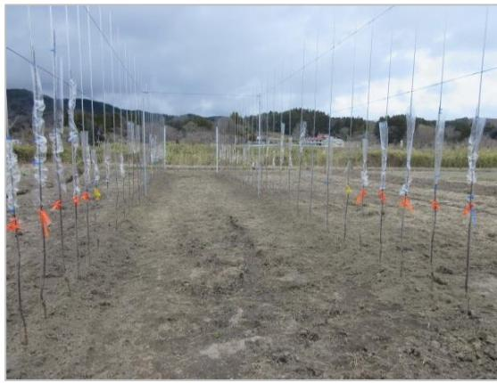

# **津島**

# **津島の再生に向けた取組**

浪江町役場津島支所・福島相双復興推進機構(令和7年1月)

# **目次**

- P.2 **津島地区における一部避難指示から現在までの経過**
- P.3 **津島地区の生活基盤インフラの整備**
- P.4 **津島地区に関する要望活動**
- P.5 **津島駐在所の再開**
- P.6 **特定帰還居住区域復興再生計画について**
- P.7 **津島地区における賑わいづくり**
- P.13 **津島地区の農業再生に向けた動き**

### **津島地区における一部避難指示から現在までの経過**

4月 1日つしま活性化センターに防災備蓄倉庫と屋外トイレを整備 4月13日つしま芸能祭開催 6月20日特定帰還居住区域の除染開始 6月30日浪江町の津島MusicLive & 手づくりマルシェ開催 7月31日津島駐在所が業務再開 8月17日つしま夏まつり開催 8月22日津島の賑わいを取り戻すStep開催

# **津島地区の生活基盤インフラの整備**

- ⚫ 津島地区には**帰還した住民と移住者の住宅を確保**する観点から、再生賃貸住宅を整備しいます。津島地区には自宅への帰還者と合わせて、**12世帯20名(12月31日現在)の住民の方が居住**しています。
- ⚫ また、居住者の生活インフラを支えるため、毎週水曜日には**移動販売車による生活物資の販売**も実施するなど、津島地区の復興は緩やかであるものの着実に進んでいます。

#### **<住宅環境の整備> <買物環境の整備>**

令和5年3月18日住宅団地が完成

完成式も行われ、入居を予定している住民と町長ら町の関係者、津島地区の行政区長などが出席しました。

イオン浪江店より移動販売車が出発

毎週水曜日10:40-11:10、つしま活性化センターで移動販売が行われています。

# **津島地区に関する要望活動**

- ⚫ 令和6年8月9日に、**国道399号「あぶくまロマンチック街道」の整備促進等に係る中央要望**を行いました。
- ⚫ 国道399号のうち、田村市、川内村、浪江町、葛尾村、飯館村の区間を**あぶくまロマンチック街道**と称しています。
- ⚫ 浪江町では、手七郎地区(3,000m)について早期の整備を要望しました。

# **津島駐在所の再開**

- ⚫ 東北電力福島第1原発事故に伴い休止していた双葉警察署津島駐在所が、津島地区の特定復興再生拠点の避難指示の解除に合わせて、令和5年3月30日に**立ち寄り所として運用を始めました。**
- ⚫ 令和6年7月31日に開所式が行われ、**駐在所業務を再開しました。**駐在所には警察官が住み込みで勤務をしています。

住所浪江町大字下津島字萱深51-2 TEL 0240-36-2017 ※不在時には、双葉警察署浪江分庁舎に (0240-34-2141)お電話ください。

駐在する宮下巡査長

これまで不安に思っていた住民もいたと思いますが、安心して暮らせる環境だと思えるよう

に活動していきます。

関係者が出席し、双葉警察署津島駐在所の開所式が行われました。

# **特定帰還居住区域復興再生計画について**

- ⚫ 令和5年6月に福島県復興再生特別措置法の改正により、帰還困難区域内の復興再生拠点区域外において**避難指示を解除し、住民の帰還・居住を可能とする**「特定帰還居住区域」を設定することができる制度が創設されました。
- ⚫ 浪江町では**特定帰還居住区域再生計画**を取りまとめ、令和5年12月22日付けで国へ認定申請をし、令和6年1月16日付けで認定されました。
- ⚫ 令和6年6月20日に**羽附地区で除染作業が始まりました**。

#### 〇特定帰還居住区域詳細図(津島地区)

※関係規定:福島復興再生特別措置法第17条の9第1項、第2項第1号福島復興再生特別措置法施行規則第9条の2第1項第1・2号

# **津島地区における賑わいづくり① ~第1回つしま芸能祭~**

- ⚫ 4月13日、津島地区で初めてとなる「つしま芸能祭」を開催し、7組の出演者によるピアノ演奏や歌・弾き語り・大道芸などをはじめとる「芸」の披露が行われました。会場では豚汁が振舞われたほか、飲食販売も行われました。また、地元の方が**桜の名所をご案内する「さくら巡りツアー」**も行われ、旧津島小学校をはじめとする花見スポットを巡りました。
- ⚫ 春を楽しみながら、**避難指示解除後1年を迎えた津島の"いま"を感じるイベント**になりました。

田村市常葉町のヒーロー「トキワマン」。「なみえアベンジャーズ」も駆けつけ、一緒に会場を沸かせました。

7

# **津島地区における賑わいづくり② ~浪江町の津島MusicLive&手づくりマルシェ~**

- ⚫ 6月30日に、つしま活性化センターにおいて、BRONZE道心様と手づくりマルシェ実行委員会様の主催でバンドライブと手づくりマルシェが開催されました。
- ⚫ 当日は、100名を超える来場者が訪れ、ライブ鑑賞やお買い物などを楽しまれていました。

# **津島地区における賑わいづくり③ ~つしま夏まつり~**

- ⚫ 7月13日に、つしま活性化センターでつしま夏まつりが開催されました。
- ⚫ 14年ぶりに盆踊りが復活し、交流を楽しみました。

# **津島地区における賑わいづくり④ ~津島の賑わいを取り戻すStep~**

- ⚫ 8月22日に、津島の賑わいを取り戻すStepが開催されました。第一部では昨年の9月に行われたHopに引き続き、浪江の食材を使った創作料理教室が行われたほか、第2部ではマジックやダンスショーなどが行われました。 ⚫ 作った料理は昼食として参加者へふるまわれました。また、マジックやダンスショーは見るだけはなく、マジックをおそ
わったり、一緒に踊ったりしました。

えごまなど、浪江の食材を取り入れた創作料理を作りました。

# **津島地区における賑わいづくり⑤ ~さあ行くべ!つしま肉まつり~**

- ⚫ 10月13日、昨年に引き続き**「つしま肉まつり」が開催**されました。
- ⚫ 会場となったつしま活性化センターでは、**メインのバーベキュー**のほか**、津島名物「かぼちゃまんじゅう」の販売** や、**南津島郷土芸術保存会による田植踊り・神楽などのステージイベント**、**津島の記録残しのためのパネル展示**と大盛況となりました。
- ⚫ 当日集まった来場者たちは、焼肉に舌鼓を打ちながら互いに近況を語り合うなど、懐かしい声が会場にあふれていました。

約500名の来場者で賑わいました。

# **津島地区における賑わいづくり⑥ ~イルミネーション点灯~**

- ⚫ 12月7日に、つしま活性化センターで**イルミネーション点灯式**が行われました。
- ⚫ 12月7日~2月28日の間に国道114号線沿いの、つしま活性化センターの建物周辺がイルミネーションによって彩られています。
- ⚫ イルミネーション点灯の準備にあたっては、主催の「つしま会」を中心に、町民有志やボランティアの方々により、町の復興コミュニティ事業補助金も活用しながら進められました。

# **津島地区の農業再生に向けた動き ~りんご、水稲の栽培~**

- ⚫ 4月6日、**津島を「リンゴの里」とする実証栽培**がスタートしました。農地2カ所に苗木140本を移植。
- ⚫ 今後、50haまで面積を拡大し、年間3千tの生産を目指します。
- ⚫ また、5月23日には津島地区で**14年ぶりとなる田植え**を、9月30日に**稲刈り**を行いました。福島県が開発した中山間地域向けの品種「里山のつぶ」を8aの水田に植え付け。「農地保全・試験栽培区域」となる津島地区ではコメの出荷は現在出来ないものの、今後の安全性確認を経て出荷再開を目指します。

株式会社マンカウィル東北による「りんご実証栽培」の取組

津島地区復興組合による田植え稲刈り

# **津島地区の賑わいづくりに向けて ~今後の予定~**

- ⚫ 津島地区の特定復興再生拠点では、今後も、町民の皆様にイベントの実行委員やボランティアの方々なども加わり、復興と地域の再生に向けた賑わいづくりが進んでいきます。
- ⚫ 昨年開催され好評だったイベント、新たに開催のための企画が進んでいるものなど、地域が一体となった賑わいづくりの場に皆さん是非おこしください。自然豊かな津島地区に足を運んでみませんか。

