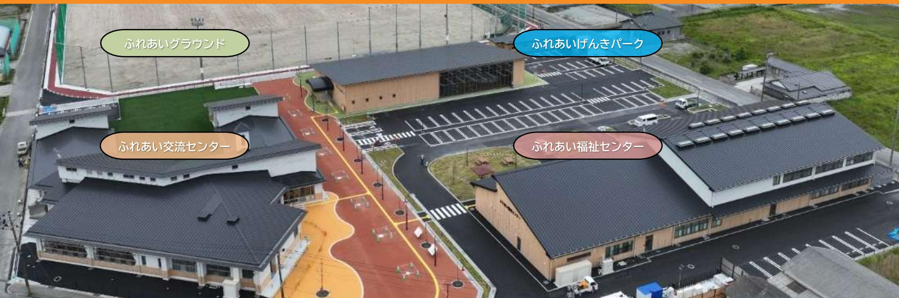
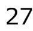

# **なみえ復興レポート令和7年1月**

# **福島県浪江町**

# **ふるさと「浪江町」** 海と山と川に囲まれ、自然に恵まれたまち歴史と伝統を大切にするまち資源を生かした、にぎわいのあるまち

1

# **東日本大震災の被害**

# **震度6強の揺れ 15メートルを超える津波** 約**1,000**事業所が被災死者**182**人うち行方不明31人 **6**㎢が浸水全壊家屋**651**戸 (流失586戸、地震65戸)

- 家屋倒壊による圧死は1人
# **福島第一原子力発電所の事故**

# **半径20㎞圏内に避難指示 20km~30kmに屋内退避指示**

町全域**21,000**人を超える町民が避難対象に

避難先を転々、役場機能も**1年半で4回移動**

長引く避難生活による**震災関連死442人** (令和4年6月末)

# **空間放射線量の分布と区域指定**

# **浪江町復興計画**

| (平成24年10月策定)                                                     | (平成29年3月策定)                                                        | (令和3年3月策定)                                                                                                                                         |
|------------------------------------------------------------------|--------------------------------------------------------------------|----------------------------------------------------------------------------------------------------------------------------------------------------|
| 【第一次】                                                            | 【第二次】                                                              | 【第三次】                                                                                                                                              |
|                                                                  |                                                                    |                                                                                                                                                    |
| 浪江町復興まちづくり計画 (平成26年3月) まち・ひと・しごと創生 浪江町総合戦略 (平成28年3月) | 浪江町中心市街地再生計画 (平成29年3月) 浪江町特定復興再生 拠点区域復興再生計画 (平成29年12月) | 〇計画の構成 ア 基本構想 「復興の理念」と、これを達成しうるための 基本方針計画期間:令和3年~令和12年 イ 基本計画 基本構想を実現するための施策を定めるもの 計画期間 令和3年~令和7年(前期) 令和8年~令和12年(後期) |
| 避難指示解除に関する 有識者検証委員会報告書 (平成28年3月)                           | まち・ひと・しごと創生 浪江町総合戦略【第2期】 (令和2年3月)                            | 〇進行管理 PDCAサイクルによる効果的な進行管理を行 い、評価の結果を踏まえながら改善を行い、計画 の着実な実行に繋げます。                                                                           |

# **《復興の理念》**

# **夢と希望があふれ住んでいたいまち住んでみたいまち** ~なかよくみんなえがおの花咲くまちなみえ~

# **《復興の基本方針》**

**Ⅰ 夢と希望のある産業と仕事づくり**

**Ⅱ 未来を担う人づくり**

**Ⅲ 帰還困難区域の再生と住みよい環境づくり**

**Ⅳ 健康と福祉のまちづくり**

**Ⅴ 絆の維持と持続可能なまちづくり**

# **復興の歩み(Ⅰ)農林水産業の再興**

## 17復興組合が活動中

## **野菜**

- ・町内で収穫した野菜が道の駅なみえなどで販売
- ・タマネギ「浜の輝(かがやき)」や、えごま、いちごの栽培開始
- ・令和3年4月からは長ネギの栽培も行われている

## **水稲**

- ・平成26年試験栽培を開始
- ・平成27年販売開始
- (全量全袋検査で全て基準値以下)
- ・令和3年9~10月苅野地区・棚塩地区に米の乾燥や貯蔵などができる「カントリーエレベーター(乾燥調製貯蔵施設)」を整備
- ・令和5年1月、苅野地区に育苗施設を整備

### **花き**

- ・平成26年から試験栽培を開始
- ・トルコギキョウやストック、カラーなどの花を栽培し、町内外に出荷

### **新しい農業の展開**

- ・地域おこし協力隊などによる新規就農の推進、農業の担い手の確保
- ・農業の法人化、農業法人の誘致
- ・共同利用施設(カントリーエレベーター、育苗施設、復興牧場)整備などの農業再生基盤の再生と強化
- ・新しい技術の活用による農作業の省力化、農作物の品質向上

# **復興の歩み(Ⅰ)農林水産業の再興**

農業再生基盤の仕組み **農業再生基盤の再生と強化**

# **復興の歩み(Ⅰ)農林水産業の再興**

福島高度集成材製造センター(通称:FLAM)、港湾設備、水産業共同利用施設などが完成

### **林業の再建**

- ・森林の持つ公益的機能を継続的に発揮させるため、森林整備や放射性物質対策等の継続した取組
- ・CLT(直交集成板)などの新技術の導入
- ・令和3年11月に福島高度集成材製造センターを整備

### **漁業の再建**

- ・安全で高品質な「請戸もの」ブランドを全国に発信
- ・さけ漁や遊漁の再建支援(放射線物質に関するモニタリング調査の継続、やな場、ふ化場の整備)
- ・平成25年からあゆ稚魚の放流、そのほかヤマメやイワナ稚魚の放流を実施(室原川高瀬川漁業協同組合)
- ・平成30年と令和4年に鮭稚魚の放流(泉田川漁業協同組合)

### **請戸漁港**

- ・平成29年漁船が帰還
- ・平成30年海上の安全と豊漁を祈願する出初式が復活
- ・令和2年4月競りが再開し、首都圏を中心に「請戸もの」の流通が再開し、ヒラメ、カレイ、シラス、シラウオ、スズキ、メバルなどが水揚げされる。
- ・水産加工団地では水揚げされた魚の加工事業も再開され、町内の店舗やイベント会場で販売が行われている。
- ・令和3年11月請戸漁港が竣工
- ・令和4年12月震災後初の「請戸魚市」の再開

請戸漁港から出航する漁船

# **復興の歩み(Ⅰ)新たな産業と雇用の創出**

**町内に店舗・施設がオープン**

## ●令和3年8月いこいの村なみえグランドオープン **産業団地に立地した企業**

### 浪江町北産業団地

- ・株式会社バイオマスレジン福島・かもめミライ水産株式会社
●令和元年7月イオン浪江店オープン

●令和3年3月道の駅なみえグランドオープン

### 浪江町藤橋産業団地

- ・フォーアールエナジー株式会社
- ・静光産業株式会社
- ・株式会社一路
- ・富士コンピュータ株式会社
- ・BSホールディングス株式会社
- ・株式会社REBGLO

### 浪江町南産業団地

- ・會澤高圧コンクリート株式会社
- ・八島運送株式会社
- ・株式会社ダイイチ
- ・株式会社トッキュウ

### 浪江町棚塩産業団地

- ・福島水素エネルギー研究フィールド
- ・福島高度集成材製造センター
- ・福島ロボットテストフィールド
- ・ふくしまハイドロサプライ株式会社
- ・日揮ホールディングス株式会社

- 株式会社良品計画
- 福島県酪農業協同組合および全国酪農業協同組合連合会
- 丸紅株式会社、株式会社日立製作所、パナソニック株式会社、みやぎ生活協同組合福島支部
- 隈研吾建築都市設計事務所、伊東順二事務所、住友商事株式会社
- 双葉町・南相馬市・日産自動車・フォーアールエナジー・福島日産自動車・日産プリンス福島販売・イオン東北・日本郵便・長大・ゼンリン
- 三井住友海上火災保険株式会社
- 弘前大、福島大、東京大、新潟大、東京工業大、東北大、東京農業大、福島学院大
- よい仕事おこしフェア実行委員会
- 東武トップツアーズ株式会社

### **連携協定締結基本協定締結**

- 国立研究開発法人新エネルギー・産業技術総合開発機構(NEDO)
- 上記、産業団地に立地した企業各位

- 11
# **復興の歩み(Ⅱ)子育て環境・学校教育の充実**

### **震災時** 町内6つの小学校と3つの中学校に約1,700人が在籍

- 浪江にじいろこども園に51人、なみえ創成小学校に47人、なみえ創成中学校に24人が在籍(令和6年4月現在) 避難先の全国約350の小中学校に796人が在籍(令和5年3月現在) **震災後**
## **◆町立学校のあゆみ**

- ・平成23年8月浪江小学校、浪江中学校が二本松市内で再開
- ・平成26年4月津島小学校が二本松市内で再開
- ・平成30年4月なみえ創成小学校・中学校開校、浪江にじいろこども園開園
- 
- ・平成31年4月幾世橋・請戸・大堀・苅野小学校、浪江・浪江東・津島中学校合同休校式を実施
- ・令和2年7月閉校・解体となる浪江・幾世橋・大堀・苅野小学校、浪江中学校の学校見学会を実施
- ・令和3年3月津島小・中学校、なみえ創成小・中学校を除くすべての町立小・中学校が閉校
- ・令和3年6月津島小・中学校が閉校
- ・令和4年4月浪江にじいろこども園の園舎増築により定員を30人から90人へ変更
- ・令和4年9月町立学校閉校式及び閉校のつどいを開催
- ・令和5年11月津島小・中学校の学校見学会を実施

# **復興の歩み(Ⅱ)生涯学習環境の充実**

# 町民が交流できる場として整備

### **ふれあいグラウンド**

野球やサッカーなどの屋外競技に対応したグラウンド(夜間照明完備) です。

※外周はランニングコース

ふれあい交流センター

会議室、和室、調理室、図書館などがあります。

### ふれあいげんきパーク

乳幼児から小学生までが遊べる遊具や、小学生以上が利用できるボルダリングコーナーなどがあります。

### ふれあい福祉センターデイサービスや、福祉・介護に関する相談ができます。

# **復興の歩み(Ⅱ)震災の記憶の伝承**

### ・平成29年3月

東日本大震災直後の町の初動体制から復旧・復興の取組を記録した「浪江町震災記録誌」を作成

・平成30年7月

国が策定した「福島県における復興祈念公園基本構想(平成29年7月)」に基づき、「福島県復興祈念公園基本計画」が策定(浪江町と双葉町にまたがるエリアに設置)

### ・平成31年2月

浪江町震災遺構検討委員会からの提言を受け、請戸小学校を震災遺構として保存・活用する方針が決定

# **震災遺構浪江町立請戸小学校**

### ・令和3年6月

東日本大震災から今日に至るまでの復興の様子を記録した「浪江町震災・復興記録誌」を発行

- ・令和3年10月
震災遺構浪江町立請戸小学校が開館

- ・令和4年3月
旧請戸共同墓地を整備した「先人の丘」が完成

# **復興の歩み(Ⅲ)帰還困難区域の再生**

# **復興の歩み(Ⅲ)帰還困難区域の再生**

### **「特定帰還居住区域」の避難指示解除に向けた動き**

令和5年6月に福島復興再生特別措置法が改正され、特定復興再生拠点区域外において、避難指示を解除し、住民の帰還・居住を可能とする「特定帰還居住区域」を設定できる制度が創設されました。これを受け、町では帰還困難区域にお住まいだった皆さまよりご回答をいただいた帰還意向調査の結果をもとに特定帰還居住区域案を作成、住民の皆さまとの意見交換の結果も踏まえ「特定帰還居住区域復興再生計画」を国に申請し、令和6年1月に計画の認定を受けました。本計画に基づき、令和6年度より除染とインフラ整備を進め、早期避難指示解除を目指します。

なお、特定帰還居住区域については、今後実施する「帰還意向調査」の結果等により、さらに拡大して参ります。

また、町内全域の避難指示解除については、引き続き、国に対して早期に方針を示すよう強く働きかけて参ります。

# **復興の歩み(Ⅲ)帰還困難区域の再生**

**・令和5年6月3日**

特定復興再生拠点区域に指定されていた大堀相馬焼物産会館(通称陶芸の杜おおぼり)が、12年ぶりに再開しました。

再開に合わせて開催された「大せとまつり」では、およそ3,000人が来訪しました。

**・令和3年4月1日路線バス運行開始**

町役場、JR浪江駅、道の駅なみえなどの町内の主要施設を結ぶ

**・令和3年4月14日カーシェアリングレンタカーサービス開始** 町民や電車を利用して町を訪れた人の交通手段として期待

**・平成27年3月1日常磐自動車道開通** (常磐富岡IC~浪江IC間) **常磐自動車道全線開通** **・平成29年4月1日JR常磐線運転再開** (浪江駅~仙台駅間)

**・令和2年3月14日JR常磐線運転再開** (富岡駅~浪江駅間) **JR常磐線全線開通**

## ◆ **最先端技術の活用**

- 情報通信技術などを活用した「人を運ぶ」「荷物を運ぶ」などの新しい移動サービスの実現を目指す取組が開始(なみえスマートモビリティ)
- 令和3年2月町内でモビリティサービスの実証実験を実施
- 令和4年6月通年での実証運行を開始

町民の生活環境の向上、町を訪れる人の利便性を高め町全体の活性化を促進

# 令和8年度事業完了予定

**「なみえルーフ」が生み出す、人のつながり** ・駅から商業施設まで、ひと続きにつながるアップダウンのあるダイナミックな大屋根が町ににぎわいを生み出します。これまで住んでいた方も、そしてこれから住んでみたい方も、大屋根「なみえルーフ」に集まり、人と人のつながりをつくります。 ・開いた円形状の屋根は、求心力と発信力を併せ持つ、シンボリックなデザインです。

### **木材や再生可能エネルギーを活かした環境モデル浪江ならではの自然の特徴や素材の活用**

- ・木材や水素、再生可能エネルギーを環境と調和させ、浪江町に根差したライフスタイルとして世界に発信できる、未来のまちづくりを進めていきます。
- ・水素ステーションを起点としたエネルギー供給により、浪江産水素の地産地消を実現します。
- ・駅前から新町通りまで連続する緑空間に、山と海の両方の良さを持つ浪江町の特徴を生かします。
- ・緑空間の舗装材には、震災で廃材となってしまった屋根瓦や大堀相馬焼をアップサイクルして利用し、浪江町の記憶を継承します。
	- ・これまでの浪江の特徴や素材を最大限に活かして、これからの浪江につなぎます。

# **福島国際研究教育機構F-REI**

**F**ukushimaInstitutefor **R**esearch, **E**ducationand **I**nnovation

### **F-REI(エフレイ)とは主な研究内容**

- ◆福島国際研究教育機構(略称:F-REI)は、福島復興再生特別措置法に基づく特別の法人として国が設立する研究教育機関です。
- ◆理事長のリーダーシップの下で、F-REIの持つ研究開発・産業化・人材育成・司令塔の4つの機能を発揮するための取組を一体的に推進します。

### **ロボット**

廃炉作業の着実な推進を支え、災害現場等の過酷環境下や人手不足の産業現場等でも対応が可能となるよう、ロボット等の研究開発を行います。

### **農林水産業**

スマート農業やカーボンニュートラル等を通じた地域循環型経済モデルの構築を目指し、超省力・低コストな持続性の高い農林水産業に向けた実証研究等を行います。

### **エネルギー**

### 福島を世界におけるカーボンニュートラル先駆けの地とするため、水素エネルギーネットワークの構築や、ネガティブエミッション技術の研究開発等を進めます。

**放射線科学・創薬医療、放射線の産業利用** オールジャパンの研究推進体制の構築と放射線科学に関する基礎基盤研究やRIの先端的な医療利用・

創薬技術開発及び超大型X線CT装置等を中心とした技術開発による放射線の産業利用を実現します。

**原子力災害に関するデータや知見の集積・発信** 自然科学と社会科学の研究成果等の融合を図り、原子力災害からの環境回復、原子力災害に対する備えとしての国際貢献、更には風評払拭等にも貢献します。

21

また、F-REIを核とした復興まちづくりの効果検証研究を実施し、活力ある地域づくりにつなげます。

### **F-REIロードマップ(イメージ) アクセス・お問い合わせ先**

# **浪江国際研究学園都市形成に向けた取組**

### **NamieGlobalCampusTownPlan**

F-REIの本町への立地に伴う状況変化に対応するため、令和6年3月に「浪江国際研究学園都市構想」を策定しました。今後、町の最上位計画である浪江町復興計画【第三次】等を踏まえながら、本構想に基づきキャンパスタウン形成等のまちづくりを進めます。 計画期間:令和6年度~令和15年度(10年間)

- 
対象範囲:浪江国際研究学園都市の範囲は浪江町全域とします。

浪江町ホームページ浪江国際研究学園都市構想

# **復興の歩み(Ⅲ)防災・安全の強化**

平常時は町民の交流の場として、災害時には避難所としての機能を有した施設となっています。

| 施設名             | 住 所      | 場 所       | 備 考      |
|-----------------|-------------|--------------|-------------|
| 浪江町防災交流センター     | 室原字八龍内22番地1 | 常磐自動車道浪江IC隣  | 会議室5室、集会室5室 |
| 浪江防災コミュニティセンター  | 川添字南大坂28番地  | 旧浪江中学校敷地内    | 集会室2室       |
| 大堀防災コミュニティセンター  | 小野田字下原1番地   | 大堀総合グラウンド敷地内 | 集会室2室       |
| 苅野防災コミュニティセンター  | 苅宿字鹿畑16番地   | 旧苅野小学校敷地内    | 集会室2室       |
| 幾世橋防災コミュニティセンター | 北幾世橋字植畑11番地 | 旧幾世橋小学校敷地内   | 集会室2室       |

### **【防犯対策など】**

- ・町有害鳥獣捕獲隊活動
- ・警察及び消防24時間体制常駐
- ・主要道などへの防犯カメラ設置
- ・町消防団町内パトロール
- ・町防犯見守り隊町内パトロール
- ・警備会社町内パトロール

# **復興の歩み(Ⅲ)ゼロカーボンシティの推進**

### ◆ **原子力に依存しない、エネルギー地産地消のまちづくり**

- 再生可能エネルギーを活用、少ない電力を効率的に利用する「スマートコミュニティ」の推進
- 令和2年3月に、国が推進する〝2050年までに二酸化炭素排出量実質ゼロ〟を目指す「ゼロカーボンシティ」を宣言
- 浪江町地球温暖化対策総合計画~なみえエネルギーチャレンジ2035~を策定し、2035年を待たずにゼロカーボンシティを実現することを目指す
- 「道の駅なみえ」、「いこいの村なみえ」「ふれあいセンターなみえ」に水素で発電した電力や発電時に生じた余熱を利用した温水を供給する設備を設置
- 公用車として、電気自動車(EV)や水素で走る燃料電池自動車(FCV)を導入するとともに、スクールバスのFCV化や、イオン東北と連携したFCVによる移動販売事業も展開
- 移動式水素ステーション「ナミエナジー」、定置式水素ステーション「浪江水素ステーション」が開所
- 2023年、水素の利活用に関わる知見や取組みを共有するため、米カリフォルニア州ランカスター市およびハワイ郡の二都市と「太平洋水素エネルギー共同体(パシフィック・ハイドロジェン・アライアンス:通称PHA)」を表明 24

# **復興の歩み(Ⅳ)健康づくりの推進・医療の充実**

- ・平成23年9月仮設津島診療所を二本松市内の仮設住宅内に開所
- ・平成24年4月町独自にホールボディカウンターを導入、内部被ばく検査を開始
- ・平成24年7月全町民に「放射線健康管理手帳」を交付
- ・平成24年以降甲状腺検査を開始(福島県が実施しない年に実施)
- ・平成25年5月役場本庁舎内に仮設診療所を開設
- ・平成29年3月浪江診療所を町内に新築、仮設津島診療所を二本松市内の復興公営住宅敷地内に移設し、開所
- ・平成30年8月町内で民間の医療機関(歯科)が診療を再開
- ・令和5年8月浪江診療所で訪問診療を開始
- ・令和5年9月浪江診療所で小児科を開設
- ・令和5年10月町内で民間の調剤薬局が開業
- ・令和6年2月町内に居住している子どもを対象とした小児科のオンライン診療を開始

# **復興の歩み(Ⅳ)放射線による健康不安への対策**

# ◆ **除染・災害廃棄物の処理**

- ・平成24年11月環境省が除染実施計画策定
- ・平成25年8月帰還困難区域モデル除染開始 10月本格除染開始
- ・平成29年9月フォローアップ除染の実施
- 10月津波被災地を除く避難指示解除準備区域、居住制限区域での除染完了・平成30年5月 「特定復興再生拠点」整備に向けた除染開始

# ◆ **放射線モニタリング**

- ・町内91か所にモニタリングポスト設置(これ以外に35地点で測定)
- ・取水場4か所に24時間水道水モニタリング装置を設置

# **復興の歩み(Ⅴ)被災者生活支援・絆の維持**

## **◆交流館の設置、復興支援員の配置**

- 県内3か所(いわき・福島・郡山)に交流館を設置
- 生活再建を支援するため復興支援員(県内9人・県外1人)を配置 (令和6年3月現在)

# **◆町オリジナルのウェブサービスを利用した「きずなの維持」**

- 町民の声を基に「なみえ新聞」を開発し、町の話題の発信を行う
- 町民がお気に入りの写真を投稿できる機能を開設
- 令和5年4月にはアプリからウェブ版へ移行

## **◆ 「浪江のこころ通信」(町民へのインタビュー連載)**

- 福島県内外に分散避難した町民の思いをつなげる
- 「広報なみえ」にとじ込み、延べ約450人の家族などが登場
- 平成26年と平成29年、令和4年に総集編を発行・配布

## **◆浪江町イメージアップキャラクター「うけどん」**

- 平成30年10月、タブレットで町の話題を発信していた「うけどん」が浪江町イメージアップキャラクターに就任
- 町の魅力や情報を町内外でPRするために活躍中

# **復興の歩み(Ⅴ)移住・定住の推進**

## ◆ **町民の帰還支援**

- 町内の個人住宅の再建などの支援、支援・相談体制の整備、ふるさと情報の発信
## ◆ **移住・定住の推進、住みやすい住環境の整備**

- 移住・定住の相談窓口の強化、家賃補助や住宅取得補助など各種支援制度の充実
- 新たな移住・定住支援施策(長期お試し宿泊や企業の案内など)の取組の実施
- 暮らしの情報や支援施策など、町の魅力を国内外に発信
- 空き家の適正な管理と流通・利活用の推進
- なみえスマートモビリティ実証実験の実施
- ◆ **「なみえプロモーション課」**(地域おこし協力隊メンバーが所属)
	- 町が抱える課題を外部の目線で解決に向けて取組むとともに、SNSなどを活用した情報発信、まちのにぎわいづくりなどを通じて"なみえらしさ"を「見つける・創る・広める」活動を行う

## ◆ **ナミエシンカ**

- 復興意欲の高い人材の呼び込みに向けて、令和4年10月にコワーキングスペースを整備するとともに、起業支援を実施

# **復興の歩み(Ⅴ)移住・定住の推進**

**被災町民向け災害公営住宅として整備(全111戸)** ◆幾世橋住宅団地 85戸第1期分(22戸)平成29年7月 1日から入居開始第2期分(63戸)平成30年3月25日から入居開始 ◆請戸住宅団地 26戸令和2年10月1日から入居開始

**震災前に整備した一般の公営住宅を修繕** ◆御殿南住宅 10戸平成31年3月25日から入居開始

- **被災者・転入者向け公的賃貸住宅として整備(全90戸)** ◆幾世橋集合住宅旧・雇用促進住宅 2棟 80戸改修平成29年9月11日から入居開始 ◆津島住宅団地 10戸令和5年4月1日から入居開始

# **まちづくりの核となるエリアを足掛かりに町全体を再生**

# **住民意向調査の結果(令和5年度)**

# **帰還の意向帰還の時期**

### **◆ 浪江町民に愛されてきた「なみえ焼そば」**

およそ50年前に誕生したご当地グルメの一つで、極太の麺と、うまみたっぷり濃厚ソース、もやしと豚肉の

シンプルな具が特徴です。また、ご当地グルメの祭典「B-1グランプリ」で日本一に輝き、避難指示解除後は「東北五大やきそばサミット」と題して東北地方の有名な焼そばを集めたイベントを浪江町で開催しています。

## **◆ ふるさとの味が浪江町を伝える**

かつて海に一番近い酒蔵として、請戸漁港で水揚げされた魚に合う酒造りを代々行ってきた鈴木酒造店。 2021年3月、道の駅なみえに併設された酒蔵で浪江町での酒造りを復活させました。

浪江町の酒は、いまだ避難を余儀なくされている町民と浪江町を繋ぐふるさとの味となっただけではなく、請戸漁港で水揚げされるヒラメやカレイなど「請戸もの」に新たに触れる人にもふるさとの味を広めています。

# **認知度向上・地域の魅力づくり**

### **◆ 「NAMIEWATER」モンドセレクションで3年連続金賞**

町内で飲まれている水道水をペットボトルに詰めた「NAMIEWATER」が国際的な品質評価コンテ

ストのモンドセレクションで3年連続(2021・22・23)金賞を受賞しました。浪江町役場、道の駅なみえ、福島いこいの村、県内のイオン東北などで販売されています。

### **◆ 一輪を大輪に、「花のまち」を目指して**

避難指示解除後、徐々に米や野菜が生産されるようになった浪江町でしたが、作物から放射性物質が検出さ

れたこともあり、風評被害の少ない花卉の栽培が始まりました。 ノウハウもないゼロから始まったトルコギキョウの栽培は、東京オリンピックのメダリストたちとともに輝くビクトリーブーケに選ばれ、花卉市場で高い評価を得るようになりました。

# **認知度向上・地域の魅力づくり**

## **◆「住みたい田舎ベストランキング」で1位獲得 ※人口1万人未満の部門**

宝島社が発行する「田舎暮らしの本」(2024年2月号)で発表された「2024年版第12回住みたい田舎ベスト

ランキング」において「人口1万人未満の町」の中で総合部門、若者世代・単身者部門において1位を獲得しました。

### **◆第69回福島県市町村広報コンクール(映像の部)で最高賞の特選受賞**

・浪江町でしか体験できない一泊二日の女子二人旅をテーマに、震災で傷つきながらも力強く復興している様子や、地元を愛している人達の笑顔をとらえた内容で、映像の美しさや、風景、グルメ、体験など浪江町ならではの映像が高く評価されました。

QRを読込み町ホームページから動画をご視聴ください。

34 **「大切な人と訪れたい、福島県浪江町の旅」動画の一コマ**

# **復興を実現し飛躍するふるさとの姿**

**みんなの想いを一つに、復興を実現するまち**

# **ひとの縁を大切に、関わる人が増え、調和するまち**

# **先進的な取組で、夢と希望の未来を創るまち**

