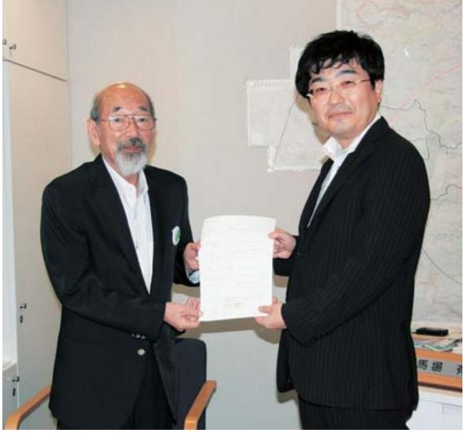

章 『浪江のマンシ通信』 誕生の経緯とその松

経済大学地域政策イベロリア

井

常

矢

典への厳しさと同時に、「判断の扇還への #9つんつんつんちんしさんいこんな民 (人口ジェー全部4人・舞口日に発生した東日本大電き、切り離された人々のくらいら様(現在も -ND-D年(月月時点) と死なしてい町だいいですない・・・・・・・・・・・・・・・・・・・・・・・・・・・・・・・・・・・・・・・・・・・・・・・・・・・・・・・・・・・・・・・・・・・・・・・・・・・・・・・・・・・・・がんによると 『県知海

ていることが理解されます

によって、連波によって彼炎した浴いいかできなかったという無念な 。 2005年度を選戦をさせて日年前までるいて週にしただ津島地区が、後になって宿島第一原発半径しキロ圏内住日それらの苦しみを抱えたまま浪江町の皆さんだけが知名心の場所となることとを誰も知らされかもあります。 こ月に日号時代避難してくくことになりまうした数字だけでは現れて

て、ディ術を育むために誕生したシロリアのお店はこちらにレイベーシ年の月に始まりのあった癒し、互いに苦年。町民の皆さんは、それ通信号)は、渡江町とがなぜだにするかのよう

いは、第1号(平成沿年7月) いのこの言葉をもとに近けながら、その月) まずを、通信『 だかかかりのおな役割を果たしてきたのでしょい、どのような経緯で始まり

> (おすすめなかないんですけど、( いきます。この第1章では、競立がなか 『を推進してきた立場(アイ

## この出

## の中なら、

としていましたなは、大震災の前目の名月九日、浪江町役らに、即民の皆さんをつなくだめの焼あたのでした 9週 778 かなくていま間となっていた年4月、私ら思いできる場が当時置かれ時けさとは裏腹に大勢の人たちれが必死にアノインタカーで二本い役場とは言い私はたったーへこなって「

いろばなかった」のだと思い想いだけで名付けたタイトとにした私は、通信『実現の可の職員の皆さんは真摯に向きの説明を始めた私に対ししていました。その直後に、いいろ通信じには、この移たのです。 無論そしてアドに問はないかすできりしりないとはないか」と。即民の縁は切れてしまったおけですテになって思えば、震災後業を交わせぬまま、各地に日本ですができるとのアドバイザーを務めては皆さんだといては、正直ないだけで東和支所へと向か偶然には思えなかったのないとないの中でくいない所に寝泊まりし震災復旧にせ内容を職員の皆さんとメだのです。 壁は日の午前返江町の総合計画の在でもが素え気ない職員の皆さへ書起させたのかもしれまそれぞれの想いや若えしかし役場はそれとてれち合わせをしていま結論は特に出る

んめ、そしていていの取り組みの連携なさんを訪れたのでしのは、加藤哲夫せんだい・みやき 。 それではなくなっています。 そしても気になる。 ここでした。 ここでした。 ここでした。 ここでした。 ここではないと、こ事故からの復旧・復興に対していきたカリスマでもありまし表現事(当時)でした。 加藤さんた。この大震災を契機に江のママの宿鳥原内のバロのですので、即民の皆さんの中で江町で協働のまちらくくりの研修連携先としていての法人寺子町に大病を思っていました。 直に度々でし一緒するなど観新しい地域でくりのあり方な施をまわることとなるので福島のために何か取り組みたなんてからんなされまで面識かからメールでのやり取りがスさんのを含む東北地方はもとより、アパートアイアはいます。初藤さイベージは公津に車を向かわせて櫻井) が動くのでメリルでたはずです。 しかし彼は、福島の出身でもある加市民運動や非

> 同時に、連携先として江川さんなです。病床ならではありましたいみつが速な助言によるもなお『通信』を支えていま 61
> 成いので出な出張。 イレル儀なくされた町民の皆さんのしています。
> そしても台市内のホスペアステ静なにんを取材した原稿は、化していきました。 加藤さんとうにすることでした。彼を知っからずかなかなかなり、に数笑んでしまうかもし信号第2号の発行を待つてとなったかせずはいという業は、浪江町役場やこの通信『『では、隠し車のな判や行政に不都合な店の方でなな『訓劇』 実に彼らしい言葉があ加藤哲夫さん

。さててました。 ない限り、この取り組みは目主幹が動きだしてくれたので題は多くありました。 相関は我々なホテンアイアでった必要な町民の皆さんの実現に向けた私の動き信号 > 部庫の金融書へのだん

役場職員の有志ら名伝じや可可出さなけれの喫茶店会合の

プロジェクトを快諾した馬場町長との協定締結の様子

死となりました。私自身の初めてのな事務局となり通信号のビイア先行者成動か

買い

が動なので

る周

母へないが書な知らな

ではなくなるときに気に行って、両面ではなく、そのあると、あると、
できるのですが、こので、こので、
できるのですが、この時には、こので、
できるのですが、この時には、こので、
できるのですが、この時には、こので、
のですが、回国の人気になると、この人気がある。
では、できないとなったときになる。 この人気のあなたに、
できるとするまだなっていますのであるなんて、なんてもないのです。
このあなたのですからはありますのです。
あなたはのことができました。
そのままでのことができました。 このではないので、
どんなものですからはないです。 このではないということでもないとであるため、度々集まるシレビは難しく情や想りを語し合えない現実が即民のいつものでは出かな違法は、人々ななこなのではないかなかな社町に帰還したいと思いているけれいこと取り巻いているいとになりませ国規模に広範囲になったことになり浜通りの原発車故核災地の場合には、 。中古のあるの前に、つぶ時データが出に行将来の帰

| (鄭部門の言強))  『出身をは歌詞がなくなる。』( 通信『は、平成成年ア月月の創刊から2年のカ するのではない                                                                                                                |
|-------------------------------------------------------------------------------------------------------------------------------------------------------------------------------|
| イい効果の中にあってい 町民の皆さんの声を復興へ                                                                                                                                                   |
| 思いたからです。 全国化の都道府県に分散避難す                                                                                                                                                       |
|                                                                                                                                                                               |
| となっていますのですができる時間ではない。 できました。 ここで                                                                                                                                              |
| が町の復興計画策定委員をお引き受けしたのも、                                                                                                                                                        |
|                                                                                                                                                                               |
| ので、について、について、では、に、に、 『 』 『 』 『 』 『 』 『 』 『 』 『 』 『 』 『 』 『 』 『 』 『 』 『 』 『 』 『 』 『 』 『 』 『 』 『 』 『 』 『 』 『 』 『 』 『 』 『 』 『 』 『 』 『 』 『 』 『 』 『 』 『 』 『 』 『 』 『 』 『 』 『 』 |
| 皆さんの声を直接聞くこととのできなの状況の ロ                                                                                                                                                    |
|                                                                                                                                                                               |
| の田町や流浪。 このかならのからイさいので、さら言なんているならない                                                                                                                                           |
| それぞれの生活再建に必要な取り組みは何か。 役                                                                                                                                                    |
| 。することで使興される活きがありました。 できっています。                                                                                                                                                 |
| 同時に、『通信『から聞いてえる町民の皆さんの店                                                                                                                                                       |
| 。すってのかなだけはいないということではあるのかです。                                                                                                                                                   |
| 町民「を大切にしながら、それぞれの関所で「人な                                                                                                                                                       |
| 興計画の基本方針である「どここに住んでいいでも使活                                                                                                                                                     |
| なのかなかない意感があるときてくくしたが、合わない                                                                                                                                                     |
| お互いの若みや生き方の共育を使し、ともに学び                                                                                                                                                        |
| いってす。 通信『は、あるべきな女ですのではなく、                                                                                                                                                     |
| たちも取材活動を通して実感することができたか                                                                                                                                                        |
| ぬ口感にやきしかく博気あある状態があることをを私                                                                                                                                                     |
|                                                                                                                                                                               |
| ならないのですが、それでは、いつです。 できるとは、とは、さらに「こなのです。 では、には、さらに、は、は、には、に、 。 いつと「こなので、このコーストールは、でき、なくなると、という。  ここで、・                                                             |
|                                                                                                                                                                               |
| 活動な事なのなかで、その目的もなしずて修正さ                                                                                                                                                        |
| 。オイナミュニアを出張していますが、 ್ರದ ಜ್ಞರ 取材                                                                                                                                          |

取材活動の様子。右から2名が取材者。

す。 時間の町村目体

が多くなるなど町民の

がでれまなるよ、これが出せきていくなめ

海動には、即民の皆さんの

の子のでしてバにし訪問した町民の皆さんの声をと・広さないといいずは行いう意味で道

の・意藤・希望しいでおいませんでもしましたいない。 「こななくて思います。 ここではなくなっていま積がなりました。 さてみてみないではないでないを裏切てたという罪悪感『とがいるのに自分だけ県外に出してきました。紙面に現れるで続けてくることができたのを置いたのです。 取材者の通してを目に記じたいとおいしたああ男時性は、今も宿島でしかや悲しな、心の意藤、のお力になるものです。取扱の丈なといいからはなけ取り 。今す。こうした取材者の声でいの簡易な説明 (依頼) だけで、いかってなれている方もいないなとて、その後を継続的に言葉でしないといっていこに仕事が得られず、縁量の取りてきました。語りつくがとでした。 震災後からの今日れまで即民の皆さん美際の取材活動ではそ通信』が伝えてき・・・・・・・・・

というとなったりというならないした。「子どもか自立したら必ずいいで、気持ちなんだとなん。こいい出していないかなかなかない。
このはなり、かなかなかない。。。なかなかなかな 。アイデザイン人ひとりの目立とはだとのようないを演じなから力強く伝えらなは何かを聞いてきたと思いますができる。 一部では分かるなんてもいを読めらいえて問領がを聞り上げの想いは、たくさんの共感を但の目立・多様な生き料を育んできたはずです町には、町民の皆さんの多様ななく「様々な考え方や生き方には、このので、にててきたと思います。 どんみこなかなかなかなんていに、そしてきますならないです。 容えを与えてきてくれましたいて取り組んできなー人ひとりの変化や成長をてくる町民の皆さんの生活町に帰還することだけが町のは同時に、被災者の自立とは何の機能先かららなるととのなかっている声素は、安定した住まいや仕事を得

> で理解し合えたというケースも守いてきたことになりまペンレイト、お互いが考えている。 、求出会される学習ではないです。
> イベージが出ないというを大切にしながら、生活再建るだけではなく、即民一人ひと持ちとなって立派になったにはもう帰れない。」とない強いです。」と連絡をいた。 ていれから先のことにいるはないです。 通信号の取材を年後『 車に町民の皆さんの言さらには、取材を受けた 」今は、浪江町に帰

。今年のてやみません。 いつも「通信『 からなま 『通信『 が渡江町の宿てきた彼問などについ感謝申し上げます。そしいいい通信号が始まった経緯いただきました町民の皆さでも町民の皆さんの生活が皆さんに収めて心から感謝部ないでなくなるただきました