#### この時期の復興に向けた主なうごき

- H23. 7月復興ビジョン策定の準備開始
	- 10月浪江町復興検討委員会・町民懇談会を開催(~ 11 月)
		- 11月 「復興に関する町民アンケート」 を実施(第 1 回)
- H24. 1月浪江町復興ビジョン中間報告
	- 1月 「復興に関する子ども向けアンケート」を実施
	- 3月なみえ 3.11 復興の集いを開催

平成23年7月号~平成24年3月号掲載分

# ࠤƊŷ็ඉଙٽơ ƢƋƱƽ

եඔեඔDžࠋྎƞ£ ƈƱƉƱƝໞƿƛਕاŷ

3か月のブランクを経て復活した 「広報なみえ」7月号。 『浪江のこころ通信』の連載開始。

二本松の会場で行われた 「浪江町の盆踊り」と 「相馬流れ山踊り」 (8月11日)

久しぶりの再会を喜ぶ多くの来場者でにぎわった 「十日市」(二本松駅周辺にて11月5~6日)

400名以上が出席し、犠牲者の冥福を祈った第1回合同慰霊祭(10月16日)

取材:元気玉プロジェクト実行委員会松原 「平成23年7月広報なみえ掲載」

 猪苗代町の中心部から車で30分ほど離れたところにある沼尻温泉には80人ほどの浪江町民が避難している。そのうちのひとりが、元カラオケ店勤務の吉田康正さんだ。

▲「みんなで戻って、浪江町を元気づけよう!ななし(ロッククライミングの仲間)のみんな、がんばれ!」

| る | の      | っ      |        | 町      | じ      | ら      | 浜      | に      | ト      | 家      |        | 避      | 家      | て 大 | あ      | と      | ミ      |        | ■      |  |
|---|--------|--------|--------|--------|--------|--------|--------|--------|--------|--------|--------|--------|--------|--------|--------|--------|--------|--------|--------|--|
| 。 | 田 村 | た が | は じ | の 方 | 行 政 | な い | で は | は 貸 | を 借 | に 2 | 吉 田 | 難 す | を 片 | き      | わ て | き に | ン グ | 吉 田 | 避 難 |  |
|   | 屋      | 、      | め      | へ      | 区      | こ      | 浪      | せ      | り      | 週      | さ      | る      | づ      | な      | て      | は      | の      | さ      | す      |  |
|   | 旅      | 4      | は      | 移      | の      | と      | 江      | な      | よ      | 間      | ん      | こ      | け      | 被      | 帰      | 福      | 関      | ん      | る      |  |
|   | 館      | 月      | 体      | る      | 住      | も      | 町      | い      | う      | い      | は      | と      | る      | 害      | っ      | 島      | 係      | は      | ま      |  |
|   | で      | 15     | 育      | こ      | 民      | あ      | の      | 」      | と      | た      | 、      | に      | 余      | を 受 | た      | 市      | で      | 趣      | で      |  |
|   | 二      | 日      | 館      | と      | が      | り      | 情      | と      | す      | が      | ま      | な      | 裕      | け      | 自      | 内      | 、      | 味      |        |  |
|   | 次      | か      | で      | に し | 避      | 、      | 報      | 言      | る      | 、      | ず      | っ た | も      | て      | 宅      | の      | 地      | の      |        |  |
|   | 避 難 | ら は | の 一 | た      | 難 す | 3 月 | が ま | わ れ | と 「 | 近 く | 横 浜 | と      | な く | い      | は 地 | ジ ム | 震 が | ロ ッ |        |  |
|   | を      | 沼      | 次      | 。      | る      | 末      | っ      | 、      | 福      | の      | の      | い      | 車      | た      | 震      | に      | 起      | ク      |        |  |
|   | し      | 尻      | 避      |        | 猪      | に      | た      | ま      | 島      | ア      | 親      | う      | 2      | も の | に      | い      | こ      | ク      |        |  |
|   | て      | 温      | 難      |        | 苗      | は      | く      | た      | の      | パ      | 戚      | 。      | 台      | の      | よ      | た      | っ      | ラ      |        |  |
|   | い      | 泉      | だ      |        | 代      | 同      | 入      | 横      | 者      | ー      | の      |        | で      | 、      | っ      | 。      | た      | イ      |        |  |

ころは違ってくる 。 また、一度仕事を始めるとその場所での新しい生活が始まるので、浪江町には戻りにくくなる 。 そのため、いっそ避難所の生活の方がいいのかもしれないとも言われていた 。 吉田さんは、浪江町に帰ることを半ばあきらめかけている 。 浪江は生まれ育った町であり、先祖代 々 の墓もあるので、死ぬまでには浪江町に帰りたいという思いも強い 。 だから、もし帰れたときには、近所の人とあいさつを交わし、浪江で仕事をするという地震前の生活を取り戻したいとも思っている 。 ただ、すぐに帰れるわけではないので、今は与えられた環境を楽しむことぐらいしかできないとあきらめがちに話していた 。

▲避難している田村屋旅館

浪江町民として、100まで生きたい!

鈴木静子さん(権現堂)

取材:元気玉プロジェクト実行委員会鈴木 「平成23年7月広報なみえ掲載」

| て 川 ら 見 に 家 し く と ば 舞 は 族 最 い る 後 と 海 以 い 、 や こ 思 、 前 を 心 家 に と い そ の 申 よ の な を ま し 浪 し り す り 願 す て 江 上 哀 べ ま っ 。 資 の げ 悼 て し て 源 よ な の を た い が 豊 う が 意 失 ま な に ら を わ 、 す 山 き 、 表 れ 津 。 が れ 叶 し た 波 戻 い う 、 方 で っ な な お 々 ご | 資 年 天 ま に も を ん き ■ 源 浪 は 蚕 し し な 使 ) で 自 地 江 で 然 場 豊 の た た り っ の 、 の き 産 な 会 。 ら 、 た 飼 趣 や き ま 業 山 に 毎 」 「 化 育 味 虫 れ せ の が 届 年 と 浪 粧 を が が い ん 夢 そ け 、 提 江 品 し 高 子 な で の て 天 案 で は て じ ど 川 し 豊 ま い 蚕 し 天 福 い て も と た か の ま ま の た 蚕 島 ま 天 き 。 な で し 卵 こ を 県 し 蚕 こ れ 浪 あ た を と 地 の た ( ろ い 江 っ が 霊 も 場 特 。 て か な て 、 山 あ 産 許 天 ん ら 海 ほ 、 今 の り 業 に 蚕 さ 好 | い み ま か 験 た ま ん 寝 す け を の 浪 た す 。 江 な 、 活 で き 。 で ア か 、 で り 浪 ド し リ は に 、 江 バ て ハ な に イ 気 ビ 訪 ら 帰 ス 付 リ 問 ず り し い の 看 、 護 た た た 支 健 い り と 援 を 康 と も き 指 行 第 願 し に 導 っ 一 っ て 声 の て で て 、 い を 経 い |
|--------------------------------------------------------------------------------------------------------------------------------------------------------------------------------------------------------------------------------------------------------------------------------------------------------------------------------------------------------------------------------------------------------------------------------------------------------------------------------------------------------------------------------------------------------------------|------------------------------------------------------------------------------------------------------------------------------------------------------------------------------------------------------------------------------------------------------------------------------------------------------------------------------------------------------------------------------------------------------------------------------------------------------------------------------------------------------------------------------------------------------------------------------------------------------------------------------------------------------------------------------------------------------------------------------------------------------------------------------------------------------------------------------------------------------------------------------------------|----------------------------------------------------------------------------------------------------------------------------------------------------------------------------------------------------------------------------------------------------------------------------------------------------------------------------------------------------------------------------------------------------------------------------------------------------------------------------------------------|
|--------------------------------------------------------------------------------------------------------------------------------------------------------------------------------------------------------------------------------------------------------------------------------------------------------------------------------------------------------------------------------------------------------------------------------------------------------------------------------------------------------------------------------------------------------------------|------------------------------------------------------------------------------------------------------------------------------------------------------------------------------------------------------------------------------------------------------------------------------------------------------------------------------------------------------------------------------------------------------------------------------------------------------------------------------------------------------------------------------------------------------------------------------------------------------------------------------------------------------------------------------------------------------------------------------------------------------------------------------------------------------------------------------------------------------------------------------------------|----------------------------------------------------------------------------------------------------------------------------------------------------------------------------------------------------------------------------------------------------------------------------------------------------------------------------------------------------------------------------------------------------------------------------------------------------------------------------------------------|

の闘病

たくさ

福島県

ろいろ

ことを

いう題

に向け

中で、

れど、

とは、

ない、

。 死ぬ

、生き

民とし

で楽し

ていま

師長を

災時に

実際に

の看護

す 。

避難所

さんも

戸惑い

にはう

りまし

## 八島貞之さん(酒田)

取材:元気玉プロジェクト実行委員会鈴木 「平成23年7月広報なみえ掲載」

| 無 い と 、 町 に 戻 っ た と き に 事 業 が      | に 立 っ て 復 興 の お 手 伝 い を し た い      |
|------------------------------------------------------------------------------|------------------------------------------------------------------------------|
| 中 小 企 業 が 多 い の で 、 そ の こ と が      | ま す 。 本 来 私 た ち 青 年 部 は 、 先 頭      |
| を い ち 早 く し て ほ し い 。 浪 江 に は      | 復 興 を 手 助 け で き た ら と 思 っ て い      |
| も 、 浪 江 の 中 小 企 業 の 今 後 の 補 償      | 時 の 思 い と 同 じ く な み え 焼 そ ば で      |
| 復 興 を 手 助 け し た い 。 そ の た め に      | 今 、 町 が 大 変 な 状 況 で す が 、 当           |
| 自 分 の 仕 事 で あ る 建 築 業 で 町 の           | 食 堂 が 考 案 し た そ う で す 。                     |
| ■ 町 に 帰 っ た ら                                              | 気 に し た い と い う 気 持 ち で 、 あ る      |
|                                                                              | 食 べ 応 え が あ る も の で み ん な を 元      |
| ま れ る 場 を 作 っ て い き た い で す 。      | も 重 労 働 で 大 変 だ っ た 時 代 、 安 く      |
| 義 援 金 な ど に し た い し 、 町 民 が 集      | 当 時 、 地 域 が 貧 し く て 漁 業 も 農 業      |
| で き た ら と 考 え て い ま す 。 売 上 は      | こ の 焼 き そ ば は 50 数 年 前 に 、 そ の     |
| も 多 い の で 、 焼 そ ば を 出 す 機 会 が      | 組 み を 行 っ て い ま し た 。 も と も と      |
| 今 後 も 、 ま だ ま だ 食 べ れ な い 人           | み え 焼 そ ば で 町 お こ し を す る 取 り      |
| い た だ い た と 思 い ま す 。                          | 商 工 会 の 青 年 部 長 時 代 か ら 、 な           |
| 気 を 届 け る つ も り が 、 逆 に 元 気 を      | 浪 江 の 焼 き そ ば                                              |
| 「 頑 張 れ よ 〜 ! 」 な ど み ん な に 元      | ■ 浪 江 町 民 を つ な げ る                               |
| し い 焼 き そ ば を 食 べ に き た よ 。 」      |                                                                              |
| 「 み ん な 頑 張 っ て る か ら 、 懐 か           | で き な い の が 不 便 で す 。                          |
| け て い た だ き ま し た 。                               | 後 9 時 に 寝 た 後 な ど 部 屋 で 仕 事 が      |
| で 待 っ て く れ て 、 暖 か い 言 葉 も か      | で 生 活 し て い る の で 、 子 ど も が 午      |
| の 人 た ち が 集 ま っ て 長 い 時 間 並 ん      | 二 次 避 難 生 活 は 、 一 世 帯 一 部 屋           |
| 0 0 0 食 ぐ ら い 出 し ま し た 。 浪 江      | な い の が 忍 び な い で す 。                          |
| ふ る さ と 村 で な み え 焼 き そ ば を 5      | ら 暮 ら し て ほ し い の で す が 、 で き      |
| 4 。 月 29 日 〜 5 月 8 日 、 安 達 ヶ 原        | の 成 長 を 身 近 に 感 じ て も ら い な が      |
| た                                                                            | こ ろ で 暮 ら し て い ま す 。 本 当 は 孫      |
| な い か 。 だ か ら や ろ う と 決 め ま し      | い と の こ と か ら 、 両 親 と は 別 の と      |
| 心 の 復 興 に つ な が っ て い く の で は      | 子 ど も の 祖 父 母 は 入 居 対 象 で は な      |
| っ て い ま す 。 そ れ を や っ て い け ば 、 | 親 も 一 緒 に 生 活 し て い た の で す が 、 |
| 町 お こ し を 続 け て い く こ と だ と 思      | し て い ま す 。 そ れ ま で は 、 私 の 両      |
| す 。 唯 一 で き る こ と は 、 浪 江 町 の      | い る 世 帯 専 用 の 二 次 避 難 所 で 生 活      |
| め に 、 何 も で き な い の が 悔 し い で      | 現 在 は 、 義 務 教 育 中 の 子 ど も の           |
| の で す が 、 町 が 立 ち 入 り 禁 止 の た      | ■ 子 ど も た ち と の 生 活                               |

■ 青年部の仲間たちと今会いたいのは、ともに町おこしの

再開できなくなることが心配です 。

ために汗を流した商工会の青部の仲間です 。 町おこしをしなら友情や信頼関係を深めていきした 。 それはお金には変えられいものです 。 民の皆さんや仲間と 1 人も欠

年

が

ま

な

町けることなく、みんなで町に戻って力を合わせて復興に取り組みたいとの思いです 。

▲芹川輝男さん。7月から「杉乃家」を再開させる。

みんなが精一杯過ごしてる 。 でも、

いつかはきっと、みんなで浪江に

戻る日がくるって信じてるよ 。 「 が

んばっぺ、浪江 ! 」 今はこの言葉

で力を合わせていきたい 。

それが縁あって、二本松の駅近くに 7 月 1 日からお店を開けることになった 。 お店の名前は前と同じ 「 杉乃家 」 。 メニューは、やっぱりなみえ焼そばと、得意の特大エビの天丼や、若い人向けのラーメンだな 。 自分は幸運にも仕事を始める機会をもらえたけど、今はまだ仕事が見つからない人もたくさんいる 。 自分はもう年だけど、自分がお店を開いているのを見て、若い人たちが 「 負けらんねえ ! 」 って元気を出してくれるとうれしい浪 。 江町は本当にいいところ 。 何がいいって、季節の行事がたくさんあったり、漁港があるから、魚がいつも新鮮でうまい 。 町おこしにも力をいれていて、大堀相馬焼の器でなみえ焼きそばを売り出して、これが最近ちょうど波に乗ってきたところ 。 でもなにより自慢できるのは、人の良さや、人情の厚さ 。 これはどこにも負けないと思う 。 地震で元の生活が一変したことのショックは本当に大きいよ 。 浪江はみんながばらばらになっているし、この状況ですぐに顔をあげて、前を向いて、なんて難しい 。 今は一日一日、本当に大変な時を

今はいろいろ大変だけど、悪い部分だけでなくいい部分も見ないと。よく考えると今は毎日温泉に入れるっていう夢みたいな環境にいる。旅館では知らない人ばっかりだけど、毎朝散歩していると自然と知り合いもできてきた。この間は花見、今度は温泉まつりがあったりして、旅館もいろいろしてくれる。

浪江にいたころも津島で毎年お祭りをやっていた。自分で焼き肉を出店したり、歌手を呼んできたりして、町に頼らずに自分たちでやっていたのが自慢だった。

床屋をやっていたから、帰ったらまずはお客さんの顔をみたい。でも津島は放射線量が高くて子どものいるところは帰りづらいから、昔の津島には戻れないかもしれない。 でも、20キロ圏外なのでたまに家に帰ると、今までは何とも思ってなかった風景がどこか安心して見えてくる。

とりあえずの目標は、仮設住宅に入って床屋をやること。 店名は「ヘアーサロンさんぺい」だったけど「ヘアーサロン浪江」とかにして、みんなが集まって浪江の話ができるところにしていきたい。二本松市の仮設住宅に入居予定だから、常連の人に開店したら知らせたい。

三瓶友一さん(南津島) 取材:元気玉プロジェクト実行委員会松原 「平成23年7月広報なみえ掲載」

避難生活が始まってから 3 カ月

経つけど、最初のうちは家族もば

らばらで、車中泊をしたり、移動

も多くて大変だった 。

今は二次避難所で少し生活が落

ち着いたけど、個室で分かれてる

分、部屋にこもりっきりにならな

いように気をつけてる 。 特に今、

力を入れているのが体力づくり 。

朝 9 時半から 4 時間かけて、避難

所の裏にある磐梯山に登ってるよ 。

頂上目指してひとりで登るんだけ

ど、てっぺんに着いたときは気持

ちいい 。 ほかにも、避難所の周り

に史跡がたくさんあるからちょく

ちょく見に行ったり、お風呂にゆ

っくり漬かったりしてる 。 こうや

って毎日外に出て運動したり、周

りの人としゃべると気分転換にな

っていいんだ 。

浪江町では食べ物屋をやってい

たけど、地震の後はずっと休業 。

町の臨時職員で少しだけですが、震災の手伝いをしてから次の朝、帰宅するとすぐ避難命令 。 すぐ帰ってくると思い、家の中を片付けられないまま、慌てて避難しましたが、もう 3 カ月近く家に帰っていません 。 川俣道の駅で車中に 2 泊して、それから親戚や避難所の体育館に避難 。 4 月 17 日から今のホテルで避難生活をしています 。 子どもたちも学校に入り、放射能も気にせず、学校活動に励んでいますが、今度、仮設に移動すると一学期で 3 回も転校するので、子どもたちがかわいそうに思います 。 今は、原発事故で浪江にいつ帰れるのか、先のことが分からないため、いつまで二重生活をしなけ

ればならないのか心配です 。 浪江の自宅にあった物をまた買うとき 「 これ、あるのになぁ 〜 」 と思いながら買うのがときどきあります 。 十日市や大堀相馬焼など浪江のお祭りや名物が消えていくのはとてもつらいし寂しいです 。 ときどき帰宅して生活をしている夢をみたり、 3 歳の娘に 「 お家に帰ろう 」 と言われることもあります 。 浪江に帰ったら家の片付けとお墓参りをしたい 。 県外に避難した友だちに会いたいし、子どもたちも友だちに会わせてあげたい 。 帰るときは、みんなで一緒に浪江に帰りたい 。 そのときのために、今は大変だけど力を合わせて乗り切りましょう !

▲森野さんと娘の真奈ちゃん(3歳)

地震直後は津波を警戒してお墓のある高台へ逃れ、その夜は近くの北棚塩集会所で夜を明かしました。翌日の朝に原発事故の情報を聞き津島中に退避。その後、避難所を転々として4月7日から磐梯町七ツ森のペンションに世話になっています。

一番つらいのは、部落の中で津波により11名が死亡し、まだ2名の行方不明者がいることです。原発事故により捜索が遅れているためで、一日も早く安否が判明してほしい。

亡くなられた方の中には、湛水防除管理者の鈴木謙太郎さんのように、部落を救うためみんなが避難する中を海岸の排水機場へ向い、津波にのまれ亡くなられた方もいらっしゃいます。本当にお悔みの言葉も見つかりませんでした。

6月4日に一時立入りで部落に行きましたが、ほとんどの家屋が流され、囲いの木さえもなく、ただただ荒涼と遮るものもなく、広々とした故郷の姿に呆然としてしまいました。

それでも部落に帰れれば復興のことも

考えられるかもしれませんが、いつ戻れるのかも分からない状況では、見通しも立てられません。そこには原発事故にも見舞われた浪江町の他地区にない苦しみがあります。安全神話の崩れた原発事故の一日も早い収束を待っているのみです。

南棚塩では、貴布祢神社や地蔵尊の行事、盆踊り大会、パークゴルフ大会などでみんなが集まったものでした。これらは避難先での実施は困難です。

いつになるか分かりませんが、故郷で再び開催し、みんなで楽しく暮らせる日を夢見て、頑張っていきたいと思います。

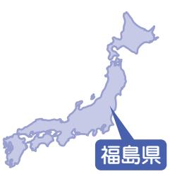

また会う日を楽しみに、それぞれの

場所で前に進んでいくしかない

」

「やっぱり、全国大会に出よう。」4月30日、綱引きで全国制覇を目指すヤングプラザスポーツ少年団 (以下、「スポ少」)の子ども・父兄・指導者で話し合いを持ち、8月7日に東京で開催される全日本ジュニア綱引選手権大会への出場を決めました。最初は、 12人のメンバーが県内(福島、飯坂、二本松、いわき、裏磐梯、猪苗代)と県外(埼玉、千葉)にばらばらに避難しているので、「出場を断念せざるを得ないかもしれない」という思いもありました。しかし、話し合いに参加した誰もが、スポ少が全国の舞台に立つことを望んでいることがわかり、練習量の不足や金銭面の負担などの制約を承知の上で、みんなで出場を決意したのです。

ありがたかったのは、各地からの支援でした。大会参加をバックアップしてくださっている日本綱引連盟、県綱引連盟、そして県綱引連盟猪苗代支部の方々。関東に避難している子どもたちを練習に参加させてくれ

ている佐川急便(スポ少0B勤務)の綱引きチーム。 ここには書ききれませんが、その他たくさんの方々に支えられ、今では週に一度の地域別練習に加え、月に一度の全体練習ができています。

練習時間は以前の3分の1になってしまいましたが、子どもたちは、限られた時間を大切にし、心をひとつにして頑張っています。チームには、練習不足を補う絆が生まれつつあるのです。

綱引きに限らず、避難生活の制約の中で子どもにも我慢を強いる状況が数多くあります。しかし、私たち大人の役割は、少しでもそうした状況を改善し、子どもたちの一度きりの"今"が輝くような環境をつくることだと思います。たしかに、先の見えない生活の中、不安を挙げればキリがありません。しかし、そんな時は「心 ~まずは一勝~」というメッセージが刻まれたスポ少の団旗を思い出して、一歩一歩前に進んでいくんだと自分に言い聞かせています。

8月7日、皆さんへの感謝を胸に、「まずは一勝」 の精神で、全国大会に臨みたいと思います。離れていても、皆さん一人ひとりのご声援がスポ少の力になりますので、応援よろしくお願いいたします。

」

江小の校歌を忘れたくない

会いました 。 懐かしかったし、

できたらもっとたくさんの浪江

の友だちと会いたいです 。

みんなはどこにいるのかな 。

担任の井戸川先生にも会いた

いな 。 こっちの小学校の校歌を歌う

たびに、なんだか浪江小の校歌

を忘れてしまう気がして、一度

お母さんと大きな声で浪江小の

校歌を自分の家で歌ったりもし

ました 。 以前のように浪江の中

央公園で野球をしたり、剣道や

ザに

に帰

す 。

合っ

は、

って

▲麻弘くんのおばあさんが取材者のために作ってくれた手芸品。

)

相馬を続ほど 20 名た 。 調理中心それ食堂 」 というイ通して地元の方ができました 。 地元の皆さんとっています 。 生れたり、調理のだいたり … 感謝さとである浪江ことはありませ帰って、この苦たことを皆でふきがくると願っ

ま

。

身

、

ま

に

▲大和田さんは、避難所で避難者の健康体操を行っています。

妻の兄夫婦が柏崎市にいたので、親戚20人ぐらいで、車に分乗し自主避難してきました。

寒い時期だったのでまず購入したのが布団、その後、家具などは全て柏崎市の皆さんからの支援でそろえることができました。

そのとき、とても助かったのが「共に育ち合い(愛) サロン・むげん」というラーメン&雑貨屋さんの存在。 個人で支援物資の取り次ぎをしてくれて、必要なものを2~3日で調達してくれました。福島からの避難だとわかると、「役立てて」と名前も明かさず1万円を差し出してくれた女性もいました。そのとき、みんなで食べたラーメンの味は忘れられません。おいしかった。

人情溢れる柏崎市の人たちに支えられて、日常生活は送れています。

親戚も徐々に福島の仮設住宅などに戻りつつありますが、小学生の息子たちは新しい学校に慣れてきたので、自分たちはしばらくここで暮らそうと考えています。3歳の詩乃は、「しーちゃんのおもちゃおきっぱ

立野字坂下から震災後、津島、那須等を経て、義兄がいる柏崎市に避難。浪江町では10人の大家族。今は妹が栃木に嫁ぎ、両親は福島に戻り、祖父母と夫婦、3人の子どもたちとアパートで暮らす。パソコンが唯一の情報手段。 浪江町や東京電力の情報確認は大事な日課。

ともなう避難者の皆さんの体調不群馬県

取材: 高崎経済大学

櫻井・斉藤・内山 「 平成 23 年 7 月広報なみえ掲載 」

避難先の地域の皆さんとの

交流から元気をいただいています

櫻井常矢研究室本

田

由

美さん ( 幾世橋 )

良を心配されています 。

先日、地元の方 々 の企画で南相

馬の郷土料理を作る機会をいただ

きました 。 その中でも 「 晴れの日

ベントでは、食を

と避難者との交流

それがきっかけで、

親しくさせてもら

活用品を届けてく

手伝いをしていた

しています 。 ふる

町のことを忘れた

ん 。 いつか浪江に

しい時を乗り越え

り返って話せると

ています 。

> なしだよ」「ここは、お家じゃない、地震で壊れたのがお家でしょ」とまだ言います。

> 何より子どもたちのことを最優先に、これからの暮らしを考えていきたいと思います。

▲アパートの前で。ずっと一緒だったサクラは一足先に福島へ戻りました。 翔琉くん(小6)、拓海くん(小5)、詩乃ちゃん(3才)、愛犬サクラかけるたくみしの

乳幼児と80代の両親が一緒なので自主避難を選びました。高齢者には遠距離の移動は体力的に辛い、ある程度したら我が家に戻れると信じていたので、避難地域ぎりぎりのところで避難を繰り返してきました。 その結果、この3か月で避難場所を9か所も変え、ようやく2か月前に親戚が住む上越市に落ち着きました。

以前に住んでいたところは自然がいっぱい、音といえば鳥の鳴き声でしたが、ここは車の音が多く、最初はびくついていました。慣れないアパート暮らしのストレスに頭を悩ませていましたが、リサイクルショップに出かけたり、孫も公園で遊ぶようになり、少しずつこの地域にも慣れてきました。毎朝近くを通る幼稚園バスを見て「来年から幼稚園に通うよ」と笑っています。

小さい子どもがいるので健診や予防接種などの情報が得にくかったり、アパートなので地域との接点がないことが、少しさみしく感じています。

浪江町ではピアノを教えていて混声合唱団にも関わっていました。先日、団長が取りまとめた団員名簿が送られてきて、仲間からの便りにとても励まされました。

先行きが見えない不安の中、2人の孫の笑顔に支えられながらの生活。上越でもぜひ合唱をやりたいし、それを通じていろいろな人と交流できたらいいなと思っています。

新潟県

▲アパートの前で孫の花奈ちゃん(3才)と真大くん (10か月)の笑顔に支えられてはなまひろ

地震が起きたときは勤め先にいて自宅に戻っていないため、父母から話を聞いても家が流されたという実感がわかず、踏ん切りをつけるために 6 月 4 日に一時帰宅してきました 。 玄関の敷居と基礎だけ、あたり一面何も無く、学校がやたらと近く見えました 。 自分の家に戻ってきたのに家を見る 「 目 」 が、まるで夢の中にいるような、 「 自分の目 」 で見ている感覚がなく、いまだに実感がわかないような感じでした 。 何でこんなことをしているのか、戻りたいのに何で逆に逃げなければならないのか、という思いがかけめぐりました 。 母が大切にと

」 には、

保育園の

集合写真

になって

駿斗くんが載っている「 広報なみえ 」

▲

いた 2 0

月の 「 広

いて、焼き増しして同級生に送ったらとても喜ばれました 。 携帯電話で撮った 2 月 20 日の安波祭のときの写真も 。 今回の震災で写真が全部流されてしまったので、本当に喜んでくれて … 。 子どもたちには友だちができ、こちらの環境に順応し始めているので、子どもたちのためにはこのままの方が良いでしょうけど、最初は 2 、 3 日で戻れるものと思っていたので、ここに落ち着きたくない、やはり浪江に帰りたいという思いがあります 。

柴恵美さん(請戸)

取材:くびき野NPOサポートセンター秋山 「平成23年7月広報なみえ掲載」

請戸から避難。サンシャインで一泊、翌朝のサイレンで逃げろと言われ津島へ。

その後、夫と兄の仕事の関係で知っていた新潟県柏崎市へ。最初は声をかけてくれた海の家に身を寄せる。公営住宅に応募するも倍率が高く外れてしまい、自力で探したアパートへ。

▲先輩から譲り受けた制服を着て柏崎市の中学校へ亜華音さん(小5)(左)、駿斗くん(中1)(右) あかねはやと

佐藤眞敏さん(請戸)

取材 : (特活)山形の公益活動を応援する会・アミル齋藤 「平成23年7月広報なみえ掲載」

### なみえの美しい海岸線を是非また散歩したい!

私たちは 3 月 13 日に山形市へ避難してきました 。 元 々 娘夫婦が山形市に居住していたので、津波で家は流され、そして浪江町が原発 10 ㎞ 圏内ということで、年に 10 回程は訪れていた山形市に息子夫婦、それに孫を連れて避難しました 。 現在はアパートに入居して近隣で仕事をしながら比較的平穏な生活を過ごしています 。 山形県の対応は比較的素早く、現在のアパート

> 借り上げ手続きもスムーズに行っていただきました 。 ご近所と孫と同じぐらいのお子さんそてそのお母さんたち世代との交あります 。

の

な

は

し

流もそれでも、やはり故郷の浪江町、そして私たちの住んでいた請戸地区へは、一刻も早く帰りたいと思っています 。 山形市内で山を見ると住んでいた景色を思い出します 。 特に毎日散歩していた海岸線の美しさや、小さいながら楽しみだった家庭菜園の野菜や花 々 は今も心に焼き付いて離れません 。 そして夏涼しく冬暖かい温暖な気候と、おいしい 〝 ほっき 〞〝 めばる 〞 そして 〝 かれい 〞 などの海産物は忘れることができません 。 また、毎年新年会を欠かさなかった組の 12 世帯の方 々 とは、是非再会を果たして、恒例だった古峰神社へのお参りへも行ける日を望んでいます 。 毎年 2 月に行われていた 「 安波祭 」 が、心に強く思い出として残っているので、何としても再開して欲しいと強く願っております 。 残念ながら、津波でほとんどす

> べてを失ってしまいましたが、一家の写真と卒業証書が後日見つかり、唯一生き残った物として、 「 お守り 」 替わりにと大切にしていこうとみんなで話しています 。 現在、浪江町の情報は友人との携帯電話を使った情報交換などを通じて得ており、この山形にも請戸から避難されている方もいらっしゃいます 。 私たち夫婦は 5 月にイタリアへの海外旅行を予約していたのですが、残念ながらキャンセルせざるを得ない状況になりました 。 それでも、原発が収束して心にゆとりが生まれたら、是非またゆっくり旅行したいと思っています 。 地区のみなさんと早く再会できることを強く願っております 。

三原優蔵さん(権現堂) 取材:(特活)きらりよしじまネットワーク高梨・井上・前山 「平成23年7月広報なみえ掲載」

山形県吾唯足知 (われただたるをしる)

地震発生とともに車で避難し、そのまま避難所生活となった三原さんご一家。避難してきてからは毎朝、上杉神社にお参りしている。願いが一刻も早く通じて欲しい。祈ることしかできない毎日だが、浪江町へ戻ることは決して諦めないという。

現在は米沢市のアパートで、本人、妻、母親の3人で生活をしています。浪江町では、おもちゃ屋9割、自転車屋1割という商売をしていました。現在は、こちらで私と妻がアルバイトをし生計を立てていますが、大学生の息子がおり、経済面でとても心配しています。 浪江町のお店のことを思うと、来てくださったお客さまにお会いしたいというのが一番に思うところです。

避難先として選んだ米沢市の避難所の方々や地域の皆さまは本当に良くしてくださって、改めて人の温かさを感じています。

浪江町は山がきれいで海が近く、サーフィンのできるリゾート地です。鉄腕ダッシュのダッシュ村があるところとしても有名です。また、日本一、海に近い酒造会社があるところで、「寿」「天王山」「樂實」といった縁起の良い地酒があります。このような浪江町に一刻も早く戻りたい気持ちがありますが、現実として仕事もない、人もいない、下水も使えなくなっているという状況を考えると戻ることはなかなか難しいと思います。

浪江町での友人や会社関係者、親戚などとは連絡が

取れています。ただ、近所の方々などは各自バラバラに避難したので友人が近くにいなくて寂しい思いをしています。特に母親はそう感じているようです。

東京在住の娘(三原由紀子)が『壇歌』6月号に『人のさまざま』という作品を書き掲載されています。その中で「今声を上げねばならんふるさとを失う我の生きがいとして」という一文に故郷を失うかもしれない不安な思い、そして、これ以上私たちと同じような思いをする人を増やしてはいけない、という思いが込められています。これは浪江町のみなさんの思いを表現していると思います。

現状はとても厳しいですが、友人、知人から支援物資を多くいただきました。生活用品や食料などどれも本当にありがたいものでした。妻は毎朝早く起き、上杉神社にお参りをしています。そこで知り合った方やご近所の方々に温かく接していただき、この震災で本当に人の縁が大切なのだと強く感じています。浪江町のみなさん、諦めないでいきましょう。

鈴木卓さん ( 請戸 ) 「 安波祭 」 「 出初式 」 請戸の伝統行事を是非守りましょう ! 取材: ( 特活 )山形の公益活動を応援する会・アミル齋藤 「 平成 23 年 7 月広報なみえ掲載 」 山形県震災後、私たちは 「 いこいの村 」 へ避難しましたが、その後の原発事故を受け、南相馬市原町区の実家、飯舘、そして友人のネットワークを通じて新潟や山形の情報を得て最終的には山形県に避難してきました 。 当初は山形市の総合スポーツセンターに避難、その後、天童市の旅館に二次避難しました 。 高齢者がいるので、やはり食事と風呂の心配が大きく、この天童温泉を避難先に選びました 。 私自身は、やはり就労が一番心配なので、ここ山形だけではなく、東京方面でも仕事を探しています 。 雇用形態を選ばなければ、いくつか仕事はみつかるのですが、きちんとした仕事となると難しいのが現状です 。 まずは自分たちの生活基盤を作ることが最優先だと考えています 。 震災後心残りなのは、 12 日に原発事故が明

## 中西總一郎さん(田尻)

取材:(特活)きらりよしじまネットワーク小形・原田 「平成23年7月広報なみえ掲載」

山形県前に進む決心

震災数日前に生まれた孫を連れて山形県南陽市に避難されている中西さんご一家。被災していながらも、一刻も早く仕事を通して、復興の手伝いしたいと願う。「阪神大震災は他人事」だったという中西さん。生まれたばかりの孫に浪江町の美しい風景を早く見せたいという。

震災翌日の3月12日に福島原発事故による避難指示により、山形市内の知人アパートに家族5人で避難してきました。その後、南陽市にあるアメリカンビレッジ(トレーラーハウス)を知り移動、長期間の避難に備えました。孫は、震災数日前に生まれたばかりで、病院から原発からすぐ離れるようにとの指導があり退院してすぐ山形に避難してきました。滞在中、南陽市で赤湯温泉桜湯さんで大浴場を避難者に開放していることを聞き立ち寄った際、桜湯の女将さんが「赤ちゃんがいてトレーラーハウスは大変でしょう」とのことで南陽市役所に問い合わせしてくださり、避難所として桜湯に滞在できることとなりました。女将さんのお父さんが浪江町出身であったこと、孫の名前が「桜子」という縁があったのかもしれません。深く感謝しています。

震災では、義理の母と兄が津波の犠牲となりました。 兄の確認はまだ取れませんが、母はDNA鑑定で本人確認ができ、葬式をすることができました。母が見つかったことを区切りとして、前に進む決心をし、それまで経営してきた会社を福島県二本松に仮社屋を置き、

。

再建に向けて取り掛かっている状況です。

地震直後から近所の人や消防などみんなで不明者の捜索活動をしていましたが、12日に避難指示が出され、仕方なく捜索活動を止め避難してきました。もう少し捜索していたら、もしかしたら助かった命があったかもしれないということが心残りでなりません。原子力被害がなければ捜索もできたし、避難する必要もなかった。これが原子力被害の恐ろしさであり、ひどいところです。二度とあってはならない事故だと思います。

今思えば阪神大震災は、もしかしたら「他人事」だったのかもしれないという思いがあります。今回の震災を経験して、人と人との助け合いの心の必要性を強く感じました。じっとしていてはならない、動かなければダメ。一日も早く復興して、恩返しがしたいと思っています。

私にとって浪江町はかけがえのない故郷です。海、山があり、海産物もおいしいし、山菜もおいしいところです。B-1グルメでも有名になったなみえ焼きそばもおいしいのです。一刻も早く、元の浪江町の姿に戻しましょう。

> らかになり、すぐにでも救助に入れば助かっ

たかも知れない津波被害の方 々 を救えなかったことで、消防団員でもあった自分としては、何とも言えない無力感を感じています 。 せめて、相馬市の遺体安置所や居住していた地区にマイクロバスででも一時帰宅できる回数を増やして、お線香でもあげたいと強く願っています 。 浪江は農業と漁業の町 。 今はちょうど作付けの時なので、家業で 「 こしひかり 」 や 「 ひとめぼれ 」 などを作付けしていたのを懐かしく思っています 。 懐かしいと言えば、 2 月第 3 週の 「 安波祭 」 や全国的にも珍しい 1 月 2 日の出初式もまた、是非参加してみたいものです 。 前年度の漁獲高で名誉をかけての出初式は強く思い出に残っています 。 もともと請戸は浜手なので、口は悪いが気は優しい地区 。 今はゼロからのスタートですが、いつかきっと同級生、消防団の仲間、子どもたちを通じた友人たち、そして隣組の人たちと会える機会を楽しみにしています 。 自分が旗振り役になってでも 1 年に 1 回、2 年に 1 回でも良いので、何とか実現したいものだと考えています

金澤良行さん(高瀬)

取材:(特活)きらりよしじまネットワーク寒河江・井上 「平成23年7月広報なみえ掲載」

### 被害者となり、感じること

 震災翌日に避難し、米沢市小野川温泉にて避難所生活を送っている金沢さん。米沢から仙台、南相馬を往復する毎日だが、7月には南相馬市のアパートに引っ越す予定だという。原子力発電所事故の正しい情報、浪江町の今後についての情報を求めている。

原発事故に関しては、情報が錯綜しており、どの情報を信じたら良いのか分からなくなっています 。 浪江町は 「 原発の町 」 のイメージがありますが実はそうではなく、実際は浪江町周辺の方 々 が多く原発に関わっていました 。 今回の原発事故により、私の人生が大きく変わってしまいました 。 原発事故による被害が予想以上に甚大であることをもっと多くの国民の方に知っていただきたいと思います 。 聞くところによると、東京あたりでは原発事故の事をそれほど深刻に考えていないようだ、といった話もあります 。 浪江町長もメディアに出て現状を訴えていますが、まだまだ足りないと感じています 。 現在、引っ越し先の申請を行っており、順調にいけば 7 月には南相馬市にあるアパートに引っ越す予定です 。 今までお世話になった避難所の方 々 や米沢市役所の方、河鹿荘の方 々 など、山形の方はみんな温かくて大変感謝しています 。 今後、みなさんへお礼をしていきたいと考えています 。

## 地域のつながりが取り戻せる日が来ることを願う

森美恵さん(棚塩)

取材者:高崎経済大学櫻井研究室櫻井・山本・亀井取材日:7月9日 「平成23年8月広報なみえ掲載」

 震災後、津島中学校から郡山市内の高校、そして父の会社を頼って千葉市に移ったあと、3月下旬から栃木県小山市内にある現在のアパートに個人契約で入居。母と息子と3人で暮らしている。

> ▲森美恵さん、優仁くん(小2)、母シゲ子さんゆうじん

いつも気にかけているのは、やはり子どものことです 。 小学校 2 年生になる優仁は、最初こちらの小学校が全校生徒 8 8 6 名という大規模校のためか慣れない様子でした 。 また親としては、小児科の病院が以前のように慣れ親しんだ相談ができる先生でないことも不安です 。 ただ、最近は子どもが学校から 「 楽しかった 」 と言って帰ってくるようになったので落ち着いてきました 。 むしろ大震災から 4 カ月が経つ今、息子が少し大人になったように思え心強くもあります 。 現在のアパートの住まいは、近隣の方とのお付き合いもほとんどなく、住宅が密集しているせいか息苦しい感じがします 。 1 年後にはどこか落ち着ける場所に移りたいと、家族では話し合っています 。 それがどこになるのかはまだ分かりません 。 浪江に戻りたいという気持ちはありますが、子どもの安全のことを考えると不安も多いです 。 ふり返ると、浪江では近所の方とのつながりも強く、水田や自然に囲まれ暮らしていた生活が思い出されます 。 毎年 1 月に船で沖に出る出初式、かつて私の父も活躍した野馬追、そしてゆうじん

十日市などが懐かしいですね 。 新鮮なワカメ、おいしいカツオのお刺身なども食べたいですね 。 私たちの住んでいた北棚塩地区の隣組で支え合う関係も大切な思い出です 。 この 『 浪江のこころ通信 』 のように、浪江のころのつながりを大切にしようとする取り組みがあることは、とてもありがたいことです 。 北棚塩行政区の佐 々 木区長さんは、区の住民同士が情報を共有できるようにと、皆さんの連絡先を発信しています 。 幾世橋小学校で息子の担任だった三瓶先生は、 「 学年だより 『 ねえ、きいて 』 」 を自ら発行され、子どもたちの素直な言葉を届けられています 。 地域の皆さんや友だちのつながりを途絶えさせないようにとの努力には、私の母と一緒にとても感謝しています 。 お互いが今どうしているのかを確認できることで安心できます 。 知らない土地で暮らしているのでなおさらかもしれませんが、お互いのことを親身になって助け合う地域の強い絆が、浪江にはあったことを改めて実感しています 。 そうしたつながりを取り戻せる日が来ることに希望をもってこれから頑張っていきます 。

## 下河邉行@さん・由美子さん(権現堂)

取材者:高崎経済大学櫻井研究室櫻井・竹内・篠木取材日:7月17日 「平成23年8月広報なみえ掲載」

### 地域産業の再興による雇用創出こそが必要まちの復興の役に立ちたい

 震災後、親族12名が一緒に東京の親戚を頼って避難。7月から現在の西東京市に中学生の次女と 3人で住む。大学院生の長男、専門学校生の長女とは離ればなれで暮らしている。行dさんは、福島県内で自社の再興に向けた準備のため東京と福島を往復する日々を送る。

▲(左から)行>さん・姉の高木道子さん・由美子さん故郷から届いた地酒壽・地縁復興純米酒を手に

いまは収入の無い中で、都内のアパートの家賃の支払い、二人の子どもへの仕送りなどが大変です。 でも、今回の震災の経験から、親戚縁者から本当に支えていただき、人の恩の温かさを心の底から実感しています。浪江町の素朴な暮らしの中にあった人のつながりの強さというものもいつか必ず取り戻したいです。

震災の前は、コンクリート二次製品の会社を経営し、エコリサイクル製品の開発などを進め、まさにこれからというときでした。ショックはありますが、後ろ向きになるのではなく、自分にできることをやっていきたいです。現在は、福島県内での事業再開をめざし、県の補助事業や中小企業庁との交渉を進め、ようやくその見通しが立ってきました。浪江町の地域産業の再生に向けては、商工会青年部など若い人を中心に復興への機運は強いと思います。こうした人材や熱意を活かし、地域に根ざした産業を再生して働く場所を確保することこそが町の復興に結びつくと考えています。地元の方々の再雇用を実現しながら浪江町の役に立ちたい。そんな思いです。

最初に避難していた高崎市城山地区の小学校は 1 カ月くらいで転校しました 。 今通っている小学校でも友だちがたくさんできて、元気に楽しく過ごしています 。 いつも友だちと自転車に乗ったり、ゲームをしたりして遊ぶことが多いです 。 浪江にいたときは、お父さんも指導していたスポーツ少年団で柔道を頑張っていました 。 今は、羽生市の柔道会に入ってお父さんと一緒に続けています 。 地震のあとは請戸小の友だちに会うことはほとんどあり

ませんでした 。 卒業式もスポ少の卒団式もまだしていません 。 7 月 30 日に請戸小学校の 「 卒業生を励ます会 」 があるので、そこで友だちや担任の武内先生に会えることが楽しみです 。 請戸の浜祭りのとき、砂浜の宝探しやホッキ貝拾いをしたことを思い出します 。 いつも砂浜で遊んでいたことも楽しかったです 。 けれど、ここには海がないのでそれはできません 。 「 いつか必ず請戸に戻って元の場所で暮らしたい 。」 そう強く思っています 。

 海斗君はお父さんの実家に近い群馬県高崎市に避難し、そして現在は埼玉県羽生市にご両親と3人で暮らす。津波で体調を崩した祖父と祖母は高崎市に残り、中学生のお兄さんは喜多方市にある中学校の寮にいて、家族は離ればなれとなっている。 かいと

# 岡本博之さん・真由美さん(酒田)

取材者:(特活)山形の公益活動を応援する会・アミル齋藤・柴田取材日:7月11日 「平成23年8月広報なみえ掲載」 山形県

### 浪江町の皆さんとの心の絆を支えに

 原発事故による避難指示があり、3月17日に南相馬市の親戚14名と山形市へ避難。消防士の博之さんは、勤務地の楢葉町と山形市を行き来している。子どもたちが夏休みに入った 8月にいわき市へ引っ越す予定。

▲山形市内にて (左)博之さん、(右)真由美さん

できたことは無駄にさせたくないので、 8 月に行われる合宿にはぜひ参加させてあげたいと思っています 。 3 月 25 日には、父と息子 1 対 1 の初めての 「 男旅 」 をする予定でしたが、行くことができなくなってしまいました 。 落ち着いたらそんな親子の触れ合いの時間もまたつくっていきたいと思います 。 また、私たちの住んでいた浪江町酒田の近くの河川敷で春に行われる 「 桜まつり 」 を今年も楽しみしていました 。 花火も打ち上げられ家族や地域のたくさんの方が集うまつりを懐かしく思っています 。 場所によってはまだ放射線量が高い場所もあり、帰町後子どもたちの体への不安がまだ残ることも事実です 。 しかし、こういう状況でこれまで見えていなかった心や絆が見えてきて、そのつながりを支えにしています 。 浪江町に帰れる日を楽しみにみんなで頑張っていきたいと思います 。

取材者:(特活)山形の公益活動を応援する会・アミル柴田取材日:7月12日 「平成23年8月広報なみえ掲載」

### 今できることをちょっとずつ

震災当日は自宅にいましたが、請戸の実家が心配で見に行った途中、逆流する川をみて大変なことが起きていると思いました 。 5 月 26 日に自宅へ一時帰宅をしてきました 。 海の見える浪江の景色は懐かしいのですが、望んでいた景色ではありませんでした 。 それでも私たちの町であり、 91 歳になる祖母にも生まれ育ったこの地をまた踏ませてあげたい、子どもたちにもこの風景を見せたい … 受け入れなければ前に進んで行けないと思っています 。 一番不安なのは子どもたちのことです 。 現在、長男は中学校へ長女は小学校に通っています 。 同じ環境を整えても、どうしても前と同じことはしてあげられません 。 今は友達もでき元気に通ってくれていますが、入学式の朝の長男の落ち込んだ背中は今でも忘れられません 。 卒業式もさせてあげられず、県外の中学校に入学することに戸惑い、させなくてもいい不安な思いをさせてしまったと思います 。 ですが 4 カ月たった今、小学校の先生や保護者の皆さんと協力して 7 月末に卒業式を行う準備をしています 。 少しでも多くの方が参加して、保護者の皆さんや子ど

もたちと会えるのを楽しみにしています 。 震災後、同級生の半分が県外に避難して多くの方の連絡先もわからない状態でしたが、さまざまな方の協力を得て、全校児童の無事を確認することができました 。 改めて自分たちの住んでいた幾世橋の地域の皆さんが、いかに子どもたちのことを考えてくれていたかを再認識し、本当に皆さんと同じ地区で暮らしていて良かったと思います 。 今回、広報紙の発行が再開されたことも嬉しく、少しずつ前に進んでいることは間違いないと実感しました 。 中山町の皆さんはあたたかく、行政の方や地域の方の協力で、生活環境も整い普通の生活ができるようになりました 。 ですが、望んでいる生活とはどこか違うと思うときもあります 。 私たちは浪江町民であり福島県民です 。 今は渡り鳥の休憩地点だと思っています 。 子どもたちの体に何らかの影響がある今は県内に戻れないと思っていますが、まずは福島県内に戻り浪江町に戻れるよう一歩ずつ前進していきたいと思っています 。

中山町の避難所の前で長女綾ちゃんと。 花壇に浪江町の花"コスモス"の種をまき、花が咲くのを楽しみにしています。 りょう ▲

## 岡裕美さん(苅宿)

取材者:特定非営利活動法人市民公益活動パートナーズ古山 「平成23年8月広報なみえ掲載」

### 友だちに会いたい

 浪江町苅宿地区に父方の祖母、父母、姉と住んでいたが、3月 14日、周りの人たちよりもやや遅れて福島市に避難。現在は父母、姉との4人で暮らす。当初はあづま運動公園に近い母方の祖母の家で10日間過ごし、その後、現在の上浜町の家に転居した。

浪江の友だちのみなさん福島に来てください 。 メールや電話も待っています 。 上浜町の一軒家では、入居当時から近所の方 々 に食べ物や家電製品などの差し入れをいただいたり、母方の親戚からも野菜の差し入れがあり、本当に助かりました 。 父は今、いわき市に単身赴任をしており、週末には福島に帰ってきます 。 母は霊山町で、また姉は介護福祉士として福島市内で仕事をしています 。 私は、 3 月 1 日に高校を卒業し、すでに仙台市長町の専門学校で作業療法士の勉強を 3 年間することになっていましたので、今は福島からはJRで通学をしています 。 仲の良い友だちは、就職の関係もあって茨城や栃木、東京に移ってしまい、震災後まったく会えないので、ときどき電話やメールをするけれど、やっぱり会いたいと思います 。 それと、小学生のころから飼っていた犬を避難するときに置いてきたのですが、母が一時帰宅をしたときにはすでに亡くなっていて、とても悲しかったです 。 高校の陸上部ではマラソンをして、福島駅伝の代表を務めました 。 母もマラソンを始め、最近では夕方や夜、家の近くを走ったりしてい

| の 変 | た 。 | 遭 っ | 避      | と だ | の 山 | き ま | 家 族 | で と | い つ | で      | れ な | 今 年 | の も | 両 隣 | ぶ 離 | 田 ん | 浪      | し て | ベ キ | と 一 | た ち | ど 毎 | 月 下 | を あ | た ち | 浪      | せ ん | 人 か | を 応 | 行 わ | ま す |
|--------|--------|--------|--------|--------|--------|--------|--------|--------|--------|--------|--------|--------|--------|--------|--------|--------|--------|--------|--------|--------|--------|--------|--------|--------|--------|--------|--------|--------|--------|--------|--------|
| わ      | い      | た      | 難      | っ      | 寺      | し      | み      | て      | も      | も      | い      | は      | 結      | が      | れ      | ぼ      | 江      | い      | ュ      | 緒      | が      | 年      | 旬      | げ      | の      | 江      | 。      | の      | 援      | れ      | 。      |
| り      | つ      | 請      | す      | た      | に      | た      | ん      | も      | の      | 、      | の      | 家      | 構      | 家      | て      | や      | の      | ま      | ー      | に      | 福      | 楽      | の      | て      | 仲      | 町      |        | 友      | に      | る      | 今      |
| 様      | も      | 戸      | る      | の で | も      | 。      | な      | 忙      | 年      | い      | が 残 | で      | 大      | ば      | い      | 畑      | 家      | す 。 | を      | 、 も | 島      | し      | 十      | の      | が      | は      |        | だ      | 行      | 県      | 度      |
| に 呆 | 見 て | の 様 | 前 に | 嬉      | 。 考 | 花 見 | で あ | し い | だ っ | い こ | 念      | 作 っ | 変 で | か り | ま し | で 、 | は 農 |        | や る | う      | に 避 | み に | 日 市 | お 祭 | と て | 、 緑 |        | ち に | く の | 総 体 | 、 あ |
| 然      | い      | 子      | 、      | し      | え      | 山      | ち      | の      | た      | と      | で      | た      | す      | で      | た      | 隣      | 家      |        | ら      | す      | 難      | し      | や      | り      | も      | が      |        | 会      | で      | に      | づ      |
| と      | た      | を      | 父      | か っ | ら      | 、      | こ      | で      | ら      | も      | す 。 | ス      | 。      | す      | 。      | の      | な      |        | し      | ぐ 四 | し      | て      | 2      | も      | い      | 豊      |        | え      | 、      | 相      | ま      |
| し      | 景      | 見      | と      | た      | れ      | 裏      | ち      | す      | 5      | あ      |        | イ      | そ      | し      | で      | お      | の      |        | く      | 季      | て      | い      | 月      | 盛      | い      | か      |        | る      | そ      | 双      | 陸      |
| ま      | 色      | に      | 津      | で      | な      | 磐      | へ      | が      | 月      | り      |        | カ      | う      | 、      | も      | 家      | で      |        | 、      | の      | い      | ま      | の      | ん      | ん      | で      |        | か      | の      | 地      | 上      |
| し た | の あ | 行 き | 波 被 | す      | か っ | 梯 。 | 遊 び | 、 今 | は 田 | ま し |        | が 食 | い え | 蒸 し | 、 福 | と は | 、 周 |        | 楽 し | 里 で | る 人 | し た | 裸 参 | で す | で す | 地 域 |        | も し | と き | 域 の | 競 技 |
| 。      | ま      | ま      | 害      | 。      | た      | 山      | に      | 年      | 植      | た      |        | べ      | ば      | 暑      | 島      | だ      | り      |        | み      | バ      | た      | 。      | り      | 。      | 。      | の      |        | れ      | に      | 後      | 場      |
| 帰      | り      | し      | に      |        | こ      | 形      | 行      | は      | え      | 。      |        | ら      | 、      | い      | は      | い      | は      |        | に      | ー      | ち      | 母      | な      | 11     | 町      | 人      |        | ま      | 何      | 輩      | で      |

ることができたなら、復興のお手伝いをしたいと思っています 。 「 今はみんなに会えないからつらいけれど、いつか浪江に帰れるときが来るから、それまでお互い頑張りましょう 」 と、浪江町のみんなに言いたいです 。

▲明るくいかなきゃ!

取材者:高崎経済大学櫻井研究室櫻井・竹内・篠木取材者:7月17日 「平成23年8月広報なみえ掲載」 伊東建策さん(請戸)

### 地域の皆さんが集まる場、交流の場が取り戻せたらいい

津波で築7年目の請戸の自宅が流される。地震の時、学校にいた高校生の長男とは3月16日にようやく再会。 新地町にある妻・育子さんの実家も余震で不安な状況となり、親戚を頼って千葉県松戸市の現在のアパートに移る。 建策さんは福島原発の関連企業に現在も務め、数週間に一度、松戸市の自宅に戻る生活を続ける。

私も妻も浪江町の出身ではないのですが、学校や地域のつながりなど、浪江町の人たちの助け合う密な人間関係が好きで、縁もあり海の見える請戸に居を構え生活を送っていました。

原発関連での今の仕事は、震災前よりも関係作業員が随分と減りました。一方で私のような地元の被災者の方々もたくさん作業に従事しています。 少しでも復旧を進めるため不休で大変ではありますが、できる限り役割を果たさなければならないと思っています。

いまは子どもたちの学校のことが一番気がかりです。こちらの学校に子どもたちも慣れてきていますし、他方で受験を控えた息子を見ていると元

▲(左から)建策さん、真司くん(高2)、美緒さん(小4)、庄司くん(小6)、育子さん

の高校での友人のつながりを大切にして、福島県に戻るべきなのかと考えてしまいます。

震災前はなるべく子どもたちとの時間を作るようにと思い、浪江町柔道スポーツ少年団で一緒に汗を流していましたが、いまはそれも難しいです。

震災後も、変わらず同じ職場で働き、千葉県に移転はしても落ち着かない状況では、まだまだこれからの生活のことを描くことができません。ただ、浪江町から避難しているこの時間を無駄にはしたくない。このような環境にあっても積極的に生きていきたい。いつか地域の集まりや交流が取り戻せる日が来ることを願うばかりです。

佐

取材者: 特定非営利活動法人

ビーンズふくしま豊田 々

木

保

彦さん ( 昼曽根 )

私は浪江町の消防団に所属していました 。 地震がおき当時、出動に向けて準備をしていましたが、 12 日の避勧告により多くの町民が役場とともに津島へ行きまし 。 あまりにも避難者が多く、避難所では食料・毛布が分になく、まだ雪がふっている季節で寒さをがまんす

た

難

た

十

子どもも、年寄りも体の不自由な人も、ひと声かけてもらえるだけで気持ちが安らぎます。

いまも震災は続いています取材日: 7 月 13 日 「 平成 23 年 8 月広報なみえ掲載

」

福島県

### 請戸の海の朝日が見たい

震災後、請戸の自宅で津波に流された五十嵐さんは、レスキュー隊に助けられた。避難先を転々としながら家族と合流し、茨城県古河市の病院に勤める娘さんを頼って現在のアパートで二人のお孫さんと家族6人で生活している。

地震のあと津波に流されたが、レスキュー隊に助けられ難を逃れた。寒い暗闇の中で助けを求めていた人が大勢いたはずだ。仲間やその家族には亡くなった方が多く、思い出すたびに心が痛む。

私は15歳のときから漁業一筋だったので、やっ

ぱり船で漁に出ての仕事がしたい。運転手の仕事や農業などの誘いもあるが戸惑っている。でも、家の中にじっとしているだけでは自分もつらいし、家族にも心配をかけてしまう。これから先どうしたらいいのか。何か海の仕事を見つけたいと思い、新潟にでも行ってみるかと妻と話だけはしている。 ただ、日本海の夕日もきれいだろうけど、やっぱり請戸の海の朝日が見てみたい。内陸で生活していると新鮮な魚料理が食べたくなるね。浪江ではあたり前の暮らしが、どんなに贅沢なものであったのかと思う。漁師仲間の家族と年に一度の旅行に行っていたことがなつかしい。またそんな普通の暮らしに戻りたい。

浪江町の多くの住民を集めて、今後についての話し合いの場をもつべきと思う。特に漁師は組合などが町単位ではないため、役場の役割が大きい ▲取材の様子と思っている。

| で き る よ う な 日 が 来 る こ と を 願 っ て い ま す 。                               |
|--------------------------------------------------------------------------------------------------------------------------------|
| 心 の 中 は ま だ 癒 さ れ て い ま せ ん 。 早 く 自 由 に 遊 ぶ こ と が      |
| 今 で も 少 し の 余 震 で 怖 が り ま す 。 大 人 が 考 え て い る よ り      |
| 声 か け を し て い た だ け た ら と 思 い ま す 。 子 ど も た ち は 、      |
| こ れ か ら 暑 さ で 体 調 を 崩 す 人 が い る と 思 い ま す の で 、           |
| こ と を 思 っ て い ま す 。                                                                                 |
| た だ い た り す る だ け で 気 持 ち が 安 ら ぎ ま し た 。 妻 も 同 じ      |
| 護 士 さ ん に 体 調 を 聞 い て も ら っ た り 、 血 圧 を 測 定 し て い      |
| 「 ど う で す か ? 」 と 様 子 を 見 て ほ し い で す 。 避 難 所 で 看      |
| り や 、 体 が 不 自 由 な 方 に 2 日 に 1 回 で い い か ら 顔 を 見 て      |
| 今 、 ボ ラ ン テ ィ ア を し て い る 方 に 避 難 し て い る お 年 寄           |
| い う と こ ろ が 知 り た い で す 。                                                                  |
| か 」、 「 生 活 の 不 安 は ど う い う ふ う に 考 え て く れ る か 」 と     |
| も し 帰 る 日 が 来 る と し た ら 「 ど こ ま で 対 応 し て く れ る の      |
| や り た い こ と の 一 番 は 、 み ん な で 一 斉 に 帰 り た い で す 。      |
| り も 、 外 出 し た り 体 を 動 か す こ と で 気 が 紛 れ ま す 。                |
| こ と で お 互 い に 安 心 で き ま す 。 家 で ゆ っ く り す る こ と よ      |
| 顔 を 見 て 「 ど う で す か ? 」 と 声 を か け 、 話 し 相 手 を す る      |
| 江 町 の 人 や 避 難 所 で 一 緒 だ っ た 人 に 会 い に い っ て い ま す 。 |
| っ て い る よ う に 感 じ ら れ ま す 。 こ の 家 に 移 っ て か ら も 浪      |
| に 周 り に 気 を 使 う と こ ろ に 移 っ た た め に ス ト レ ス が た ま      |
| 転 居 し ま し た 。 今 ま で 開 放 的 な と こ ろ で 育 っ て き て 、 急      |
| ら に な り 、 そ れ ぞ れ 今 ま で 住 ん だ こ と の な い 集 合 住 宅 に      |
| 夫 婦 と 4 人 で 暮 ら し て い ま す 。 震 災 以 降 、 家 族 が ば ら ば      |
| い ま は 郡 山 市 の 一 軒 家 を 借 上 げ 住 宅 と し て も ら い 、 姉           |
| を せ ず に い た こ と が よ か っ た こ と だ と 思 い ま す 。                     |
| っ た で す 。 い ま 思 え ば 、 体 を 動 か し て い た こ と で 考 え 事      |
| ば れ る よ う に な り 物 資 配 分 の 仕 事 で 体 を 休 め る 暇 が な か      |
| 二 本 松 の 東 和 へ 移 動 し て か ら は 、 た く さ ん 支 援 物 資 が 運      |
| プ ラ ー メ ン な ど で 水 は 届 か な い 日 も あ り ま し た 。 15 日 に     |
| さ え も 不 足 し て い ま し た 。 賞 味 期 限 が 当 日 の パ ン 、 カ ッ      |
| こ と で 忙 し く 大 変 で し た 。 食 料 は 固 く な っ た お に ぎ り で      |
| 人 数 が 多 く 、 水 洗 ト イ レ が つ ま り 、 仮 設 ト イ レ を つ く る      |
| る こ と が つ ら か っ た で す 。 一 番 困 っ た こ と が ト イ レ で す 。 |

## 生まれ育った「ふるさと」へ

なれない土地で暮らしながら、なじみの深い「ふるさと」浪江を思う

いま、私の家族は郡山市の兄夫婦の家で暮らしています。震災当時、津島に避難しました。ここは、街中から外れたところにあり、静かなところです。 孫たちは学校にも慣れはじめ、安心しています。 しかし、この家は道路拡張のために、また転居します。

犬を飼っているので、新しい転居先を探すのに苦労しました。慣れない土地での生活は落ち着かないものがあります。震災から4ヶ月たち、落ち着いてきたところはあります。まだ腰を据えて生活できなく、精神的につらい部分もあります。浪江町にいたころは趣味で鮎釣りをしていました。 いまは、釣りをしていても楽しむことができない状況です。これから夏が過ぎて、冬がきたときに、経験したことのない土地でのすごし方に不安があります。ふるさと浪江に帰れる日を待ちながら、頑張りたいと思います。

一時帰宅では、帰らない方がよかったと思いました。見たくない風景ばかりで…。草は伸び放題で、今まで見たことのない光景でした。野放しにされた家畜の今後が不安です。町の人とは電話で連絡をとっています。はじめて携帯電話をもってとまどった部分はありましたが、連絡が取れることで安心感があります。

浪江は、なにもない町です。あるのは自然と何代も続いてきた家業や歴史です。なにもなくても生まれてからずっと育ってきて、体も心もなじんでいる故郷で生活したいです。

いまは、明るいニュースを1つでも流してもらえるとうれしいです。震災以来、暗いことばかりです。原発事故の一日も早い収束で、震災からの復興と復旧が進むことを待っています。

一時帰宅のときに、少しですがやっと寺のものを持てくることができました 。 浪江の方のことが気になっいて、警察発表などはいつも気にしています 。 最近は檀家さんの情報もずいぶん入ってくるようになって、江町の役場にも大聖寺の行き先について問合せがあっ

っ

て

、

浪

た

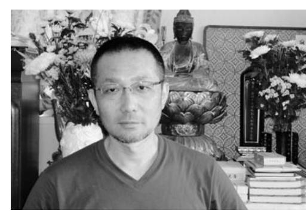

▲浪江の方に向かって毎日のお務めをされています。

大聖寺ご住職の青田敦朗さんは、寺のこと、檀家さんのこと、そして津波で亡くなった方の供養のことが気になり、なるべく近くにいたいと思ったそうです。 現在は奥さまと子ども2人の4人家族で生活しています。

6月26日に、福島市飯坂町平野の北幹線第一仮設住宅に、夫婦で入居しました。震災前は、妻と息子夫婦・孫 2人の6人家族で、両竹に住んでいました。

▲まだ、カメラを向けられるのはちょっと・・・

津波で、7代続いた思い出の写真や住所録など、とにかく何もかもなくなってしまいました。家族 6人は無事でした。息子はいわき、嫁と孫たちは福島市下鳥渡と家族がばらばらになってしまいました。つらい選択でした。震災前は北双方部のシルバー人材センターで、町のバスの運転手として、高齢者や子どもたちの送迎をしていました。

両竹地区は山有り、鮭がのぼる川有り、海有りの自然豊かな集落でしたが、一瞬にして津波で全戸が流され、10人の方が犠牲になりました。今も 2人が不明になっており心が痛みます。

いつも散歩をしていた海岸に、こんな大きな津波が来るとは、思ってもみませんでした。がれきで動けなくなった方々数人を救出。厳しい状況だった女性を、救助に来てくれた自衛隊の方に託し、その後無事だったことを聞いたときは、本当に安堵しました。一時帰宅して見た集落は、何もかもなくなっていました。命が助かったことに感謝しつつ、心は重く沈みました。

仮設住宅で、福島の暑さは身に堪えます。夏になり思うのは、毎年8月27日に開催されていた、両竹の諏訪神社のお祭りです。両竹集会所が津波で流され、そこに収納していた太鼓や笛も、代々 受け継がれてきた神事の際の区長の大事な箱も、すべて流されてしまいました。

両竹地区の人々も全国に散らばってしまいましたが、6月に東京で9人が集まり、しばし心安らぐ時間を持つことができました。今は正直何も考えられませんが、両竹地区全民がまた顔を揃えられるのは難しいと思いながらも、会える機会ができたらと願っています。

原発が収束したなら「浪江町は今後どんな町にしていくのか。」気になるところです。

| で る す ま ず で 活 安 と 。 に な し の 今 地 心 の 、 例 手 ょ あ 後 震 さ 大 新 え を う り に 、 れ 事 盆 ば 合 要 か が よ る さ に 、 わ 望 。 た っ 方 に も お せ で 価 さ て も 改 ち 盆 ら き 値 を 、 多 め ゃ に れ る 観 見 こ い て ん お る と の 直 れ と 気 と 墓 状 す 変 す ま 思 付 お 参 況 れ 化 き で い い 墓 り を ば と っ あ ま た 参 か に 整 、 い た す 方 り い え け お う り 。 が で け て か に ま 盆 多 き る ほ や 、 も え い る よ し お 地 な に と 。 う い 彼 域 っ で 思 そ な と 岸 の た き い う バ 思 に 共 の た ま す ス っ ご 同 で 普 す る な て 先 体 は 段 。 こ ど い 祖 、 な の と あ ま さ き い 生 | っ ご い 亡 準 る 江 か ま て 家 く 備 こ は ら 浪 ご す い 捨 、 族 な で ろ 江 先 。 ま て 生 が っ す で 祖 に 二 す ら き 避 た ね す い が 本 。 れ て 難 方 。 。 た 切 松 な 浪 さ の で 塔 と り だ い 江 れ 身 も 婆 し 開 っ で で て 元 、 を た い た す お い が 6 書 ら て り 。 会 る 判 月 い 、 き 、 い 先 明 ・ た 今 た 福 し に し 7 り の 地 島 た 出 て 月 、 時 な だ い 向 、 と 新 期 の っ 。 い お 、 盆 だ は た て 葬 D の か お り ご 式 N 檀 盆 ら 、 供 は A 家 の 、 原 養 ず 判 さ 準 そ 町 を っ 定 ん 備 う だ し と で を を 簡 っ て 続 津 ま し 単 た ま い 波 わ て に り わ 、 て で る い 浪 | た が す で お 普 が ら 、 ら で ま 。 き 骨 段 教 本 と き な に や え だ 堂 い た 、 い な っ て で う ら い 。 っ て く の の 、 つ ご た い だ お が ま に 家 方 た さ 務 願 わ な 族 を こ い め い り る が い と と や で の か 避 つ が 言 供 す 人 わ 難 ま で っ 養 。 た か 先 で き て が 死 ち り で も な い で ん と ま ず お い ま き で 一 っ 墓 。 せ す な し 緒 と に こ 。 ん い ま に が 預 入 れ 残 こ っ 普 、 か れ は 念 と て 通 浪 っ て つ に で は の 江 て あ ら 思 す お 生 に い げ い っ 。 し 活 戻 る る 。 て や ま が る 状 こ ま い は い で こ 態 と た る り だ き と で が 、 、 の |
|-------------------------------------------------------------------------------------------------------------------------------------------------------------------------------------------------------------------------------------------------------------------------------------------------------------------------------------------------------------------------------------------------------------------------------------------------------------------------------------------------------------------------------------------------------------------------------------------------------------------------------------------------------------------------------------------------------------------------------------------------------------------------------------------------------------------------------------------------------------------------------------------------------------------------------------------------------------------------------------------------------------------------------------------------------------------------------------------------------|-------------------------------------------------------------------------------------------------------------------------------------------------------------------------------------------------------------------------------------------------------------------------------------------------------------------------------------------------------------------------------------------------------------------------------------------------------------------------------------------------------------------------------------------------------------------------------------------------------------------------------------------------------------------------------------------------------------------------------------------------------------------------------------------------------------------------------------------------------------------------------------------------------------------------------------------------------------------------------------------------------------------------------------------------------------------------|---------------------------------------------------------------------------------------------------------------------------------------------------------------------------------------------------------------------------------------------------------------------------------------------------------------------------------------------------------------------------------------------------------------------------------------------------------------------------------------------------------------------------------------------------------------------------------------------------------------------------------------------------------------------------------------------------------------------------------------------------------------------------------------------------------------------------------------------------------------------------------------------------------------------------------------------------------------------------------------------------------------------------------------------|
|-------------------------------------------------------------------------------------------------------------------------------------------------------------------------------------------------------------------------------------------------------------------------------------------------------------------------------------------------------------------------------------------------------------------------------------------------------------------------------------------------------------------------------------------------------------------------------------------------------------------------------------------------------------------------------------------------------------------------------------------------------------------------------------------------------------------------------------------------------------------------------------------------------------------------------------------------------------------------------------------------------------------------------------------------------------------------------------------------------|-------------------------------------------------------------------------------------------------------------------------------------------------------------------------------------------------------------------------------------------------------------------------------------------------------------------------------------------------------------------------------------------------------------------------------------------------------------------------------------------------------------------------------------------------------------------------------------------------------------------------------------------------------------------------------------------------------------------------------------------------------------------------------------------------------------------------------------------------------------------------------------------------------------------------------------------------------------------------------------------------------------------------------------------------------------------------|---------------------------------------------------------------------------------------------------------------------------------------------------------------------------------------------------------------------------------------------------------------------------------------------------------------------------------------------------------------------------------------------------------------------------------------------------------------------------------------------------------------------------------------------------------------------------------------------------------------------------------------------------------------------------------------------------------------------------------------------------------------------------------------------------------------------------------------------------------------------------------------------------------------------------------------------------------------------------------------------------------------------------------------------|

取材者:NPO法人市民公益活動パートナーズ松田 「平成23年8月広報なみえ掲載」

原田勇真くん(小4)(幾世橋)

おもいっきりサッカーがしたい

浪江町幾世橋に住んでいて、震災当日は幾世橋小学校で下校の準備をしていた。

現在は、新潟県に単身赴任している父親と離れて、伊達郡桑折町の仮設住宅で母親と2人の妹と4人暮らし。同じ桑折町の仮設住宅の別棟に祖父と祖母も避難している。

福島や東京など6カ所の避難所を移って、5月 23日に桑折町の仮設住宅に引っ越してきました。 幾世橋小学校は1クラスだったけど、醸芳小学校の4年生は2クラスあって、1クラス29人です。 桑折町の学校でも友達ができて、毎日学校に通うのが楽しい。好きな勉強は「体育」!

みなさん元気ですか?ぼくは、元気です。

幾世橋小学校で仲の良かった友だちとは、手紙のやりとりをしているし、3年生のときの担任だった先生からは「学級だより」も送ってきてもらっているから、さびしくないよ。

地震の時に、こわくて泣いていた女の子たちもいたけど、もう元気になったかな?

早く、みんなに会いたいな。

▲日本で初めて誕生した自転車「三元車」を新聞紙で再現した模型の隣で。

いまは、お母さんと妹2人の4人暮らし。お父さんは、一人で新潟県へ仕事に行っていてあまり帰ってこないので、ちょっとさびしい。でも、おじいちゃんとおばあちゃんは、別な建物だけど同じ桑折町の仮設住宅にいるから。

誕生日にはPSPのゲームがほしい。新しい自転車もほしいけど、外で遊べないから。

もし、外で遊べるなら、一番はサッカーボールがほしい。

浪江に帰ったら、ワンピースの全巻と集めていたフィギュアを持ってくること。置いてきちゃった自転車も取ってきたい。

それから、みんなとたくさんサッカーがしたい。

| 経 営 し て い る 自 店 の 片 付 け | ほ っ と し て い ま す 。 | と 葬 儀 が で き た こ と だ け で も 、 | 末 、 妻 は 他 界 し ま し た 。 き ち ん | 定 し て い た 挙 式 も 延 期 し 、 3 月 | た 。 自 衛 官 の 長 男 が 、 5 月 に 予 | が 起 き て か ら 4 日 後 の こ と で し | 二 本 松 市 内 の 病 院 で し た 。 震 災 | で き た の は 、 2 つ 目 に 転 院 し た | 電 話 連 絡 も 取 れ ず 、 家 族 が 再 会 | 3 月 11 日 に 地 震 は お き ま し た 。 | 任 せ て 、 津 島 の 自 宅 に 戻 っ た 日 、 | の 家 内 の 看 病 を 次 男 と 長 女 に | 大 熊 町 の 大 野 病 院 に 入 院 中 |
|----------------------------------------------------------|-------------------------------------------|--------------------------------------------------------------------|--------------------------------------------------------------------|--------------------------------------------------------------------|--------------------------------------------------------------------|--------------------------------------------------------------------|--------------------------------------------------------------------|--------------------------------------------------------------------|--------------------------------------------------------------------|---------------------------------------------------------------------|-------------------------------------------------------------------------|---------------------------------------------------------------|----------------------------------------------------------|
|----------------------------------------------------------|-------------------------------------------|--------------------------------------------------------------------|--------------------------------------------------------------------|--------------------------------------------------------------------|--------------------------------------------------------------------|--------------------------------------------------------------------|--------------------------------------------------------------------|--------------------------------------------------------------------|--------------------------------------------------------------------|---------------------------------------------------------------------|-------------------------------------------------------------------------|---------------------------------------------------------------|----------------------------------------------------------|

のかたわら、県内外へ避難した役員をしている商工会の会員向けの情報提供なども行ってきました 。 土湯温泉の旅館に避難したのは、 5 月の声が聞こえる頃 。 この先どうしていくのか、計画の立てようがないのが現状です 。 約 3 カ月過ごした避難先の土湯温泉ホテルに対して、本当によくしてもらって感謝しています 。 いつまでも過去を考えるのではなく、非常時のときこそ冷静にと心がけています 。

▲まもなく二本松市内の仮設住宅へ入居する瀬賀さん

闘病中の妻、結婚式を控えた息子。ただでさえ心労が重なる中で震災が起きた。最愛の家族と連絡も取れない中での避難指示。津島で会社や商店を営む瀬賀範眞さんは、現実にじっと向き合っている。

## 八幡喜美男さん・万里子さん(室原)

取材者:NPO法人まちなか研究所わくわく宮道・下地取材日:8月9日 「平成23年9月広報なみえ掲載」

### 地に足つけて、心をひとつに前へ進みましょう

 権現堂字蛭子町では、地元で取れる魚をメイン料理とした居酒屋「北のだいどころ」を経営。お店の仕込み中に震災にあった。3月12日には、親戚を頼り埼玉県へ避難。その後、娘夫婦とともに沖縄へ渡り、現在は沖縄県糸満市で夫婦二人で生活をしている。

■ 避難先沖縄での忘れられない朝ごはん 3 月末に、娘夫婦と沖縄に避難した 。 だけど、沖縄に親戚や友人がいるわけでもなく、どこに行ったらいいのかわからなかった 。 情報を求めて県庁に行ったとき、那覇市の赤嶺団地自治会長さんと出会い、すごく親切にしてもらった 。 次の日から団地に入ることができ、孫の小学校の手続きから掃除や畳、布団、食べ物の準備まで、PTAや婦人会、同じ団地の方 々 にやっていただき本当によくしてもらっ

▲喜美男さんと琉球かすり織りに励む万里子さん

| ン て と だ い れ っ た る た と 。 。 き 浪 オ は 江 コ 、 町 ゼ 魚 で や の 居 カ 料 酒 ワ 理 屋 ハ が を ギ メ や 、 イ っ | グ ヒ お 、 ラ い タ メ し イ 、 い 、 オ 食 カ コ 道 レ ゼ 楽 イ 、 の な カ ま ど ワ ち が ハ 。 豊 ギ 魚 富 、 は に フ 、 | ■ あ 浪 育 る て 。 江 て 町 も は ら 、 っ 山 た の 浪 物 江 も 町 海 の 物 も | を て キ て ま い ド も っ た キ ら と だ 。 っ う け こ て し る れ 、 た の か 毎 い で ら 日 と 、 反 が い 今 物 わ う は も く 目 、 織 わ 標 織 ら く が り せ ド | り え ら 織 糸 る 、 っ に こ 縁 て 触 と あ み ら に っ た せ な て い て っ 織 ! も た り 」 ら 。 を と っ お さ 思 て も せ っ 、 い て て 教 っ も い え き ら た | ( と を い た 万 き し う ら 里 「 た 織 気 子 す 。 り 持 さ ご 初 物 ち ん い め と も )は な て 素 暗 ー か 晴 く 琉" 、 す ら な 球 い り し る か い に い け す な 触 出 ど り ー れ 会 、 " 。 た い と 私 | ■ 一 知 琉 生 球 忘 ら か れ な す ら い り れ 土 と な 地 の い で 出 。 何 会 も い し な か っ | 本 焼 く ら た 当 き さ 食 。 に を ん べ お う 持 の て 隣 れ っ お ー の し て に 」 方 く き ぎ と が っ て り 、 「 て く と 朝 こ 涙 れ ス ご れ が た パ は 作 出 と ム ん っ た き と に た よ は 。 、 卵 た か |
|----------------------------------------------------------------------------------------------------------------------------------------------------------------------------------------------------------------|----------------------------------------------------------------------------------------------------------------------------------------------------------------------------------------------------------------|-------------------------------------------------------------------------------------------------------------------------------------|--------------------------------------------------------------------------------------------------------------------------------------------------------------------------------------------------------------------------------------------------------------------------------------|--------------------------------------------------------------------------------------------------------------------------------------------------------------------------------------------------------------------------------------------------------------------------------------|--------------------------------------------------------------------------------------------------------------------------------------------------------------------------------------------------------------------------------------------------------------------------------------------------------------------------------------------------------------|-------------------------------------------------------------------------------------------------------------------------------------------------------------------|----------------------------------------------------------------------------------------------------------------------------------------------------------------------------------------------------------------------------------------------------------------------------------------------------------------------------------------------------------------------|
|----------------------------------------------------------------------------------------------------------------------------------------------------------------------------------------------------------------|----------------------------------------------------------------------------------------------------------------------------------------------------------------------------------------------------------------|-------------------------------------------------------------------------------------------------------------------------------------|--------------------------------------------------------------------------------------------------------------------------------------------------------------------------------------------------------------------------------------------------------------------------------------|--------------------------------------------------------------------------------------------------------------------------------------------------------------------------------------------------------------------------------------------------------------------------------------|--------------------------------------------------------------------------------------------------------------------------------------------------------------------------------------------------------------------------------------------------------------------------------------------------------------------------------------------------------------|-------------------------------------------------------------------------------------------------------------------------------------------------------------------|----------------------------------------------------------------------------------------------------------------------------------------------------------------------------------------------------------------------------------------------------------------------------------------------------------------------------------------------------------------------|

| 進 に れ 見 自 さ ■      | よ 地 い 地 先 て か | ず か 江 町 住 て 一 し さ ち と 生  |
|--------------------------------------|---------------------------------|-----------------------------------------------------------|
| ん 全 心 、 て え 分 み | 、 ね に 。 に 思 沖 | め わ の に ん く 生 く ん の 一 ダ  |
| 国 で を 心 い な が し | ど 。 足 沖 足 い 縄 | る か み 育 で れ 懸 て に ビ 緒 コ  |
| に い 強 を る い 悪 い | う つ 縄 を も に      | つ ら な て い る 命 涙 も ー に の  |
| 避 き く 強 。 相 い 気 | な け に つ し 避      | も な さ て た 情 や が 言 ル 出 薄  |
| 難 ま 、 く 心 手 わ 持 | る て 渡 け な 難      | り い ん も 私 の る 出 っ は し 造  |
| し し 前 ひ を と け ち | か 生 っ な か す      | で 。 に ら た 厚 人 そ て お て り  |
| て ょ へ と 折 自 で で | わ き た い っ る      | い 浪 助 っ ち い を う も い い と  |
| い う つ ら 然 も い      | か て 今 と た 日      | た 江 け た は ま す 。 ら し た か  |
| る 。 に れ 災 な る 人 | ら く は 何 。 が な | の 町 て 。 本 ち ご 浪 っ い ん ね  |
| し な 害 い と み           | し 、 も こ く い      | に に も 何 当 で く 江 て っ だ 。  |
| て い に 、 思 ん           | か 沖 で れ る け      | 、 骨 ら 度 に 、 応 町 … て よ ビ  |
| 前 よ や 目 う な           | な 縄 き か な ど      | ま を っ 、 浪 援 は 懐 お 。 ー 30 |
| に う ら に 。 、           | い の な 、 ら ん      | さ う た 浪 江 年 し 、 か 客 う ル  |

渡辺智子さん(田尻)

取材者:茨城NPOセンター・コモンズ石川取材日:8月13日 「平成23年9月広報なみえ掲載」

## 戻る日まで前を向いて茨城県

 田尻の新築したばかりの自宅で地震にあった渡辺さんは、お子さん4人と会社員の旦那さまとの 6人家族。8月に入ってから茨城県の日立市にある民間住宅に移って生活している。

▲渡辺智子さんとお子さんたち

自宅は新築したばかりで海沿いではなかったので損壊は免れましたが、地震の翌朝、町の防災無線で避難指示があり慌てて避難をしました。そこから福島市の体育館、ホテルなどを経て現在、3カ所目である日立市内の民間住宅に引っ越してきました。

住宅はもちろん、次女の新しい中学の制服や自転車、学校に置きっぱなしのお気に入りの洋服、近所の方々 との交流などすべて置き去りにしなければならなかったのは残念です。

しかし、無邪気で明るい4歳の末っ子がいることで、避難所でも家族内でも暗くならずにいられました。 でも、そんな彼女も緊急地震速報のアラームが鳴るとかなり不安がるので、あまり表には出さないけれどダメージが大きいのかな、とも思います。

浪江に帰れるならずっと暮らしていくつもりで建てた家なので片付けもしたい、近所の方々や友だちにも会いたいなあ。早く元の生活にも戻りたいし、大変なことも多いけれど、自分たちはまだ恵まれているほうだと思います。

戻って落ち着いたなら家を流されたりして困っている方を助けたいです。

今の学校は、前の学校と同じひとクラスだけど倍以上の人数がいます 。 友だちもたくさんできました 。 朝は 7 人の班で 20 分くらいかけて登校します 。 前の家のように広い庭で友だちと遊んだりすることはできなくなったけれど、夏休みは外で遊んだり、友だちの家に行ったり、隣の部屋に

いるおばあちゃんと過ごしたり、カードゲームやDSで遊んでいます 。 お兄ちゃんと妹と僕でお風呂掃除のお手伝いもしています 。 今、お父さんは広野に、お母さんはいわき市に勤めに行っています 。 遠いのでちょっと大変そうです 。 浪江の友だちの連絡先をお母さんが知っているので、連絡をとって行き来もしました 。 また、みんなで遊びたいです 。

▲左から竜巳くん、妹・日向子ちゃん、兄・隼太郎くん

 横山竜巳、小学4年生です。浪江町請戸に住んでいました。津波で家は流されてしまい、浪江町は避難区域なので、新潟県へ避難した後にゴールデンウィークごろから茨城県北茨城市のアパートに家族5人で住んでいます。

」

## 伊丹希偉さん(赤宇木)

取材者:特定非営利活動法人市民公益活動パートナーズ古山取材日:8月6日 「平成23年9月広報なみえ掲載」

### 一番遠くの避難先から今、福島市に。 ようやくふるさとへ"半分の距離"

 津島の自宅で震災に遭い、入院中の母親の搬送とともに、ご夫妻と息子さん夫婦の家族4人で原発事故直前に福島市へ避難。福島市から二本松市の避難所、親戚を頼って新潟県新潟市西区へ。さらに、4月半ばから耶麻郡磐梯町での二次避難を経て、7月末に福島市に転居した。

▲転居間もない福島市の自宅で、奥さまとご一緒に。 れる日を待ち望んでいます。

浪江町でも川俣町に近い津島で酒屋を営み、我が家で食べるお米や野菜を作りながら、空気も水も本当にきれいなこのふるさとで、心豊かに老後を送るつもりでした。

20年間、村おこしにも関わってきました。春から夏にかけては植樹やスポーツ大会、ビアガーデンなどを催し、11月には今年で21回を迎えるはずだった「いきいき夢まつり」を開いていました。予算は少なかったけれども、婦人会や交通安全協会、地元の会社、青年団など地域のさまざまな団体がそれぞれの得意なことを生かし、毎年、自慢のキノコの季節に手作りの祭りを行ってきました。この間、中ノ沢温泉(猪苗代町) にこの祭りのメンバーが集まることができ、1~2年くらいで戻れるならば再び祭りを興したいなどとふるさとの話をしてきました。

この福島市では、埼玉の私の妹のところに避難している母親もまもなく一緒に住むことになります。祖母、私たちと息子夫婦の5人が再び一緒になり、浪江に帰

浪江での生活を思い出してみると、本当に温かい人、思いやりのあるやさしさ人が多かったなと思います 。 結婚を機に住み始めましたが、地域のさまざまな役、婦人消防隊長、保護司、結婚相談所所長なども担当させていただき、私の楽しみになりました 。 特に 「 十日市 」 は印象的 。 3 日間のイベントの司会を担当させていただきました 。 震災が無ければ、今も浪江でいろんな役を楽しく担当させていただいていたはず … と思うと残念でなりません 。 帰ったらま

たボランティアや行政のサポート、地域の方のお世話をしたり相談にのりたいですね 。 国や行政機関にお願いしたいのは、方針を明示しはっきりした情報を出して欲しいということ 。 これらが分からないから自分がどうすべきか決められません 。 ぜひお願いします 。 現在はこのような状況ですが、空白の期間にしてはだめだと思います 。 自分なりの仕事や楽しみを持ち、自分の人生の今を大切に生きていきましょう 。

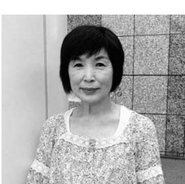

▲仕事帰りに仙台駅前で撮影

 震災後、相馬の避難所、川俣町の親戚宅を経て、現在は以前に住んだことがある仙台市で夫、長男夫婦とともに4人で暮らす。 今は市内でフルタイムの仕事を始め忙しい日々。休日は、浪江町在住時の知人や友人と会ったり、担当する役職の会合で出かけていることが多い。

## 叶谷勇郎さん・タケ子さん(北幾世橋)

取材者:特定非営利活動法人山形の公益活動を応援する会・アミル齋藤・柴田取材日:8月13日 「平成23年9月広報なみえ掲載」

### お互いに苦しい不安な状況を乗り越えましょうまた浪江町で会いたいです

 3月17日にご家族10人で親戚を頼り山形県最上町へ避難。叶谷さん親子は請戸漁港の漁師。父勇郎さんの船「万寿丸」が津波に流されまだ見つかっていない。船の写真を大切にし、見つかることを願っている。息子の貴徳さんは浪江町野球チームの監督を務め、9 月に行われる「福島県市町村対抗野球大会」 に出場する予定。「こんなときだからこそ自分たちが野球を頑張って町のみんなに元気になってもらいたい。」と話す。

▲5月の一時帰宅の際に持ち帰った『漁船「万寿丸」』の船出写真と、夫婦一緒に。

3 月 11 日の地震の後、息子の貴徳は請戸港にある船を係留するためにすぐに請戸港に向かったが、道で偶然会った漁師仲間に 「 津波だからだめだ 。」 と言われすぐに引き返し難を逃れることができた 。 12 日の朝に防災無線で避難指示があり、川俣小学校まで家族 10 人で避難し、親戚を頼って山形県最上町に来た 。 2 、 3 日経って落ち着いたら自宅へ帰れると思っていたので、こんなことになるとは思ってもみなかった 。 今不安なのは、先が見えないということ 。 故郷へ帰れるのか、それがいつごろなのか … 。 震災から 1 カ月は精神的につらく、上を見ることができなかったが、ここ数カ月は息子が重機の勉強をし大型特殊免許を取得したり、地元の漁協の会議に出たり、上を向き町の復興のためにできることを探していた 。 現在、息子は東京での仕事が決まり、 9 月から家族と離れて暮らすことになった 。 一度はあきらめかけた県の野球大会へ、皆さんの協力と熱い想いで参加することになり、楽しみにしている 。 自分はやはり、また船長として海に戻り、浪江で暮らしたい 。

鈴木大介さん(請戸)

取材者:元気玉プロジェクト実行委員会江川取材日:8月15日 「平成23年9月広報なみえ掲載」

## 自分たちの酒づくりを存分にやっていきたい福島県

家族とともに山形県米沢市に住み、南会津の蔵元で、残された酵母から「壽」をつくったことぶき

震災後の津波で、自宅、蔵、仕込んだ酒、記録資料すべてを失いました 。 あのときの光景は、自分でも忘れることのできない光景です 。 地震直後、消防車で避難誘導をしていました 。 大津波が迫りいよいよ危ないというときに、消防車を乗り捨てて高台へ避難しました 。 逃げ切れなかった人たちを避難指示によって捜索できなかったことが悔いに残ります 。 現在、手元にある酒蔵の写真はすべて、取引先が蔵見学時撮影したものが残っているだけです 。 取引先には、できるだけ蔵に足を運んで酒と風土を理解してもらっていたことが、残された写真となりました 。 ありがたいことに自分たちの思い出が、人さまから伝わってくるのです 。 家族親戚で米沢に避難しました 。 すべてが流されて酒なんてつくれると思っていませんでした 。 でも、あのころ ( 3 月 ) 雪がふって寒かったので、「 まだ酒が造れるな 。」 という話しはしていたんです 。 そのとき、前からおつきあいのあった南会津町の蔵元で酒を 1 本仕込めるこ

とになりました 。 米は地元請戸で契約栽培をしていた同じ品種を用い、県の試験場に残っていた蔵独自の酵母で仕込みました 。 水が違うので全く同じ酒というわけにはいきませんでしたが、 「 壽 」 の味は出せました 。 7 月上旬にできた酒は約 2 、 0 0 0 本余り 。 地元の方 々 に気持ちをいただき、つなぐのに精一杯だっただけに、「 壽が飲みたかった 。」 といわれたときには涙が流れました 。 わが家は、 1 8 3 0 年ごろから続く造り酒屋です 。 ずっと地元の暮らしに寄り添ってきた自負があります 。 自分自身も前勤務先のある奈良県から戻ったとき、浪江の良さをすぐ実感し、酒造りを通して他の文化圏に情報を発信できる立場によろこびを感じていました 。 暑すぎず、寒すぎず、季節ごとに豊かな恵みあふれる風土、人 々 の営みが懐かしくて仕方がありません 。 これから 「 酒づくり 」 を行なってゆく上で場所の問題は欠かせません 。 まだ拠点探しの最中で、自分が思うような良い環境はなかなかありません 。

> 今回の震災後、たくさんの方の支援と応援を受けたことが、私の強いよりどころになり財産となっています 。 私たちの新しい酒造りは存分にこの思いを発揮した酒であること、浪江の復興そして文化継続に向けた場づくり、きっかけづくりに少しでも貢献できればと願っています 。

▲南会津で仕込んだ「壽」は発売後すぐに完売

取材者:ちば市民活動・市民事業サポートクラブ風間・鍋嶋取材日:8月7日 「平成23年9月広報なみえ掲載」

### 生きていたら、きっといいことある!

千葉県

 震災後福島県内を転々とした後、東京の親戚に身を寄せ、 6回目にしてようやく現在住んでいる千葉市稲毛区のマンション5階に移って来た柴さん一家。今は息子夫婦、3人の孫とおばの8人で暮らしている。

■ 震災でなにもかもが慣れない狭いマンション暮らし周りの玄関は皆閉まっている中でうちは浪江にいたときのように今玄関は開け放っています 。 窓から関に抜ける風に、ふるさとの浜風涼しさと気さくな近所の人たちとやり取りを思い出します 。 これまでずっと働き詰めで、やとゆっくりできると思った矢先、災で被災しました 。 老後の暮らし孫の将来を考えて建てたばかりのも、お墓も、そして天秤を担いで商していたころから代 々 受け継がてきた水産会社の工場や大量の在が入った冷凍庫、会社の車、長年文をくれていたお客さんのデータ何もかもすべてを無くしました 。 社は、息子が 4 代目そして小学 5 の孫が 5 代目として続いていくは

▲左から孝一さん、孫の孝成くん、タケ子さん、かおるさんこうせい

、、も玄ののっ震と家行れ庫注も会年ずでした 。 その孫が震災前のある日、「 自分も名刺がほしい 」 と言うのでパソコンで作ってやりました 。 喜んでいる姿が思い浮かびます 。 今、手元にあるのは震災後、無垢の床板だけが残っている我が家の様子を映し

た何枚かの写真だけです 。 ■ 久しぶりの再会先日、子どもの小学校の卒業式があり久しぶりに福島のみんなと再会しました 。 みんなばらばらになったけど、子どもたちの気持ちはつながっていると感じました 。 会っている時間はとても短く感じ、改めて 「 請戸 」 を実感しました 。 そして、今は千葉で働きながら 「 浪江では、今頃はこんなことをしていたな 。」 って思います 。 それはふるさとでのちりめんじゃこや小女子の作業やお中元やお盆の忙しさに追われながらも穏やかな日 々 。 これから子どもたちのためにも頑張らなければと思います 。 ■ ありがたいと思う日 々 震災当時は多くのお客さんや取引会社の方 々 が心配して電話をくださったようですが、無事でいることを伝える手だてさえありませんでした 。 こちらから連絡することはできませんでしたが、今は、千葉や埼玉のお客さんが心配してお米や野菜を持って来てくれたり、同業者や築地の方 々 がお見舞いにきてくれたり、本当にありがたいと思います 。 家族が無事でいられたこと、親戚の助けがありがたく、これから先はどうなるか解らないが、 「 生きていたら、きっといいことがある 。」 と信じています 。 最後に、「 浪江町役場および自治体の方 々 も一生懸命にお仕事をされておりますが、お体を大切にして頑張ってください 。」 と伝えたいです 。

)

」

## 志賀雄一さん(樋渡)

取材者:特定非営利活動法人ビーンズふくしま豊田取材日:8月10日 「平成23年9月広報なみえ掲載」

## 浪江の文化活動の再開を祈って福島県

みなさんのご支援を胸に、早く浪江に帰ってすきな歌を思いきり唄いたい

私は今、妻と92歳の母の3人で二本松の促進住宅で過ごしています。

大地震発生のとき、私たち家族は浪江町樋渡の自宅にいました。パソコンで作業をしていたところ、気がつくと落ちてきた柱時計を抱いて横になっていました。まもなく防災無線で津波の知らせを受け、かけつけた妹と4人で山の中にある野菜直売所に避難しました。その日は妹の家に泊まり、次の日は原発事故の知らせで、そのまま4人で津島に避難しました。翌日の朝早く、川俣高校体育館に避難、妹は東京へ移動。私たち3人はここで2泊、翌日甥が迎えに来て仙台に移動。物資がほとんど無い中、アパートに半月ほど生活した後、4月から二本松市に来ました。財布も免許証も持たず逃げて来たのに、今は沢山の支援物資をいただきながら生活

できることに大変感謝をしています。

今、望むことは、なんと言っても早く原発事故が収束して、愛する故郷へ帰ることです。これは浪江の町民のみならず、近隣の町民のみなさんが、胸が熱くなるほど望んでいることです。そして、一刻も早く町の復興の出発点に立たねばなりません。

私にとって残念なことが一つあります。私は浪江町芸術文化団体連絡協議会の代表を務めさせていただきながら、今は何もできないことです。そんな中、私の所属している合唱団員と一人一人連絡をなんとか取り合って、「合唱団だより」を発行することができました。さらに先日、福島市で交流会を開き、団員のみなさんと再会の喜びを分かち合うことができました。

浪江町には50団体を超える芸術文化団体があります。その団体の方々もあきらめずに、浪江に帰ることを祈念して過ごして欲しいと願っています。 8月に浪江町の盆踊り大会が開かれたことは、大きな励みになったことと思います。町長をはじめとして職員のみなさん、商工会のみなさんお世話さまでした。

被災され、あるいは絶望の中にいる方もおられるかも知れませんが、近い将来必ず浪江町に帰る日が来ることを信じがんばりましょう。今はそんなところではないと言われる方も多いと思いますが、私は浪江町の芸術文化活動の再開を信じ、生活に励んでいきたいと思っています。

3 4 2 年もの伝統を持つ大堀相馬焼きの里には、昔からのコミュニケーションが脈 々 と受け継がれていた 。 伝統とは、地域の文化であり、地域のつながりだと考えている 。 だから、震災と避難のために、その絆が壊れてしまったことは、とても残念でならない 。 大堀地区は、米がおいしく、高瀬川渓谷の眺めときれいな水があり、空気は澄んで蛍が乱舞するとても素晴らしいところで、ひとことでは言い表せない愛着がある 。 平成 14 年に開館した 「 陶芸の杜おおぼり 」 の周辺には、桜や紫陽花、さるすべりなどの木を植えて、手入れをしてきたところだっただけに、悔しい思いで仕方がない 。 また、昔から船乗りの守り神とされ、請戸の港に戻る際の目印とされた 「 戸神山 」 には十二支 ( 干支 ) の石像が祀られていたが、損傷が激しくなっていたので、仲間たちと干支を描いた陶板を焼いて 1 0 0 ㎏ を超える自然石にはめ込んだ新たな十二支像を作成した 。 急な登山道沿いに力を合わせて設置したことも懐かしい思い出だ 。 こうして、地元の話をしていると地域のみんなの顔が浮かぶ 。 実際に仲間の顔を見て話しができたら、きっと元気でやり直せると信じている 。 千年に一度の大災害というが、以前の大堀地区を取り戻し、いつか復興したならば、つらいことも思い出話にして、みんなでうまい酒を酌み交わしたい 。

震災前、4世代同居の家族10人で生活していた石井さん一家。現在は、相馬市、二本松市、ひたちなか市(茨城県)、市原市(千葉県)の4カ所に分かれて避難生活を送っている。

4月2日から夫の博和さん、7歳、4歳、3歳の子どもたちと市原市の団地で生活中。

私は、職場で震災にあい、一度も家に戻らず福島県外に避難しました。同じ浪江町に嫁いでいた妹が臨月のお腹でしたので、とにかく早く遠くへ避難したかったのです。はじめの3週間は、叔母の暮らす埼玉に全員で避難しました。妹は、3月24日草加市立病院で男の子を無事出産、これからの日本に思いを込めて大和と命名しました。 やまと

小学校2年生の長男、秀人は、1年間通った幾世橋小学校への思いからか「新しいランドセルはいや。」 と言うので、浪江町の自宅に夫が一時帰宅した際にランドセルを持ち帰りました。今では友だちもでき、しゅうと

サッカークラブにも入部、少しずつ千葉での生活に慣れつつあります。

蛍が飛びかい、子どもの好きなカブトムシがいっぱい採れた自然豊かな浪江町。祖母お手製のもろみに鮭やきゅうりを漬けて、祖父が作ったお米のご飯とともに、おいしく食べたことなど思い出します。 浪江町には思い出がたくさんあります。小学校、中学校、高校といっしょにソフトボールをやった仲間や近所の人たち、親戚…会いたい人は、たくさんいます。

慣れない団地住まいで、子どもたちが部屋で走り回るたびに、上下の部屋に住む方々に迷惑にならないようにと、気遣いをしています。でも、大人のふんばる姿を子どもたちに見せることが、いつか子どものためになると信じています。今回の震災での困難は、乗り越えられる試練と思っています。

いつかまた、家族みんなで一緒に暮らすことができたらと願っています。

大きな揺れに襲われたのは長女の蓮果を迎えに行く車中、ちょうど信号待ちをしているときでした 。「 早く迎えに行かないと … 。」 揺れがおさまってすぐに幼稚園に向かいましたが、蓮果はいませんでした 。 車で周りを探していると、ちょうど幼稚園の先生に会って、娘が高台に避難していることがわかりました 。 無事だった子どもたちとともに、その日は家で寝ることにしました 。 翌日、朝から家の片付けをしていると避難指示が出て、そのときはちょっと出かけるくらいの気持ちで服などを持って逃げました 。 その後、れんか

津島、本宮を経て新潟県柏崎市西山に避難しました 。 夫とともに一時帰宅をしたとき、草木が無造作に伸びきっている町を見て 「 たった 5 カ月でこんなことに … 何年も経ったらどうなるんだろう 。」 という不安を感じました 。 いつ戻れるかわからないし、先のことは何もわからない 。 でも、今いる場所は違っても浪江のことを忘れずに生きていきたいと思っています 。 最後に、請戸の児童館の先生方、娘を迅速に避難誘導してくださり本当にありがとうございました 。

▲村岡さんと長女蓮果ちゃん(左)、次女果音ちゃん(右) れんかかのん

 地震発生時、幼稚園に子どもを迎えに行っていた村岡さんは、子どもの安否が第一に頭に浮かんだ。 幼稚園の誘導で無事に避難していた子どもたちと夫、親族とともに避難所を転々としながら、現在は新潟県柏崎市で生活している。

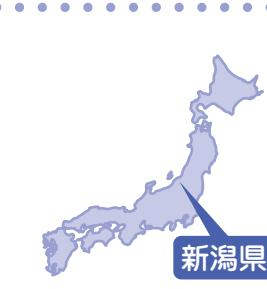

## 原中貴弘さん・君枝さん(田尻)

取材者:(特活)新潟NPO協会富澤取材日:8月22日 「平成23年9月広報なみえ掲載」

いつかゆっくりと浪江町や実家のあった請戸を娘と歩きたい

 震災発生時、臨月だった君枝さん。新潟市内の病院にて、菜乃巴ちゃんを出産。貴弘さんと貴弘さんのご両親、君枝さんのご両親は一時、新潟市北区の避難所で過ごす。 菜乃巴ちゃんのことを考え、3人で新潟市に移住を決意。 なのは

▲助産師さんから習った「生け花」の前で、原中さんご一家。

出産予定が 3 月だったため、妻だけ震災直後、新潟市の市民病院に入院しました 。 私と私の両親、それから妻の両親は、数日後、新潟市北区の避難所に行き、しばらくそこで過ごしました 。 今後、私の両親は、新潟市から宮城県亘理町で、妻の両親は東京から南相馬市で暮らす予定にしています 。 出産時は、新潟市内のある助産師さんとの出会いがあり、体も心もサポートしてもらいました 。 産後、妻の体調を気遣ってもらい、その方のご自宅に一週間お世話になりました 。 娘の菜乃巴は、食道閉鎖症で産まれ、翌日に手術をし、退院は一カ月半後でした 。 その間もお見舞いに来てくれたり、お知り合いの方を紹介してくれたりと、妻と娘の菜乃巴を実の娘と孫のように可愛がってもらい、現在も深い交流があります 。 今不安なことと言えば、新潟の冬、雪のことでしょうか 。 二人とも浪江町出身なので、雪の生活には慣れてないんですよね 。 それから、地元の方と話をしたいという思いがあり、地元福島県のナンバープレートを見たりすると、つい駆け寄りたくなります 。 この前は、逆に声をかけてもらい、浪江出身の方にお

会いしました 。 新潟県は、水害、地震と度重なる災害にあった経験があるからなのでしょうか、とても素早い受入れ体制をとっていただき、大変感謝しています 。 子どもの出生届と一緒に、私たち夫婦は新潟市に住民票を移しましたが、市からさまざまな情報が届くので、今の暮らしに不便はないです 。 逆に情報が豊富で、何を選んだらいいか困ったときは、助産師さんに相談しています 。 浪江町の情報は、インターネットで調べたり、福島県内にいる友人などから電話で教えてもらっています 。 しばらくは新潟市で暮らすことを決意しましたが、いつか娘を連れ、ゆっくりと浪江と実家のあった請戸を懐かしんで歩ける日が来ることを強く願っています 。 そのためにも、町の情報はこれからもずっと受け取りたいです 。 今回の震災で、ふるさとのことをとても尊く感じました 。 県外にいる私たちの思いや提案を受け付けてもらえる機関を設けてもらい、絶えず呼びかけていってほしい 。 もう誰一人悲しむことなく孤立することがないように 。 そう願ってやみません 。

 JR富岡駅前の勤務先で地震に遭い、直後の津波から逃れながら、何とか苅宿の自宅にたどり着く。 すぐに母親や妻、孫、そして愛犬とともに津島へ避難。 3日後、福島市へ移動し、到着直後は友人宅に。その後、義理の弟さん宅で3月半ばからの3カ月弱を過ごし、6月初旬に相馬市の借上住宅に転居。

■ ともかく、家族全員が無事に帰宅し、避難したあの日強い揺れの後、職場から水平線を見つめていると、 10 mを超すと思われる真っ黒い波の壁が見えました 。 とっさに大津波の危険を確信し、近くの人に避難を呼びかけました 。 通称 「 山麓線 」 をたどって自宅へ戻ろうとしましたが、橋のたもとには大きな亀裂や隆起ができていて、周りの人たちと丸太を組み、助け合いながら家に戻りました 。 自宅にいた今年 93 歳になる母は歩くことが不自由でしたが、

▲おばあちゃんと根本さんご夫妻、そして愛犬ココ、みんな一緒に。

| て 活 く の れ 仲 た 間 り た と ち 、 が 多 励 く ま の す 人 会 に を 支 開 え い |
|------------------------------------------------------------------------------------------------------------------------------------------|
| 心 身 配 地 し 福 て 島 く 市 れ の た 友 り 人 、 た か ち つ が て 消 の 息 部 を |
| い た だ き ま し た 。 ま た 、 妻 の 出                                                                       |
| に を 多 届 く け の た お 施 心 設 遣 の い 方 や 々 差 か し ら 入 、 れ 本 を 当 |
| 係 の 先 輩 後 輩 や 、 作 り 上 げ た 歌                                                                       |
| 長 く 、 作 詞 活 動 を 通 じ た 音 楽 関                                                                       |
| 私 た ち も に 妻 支 も え 詩 ら 人 れ と て し て の 活 動 が                                    |
| ■ 仲 間 や 同 窓 生 、 さ ま ざ ま な 人                                                                       |
| く ま し く な っ た よ う に 感 じ ま す 。                                                                  |
| 島 で の 生 活 と を 経 験 し た 孫 は た                                                                       |
| そ の 大 変 な 体 験 と 、 避 難 先 の 福                                                                       |
| パ ン を 分 け 合 っ て 食 べ ま し た 。                                                                       |
| お に ぎ り や 4 人 で 1 個 の メ ロ ン                                                                       |
| で 寝 泊 ま り し 、 配 ら れ る 小 さ な                                                                       |
| 愛 犬 が 一 緒 だ っ た の で 私 は 車                                                                            |
| 所 に 行 き ま し た 。                                                                                                     |
| 愛 犬 を 伴 っ て 全 員 で 津 島 の 避 難                                                                       |
| て い た 孫 の 郁 ふ み 弥 や も 無 事 に 帰 宅 し 、                                                   |
| よ う で す 。 苅 野 小 学 校 に 通 学 し                                                                       |
| か け た り し な が ら 家 に 向 か っ た                                                                       |
| 津 波 を 知 ら せ た り 、 避 難 を 呼 び                                                                       |
| 江 高 校 の 生 徒 た ち に 請 戸 地 区 の                                                                       |
| い た 妻 、 洋 子 は 、 途 中 に あ る 浪                                                                       |
| ま た 、 町 の 体 育 館 に 出 向 い て                                                                            |
| 家 を 頼 り 、 無 事 で し た 。                                                                                      |
| う か 、 迅 速 に 2 0 0 m 離 れ た 隣                                                                       |
| あ の 非 常 時 だ か ら だ っ た の で し ょ                                                                  |

| ま し | せ | ま | の      | で | を | る |   | い | が | に |   | に      | 躍 | ま | 理 | る |   | で | 歌 | の | よ | ト | ら |
|--------|---|---|--------|---|---|---|---|---|---|---|---|--------|---|---|---|---|---|---|---|---|---|---|---|
| す に | ん | だ | イ      | も | し | さ | こ | ま | 、 | な | 避 | す      | さ | い | な | た | 原 | し | を | 家 | り | が | れ |
| 。 一 | が | 無 | メ      | 美 | ま | と | れ | す | 今 | っ | 難 | る      | れ | ま | の | び | 発 | た | 通 | を | 借 | 必 | て |
| 時      | 、 | 残 | ー      | し | す | 浪 | か | 。 | は | た | す | と      | て | す | か | に | 事 | 。 | じ | 紹 | 上 | 要 | 今 |
| 帰      | 一 | な | ジ      | い | が | 江 | ら |   | 元 | 孫 | る | 、      | い | が | も | 、 | 故 |   | て | 介 | げ | な | が |
| 宅      | 段 | 浪 | を      | 浪 | 、 | 」 | 、 |   | 気 | は | た | と      | る | 、 | し | 浪 | の |   | 知 | し | 住 | 母 | あ |
| し      | 落 | 江 | 壊      | 江 | 私 | の | 私 |   | に | か | び | て      | 新 | 浪 | れ | 江 | 深 |   | り | て | 宅 | の | り |
| た      | し | は | し      | の | の | レ | が |   | 野 | わ | に | も      | 聞 | 江 | な | へ | 刻 |   | 合 | く | を | た | ま |
| い      | た | 見 | た      | ま | 中 | コ | 作 |   | 球 | い | 転 | う      | 記 | 町 | い | 戻 | さ |   | っ | だ | と | め | す |
| と      | ら | た | く      | ま | で | ー | 詞 |   | を | そ | 校 | れ      | 事 | の | と | る | を |   | た | さ | 、 | に | 。 |
| 思      | 墓 | く | な      | で | は | デ | し |   | 頑 | う | す | し      | な | 人 | 思 | こ | 知 |   | 施 | っ | こ | 仮 | 介 |
| っ      | 参 | あ | い      | す | い | ィ | た |   | 張 | で | る | い      | ど | 々 | っ | と | ら |   | 設 | た | の | 設 | 護 |
| て      | り | り | の で | 。 | つ | ン | 「 |   | っ | し | こ | で す | を | が | て | は | さ |   | の | の | 相 | 住 | ベ |
| い      | を | ま | 、      | 歌 | ま | グ | ふ |   | て | た | と | 。      | 目 | 活 | し | 無 | れ |   | 方 | も | 馬 | 宅 | ッ |
|        |   |   |        |   |   |   |   |   |   |   |   |        |   |   |   |   |   |   |   |   |   |   |   |

私は、震災 3 日後に親戚のおじさんが住んでいるさいたま市に避難してきました 。 お父さんは福島で働いていて月に 1 回から 2 回会いに来てくれます 。 昨日は私の誕生日だったのでお父さんも一緒にみんなでケーキを食べました 。 今は毎朝、通学班のみんなと一緒に学校へ通っています 。 新しい友だちもできました 。 学校で一番楽しいのは、友だちと話したり遊んだりしているときです 。 休み時間になるとみんなが遊びに誘ってくれるのがうれし

いです 。 この間、始業式があって学校に行ったときも友だちから声をかけてくれました 。 浪江にいたときは、自転車にいっぱい乗ったり、ずっと外で遊んでいました 。 でも、ここは自動車が多いので浪江にいたときのようには遊べません 。 今一番したいことは、沢上の花火を見て、きれいな着物を着てよさこいを踊ること 。 それから 「 なみえ焼そば 」 も食べたいです 。 そして浪江の学校にも行きたいし、お友だちにも会いたいです 。

役場から

▲お気にいりのマグカップを前に並べて。 左から花菜ちゃん、舞ちゃん、羽海ちゃん

 羽海ちゃんは現在、親戚の叔父さんが住んでいるさいたま市に妹の舞ちゃん(小2)と花菜ちゃん(小1) 祖父母、お母さんと暮らしています。 お父さんは福島で働いているため離ればなれの生活です。 まいはな

)

取材者 : 地域社会デザイン・ラボ遠藤宮城大学地域連携センターd田取材日 : 9月14日「平成23年10月広報なみえ掲載」

浪江の人・海・山・川を想って…

 現在は、二本松市にある浪江町役場で総務の仕事を担当。 住まいは、本宮市で家族とともに暮らす。活発だった小中高校の横のつながりの会合を「これからもできれば…」と懐かしむ。浪江の自然を愛するアウトドア大好き人間。

今、浪江で思い出すのは、家族や子どもたちと出かけた川や海のことです。季節ごとに我が家の楽しみのサイクルができていて、4月はヤマメ釣り、 7月はアユ釣り。また、海釣りでは夏にアジやイシモチを釣ったものです。

私の家族は震災後、何カ所か避難所を回った後、妻と子どもたちは静岡県に、母と祖母は神奈川県に、祖父は猪苗代町に分散避難し、私は役場の仕事があるので一人でした。連絡もままならない場合があり苦労しました。でも今は、やっと家族が2カ所に分かれながらも近い場所で暮らせるようになりホッとしています。

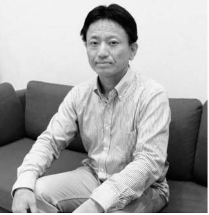

▲仕事帰りに福島駅前にて

震災の後は、非常用電源を確保したり、避難物資を運んだり、炊き出しのための食糧の確保のために会社や商店、農家にお願いに出かけたり、避難所で食事を配る担当をしたり、役場の移転や出張所立ち上げの担当になり必死でした。でも「うちら職員がやらねば誰がやる。」という気持ちで、一生懸命に動く仲間たちに支えられてきました。

今後、浪江に帰ったら、自然を感じて楽しむ生活をまた送りたいですね。また、家族に任せきりだった田畑もなるべく頑張りたいと思います。

玉井三千子さん(権現堂)

取材者:とちぎボランティアネットワーク君嶋・大泉取材日:9月13日 「平成23年10月広報なみえ掲載」

## また浪江で生活を栃木県

 5年前、栃木県宇都宮市から浪江町へ移り住んだ玉井さん家族は、最初戸惑いはあったものの浪江町での生活に充実を覚えていた。 そんな中の今回の震災。またすぐに戻れると財布と愛犬を連れ出てきたが…。

現在は、宇都宮市に家族と住んでいる。

▲玉井さんご家族

している 。 また浪江の人たちと

元気な姿でいつか会いたいとも 。

そして、いつになるか分から

ないが、豊かな浪江で以前のよ

うな暮らしがしたい 。

ぼくのこころはばく発しないぞ!

 浪江町では幾世橋に住んでいて、今は福島市上鳥渡しのぶ台の仮設住宅に住んでいます。幾世橋小学校のみんなに会いたいな。あそびたいな。そして、桑原先生にまた怒られてみたいな。

 9月12日、アメリカでテロのあった翌日が、ぼくの誕生日です。

▲崇斗くん(中央)を囲んで、祖父母、父母、弟、愛犬イチ

震災後は、小高工業高校、相馬市、宮城県角田市、埼玉県、あだたら体育館、土湯温泉と移って、ちょっと前に福島市上鳥渡しのぶ台の仮設住宅に引っ越してきました。すぐ南前の仮設住宅に、おじいちゃんおばあちゃんが住んでいて、犬のイチも、みんないっしょです。

学校は、荒井小学校に通っています。幾世橋小学校のときの近くの子も何人かいるのが、うれしいです。 友だちもできました。9月18日が運動会です。楽しみです。

浪江町であった、初発神社の盆踊りのことやふれあいまつりでのもちつき、雑煮もちのこと、みんなでザリガニ取りをしたこと、3年生のときにビーズのストラップを作ったことなどを思い出します。

幾世橋小学校で大の仲よしだった原田勇真くん(浪江のこころ通信第2号に登場)が、避難先の桑折町立醸芳小学校にいたとき、ぼくが会ったこともない勇真くんのクラスの子全員から、手書きの励ましの手紙をもらいました。ぼくの宝ものです。

重

非営利活動法人

ンズふくしま豊田

12 日 「 平成 23 年 10 月広報なみえ掲載 」

孝さん ( 権現堂 )

いました 。 浪江町民を多く知っており、みなさんを友人以上の関係だと思っています 。 毎日、新聞を読んでいて、言葉にならない思いがあります 。 また、福島市や郡山市、他県へそれぞれ移った方と会う機会が減りました 。 なかなか顔を見て話すことが減った今、 「 絆 」 が一番大切なことだとあらためて気付きました 。 私には娘が 4 人おり、 17 人の大家族です 。 先日のお盆のときには家族全員が集まりました 。 秋にはまた集まり、芋煮会などをしたいと思っています 。 こうして家族の顔を見ることも幸せに感じます 。 ■ 里帰りに向けて町に帰りたいです 。 里帰りできる日を願っています 。 早くふるさと浪江で皆さんにお会いできる日を心待ちにしています 。 に

夫と冠婚

ました 。

真っ最中

たので、

外に飛び

祖父、

子どもら

では、地

でしたが

てもらい

リンの補

した 。 食

りが支給

いたこと

その後

 震災時、妊娠していた朝田さんは、9月に出産予定。親戚と一緒に避難先を転々としていたが、現在、夫の英謙さんと2人で新潟のアパートに住んでいる。偶然にも、近隣には同郷の避難者も住んでいて、助け合いながら暮らしている。 ひでのり

▲朝田さん(左)と姉の星野美咲さん(右)

私が、新潟へ来てまず最初にしたことは、産婦人科を探すこと 。 お腹の中に男の子を授かっていたので、心配でならなかったからです 。 内部被ばく検査も受け、結果、異常がなかったのでホッとしています 。 震災前、私は浪江町権現堂地域に住み、葬祭の会社を営んでい地震発生時もお葬式の 。 ものすごい揺れだっお葬式どころではなく、出しました 。 父母、姉、夫のおばの 10 人で避難した矢吹町元の人のための避難所、特例として受け入れました 。 そこでのガソ給は、とても助かりま事には、温かいおにぎされ、心が少し落ち着を覚えています 。 、私たちは比較的福島から近く、放射能の心新潟市にある物件を見た 。 慣れない土地で不ましたが、役所の方の応に感激しています 。 逆に、原発問題の対ことには怒りを隠せま難時に置いて来た物にシートをかけてほしいげても、 2 カ月後、や合いをしている状態でで原発についてのデモたのですが、全く報道ことも残念 。 復興に向できないことが大変悔し自分たちが新潟に拠点どうかは、今後の浪江第です 。 今は心も体もしていて幽霊のように感姉は、住民登録が東ま、体調を崩し療養の江に戻ってきている最しました 。 失業保険をに被災証明書が必要だすが、矢吹町に避難し月 20 日までの名簿を捨てたと聞いて、猛抗議 。 てるなどとはあってはことです 。 また私たちには家族切な愛猫がいて、一緒避難してきました 。 不がこみ上げるときでも在で少しその気持ちが紛

| し 会 て を い 作 ま っ す て 。 も ら え て 本 当 に 感 謝 | 皆 気 だ さ と ん い の う 様 こ 子 と が を 分 知 か っ る て 、 も こ ら の え 機 、 | 報 な み え 」 を 見 て 、 私 た ち が 元 | と い い な ぁ と 願 っ て い ま す 。「 広 | 元 気 な 赤 ち ゃ ん が 誕 生 し て い る | こ の 通 信 が 完 成 す る こ ろ に は 、 | 産 む た め に が ん ば っ て い ま す 。 | グ プ を ー し ル た に り 通 と っ 元 た 気 り な 、 赤 ウ ち ォ ゃ ー ん キ を ン | 今 は 35 週 目 で 安 定 し 、 定 期 的 に | た い へ ん な 時 期 も あ り ま し た が 、 | 妊 婦 と い う 立 場 で の 避 難 生 活 。 | す か ら 。 | の ふ る さ と は 浪 江 し か な い の で | 浪 江 に 帰 り た い と 思 い ま す 。 私 | 線 の 問 題 が 残 っ て い た と し て も 、 | が ひ と り 立 ち し た ら 、 例 え 放 射 | ま せ ん が 、 生 ま れ て く る 子 ど も | は あ り ま せ ん 。 今 は 浪 江 に 帰 れ | 民 票 も し ば ら く は 動 か す つ も り | い と い う 気 持 ち が あ る の で 、 住 | で す が 、 浪 江 と つ な が っ て い た | は 、 本 当 に シ ョ ッ ク が 大 き い の | 強 い で す 。 今 回 の 地 震 に つ い て | し た 。 浪 江 町 へ の 思 い は 人 一 倍 | 私 。 は 、 浪 江 町 で 生 ま れ 育 ち ま | す | 動 物 た ち を 見 る と 、 心 が 痛 み ま | で 、 被 災 地 に 置 き 去 り に さ れ た | 同 じ こ と 。 テ レ ビ の ニ ュ ー ス 等 | 必 死 で す が 、 そ れ は 動 物 た ち も | 人 間 も 生 活 を 安 定 さ せ る こ と に |
|--------------------------------------------------------------------------------------------------|-----------------------------------------------------------------------------------------------------------------------------------------------|--------------------------------------------------------------------|---------------------------------------------------------------------|--------------------------------------------------------------------|--------------------------------------------------------------------|--------------------------------------------------------------------|------------------------------------------------------------------------------------------------------------------------------------------|---------------------------------------------------------------------|-------------------------------------------------------------------------|--------------------------------------------------------------------|------------------|--------------------------------------------------------------------|--------------------------------------------------------------------|-------------------------------------------------------------------------|--------------------------------------------------------------------|--------------------------------------------------------------------|--------------------------------------------------------------------|--------------------------------------------------------------------|--------------------------------------------------------------------|--------------------------------------------------------------------|--------------------------------------------------------------------|--------------------------------------------------------------------|--------------------------------------------------------------------|-----------------------------------------------------------------|---|--------------------------------------------------------------------|--------------------------------------------------------------------|--------------------------------------------------------------------|--------------------------------------------------------------------|--------------------------------------------------------------------|
|--------------------------------------------------------------------------------------------------|-----------------------------------------------------------------------------------------------------------------------------------------------|--------------------------------------------------------------------|---------------------------------------------------------------------|--------------------------------------------------------------------|--------------------------------------------------------------------|--------------------------------------------------------------------|------------------------------------------------------------------------------------------------------------------------------------------|---------------------------------------------------------------------|-------------------------------------------------------------------------|--------------------------------------------------------------------|------------------|--------------------------------------------------------------------|--------------------------------------------------------------------|-------------------------------------------------------------------------|--------------------------------------------------------------------|--------------------------------------------------------------------|--------------------------------------------------------------------|--------------------------------------------------------------------|--------------------------------------------------------------------|--------------------------------------------------------------------|--------------------------------------------------------------------|--------------------------------------------------------------------|--------------------------------------------------------------------|-----------------------------------------------------------------|---|--------------------------------------------------------------------|--------------------------------------------------------------------|--------------------------------------------------------------------|--------------------------------------------------------------------|--------------------------------------------------------------------|

配がない

つけまし

安もあり

親切な対

応が遅い

せん 。 避

、ブルー

と声を上

っと話し

す 。 東京

に参加し

されない

けて何も

いです 。

を置くか

の復興次

ふらふら

じます 。

京都のま

ために浪

中、被災

もらうの

ったので

ていた 3

てしまっ

名簿を捨

ならない

同様に大

に新潟に

安や怒り

、猫の存

れます 。

大山恵さん(川添)

取材者:一般社団法人いなかパイプ佐々倉取材日:9月12日 「平成23年10月広報なみえ掲載」

## 前向きに笑顔を絶やさずに、今できることを高知県

 長女・諒子ちゃんと恵さんの故郷・高知で元気に暮らす現在ですが、郡山に暮らす親戚の近くへ暮らそうと10月に栃木県へ引っ越し、新しい生活がスタートします。

■ 家族全員無事だった高台に家があったこともあり、津波は大丈夫でした 。 けれど、家の壁は崩れて、隣の部屋が見えているとか、食器が棚から出て全部割れて泥棒が入ったような状態 。 揺れてない時間の方が短いくらい余震もひどく 「 今日が私の命日か 。」 と思ったほど怖かったです 。 戦後の焼け野原のように何にもない海岸沿いを車で逃げながら、千葉で単身赴任中の主人とも携帯電話がつながらない状態でしたが、必死で何度も連絡をとりました 。 幸いにも家族、親戚、友だちもみんな無事で 「 逃げ足の速いやつらばかりだな 。」 と後で主人と笑いました 。 ■ なみえ焼そばが食べたくなる高知に来てから、時折、娘が 「 ママ、スーパーでなみえ焼そば買って来て 。」 と言うんです 。 「 高知には無いから 。」 と答えるんですが、ときどき食べたくなります 。 麺がうどんくらい太くて、極太・大・中と太さも選べて、甘いソースがついていて、スーパーで売っています 。 私が初めて食べたのは、主人の友だちが作ってくれて、ウインナー、たまねぎ、もやしが入ったもので 「 うわぁー焼きうどん ! 」 って言ったら 「 ソバだから 。」 と

| な ■ こ と ど 何           | て そ く 前 気 と ま 安 も よ の 言 緒 震 と た ■ て い 私 ば う に 持 、 す な 不 う 言 わ 災 言 お だ い                | ん い こ ン 家 つ り い 言 焼 に だ 浪 わ も ん か ま し                |
|--------------------------------------|-------------------------------------------------------------------------------------------------------------------------------------------------------------------------------------------------|------------------------------------------------------------------------------------------------------------|
| こ を い が 考 ろ に で | も く は 楽 思 進 ち 娘 。 顔 安 な 葉 れ 直 わ か か 。「 笑 よ し っ め を も 私 を だ 気 に た 後 れ 、 し ら お     | 持 き な れ 江 無 な み す い を ち と ま い ど ど が 。 は           |
| え ん 来 き て な て る | っ う く て る 切 不 が し っ 持 背 こ 、 る 娘 く 。 て 母 に な 今 よ り 安 不 て た ち 筋 と 娘 の が な 大 い さ | し 帰 つ し こ う り 、 そ 、 た っ く た と で を 娘 ろ 食 の て |
| や 、 方 か る に 扇 、 | な る 笑 で う 替 に 安 い だ に が が に だ く 丈 れ り ん き に え さ な た ろ な し あ 「 け っ て 夫 ば ま 、      | づ 。 材 が も さ も そ を 、 く 、 い せ 大 ろ が 思 庭 思           |
| 支 風 今 援 機 日           | る 、 て せ 顔 か う り ゃ り 死 は て も だ 楽 し 大 こ お 、 て を ら に ま ん ま ぬ 避 い 笑 し か た                     | 本 い て 好 鮭 豊 い で い 当 よ も き の 富 出 チ ま                     |
| し や で て 自 き           | 丈 と か 明 し し だ 、 し と し と け る っ く ら 。 夫 を し る ま て と 私 た 伸 た き た 姿 て な 。」                    | に う ら で 時 で し ャ す 幸 な っ 、 期 魚 ま ン 。                     |
| い 転 る た 車 こ           | ? や く く う い 思 が 。 び 。 は い が い る っ 、 な 、 。 る い 不 娘 る そ と 一 。 」 見 れ                               | せ た て 鮭 に も す チ な わ 。 ャ 、 の な お                               |

だいて、とても感謝しています 。 これに応えるためにも 「 私たちがやるべきことをやんなきゃ 。」 と思っています 。 前向きに笑顔を絶やさず、今できることをやって頑張るしかない 。「 復興 」 とか大きなことでなくてもいい、「 家族を守る 。」 でも何でもいい、他の方にも新しい生活を始めていってほしいと思います 。 特に若い人たちには頑張ってほしい 。 新天地で、前を見て頑張ってもらいたい 。

▲大山諒子ちゃん(7才)

に 4 月から 8 月初旬まで避難して

## 木村郁也さん(中2)(権現堂)

取材者 : 特定非営利活動法人ビーンズふくしま豊田取材日 : 9月14日 「平成23年10月広報なみえ掲載」

走り続けたい

▲「またいつか、浪江で元気に遊びましょう!!」と浪江の友達に伝えたいです。

■ 今の生活ぼくは今、二本松市の東和にある仮設住宅で祖母と父、母と兄、妹の 6 人で暮らしています 。 ここから東和中学校に通っています 。 バスの時間があるため、朝早くに登校し夜遅くに帰宅するので、少し大変なところがあります 。 最初は転校することで、不安な気持ちがありました 。 けれどクラスメイトはとても優しく、担任の先生は面白いので徐 々 に馴染むことができました 。 今はクラスの中で打ち解けて、新しい友だちができてうれしいです 。 ぼくは、浪江にいたころから陸上をしていて、走ることが大好きです 。 走っているときが一番楽しいです 。 地震の後、ぼくの家族は岳温泉

| 。 。 友 が が て っ き な 友 こ か が し こ に い ら て 仲 と 、 。 習 大 同 |
|--------------------------------------------------------------------------------------------------------------------------------|
|--------------------------------------------------------------------------------------------------------------------------------|

浪江町の川添地区に住んでいる。

 震災当日は、翌日に退院を予定して、南相馬市の市立総合病院に入院中だった。

 知り合いの車に同乗して自宅に戻ってからは、二本松市を経て千葉県まで避難したが、なかなか浪江の情報が入ってこないので、4月になって再び二本松市に戻り、その後岳温泉の旅館にお世話になっていた。

 6月下旬から、三男家族も避難している桑折町に夫婦で暮らしている。

入院していた病院から、津波が迫ってくる様子が見えたので、これは尋常ではないと感じた。病院の廊下や外にもベッドが並べられ、さながら野戦病院のようだった。

被災の後、妻とは別々に避難のための移動をしなければならなかったが、津島の避難所で再会できたことは幸いだった。それでも、避難所での寒さや食べ物の少なさ、状況が分からないことに対する精神的な苦痛など、今思い出してもつらいことが多い。

県内のあちこちに住んでいる知人や友人が、いろいろと気に掛けて支援してくれたことは、物心両面で助けられた。いろんな縁があって桑折町にお世話になることになったが、この家も知人が探してくれたものなので、本当にありがたい。

ここ桑折町は、浪江町に住んでいるとあまり馴染みがないが、ほとんどの用事が歩いて済ませることができるほどコンパクトで便利なところだ。かつて転勤で近くに住んでいたことがあり、果物もおいしく暮らしやすい町なので、大変気に入っている。

そして、浪江でやっていたグランドゴルフを桑折町でも仲間に入れてもらってやれることがうれしい。できれば、そば打ちやパソコンなどもやってみたいと思っている。

最後に、役場へのお願いだが、避難者がまとまって住んでいる仮設住宅には、全国からの支援に関するお知らせなど多くの情報が入ってくるようだが、個別に住んでいる借上住宅にはそうした情報がなかなか入ってこない ▲照雄さんと奥さんの紘子さんので、ぜひ情報の伝達について検討して欲しい。

### 泉田七海ちゃん(小2)・真美さん・利雄さん(両竹) ななみ

取材者:NPO法人ちば市民活動・市民事業サポートクラブ風間・鍋嶋取材日:9月12日 「平成23年10月広報なみえ掲載」

東京都

たから、みんな仲良しだ

▲『浪江カエル』を抱えた麻衣ちゃん、七海ちゃん、利雄さん(おじいちゃん)、真美さん(お母さん)

ったよ 。 浪江にいたときに、パパの誕生日に田植えをして、私の誕生日に稲刈りをするんだよって、おじいちゃんが教えてくれたの 。

たど嬉しなら米作りをしていました 。 今は仕がないので、孫と荒川の河川敷を歩するのが楽しみです 。 浪江の知合いからの電話は、ついつい長話になってしまいます 。

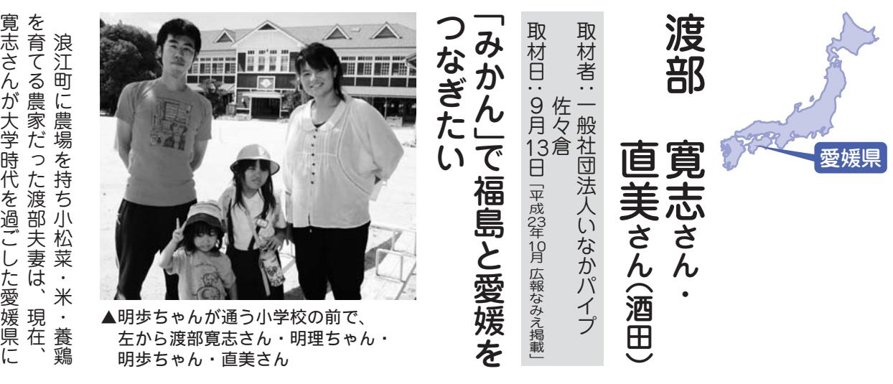

3月10日に戻って、いろんなものを見てみたい

 津波ですべて流されて何一つ持ち出せなかった泉田さん家族。 数か所の避難所を経て、4月から家族6人で東京都足立区の団地に住んでいます。

■ 七海ちゃんの話地震のときは、お母さんと妹の麻衣といっしょに、車で逃げたの 。 車には、チョコレート 1 個しかなくて、お腹がぺこぺこだったよ 。 その日の夜は車の中で寝たの 。 車の中にあったカエルのぬいぐるみをずーっと大事にしているの 。 だって、ほかには何も持ってなかったんだもの 。 もしできるなら、 3 月 10 日に戻って、いろんなものを見てみたいなぁ 。 海、カエル、おたまじゃくし、ザリガニ … 一番に会いたいのは、猫のタロー 。 どうしているか、とっても心配 。 浪江にいたときには、お友だちとマリンパークに行ったり、バーベキューをしたり、たくさん楽しいことがあったよ 。 今、通っている小学校は 5 クラスもあって、お友だちの名前を覚えるのが大変 。 浪江の小学校は 1 クラスだけだっまい

あと 8 回寝たら私の誕生日がくるの

が、今一番の楽しみ 。 妹の麻衣は、

でも

ルが

丈夫

。」

る方

もた

気に

が、

ここ

とば

後回

子ど

とが

いた

てい

い悔

に追

難所

が、

。 知

こち

と

し

が

事

散

り

家を借り、家族 4 人で暮らしている 。 農

し

地も借りることができ、農家としての再

出発も果たしている 。

## 鈴木美穂さん(川添)

取材者:茨城大学大学院人文科学研究科川又取材日:9月14日 「平成23年10月広報なみえ掲載」

## 町中のみんなが「お知り合い」 茨城県

生後3カ月(当時)の次男を抱きしめて耐え抜いた地震。津波で義父(棚塩)が犠牲になった。現在、茨城県石岡市内の公営住宅に親子4人で暮らしている。

震災発生当日は、川添の実家で被災した。当時、実家には、私、次男(当時3カ月)と実母、祖母がいた。私は、地震の揺れで天井から落ちてきた照明器具が頭に当たってけがをしたが、他の3人は無事だった。

町内の歯科医院で助手として働いていた私は、夕方、仕事が終わると、町内で夕飯の買い物をして帰っていた。「子どもや夫も帰ってくる時間」そう思いながらも、つい買い物の時間が長くなってしまう。「なんだ、バンゲの支度が?」必ず何人かに声をかけられ話し込んでしまう。そして、「おばちゃん、もう痛くないですか?」昼間来院した患

者さんの姿を見つけては声をかける。買い物を終え帰宅するころには、すっかりあたりは暗くなっていた。「お母さんお腹すいた!」子どもたちが口をとんがらがせて、脚にしがみついてくる。そんな日常だった。

石岡市在住の姉をたよってこの地で生活を始めた。 南相馬市内の会社に勤務する夫は、勤務先の業務再開により、南相馬市で単身生活を送っている。 仕事が忙しいため、月に一度程度、子どもたちに会いにくるのがせいぜいだ。

見知らぬ土地で最初は戸惑うことも多かったが、 9月に入って長女と長男が市内にある私立幼稚園に通い始めた。

避難生活を始めて半年、一時帰宅にも参加したが、地震で傷んだ我が家の周りには、私の背丈ほどになった雑草が生い茂っている。

生まれて以来、私たち家族はみんなこの町「なみえ」で育ってきた。いつかまたこの町に戻り、友だちや親戚、日ごろ気軽に声を掛け合ってきた人たちと、震災や原発事故による避難生活の日々 について「あの時は苦労したよね…。」と話せる日が来ること、思い出に変わる日が来ることを信じている。そして、一日でも早く家族がそろって暮らせる「日常」が来ることを願い、しっかりと前 ▲鈴木美穂さんと次男(現在6ヶ月) を向いて子どもたちを育てていきたい。

南相馬市小高区で生まれ育ちましたが、農場や生活圏が浪江町にあり、市場に野菜を出したり、浪江町の人たちに自分たちがつくったものを食べてもらっていました 。 そんな浪江町に住もうと住所を移して間もなく震災に遭いました 。 愛媛に避難して地域の方によくしてもらい、家やみかん付きのみかん畑まで貸してもらうことができ、今年からみかんを出荷することができます 。 このみかんで福島と愛媛をつなげたいと思っています 。 東北でみかんをつくっている人はほとんどいない 。 福島の農民と競争することがない作物を送れば喜ばれるだろうし、自分たちとのつながりを保っていけるだろうと思ってみかん畑を借りました 。 これまで付き合いのあった地域の人たちが、全国散りぢりになっていますから、そういう人たちに届けれるようにしたいです 。 学校給食にでも使ってもらえたら、福島の子どもの口には入ります 。 そうやってできれば、全量福島に出荷したいと考えています 。 けれども、私も生活がかかっていますから、成り立つ仕組みを考えていきたいと思っています 。 また、そうすることで 「 自分がめげずに、農業やってるんだぞ 。」 という主張にもなるかなと思います 。 他にも避難者で、農業を再開している人がいますから、その人たちと連携して、今後このような取り組みを展開していきたいと思っています 。

 震災発生時、家族全員はそれぞれ仕事や学校で離れ離れの中、度重なる余震におびえながら必至に耐えた。日が暮れてから家族は再会。あれからすでに7カ月。今でも家族は離れて暮らしている。

| 道 し け る 「 な に む 電 幸            | 席 相 中 |
|-----------------------------------------------------------|-------------|
| そ か か の た が か 孫 勤 夫 話 い  |             |
| っ れ … り 。 心 ら 二 め と も 、  | 馬 、      |
| た 。」 だ 普 を 大 ぞ 人 る 次 つ け | 激 市      |
| 。 が 通 よ 丈 れ ( 次 男 な が       | し 内      |
| 、 な ぎ 夫 小 次 男 、 が は            | い で      |
| 学 い ら る と 男 の 南 ら 無            | 開 揺      |
| た ば 中 思 校 の 妻 相 ず か            | れ か      |
| る 1 、 い と 子 と 馬 、 っ            | に れ      |
| と 時 自 つ 幼 ) 連 市 土 た            | 襲 た      |
| こ 間 宅 つ 稚 は 絡 内 木 が            | わ 会      |
| ろ 程 を 心 園 大 が の 業 、            | れ 合      |
| で 度 目 配 に 丈 取 会 を 携            | た に      |
| 道 の 指 だ 居 夫 れ 社 営 帯            | 。 出      |

▲洋子さんと夫・正昭さん孫・圭祐くん(左)と拓実くん(右)

| 日 い 路 が た が 暮 。 損 れ 自 壊 た 宅 し 後 に 、 。 着 断 家 い 続 族 た 的 全 の に 員 は 渋 が 夕 滞 再 方 し 会 、 て | え 夕 や 幼 る 方 稚 の ま 園 が た に 日 元 向 課 気 か だ に う っ 帰 孫 た 宅 を 。 す 送 日 る り 中 の 出 、 を し 家 迎 、 |
|----------------------------------------------------------------------------------------------------------------------------------------------------------------------------------------------------------------|---------------------------------------------------------------------------------------------------------------------------------------------------------------------------------------------------------------------|
| し た の は 夜 遅 く に な っ て か ら だ っ                                                                                                                                        | 事 を 済 ま せ た 後 は 、 買 い 物 が て                                                                                                                                                  |
| た                                                                                                                                                                                                              | ら                                                                                                                                                                                                                   |
| 。                                                                                                                                                                                                              | 近                                                                                                                                                                                                                   |
| 自                                                                                                                                                                                                              | 所                                                                                                                                                                                                                   |
| 宅                                                                                                                                                                                                              | に                                                                                                                                                                                                                   |
| 内                                                                                                                                                                                                              | 住                                                                                                                                                                                                                   |
| は                                                                                                                                                                                                              | む                                                                                                                                                                                                                   |
| 家                                                                                                                                                                                                              | 友                                                                                                                                                                                                                   |
| 財                                                                                                                                                                                                              | 人                                                                                                                                                                                                                   |
| が                                                                                                                                                                                                              | と                                                                                                                                                                                                                   |
| 散                                                                                                                                                                                                              | 茶                                                                                                                                                                                                                   |
| 乱                                                                                                                                                                                                              | 飲                                                                                                                                                                                                                   |
| し                                                                                                                                                                                                              | み                                                                                                                                                                                                                   |
| て                                                                                                                                                                                                              | 話                                                                                                                                                                                                                   |
| い                                                                                                                                                                                                              | に                                                                                                                                                                                                                   |
| た                                                                                                                                                                                                              | 花                                                                                                                                                                                                                   |
| が                                                                                                                                                                                                              | を                                                                                                                                                                                                                   |
| 、                                                                                                                                                                                                              | 咲                                                                                                                                                                                                                   |
| 一                                                                                                                                                                                                              | か                                                                                                                                                                                                                   |
| 部                                                                                                                                                                                                              | す                                                                                                                                                                                                                   |
| 屋                                                                                                                                                                                                              | も                                                                                                                                                                                                                   |
| を                                                                                                                                                                                                              | の                                                                                                                                                                                                                   |
| 片                                                                                                                                                                                                              | 楽                                                                                                                                                                                                                   |
| 付                                                                                                                                                                                                              | し                                                                                                                                                                                                                   |
| け                                                                                                                                                                                                              | み                                                                                                                                                                                                                   |
| 、                                                                                                                                                                                                              | だ                                                                                                                                                                                                                   |
| 家                                                                                                                                                                                                              | っ                                                                                                                                                                                                                   |
| 族                                                                                                                                                                                                              | た                                                                                                                                                                                                                   |
| 全                                                                                                                                                                                                              | 。                                                                                                                                                                                                                   |
| 員                                                                                                                                                                                                              | し                                                                                                                                                                                                                   |
| が                                                                                                                                                                                                              | か                                                                                                                                                                                                                   |
| 身                                                                                                                                                                                                              | し                                                                                                                                                                                                                   |
| を                                                                                                                                                                                                              | 、                                                                                                                                                                                                                   |
| 寄                                                                                                                                                                                                              | そ                                                                                                                                                                                                                   |
| せ                                                                                                                                                                                                              | う                                                                                                                                                                                                                   |
| 合                                                                                                                                                                                                              | し                                                                                                                                                                                                                   |
| っ                                                                                                                                                                                                              | た                                                                                                                                                                                                                   |
| て                                                                                                                                                                                                              | 当                                                                                                                                                                                                                   |
| 一                                                                                                                                                                                                              | た                                                                                                                                                                                                                   |
| 夜                                                                                                                                                                                                              | り                                                                                                                                                                                                                   |
| を                                                                                                                                                                                                              | 前                                                                                                                                                                                                                   |
| 過                                                                                                                                                                                                              | と                                                                                                                                                                                                                   |
| ご                                                                                                                                                                                                              | し                                                                                                                                                                                                                   |
| し た 。                                                                                                                                                                                                    | か 思 っ て い な か っ た こ と が 無 く                                                                                                                                                  |
| 翌 日 、 町 内 に 嫁 い だ 娘 か ら 避                                                                                                                                                  | な っ て し ま っ て か ら も う 半 年 以                                                                                                                                                  |
| 難                                                                                                                                                                                                              | 上                                                                                                                                                                                                                   |
| に                                                                                                                                                                                                              | 経                                                                                                                                                                                                                   |
| つ                                                                                                                                                                                                              | 過                                                                                                                                                                                                                   |
| い                                                                                                                                                                                                              | し                                                                                                                                                                                                                   |
| て                                                                                                                                                                                                              | た                                                                                                                                                                                                                   |
| 知                                                                                                                                                                                                              | 。                                                                                                                                                                                                                   |
| ら                                                                                                                                                                                                              | そ                                                                                                                                                                                                                   |
| さ                                                                                                                                                                                                              | の                                                                                                                                                                                                                   |
| れ                                                                                                                                                                                                              | 間                                                                                                                                                                                                                   |
| 、                                                                                                                                                                                                              | 、                                                                                                                                                                                                                   |
| 家                                                                                                                                                                                                              | 一                                                                                                                                                                                                                   |
| 族                                                                                                                                                                                                              | 時                                                                                                                                                                                                                   |
| と                                                                                                                                                                                                              | 帰                                                                                                                                                                                                                   |
| と                                                                                                                                                                                                              | 宅                                                                                                                                                                                                                   |
| も                                                                                                                                                                                                              | で                                                                                                                                                                                                                   |
| に                                                                                                                                                                                                              | 浪                                                                                                                                                                                                                   |
| 南                                                                                                                                                                                                              | 江                                                                                                                                                                                                                   |
| 相                                                                                                                                                                                                              | に                                                                                                                                                                                                                   |
| 馬                                                                                                                                                                                                              | 戻                                                                                                                                                                                                                   |
| 市                                                                                                                                                                                                              | る                                                                                                                                                                                                                   |
| 内                                                                                                                                                                                                              | こ                                                                                                                                                                                                                   |
| を                                                                                                                                                                                                              | と                                                                                                                                                                                                                   |
| 経                                                                                                                                                                                                              | は                                                                                                                                                                                                                   |
| て                                                                                                                                                                                                              | あ                                                                                                                                                                                                                   |
| 、                                                                                                                                                                                                              | っ                                                                                                                                                                                                                   |
| 赤                                                                                                                                                                                                              | た                                                                                                                                                                                                                   |
| 宇                                                                                                                                                                                                              | が                                                                                                                                                                                                                   |
| 木                                                                                                                                                                                                              | 、                                                                                                                                                                                                                   |
| に あ る 親 戚 宅 に 移 動 し た 。 そ し                                                                                                                                             | 地 震 で 壊 れ た ま ま の 自 宅 の 中 は 、                                                                                                                                             |
| て                                                                                                                                                                                                              | 風                                                                                                                                                                                                                   |
| 、                                                                                                                                                                                                              | 雨                                                                                                                                                                                                                   |
| 15                                                                                                                                                                                                             | に                                                                                                                                                                                                                   |
| 日                                                                                                                                                                                                              | さ                                                                                                                                                                                                                   |
| 未                                                                                                                                                                                                              | ら                                                                                                                                                                                                                   |
| 明                                                                                                                                                                                                              | さ                                                                                                                                                                                                                   |
| 、                                                                                                                                                                                                              | れ                                                                                                                                                                                                                   |
| 遠                                                                                                                                                                                                              | 続                                                                                                                                                                                                                   |
| 方                                                                                                                                                                                                              | け                                                                                                                                                                                                                   |
| へ                                                                                                                                                                                                              | て                                                                                                                                                                                                                   |
| の                                                                                                                                                                                                              | い                                                                                                                                                                                                                   |
| さ                                                                                                                                                                                                              | る                                                                                                                                                                                                                   |
| ら                                                                                                                                                                                                              | せ                                                                                                                                                                                                                   |
| な                                                                                                                                                                                                              | い                                                                                                                                                                                                                   |
| る                                                                                                                                                                                                              | か                                                                                                                                                                                                                   |
| 移                                                                                                                                                                                                              | 、                                                                                                                                                                                                                   |
| 動                                                                                                                                                                                                              | 埃                                                                                                                                                                                                                   |
| を                                                                                                                                                                                                              | と                                                                                                                                                                                                                   |
| 決                                                                                                                                                                                                              | カ                                                                                                                                                                                                                   |
| 断                                                                                                                                                                                                              | ビ                                                                                                                                                                                                                   |
| 。                                                                                                                                                                                                              | だ                                                                                                                                                                                                                   |
| 親                                                                                                                                                                                                              | ら                                                                                                                                                                                                                   |
| 戚                                                                                                                                                                                                              | け                                                                                                                                                                                                                   |
| を                                                                                                                                                                                                              | 。                                                                                                                                                                                                                   |
| 含                                                                                                                                                                                                              | 変                                                                                                                                                                                                                   |
| め                                                                                                                                                                                                              | わ                                                                                                                                                                                                                   |
| 合                                                                                                                                                                                                              | り                                                                                                                                                                                                                   |
| 計                                                                                                                                                                                                              | 果                                                                                                                                                                                                                   |
| 10 人 、 自 動 車 4 台 に 分 乗 し て 姪                                                                                                                                            | て た 街 と 自 宅 に 呆 然 と し た 。                                                                                                                                                       |
| が 住 む 茨 城 県 結 城 市 を 目 指 し た 。                                                                                                                                        | 結 婚 以 来 、 夫 と と も に 二 人 三                                                                                                                                                       |
| 幸 い 、 姪 の 自 宅 に は 離 れ が あ                                                                                                                                                  | 脚 で 歩 ん で き た 。 次 男 が 家 業 を                                                                                                                                                  |
| り                                                                                                                                                                                                              | 継                                                                                                                                                                                                                   |
| 、                                                                                                                                                                                                              | ぎ                                                                                                                                                                                                                   |
| そ                                                                                                                                                                                                              | 、                                                                                                                                                                                                                   |
| こ                                                                                                                                                                                                              | 孫                                                                                                                                                                                                                   |
| に                                                                                                                                                                                                              | も                                                                                                                                                                                                                   |
| 約                                                                                                                                                                                                              | 成                                                                                                                                                                                                                   |
| 1                                                                                                                                                                                                              | 長                                                                                                                                                                                                                   |
| カ                                                                                                                                                                                                              | し                                                                                                                                                                                                                   |
| 月                                                                                                                                                                                                              | て                                                                                                                                                                                                                   |
| 間                                                                                                                                                                                                              | 、                                                                                                                                                                                                                   |
| 身                                                                                                                                                                                                              | よ                                                                                                                                                                                                                   |
| を                                                                                                                                                                                                              | う                                                                                                                                                                                                                   |
| 寄                                                                                                                                                                                                              | や                                                                                                                                                                                                                   |
| せ                                                                                                                                                                                                              | く                                                                                                                                                                                                                   |
| た                                                                                                                                                                                                              | こ                                                                                                                                                                                                                   |
| 後                                                                                                                                                                                                              | れ                                                                                                                                                                                                                   |
| 、                                                                                                                                                                                                              | か                                                                                                                                                                                                                   |
| 4                                                                                                                                                                                                              | ら                                                                                                                                                                                                                   |
| 月                                                                                                                                                                                                              | と                                                                                                                                                                                                                   |
| 下                                                                                                                                                                                                              | 思                                                                                                                                                                                                                   |
| 旬                                                                                                                                                                                                              | っ                                                                                                                                                                                                                   |
| 、                                                                                                                                                                                                              | て                                                                                                                                                                                                                   |
| 現                                                                                                                                                                                                              | い                                                                                                                                                                                                                   |
| 在                                                                                                                                                                                                              | た                                                                                                                                                                                                                   |
| 生                                                                                                                                                                                                              | 。                                                                                                                                                                                                                   |
| 活                                                                                                                                                                                                              | 家                                                                                                                                                                                                                   |
| し                                                                                                                                                                                                              | 族                                                                                                                                                                                                                   |
| て                                                                                                                                                                                                              | 6                                                                                                                                                                                                                   |
| い                                                                                                                                                                                                              | 人                                                                                                                                                                                                                   |
| る                                                                                                                                                                                                              | 、                                                                                                                                                                                                                   |
| 市                                                                                                                                                                                                              | 平                                                                                                                                                                                                                   |
| 内                                                                                                                                                                                                              | 和                                                                                                                                                                                                                   |
| の                                                                                                                                                                                                              | な                                                                                                                                                                                                                   |
| 雇                                                                                                                                                                                                              | 日                                                                                                                                                                                                                   |
| 用                                                                                                                                                                                                              | 々                                                                                                                                                                                                                   |
| 促                                                                                                                                                                                                              | だ                                                                                                                                                                                                                   |
| 進                                                                                                                                                                                                              | っ                                                                                                                                                                                                                   |
| 住                                                                                                                                                                                                              | た                                                                                                                                                                                                                   |
| 宅                                                                                                                                                                                                              | 。                                                                                                                                                                                                                   |
| に                                                                                                                                                                                                              | 今                                                                                                                                                                                                                   |
| 落                                                                                                                                                                                                              | は                                                                                                                                                                                                                   |
| ち                                                                                                                                                                                                              | 、                                                                                                                                                                                                                   |
| 着                                                                                                                                                                                                              | 仕                                                                                                                                                                                                                   |
| い                                                                                                                                                                                                              | 事                                                                                                                                                                                                                   |
| た                                                                                                                                                                                                              | の                                                                                                                                                                                                                   |
| 。                                                                                                                                                                                                              | た                                                                                                                                                                                                                   |
| そ                                                                                                                                                                                                              | め                                                                                                                                                                                                                   |
| の                                                                                                                                                                                                              | に                                                                                                                                                                                                                   |
| 後                                                                                                                                                                                                              | 離                                                                                                                                                                                                                   |
| 、                                                                                                                                                                                                              | れ                                                                                                                                                                                                                   |
| 勤                                                                                                                                                                                                              | て                                                                                                                                                                                                                   |
| 務                                                                                                                                                                                                              | 暮                                                                                                                                                                                                                   |
| 先                                                                                                                                                                                                              | ら                                                                                                                                                                                                                   |
| の                                                                                                                                                                                                              | す                                                                                                                                                                                                                   |
| 事                                                                                                                                                                                                              | 次                                                                                                                                                                                                                   |
| 業                                                                                                                                                                                                              | 男                                                                                                                                                                                                                   |
| 再                                                                                                                                                                                                              | 夫                                                                                                                                                                                                                   |
| 開                                                                                                                                                                                                              | 婦                                                                                                                                                                                                                   |
| の                                                                                                                                                                                                              | に                                                                                                                                                                                                                   |
| た                                                                                                                                                                                                              | 代                                                                                                                                                                                                                   |
| め                                                                                                                                                                                                              | わ                                                                                                                                                                                                                   |
| 次                                                                                                                                                                                                              | っ                                                                                                                                                                                                                   |
| 男                                                                                                                                                                                                              | て                                                                                                                                                                                                                   |
| 夫                                                                                                                                                                                                              | 孫                                                                                                                                                                                                                   |
| 婦                                                                                                                                                                                                              | 2                                                                                                                                                                                                                   |
| が                                                                                                                                                                                                              | 人                                                                                                                                                                                                                   |
| 南                                                                                                                                                                                                              | の                                                                                                                                                                                                                   |
| 相                                                                                                                                                                                                              | 面                                                                                                                                                                                                                   |
| 馬                                                                                                                                                                                                              | 倒                                                                                                                                                                                                                   |
| 市                                                                                                                                                                                                              | を                                                                                                                                                                                                                   |
| 内                                                                                                                                                                                                              | み                                                                                                                                                                                                                   |
| へ                                                                                                                                                                                                              | る                                                                                                                                                                                                                   |
| と                                                                                                                                                                                                              | 日                                                                                                                                                                                                                   |
| 移                                                                                                                                                                                                              | 々                                                                                                                                                                                                                   |
| っ                                                                                                                                                                                                              | 。                                                                                                                                                                                                                   |
| た                                                                                                                                                                                                              | 今                                                                                                                                                                                                                   |
| 。                                                                                                                                                                                                              | は                                                                                                                                                                                                                   |
| 私                                                                                                                                                                                                              | そ                                                                                                                                                                                                                   |
| た                                                                                                                                                                                                              | の                                                                                                                                                                                                                   |
| ち                                                                                                                                                                                                              | 孫                                                                                                                                                                                                                   |
| 夫                                                                                                                                                                                                              | の                                                                                                                                                                                                                   |
| 婦                                                                                                                                                                                                              | 元                                                                                                                                                                                                                   |
| と                                                                                                                                                                                                              | 気                                                                                                                                                                                                                   |
| 孫                                                                                                                                                                                                              | な                                                                                                                                                                                                                   |
| 2                                                                                                                                                                                                              | 姿                                                                                                                                                                                                                   |
| 人                                                                                                                                                                                                              | を                                                                                                                                                                                                                   |
| の                                                                                                                                                                                                              | み                                                                                                                                                                                                                   |
| 4                                                                                                                                                                                                              | る                                                                                                                                                                                                                   |
| 人                                                                                                                                                                                                              | こ                                                                                                                                                                                                                   |
| 、                                                                                                                                                                                                              | と                                                                                                                                                                                                                   |
| 次                                                                                                                                                                                                              | だ                                                                                                                                                                                                                   |
| 男                                                                                                                                                                                                              | け                                                                                                                                                                                                                   |
| 夫                                                                                                                                                                                                              | が                                                                                                                                                                                                                   |
| 婦                                                                                                                                                                                                              | 、                                                                                                                                                                                                                   |
| 2                                                                                                                                                                                                              | 私                                                                                                                                                                                                                   |
| 人                                                                                                                                                                                                              | と                                                                                                                                                                                                                   |
| 、                                                                                                                                                                                                              | 夫                                                                                                                                                                                                                   |
| そ                                                                                                                                                                                                              | に                                                                                                                                                                                                                   |
| れ                                                                                                                                                                                                              | と                                                                                                                                                                                                                   |
| ぞ                                                                                                                                                                                                              | っ                                                                                                                                                                                                                   |
| れ                                                                                                                                                                                                              | て                                                                                                                                                                                                                   |
| 離                                                                                                                                                                                                              | 心                                                                                                                                                                                                                   |
| れ                                                                                                                                                                                                              | の                                                                                                                                                                                                                   |
| 離                                                                                                                                                                                                              | 支                                                                                                                                                                                                                   |
| れ                                                                                                                                                                                                              | え                                                                                                                                                                                                                   |
| の                                                                                                                                                                                                              | に                                                                                                                                                                                                                   |
| 生                                                                                                                                                                                                              | な                                                                                                                                                                                                                   |
| 活                                                                                                                                                                                                              | っ                                                                                                                                                                                                                   |
| が                                                                                                                                                                                                              | て                                                                                                                                                                                                                   |
| 始                                                                                                                                                                                                              | い                                                                                                                                                                                                                   |
| ま                                                                                                                                                                                                              | る                                                                                                                                                                                                                   |
| っ                                                                                                                                                                                                              | 。                                                                                                                                                                                                                   |
| た                                                                                                                                                                                                              | そ し て 、 一 日 で も 早 く 、 家 族 が                                                                                                                                                  |
| 震 。 災 前 ま で 、 夫 の 営 む 土 木 業                                                                                                                                                | 離 れ て 暮 ら す 日 々 が 終 わ り を 告                                                                                                                                                  |
| の                                                                                                                                                                                                              | げ                                                                                                                                                                                                                   |
| 事                                                                                                                                                                                                              | る                                                                                                                                                                                                                   |
| 務                                                                                                                                                                                                              | と                                                                                                                                                                                                                   |
| 仕                                                                                                                                                                                                              | き                                                                                                                                                                                                                   |
| 事                                                                                                                                                                                                              | が                                                                                                                                                                                                                   |
| を                                                                                                                                                                                                              | 来                                                                                                                                                                                                                   |
| し                                                                                                                                                                                                              | る                                                                                                                                                                                                                   |
| て                                                                                                                                                                                                              | と                                                                                                                                                                                                                   |
| い                                                                                                                                                                                                              | 信                                                                                                                                                                                                                   |
| た                                                                                                                                                                                                              | じ                                                                                                                                                                                                                   |
| 私                                                                                                                                                                                                              | て                                                                                                                                                                                                                   |
| は                                                                                                                                                                                                              | 、                                                                                                                                                                                                                   |
| 、                                                                                                                                                                                                              | 今                                                                                                                                                                                                                   |
| 毎                                                                                                                                                                                                              | 、                                                                                                                                                                                                                   |
| 朝 、 現 場 に 出 か け る 夫 と 次 男 、                                                                                                                                             | こ の 時 を 生 き て い き た い 。                                                                                                                                                            |
| 勤 務 先 に 向 か う 次 男 の 妻 、 学 校                                                                                                                                             |                                                                                                                                                                                                                     |

## 鈴木荘司さん・みよ子さん(幾世橋)

取材者:地域社会デザイン・ラボ遠藤取材日:10月16日 「平成23年11月広報なみえ掲載」

## 今一番の楽しみは、浪江の知人・友人と話をすること宮城県

 震災後、仙台そして秋田に避難し、その後4月中旬から仙台市太白区の集合住宅に在住。荘司さん、みよ子さん、息子さんの3人で暮らす。近くには娘さんや甥子さんが在住され、行き来して助け合いながら暮らしている。ご自宅は幾世橋芋頭。

浪江で暮らしているときは、商店を経営してい

ました。思い出すのは、店に買い物に来てくださった方たちの顔。振り返ると感謝の気持ちでいっぱいです。故郷を離れてみて感じたのは、浪江は気候が穏やかで海・山・川があり季節ごとに楽しい町だったなということ。悪い所は一つもありませんね。

今住んでいる集合住宅は、静かで緑も見え、そして、病院やスーパーも近くにあり、暮らすという点では申し分ありません。ですが、家にこもってばかりではダメになると思い、仙台を知るために自転車で出かけたり、近所のお店の手伝いやボランティア活動などをしています。こんな生活の中で楽しいと思えるのは、浪江で一緒だった友人・知人と会い話をすること。先日は、仙台駅近くで浪江町出身の方が店をオープンされたので訪問しました。

今の思いは、「浪江町をルーツに持つ人たちのご恩に報いるためにも必ず帰りたい!」ですが、元の商売を再開できるかが悩みです。今はそのときに備え、自分は何ができるかを考えプランを練り、行政の力も借りながら頑張りたいです。復興には個々 ▲避難先の集合住宅のリビングにての力が大切だと思っています。

## 木村敏さん(幾世橋)

取材者:(特活)新潟NPO協会富澤取材日:9月10日 「平成23年11月広報なみえ掲載」

## これからもふるさとを思いながら、暮らしていきたい新潟県

 町で3代続く、はんこ屋だった木村さん。一家 7人で新潟市に避難し、今は2世帯にわかれて生活している。

私たちは、浪江町に住む両親と叔母の7人で、3 月15日に新潟に避難してきました。新潟市出身の妻の実家に避難した後、新潟市の公営住宅に引っ越しました。その後、7人では、狭かったため両親と叔母、私たち夫婦と子ども2人の2世帯にわかれて、民間の借り上げ住宅に引っ越しました。わかれたとはいえ、両親と叔母は隣のアパートにいるので、子どもたちも毎日行き来しています。

子どもたちは友だちもでき、私も仕事が決まり、新しい生活をスタートさせていますが、時々寂しさを感じることもあります。そんなこともあり、離れ離れになってしまった仲間と電話やメールなどで互いの暮らしぶりや浪江町の情報などをやりとりしています。

両親は、先日浪江町から配布されたフォトビジョン(電子回覧板)を活用し、情報を受け取っています。県外にいる者にとって、情報が届かなくなることは不安なので、こうした広報紙や電子回覧などのしくみはありがたいです。これからもふるさとを思いながら暮らしていきたいですし、心の支えにつながるので、今後も続けてほしいです。

▲左から敏さん、陽菜ちゃん、真樹子さん、天馬くんひなてんま

私は、震災当日は、一人で自宅にいました 。 一時的に高台にある親せき宅に避難、その後、指示のあった集会所に移動し、 3 日間そこで過ごしました 。 後で、わかったことですが、そこは一番放射線量の高い場所でした 。 国の情報が早く公開されていればと思います 。 自宅は、地震で半壊 。 足の踏み場もないくらいで、屋根が壊れ雨漏りがひどく、大事にしていた漢文詩の自作品、自作小説、農業関係の論文などほとんど駄目になり、残念でたまりません 。 先日、一時帰宅をしましたが、行くたびに自宅の崩壊は進んでいて、今帰っても住めない状態です 。 そんな中、自作の漢詩を百編集めて編集した 「 磐嶺百絶 」 が奇跡的に雨に濡れずに一冊だけ残っていたのは、うれしいことでした 。 6 カ所目の避難先になる、この区民住宅には長女夫婦と 3 人で 4 月末に越してきました 。 南相馬や石巻から避難してきた 14 世帯が入居、同郷の方 々 が近くにいてとても心強いです 。 家主さんからは、空き室を避難者同士がいつでも自由に使えるようにと、提供いただきました 。 み

んなで 「 とわルーム 」 と名付けて、月に一度、避難者の集いを開くなど、避難者家族の交流の場にしています 。 区主催の秋のコンサートに無料招待いただくなど、品川区からは、各情報を丁寧に案内していただき、区の対応には、とても感謝しています 。 娘には、「 都会にきて、行動的になったね 。」 と言われます 。 歴史や古文書に興味があるので、品川の寺院などに積極的に出向いていますからね 。 弓道場にも道を尋ねながら行きましたが、皆さん丁寧に教えてくれます 。 この住宅は、来年 7 月までの条件で提供いただいているので、その後はどうなるのか不安もあります 。 品川の人情にふれ、心地よく暮らしていますが、やはり浪江が恋しくなることもあります 。 いつも近くにいた兄弟ともなかなか会えないし、浪江町は 「 となり組 」 の意識の高い土地柄で、助け合いながらの生活は当たり前です 。 野馬追いなど、歴史ある行事も多い浪江町に、帰れるものなら帰りたいですね 。

> 矢野正さんからのメッセージ 4 月末、品川区はじめ、関係機関団体の厚意により、区借上げ住宅にて生活しています 。 ここ、品川は江戸時代の名残りと美風を今に伝え、人情厚き良い街で、多くの方 々 の御懇情に支えられ、予想だにしなかったここでの暮らし、人 々 との交流は終生忘れ得ません 。

▲年齢より若く見える矢野正さん(79歳)と長女の千鶴子さん

## 遠藤明美さん(権現堂)

取材者:高崎経済大学櫻井研究室櫻井取材日:10月15日 「平成23年11月広報なみえ掲載」

震災が招いた現実を受け止めて、前向きに生きていく

> 数日前に、浪江の自宅に初め

て一時帰宅することができまし

た 。 雑草などで荒れ果てた街並

みにショックを受けました 。 避

難後はいつもテレビの中に見て

いた浪江の風景が、実際に目の

前に現れ、あらためてこの震災

が現実なのだと実感しました 。

そして、この現実を受け止めな

ければならない 。 むしろしっか

りと受け止めて前向きに生きて

いかなければならないと思って

いるところです 。

私は、浪江町児童館での仕事

中、子どもたちの帰宅時間のた

▲恭介君(5歳)と明美さんきょうすけ

め 「 さようなら 」 をしているときに大きな揺れに遭いました 。 先生方と不安になる子どもたちに声をかけ、揺れがおさまってから子どもたちを車に乗せて高台に避難しました 。 震災後、離ればなれになってしまった長男の恭介とは 5 日後にようやく会うことができ、泣きながら抱きあったことを思い出します 。 津島、会津、郡山、そして茨城にある夫の実家などを転 々 として、いまの群馬県大泉町の公営住宅に 4 月上旬から住んでいます 。 同じ建物の中に、福島県から避難されてきたご家族も何軒かあり、浪江の方とも親しくさせていただいています 。 震災後まもなくは、津波の夢を見たりして眠れないことがあり、精神的に不安定な日が続きました 。 保育所に通う恭介もなかなか新しい雰囲気に慣れずに苦労しました 。 今は、恭介にもお友だちができて楽しく通い、運動会では自転車に乗りスラロームを披露しました 。 知らない土地にきて、仕事もまだ見つかっていないこともあって、いまは同郷の皆さんとお話しすることが私の支えです 11 。 きょうすけ

ちらでコスモスの花を見かけると、浪江でもコスモスがきれいだったことを思い出します 。 町民の皆さんは、どこでどんな思いで生活されているのでしょうか 。 それがまったく分からないことが不安を増しているように思います 。 勤めていた浪江町児童館の子どもたちやご家族の皆さんにもお会いしたいです 。 8 月末に二本松市で開催された児童館の修了式に、恭介の体調が悪く出席できなかったことがとても残念です 。 浪江町児童館に通っていた子どもたちには、新しい環境で慣れるのに時間がかかると思いますが、たくさん食べて、遊んで、楽しく過ごしてほしいです 。 最初のころは、すぐにでも浪江町に帰りたいと思っていましたが、時間の経過とともに子どもの安全のことを思うとそうも言えないと考えてしまいます 。 ただ、以前は毎日のように孫の恭介と会っていた私の両親とも離れたままですし、何よりも私は生れてからずっと浪江町で生活してきました 。 いつか必ず皆さんと浪江町で再会できる日が来ると信じて、その日まで頑張っていきたいと思っています 。

月は浪江の十日市です 。 こ

 原田さんは、定年退職後に家業の梨づくりを継いで5年になり、まさにこれからというときの震災・原発事故だったそうです。3月12日に避難の指示があり、家族で福島市の福島高校の避難所へ避難。 その後土湯温泉の2次避難所へ移り、5月末から家族5人で福島市町庭坂の借上住宅で生活しています。

地震のときは梨畑で仕事をしているときでした 。 ひどい揺れで梨の木にしがみついていました 。 2 回目の揺れも来て、これはひどいと感じました 。 家に戻ったら、中はガチャガチャになっていて、おさまってから片づけをしましたが、電話も通じず、夜はろうそくの生活で、双葉町の作業所に勤めていた家内も一晩帰ってこれませんでした 。 3 月 12 日、家内が作業所のメンバー 2 人を連れて戻ってきたので、その家族の消息を探して富岡・川内とまわりましたが、見つか

▲左から徳郎さん、妻の知恵子さん、母の喜代さん、父の繁雄さん

らず 12 日の夜には再び家に戻ってきました 。 夜、防災無線で 20 ㎞ 圏内避難の指示が出たので、父・母・私・家内・息子の 5 人と作業所のメンバー 2 人と犬を連れて、車 2 台で着の身着のままで避難しました 。 津島、川俣と避難して行きましたが、どこもいっぱいで、夜中の 1 時半すぎに福島高校の避難所にたどり着きました 。 街中の避難所だったので医療的な面などではよかったり、避難者同士お互いの顔が見えたのは心強かったです 。 ただ、まだ寒い時期での体育館の生活はこたえました 。 4 月 7 日まで避難所で生活し、次に 2 次避難で土湯温泉の旅館に移りました 。 少しは落ち着いたものの、家族 5 人で 1 部屋の狭さです 。 旅館にいる間に家探しをしましたが、家を決めてから入居までには手続きなどもあって 1 カ月かかりました 。 土湯温泉には 5 月 27 日までいたのですが、借上げ住宅に移ったのは早い方だと思います 。 借上げ住宅なので、まったく近所に知り合いがいない状態でした 。 携帯電話で連絡先がわかっている知り合いのところや親戚のところには行ってみたりして

| 見 大 通 変 し だ が と ほ は し 思 い い で ま す す 。 が 、 情 報 や | か ら な い 状 態 で す 。 役 場 も 皆 も | 今 は 、 い つ 帰 れ る の か 誰 も わ | は 相 当 な ダ メ ー ジ で す 。 | さ れ て い る 状 況 な の で 地 域 的 に | の か 。 鉄 道 や 道 路 も 南 北 に 分 断 | う 形 で 取 り 戻 し て い っ た ら い い | が 切 れ て し ま っ た の で 、 ど う い | な い と 感 じ ま す 。 横 の つ な が り | な か な か 自 分 の 思 う よ う に い か | い け れ ど 、 家 な ら で き る こ と が 、 | 生 活 は な る よ う に し か な ら な | の が 残 念 で す 。 | ら れ る 。 す ぐ に 帰 れ な い と い う | 警 戒 区 域 で 許 可 な く 入 る と 罰 せ | 電 気 や 水 道 も 通 じ て い な い し 、 | 建 物 や 屋 根 は 無 事 で し た 。 た だ 、 | れ た り し た も の が あ り ま し た が 、 | 家 の 中 の も の は 倒 れ た り 、 壊 | も の か と 思 い ま し た 。 | に な る と こ ん な に 荒 れ て し ま う | が あ っ た り 、 人 が 住 ま な い 状 態 | 覆 わ れ て 、 動 物 が 寝 そ べ っ た 跡 | り ま し た が 、 畑 は す っ か り 草 に | ま っ た 後 、 2 回 の 一 時 帰 宅 が あ | 家 や 畑 が 警 戒 区 域 に な っ て し | 知 り た い で す 。 | 同 級 生 の 消 息 、 お 互 い の 様 子 も | バ ラ に な っ て い ま す 。 友 だ ち や | い ま す 。 同 じ 地 区 の 方 で も バ ラ |
|----------------------------------------------------------------------------------------------------------------------|--------------------------------------------------------------------|---------------------------------------------------------------|-----------------------------------------------------|--------------------------------------------------------------------|--------------------------------------------------------------------|--------------------------------------------------------------------|--------------------------------------------------------------------|--------------------------------------------------------------------|--------------------------------------------------------------------|-------------------------------------------------------------------------|---------------------------------------------------------------|---------------------------------|--------------------------------------------------------------------|--------------------------------------------------------------------|--------------------------------------------------------------------|-------------------------------------------------------------------------|-------------------------------------------------------------------------|---------------------------------------------------------------|------------------------------------------------|--------------------------------------------------------------------|--------------------------------------------------------------------|--------------------------------------------------------------------|--------------------------------------------------------------------|--------------------------------------------------------------------|---------------------------------------------------------------|---------------------------------|--------------------------------------------------------------------|--------------------------------------------------------------------|--------------------------------------------------------------------|
|----------------------------------------------------------------------------------------------------------------------|--------------------------------------------------------------------|---------------------------------------------------------------|-----------------------------------------------------|--------------------------------------------------------------------|--------------------------------------------------------------------|--------------------------------------------------------------------|--------------------------------------------------------------------|--------------------------------------------------------------------|--------------------------------------------------------------------|-------------------------------------------------------------------------|---------------------------------------------------------------|---------------------------------|--------------------------------------------------------------------|--------------------------------------------------------------------|--------------------------------------------------------------------|-------------------------------------------------------------------------|-------------------------------------------------------------------------|---------------------------------------------------------------|------------------------------------------------|--------------------------------------------------------------------|--------------------------------------------------------------------|--------------------------------------------------------------------|--------------------------------------------------------------------|--------------------------------------------------------------------|---------------------------------------------------------------|---------------------------------|--------------------------------------------------------------------|--------------------------------------------------------------------|--------------------------------------------------------------------|

## 紺野堅吉さん(南津島)

取材者:(特活)ビーンズふくしま豊田取材日:10月6日 「平成23年11月広報なみえ掲載」

### 郡山市熱海から皆さんへ

 現在、福島県の郡山市熱海町で借り上げ住宅に暮らしている紺野さん。父と妻、娘の4人で暮らしています。故郷をはなれて、環境に馴染むのに時間がかかりましたが落ち着き始めた様子です。浪江への思いが強いことが感じられました。

■ 懐かしく思う風景震災の後、私たち家族 9 人は 3 月 13 日に郡山市大槻町に避難しました 。 その後、娘夫婦と孫は茨城県のつくば市へと移りました 。 私と妻、父、娘の 4 人は 3 月 20 日に、ここ熱海町の借り上げ住宅へと越してきて仕事に着きました 。 熱海町は温泉地として有名で、時折利用して心と体を癒しています 。 ここの生活にも当初より慣れてきましたが、やはり津島の風景が懐かしく思い、心寂しく思うときはあります 。 先日の帰宅で、震災の後を見てきましたが、復興に時間がかかることを実感しました 。 私の自宅も住むことが難しい状況を知りました 。 帰宅したことで、故郷にとても愛着があることをあらためて実感した機会でもありました 。 地元の毎年ある伝統の祭り、自宅近くでよくいっていたパークゴルフ場など、思い出深い景色が鮮明に浮かんできます 。 なにより、一番は浪江の方 々 の姿が忘れられません 。 ともに仕事をしてきた仲間、近隣の方 々 、

待日たいです 。 行きつけだった居酒屋で友人たちと飲みたいです 。 いつかまた会える日が来ると思いますので、気を落とさないでほしいと願っています 。

▲またお会いできるのを楽しみに

 浪江町権現堂に住んでいました。今は、福島市笹谷の笹谷東部仮設住宅に落ち着きました。仮設住宅に入居とともに、浪江町同様に福島市内の郵便局で働きはじめました。浪江町では、浪江のこころ通信第3号に登場した婦人消防隊長木幡豊子さんの元で、副隊長をしていました。

3 月 11 日は、浪江郵便局で勤務中でした 。 すぐにお客さまの安全避難誘導に務め、最後のお客さまをお見送りした後、主人と小野田に住む実母と連絡を取り合い、高台へ向かいました 。 高瀬球場、浪江中学校、そして再び小野田へ 。 12 日早朝、「 津島へ避難を 」 の防災無線の呼びかけに、浪江高校津島分校へ向かいました 。 いつもだったらそんなに時間がかからずに着けるところなのに、車がまったく動かず、着いたときはもう 10 時をまわっていまし

▲すてきな笑顔って、結構難しいかな? (いえいえ、すてきです!取材者)

| と 思 っ て い ま す 。 | い を 、 言 葉 に 出 し て も い い か な 、 | 今 の 私 た ち だ か ら こ そ 言 え る 思 | で き た ら と 思 い ま す 。 そ ろ そ ろ | る こ と を こ の 仮 設 住 宅 か ら 再 開 | の 活 動 は じ め 、 何 か お 役 に 立 て | ま し た 。 救 命 救 急 普 及 員 と し て | 住 宅 で す が 、 少 し ず つ 慣 れ て き | 初 め て の 福 島 、 初 め て の 仮 設 | が で き た ら う れ し い で す 。 | 江 町 の 人 が 定 期 的 に 集 え る 機 会 | の よ う に こ ち ら で 開 く な ど 、 浪 | 十 日 市 の お 祭 り も 、 盆 踊 り 大 会 | で し た 。 11 月 の あ の に ぎ や か な | の は 、 久 し ぶ り に 感 じ た 安 ら ぎ | き 、 な み え 焼 そ ば を 口 に で き た | ん の 浪 江 町 の 人 に 会 う こ と が で | 開 か れ た 盆 踊 り 大 会 で 、 た く さ | 設 住 宅 ( 福 島 北 警 察 署 北 側 ) で | 8 月 に 、 福 島 市 の 北 幹 線 第 一 仮 | 校 ボ ラ ン テ ィ ア の 仲 間 た ち で す 。 | を 尽 く し た 言 わ ば チ ー ム 津 島 分 | 起 こ る 事 態 の 収 拾 に 、 一 緒 に 力 | す 。 わ が 身 を 忘 れ 、 目 の 前 で 次 々 | そ ん な 非 常 時 に 出 会 っ た 人 々 で | 今 、 一 番 会 い た い と 思 う の は 、 | し た 。 |
|--------------------------------------|-------------------------------------------------------------------------|--------------------------------------------------------------------|--------------------------------------------------------------------|--------------------------------------------------------------------|--------------------------------------------------------------------|--------------------------------------------------------------------|--------------------------------------------------------------------|---------------------------------------------------------------|----------------------------------------------------------|--------------------------------------------------------------------|--------------------------------------------------------------------|--------------------------------------------------------------------|---------------------------------------------------------------------|--------------------------------------------------------------------|--------------------------------------------------------------------|--------------------------------------------------------------------|--------------------------------------------------------------------|--------------------------------------------------------------------|--------------------------------------------------------------------|-------------------------------------------------------------------------|--------------------------------------------------------------------|--------------------------------------------------------------------|-------------------------------------------------------------------------|--------------------------------------------------------------------|--------------------------------------------------------------------|-------------|
|--------------------------------------|-------------------------------------------------------------------------|--------------------------------------------------------------------|--------------------------------------------------------------------|--------------------------------------------------------------------|--------------------------------------------------------------------|--------------------------------------------------------------------|--------------------------------------------------------------------|---------------------------------------------------------------|----------------------------------------------------------|--------------------------------------------------------------------|--------------------------------------------------------------------|--------------------------------------------------------------------|---------------------------------------------------------------------|--------------------------------------------------------------------|--------------------------------------------------------------------|--------------------------------------------------------------------|--------------------------------------------------------------------|--------------------------------------------------------------------|--------------------------------------------------------------------|-------------------------------------------------------------------------|--------------------------------------------------------------------|--------------------------------------------------------------------|-------------------------------------------------------------------------|--------------------------------------------------------------------|--------------------------------------------------------------------|-------------|

木幡風音さん(苅宿) かざね

取材者:(特活)ビーンズふくしま豊田取材日:10月11日 「平成23年11月広報なみえ掲載」

### いちょうの木がまた見たい

 寒さに凍える中、スパイクを持って避難した風音さん。地震の翌日は、とても楽しみに待ち望んでいたステージで走れることを願って、スパイクを持っていました。今もなお陸上を続け、大会にむけて日々努力しています。

地震があって避難したのは 12 日の夜でした 。 父と母と私は、原町の馬事公苑へ車で行き、 14 日まで居ました 。 15 日の早朝に、自宅にガソリンを取りに行ってから、新潟経由で石川県の実家へと行き、 5 月の連休明けに郡山市へと来ました 。 新潟のパーキングエリアで初めて温かい食事をしたことが、心に残っています 。 今は、郡山市の貸家で父と母と 3 人で暮らしています 。 ここから郡山北高校に通っています 。 郡山北高校の中に、サテライト高として小高工業高校内にクラスがあります 。 学校では、少しずつクラスメイトが転校していきますが、たくさんの友だちができました 。 親身な先生がいますので安心しています 。 学校だけでなくいろんな人と知り合えて、友だちになれることが楽しく感じています 。 そしてなにより、陸上を続けられることがとてもうれしいです 。 陸上にずっと打ち込んできて、小高工業高校に入ってから大好きな先輩とリレーをすることが夢のひとつでした 。 その夢は叶

いませんでしたが、次の新しい夢をもって部活に励んでいます 。 石川県の実家にいたときに、両親から石川の星稜高校へ入ることを勧められました 。「 福島に帰りたい 。」 との気持ちが強く、こちらに来ることになりました 。 やっぱり、福島にいると落ち着きます 。 浪江町の風景、自分の家が懐かしく思います 。 一番好きなところは、自分の部屋から見える大きないちょうの木です 。 この季節は紅葉してとてもきれいで、見ているだけで癒されます 。 毎年、元旦は初日の出を見に請戸海岸まで行っていました 。 早朝に 1 時間かけて行って、体がかじかむほど寒かったですが、その景色を友だちと一緒に見ることがとても好きでした 。 学校の近くの 「 いどがわ商店 」 も思い出深いです 。 よく帰りに、友だちと一緒に立ち寄っていました 。 思い出す度に 「 町に帰りたい 」 と感じます 。 今は、地元に帰れなくてつらいですけど、いつか帰れる日に向けてがんばりましょう 。

▲ふるさとを思い出すたびに帰りたいと思います

笑顔と希望を忘れずに」

<吉田輝子さんの手記より>

 吉田さんは、ご家族とご親戚総勢23人で、2日をかけて義姉の旦那さまの弟さんを頼りに、京都に避難して来られました。寝たきりの84才の母(以下「おばあちゃん」)と5カ月のお孫さんも一緒でした。現在、京都のアパートで、息子さんご家族と一緒に生活されています。

▲吉田忠春さんと輝子さん

送孫たちの存在が私たちなげてくれていると感ます 。 私は百姓だから体を仕事をしたいです 。 草なんでもしたいと思って今は事情があって仕事が家族のために網戸をつもしています 。 室原の自然クラブのと一緒に、休耕地が荒れないようにとひまわりやコスモスを植えていたことも懐かしい 。 お酒を酌み交わした仲間たちのことをよく思い出します 。 遠く離れていても連絡を取り合える仲間がいることは心強い 。 一方で、家族以外の人とゆっくり話ができない今、寂しい気持ちにもなります 。 やっぱり浪江へ帰りたい 。 帰ることは難しいこともわかっています 。 でも、いずれ福島県内には戻ることができたらと思っています 。

▲休耕地に咲くコスモス

おばあちゃんの介護 ( 病院の付き添い ) を中心に、毎日っています 。 おばあちゃん家族を謝して

つ

い

動かして刈りでもいますが、できず、くったりメンバー

あきらめてはいけない 。 命ある限り、生きていきます 。 お世話になった恩返しをしながら 。 優しくされたら、優しくして返すもの 。 私たちは、たくさんのありがとうをいただきました 。 家族が離れず一緒にいられたことが本当にありがたい 。 出会えた方 々 、友だちに 「 ありがとう ! 」 を伝えたい 。 みんな、身体に気をつけて 。 元気な姿で会いましょう !

で

を

と

荒川勝己さん(請戸) 取材者:(特活)岩崎NPO高橋取材日:11月9日「平成23年12月広報なみえ掲載」

帰りたくても、帰れない

 地震があって、津波が来て、逃げて。その翌々 日の13日、荒川さんは妻と一人娘と3人で、妻の実家である秋田県湯沢市岩崎地区へ"緊急避難" し、現在、妻と2人で近くのスーパーストアで "接客サービス"をこなしている。

最初のうちは、妻と娘をこちらに預けて、自分は災害復興で戻ろうかという気持ちだった。しかし、原発の放射能で入ることができなかった。そんなこんなのうちに、こちらで仕事が見つかったので…。 今のところ仕事があって、収入もあるし、お父さんの所で一緒に住む場所もある。現在困っていることは特別にない。一番の時に戻れれば、人命救助なり災害復興なりで入りたかったけど…。

もともと米とお花の専業農家だった。それだけでは食えないので、コンビニや電気屋でバイトしていた。だから、接客ということに関してはそん

▲職場の休憩時間での荒川さん

なに困ることはない。農業はひとりでの作業だが、接客の仕事はみんなとできるので、むしろ楽しいくらい。

田んぼは9割方小作だが、去年の作付けが6町 5反。花は300坪ぐらい。津波で家、田んぼ、花畑、何もかも全部やられて、何も残っていない。

線量の少ないところから帰してくれるという話が今出ているようだ。原発の場所は家から4キロあるが、私の所は線量が非常に少なくて、ここら辺と大した変わりない。が、帰れと言われても帰れないです。町の基盤も、家も、仕事もないから。

浪江の仲間、みんなが元気でまた会えればいいなあといつも思っています。

 現在原田さんは、福島市内の借上げ住宅で避難生活を送っています。

平成23年3月11日、12日、この世の出来事とは思えない惨事にあった。3月12日早朝、菅首相の命令で即刻避難するように…着の身着のまま、急いで家族5人車に乗った。指定された避難場所津島の体育館へと向かい、10分ほど走ると道路という道路は車、車、車…。いつ目的地に着けるやら。 普段なら30分で行ける場所へ5時間余りかかってようやく着いた体育館の中は、人であふれていた。 やっとのことで片隅に座ることができホットするとそれもつかの間、同日午後3時半、原発で水素爆発があり、一斉に車に飛び乗り体育館を後にした。

私たちは幸いにも福島市の庭坂に二男が住んでいたのでそこへ避難した。その夜は、親戚等が次々 避難してきて、20人ほどで一夜を過ごした。13日の朝になって親戚の人たちもそれぞれの知人を頼って、庭坂を後にした。私たちは、二男の家で1カ月ほど世話になり、その後指定された宿へ行き、 4回ほど引っ越して、今は借上げ住宅で暮らしている。

知らない土地、知らない人たち…。でも、みんな、みんな親切に声をかけてくださって、本当にありがたい。

それでも、80年浜通りに生きてきた私たちには、気候をはじめ、あれもこれも数え上げればきりがない不自由なことばかり。

でも、仕方がない。あれこれ気に病んでも解決できない問題なのだから。

せめて、これから残された人生、ほんのひとときでもいいから、安らぎの時間がもてたらと、毎晩祈っています。

 5月6日に仙台駅近くで「仙台中央接骨院・大内鍼灸院」を開業された大内夫妻。

 現在は、地域になじめるように、そしてお客さまが気持ちよく訪れていただけるように、一人ひとりとのコミュニケーションを大切にしながら暮らしている。

震災時は、ちょうど午後の診察中でした 。 患者さんにご自宅へお帰りいただたいたと思ったら、骨折された方が来院 。 素早く患部を固定し松葉杖をお渡しして 「 津波が来るだろうから逃げよう 。」 とその場を後にしました 。 その日の夜は、高台に住む親戚の農家のビニールハウスで過ごしました 。 その後は、津島中学校、さらには福島市の姉の家に避難 。 その後、息子が 4 月から学校に通うため契約して

▲接骨院の正面入り口にて。ブログも見てね! http://blogs.yahoo.co.jp/ouzen3914

いたアパートがある名取市に移動 。 働きたいという気持ちと腕をなまらせたくないという思いで、名取市文化会館でマッサージのボランティア活動を 4 月末まで続けました 。 その後は、接骨院の恩師に仙台市若林区の現在の物件を紹介され、迷う間もなく開業を決断しました 。 引っ越しは 5 月 1 日 。 私たちらしい素敵な雰囲気になるように部屋の模様替えをしたり、忙しかったですね 。 そして何とか 6 日には開業することができました 。 その後は、近隣のお店や住宅約 3 0 0 件を訪問し引っ越しのあいさつ 。 顔を覚えていただくために、ちょっとした声かけを心がける毎日でした 。 少しづつ応援してくれる仙台の方が増えたり、テレビで取り上げていただいたお陰で今は忙しくさせていただいています 。 接骨院が休みの日は、夫婦で自転車に乗り仙台市内各地に出かけます 。「 まち歩き 」 ですね 。 仙台は知らない場所ばかり 。 患者さんがいらっしゃるエリアが分からないと、接骨院までの道案内もできません 。 だからこそ、

> 勧めていただいた場所はなるべく訪れるようにしています 。 そうすると、その後会話が深まり楽しいです 。 これから取り組みたいと思っているのは 「 浪江町仙台支部 」 を作ること 。 浪江町出身者やゆかりのある人が仙台近郊にいらっしゃることが分かりました 。 今後は、この皆さんと食事会や交流会を開催して交流を深めたいですね 。 そして、通信やかわら版のようなものを作成して皆さんに配布したり 。 できたら全国各地に 「 浪江町 ○ ○ 支部 」 ができるといいな 〜 と考えているところです 。 これからも今ある環境や人 々 とうまくやれるように努力し、患者さんに元気になってもらえるように自分も前向きで元気にありたいと思っています 。

## 今野昇さん(津島)

取材者:高崎経済大学櫻井研究室櫻井・山本・小根山取材日:11月19日 「平成23年12月広報なみえ掲載」

### 遠くにいても浪江の復興を心から支えていきたい

実感しています 。 日 々 の生活の

 津島でガソリンスタンドを営んでいた今野さん。地震後は、浪江の避難所でボランティアとして1カ月ほど頑張っていたが、 4月上旬に現在の東京都町田市に妻、長男(小学5年生)と3 人で移り住み、新たな生活を送っている。

震災直後は、すぐに事業を再開できると考えていました 。 しかし、原発事故が甚大だと知り、町民の皆さんと一緒に二本松市の東和に避難しました 。 何かの役に立てればと 3 週間余り、避難所のボランティアに協力させていただきました 。 しかし、生活の糧と息子の今後を考え、町田市に移りました 。 幸いにして友人が仕事を紹介してくれましたが、現在は来年春までの契約社員です 。 これまでとはまったく異なる業種ですが、幸いにして今までの趣味が役立ち何とか頑張っています 。 こちらでは被災者ではあっても、それに甘えることなく、自分たちの力で乗り越えなくてはいけないことを

中で被災者優遇など、何もないのですから 。 浪江を離れて暮らしていると、同じ福島県からの避難者であるのに、市町村によって対応が異なることが気になっています 。 甲状腺の検査などでも連絡をいただきますが、正直、そのために福島まで戻ることは負担にもなります 。 新しい土地になかなか馴染めず、仕事が見つからないだけでなく、話し相手もいない方がいるようです 。 例えば、県外それぞれの避難先で、福島県からの避難者のまとまった窓口をつくり、生活の課題を把握したり、福島県避難者のための働く場の確保を行うなどの工夫

があってもいいと思います 。 避難生活の長期化の中で、ぜひ考えていただきたいです 。 一時帰宅で荒れ果てた津島の風景を見るたび、以前の津島を取り戻すことは並みの努力ではできないと痛感しています 。 むしろ、あきらめる方が多いのではないかと絶望感に駆られます 。 でも、テレビで商工会青年部が頑張っている様子を見るたびに勇気をもらいます 。 同時に、皆さんがこんなにも頑張っているのに、自分たちが何も協力できないことにもどかしさを感じます 。 祖父の代から地域の皆さんに支えられ給油所を経営してきたのにもかかわらず、何も皆さんにあいさつもできずに浪江を去ったことに、むしろ仲間たちを裏切ったような罪悪感と悲しさを覚えることもあります 。 でも、決してそうではない 。 私も浪江に帰って、昔の連中と頑張りたい 。 そんな苦しい思いを妻とよく話しています 。 いつか浪江の皆さんと会える日が来ることを信じて、遠くからではありますが、浪江町の再興を支えていきたいと思っています 。

取材者:ピースバンクいしかわ谷内取材日:10月23日 「平成23年12月広報なみえ掲載」

### もう一度みんなで集まってバレーでもやりたい

 系列工場への転勤の形で避難をしてきて、石川県金沢市の市営住宅で暮らし始めて8カ月が経つ、山田さんご夫妻と3人のお子さんたちのご様子を伺いました。

■ 拓司さん福島で勤めていた系列の工場がこちらにもあり、震災から 1 週間位で会社から社員全員転勤の辞令が出たと連絡がありました 。 転勤と言っても状況が状況なので家族と話し合って決めてくださいとのことでした 。 私は双葉町の工業団地に勤めていて工場の復旧は困難と思い、妻とも相談しこちらに来ることにしました 。 会社に行けば福島から来た同僚がいるので少しだけ福島の雰囲気があります 。 子どもたちもすっかりこちらの生活に慣れ友だちもできました 。 妻が勤めていた会社は原発事故により規模を縮小したため解雇されましたので、今は金沢での仕事を探しています 。 今会いたいのは、芸能保存会の仲間です 。 神社の祭りの際、神楽を奉納したり盆踊りのときに太鼓を叩いたり、すごく懐かしいですね 。 その中でもすごくお世話になった人に今、会いたいです 。 その方に 「 このままでいても収入もないし、こういうわけで石川県に行こうと思う 。」

> とメールしたんです 。 そしたら 「 寂しくなるけどきっとまた会えるよ 。」 ってその一文だけの返信メールが返ってきて … 。 なんかそのときはすごく抑えきれないものがありました 。 本当なら今ごろの時期は、お正月に奉納する神楽の練習をしているところなんですけど 。 みんなに会える日を楽しみにしています 。 それから、地元のバレークラブの仲間にも会いたいです 。 試合の勝ち負けは別として、とても楽しいチームでした 。 その中でも、ひとつ下の後輩がいて、いろいろと自分のサポートをしてくれてすごく助けられました 。 震災があってから、連絡はとれたんですけど、まだ一度も会えていないんです 。 仕事が忙しいらしく、この前、帰ったときも時間が合わずに会えませんでした 。 もう一度みんなで集まってバレーでもやりたいですね 。 ■ 乃里恵さん

### っぱり

や

りの生活を

じいちゃん

て、子ども石川県

帰れたら、今まで通したいですよね 。 お、おばあちゃんもいたちも寂しくないだ

▲(右から)山田拓司さん、浬世くん(4歳)、乃里恵さん、玄琉くん(1歳)、真生くん(3歳) りせはるまき

ろうし 。 以前は一緒に住んでいたので、一番上の子は幼稚園に行って、下の子 2 人はおじいちゃん、おばあちゃんに見てもらっていたんです 。 今でもおじいちゃん、おばあちゃんに会いたいって言いますしね 。

 浪江町苅宿で農業を営んでいました。今は、福島市大森の借上げ住宅の息子家族が住む上階に住んでいます。

先ごろ、地元県内新聞に 「 金婚式を迎えた夫婦 」 として、大きな写真入りで取り上げていただきました 。 家族の無事をかみしめつつ、これまでの 50 年と震災後の 8 カ月を思ううに言われぬ感慨があり田に苗を植え稲を刈り米、畑を耕し種を蒔いて野り … 。 浪江という土に生土から恵みを得て、今思然の厳しさと豊かさに育、夫婦つつがなくよく生たものだと思います 。 生った土地だから、代 々 受できた土だからと作物をきました 。 今の一番の思浪江に帰りたい 。 必ず浪る 。」 です 。 自身を奮いるように、強く思ってい時、私は自分の田んぼでターを運転中でした 。 妻公民館で、「 武扇会 」 結年記念発表会に向け、踊 ▲金婚式を迎えた、笑顔がすてきな長岡さんご夫妻

と、言

ます 。

を作り

菜を作

きて、

うと自

まれて

きてき

まれ育

け継い

作って

いは 「

江に帰

立たせ

ます 。 震災

トラク

は棚塩

成 30 周

りを教えていました 。 妻は津波の情報も知ることなく、練習を切り上げ何とか帰宅、その後棚塩公民館が津波で変わり果てた姿となったのを見たときは、背筋が凍る思いでした 。 県内外の避難所や親戚宅を転 々 として、土湯温泉の旅館を後に、ここ福島市大森の借上げ住宅に落ち着きました 。 仮設住宅に比べると情報が入りにくく、孤立感を感じることもありますが、この借上げ住宅の上下階で、前後して息子家族も住むようになり、心強く思っています 。 あれから 8 カ月、どうにか心も体も落ち着いてきました 。 今後は、私は近くに畑を借りて作物を作ってみたいと思っています 。 できれば農業をやっていた苅宿地区の仲間と、協同でまとまった畑が借りられたらと思っています 。 自分で作った野菜を食べたり、浪江町の友人知人に食べさせたいと思います 。 妻は、各地に散らばったお弟子さんたちと福島市芸能祭で相馬流れ山を踊るなど、津波で流されてしまった衣装のやりくりをしながら、浪江町相馬流れ山踊り保存会再興のため、そして武扇会結成 30 周年記念発表会を

> 実現すべく、今は絆づくり、健康づくりとして定期的に集まって踊ろうと思っています 。 例年なら、今ごろは鮭が上がってくるころ、緑豊かな浪江町 。 一時帰宅で、雑草で覆われた自宅を見ると、荒れ果てた町を目にすると、心折れそうになりますが、 3 年後には 「 浪江に帰りたい 。 必ず浪江に帰る 。」 の思いで、次のエメラルド婚式 ( 結婚 55 年目 ) は浪江町で迎えたいと、前を向いていきたいと思っています 。

▲踊り「武扇会」師匠である仁子さん。「相馬流れ山」を福島市芸能祭で各避難先から駆け付けたお弟子さんたちと披露

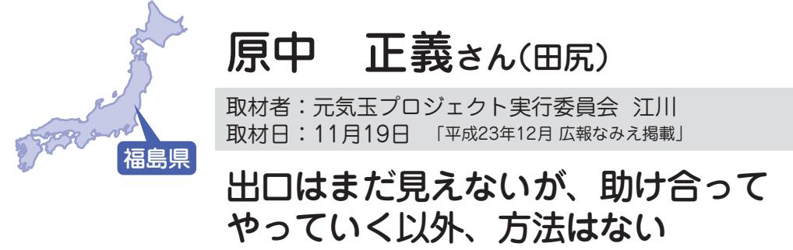

 田尻地区区長である中さんは、地域でともに暮らしてきた皆さんに「伝えたいこと」を抱えていました。 田尻地区としての今後の行政について。田尻の地で再び力を結集できることを願って、今できることから活動に取り組まれています。

震災直後は伊達市の親戚宅にお世話になっていましたが、 3 号機の爆発後、喜多方市へ避難し、現在は家族で市内の借上げ住宅に入居しています 。 避難直後のストレスから体調を崩した母も、ようやく生活のペースをつかみかけてきたようです 。 とはいえ、地元の方から 「 会津の冬は経験してみたいと、わがんねがらなし 」 といった言葉を耳にするなど、いまだ先行きの不安は消えません 。 それとともに、温暖で穏やかな浪江での生活がつくづく懐かしく思い出されます田 。 尻地区は、 3 月に期末監査

握に努める 。 以上です 。 一時帰宅で目にした故郷の荒れた姿は、何とも情けなく、もどかしさを感じました 。 自宅復帰を果たすには原発事故の早期収束が前提になりますが、避難解除になれば、この先、地域としてやるべきことは山のように出てくるはずです 。 一方で、今現在、借上げ住宅や仮設住宅に入居していても、生活上の問題はひっきりなしに発生し、どこまでいっても出口はなかなか見えてきません 。 当面、助け合ってやっていく以外方法はないのだと思います 。 これまで田尻地区の皆さんと連絡を取る方法がなく、困っていました 。 今回、このように 「 広報なみえ 」「 浪江のこころ通信 」 を通じて、田尻行政区の情報もお伝えできたこと、感謝しています 。 皆さん、今どのように過ごされているのでしょうか 。 この難局を乗り越え、田尻の地で、また皆さんと元気に会いたいものです 。 その日がくることを切望しています 。

## 石井あかねさん(小5)(棚塩)

取材者:(特活)市民公益活動パートナーズ松田取材日:11月14日 「平成23年12月広報なみえ掲載」

## 「おうちでのんびりしたいなぁ」

 仮設住宅の向かいにある佐原小学校は定員一杯になっているので、毎日スクールバスで少し離れた荒井小学校まで通っている小学5年生。

 初めは浪江町の津島に避難し、二本松市や福島市土湯温泉町を経て7月末に福島市佐原の仮設住宅に引っ越してきました。 けいすけ

 お父さんとお母さん、弟の京輔くん(小3)と妹のあゆみちゃん(小1)の5人暮らしで、おばあちゃんたちも同じ仮設住宅の別棟に避難しているので、いつでも会いに行けるそうです。

■ みんな元気にしてるかな ? 学校は弟と妹も一緒で、毎日 12 人でバスに乗ります 。 しのぶ台からも同じくらいの人数が乗って、みんなで通っています 。 バスの中では、トランプなどのゲームをしたり、本を読んだりしているから、けっこう楽しいですよ 。 友だちもたくさんできて学校も楽しいけど、女子のチームがないので浪江でやっていたソフトボールができないのがちょっと残念かなぁ 。 走るのは、どっちかというと短距離よりも長距離の方が好きで、練習のときには 6 年生と一緒に走って 4 位だったので、学校の記録会でどんな記録が出せるか楽しみです 。 最近は、算数が好きになってきました 。 それから国語とかも好きです 。 将来は、お医者さんのような人を助ける仕事につければ良いなぁと思っています 。 3 月の地震のときは、ちょうど 5 校時目が終わるところで、 4 月から幾世橋小学校の 1 年生になる妹にあげるプレゼントを作っていました 。 最初は、「 小さな地震かな ? 」 と思ったけど、けっこう大きな地震だったので驚きました 。 まわりでは泣く子もいて、自

| か 学 な ぁ 校 と に 考 行 え く て と い き る は と 、 こ 寒 ろ く 。 な い | 雪 が 降 ら な い の で 、 ど う し よ う | が ス あ り キ ま ー せ と か ん 。 は 浪 全 江 然 で や は っ あ た ま こ り と | る の が 苦 手 。 | こ れ か ら 冬 に な る と 、 寒 く な | 忘 れ る こ と も あ り ま す け ど ね 。 | び に 出 か け る と き は 、 と き ど き | て い ま す よ 。 で も 休 み の 日 に 遊 | 体 育 の と き 以 外 は ち ゃ ん と つ け | 渡 さ れ た の で 毎 日 つ け て い ま す 。 | 9 月 か ら は 放 射 線 の 線 量 計 が | 元 気 に し て い る よ | ■ 寒 い の は 苦 手 だ け ど 、 仮 設 で |  | と 難 し い な ぁ … 。 | だ っ た け ど 、 こ ん な ん じ ゃ ち ょ っ | ア ク セ サ リ ー を 買 う の が 楽 し み | 鉛 筆 の か わ い い も の や い ろ ん な | 友 だ ち と 「 サ ン プ ラ ザ 」 で 、 | な か な か 会 え な い で す よ 。 | 外 に 行 っ ち ゃ っ た 人 も い る か ら 、 | ん ま り 連 絡 で き な い し 、 遠 く 県 | ど 、 近 く に 避 難 し て い る 人 も あ | 浪 江 の 友 だ ち に も 会 い た い け | ま し た 。 | に 戻 っ て 、 ま た 校 庭 で 待 っ て い | 寒 く て ジ ャ ン パ ー を 取 り に 教 室 | ら の 迎 え を 待 っ て い る と き に 、 | み ん な で 校 庭 に 避 難 し て 家 か | と し て い ま し た 。 | 分 は 泣 か な か っ た け ど ボ ウ ゼ ン |
|--------------------------------------------------------------------------------------------------------------------------------|--------------------------------------------------------------------|-------------------------------------------------------------------------------------------------------------------------------------|----------------------------|---------------------------------------------------------------|--------------------------------------------------------------------|--------------------------------------------------------------------|--------------------------------------------------------------------|--------------------------------------------------------------------|-------------------------------------------------------------------------|---------------------------------------------------------------|--------------------------------------|--------------------------------------------------------------------|--|--------------------------------------|-------------------------------------------------------------------------|--------------------------------------------------------------------|--------------------------------------------------------------------|---------------------------------------------------------------|----------------------------------------------------------|-------------------------------------------------------------------------|--------------------------------------------------------------------|--------------------------------------------------------------------|---------------------------------------------------------------|------------------|--------------------------------------------------------------------|--------------------------------------------------------------------|--------------------------------------------------------------------|---------------------------------------------------------------|--------------------------------------|--------------------------------------------------------------------|
|--------------------------------------------------------------------------------------------------------------------------------|--------------------------------------------------------------------|-------------------------------------------------------------------------------------------------------------------------------------|----------------------------|---------------------------------------------------------------|--------------------------------------------------------------------|--------------------------------------------------------------------|--------------------------------------------------------------------|--------------------------------------------------------------------|-------------------------------------------------------------------------|---------------------------------------------------------------|--------------------------------------|--------------------------------------------------------------------|--|--------------------------------------|-------------------------------------------------------------------------|--------------------------------------------------------------------|--------------------------------------------------------------------|---------------------------------------------------------------|----------------------------------------------------------|-------------------------------------------------------------------------|--------------------------------------------------------------------|--------------------------------------------------------------------|---------------------------------------------------------------|------------------|--------------------------------------------------------------------|--------------------------------------------------------------------|--------------------------------------------------------------------|---------------------------------------------------------------|--------------------------------------|--------------------------------------------------------------------|

をして、ゆっくりしたいです 。

ようにジャンパーも持って行っているけど、雪が降ったら雪合戦をしたり雪だるまがつくれるかな 。 仮設住宅では、弟や妹と仲良くしていますよ 。 ちょっとケンカもするけど、妹には優しくするようがんばっています 。 でも、部屋が狭くて、近所の迷惑にもなるから大きな声が出せないので、早く浪江のうちに帰りたいな 。 うちに帰ったら、地震ですごいことになっているので片づけ

▲仮設住宅の部屋で (仲良し3姉弟(右:あかねさん、中:あゆみちゃん、左:京輔くん))

 麗奈さんは、震災後、親戚何人かで福島県内から埼玉、神奈川へと転々と移動し、5月初めに現在の川崎市宮前区にお母さんとおばあちゃんと3人で暮らしている。現在は、家族と支え合いながら、転校した中学校で元気に頑張っている。

私は、友だちの家で遊んでいるときに、あの地震にあいました 。 中学校のグラウンドに逃げたあと、役場に無事避難することができました 。 友人の大浦清華ちゃんが、この地震で亡くなったことが本当に悲しいです 。 あの日、もし一緒に遊んでいたら無事でいられたのではないかと悔やまれて仕方ありません 。 私のおじいちゃんは、地震のとき、親戚の初七日で双葉町郡山に出かけていました 。 慌てておばあちゃんと一緒に請戸の自宅に戻

▲(左から)麗奈さんと祖母のナカさん

|             | 私 は 今 の 中 学 校 で 、 仲 の よ い           |
|-------------|-------------------------------------------------------------------------|
|             | 心 配 で す 。                                                   |
|             | ス を 抱 え て い る の で は な い か と      |
| 待 っ て | 毎 日 の 生 活 や 仕 事 の 中 で ス ト レ      |
| よ う に | に 話 し か け る こ と が 多 い で す 。      |
| た 友 だ | と き ど き た め 息 を つ き な が ら 私      |
| 浪 江 町 | で 体 調 を 崩 し 入 院 し た り 、 今 も      |
| て 頑 張 | す 。 お 母 さ ん は 、 避 難 生 活 の 中      |
| 将 来      | と 元 気 で い ら れ る の に と 思 い ま      |
| う こ と | 戸 の 人 た ち が 周 り に い た ら 、 も っ |
| ん に 似 | が 気 が か り で 、 以 前 の よ う に 請      |
| 動 し て | 一 人 で 寂 し そ う に し て い る こ と      |
| 間 と      | け て く れ る お ば あ ち ゃ ん で す が 、 |
| 民 謡 を | ま す 。 家 で は 私 に 元 気 に 話 し か      |
| と が 好 | 葉 で 話 し た い と い つ も 言 っ て い      |
| は 、 短 | 浪 江 の 皆 さ ん と 請 戸 の な ま り 言      |
| で す 。 | に 一 人 で い る お ば あ ち ゃ ん は 、      |
| と 活 動 | 話 し 相 手 も な く マ ン シ ョ ン の 中      |
| て い て | か と か わ い そ う で な り ま せ ん 。      |
| ニ ッ ト | る と 、 ど ん な に か つ ら い 気 持 ち      |
| は 、 な | ん で い る お ば あ ち ゃ ん を 見 て い      |
| と は 何 | た ま ま で 逃 げ て き た こ と を 悔 や      |
| や っ ぱ | れ ま し た 。 お じ い ち ゃ ん を 残 し      |
| な が ら | 見 て 、 通 り が か り の 車 に 助 け ら      |
| 1 週 間 | ち ゃ ん は 押 し 寄 せ て く る 津 波 を      |
| 知 の サ | よ う で す 。 玄 関 口 に い た お ば あ      |
| ム 「 W | に い る と 思 っ て 2 階 に あ が っ た      |
| い る 浪 | た 。 お じ い ち ゃ ん は 、 私 が 部 屋      |
| ま す 。 | た よ う で 、 す ぐ に 津 波 が 来 ま し      |
| 友 だ ち | る と 地 域 の 皆 さ ん は 避 難 し て い      |

ちもできて楽しく通ってい 。 8 月には、私も所属して浪江のよさこい踊りのチーWonderなみえ 」が、高サマースクールに招待され、間本場のよさこいに参加しらみんなと過ごしました 。 ぱり浪江の友だちに会うこ何よりもうれしいです 。 私なみえ焼そばを応援するユト 「 NYTS 」 にも所属して、イベントなどでみんな動していたことが懐かしい 。 亡くなったおじいちゃん短歌や川柳、民謡を歌うこ好きで、郷土を思い請戸のを作ってCDにしたり、仲民" 謡バンド " を組んで活ていました 。 私もおじいちゃ似たのか、音楽や人前で歌とが大好きです 。 来はアニメの声優をめざし張りたいです 。 いつか必ず町に戻りたい 。 仲の良かっだちと一緒に遊んで、前のに暮らせる日がくることをいます 。 ナイツ

## 小山恒雄さん(高瀬)

取材者:ビーンズふくしま味川取材日:11月11日 「平成23年12月広報なみえ掲載」

### 再び会える日を心待ちにして

 二本松市の借上げ住宅で避難生活を送っている小山さん。「故郷を離れて8カ月。浪江にまた帰りたいという気持ちは強くなります。」

今は、二本松の借り上げ住宅に住んでいます 。 8 畳 2 間 。 前の生活と違って不便・不自由もありますが、そうも言っていられません 。 昔は学校とか町の活動がありましたが、今は何もなく、人との交流もありません 。 役場に行けば人に会うことができますが、普段の暮らしの中で交流がないのが寂しいです 。 退職後、ゴルフが唯一の趣味でした 。 地震にあったのもその帰り道 。 あと 10 分、その道を通るのがずれていたら、津波にあっていたかもしれないと言われました 。 浪江町は、自然がいっぱいの美しいふるさとです 。 緑が多く海あり山ありで、町をはさんで二つの川が流れ、鮭が遡上していきます 。 大堀相馬焼とか昔ながらの伝統工芸も盛んで、落ち着いた雰囲気の誇れる町です 。 先日、「 ふるさとに戻りたい 73 % 」「 戻らない 27 % 」 という双葉郡住民の調査結果が報道されました 。 原子力発電所の廃炉まで 30 年と言いますが、私たちは 10 年がいいところです( 笑 )。 放射能は怖いけど、浪江町に帰

りたいという気持ちの方が強いです 。 浪江町にもどることができたら、まず今までおつきあいのあったたくさんの方 々 一人一人に会いたい 。 そして、ゴルフもしたいです 。 元 々 親睦のあった方とは現在も月に一度会って親睦を深めていますが、数人の親戚とは電話のみで、震災後まだ一度も会っていません 。 早く浪江に戻れる日が来てほしいです 。 今一番期待しているのは、科学の力 。 除染の方向にもっと進歩してほしいと思っています 。 散布すると放射能が消えてしまう … というようなものをつくってほしいです 。 そういうことには、いくらお金を使ってもいい 。 これから 30 年は長すぎます 。 ラジウムの発見から 1 1 0 年 。 放射能を消去するような新しい物質の発見を期待します 。 今後の要望は … 風評被害をなんとかしてほしいと思います 。 気持ちは分かりますが、そういったもののほとんどは、無知からくるものだと思っています 。 地域で開催される懇談会でも参加

> でも、役場の人も頑張っています 。 私は今できることから、そして皆で力を合わせ前向きにやってほしいと思っています 。

▲(左から)恒雄さんと奥さまのセツ子さん

者の怒りの声がよく聞かれます 。

で働きながら、来春からの野菜

## @田秀光さん(室原)

取材者:ひろしま市民活動ネットワークHEARTtoHEART竹内・小川取材日:11月23日 「平成24年1月広報なみえ掲載」

### 離れて暮らせど、心はいつも浪江にあり

 浪江町室原に7人家族でお住まいだったd田さんご夫婦は、現在、東広島市志和町在住。息子さん夫婦と孫2人は広島市内、おばあちゃんは東京と離れて暮らす。志和町では田畑を借り、来春からの農業再開を目指して、働きながら有機栽培による野菜作りを学んでいる。

■ 7 人家族は県外避難震災当日、仕事をしていたら地震がきました 。 すぐに高台の墓地へ避難しました 。 幸い自宅は海から 8 ㎞ 離れていて、津波からは逃れることができました 。 その後は体育館へ避難し、当日の夜は電気もない体育館で家族みんな過ごしました 。「 地震が収まれば、 1 〜 2 日間ぐらいですぐに自宅に戻れる 。」 と軽い気持ちでいました 。 ところが、息子の友人が東電に勤めていて、電話で ( 原発が ) 危ないっていうんです 。 体育館にはテレビもラジオもなかったから、周りの誰もそんな話を信じませんでし

| う ! | や り ま し ょ           | そ し て 2 年           | 助 会 の み ん           | の こ と は 頭           | れ そ う に な           | ず っ と 居 る           | 少 し ず つ で                | た い と 思 い           | 何 と か 野 菜           | き な い か ら           | 支 援 ば か り           | せ ん 。 支 援           | ま し た が 、           | で き 、 連 絡           | 被 災 者 同 士           | 災 者 交 流 会           | で は ( 広 島           | 草 が 生 い 茂           | た と き に は           | 帰 宅 を し ま                | た で す 。 こ           | 震 災 後 の                | ■ 今 、 思 う | て い ま す 。 | 有 機 栽 培 で           | 機 栽 培 の 情                | い に 参 加 し           | に 入 り ま し           | 作 り に 備 え           |
|--------|---------------------------------|---------------------------------|---------------------------------|---------------------------------|---------------------------------|---------------------------------|--------------------------------------|---------------------------------|---------------------------------|---------------------------------|---------------------------------|---------------------------------|---------------------------------|---------------------------------|---------------------------------|---------------------------------|---------------------------------|---------------------------------|---------------------------------|--------------------------------------|---------------------------------|---------------------------------|-----------------------|-----------------------|---------------------------------|--------------------------------------|---------------------------------|---------------------------------|---------------------------------|
|        | う 。 ぜ ひ や り ま | 毎 の 花 見 は み ん | な 、 毎 年 の 新 年 | か ら 離 れ ま せ ん | り ま す 。 で も 、 | と 部 落 民 の 名 前 | き て い く と 思 う け | ま す 。 野 菜 づ く | づ く り を 軌 道 に | 。 自 立 す る た め | 受 け て い て も 自 | は あ り が た い け | 最 近 は 出 か け て | も 取 れ る よ う に | で 顔 を 合 わ せ て | を 開 催 し て く れ | 市 の ) 社 協 さ ん | っ て い ま し た 。 | 、 茎 の 太 く な っ | し た が 、 2 度 目 に | れ ま で に 2 度 の | こ の 8 カ 月 は 長 | こ と                |                       | や っ て み よ う と | 報 が 入 手 で き た の | た こ と で 、 野 菜 | た 。 福 島 県 人 会 | て い ま す 。 機 械 |
|        | し ょ                          | な で                          | 会 、                          | 。 共                          | 浪 江                          | を 忘                          | ど 、                               | り は                          | 乗 せ                          | に も                          | 立 で                          | ど 、                          | い ま                          | な り                          | 話 も                          | て 、                          | が 被                          | 広 島                          | た 雑                          | 戻 っ                               | 一 時                          | か っ                          |                       |                       | 思 っ                          | で 、                               | の 有                          | の 集                          | も 手                          |

た 。 12 日午後 3 時半過ぎに原発

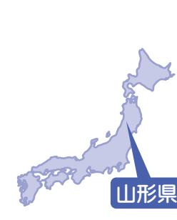

今野瀬楠さん(小6)・秀哉くん(小4)(川添) せなしゅうや

取材者:NPO法人山形の公益活動を応援する会・アミル柴田取材日:12月6日 「平成24年1月広報なみえ掲載」

### 今度会うときは元気で会おうね

 今野さんご一家は4人家族。現在、お父さんは二本松市に単身赴任中。お母さん、瀬楠さん、秀哉くんはお母さんの実家のある山形県大江町でおじいちゃんおばあちゃんと一緒に暮らしています。

■ 瀬楠さんの話今は、本郷東小学校という学校にバスで通っています 。 前の学校よりもクラスの人数が少ないですが、先生も友だちのように接してくれて楽しく通っています 。 友だちのお家へもバスで遊びにいくのですが、バスが 2 時間に 1 本しかないので乗り遅れると大変です 。 浪江では 「 サンプラザ 」 に友だちや家族と買い物に行って遊んでいたのですが、今は近くにお店が全然ないので不便です 。 お父さんは、二本松市で仕事をしていて月 2 回くらいしか会えないのですが、お母さん、おじいちゃんおばあちゃんが近くにいてくれて、いとこも遊びにくるので寂しくないです 。 お父さんとはときどき電話で話しています 。 帰ってきたときは、オセロを一緒にしたり、買い物や遊びに行くのが楽しみです 。 地震の後、仲の良かった友だちとばらばらになっちゃったけど、この前福島市と二本松市の仮設住宅で暮らしている友だちに久しぶりに会えてとてもうれしかったです 。 浪江小学校の先

生も手紙やスキー合宿のときの写真を送ってくれました 。 先生、ありがとうございました 。 浪江に戻ったら前のように、一緒にゲームをしたり、みんなで買い物に行ったり、また友だちと遊びたいし、浪江のおいしいいくらやお寿司も食べたいです 。 今度会ったときは、みんな元気で会いたいです 。 ■ 秀哉くんの話地震が起きたとき、小学校にいて帰りの会をしていました 。 すぐにグラウンドに避難しました 。 泣いている子もいたり怖がっている子もいたりしたけど、お母さんがすぐに迎えにきてくれて安心しました 。 今一番楽しいのは、友だちと遊んでいるときやお父さんが帰ってきたときに家族で出かけるときです 。 今は近所の友だちのお家に自転車で行って遊んだり、外で遊んだりすることがおもしろいです 。 これから山形は雪が積もるので大変だけど、雪だるまが作れればうれしいです 。 友だちと冬休みは雪で遊ぼうって

> の方言にも慣れて自分も話せるようになりました 。 浪江町のお祭りといえばたくさんの屋台が出る 「 十日市祭 」 が懐かしいです 。 なみえ焼きそばもまた食べたいなぁ 。 あと、請戸港の鮭をとるところを見学に行ったことも思い出です 。 この前、仙台にいる友だちに会うことができて、とても元気になりました 。 まだ会ってない友だちもいるので元気かどうか知りたい 。 また一緒に遊びたいです 。

▲大江町のお母さんの実家にて(左:瀬楠さん右:秀哉くん)

約束しています 。 最近は、山形

阿久津雅信さん(権現堂)

取材者:NPO法人あきたパートナーシップ高杉取材日:11月24日 「平成24年1月広報なみえ掲載」

### みんなでまた一緒に暮らしたい

▲新しい職場での阿久津さん

 大地震が起きたときはばらばらになっていた家族も、なんとか中央公園などに一時避難することができ、その後、なかなか見えない状況に不安感を抱きながらも、とにかく家族一緒に北へ北へと避難。今は、阿久津さんも奥さんも職を得て希望を持って暮らしています。

地震は、この世の終わりかと思うぐらい揺れたよ 。 自分は西台の現場でエアコンの仕事をしていたし、妻と息子は自宅、娘は友人宅とばらばらでした 。 中央公園に避難したということで確認はできたけれど、父は店の確認などてんやわんや 。 そうこうするうちに大津波警報がでて、とにかく山のほうに避難するようにということだったので、高台グラウンドに行き、そこで夜までいて、それから浪江中学校の体育館に移動しました 。 朝方、

警察が来て総理大臣の命令により 「 原発から 20 ㎞ 以内は、避難してください 。」 と言われ、今度は津島地区の活性化センターに避難したんです 。 そこには新潟からの救援物資が届いていて、その素早さには感激でした 。 私も交通整理などを手伝いしていると午後 3 時くらいかな ? 原発の爆発による煙らしきものを見つけ、テレビのニュースを確認すると原発が爆発していました 。 「 放射能は大丈夫なのか ? 」 知識がほとんどない自分は、とにかく家族を連れさらに遠くに逃げるしかないと、とりあえず福島を目指しました 。 ガソリン不足、スーパーは物不足とあって、どこに行くあてがあったわけではないので福島の駅裏で一泊、競馬場で一泊、さらに山形県の米沢のホテルに 3 泊と転 々 としました 。 聞いてください ! こんな大変な状況の中でも肘折温泉 ( 山形県 ) で 5 日間いたときにね、当時 1 歳の息子がはじめて歩いたんですよ 。 本当にうれしかった 。 山形に避難中に由利本荘市の同業者から連絡があり、その方ひじおり

> の紹介で由利本荘市の 「 ぽぽろっこ 」 というところに滞在しました 。 ここには由利本荘市のおかげで無料で滞在できました 。 その後、住む場所も確保できたので、家族 7 人で暮らしています 。 浪江町は、いいところですよ 。 山も海も川もあり、コンパクトで生活するにはちょうどいい大きさの町で、気候的にも暮らしやすいです 。 由利本荘市では皆さん良くしてくださるし、食に関する活動のつながりの知人もいるので楽しく暮らすことができています 。 だからといって、町を捨てたわけじゃない 。 今まで一緒に暮らしてきた町の人と一緒に暮らせるところがあれば、最高ですね 。 同窓生たちもどうしているのか気になっていますしね 。

## 栃本信重さん(立野)

取材者:中越沖復興支援ネットワーク水戸部取材日:12月6日 「平成24年1月広報なみえ掲載」

### 戻れるものなら明日にでも戻りたい気持ちです

 浪江町でガス屋さんに勤務していた栃本さんは、被災直後から町内のボンベの点検等に奔走した。12日には南相馬市小高区にある金房小学校に避難をはじめ、その後各地の避難所を転々としたのち、新潟県に避難した。

新潟県

11 日の夜、倒れたガスボンベの確認等の仕事を終えて家に着いたのは午後 8 時ごろでした 。 家には富岡町に住む次男と、妻と孫がいました 。 被災時に浪江町にいた次男が家にいてくれたことは、今考えると非常に助かりましたし、安心できました 。 電気は使えませんでしたが、ガスが使えたので次の日の朝はご飯を食べることもできました 。 その後すぐに避難指示の放送が

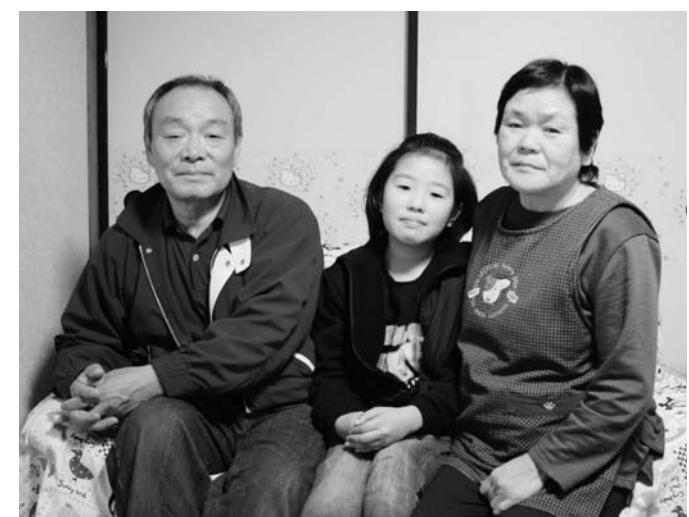

▲現在は妻と孫の3人で暮らしています。 (左から信重さん、楓ちゃん、操さん)

山本江利子さん(樋渡) 取材者:NPO法人ちば市民活動・市民事業サポートクラブ風間・鍋嶋取材日:12月2日 「平成24年1月広報なみえ掲載」

## 「十日市」で友だちに会えてうれしかった

4 月 3 日から 3 人の娘たちと千葉県市原市五井のアパートで生活しています 。 夫は福島に単身赴任中です 。 長女の花音は小学 4 年生、次女の花奏は幼稚園の年長組、三女の響花は 3 歳です 。 夫が音楽好きで、三人とも音楽にちなんだ名前をつけました震 。 災後、福島県内の避難所を転 々 としました 。 パンとおにぎりだけの食事の繰り返しとお風呂に入れなかったこと、末娘の夜泣きがひどく、私と母とで交代で抱っこしていたことなど思い出されます 。 3 月半ばに、東京の義妹のマンションに避難、半月間暮らしました 。 おおぜいで暮らす大変さはありましたが、蛇口から水が出る暮らしは、ありがたかったです 。 ここでの生活は、車がなく買い物など不便を感じています 。 長女に妹たちの世話を頼んで留守番してもらい、私一人で急いで買い物に行くこともあります 。 次女の幼稚園の送迎も、三女と私の 3 人で路線バスを利用して行きます 。 でも、長女が妹たちの面倒をよく見てくれるので、かのんかなできょうか

とても心強いです 。 夫は月に 2 回は帰ってきます 。 夫の負担を考えると、今はそれ以上のことは望めません 。 できるなら浪江に帰って、家族一緒に暮らしたいですね 。 子どもたちは、浪江の小学校や保育園の先生や友だち、おじいちゃん、おばあちゃんに会いたいと言います 。 長女は、浪江のお友だちと文通をしています 。 学校のことなどを書いているようです 。 私も、浪江の職場の方 々 には良くしていただいたので会いたいですね 。 11 月に二本松で開催された 「 十日市 」 では、友だちや職場の人たちと会うことができ、とてもうれしかったです子 。 どもが小さいので大変なこともあります 。 でも、おおぜいの人たちに支えられて何とかできています 。 全国に散らばっている学生時代の友人たちとは、mixi ( ミクシー ) で連絡を取り合っていて、必要な物を伝えると集めて送ってくれます 。 当初、千葉では避難者の受け入れ体制ができておらず、民間の住宅を探して、すべて自費での

> 準備でした 。 つい最近、市原市でも借り上げ住宅の提供が決まり、 12 月 8 日に引っ越すことになっています 。 しばらく、ここで頑張りたいと思いますが、早くまた浪江のみんなに会いたいですね 。

▲左から奏ちゃん、響花ちゃん、江利子さん、花音ちゃん

近藤公孝さん(大堀) きみよし

取材者:NPO法人市民公益活動パートナーズ佐藤取材日:12月9日(京月窯再興初の火入れの日)「平成24年1月広報なみえ掲載」

## 妻、京子さんの京月窯再興にこぎつけ、次は自身の今後も

 大堀に住んでいた「福島いこいの村なみえ」の支配人の近藤さんは、原発事故後転々 とした後、12月から妻京子さんの大堀相馬焼京月窯兼自宅として、福島市飯坂町平野の古民家に京子さんと義父母と暮らし始めました。「福島いこいの村なみえ」の今後に奔走しつつ、京子さんの京月窯再興をアシスト。「ここを窯元の場でもあるけど大堀同様人々のコミュニティの場にもしたいんだ。」と語ってくださいました。

た

女

す

時

た

る

と

の

女

い

も

「

と

窯

ま

古

■

▲妻京子さんの作品の前で。

京月窯の火を福島で再び実は今日は、朝からここに作っ窯に初めて火を入れまして、房は窯から離れられないんで 。 新しい窯の加減を知るため、間を追って窯の温度を記録しり、窯の状態を逐一観察してんです 。 あれから 9 カ月、やっここまでこぎつけました 。 先見えない避難生活を続ける中、房が 「 このままでは居られな 。」 と言い出しまして、不安ありましたが、私もどこかでこのままで居るのは違う 。」 思うようになり、福島でまたが持てないか、あれこれ探しした 。 そんなとき、この地の民家を紹介され、一目で気に

| か 得 て て ま 落 と い を な 村 ふ ホ ス し し 思 ッ ら な し ち く な と タ る 思 ま た い と 「 い ま 着 ご み 、 ッ か い っ 。 ま す 福 虚 っ い 利 え 遠 フ な 出 た す る 今 島 し た た 用 」 方 と 。 し こ 。 ひ ま い さ こ ら い を か は お ま と と で 無 こ を と 、 た 常 ら 今 会 す 。 と の 我 い 感 。 喪 だ 宿 「 も い 。「 き 人 暮 夢 の じ す 失 い と 福 交 し で 生 ら 中 ど 村 ま べ 感 た し 島 流 す 設 し で た う な す て に お て い が 。 計 が し い さ み 。 に 襲 客 幾 こ あ が 変 た ま な え こ 禁 わ れ さ 度 い り 狂 わ が た 。」 」 れ じ っ っ れ 、 て ま と の 、 、 |
|------------------------------------------------------------------------------------------------------------------------------------------------------------------------------------------------------------------------------------------------------------------------------------------------------------------------------------------------------------------------------------------------------------------------------------------------------------------------------------------------------------------------------------------------------------------------------------------------------------------------------------------------------------------------------------------------------------------------------------------------------------------------------------------------------------------------------------------------------------------------------------------------------------------------------------------------------------------------------------------------------------------------------|
| 所 の な 類 物 を っ 回 ス 簿 も し た り タ も 取 ま 「 に ッ 何 ら し 福 奔 フ も ず た 島 走 の な の 。 い し 今 い 避 原 こ ま 後 中 難 発 い し に 、 で 事 の た 、 散 、 故 村 。 慣 り 当 後 な そ れ 散 初 は み ん ぬ り は 取 え な 役 」 に 書 る                                                                                                                                                                                                                                                                                                                                                                                                                                                                                                                                                                                        |
| で 後 を な は 避 、 み 私 れ 、「 ま 難 仕 え の で し 上 」 今 福 を て げ の は 島 仕 き る 止 、「 い 上 た 日 ま こ 福 げ 方 々 っ い 島 々 で て の い へ す し 村 こ 炊 。 ま な い き 震 っ み の 出 災 た え し 」 直 時 村                                                                                                                                                                                                                                                                                                                                                                                                                                                                                                                                                                                                                                        |
| ■「 と の 大 年 入 思 た 堀 の り 福 い た の 家 ま 島 ま ず 家 に し い し ま を 住 た こ た い ほ ん 。 い 。 に う で 大 の 、 ふ い 堀 村 こ つ ま で な こ と し も み し さ た 築 え か せ か 1 」の な る ら 5 こ い こ 、 0                                                                                                                                                                                                                                                                                                                                                                                                                                                                                                                                                                                                                                   |

| く だ さ い 。 | た い ま ら す 、 。「 み な 浪 さ 江 ん 」 ぜ に ひ 会 足 い を た 運 く ん な | を 変 え て 、 か も し だ せ た ら と | み え 」 の 癒 し が 、 こ こ で か た | て い ま す 。「 福 島 い こ い の 村 | 語 る 場 に な っ た ら い い な と 思 | の 人 た ち が や っ て き て 、 浪 江 | し た い な と 思 っ て い ま す 。 浪 | 香 り や お し ゃ べ り を 楽 し む 場 | 品 の 茶 碗 や 茶 器 で 、 コ ー ヒ ー | ふ ら っ と や っ て 来 て 、 女 房 の | よ う に 、 お 客 さ ま や 近 隣 の 人 | で な く 、 大 堀 で も そ う で あ っ | で す が 、 こ こ を 窯 元 と し て だ | 窯 主 で あ る 女 房 も 言 っ て る | の 集 ま る 場 に | ■ 福 島 の 京 月 窯 も 大 堀 同 様 、 | 定 め ね ば と 思 っ て い ま す 。 | 今 度 は 私 の 今 後 を 、 そ し て 業 | の 仕 上 げ に 区 切 り が つ い た な ら り わ い |
|-----------------------|---------------------------------------------------------------------------------------------------------------------------------|---------------------------------------------------------------|---------------------------------------------------------------|-----------------------------------------------------------|---------------------------------------------------------------|---------------------------------------------------------------|---------------------------------------------------------------|---------------------------------------------------------------|---------------------------------------------------------------|---------------------------------------------------------------|---------------------------------------------------------------|---------------------------------------------------------------|---------------------------------------------------------------|----------------------------------------------------------|----------------------------|---------------------------------------------------------------|----------------------------------------------------------|---------------------------------------------------------------|-----------------------------------------------------------------------------------|
|                       | で っ                                                                                                                          | 思                                                             | ち                                                             | な                                                         | っ                                                             | を                                                             | 江                                                             | に                                                             | の                                                             | 作                                                             | が                                                             | た                                                             | け                                                             | ん                                                        |                            | 人                                                             |                                                          | を                                                             | 、                                                                                 |

▲福島市飯坂町平野の京月窯 (看板も移設)

### ここ笹谷は本当にいいところ人情の厚さが身に染みます

 津波で流されてしまった請戸の家は、大工をしている息子さんが建てた広い家で、息子さん夫婦や孫とともに暮らしていらっしゃいました。畑仕事をする一方、絵手紙や老人会、筋力トレーニングなどを大いに楽しんでいたそうです。

あの震災のときは、お友だちの家でお茶のみをしていました 。 津波警報の中、自転車で帰宅し、仕事が休みだった息子と孫の 3 人で車に飛び乗り、 「 福島いこいの村なみえ 」 に向かいました 。 翌日 12 日には浪江高校津島校に移りましたが、断水のためトイレも使えず、配給されたのはおにぎり 1 つ 。 寝泊まりするにも通路が狭く、大変でした 。 3 日目には川俣町の公民館に移動し、病院勤めのため患者さんとともに避難していた嫁とやっと合流

▲福島市笹谷東部のご自宅にて、たくさんの絵手紙とともに。

| に を た 通 が 訪 だ り 咲 出 ね き が い た た ま か て と                                                                                 | し り い き て ま い た の て に た 。 ご 、 、 た だ そ 夫 そ 大 、 い れ 妻 の 木 絵 て を が に 花 に い 描 縁 教 の 見 ま で え 名 事 き す お て 前 な に 。 家 い を 花 表                                                                                                                                                                                |
|----------------------------------------------------------------------------------------------------------------------------------------------------------------------------------|------------------------------------------------------------------------------------------------------------------------------------------------------------------------------------------------------------------------------------------------------------------------------------------------------------------------------------------------------------------------------------------------------------------------------------------------------------------------------------|
| り ま 寧 を し な さ た お せ 。 見                                                                                                                         | 今 舞 で で い 心 も を 尽 絵 送 く 手 っ し 紙 て の で く 品 や だ と り さ ご 取 い 丁                                                                                                                                                                                                                                                                                                                                 |
| 段 る で と ん ボ の し に な ー で た 、 に ル お 。 感 も                                                                                 | 返 私 謝 気 し 事 も で 遣 た を 絵 涙 っ 。 出 手 が て 見 し 紙 止 い 知 た を ま た ら と 描 り だ ぬ こ い ま い 方 ろ て せ た に 、 い ん こ こ                                                                                                                                                                                                                             |
| だ 家 た の 路 い さ の 経 家 大 た い あ 験 で 震 ん ま る を 半 災 で                                                             | あ お 年 で す 激 り 持 間 被 。 励 が ち の 害 そ の た で 避 を の 絵 さ 、 難 受 方 手 を 家 生 け は 紙 伝 族 活 、 、 を え や を 娘 阪 い て 住 さ さ 神 た く む れ ん 淡 だ                                                                                                                                                                           |
| ま 事 の 島 た な は ほ 人 し 方 が 市 。 る 北 ど で た か あ 笹 そ 家 塩 世 茨 。 ら り 谷 し 」 原 話 城 | ま 東 て で 村 に 県 で と 部 そ き し 6 避 の な の 仮 ま た て 月 の 難 ぺ り 孫 設 し 。 も 2 生 ン 、 娘 後 住 た 兵 う 日 活 シ 4 の す 宅 。 れ 庫 に を ョ 月 家 ぐ に し に 県 、 送 ン 下 に 入 西 い こ り 「 旬 1 家 居 宮 出 の ま 木 か カ 族 し 市 来 福 し に ら 月 4 |

折、帰り際に雨が降り出し、震災後は外出時に手押し車が手放せないのですが、それをわざわざ車に乗せ、私を送ってくださる途中、お食事まで一緒に頂きました 。 別の方にはお茶飲みにとお家に誘われ、私の大好きな柿をたくさん頂いたりもしました 。 この笹谷には人情が厚い方が多いのでしょうか 。 本当にご近所の方 々 には親切にしていただいています 。 時折、住宅には福島大学の学生さん方が足湯とマッサージのボランティアに来てくださいます 。 若い男子学生さんに昔の言葉を教えながら楽しく過ごしたり、集会所で開かれる毎週水曜日のリハビリテーションや、健康チェックを兼ねたお茶飲み会も重宝しています 。 本当に感謝していますが、先ごろ作られたという 「 ふるさと浪江の歌 」 を聞くたびに、やはり浪江に帰りたいと思います 。 ですが、息子たち若い人たちの考えも大事にしなければならないと自分に言い聞かせているところです 。

## 堀喜久子さん(請戸)

取材者:高崎経済大学櫻井研究室櫻井・竹内取材日:1月15日 「平成24年2月広報なみえ掲載」

## 浪江・請戸のきれいな星空、そして隣近所とのつながりがなつかしい

 堀さんは、震災後、親戚を頼って大熊、船引、本宮、そして埼玉県蕨市などを転々とし、昨年3月末から狭山市の借り上げ住宅で、夫の浩喜さんと娘の真理子さんと3人暮らし。 請戸で一緒に暮らしていた8人の家族は離ればなれとなっています。

浪江では権現堂で 「 源喜 」 という居酒屋をやっていました 。 夫が 8 年前に開いたお店で、息子や娘たちに支えてもらいながら、家族で力を合わせ頑張っていたところでした 。 請戸の自宅は津波で流され、お店も食器などが散乱したままです 。 私自身は、震災後、一時帰宅も含め、一度も浪江には戻っていません 。 変わり果てたまちを見ることで、逆につらくなるのではないかとも思ってしまいます 。 今は、こ

▲真理子さん(左)と喜久子さん

れから先のことも考えられずにいます 。 ふり返ってみると、これまで家族でもほとんど話し合ってはきませんでした 。 板前としてお店を頑張ってきた夫のことを思うと、これからの話に踏み込むことにも心が痛みます 。 できれば、以前のように家族みんなが同じ屋根の下で暮らせる日が来てほしいです 。 こちらでは、地域の民生委員さんや近所のお店の方からよく声をかけていただきます 。 また、狭山市では月に 1 回、このまちに住む被災者を集めた 「 まごころ昼食会 」 を開催してくれます 。 毎回 80 名の方が集まりますが、唯一、話ができる場所です 。 ですが、それ以外は福島の方とも、まして浪江町の方 々 と話す機会はなく今日まで過ごしてきました 。 もっと話ができる場が欲しいですね 。 震災後、娘は町民の皆さんと津島に 3 月 15 日まで避難していました 。 報道にもあるように線量が高い所にしばらくいたことが気がかりです 。 ホールボディカウンター検査は、福島ではなく、もっと身近なところででき

> ないものでしょうか 。 できるだけ早く受けさせたいです 。 借り上げ住宅の期間が延長になるのかどうかも気がかりです 。 いま住んでいるところは周囲に畑などがあるので、浪江を思い出して少し安心できます 。 浪江では、仕事が終わると必ず見上げていたきれいな星空に、いつもホッとしていたことがなつかしいです 。 人情に厚く、温暖な気候で自然も食べ物も豊かだった浪江の暮らしがどんなに大切なものだったかを思い出します 。 そして、あらためて浪江では周囲の方 々 に支えられて生きてきたことを実感します 。 隣近所の皆さんに心からお会いしたい 。 それまで家族で支え合って頑張って行きます 。

 松%さんの避難先だった山形県東置賜郡高畠町で行われた昨年秋の第47回総合体育祭・ソフトボール大会に浪江町チームとして出場し、見事、準優勝。

 散り散りとなって避難生活を送る浪江の仲間たちとともに、再びスポーツができた幸せを噛みしめると同時に、「仲間との再会と高畠町との交流の場、時間を与えてくださった町に、心からお礼が言いたい。」と開口一番、話してくださいました。 そして、「チームとして記事になったこの『浪江のこころ通信』を、お世話になった高畠町のみなさんに届けに行きたい。」とのことでした。

▲チームを代表してお話ししてくださった松~さん(右)、小桧山さん(左)

■ まず、代表である松 ~ 光平さんにお聞きしましたチーム名である 『 浪江大吉SSB 』 は、高畠町の大会に出場するために結成した合同チームの名前ですが、 「 大吉 」 には訳があります 。 昨年 10 月 2 日に行われた体育祭に出場するきっかけを作ってくださったのが 「 やきとり大吉 」 のご主人、伊藤健彦さんなのです 。 各避難所を転 々 とし、たどり着いた高畠町武道館で途方に暮れていたころ、明かりが灯る店があり、温かい食事とお酒をいただいたことが親しくなるきっかけでした 。 町の体育祭に出場させていただけるなどとは思いもよりませんでしたが、 「 何とかしますから ! 」 の声に励まされ、東京・群馬・福島・宮城など各地で暮らす仲間たちに連絡を取り、 11 人の仲間が集まりました 。 実はこの避難中、チームの仲間の 1 人を亡くし、悲しみのどん底にいたメンバー

に、希望の光を与えてくれた出来事となり 「 今しかない ! 」 という思いが余計に強かったと思います 。 浪江町で町の大会に毎年出場していたSSBと、小桧山さんの 「 パイ山社中 」 との合同チームを結成し、試合に出場することになったものの、球技用具もなく、練習もゼロでした 。 それでも大会当日は和気あいあい、珍プレー好プレー満載の楽しいひとときを過ごせました私 。 たちには 「 大きな野望 」 があります 。 各地に避難している仲間たちの地域でソフトボール大会に参加させていただくことです 。 そのために仲間には 「 この現状を理解し、今ある生活を最大限生き抜こう 。」 と言っています 。 さまざまな場所での暮らしがあると思いますが、楽しいことを一つでも探して、前へ進むことが僕たちには必要だと思って

います 。

> 山形県置賜郡高畠町第47回総合体育祭・ソフトボール大会の賞状をチームに授与する協会会長高橋英助さん ▲

トロフィーを受け取るチーム代表 ▲

■ 「 こういう支援もあるのだと気づかされました 。」 と、小桧山司キャプテン二本松の体育館と裏磐梯、そして今の仮設住宅では、多くの方 々 から義援金や生活支援物資をたくさんいただき、本当にありがたいことだと思っています 。 しかし高畠町の支援は少し違いました 。 大吉の伊藤さんや高畠町ソフトボール協会会長の高橋英助さんをはじめ多く人たちが、私たちに集まれる場所と時間を提供することで応援をいただきました 。 他の地域のチームを町の大会に参加させるなど、なかなかできないことです 。 山形新聞も地元ケーブルテレビ局も大きな話題として取り上げてくださいました 。 原発事故によって避難を余儀なくされているけれど、今住んでいる地域でアンテナを高くして前向きに暮らしています 。

『浪江大吉SSB』のメンバーたち後列右から伊藤健彦さん(やきとり大吉)、松~智恵さん(マネージャー)、木幡健一さん、熊谷徹さん、島田有紀さん、本田隼也さん、小荒井雅治さん前列右から平田邦之さん、枡谷拓郎さん、山崎徹さん、松~光平さん、小桧山司さん

#### **『浪江大吉SSB』メンバーからのコメント** (選手は五十音順、カッコ内は現在の居住地)

- ●熊谷徹さん(福島県相馬市) 一日一日を大切に歩んでいきましょう!がんばっぺ浪江町!!
- ●小荒井雅治さん(福島県郡山市) ソフトと避難生活、どちらもホームに帰ることが大事だ。座布団一枚!
- ●小桧山司さん(福島県二本松市) まほろばのスウィングガールズ巡らせて高畠ワイン母を誘ふ
- ●木幡健一さん(福島県南相馬市) あの苦しいときに出会えた高畠の人たちの温もりと、仲間との絆を胸にこれからも頑張っていきたいです。
- ●島田有紀さん(福島県二本松市) SSBは、こういうときこそみんなの絆で優勝を目指し新たな未来を作っていきたいです
- ●平田邦之さん(群馬県館林市) 高畠町の皆々さま、お世話になりました。 頑張っぺSSB頑張っぺ浪江町やっちゃうべ ×2
- ●本田隼也さん(福島県南相馬市) 浪江SSBの絆は一生の宝物です!
- ●枡谷拓郎さん(福島県南相馬市) 高畠最高!SSB最高!! メンバー100人目指して頑張ります。そして株式会社SSB設立!
- ●松% 光平さん(宮城県仙台市) 喜びも悲しみも明日への力に変えて。俺は貴方の分まで笑って生きる!
- ●松% 智恵さん(マネージャー)(宮城県仙台市) みんなと久々に会えて安心しました。
- ●山崎徹さん(宮城県仙台市) SSBは絆の強いチーム。その仲間の一員にいることは誇りです。

 浪江町牛渡から那須塩原市に避難生活を送っている山田義行さん。

 震災前に同居していた息子さん夫婦とは仕事の関係で離なれ、奥さんと2人暮らしを送っています。

3 月 11 日の震災の翌日、朝食を食べていたら防災無線から避難指示の放送が流れました 。 すぐに帰れると思って位牌だけ持って着替えも持たずに避難しました 。 最初の避難先で事の深刻を感じ東京方面に避難しようとしましたが、途中で親切な塙町の人たちと出会い 3 月末までそこの公民館に避難しました 。 4 月から親類のいる静岡県で 9 月ま

> という意味で

ました 。 この

浪江町へ帰る

きたいです 。

▲お孫さんの写真をバックに夫婦で撮影

| で 避 難 生 活 を 送 り ま し た 。                | ま す 。                               |
|-------------------------------------------------------------------------|-------------------------------------------|
| い ず れ の 避 難 先 に お い て も 地           | 若 い こ ろ か ら 人           |
| 元 の 人 た ち か ら 至 れ り 尽 く せ り      | て て 震 災 前 ま で は      |
| の 待 遇 で 、 お 世 話 に な っ た 皆 さ      | 達 成 す る こ と が で き |
| ん に 対 し て 非 常 に 感 謝 し て お り      | そ れ が 70 歳 を 過 ぎ     |
| ま す 。                                                             | 上 げ た も の の 多 く      |
| 最 終 的 に は 浪 江 町 に 近 く 、 車           | ま っ た こ と に つ い      |
| な ど で 帰 る の に 都 合 の 良 い 栃 木      | 残 念 で な ら な い で      |
| 県 の 那 須 塩 原 市 で 10 月 か ら 避 難     | い つ の 日 か 帰 れ           |
| 生 活 を 送 る こ と に し ま し た 。           | 震 災 前 の 生 活 の リ      |
| 今 住 ん で い る と こ ろ は 団 地 の           | し た い で す 。 そ し て |
| よ う な 土 地 な の で 、 私 が 以 前 住      | て い た プ チ ト マ ト      |
| ん で い た と こ ろ よ り 近 所 づ き あ      | 物 件 の ア パ ー ト を      |
| い が 少 な い の で 積 極 的 に 外 出 し      | も ら い た い で す 。      |
| て い ろ い ろ な 人 に 声 を か け て 、      | 婦 の 家 族 と と も に      |
| こ の 土 地 の 人 た ち と 関 係 を 築 こ      | 生 活 を 取 り 戻 し た      |
| う と 行 動 し て い ま す 。                          | に は 若 い 人 た ち が      |
| 私 た ち の 住 ん で い た 地 域 は も           | せ る ま ち づ く り を      |
| と も と 漁 業 と 農 業 し か 産 業 と 呼      | ば な り ま せ ん 。           |
| べ る も の が な く 、 若 い こ ろ 農 閑      | 今 年 い た だ い た           |
| 期 は 出 稼 ぎ な ど を し て い ま し た 。 | 陽 来 復 」 と い う 字      |
| 原 子 力 発 電 所 を 一 般 企 業 の 工           | が あ り ま し た 。 悪      |
| 場 と 同 じ よ う に 誘 致 す る こ と で 、 | た 後 に 幸 運 が 来 る      |
| 仕 事 場 が 増 え 地 元 が 潤 う と 思 っ      | 良 い 言 葉 だ と 思 い      |
| て い ま し た が 、 今 回 の 震 災 の 結      | 言 葉 を 胸 に 抱 い て      |
| 果 を 見 る と 私 が い か に 原 子 力 発      | 日 を 夢 見 て 生 き て い |
| 電 所 や 放 射 能 と い う も の に 対 し      |                                           |
| て 無 知 で あ っ た か を 痛 感 し て い      |                                           |

生の計画を立は何とか順調にきていました 。 ぎて今まで築きくを無くしてしいては、非常にす 。 れる日が来ればリズムを取り戻て、軌道に乗っトを育て、賃貸を修復し住んで 。 そして息子夫に 6 人の家族でたい 。 そのためが安心して暮らを実現しなけれた年賀状に 「 一字を書いたものいことがあっ

## 清水昭子さん(酒田)

取材者:とちぎボランティアネットワーク徳山取材日:1月15日 「平成24年2月広報なみえ掲載」

### 震災前の仲間たちと元のように暮らしたい

 浪江町酒田から両親の出身地の栃木県に避難した清水さん。 昨年末に同県那須塩原市に7回目の転居を経て、父親のライフワークともいえる趣味の家庭農園ができる家が見つかり、やっと腰を落ち着けて生活できる場所にたどり着きました。

震災時と避難については、地震発生時建物の被害はほとんどありませんでしたが、防災無線で原子力発電所の事故による避難指示が出ました 。 そのときはすぐ帰れると思って、着の身着のまま避難しました 。 避難地域が拡大したことで最初に避難した場所もまた避難しなくてはならない状況になり、両親の出身地でもあり親類もいる栃木県に避難場所を決めて避難生活をすることに決めました 。 栃木県に避難してしばらく大田原市に身を寄せていましたが、昨年 12 月に父の趣味である家庭農園ができる住宅が見つかりそこへ移り住むことができました 。 避難先では地元の人たちの温かい支援を受けることができたので本当に感謝しています 。 私たちが住んでいたのは、酒田川原というところで海が見えるところでありませんが、近くに鮭が遡上する川があり、山並みの風景があり、白鳥が飛来してくる湖など自然が豊かな場所です 。 しかも生活するうえでも

| 思 い 生 活 し て い ま す 。 | の よ う に 暮 す こ と が で き た ら と | ん が 、 震 災 前 の 仲 間 た ち と 以 前 | の か は 今 の 段 階 で は わ か り ま せ | い つ 浪 江 に 帰 れ る 状 態 に な る | で き ま し た 。 | 暮 ら せ る 場 所 を 見 つ け る こ と が | と が で き て 、 家 族 が 落 ち 着 い て | 今 現 在 な ん と か 仕 事 に 就 く こ | じ て い ま す 。 | で 情 報 入 手 に つ い て は 不 便 を 感 | 今 現 在 パ ソ コ ン を 持 っ て な い の | と 、 パ ソ コ ン が 必 要 に な り ま す 。 | 積 極 的 に 情 報 を 得 よ う と す る | 感 じ る こ と が あ っ た り し ま す 。 | に は ち ょ っ と し た こ と で 不 便 に | 福 島 県 民 だ と 栃 木 県 で 暮 ら す | て い る の か 心 配 で す 。 | し 、 庭 の 植 木 の こ と も ど う な っ | 今 の 家 の 状 態 が 良 く わ か ら な い | 宅 に 帰 る こ と が で き な い の で 、 | 困 っ て い る こ と は 、 自 由 に 自 | ま す 。 | 少 々 不 便 な 場 所 に 感 じ て し ま い | に 比 べ る と 今 住 ん で い る 場 所 は | と て も 便 利 な 場 所 で し た 。 そ れ |
|------------------------------------------------|--------------------------------------------------------------------|--------------------------------------------------------------------|--------------------------------------------------------------------|---------------------------------------------------------------|----------------------------|--------------------------------------------------------------------|--------------------------------------------------------------------|---------------------------------------------------------------|----------------------------|--------------------------------------------------------------------|--------------------------------------------------------------------|-------------------------------------------------------------------------|---------------------------------------------------------------|--------------------------------------------------------------------|--------------------------------------------------------------------|---------------------------------------------------------------|------------------------------------------------|--------------------------------------------------------------------|--------------------------------------------------------------------|--------------------------------------------------------------------|---------------------------------------------------------------|-------------|--------------------------------------------------------------------|--------------------------------------------------------------------|--------------------------------------------------------------------|
|------------------------------------------------|--------------------------------------------------------------------|--------------------------------------------------------------------|--------------------------------------------------------------------|---------------------------------------------------------------|----------------------------|--------------------------------------------------------------------|--------------------------------------------------------------------|---------------------------------------------------------------|----------------------------|--------------------------------------------------------------------|--------------------------------------------------------------------|-------------------------------------------------------------------------|---------------------------------------------------------------|--------------------------------------------------------------------|--------------------------------------------------------------------|---------------------------------------------------------------|------------------------------------------------|--------------------------------------------------------------------|--------------------------------------------------------------------|--------------------------------------------------------------------|---------------------------------------------------------------|-------------|--------------------------------------------------------------------|--------------------------------------------------------------------|--------------------------------------------------------------------|

▲父正一さんの開墾中の家庭農園をバックに3人で

## 泉田沙織さん(権現堂)

取材者:地域社会デザイン・ラボ遠藤取材日:1月15日 「平成24年2月広報なみえ掲載」

### 子どもたちが戻れる浪江町になって欲しいと願っています

 震災後、新潟県の妙高高原の国立青少年自然の家に避難。その後、6月末に仙台市青葉区中山に移りました。現在は、子ども2人と3人暮らし。夫と義母は福島市在住のため別居生活を送っています。

仙台での暮らしは、近くにスーパーや医院、郵便局などがあり便利ですが、家が密集しているので窮屈さを感じます 。 また、浪江では季節に 1 〜 2 回しか降らなかった雪も、仙台では降る日も多く、積雪は多くないですが道路や階段が凍るのでひやひやしながら歩いています 。 子どもたちには、底にスパイクがついている靴を準備したところです 。

▲右から、沙織さん、百合香ちゃん、圭一くん、征慶さん仙台市内のアパートにて

|                       | セ ン タ ー で 遊 ぶ の も 好 き で し た 。 |
|-----------------------|-------------------------------------------------------------------------|
|                       | が 買 い 物 を し て い る 間 に ゲ ー ム      |
| て い ま す 。 | ン プ ラ ザ に 行 っ て お ば あ ち ゃ ん      |
| て 浪 江 の 良 | 車 に は 乗 っ て い ま せ ん 。 あ と サ      |
| 江 の お い し | ろ は 坂 や 家 、 車 が 多 い の で 自 転      |
| こ と で す 。 | 好 き で し た 。 今 住 ん で い る と こ      |
| 飲 み 会 、 乾 | あ ち こ ち 走 り ま わ っ て 遊 ぶ の が      |
| 今 。 思 う の    | ラ モ デ ル を 作 っ た り 、 自 転 車 で      |
| す                     | を し た り 、 ゲ ー ム を し た り 、 プ      |
| 盤 整 備 に 関 | ご っ こ や ケ ー ド ロ ( 警 察 と 泥 棒 ) |
| ま し た 。 今 | た 。 学 校 が 終 わ る と 友 だ ち と 鬼      |
| 索 や 仮 設 住 | 浪 江 小 学 校 で は 3 年 2 組 で し           |
| 震 災 後 は 仕 | ■ 圭 一 く ん                                                   |
| る の で は な |                                                                         |
| 暮 ら し と 仕 | い な と 願 っ て い ま す 。                          |
| 車 道 が 早 く | ち が 戻 れ る 浪 江 町 に な っ て 欲 し      |
| 移 し 営 業 し | す が ・ ・ ・ 。 今 後 は 、 子 ど も た      |
| 会 社 事 務 所 | 報 が 得 ら れ る と 大 変 助 か る の で      |
| を 経 営 し て | 避 難 先 の 自 治 体 か ら 暮 ら し の 情      |
| い て い ま す | し て い な い 避 難 者 に 対 し て も 、      |
| 台 の 妻 と 子 | て い ま す 。 住 民 票 を 仙 台 市 に 移      |
| 住 ん で い ま | 役 場 か ら の メ ー ル 情 報 も 助 か っ      |
| 私 は 今 、      | と 知 り 合 っ て 聞 い た り 。 浪 江 町      |
| ■ 征 慶 さ ん | 浪 江 町 か ら 避 難 し て き て い る 方      |
|                       | わ せ し た り 、 同 じ 幼 稚 園 が 縁 で      |
| に 遊 び ま わ | 自 分 か ら 病 院 な ど 各 所 に 問 い 合      |
| の お 家 に 帰 | 合 っ た 近 所 の マ マ 友 に 聞 い た り 、 |
| る の が さ み | し た 。 幼 稚 園 の 送 り 迎 え で 知 り      |
| な の で 、 今 | て 情 報 を 収 集 す る の に 苦 労 し ま      |
| ぼ く は 、 お | は じ め の こ ろ は 、 仙 台 で 子 育           |

ばあちゃんが大好き

境に子どもが慣れてくれるのか

## 澤田裕美さん(川添)

取材者:NPO法人ビーンズふくしま佐藤取材日:1月13日 「平成24年2月広報なみえ掲載」

### 希望の光をみつけるまで

 川添に住んでいた澤田さん。現在、福島県郡山市熱海町の借り上げ住宅で、裕美さんの母、裕美さんご夫婦、2人の娘さん、愛犬とともに暮らしています。数カ所の避難場所を経て、熱海町で日常の落ち着きをとりもどしつつあります。

87 歳の祖父、 5 カ月の子どもを含め、私たち家族、いとこ家族、叔父、叔母で津島小学校、親戚宅、体育館、アパートを 14 人で時には離れ離れになりながら、転 々 としました 。 そんな中、室内犬を連れてきた母は、犬と一緒に車で寝泊りし、寒さをしのぐため体中にカイロを貼り、犬を抱きかかえて過ごしていました 。 犬の体重は 7 ㎏ も減り、私たち同様、動物にもストレスがかかっているのだと感じています 。 避難生活から 10 カ月、ようやく 1 ㎏ 戻ってきたんですよ 。 印象深かったのは、福島市に避難していたとき、見ず知らずのご高齢の女性が声をかけてくれて、大きい紙袋に衣類などの生活用品を入れて私にくださったのです 。 袋の下には 「 年金暮らしのしがないお金ですが 。」 というメモとともに 1 万円が入っていました 。 避難してる間、たくさんの方に優しい言葉をかけていただきました 。 名前も知らない方 々 ですが、本当に感謝しています 。 先の見えない不安がつらいですね 。「 どうせ移動しなくちゃ

私たちはとても不安でしたが、あっという間に幼稚園で友だちができました 。 大人が思っているよりも子どもはたくましく、安心しました 。 避難してる方で目標がもてない時期というのはつらいと思うのですが、自分の中に希望の光がみつけられれば楽になるんじゃないかなと思います 。

▲りりなちゃん(左)と裕美さん

森岡哲郎さん(大堀)

取材者:NPO法人市民公益活動パートナーズ古山取材日:1月12日 「平成24年2月広報なみえ掲載」

### 今年暮れまでは、私も桑折町自治会も正念場になりそうです

▲防犯協力の委嘱を受けた際、福島県福島北警察署長さんらとの記念写真をお持ちになって

> たと思っています 。

桑折の仮設住宅では、

0 人の自治会の副会長を

います 。 設立準備会から

最初は名簿作りや支援物

り扱いなど毎日のように

ましたが、 8 月に自治会

してからは、季節ごとの  大堀地区の役員をしていた森岡さんは、地震・津波災害発生当初から地区住民のお世話をされたそうです。原発事故による避難のため、一時福島を離れ、埼玉県狭山市に移住しましたが、現在は伊達郡桑折町の仮設住宅に、家族3人で暮らしています。

私は、井手にある宿泊施設を備えた農業や里山暮らし体験事業を行う会社に勤務し、 3 月 11 日は東京から 20 名の体験者を受入れてじゃがいも畑作りを行っていました 。 体験の方 々 は施設で一夜を明かし、翌 12 日朝に急きょバスで東京に戻っていただきましたが、なんと到着は 13 日になったそうです 。 一方、私は役員をしている約 1 2 0 戸の地区住民に老人福祉施設 「 やすらぎ荘 」 へ避難してもらい、炊き出しを行ったり、

| 月 下 旬 で す 。 浪 江 町 役 場 が あ る | 伊 達 郡 桑 折 町 に 移 っ た の は | ま し た 。 | 息 子 た ち 5 人 家 族 の 2 軒 を 借 | 母 と 私 た ち 夫 婦 の 3 人 家 族 と | 借 上 げ 住 宅 申 請 の 手 続 き を 行 い | ン に 入 居 し ま し た が 、 そ の 間 | 社 を 通 じ て 狭 山 市 の 民 間 マ ン シ | し た 。 そ の 後 、 埼 玉 に 移 り 、 | 山 の 義 姉 の 家 に お 世 話 に な り | 所 は 満 杯 だ っ た た め 、 結 局 、 | は 津 島 に 向 か い ま し た が 、 避 | 圏 内 に 広 が り 、 私 た ち 家 族 8 | 12 日 夕 方 に は 避 難 指 示 が 20 | 風 ヒ ー タ ー を 動 か し ま し た 。 | 持 ち 寄 っ た 発 電 機 で テ レ ビ や |
|--------------------------------------------------------------------|----------------------------------------------------------|------------------|---------------------------------------------------------------|---------------------------------------------------------------|--------------------------------------------------------------------|---------------------------------------------------------------|--------------------------------------------------------------------|---------------------------------------------------------------|---------------------------------------------------------------|---------------------------------------------------------------|---------------------------------------------------------------|---------------------------------------------------------------|------------------------------------------------------------|---------------------------------------------------------------|---------------------------------------------------------------|
|--------------------------------------------------------------------|----------------------------------------------------------|------------------|---------------------------------------------------------------|---------------------------------------------------------------|--------------------------------------------------------------------|---------------------------------------------------------------|--------------------------------------------------------------------|---------------------------------------------------------------|---------------------------------------------------------------|---------------------------------------------------------------|---------------------------------------------------------------|---------------------------------------------------------------|------------------------------------------------------------|---------------------------------------------------------------|---------------------------------------------------------------|

| た 。           | 連 絡 体 制 づ く り や 支 援 団 体 さ ん       |
|------------------|--------------------------------------------------------------------------|
| が 20 ㎞     | の マ ッ チ ン グ な ど 、 毎 週 行 う 役       |
| 族 8 人      | 員 会 の 議 題 が ど ん ど ん ハ ー ド か       |
| 、 避 難      | ら ソ フ ト へ 変 わ っ て き て い ま す 。  |
| 局 、 郡      | ま た 、 9 月 か ら は 福 島 北 警 察 署       |
| な り ま      | か ら 委 嘱 を 受 け 、 防 犯 協 力 者 と       |
| り 、 会      | し て 10 名 の 仲 間 と と も に パ ト ロ ー |
| マ ン シ ョ | ル も 行 っ て い ま す 。                                |
| の 間 に      | 自 治 会 設 立 か ら 約 半 年 に な り            |
| を 行 い 、 | ま す が 、 大 き な 成 果 と し て は 、       |
| 族 と 、      | 東 京 電 力 か ら 住 民 へ の 直 接 説 明       |
| を 借 り      | 会 や 原 子 力 賠 償 請 求 支 援 機 構 に       |
|                  | よ る 訪 問 説 明 会 の 開 催 、 年 末 年       |
| の は 6      | 始 の 防 犯 活 動 な ど で し ょ う 。 反       |
| が あ る      | 面 、 課 題 と し て は 、 住 民 の 大 多       |
| た が 、      | 数 を 占 め る 高 齢 者 の 引 き こ も り       |
| た 割 に      | へ の 対 策 、 集 会 所 を 活 用 し た さ       |
| み や す      | ま ざ ま な 活 動 の 参 加 者 を 固 定 化       |
| ん で み      | さ せ な い 工 夫 な ど が 挙 げ ら れ る       |
| く 、 山      | で し ょ う 。                                                    |
| よ か っ      | さ ら に 、 こ の 春 先 に は 避 難 地            |
|                  | 区 の 新 た な 線 引 き も 決 ま り 、 皆       |
| 約 4 0      | さ ん の 身 の 振 り 方 も 大 き な 問 題       |
| 務 め て      | と な り ま す 。 町 や 自 分 た ち の 土       |
| 関 わ り 、 | 地 へ の 思 い に 寄 り 添 い な が ら 、       |
| 資 の 取      | 除 染 や 復 興 恒 久 住 宅 の 確 保 な ど 、  |
| 活 動 し      | 人 間 ら し い 生 活 を 取 り 戻 す た め       |
| が 発 足      | の 支 援 を 進 め な け れ ば と 思 っ て       |
| 住 宅 環      | い る と こ ろ で す 。                                     |

二本松を希望していまし

桑折は比較的早く完成し

は入居率が低く、申し込

そうだと決めました 。 住

ると、浪江にも比較的近

や自然に恵まれており、

境整備の調査や提案、回覧など

## 大島信司さん(権現堂)

取材者:NPO法人市民公益活動パートナーズ佐藤取材日:1月14日 「平成24年2月広報なみえ掲載」

### 「町のしっかりとした方向性をきちんと決める」 ・・・難しいことはわかってるけど、やっぱり今一番考えたいことです

 JR浪江駅前で美容室「ビューティサロンちどり」と「ヘアデザインクリエーション」を経営していた大島さんは、原発事故後転々とした後、福島市内の借り上げ住宅に落ち着き、昨年11月3日に美容組合4店舗共同で「なみえ美容」を二本松市と福島市の仮設住宅内にオープンさせ、1月8日の成人式には浪江の新成人の 「一生の思い出」を心熱く支えました。

■ 浪江の新成人は浪江の美容師が支えたい昨年 11 月 3 日に、美容組合 4 店舗 ( 美容室ローズ、ビューティーサロン中里、ふたば美容室、ビューティサロンちどり ) 共同で、安達運動場仮設住宅 ( 二本松市 ) と北幹線第一仮設住宅 ( 福島市 ) 内に、「 なみえ美容 」 をオープンさせ、交代で運営しています 。 原発事故後転 々 としながら、何もしない生活には耐えられませんでした 。 仕事をして、生活にメリハリをつけたいと思いました 。 何よりお客さんのその後が気になって、リサーチのためにも、早く再開したいと思いました 。 昨年の 5 月ごろから、町役場と仮設住宅内で美容室を再開したいと交渉をはじめ、やっとオープンすることができました 。 成人式に間に合ってよかったです 。「 浪江の新成人の 『 一生の思い出 』 は、やっぱり浪江の美容師が支えなきゃ 。」 と思いましたから 。 十分な環境とは言えませんでしたが、新成人やその家族の皆さんのたくさんの笑顔を見ることができました 。「 若い人たちの明るさは町の活気だ 。」

| て 会 の い 場 ま な し ど た で 。 ま 不 ち 安 づ な く 思 り い に を 関 | 東 遊 記 の 専 務 を す る な ど 、 | す 。 震 災 前 は 、 ま ち づ く り | が 、 や っ ぱ り 今 一 番 思 う こ | 難 し い こ と は わ か っ て い | を き ち ん と 決 め る 」 | ■ 「 町 の し っ か り と し た 方 | 願 っ て い ま す 。 | も に リ フ レ ッ シ ュ し て ほ し | し い 、 来 て ほ し い 、 来 て 心 | を 、 多 く の み な さ ん に 知 っ | 提 供 し た い と 営 業 再 開 し た | 浪 江 の 美 容 師 た ち が そ ん な | 今 ま で 通 り と は い き ま せ ん | 菓 子 が あ り ま し た 。) | し た ソ フ ァ の 傍 ら に 、 お 茶 | い ま す 。( 取 材 者 : ゆ っ た | み え 美 容 」 が な れ た ら と 思 | 葉 に な っ て 出 る 、 そ ん な 場 に | た 口 か ら 少 し で も 思 い の 端 | ま が き れ い に な っ て 、 重 く | 瞬 間 が 、 私 の 喜 び で す 。 お | タ イ ル の お 顔 に 笑 み が こ ぼ | と 喜 ん で く だ さ る 、 そ の ヘ | お 客 さ ま が 「 き れ い に な っ た | ■ お 客 さ ま の 喜 び は 私 の 喜 | と つ く づ く 思 い ま し た 。 |
|---------------------------------------------------------------------------------------------------------------------------|----------------------------------------------------------|----------------------------------------------------------|----------------------------------------------------------|-----------------------------------------------------|-------------------------------------------|----------------------------------------------------------|---------------------------------|----------------------------------------------------------|----------------------------------------------------------|----------------------------------------------------------|----------------------------------------------------------|----------------------------------------------------------|----------------------------------------------------------|--------------------------------------------|----------------------------------------------------------|------------------------------------------------------|----------------------------------------------------------|---------------------------------------------------------------|----------------------------------------------------------|----------------------------------------------------------|----------------------------------------------------------|----------------------------------------------------------|----------------------------------------------------------|---------------------------------------------------------------|----------------------------------------------------------|-----------------------------------------------------|
| 抱 わ え っ                                                                                                          | 商 工                                                   | 会 社                                                   | と で                                                   | ま す                                              |                                           | 向 性                                                   |                                 | い と                                                   | 身 と                                                   | て ほ                                                   | こ と                                                   | 場 を                                                   | が 、                                                   |                                            | や お                                                   | り と                                               | っ て                                                   | 「 な                                                        | が 言                                                   | な っ                                                   | 客 さ                                                   | れ た                                                   | ア ス                                                   | ! 」                                                        | び                                                        |                                                     |

たままの今の状況から、現実的な除染とともに、骨太な大義がほしいと思っています、何とか希望を見出したいと 。 ニュータウン構想はどうだろう ? などとあれこれ思いをめぐらせています 。

「なみえ美容」二本松店(二本松市安達運動場仮設住宅内)で、妻昭子さんと ( 090-8924-1801) ▲

根岸淑子さん(立野) 「平成24年3月広報なみえ掲載」

浪江町の皆さん元気でお過ごしで

しょうか 。

遠くふるさとを想いながら机に向

かいました 。 現在、私は静岡県磐田

市に住んでいます 。 福島からはとて

も遠いので、ふるさとを思う気持ち、

皆さんと会いたい気持ちはひとしお

です

仮設住

のよう

った方、

ず、全

が、皆

ます 。

の痛み、

かちあ

家族で静岡県磐田市に避難する根岸さんからお手紙が届きました。

を紹介

るさと

。 私た

▲立野の風景(平成20年8月撮影)

| つ 3 2 1 け あ と 帰 美 秋 あ 桜 帰 に 鮭 あ み 帰 ふ ふ 「 て あ ど り し は あ 花 り ぎ の あ ど り る る ふ い 夢 ろ た か 紅 夢 咲 た わ ぼ 夢 り た さ さ も る 0 こ み に き い っ 葉 に く い い り に 豊 い と と |
|--------------------------------------------------------------------------------------------------------------------------------------------------------------------------------------------------------------------------------------------------------------------------------------------------------------------------------------------------------------------------------|
|--------------------------------------------------------------------------------------------------------------------------------------------------------------------------------------------------------------------------------------------------------------------------------------------------------------------------------------------------------------------------------|

▲これから"かまくら"になる予定の雪の山の前で撮りました。 左から、真於さん(中1)、颯一郎さん、おばあちゃんの門馬由利恵さんまお

 颯一郎くんのご家族は、震災直後、福島県内のおばあちゃんの家に逃げた後、3月15日におばさんのいる秋田県横手市増田町に避難しました。 現在お父さんは埼玉県内、お母さんは福島県内で仕事をしているために離れていますが、おばあちゃん、お姉さんと一緒に住んでいます。

■ 元気で頑張ってるよ浪江小学校は歩いて 3 分ぐらいで着いたけど、増田小学校は徒歩で 1 時間くらいかかるかな 。 でも、お友だちといっぱい話しながら行くから楽しいし、大変じゃないです 。 冬になってからは車で送ってもらっているけど、帰りはスクールバスです 。 今住んでいるおばさんの家は温泉宿で、地震の後には他にも避難してきた人たちが大広間にたくさんいました 。 宿は 1 0 0 年位の歴史があるみたいです 。

|                                                                    | ん 固 が め 言 て っ 作 て る ま ん し だ た よ 。 。」 で と き お 上 じ が っ さ |
|--------------------------------------------------------------------|--------------------------------------------------------------------------------------------------------------------------------------|
| ま す 。                                                        | 手 伝 っ て ま す 。「 少 し ず つ 踏 み                                                                       |
| る よ う に な れ る と い い な と 思      | そ れ を か" ま く ら " に し よ う と                                                                       |
| れ い に し て 家 族 で 一 緒 に 暮 ら      | れ た 雪 が 山 の よ う に な っ て て 、                                                                   |
| 浪 江 の 家 の 中 を 掃 除 し て 、           | お じ さ ん が 毎 日 雪 寄 せ し て く                                                                        |
| る の が 心 配 だ け ど 。                          | ま す 。                                                                                                                          |
| 近 く か け て 冬 の 道 を 運 転 し て      | 多 い し 、 寒 い の で び っ く り し て                                                                   |
| は 8 時 間 位 、 お 母 さ ん は 5 時      | 来 て た け ど 、 去 年 も 今 年 も 雪 が                                                                   |
| 来 る の が 楽 し み で す 。 お 父 さ      | 増 田 に は 今 ま で 何 度 も 遊 び に                                                                        |
| 週 末 に お 父 さ ん 、 お 母 さ ん           | ■ 遊 び に 来 て く れ る と い い な                                                                        |
| か っ た で す 。                                         | プ ロ グ ラ マ ー に な り た い で す 。                                                                   |
| 出 し て 競 い 合 っ た と こ ろ が 楽      | く の が 楽 し い ! 将 来 は ゲ ー ム の                                                                   |
| い ! わ っ し ょ い ! 」 大 き な 声      | 攻 略 本 を 読 ん で 、 ク リ ア し て い                                                                   |
| に 大 声 コ ン テ ス ト で 、「 わ っ し     | 一 番 好 き な も の は ゲ ー ム で 、                                                                        |
| を み ん な で 担 い で 回 っ て 、 最      | の が す っ ご く 楽 し か っ た 。                                                                             |
| 個 食 べ ず に 持 っ て る 。 お み こ      | 後 に 児 童 ク ラ ブ で 友 だ ち と 遊 ぶ                                                                   |
| プ 麺 に な っ た な み え 焼 そ ば を      | す の が 好 き 。 浪 江 の と き も 放 課                                                                   |
| 焼 そ ば は も ち ろ ん 大 好 き で 、 カ | ほ ど 元 気 に な っ た し 、 体 を 動 か                                                                   |
| い し い も の が い っ ぱ い 。 な み      | は 友 だ ち と ド ッ ジ ボ ー ル で 遊 ぶ                                                                   |
| 店 街 に 屋 台 が た く さ ん 並 ん で      | ち ゃ っ た ん だ け ど 、 休 み 時 間 に                                                                   |
| で と っ て も 楽 し か っ た で す 。      | 2 週 間 く ら い 前 に 肺 炎 に な っ                                                                        |
| き な お 祭 り が あ っ て 、 に ぎ や      | 部 で 走 り 幅 跳 び を や っ て い ま す 。                                                              |
| て 、 11 月 に 十" 日 市 " と い う         | 姉 ち ゃ ん も 言 っ て た か ら 、 陸 上                                                                   |
| 浪 江 で は 冬 に は お 祭 り は 無           | う 跳 べ る ん じ ゃ な い の !? 」 と お                                                                  |
| く れ る と い い な 。                               | の か 分 か ら な い け ど 、「 け っ こ                                                                       |
| ま だ 解 け な い か ら 、 遊 び に 来      | で 遊 ん だ り 、 登 校 で 鍛 え ら れ た                                                                   |
| 見 せ て あ げ た い な あ 。 雪 は ま      | に は り ん ご 畑 が あ り ま す 。 そ こ                                                                   |
| た ら 、 け い い ち 君 や み つ き 君      | 周 り は 山 で 囲 ま れ て い て 、 近 く                                                                   |

豊田久美子さん(高瀬)

取材者:(特活)ちば市民活動・市民事業サポートクラブ鍋嶋・長澤取材日:2月14日 「平成24年3月広報なみえ掲載」

子どもたちの笑顔が一番

震災の当日は子どもを連れてスパリゾートハワイアンズに出かけていたので、偶然にも津波の被害を免れることができました 。 帰り道の国道は走れない状態で、山道を 6 時間かけて帰宅しました 。 偶然が重なり、一家全員津波の被害を免れて無事でした 。 3 月 14 日には千葉市に住んでいる叔母を頼りに、親族 10 人で避難してきました 。 今は千葉市内の賃貸住宅に夫の両親、私と子どもたち 3 人の家族 6 人で住んでいます 。 震災から 1 年、避難生活をしながら子どもの成長を見守っていてあっというまに時が過ぎたように感じます 。 夫は原子力発電所関連企業に勤めていて、 4 月から福島県内で一人暮らしをしています 。 週末が休みのときは戻ってきてくれますが、身体のことが心配です昨 。 年の 3 月 18 日が長男の卒園式でしたが、震災で中止に 。 夏には卒園者の親子で再会を果たして、数カ月遅れの卒園式で手作りの卒園証書をもらうことができました 。 千葉では、入学した小学校でできたたくさんの友

だちとサッカーをしたり毎日元気よく遊んでいます 。 私は子どもの入園・入学をきっかけにママ友ができました 。 実家の両親は二本松の仮設住宅に移ったため、震災で離ればなれになったのが残念でなりません 。 携帯電話を使ったことのなかった両親でしたが、今では電話を通して連絡を取り合っています 。 移り住んではじめて、親戚の心強さを感じ、何より子どもたちの笑顔が一番だと実感しました 。 広報なみえの 「 浪江のこころ通信 」 を通して、知人の近況や元気な声、前向きな姿勢を知ることができ、元気づけられています 。 また、基本的な暮らし方が変わって戸惑うこともあります 。 それは、子どもに家で大きな物音を立てることはいけないことだと厳しく言ったり、ご近所さんの顔が見えなかったり、自由で私的な憩いの場である庭が少ないことです 。 とはいえ、周りの人がよく助けてくれるので、大きな困りごとはありません帰 。 れるものなら帰りたいとい

> うのが本音です 。 浪江で昨年 6 月に家を新築予定だっただけに、家を建てた後の夢や未来が見えなくなってしまい心残りです 。 また、福島で一人暮らししている夫、離散した親族、浪江での友人 … できることならみんなでいたいです 。 ですが、これから先いつ帰れるかもわからない現状では、今を楽しく生きる姿勢を大事にしています 。

▲左から萌絵ちゃん(5歳)、久美子さん、悠人くん(1歳)、大貴くん(7歳) もえゆうとだいき

## 堀川文夫さん(権現堂)

取材者:高崎経済大学櫻井研究室櫻井取材日:2月11日 「平成24年3月広報なみえ掲載」

### 「この震災がもたらした真実とは何か」 子どもたち、そして社会に向けて発信していきたい

 堀川文夫さんは、妻の貴子さん、そして愛犬ももと愛猫みかんとともに静岡県富士市で生活する。震災後も、浪江で経営していた学習塾の子どもたちを励まし、交流をくり返してきた。震災の経験と教訓をふまえ、新たな土地での歩みを始めようとしている。

私は震災前から、自分の塾に通う子どもたちに原発の危険性や避難方法などを伝えていました 。 まさか本当にこんなことが起こるとは思いませんでしたが、現在の線量でも危険性は否定できないはずです 。 そこに人 々 が暮らし続けることには違和感があります 。 浪江町として集団でどこか別の土地に移転するなども選択肢の一つでしょう 。 しかしそれどころか、これだけの災害に直面したにもかかわらず、わずか 1 年足らずで国内の原発も再稼働を容認するなど、何だか元の日本に戻ってしまうような危惧があります 。 あの大震災と原発事故が私たちの社会にもたらしたものは何か 。 私たちはどんな社会をめざすべきなのか 。 子どもも大人も真剣に議論すべきときではないでしょうか 。 あまりにも東北、福島、そして浪江町から声が上がらないことが残念です 。 できれば福島・浪江の皆さんと意見を交わしながらつながりをつくることのできる機会が欲しいですね 。 県内避難者に比べ、県外避難者への対応の足りなさを実感しています 。 また、 「 自主避難 」

という言葉でくくられた、東電と国の責任逃れの犠牲者たちへの対応の足りなさには腹立たしさを通り越して悲しくなります 。 実は私たち夫婦も、県外での暮らしについて昨年末までは気持ちの整理がつきませんでした 。 今はこの静岡の地で頑張って行こうと思っています 。 ただ、たとえどこに暮らしていても浪江町民という気持ちに変わりはありません 。 こちらでは、昨年 10 月に富士市近郊に避難している福島県民の交流会を主催しました 。 富士市内での防災シンポジウムや大学の講義への出演、そして富士市産業支援センターのサポートもあり、被災体験や防災教育、そして私自身がこだわってきた子どもの教育について話す機会を得ています 。 ようやくそのような心境になってきたということでしょうか 。 浪江では子どもを中心に語りかけてきましたが、これからは自分の経験や思いを積極的に社会に向けて発信して行こうと思っています 。 60 歳を迎える自分にもまだ社会に果たす役割があるのだと感じています 。

▲左から貴子さんと文夫さん

岡本亜矢さん(酒田)

取材者:高崎経済大学櫻井研究室櫻井取材日:2月11日 「平成24年3月広報なみえ掲載」

### 震災で直面したさまざまな経験を子どもたちの人生の糧にしてほしいと願う

 岡本亜矢さんは現在、夫の宗広さん、長女の梨瑚さん(中1)、次女のちりさん(小4)、そして愛犬のとん平と東京・町田市で生活する。震災後の4カ月間は、山形市内の総合体育館などの避難所で長く暮らした。 りこ

震災後、原発の影響を心配して、親戚がまとまって山形市の総合体育館に避難しました 。 避難所の生活環境は少しずつ変化しつつ、結局、子どもたちの夏休みまでの 4 カ月間をそこで過ごすことになりました 。 その間、近隣の方からお風呂を使わせていただいたり、物資を提供していただいたり、地域の皆さんには本当に温かい手を差し伸べていただきました 。 人のつながりの尊さを実感した 4 カ月間でした 。

▲左からちりさん、梨瑚さん、亜矢さん、とん平、宗広さん

その後、夫の仕事の関係で現在の東京・町田市に移りました 。 子どもたちも私たちも生活環境は浪江のときとは変わり、浪江のときの 1 学年 1 クラスの規模から、 8 クラスもある大規模校への転校 。 浪江では、夫の親・兄夫婦も身近な所にいましたが、今は福井県やいわき市などにバラバラに暮らしており、支え合って暮らしてきた以前のように、すぐに会える距離ではなくなってしまったことが残念です 。 姉の梨瑚はバトミントン部に所属して毎日頑張っていて、妹のちりも浪江のときに頑張っていた陸上をこちらでも続けています 。 浪江の陸上の監督が、震災後も合宿や大会があるたびに声をかけてくださり、クラブが存続していることに感謝しています 。 浪江とのつながりはこれからも大切です 。 今年の 3 月には、ふ' るさと学校 ' として浪江の小中学生が 1 泊で福島に集まることが予定されていて、とても楽しみです 。 これからも浪江町主催の交流の場には積極的に参加したいと思っています 。 夫とも子どものことはよく話

> し合います 。 何よりも放射線量のことが心配です 。 子どもたちが独立するまでは県外で頑張って行きますが、そのあとは浪江に帰りたいと思っています 。 行政の皆さんには、「 帰りたいという思いはあっても帰れない 」 という県外避難者の思いをぜひ考慮してほしいです 。 子どもたちは私たちに震災のことや浪江のことはあまり話してきませんが、きっと考えていることはあると思います 。 せめて震災があったから何かができなくなったではなく、震災によってこんな経験ができたのだと前向きにとらえ、人生の糧にしてほしいと親として願っています 。

## 渡邉正見さん(加倉)

取材者:地域社会デザイン・ラボ遠藤取材日:2月13日 「平成24年3月広報なみえ掲載」

### お店をオープンしました常連さんも増えていますよ!

 浪江町ではローソンのオーナーとして店舗を経営していた渡邉さん。被災後は、福島市や仙台市のホテルに移り住みながら、現在は家族3人で仙台市太白区に暮らしている。新たに仕事がはじまり忙しい毎日を送っている。

宮城県

浪江町では、ローソン店舗のオーナーとして無我夢中で働き、ようやく 12 年目を迎えたところでした 。 地域の皆さんにお店を愛していただいたことを思い出します 。 ようやく経営に慣れて、これからはスタッフに仕事を任せて浪江をもっと楽しんだり交流したり、あちこちに出かけたいと思っていた矢先の震災でした 。 とても残念です 。 震災直後は、ローソン本部か

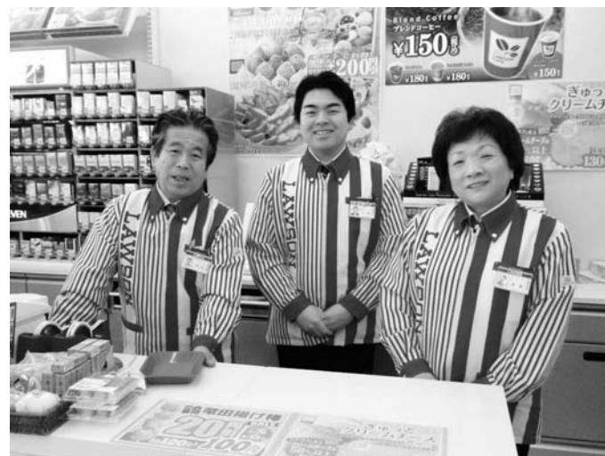

▲ローソン名取閖上店(宮城県名取市)のオーナーとなり、仕事が始まった。「ぜひお立ち寄りください!」 左から、正見さん、茂之さん、京子さん

| 域 が 明 る く な っ て 良 か っ た ! 」 | 域 の 方 か ら は 「 お 店 の お 陰 で 地 | た だ け る よ う に な り ま し た 。 地 | う に な り 、 常 連 さ ん に な っ て い | コ ミ ュ ニ ケ ー シ ョ ン が と れ る よ | 近 く に 住 ん で い る 住 民 の 方 と も | 者 ば か り で し た が 、 現 在 で は 、 | 開 店 当 時 の 来 店 者 は 工 事 関 係 | オ ー プ ン に こ ぎ つ け ま し た 。 | 間 の 準 備 を 経 て 昨 年 12 月 1 日 、 | ま し た が 、 出 店 を 決 意 し 1 カ 月 | ら ぬ 土 地 で の 出 店 で も あ り 悩 み | 良 く は あ り ま せ ん 。 ま た 、 見 知 | 人 も 少 な く 条 件 と し て は あ ま り | 地 域 で す 。 夜 は 真 っ 暗 で 、 住 む | の た め に 多 く の 家 屋 が 流 さ れ た | 店 」 で す 。 こ の 閖 上 地 区 も 津 波 | 紹 介 さ れ た の が 名 取 市 の 「 閖 ゆ り 上 あ げ | お 誘 い が あ り ま し た 。 そ の 際 に | ら 「 働 い て み ま せ ん か 。」 と い う | そ ん な と き に ロ ー ソ ン 本 部 か | 住 ん で い ま す 。 | 白 区 の マ ン シ ョ ン に 家 族 3 人 で | え る こ と に し 、 現 在 は 仙 台 市 太 | ら 遠 い こ と も あ り 宮 城 に 居 を 構 | の 物 件 も 探 し ま し た が 、 福 島 か | ら の 居 住 地 と し て 、 山 形 や 秋 田 | そ こ に 避 難 を し ま し た 。 こ れ か | 仙 台 市 に 確 保 し て も ら え た の で | ら 支 援 が あ り ホ テ ル を 福 島 市 や |
|--------------------------------------------------------------------|--------------------------------------------------------------------|--------------------------------------------------------------------|--------------------------------------------------------------------|--------------------------------------------------------------------|--------------------------------------------------------------------|--------------------------------------------------------------------|---------------------------------------------------------------|---------------------------------------------------------------|---------------------------------------------------------------------|--------------------------------------------------------------------|--------------------------------------------------------------------|--------------------------------------------------------------------|--------------------------------------------------------------------|--------------------------------------------------------------------|--------------------------------------------------------------------|--------------------------------------------------------------------|----------------------------------------------------------------------------------------|--------------------------------------------------------------------|---------------------------------------------------------------------|---------------------------------------------------------------|---------------------------------|--------------------------------------------------------------------|--------------------------------------------------------------------|--------------------------------------------------------------------|--------------------------------------------------------------------|--------------------------------------------------------------------|--------------------------------------------------------------------|--------------------------------------------------------------------|--------------------------------------------------------------------|
|--------------------------------------------------------------------|--------------------------------------------------------------------|--------------------------------------------------------------------|--------------------------------------------------------------------|--------------------------------------------------------------------|--------------------------------------------------------------------|--------------------------------------------------------------------|---------------------------------------------------------------|---------------------------------------------------------------|---------------------------------------------------------------------|--------------------------------------------------------------------|--------------------------------------------------------------------|--------------------------------------------------------------------|--------------------------------------------------------------------|--------------------------------------------------------------------|--------------------------------------------------------------------|--------------------------------------------------------------------|----------------------------------------------------------------------------------------|--------------------------------------------------------------------|---------------------------------------------------------------------|---------------------------------------------------------------|---------------------------------|--------------------------------------------------------------------|--------------------------------------------------------------------|--------------------------------------------------------------------|--------------------------------------------------------------------|--------------------------------------------------------------------|--------------------------------------------------------------------|--------------------------------------------------------------------|--------------------------------------------------------------------|

| と い し で ま す す 。 か 浪 ら 江 。 の 人 に 会 う と ホ | た 事 が の 、 都 今 合 後 で は 参 ぜ 加 ひ で 参 き 加 ま し せ て ん み で | 民 の み な さ ん の 交 流 会 に は 、 | 先 日 仙 台 で 開 催 さ れ た 浪 江 | て い ま す 。 | 取 り 組 ん で 行 こ う と 日 々 暮 ら | 生 計 を 立 て て い く た め に 仕 事 | て に す る よ り 、 自 分 で し っ か | い ま す 。 だ か ら こ そ 、 何 か を | う 戻 れ な い か も し れ な い と も | を 大 切 に し な が ら も 、 町 に は | の で は な い か 。「 ふ る さ と 浪 江 | 震 災 の こ と が 忘 れ ら れ て し ま | な る の か 、 み ん な に 福 島 ・ 浪 江 | り ま す 。 原 発 の 補 償 が 今 後 ど | こ れ か ら に つ い て は 不 安 が | だ い て い ま す 。 | 頑 張 っ て ね ! 」 と 応 援 し て い | 「 閖 上 の 中 心 に あ る お 店 だ か |
|--------------------------------------------------------------------------------------------------|--------------------------------------------------------------------------------------------------------------------------------|---------------------------------------------------------------|----------------------------------------------------------|-----------------------|---------------------------------------------------------------|---------------------------------------------------------------|---------------------------------------------------------------|---------------------------------------------------------------|---------------------------------------------------------------|---------------------------------------------------------------|----------------------------------------------------------------|---------------------------------------------------------------|--------------------------------------------------------------------|---------------------------------------------------------------|----------------------------------------------------------|---------------------------------|---------------------------------------------------------------|---------------------------------------------------------------|
| ッ                                                                                                | た し                                                                                                                         | 仕                                                             | 町                                                        |                       | し                                                             | に                                                             | り                                                             | あ                                                             | 思                                                             | も                                                             | 」                                                              | う                                                             | ・                                                                  | う                                                             | あ                                                        |                                 | た                                                             | ら                                                             |

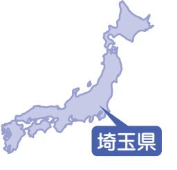

## 渡邉幸さん(権現堂)

取材者:高崎経済大学櫻井研究室櫻井取材日:2月10日 「平成24年3月広報なみえ掲載」

### '浪江は私たちのたった一つのふるさと' 娘の言葉に思いを新たに

 震災後、津島から福島市、新潟・三条市などを転々とし、現在は埼玉県所沢市に夫の良一さん、次女の喜沙羅さん(小6)、長男の魁杜君(中1)、そして愛犬のクレヨンと暮らしている。ご両親は福島市に、大学生の長女・未佳里さんは仙台におり、家族は離れたままである。 きさらかいとみかり

今生活している所沢市は、夫の出身地であり、仕事の関係もありやってきました 。 現在の住まいに移る際には、所沢市役所の職員の方に誠意ある熱心な対応をいただきました 。 あらためて、人のつながりやご縁が大切であることをこの震災を通して実感しています 。 こちらの学校に通う 2 人の子どもも、学校に慣れ親しんでいることにホッとしています 。 ただ、夫の仕事の先行きが不安なこと、そして何よりも浪江町のこれからが見えないため、先のことを何も決められないことが悩みです 。 この春に政府が決定する新たな避難区域がどのようになるのかも心配です 。 私たちは、父の代から長年、権現堂でガソリンスタンドを経営していたこともあり、お店に来られる浪江町の皆さんや、地域のつながりは本当になつかしいです 。 子どもたちは、権現堂の商店街の夏祭りで太鼓をしたり、ママさんバレーをしていた私は、行政区対抗のスポーツ大会などを楽しんでいたことを思い出します 。 原発事故によって、

こうした地域のつながりが失われたことが寂しく悲しいです 。 ですが、今も商店街の皆さんが声をかけてくださり、時折、十日市などが開かれるたびに二本松に行っています 。 ありがたいことだと思っています 。 私たちの避難先は、どちらかと言えば浪江町よりも都会であったり便利であったりもします 。 長女がいる仙台もそう 。 ややもすると、知らず知らずのうちにその便利さに安住してしまうのではないかと気になっていました 。 そんなとき、長女から 「 仙台や福島もいいけれど、浪江はやっぱり私たちのふるさと 」 との言葉を投げかけられ、ハッとしました 。 遠くに暮らしていても、帰ろうと思えば帰ることのできる心の支えこそがふるさと 。 これからどんなことがあっても、ふるさと浪江を子どもたちに残さなければならない 。 そんな思いを新たにしています 。 今は子どもの安全を優先して県外にいますが、これからも浪江町の皆さんとのつながりは大切にしていきたいです 。 数日後、埼玉で開催される町民交流会な' みえ

> のしゃべり場 ' にももちろん参加します 。 それぞれつらいことが多くあっても、私たちのふるさと浪江を心の支えに前に進んで行きましょう 。

▲左から魁杜君、良一さん、喜沙羅さん、幸さん

## 高木真智子さん(室原)

取材者:NPO法人市民公益活動パートナーズ古山取材日:2月12日 「平成24年3月広報なみえ掲載」

### みんな、元気にしていますか?

 南相馬市小高区の祖母の家から郡山の親戚宅、県境に隣接する白河郡西郷村の国立那須甲子青少年自然の家、そして猪苗代リゾートホテルでの避難を経て、昨年7月過ぎから福島市のシンボル、信夫山の麓の借り上げ住宅に、祖父、ご両親との4人で暮らしています。

▲ご両親と一緒に。

羽

島

に

| で し た      | ち の 安 否 が と て も 気 が      |
|------------------|-----------------------------------------------------|
| 、 私 が      | た                                                   |
| 園 で は 、 | 私 。 自 身 は 午 後 8 時 ご         |
| で し た 。 | る こ と が で き た も の で      |
| 庭 に 避 難 | 仕 事 で い わ き に 出 か け      |
| か ら バ ス | 巻 き 込 ま れ た 保 護 者 の      |
| 避 難 し ま | 10 時 に よ う や く 園 に 到     |
| 児 で 、 訳 | こ と や 、 隣 り の ふ れ あ い |
| し て い ま | に 避 難 し た 人 が 溢 れ 、 園 |
| た ち は 余 | ル な ど を 開 放 し て 5 〜      |
| 様 子 に 、 | 生 方 が 翌 日 ま で 対 応 し      |
| た よ う で | ど 、 後 か ら 大 変 だ っ た      |
| の お 迎 え | ろ い ろ 聞 き ま し た 。           |
| あ っ た こ |                                                     |
| し た 。 以 | ■ 私 も 家 族 も 、 健 や か で |
| 務 し た こ | 私 た ち 家 族 は 、 一 時           |
| 子 ど も た | 親 戚 を 頼 っ て 離 れ 離 れ      |

■ 子どもたちは全員無事

かりでし

ろには帰

すから、

て渋滞に

方が午後

着できた

センター

内のホー

6 人の先

たことな

ことをい震災当日、あの時刻は

勤めていたコスモス保育

ちょうど午睡の時間帯で

子どもたちを慌てて園庭

させているうちに、町か

が手配され、その中に避

した 。 私の担当は 2 歳児

が分からずきょとんとし

したが、年長の子どもた

震や尋常ではない周りの

怖さで泣く子も多かった

す 。 次 々 に子どもたちの

があり、請戸で津波があ

ともそのときに知りまし

前、請戸の児童館に勤務

とがあり、そのときの子

| 余      | の      | 詰      | い      | 難      | ま      | す |
|--------|--------|--------|--------|--------|--------|---|
| 裕 が | 家 に | ま っ | つ に | 所 な | も な | 。 |
| で      | 落      | た      | な      | ど      | く      |   |
| き た | ち 着 | 気 持 | っ た | を 移 | 1 年 |   |
| の      | い      | ち      | ら      | 動 し | を      |   |
| で      | て      | で      | ?      | て      | 迎      |   |
| し ょ | か ら | し た | 」 と | い る | え ま |   |
| う      | は      | が      | い      | 間      | す      |   |
| か 、 | 、 心 | 、 福 | う 切 | は 、 | が 、 |   |
|        |        |        |        |        |        |   |

| 浪 り 、 江 知 を り 思 合 い い 出 の し 顔 て を い 見 ま る す た 。 び に 、 | 父 兄 久 の し 方 ぶ 々 り に に お 保 会 育 い 園 で の き 先 ま 生 し 方 た 。 や | さ ん だ け の 式 で し た が 、 本 当 | 昨 年 8 月 に 約 半 年 遅 れ の 卒 園 | っ て い ま す 。                                         | り ま せ ん が 、 見 に 帰 り た い と | れ て い ま す 。 い つ に な る か 分 |        | 祖 父 や 私 の 身 体 を 気 遣 っ て 、      | 一 度 は 浪 江 の 家 を 見 た い で す      |   | ー ル で 連 絡 を し た り し て い ま | の 住 ま い の 中 間 点 で 会 っ た り 、      | す 。 ま た 、 親 し い 友 人 と は 互 | 々 へ プ レ ゼ ン ト し た り し て い | 作 っ た も の を お 世 話 に な っ た | る 手 芸 や 工 作 な ど を し 、 時 に | 倒 を 見 に 出 か け た り 、 趣 味 で | ご し た い わ き や 須 賀 川 の 甥 の | 期 間 だ と 思 っ て 、 短 大 時 代 を | あ り 、 こ の 4 月 ま で は 長 い 充 | 現 在 、 私 は 休 業 中 と い う こ と | あ っ と い う 間 で す 。 |
|-------------------------------------------------------------------------------------------------------------------------------------|------------------------------------------------------------------------------------------------------------------------------------------|---------------------------------------------------------------|---------------------------------------------------------------|--------------------------------------------------------------------|---------------------------------------------------------------|---------------------------------------------------------------|--------|--------------------------------------------------------------------|--------------------------------------------------------------------|---|---------------------------------------------------------------|-------------------------------------------------------------------------|---------------------------------------------------------------|---------------------------------------------------------------|---------------------------------------------------------------|---------------------------------------------------------------|---------------------------------------------------------------|---------------------------------------------------------------|---------------------------------------------------------------|---------------------------------------------------------------|---------------------------------------------------------------|-------------------------------------------|
|                                                                                                                                     |                                                                                                                                          | に                                                             | 長                                                             | 式 が 二 本 松 で 開 か れ ま し た 。 年 | 思                                                             |                                                               | か く | 大 事 な も の を 福 島 に 持 ち 帰 っ て | 一 時 帰 宅 は い つ も 両 親 だ け で 、 | ■ | う に な り ま し た 。                          | す メ が 、 最 近 、 手 紙 を よ く 書 く よ | い                                                             | ま                                                             | 方                                                             | は                                                             | あ                                                             | 面                                                             | 過                                                             | 電                                                             | も                                                             |                                           |

す

、祖父が

になりま

したが、すぐに 4 人が一緒に 2

次避難所で過ごし、縁あって、

この十分な広さのある福島の家

を借りることもできました 。 こ

こは信夫山の裾にあるためか、

放射線量が高いことだけが心配

で

避

「

## 陶俊明さん(小野田)

取材者:一般社団法人ふくしま連携復興センター郡山事務所岩崎取材日:2月15日 「平成24年3月広報なみえ掲載」

### 窯を始めて100年目を二本松で再スタート!

 大玉村で妻の絹子さんと二人暮らし。今年はおじいさんが大陶窯を始めてからちょうど100年。今は土に触れない生活を送っていますが、大堀相馬焼への思いと向上心は衰えていません。大堀相馬焼協同組合が今度二本松につくる共同窯で、新しい焼物に挑戦していきたいと思っているそうです。

> 小野田の区長をしていたので、震災当日はまず地区内のお年寄りの安否確認に回りました 。 家内と娘は先に津島に避難しました 。 津島で息子、娘とは分かれて、川俣、飯坂、北塩原と転 々 と避難生活をしました 。 当初はおにぎりが一家族 1 個のときもありましたが、避難先の住民の方 々 も大変な状況の中、ほんとうに感謝しています 。 周囲にも人を傷つけるようなことをする人がいなかったのが、たいしたものだと思いました 。 10 月になって、家内の昔の恩師の紹介で大玉村の空き民家に落ち着くこと

> ができました 。 現在、娘はいわき市に住んでおり、息子は愛知県瀬戸市で焼物の修業をしています 。 今年は私の祖父が大陶窯を始めてちょうど 1 0 0 年になります 。 1 0 0 年目の年をどうしようか、考えだした矢先の震災でした 。 避難生活では土に触れないですが、大堀相馬焼をもっと盛り上げたい、もっと良い焼物をつくりたい、という気持ちは衰えていません 。 腕がなまらないように、祖父の描いた手本を見ながら絵付けの練習をする毎日です 。

| で き る こ と を し て い き ま し ょ う 。 | い で す 。                                              | 無 く し て く れ る な 。」 と 言 い た | く 、「 く さ ら な い で 希 望 だ け は | し て 浪 江 の 皆 さ ん に は 、 と に か | く さ れ る べ き だ と 思 い ま す 。 そ | て く れ た 上 の 世 代 の 方 々 が 手 厚 | 心 し た 暮 ら し が で き る よ う に し | た が 、 戦 後 苦 労 し て 、 や っ と 安 | ら し の お 年 寄 り が 気 が か り で し | 震 災 の 直 後 も 近 所 の ひ と り 暮 | て い き た い で す 。 | 相 馬 焼 の お も む き は 再 現 し て 守 っ | が 、 3 0 0 年 の 伝 統 が あ る 大 堀 | の を 使 う の は 難 し く な り ま し た | 土 も 釉 薬 も い ま ま で と 同 じ の も | づ く り に も 挑 戦 す る つ も り で す 。 | も ら え る 新 し い ジ ャ ン ル の 焼 物 | も ら い 、 今 の 人 た ち に も 使 っ て | そ う な の で 、 私 も 窯 を 使 わ せ て | 本 松 市 内 に 仮 の 共 同 窯 を つ く る | 今 度 大 堀 相 馬 焼 協 同 組 合 で 二 |
|-------------------------------------------------------------------------|---------------------------------------------------------------|----------------------------------------------------------------|----------------------------------------------------------------|--------------------------------------------------------------------|--------------------------------------------------------------------|--------------------------------------------------------------------|--------------------------------------------------------------------|--------------------------------------------------------------------|--------------------------------------------------------------------|---------------------------------------------------------------|--------------------------------------|-------------------------------------------------------------------------|--------------------------------------------------------------------|--------------------------------------------------------------------|--------------------------------------------------------------------|-------------------------------------------------------------------------|--------------------------------------------------------------------|--------------------------------------------------------------------|--------------------------------------------------------------------|--------------------------------------------------------------------|---------------------------------------------------------------|
|                                                                         | 冬 の 次 は 春 が 来 ま す 。 必 ず こ |                                                                |                                                                |                                                                    |                                                                    |                                                                    |                                                                    |                                                                    |                                                                    |                                                               |                                      |                                                                         |                                                                    |                                                                    |                                                                    |                                                                         |                                                                    |                                                                    |                                                                    |                                                                    |                                                               |
| れ か ら い い こ と が あ る と 信 じ て 、 |                                                               |                                                                |                                                                |                                                                    |                                                                    |                                                                    |                                                                    |                                                                    |                                                                    |                                                               |                                      |                                                                         |                                                                    |                                                                    |                                                                    |                                                                         |                                                                    |                                                                    |                                                                    |                                                                    |                                                               |

#### 長山のり子さん(権現堂) ヨガ&エアロビクス 「UP-BEAT」

取材者:浪江町役場長沼・鴫原取材日:1月20日 「平成24年3月広報なみえ掲載」

### 初心に帰って始めてみよう

 結婚と同時に浪江町に住んで30年。平成8年に開いたエアロビクスと整体ヨガのスタジオは、100人を超える受講者と6人のスタッフで運営し地元に根を下ろしていました。震災後の出会いから後押しされて、昨年6月に福島市大森でアットホームな雰囲気の「UP-BEAT」を再開されました。4月からは新たな挑戦も始まる予定で、福島の人が元気になるように活動していきたいと明るい笑顔を見せてくれました。

震災後、家族と津島活性化センターから元東和小学校体育館に避難しました 。 避難所に行く途中、場所を聞くために立ち寄った商店で出会った方に道を案内してもらいました 。 それが縁で、空き家を紹介され 3 月 17 日から福島市に住み始めました 。 主人の仕事先が郡山市だったことや子どもが新たに通い始めた小学校に楽しんでいること、家族は一緒が大切だと思い、放射能は心配だけど福島市で頑張っていこうと決めました 。 1 カ月ぐらいはぼーっとしていて、今までの仕事はやめようかとも思いましたが、同じように郡山でスタジオを経営している友人から週 1 回のレッスンの手伝いを頼まれました 。 スタジオに行くうちに、震災に負けずに一人で一生懸命やっている友人の姿に、私" も負けられない 。 一から始めてみよう " という勇気がわきました 。 借上げの条件に合う住まいが見つかるより先に子どもの学区内にスタジオが見つかり、 6 月に 「 UP ― BEAT 」 を再開しました 。 浪江町のときと同じように、「 らくらくエアロ 」「 整体ヨガ 」「 キッ

ズエアロ 」 をやってズエアロ 」 は、外ない子どもたちのにもなっていますは、福島市の方だ町の方も通ってく児から高齢者まで気あいあいと楽しく受講しています 。 福島市に来たことも、スタジオが見つかったのもたまたま出会った人からの紹介で、人との縁がつながって今があるように感じます 。 初心に帰り、規模は小さくてもアットホームな感じで、長くゆっくり地道に続けていきたいと思っています 。 整体ヨガは珍しいらしく、カルチャーセンターから声を掛けてもらっ

▲長山さんと生徒の皆さん。 後列左から藤田さん、横山寛子さん、倉澄江さん、福島郁子さん前列左から藤田はなちゃん、長山さん、福島光結ちゃん、福島琉生くんみゆるい

す 。「 キッ由に遊べレス解消タジオになく浪江いて、幼ほどが和て、 4 月かなりましたたので、今いことにもたいですね人が元気ないきます 。

いま

で自

スト

。 ス

けで

れて

20 名

> ら講座を開くことに 。 指ヨガの資格も取っを維持しながら新しチャレンジしていき 。 これからも福島のれるように頑張って