#### この時期の復興に向けた主なうごき

- H24. 4月浪江町復興ビジョンを策定
	- 6月公的施設の先行除染開始、全世帯に放射線測定器を配布
	- 6月 「復興に関する町民アンケート」 を実施(第2回)
	- 10月浪江町復興計画(第一次)策定と住民説明会を開催(11 月まで 14 会場)
	- 11月特別地域内除染計画(浪江町)が公表
	- 12月区域再編に伴う住民説明会を開催
- H25. 1月平成 24 年度浪江町住民意向調査を実施

平成24年4月号~平成25年3月号掲載分

ະݭǹǞȎȚƛ ະ؞ߥݭDžठ

ƥƛƗƍƗؓఈب߷£ եƍƗ୯ƫ

二本松市で開催された浪江音楽祭2012(8月18~19日) 運動会を開催(10月13日)

浪江小学校(二本松市)で2年ぶりとなる

浪江in福島ライブラリーきぼうが完成(8月)

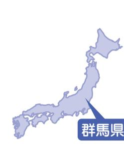

牛来美佳さん(川添)

取材者:高崎経済大学櫻井研究室櫻井取材日:3月10日 「平成24年4月広報なみえ掲載」

故郷・浪江への思いを歌に込めて ―この福島の厳しい現実を風化させないためにも―

 牛来さんは、長女の凜音ちゃん(6歳)と2人で群馬県太田市に暮らしています。 りんおん

 震災後は、郡山市や新潟県新発田市などを20名を越える親族が一緒になって移動し、共同生活を送っていました。現在は、福島に住むご両親とも離ればなれで暮らしています。この3 月には、浪江への思いを込めて牛来さんが初めてレコーディングした曲『浪江町で生まれ育った。』がリリースされます。

あの地震のあと、私たちは親戚が一緒になって郡山市や新発田市などでそれぞれ 2 週間ずつ過ごしました 。 4 月末には郡山に戻ったのですが、原発事故のことが気になり、私と一人娘の凜音だけ、土地勘のあった太田市に 5 月末ごろ移り住みました 。 時折、車で両親のいる福島に戻りますが、震災前とは異なり、みんなバラバラの生活です 。 た

▲美佳さんと凜音ちゃんHPも見てみてねhttp://mica-gorai.jimdo.com/

| ど う そ 浪 話 ト に 妻 浪 浪 き 震 で ん て 。 う い さ こ に ん で に 月 長 た 強 江 し れ バ い に ミ も 江 た す 江 災 な 、 ぜ 思 現 ん と 前 な も な に さ 。 く へ た ず ラ た な ュ い で い 。 に あ か ひ い 実 に 。 向 思 何 り オ ん 郡 な の 。 、 バ 直 だ っ ー ま 毎 で 素 ら ら 多 か を は そ き い か ま リ の 山 り 思 そ 心 ラ 後 け て ジ す 年 す 晴 た 遠 く ら 忘 こ し に を や し ジ 後 市 、 い ん の に は る い ッ 。 開 。 く 、 ら め の こ れ の て な 伝 れ た ナ 押 の 一 を な 整 な こ た ク 催 い し て 離 方 の て 福 、 っ え る 。 ル し ラ つ 歌 と 理 っ 家 と 桝 フ つ さ い 自 れ に 曲 ほ 島 被 て 、 こ 私 C も イ の い き が た 族 が 谷 ェ も れ と 分 て 聞 を し ・ 災 ほ 浪 と の D あ ブ 詩 た 、 つ こ 、 本 宏 ス 相 る 暮 友 こ の い 作 く 浪 地 し 江 が よ を り ハ を い ふ き と 当 美 タ 談 ス ろ ま ら て り な 江 の い の あ う 出 、 ウ 作 気 る ま が 人 に さ で ト に だ ち し い ま い の 外 と 皆 る な す こ ス り 持 さ せ 信 な 心 ん お 乗 リ っ が て た し と 厳 の い さ 。 者 こ の の ま ち と ん じ ど 強 っ ご 世 ー |
|--------------------------------------------------------------------------------------------------------------------------------------------------------------------------------------------------------------------------------------------------------------------------------------------------------------------------------------------------------------------------------------------------------------------------------------------------------------------------------------------------------------------------------------------------------------------------------------------------------------------------------------------------------------------------------------------------------------------------------------------------------------------------------------------------------------------------------------------------------------------------------------------------------------------------------------------------------------------------------------------------------------------------------------------------------------------------------------------------------------------------------------------------------------------------------------------------------------------------------------------------------------------------------------------------------------------------------------------------------------------------------------------------------------------------------------------------------------------------------------------------------------------------------------------------------------------------------------------------------------------------------------------------------------------------------------------------------------------------------------------------------------------------------------------------------------------------------------------------|
| ら が い て 夫                                                                                                                                                                                                                                                                                                                                                                                                                                                                                                                                                                                                                                                                                                                                                                                                                                                                                                                                                                                                                                                                                                                                                                                                                                                                                                                                                                                                                                                                                                                                                                                                                                                                                                                                                                                                                            |
| で                                                                                                                                                                                                                                                                                                                                                                                                                                                                                                                                                                                                                                                                                                                                                                                                                                                                                                                                                                                                                                                                                                                                                                                                                                                                                                                                                                                                                                                                                                                                                                                                                                                                                                                                                                                                                                                |
| し が                                                                                                                                                                                                                                                                                                                                                                                                                                                                                                                                                                                                                                                                                                                                                                                                                                                                                                                                                                                                                                                                                                                                                                                                                                                                                                                                                                                                                                                                                                                                                                                                                                                                                                                                                                                                                                           |
| 3 店                                                                                                                                                                                                                                                                                                                                                                                                                                                                                                                                                                                                                                                                                                                                                                                                                                                                                                                                                                                                                                                                                                                                                                                                                                                                                                                                                                                                                                                                                                                                                                                                                                                                                                                                                                                                                                           |
| に と                                                                                                                                                                                                                                                                                                                                                                                                                                                                                                                                                                                                                                                                                                                                                                                                                                                                                                                                                                                                                                                                                                                                                                                                                                                                                                                                                                                                                                                                                                                                                                                                                                                                                                                                                                                                                                           |
| ん                                                                                                                                                                                                                                                                                                                                                                                                                                                                                                                                                                                                                                                                                                                                                                                                                                                                                                                                                                                                                                                                                                                                                                                                                                                                                                                                                                                                                                                                                                                                                                                                                                                                                                                                                                                                                                                |
| し 皆                                                                                                                                                                                                                                                                                                                                                                                                                                                                                                                                                                                                                                                                                                                                                                                                                                                                                                                                                                                                                                                                                                                                                                                                                                                                                                                                                                                                                                                                                                                                                                                                                                                                                                                                                                                                                                           |
| た い                                                                                                                                                                                                                                                                                                                                                                                                                                                                                                                                                                                                                                                                                                                                                                                                                                                                                                                                                                                                                                                                                                                                                                                                                                                                                                                                                                                                                                                                                                                                                                                                                                                                                                                                                                                                                                           |
| だ                                                                                                                                                                                                                                                                                                                                                                                                                                                                                                                                                                                                                                                                                                                                                                                                                                                                                                                                                                                                                                                                                                                                                                                                                                                                                                                                                                                                                                                                                                                                                                                                                                                                                                                                                                                                                                                |
| み                                                                                                                                                                                                                                                                                                                                                                                                                                                                                                                                                                                                                                                                                                                                                                                                                                                                                                                                                                                                                                                                                                                                                                                                                                                                                                                                                                                                                                                                                                                                                                                                                                                                                                                                                                                                                                                |
|                                                                                                                                                                                                                                                                                                                                                                                                                                                                                                                                                                                                                                                                                                                                                                                                                                                                                                                                                                                                                                                                                                                                                                                                                                                                                                                                                                                                                                                                                                                                                                                                                                                                                                                                                                                                                                                  |

たかを実感しています 。 私は春の桜祭りの桜と花火をもう一度見たいです 。 桜の上に広がる花火がとても美しかったことが懐かしいです 。 海もある、山もある、そしておいしいものがたくさんあった浪江町 。 新鮮なお魚や野菜を浪江ではご近所さんで譲り合っていたのに、こちらではあたり前のことですが毎日お店で購入しなければなりません 。 浪江は本当に豊かなまちだったのだと思います 。 私はまだ仕事も得られず不安が多いですが、とりあえずはこの春の子どもの小学校入学が一番の気がかりです 。 娘も親としての私も初めての経験ですので 。 子どもはよく親を見ています 。 だからこそ、自分自身がしっかりして、前向きに元気に生活していかなければと思っています 。

ですね 。

## 松本サチ子さん(請戸)

取材者:特定非営利活動法人山形の公益活動を応援する会・アミル齋藤、柴田取材日:3月13日 「平成24年4月広報なみえ掲載」

#### 「また請戸の海を眺めたい」

 松本さんは、昨年1月に夫の征夫さんを亡くされ、3月13日の四十九日の準備をしていた矢先の震災でした。息子さんと一緒に3 月18日に山形市に避難し、征夫さんの新盆を迎える8月に借り上げ住宅に入り、現在は家族2人で暮らしています。

私たちの家は、隣に 2 mくらいの堤防がありその隣はすぐ海で船がたくさん泊めてあります 。 ふつうは地震が起きたときテレビで津波警報が流れれば堤防にあがって海の様子を見ますが、その日はあがりませんでした 。 これは絶対に津波がくると思いました 。 地震に備えて用意していた貴重品を持って、向かいのおばさんに声をかけて、一緒にすぐに大平山に避難しました 。 漁協組合に勤めていた息子とは、サンシャイン浪江で無事に会うことができました 。 その後、息子と親戚と一緒に津島、川俣町へ避難して、 3 月 18 日に娘の親戚のいる山形県山形市に避難しました 。 着るものは避難所でほとんどいただきました 。 サンダル履きで着の身着のまま避難したのでありがたかったです 。 建築業をしていたお父さんががっちりした家を建ててくれたおかげで、今回の地震ではガラス一枚割れずまったく壊れませんでした 。 自宅は津波で流されてしまいましたが、一時帰宅で戻ったとき、家の土台にお父さんの名前がしっかり入っていて

見つけたときは嬉しかったです 。 山形は今年大雪で、出かけるのが大変でした 。 気候の穏やかな浜通りを思い出します 。 でも、車の修理が終わり戻ってきたので、雪が溶けたら自分で運転して出かけたいと思っています 。 山形では、避難所で一緒に過ごした皆さんと温泉に行って話ができる会を楽しみにしています 。 先日、福島の仮設に住む友人や親戚に会い食事ができました 。 親しい人とあいさつしたりお茶飲みしたりとか、そういった絆がないのは不安ですが、娘夫婦や孫も夏に遊びに来てくれ、息子も山形で一緒に生活できるので今は安心です 。 家の前の堤防にあがって見る請戸の海を思い出します 。 また見たいです 。 それが一番 。 家の 2 階から見る朝日があがってくる風景がとてもきれいです 。 あと、夜の森公園の桜や河川敷の近くの桜を見てお花見をしたいです 。 浪江に戻り、みんな元気で帰られて良かったといいたい

▲現在お住まいのアパートで

 浪江町に180年以上続く造り酒屋である「鈴木酒造店」。酒蔵は津波で流失してしまったが、県の試験場に蔵の酵母が残っていた。その酵母を使い、7月上旬には南会津の蔵を借りて約2,000本の「壽」を出荷する。

 その後本格的に製造拠点を探していたところ、山形県長井市に休止している酒蔵があることを知る。最後まで福島県内での再開を模索したが、何としても2011年のうちに浪江の皆さんに「壽」を届けたいとの思いから、その酒蔵を引き継ぐことを決意。12月19日には新たな蔵で仕込んだ「壽」の初出荷を迎えた。

> ■ 新天地への葛藤

> いう

町民

い 。

酒を

もあ

ち

井市

て、

知り

とこ

いて

しか

りを

まし南会津の酒蔵で製造した約 2

0 0 0 本の 「 壽 」 は、町民の皆

さんにとても喜んでいただきま

した 。 そして、「 また壽が飲み

たい、造ってほしい 」 という励

ましの言葉をたくさんいただき、

本格的な製造を決意しました 。

福島県内での再開を目指し、

新たな拠点探しを始めましたが、

福島県内で新たに酒蔵を建設す

る場合、建設から製造認可まで

1 年以上かかることがわかりま

した 。 福島県内で再開したいと

|  | ▲大介さん(前列左)と社長の市夫さん(前列右) |  |
|--|-------------------------|--|
|  | 弟の荘司さん(後列左から3番目)らと一緒に。  |  |

| 蔵 再 た 蔵 店 、 開 め 、 ら を 開 。 が 長 酒 を 、 早 め 買 決 井 造 決 長 く ら い ま 蔵 免 め 井 「 れ 取 り 」 許 ま 市 壽 ま り 、 と の し の 」 せ 、 す い す し と お う で 地 ぐ て 浪 。 て で 酒 銘 造 元 こ に 、 江 い 、 を 柄 っ の の 戻 警 町 た 山 引 を て 方 酒 の 蔵 れ 戒 だ 形 き 造 い に る 区 蔵 県 継 っ た 向 で き か 域 は た の い て 「 け は ど が 津 い 皆 で い 一 て 「 う 解 波 と さ 造 ま 生 、 壽 か 除 で 」 思 ん っ す 幸 元 は さ 流 っ に て 。 福 々 の |
|------------------------------------------------------------------------------------------------------------------------------------------------------------------------------------------------------------------------------------------------------------------------------------------------------------------------------------------------------------------------------------------------------------------------------------------------------------------------------------------------------------------------------------------------------------------------------------------------------------------------------------------------------------------------------------------------------------------------------------------------------------------------------------------------------------------------------------------|
|------------------------------------------------------------------------------------------------------------------------------------------------------------------------------------------------------------------------------------------------------------------------------------------------------------------------------------------------------------------------------------------------------------------------------------------------------------------------------------------------------------------------------------------------------------------------------------------------------------------------------------------------------------------------------------------------------------------------------------------------------------------------------------------------------------------------------------------|

㈱マツバヤ代表取締役社長松原茂さん(権現堂) 取材者:浪江町役場長沼・鴫原

#### 人の力の大きさとつながりを感じて前向きに再オープン

取材日:3月10日 「平成24年4月広報なみえ掲載」

 昭和2年に日用・雑貨品店として曽祖父が創業された松葉屋は85年の歴史を持ちます。サンプラザは昭和54年に開業し今年で33年目。地元に密着し、子どもからお年寄りまで浪江町民の憩いの場でした。4代目の松原茂さんは、さまざまな困難にも常に前向きに人を大事にする気持ちで進み、3月8日にみんなの希望を乗せて新たなスタート切りました。

| は じ め は 店 舗 の 再 開 は 難 | 生 活 を し て い ま す 。 | た め 、 新 潟 の 家 族 と 離 れ て | 5 月 に 郡 山 に 仮 事 務 所 を 置 | 福 島 、 山 形 、 新 潟 と 移 り ま し | て 、 家 族 と 一 緒 に 原 町 、 飯 | そ の 後 、 避 難 を 余 儀 な く | 従 業 員 に 話 し ま し た 。 | し た も の の 、 翌 日 9 時 に 集 | は 少 な く 、 夕 方 に は 臨 時 休 | ガ ラ ス が 一 部 割 れ た の み で | 震 災 時 は 店 に い ま し た 。 |
|-----------------------------------------------------|-------------------------------------------|----------------------------------------------------------|----------------------------------------------------------|---------------------------------------------------------------|----------------------------------------------------------|-----------------------------------------------------|------------------------------------------------|----------------------------------------------------------|----------------------------------------------------------|----------------------------------------------------------|-----------------------------------------------------|
| し い                                              |                                           | 単 身                                                   | い た                                                   | た 。                                                        | 館 、                                                   | さ れ                                              |                                                | 合 と                                                   | 業 に                                                   | 被 害                                                   | 店 は                                              |
|                                                     |                                           |                                                          |                                                          |                                                               |                                                          |                                                     |                                                |                                                          |                                                          |                                                          |                                                     |

▲スタッフの皆さんと一緒に(中央が松原さん)

いスタッフを集めなければならなかったのですが、中通りに避難していたスタッフも多く、声を掛けると一緒にやりましょうと言ってくれました 。 スタッフの力は大きかったですね 。 スタッフたちの頑張りには本当に感謝しています 。 あらためて企業は人で成り立っていると感じました 。 スタッフもお店をやる喜びを感じてくれています 。 商品や工事、システム作りなどさまざまな苦労を乗り越えてオープンしたので、あとは前へ進んでいくだけです 。 これはゴールではなくスタートだと思っています 。 拠点が一つでき、これからの可能性が拡がってきました 。 何カ月かかけて品揃えも充実させていきたいです 。 ネット関連の事業も伸ばしていきたいし、仮設住宅等での御用聞き販売も進めていきたいと思っています 。 オープンのときは、浪江や双葉郡のお客さまからたくさんの激励のお言葉をかけていただきました 。 サンプラザを始めたことで、皆さんの復興しようという気持ちのプラスになってくれれば一番うれしいです 。

と

ス

て

げ

し

件

の

ブ

二

タ

す

の

## 山田文孝さん・利子さん(井手)

取材者:浪江町役場長沼・鴫原取材日:4月11日 「平成24年5月広報なみえ掲載」

#### 心まで温まる川上温泉に皆さんお越しください

 浪江町では、奥さまの利子さんとご長男夫婦、三つ子のお孫さんとの7人でにぎやかな毎日を過ごしていた山田さん。現在は、福島市の借上げ住宅で奥さまとの2人暮らしです。今、落ち着いてきた中で、お世話になった方々への恩返しと自分のできるボランティア活動をしていきたいと考えていらっしゃいます。

■ 文孝さんのお話震災で自宅は入れないほどの被害を受けて、家族全員が納屋で一晩過ごしました 。 翌日から避難生活となりましたが、 6 カ所目が土湯温泉の旅館川" 上温泉 " で 4 月 17 日から 4 カ月間、夫婦で身を寄せました 。 川上温泉には、浪江の方が 30 数人一緒で知り合いもいました 。 当初は、食事が終わればみんな部屋に戻

▲川上温泉の社長(前列左)、おかみさん(前列左から2番目)と一緒に。(後列一番左が文孝さん、前列右から2番目が利子さん)

| る の が う れ し い で す ね 。                     | 孫 と 一 緒 に 住 め な い の は 寂 し           |
|-------------------------------------------------------------------------|-------------------------------------------------------------------------|
| た 来 て ね 。」 と 声 を か け て く れ          | か ず を 持 た せ て く れ た り し ま す 。 |
| 方                                                                       | に                                                                       |
| も                                                                       | 行                                                                       |
| い                                                                       | く                                                                       |
| て                                                                       | の                                                                       |
| 、                                                                       | も                                                                       |
| 住                                                                       | 楽                                                                       |
| ん                                                                       | し                                                                       |
| で                                                                       | み                                                                       |
| い                                                                       | で                                                                       |
| な                                                                       | 、                                                                       |
| く                                                                       | 帰                                                                       |
| て                                                                       | り                                                                       |
| も                                                                       | に                                                                       |
| 「                                                                       | は                                                                       |
| ま                                                                       | お                                                                       |
| 仮 設 に は 、 何 人 か 顔 見 知 り の           | た い で す ね 。 2 人 で お 風 呂 に 入 り |
| 出 か け て 行 く こ と で す 。                     | を 掛 け て く れ る 気 遣 い が あ り が      |
| な                                                                       | 付                                                                       |
| ど                                                                       | で                                                                       |
| の                                                                       | 高                                                                       |
| 作                                                                       | く                                                                       |
| り                                                                       | つ                                                                       |
| 方                                                                       | く                                                                       |
| を                                                                       | は                                                                       |
| 教                                                                       | ず                                                                       |
| え                                                                       | の                                                                       |
| て                                                                       | 私                                                                       |
| も                                                                       | た                                                                       |
| ら                                                                       | ち                                                                       |
| い                                                                       | に                                                                       |
| に                                                                       | 声                                                                       |
| 仮                                                                       | を                                                                       |
| 説                                                                       | 使                                                                       |
| 住                                                                       | っ                                                                       |
| 宅                                                                       | て                                                                       |
| で                                                                       | い                                                                       |
| の                                                                       | た                                                                       |
| ち                                                                       | よ                                                                       |
| ぎ                                                                       | う                                                                       |
| り                                                                       | で                                                                       |
| 絵                                                                       | す                                                                       |
| や                                                                       | が                                                                       |
| 押                                                                       | 、                                                                       |
| し                                                                       | 2                                                                       |
| 花                                                                       | 食                                                                       |
| か                                                                       | ま                                                                       |
| ら                                                                       | す                                                                       |
| の                                                                       | 。                                                                       |
| 誘                                                                       | 今                                                                       |
| い                                                                       | ま                                                                       |
| も                                                                       | で                                                                       |
| あ                                                                       | は                                                                       |
| り                                                                       | 派                                                                       |
| 、                                                                       | 遣                                                                       |
| 安                                                                       | 会                                                                       |
| 達                                                                       | 社                                                                       |
| 運                                                                       | の                                                                       |
| 動                                                                       | 人                                                                       |
| 場                                                                       | 材                                                                       |
| ま た 、 楽 し み な の は 高 野 さ ん           | 掃 除 、 布 団 の 片 づ け な ど し て い      |
| を し て い ま す 。                                         | ル バ イ ト と し て お 膳 の 片 付 け や      |
| ム                                                                       | た                                                                       |
| や                                                                       | が                                                                       |
| 知                                                                       | 、                                                                       |
| り                                                                       | 旅                                                                       |
| 合                                                                       | 館                                                                       |
| い                                                                       | が                                                                       |
| か                                                                       | 忙                                                                       |
| ら                                                                       | し                                                                       |
| 頼                                                                       | い                                                                       |
| ま                                                                       | と                                                                       |
| れ                                                                       | き                                                                       |
| て                                                                       | に                                                                       |
| 内                                                                       | は                                                                       |
| 職                                                                       | ア                                                                       |
| 希 子 さ ん の 紹 介 で 着 物 の リ フ ォ ー | に 引 っ 越 し 、 川 上 温 泉 を 出 ま し      |
| で 知 り 合 っ た 二 本 松 市 の 高 野 津      | 8 月 20 日 に 福 島 の 借 上 げ 住 宅          |
| 岳 温 泉 で の ボ ラ ン テ ィ ア 活 動           | に 助 か り ま し た 。                                    |
| ■ 利 子 さ ん の お 話                                    | て 社 長 自 ら 持 た せ て く れ て 本 当      |
|                                                                         | 入 り の お に ぎ り や お か ず を 作 っ      |
| 越 し く だ さ い 。                                         | 出 勤 す る の に 合 わ せ て 、 梅 干 し      |
| わ                                                                       | 3                                                                       |
| っ                                                                       | 回                                                                       |
| て                                                                       | 仕                                                                       |
| ほ                                                                       | 事                                                                       |
| し                                                                       | を                                                                       |
| い                                                                       | し                                                                       |
| と                                                                       | ま                                                                       |
| 思                                                                       | し                                                                       |
| う                                                                       | た                                                                       |
| の                                                                       | 。                                                                       |
| で                                                                       | 朝                                                                       |
| ぜ                                                                       | 6                                                                       |
| ひ                                                                       | 時                                                                       |
| お                                                                       | に                                                                       |
| に 来 て い た だ い て そ の 良 さ を 味      | の が き っ か け で 、 7 月 か ら 週 2 、 |
| 安                                                                       | 黒                                                                       |
| ら                                                                       | 板                                                                       |
| ぐ                                                                       | に                                                                       |
| 旅                                                                       | 張                                                                       |
| 館                                                                       | り                                                                       |
| で                                                                       | な                                                                       |
| す                                                                       | が                                                                       |
| 。                                                                       | ら                                                                       |
| た                                                                       | 勧                                                                       |
| く                                                                       | め                                                                       |
| さ                                                                       | て                                                                       |
| ん                                                                       | く                                                                       |
| の                                                                       | れ                                                                       |
| 方                                                                       | た                                                                       |
| お                                                                       | が                                                                       |
| 風                                                                       | あ                                                                       |
| 呂                                                                       | り                                                                       |
| は                                                                       | 、                                                                       |
| の                                                                       | 社                                                                       |
| ん                                                                       | 長                                                                       |
| び                                                                       | が                                                                       |
| り                                                                       | 募                                                                       |
| で                                                                       | 集                                                                       |
| き                                                                       | の                                                                       |
| て                                                                       | パ                                                                       |
| 最                                                                       | ン                                                                       |
| 高                                                                       | フ                                                                       |
| に                                                                       | を                                                                       |
| 温 か い 気 持 ち の 良 い 人 ば か り で 、 | 率 の た め の 役 場 の 臨 時 職 員 募 集      |
| い                                                                       | 驚                                                                       |
| う                                                                       | か                                                                       |
| こ                                                                       | さ                                                                       |
| と                                                                       | れ                                                                       |
| で                                                                       | ま                                                                       |
| す                                                                       | し                                                                       |
| 。                                                                       | た                                                                       |
| 川                                                                       | 。                                                                       |
| 上                                                                       | 一                                                                       |
| 温                                                                       | 時                                                                       |
| 泉                                                                       | 帰                                                                       |
| は                                                                       | 宅                                                                       |
| 心                                                                       | の                                                                       |
| が                                                                       | 引                                                                       |
| で                                                                       | か                                                                       |
| き                                                                       | ら                                                                       |
| る                                                                       | あ                                                                       |
| ボ                                                                       | り                                                                       |
| ラ                                                                       | が                                                                       |
| ン                                                                       | た                                                                       |
| テ                                                                       | く                                                                       |
| ィ                                                                       | 、                                                                       |
| ア                                                                       | そ                                                                       |
| を                                                                       | の                                                                       |
| し                                                                       | 人                                                                       |
| た                                                                       | 柄                                                                       |
| い                                                                       | に                                                                       |
| と                                                                       | は                                                                       |
| の                                                                       | て                                                                       |
| 見                                                                       | な                                                                       |
| 守                                                                       | し                                                                       |
| り                                                                       | を                                                                       |
| 隊                                                                       | し                                                                       |
| や                                                                       | て                                                                       |
| 草                                                                       | く                                                                       |
| 刈                                                                       | れ                                                                       |
| り                                                                       | て                                                                       |
| な                                                                       | 、                                                                       |
| ど                                                                       | 本                                                                       |
| 自                                                                       | 当                                                                       |
| 分                                                                       | に                                                                       |
| の                                                                       | 心                                                                       |
| 返                                                                       | 月                                                                       |
| し                                                                       | 間                                                                       |
| が                                                                       | ず                                                                       |
| し                                                                       | っ                                                                       |
| た                                                                       | と                                                                       |
| い                                                                       | 変                                                                       |
| と                                                                       | わ                                                                       |
| い                                                                       | ら                                                                       |
| う                                                                       | な                                                                       |
| こ                                                                       | い                                                                       |
| と                                                                       | 温                                                                       |
| と                                                                       | か                                                                       |
| 仮                                                                       | い                                                                       |
| 設                                                                       | も                                                                       |
| に                                                                       | ん                                                                       |
| な                                                                       | を                                                                       |
| っ                                                                       | 始                                                                       |
| た                                                                       | め                                                                       |
| 川                                                                       | 、                                                                       |
| 上                                                                       | 従                                                                       |
| 温                                                                       | 業                                                                       |
| 泉                                                                       | 員                                                                       |
| の                                                                       | の                                                                       |
| 皆                                                                       | 方                                                                       |
| さ                                                                       | 々                                                                       |
| ん                                                                       | は                                                                       |
| に                                                                       | 4                                                                       |
| 恩                                                                       | カ                                                                       |
| で                                                                       | に                                                                       |
| 考                                                                       | な                                                                       |
| え                                                                       | り                                                                       |
| る                                                                       | ま                                                                       |
| の                                                                       | し                                                                       |
| は                                                                       | た                                                                       |
| 、                                                                       | 。                                                                       |
| こ                                                                       | 社                                                                       |
| れ                                                                       | 長                                                                       |
| ま                                                                       | と                                                                       |
| で                                                                       | お                                                                       |
| お                                                                       | か                                                                       |
| 世                                                                       | み                                                                       |
| 話                                                                       | さ                                                                       |
| い                                                                       | が                                                                       |
| ま                                                                       | 何                                                                       |
| す                                                                       | か                                                                       |
| が                                                                       | し                                                                       |
| 、                                                                       | ら                                                                       |
| 今                                                                       | の                                                                       |
| 落                                                                       | 手                                                                       |
| ち                                                                       | 伝                                                                       |
| 着                                                                       | い                                                                       |
| い                                                                       | を                                                                       |
| て                                                                       | す                                                                       |
| き                                                                       | る                                                                       |
| た                                                                       | よ                                                                       |
| 中                                                                       | う                                                                       |
| い                                                                       | る                                                                       |
| で                                                                       | 感                                                                       |
| す                                                                       | じ                                                                       |
| し                                                                       | で                                                                       |
| 、                                                                       | し                                                                       |
| 浪                                                                       | た                                                                       |
| 江                                                                       | が                                                                       |
| に                                                                       | 、                                                                       |
| 戻                                                                       | そ                                                                       |
| り                                                                       | の                                                                       |
| た                                                                       | う                                                                       |
| い                                                                       | ち                                                                       |
| と                                                                       | 全                                                                       |
| 思                                                                       | 員                                                                       |

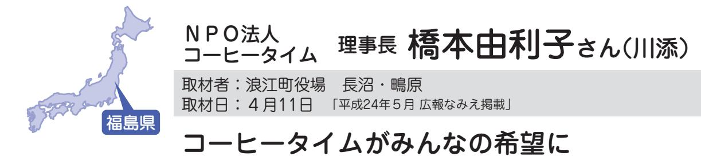

心に障がいを持った方々の環境を整えて、自立の手助けをしていた就労継続支援施設コーヒータイムは、昨年10月に二本松で再オープンしました。 再開によって生き生きとした表情になったという利用者の皆さん。新たに二本松の利用者さんが加わったことでここで根を張っていきたいと話してくださいました。

震災当日に利用者さんをすべて自宅へ送り届けることができました 。 その後、スタッフを含めみんなそれぞれ避難生活を送っていましたが、 5 月に利用者さんとその家族、スタッフ、支援者が二本松で集まり今後の打ち合わせをしました 。 話し合いで、 「 再開しよう 。 しなくちゃだめだよ 。」 と後押しされ、さて、どこで再開するかとなり、利用者さんから 「 役場がある二本松だろう 。」 という声が上がりびっくりしました 。 私自身は、浪江に近い所でと思っていましたし、実はそのとき、誰も二本松に住んでい

▲スタッフの皆さんと一緒に(橋本さん:後列真ん中)

## 小泉泰代さん(川添)

取材者:地域社会デザイン・ラボ遠藤取材日:4月19日 「平成24年5月広報なみえ掲載」

#### 浪江の復興は、小さな取り組みの積み重ねから

宮城県

▲趣味のパッチワークキルトをバックに

▲

震災後は、いわき市に1カ月、青森県むつ市に3カ月避難した後、8月から仙台市太白区に在住。仙台市在住の知人が少ないため、少し心細い日々を過ごされているそうです。

> 震災直後は、近くに住んでいる知人に助けられ車に同乗して避難 。 そして宿泊までさせていただきました 。 また、避難先のむつ市では、近くの工房に大変お世話になり、くだものの摘み取りや海の幸を楽しみに、よく連れ出してもらったものでした 。 当時はどう動いていいか分かり

でしたが、懐かしく楽しめました 。 このように小さくてもいいから裸参りや大堀相馬焼のせと市もぜひ実施してほしいなと思います 。 祭りを絶やさないで若い人たちに頑張ってもらいたいです 。 私の娘は二本松で仕事をしています 。 夫からは、姉妹みたいな親子だな、なんて言われたりもします 。 彼女は、震災を機に一人暮らしをし、日 々 初めてのことに挑戦し、頑張って仕事をしています 。 そんな様子を見ていると 「 復興を担う大事な一人だな 。」 と感じるとともに、たくましくそして心強く感じ 「 頑張れ ! 」 と応援したくなります 。 だからこそ、私もグチを言わず頑張ろうかな、と思えるのです ( 笑 )。

## 加藤喜志子さん(川添)

取材者:(特活)くびき野NPOサポートセンター新保取材日:5月15日 「平成24年6月広報なみえ掲載」

#### 浪江の皆さんに会いたい

 浪江町で美容師として働いていた加藤さん。 昨年9月から、近所に住んでいる娘さん夫婦と一緒に新潟市北区で生活しています。

▲ふるさとの浪江をなつかしむ加藤さん

震災当日、美容室で仕事をしているときに地震が発生しました 。 家族全員の無事を確認できましたが、あの当時は何がなんだかわからないまま、ただ避難することしかできなかったのを覚えています 。 当時、私たち夫婦は福島県内に残り、一緒に住んでいた娘夫婦は茨城県ひたちなか市へ避難したため、家族離れ離れになってしまいました 。 その後、娘夫婦とも合流し、昨年 8 月まで新潟県長岡市などで避難生活を送り、昨年 9 月から

| 少 し 内 向 的 に な っ て し ま う こ と | と こ ろ で す 。 し か し 、 気 持 ち が | す る の に 何 の 不 自 由 も な く い い | の も 十 分 で あ り 、 新 潟 市 は 生 活 | 現 在 は 住 む と こ ろ も 食 べ る も | 難 し い の が 現 状 で す 。 | り す る こ と を 考 え る と な か な か | 店 舗 を 構 え た り 設 備 を そ ろ え た | た ち も 各 地 に 避 難 さ れ て し ま い 、 | す が 、 今 ま で お 客 さ ん だ っ た 方 | 帰 し た い と い う 気 持 ち も あ り ま | て い ま す 。 ま た 美 容 師 と し て 復 | し い こ と を 始 め て み よ う と 思 っ | 取 れ る よ う に な っ た の で 何 か 新 | 園 に 上 が り 、 自 分 の 時 間 が 少 し | 今 年 の 4 月 か ら 孫 た ち が 幼 稚 | が 毎 日 の 日 課 に な っ て い ま す 。 | し た り 、 一 緒 に 遊 ん だ り す る の | の で 安 心 で す 。 孫 た ち の 世 話 を | す ぐ 近 く に 娘 夫 婦 が 住 ん で い る | て い ま す 。 少 し 寂 し い で す が 、 | で い る た め 別 々 の 生 活 を お く っ | 島 県 二 本 松 市 の 方 に 単 身 で 住 ん | 現 在 、 主 人 が 仕 事 の 関 係 で 福 | た で す 。 | た か い 気 持 ち が 本 当 に う れ し か っ | 助 け ら れ ま し た 。 皆 さ ん の あ た | 避 難 中 は 各 地 で 多 く の 方 々 に | い ま す 。 | 新 潟 市 北 区 の ア パ ー ト に 住 ん で |
|--------------------------------------------------------------------|--------------------------------------------------------------------|--------------------------------------------------------------------|--------------------------------------------------------------------|---------------------------------------------------------------|------------------------------------------------|--------------------------------------------------------------------|--------------------------------------------------------------------|-------------------------------------------------------------------------|--------------------------------------------------------------------|--------------------------------------------------------------------|--------------------------------------------------------------------|--------------------------------------------------------------------|--------------------------------------------------------------------|--------------------------------------------------------------------|---------------------------------------------------------------|--------------------------------------------------------------------|--------------------------------------------------------------------|--------------------------------------------------------------------|--------------------------------------------------------------------|--------------------------------------------------------------------|--------------------------------------------------------------------|--------------------------------------------------------------------|---------------------------------------------------------------|------------------|-------------------------------------------------------------------------|--------------------------------------------------------------------|---------------------------------------------------------------|------------------|--------------------------------------------------------------------|
|--------------------------------------------------------------------|--------------------------------------------------------------------|--------------------------------------------------------------------|--------------------------------------------------------------------|---------------------------------------------------------------|------------------------------------------------|--------------------------------------------------------------------|--------------------------------------------------------------------|-------------------------------------------------------------------------|--------------------------------------------------------------------|--------------------------------------------------------------------|--------------------------------------------------------------------|--------------------------------------------------------------------|--------------------------------------------------------------------|--------------------------------------------------------------------|---------------------------------------------------------------|--------------------------------------------------------------------|--------------------------------------------------------------------|--------------------------------------------------------------------|--------------------------------------------------------------------|--------------------------------------------------------------------|--------------------------------------------------------------------|--------------------------------------------------------------------|---------------------------------------------------------------|------------------|-------------------------------------------------------------------------|--------------------------------------------------------------------|---------------------------------------------------------------|------------------|--------------------------------------------------------------------|

も多く、浪江で大好きな美容師の仕事をしていたころの生活を思い出したり、浪江の皆さんと顔を合わせてたわいもないおしゃべりをしたいなと思ってしまいます 。 震災以前は、浪江の自宅の庭で土いじりやガーデニングをしたり、浪江の皆さんを外で見かけたりして元気そうだなとわかると、それだけで自分も元気になっていました 。 私は生まれも育ちも浪江町です 。 やっぱりふるさとっていいなと思います 。 浪江の人たちの笑顔、十日市、盆踊り、コスモスの花が咲く風景・・・いつかふるさと浪江に帰れる日が来ると願っています 。

松本幹夫さんは、妻のミドリさん、そして息子の渉さんとともに埼玉県久喜市の借り上げアパートで生活しています。震災から1年数カ月の間、国・県・町から示されるはずの今後の方針を待ち続けています。

私たちは震災後、川俣町の避難所からさいたまスーパーアリーナに双葉町民などと一緒に移り、昨年 5 月からは 2 次避難所となる埼玉県熊谷市のビジネスホテルで生活していました 。 暑い夏を挟み 10 月までホテルで過ごしましたが、長期にわたる狭いホテルの一室での生活は厳しいものでした 。 6 カ所目の移動となる現在の久喜市に移ってからは、生活環境もだいぶ落ち着き、近くにある図書館や公園を利用したりするなど、のどかな環境の中で静かに暮らしています 。

> ・原発に替わる新た

なども含め、浪江町

人・新天地での生活

人、それぞれの実情

抜本的な支援策を早

いと願うばかりです 。

▲左から、ミドリさん、渉さん、幹夫さん

| 浪 江 町 当 時 は 、 修 行 か ら 戻 っ           | 馴 染 み の お      |
|-------------------------------------------------------------------------|----------------------------|
| た 息 子 と 一 緒 に 権 現 堂 で 時 計 店      | き た こ れ ま      |
| を 営 み 、 地 域 の 皆 さ ま に 支 え ら      | 思 い 出 す の      |
| れ て 生 活 し て い ま し た 。 同 じ 仕      | 以 前 の よ う      |
| 事 を 今 の 場 所 で 再 開 す る こ と は      | の か 不 安 で      |
| 難 し い と 考 え て い ま す 。 地 域 の      | 『 浪 江 の こ      |
| 皆 さ ん と の 繋 が り も 希 薄 に な っ      | 地 で 前 向 き      |
| て し ま っ た た め 、 先 日 も 参 加 し      | 民 の 皆 さ ん      |
| た 「 な み え の し ゃ べ り 場 」 の よ      | す が 、 と て      |
| う な 浪 江 町 民 の 交 流 の 機 会 は 本      | に は な れ ず      |
| 当 に あ り が た い で す 。 た だ 、 そ      | 興 ビ ジ ョ ン      |
| う し た 交 流 会 に 集 ま る 方 が 、 私      | ラ に 暮 ら す      |
| た ち も 含 め い つ も 同 じ よ う な 方 々 | 所 に 集 め た 「 |
| で あ る こ と は 少 し 気 に な っ て い      | と い う 案 が 出 |
| ま す 。                                                             | 乗 り 越 え る      |
| 浪 江 は 自 然 豊 か な 町 で し た 。           | に 感 じ ま す      |
| 離 れ て み て 分 か る こ と で す が 、      | ど の よ う に      |
| 山 の 幸 や 海 産 物 が 豊 富 に 手 に 入      | で す 。                |
| り 、 こ の 地 域 で 楽 し く 暮 ら し て      | 自 分 た ち           |
| い た よ う に 思 い ま す 。 商 売 を や っ | 者 が 、 一 日      |
| て い た 立 場 か ら み て も 、 浪 江 町      | 活 へ の 一 歩 を |
| は 仙 台 圏 で も 福 島 圏 で も い わ き      | そ し て す べ      |
| 圏 で も な く 、 経 済 が 町 の 中 で 完      | て い る 人 々      |
| 結 し て い た 魅 力 的 な 町 で し た 。      | ら な い よ う      |
| そ ん な 町 に 、 地 震 と 津 波 、 そ           | に は 資 産 買      |
| し て あ の よ う な 原 発 事 故 が 起 こ      | 染 の 迅 速 化      |
| る な ど と は ま っ た く 思 っ て い ま      | な 産 業 創 出      |
| せ ん で し た 。 そ れ ま で の 何 不 自      | に 戻 り た い      |
| 由 な い 暮 ら し が す べ て 奪 わ れ た      | を 決 断 し た      |
| こ と が 悔 や ま れ て な り ま せ ん 。      | に 見 合 っ た      |
| 息 子 で 三 代 目 と な る 店 で し た が 、 | く 示 し て 欲 し |

お客さまに支えられてまでの生活を懐かしくのと同時に、浪江町でうな商売が再開できるでなりません 。 毎月のこころ通信 』 では、各きに生活されている町んの声を多く目にしまてもそのような気持ちずにおります 。 町の復ンでは、各地にバラバす町民を福島県内数カた 「 町外コミュニティ 」 が出ているようですが、るべき課題も多いようす 。 今後の町の方針がになるのか見極めたいちのような商工農漁業日でも早く自立した生歩を踏み出せるように、べての避難生活を送っ 々 がこれ以上不幸になうにするためにも、国買上げ・完全賠償・除

## 牛渡愛香さん(幾世橋)

取材者:NPO法人市民公益活動パートナーズ古山取材日:5月9日 「平成24年6月広報なみえ掲載」

#### 今を頑張りながら、楽しく過ごしたい

請戸にあった夫、三四郎さんの実家で地震と津波に遭い、ご家族と2人の子どもたちと避難した愛香さんは、昨年6月から現在の福島市の借上げ住宅で、震災後に出産した長女望愛ちゃんと愛香さんのお母さん(洋美さん)、夫と長男の龍之介君、次男の虎之介君の6人で暮らしています。 のあ

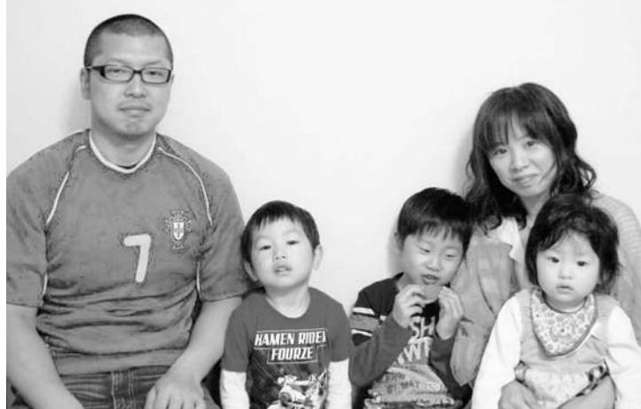

| ま |   | な | 事 | れ | 立 | え | 時 | 福 |   | ■ |
|---|---|---|---|---|---|---|---|---|---|---|
| し | そ | っ | で | て | ち | て | 保 | 島 | 震 | 愛 |
| た | の | て | し | 夫 | 寄 | 子 | 育 | 市 | 災 | 香 |
| が | 日 | し | た | の | っ | ど | 士 | に | 発 | さ |
| 、 | は | ま | が | 両 | て | も | を | 滞 | 生 | ん |
| 原 | 夫 | い | 、 | 親 | い | た | し | 在 | 時 |   |
| 発 | の | ま | 実 | も | ま | ち | て | 中 | 、 |   |
| 事 | 義 | し | 家 | 子 | し | を | お | で | 夫 |   |
|   |   | た |   |   |   |   |   |   |   |   |
| 故 | 姉 |   | は | ど | た | 迎 | り | し | は |   |
| が | の | 。 | 津 | も | 。 | え | 、 | た | 職 |   |
| 起 | 家 |   | 波 | た | 高 | に | 仕 | 。 | 場 |   |
| き | を |   | で | ち | 台 | 請 | 事 | 私 | 研 |   |
| た | 頼 |   | 無 | も | に | 戸 | を | は | 修 |   |
|   |   |   |   |   |   |   |   |   |   |   |

で

当

終

に

逃

無

く

り

の

▲左から、三四郎さん、虎之介くん、龍之介くん、愛香さん、望愛ちゃん

休日前後は、福島市から約 2 時

| に あ る 出 張 所 に 勤 務 し て い ま す 。 | に 所 属 し て お り 、 現 在 は 川 内 村 | 地 方 広 域 市 町 村 圏 組 合 消 防 本 部 ) | 私 は 双 葉 地 方 の 消 防 署 ( 双 葉 | ■ 三 四 郎 さ ん |   | い と 、 い つ も 思 っ て い ま す 。 | 大 事 に し た い 、 楽 し く 過 ご し た | 家 族 そ ろ っ て 暮 ら せ る 「 今 」 を | い ま す が 、 将 来 の こ と よ り も 、 | 子 ど も た ち と 暮 ら し た い と は 思 | た 。 や は り 、 浪 江 に 帰 っ て 親 や | 雪 の 多 さ に は 本 当 に 戸 惑 い ま し | ち で 、 福 島 市 の 夏 の 蒸 し 暑 さ と | 私 も 夫 も 浪 江 生 ま れ の 浪 江 育 | て く れ た こ と が 忘 れ ら れ ま せ ん 。 | も 手 伝 い に 行 く か ら ね 。」 と 言 っ | リ ン さ え 手 に 入 れ れ ば 、 い つ で | れ て い ま す 。 震 災 当 初 、「 ガ ソ | 市 に 住 ん で お り 、 と て も 助 け ら | 学 生 時 代 の 友 人 が 数 人 、 福 島 | い を 決 め ま し た 。 | そ の 近 所 に し よ う と 、 今 の 住 ま | あ た り に で き る と い う 話 を 聞 き 、 | ま し た 。 浪 江 の 仮 設 住 宅 が 笹 谷 | 程 近 い ア パ ー ト な ど に 移 り 住 み | い る 福 島 市 や 伊 達 市 、 今 の 家 に | 避 難 し ま し た 。 そ の 後 、 叔 母 が | で 、 津 島 に あ る 私 の 祖 母 の 家 に |
|-------------------------------------------------------------------------|--------------------------------------------------------------------|-------------------------------------------------------------------------|---------------------------------------------------------------|----------------------------|---|---------------------------------------------------------------|--------------------------------------------------------------------|--------------------------------------------------------------------|--------------------------------------------------------------------|--------------------------------------------------------------------|--------------------------------------------------------------------|--------------------------------------------------------------------|--------------------------------------------------------------------|---------------------------------------------------------------|-------------------------------------------------------------------------|---------------------------------------------------------------------|--------------------------------------------------------------------|----------------------------------------------------------------|--------------------------------------------------------------------|---------------------------------------------------------------|--------------------------------------|--------------------------------------------------------------------|-------------------------------------------------------------------------|--------------------------------------------------------------------|--------------------------------------------------------------------|--------------------------------------------------------------------|--------------------------------------------------------------------|--------------------------------------------------------------------|
| 大                                                                       | バ                                                                  | た                                                                       | な                                                             | に                          | 福 | 会                                                             | 回                                                                  | た                                                                  |                                                                    | し                                                                  | ん                                                                  | に                                                                  |                                                                    | て                                                             | 町                                                                       | き                                                                   | ま                                                                  | て                                                              | で                                                                  | た                                                             | 針                                    |                                                                    | し                                                                       | は                                                                  | 様                                                                  | 防                                                                  |                                                                    | 間                                                                  |

| に 出 場 し ま し た 。 残 念 な が ら                                                                                                                                                                                                                                                                                                                                                                    | 福 島 県 市 町 村 対 抗 軟 式 野 球 大 | が 、 昨 年 10 月 に 行 わ れ た 第 5 | 家 族 も 応 援 し に 来 て く れ ま し | く 過 ご せ る か を 考 え て い ま す 。 | 。 そ れ よ り も 、 今 、 い か に 楽 | 答 え が 出 る わ け で は あ り ま せ | し か し 、 悶 々 と 考 え て も す ぐ | い ま す 。 | ま せ ん が 、 状 況 が よ く な れ ば 、      | い ま す 。 電 気 や 水 が 止 ま っ た           | 判 断 を し な く て も い い と 思 っ | ち は ま だ 若 い で す か ら 、 急 い | に 従 お う と 思 っ て い ま す 。 私 | 帰 町 に 関 し て は 、 国 や 町 の 方 | た 。 | 義 姉 の 家 で 会 う こ と が で き ま | 子 を 見 に 帰 れ た の で 、 家 族 と | 学 校 で 研 修 中 で し た が 、 当 日 | 震 災 当 時 、 福 島 市 に あ る 県 消 |
|----------------------------------------------------------------------------------------------------------------------------------------------------------------------------------------------------------------------------------------------------------------------------------------------------------------------------------------------------------------------------------------------------------------------------------|---------------------------------------------------------------|----------------------------------------------------------------|---------------------------------------------------------------|--------------------------------------------------------------------|---------------------------------------------------------------|---------------------------------------------------------------|---------------------------------------------------------------|------------------|-------------------------------------------------------------------------|-------------------------------------------------------------------------|---------------------------------------------------------------|---------------------------------------------------------------|---------------------------------------------------------------|---------------------------------------------------------------|--------|---------------------------------------------------------------|---------------------------------------------------------------|---------------------------------------------------------------|---------------------------------------------------------------|
| 大 バ た な に 福 き ー こ っ 終 島 わ 市 な を と て 意 偲 、 い り に 味 ぶ 津 る ま 1 が こ 波 仲 し 対 あ と で 間 た 2 り が 亡 た が で ま で く ち 、 敗 し き な と 離 れ た た っ 再 れ て 。 こ た 会 離 準 来 と メ で れ 優 年 に ン き に 勝 |                                                               | 会 回                                                         | た                                                             |                                                                    |                                                               | し ん                                                        | に                                                             |                  | て 町 に 戻 り 、 直 し て 住 も う と 考 え | き ま ま で は 幾 世 橋 の 家 の 修 理 は で | て                                                             | で                                                             | た                                                             | 針                                                             |        |                                                               | し は                                                        | 様                                                             | 防                                                             |
|                                                                                                                                                                                                                                                                                                                                                                                                                                  |                                                               |                                                                |                                                               |                                                                    |                                                               |                                                               |                                                               |                  |                                                                         |                                                                         |                                                               |                                                               |                                                               |                                                               |        |                                                               |                                                               |                                                               |                                                               |
|                                                                                                                                                                                                                                                                                                                                                                                                                                  |                                                               |                                                                |                                                               |                                                                    |                                                               |                                                               |                                                               |                  |                                                                         |                                                                         |                                                               |                                                               |                                                               |                                                               |        |                                                               |                                                               |                                                               |                                                               |
|                                                                                                                                                                                                                                                                                                                                                                                                                                  |                                                               |                                                                |                                                               |                                                                    |                                                               |                                                               |                                                               |                  |                                                                         |                                                                         |                                                               |                                                               |                                                               |                                                               |        |                                                               |                                                               |                                                               |                                                               |
|                                                                                                                                                                                                                                                                                                                                                                                                                                  |                                                               |                                                                |                                                               |                                                                    |                                                               |                                                               |                                                               |                  |                                                                         |                                                                         |                                                               |                                                               |                                                               |                                                               |        |                                                               |                                                               |                                                               |                                                               |
|                                                                                                                                                                                                                                                                                                                                                                                                                                  |                                                               |                                                                |                                                               |                                                                    |                                                               |                                                               |                                                               |                  |                                                                         |                                                                         |                                                               |                                                               |                                                               |                                                               |        |                                                               |                                                               |                                                               |                                                               |
|                                                                                                                                                                                                                                                                                                                                                                                                                                  |                                                               |                                                                |                                                               |                                                                    |                                                               |                                                               |                                                               |                  |                                                                         |                                                                         |                                                               |                                                               |                                                               |                                                               |        |                                                               |                                                               |                                                               |                                                               |
|                                                                                                                                                                                                                                                                                                                                                                                                                                  |                                                               |                                                                |                                                               |                                                                    |                                                               |                                                               |                                                               |                  |                                                                         |                                                                         |                                                               |                                                               |                                                               |                                                               |        |                                                               |                                                               |                                                               |                                                               |
|                                                                                                                                                                                                                                                                                                                                                                                                                                  |                                                               |                                                                |                                                               |                                                                    |                                                               |                                                               |                                                               |                  |                                                                         |                                                                         |                                                               |                                                               |                                                               |                                                               |        |                                                               |                                                               |                                                               |                                                               |

佐藤弘子さん(権現堂)

取材者:へるめす編集工房(元気玉プロジェクト) 棚木取材日:5月14日 「平成24年6月広報なみえ掲載」

#### 楽しく遊ぶ子供たちの姿が、前向きな気持ちの応援に

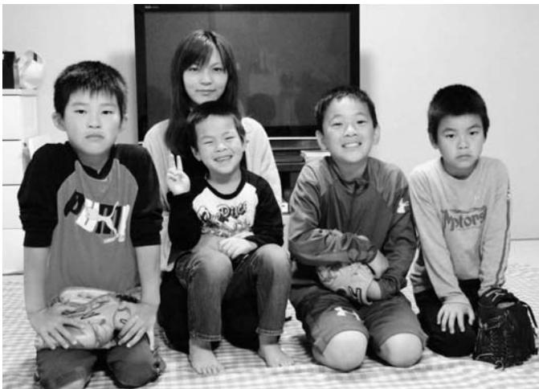

▲お子さんたちと一緒に。

 震災後はご主人の実家から浪江町津島地区のつしま活性化センター、いわき市、塙町へと移動しながら避難。現在は会津若松市北滝沢のアパートで、お子さんたちの笑顔に励まされながら、ご家族で暮らしていらっしゃいます。

震災当日は、上ノ原地区にある夫の実家に家族 5 人で避難、待機しました 。 原発事故があり、翌日避難命令が出たので津島地区へ移動し、避難所になっていたつしま活性化センターへ身を寄せました 。 しかし、原発事故の不安があり、同じく避難していた夫の両親と私たち家族、近所の方たちと 20 名近くで車数台に分乗して、いわき市の知人を頼って移動し、そこで 3 日間ほ

どお世話になりました 。 その後、向かった塙町の公民館で、私の両親とも再会し合流することができました 。 これからのことを思うと不安でいっぱいでしたが、このころはまだ、 1 週間ほどたてば浪江の家に帰れるだろうと軽く考えていたのです 。 ですが、兄が仕事でお世話になっていた方がアパートを用意してくださり、 3 月 19 日から会津若松市で生活することになったときには、「 もしかしたら、すぐには帰れないかも 。」 という気持ちが心をよぎっていました 。 子どもたちに、学校が変わることや、帰れないことをどう説得すればよいか夫と悩みました 。 皆それぞれに避難しましたので、友人とも気軽に会うことが難しくなりましたが、近所の方 々 から親切にしていただき、落ち込んだり、不自由さを感じたりすることもなく過ごせることを、とてもありがたく思っています 。 避難の際にも多くの方にお世話になり、今も感謝の気持ちでいっぱいです 。 会津若松市にもいろいろなお祭りがありますが、やはり浪江

の十日市のにぎわいが思い出されます 。 露店の列が遠くまで並んで、毎年家族みんなの楽しみでした 。 小さな町でしたが、気候も温暖で、海も山も近く自然豊かな暮らしやすい町だったことを思うと残念でなりません 。 こうして離れてみると、楽しいこと、すてきなところがいっぱいあったことを改めて思います 。 あれから 1 年が過ぎ、子どもたちも新しくできたお友だちと楽しく遊びまわっています 。 震災に遭い、避難生活を体験したことで子ども心にいろんなことを考え、負担もあっただろうと思いますが、気持ちを切り替えて前向きに楽しく毎日を過ごしてる姿に、私も夫も励まされています 。 野球好きな長男は、浪江でも少年野球チームで頑張っていましたが、今回、会津若松の少年野球チームに入団しました 。 これからの季節は、たくさん試合も行われるので、家族で応援に行くのを楽しみにしています 。

 町内で食堂を切り盛りし半世紀という鈴木さんご夫婦は、埼玉県に一時滞在後会津若松市へ。小さなお孫さん2人を連れての避難はミルク不足の問題に一番頭を痛めたそうです。

新町で店を開き 50 年になる 「 やよい食堂 」 の主人です 。 震災当日は昼の繁忙時間が過ぎ、一息ついたところで地震に遭いました 。 店そのものはどうにか無事でしたが、店内はラーメンスープの入った寸胴鍋がひっくり返り、食器もすべて落ちてしまい大変なありさまでした 。 12 日朝に避難指示が出たので、 1 歳半と 2 歳 10 カ月の孫を連れ、息子の運転で津島の親戚を頼り 3 日間お世話になったあと、川俣町を経て埼玉県の長女宅にて 20 日間滞在し、 3 カ月を会津若松市東山温泉で大熊町の方と過ごしたのち、現在の借り上げ住宅に入ることができました 。 二次避難先のホテルでは夜、 6 カ月の孫がむずかり、妻は毎晩、背におぶったまま寝ていました 。 孫が大きくなったらこの話をしてあげたいと思っています 。 この 1 年にあったことやこれからを、孫子の代まで語り継いでいって欲しいというのが、私たちの願いです 。 次女とは仕事の事情で 1 カ月間会うことができませんでしたが、それ以外はずっと家族離れ

離れにはならず、別世帯ではありますが、ともに同じ借上げ住宅に住むことができたのは幸いなことです 。 会津地方には現在 1 0 0 0 人ほどの浪江町民が滞在ということで、横のつながりを持たなくてはと、この 4 月 19 日に 「 会津地方なみえ会 」 を発足したばかりです 。 少しずつお声がけをしていますが、絆づくりに役立てていただければと考えています 。 借り上げ住宅に入って間もなく 1 年 。 会津の雪深さには驚きましたが、それだけに春の訪れはうれしかったです 。 昨年はとても花見どころではありませんでしたが、今年はさっそく 「 会津地方なみえ会 」 メンバーとともに鶴ヶ城公園にブルーシートを広げて料理を持ち寄り、花見をしました 。 請戸川リバーラインでのにぎやかな花見イベントと重なり、まぶたに懐かしく思い出されます 。 二本松で行われる町のイベントにも、バスをチャーターしてみんなで行ければいいね、とかさまざまなアイディアを出し合っています 。 会津地方にお住まいの方は、どうぞご参加ください 。

▲宏孝さん(左)とキミ子さん(右)

▲かわいいお孫さんたち

## 吉田絵美さん(酒田)

取材者:(特活)山形の公益活動を応援する会・アミル寺澤・柴田取材日:5月12日 「平成24年6月広報なみえ掲載」

#### 大切な家族と一緒に

吉田さんご家族は、現在山形県南陽市に家族 5人で暮らしています。夫の大祐さんは勤務地である新潟県から週末に帰ります。

山形県

震災時、妊娠中だった絵美さんは昨年8月に理人くんを無事出産。新たな家族が増えました。 りひと

母の三重子さんは7月に、山形県赤湯市内に山形に嫁いだ娘さんと一緒にスナック「エルベ」 をオープンする予定。

避難している福島の人たちが交流し、励みにできる場所を作ったり、福島や浪江の名産品などをPRしたりと、浪江町復興ため少しでも役に立てればとお話ししていました。

▲家族そろって。 左から、お母さんの三重子さん、絵美さん、理人くん(9カ月)、夫の大祐さん、るなちゃん(小2) 「皆さん、山形県赤湯市に来たときはお店に遊びにきてください。」

| 昨 年 、 一 時 帰 宅 し て き ま し た           |
|-------------------------------------------------------------------------|
| が た い で す 。                                              |
| の た め の 情 報 を も ら え る と あ り      |
| き ま す 。 浪 江 町 役 場 か ら 子 ど も      |
| い る か ら 自 分 も 頑 張 る こ と が で      |
| ら っ て い ま す 。 み ん な 頑 張 っ て      |
| 張 っ て い る 状 況 な ど を 教 え て も      |
| 絡 を 取 っ て い る の で 避 難 先 で 頑      |
| 会 え ず 寂 し い で す が 、 頻 繁 に 連      |
| そ れ ぞ れ 避 難 先 も 遠 く な か な か      |
| 浪 江 に い た と き の 友 だ ち は 、           |
| い 方 で 安 心 し て 通 っ て い ま す 。      |
| た く さ ん で き ま し た 。 先 生 も 良      |
| 入 学 し 2 年 生 に な り 、 友 だ ち も      |
| 娘 の る な は 、 南 陽 市 の 小 学 校 に      |
| り で 落 ち 着 い て 暮 ら し て い ま す 。 |
| た だ き 、 地 区 の 方 も い い 人 ば か      |
| 所 で 避 難 場 所 の 相 談 に の っ て い      |
| て も 感 謝 し て い ま す 。 南 陽 市 役      |
| そ の 後 1 カ 月 半 お 世 話 に な り と      |
| ら い 、 そ の 日 に 南 陽 市 に 避 難 し 、 |
| 山 形 に 来 な さ い 。」 と 言 っ て も          |
| ぎ 先 の お 姑 さ ん た ち か ら 「 す ぐ      |
| 12 日 朝 の 避 難 指 示 の 後 、 姉 の 嫁     |
| ク に な っ て い ま し た 。 で す が 、      |
| と 逃 げ な き ゃ 。」 と も う パ ニ ッ          |
| 腹 に い る 子 ど も と 自 分 の 子 ど も      |
| 「 こ こ に い た ら 危 な い 、 ま ず お      |
| す が 、 震 災 時 は 妊 婦 だ っ た の で 、 |
| 今 な ら 冷 静 に 考 え ら れ る の で           |

が、変わってしまった自分の家や町の姿を泣きながら見ました 。 町に戻れないことは感じていますが今後自分たちはどうしていけばよいか、町の除染や復興のことなど、たくさんのことを考え不安もあります 。 山形も住みやすい所ですが、やはり地元は良かったです 。 日に日に強く思います 。 浪江は、海も山も近くて住みやすく、 30 年間暮らしたたくさんの思い出があります 。 今は姉の近くに来たということもうれしく親も一緒なので、自分たちの大切な家族がそばにいる南陽市にいるつもりです 。 子どもたちが大きくなったらいつか浪江町に連れていきたいと思っています 。

## 安倍由恵さん(請戸)

取材者:地域社会デザイン・ラボ遠藤取材日:5月19日 「平成24年6月広報なみえ掲載」

#### 娘が請戸の田植え踊りを練習中。 7月のお披露目が楽しみ!

震災後は、猪苗代や埼玉など何度も引っ越しを重ね、昨年7月から仙台市泉区のマンションに家族4人(夫、娘2人)で住でいます。震災1カ月後に生まれた娘さんもすくすくと育ち1歳に。

昨年の 7 月中旬から仙台市泉区に住み始めました 。 それまでは夫と離れて暮らしていたので、家族で暮らせる喜びを感じ過ごしています 。 週末になると、仕事のために広野町に住む父や会津若松市に住む母、福島市に住んでいる祖母たちが仙台に集まり、ほっとする時間を過ごしています 。 孫である私の娘たちの成長を楽しみにしてくれていて、そんな父たちの姿を見るのが好きです 。 ■ 浪江町請戸を伝えていきたい長女は 「 請戸の安波祭の田植え踊り 」 の練習の真っ最中 。 7 月に東京の明治神宮で披露する機会があるので、それ向けて毎日練習しています 。 これも、踊りを覚えるためのDVD制作や配布、発表会の段取りなど、佐 々 木繁子さんや渡部忍さんらがご尽力してくださるからと感謝しています 。 今は離れてしまったものの、こうやってお世話になっていると、以前住んでいた請戸では、近所の方 々 がみんな父母・祖父祖母のように娘を育ててくれたことを思い出します 。 震災 1 カ月後に埼玉に避難していたときに生まれた次女は、

| ゴ こ ー そ ろ ル ん で デ な す ン 。 中 ウ で ィ 、 ー 5 ク 月 に の | 「 と ん 今 な 実 年 で 現 の 集 を 秋 ま 夢 り ご 見 た ろ て い に い ね は る 。」 と み | り た き 全 い て る ど 、 思 の 国 か ん 友 い こ 大 教 な だ 出 と 会 え 暮 ち を や に あ ら は 語 遠 出 っ し ど り 征 場 た を こ 合 に し り し に っ 行 た … て い た っ と 。 | 合 人 高 っ や 校 た 監 ソ り 督 フ し と ト て 連 部 い 絡 時 ま を 代 す 取 の 。 り 友 | は に ■ で な 避 い 浪 き ! っ 難 江 ま し た 高 せ て 方 校 ん と か ソ が な ら フ 、 か は ト 浪 友 な 部 江 か 人 で 会 や 集 | 心 ス い に て 前 か ら う 浪 強 を て 電 い に 考 え し 江 い も 聞 話 た は え る た 町 存 ら い を の 、 て か ら や 在 っ て し で 保 い 、 浪 請 で た も て 、 育 る 伝 江 戸 す り ら 子 当 士 と え や を 。 も っ ど 時 と こ る 請 知 し た も の し ろ こ 戸 り て り の 職 て で と を ま い ア 成 場 仕 す が 知 せ ん |
|----------------------------------------------------------------------------------------------------------------------|-----------------------------------------------------------------------------------------------------------------------------------------------------|---------------------------------------------------------------------------------------------------------------------------------------------------------------------------------------------------------------------------------------------------------------------------------------------------------------|----------------------------------------------------------------------------------------------------------------------------------------------------|--------------------------------------------------------------------------------------------------------------------------------------------------------------------------------------------------------------------------|----------------------------------------------------------------------------------------------------------------------------------------------------------------------------------------------------------------------------------------------------------------------------------------------------------------------------------------------------------------------------------------------------------------------------------------------------------------------------------------------------------------------------------------------------------|
|                                                                                                                      |                                                                                                                                                     |                                                                                                                                                                                                                                                                                                               |                                                                                                                                                    | う お ま                                                                                                                                                                                                              | ま ド 長 の 事 。 で っ                                                                                                                                                                                                                                                                                                                                                                                                                                                                                                                     |

は友人らと郡山市のカルチャーパークのイベントに、趣味である雑貨づくりで製作したものを持参し出店しました 。 わいわい楽しく友人らと過ごせました 。 東京や福島、会津などばらばらになったしまった友人とも今後も会う機会を作っていきたいです 。 今後は、しばらくは仙台住まいかなと思っています 。 これ以上暮らしが悪くならないで、子どもに不自由なく元気に過ごせる環境で育ててあげたいですね 。 今一番大事にしていることでもあります 。

▲娘さんの成長が日々の楽しみ。左から、陽菜ちゃん、由恵さん、歩花ちゃん。 友人や親族から届く差し入れやプレゼントを抱えながらパチリ! よしえほのか

。 ど

ても

きる

震災

をし

同僚

につ

バイ

す 。

りた

世話

こと

## 今野友廣さん(津島)

取材者:NPO法人ちば市民活動・市民事業サポートクラブ鍋嶋取材日:5月17日 「平成24年6月広報なみえ掲載」

#### 前向きに暮らすことを心がけています

 避難先を何度か変え、昨年4月から、今の都営住宅に住んでいる今野友廣さん、あや子さんご夫婦。娘さんとお孫さんたちも同じ都営住宅に住んでいます。

「 津島にいたら、山菜摘みをしていたころだなあ 。」 と 2 人で話しています 。 津島は標高 4 0 0 メートルほどの山間にあり、酪農や農業を営んでいる人たちがほとんどでした 。 私は、兄たちと一緒に石材業を営んでいました 。 原発事故後、「 浪江町の西側へ避難して 。」 という役場の指示で、大勢の人たちが津島に避難してきました 。 2 日間ほど、避難してきた人たちに炊き出しをするなどしていました 。 津島が計画的避難区域に指定されるまでは、放射線量が高い状

▲昨年誕生したお孫さんと一緒に。

態になっているとは誰も思いもしませんでした 。 もっと早くに正確な情報がもらえられたらと、今でも強く思います 。 郡山市に嫁いでいた娘の比呂美は、 2 人目の子どもを妊娠中でした 。 おなかの子と 3 歳になる上の子のことを考えると少しでも安全な場所に避難したいと、 3 月 17 日に娘たちと一緒に福島を出ました 。 数カ所の避難先を経て、 4 月 1 日に、現在住んでいる都営住宅に入居、昨年 10 月には、娘が無事に男の子を出産、ほっとしました 。 娘と 2 人の孫たちは同じ都営住宅の別棟に住んでいるので、孫たちの面倒を見ながら生活しています 。 3 棟ある都営住宅には、福島や宮城、岩手から 1 1 8 世帯の人たちが避難してきていて、避難者交流会がときどき開催されます 。 交流会や区役所主催のイベントなどには、できるだけ参加するようにしています 。 自転車で浅草や日本橋まで出かけたり、ベランダに置いたプランターで、野菜を育てて楽しんでいます 。 近くには商店街もあり便利ですが、工夫をしないと単調な

> 生活になってしまいます 。 豊かな自然に囲まれた以前の暮らしとは比べようもありません 。 帰ることができるのなら津島に帰りたい、ここでの暮らしは 「 仮の住まい 」 と感じています 。 今の楽しみの一つは、川俣町で毎年 10 月に開催される 「 コスキン音楽祭 」 に向けての演奏練習です 。 6 年前にできたフォルクローレのサークルに夫婦そろって参加、演奏を楽しんできました 。 数カ月に一度開催される練習には、福島県内外に避難している 10 数名のメンバーが集まります 。 車で片道 4 時間ほどかかり大変ですが、欠かさず参加しています 。 福島を遠く離れての生活ですが、夫婦 2 人、元気に暮らしていければと思っています 。

 浪江町に「きよはし調剤薬局」をオープンしてから5年半。地域の方々とのつながりができてきた矢先の震災で、スタッフも患者さんもばらばらになりましたが、3月 5日に三春町で薬局を再開。「浪江町を感じられ、気軽に来てもらえれば。」と薬局の名前を「きよはし薬局駅前店」とし、三春町から「なみえ」を発信しています。

震災時は、きよはし調剤薬局で仕事をしていましたが、翌日から西病院に病院のスタッフと一緒に残って、入院患者さんのために薬を作り、手伝いをしていました 。 3 月 14 日に自衛隊のヘリコプターが来て、夜中まで患者さんを搬送し、 15 日に明るくなってから三春町に避難しました 。 三春町に来てからは、さくら調剤薬局とみはる調剤薬局で仕事を手伝いました 。 三春町にも多くの避難者がいて、 4 月、 5 月は朝から夜中までフル回転の日 々 でした 。 津島診療所や岳温泉、仮設住宅にもお薬を届けていました 。 その後、縁あって 「 薬局を新しく作ろう 。」 というお話をいただき、三春町で薬局を再開することになりました 。 名前を決めるときに社長が 「 き" よはし " の名前を残しましょう 。」 と言ってくれて、名前をき" よはし薬局駅前店 " に決め、 3 月 5 日にオープン 。 オープン前には、「 ここでやっても浪江とは違うし、これでいいのか 。」 という気持ちになったこともありました 。 事業を再開した方に多かれ少なかれある気持ちだと思いますが、「 みんな

> に元気を ! 」 という思いはあっても、揺れ動く心の中、歯を食いしばってやっているのではないかと思います 。 き" よはし調剤薬局 " という同じ名前をそのまま使わなかったのは、浪江町に戻ったら、またいつでもその名前で再開できるように登録を残しているからです 。 本来のき" よはし調剤薬局 " は、長期の休みに入りますという気持ちでやっています 。

うれしいことに、三春町にあってもき" よはし " という名前が懐かしいと遠くからやってくる方もいます 。 小さい薬局でも色 々 なドラマがありました 。 名前だけでなく、たくさんの思いのかけらが寄せ集まったものがき" よはし " という名前に込められている気がします 。 震災後、ばらばらになった患者さんと手紙のやりとりを始めました 。 今では 7 0 0 通ぐらいになり、手紙を書くことはできないからと電話をくれる方もいて、紙とペンと電話で薬局を続けていたんです 。 手紙のやり取りは、今後も続けていきたいですね 。 もともと青森出身の私でも浪江町への愛着がありますから、

▲スタッフの皆さんと一緒に。真ん中が佐藤さん。社長の濱田博夫さん(左)は「"三春町にも『なみえ』があるよ"と発信していきたい。」とお話ししてくださいました。

浪江町で生まれ育った方 々 はもっ

と強い思いがあると思います 。

これからもここにき" よはし " が

あることを伝え続け、浪江町の

方が立ち寄って、「 懐かしいね 」

とお茶を飲んで集える場所にな

ればいいと思っています 。

## 白瀬美智男さん(田尻)

取材者:高崎経済大学櫻井研究室櫻井取材日:6月3日 「平成24年7月広報なみえ掲載」

浪江の心や経験を今の生活に活かしたい・伝えたい

 白瀬美智男さんは、妻の優子さん、そして息子の清尉さんとともに京都市の借り上げアパートで生活しています。浪江に居たころ、趣味としていたウォーキングや川柳を活かし、現在の土地で前向きに生きようと心がけています。 きよい

私たちは震災後、福島市内や娘宅のあるいわき市を移動し、昨年の 4 月末に府営住宅の空き情報だけを頼りに現在の京都市に移ってきました 。 文化も風土も異なる初めての土地に来たわけですが、 1 年以上暮らしているなかで色 々 な活動にも取り組めるようになりました 。 1 年前の春の桜の花は記憶にないのですが、今年の桜はとても美しく見えました 。 それだけ、気持ちの整理がついてきたのだなと実感しています 。 例えば、京都は史跡の豊富なまちということも

| か は べ 点 し 自 動 な か に フ づ て が な 子 し が よ た 浪 と 刈 的                          | け ま 団 あ      |
|-----------------------------------------------------------------------------------------------------------------------------------------------|-----------------------|
| り 江 興 一 り で た り 支 て は て 分 を る や く い ど ど た 強 り こ が に                | 体 込 た り      |
| い の じ 緒 の も だ で え 元 、 こ な し べ ウ り ま 、 も 大 い も と な 参                | の も 、 、      |
| て 生 た に 共 な ら に 浪 う り た く 、 ォ や し 昔 会 堀 と 地 が い 、 加                | 会 う な 現      |
| 活 も り な 同 く れ な 江 し に り 外 ふ ー 渓 た か 育 地 こ 域 思 で こ し 何 は      | 員 と る 在 と |
| 、 っ 作 、 、 っ で た 努 、 に り キ 流 。 ら 成 区 ろ の い す ち て も 本                | 自 べ は し      |
| 楽 た 業 返 ら 浪 助 て の 京 力 情 出 ン 釣 個 の 会 や で 皆 起 ね い 前 当                | 治 く 史 て      |
| 地 を し に に 江 け い 生 都 し 報 て っ グ り 人 世 と 田 し さ こ 。 で ま                | 活 会 地 跡      |
| い 域 し は 豊 の ら ま 活 で て を 歩 て な 、 的 代 連 尻 た ん さ そ は す                | 動 活 域 案      |
| 毎 づ て 進 か 心 れ す の の い 発 い 悔 ど パ に と 携 行 。 の れ ん 土 。 日 く き | し 動 の 内      |
| み な 意 る 。 経 生 ま 信 た や ス ー は 若 し 政 私 つ ま な に 今 で り ま                | て に 生 の      |
| ま も 気 こ 私 験 活 す し り ん ポ ク 、 い た 区 の な す と 触 日 を し し せ の      | い は 活 N ま |
| を と た が の 。 た 、 で ー ゴ 野 世 行 は 暮 が 。 き る も た 行 た ん だ                | 積 に P す      |
| 伝 ば ち す 原 そ り 活 。 ば 。 ツ ル 菜 っ 代 事 、 ら り 何 っ 、 こ 。 草                | 極 溶 。 O      |

| い も の だ と 思 っ て い ま す 。 | し こ て れ 健 ま 康 で 第 の 一 蓄 に 積 頑 を 張 活 っ か て し 行 て き 、 た そ | れ 皆 バ ラ バ ラ で は あ る け れ ど 、 | と し て の 心 が あ り ま す 。 そ れ ぞ | で す 。 そ し て 何 よ り も 浪 江 町 民 | た 豊 富 な 経 験 と 蓄 積 が あ る は ず | 私 た ち に は 浪 江 町 当 時 に 培 っ | と い う 思 い で す 。 | 少 し で も こ の 時 を 大 切 に し た い | 時 間 を 費 や し て い る わ け で す か ら 、 | は 私 た ち の 人 生 に と っ て 大 切 な | ま す 。「 避 難 」 と 言 い な が ら 、 実 | 前 向 き に 頑 張 り た い と 考 え て い | で も 活 力 あ る も の に す る た め に 、 | そ れ で も 、 い ま の 生 活 を 少 し | ち に な り ま す 。 | い と き な ど は 、 申 し 訳 な い 気 持 | さ ん の 集 ま り に は 気 軽 に 行 け な | に 暮 ら し て い る た め 、 浪 江 の 皆 | も あ り ま す 。 福 島 か ら 遠 い 京 都 | 家 族 3 人 で 意 見 が 分 か れ る こ と | 浪 江 町 へ の 帰 還 に つ い て は 、 | う こ と が で き ま す 。 | よ り も 喜 び で す し 、 勇 気 を も ら | て い る と い う 話 を 聞 く こ と が 何 | 私 も 浪 江 の 皆 さ ん が 元 気 に や っ | え る こ と も で き る と 思 い ま す 。 |
|----------------------------------------------------------|------------------------------------------------------------------------------------------------------------------------------------------|--------------------------------------------------------------------|--------------------------------------------------------------------|--------------------------------------------------------------------|--------------------------------------------------------------------|---------------------------------------------------------------|--------------------------------------|--------------------------------------------------------------------|------------------------------------------------------------------------------|--------------------------------------------------------------------|---------------------------------------------------------------------|--------------------------------------------------------------------|-------------------------------------------------------------------------|---------------------------------------------------------------|---------------------------------|--------------------------------------------------------------------|--------------------------------------------------------------------|--------------------------------------------------------------------|--------------------------------------------------------------------|--------------------------------------------------------------------|---------------------------------------------------------------|-------------------------------------------|--------------------------------------------------------------------|--------------------------------------------------------------------|--------------------------------------------------------------------|--------------------------------------------------------------------|
|----------------------------------------------------------|------------------------------------------------------------------------------------------------------------------------------------------|--------------------------------------------------------------------|--------------------------------------------------------------------|--------------------------------------------------------------------|--------------------------------------------------------------------|---------------------------------------------------------------|--------------------------------------|--------------------------------------------------------------------|------------------------------------------------------------------------------|--------------------------------------------------------------------|---------------------------------------------------------------------|--------------------------------------------------------------------|-------------------------------------------------------------------------|---------------------------------------------------------------|---------------------------------|--------------------------------------------------------------------|--------------------------------------------------------------------|--------------------------------------------------------------------|--------------------------------------------------------------------|--------------------------------------------------------------------|---------------------------------------------------------------|-------------------------------------------|--------------------------------------------------------------------|--------------------------------------------------------------------|--------------------------------------------------------------------|--------------------------------------------------------------------|

今野庄治さん(川添)

取材者:高崎経済大学櫻井研究室櫻井取材日:6月12日 「平成24年7月広報なみえ掲載」

#### まずは家族を大切にすることそしてこれからの浪江町を担う若手を応援したい

今野庄治さんは、妻のますみさん、母のハマさん、娘の里絵さん、そして孫の諒くんと長野市の借り上げアパートで生活しています。家族が一緒に暮らすことを第一に、浪江のころに培った経験を活かして、自立した暮らしを実現することを大切にしています。

震災後は、郡山市や長男・長女のいる東京などへ移動しましたが、孫の安全と健康のことを最優先に考え、現在の長野市にある県営住宅での生活を始めました 。 こちらでは、周囲の自治会やサークル団体の方に温かく接していただいています 。 近所に 60 坪ほどの畑を借りて、浪江のころのように土に触れながら野菜を作る生活もできています 。 新潟県まで出かけ大好きな海釣りも続けています 。 前向きに自立した暮らしを心がけています 。

▲庄治さん(左)とお孫さんの諒くん

ただ、浪江では行政区長や商工会、そしてロータリークラブなどでも活動していましたので、心残りはあります 。 地元で今もなお頑張っている人たちを思うとき、申し訳ない気持ちや後ろ髪を引かれる思いになります 。 それでも子どもの安全を第一に、あえてこちらで家族が一緒に生活することを選択しています 。 町民の中には、仕事の関係で家族がバラバラに暮らす方もいるようですが、私はまず何よりも家族が一緒に暮らすことが大切だと思っています 。 家族が一緒に暮らし、自立した生活が実現できること 。 それができて初めて復興に向かえると考えています 。 町の復興ビジョンでは 「 町外コミュニティ 」 や 「 仮のまち 」 といった構想があるようですが、人 々 が集まって支え合う前に、まずはそれぞれの家庭がきちんと自分たちの暮らしを実現できることが必要と思っています 。 私は、原発のような自然に反する行為や人間が開発するものに以前から疑問を持っていました 。 浪江・津島で開拓で苦労した両親を見て育ったからでしょ

> うか 。 自然と共に生き、自分の力で切り開く生き方を大切にしてきました 。 きっと今の暮らし方は、そうしたこれまでの浪江町での経験が支えているのだと思います 。 過去のことを振り返るよりも、まだまだ見えない先のことを描くよりも、まずは今を精いっぱい生きることが大切だと考えています 。 同時に、浪江の復興に向けては商工会青年部など、若い人たちにぜひ頑張ってほしいです 。 私たちはきちんと世代交代をして、若い人たちを応援する役割にまわるべきでしょう 。 震災によって、私たち浪江町民が失いかけた仲間や地域のきずな、そして浪江町としてのつながり 。 これらを取り戻すためにも、我 々 、高齢世代が若い世代の考え方を尊重し、若い世代も高齢世代の声に耳を傾ける 。 そうした世代を超えた連携がこれからの復興に必要と思っています 。

#### 今の生活から一歩踏み出すために ―記憶の中にあるふるさと浪江が心の支えに―

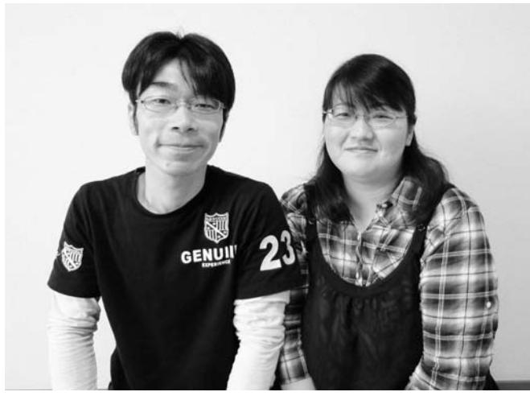

▲崇さん(左)と貴世美さん

金澤崇さんは、妻の貴世美さんと東京都江東区の借り上げアパートで生活しています。 原発・放射線の危険性を考え県外に暮らしています。震災から1年が経ち、被災者としてのこれまでの生活から、一歩前に進めなければならないと考えています。

震災によって請戸の自宅は流されましたが、家族が無事であったことが救いでした 。 親戚を頼り、小高区、相馬市そして東京を転 々 とし、現在の都営住宅に住むことになりました 。 知らない土地でしたが、江東区やご近所の方に大変良くしていただきありがたく思っています 。 東京湾に近いため、船を見かけたり、潮の香りを感じたりすると請戸を思い出してホッとします 。 正直、若いころは浪江の田舎暮ら

すると、ついつい次の一歩を踏み出せずにいる自分を感じます 。 早く自分の生活拠点をどこにするのかを決め、自分たちの暮らしを前に進めて行かなければと思っています 。 少しでもこれからの暮らしを描くため、できるだけ関東地域で開催される町民の交流の場などには参加して、皆さんの声を聞くようにしています 。 東京に来ても、時折会ったり、連絡を取っている浪江の仲間との関係は、今の自分たちを支えています 。 本当にふるさとは心のより所ですね 。 浪江があるから今の自分たちがいる 。 頭の中に鮮明に浮かぶふるさとの風景が心の支えです 。 自分たちの記憶の中にあるふるさとのにおい、音、満天の星空などを、いつか次の世代に伝えたい 。 県外に暮らす方向性を描きながら、そんな思いも強くしています 。 何だか矛盾していますね 。 でもきっと、そう思い続けられることが、離れていても町民であり続けることのように思っています 。

 福島の避難所、山形のホテルを経て、2年前まで奥さまの両親が住んでいた街で、奥さまと奥さまのご両親そして愛猫ポルカと暮らしています。

当初、妻と妻の両親、長男の哲平と一緒に、福島の避難所、山形のホテルなどを転 々 とし、 6 カ所目に越してきたのは、昨年の 8 月 25 日です 。 82 歳になる義父は震災当時、南相馬市の病院に入院していました 。 震災後 4 日目に、病院から 「 医師や看護師が不足し薬品も無く治療ができないので、早急に患者を引き取って欲しい 。」 と連絡がありました 。 義父の状態は芳しくなく、山形県の各病院に入院を拒否され本当に困り果てました 。 入院先が見つかるまでということでやっと病院に置いてもらいました 。 義父が 2 年前まで住んでいた世田谷区経堂の関東中央病院にお願いして、ようやく転院することができました 。 救急病院なので、原則 3 カ月間の入院です 。 容態は安定して来ましたが、病状の関係で受入れ病院や施設が見つかりません 。 世田谷区が提供してくれた避難者用住宅での在宅介護も難しく、 5 カ月後に退院して、民間のマンションでの在宅介護を始めました私 。 は浪江町で会社勤めをしていましたが、フランスの音楽院

で学び音楽家としての道を歩み始めていた長男と妻の 3 人で音楽教室を運営していました 。 自宅兼教室には 5 台のピアノを置き、 4 人の講師とともに子どもたちを指導していました 。 あの震災で、すべてが変わりましたが、おかげさまで全日本ピアノ指導者協会が窓口になり、会員の先生からピアノを譲り受け、妻はこちらでピアノを指導しています 。 また、出張指導やコンクール審査で不在も多く、私が住宅で義父の介護を担っています 。 長男は再びウイーンに行き、昨年 9 月から音楽院に在学しています 。 来年の春には福島県内のコンサートを希望しています 。 被災地支援のためのチャリイテイコンサートは数多く開催されますが、被災地で活動していた音楽家のコンサートを応援していただきたいと思います 。 津波で親戚 6 人が亡くなりました 。 多くの人がそうであるように、失ったものがあまりに大きすぎます 。 それでも、生かされていることに感謝し、前向きに明るく生きて行かなければなりません 。 高齢の妻の両親が 「 生きていて良かった 。」 と生涯を

> 遂げることができるよう、妻がピアノ教師として指導が続けられるよう、そして、長男が音楽家として日本での実績を重ねることができるようにと願っています 。 諦めることもたくさんあります 。 それでも希望を持ち、胸を張って生きて行きたいと思うのです 。 浪江町の美しい風景、出会えた人 々 、 30 年過した日 々 のすべてが宝です 。 皆さまに心より感謝と希望、そして慈しみの愛を込めて本当にありがとうございました 。

▲左から隆幸さん、義母の文子さん、奥さまの満江さん、義父の秀夫さん

 現在は会津若松市舘馬町の借上げ住宅で、ペットと一緒にご主人と2人暮らしです。「会津地方なみえ会」の活動を通して、会津地方に避難されている浪江町の皆さんと、コミュニケーションの輪を繋げていきたいと考えていらっしゃいます。

浪江町では、仙台屋の屋号で江戸末期から続く家業の販売店を夫婦で経営していました 。 住まいにしていた古民家を利用し、息子が居酒屋をオープンする予定でしたので、震災のあった当日は、蔵の中を息子と二人で整理していたところでした 。 幸い蔵の外に出ており、店内にいた主人もけがはありませんでしたが、警察の方たちが 「 津波が来るから高台へ避難してください 」 とふれまわっていたので、飼っていた犬・猫を連れ家族 3 人で、

▲ご主人の貢さん、ペットのさくらちゃんと一緒に暮らす安子さん。

上ノ原の知人宅へ避難しました 。 翌日、原発事故があり避難命令が出たので、道 々 に誘導されるままに、津島地区にある浪江高校の分校へと身を寄せました 。 水道やトイレ、電話も使えない状況でしたが、避難した人たちが皆落ち着いて行動していましたので、まだこのころは、私たちもじきに浪江の家に帰れるだろうと思っていました 。 情報が入ってくるにつれ、原発事故の不安が大きくなり、 14 日には妹家族や友人家族と一緒に、会津若松市の総合体育館へ避難しました 。 約 1 カ月半お世話になりましたが、暖かい場所を提供してくれた市、おいしい食事を作ってくれた地元ボランティアの人たちへの感謝の気持ちは決して忘れることはないでしょう 。 その後、猪苗代町の観光ホテルや、ペンションに 2 カ月半近くお世話になり、 7 月 16 日にようやく現在の家に落ち着くことができました 。 仕事の関係で、息子とは別 々 の生活になりましたが、ペット同伴でも住居可能な家を探してくれたおかげで、

| 「 会 0 津 9 地 0 方 ― な 6 み 7 え 8 会 9 」 ― 2 6 2 1 | く ま だ す さ の い で 。 、 ぜ ひ お 気 軽 に ご 連 絡 | 会 長 さ ん は じ め 皆 で 頑 張 っ て い | る よ う に お 手 伝 い が で き れ ば と 、 | も っ た 負 担 が 、 少 し で も 軽 く な | の で す 。 避 難 す る こ と で 心 に 積 | 行 事 や 、 会 話 は と て も 楽 し い も | な が ら 、 集 ま っ て 過 ご す 季 節 の | ミ ュ ニ ケ ー シ ョ ン の 輪 を ひ ろ げ | 避 難 し て い る 浪 江 の 皆 さ ん と コ | に 参 加 し て い ま す 。 会 津 地 方 に | 私 は 今 、「 会 津 地 方 な み え 会 」 | ち の 心 は 浪 江 に あ る の で す 。 | い と こ ろ で す が 、 や っ ぱ り 私 た | し た 。 会 津 地 方 も 自 然 豊 か な 良 | や 山 に 恵 ま れ た と て も 良 い 町 で | の 幸 せ を つ く づ く 感 じ ま す 。 海 | 町 で 過 ご し て き た 何 で も 無 い 日 々 | こ う し て 離 れ て み る と 、 浪 江 | が た く 思 っ て い ま す 。 | 本 当 に 良 く し て い た だ い て あ り | の 方 や 、 学 生 時 代 の 友 人 か ら も | れ る こ と も な く 、 ま た 、 ご 近 所 | 可 愛 が っ て い た 犬 や 猫 た ち と 離 |
|-----------------------------------------------------------------------------------------------------------------|---------------------------------------------------------------------------------------------|--------------------------------------------------------------------|-------------------------------------------------------------------------|--------------------------------------------------------------------|--------------------------------------------------------------------|--------------------------------------------------------------------|--------------------------------------------------------------------|--------------------------------------------------------------------|--------------------------------------------------------------------|--------------------------------------------------------------------|----------------------------------------------------------------|---------------------------------------------------------------|--------------------------------------------------------------------|--------------------------------------------------------------------|--------------------------------------------------------------------|--------------------------------------------------------------------|-------------------------------------------------------------------------|---------------------------------------------------------------|------------------------------------------------|--------------------------------------------------------------------|--------------------------------------------------------------------|--------------------------------------------------------------------|--------------------------------------------------------------------|
|-----------------------------------------------------------------------------------------------------------------|---------------------------------------------------------------------------------------------|--------------------------------------------------------------------|-------------------------------------------------------------------------|--------------------------------------------------------------------|--------------------------------------------------------------------|--------------------------------------------------------------------|--------------------------------------------------------------------|--------------------------------------------------------------------|--------------------------------------------------------------------|--------------------------------------------------------------------|----------------------------------------------------------------|---------------------------------------------------------------|--------------------------------------------------------------------|--------------------------------------------------------------------|--------------------------------------------------------------------|--------------------------------------------------------------------|-------------------------------------------------------------------------|---------------------------------------------------------------|------------------------------------------------|--------------------------------------------------------------------|--------------------------------------------------------------------|--------------------------------------------------------------------|--------------------------------------------------------------------|

## 山田かよ子さん(加倉)

取材者:NPO法人市民公益活動パートナーズ古山・松田取材日:6月9日 「平成24年7月広報なみえ掲載」

#### 帰りたい想いと、現実との間で

県の救護施設「ひまわり荘」に隣り合う自宅に、義母と夫との3人暮らし。3月11日、かよ子さんは自宅で手芸をしており、手掛けていた作品は、今でもその日のまま手元に持っていらっしゃいます。

南相馬市に嫁いだ娘さんご家族はいわき市に、大熊町に住んでいた息子さんたちは会津へと、震災前は近くに住んでいた家族が散り散りとなってしまい、お孫さんたちにもなかなか会えないそうです。

■ 母と娘、 2 人の記念のキャンドルを灯して 11 日当日、津波が起きたことは防災無線でおぼろげに知りましたが、海岸線から遠くにある自宅には、停電していたものの食料などの備えはあったので、近所の方 々 と避難せずに過ごしていました 。 3 月 14 日は私たちの結婚記念日で、その記念のキャンドルと、地震で倒れてきたタンスにしまってあった娘の結婚記念のキャンドルをともに灯しながらの数日間でした 。 当時、私たちは原発で起こっている事故はほとんど知らず、 2 回目の爆発が起きた 15 日、夫の友人や隣組の方 々 と早目の夕食を終えたところに自衛隊の方 々 が来られました 。 すでに嫁ぎ先の家族と一緒に秋田へ避難していた娘が、私たちの状況を自衛隊に連絡していたそうで、直ぐに帰れるだろうと思いつつ、みんなで東和の体育館に避難しました 。 無我夢中で家を出たため、私も夫も携帯電話を置き忘れ、子どもたちや親戚、友人たちとの連絡にとても苦労をしたり、自衛隊の車で避難したために自家用車もなく、途方に暮れたり

| ど の 手 配 を 国 や 町 に お 願 い し た                                                                                       | め て 屋 根 の 修 理 や 庭 の 草 刈 り な | で す ぐ に 生 活 が で き る よ う 、 せ | は 困 難 だ と 思 い ま す の で 、 自 宅 | 工 さ ん や 屋 根 屋 さ ん を 捜 す こ と | ち の よ う に つ て の な い 者 に は 大 | 帰 る こ と が で き る な ら ば 、 私 た | し い 思 い を し て い ま す 。 浪 江 に | 大 地 震 で 家 の ぐ し は 壊 れ 、 玄                                                                                                                                                  | … わ ず か な 期 待 が 心 の 支 え | ■ 帰 る こ と が 出 来 る か も し れ な い |  |                                                                    |                                                                    |                                                                    | と い う 理 由 で 選 び ま し た が 、 昨 | 仮 設 住 宅 は 、 浪 江 町 に 最 も 近 い | こ の 二 本 松 市 大 平 農 村 広 場 の | で 過 ご し ま し た 。 | の ペ ン シ ョ ン で 4 月 か ら 9 月 ま | ン タ ー に 移 り 、 そ の 後 、 裏 磐 梯 | し ま し た 。 翌 日 に は 木 幡 住 民 セ |
|----------------------------------------------------------------------------------------------------------------------------------------------------------|--------------------------------------------------------------------|--------------------------------------------------------------------|--------------------------------------------------------------------|--------------------------------------------------------------------|--------------------------------------------------------------------|--------------------------------------------------------------------|--------------------------------------------------------------------|----------------------------------------------------------------------------------------------------------------------------------------------------------------------------------------------------------------|----------------------------------------------------------|-------------------------------------------------------------------------|--|--------------------------------------------------------------------|--------------------------------------------------------------------|--------------------------------------------------------------------|--------------------------------------------------------------------|--------------------------------------------------------------------|---------------------------------------------------------------|--------------------------------------|--------------------------------------------------------------------|--------------------------------------------------------------------|--------------------------------------------------------------------|
| ま い 私 で す す 。 は 。 震 長 災 年 、 前 日 手 の 芸 3 に 月 親 し 10 日 ん 、 で 町 い |                                                                    |                                                                    |                                                                    |                                                                    |                                                                    |                                                                    |                                                                    | び は 関 に 荒 も 、 れ 2 朽 放 階 ち 題 も て で 雨 い す 漏 く 。 り 家 一 が を 時 ひ 見 帰 ど て 宅 く は の 、 悲 た 庭 |                                                          |                                                                         |  | に は ず い ぶ ん 悩 ま さ れ ま し た 。 | 山 間 を 吹 く 強 風 と 住 宅 内 の 結 露 | 長 い つ ら ら に び っ く り し た り 、 | 年 の 冬 は ご ぼ う の よ う な 太 く 、 |                                                                    |                                                               |                                      |                                                                    |                                                                    |                                                                    |
|                                                                                                                                                          |                                                                    |                                                                    |                                                                    |                                                                    |                                                                    |                                                                    |                                                                    |                                                                                                                                                                                                                |                                                          |                                                                         |  |                                                                    |                                                                    |                                                                    |                                                                    |                                                                    |                                                               |                                      |                                                                    |                                                                    |                                                                    |
|                                                                                                                                                          |                                                                    |                                                                    |                                                                    |                                                                    |                                                                    |                                                                    |                                                                    |                                                                                                                                                                                                                |                                                          |                                                                         |  |                                                                    |                                                                    |                                                                    |                                                                    |                                                                    |                                                               |                                      |                                                                    |                                                                    |                                                                    |
|                                                                                                                                                          |                                                                    |                                                                    |                                                                    |                                                                    |                                                                    |                                                                    |                                                                    |                                                                                                                                                                                                                |                                                          |                                                                         |  |                                                                    |                                                                    |                                                                    |                                                                    |                                                                    |                                                               |                                      |                                                                    |                                                                    |                                                                    |
|                                                                                                                                                          |                                                                    |                                                                    |                                                                    |                                                                    |                                                                    |                                                                    |                                                                    |                                                                                                                                                                                                                |                                                          |                                                                         |  |                                                                    |                                                                    |                                                                    |                                                                    |                                                                    |                                                               |                                      |                                                                    |                                                                    |                                                                    |
|                                                                                                                                                          |                                                                    |                                                                    |                                                                    |                                                                    |                                                                    |                                                                    |                                                                    |                                                                                                                                                                                                                |                                                          |                                                                         |  |                                                                    |                                                                    |                                                                    |                                                                    |                                                                    |                                                               |                                      |                                                                    |                                                                    |                                                                    |
|                                                                                                                                                          |                                                                    |                                                                    |                                                                    |                                                                    |                                                                    |                                                                    |                                                                    |                                                                                                                                                                                                                |                                                          |                                                                         |  |                                                                    |                                                                    |                                                                    |                                                                    |                                                                    |                                                               |                                      |                                                                    |                                                                    |                                                                    |

べた作品を撮影してくださいました 。 その写真は、今では私の一番の宝物です 。 また、 2 月に取材を受けたNHK 「 すてきにハンドメイド 」 の放映は避難先で観ました 。 叶うならば、自宅で以前のように作品作りを楽しんだり、時にはお教えしたりしたいです 。 夫と 2 人、帰町へのあわい期待とふるさとへの愛着を抱きつつ、一日も早い結論を今か今かと待つ毎日を送っています 。

▲夫仁さんとご一緒に、作品を手にして。

福島県

取材者:NPO法人市民公益活動パートナーズ古山・阿部取材日:6月12日 「平成24年7月広報なみえ掲載」

#### 今までは守っているつもりでしたが、いつもお互いが支え合っていることに気づかされました

これからです。

昨年3月11日、東日本大震災が発生したときには、富岡消防署での勤務中だったそうです。 大堀でともに暮らしていた隆充さんのご両親と子どもたちの4人は、翌朝すぐに本宮市の親戚を頼って避難しました。一方、南相馬市で看護師をしていた奥さんは翌日も勤務だったため、実家の両親とともに避難所で一夜を明かし、子どもたちや家族とは13日に本宮の避難先で合流しました。 隆充さんが再び家族に会えたのは19日、8日ぶりでした。現在は、ご両親とは別に親子4人で暮らし、1時間以上をかけて現在の勤務先である楢葉分署に通っていらっしゃいます。

| 外 り い 次 事 て 間 て 本 い り し ■ 、 の い の な ぎ 故 翌 い 部 状 、 て 大 に 自 た 車 日 な 地 重 方 が 、 や ま を 態 1 い 分 ぶ も か ね 震 々 ら 避 注 12 し 立 で 1 た の ん 使 っ ま の 、 難 水 日 た ち し 9 富 と 家 1 っ た し 搬 一 誘 に の 。 上 た 番 岡 津 族 時 て と た 送 人 導 伴 明 11 げ か 通 消 波 を 間 対 思 け 発 な 暮 の う 日 、 ら 報 防 探 く 応 い ど ら 広 ト 方 か 救 、 も 署 生 す ら し ま も し 報 ラ か ら 助 署 受 は 当 想 い ま す 救 や 活 ブ ら の 活 内 信 停 時 い し し 。 急 寝 動 ル は 約 動 に で 電 、 を か た 車 た も が 原 1 を 指 き と 勤 仕 眠 。 以 き 行 相 発 っ 週 し 揮 な な 務 事 | ▲ご自宅近くのレストランにて。満面の笑顔は、 |
|---------------------------------------------------------------------------------------------------------------------------------------------------------------------------------------------------------------------------------------------------------------------------------------------------------------------------------------------------------------------------------------------------------------------------------------------------------------------------------------------------------------------------------------------------------------------------------------------------------------------------------------------------------------------------------------------------------------------------------------------------------------------------------------------------------------------------------------------------------------------------------------------------------------------------------------------------------------------------------------------------------------------------------------------------------------------------------------------------------|------------------------|
|---------------------------------------------------------------------------------------------------------------------------------------------------------------------------------------------------------------------------------------------------------------------------------------------------------------------------------------------------------------------------------------------------------------------------------------------------------------------------------------------------------------------------------------------------------------------------------------------------------------------------------------------------------------------------------------------------------------------------------------------------------------------------------------------------------------------------------------------------------------------------------------------------------------------------------------------------------------------------------------------------------------------------------------------------------------------------------------------------------|------------------------|

| く 感 じ ま し た 。 | に 人 ま 支 た し え ち た ら が が れ 本 、 て 当 訪 い に れ る 優 る の し 先 だ く で と 、 触 つ 人 れ く は 合 づ 人 う | 東 京 や 富 山 、 新 潟 な ど へ 出 か け | も た ち の リ フ レ ッ シ ュ の た め に | 落 ち 着 い て か ら で す が 、 子 ど | な い ほ ど に 涙 が あ ふ れ ま し た 。 | と い う も の も あ っ て 、 運 転 で き | 「 空 メ ー ル で も い い か ら 返 事 を 」 | 切 れ な い ほ ど 入 っ て い ま し た 。 | 在 着 信 や 留 守 電 、 メ ー ル が 数 え | 大 切 に 想 っ て い る 人 た ち か ら 不 | ご ろ お 付 き 合 い の あ る 方 々 な ど 、 | の 友 人 や 消 防 学 校 の 同 期 生 、 日 | と 、 家 族 は も ち ろ ん 、 大 学 時 代 | 村 で ふ と 携 帯 を 見 ま し た 。 す る | 町 を 出 て 携 帯 電 話 の 通 じ る 都 路 | で 休 み を 取 る こ と に な り 、 富 岡 | 災 害 発 生 か ら 1 週 間 後 、 交 代 | く 思 い ま し た 。 | 結 し て い た な ぁ と 後 か ら つ く づ | る と い う 想 い で 、 本 当 に 一 致 団 | わ け で す か ら 、 我 々 が こ こ を 守 | 京 電 力 の 関 係 者 し か い な か っ た | も 原 発 か ら 避 難 さ れ 、 消 防 と 東 | と も か く 、 地 域 の 消 防 団 の 方 々 |
|---------------------------------|----------------------------------------------------------------------------------------------------------------------------------------------------------------------------------------------------------------|--------------------------------------------------------------------|--------------------------------------------------------------------|---------------------------------------------------------------|--------------------------------------------------------------------|--------------------------------------------------------------------|-------------------------------------------------------------------------|--------------------------------------------------------------------|--------------------------------------------------------------------|--------------------------------------------------------------------|-------------------------------------------------------------------------|--------------------------------------------------------------------|--------------------------------------------------------------------|--------------------------------------------------------------------|--------------------------------------------------------------------|--------------------------------------------------------------------|---------------------------------------------------------------|---------------------------------|--------------------------------------------------------------------|--------------------------------------------------------------------|--------------------------------------------------------------------|--------------------------------------------------------------------|--------------------------------------------------------------------|--------------------------------------------------------------------|
|---------------------------------|----------------------------------------------------------------------------------------------------------------------------------------------------------------------------------------------------------------|--------------------------------------------------------------------|--------------------------------------------------------------------|---------------------------------------------------------------|--------------------------------------------------------------------|--------------------------------------------------------------------|-------------------------------------------------------------------------|--------------------------------------------------------------------|--------------------------------------------------------------------|--------------------------------------------------------------------|-------------------------------------------------------------------------|--------------------------------------------------------------------|--------------------------------------------------------------------|--------------------------------------------------------------------|--------------------------------------------------------------------|--------------------------------------------------------------------|---------------------------------------------------------------|---------------------------------|--------------------------------------------------------------------|--------------------------------------------------------------------|--------------------------------------------------------------------|--------------------------------------------------------------------|--------------------------------------------------------------------|--------------------------------------------------------------------|

■ 父の早い判断が、家族を守ってくれたと思います大堀相馬焼の窯元をしていた父が、母と子どもたちを連れて 12 日の 1 号機爆発の直後に、本宮の親戚を頼って移動してくれました 。 この判断がなければ、食事も満足になく、厳しい寒さの中、避難所で過ごさなければならなかったでしょう 。 また、ボランティア活動を希望した父が避難先である本宮市役所に問い合せに行ったことが縁で、今の借上げ住宅に入居できました 。 私たちも一時、同じ住宅に住みましたが、水回りが不便なため転居しました 。 子どもたちの学校環境を変えずにすむのならば、一軒家を借りて再び 6 人家族で暮らしたいのですが、なかなか適当な住まいが見つかりません 。 浪江には帰りたい 。 でも帰れないかもしれないという想いの狭間で心が揺らぎます 。 特に子どもたちから 「 いつ帰れる ? 」 と聞かれるとなおさらです 。 私は、長い時間がかかっても、大堀で前と同じような暮らしに戻りたいと願っています 。

## 小野田真仁さん・祥子さん(権現堂)

取材者:NPO法人まちなか研究所わくわく宮道・下地取材日:6月6日 「平成24年7月広報なみえ掲載」

#### また両親、兄弟、従兄みんなで集まりたい

浪江町で生まれ育った小野田さんご夫妻。権現堂字南深町では、美容室 「SWORD」を経営。昨年6月6日に沖縄へ渡り、現在は与那原町で家族4人で生活をしています。

| き た 浪 い 江 で に す い ね た 。 こ ろ は 、 シ ョ ッ ピ ン | て 、 子 ど も も 大 好 き で す 。 焼 き そ |                                                                         |                                                                         |             | 子 ど も に と っ て す ご し や す い 環 境 | 近 く の 公 園 で 遊 ぶ こ と も で き て 、 | 子 ど も に も た く さ ん 友 だ ち が で き 、 | れ る の で 、 す ご く 心 地 が い い で す 。 | 縄 人 )」 の よ う に 対 等 に 接 し て く | な く 、 同 じ 「 ウ チ ナ ー ン チ ュ ( 沖 | 先 生 方 も 私 た ち を 「 被 災 者 」 で は | 沖 縄 で は 、 職 場 の 方 も 保 育 園 の | ま し た 。 | で 話 を し て 沖 縄 に 行 く こ と を 決 め | る の は 勇 気 が 必 要 で し た が 、 夫 婦 | 勘 も 身 内 も い な い 沖 縄 で 生 活 を す | て し ま い 不 安 な 毎 日 で し た 。 土 地 | 風 呂 の 水 は 本 当 に 安 全 ? 」 と 思 っ | 「 歯 み が き す る 水 は 大 丈 夫 ? 」「 お | 生 活 し て い ま し た が 、 ど う し て も | 県 へ 避 難 し 、 そ の 後 福 島 県 に 戻 り | た か ら で す 。 震 災 後 は 、 一 度 新 潟 | か ら 一 番 遠 い 沖 縄 な ら 安 心 と 思 っ | は 、 子 ど も が ま だ 小 さ い の で 原 発 | 沖 縄 で 生 活 を ス タ ー ト さ せ た の | ■ 子 ど も の 環 境 に 良 い 沖 縄 へ |
|-------------------------------------------------------------------------------------------------------|-------------------------------------------------------------------------|-------------------------------------------------------------------------|-------------------------------------------------------------------------|-------------|-------------------------------------------------------------------------|-------------------------------------------------------------------------|------------------------------------------------------------------------------|------------------------------------------------------------------------------|---------------------------------------------------------------------|-------------------------------------------------------------------------|-------------------------------------------------------------------------|--------------------------------------------------------------------|------------------|-------------------------------------------------------------------------|-------------------------------------------------------------------------|-------------------------------------------------------------------------|-------------------------------------------------------------------------|-------------------------------------------------------------------------|--------------------------------------------------------------------------|-------------------------------------------------------------------------|-------------------------------------------------------------------------|-------------------------------------------------------------------------|-------------------------------------------------------------------------|-------------------------------------------------------------------------|--------------------------------------------------------------------|---------------------------------------------------------------|
|                                                                                                       |                                                                         | な み え 焼 そ ば 。 麺 が 太 く 味 が 濃 く | 沖 縄 に 来 て も 食 べ た く な る の は 、 | し た い | ■ 浪 江 に 戻 れ る な ら 普 通 の こ と が | で す 。                                                             |                                                                              |                                                                              |                                                                     |                                                                         |                                                                         |                                                                    |                  |                                                                         |                                                                         |                                                                         |                                                                         |                                                                         |                                                                          |                                                                         |                                                                         |                                                                         |                                                                         |                                                                         |                                                                    |                                                               |

ず、永住の地を決めることは簡単ではありません 。 ■ 両親、兄弟、みんなに会いたい浪江にいたころは、両親、兄弟、祖父母、従兄など親戚が近くに住んでいました 。 誕生日を迎える人がいれば、祖父母の家に集まりお祝いをするなど、祝い事やクリスマス、正月、何かあるたびに親戚が自然と集まって一緒に時間を過ごしました 。 以前は会いたいときにすぐに会えたのに、今は福島、茨城、埼玉などみんなバラバラでなかなか会えなくさみしいです 。 両親、兄弟、従兄みんなにはいつでも会いたい 。 また昔のようにみんなで集まりたいです 。

▲小野田さんご一家。祥子さん(左上)、真仁さん(右上)、優ちゃん(左下)、佳桜ちゃん(右下) ゆうかお

#### 吉川裕子さん(権現堂) 福島の民謡の語り部みちのくの会代表

取材者:きょうとNPOセンター田口取材日:6月10日 「平成24年7月広報なみえ掲載」

ふるさとを語り継ぎ、ふるさとの絆をつないでいきたい

吉川さんは、震災直後に大阪に避難して以来、ふるさとの浪江町・福島を想い、近畿圏や関西圏各地で、福島の民話と自身の被災体験を伝える「語り部」としての活動を精力的に続けています。また、近隣に避難している被災者に対してもさまざまな情報を送り続け、自らコミュニケーションの機会をつくるなど、ふるさとの絆をつないでこられました。

生まれ育った土地 … 浪江町には、たくさんの思い出が詰まっています 。 私自身と家族の歴史があり、ドラマがあります 。 浪江町はのどかで食べ物はおいしく、人情の厚い場所 。 生きていくには最高のところです 。 震災後、大阪に来てからは、 「 語り部 」 として福島の民話を伝える活動だけでなく、被災時のことを方言で話す講演活動も続けています 。 講演回数は 1 0 0 回を超えました 。 また、被災者同士が助け合うための支援活動の代表もつとめてきました 。

震災の日から 1 年以上経過した今、被災者や被災地に対する社会全体の意識が薄れてきていることも感じています 。 心ない言動に傷つくこともありました 。 昨年、谷村新司さんのコンサートに招待されたとき、コンサート終了後、別室に集まった私たち被災者に向けて、谷村さんが 「 一緒にがんばりましょう 」 という言葉をかけてくれました 。 「 がんばってください 」 という言葉ではなく 「 一緒に … 」 と言ってもらったことが本当にうれしかった 。 そしてみんなで童謡 『 ふるさと 』 を歌い、泣きました 。 今の一番の希望は、「 一晩でいいから、浪江町に戻って自分の布団の中で大の字になって寝たい 」 ということ 。 ご先祖さまのお墓参りをしたり、運営をしていた託児所ベビーハウスピノキオに通っていた子どもたちにも会いたいです 。 家族が年に数回集まる場所 … ふるさとが恋しい 。 でも、希望を失ってはいません 。 後悔しない人生を生き抜きたい 。 これからも私に伝えられることを精一杯伝えていきたいと思います 。

## 明治輝子さん(幾世橋)

取材者:NPO法人市民公益活動パートナーズ古山・土谷取材日:7月11日 「平成24年8月広報なみえ掲載」

## 畑を耕しながら、心も耕しています福島県

大震災当日、瓦が流れ落ちるように崩れる公民館から自宅に戻ったものの、津波から逃れるために、直ぐに時雨の降る寒い中を車に毛布3枚だけを積み込み、ご主人と愛犬と一緒に町外れに避難。翌日には原発事故が起こり、原町を経由して川俣へ向かい、スーパーの駐車場で更に一夜を明かしました。13日には福島市へ。市内のアパートでの避難生活を経て、昨年夏、伊達市保原の戸建て住宅に移り、今は庭や畑仕事を楽しみながら暮らしていらっしゃいます。

■ 差し入れの温かいおにぎりに、人のありがたさが心底浸みました福島市に避難しアパートを借りましたが、着のみ着のままの寒い夜が何日も続きました 。 そうした不安な日 々 の中、近所の女性が温かいおにぎり、お味噌汁、煮物に漬物などの三度三度の食事を、私たちの生活が整うまでの 3 週間余り届けてくださいました 。 その上、お風呂までいただきました 。 誰も知り合いのない見知らぬ土地での親切に、ただうれしく、感謝しながら家族で涙しました 。 大災害が発生するほんの数日前、浪江町のサンシャイン浪江で行われた 「 親鸞 」 についての講演会で聴いた 「 明日ありと思う心の仇桜、明日はあらしが吹かぬものかは 」 という一節が忘れられません 。 この世の中で、このような豊かな文化に浸りながら、まさかこんな出来事が起きるはずもないと信じ切って過ごしてきました 。 しかし、この大地震と津波、追い打ちをかけた原発事故の恐ろしさに驚き、折れかかった当時の心に、このあだざくら

スも咲き出しました 。 浪江の家や庭のことを思い巡らすと寂しい気持ちになりますが、遠く離れていても、あの請戸の潮の香りや緑の大地など、思い出が山のように積もった故郷を思い出しながら、支え合って過ごしています 。 そして、あちこちで浪江の皆さまの素敵な笑顔に会えますように 。

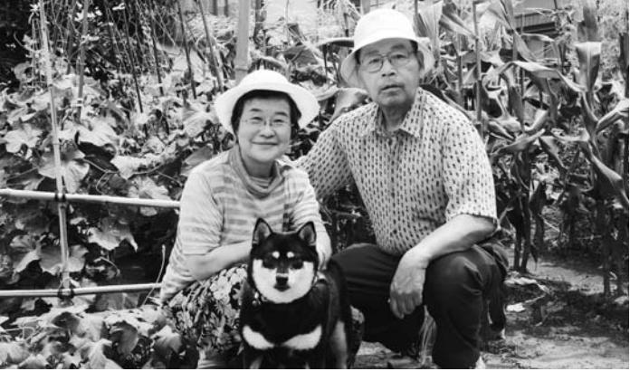

▲ご主人と愛犬のはなちゃん、丹精込めた畑。 大好きなものに囲まれて。

杤本益雄さん(室原)

取材者:元気玉プロジェクト棚木取材日:7月11日 「平成24年8月広報なみえ掲載」

#### 人の縁を大切にして、残りの人生を笑顔で

▲猪苗代町の住まい前で奥さまのシスエさんとともに。

現在は猪苗代町の一軒家に奥さまと2人暮らしの杤本さん。おきてしまった災害にくよくよせず、残りの人生に楽しみをみつけながら、笑顔で過ごしていきたいと考えていらっしゃいます。

浪江町では、曾祖父の代から酪農を営んできました 。 娘の結婚を期に若夫婦に農場を譲って引退し、ときどきは牛の世話を手伝いながら、趣味の詩吟やカラオケを楽しむ日 々 を過ごしていました 。 震災当日も、カラオケ好きな近所の人たちが集まり自宅で歌っていました 。 大きな揺れに、座ったまま互いに支えあうのが精一杯でした 。 翌日、家の前の国道は隙間もないほど車の行列ができ、それ

が 3 日間続きました 。 私は歳のせいか少 々 耳が遠いためラジオも持っておらず、防災無線も聞こえなかったので、地震の後に浜へ津波が押し寄せた事も知らずにいたのです 。 せいぜい 4 、 5 日もすれば落ち着くだろうと思い、なにより 50 頭程いる牛の世話があったので、避難せずに自宅で生活をしていました 。 自家発電もあり、水は裏山の湧き水を使っていたので不自由はありませんでしたが、毎日 3 0 0 リットルもの牛乳を搾っては捨てていました 。 10 日ほど過ぎたころ、自衛隊の車が私たち家族 4 人を迎えに来て、すぐに避難するようにと言うので、わずかな貴重品だけを持ち家を離れました 。 二本松市の避難所で放射能の検査を受け、心配して集まっていた親戚や友人・知人の話で、ようやく状況を把握することになったのです 。 二本松市針道の避難所で 2 日間生活しましたが、寒さが厳しく、身体が思うように動かせなくなったので、嫁いだ娘を頼り茨城県へ避難しました 。 一変し

た生活のストレスや疲れで、一時は自力で立つこともできなくなりました 。 昨年 7 月からは、猪苗代町で避難生活をしている娘夫婦の縁で一軒家を借してもらい、夫婦 2 人で暮らしています 。 近所の方も気の良い人たちばかりで、良い巡り合わせに感謝していますこ 。 れまでの人生を振り返れば、いろいろな経験をして楽しく働き、実に幸せなものでした 。 正直、代 々 受け継いだ家を離れるのは寂しく、処分せざるをえなかった牛たちのことを思えば心が痛みます 。 ですが、落ち込む私を慰めてくれた兄弟や子ども、孫たちのおかげで、今では残りの人生を怒り嘆くよりも、笑って過ごしたいと思えるようになりました 。 何歳になっても家族の絆はとても心強いものだと感じます 。 9 月には親族が集まる 「 兄弟会 」 を予定しています 。 私は詩吟やカラオケで、妻は手芸で日 々 の暇を埋めながら、その日を心待ちにしています 。

黒坂信一さんは、妻の佐津樹さんと3人の子どもたちと埼玉県の借り上げ住宅で生活しています。震災前の4世代同居の暮らしから、親子5人の暮らしにと生活は大きく変わりました。 さつき

浪江では、両親と祖母、私たち夫婦と子どもたち 3 人の 8 人で暮らしていました 。 津島の避難所に 1 泊した後、親戚を頼って 3 月 15 日に埼玉に来ました 。 親戚宅に 10 日間ほど居候した後、両親と祖母は福島に戻り、今は借り上げ住宅で暮らしています 。 私たち夫婦と子どもたちは、私の仕事の関係や子どもたちの学校のことを考え、埼玉での暮らしを選びました 。 今、住んでいる家は埼玉県の借り上げ住宅で、

▲左から流星くん、美桜ちゃん、心夢ちゃん、佐津樹さん、信一さん

| く た め に も 、 状 況 を 受 け 入 れ 、 | 子 ど も た ち を 励 ま し 、 支 え て い | る じ ゃ な い 。」 と 答 え た そ う で す 。 | で き な い こ と が 、 た く さ ん で き | 便 利 だ し 、 楽 し い よ 。 浪 江 で は | 映 画 館 に も 行 け る し 、 買 い 物 も | 楽 し い の ? 」 と 聞 か れ 、「 う ん 、 | 長 男 の 流 星 に 「 こ こ の 暮 ら し は | て い る よ う で す 。 先 日 、 妻 は 、 | A の 役 員 を 引 き 受 け 、 忙 し く し | 自 分 も 何 か 始 め な け れ ば と P T | た ち も 頑 張 っ て い る の だ か ら 、 | い ま す 。 妻 の 佐 津 樹 は 、 子 ど も | ち も で き た よ う で 、 ほ っ と し て | ど も た ち は 学 校 に な じ み 、 友 だ | 年 。 私 た ち の 不 安 を よ そ に 、 子 | こ こ で の 暮 ら し も も う す ぐ 1 | 時 期 で 、 と て も 不 安 で し た 。 | 験 の 準 備 を し な け れ ば な ら な い | き た と き は 中 学 2 年 生 、 高 校 受 | 特 に 、 長 男 の 流 星 は 、 避 難 し て | 友 だ ち が で き る か ど う か で し た 。 | が 学 校 に 慣 れ て く れ る か ど う か 、 | し で 一 番 の 心 配 は 、 子 ど も た ち | 編 入 学 し ま し た 。 埼 玉 で の 暮 ら | 月 か ら 、 近 所 の 学 校 に そ れ ぞ れ | 心 こ こ 夢 ね は 小 学 2 年 生 で す 。 昨 年 4 | 女 の 美 み 桜 お は 小 学 6 年 生 、 次 女 の | 長 男 の り 流 ゅ う 星 せ い は 中 学 3 年 生 、 長 | 昨 年 の 8 月 に 越 し て き ま し た 。 |
|--------------------------------------------------------------------|--------------------------------------------------------------------|--------------------------------------------------------------------------|--------------------------------------------------------------------|--------------------------------------------------------------------|--------------------------------------------------------------------|---------------------------------------------------------------------|--------------------------------------------------------------------|--------------------------------------------------------------------|--------------------------------------------------------------------|--------------------------------------------------------------------|--------------------------------------------------------------------|--------------------------------------------------------------------|--------------------------------------------------------------------|--------------------------------------------------------------------|--------------------------------------------------------------------|---------------------------------------------------------------|---------------------------------------------------------------|--------------------------------------------------------------------|--------------------------------------------------------------------|--------------------------------------------------------------------|-------------------------------------------------------------------------|-------------------------------------------------------------------------|--------------------------------------------------------------------|--------------------------------------------------------------------|--------------------------------------------------------------------|-----------------------------------------------------------------------------------|------------------------------------------------------------------------------|----------------------------------------------------------------------------------------|--------------------------------------------------------------------|
|--------------------------------------------------------------------|--------------------------------------------------------------------|--------------------------------------------------------------------------|--------------------------------------------------------------------|--------------------------------------------------------------------|--------------------------------------------------------------------|---------------------------------------------------------------------|--------------------------------------------------------------------|--------------------------------------------------------------------|--------------------------------------------------------------------|--------------------------------------------------------------------|--------------------------------------------------------------------|--------------------------------------------------------------------|--------------------------------------------------------------------|--------------------------------------------------------------------|--------------------------------------------------------------------|---------------------------------------------------------------|---------------------------------------------------------------|--------------------------------------------------------------------|--------------------------------------------------------------------|--------------------------------------------------------------------|-------------------------------------------------------------------------|-------------------------------------------------------------------------|--------------------------------------------------------------------|--------------------------------------------------------------------|--------------------------------------------------------------------|-----------------------------------------------------------------------------------|------------------------------------------------------------------------------|----------------------------------------------------------------------------------------|--------------------------------------------------------------------|

今の暮らしを楽しむことを大事にしなければと思います 。 今年の 3 月、二本松市で 「 ふるさと学級 」 が開催されました 。 県外に避難している子どもたちも含めて、おおぜいの小中学生が集まりました 。 子どもたちは久しぶりに同級生と会い、とても楽しそうでした 。 離れてみて、浪江には、豊かな自然と人の交流があったなと改めて思います 。 山で採れたきのこやびわ、いちじくをご近所の方からいただいたり、山の紅葉を楽しんだりといったことが思い出されます 。 震災後、心が折れそうになったこともありました 。 私たちと同じように、県外に避難した浪江町の人たちとお会いし、暮らしの苦労をお聞きすることもあります 。 慣れない土地での暮らしで、大変なことはたくさんあります 。 でも、ふるさと浪江に帰れる日が来ることを願って、みんなで前を向いて一緒にがんばっていければと思っています 。

取材者:くびき野NPOサポートセンター野本取材日:7月9日 「平成24年8月広報なみえ掲載」

#### 子どもたちの安全を確保できる場所に、復興の拠点を

震災当日は、福島第一原発で勤務中だったという櫻庭さん。 避難指示以降、家族らとともに郡山市の避難所を経て、一時は両親の実家である秋田市に身を寄せました。その後、職を求めて新潟県柏崎市に転居、妻の貴子さん、高校生の杏奈さん、中学生の乃彩さんの4人家族で生活しています。 きこのああんな

地震の後、会社から家族の安否を確認するよう指示があり、同じ職場にいた妻と必死の思いで自宅を目指しました 。 道は所 々 寸断され、津波によって迂回しなければなりませんでした 。 何とか自宅には辿り着きましたが、いわき市に外出していた高校生の娘の安否がわからず、気が気ではありませんでした 。 そんな状況で 12 日朝に避難指示があり、着の身着のまま、家族、親戚、友人らと一緒に浪江を飛び出しました 。 幸いにも、いわき市の避難所にいた娘は、私たちのもとに向っていた知人の車に同乗することができ、翌日には再会することができました 。 このときばかりはほっとしました 。

新潟県

|             | い 、 何 と か 仕 事 を 見 つ け な く て      |
|-------------|-------------------------------------------------------------------------|
| い た い | そ ん な 中 、 こ の ま ま で は い け な      |
| の 選 択 | う 不 安 が 募 っ て い た と 思 い ま す 。 |
| 過 を 見 | れ か ら 先 ど う な る の か ? 」 と い      |
| し い で | 事 に も 就 け ず 、 娘 た ち に も 「 こ      |
| の 低 い | 生 活 を 送 り ま し た 。 な か な か 仕      |
| い ま す | 秋 田 市 で は 約 2 カ 月 間 、 避 難           |
| 仮 の      | 出 し ま す 。                                                   |
| ま す 。 | い う 不 安 に 駆 ら れ た こ と を 思 い      |
| 奪 わ れ | と は で き な い か も し れ な い 、 と      |
| 取 り か | ぐ り の 雪 の 中 、 も う 家 に 帰 る こ      |
| え な け | に 苦 労 し ま し た 。 日 本 海 の 横 な      |
| 良 い 波 | ン の 販 売 制 限 で ず い ぶ ん と 補 給      |
| 思 い ま | と は 良 か っ た の で す が 、 ガ ソ リ      |
| バ ー を | 宿 で 久 し ぶ り の 風 呂 に 入 れ た こ      |
| 浪 江      | い ま し た 。 途 中 、 新 潟 県 の 温 泉      |
| な ら な | 親 の 実 家 を 頼 っ て 秋 田 市 に 向 か      |
| ち の 安 | 難 す る こ と に な り 、 私 た ち は 両      |
| は 拭 い | 朝 か ら 家 族 ご と に 別 の 場 所 に 避      |
| だ そ の | み ん な で 相 談 し た 結 果 、 16 日          |
| 県 内 に | づ ら い 雰 囲 気 で し た 。                          |
| 応 な ど | に 差 が あ っ て 、 ど う に も 長 居 し      |
| 職 の こ | は 、 原 発 事 故 に 対 す る 危 機 意 識      |
| じ て い | だ 、 私 た ち と 郡 山 の 人 た ち と で      |
| と を 考 | て も 辛 か っ た 。 そ の 上 、 当 時 ま      |
| も ま っ | 房 も 使 え な か っ た の で 寒 く 、 と      |
| し か      | が 室 内 に 入 り 込 む 危 険 か ら 、 暖      |
| 強 工 事 | の 避 難 者 が い ま し た が 、 放 射 能      |
| 3 月 ま | い ま し た 。 そ こ に は 2 0 0 人 程      |
| 市 内 の | 郡 山 ビ ッ グ ア イ の 避 難 所 に 向 か      |
| 新 潟 県 | た 方 が い い と 判 断 し 、 渋 滞 の 中 、 |
| は と 思 | そ の 後 、 原 発 か ら 距 離 を と っ           |

い、会社の勧めもあった柏崎市に職を求めました 。 空き家に入居し、今年ので柏崎刈羽原発の耐震補の現場で働いていました 。 し正直なところ、土地勘たくない場所で将来のこえていくのは難しいと感ます 。 娘たちの進学や就と、自宅のこれからの対も考えると、やはり福島一刻も早く戻りたい 。 た一方で、放射能への不安きれません 。 大切な娘た全だけは確保しなければいと思っています 。 でサーフィンやライフセーしていたことを懐かしくす 。 浪江の海にはいつもがあった … 。 原発事故されば、すぐにでも復興にかれるのに 。 故郷の海をてしまった悔しさを感じ町構想には希望を持ってが、できる限り放射線量場所に候補地を選んでほす 。 そしてその上で、経ながら帰町する、しない肢を私たちに与えてもら 。 それが今の願いです 。

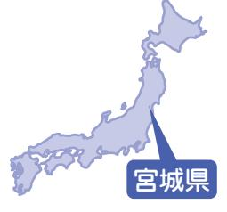

松本静枝さん(川添)

取材者:地域社会デザイン・ラボ遠藤取材日:7月14日 「平成24年8月広報なみえ掲載」

#### いわき市に住居物件を探しています

▲右が静枝さん、左が繁夫さん

日、浪江町の方が多く避難して

いる桑折町の仮設住宅に行って

きました 。 10 人くらいの方が集

まってくださり、思い出話やこ

昨年3月末に仙台市に避難された松本さん。 現在は、仙台市太白区で夫の繁夫さんと2人でアパートに暮らしています。近くに住む娘さん家族と行き来しながら、日々の生活を歩んでいます。

■ ようやく落ち着き始めた日 々 浪江町川添中上ノ原地区に住んでいて、地区内では近所づきあいを日 々 させていただいていました 。 老人会の活動やゲートボール、お茶飲み会、自治会活動など、地域のみんなとの楽しみがたくさんありましたよ 。 夫も畑仕事やシルバー人材センターの仕事で日 々 充実していました 。 でも今は、仙台暮らし 。 知らない人ばかりですし、道路や場所もよくわからず迷ってばかりで

| す ■ 避 ね 機 桑 て 難 会 折 が 先 町 な で の か は 仮 、 な 設 か 友 住 無 人 宅 い や の 知 の 友 で 人 人 、 と を 先 話 訪 | め な を 弱 た 感 取 と じ り こ で 戻 ろ よ し で う つ す や つ 。 く あ 落 り ち ま 着 す き 。 は そ じ ん | 査 し が で で た 出 退 分 。 た 院 か そ り し り の し 、 5 後 て 現 月 は 気 在 に 、 が で 入 夫 滅 は 院 の 入 元 。 病 る の 2 気 日 調 週 が 々 子 間 検 で | は カ ど し 体 月 の な 力 ほ 手 が が ど 続 ら 無 か き の く か は 葬 な り と 儀 り ま て や 、 し も 供 じ た 大 養 ん 。 変 、 ま こ で 相 し の 約 続 ん 間 8 な | 私 月 震 の 中 災 母 旬 が に 後 亡 は は く 富 と い な 岡 り 町 う ま に と し 住 、 直 た ん 。 で 後 避 い の 難 た 3 | 出 浪 り て し 江 … い ま で 。 る す の こ の 。 暮 ん か ら な な し こ … を と 」 懐 が な か あ ん し る て く 度 考 思 に え い 、 た | け 場 す で 。 ま い 先 し わ 日 た き は 。「 ナ 住 ど ン ま ん バ い な ー の 方 の 近 が 車 く 車 を の 乗 見 駐 っ つ 車 |
|---------------------------------------------------------------------------------------------------------------------------------------------------------------------------------------------------------------------|---------------------------------------------------------------------------------------------------------------------------------------------------------------------------------------|---------------------------------------------------------------------------------------------------------------------------------------------------------------------------------------------------------------------------------------------------------------------------------|--------------------------------------------------------------------------------------------------------------------------------------------------------------------------------------------------------------------------------------------------------------------------------------|-----------------------------------------------------------------------------------------------------------------------------------------------------------------------------------------------------------|-----------------------------------------------------------------------------------------------------------------------------------------------------------------------------------------------------------------------------------------|------------------------------------------------------------------------------------------------------------------------------------------------------------------------------------------------------------|
|                                                                                                                                                                                                                     |                                                                                                                                                                                       |                                                                                                                                                                                                                                                                                 |                                                                                                                                                                                                                                                                                      |                                                                                                                                                                                                           |                                                                                                                                                                                                                                         |                                                                                                                                                                                                            |

| し し て た い が く 、 こ 今 と 後 に は し 夫 ま 婦 し 2 た 人 | 互 娘 い 夫 に 婦 行 、 き 息 来 子 し 夫 助 婦 け の 合 近 っ く | い と 考 え て い ま す 。 今 | き か が い 住 と ん こ で ろ い 、 る そ 場 し 所 て で 知 | て い ま す 。 で す が 、 な | き き が ま な し か た な 。 か い 出 わ な き い 市 、 の | 絡 の を 物 も 件 ら の え 空 る き よ が う 見 に つ お か | し て 、 地 域 の 不 動 産 会 | 先 日 現 地 に 行 っ て き ま の | て 後 い は ま い す わ 。 き そ 市 の に 準 住 備 み た | ■ 夫 今 後 婦 に で つ 相 い 談 て し 夫 た 婦 の で で | て き ま し た 。 | 起 こ す こ と も 大 事 だ ね | え る と 住 民 が 考 え て 自 | こ と を 心 配 し て い ま す | 仮 設 に 住 む 知 人 た ち も | 今 は 先 の 見 通 し が 立 ち | に 戻 れ る と 思 っ て い ま | も な く か 3 年 く ら い し | ま し た 。 避 難 し た と き | れ か ら の こ と に つ い て |
|------------------------------------------------------------------------------------------------------------|------------------------------------------------------------------------------------------------------------|------------------------------------------------|--------------------------------------------------------------------------------------------------|------------------------------------------------|--------------------------------------------------------------------------------------------------|--------------------------------------------------------------------------------------------------|------------------------------------------------|-----------------------------------------------------|---------------------------------------------------------------------------------------------|---------------------------------------------------------------------------------------------|----------------------------|------------------------------------------------|------------------------------------------------|------------------------------------------------|------------------------------------------------|------------------------------------------------|------------------------------------------------|------------------------------------------------|------------------------------------------------|------------------------------------------------|
|------------------------------------------------------------------------------------------------------------|------------------------------------------------------------------------------------------------------------|------------------------------------------------|--------------------------------------------------------------------------------------------------|------------------------------------------------|--------------------------------------------------------------------------------------------------|--------------------------------------------------------------------------------------------------|------------------------------------------------|-----------------------------------------------------|---------------------------------------------------------------------------------------------|---------------------------------------------------------------------------------------------|----------------------------|------------------------------------------------|------------------------------------------------|------------------------------------------------|------------------------------------------------|------------------------------------------------|------------------------------------------------|------------------------------------------------|------------------------------------------------|------------------------------------------------|

## 西原志織さん・西原清さん(川添)

取材者:茨城NPOセンター・コモンズ小原取材日:7月14日 「平成24年8月広報なみえ掲載」

#### やっぱり福島はいいところ、福島県民はいい人

西原さんご家族は、ご夫婦と3人の息子さん、おじいちゃんの6人で生活をともにしています。以前はつくば市に住んでいましたが、旦那さんのお仕事の関係で4月に北茨城市に移りました。おばあちゃんは残念ながら 5月に亡くなりましたが、たくさんの友だちに見送ってもらいました。3 人の息子さんは戦隊ヒーローやアニメが大好きです。

| の と 仕 て 事 も の い 関 い 係 環 で 境 北 で 茨 し 城 た 市 。 に 今 住 は ん 夫 | い ろ な 人 と も 出 会 う こ と が で き | 県 の 交 流 会 に 参 加 し た り 、 い ろ | い ま し た 。 つ く ば 市 で は 、 福 島 | 今 年 の 3 月 ま で そ こ で 生 活 し て | そ し て 近 く の 県 営 住 宅 へ 入 居 し 、 | つ く ば 市 の ホ テ ル に 移 り ま し た 。 | そ の 避 難 所 が 閉 鎖 し た 後 は 、 | 今 で も 連 絡 を 取 り 合 っ て ま す 。 | に は 、 と て も 良 く し て も ら い 、 | ま し た 。 そ こ の ス タ ッ フ の 方 々 | の 里 と い う 所 に 1 カ 月 く ら い い | そ の 後 は 、 常 総 市 の あ す な ろ | た の で と て も 心 配 で し た 。 | が ス ト レ ス で 吐 い て し ま っ て い | 難 し ま し た 。 車 中 で は 、 子 ど も | 実 家 が あ る 茨 城 県 の 守 谷 市 に 避 | ま ま 、 体 育 館 を 転 々 と し 、 私 の | る と 思 っ て い た の で 着 の 身 着 の | 避 難 当 初 は 、 す ぐ に 帰 宅 で き | た こ と が 非 常 に 残 念 で す 。 | も な く 、 避 難 生 活 と な っ て し ま っ | 3 カ 月 の 二 世 帯 住 宅 を 楽 し む 暇 | 通 し て い た で し ょ う 。 新 築 し て | な け れ ば 今 ご ろ 、 高 速 道 路 も 開 | も 良 く す て き な 街 で す 。 震 災 が | 浪 江 町 は 海 も 山 も あ り 、 気 候 | ■ 志 織 さ ん |
|------------------------------------------------------------------------------------------------------------------------------------------|--------------------------------------------------------------------|--------------------------------------------------------------------|--------------------------------------------------------------------|--------------------------------------------------------------------|-------------------------------------------------------------------------|-------------------------------------------------------------------------|---------------------------------------------------------------|--------------------------------------------------------------------|--------------------------------------------------------------------|--------------------------------------------------------------------|--------------------------------------------------------------------|---------------------------------------------------------------|----------------------------------------------------------|--------------------------------------------------------------------|--------------------------------------------------------------------|--------------------------------------------------------------------|--------------------------------------------------------------------|--------------------------------------------------------------------|---------------------------------------------------------------|----------------------------------------------------------|-------------------------------------------------------------------------|--------------------------------------------------------------------|--------------------------------------------------------------------|--------------------------------------------------------------------|--------------------------------------------------------------------|---------------------------------------------------------------|-----------------------|
|------------------------------------------------------------------------------------------------------------------------------------------|--------------------------------------------------------------------|--------------------------------------------------------------------|--------------------------------------------------------------------|--------------------------------------------------------------------|-------------------------------------------------------------------------|-------------------------------------------------------------------------|---------------------------------------------------------------|--------------------------------------------------------------------|--------------------------------------------------------------------|--------------------------------------------------------------------|--------------------------------------------------------------------|---------------------------------------------------------------|----------------------------------------------------------|--------------------------------------------------------------------|--------------------------------------------------------------------|--------------------------------------------------------------------|--------------------------------------------------------------------|--------------------------------------------------------------------|---------------------------------------------------------------|----------------------------------------------------------|-------------------------------------------------------------------------|--------------------------------------------------------------------|--------------------------------------------------------------------|--------------------------------------------------------------------|--------------------------------------------------------------------|---------------------------------------------------------------|-----------------------|

でいます 。 福島県に近くなったことでほっとした気持ちがします 。 これからのことは、夫の事業再開の場所を考えて決めていく予定です 。 ■ 清さん

過去ばかり振り返っていても仕方ないから、前向きにいかないと 。 これからどうするかが大切 。 家にこもりきりでは、気持ちがおかしくなってしまう 。 妻が 5 月に亡くなり、新盆が終わるまでは気持ちが落ち着かないけど、落ち着いたらボランティアでもしたいと思っているし、交流会などにも、なるべく出て行こうと思っています 。 このあいだ用事があって郡山市り

に行ったとき、その場に降った瞬間になんだか空気がしいように感じました 。 やり福島県はいいところだし島県民はいい人たちばかり元 。

立

い

ぱ

福

す

お

っ

、

で

に戻れるなら、家の周りをしたり、普通の生活がしたす 。 仲間内とも会って話がいですね 。

散歩

いで

した

▲左から、おじいちゃんの清さん、志織さん、旺祐くん、圭祐くん、侑祐くん 3人の息子さんはテレビの戦隊ヒーローに釘付けで、最後までカメラと目線が合わず・・・残念けいすけゆうすけ

雪光希くん(小5)(川添)

取材者:高崎経済大学櫻井研究室櫻井取材日:7月15日 「平成24年8月広報なみえ掲載」

#### 今はたくさん友だちを作って元気に頑張って行く ―いつか浪江に帰って友だちと会いたい―

▲光希くん(左)と妹の実里ちゃん

雪光希くんは、妹の実里ちゃん(小4)とお母さんと3人で埼玉県所沢市の借り上げアパートで生活しています。現在の小学校には、震災直後の4月から通学し2年目を迎えています。今回の 『浪江のこころ通信』の取材は、光希くん本人の希望で実現することになりました。 みのり

地震のあと、津島に逃げようと思ったけれど、津島への道が大渋滞だったので、僕たちは飯舘村に避難しました 。 そのあと、親戚を頼って所沢市に来ました 。 転校した小手指小学校は浪江小学校と同じくらいの生徒数です 。 友だちもたくさんできました 。 近くの公園などで、サッカーや野球などをして遊ぶことが多いです 。 いまの学校はとても元気な学校で、友だちとは外で遊ぶことが多いです 。 埼玉の夏は暑いです 。 近くにこてさし

たかったから 。 浪江の友だちに直接会って話すことはできないけれど、 『 通信 』 に出れば自分が元気でいることを伝えられると思ったからです 。 いま通っている小学校で、できるだけ友だちを作って仲よく元気にすることが、自分にできることだと思います 。 浪江の友だちにも、同じように元気で頑張ってほしい 。 そうしていれば、いつか必ずみんなに会えると信じています 。 そしてできるだけ募金などで協力して、福島で困っている人を助けてあげたいとも思います 。 お母さんは、これからのことや福島に残っている知り合いの人たちのことを思うと、ときどき考え込んでいます 。 僕たちのことを心配してくれているお母さんに、いつか恩返しがしたい 。 その日が来るまで、元気に明るく頑張って行きます 。

松田宏一さん(谷津田)

取材者:(特活)とちぎボランティアネットワーク徳山取材日:7月22日 「平成24年9月広報なみえ掲載」

浪江町の谷津田から栃木県真岡市に避難生活をしている松田宏一さん。震災が発生してから千葉県や茨城県での一時的な避難生活を経て、昨年9月から栃木県真岡市の住居で現在に至っています。

仕事の都合上単身赴任で週末にしか家にいる時間はありませんが、奥さんの泰子さん7歳の長男を頭に元気な男の子が 3人いて、とてもにぎやかな家庭です。

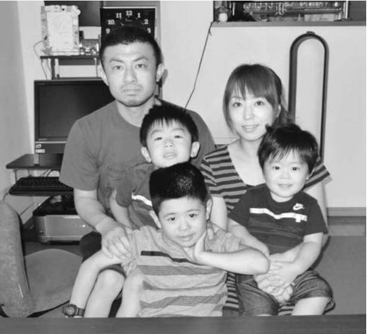

▲元気なお子さんたちと一緒に。一番左が宏一さん。

| 震 災 が 発 生 し た 翌 日 の 朝 、 避      | い ま す 。                                                   |
|--------------------------------------------------------------------|--------------------------------------------------------------------|
| 難 指 示 が で ま し た 。 地 元 の 消 防 | こ こ は 浪 江 か ら 避 難 し て き て      |
| 団                                                                  | い                                                                  |
| に                                                                  | る                                                                  |
| 入                                                                  | 人                                                                  |
| っ                                                                  | も                                                                  |
| て                                                                  | 近                                                                  |
| い                                                                  | 所                                                                  |
| た                                                                  | に                                                                  |
| の                                                                  | い                                                                  |
| で                                                                  | て                                                                  |
| 地                                                                  | 、                                                                  |
| 域                                                                  | 知                                                                  |
| 住                                                                  | ら                                                                  |
| 民                                                                  | な                                                                  |
| の                                                                  | い                                                                  |
| 避                                                                  | 町                                                                  |
| 難                                                                  | に                                                                  |
| を                                                                  | 家                                                                  |
| 促                                                                  | 族                                                                  |
| す                                                                  | が                                                                  |
| 活                                                                  | 孤                                                                  |
| 動                                                                  | 立                                                                  |
| を                                                                  | す                                                                  |
| し                                                                  | る                                                                  |
| ま                                                                  | こ                                                                  |
| し                                                                  | と                                                                  |
| た                                                                  | も                                                                  |
| 。                                                                  | あ                                                                  |
| 避                                                                  | り                                                                  |
| 難                                                                  | ま                                                                  |
| す                                                                  | せ                                                                  |
| る                                                                  | ん                                                                  |
| こ                                                                  | し                                                                  |
| と                                                                  | 、                                                                  |
| に                                                                  | 子                                                                  |
| 理                                                                  | ど                                                                  |
| 解                                                                  | も                                                                  |
| し                                                                  | も                                                                  |
| て                                                                  | ま                                                                  |
| く                                                                  | だ                                                                  |
| れ                                                                  | 小                                                                  |
| な                                                                  | さ                                                                  |
| い                                                                  | い                                                                  |
| 住                                                                  | の                                                                  |
| 民                                                                  | で                                                                  |
| も                                                                  | 地                                                                  |
| い                                                                  | 域                                                                  |
| て                                                                  | に                                                                  |
| 説                                                                  | 溶                                                                  |
| 得                                                                  | け                                                                  |
| を                                                                  | 込                                                                  |
| し                                                                  | む                                                                  |
| た                                                                  | こ                                                                  |
| り                                                                  | と                                                                  |
| し                                                                  | が                                                                  |
| ま                                                                  | で                                                                  |
| し                                                                  | き                                                                  |
| た                                                                  | て                                                                  |
| 。                                                                  | い                                                                  |
| 私                                                                  | る                                                                  |
| も                                                                  | よ                                                                  |
| 自                                                                  | う                                                                  |
| 分                                                                  | で                                                                  |
| を                                                                  | す                                                                  |
| 含                                                                  | 。                                                                  |
| め                                                                  | 震                                                                  |
| て                                                                  | 災                                                                  |
| 10                                                                 | 前                                                                  |
| 人                                                                  | に                                                                  |
| の                                                                  | 同                                                                  |
| 家                                                                  | 居                                                                  |
| 族                                                                  | し                                                                  |
| が                                                                  | て                                                                  |
| い                                                                  | い                                                                  |
| て                                                                  | た                                                                  |
| 、                                                                  | 祖                                                                  |
| し                                                                  | 父                                                                  |
| か                                                                  | 母                                                                  |
| も                                                                  | と                                                                  |
| 祖                                                                  | 両                                                                  |
| 父                                                                  | 親                                                                  |
| は                                                                  | も                                                                  |
| 寝                                                                  | 近                                                                  |
| た                                                                  | 所                                                                  |
| き                                                                  | に                                                                  |
| り                                                                  | 住                                                                  |
| 状                                                                  | ん                                                                  |
| 態                                                                  | で                                                                  |
| と                                                                  | い                                                                  |
| い                                                                  | ま                                                                  |
| う                                                                  | し                                                                  |
| こ                                                                  | た                                                                  |
| と                                                                  | が                                                                  |
| も                                                                  | 、                                                                  |
| あ                                                                  | 祖                                                                  |
| り                                                                  | 父                                                                  |
| 、                                                                  | は                                                                  |
| 自                                                                  | 浪                                                                  |
| 分                                                                  | 江                                                                  |
| の                                                                  | に                                                                  |
| 家                                                                  | 帰                                                                  |
| 族                                                                  | え                                                                  |
| の                                                                  | る                                                                  |
| 心                                                                  | こ                                                                  |
| 配                                                                  | と                                                                  |
| と                                                                  | が                                                                  |
| 消                                                                  | 叶                                                                  |
| 防                                                                  | わ                                                                  |
| 団                                                                  | ず                                                                  |
| の                                                                  | 今                                                                  |
| 役                                                                  | 年                                                                  |
| 目                                                                  | の                                                                  |
| と                                                                  | 4                                                                  |
| の 板 挟 み の 中 で の 避 難 活 動 と な | 月 に 亡 く な り ま し た 。                     |
| り ま し た 。                                              | 避 難 生 活 も 長 期 に な っ て く る      |
| と り あ え ず 妻 の 実 家 の あ る 昼      | と 、 子 ど も の こ と 、 家 族 の こ と |
| 曽                                                                  | を                                                                  |
| 根                                                                  | 考                                                                  |
| へ                                                                  | え                                                                  |
| 避                                                                  | る                                                                  |
| 難                                                                  | と                                                                  |
| し                                                                  | ど                                                                  |
| ま                                                                  | の                                                                  |
| し                                                                  | よ                                                                  |
| た                                                                  | う                                                                  |
| 。                                                                  | に                                                                  |
| し                                                                  | 生                                                                  |
| か                                                                  | 活                                                                  |
| し                                                                  | し                                                                  |
| 、                                                                  | て                                                                  |
| そ                                                                  | い                                                                  |
| の                                                                  | こ                                                                  |
| 場                                                                  | う                                                                  |
| 所                                                                  | か                                                                  |
| も                                                                  | と                                                                  |
| 避                                                                  | 非                                                                  |
| 難                                                                  | 常                                                                  |
| 地                                                                  | に                                                                  |
| 域                                                                  | 悩                                                                  |
| と                                                                  | み                                                                  |
| な                                                                  | ま                                                                  |
| り                                                                  | す                                                                  |
| 本                                                                  | 。                                                                  |
| 宮                                                                  | い                                                                  |
| 市                                                                  | つ                                                                  |
| の                                                                  | 浪                                                                  |
| 本                                                                  | 江                                                                  |
| 宮                                                                  | に                                                                  |
| 高                                                                  | 帰                                                                  |
| 校                                                                  | れ                                                                  |
| 体                                                                  | る                                                                  |
| 育                                                                  | よ                                                                  |
| 館                                                                  | う                                                                  |
| へ                                                                  | に                                                                  |
| 避                                                                  | な                                                                  |
| 難                                                                  | る                                                                  |
| し                                                                  | の                                                                  |
| ま                                                                  | は                                                                  |
| し                                                                  | わ                                                                  |
| た                                                                  | か                                                                  |
| 。                                                                  | り                                                                  |
| そ                                                                  | ま                                                                  |
| の                                                                  | せ                                                                  |
| 場                                                                  | ん                                                                  |
| 所                                                                  | が                                                                  |
| も                                                                  | 、                                                                  |
| 一                                                                  | 震                                                                  |
| 泊                                                                  | 災                                                                  |
| し                                                                  | 前                                                                  |
| か                                                                  | の                                                                  |
| し                                                                  | 環                                                                  |
| ま                                                                  | 境                                                                  |
| せ                                                                  | や                                                                  |
| ん                                                                  | 住                                                                  |
| で                                                                  | 民                                                                  |
| し                                                                  | が                                                                  |
| た                                                                  | 元                                                                  |
| が                                                                  | 通                                                                  |
| 、                                                                  | り                                                                  |
| 老                                                                  | に                                                                  |
| 人                                                                  | な                                                                  |
| ホ                                                                  | る                                                                  |
| ー                                                                  | の                                                                  |
| ム                                                                  | で                                                                  |
| か                                                                  | あ                                                                  |
| ら                                                                  | れ                                                                  |
| 避                                                                  | ば                                                                  |
| 難                                                                  | 、                                                                  |
| し                                                                  | ま                                                                  |
| て                                                                  | た                                                                  |
| い                                                                  | あ                                                                  |
| る                                                                  | の                                                                  |
| 人                                                                  | 浪                                                                  |
| た                                                                  | 江                                                                  |
| ち                                                                  | で                                                                  |
| に                                                                  | の                                                                  |
| 避                                                                  | 生                                                                  |
| 難                                                                  | 活                                                                  |
| 移                                                                  | を                                                                  |
| 動                                                                  | 取                                                                  |
| 中 の 祖 父 の ケ ア 方 法 を 教 わ り 助 | り 戻 し た い と 思 っ て い ま す 。      |
| け ら れ ま し た 。                                    |                                                                    |
| 親 戚 を 頼 り 千 葉 県 に 避 難 も し      |                                                                    |
| ま し た が 夫 婦 共 働 き と い う こ と |                                                                    |
| も あ り 、 お 互 い に 仕 事 を 継 続 す |                                                                    |
| る の に 有 効 な 場 所 を 選 び 栃 木 県 |                                                                    |
| 真 岡 市 に 落 ち 着 き 現 在 に 至 っ て |                                                                    |

## 江井美穂さん(井手)

取材者:高崎経済大学櫻井研究室櫻井取材日:7月28日 「平成24年9月広報なみえ掲載」

#### いまの生活を少しでも前に進めたい ―「帰りたいけど帰れない」長く続く戸惑いの時間―

江井美穂さんは、長女の蘭夢さん(中学3年)、次女の愛蘭さん(中学 1年)、そして母親の鈴木久美子さんと4人で群馬県高崎市にある借り上げアパートで生活しています。単身赴任で福島県内に勤める夫の満さんとは、離れたままの暮らしが続いています。 えねいらむうらん

悩まされます 。 そんな中、この 3 月に一緒に生活していた祖母が突然亡くなりました 。 とても健康だった祖母でしたが、あまりの生活環境の変化に苦しかったのだと思います 。 浪江にいたころのように、広い家の中でのんびりしたり、農作業をしたり、ご近所の方とお茶を飲んだりしていた生活が一変しました 。 私自身も今は仕事をしていないこともあり、友人も近くにはいませんので、一人でいる時間が多くなっているなと思います 。 とにかく現在の生活をどうにか前に進めたい 。 そう強く思います 。 浪江の暮らしはなつかしいです 。 十日市は家族みんなが思い出します 。 昨年の夏、高崎市内の出店になみえ焼そばが来るというので出掛けて行きました 。 ふるさとの味が本当になつかしく、おいしくいただきました 。 浪江を出てからは、スーパーで野菜を買ったり、家の鍵を閉めたり、都会ではあたり前のことですが、慣れない暮らしに最初は違和感がありました 。 浪江では新鮮な魚や野菜を皆で分け

| い | 元 | ぞ | な | こ | ら |     | す | な | ま | 暮 | 合 |
|---|---|---|---|---|---|-----|---|---|---|---|---|
| で | 気 | れ | ら | れ | れ | で 。 |   | く | す | ら | っ |
| す | な | が | な | か | ま | も   |   | な | 。 | し | た |
| 。 | 姿 | 前 | い | ら | せ | 、   |   | る | そ | て | り |
|   | で | を | の | は | ん | ふ   |   | の | ん | い | 、 |
|   | 皆 | 向 | だ | 自 | 。 | り   |   | か | な | た | ご |
|   | さ | い | と | 分 | や | 返   |   | と | 暮 | こ | 近 |
|   | ん | て | 思 | で | は | っ   |   | 思 | ら | と | 所 |
|   | に | 、 | い | 決 | り | て   |   | う | し | に | で |
|   | お | 一 | ま | め | 自 | ば   |   | と | が | 気 | 助 |
|   | 会 | 日 | す | な | 分 | か   |   | 寂 | も | づ | け |
|   | い | も | 。 | け | た | り   |   | し | う | か | 合 |
|   | し | 早 | そ | れ | ち | も   |   | い | で | さ | っ |
|   |   |   |   |   |   |     |   |   |   |   |   |
|   | た | く | れ | ば | の | い   |   | で | き | れ | て |

▲(左から)蘭夢さん、愛蘭さん、久美子さん、美穂さん

## 畠山佳代子さん(川添)

取材者:NPO法人山形の公益活動を応援する会・アミル柴田取材日:8月5日 「平成24年9月広報なみえ掲載」

#### 浪江に帰れるまで、山形で頑張ります

川添でご家族で農業を営んでいた畠山さんご一家は現在、夫の行男さん、佳代子さん、祖母永子さん、長男敦くん、次男暁くんの5人で山形県寒河江市のアパートで暮らしています。長女朋子さんは、今年の春から専門学校に進学し、仙台で一人暮らしを始めたそうです。 ながこさとし

私の家ではいちごを作っていて、避難指示が出た 12 日の朝も市場への出荷の準備をしていました 。 避難後、避難所を転 々 としましたがいっぱいで入ることができず、友人の家にも泊めていただいた後、寒河江市にいる私の妹が山形に来たらと言ってくれて、 2 、 3 日世話になるつもりでこちらに来ました 。 ですが、爆発のニュースやひどくなる報道を見てこれは当分帰れないかもと思い、不動産屋に行き妹の住むアパートの隣の空き部屋を借り、それから山形で生活

> 町の方針が決

。 これから子

で就職したり

もしれないこ

はこちらに生

と思います 。

江の復興につ

出たときに、

残すかという

郷土料理の話

凍みもちや干

鮭料理、かぼ

どこちらでは

ない料理も多

い出しました 。

めてそうした

統を引き継ぐ

できればいい

た 。 浪江のお

知恵を無くす

です 。 ぜひそ

みがあれば応

ています 。

山形県

▲笑顔がすてきな佳代子さん。 現在お住まいのアパートの前で

しています 。 6 人にはちょっと狭いですが、やっぱり家族一緒に暮らせることが一番と思っています 。 こちらに来てからは、生活の自立のために、昨年 4 月から働き始めました 。 夫は現在寒河江市の隣の河北町の農家で、私は家の近くで働いています 。 おばあちゃんもたまに手伝いに行ったり、草刈りしたり 。 やっぱり家にいて座りっぱなしの方が心配だからありがたいです 。 長男は、こちらの高校で山岳部に入り頑張っていて、楽しそうな様子なので安心しています 。 震災のとき、浪江小 5 年生だった次男も、最初は戸惑いもあったようですが、こちらの中学に入学し友だちができ、部活は柔道を始めました 。 元気に頑張って通ってくれています 。 山形の方は、「 山形さ住め住め 。」 と言って気を遣わず親しくしてくれ、近所の方や職場の方もいい方が多いです 。 浪江町に帰ろうと思っても自分では決められない現状で、早くまればと思いますどもたちもこちら結婚したりするかとを考えると、今活の基盤を置こう先日NHKの浪いての特集番組に浪江の伝統をどうテーマで話をし、題になりました 。 し柿、ゆず料理、ちゃまんじゅうななかなか食べられく、なつかしく思また、若い人を集浪江の食文化や伝ような取り組みがねと話になりましばあちゃんたちののはもったいないんな楽しい取り組援したいなと思っ

--

鴨川俊郎さん(川添)

取材者:NPO法人市民公益活動パートナーズ古山・阿部取材日:8月9日 「平成24年9月広報なみえ掲載」

#### 心安らかに、明日を考えたい

昨年3月末から福島市内の借上げ住宅で奥さまのご両親、息子さんと一緒に暮らしていますが、現在は実父の介護をするため、いわき市の実家で過ごすことが多いそうです。また、奥さまはいわきの病院に勤務されており、家族全員が福島の家で過ごすのは月に1回程度。離れ離れは辛いことですが、それぞれに生きがいをもち、前向きに過ごしているようでした。

| し に て い 、 た 県 こ 内 ろ の か あ ら ち 自 こ 分 ち で に 車 出 を か 運 け 転 | ■ 義 家 族 父 そ は れ カ ぞ メ れ ラ に が 趣 味 で 、 浪 江 | て い ま す 。 | で き 、 本 当 に 幸 い だ っ た と 思 っ | が 、 早 い 時 期 に 落 ち 着 く こ と が | 末 に 入 居 し 、 今 に 至 っ て い ま す | 現 在 の 雇 用 促 進 住 宅 に は 3 月 | 5 日 ぶ り で 合 流 で き ま し た 。 | を 経 由 し て 福 島 市 へ 避 難 し 、 約 | い た 後 、 津 島 の 避 難 所 、 二 本 松 | 宅 で 原 発 の 爆 発 音 を は っ き り 聞 | 私 と 息 子 は 福 島 市 へ 。 義 父 は 自 | し ま い 、 別 行 動 に な り ま し た が 、 | か ら 毛 布 を 取 り に 自 宅 に 戻 っ て | と て も 寒 い 日 で 、 両 親 が 途 中 | れ て 身 一 つ で 家 を 出 ま し た 。 | ち で 受 け 止 め 、 両 親 と 息 子 を 連 | あ え ず 安 全 の た め か と 軽 い 気 持 | 線 で 避 難 指 示 が 出 ま し た 。 と り | シ ー ト を 被 せ て い る と 、 防 災 無 | 地 震 で 崩 れ た 屋 根 に ビ ニ ー ル | 午 前 2 時 か 3 時 で し た 。 | 自 宅 に た ど り 着 い た の が 翌 日 の | ご ろ 。 何 し ろ も の す ご い 渋 滞 で 、 | 宮 城 県 境 を 超 え た の が 午 前 0 時 | 5 時 ご ろ に 泉 の 会 場 を 車 で 出 て | 中 で し た 。 揺 れ が 収 ま り 、 午 後 | た と き 、 私 は 仙 台 の 会 議 に 出 席 | 昨 年 3 月 11 日 の 大 震 災 が 起 き | ■ あ の 日 の 記 憶 |
|------------------------------------------------------------------------------------------------------------------------------------------|-------------------------------------------------------------------------------------------------------|-----------------------|--------------------------------------------------------------------|--------------------------------------------------------------------|--------------------------------------------------------------------|---------------------------------------------------------------|---------------------------------------------------------------|--------------------------------------------------------------------|--------------------------------------------------------------------|--------------------------------------------------------------------|--------------------------------------------------------------------|-------------------------------------------------------------------------|--------------------------------------------------------------------|---------------------------------------------------------------|---------------------------------------------------------------|--------------------------------------------------------------------|--------------------------------------------------------------------|--------------------------------------------------------------------|--------------------------------------------------------------------|---------------------------------------------------------------|-----------------------------------------------------|--------------------------------------------------------------------|-------------------------------------------------------------------------|--------------------------------------------------------------------|--------------------------------------------------------------------|--------------------------------------------------------------------|--------------------------------------------------------------------|----------------------------------------------------------------|---------------------------------|
|------------------------------------------------------------------------------------------------------------------------------------------|-------------------------------------------------------------------------------------------------------|-----------------------|--------------------------------------------------------------------|--------------------------------------------------------------------|--------------------------------------------------------------------|---------------------------------------------------------------|---------------------------------------------------------------|--------------------------------------------------------------------|--------------------------------------------------------------------|--------------------------------------------------------------------|--------------------------------------------------------------------|-------------------------------------------------------------------------|--------------------------------------------------------------------|---------------------------------------------------------------|---------------------------------------------------------------|--------------------------------------------------------------------|--------------------------------------------------------------------|--------------------------------------------------------------------|--------------------------------------------------------------------|---------------------------------------------------------------|-----------------------------------------------------|--------------------------------------------------------------------|-------------------------------------------------------------------------|--------------------------------------------------------------------|--------------------------------------------------------------------|--------------------------------------------------------------------|--------------------------------------------------------------------|----------------------------------------------------------------|---------------------------------|

▲鴨川家のご両親(明次さん、左がモトさん)と、俊郎さん(右)

土地などを探し始めています 。

町にお願いしたいことは、こ

れからの生活を決めるのは町民

## 山% 安男さん(権現堂)

取材者:NPO法人市民公益活動パートナーズ古山・阿部取材日:8月7日 「平成24年9月広報なみえ掲載」

#### 懸命に働くことが、明日の復興につながる

現在、福島市の借上げ住宅にご夫婦で暮らしています。昨年7月に川俣町で会社を再建し、浜通りでの仕事を中心に、忙しい毎日を送っていらっしゃいます。

原発事故は人災かもしれないが、お互いに理解しながら、復興に向けて困難な課題を解決して欲しいとおっしゃっていました。

> ■ 従業員とともに、明日を信じあての大震災発生時は、葛尾村からの帰りでした 。 ちょっと山に寄り道をしているときで、大したことはないと思ったのですが、山を下ったときに室原の橋が崩れているのを見て、これは大変なことになったと急いで加倉前の会社に戻りました 。 従業員も次 々 と戻りましたので、自宅の様子を見に行かせました 。 午後 8 時ごろ全員の無事を確認した後、会社にいた妻とともに自宅に戻りましたが、家の中

> > には入

した 。

真っ暗

翌 12

びかけ

婦で 6

を出ま

4 時間

その後

いる栃

難をし

住宅に

私は

おり、

3 カ月

▲「森林ボランティアを再開したら、また取材に来てくださいね。」と話してくださいました

れないほどひどい状態で電気も停まっていたので、な中、一夜を明かしました 。 日、午前 6 時に避難を呼る防災無線が聞こえ、夫尾村の叔父を頼ろうと家したが、渋滞のため 3 〜 かかってたどり着きました 。 、福島市のいとこや娘の木県鹿沼に 2 週間ほど避、現在の福島市の借上げ住むことになりました 。 緑化土木の会社を営んで福島市に避難してから約目の昨年 7 月 19 日に、川俣町で事業を再開しました 。 32 名いた従業員のうち、年齢や避難によって退職した者もいましたが、現在、 22 名が二本松市や福島市、伊達郡桑折町から通ってくれています 。 私は、自ら働くことによって元の生活を取り戻さなければならないと思っています 。 従業員にも 「 今はつらくても頑張っ

て働こう 。 その分はきっと明日の生活の糧になるはずだから 。」 と言い続けています 。 ■ 区長として、森林ボランティアに携わる者として私は浪江町権現堂佐屋前の区長で、 1 2 6 世帯の人たちが今、あちこちで避難生活を送っています 。 そのほとんどの消息や生活の様子はつかめていますが、やはり私たちや役場では限りがあります 。 福島の支援活動団体さんには、仮設住宅や借り上げ住宅を訪ねていただき、町民に声をかけてやって欲しいと思っています 。 話を聞くだけでもいいんです 。 きっと励みになると思いますから 。 また、もともと林業から興した仕事でしたので、浪江町にいたころは、火の用心や不法投棄を防止する看板を立てたりして、山を守る森林ボランティアをしていました 。 仲間は 20 名程いますが、この福島や川俣でも、道路のゴミ拾いなどの美化活動をそろそろ始めたいと思い、声をかけているところです 。 私は、この福島で頑張っていきます 。

長岡光広さん(権現堂)

取材者:元気玉プロジェクト江川取材日:8月13日 「平成24年9月広報なみえ掲載」

#### 小石饅頭を再び届けたい

#### 前向きに事業の再開を行うために日々準備をしています

▲長岡光広さんと娘さんの美優ちゃん(6歳)、和佳ちゃん(4歳)、結萌乃ちゃん(2歳)、奥さんの圭子さんみゆうまどかゆめの

権現堂の 「 四季菓匠長岡家 」 3 代目長岡光広さんご家族 。 皆さんには 「 小石饅頭 」 の製造販売元として有名です 。 現在は、会津坂下町にご家族 5 人で住んでいます 。 震災以降長岡さんは、家族で郡山のおじさんをたよりに身を寄せました 。 それから横浜に住みながら東京の会社へ就職 。 娘さんの幼稚園入園が難しいこと

| 日 現 々 と 在 懐 は か 、 し 小 が 石 り 饅 ま 頭 す を 。 再 び つ く |
|----------------------------------------------------------------------------------------------------------------------|
| 3 年 間 は と て も 充 実 し た 青 春 の                                                   |
| 優 勝 し た こ と 。 双 葉 高 校 時 代 の                                                   |
| て も 夏 の 高 校 野 球 の 県 大 会 で 準                                                   |
| い ま し た 。 思 い 出 は 、 何 と い っ                                                   |
| 般 の プ レ ー ヤ ー と し て 活 躍 し て                                                   |
| 江 に 住 ん で い た こ ろ は 、 内 野 全                                                   |
| 光 広 さ ん の 趣 味 は 草 野 球 。 浪                                                        |
| ち も 増 え た と 言 い ま す 。                                                                  |
| ど も を 通 じ て お 母 さ ん 方 の 友 だ                                                   |
| 語 る の は 奥 さ ん の 圭 子 さ ん 。 子                                                   |
| た 。「 米 も 野 菜 も お い し い 。」 と                                                      |
| 奥 さ ん と 会 津 の 冬 も 過 ご し ま し                                                   |
| の 娘 さ ん に も 友 だ ち が で き て 、                                                   |
| と 語 る 光 広 さ ん 。 現 在 は 、 3 人                                                   |
| 自 分 た ち は 恵 ま れ て い ま す 。」                                                       |
| や 転 職 を 迫 ら れ た 人 に 比 べ て 、                                                   |
| 「 ま だ 、 就 職 も 決 ま ら な い 人                                                        |
| 働 い て い ま す 。                                                                                      |
| は 、 太 郎 庵 の 和 菓 子 製 造 部 門 で                                                   |
| 事 を も ら い 現 在 の 職 場 に 。 現 在                                                   |
| 「 会 津 坂 下 に く れ ば い い 。」 と 返                                                  |
| る か も し れ な い 。」 連 絡 後 す ぐ に 、                                             |
| 長 な ら ば 、 自 分 が 仕 事 に も 就 け                                                   |
| 「 東 京 で も 講 演 を す る 目 黒 社                                                        |
| 郎 庵 」 の 目 黒 社 長 で す 。                                                                  |
| の は 同 じ お 菓 子 を 製 造 す る 「 太                                                   |
| 決 め ま し た 。 長 岡 さ ん が 頼 っ た                                                   |
| で 、 ま た 福 島 県 内 に 戻 る こ と を                                                   |

| 一 き 番 。 3 。 の こ 人 支 の の え 娘 笑 か 顔 さ も が ん し 今 は れ 、 の ま 長 笑 せ 岡 顔 ん さ が 。 ん す の て | た ん 少 よ お は う 菓 し 話 に 子 で を が づ も 締 ん く 伝 め ば り わ く っ が れ く て 再 ば っ い び 。」 て る 始 と く こ め 光 れ と ら 広 ま が れ し さ 、 る | れ う 「 て こ 長 と こ 岡 も こ 家 。 ま は で 浪 や 江 っ の て 人 き に ま 支 し え た 。 ら | も ま 浪 せ 江 っ ん の と 。 こ 情 遠 と 報 く を が ふ 忘 あ る れ れ さ た ば と こ を ・ と ・ 離 ・ は れ と あ て 思 、 り | 「 さ い る 店 れ う た を て 目 め 出 い 黒 の す ま 社 準 な す 長 備 ら 。 の を 避 応 言 す 難 援 葉 す し す に め て る も る 1 よ 後 毎 年 。」 押 日 半 。 し と 。 |
|--------------------------------------------------------------------------------------------------------------------------------------------------------------------------------------------------------|---------------------------------------------------------------------------------------------------------------------------------------------------------------------------------------------------------------------------------------------------------------------------------------|--------------------------------------------------------------------------------------------------------------------------------------------------------------|---------------------------------------------------------------------------------------------------------------------------------------------------------------------------------------------------------------------|--------------------------------------------------------------------------------------------------------------------------------------------------------------------------------------------------------------------------------------------------------------------------------------------|
|--------------------------------------------------------------------------------------------------------------------------------------------------------------------------------------------------------|---------------------------------------------------------------------------------------------------------------------------------------------------------------------------------------------------------------------------------------------------------------------------------------|--------------------------------------------------------------------------------------------------------------------------------------------------------------|---------------------------------------------------------------------------------------------------------------------------------------------------------------------------------------------------------------------|--------------------------------------------------------------------------------------------------------------------------------------------------------------------------------------------------------------------------------------------------------------------------------------------|

今は、奥さんと娘さんと福島市内の借り上げ住宅に住んでいます。

▲「にっこりはできんなぁ」と佐々木さん。

|  | ま し た 。 | の 身 着 の ま ま で 、 津 島 を 目 指 し | と 犬 一 匹 長 靴 を 履 い た だ け の 着 | 寝 具 を 載 せ た ま ま の 車 で 、 家 族 | 聞 き 、 一 時 的 な 避 難 だ と 思 っ て 、 | 無 線 で 避 難 を 呼 び か け て い る と | ま し た 。 翌 日 、 隣 の 人 か ら 防 災 | 寝 具 を 持 ち 込 み 車 の 中 で 過 ご し | の テ レ ビ だ け は 見 ら れ た の で 、 | 晩 は 情 報 が 欲 し く て 、 カ ー ナ ビ | 手 伝 い 、 電 気 も 水 も な く 、 そ の | 崩 壊 し た 家 の 屋 根 瓦 の 片 付 け を | た と き で し た 。 直 後 は 、 近 所 の | 先 で 遅 い 昼 食 を と ろ う と し て い | 3 月 11 日 地 震 の と き は 、 勤 務 | だ っ た な | ■ あ の と き は 情 報 を 求 め て 必 死 |
|--|------------------|--------------------------------------------------------------------|--------------------------------------------------------------------|--------------------------------------------------------------------|-------------------------------------------------------------------------|--------------------------------------------------------------------|--------------------------------------------------------------------|--------------------------------------------------------------------|--------------------------------------------------------------------|--------------------------------------------------------------------|--------------------------------------------------------------------|--------------------------------------------------------------------|--------------------------------------------------------------------|--------------------------------------------------------------------|----------------------------------------------------------------|------------------|--------------------------------------------------------------------|
|--|------------------|--------------------------------------------------------------------|--------------------------------------------------------------------|--------------------------------------------------------------------|-------------------------------------------------------------------------|--------------------------------------------------------------------|--------------------------------------------------------------------|--------------------------------------------------------------------|--------------------------------------------------------------------|--------------------------------------------------------------------|--------------------------------------------------------------------|--------------------------------------------------------------------|--------------------------------------------------------------------|--------------------------------------------------------------------|----------------------------------------------------------------|------------------|--------------------------------------------------------------------|

| 12 日 の 晩 に 「 屋 内 退 避 」 と い                                        |  |
|-------------------------------------------------------------------------------------------------------|--|
| う 聞 き 慣 れ な い 言 葉 を 聞 か さ れ 、                               |  |
| 今 何 が 起 こ っ て い る の だ ろ う ?                                    |  |
| と も う 不 安 な 思 い で い っ ぱ い に                                    |  |
| な り ま し た 。                                                                            |  |
| ガ ソ リ ン を 求 め て 残 量 を 気 に                                         |  |
| し な が ら 走 り 、 や っ と 入 れ ら れ                                    |  |
| て も 1 台 2 千 円 分 と か 10 L と か                                   |  |
| 制 限 付 き 、 そ れ で も 手 を 差 し 伸                                    |  |
| べ て く れ る 情 報 を 頼 っ て 西 へ 転 々                               |  |
| と 、 新 潟 県 佐 渡 市 に は 1 カ 月 滞                                    |  |
| 在 し ま し た 。 同 じ 海 で も 、 太 平                                    |  |
| 洋 と 日 本 海 、 い や ぁ 寒 か っ た な ぁ 。                          |  |
| 佐 渡 の 外 海 は 、 シ ベ リ ア か ら の                                    |  |
| 風 が そ の ま ま 吹 き 付 け る か ら 、                                    |  |
| と 後 で 知 り ま し た 。                                                             |  |
|                                                                                                       |  |
| ■ こ う し て い る と 気 が 滅 入 る こ                                    |  |
| 「 と 心 も が あ 滅 る 入 ん る だ 」 っ て 言 う の か な 、 |  |
| こ う し て い る と い た た ま れ な い                                    |  |
| 気 持 ち に な り ま す 。 こ れ か ら を                                    |  |
| 思 う と 、 若 者 は 戻 っ て く る の か ?                               |  |
| 将 来 の 影 響 は ? き ち ん と し た 、                                    |  |
| 的 確 な 情 報 が ほ し い と 思 い ま す 。                               |  |
| が れ き 受 け 入 れ に 関 す る ニ ュ ー                                    |  |
| ス を 見 て い る と 、「 ( 現 実 的 で は                                   |  |
| な い ) 夢 よ り 希 望 が ほ し い 」 と                                    |  |
| 切 実 に 思 い ま す 。 中 間 貯 蔵 施 設                                    |  |
| 建 設 も し か り 、「 手 も 足 も 出 な い                                   |  |

| 思 一 っ 歩 て で い も ま 半 す 歩 。 で も 前 へ 、 前 へ と | 家 な 族 が と ら 友 、 人 た ・ め 知 息 人 を と つ 支 き え つ 合 つ っ も て 、 | も 国 や っ や と 町 慣 の れ 動 て き き を ま ニ し ュ た ー 。 ス で 見 | 励 ス み 片 に 手 な に っ 語 て り い 合 ま う す 、 。 そ 福 の 島 時 市 間 に が | い 人 る ・ 者 知 と 人 連 で 絡 、 を 福 取 島 り 市 合 内 い に 、 住 グ ん ラ で | い こ ま の す ま 。 ま 浪 で 江 は で い 交 ら 流 れ の な あ い っ 、 た と 友 思 | な っ こ て の し ま ま ま う じ 。 ゃ 滅 、 入 人 り 間 な も が ダ ら メ も 、 に | そ 福 れ 島 が で 何 グ よ ラ り ス の 片 楽 手 し に み 語 り 合 う 、 | ■ 浪 江 で の 仲 間 と や っ と 慣 れ た | ち ん と し て ほ し い で す 。 | て よ う ほ な し フ い ォ で ロ す ー 。 を ま 、 ず し は っ 補 か 償 り を や き っ | ち な が も 自 の 分 」 の 。 方 国 向 や 性 行 を 政 定 に め は ら 、 れ 私 る た | 状 況 で 大 海 に 投 げ 出 さ れ る よ う |
|-------------------------------------------------------------------------------------------------------|------------------------------------------------------------------------------------------------------------------------------------------|---------------------------------------------------------------------------------------------------------------------------|------------------------------------------------------------------------------------------------------------------------------------------|------------------------------------------------------------------------------------------------------------------------------------------|------------------------------------------------------------------------------------------------------------------------------------------|------------------------------------------------------------------------------------------------------------------------------------------|----------------------------------------------------------------------------------------------------------------------|--------------------------------------------------------------------|-----------------------------------------------------|-----------------------------------------------------------------------------------------------------------------------------------------------|------------------------------------------------------------------------------------------------------------------------------------------|--------------------------------------------------------------------|
|-------------------------------------------------------------------------------------------------------|------------------------------------------------------------------------------------------------------------------------------------------|---------------------------------------------------------------------------------------------------------------------------|------------------------------------------------------------------------------------------------------------------------------------------|------------------------------------------------------------------------------------------------------------------------------------------|------------------------------------------------------------------------------------------------------------------------------------------|------------------------------------------------------------------------------------------------------------------------------------------|----------------------------------------------------------------------------------------------------------------------|--------------------------------------------------------------------|-----------------------------------------------------|-----------------------------------------------------------------------------------------------------------------------------------------------|------------------------------------------------------------------------------------------------------------------------------------------|--------------------------------------------------------------------|

## 小川靖夫さん(権現堂)

取材者:NPO法人市民公益活動パートナーズ佐藤取材日:9月3日 「平成24年10月広報なみえ掲載」

妻が私に内緒で、ここ数年の私の作品(打刃物)を毎年大事に取っていてくれたので、こうして持ち出すことができました

浪江町で唯一の打刃物鍛冶職人だった小川靖夫さん (銘は重久、小川鍛造工場)。原発事故後転々とした後、昨年4月から、棟違いに長男家族、次男家族が住む、福島市内の借り上げ住宅に落ち着きました。

日

の

▲作品の一部。箱には妻与志子さん心くばりのメモも入っていました。奥に見えるのは珍しい牛の爪切り(左用・右用)

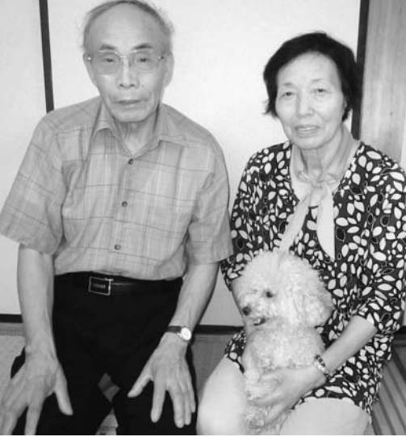

▲妻与志子さんと孫の沙里さんの愛犬プーよしこさり

■ 今なつかしく思うのは、十市や自然の恵み豊かな浪江こと浪江町は、ほんとうにいいころです 。 雪も降らないし、然いっぱいで、春は山菜採り秋はきのこ採り、それに泉田川高瀬川のサケ漁 … 。 思い出す

と

自

、

、

と

| 緒 で こ れ ま で の 作 品 を 、 丁 寧 に | ま し た 。 そ の と き 、 妻 が 私 に 内 | ラ ン ダ で 丹 念 に 仕 上 げ て 納 品 し | 置 い た も の を 持 ち 帰 り 、 こ の ベ | ま れ 、 一 時 帰 宅 の と き に 作 っ て | ん の 、 あ の 包 丁 で な い と 。」 と 頼 | わ き の 魚 市 場 の 方 か ら 「 小 川 さ | 福 島 市 内 に 落 ち 着 い て か ら 、 い | ど か ら の 注 文 で 作 っ て い ま し た 。 | 刃 包 丁( 刃 渡 り 33 ㎝ )を 、 市 場 な | マ グ ロ 解 体 用 の 大 き い 特 殊 出 | く れ て | ■ 今 で も お 客 さ ま が 覚 え て い て | を 運 ん で く れ ま し た 。 | 市 を 待 っ て 、 浪 江 町 内 外 か ら 足 | 作 品 を 一 堂 に お 見 せ で き る 十 日 | し た 。 永 年 の ご ひ い き さ ん が 、 | に 仕 上 げ て い く 、 そ ん な ふ う で | 市 ま で に そ れ ら を じ っ く り 丁 寧 | ま で に 粗 作 品 を 作 り あ げ 、 十 日 | は い つ も 、 十 日 市 の た め に 8 月 | 時 間 の か か る 仕 事 で す 。 今 ご ろ | 一 日 一 丁 か 二 丁 し か で き な い 、 | 私 の 仕 事 は 、 打 刃 物 鍛 冶 で す 。 | し い で す 。 | と 」 を 残 し て や れ な い の が 、 悔 | ほ し い 。 子 ど も た ち に 「 ふ る さ | な い か ら 、 あ の 浪 江 町 に 戻 し て | 辛 い で す 。 賠 償 な ん て 何 も い ら |
|--------------------------------------------------------------------|--------------------------------------------------------------------|--------------------------------------------------------------------|--------------------------------------------------------------------|--------------------------------------------------------------------|---------------------------------------------------------------------|--------------------------------------------------------------------|--------------------------------------------------------------------|-------------------------------------------------------------------------|------------------------------------------------------------------|---------------------------------------------------------------|-------------|--------------------------------------------------------------------|------------------------------------------------|--------------------------------------------------------------------|--------------------------------------------------------------------|--------------------------------------------------------------------|--------------------------------------------------------------------|--------------------------------------------------------------------|--------------------------------------------------------------------|--------------------------------------------------------------------|--------------------------------------------------------------------|--------------------------------------------------------------------|--------------------------------------------------------------------|-----------------------|--------------------------------------------------------------------|--------------------------------------------------------------------|--------------------------------------------------------------------|--------------------------------------------------------------------|
|                                                                    |                                                                    |                                                                    |                                                                    |                                                                    |                                                                     |                                                                    |                                                                    |                                                                         |                                                                  |                                                               |             |                                                                    |                                                |                                                                    |                                                                    |                                                                    |                                                                    |                                                                    |                                                                    |                                                                    |                                                                    |                                                                    | 「                                                                  |                       |                                                                    |                                                                    |                                                                    |                                                                    |

鈴木恵美さん(棚塩)

取材者:地域社会デザイン・ラボ中島取材日:9月11日 「平成24年10月広報なみえ掲載」

#### 懐かしい人との再会を心待ちにしつつ、ただいま子育てに奮闘中

「子育てで毎日バタバタしていて、ほとんど落ち込む暇もありません」という鈴木恵美さん。現在、仙台市の借り上げアパートでご主人と3人のお子さん、お義父さん、お義母さんとともに暮らしています。震災時には近くの高台に避難し、ご家族全員が無事でした。しかし広壮な自宅は津波で流出。近い将来、浪江に似た景観の岩沼市に「仮の本家」を建てる計画を進めています。

■ 浪江でのびのび子育て私は相馬市の生まれで、浪江町の嫁ぎ先で暮らしたのは 4 年間です 。 その間に長男( 5 歳 )、次男( 4 歳 )、長女( 2 歳 )と 3 人の子どもに恵まれました 。 浪江にいたころは夫の曾祖母、祖父も健在で、 10 人の大家族 。 家の敷地も広く、畑もあるし、海岸へも子どもと一緒に歩いて行けるという … 本当にのびのび子育てができる環境でしたね 。 長男は請戸の児童館に通っていました 。 ここは私にとっても、親しいお母さん友だちができた思い出深い場所です 。 大地震が起こったあの日も、いつもどおり児童館にお迎えに行き、家に着いて 2 、 3 分というときに大揺れがきました 。 次男と長女はお昼寝中、義父もたまたま休日で家にいて、家族がそろっていたのは幸運だったのかもしれません 。 しばらく家の中で待機していましたが、外に出た義父が慌てて戻って来て 「 津波が来る 。 逃げよう ! 」 と 。 あれほどの大津波が来るとは思わないまま高台に避難し、家族全員が助かりました 。

■ 友人や親戚との再会を 1 年前から仙台の借り上パートに住み、今は 8 人でやかに暮らしています 。 長次男は名取市の幼稚園に通いて、友だちも増えました男は人見知りでしたが、仙来てからは、園に行きたくと駄 々 をこねることも一度りません 。 たくましくなりたね 。 兄弟で 「 津波ごっこするのが気になりますが、そっと見守っています 。 私のほうは、 2 歳の長女だ手がかかるし、園の行事るときはお手伝いに行ったりと、毎日バタバタ 。 落ち込んでいる暇もなく、それなりに元気に過ごしていますよ 。 ただ残念なのは、請戸の児童館で一緒だったお子さんたちの成長が見られなかったことです 。 お母さんたちとお会いできないのも寂しいですね 。 一度だけ福島で集まりましたが、ああいう機会を定期的に持てたらと思います 。 今後の家のことについても家族で話し合っています 。 借り上げアパート

> では周りの方の迷惑にならないよう、叱らなくてもいいようなことで子どもを叱ってしまうことが多いですし 。 うちは本家なので、親戚が帰省できる場所も必要だろうと 。 それで今、岩沼市に家を建てる準備を進めているところなんです 。 なぜ岩沼市かというと、福島県に近くて景色も浪江に似ているから 。 義父は 「 浪江に帰るまでの仮の本家、別宅だ 。」 と言っています 。 私としてはとりあえず落ち着ける場所ができ、懐かしい人たちに会えたら嬉しいです 。

げア

にぎ

男と

って

。 長

台に

ない

もあ

まし

」 を

今は

はま

があ

▲鈴木恵美さん。9月6日に2歳のお誕生日を迎えた長女の杏奈ちゃん、お義父さん、お義母さんとともに。

## 山田愛梨さん(中1)(田尻)

取材者:NPO法人ちば市民活動・市民事業サポートクラブ鍋嶋取材日:8月31日 「平成24年10月広報なみえ掲載」

全日本ジュニア綱引選手権大会で銅メダルを取りました

千葉県習志野市公務員宿舎で、お父さん、お母さん、弟の悠愛くんと暮らす山田愛梨さん。今年の春、中学に進学しました。 ゆうま

私の家は田尻にあります 。 弟と 2 人、大堀小学校に通学していました 。 3 月 11 日、地震が起きたときは、掃除の後、着替えて帰る間際でした 。 ランドセルも何も持たず、上履きのまま校庭に逃げました 。 お父さんが車で迎えに来てくれて、おじいちゃんの家で、家族みんなが一緒になったときには、ほっとしました 。 その日の夜は、水道も電気

▲左から愛梨さん、おばあちゃんの琴子さん、弟の悠愛くん

も使えない中、ろうそくを灯し、石油ストーブでお餅を焼いて食べました 。 次の日、近くの避難所に避難しましたが、原子力発電所の爆発音が聞こえ、もっと遠くに逃げないと危険だというので、家族 7 人で、原町の保健センターに移動しました 。 その後、埼玉や千葉の親戚のお家にいて、昨年の 6 月に今の公務員宿舎に引っ越してきました 。 おじいちゃん、おばあちゃん、ひいおばあちゃんたちと隣り合わせの部屋で暮らしています 。 震災の前は、おじいちゃんが経営する水道屋さんで家族みんなが働いていました 。 千葉に避難して来ているので、水道屋さんは休業状態です 。 私は、小学校 2 年生のときから、ヤングプラザスポーツ少年団に入って、綱引きをやっていました 。 震災後も月に数回、東京や猪苗代で練習をし、今年の全国大会では銅メダルを取ることができました 。 綱引きの練習のたびに、お友だちと会うことでき、とても楽しかったのです

| た ら い い な と 思 い ま す 。 | 田 学 校 尻 に に 行 あ き る た 家 か に っ 帰 た る で こ す と 。 が 将 で 来 き 、 | ん な で 一 緒 に 卒 業 し て 、 同 じ 中 | 江 の 大 堀 小 学 校 の 友 だ ち と 、 み | り 便 利 で す 。 で も や っ ぱ り 、 浪 | き ま し た 。 お 店 や 駅 が 近 く に あ | 千 葉 で も 、 友 だ ち が た く さ ん で | あ り 、 忙 し い け れ ど 楽 し い で す 。 | み 中 も ほ と ん ど 毎 日 、 部 活 動 が | ト テ ニ ス 部 に 入 り ま し た 。 夏 休 | 中 学 校 に 入 学 し て か ら 、 ソ フ | か ら で す 。 | 今 の 団 員 も 集 ま る の が 、 大 変 だ | 新 し い 団 員 の 募 集 が 難 し い こ と 、 | ば ら の 場 所 に 住 ん で い る の で 、 | き 市 、 二 本 松 市 と 、 み ん な ば ら | 埼 玉 県 や 千 葉 県 、 福 島 市 、 い わ | ツ 少 年 団 は 休 団 に な り ま し た 。 | が 、 全 国 大 会 を 最 後 に 、 ス ポ ー |
|-----------------------------------------------------|-----------------------------------------------------------------------------------------------------------------------------------------------|--------------------------------------------------------------------|--------------------------------------------------------------------|--------------------------------------------------------------------|--------------------------------------------------------------------|--------------------------------------------------------------------|-------------------------------------------------------------------------|--------------------------------------------------------------------|--------------------------------------------------------------------|---------------------------------------------------------------|-----------------------|--------------------------------------------------------------------|-------------------------------------------------------------------------|--------------------------------------------------------------------|--------------------------------------------------------------------|--------------------------------------------------------------------|--------------------------------------------------------------------|--------------------------------------------------------------------|
|-----------------------------------------------------|-----------------------------------------------------------------------------------------------------------------------------------------------|--------------------------------------------------------------------|--------------------------------------------------------------------|--------------------------------------------------------------------|--------------------------------------------------------------------|--------------------------------------------------------------------|-------------------------------------------------------------------------|--------------------------------------------------------------------|--------------------------------------------------------------------|---------------------------------------------------------------|-----------------------|--------------------------------------------------------------------|-------------------------------------------------------------------------|--------------------------------------------------------------------|--------------------------------------------------------------------|--------------------------------------------------------------------|--------------------------------------------------------------------|--------------------------------------------------------------------|

震災前は、3世代同居で暮らしていた新開さんご夫婦。今は、練馬区の都営住宅で、親子5人で暮らしています。

私たち家族は井手に住んでいました 。 地震が起こったときは、私は勤務先のシルバー人材センターに、妻は次男の大空人を出産したばかりで、産休で自宅にいました 。 自宅周辺は津波の被害はありませんでしたが、余震がひどく、家の中にいるのは危険だと思い、その日の夜は、車の中で過ごしました 。 翌日早朝の避難命令を聞き、川俣の小学校に避難しました 。 その後、群たくと

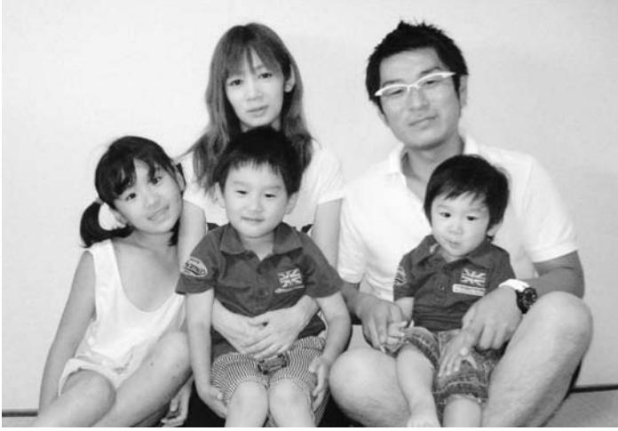

▲左から海月ちゃん、奥さんの亜由美さん、冬也くん、正文さん、大空人くん

馬県館林市、埼玉県川越市を経て、私の父母と祖母の 3 人は福島県の借上げ住宅に、私たちは何とか、 4 月 1 日に、この都営住宅に入居することができ、長女・海月の入学式をさせてあげられたので、ほっとしました 。 震災前は、 3 世代同居、 8 人で暮らしていました 。 家の周辺には、田畑が広がり小川が流れ、庭には池があり、子どもたちは恵まれた自然の中で、のびのびと暮らしていました 。 私も請戸の海で仲間たちとサーフィンを楽しんでいました 。 月 1 回のビーチクリーンやボランティアへの参加をしながら、仲間たちと自然や地域と関わってきたことを思い出します 。 海月は、しばらくの間 「 お家に帰りたい 」 と泣くことが、多 々 ありました 。 長男の冬也は、自転車に乗るのを覚えたばかりで、残してきた自転車の心配をしていました 。 子どもにとっても、大きな環境の変化に対応するのは大変なことだと思います 。 震災のとき、生後 5 カ月で、ミルクやおむつの心配をした大空人みづきとうや

もいない慣れない土地での生活を、妻はよくやってくれています私 。 は、転居後、なんとか新しい職を得ることができました 。 また、早く地域に馴染みたいと思い、小学校のPTAのソフトボール部で活動し、少しずつですが、交友の輪を広げることができています 。 しかし、隣近所の付き合いがほとんどない暮らしで、以前のように、子どもたちだけで自由に遊ばせることは難しい状況です 。 浪江のように、自然豊かな場所でのびのびと遊ばせることができたらと思います震 。 災前までいつも近くにいた仲間との交流が、かけがえのない素晴らしい時間だったとあらためて思い出します 。 またいつの日か浪江の請戸の海をみんなで見たいと夢見ています 。 幼い子どもたちのことを考えると帰るのは難しいのかもしれませんが … 仲間とは、なかなか会うことはできなくても、連絡を取り合い、心はつながっていることができればと思います 。

は 2 歳になりました 。 知り合い

## 紺野昌則さん・葉子さん(権現堂)

取材者:きょうとNPOセンター田口取材日:9月8日 「平成24年10月広報なみえ掲載」

#### 現在進行形の原発事故。その危険性から目をそらさず、行動し続けたい

紺野さんご夫婦は、昨年3月に大阪への避難を決意。当時、高1、中 2、中1だった3人の子どもたちとともに大阪での生活を始められました。長年営まれてきた酒屋業、そして何より浪江町の仲間たちに想いを馳せながら、浪江町の置かれている状況に向き合ってこられました。

| の で す 。 | た 決 断 を す る 責 任 が あ る と 思 う | 得 し て も ら え る 「 未 来 」 に 向 け | 子 ど も た ち や 孫 た ち の 世 代 に 納 | に つ い て 目 を そ む け る こ と な く 、 | に 、 町 民 と し て 放 射 線 の 危 険 性 | れ か ら の こ と を 考 え る と き | す こ 。 | え た い 」 と い う 強 い 願 い か ら で | 子 ど も た ち の 健 康 を 最 優 先 に 考 | 行 形 」 で あ り 、「 未 来 を 生 き る | 過 去 の 出 来 事 で は な く 「 現 在 進 | な ぜ な ら 、 福 島 の 原 発 事 故 は | で 情 報 を 得 て 来 ま し た 。 | 演 会 を 聞 い た り … さ ま ざ ま な 形 | て い る 勉 強 会 に 参 加 し た り 、 講 | う 思 い か ら 、 こ ち ら で 開 催 さ れ | つ い て 「 真 実 」 を 知 り た い と い | 浪 江 町 が 置 か れ て い る 状 況 に | え 続 け て い ま す 。 | か 。 そ の こ と に つ い て ず っ と 考 | 浪 江 町 の た め に で き る こ と は 何 | い ま 、 大 阪 に い る 私 た ち が 、 | な 故 郷 … 浪 江 町 。 | 立 ち 向 か う こ と に な っ た 大 切 | ■ 放 射 線 と い う 見 え な い 脅 威 に |
|------------------|--------------------------------------------------------------------|--------------------------------------------------------------------|--------------------------------------------------------------------|-------------------------------------------------------------------------|--------------------------------------------------------------------|----------------------------------------------------------|----------|--------------------------------------------------------------------|--------------------------------------------------------------------|----------------------------------------------------------------|--------------------------------------------------------------------|---------------------------------------------------------------|-----------------------------------------------------|--------------------------------------------------------------------|--------------------------------------------------------------------|--------------------------------------------------------------------|--------------------------------------------------------------------|---------------------------------------------------------------|--------------------------------------|--------------------------------------------------------------------|--------------------------------------------------------------------|---------------------------------------------------------------|--------------------------------------|---------------------------------------------------------------|--------------------------------------------------------------------|
|------------------|--------------------------------------------------------------------|--------------------------------------------------------------------|--------------------------------------------------------------------|-------------------------------------------------------------------------|--------------------------------------------------------------------|----------------------------------------------------------|----------|--------------------------------------------------------------------|--------------------------------------------------------------------|----------------------------------------------------------------|--------------------------------------------------------------------|---------------------------------------------------------------|-----------------------------------------------------|--------------------------------------------------------------------|--------------------------------------------------------------------|--------------------------------------------------------------------|--------------------------------------------------------------------|---------------------------------------------------------------|--------------------------------------|--------------------------------------------------------------------|--------------------------------------------------------------------|---------------------------------------------------------------|--------------------------------------|---------------------------------------------------------------|--------------------------------------------------------------------|

▲後ろ:左から長男の喜弘さん、次男の純也さん、長女の萌子さん前:左から昌則さん、葉子さん

| て 冷 静 な 心 で 学 び を 深 め 、 町 | せ ん 。 放 射 線 の 危 険 性 に つ | も 、 あ き ら め る わ け に は い | じ て い ま す 。 | 内 の 仲 間 た ち と の 「 温 度 差 」 | 外 に 避 難 し て き た 自 分 た ち | を 流 し て き た か … 。 |
|---------------------------------------------------------------|----------------------------------------------------------|----------------------------------------------------------|----------------------------|---------------------------------------------------------------|----------------------------------------------------------|-------------------------------------------|
| 県 で 感 県 涙 ま                                    |                                                          |                                                          |                            |                                                               |                                                          |                                           |

と

も

き

い

■

民目線での発信をこれからも続けていきたい 。 そして個人的には、いつの日か 「 酒屋を再開ができた ! 」 と言える日が来ることを夢見ながら、できることを一つひとつ積み重ねていこうと思っています 。

## 美容室わたなべ渡部子さん(西台)

取材者:浪江町役場長沼・鴫原取材日:9月4日 「平成24年10月広報なみえ掲載」

#### 笑ったり励ましあったりできるお店にしていきたい

浪江では、アットホームな美容室を経営していた渡部さん。震災後、あきらめかけたこともありましたが、たくさんの方との出会いや手助けがあり8月に "美容室わたなべ"を南相馬市原町区にオープンしました。

「人とつながれる場所を作っていきたい」と明るい声と笑顔で話す渡部さんの美容室は、顔なじみの方が集まる憩いの場になっています。

震災後、津島に家族 5 人で避難しました 。 4 匹の犬が一緒だったので避難所の中には入らず外で過ごしました 。 皆さんも同じですが、ひと家族で 1 個のおにぎりを分け合うこともありました 。 このころは、もうだめだ、生きていけないと、思ったこともありましたが、楢葉に住んでいた姉が避難先から通行止めに何度も合いながら迎えに来てくれて、 4 日目に白河に行きました 。 その後、伯母のいる横浜へ避難して 3 週間お世話になり、喜多方、福島を経て南相馬に落ち着き、 8 月 11 日に美" 容室わたなべ " を開店しました 。 南相馬での再開を決めたのは、一時帰宅のときに少しでも顔を出してもらえればと思ったからです 。 1 カ月かけて店舗を探し、近くの浪江の方にもたくさん助けてもらいました 。 美容室では娘がエステを担当し、ハワイアンロミロミというリンパマッサージやゲルマニウム温浴もやって心身ともにリラックスできる癒しの場にもなってほしいと願っています 。 震災後、親戚が物心ともに支援をしてくれたり、行く先 々 で新しくできた友人が助けてくれ

たり、杉乃家さんを始方 々 の応援もいただきりがたく思っていますは、犬がいるためなか入れてもらえずに辛いましたが、応援してく産屋さんもいてそこでれました 。 息子は仕事いますが、主人と娘、おんと家族 4 人が一緒にことは幸せです 。 喜多ことはとても気がかり毎日欠かさず電話をして福島にいるときに知り合った花" 見山を守る会 " の方たちには本当に助けられました 。 お茶を飲んで話をして元気をもらい、今の原町での生活につながっています 。 いろいろな所で知り合った方たちが、どこに行ってもみんな声を掛けてくれます 。 たくさんの方 々 との出会いがありここまでくることができました 。 人は誰かと話をし、人とつながれる場所が必要だと思います 。

> 江のにあまい受けをし不動けら台にちゃれる母のが、す 。 開店して、今までのお客さん顔を合せて話ができることが番良かったことです 。 商売繁も大事ですが、これからは、てくれた方が元気になったり励ましたり、励まされたりしがら、浪江の方はもちろんのと、原町の方やいろいろな人つながって情報発信していけお店にしていきたいです 。 早いわきまでの高速道路ができてもっとたくさんの方に来ていだけるといいですね 。

め浪

と

一

盛

来

、

な

こ

と

る

く

、

た

本当

。 住

なか

思い

れる

も助

で仙

じい

いら

方の

です

いま

▲浪江からのなじみのお客さんが集まってくれました。「みんなで話せるから、再開してくれてうれしいよ。」と笑顔で話してくださいました。 後列左から、本林チエ子さん(双葉町)、松本スヱ子さん(西台)、渡部さん。前列左から、門馬みやこさん、常子さん(酒田)

安部さんは、昨年の4月から栃木県下野市で生活しています。 年齢の割に若々しく元気な印象の方です。奥さん、長男、弟さんと同居し、そして近くには子どもたちの家族もお住まいです。

| 昨 年 の 3 月 11 日 の 地 震 前 の 凄          | は ま る と こ ろ |
|-------------------------------------------------------------------------|----------------------------|
| ま じ い 地 鳴 り の 音 や 、 地 震 の 揺      | 避 難 地 の 甥      |
| れ 方 は そ れ ま で に 経 験 の な い 激      | 長 期 化 に 伴 い |
| し い も の で し た 。                                    | 会 を 飯 坂 温 泉 |
| 現 在 の 家 は 平 成 に な っ て 新 築           | た 。 従 兄 会 で |
| し た の で 倒 壊 の 心 配 は あ り ま せ      | 各 々 の 復 興 再 |
| ん で し た が 、 以 前 の 家 だ っ た ら      | と を 誓 い 合 い |
| 倒 壊 し て い た の で は と 思 い ま す 。 | い ま 非 常 に      |
| 防 災 放 送 や テ レ ビ で こ の 大 震           | 射 能 汚 染 に よ |
| 災 の 状 況 と 、 原 発 の 事 故 を 知 り      | 0 年 を 超 す 「 |
| 原 発 避 難 者 と な り ま し た 。 親 類      | 業 」 が 途 絶 え |
| を 頼 り 数 カ 所 に 渡 り 避 難 し ま し      | 個 人 的 に は 終 |
| た が 、 長 男 の 会 社 の 関 係 に よ り      | 家 族 で 長 年 営 |
| 栃 木 県 下 野 市 で 生 活 す る こ と に      | で は 手 入 れ す |
| な り ま し た 。                                              | 荒 れ 果 て 、 先 |
| 下 野 市 の ボ ラ ン テ ィ ア や 市 役           | 壊 し た ま ま 放 |
| 所 の 方 々 が 「 私 た ち に で き る こ      | と で す 。 一 日 |
| と は な い か 。」 と い う こ と で 、          | 収 束 と 除 染 を |
| 気 軽 に 集 ま っ て 話 が で き る 場 所      | い で す 。           |
| を 作 ろ う と い う こ と に な り 、 昨      | 避 難 生 活 も      |
| 年 6 月 か ら 月 2 回 の お 茶 会 を 開      | い ま す 。 避 難 |
| 催 し て い た だ き 、 さ ま ざ ま な 情      | ば な る ほ ど 避 |
| 報 提 供 や 情 報 交 換 を し て 支 援 を      | た と き 、 帰 る |
| い た だ い て い ま す 。 下 野 市 に は      | く な る こ と を |
| 1 2 3 名 が 避 難 し て い て 、 南 相      | 残 念 な が ら 若 |
| 馬 市 と 浪 江 町 の 方 が 多 い で す 。      | 家 族 や 自 分 の |
| 私 が 震 災 前 に 住 ん で い た 幾 世           | こ と は た く さ |
| 橋 は 田 園 地 帯 で 海 に も 川 に も 近      | 康 な 体 の う ち |
| く 、 新 緑 の 芽 生 え る 季 節 は ま さ      | 災 前 の あ の 風 |
| に 「 風 薫 る 」 と い う 言 葉 が 当 て      | せ た ら と 思 っ |

でした 。 甥たちが避難生活のい、昨年 9 月に従兄泉で催してくれましでさらに絆を強くし、再生に立ち向かうこいました 。 に残念なことは、放より、明治以来 1 0 「 泉田川の鮭増殖事える危機にあります 。 終の棲家を追われ、営んできた田畑も今することもかなわず先祖の眠るお墓も崩放置状態だというこ日も早い原発事故のを早急に行ってほしも長期になってきて難生活が長期になれ避難区域が解除になっることを悩む人が多を心配します 。 私は若くはありません 。 のことを思うと悩むさんありますが、健ちに浪江に戻り、震風景や生活を取り戻ています 。

今年の8月に日立に越したばかりの高野さん。 旦那さん、娘さん2人と一緒にアパートで笑顔あふれる暮らしをしています。

■ 気持ちに余裕ができました浪江町では夫と同じ工場に勤めていて、震災のときも働いている最中でした 。 震災が起きた直後は津島へ避難し、そして福島市に避難しました 。 そのあと北陸工場のある石川県に移り住んだのですが、まったく知らない土地での言葉や生活文化の違いに戸惑いもあったし、親戚が関東に住んでいたので、今年の 8 月に日立に来ました 。 夫が今までと同じ業態ですぐに仕事が決まったので、安心しました 。 私自身も、福島にも近くなったし、日立での生活環境が良いので気持ちに余裕ができ

▲お姉ちゃんの愛瑠ちゃん、妹の優愛ちゃん。 浪江といえば?と聞いたら、「なみえ焼そば」 だって。 あいるゆうあ

本宮市荒井の恵向仮設住宅はペットが飼えるゾーンがあり、常に一緒だった老犬のために選んだそうです。その愛犬は今年4月2日に亡くなりましたが、「まさに、私たちのかすがいのようでしたが、今は夫婦二人の時間を大切に過ごしています。」とお話ししてくださいました。

▲お二人並んで微笑んでくださいました

| で | 笑 | せ      | が | 浪 | 適 | の | は | 良 |   | れ | 地 | に | 習  | う | 開 | オ |   |        | ■「 | き | だ | 9 | し | 村 | せ | 日 |
|---|---|--------|---|---|---|---|---|---|---|---|---|---|----|---|---|---|---|--------|----|---|---|---|---|---|---|---|
| す | い | ん      | 決 | 江 | な | こ | と | か | 上 | ま | 元 | は | う  | ち | い | ケ | 妻 | 作      |    | 取 | っ | 月 | た | 「 | る | か |
| よ | な | 。「     | ま | の | 住 | と | て | っ | ノ | し | 新 | 発 | こ  | に | た | の | が | っ      | 愛  | り | た | 初 | 。 | こ | 磐 | ら |
| 。 | が |        | ら | 町 | ま | を | も | た | 原 | た | 聞 | 表 | と  | 、 | の | 先 | 習 | て      | 犬  | ま | 愛 | め | そ | り | 梯 | 約 |
|   | ら | 今 は | な | や | い | す | 寂 | の | は | 。 | に | 会 | に  | 先 | で | 生 | っ | く      | が  | し | 犬 | に | の | す | 町 | 5 |
|   | 、 | 仕      | け | 私 | を | る | し | に | 隣 |   | も | が | し  | 生 | 、 | が | て | れ      | 、  | た | は | 移 | 後 | 」 | の | カ |
|   | 前 | 方      | れ | た | 望 | の | い | 離 | 近 |   | 大 | あ | ま  | の | 妻 | 会 | い | ま      | 二  | 。 | 7 | り | 、 | に | 七 | 月 |
|   | へ | な      | ば | ち | ん | が | よ | れ | 所 |   | き | り | し  | 歌 | を | 津 | た | し      | 人  |   | カ | ま | こ | お | ツ | 、 |
|   | 進 | い      | 動 | の | で | 好 | う | 離 | が |   | く | 、 | た  | を | 送 | 若 | 大 | た      | 一  |   | 月 | し | の | 世 | 森 | ペ |
|   | む | よ      | く | 将 | い | き | で | れ | と |   | 取 | そ | 。  | 聞 | り | 松 | 熊 | 」      | 緒  |   | 後 | た | 恵 | 話 | ペ | ッ |
|   | し | ね      | に | 来 | ま | な | す | で | て |   | り | の | 10 | い | 迎 | に | 町 | と      | の  |   | に | が | 向 | に | ン | ト |
|   | か |        | 動 | の | す | の | し | す | も |   | 上 | 様 | 月  | て | え | 教 | の | 弘      | 時  |   | 息 | 、 | 仮 | な | シ | と |
|   | な | 。」     | け | こ | が | で | 、 | 。 | 仲 |   | げ | 子 | 5  | 私 | す | 室 | カ | さ ん | 間  |   | を | 病 | 設 | り | ョ | 過 |
|   | い | と      | ま | と | 、 | 快 | 家 | 妻 | が |   | ら | は | 日  | も | る | を | ラ |        | を  |   | 引 | 気 | に | ま | ン | ご |

## 川島美幸さん(川添)

取材者:NPO法人市民公益活動パートナーズ阿部・古山取材日:10月12日 「平成24年11月広報なみえ掲載」

#### 悪いことばかり考えても仕方がない、不安の中からでも良いことを探そう

現在、福島市内の借上げ住宅に中学1年生の娘さんとお父さんと 3人で暮らしています。 まもなくオープンする「おうちカフェ凜」(飯坂町、スーパーいりん

ちい並び)の準備のため、忙しくしていらっしゃいます。

| 年 の 7 月 ま で お 世 話 に な り | 二 次 避 難 で 猪 苗 代 に 移 り | ら い ま し た 。 | き に 搬 送 す る 手 伝 い を さ せ | そ こ で も 緊 急 物 資 を 新 地 や | 館 ( 福 島 市 ) に 避 難 し ま し | そ れ か ら 、 福 島 青 年 会 議 | 思 い が 頭 を よ ぎ り ま し た 。 | こ で 死 ん で し ま う の か な と | ど の 手 伝 い を し な が ら 、 も | 育 館 で も 、 15 日 の 朝 ま で 誘 | 島 を 目 指 し ま し た 。 避 難 し | て く だ さ い と の 指 示 を 受 け | 察 の 人 が 来 て 、 と に か く 避 | 明 け 方 に 白 い 防 護 服 を 着 | と 避 難 者 リ ス ト を 作 成 し ま | そ こ で は 、 商 工 会 女 性 部 の | 家 発 電 機 は と て も 助 か り ま | 地 元 の 方 が 持 っ て 来 て く れ | ま し た 。 電 気 も な か っ た の | に 行 き 、 今 度 は 中 学 校 に 避 | し た 。 そ の 後 、 自 宅 に 父 を | の 3 階 に 誘 導 す る 手 伝 い を | 者 の 方 た ち と 子 ど も た ち を | う 小 学 校 に 向 か い ま し た 。 | に 行 き 、 そ れ か ら 急 い で 娘 | し た 。 ま ず 私 の お 店 の 様 子 | 会 社 東 遊 紀 の 事 務 局 を し て | 地 震 当 時 は 新 町 の ま ち づ | ■ と に か く 、 動 い て い ま し |
|----------------------------------------------------------|-----------------------------------------------------|----------------------------|----------------------------------------------------------|----------------------------------------------------------|----------------------------------------------------------|-----------------------------------------------------|----------------------------------------------------------|----------------------------------------------------------|----------------------------------------------------------|-----------------------------------------------------------|----------------------------------------------------------|----------------------------------------------------------|----------------------------------------------------------|-----------------------------------------------------|----------------------------------------------------------|----------------------------------------------------------|----------------------------------------------------------|----------------------------------------------------------|----------------------------------------------------------|----------------------------------------------------------|----------------------------------------------------------|----------------------------------------------------------|----------------------------------------------------------|----------------------------------------------------------|----------------------------------------------------------|----------------------------------------------------------|----------------------------------------------------------|-----------------------------------------------------|----------------------------------------------------------|
| ま し                                                   | 、 昨                                              |                            | て も                                                   | い わ                                                   | た 。                                                   | 所 会                                              |                                                          | い う                                                   | う こ                                                   | 導 な                                                    | た 体                                                   | 、 津                                                   | 難 し                                                   | た 警                                              | し た 。                                              | 方 々                                                   | し た 。                                              | た 自                                                   | で 、                                                   | 難 し                                                   | 迎 え                                                   | し ま                                                   | 校 舎                                                   | 保 護                                                   | の 通                                                   | を 見                                                   | い ま                                                   | く り                                              | た                                                        |

| す 。 放 射 能 の 身 体 へ の 影 響 | も し れ な い と 思 う こ と も あ | に 避 難 し た ほ う が 良 か っ た | が と て も 心 強 い の で す が 、 | 娘 が 一 番 の 応 援 者 で あ る | の 専 門 店 か ら 仕 入 れ て い ま す | 方 か ら 紹 介 し て い た だ い た | 味 自 慢 の コ ー ヒ ー は 、 猪 苗 | し て 準 備 を し て い ま す 。 さ | お 世 話 に な っ た 方 々 に お 願 | 大 堀 相 馬 焼 協 同 組 合 や い ろ | と つ な が っ て い た い と い う 思 い | 今 ま で お 世 話 に な っ た 人 | 半 分 、 嬉 し さ 半 分 の 気 持 ち で | か ら ス タ ー ト で す 。 今 は 、 | カ フ ェ の オ ー プ ン に 向 け て | 避 難 し て き た 友 だ ち と 始 | ら れ ま し た | ■ た く さ ん の 人 に 出 会 い 、 | が ら 励 ま さ れ ま し た 。 | 多 く 来 ら れ 、 互 い に お 話 を | は 浪 江 か ら 避 難 し て い る 方 | リ の 手 伝 い も し ま し た 。 病 | で 近 所 の 小 川 病 院 さ ん で リ | た 、 整 体 の 資 格 を 持 っ て い | ば を 焼 き に も 出 か け ま し た | 出 し の 手 伝 い や 、 青 森 ま で | な っ て し ま い そ う で し た 。 | ま し た 。 動 い て い な い と 病 | た が 、 そ こ で も 休 ま ず 動 い |
|----------------------------------------------------------|----------------------------------------------------------|----------------------------------------------------------|----------------------------------------------------------|-----------------------------------------------------|---------------------------------------------------------------|----------------------------------------------------------|----------------------------------------------------------|----------------------------------------------------------|----------------------------------------------------------|----------------------------------------------------------|--------------------------------------------------------------------|-----------------------------------------------------|---------------------------------------------------------------|----------------------------------------------------------|----------------------------------------------------------|-----------------------------------------------------|-----------------------|----------------------------------------------------------|------------------------------------------------|----------------------------------------------------------|----------------------------------------------------------|----------------------------------------------------------|----------------------------------------------------------|----------------------------------------------------------|----------------------------------------------------------|----------------------------------------------------------|----------------------------------------------------------|----------------------------------------------------------|----------------------------------------------------------|
| が や                                                   | り ま                                                   | の か                                                   | 県 外                                                   | こ と                                              | 。                                                             | 群 馬                                                   | 代 の                                                   | ら に                                                   | い を                                                   | い ろ                                                   | で 、                                                             | た ち                                              | す 。                                                        | 辛 さ                                                   | 、 1                                                   | め る                                              |                       | 助 け                                                   |                                                | し な                                                   | 々 も                                                   | 院 に                                                   | ハ ビ                                                   | た の                                                   | 。 ま                                                   | 焼 そ                                                   | 炊 き                                                   | 気 に                                                   | て い                                                   |

用意しています。

はり気になり、自分で確認するために、娘が口にする物は二本松まで測定に出かけています 。 さらに、家の周りも線量が高めなので、登下校も車で送り迎えしています 。 娘は合唱部で頑張っています 。 今につながるいい出会いもたくさんありましたし、私も前向きでいようと思います 。 これからも、多くの人とつながりながら輪" " を作っていきたいと思っています 。 定休日日曜日時間 10時~17時素敵な器でおいしいコーヒーでおもてなしをします。小さなお子さま連れのお母さまもお越しください。お子さまが喜ぶ絵本なども

▲まもなくオープンの「おうちカフェ凛」で。

## 柴陽子さん(請戸)

取材者:NPO法人ちば市民活動・市民事業サポートクラブ大内取材日:10月6日 「平成24年11月広報なみえ掲載」

先は見えないけれど、それでも今は頑張っていくしかない

現在、ご主人の政一さん、長女遥香さん(中2)、次女康羽さん(小6)と、隣にはご両親、そして弟さん家族が同じ棟で暮らしている。 やすは

子どものお迎えにそろそろ学校に行かなければいけないと思っていた矢先、地震が起きました 。 私はすぐに子どもたちの元へ 。 漁師の主人は海の様子を観て、船ですぐに津波をかわして沖に出られたため、助かりました 。 タイミングが悪かったら、どうなっていたか解りません 。 娘たちは、上着を着る間もなく上履きのままで学校から大平山に行き、さらに山を越えて避難場所へ 。 足が不自由な康羽は学校のみんなと一緒に行くのは無理なので、私とともに行動し

▲陽子さんと次女の康羽さんと仲良く一緒に。

ました 。 夕方ようやく遥香と役場で合流し、隣の体育館で一晩過ごしました 。 車中で一泊するなど大変な思いをしましたが、両親や弟家族も含め総勢 12 名で千葉県四街道市の叔父の家を頼りに避難してきました 。 その後、市役所が用意してくださった現在の社宅に移りました 。 ここは 1 棟が空き家になっていたこともあり、両親、弟家族、私たち家族それぞれがこの同じ棟に住むことができました 。 他にも福島から避難して来た人たちが住んでいます 。 1 階には支援室があり、月に 1 回お茶飲みをしながら、おしゃべりをしています 。 今、遥香は友だちもでき、部活の吹奏楽部でサックスを吹いています 。 しかし、請戸小でやっていたソフトボールがやりたかったのでしょうね、高校ではソフトボールをやりたいと言っています 。 康羽は、友だちはできたものの、まったく新しい環境のため、一時的に視力と足の状態が悪化し心配しましたが、今は体調も戻り友だちの家に遊びに行ったりしています 。

私は市役所の紹介でイトーヨーカ堂の鮮魚コーナーで働いています 。 請戸では、獲れたての魚を食べていたので、高い値段のついた魚が並ぶ様子にびっくりする毎日です 。 主人も紹介していただいた会社で働いていましたが、漁師だった主人にとって、陸の上でいったい何ができるのかと葛藤があったのでしょう、今は新しい仕事を探しています 。 今、伝えたいのは、大変な捜索の最中にも関わらず、自衛隊の方がランドセルと学校で使っていたものを持ち出してくれたことへの感謝の思いです 。 津波ですべてなくなってしまった中での唯一のものですから 。 請戸では一緒に暮らしていて、今は二本松に二人でいる主人の両親が気がかりですが、現状では、子どもを連れて帰ることはできません 。 しかし浪江のことはいつも心にあります 。 主人と話しているのは、いずれ漁を再開してお世話になった人、友人、知人に請戸のおいしい魚を届けたいということです 。 そして先の見えない中でも、頑張っていくしかないと思っています 。

> --

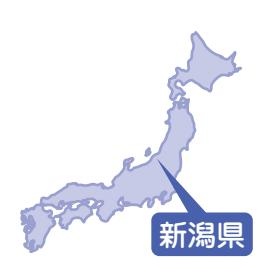

小松雄次さん(川添)

取材者:NPO法人くびき野サポートセンター野本・竹内取材日:10月21日 「平成24年11月広報なみえ掲載」

## 浪江の思い出は人とのつながり新潟県

小松雄次さんのご家族は、現在新潟県柏崎市の借り上げ住宅で避難生活を送っています。ご本人は平日福島に戻り以前の仕事を続け、週末になるとご家族に会いに戻る日々を送っています。

震災発生時、私たち夫婦は福島第一原発に勤務していました 。 家族の安否を確認しようにも電話は通じない状況 。 とにかく長男と次女の通う小学校へ向かいました 。 子どもたちと合流し、 7 時ごろ自宅へ到着 。 家の中はめちゃくちゃでしたが、両親と長女は無事でほっとしました 。 翌朝から避難指示にしたがい津島の農協に避難しましたが、避難区域の拡大のため他の場所を探すことに 。 2 台の自動車で各地を転 々 としている間にガソリンが切れてしまい、 1 台を乗り捨てなくてはなりませんでした 。 情報源はラジオのみ 。 不安感が募りました 。 避難生活の疲れから父や長男が体調をくずしてしまい困っていたところ、泉崎村の親戚がうちに来るようにと声をかけてくれました 。 ここでやっと落ち着いてこれからの仕事のこと、子どもたちの学校のことなどを考える余裕ができました 。 新潟県に仕事のあてや子どもたちの編入先が見つかり、 4 月 12 日に柏崎市の借り上げ住宅に

引っ越すことが決ま新たな土地での生活かったわけではありたちを受け入れてくで、ふさぎこみがちちがこちらの学校に心配でした 。 しかし柏は中越沖地震の経験被災者の気持ちをよくれて、とても親切れました 。 子どもたかかりましたが今の生活になじみ、避難先の住宅で新しい友だちと楽しそうに遊んでいます 。 長女は吹奏楽、長男は剣道、次女はピアノに打ち込み、日 々 を過ごしています 。 現在の私は一人福島に戻り仕事をしています 。 家族のことが心配で、週末になると柏崎市に会いに行く日 々 。 初めは家族を元気づけるためでしたが、今では自分も家族から元気を

りました 。 は不安がなません 。 私れるか心配な子どもたなじめるか崎市の人 々 から私たちく理解してに接してくちも時間は分けて生活を大切なである当然戻家族だらばらみんなと思い町の思た人 々

もらっています 。 そんな続けていると、何よりものは人と人とのつながりと感じます 。 浪江町にはりたい 。 けれども私たちけが戻るのではなく、ばになってしまった町民がで戻ることに意味があるます 。 なぜならば、浪江い出はそこでともに生きとの思い出だからです

▲後列:左から長女の結衣さん、次女の茉結さん、 。 おばあちゃんの波子さん、奥さんの房子さん前列:左からおじいちゃんの洲三さん、長男の颯太くん、雄次さんゆいまゆなみこしゅうぞうゆうじそうたふさこ

 田泰夫さん(権現堂) 半谷千代子さん(権現堂)・村形孝子さん(権現堂)

取材者:NPO法人ちば市民活動・市民事業サポートクラブ鍋嶋取材日:10月11日 「平成24年11月広報なみえ掲載」

#### 東京の東雲で、支えあって暮らしています。

東京都江東区東雲にある東雲公務員住宅には、福島県から1,250名もの人たちが避難し暮らしています。うち、浪江町民は約300名。江東区の後押しもあり、避難してきた住民の交流などを目的にした自治会組織「東雲の会」が昨年9月に設立され、「しののめサロン」など、さまざまな活動に取り組んでいます。

> ■ 今の暮らし

〈 半谷さん 〉

私は、嫁と 4 人の

孫と一緒に暮らして

います 。

息子はいわき市で

働いています 。 ここは、

近くにスーパーや病

院があり、とても便

利な所なので暮らし

やすいです 。

〈 田さん 〉

「 東雲の会 」 の活

動は震災で、ここに

避難してきているす

べての人たちを対象

| 会 た 」 も の の 役 を 割 分 。 配 避 す 難 る 生 の 活 も も 「 長 東 く 雲 な っ の | チ た ケ 食 ッ 品 ト や な 日 ど 用 、 品 寄 か 付 ら し 、 て 歌 も 舞 ら 伎 っ の | か る 企 っ こ 業 た と か で が ら す で さ 。 き ま 衣 、 ざ 類 本 ま や 当 な 野 に 支 菜 あ 援 と り を い が 受 っ た け | 〈 江 東 避 田 難 区 さ し や ん て 近 〉 来 隣 た の 当 住 初 民 か の ら 人 今 た ま ち で 、 、 | ■ み 避 に 難 な し っ て て 来 い て ま し た 。 | も イ 打 ン 夜 ち の ノ 森 上 桜 公 げ は ら き 園 れ れ や て い 請 戸 、 で 季 し 川 節 た リ の 。 バ 楽 花 ー し 火 ラ | 〈 し 村 た 形 。 さ ん 〉 | さ の ん 店 の と 人 し た て ち 、 が 地 来 元 て 町 く 内 れ か て ら い た ま く | 修 で 行 、 か 絶 ら 品 帰 で っ し て た 来 。 て 二 、 人 家 の 族 息 経 子 営 も | 漁 を 港 や か っ ら て 仕 い 入 ま れ し た た 魚 。 は 地 獲 元 れ 、 た 請 て 戸 | 私 は 浪 江 町 で 32 年 間 、 寿 司 屋 | 〈 ■ 浪 田 江 さ に ん い 〉 た こ ろ の 暮 ら し |
|-----------------------------------------------------------------------------------------------------------------------------------------------|------------------------------------------------------------------------------------------------------------------------------------------|----------------------------------------------------------------------------------------------------------------------------------------------------------------------------------------------------------------|-------------------------------------------------------------------------------------------------------------------------------------------------------------------|-----------------------------------------------------------------------------------|-----------------------------------------------------------------------------------------------------------------------------------------------------------------------------------------------------------|-------------------------------------------|------------------------------------------------------------------------------------------------------------------------------------------|------------------------------------------------------------------------------------------------------------------------------------------|------------------------------------------------------------------------------------------------------------------------------------------|----------------------------------------------------------------|-----------------------------------------------------------------------------------|
|-----------------------------------------------------------------------------------------------------------------------------------------------|------------------------------------------------------------------------------------------------------------------------------------------|----------------------------------------------------------------------------------------------------------------------------------------------------------------------------------------------------------------|-------------------------------------------------------------------------------------------------------------------------------------------------------------------|-----------------------------------------------------------------------------------|-----------------------------------------------------------------------------------------------------------------------------------------------------------------------------------------------------------|-------------------------------------------|------------------------------------------------------------------------------------------------------------------------------------------|------------------------------------------------------------------------------------------------------------------------------------------|------------------------------------------------------------------------------------------------------------------------------------------|----------------------------------------------------------------|-----------------------------------------------------------------------------------|

| り | ら | を | 寄 | ら | し | す | な | な | て |
|---|---|---|---|---|---|---|---|---|---|
| ま | と | 守 | り | な | た | る | い | ど | い |
| し | 「 | り | を | い | 。 | 人 | こ | 、 | く |
| た | 東 | な | 助 | 状 | 誰 | や | と | 確 | 中 |
| 。 | 雲 | が | け | 態 | が | 病 | も | 認 | で |
|   | の | ら | 、 | か | 住 | 死 | 出 | し | 、 |
|   | 会 | 避 | 小 | ら | ん | す | て | 合 | ゴ |
|   | 」 | 難 | さ | 、 | で | る | き | わ | ミ |
|   | の | 生 | な | み | い | 人 | た | な | 出 |
|   | 活 | 活 | 子 | ん | る | も | し | け | し |
|   | 動 | が | ど | な | の | 出 | 、 | れ | の |
|   | が | で | も | で | か | て | 孤 | ば | ル |
|   | 始 | き | た | お | わ | き | 独 | い | ー |
|   | ま | た | ち | 年 | か | ま | 死 | け | ル |
|   |   |   |   |   |   |   |   |   |   |

にしています 。 「 無理強いはせず、来るものは拒まず 」 です 。 毎週火曜日と木曜日に開催している 「 しののめサロン 」 では、手芸教室や体操教室をやったり、 「 ハンドマッサージ 」 のボランティアの人に来てもらったりしています 。 住んでいる人たち同士で、自由におしゃべりできるよう茶菓も用意しています 。 保健所から、お医者さんや看護師さんに来てもらって健康相談もやって

▲前列右から村形孝子さん、半谷千代子さん後列右から田泰夫さん、大坊雅一さん

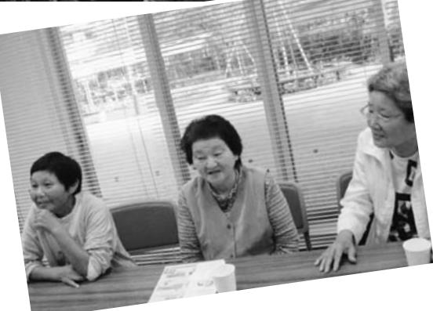

いるし、補償の問題や生活不安に応えられるよう、弁護士さんや東京都の仕事センターの職員さんにも来てもらっています。 江東区や社会福祉協議会、日本赤十字や周辺の地域住民の皆さん、おおぜいの人から支援してもらっています。 一方で、支援してもらってばかりの暮らしから、自分たちでできることを始めなければと思っ

ています。手始めに、クリーン作戦と名づけ、昨年の暮れから毎月1回、地元町会のゴミ拾い

| な に ぎ わ い に な る ん で す よ 。 | て 販 売 し て い ま す 。 土 日 は 結 構 | や 生 ビ ー ル 、 か ら あ げ な ど を 作 っ | の 若 洲 公 園 に 店 を 構 え 、 か き 氷 | 志 を 募 っ て 、 ゲ ー ト ブ リ ッ ジ 下 | ふ る ま っ た の を き っ か け に 、 有 | で 、 す い と ん を 作 っ て 参 加 者 に | の 3 月 11 日 に 開 催 し た 「 慰 霊 祭 」 | を 続 け て い ま す 。 さ ら に 、 今 年 |
|---------------------------------------------------------------|--------------------------------------------------------------------|-------------------------------------------------------------------------|--------------------------------------------------------------------|--------------------------------------------------------------------|--------------------------------------------------------------------|--------------------------------------------------------------------|--------------------------------------------------------------------------|--------------------------------------------------------------------|
|---------------------------------------------------------------|--------------------------------------------------------------------|-------------------------------------------------------------------------|--------------------------------------------------------------------|--------------------------------------------------------------------|--------------------------------------------------------------------|--------------------------------------------------------------------|--------------------------------------------------------------------------|--------------------------------------------------------------------|

## ■今後のこと 〈半谷さん〉

浪江に帰ることは半ば諦めていますが、自分の代で家がなくなると思うと辛いですね。

# 〈村形さん〉

息子の嫁が、こちらに来てから出産。今は、夫と息子夫婦と孫3人の7人暮らしです。東京は生活するには、便利な場所ですが、やはり、山が見え、田んぼに囲まれ、季節の変化が感じられた以前の暮らしが懐かしいです。浪江に帰ることはできなくても、福島県内に住むことができればと思います。ただ、放射線量のことを考えると、幼い

> 子どもたちも一緒にというのは難しいと思っています。私と夫の二人ででも、福島に転居できればと考えています。

## ■浪江のみんなへ 〈村形さん〉

思い出ばかりで生きていくのは、どうかと思います。でも、踏ん切りがつきません。先の見えない中で、ああしよう、こうしようとは言えません。一人ひとり状況が違います。どこに住むかは、それぞれの判断です。 でも、希望を捨てないで頑張っていけたらと思います。

## 渡辺理恵さん(権現堂)

取材者:地域社会デザイン・ラボ中島取材日:11月12日 「平成24年12月広報なみえ掲載」

#### たくさんの人に支えられ、 4人の子どもたちから元気をもらって

南相馬市、福島市、群馬県片品村と、避難先を転々とした渡辺理恵さん。昨年 8月からは、ご主人と4人の娘さんと、ご主人のご両親の8人家族で仙台市の借り上げ住宅で暮らしています。避難先では多くの人に支えられ、うれしい出会いもあったとか。度重なる引越し、転校を余儀なくされたお子さんも、それぞれたくましく成長。ふるさと・浪江での思い出を心の糧に、「毎日、頑張っています!」。

■ 引越しに次ぐ引越し震災後は一旦、私の実家の南相馬市原町に避難し、原発事故の後、福島市の知り合い宅に身を寄せました 。 でも長く居てはご迷惑になるので、 3 月後半からうちの家族と義父母は群馬県片品村に、そして私の両親は埼玉県へと別 々 に避難したんです 。 先の見えない不安な毎日でしたが、片品村では地域ぐるみでボランティアの皆さんが何から何までお世話してくださって 。 子どもの学校の手配やご飯の世話、ランドセルや衣類まで揃えてくださったり 。 本当にありがたかったです 。 宿泊先は、初めの 1 カ月くらいは 7 、 8 軒のペンションや民宿を転 々 としましたが、後の 4 カ月は 1 軒の民宿に落ち着きました 。 民宿の女将さんがたまたま私と同年代で話も合いましたし、とても面倒見のいい方で 。 そのご一家とは、私たちが仙台に引っ越してからも泊まりに行ったり来ていただいたり、家族ぐるみで仲良くしているんです 。 仙台でも、子どもの学校のお母さんや近所の方からなにかと親切にしていただいています 。 震災という大きな不幸がなけれ

ばこの方たちと会うことはなかった、ご縁って不思議だなと思います 。 浪江で親しくしていた友人は避難先がばらばらで、寂しくてたまらないこともありますが、携帯で連絡を取り合っています 。 ■ 思い出を胸に、明日へ避難生活で一番辛いのは、なれない土地で何もすることがないこと 。 片品村でも初めはご厄介になるばかりで心苦しかったんですが、夏場、民宿のお手伝いをすることで気持ちが楽になりました 。 その点、仙台は専門学校時代に毎日通った馴染みのある街ですし、子育てに追われていると月日が経つのがあっという間ですね 。 長女のまどかは中 1 、次女の悠夏は小 5 、 3 女の萌 々 華は小 2 、末娘の凜花は 2 歳になりました 。 上の 3 人は震災後、片品、仙台と小学校を 2 回転校しました 。 「 浪江に帰りたい 」 と涙ぐむこともありましたが、子どもたちは順応性が高いのが救いです 。 今、上のお姉ちゃん 2 人は部活に夢中 。 悠夏はピアノも習い始めました 。 萌 々 華は学校から帰るなりお友だちと遊びに行っちゃう元気な子ですが、最近は学習ももかりんかゆうか

> 塾に行きたいと言っています 。

▲「懐かしい浪江の皆さん、またお会いしたいです。」と渡辺さん。次女・悠夏ちゃん、末娘・凜花ちゃんと一緒に。

こういう状況なので、本人がやりたいことはやらせてあげたいねと主人と話しています 。 浪江で生まれ育った娘たちは、私たちにとって故郷の記憶そのもの 。 みんなで楽しんだ十日市のお祭りやお花見など、思い出は何ものにも代えられない宝物です 。 娘たちとともにこれからも頑張って生きていきたい 。 そして浪江の家にあるアルバムは、一時帰宅できるとき、なんとしても持ち帰りたいと思っていま

す 。

取材者:NPO法人ちば市民活動・市民事業サポートクラブ鍋嶋取材日:11月15日 「平成24年12月広報なみえ掲載」

孫たちの将来に期待し、自分たちの暮らしを楽しみたい

> 泉田さんご夫婦は、震災後、千葉市に避難。 来年春には、国分寺市での再スタートを決めました。

千葉県

| も い 知 の で け と さ れ 。 サ 花 ン い さ ば る べ す ど 生 ン 年 た 回 し を 回 安 を り お 薬 、 き が た 周 イ の シ と ぎ り ほ る る は 活 グ 。 。 も て 継 、 定 し で 客 局 山 ど 感 街 辺 ク 美 ョ 思 込 や ど も 気 、 で を 近 福 の か い を は ン で の 一 し て 、 さ 歩 き じ 並 リ 術 う ん 孫 に 気 し 楽 く 島 転 ら で 時 て い 会 ま 営 き 妻 ら み 緑 ン 館 の よ で の し も な 持 た し の 県 居 は く 帰 い ま 話 は ん も と れ で や グ 」 近 う ば 成 た お り ち 。 む 海 職 を 転 れ 宅 ま 、 し を 、 で 楽 一 ま す 花 を な く に か 長 。 い ま が こ な や を 繰 勤 楽 に き で く す 越 ち た す み し 方 無 め せ ケ 食 か で 物 が ア 来 ん 家 く 浪 き も て べ 、 あ し 今 な 千 ま 期 て も さ 。 し ち 。 、 が い ん ッ け は 騒 を て ど に 江 | し 仕 た 楽 ほ い ■ し 緒 せ が が 楽 ど に な り を で し せ 落 こ ど 山 定 り の で 。 私 恭 ん 住 り た 事 し と ま に ん 、 多 し の は い 見 も く ん ち に 、 へ 年 返 連 暮 息 子 で ま 。 も み ん し は 旅 。 自 く む 施 、 ん て る 、 な で 込 来 悠 の 退 し 続 ら 子 さ い し 震 家 な ど た 、 行 そ 然 、 日 設 公 で は 中 妻 く し ん て 々 サ 職 て で し 夫 ん ま た 災 庭 が が 。 浪 に こ の 整 々 が 園 い い で の 、 た で 半 自 イ し き 、 、 婦 の す 。 江 る 後 生 ら 顔 薬 出 で 豊 備 で あ や け 、 が 痩 。 何 年 適 ク て ま 数 就 も お 。 、 活 商 見 局 町 か 、 か さ す り 「 マ な ふ ん せ 食 も ほ な リ し 十 職 10 跡 話 4 |
|-------------------------------------------------------------------------------------------------------------------------------------------------------------------------------------------------------------------------------------------------------------------------------------------------------------------------------------------------------------------------------------------------------------------------------------------------------------------------------------------------------------------------------------------------------------------------------------------------------------------------------------------------------------------------------------------------------------------------------------------------------------------------------------------------------------------------------------------------------------------------------------------------------------------------------------------------------------------------------------------------------------------------------------------------------------------------------------------------------------------------------------------------------------------------------------------------------------------------------------------------------------------------------------------------------------------------|----------------------------------------------------------------------------------------------------------------------------------------------------------------------------------------------------------------------------------------------------------------------------------------------------------------------------------------------------------------------------------------------------------------------------------------------------------------------------------------------------------------------------------------------------------------------------------------------------------------------------------------------------------------------------------------------------------------------------------------------------------------------------------------------------------------------------------------------------------------------------------------------------------------------------------------------------------------------------------------------------------------------------------------------------------------------------------------------------------------------------|
| ら 大 学 ま で 東 京 つ ら                                                                                                                                                                                                                                                                                                                                                                                                                                                                                                                                                                                                                                                                                                                                                                                                                                                                                                                                                                                                                                                                                                                                                                                                                                                                               | こ の 私 マ は ン 、 シ 中 ョ 学 ン か に                                                                                                                                                                                                                                                                                                                                                                                                                                                                                                                                                                                                                                                                                                                                                                                                                                                                                                                                                                                                                                                         |
| 入 居 し ま し た 。 き に                                                                                                                                                                                                                                                                                                                                                                                                                                                                                                                                                                                                                                                                                                                                                                                                                                                                                                                                                                                                                                                                                                                                                                                                                                                                               |                                                                                                                                                                                                                                                                                                                                                                                                                                                                                                                                                                                                                                                                                                                                                                                                                                                                                                                                                                                                                                                                                                                            |
|                                                                                                                                                                                                                                                                                                                                                                                                                                                                                                                                                                                                                                                                                                                                                                                                                                                                                                                                                                                                                                                                                                                                                                                                                                                                                                                         |                                                                                                                                                                                                                                                                                                                                                                                                                                                                                                                                                                                                                                                                                                                                                                                                                                                                                                                                                                                                                                                                                                                            |

ましたが、最後に行ったと、家の荒れようがひどく、くて家の中に入ることがでんでした 。 での暮らしは便利ですが、との違いを感じる場面も多ます 。 以前の暮らしでは、鍵をかけることなど、ほとありませんでした 。 ここにからも、夏には、玄関のド開けて風を入れていました戚や宅急便の配達の人に、だからと助言を受け、最近、家にいるときでも、鍵をるようになりました 。 水やの味も違い、スーパーマートに並ぶ魚には、手が出までした 。 先日、震災後、初刺身を買って食べました 。 ものねだりをしていても仕ありません 。 諦めることもてはと思います 。 、息子夫婦は、国分寺に住薬局開局の準備をしていま小学校 1 年生と 3 年生の孫の成長も楽しみです 。 私た来年春には国分寺市に引っ、薬局経営を手伝う予定で震災で失くしたものは、たんあります 。 でも、いつま後ろを向いてばかりでは生いけません 。 孫たちの将来待し、自分たちの暮らしをたいと思うのです 。

原田さんご夫妻は、山形県高畠町の借り上げアパートで生活しています。鶴次さんは腎臓の病気を持っているため、現在も1日おきに透析を受けています。避難翌日から、透析を受けられる病院を探し福島県内を転々とし、避難から4日目、高畠町の病院で無事透析を受けることができたそうです。

▲左:鶴次さん右:節子さん近くに住む3人のお孫さんと会うのが何より楽しみ!

地震の後はまず、中学校に避難しました 。 余震が怖くて家にはいられなかった 。 朝起きたら原発が爆発するからと言われ、すぐに町から避難しました 。 まずは、透析を受けられる病院を探しに行くことが先決と考え、町の皆さんが避難した津島ではなく、原町の病院に向かいました 。 ですが、患者さんがいっぱいで受け入れてもらえず、福島市や川俣町の病院など何件か回ったのですが、どこでももともと利用していた患者さんで手いっ

| う お 。 互 い に 頑 張 っ て 暮 ら し ま | な い の で す が 、 体 を 大 切 に | う こ と 、 連 絡 を と る こ と が | に 暮 ら し て い ま す 。 な か な | 浪 江 の 皆 さ ん 、 私 た ち は | な く 生 活 し て い ま す 。 | 形 の 皆 さ ん は 親 切 で 温 か く | 雪 は き を 手 伝 っ て く れ た り | 畑 で 作 っ た 野 菜 を く だ さ っ た | を 届 け て く れ ま す 。 町 内 の 方 | 難 者 の 交 流 会 の 案 内 や 町 の | に 3 回 ほ ど 訪 ね て く だ さ り | 高 畠 町 の 福 祉 課 の 職 員 の 方 | 最 高 の 場 所 で し た 。 こ ち ら | で 、 食 べ 物 も お い し く 、 住 | 浪 江 は 海 あ り 、 山 あ り 、 川 | と を 思 い 出 し ま す 。 今 思 う | 海 へ 遊 び に 連 れ て い っ て い | た こ ろ は 、 毎 年 夏 に 遊 び に 来 | こ と も 楽 し み の 一 つ 。 浪 江 | 孫 が 小 学 校 の 帰 り に 遊 び に | う 来 て く れ 、 感 謝 し て い ま | も 忙 し い よ う で す が し ょ っ | を つ く る 農 家 に 嫁 い だ の で | 娘 は ぶ ど う 、 ラ フ ラ ン ス | し た 。 | 仕 組 み や 対 策 が あ れ ば と 感 | に 猶 予 が な い 病 人 が 安 心 で | 聞 い て い ま す が 、 緊 急 時 、 |
|--------------------------------------------------------------------|----------------------------------------------------------|----------------------------------------------------------|----------------------------------------------------------|-----------------------------------------------------|------------------------------------------------|----------------------------------------------------------|----------------------------------------------------------|---------------------------------------------------------------|---------------------------------------------------------------|----------------------------------------------------------|----------------------------------------------------------|----------------------------------------------------------|----------------------------------------------------------|----------------------------------------------------------|----------------------------------------------------------|----------------------------------------------------------|----------------------------------------------------------|---------------------------------------------------------------|----------------------------------------------------------|----------------------------------------------------------|----------------------------------------------------------|----------------------------------------------------------|----------------------------------------------------------|-----------------------------------------------------|-------------|----------------------------------------------------------|----------------------------------------------------------|----------------------------------------------------------|
| し ょ                                                             | し て                                                   | で き                                                   | か 会                                                   | 元 気                                              |                                                | 不 便                                                   | 、 山                                                   | り 、                                                        | も 、                                                        | 情 報                                                   | 、 避                                                   | が 月                                                   | で は                                                   | ん で                                                   | あ り                                                   | と 、                                                   | た こ                                                   | て 、                                                        | に い                                                   | 寄 る                                                   | す 。                                                   | ち ゅ                                                   | 仕 事                                                   | 、 米                                              |             | じ ま                                                   | き る                                                   | 時 間                                                   |

## 舘内進さん・奈さん(西台)

取材者:NPO法人山形の公益活動を応援する会・アミル柴田取材日:11月11日 「平成24年12月広報なみえ掲載」

#### 消防団の皆さん、行きつけのお店「ブラカイ」でまた楽しく飲める日を楽しみにしています

にれた警察で、避難しと言われと

山形県

2010年7月に結婚し、西台地区で暮らしていた舘内さんご夫妻。浪江町ではお米屋「舘内商店」を営んでいました。今年7月に長男・夢斗くん(4カ月)が生まれ、山形市内の借り上げ住宅に家族3人で暮らしています。 ゆめ

浪江町で米屋を営んでいましたので、 3 月 11 日地震が起きたときは、倉庫で米の配達の準備をしていました 。 ただごとじゃない大きな長い揺れに驚き、店に戻りました 。 店の中は、階段が外れて、お店の入口もガラスがすべて割れ、壁にびひも入っているとてもひどい状態でした 。 妻は、海が近いドラッグストア勤務していて、回ってきてくの方に 「 津波が来るのないと飲み込まれる 」 、従業員の方と山の方

へ避難し無事でした 。 私の所でも 「 津波だから逃げろ 」 と言われ、すぐ私の両親と祖母と私の 4 人で、車で逃げました 。 1 日は、自宅で過ごしましたが、余震がひどく寝たかどうか覚えていないくらいです 。 その後、何カ所か避難所を転 々 とし、両親から 「 先に逃げなさい 」 と言われ、妻の実家がある山形県に 2 人で避難しました 。 ガソリンがなかったのですがなんとか仙台まで避難し、その後山形の父が迎えにきてくれ避難することができました 。 3 カ月ほど実家で生活させてもらい、借り上げ住宅が見つかり今は山形市に暮らしています 。 仕事でお世話になっていた方やお客さんもですが、仲がいい人ほど、お互いつらい状況ということがわかるので、すぐに連絡は取れませんでした 。 相手も大変な状況、大丈夫ではないことがわかっているので、今も連絡をできない方も多いです 。 こちらでは車で職場に通っていますが、山形の雪の多さに驚いています 。 浪江町は積もらなかったので、冬タイヤもはいた

| 両 て と い を 災 浪 の 響 ん ま っ た た っ し 、 ど い ら た い 時 親 日 い も ま 楽 以 江 生 が が す た り 。 た て こ の た 浪 地 ま 間 に は あ ま す し 来 町 ま な 、 。 り 、 夏 の い れ 情 り 江 元 す を 長 、 す り 。 み 。 会 を れ く い 今 、 マ は で ま ま 報 、 町 、 の 。 大 男 宮 | に ま え 子 育 な つ は き ラ 海 何 す で を 自 の い 消 自 切 を 城 な 防 し 消 ど 浪 。 た っ っ か 難 れ ソ で か の 教 分 情 ろ 営 に 見 県 く 団 て も 防 江 み た た 放 し い ン バ あ つ え の 報 ん 業 ゆ せ に な に い に ん 団 思 と 射 い な 大 ー る で な て 父 を な だ っ に 避 り 入 ま 見 な の い し 能 か 海 会 ベ と は が も か 教 団 っ く 行 難 残 っ す せ で み 出 た な も を も キ 「 、 り ら ら え 体 た り き し 念 て ! た ん 海 飲 の ら ど し 思 海 ュ 海 に っ 手 て の こ 過 、 て い に い め な 場 、 何 れ い ま ー 」 が も た 続 い 仲 と ご 家 い 思 た と る と 所 自 も ま 出 で を で 近 感 り き た 間 、 し 族 る っ こ 思 日 震 ・ 分 影 せ し 走 し し か 謝 し な だ か ま て の | は こ 怖 と い が で あ す り ね ま 。 せ 休 ん み で の し |
|-------------------------------------------------------------------------------------------------------------------------------------------------------------------------------------------------------------------------------------------------------------------------------------------------------------------------------------------------------------------------------------------------------------------------------------------------------------------------------------------------------------|-----------------------------------------------------------------------------------------------------------------------------------------------------------------------------------------------------------------------------------------------------------------------------------------------------------------------------------------------------------------------------------------------------------------------------------------------------------------------------------------------------------------------------------------------------------------------------------------------------------------------------------------------------------------------------------------------------------------------------------------------------------------------------------------------------------------------------------------------------------------------------------------------------------------------------------------------------------------------------------------------------------------------------------------------------------------------------------------------------------------------------------------------------------------------------------------------------------------------|--------------------------------------------------------------------------------------------------|
|-------------------------------------------------------------------------------------------------------------------------------------------------------------------------------------------------------------------------------------------------------------------------------------------------------------------------------------------------------------------------------------------------------------------------------------------------------------------------------------------------------------|-----------------------------------------------------------------------------------------------------------------------------------------------------------------------------------------------------------------------------------------------------------------------------------------------------------------------------------------------------------------------------------------------------------------------------------------------------------------------------------------------------------------------------------------------------------------------------------------------------------------------------------------------------------------------------------------------------------------------------------------------------------------------------------------------------------------------------------------------------------------------------------------------------------------------------------------------------------------------------------------------------------------------------------------------------------------------------------------------------------------------------------------------------------------------------------------------------------------------|--------------------------------------------------------------------------------------------------|

伊藤暢秀さん(権現堂)

取材者:NPO法人市民公益活動パートナーズ古山取材日:11月15日 「平成24年12月広報なみえ掲載」

#### 浪江の人に会うたびに 「健康との戦いですよ」と励ましています

福島市内の借上げ住宅で奥さまと二人暮らしをされています。 この住まいを見つけるために、2次避難先の裏磐梯から福島市に通い、およそ20件は見て歩いたそうです。この集合住宅には幼なじみも一緒に入居し、その方々と力を合わせて「福島市春日町借上げ住宅浪江会」を立ち上げ、会長として抱え切れないほどのさまざまな問題や課題と日々奮闘されています。

■ 地震当日のことはあまり思い出したくないですねその日は車検が済んだ車を引き取るため、南相馬市に来ていました 。 午後 2 時 40 分ころに強い揺れを感じ、午後 2 時 46 分のときにはさすがに立っていらないほどでした 。 結局代車で帰路を急ぎましたが国道 6 号はすでに渋滞が始まっており、ラジオからは小名浜に津波が到来予想のニュースが聞こえ、浜街道ならと向かいましたが小高で橋が倒壊し渡れなくなってしまいました 。 その後、後続の車に戻るように声をかけながら国道 6 号に引き返し、会社まで帰りました社 。 員との連絡後、帰宅しまし

▲「一人暮らしの方の通院や交流会へ出かける"足"の確保がうまくできないものかと常々思っています。」とおっしゃる伊藤さん

| 役 場 ま で 何 度                | は ま っ た く                     | し た が 、 そ                     | の 所 で 2 カ                     | り を 頼 み 、                     | 同 行 の お 年                     | 小 学 校 で 3 日                | 20 ㎞ 圏 と な                    | 頼 り ま し た                     | 連 れ て 10 ㎞                    | は お 世 話 を                     | を 初 め て 聞                     | た と こ ろ 、                     | 翌 朝 、 会                          | 地 獄 で し | ■ 浪 江 が 天                     | て も ら い ま | け 合 っ て 軽                     | に 差 し 入 れ                     | プ リ ン な ど                     | た の で 、 社                     | 私 ど も は                          | り ま せ ん で | が 、 原 発 の                     | や 消 防 車 が                     | サ イ レ ン が                     | え て 町 の ホ テ                | た お 年 寄 り                     | 族 と 妻 が 日                     | た が 家 に は                     |
|-------------------------------------------|-------------------------------------------|-------------------------------------------|-------------------------------------------|-------------------------------------------|-------------------------------------------|-------------------------------------------|-------------------------------------------|-------------------------------------------|-------------------------------------------|-------------------------------------------|-------------------------------------------|-------------------------------------------|-------------------------------------------|------------------|-------------------------------------------|-----------------------|-------------------------------------------|-------------------------------------------|-------------------------------------------|-------------------------------------------|-------------------------------------------|-----------------------|-------------------------------------------|-------------------------------------------|-------------------------------------------|-------------------------------------------|-------------------------------------------|-------------------------------------------|-------------------------------------------|
| も 足 を 運 び ま し た 。 | な く 、 二 本 松 市 の 仮 | の 間 、 町 や 県 の 情 報 | 月 近 く 世 話 に な り ま | 私 た ち は 岩 沼 の 息 子 | 寄 り は 家 族 に 引 き 取 | 間 を 過 ご し ま し た 。 | り 、 原 町 の 石 神 第 一 | 。 夜 に は 避 難 命 令 が | 圏 外 の 小 高 の 親 戚 を | し て い た お 年 寄 り を | か さ れ 、 私 た ち 夫 婦 | 近 所 か ら 原 発 の こ と | 社 の 片 付 け を し て い | た                | 国 な ら 、 避 難 生 活 は | し た 。           | ト ラ 3 台 で 取 り に 来 | し よ う と 、 役 場 に 掛 | を 請 戸 の 方 の 避 難 所 | 長 の 発 案 で サ ラ ダ や | 食 料 品 卸 の 会 社 で し | し た 。           | こ と な ど ま っ た く 知 | 行 き 交 っ て い ま し た | 鳴 り 響 き 、 パ ト カ ー | ル に 避 難 し ま し た 。 | と と も に 、 毛 布 を 抱 | ご ろ お 世 話 を し て い | 入 れ ず 、 近 所 の 4 家 |

| す 。 | い で | ら し | 支 え | 帯 を | 福 島 | の 連 | ら が | 浪      | で 、 | 思 っ | も っ | の よ | は で | 償 も | バ ラ | く の | す が | 現      | う | こ      | ■ 家 | た 。 | 声 を | 周 辺 | 気 力 | 北 塩 | が 妻 | へ と | 少      |
|--------|--------|--------|--------|--------|--------|--------|--------|--------|--------|--------|--------|--------|--------|--------|--------|--------|--------|--------|---|--------|--------|--------|--------|--------|--------|--------|--------|--------|--------|
|        | す      | の      | 合      | 支      | 市      | 絡      | 本      | 江      | 何      | て      | と      | う      | き      | 不      | に      | 家      | 、      | 在      | か | の      | 族      |        | 掛      | に      | と      | 原      | が      | 思      | し      |
|        | ね      | 立      | い      | 援      | や      | 会      | 番      | 町      | も      | い      | 具      | に      | ま      | 透      | な      | 族      | 浪      | 、      |   | 絆      | や      |        | け      | は      | 健      | 村      | 体      | い      | で      |
|        | 。      | て      | 、      | し      | 伊      | 「      | で      | 民      | 見      | ま      | 体      | イ      | し      | 明      | っ      | の      | 江      | 自      |   | は      | 地      |        | 合      | 同      | 康      | 「      | 調      | 、      | も      |
|        | 必      | 直      | 助      | て      | 達      | 福 島 | し      | に      | え      | す      | 的      | ン フ | た      | で      | て      | 意      | へ      | 治      |   | 取      | 域      |        | っ      | 級      | を      | 赤      | を 崩 | 岳      | 町      |
|        | ず      | し      | け      | い      | 郡      | 市      | ょ      | と      | な い | 。      | に      | ラ      | が      | す      | い      | 見      | の      | 会      |   | り      | が バ |        | て      | 生      | 取      | べ      | し      | 温      | の      |
|        | 絆 は | を と | 合 い | ま す | な ど | な      | う 。 | っ て | の      | 先 が | 伝 え | 等      | 、 ど | 。 町 | ま す | が 対 | 帰 還 | 長 を |   | 戻 せ | ラ      |        | 過 ご | も 何 | り 戻 | こ 」 | 、      | 泉 へ | 人 た |
|        | 取      | も      | な      | 。      | 約      | み え | 自      | は      | で      | 見      | て      | が 進 | の      | の      | 。      | 立      | を      | 務      |   | る      | バ      |        | し      | 人      | し      | で      | 次 の | 行      | ち      |
|        | り      | に      | が      | み      | 3      | 会      | 治      | 、      | す      | え      | 欲      | む      | 地      | 復      | 東      | し      | 巡      | め      |   | の      | ラ      |        | て      | か      | ま      | よ      | 裏      | き      | が      |
|        | 戻      | 考      | ら      | ん      | 0      | 」      | 会      | こ      | 。      | る      | し      | の      | 区      | 興      | 電      | 、      | っ      | て      |   | で      | に      |        | い      | お      | し      | う      | 磐      | ま      | い      |
|        | し      | え      | 、      | な      | 0      | は      | 同      | れ      |        | よ      | い      | か      | で      | 計      | の      | バ      | て      | い      |   | し      | 。      |        | ま      | り      | た      | や      | 梯      | し      | る      |
|        | ま      | た      | 暮      | で      | 世      | 、      | 士      | か      |        | う      | と      | 、      | ど      | 画      | 補      | ラ      | 多      | ま      |   | ょ      |        |        | し      | 、      | 。      | く      | ・      | た      | 所      |

鴨川美江子さん(川添)

取材者:元気玉プロジェクト棚木取材日:11月16日 「平成24年12月広報なみえ掲載」

新たな仲間とともに趣味を楽しむ

▲今年10月に催された秀明会作品展の出品作とともに。

現在は、会津若松市のアパートでご主人や息子さんと3人で暮らしている鴨川さん。今の暮らしを大切に、新しい友人との交流や趣味を楽しみながら、笑顔で過ごしていきたいと考えていらっしゃいます。

浪江町では保険のセールススタッフとして働き、忙しいながらも充実した毎日を過ごしていました 。 震災のあった日も、いつものように浪江中学校近くの道路を車で移動していました 。 突然襲った大きな揺れに、なんとか車を路肩に停めるのが精一杯で、ハンドルを握りながらこのまま横転してしまうのではと思ったほどです 。 激しい揺れに家の瓦屋根が一気に滑り落ちていく様子や、波打つように歪んだ道路を子どもたちが一目散に

たが、地元の写真店を訪れたことがきっかけになり、写真愛好家の集う 『 秀明会 』 に入会しました 。 写真撮影の経験はありませんでしたが、会員の皆さんが温かく迎えてくれ、一緒に撮影旅行に出かけたりと、新しい友人との交流の輪をひろげています 。 10 月に開催された展示発表会には初めて出品し、さまざまな方から声をかけていただきました 。 撮影の楽しさに目覚めた私の大きな目標は 「 人の心に感動が生まれる一枚を撮ること 」 です 。 浪江町での思い出は心のアルバムに大切に残しながら、これからの人生に悔いを残さないよう、楽しく充実した毎日にしていこうと思っています 。

佐藤光衛さん(苅宿)

取材者:NPO法人市民公益活動パートナーズ古山取材日:12月3日 「平成25年1月広報なみえ掲載」

#### 千年に一度の体験だからこそ、心温まる話は後世まで伝えておきたい

▲左から、佐藤トキ子さん、光衛さん、そして長岡眞さん長岡さんは現在の区長さんです。取材の折り、佐藤さん宅でお会いしました。 苅宿の新旧の区長さんが福島で変わらぬ交流を図っておられる様子に、地域の強い縁を感じました。

佐藤さんは震災前、苅宿で区長をされていました。以前苅宿は農家がほとんどでしたが、新興住宅ができて新しい方々が住みはじめ、半々くらいになったそうです。 その新しい住民に地域になじんでもらえるようお祭りやイベントを通じて交流を深め、地区の活動に加われるように地区の人たちと心を砕きながら、山や川に寄り添うように暮らしてきました。苅宿の農家の仕事や景観を守るために、農水省の補助金事業にも携わってこられました。

現在は、福島市で妻のトキ子さんとともに、3人の幼いお孫さんの面倒をみながら、娘さん夫婦と一緒に暮らしていらっしゃいます。

あの日は、不気味な光景や音を聞きました 。 地震発生のときは、 13 日に地区の総会会場となる公民館や地区内で灯油の配達をしていました 。 道路脇の水路が左右に大きく揺れて水がこぼれ、電柱がしなり、あちこちの家の瓦が落ちるのを見ました 。 急いで自宅に戻ると、妻が近所のお友だちと庭石につかまっていました 。 家は傾いだように揺れ、瓦もガラガラと落ちる中空を見上げると、見る間に真っ暗になって雨が降り出し、雷のような地響きが 3 回ありました 。

| 取 り | 力 の を 良 | の 持 | 避      | い と | 多 く | が た      | た と | ち に      | 部 新 | い ま | 食 べ | と ん | は あ | す が | ん に | れ た | カ レ | 当 を | て い | 避 難 | 納 め | が 多 | は 苅 | と い | 群      | し | あ      | ■ つ | 娘 の | 日 世      |
|--------|------------------|--------|--------|--------|--------|-------------|--------|-------------|--------|--------|--------|--------|--------|--------|--------|--------|--------|--------|--------|--------|--------|--------|--------|--------|--------|---|--------|--------|--------|-------------|
| 戻 し | 合 さ わ を | ち よ | 難 が | 思 っ | の 浪 | い こ      | の こ | お 風      | 聞 店 | し た | 物 が | ど の | り ま | 、 な | お 会 | と 聞 | ー ラ | 届 け | た ほ | の さ | て い | く 、 | 宿 出 | う 会 | 馬 県 | た | り が | ら い | 家 で | 話 に      |
| た い | せ 忘 て れ | う だ | 続 き | て い | 江 の | と で      | と で | 呂 の      | さ ん | 。 ま | な く | 人 た | せ ん | か な | い で | い て | イ ス | て く | と ん | な か | ま し | 私 も | 身 で | 社 が | 桐 生 |   | た い | 避 難 | 暮 ら | な り      |
| と 願 | 私 ず た に | と 思 | ま す | ま し | 人 た | す 。 決 | す 。 | 提 供 を | は 避 | た 東 | 、 寒 | ち が | 。 あ | か で | き な | い ま | の 炊 | だ さ | ど の | 、 東 | た 。 | そ の | す 。 | あ り | 市 に |   | 心 配 | の さ | し て | ま し た |
| っ て | ち 、           | い      | が      | た 。 | ち      | し て      | 本      | し て      | 難      | 和      | さ      | ガ      | の      | き      | か      | す      | き      | い      | 避      | 和      | あ      | 会      | 苅      | 、      | 花      |   | り      | な か | い ま | が 、      |
| い ま | の み 苅 ん | ま す | 、 気 |        | に 伝 | 忘 れ      | 当 に | く だ      | 所 の | 針 道 | に 震 | ソ リ | こ ろ | る こ | っ た | 。 社 | 出 し | ま し | 難 所 | に 点 | の つ | 社 に | 宿 は | 社 長 | ぶ さ |   | が あ | に 、 | す 。 | そ の      |
| す 。 | 宿 な を で | 。 昔 | 持 ち |        | え た | ず 、      | あ り | さ っ      | 人 た | の 服 | え て | ン や | 、 ほ | と で | の で | 長 さ | も さ | た 。 | に 弁 | 在 し | ら い | 米 を | 農 家 | さ ん | 弁 当 |   | り ま |        |        | 後 、      |

京都府

取材者:きょうとNPOセンター田口取材日:11月30日 「平成25年1月広報なみえ掲載」

#### 浪江町中央公民館の高齢者学級の皆さんに届けたいメッセージ

冨川さんは、昨年3月11日以降連絡をとることが難しくなった高齢者学級の皆さんと再会できる日が来ることを願い、京都での生活を続けて来られています。

> 幾世橋長寿学級、請戸くろしお

1 人で避難して来た京都での生活も、その後、大阪に住んでいた娘と同居をし、 1 年 8 カ月が過ぎました 。 主人は松江市に単身赴任中で、大学 4 年生の息子は来春から奈良県の高校教師として働くことになり、時間の流れを感じています 。 浪江町を離れてからはより一層、家族や親戚、友人・知人と連絡をとり合い、交わし合う言葉が心の支えとなっています 。 日常の他愛もないコミュニケーションや情報交換を通じた 「 つながり 」 のありがたさを感じる日 々 です 。 震災以降これまでのように気軽に会えない友人同士の近況を伝え合う通信をつくって、絆をより深めています 。 震災前は、浪江町の臨時職員として、公民館の高齢者学級に関わるお仕事をしていました 。 あの日 … 3 月 11 日も、午前中に各学級の代表者会議があり、 1 年間の取組みを振り返りながら、次年度に向けた学習内容に関する打ち合わせを終えたところでした 。 今、毎日のように思い出すのは、 5 つの学級 ( 浪江松寿学級、

| 育 な き 江 り て こ が る 町 ま て れ り 小 に せ い 続 さ 帰 ん か き け な れ が ら た ら 発 る 、 先 い の れ 信 と い と る を 信 つ こ 思 関 積 じ か と っ 係 み て は は て ま を 重 、 き い 大 ね 私 っ だ ま 切 、 に と わ す 。 に つ で 浪 か | 書 り る る ボ 、 こ こ 私 ラ 最 と と は ン 近 が を こ テ こ 、 好 … ィ に 地 き と ア 域 だ 思 い を の っ い て 始 図 た 、 自 め 書 こ 本 分 ま に 館 と に し で も 携 で た 。 図 あ わ き | だ で か と た 学 動 け ば さ ど 、 っ 1 を て せ い う 必 て 年 通 い て 。 ぞ ず 大 間 し た い お 、 切 だ て だ た 元 お な け た き だ 気 会 宝 で く 、 き で い 物 し さ い ま い で で た ん ろ し ら き す が の い た し る 。 、 こ ろ 。 て 日 い 私 と な た く ま つ に っ を 活 | す か 皆 ? さ 学 ん 、 級 い で は か 未 が 熟 お な 過 ご 私 を し 助 で | さ に を さ な 学 い メ 借 ん げ 級 。 ッ り の 学 、 セ て お 級 大 ー 、 顔 ) 堀 ジ 高 で で 寿 を 齢 す お 学 伝 者 。 世 級 え 学 こ 話 、 さ 級 の に 苅 せ の 通 な 野 て 皆 信 っ し く さ の た ゃ だ ん 場 皆 く |
|----------------------------------------------------------------------------------------------------------------------------------------------------------------------------------------------------------------------------------------------------------------------------------------------------------------------------------------------------------------------------------------------------------------------------------|-----------------------------------------------------------------------------------------------------------------------------------------------------------------------------------------------------------------------------------------------------------------------------------------------------------------------------------|----------------------------------------------------------------------------------------------------------------------------------------------------------------------------------------------------------------------------------------------------------------------------------------------------------------------------------------------------------------------------------------------------------------------------------------------------------------------------------------------|---------------------------------------------------------------------------------------------------------------------------|---------------------------------------------------------------------------------------------------------------------------------------------------------------------------------------------------------------------------------------------------------------------------------------------------------------------------------------------------------------------------|
|----------------------------------------------------------------------------------------------------------------------------------------------------------------------------------------------------------------------------------------------------------------------------------------------------------------------------------------------------------------------------------------------------------------------------------|-----------------------------------------------------------------------------------------------------------------------------------------------------------------------------------------------------------------------------------------------------------------------------------------------------------------------------------|----------------------------------------------------------------------------------------------------------------------------------------------------------------------------------------------------------------------------------------------------------------------------------------------------------------------------------------------------------------------------------------------------------------------------------------------------------------------------------------------|---------------------------------------------------------------------------------------------------------------------------|---------------------------------------------------------------------------------------------------------------------------------------------------------------------------------------------------------------------------------------------------------------------------------------------------------------------------------------------------------------------------|

▲左から、長女の麻里奈さん、牧江さん

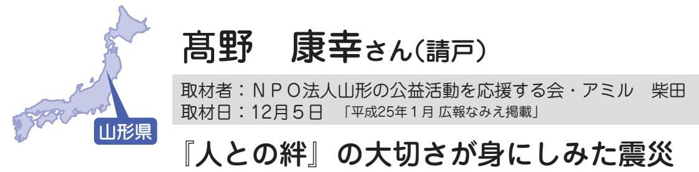

d野さんご家族は、地震後、町役場、津島、二本松市などの避難所を点々とした後、娘さんたちが小さいころから家族で毎年のように訪れていたさくらんぼ農家の方を頼り、長女・博美さん家族、次女・瑞希さん家族と一緒に山形県中山町に避難しました。昨年9月から町内の借り上げ住宅に家族3人で暮らしています。

地震が起きたのは、早朝の漁が終わり家でゆっくりしていたときでした 。 こんなに大きい揺れは初めてでいつ終わるのかと思うほど長く、 2 回目の揺れでは隣の家屋が目の前で一気に倒れ、とても大きな地震だと感じました 。 すぐに支度し船の様子を見に行くと、いつもあるはずの船が港に一艘も見えず、岸壁に行くと、すべての船が港の海底についている状態でした 。 こんなに水が引いているのは異常だと思いすぐに家に引き返し、妻と母を乗せ家から逃げました 。 私たちが逃げた後、娘が心配し請戸に見に行きましたが、玄関で警察の方から津波が来るからすぐに逃げろといわれ、家に入らず逃げたそうです 。 助かって本当によかった 。 夕方になり、避難した役場から見た請戸はまるで湖のようになっていて見たときは本当にショックでした 。 孫たちは津波が押し寄せるところを小学校で見ていたため、心の傷が大きかったのではと心配です 。 私の船 『 第 1 吉祥丸 』 は昨年海から 1 ㎞ 離れた道路で見つか

りました 。 私は遠洋漁業から請戸漁港に戻り、漁師をやるようになってから 60 年くらいですが、子・孫の代まで原発と関係なく安心して住めるようにと原発に反対し、危険性も理解してきました 。 私は 7 〜 8 ㎞ の海域で魚を獲る漁師だったのでなおさら再開するには相当時間がかかると思っています 。 これまで自信を持って安心して請戸のおいしい鮭やひらめなどの魚を獲り、多くの方に喜んで食べていただいていたのですが残念です 。 山形に避難することを決めたのは、町を出てから 4 日目の朝でした 。 お世話になっていた山形県寒河江市のさくらんぼ農家の方から電話をいただいて、山形県に行くことを決心しました 。 その方は、私たちの安否が心配でさまざまなつながりを調べ連絡してくださったそうです 。 避難所を自分の家のように使わせてもらい、役場の方が朝夕様子を見に必ず寄ってくれたり、畑を貸してくださったり、よくしてくださり勇気づけられました 。 会ったときに涙を流し喜んでくれた方もおり、今回の震災では、

▲ご家族そろって。 左から>野タキ子さん、サダ子さん、康幸さん

本当に絆の大切さが身にしみてわかりました 。 孫たちはこちらの小中学校で元気に通っているので、数年後落ち着いたら、親戚や友人、漁師の仲間が多い浜通りに戻り、顔を見に行ったりお茶のみしたりできることを楽しみに、今、山形での一日一日を大切に暮らしています 。 楽しくて自由だった請戸のような生活が、またみんなとできるようになるまで体を壊さずに暮らしましょう 。

## 森川マツ子さん(加倉)

取材者:NPO法人ちば市民活動・市民事業サポートクラブ鍋嶋取材日:12月3日 「平成25年1月広報なみえ掲載」

## 浪江町、福島県のつながりを大事にしたい千葉県

ご主人とお義母さんの3人で暮らす森川さんの楽しみは、ベランダでの花や野菜の栽培です。

震災直後、原町 ( 南相馬市 ) の長男の家に避難、数日間いた後、私の実家の飯舘村に避難したのですが、私たちには子ども同然の犬がいるために、一度もふとんに手足を伸ばして、ゆっくり寝ることもできませんでした 。 その上、飯舘村も線量が高いことがわかり、再避難をしなければならなくなりました 。 状況を見かねて、松戸市に住む次男が 「 来たらいいよ 。」 と言ってくれました 。 私たち夫婦は次男の家に、義母は義妹の家に世話になることにしました 。 今の家には、今年の 5 月に越してきました 。 私は、腰痛で震

災の前後に 2 度の手術を受け、リハビリのための通院が必要でした 。 駅から歩いて 5 分、商店街の中にあるマンションで、通院にも買い物にも便利ですが、やっぱり浪江での暮らしが恋しいですね 。 浪江にいたころは、私も夫も会社勤めをしていました 。 仕事の傍ら、夫は狩猟やキノコ採りを楽しみ、私は、野菜や花づくりを楽しむ日 々 でした 。 今も、マンションのベランダで、鉢植えの花を育てています 。 花芽がつくとうれしいですね 。 浪江に住んでいたころは、友だちにあげ、喜ばれていましたが、こちらに越してきてから気軽にあげる友だちもいないので、少し寂しい思いもしています 。 浪江にいるときには、自分の身の周りのことは一人でできた義母ですが、数カ月間の避難生活の中で、体調を崩し、ほとんど寝たきりの状態になってしまいました 。 アルツハイマーの診断を受け今年 8 月に入院し 11 月に退院、今は私たちと一緒に暮らしています 。 入院している間に病状は改善、週に 3 日デイサービスに通っています 。 編み物が好きで、デイサービスに行くときにも、毛糸と編み棒を持って

行きます 。 夫は、 60 歳を過ぎた今も、震災前の仕事の経験を活かして近くの病院で働いていますが、仕事から帰ると、義母の話し相手をしてくれ、ほんとうに助かっています 。 震災後に 6 回、浪江に一時帰宅しました 。 6 回目の帰宅のときには、自宅の周辺は草ぼうぼう、木 々 が道路をふさいでいました 。 帰りたい思いは強いですが、荒れ果てた家を見ると、帰れる日が来るのだろうかと不安になります 。 そんなときには、浪江の友だちと励まし合います 。 いわき市に避難している友だちは、泊りがけで遊びに来たりもしてくれます 。 本音で話ができるのは、やっぱり浪江の友だちです 。 11 月下旬には、被災者支援を行っている松戸市の団体主催の 「 松戸の史跡めぐり 」 に参加しました 。 義母がいるので、遠出はできませんが、被災者を対象にした催し物には、できるだけ出かけるようにしています 。 米やお酒や果物など、福島県産の物を取り寄せることもしています 。 浪江町、福島県のつながりをこれからも大事にしていきたいと思っています 。

神内さんは、現在ひとり住まい。息子さんが南相馬と埼玉を行き来しています。 岡田さんは、娘の有加さん、孫の珠奈さんと

の3人暮らしです。

■ 神内さん震災の日は、父の命日で午前中は、お墓参りに行きました 。 午後、お嫁さんは孫の元太と優花を連れ 3 人で海の方にドライブに行っていました 。 後でわかったことですが、ドライブの途中、元太がサンプラザのボールプールに行きたいと言い出し、そこで遊んでいたために津波に遭わずに済みました 。 私は、家の中にいましたが、地震に驚き外に飛び出して農業用ため池のガードレールに掴まっていました 。

▲左から神内さんと岡田さん

言葉に子どもながら、いろいろ

と考えているのかと感じること

があります 。

浪江が封鎖される 2 日前に猫

| 浪 江 の 人 た ち の      | し ょ う 、 と き ど き ふ と つ ぶ や く      |
|--------------------------------------|-------------------------------------------------------------------------|
| 住 ん で い る 場 所      | 親 の ス ト レ ス も 影 響 が あ る の で      |
| み よ う と 思 っ て      | 珠 奈 の こ と で す 。 環 境 の 変 化 や      |
| つ ら い で す が 、      | き ま し た 。 今 、 気 が か り な の は 、 |
| 行 き ま す 。 先 の      | あ る 現 在 の 住 ま い に 引 っ 越 し て      |
| 楽 し み で 電 車 に      | り 、 そ の 後 、 孫 の 学 校 の 近 く で      |
| 2 回 で す が 、 み      | 埼 玉 に い る 次 女 の ア パ ー ト に 移      |
| 今 で は と て も 仲      | 潟 に 避 難 し ま し た 。 そ し て 翌 日 、 |
| い ・ つ な が り カ フ | て 、 友 人 の 親 戚 が 住 ん で い る 新      |
| す よ 。 私 た ち も      | 人 家 族 と 一 緒 に 苅 野 、 川 俣 を 経      |
| 集 ま り に も 行 っ      | 私 と 娘 の 有 加 と 孫 の 珠 奈 は 友           |
| け ま し ょ う 。 ど      | ■ 岡 田 さ ん                                                   |
| だ か ら 、 自 分 の      |                                                                         |
| 皆 さ ん 、 こ こ           | 記 念 に 取 っ て あ り ま す 。                     |
| ■ 神 内 さ ん ・ 岡      | の が 残 っ て い ま す が 、 捨 て ず に      |
|                                      | 出 で す 。 ま だ 、 台 紙 に 貼 っ た も      |
| の 家 が 欲 し い で      | み ん な と 行 っ た 旅 行 が 良 い 思 い      |
| と 住 み 続 け る こ      | 「 だ る ま ス タ ン プ 」 を 貯 め て           |
| 願 い は た だ 一 つ      | え が 止 ま り ま せ ん で し た 。                |
| よ う に し て い ま      | ド ラ イ ブ し て い た ら と 思 う と 震      |
| か ら だ に 良 く な      | た で す 。 も し 海 の 方 に そ の ま ま      |
| き ま し た 。 悪 く      | た 姿 を 見 た と き は 本 当 に 嬉 し か っ |
| い る 所 に や っ と      | ん で し た 。 親 子 3 人 が 戻 っ て 来      |
| し か っ た で す 。      | り 込 ん だ ま ま し ば ら く 動 け ま せ      |
| た 猫 を 見 つ け た      | 見 て 家 の 隣 の 空 き 地 に 逃 げ 、 座      |
| を 探 し に 戻 り 、      | そ の う ち 地 面 が 割 れ て き た の を      |

うずくまってい

ときはとても嬉

私は、今住んで

慣れ愛着が出て

悪く考えると、

いので考えない

す 。

、これからずっ

とができる自分

す 。

田さんから

まで頑張ったん

からだに気をつ

んなイベントや

てみるといいで

埼玉の 「 さいが

ェ 」 で出会い、

良しです 。 毎月

んなに会うのが

乗って出かけて

ことを考えると

なんでもやって

います 。

は違いますが、

繋がりが支えで

す 。 皆さん今後ともよろしくお

願いします 。

取材者:地域社会デザイン・ラボ中島取材日:12月10日 「平成25年1月広報なみえ掲載」

#### 被災者なりの意思を持って、子どもたちの未来のためにできることを

仙台市の借り上げ住宅で奥さま、お母さまと3人暮らし。 息子さん一家も近くに移転し、ご自身も仙台市若林区役所で職を得ました。故郷を奪われた悔しさや怒りを乗り越え、「今は前を向いて歩きだしています」。

宮城県

▲借り上げ住宅の庭には、偶然、浪江産の石があったそうです。「これも心の支えになっています」と、横山眞志さん。

に避難しました 。 が、そこも原発から 20 ㎞ 圏内で避難命令が出されたので、家内と母と私の 3 人は飯館村を経由し、次女の嫁ぎ先の仙台に 。 息子夫婦と孫の 4 人は静岡県にある嫁の実家にいったん身を寄せました 。 国から何の情報も知らされず、放射能の危険にさらされて右往左往し、まさに棄民だと思いました 。 とはいえ、仙台市に移ってから嬉しいことも多 々 ありました 。 まず、浪江町を知っているという借り上げ住宅の大家さんから大変親切にしていただいたこと 。 県の委託を受けた職業訓練校でIT基礎クラスを受講でき、すばらしい仲間と出会えたこと 。 またそこでMOS資格を取ることができ、臨時に雇ってくれた若林区役所からは再雇用のお誘いをいただいております 。 ありがたいことです 。 ■ 未来のためにできることを家を訪ねてきた菩提寺の和尚さんから、「 あなたの先祖は加賀の国、今の石川県から修行の名をかりてお坊さんに連れられ、飢饉で疲弊した福島にたどり着いた 。 祖先が苦労して浪江に築いた家を、今度は新たな地に築く運命だったと考えよう 」 と言

い聞かされました 。 浪江に戻りたいですかと聞かれたら、戻りたくないわけがありません 。 しかし一時帰宅した折に放射線量を測ると、場所によっては現在も空間線量が 20 マイクロシーベルト以上あり、しかも家を取り巻く山林は国の除染計画の範囲外です 。 山から引いている水など内部被ばくの危険を考えると、将来的にも帰還は無理と考えざるを得ません 。 ところが行政の区分では、うち周辺は将" 来的に帰還可能な地域 " とみなされています 。 国や県に見捨てられた今、浪江町だけが私たちを守ってくれる最後の砦と信じています 。 またわれわれは被害者であると同時に、加害者として原発の存在を許してきた責任も負っています 。 個人でできることは本当に少ないけれど、原発反対のデモに参加したり署名をしたり、子どもや孫たちの未来のためにできるだけのことはしたい 。 仮設住まいでは内向きになりがちですが、自分から外に一歩踏み出し、被災者なりの意思を示すことも大切ではと思っています 。

浪江町の室原から現在栃木県那須町で避難生活をしている立川正恵さん。震災発生から比較的早い時期に栃木県那須町に避難したそうです。 現在小さな街ではありますが、住宅地の一戸建ての住宅で息子さんと生活しています。明るく謙虚で前向きな感じの女性です。

地震が発生したときは介護の仕事をしていて、楢葉町にある利用者宅訪問のため車の運転をしていました 。 緊急地震速報で車を停車し地震の揺れが収まった後、訪問した家に戻り避難を促したり、安否を確認したりしました 。 その後、楢葉町地域包括センターに行き、避難者の受入れや名簿作りとボランティア活動をして、その日は家族と合流できませんでした 。 翌日は原発事故による避難となり、家族や親友の家族と合流

▲少し頼もしくなった息子さんと以前勤めていた職場のカレンダーと。

| て | 楽 | 学 | し | い | 今 | 今 |   | ん | ろ | た | と      |
|---|---|---|---|---|---|---|---|---|---|---|--------|
| い | し | 3 | て | た | は | の | こ | で | 複 | り | 思      |
| ま | み | 年 | い | た | 震 | 時 | の | す | 雑 | 、 | う      |
| す | に | 生 | け | く | 災 | 点 | 生 | ね | な | 荒 | と      |
| 。 | 生 | に | れ | さ | 発 | で | 活 | 。 | 思 | れ | 、      |
|   | き | な | ば | ん | 生 | は | が |   | い | 果 | 浪      |
|   | て | っ | と | の | か | わ | い |   | が | て | 江      |
|   | い | た | い | 恩 | ら | か | つ |   | よ | た | の      |
|   | き | 息 | う | を | 今 | り | ま |   | ぎ | 家 | こ      |
|   | た | 子 | 思 | 少 | ま | ま | で |   | っ | と | と      |
|   | い | の | い | し | で | せ | 続 |   | て | か | が      |
|   | と | 成 | と | で | い | ん | く |   | し | い | 恋      |
|   | 思 | 長 | 、 | も | た | が | の |   | ま | ろ | し か |
|   | っ | を | 中 | 返 | だ | 、 | か |   | う | い | っ      |
|   |   |   |   |   |   |   |   |   |   |   |        |

浪江町で町民に愛されるお寿司屋さん「寿し松」 を経営されていた松本さんご夫妻。11月、息子さんとともに茨城県つくば市で新店舗「二代目寿し松」を開業されました。

| れ | の | 中 |   | し | 常 | リ | プ | ま  | ら |   |
|---|---|---|---|---|---|---|---|----|---|---|
| が | 注 | 学 | あ | た | 連 | ニ | ン | し  | 浪 | 息 |
| 一 | 文 | 校 | の | 。 | さ | ュ | 。 | た  | 江 | 子 |
| 段 | が | が | 日 |   | ん | ー | 2 | 。  | で | が |
| 落 | 殺 | 卒 | は |   | に | ア | 0 | 97 | 「 | 生 |
| し | 到 | 業 | 、 |   | 来 | ル | 0 | 年  | 寿 | ま |
| て | し | 式 | 近 |   | て | オ | 7 | に  | し | れ |
| 仮 | て | だ | く |   | い | ー | 年 | は  | 松 | た |
| 眠 | い | っ | の |   | た | プ | に | 富  | 」 | 1 |
| を | ま | た | い |   | だ | ン | は | 岡  | を | 9 |
| 取 | し | た | く |   | い | 。 | 浪 | 店  | や | 8 |
| ろ | た | め | つ |   | て | い | 江 | が  | っ | 4 |
| う | 。 | 出 | か |   | い | つ | 店 | オ  | て | 年 |
| と | そ | 前 | の |   | ま | も | の | ー  | い | か |
|   |   |   |   |   |   |   |   |    |   |   |

▲松本さんご夫妻と、息子で二代目の武士さん。07年リニューアルオープンの際に画家の鴻崎さんにいただいた「寿し松」の絵を背に。

 二代目寿司松 ▲

| い た ま だ す け 。 る こ と に 繋 が る と 信 | と お が 客 結 さ 果 ん 的 に に 誠 お 実 客 に さ や ん っ に て 来 い | ニ ュ ア ル 通 り の 接 客 で は な く | そ れ ぞ れ 良 い と こ ろ が あ る | そ れ ぞ れ 違 う 。 個 性 が あ っ | 花 に は 変 わ り な い ん だ け | す も も 」 。 | つ ま り 、「 さ く ら ・ う め ・ も | 「 桜 梅 桃 李 」 っ て い う の | と 思 っ て い ま す 。 | ん の 要 望 に 答 え て い く し か | 「 桜 お う 梅 ば い 桃 と う 李 り 」 の 精 神 で お | す こ と も 可 能 だ と 思 い ま す よ | に よ っ て は こ っ ち で 店 舗 を | あ る か ら 嬉 し い で す よ 。 や | ま す 。 そ れ に 、 新 し い 出 会 | 懐 か し い 方 も 来 店 し て く だ | な り ま し た が 、 繋 が り の あ | 遠 く 離 れ た つ く ば で の 開 | は み ん な 一 緒 だ と 思 い ま す 。 | い は 当 然 あ り ま す し 、 そ の | 帰 れ る な ら 帰 り た い と い | し た も の で す 。 | 何 世 代 も の 家 族 が 集 ま っ て | が 悔 し い で す 。 以 前 は 週 末 | バ ラ バ ラ に な っ て し ま っ た | 近 い と こ ろ に 暮 ら し て い た | た だ 、 震 災 の 前 は 家 族 み |
|------------------------------------------------------------------------------|----------------------------------------------------------------------------------------------------------------------|---------------------------------------------------------------|----------------------------------------------------------|----------------------------------------------------------|-----------------------------------------------------|-----------------------|-----------------------------------------------------------|-----------------------------------------------------|--------------------------------------|----------------------------------------------------------|----------------------------------------------------------------------------------------|---------------------------------------------------------------|----------------------------------------------------------|----------------------------------------------------------|----------------------------------------------------------|----------------------------------------------------------|----------------------------------------------------------|-----------------------------------------------------|---------------------------------------------------------------|----------------------------------------------------------|-----------------------------------------------------|---------------------------------|----------------------------------------------------------|----------------------------------------------------------|----------------------------------------------------------|----------------------------------------------------------|-----------------------------------------------------|
| じ て                                                                       | て く い こ                                                                                                     | て 、                                                        | 。 マ                                                   | て 、                                                   | ど 、                                              |                       | も ・                                                    | は 、                                              |                                      | な い                                                   | 客 さ                                                                                 | 。                                                             | 増 や                                                   | り 方                                                   | い が                                                   | さ い                                                   | っ た                                                   | 店 と                                              |                                                               | 思 い                                                   | う 思                                              |                                 | 過 ご                                                   | に は                                                   | こ と                                                   | の に                                                   | ん な                                              |

千葉での4カ月にわたる避難生活の後に、福島市の借上げ住宅に移られ、ご夫婦とお子さん2人で暮らしていらっしゃいます。

妹さんをはじめ、親戚の方々も近所にいらっしゃるそうで、見知らぬ地域での暮らしにとっては心強いのではと思いました。

■ 千葉では毎日 「 親族会議 」 地震当日は自宅の仏壇が引っくり返るほどの強い揺れでしたが、電気も水も止まりませんでした 。 夜になって、入院中の父の面倒を見ていた姉の様子が気になり駆けつけてみると、家の中は滅茶苦茶 。 帰宅したばかりの姉を連れ、自宅に戻りました 。 請戸や町なかの人たちが次 々 と避難して来られ、新しい集会所に 70 〜 80 人になったでしょうか 。 区長である私は、役場や部落を回って差し入れの米や野菜、卵

▲つらい話題もありましたが、終始和やかにお話しくださいました。(美記子さん、義則さん)

などを運びました 。 請戸小学校の先生方が調理を一手に引き受けてくださり、煮炊きをしました 。 子どもたちを高台に避難させた後に逃げて来られ 「 本当に何にもないんですよ 。」 と言っておられたことを、時折思い出します 。 自力で移動できない部落の方 々 をマイクロバスに乗せた後、私たち家族は二本松へ向かいましたが避難先がわからず、千葉にいる弟を頼ることにしました 。 郡山でスクリーニング検査を受けた後、私たち家族 4 人と姉、親戚を含めた 5 世帯で移動しました 。 千葉の住宅供給公社に 3 部屋貸していただき、電化製品など家財道具一式を手配してくれた弟と搬入作業をしました 。 ここで 4 カ月ほど暮らしましたが、ボランティア活動をしている弟から、毎日の暮らしぶりをみんなで集まって報告し記録すると、引きこもりや孤立防止の手助けになるとアドバイスを受けました 。 しかし、福島県や浪江町など行政の情報が少な過ぎて、福島に戻ることにしました 。 ■ 父を見送れなかったことが口惜しい当時入院中の父は病院ごと避難をしているだろうと任せてい

濱本啓一さん(川添)

取材者:NPO法人くびき野NPOサポートセンター竹内取材日:1月15日 「平成25年2月広報なみえ掲載」

浪江町民の絆をつなげ広げたい新潟県

て

生

期

ち

て

は

集

あ

た

あ

▲浪江町コスモス会の皆さん。 前列左が濱本啓一さん。後列右が奥さんの安子さん。

コ

町

る

び

柏

被

の

濱本啓一さんは現在奥さんとともに新潟県柏崎市の県営住宅で避難生活を送っています。この地で暮らす浪江町民の交流を目的とした「浪江町コスモス会」 を立ち上げ、日々会員同士の親睦を深めています。

■ 右も左も分からない震災発生時私は震災発生時、妻と川添の自宅にいました 。 消防からの避難指示に従い、妻とともに双葉町の避難所へ 。 その後避難区域の拡大のため、避難場所を何度も変えることになりました 。 当時は何も情報がなく、朝起きたら避難所に誰もいなくなっていたことや、家に帰ろうとしたら自衛隊に道をふさがれたことなどがありました 。 何がおこって

2 回の定例会を行っています 。

| 場 と し て お 借 り し て 、 主 に 月 | し た 。 現 在 の 会 員 は 35 名 。     | め に こ の 花 を 会 の 名 前 に 選 | 花 。 故 郷 へ の 思 い を つ な げ | 存 知 の 通 り コ ス モ ス は 浪 江 | モ ス 会 」 を 立 ち 上 げ ま し た 。 | 昨 年 の 3 月 5 日 に 「 浪 江 町 | 、 震 災 か ら 約 1 年 の 節 目 で | と 考 え ま し た 。 そ の 目 的 の | 絆 を 再 確 認 す る 場 が 必 要 で | け な い と 感 じ 、 浪 江 町 民 が | ま う 人 も 。 私 は こ の ま ま で | 内 向 き に な り 家 に 閉 じ こ も っ | す る 避 難 生 活 に 疲 れ 、 気 持 | を 送 っ て い ま す 。 中 に は 長 | 0 0 余 名 の 浪 江 町 民 が 避 難 | 崎 市 に は 私 た ち 夫 婦 を 含 め |
|---------------------------------------------------------------|---------------------------------------------------------------|----------------------------------------------------------|----------------------------------------------------------|----------------------------------------------------------|---------------------------------------------------------------|----------------------------------------------------------|----------------------------------------------------------|----------------------------------------------------------|----------------------------------------------------------|----------------------------------------------------------|----------------------------------------------------------|---------------------------------------------------------------|----------------------------------------------------------|----------------------------------------------------------|----------------------------------------------------------|----------------------------------------------------------|
|                                                               | 崎 市 の N P O 団 体 が 運 営 す る | ま                                                        | た                                                        | の                                                        | ご                                                             | ス                                                        | る                                                        | め                                                        | る                                                        | い                                                        | い                                                        | し                                                             | が                                                        | 化                                                        | 活                                                        | 3                                                        |
| 災 者 サ ポ ー ト セ ン タ ー を 活 動 |                                                               |                                                          |                                                          |                                                          |                                                               |                                                          |                                                          |                                                          |                                                          |                                                          |                                                          |                                                               |                                                          |                                                          |                                                          |                                                          |
| 柏                                                             |                                                               |                                                          |                                                          |                                                          |                                                               |                                                          |                                                          |                                                          |                                                          |                                                          |                                                          |                                                               |                                                          |                                                          |                                                          |                                                          |

| て ほ し い と 思 い ま す 。 | ど 整 も え た て ち ほ の し た い め 。 、 そ 浪 し 江 て 町 将 は 来 動 の | た ち が 安 心 し て 暮 ら せ る 環 境 | の 道 は 見 え ま せ ん 。 行 政 に は | 故 が 収 束 し な い 限 り は 、 帰 町 | し い こ と だ と 思 い ま す 。 原 発 | 町 の 状 況 を 考 え る と 、 実 際 は | は じ め は そ う 考 え て い ま し た が 、 | い 出 の あ る 浪 江 町 に は 帰 り た い 。 | も 友 人 や 家 族 と だ か ら で す 。 思 | 行 事 や 四 季 を 楽 し む の は 、 い つ | さ れ る の は 友 人 と 過 ご し た 日 々 。 | ま ざ ま で す が 、 何 よ り も 思 い 出 | 風 景 な ど 、 浪 江 町 の 思 い 出 は さ | 町 通 り で の 十 日 市 、 四 季 折 々 の | 請 戸 川 に 上 が る 花 火 と 桜 、 新 | か ら | ■ 浪 江 町 の 思 い 出 、 そ し て こ | す 。 | 行 を 実 現 さ せ た い と 考 え て い | を 実 施 。 本 年 度 は 福 島 県 へ の | 花 見 な ど 、 新 潟 県 各 所 へ の 旅 | ダ ム の 見 学 や 上 越 市 高 田 公 園 | 感 じ ま す 。 そ の 他 、 柏 崎 市 谷 | 人 と 人 と の 絆 の 大 切 さ を 改 め | て も 盛 り 上 が る 様 子 を 見 る と | 各 々 が ワ イ ワ イ と し ゃ べ り 、 |
|------------------------------------------------|--------------------------------------------------------------------------------------------------------------------------------|---------------------------------------------------------------|---------------------------------------------------------------|---------------------------------------------------------------|---------------------------------------------------------------|---------------------------------------------------------------|-------------------------------------------------------------------------|-------------------------------------------------------------------------|--------------------------------------------------------------------|--------------------------------------------------------------------|-------------------------------------------------------------------------|--------------------------------------------------------------------|--------------------------------------------------------------------|--------------------------------------------------------------------|---------------------------------------------------------------|--------|---------------------------------------------------------------|--------|---------------------------------------------------------------|---------------------------------------------------------------|---------------------------------------------------------------|---------------------------------------------------------------|---------------------------------------------------------------|---------------------------------------------------------------|---------------------------------------------------------------|---------------------------------------------------------------|
|------------------------------------------------|--------------------------------------------------------------------------------------------------------------------------------|---------------------------------------------------------------|---------------------------------------------------------------|---------------------------------------------------------------|---------------------------------------------------------------|---------------------------------------------------------------|-------------------------------------------------------------------------|-------------------------------------------------------------------------|--------------------------------------------------------------------|--------------------------------------------------------------------|-------------------------------------------------------------------------|--------------------------------------------------------------------|--------------------------------------------------------------------|--------------------------------------------------------------------|---------------------------------------------------------------|--------|---------------------------------------------------------------|--------|---------------------------------------------------------------|---------------------------------------------------------------|---------------------------------------------------------------|---------------------------------------------------------------|---------------------------------------------------------------|---------------------------------------------------------------|---------------------------------------------------------------|---------------------------------------------------------------|

和弘さん夫婦、義父の藤村宣明さん、娘の春美さん、愛犬「ゆず」は、千葉県佐倉市で、新たな人とのつながりを大切に暮らしていらっしゃいます。

▲左から吉田真由美さん(春美さんの友人)、娘の春美さん、義父の藤村宣明さん、玲子さん、孫の和太郎くん、和弘さん、愛犬のゆずちゃん

【 玲子さん 】 大熊で料理教室を終え帰ろうとしたそのとき、大地震 ! 普段なら車で 20 分ほどの所が、道路の亀裂を避けながら 2 時間かかってようやく自宅にたどり着きました 。 その日は、父と愛犬のゆずと一緒に、経営していた川添上ノ原の店 「 なみえスーパー 」 の事務所で一晩過ごしました 。 主人は地震当日、川崎に出張中でしたが、錯乱の中、公衆電話で安否を確認できました 。 翌 12 日早朝、避難命令を聞き、

| 味 噌 作 り や 梅 漬 け な ど を 教 え て | で き ま し た 。 料 理 教 室 も 再 開 し 、 | て 多 く の 方 た ち と 出 会 う こ と が | ン グ ク ラ ブ 」 や パ ン 教 室 を 通 じ | 私 は 、 地 域 の 公 民 館 の 「 ソ ー イ | 引 き 払 い 一 緒 に 暮 ら し て い ま す 。 | 渋 谷 に 住 ん で い た 娘 も 、 そ こ を | り る こ と に な り ま し た 。 東 京 の | 介 で 、 現 在 の 佐 倉 市 の 住 宅 を 借 | 新 潟 に 行 き 、 私 た ち は 知 人 の 紹 | そ の 後 、 主 人 の 父 と 姉 家 族 は | ら れ ま せ ん 。                | ご し た と き の こ と は 今 で も 忘 れ | は 手 作 り し 、 協 力 し て 10 日 間 過 | れ ぞ れ 不 安 を 抱 き な が ら も 料 理 | 10 人 の 別 荘 で の 共 同 生 活 。 皆 そ | と き に は 、 と て も 感 動 し ま し た 。 | 別 荘 で 主 人 、 息 子 、 娘 に 会 え た | の 知 人 の 別 荘 に 移 動 し ま し た 。 | な っ た 後 、 千 葉 県 君 津 市 の 叔 父 | 出 し を い た だ き 4 日 間 お 世 話 に | 時 で し た 。 地 元 の 皆 さ ん の 炊 き | え ら れ 、 た ど り 着 い た の は 夜 10 | 子 に 西 白 河 郡 矢 吹 町 体 育 館 を 教 | ル で 連 絡 を 取 り 合 い ま し た 。 息 | や 避 難 所 情 報 を 調 べ て く れ 、 メ ー | が イ ン タ ー ネ ッ ト で 「 原 発 事 故 」 | 走 行 し ま し た 。 千 葉 に い る 息 子 | 過 し 、 ガ ソ リ ン が な く な る ま で | い の 人 が 避 難 し て い る 津 島 を 通 | 猫 1 匹 で 避 難 し ま し た 。 お お ぜ | の み 着 の ま ま 総 勢 10 名 と 犬 1 匹 、 | 主 人 の 父 と 姉 家 族 が 集 ま り 、 着 |
|--------------------------------------------------------------------|-------------------------------------------------------------------------|--------------------------------------------------------------------|--------------------------------------------------------------------|--------------------------------------------------------------------|-------------------------------------------------------------------------|--------------------------------------------------------------------|--------------------------------------------------------------------|--------------------------------------------------------------------|--------------------------------------------------------------------|---------------------------------------------------------------|-------------------------------------------|--------------------------------------------------------------------|---------------------------------------------------------------------|--------------------------------------------------------------------|---------------------------------------------------------------------|-------------------------------------------------------------------------|--------------------------------------------------------------------|--------------------------------------------------------------------|--------------------------------------------------------------------|--------------------------------------------------------------------|--------------------------------------------------------------------|---------------------------------------------------------------------|--------------------------------------------------------------------|--------------------------------------------------------------------|-------------------------------------------------------------------------|-------------------------------------------------------------------------|--------------------------------------------------------------------|--------------------------------------------------------------------|--------------------------------------------------------------------|--------------------------------------------------------------------|--------------------------------------------------------------------------|--------------------------------------------------------------------|
| て い き た い と 思 い ま                          | 人 と の 出 会 い と 絆 を                               | こ れ か ら も ど ん ど                               | れ て き ま し た 。                                    | 人 か ら も 多 く の 支 援                          | き ま し た 。 息 子 や 娘                               | く の 友 人 、 知 人 に 助                          | も の も た く さ ん あ り                          | れ ば と 思 い ま す 。 震                          | な 生 活 を 自 分 た ち で                          | 方 が あ り ま せ ん 。 健                     | 見 え な い 話 ば か り し | り を 覚 え ま す 。 し か                          | 東 電 や 国 の 対 処 の                                | 【 玲 子 さ ん 】                                         | ら 頑 張 っ て い ま す 。                           | 日 で す が 、 身 体 に 気                               | 福 島 を 訪 れ る と い っ                          | ゴ ル フ 、 親 姉 妹 に 会                          | 鮮 で す 。 仕 事 き ょ う 、 だ い 福 島 | は 大 違 い で す が 、 外                          | 事 を 始 め ま し た 。 以                          | 雇 用 制 度 で 採 用 さ れ                           | 一 昨 年 9 月 か ら 、 千                          | り ま し た 。 佐 倉 市 に                          | の 後 の 震 災 と 大 変 な                               | 店 し 、 間 も な く 母 を                               | 平 成 22 年 12 月 に ス                             | 【 和 弘 さ ん 】                                         | の 方 た ち と お 会 い し                          | 料 理 イ ベ ン ト を 通 じ                          | 南 相 馬 、 会 津 、 い わ                                | い ま す 。 ま た 、 毎 月                          |

じて相双地区しています 。 スーパーを閉を亡くし、そなことが重なに移り住み、千葉県の緊急れ、造園の仕以前の仕事と外の仕事は新島の仲間との会いに月数回った忙しい毎気をつけなが 。 の遅さには怒かし、結果のしていても仕健康で心豊かで作っていけ震災で失ったりますが、多助けていただ娘の海外の友援物資が送らどん行動し、を大切に築います 。

数回、郡山、

きを訪れ、

取材者:NPO法人ちば市民活動・市民事業サポートクラブ鍋嶋取材日:1月9日 「平成25年2月広報なみえ掲載」

不安も感謝の気持ちも、喜びもごちゃまぜの日々でした

いくつかの避難所を経て、松戸の娘さんの近くで暮らす青田さん。日々の暮らしの中での思いをノートに綴っています。

千葉県

私は、浪江町役場の近くで夫と二人で暮らしていました 。 震災 2 週間前に夫が他界しましたので、前日に二七日を終えたばかりでした 。 震災の日には、下水道の名義変更手続きで役場に行っていました 。 あわてて自宅に帰ったとき、私を心配して駆けつけてくれた夫の弟夫婦に、 「 津波が来るので早く車に乗るように 」 と言われて、取る物もとらず 「 いこいの村 」 へ避難しました 。 今、思えば、それが一時立ち入りまで帰ることができない、夫の遺骨を残したままの我が家となりました 。 翌日、役場からの避難指示をふたなぬか

受け、親戚一同が車 3 台で 「 やすらぎ荘 」 へ 。 そこからが移動の日 々 でした 。「 津島 」「 川俣南小学校 」「 パルセ飯坂 」 と 。「 尋常ではない車の渋滞 」「 飲まなければならない薬がないことへの不安 」「 なぜ避難するのかわからないままの避難 」「 寒さで眠れないつらさ 」「 雪の中での仮設トイレの寒さ 」 は 80 歳の身体には堪えました 。 そうした様子が新潟の親戚に伝わり、わざわざ避難所まで迎えに来てくれました 。 新潟で一息つき、お風呂屋さんに行ったら、「 被ばく検査を受けてから来て欲しい 」 と言われました 。 規則ですから仕方のないことですが、風呂上がりにずっと着ている下着に手を通したとき、情けない思いで一杯になりました 。 親戚の配慮で、部屋を借り、家具の用意を進めていたとき、柏の私の姪から 「 私の家に来てください 」 との連絡があり、 3 月 18 日に、松戸に住んでいる娘夫婦が、その当時には運行を再開していた上越新幹線で、迎えに来てくれました 。 娘夫婦は共働

> きのため昼間ずっと一人ではとの配慮で、姪の家に一カ月間世話になりました 。 その間、震災の疲れでしょうか 。 体調がすぐれず、医者通いをしました 。 一月後、松戸に住む娘夫婦の家の近くに、娘の夫がアパートを借りてくれました 。 年寄りの一人暮らしですが、娘が買い物や身の回りの世話をしてくれるので、体調もよくなり、不自由なく暮らしています 。 浪江は、山、川、海があり、自然が豊かなところです 。 人情味が厚く、近所、親戚とも穏やかに暮らしていました 。 震災からまもなく 2 年 。 不安も感謝の気持ちも喜びもごちゃまぜの日 々 でした 。 日が経つにつれて望郷の念が強くなっていますが、今の暮らしを大事に前を向いて進んでいけたらと思います 。

#### 「ありがとう高畠」みんなで集まれる場所がある

ソフトボールチーム「浪江大吉SSB」が今年も山形県東置賜郡高畠町で行われた高畠町総合体育大会ソフトボール大会に出場しました。今年は昨年よりも多くのメンバーが集まり、仲間とプレーできることの幸せをかみしめながら大会に臨んだそうです。

メンバーである佐々木健一さんにお話を伺いました。 ※「浪江大吉SSB」は、浪江町のチーム「SSB」と「パイ山社中」との合同チームです。

私は震災後、家族 4 人で津中学校、那須塩原と避難し、月はじめに東京都の現在の住に落ち着きました 。 長女の小校入学を控え、落ち着く場所探すのに必死でした 。 浪江町でSSBを結成したが 10 年ぐらい前 。 当時のメンバは同級生がほとんどでしたが年月を重ね、若い人たちがメンバに加わるようになり、震災前は町の大会でも上位に入れるうなチームに成長していました昨年の大会には日程が合わに参加できなかったのですが声をかけてもらったときには 「 いつら、やるな ! 」 と思いまたね 。 絆の深さを感じました今年の大会には、参加するこ

▲現在は仕事のため単身で福島市にいる佐々木さん。 家族の皆さんと一緒に。 長女の花恋ちゃんは、請戸の田植踊りの踊り子さん。 伝統を受け継いでいくために日々がんばっています。 後列左から健一さん、美智子さん。前列左から玲音くん、花恋ちゃん。 かれんれのん

島

4

宅

学

を

の

ー

、

ー

に

よ

。

ず

、

こ

し

。

と

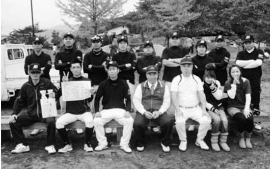

強いつながりで、まずは1勝!

浪江町で活動していた綱引きチーム「マリンエンジェルス」と「スーパーフレンズ」。

震災後、メンバーはばらばらになりましたが、平成23年10月に練習を再開しました。今は南相馬市の体育館で練習を続けています。

メンバーの強いつながりを感じながら、まずは全国大会1勝を目指し、力を合わせてがんばっています。

■ 監督竹村弥生さん ( 北幾世橋 ) マリンエンジェルスが結成れてから何度も全国大会に出していましたが、平成 22 年度大会ではじめて 3 位に入賞しした 。 震災の日に町長に報告して、休まずに練習を始めるもりでした 。 震災後、メンバーはばらばになりましたが、その年の 10 に大会に向けて練習を再開 。 災で日常がなくなり、綱引きみんなの心のよりどころなりした 。 みんなに会いたくて集まている、強いつながりがあるです 。 現在のメンバーは全部

―浪江町の皆さんへ― 私たちもがんばっています。 何か自分の趣味をみつけて、一歩でも外に出てみませんか。 綱引きに興味のある方、お待ちしています。

▲マリンエンジェルスとスーパーフレンズの皆さん。 「男女一緒に早く浪江の体育館で練習したい!」

さ

場

の

ま

を

つ

ら

月

震

が

ま

っ

ん

で

#### 岡田有一さん・貞子さん(大堀) ていこ

取材者:NPO法人山形の公益活動を応援する会・アミル柴田取材日:2月8日 「平成25年3月広報なみえ掲載」

#### 仲間と一緒に飲みながらまた浪江の未来や夢を語りたい

岡田さんご夫妻は、現在山形市の借り上げ住宅で生活しています。震災から数カ月間、場所を移動することばかりで先が見えない状態でしたが、今は娘さんご家族、息子さんも近くに住んでおり、山形でやっとほっとして暮らしているそうです。

■ 有一さんのお話震災時、出張で東京の高層ビルの中におり、ビル同士がぶつかるかと思うほどの揺れを経験しました 。 家族と連絡がとれず、逃げた場所、放射能の風向きが不安でしたが、車を乗り継いでやっと福島県に戻り、原町で家族と無事会うことができました 。 その後、国見の友人宅に家族 10 何人で身を寄せました 。 その方は、ガゾリンを持って迎えにまできてくれ本当にありがたかったです 。 私たちは一昨年 7 月から山形に暮らしており、今では

▲左から貞子さんと有一さん。借り上げ住宅で。 お孫さんが遊びに来ると、座布団を滑り台にしたり、押し入れのものを全部出したりと、とてもにぎやかになるそうです。

| し お を 津 ま ■ い な ら 出 島 せ 地 貞 た 子 い け ず ま に ん 震 さ で れ 、 し 避 で に ん す よ ば 私 た 難 し の ね と た 。 す た る お 。 い ち 夫 る が 自 話 う だ と ら 、 宅 思 け 息 し 娘 の い で 子 い か 損 で な が と ら 傷 し ん 出 聞 み は た と 張 き ん あ 。 か で 家 な り | 夢 間 れ す 当 ま て と や ま が の す お わ 未 せ 、 友 。 り い 来 ん や だ 切 、 わ に 。 は ち 磋 今 い つ ま り で 琢 も お い た 顔 す 磨 毎 酒 て バ を 。 し 月 を 本 カ 見 け 合 行 飲 気 に な ん っ き み で な い か て 来 な 語 れ で も き し が り る い し た て ら 合 、 仲 ら ま 本 い | だ が つ う 地" 目 て 近 け 継 帰 標 地 い 所 " 域 と 域 ま で ぐ れ が の の な に す は か る あ 方 た 対 る 。 な わ か れ と め し と ん か わ ば も て に 思 と ら か い 気 夢 な う も な ら く 兼 や ん の な い な つ ね 希 と で ら 状 い に な 望 か す な 態 、 な く を 頑 が く で 若 っ 話 持 、 張 な 、 い て を ち っ 絆 人 い ろ も 、 し |
|--------------------------------------------------------------------------------------------------------------------------------------------------------------------------------------------------------------------------------------------------------------------------------------------------------------------------------------------------------------------------------------------------------------------------------------------------------------------------------------------------------|-------------------------------------------------------------------------------------------------------------------------------------------------------------------------------------------------------------------------------------------------------------------------------------------------------------------------------------------------------------------------------------------------------------------------------------------------------------------------------------------------------------|---------------------------------------------------------------------------------------------------------------------------------------------------------------------------------------------------------------------------------------------------------------------------------------------------------------------------------------------------------------------------------------------------------------------------------------------------------------------------------------------------------------------------------------------------------------------------------------------------|
| る ノ ー ト を 40 年 以 上 交 換 し 合 っ                                                                                                                                                                                                                                                                                                                                                                                                                                    |                                                                                                                                                                                                                                                                                                                                                                                                                                                                                                             |                                                                                                                                                                                                                                                                                                                                                                                                                                                                                                                                                                                                   |

| て | と      | 「 | と | そ | や  | て | の | 堀  | 方 | い | し | ね | 忙 | で | で | 会 | 私 | え      | 景 |   | に | う | 近 | 山      | 今 | ら      | 得 | に | 避  | れ | も | 祖 |
|---|--------|---|---|---|----|---|---|----|---|---|---|---|---|---|---|---|---|--------|---|---|---|---|---|--------|---|--------|---|---|----|---|---|---|
| い | い      | 大 | き | れ | っ  | し | ま | 地  | が | う | ま | 。 | し | 話 | 、 | 合 | た | 絵      | を | 浪 | な | 遊 | く | 形      | 家 | い      | ま | 避 | 難  | な | い | 父 |
| ま | う      | 堀 | 皆 | ぞ | て  | ま | ま | 区  | 多 | 状 | っ | 突 | か | し | み | な | ち | に      | 思 | 江 | り | び | に | と      | 族 | い      | せ | 難 | し  | い | た | 母 |
| す | こ      | の | さ | れ | い  | う | だ | の  | い | 況 | た | 然 | っ | 合 | ん | ど | の | 描      | い | の | 救 | に | 住 | 離      | は | か      | ん | 命 | ま  | と | の | 、 |
| 。 | と      | 婦 | ん | が | こ  | 。 | っ | 婦  | と | な | こ | や | た | い | な | 集 | 住 | い      | 出 | 自 | わ | 来 | む | れ      | そ | わ      | で | 令 | し  | 思 | で | そ |
|   | を      | 人 | に | 小 | う  | 一 | た | 人  | 思 | の | と | る | け | 暮 | が | ま | む | た      | し | 宅 | れ | て | 孫 | て      | れ | か      | し | が | た  | い | 避 | れ |
|   | 伝      | 会 | 渡 | 物 |    | 人 | ら | 会  | い | で | が | こ | ど | ら | 地 | る | 大 | よ      | ま | 縁 | て | 家 | た | 暮      | ぞ | ら      | た | あ | が  | 、 | 難 | に |
|   | え ら | 元 | す | を | 。」 | で | ば | で  | ま | 精 | 辛 | と | 楽 | し | 域 | こ | 堀 | う な | す | 側 | い | の | ち | ら し | れ | な か | 。 | り | 、  | 原 | 所 | 娘 |
|   | れ      | 気 | つ | 製 | と  | い | ら | 集  | す | 神 | い | が | し | て | の | と | 地 | 風      | 。 | か | ま | 中 | が | て      | 福 | っ      | も | 移 | す  | 町 | に | と |
|   | た      | で | も | 作 | 話  | る | ば | ま  | 。 | 的 | で | な | か | い | た | が | 区 | 景      | 大 | ら | す | が | し | い      | 島 | た      | う | 動 | ぐ  | の | 長 | そ |
|   | ら      | す | り | し | に  | 間 | ら | り  | こ | に | す | く | っ | ま | め | 多 | は | で      | 高 | 見 | 。 | に | ょ | ま      | 、 | で      | ど | せ | 20 | 娘 | く | の |
|   | と      | よ | で | 会 | な  | も | に |    | の | 苦 | 。 | な | た | し | に | い | 行 | し      | 倉 | え |   | ぎ | っ | す      | 山 | す      | う | ざ | ㎞  | の | は | 子 |
|   | 思      | ! | す | 合 | り  | 何 | な | 、「 | 間 | し | そ | っ | で | た | 本 | 地 | 事 | た      | が | る |   | や | ち | が      | 梨 | ね      | し | る | 圏  | 家 | い | ど |
|   | っ      | 」 | 。 | の | 、  | か | っ | こ  | 大 | い | う | て | す | 。 | 気 | 区 | や | 。      | 見 | 風 |   | か | ゅ | 、      | 、 | 。      | た | を | 内  | に | ら | も |
|   |        |   |   |   |    |   |   |    |   |   |   |   |   |   |   |   |   |        |   |   |   |   |   |        |   |        |   |   |    |   |   |   |

取材者:きょうとNPOセンター田口取材日:2月11日 「平成25年3月広報なみえ掲載」

#### 京都府諦めきれない思いを胸に抱いて・・・

佐々木さんご夫婦は、息子の和幸さんが大学生活を送られている京都に、娘の美紗さんと一緒に避難されています。父の幸夫さんは、少しでも浪江に近い所に居たいということで、いわき市のアパートに住んでいます。この春、美紗さんが高校卒業と大学入学を迎えるのを期に、三千夫さんの仕事に合わせて、郡山市での生活をスタートされます。

| も 落 ち 着 き ま し た 。                          | に な っ た よ う で す 。                     | 合 え る よ う に な っ た こ と が 救 | と の 再 開 に 恵 ま れ 、 本 音 で 語 | 人 た ち と の 出 会 い や 同 郷 の 仲 | け れ ど 、 そ の 後 被 災 さ れ て い | し た 。 | か の よ う に 日 々 が 流 れ て い き | 出 来 事 の よ う で 、 何 も な か っ | く 東 日 本 大 震 災 は ま る で 外 国 | で あ っ て も 、 こ ち ら は 地 震 も | む 日 々 が 続 き ま し た 。 同 じ 日 | 目 に 遭 う の だ ろ う か と 、 塞 ぎ | た ち 福 島 の 人 だ け が こ の よ う | 年 は 辛 か っ た よ う で す 。 な ぜ 、 | 特 に 、 家 内 は 京 都 で の 最 初 の | 後 に 京 都 へ 移 り ま し た 。 | た ら と の 思 い で 泣 く 泣 く 福 島 | 配 も あ り 、 家 族 が 近 く に い ら | 処 も た た ず 、 ま た 娘 の 学 校 の | 緒 に や っ て い た お 店 の 再 開 の | し ま し た 。 震 災 当 時 は 、 兄 と | さ せ る た め 郡 山 市 に 移 る 決 断 | 都 か ら 、「 原 田 時 計 店 」 を 再 | 災 の 後 、 2 年 近 く 生 活 を し た | 間 も な く 福 島 県 に 帰 り ま す 。 |
|--------------------------------------------------------------------|---------------------------------------------------------------|---------------------------------------------------------------|---------------------------------------------------------------|---------------------------------------------------------------|---------------------------------------------------------------|-------------|---------------------------------------------------------------|---------------------------------------------------------------|---------------------------------------------------------------|---------------------------------------------------------------|---------------------------------------------------------------|---------------------------------------------------------------|---------------------------------------------------------------|--------------------------------------------------------------------|---------------------------------------------------------------|-----------------------------------------------------|---------------------------------------------------------------|---------------------------------------------------------------|---------------------------------------------------------------|---------------------------------------------------------------|---------------------------------------------------------------|---------------------------------------------------------------|-----------------------------------------------------------|---------------------------------------------------------------|---------------------------------------------------------------|
|                                                                    | 私 も 、 こ ち ら の 職 場 の 方 々 に | い                                                             | り                                                             | 間                                                             | る                                                             |             | ま                                                             | た                                                             | の                                                             | な                                                             | 本                                                             | 込                                                             | な                                                             | 私                                                                  | 1                                                             |                                                     | を                                                             | れ                                                             | 心                                                             | 目                                                             | 一                                                             | を                                                             | 開                                                         | 京                                                             | 震                                                             |
| 良 く し て い た だ き 気 持 ち が と て |                                                               |                                                               |                                                               |                                                               |                                                               |             |                                                               |                                                               |                                                               |                                                               |                                                               |                                                               |                                                               |                                                                    |                                                               |                                                     |                                                               |                                                               |                                                               |                                                               |                                                               |                                                               |                                                           |                                                               |                                                               |

何より、娘がこの多感な時期に、友だちとの別れもできずに原町高校から一人こちらの高校に転校しながらも、慣れない土地で一生懸命高校生活を送る姿に私たちは支えられました 。 生まれ育った浪江で、人生を終えていく 。 それがあたりまえのことだと思っていました 。 浪江を離れてみて感じたことは、気候は良いし食べ物も美味しい、そんな浪江で普通に暮らしていたこと 。 人と人とのつながりの中であたりまえのように暮らしていたこと 。 それが一番ありがたいことだったんだということです 。 浪江は私たちのいるべきところ 。 浪江に代わる場所はどこにもありません 。 かと言って、元の浪江に戻ることは難しいことだと思っています 。 けれどやっぱり諦めきれません 。 この先、心の底から笑える日が来るのだろうかと、つくづく思います 。 そんな気持ちを抱えながら、郡山市での生活は、離れていわき市に住んでいる父と私たち夫

> 婦の 3 人で、一からのスタートです 。 懐かしい人との再会や新しい出会いを楽しみに、その人たちとのつながりの中で、私たちの普通の暮らしを築いていきたいと思います 。

▲左から、三千夫さん、由美子さん

#### 取材者:浪江町役場鴫原・小峰取材日:2月6日 「平成25年3月広報なみえ掲載」 監督佐藤博文さん(苅宿) 苅野陸上クラブ・浪江町陸上クラブ

#### 一緒にふくしま駅伝を走りませんか

二本松で奥さまと避難生活をされている佐藤さんは、苅野陸上クラブで20年近く指導をなさっていて、ふくしま駅伝では浪江町の監督を務められています。浪江町のチームとして、今後も入賞をめざし継続して参加していきたいと話されます。

震災当日、余震による被害を心配して、家族 8 人でハウスに避難していたところ、自衛隊が原発に向かっていることをラジオで知り、原発が危ないと判断して、夜中の内に姉夫婦が住む原町経由で本宮の親戚宅に行きました 。 翌日、水蒸気爆発のニュースを聞き、親戚も一緒に 20 人程でいとこを頼って東京まで避難しました 。 それから、 2 週間ほどお世話になりましたが、仕事

▲浪江町駅伝チームの皆さん。 一緒に走りたい方の連絡お待ちしています。

連絡先浪江町教育委員会生涯学習係 0243-62-0304 ◇浪江町陸上クラブhttp://kaririku.web.fc2.com/ekiden.html ◇苅野陸上クラブhttp://kaririku.web.fc2.com/

心となって立ち上げ、以前駅伝を走った子どもの親御さんがバックアップしてくれました 。 大変心強く、つながっていることを感じました 。 2 年連続で入賞していましたが、一昨年は参加できるだけで喜びでした 。 昨年は惜しくも入賞を逃しましたが、今年は入賞という目標を持って臨んでいきたいと思います 。 浪" 江町陸上クラブ "を春休み立ち上げ目標に動いています 。 中学生以上を対象に週 1 回土曜日に活動予定です 。 トラックを使える練習場所も確保したいと思っています 。 ホームページも作成しました 。 ふくしま駅伝を一緒に走りたい子は、ぜひ、連絡ください 。 16 名のメンバーをそろえて私たちの浪" 江町 "チームとして走りましょう 。

取材者:茨城NPOセンター・コモンズ小原取材日:2月12日 「平成25年3月広報なみえ掲載」

#### 根は茨城で、心は福島で

茨城県

▲とても気に入っている今のご自宅をバックに

60歳で退職してから浪江町で果樹園を営んでいた飛田實さん。今は妻ヱチ子さんと茨城県城里町で静かに暮らしています。

■ 思い出深い果樹園でのこと経営していた建設関係の会社を 60 歳のときに後継者に譲って、それから十数年、りんごや梨、桃の果樹栽培をしていました 。 農業高校の出身なので、ずっとやってみたいと思っていたんです 。 最初は商売でやる気はなくて、出荷もしていませんでした 。 たくさん実がなるようになってくると、保育所や高校の子どもたちがりんご狩りや摘果作業で来てくれて、浪江の広報でも取り上げられました 。 先生の 「 写真を撮るから 」 という制止も聞きやしないで、小さな子どもたちがりんご 1 つを丸かじりでペロ

んです 。 名古屋は福島とはずいぶん環境が違ったし、都会だったので田舎育ちには合わなかったけど、地元の人たちに本当に良くしてもらいました 。 向こうの支援団体が心配して手を差し伸べてくれたのが嬉しかった 。 交流会も企画してくれて地元の人が手作りでいろんなものを作ってくれた 。 子どもも、心配して電話してくれたり、親のことを考えていないようで考えてるんですね 。 避難の中で、人の温かみを感じています 。 失ったものも多いけど、そればかりじゃないなって 。 ■ 根は茨城、心は福島再処理工場や使用済み核燃料の行方が決まらない 。 そして、福島原発事故だって完全に収束したとは言い切れない中で、やはり原発は再稼働させないでほしいと思います 。 原発の事故で私たちも避難生活をしているわけですから 。 当然帰れるなら帰りたいという思いがあって、よく元の家の写真を眺めていますが、今の家もとても気に入っています 。 庭が広いので手入れしていくのが楽しみですよ 。 65 年も浪江にいたから、やっぱり忘れられないし、ふるさとの人に会いたいけどね 。 根は茨城で、心は福島でやっていこうと思っています 。

## 田村とし子さん(小野田)

取材者:とちぎボランティアネットワーク徳山取材日:2月8日 「平成25年3月広報なみえ掲載」

#### 私の心に咲いた希望という一輪のひまわり

小野田から栃木県日光市の借上げ住宅に避難している田村とし子さん。

とても明るく元気な女性というのが第一印象です。

長男が住んでいる日光市に腰をすえて、ご主人とご主人のお母さんの3人で暮らしています。

地震直後、私はその年の前年度まで小野田地区の民生委員をしていましたので、新任の民生委員の方と一人暮らしのお年寄りの安否確認をしました 。 そのときに見た光景は、土砂崩れで道が寸断されていたり、地割れでできた段差に大型トラックが今にも横転しそうな状態で止まっていたり、お寺の燈籠や鳥居も倒壊していて、この地震の凄まじさを目のあたりにしました 。 幸いにも訪問先の人たちの安

▲私を救った『希望』と一緒に

ていました 。 その七宝焼の絵を見たとき、胸が熱くなり涙があふれてきました 。 私はここで何をしているのだろう、みんな前に進んでいるのに、私にもたくさんやれることがあるのにと 。 そして、浪江の人たちやここでお世話になっている日光市の人たちにも以前のように七宝焼を教えてみたいと思うようになりました 。 そんな気持ちが強くなっていたとき、二本松の仮設住宅に避難している友人からまた以前のように教えてほしいと声をかけられ、二本松の仮設住宅に行きアクセサリー作りの講習をしました 。 皆さんとても上手に仕上がり笑顔と喜びを見ることができ、また自分への自信にもつながりました 。 今では日光市の公民館から七宝焼の講師の依頼を受け、来年度から月 2 回のペースで始める予定です 。 恩返しのつもりで私にできる限り教えて行きたいと思っています 。 そして、たくさんの友に恵まれ楽しく前向きに生きて行こうと思います 。

長年住み慣れた自分の家がある浪江町に早く帰りたい

> 震災前はご長男夫婦と一緒に住んでいましたが、現在はご夫婦と愛犬のさくらちゃんと福島市の借り上げ住宅にお住まいで、まもなく1年になります。

■ あの日は何がなんだかあの日は自然薯を掘りに近くの山に友だちと出掛けていて、地震に遭いました 。 揺れがおさまると同時に自宅にいる妻が心配で急いで戻りました 。 妻は近所の人たちと近くの公園に避難していました 。 自宅の中は物が散乱し、天井は落ちていました 。 その晩は一緒に住んでいた長男夫婦と 4 人で庭にテントを張り過ごしました 。 次の朝、請戸に住んでいる親戚がやってきて原発のことを初じねんじょ

▲伊達健三さんとサダ子さん、愛犬さくらちゃんと

めて聞かされ、着の身着のまま車一台で避難することになりました 。 朝 8 時ごろだったと思います 。 道路はあちらこちら陥没がひどく、また避難する人たちの車でものすごい渋滞でした 。 途中、加倉のコンビニの付近を走っていたとき、時間は定かではありませんが大きな水蒸気爆発の音を聞きました 。 午後 1 時くらいに津島高校へ着きましたが人がいっぱいで農村広場へ移動し、炊き出しのおにぎりをいただきました 。 そこでは、白い防護服を着た人たちが手に何かを持って土手を歩いているのが見え、こんな所へはいられないと今度は川俣のリオンドールの駐車場で娘と落ち合い、車の中で一晩を過ごしました 。 翌日、東和の元小学校へ避難したものの断水で、役場に誘導され二本松の城山総合体育館へ避難し、 4 日間すごしました 。 その後、親戚の友人を頼って山形へ移り 3 月半ばから 2 カ月程お世話になりました 。 娘家族は茨城に避難していましたが、仕事のため福島に戻る娘の代わりに中学を卒業するまで孫の面倒をみるため夫婦で茨城へ引っ越しをしました 。 孫が卒業して、いわきの高校へ入学が決ったのを機に福島へ戻ってきました 。 ■ 最近は 「 なじょすんだ 」 としか言葉が出てきません浪江は暖かかったなぁ ! 雪は降ってもすぐに溶けてしまうので出歩くのにも支障はなかったなぁ ! 定年を迎え、大好きな山歩きや山菜採り、鮎釣りを楽しもうとしていた矢先でしたから本当に悔しい 。 夜眠れないことも多いですし、寝てもすぐに目が覚めてしまいます 。 心も落ち着きません 。 何度か家に戻りましたが、背より高くなった草をかき分けないと家までたどり着けません 。 リフォームしたばかりの我が家が朽ちていくのを見るのは辛いです 。 家の中を片付けようにもやる気がおきません 。 妻はもう戻りたくないと言いますが、私はやっぱり浪江に帰りたい 。 友だちと話をしても 「 なじょすんだ 」 としか言葉がでてきません 。 自分たちではどうにもできません 。 早く収束することを願うばかりです 。