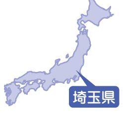
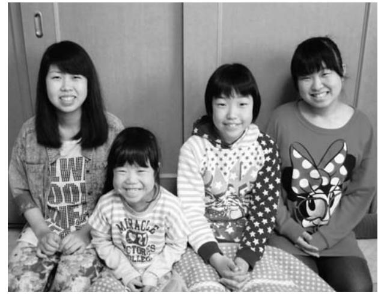
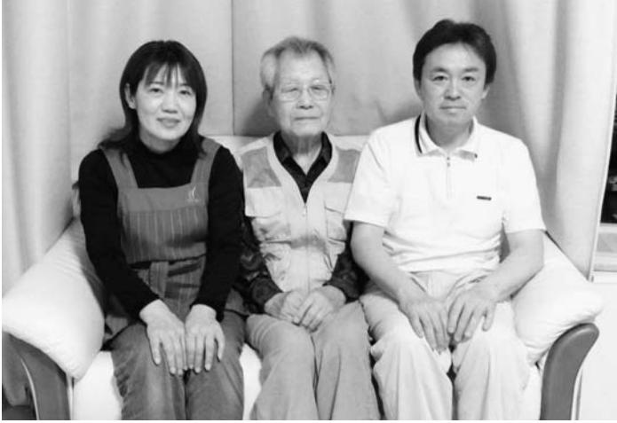

#### この時期の復興に向けた主なうごき

- H25. 4月避難指示区域が見直される
	- 7月復興に向けて新たな検討体制をスタート(町民協働による進行管理部会、まちづくり計画検討部会)
	- 7月町内で営業再開第一号 (㈱叶屋ガソリンスタンド)
	- 8月帰還困難区域のモデル除染が開始
	- 8月平成 25年度浪江町住民意向調査を実施
	- 11月進行管理部会から町への提言
	- 11月本格除染が開始

#### 平成25年4月号~12月号掲載分

役場本庁舎に応急仮設診療所を開設(5月9日) なみえ交流館がオープン(7月6日)

浪江焼麺太国がB-1グランプリin豊川で念願のゴールドグランプリ受賞(11月9~10日)

約130名が参加した郡山市での交流会(7月8日)

取材日:3月3日 「平成25年4月広報なみえ掲載」

### 富沢酒店頑張っています

栃木県

栃木県足利市で避難生活を送られている木幡武子さん。お会いすると実年齢より5歳から6歳は確実に若く見える元気のよい方です。マンションのご自宅をお伺いしたとき、お店でもないのに表札に富沢酒店と書かれていました。現在は息子さんそして商品のお酒と暮らしています。

震災前は浪江町権現堂で富沢酒店を営んでいました 。 現在は息子が 3 代目の店主になっていて、創業した親の代から数えると 90 年の歴史がある店です 。 震災時は商品はもちろんのこと、家屋自体もダメージを受けました 。 今はあれからさらに 2 年間放置状態が続いていますので、避難生活が終わっても家の損傷が進んで家に住めるのかとても心配です 。 震災後、避難することになって福島市、日光市と避難しましたが、足利市の娘夫婦が住んで

> 町の友人たちで、飯

まり楽しいひと時を

。 これからも皆さん

集まることができれ

います 。

の心の支えは、皆さ

に住んでいた場所に

堂の富沢酒店を再開

しを手にすることで

も何でも無い震災前

常の生活を取り戻せ

夢見て生きて行きた

います 。

▲今でも酒屋の看板娘

|                       | 楽 し い 思 い 出 は 、 昨 年 10 月 に 浪     |
|-----------------------|-------------------------------------------------------------------------|
|                       | な っ た よ う に 思 い ま す 。 最 近 の      |
|                       | く な り 、 昼 寝 を す る こ と が 多 く      |
|                       | い て は あ ま り や る べ き こ と が 無      |
|                       | 送 っ て い た 私 も 、 避 難 生 活 に お      |
|                       | 震 災 前 は 商 売 で 忙 し い 日 々 を           |
|                       | 減 っ て し ま い ま し た ね 。                     |
|                       | て 気 軽 に お 酒 を 飲 み に 来 る 人 が      |
|                       | り ま し た 。 今 は 時 代 が 厳 し く な っ |
|                       | く さ ん い て 、 賑 や か な 時 代 が あ      |
|                       | り に 一 杯 酒 を 飲 む お 客 さ ん が た      |
|                       | が あ っ て 、 夕 方 に な る と 仕 事 帰      |
|                       | 言 っ て お 酒 の 立 飲 み を す る 場 所      |
|                       | な 時 代 で 、 店 の 中 に も っ き り と      |
|                       | 私 が 若 い こ ろ は ま だ お お ら か           |
|                       | ま し た 。                                                        |
|                       | の 1 割 未 満 に 落 ち 込 ん で し ま い      |
| い と 思 っ て | ト の 販 売 だ け を と っ て も 震 災 前      |
| る こ と を 、 | 産 の お 酒 は 人 気 が 低 迷 し 、 ネ ッ      |
| に あ っ た 日 | 安 全 な も の に も 関 わ ら ず 福 島 県      |
| す 。 特 別 で | し 、 風 評 被 害 の 影 響 は 大 き く 、      |
| し 元 の 暮 ら | を お い て 営 業 し て い ま す 。 し か      |
| 帰 り 、 権 現 | え る の で 、 座 敷 に 通 販 用 の お 酒      |
| ん で 震 災 前 | ト に よ る 通 販 は 避 難 生 活 で も 行      |
| い ま の 私      | 販 売 は で き な い の で す が 、 ネ ッ      |
| ば と 思 っ て | れ て い る わ け は 、 現 在 店 舗 で の      |
| と 定 期 的 に | 玄 関 の 表 札 に 富 沢 酒 店 と 書 か           |
| 送 り ま し た | に な り 現 在 に 至 っ て い ま す 。           |
| 坂 温 泉 に 集 | る と い う の で 、 そ こ に 住 む よ う      |
| 江 町 や 富 岡 | い る マ ン シ ョ ン の 隣 が 空 い て い      |

### 半谷正彦さん(大堀)

取材者:高崎経済大学櫻井研究室櫻井取材日:3月11日 「平成25年4月広報なみえ掲載」

#### 「浪江のキャニオンワークスは、今日も元気に頑張っています」 そのことを浪江の皆さんに伝えたい

半谷正彦さんご家族は、浪江町当時の従業員の方々や親族とともに群馬県千代田町で事業を再開しています。これから先のことへの不安もあるなか、みんなで力を合わせて家業である縫製業を元気に守り続けています。お話しは正彦さん、妹の荒木美幸さん、半谷美也子さんからお聞きしました。

▲左から美也子さん、美幸さん、正彦さん

だった群馬県の企業から工場を借りることができ、 7 月 21 日には再スタートすることができました 。 工場は浪江のときの規模には及びませんが、当時の従業員であった親族とともにこの土地に移り、外国人研修生も含めてみんなで元気に頑張っています 。 幼いころからミシンの音のする工場の中で育ったようなも

のですので、やっぱりこの環境は自分たちの元気の源です 。 もし事業を再開せず、今も仕事もなく過ごしていたら、自分たちはどうなっていたのかと思います 。 何か頑張れるものがあるということは、本当にありがたいことです 。 浪江で思い出されるのは、夏の星空とカエルの合唱、そして美しいホタル 。 本当にきれいでした 。 何だか空の青さも違うように感じられます 。 浪江は食べ自然が本当に豊かなところたと、外に出てみて初めてしています 。 社会人野球チーも入っていたので、練習やが終われば、毎週末バーベーで盛り上がっていたことかしいです 。 焼き肉の匂いられて、自然と人が集まったことが、つい昨日のことうです 。 しかし今は、気軽ーベキューもできないし、はずの仲間たちも離ればなす 。

や

っ

感

ムに

試合

キュ

が懐

につ

てい

のよ

にバ

集う

れで

最近は、一時立ち入りで浪江に入るたびに、荒れ果てた地域の姿をみるとつらい思いに駆られます 。 もうあのころの暮らしは戻ってこないのではないかと 。 できれば福島県内には戻りたいという気持ちもありますが、浪江でなければどこでも同じようにも思えてきます 。 子どもの安全のこと、そして新しい土地に馴染んでいる子どものことを考えると、そう簡単にはこの場所を動けない 。 両親は、いつになるか分からないけれど、最後は必ず浪江の自宅に戻りたいと言っています 。 そんなことを語り合いながら、今後については、親族の中でも意見が分かれるところです 。 いっそのこと 「 もう浪江には戻れない 」 と言ってくれた方がいいのにと思うことさえあります 。 ただこの震災のことは、絶対に風化させることなく、子どもたちには伝えていく必要があると思います 。 とにかく今は、浪江のキャニオンワークスとして、この土地で元気に頑張ることが自分たちにできることと思っています 。

す 。

取材者:NPO法人くびき野NPOサポートセンター新保取材日:3月7日 「平成25年4月広報なみえ掲載」

#### 避難生活の思いを後世に伝えたい

谷田さんは、現在新潟県柏崎市内で単身生活を送っています。 4月下旬から、同じ柏崎市内で娘さん夫婦と一緒に新生活を始める予定です。

今後もこのような詩や絵を書き続け、後世に伝えていきたいと思っています 。 ■ 浪江町への思い

昨年 7 月 28 日に浪江町へ一時帰宅した際、笑い声やしゃべり声をすべてなくしてしまった静まり返った町を見てとても悲しくなりました 。「 家 」 というのは、人が 1 年も住まないとぼろぼろになるものだと実感し、せめてもと思い他界した夫の写真を静まり返った我が家の仏間に置いてきました 。 今年の 3 月 10 日にも一時帰宅し、翌日 11 日には柏崎市の方へ戻り哀悼の会へ参加します 。 東日本大震災が発生してから

2 年 … 2 年も経つと、浪江の心は忘れてはいませんが、ここ ( 柏崎市 ) の人間になってしまっている気がします 。 柏崎市は、春は山菜取り、夏は海で魚釣り、秋はきのこ取りなどができる素敵な所ですが、雪の降る冬の生活だけはまだ慣れません 。 青い空が広がる、浜通りの温暖な冬がなつかしいで

新潟県

▲新生活に期待する谷田さん

▲谷田さんが書き留めている作品

木幡サチ子さん(立野)

取材者:NPO法人ちば市民活動・市民事業サポートクラブ大内取材日:3月7日 「平成25年4月広報なみえ掲載」

# 私は人を元気にすることが大好き! 千葉県

その日は次女の中学の卒業式でした 。 卒業式を終え、娘と二人、外でランチを済ませ自宅に着いたと同時に震災が起きました 。 まだ着替えもしていませんでした 。 翌日の夕方、避難命令に従い主人、次女、母、妹、叔母、そして長女家族と一緒に避難所に行きましたが、そこはすでに大勢の人 。 仕方なく私たちは、車中で一泊し、翌日、妹が住んでいるつくばに、そして長女家族は、末の妹のいる千葉の鎌ヶ谷に避難しました 。 つくばで 10 日ほどお世話になり、その後、長女が 3 人目の出産間近だっ

たこともあり、長女の夫が勤めていた系列会社の配慮もあり、東金市長や議員さんが親身になって探してくださったアパートを借上げ住宅にしていただき、それぞれ移ることができました 。 その後一軒家に移りましたが、主人と息子は福島で働いているので、次女のありさと 2 人暮らしです 。 母は、そのままつくばで生活をしています 。 畑を借り、野菜を育て、土に触れることが何より楽しいようです 。 当初は東金で一緒に暮らす予定でしたが、お茶のみ友だちもできて、つくばが気に入ったのか、こちらに来る様子がありません 。 母が元気なうちは、こちらから会いに行きます 。 東金での暮らしが、ようやく落ち着いたころ、他にも避難している人たちがいるのではないか、浪江町だけでなく、ほかの町の人も近くにいるのではないだろうかと思い、東金市役所に避難者情報を伺ったのですが、教えてもらえませんでした 。 そんな矢先、「 茶話会 」 が行われ近隣に避難している人たちと会うことができました 。 参加された人たちとは、それをきっかけに今も交流を続けています 。 「 茶話会 」 後も、どうしているかと、一人ひとり訪ね歩きました 。 中には部屋に閉じこもっている人もいるので、今度はみんなで花

見や楽しいことを一緒にできたらと思っています 。 12 月ごろからは自宅でエステの仕事を再開しています 。 皆さんに知っていただこうとチラシをまいたりしましたが、なんの反応もなく、知らない土地で仕事を再開する大変さを実感しています 。 あまりにも長い避難生活でこれから先のことはどうなるかわかりませんが、今のところはここで頑張ります 。 娘も保育士になりたいと希望を持って学校生活を送っています 。 私は、周りからよく 「 避難者に見えないね 」 と言われます 。 マイナスなことばかり考えていると落ち込んでしまうので、自分から前に進んでいくようにしないとと思っています 。 浪江にいたころ、長く働いていた会社で、会社を元気にしたいと思い、よさこいチームを立ち上げ、桜まつりや老人施設の慰問などをしていたことがありました 。 今は南相馬の日本舞踊の先生を中心にみんなで稽古し、福祉施設の慰問をしています 。 また、みんなと繋がりたいと思い 「 がんばっぺ新聞 」 という手作りの新聞を浪江の仲間に配ったりしています 。 私は人を元気にすることが大好き ! 元気でいると、周りの人も元気になる、そう思いながら過ごしています 。

取材日:3月13日 「平成25年4月広報なみえ掲載」

もっと笑いあいたい

浪江町川添南上ノ原から郡山市に避難中の伊藤さん。混乱から新しい生活を築きなおしています。

| う |   |   | ■ | す | こ | 一 | 防 | る | ま | 馬 | で | 集 |     | ■ |
|---|---|---|---|---|---|---|---|---|---|---|---|---|-----|---|
| と | 震 | た | 震 | 。 | の | つ | か | と | し | 、 | み | ま | 長か | 浪 |
| し | 災 | か | 災 |   | 煮 | で | ら | き | た | 請 | ん | り | 期   | 江 |
| て | の |   | 時 |   | つ | し | 花 | は | 。 | 戸 | な | ま | の   | で |
| い | 日 |   | か |   | け | た | 火 | 、 | 小 | 、 | 魚 | し | 休   | の |
| る | は |   | ら |   | も | 。 | を | 夜 | 名 | い | 釣 | た | み   | 生 |
| と | 、 |   | 今 |   | 思 | 魚 | み | 釣 | 浜 | わ | り | 。 | に   | 活 |
| き | 接 |   | ま |   | い | も | る | り | で | き | が | 家 | な   | は |
| で | 骨 |   | で |   | 出 | 好 | の | を | 花 | と | 大 | 族 | る   | い |
| し | 院 |   | は |   | の | き | が | し | 火 | 釣 | 好 | 全 | と   | か |
| た | か |   | ど |   | お | で | 楽 | な | 大 | り | き | 員 | 、   | が |
| 。 | ら |   | う |   | 料 | 、 | し | が | 会 | に | で | 、 | 家   | で |
| 治 | 帰 |   | で |   | 理 | ど | み | ら | が | い | 、 | 孫 | 族   | し |
| 療 | ろ |   | し |   | で | ん | の | 堤 | あ | き | 相 | ま | が   | た |

が終わり家に帰ろうとしていたとき、震災が起こりました 。 地震でゆられ、体が流されていきました 。 周りでは、水道管が破裂して水浸し、地面は割れました 。 地震がおさまり、自宅にいた主人が心配になり、すぐにバイクでもどりました 。 家の中はひっちゃかめっちゃかでしたが、その日は家族全員無事でほっとしました 。 次の日になり、防災無線で避難の指示が出て、最初、娘の家族と一緒に津島に避難しました 。 そのときはすぐに、帰れると思っていたので生活用品もほとんど持たずに家を出ました 。 その後、息子の家族と飯館に避難しました 。 飯館で、放射能のことを知り、郡山北工業高校に避難しました 。 移動中の体育館で、主人が肺炎を起こし郡山市内の病院に入院しました 。 母は、浪江の養護施設にいましたが自衛隊に助けてもらい那須、矢祭町へと避難していました 。 私たちだけでなく、みんな大変だったと思います 。

| た い で す ね 。 | り を し な が ら 家 族 と 一 緒 に | 小 さ な 畑 で も い い の で 、 庭 | い で す ね 。 マ ン シ ョ ン で は な | だ い て 、 浪 江 町 民 同 士 で 住 | 復 興 住 宅 を 早 く つ く っ て | い ま す 。 | あ っ て も い い の で は な い か | 動 き が 見 え な い 。 も っ と 動 | 治 会 が 発 足 し た け れ ど な か | き づ ら い で す 。 浪 江 町 の 郡 | に 慣 れ て い な い の で な か な | で き な か っ た り 、 路 線 バ ス | が あ る よ う だ け れ ど 、 足 が | 減 り ま し た 。 い ろ い ろ イ ベ | が い な い 。 な に よ り 笑 う こ | す ね 。 す ぐ に 、 し ゃ べ れ る | か な い け れ ど 、 や は り 寂 し | 一 人 で い る の は 困 る ま で | く だ さ い | ■ い ま 感 じ て い る こ と を 教 | ど に 行 っ た り し て い ま す 。 | 乗 せ て も ら っ て 二 本 松 の 役 | な い の で 、 そ の 友 人 夫 婦 の | で 安 心 し ま し た 。 私 は 車 に | な 友 だ ち が 郡 山 に 戻 っ て き | た り 、 県 外 に 避 難 し て い た | 近 所 に 富 岡 町 の 知 り 合 い が | 現 在 は 郡 山 市 に 住 ん で い ま | ■ 現 在 の 生 活 は い か が で す |
|----------------------------|----------------------------------------------------------|----------------------------------------------------------|---------------------------------------------------------------|----------------------------------------------------------|-----------------------------------------------------|------------------|----------------------------------------------------------|----------------------------------------------------------|----------------------------------------------------------|----------------------------------------------------------|----------------------------------------------------------|----------------------------------------------------------|----------------------------------------------------------|----------------------------------------------------------|----------------------------------------------------------|----------------------------------------------------------|----------------------------------------------------------|-----------------------------------------------------|------------------|----------------------------------------------------------|----------------------------------------------------------|----------------------------------------------------------|----------------------------------------------------------|----------------------------------------------------------|----------------------------------------------------------|----------------------------------------------------------|----------------------------------------------------------|----------------------------------------------------------|----------------------------------------------------------|
|                            | 住 み                                                   | い じ                                                   | く 、                                                        | み た                                                   | い た                                              |                  | と 思                                                   | き が                                                   | な か                                                   | 山 自                                                   | か 行                                                   | な ど                                                   | 確 保                                                   | ン ト                                                   | と が                                                   | 相 手                                                   | い で                                                   | は い                                              |                  | え て                                                   |                                                          | 場 な                                                   | 車 に                                                   | 乗 れ                                                   | た の                                                   | 大 事                                                   | で き                                                   | す 。                                                   | か                                                        |

舛倉豊さん(請戸)

取材者:高崎経済大学櫻井研究室櫻井取材日:4月7日 「平成25年5月広報なみえ掲載」

#### 「待っているのではなく、自分たちのこれからは自分で決めることが大切だと思う」 ― 1人ひとりの生活再建に求められることとして ―

舛倉さんご夫妻は、おばあさんや娘さんたちと埼玉県川越市で生活しています。親戚縁者の支援もあり、震災直後の3月末には総合卸売市場に勤め始め、すでに2年以上が経過しました。お話しは、豊さん、妻の京子さんからお聞きしました。

でしていたのですが、今度は勝手が違うので慣れるのに苦労しました 。 埼玉県内の高校に進学した三女が、高校卒業後は短大

▲左から豊さん、京子さん

| 目 み 標 た を い 達 と 成 言 す っ る て ま い で る は の こ で の 、 | と 浪 、 ふ 江 り で 返 は っ 、 て み い ん ま な す で 。 力 |
|----------------------------------------------------------------------------------------------------------------------|-------------------------------------------------------------------------------------------------------|
| で 暮 ら し て 行 こ う と 思 っ て                                                             | せ て ま ち づ く り を す る                                                        |
| す 。                                                                                                               | あ り ま し た 。 商 工 会 の                                                        |
| も 、 都 会 の 暮 ら し は 、 や は                                                             | と の つ な が り で 、 漁 師                                                        |
| わ な い で す ね 。 窓 を 開 け れ                                                             | ほ ど が 津 島 小 学 校 の 5                                                        |
| 所 迷 惑 を 意 識 し な け れ ば な                                                             | を 受 け 入 れ る 民 泊 の 体                                                        |
| い し 、 何 か と 気 を 使 う こ と                                                             | ど も ち ょ う ど 始 ま っ た 頃                                                   |
| い で す 。 で き れ ば 知 り 合 い                                                             | こ れ か ら 盛 り 上 が る と                                                        |
| い 福 島 に 近 い と こ ろ で 暮 ら                                                             | に 震 災 が 来 て し ま っ た わ                                                   |
| い と 思 っ て 色 々 と 調 べ て い                                                             | あ の 頃 の よ う な 暮 ら し                                                        |
| 。 自 分 た ち の こ と も あ り ま                                                             | く り が で き な い こ と が 残                                                   |
| 、 何 よ り も 将 来 、 娘 た ち が                                                             | 役 場 の 方 で も 町 の 復                                                             |
| 帰 っ て く る こ と の で き                                                                       | た 取 り 組 み を 進 め て い                                                        |
| る 実 家 は 作 っ て お く 必                                                                       | す が 、 や っ ぱ り 自 分 た                                                        |
| 要 が あ る と 考 え て い ま                                                                       | か ら は 自 分 で 決 め て い                                                        |
| す                                                                                                                    | あ る と 思 い ま す 。 役 場                                                        |
| こ 。 う し て 福 島 か ら 外                                                                          | 待 っ て い る の で は な く                                                        |
| に 出 て 暮 ら し て み る と                                                                       | で 踏 ん 切 り を つ け る こ                                                        |
| 浪 江 で の 暮 ら し が ど ん                                                                       | だ と 思 い ま す 。                                                                       |
| な に 良 い も の だ っ た か                                                                       | 震 災 後 、 私 た ち も 多                                                             |
| を 感 じ ま す 。 新 鮮 な 魚                                                                       | 助 け ら れ て こ こ ま で 来                                                        |
| や 野 菜 、 お い し い お 米                                                                       | で き ま し た 。 そ の 御 恩                                                        |
| な ど 、 こ ち ら で は 味 わ                                                                       | た め に も 、 し っ か り 家                                                        |
| え な い で す ね 。 浪 江 に                                                                       | 合 わ せ て 生 き て い く つ も                                                   |
| い た 頃 は 、 魚 の 切 り 身                                                                       |                                                                                                       |
| の 無 駄 な 部 分 を 大 胆 に                                                                       |                                                                                                       |
| 捨 て て い た の で す が 、                                                                       |                                                                                                       |
| 随 分 と も っ た い な い こ                                                                       |                                                                                                       |
| と を し て い た の だ な あ                                                                       |                                                                                                       |

を合わ

囲気も

田さん

家 5 軒

6 年生

事業な

した 。

うとき

です 。

まちづ

です 。

に向け

ようで

のこれ

必要が

動きを

どこか

が大切

の方に

ことが

報いる

で力を

です 。 震災直後の 3 月末に、親戚を

に進

この

土地

いま

で

り合

ば近

らな

が多

の多

した

ます

すが頼って埼玉県所沢市に移動しま

した 。 そこで川越市にある総合

卸売市場に野菜の詰め込みなど

をする仕事を夫婦で得ることが

できました 。 仕事があることは

本当にありがたいです 。 ただ、

請戸で漁をしていた時は、仕事

の時間の管理などはすべて自分

取材者:NPO法人山形の公益活動を応援する会・アミル柴田取材日:4月3日 「平成25年5月広報なみえ掲載」

#### 町の皆さんの「かけはし」に

山形県

▲皆さんの所にもなみえ焼そばを販売にいきます。 皆さんに会える日を楽しみにしています!

権現堂で昭和37年から、すっぽん料理店「丸福」 を営んでいたd橋さん。現在、山形県米沢市で暮らしています。昨年7月、メトロ(食品卸売会社) からケータリングカーの寄贈を受け「キッチンなみえ丸福」として営業を再開し、なみえ焼そばの販売を通して町民の皆さんに懐かしい味と笑顔を届けています。

地震の後、 「 津波が来る 」 という無線を聞き、家族 5 人で近くの役場 2 階に避難しました 。 次の日 「 西のほうに逃げろ 」 ということを聞き、朝避難しました 。 津島で 1 晩過ごしましたが、母が当時 93 歳という高齢で体育館には長く置いておけないと思い、息子の自宅がある福島市に向かいました 。 息子の家に避難した人数は、親戚合わせ 15 名にもなりました 。 その後親戚を頼りに山形県米沢市に移動し、製材所を営む知人の佐藤さんのア

| ま | 事 業 を 再 開 し 、 働 く こ と に よ っ      |
|---|-------------------------------------------------------------------------|
| 日 | と も 言 わ れ た の で す が 、 自 分 が      |
| に | く り し て も い い ん じ ゃ な い か 」      |
| 帰 | 令 よ こ し た と 思 っ て 、 後 は ゆ っ      |
|   | 神 様 が こ の 地 震 で 定 年 だ っ て 辞      |
| い | 「 お 父 さ ん の 仕 事 は 定 年 が な い 。 |
| し | 事 業 再 開 に つ い て 息 子 か ら は           |
| で | し も 、 と 考 え て い ま す 。                     |
| な | 今 年 は 物 産 協 会 会 員 に な り 恩 返      |
| 食 | イ ベ ン ト を つ な い で い た だ き 、      |
| う | 光 物 産 協 会 の 方 に 、 山 形 県 内 の      |
| す | 動 販 売 し て い ま す 。 米 沢 市 の 観      |
| る | ベ ン ト な ど で な み え 焼 そ ば を 移      |
| を | な ど の 仮 設 住 宅 、 山 形 県 内 の イ      |
| 町 | し ま し た 。 郡 山 市 や 会 津 若 松 市      |
| 年 | お 借 り し 、 7 月 か ら 営 業 を 再 開      |
| る | タ リ ン グ カ ー 3 台 の う ち 一 台 を      |
| り | 同 業 組 合 に 寄 贈 い た だ い た ケ ー      |
| い | 昨 年 、 福 島 県 飲 食 業 生 活 衛 生           |
| い | 行 っ た り 来 た り し て い ま す 。           |
| い | か ら 約 30 分 の 場 所 な の で 、 私 も     |
| 事 | ら 元 気 に 暮 ら し て い ま す 。 米 沢      |
| 活 | 上 げ 住 宅 で リ ハ ビ リ に 行 き な が      |
| 起 | あ り 、 妻 と 母 2 人 飯 坂 町 の 借 り      |
|   | は 去 年 2 月 体 調 を 崩 し た こ と も      |
| る | ん に は 大 変 感 謝 し て い ま す 。 母      |
| 働 | 所 を 提 供 し て く だ さ っ た 佐 藤 さ      |
| た | 避 難 し た 当 時 、 す ぐ に こ の 場           |
| て | て い ま す 。                                                   |
| て | パ ー ト を 紹 介 し て も ら い 暮 ら し      |

、 3 人に店で一緒に仕事をしもらうことができました 。 ま、同じように被災した人にもいてもらい、生きがいもつくことができると思いました 。 50 年以上、朝決まった時間にき、仕事をして寝るという生をしてきて、今回の震災で仕がないことほど辛いことはなと思いましたが、私も生きがができました 。 働くと皆いききして人間変わったようになます 。 何か世の中のためになのでは、と思っています 。 50 以上商売しているので常連のの皆さんに会えば、お互い涙流して昔話をし、故郷に帰れか帰れないかの話にもなりま 。「 いのちのかけはし 」 とい言葉を名刺に書いていますが、を通じて皆さんと話し、色 々 悩みを聞いたり聞かせたりもきる、町の皆さんのか" けは " になれるよう販売を続けてきたいですね 。 帰れるとしたら、早く浪江にって元気な顔で営業し皆さん会いたいです 。 希望を持ち 1 も早く帰れることを願っていす 。

# 古農りつ子さん(酒井)

取材者:NPO法人あきたパートナーシップ高杉取材日:4月6日 「平成25年5月広報なみえ掲載」

#### 「青春の今を生きています」 ― 両親の思いも感じながら、明日に向かって進んでいます―

震災当時、お姉さんが秋田市にいたことから、家族で避難しました。 間もなく、今住む一軒家に落ち着くことができ、高校生活が始まりました。 秋田の地方紙にもその活躍が取り上げられるほど、部活のスピードスケートでは活躍しています。お料理を作ることが趣味の高校3年生です。青春真っ只中の彼女にお話をお聞きしました。

| し | 苦 | す | に | 入 |   | き | て | で | 年 | す | に |   |
|---|---|---|---|---|---|---|---|---|---|---|---|---|
| い | し | る | 出 | っ | 部 | ま | も | き | 生 | が | す | 震 |
| こ | い | こ | て | て | 活 | し | ら | 、 | と | 、 | ぐ | 災 |
| と | こ | と | 、 | 、 | は | た | い | ク | し | そ | に | 直 |
| が | と | が | そ | 頑 | ス | 。 | 、 | ラ | て | の | は | 後 |
| た | も | で | れ | 張 | ピ |   | 仲 | ス | 通 | 年 | 馴 | に |
| く | あ | き | か | っ | ー |   | の | の | 学 | の | 染 | 来 |
| さ | り | ま | ら | て | ド |   | い | 仲 | を | 4 | め | た |
| ん | ま | し | 国 | イ | ス |   | い | 間 | 始 | 月 | な | 当 |
| あ | し | た | 体 | ン | ケ |   | 友 | に | め | か | か | 初 |
| り | た | 。 | に | タ | ー |   | だ | も | る | ら | っ | は |
| ま |   |   |   |   |   |   |   |   |   |   |   |   |
| し | が | 部 | も | ー | ト |   | ち | 良 | こ | 高 | た | 、 |
| た | 、 | 活 | 出 | ハ | 部 |   | も | く | と | 校 | の | 秋 |
| 。 | 楽 | は | 場 | イ | に |   | で | し | が | 1 | で | 田 |

| ▲お気に入りのスケート靴を持って。                                                                                                                   |                                           |                                                |                                           |                                           |                                           |                                                |                                           |                                           |                                           |                                           |                                           |                                           |                                           |                                                | で し ょ                                    | 。 何 百                                         | 集 ま り                                    | の 部 活                                    | つ い 先                                    | す 。      | く て は                                    | り し た                                    | は い け                                    | た の で                                    | が 、 大                                    | に 過 ご                                    | 年 生 ま                                    |
|-------------------------------------------------------------------------------------------------------------------------------------|-------------------------------------------|------------------------------------------------|-------------------------------------------|-------------------------------------------|-------------------------------------------|------------------------------------------------|-------------------------------------------|-------------------------------------------|-------------------------------------------|-------------------------------------------|-------------------------------------------|-------------------------------------------|-------------------------------------------|------------------------------------------------|------------------------------------------------|-----------------------------------------------------|------------------------------------------------|------------------------------------------------|------------------------------------------------|-------------|------------------------------------------------|------------------------------------------------|------------------------------------------------|------------------------------------------------|------------------------------------------------|------------------------------------------------|------------------------------------------------|
| た と く と の て い 絆 、 う が 友 実 一 だ 感 層 ち が 深 や あ ま 仲 り っ 間 | 辛 い こ と だ け じ ゃ な | や り 取 り し て い ま す 。 | ち と メ ー ル や 手 紙 で | な こ と も 浪 江 の 友 だ | た ん だ 」 っ て 。 そ ん | が こ う い う 試 練 に 遭 っ | る 、 だ か ら 東 北 の 人 | か ら ) 乗 り 越 え ら れ | ( 辛 抱 強 く 粘 り 強 い | れ ど 「 東 北 の 人 な ら | 言 っ て い た ん で す け | う け ど … 。 友 だ ち が | こ う い う 運 命 だ と 思 | 発 事 故 も あ っ た か ら 、 | ? そ れ だ け で な く て 原 | 回 に 1 回 と か の 地 震 だ っ | 、 す ご く 楽 し か っ た で | の 友 だ ち 7 人 が 福 島 市 | 日 、 浪 江 に い た 時 の 中 |             | 」 と 思 っ て い る と こ ろ | 夢 が 持 て な く て 「 考 え | ま せ ん が 、 ま だ 、 は っ | 、 こ れ か ら 勉 強 し な く | 学 に 進 学 す る こ と を 決 | す 時 間 が 多 か っ た の で | で は 部 活 の 友 だ ち と 一 |
|                                                                                                                                     | だ け れ                               | の た め                                    | な い け                               | に と い                               | れ ば 、                               | 考 え て                                    | の 方 面                               | 動 物 や                               | 学 は 理                               | つ か ら                               | 私 は                                    | か し い                               | 辛 か っ                               | す 。 秋                                    | リ ー マ                                    | や っ て                                         | 自 営 で                                    | 辛 い こ                                    | 思 っ て                                    | や は り | 私 の                                         | だ さ い                                    | し 、 こ                                    | だ ん 減                                    | た い で                                    | 災 の こ                                    | ま す 。                                    |

でも、全国の人には 「 震とを忘れないで 」 と言いす 。 ボランティアもだんってきているといいますれからでも行ってみてく 。 両親は農家だったので、農業をいつかやりたいといるようです 。 もちろんともあったと思いますが、浪江の広 々 とした大地できたのだから、今のサラン生活は大変だと思いま田の冬はやっぱり寒くてたし、浪江がやっぱり懐です 。 まだはっきりした夢が見ないと言いましたが、大科系を希望しています 。 生き物が好きなので、そに進むことができればといます 。 復興の役に立て直接、浪江や福島の復興うことではないかもしれれど、何らかの形で社会に役立てればと、漠然とど考えています 。

2 年

緒に

すが

めた

ては

きり

なく

です

学の

に集

す 。

たで

木幡瑞秋さん(北幾世橋)

取材者:NPO法人市民公益活動パートナーズ阿部取材日:4月10日 「平成25年5月広報なみえ掲載」

#### 未来を信じて前に進みたい、あの日の記憶と共に

現在、木幡さん家族は別々に暮らしていますが、それぞれの土地で元気に生活をしています。

木幡さんは、以前、幾世橋で歯科医院を営んでいましたが、今年 2月に福島市矢野目で再開し、忙しい毎日を送っています。

■ あの日は診療中でした 1 回目の揺れが収まり外へ出てみると、周りはひどい状況になっていました 。 揺れが落ち着いたところで患者さんとスタッフには帰宅してもらいました 。 揺れが収まった直後はまだ電気は通じていたので、情報を得てから北幾世橋の自宅へ戻りました 。 津波の心配もあり、家族とともに高台へ急ぎました 。 高台を通って移動し、避難所の幾世橋小学校へ行き、そこで両親とも合流できました 。 避難所では 「 原発の 3 ㎞ 圏内、 10 ㎞ 圏内の避難は 」 などと原発事故の話が聞こえてきたので、翌日 12 日には南相馬市の親戚を頼って移動しましたが、その日のお昼には妻の実家がある山形へと向かいました 。 避難先で何もしないで受け身でいることに耐えられなかったことと、家族のことも考え、 3 月下旬には就職活動を始めました 。 友人の紹介もあり、秋田県能代での仕事を見つけ、家族を山形へ残し、単身で向かいました 。

■ これからの人生を前向きに昨年夏に福島に戻り、福島市で歯科医院の再開の準備を始め、ようやく今年 2 月 1 日に開業しました 。 患者さんたちをはじめ、今まで作り上げてきたものやいろいろなつながりが福島にはたくさんあります 。 やはり福島に戻るしかないと思いました 。 仮設住宅に近いということもあり、患者さんの多くは浪江の方です 。 待合室はちょっとした憩の場になっているようです 。 現在、両親は宇都宮、息子は東京、妻と娘は仙台と、みんなばらばらに生活をしています 。 それぞれの土地で新しい友人を作り、今の生活を充実させています 。 震災がなかったら新しい人との出会いもなかったかもしれません 。 状況を嘆いて後ろばかりを振り返るのではなく、でも過去のことを忘れるのではなく、前向きに今の状況を捉えて進んでいきます 。 前へ進んでいくしかないと思っています 。

▲こわた歯科医院にて

小野寺みどりさん(川添)

取材者:地域社会デザイン・ラボ中島取材日:3月23日 「平成25年5月広報なみえ掲載」

子どもの笑顔と夫の頑張り、そして東北人の絆に支えられて

埼玉県、二本松市での避難生活を経て、 2011年8月から仙台市で暮らしている小野寺さん。ご主人が経営する会社の経理の仕事をこなしながら趣味の手芸にも力を入れるなど「落ち込む暇なく頑張っています」。

■ 避難に次ぐ避難の 2 年間この 2 年間はあまりにいろんなことがあり、長いようであっという間に過ぎた気がします 。 震災が起きたのは、ちょうど子どもが小学校に入学する年でした 。 私たち家族はすぐに都路の親戚宅に逃げ、そこにも避難命令が出たので叔父が住む埼玉県朝霞市へ 。 そして 1 カ月後、主人が南相馬で仕事を再開することになったため、二本松市の借上げ住宅に移って避難生活を送りました 。 でも、当時の二本松は放射線量

▲小野寺さんご一家。左から新次さん・祥汰くん・みどりさん。手作りのスヌード(マフラー)と上履き袋を手に。

| お 元 気 で 頑 張 っ て く | 最 近 の 私 の 日 常 は 、 子 ど も が           |
|-------------------------------------------|-------------------------------------------------------------------------|
| が 来 る と 信 じ て い ま | ■ 手 芸 、 そ し て 新 し い 喜 び                |
| お 友 だ ち と も 、 い つ | も 頑 張 れ る ん で す 。                               |
| 距 離 的 に 離 れ て し ま | も 笑 顔 で い て く れ る 。 だ か ら 私      |
| 2 の 故 郷 に な り つ つ | た く さ ん あ る は ず で す が 、 い つ      |
| 気 が し ま す 。 仙 台 は | の ス タ ー ト で し た 。 辛 い こ と も      |
| を 経 て 、 か え っ て 絆 | で 、 震 災 後 は ほ と ん ど ゼ ロ か ら      |
| 人 だ か ら か も し れ ま | も 散 り 散 り に な っ て し ま っ た の      |
| 気 の 合 う 方 が 多 い の | 江 に あ り 、 た く さ ん い た 従 業 員      |
| 母 さ ん と も 親 し く し | 張 っ て く れ て い ま す 。 会 社 が 浪      |
| ち が 増 え ま し た 。 浪 | 主 人 も 愚 痴 ひ と つ こ ぼ さ ず 頑           |
| 学 校 行 事 を 通 じ て      | き に な れ ま し た 。                                    |
| る の が 嬉 し く て 。      | が 嬉 し く て 、 私 も 少 し ず つ 前 向      |
| ん で く れ る ん で す 。 | て い ま す 。 そ う い う 姿 を 見 る の      |
| 品 を プ レ ゼ ン ト す る | 元 気 い っ ぱ い に 校 庭 を 走 り 回 っ      |
| も 楽 し い し 、 甥 や 姪 | て 楽 し そ う に 話 し て く れ た り 、      |
| 料 の 毛 糸 や 布 を 探 し | ゲ ー ム で 何 点 得 点 を 入 れ た よ っ      |
| て 、 ハ マ っ て し ま い | な か っ た 子 ど も が 、 今 日 は ミ ニ      |
| ん で す ね 。 で も 始 め | 初 め は ボ ー ル に 触 る こ と も で き      |
| か 、 時 間 を 無 に し た | お 友 だ ち も た く さ ん で き ま し た 。 |
| て い な い と 落 ち 着 か | て す ぐ サ ッ カ ー チ ー ム に 入 団 し 、 |
| で い る 時 間 が 増 え た | 越 し で し た が 、 子 ど も は 転 校 し      |
| 災 前 よ り 仕 事 が 減 っ | か し ら ? 不 安 を 抱 え な が ら の 引 っ |
| た り 、 マ フ ラ ー を 編 | な い か ? 新 し い 環 境 に な じ め る      |
| て 子 ど も が 学 校 で 使 | も う 浪 江 に は 戻 れ な い ん じ ゃ           |
| し 始 め て か ら で す 。 | ■ 子 ど も は サ ッ カ ー に 夢 中                |
| 手 芸 を 始 め た の は      | し て い ま す 。                                              |
| 日 を 過 ご し て い ま す | た 私 の 両 親 は 今 も 二 本 松 で 暮 ら      |
| た り と 、 そ れ な り に | し ま し た 。 震 災 前 、 同 居 し て い      |
| お 母 さ ん 仲 間 と ラ ン | 3 人 は 夏 休 み 中 に 仙 台 市 に 移 転      |
| る と 編 み 物 や 縫 い 物 | と を 最 優 先 に 考 え 、 私 た ち 親 子      |
| 社 の 経 理 の 仕 事 を し | 外 遊 び も で き な い 。 子 ど も の こ      |
| 学 校 に 行 っ て い る 間 | が 高 く 、 小 学 校 で は 課 外 授 業 も      |

に主人の会、時間があをしたり、チに出かけ充実した毎 。 仙台で暮らミシンを買っう袋物を縫っんだり 。 震たし、 1 人分、何かやっないというくなかったたら面白くました 。 材て歩く時間に手作りのとすごく喜その顔を見私もお友だ江出身のおていますし、は同じ東北せん 。 震災が深まった私たちの第ありますが、った浪江のか会える日す 。 どうかださい 。

取材者:NPO法人山形の公益活動を応援する会・アミル柴田取材日:4月12日 「平成25年5月広報なみえ掲載」

いつまでも家族一緒に

山形県

▲左から桂子さん、三夫さん

佐藤さんご家族は、震災後、福島県内から石川県へと移動し、現在は妻・桂子さんのお仕事の関係で、山形県酒田市で暮らしています。母・芳子さんは足が悪くなったため近くの施設に入居しましたが、今は元気に暮らしています。

■ 三夫さん 3 月 12 日が父の 7 回忌でしたので、その準備で忙しく過ごしていた矢先の地震でした 。 妻は、準備のためサンプラザで買い物をしていましたが、すぐに自宅の母のそばに帰り、私は双葉町の職場にいましたので、自宅に帰れたのは夜でした 。 朝になり、避難を知らせる広報車が回ってきましたがよく聞こえず、明るくなってから、避難のことを知り、小高にある私の実家に避難しました 。 母は寝たきりでしたので、布団ごとそのまま車に乗せ身の回りのものをまとめ、す

| と 一 思 緒 っ に て 落 | を 幾 懐 世 子 ど か 橋 し の も く 小 の 思 学 頃 長 い 校 出 か く し ら 暮 ま 見 ら す え し て し る 、 風 き 自 景 た |
|--------------------------------------|-----------------------------------------------------------------------------------------------------------------------------------------------------------------------------------------------------------|
| あ り ま す                     | ■ 桂 子 さ ん                                                                                                                                                                                     |
| 近 く に い                     |                                                                                                                                                                                                           |
| 市 は 冬 が                     | し て い ま す 。                                                                                                                                                                                |
| こ と が 大                     | す が 、 元 気 に 暮 ら し て お り 安 心                                                                                                                                        |
| る よ り 仕                     | 母 は 近 く の 施 設 に 入 居 し て い ま                                                                                                                                        |
| こ れ か ら                     | 本 当 に 感 謝 し て い ま す 。 現 在 、                                                                                                                                        |
| 元 気 に な                     | 介 護 の 手 続 き も ス ム ー ズ で し た 。                                                                                                                                   |
| た 。 母 も                     | て い た だ き 、 浪 江 町 と の 連 絡 や                                                                                                                                        |
| 多 く 、 あ                     | ネ ー ジ ャ ー の 方 に と て も よ く し                                                                                                                                        |
| な く て は                     | る こ と に な り ま し た が 、 ケ ア マ                                                                                                                                        |
| の 4 カ 月                     | 石 川 県 で 母 が 介 護 認 定 を 受 け                                                                                                                                             |
| こ の 2 年                     | く し て く れ ま し た 。                                                                                                                                                                 |
| 震 災 か                          | ま で 迎 え に 来 て く れ 、 と て も よ                                                                                                                                        |
| ら す 決 心                     | を 持 っ て 新 潟 の サ ー ビ ス エ リ ア                                                                                                                                        |
| 一 昨 年 6                     | 祖 母 の こ と も 心 配 し 、 ガ ソ リ ン                                                                                                                                        |
| い か と い                     | に 避 難 す る こ と を 決 め ま し た 。                                                                                                                                        |
| 社 の 酒 田                     | と 言 っ て く れ 、 石 川 県 か ほ く 市                                                                                                                                        |
| の 職 場 が                     | い だ 石 川 か 長 野 に き た ら ど う か                                                                                                                                        |
| 原 発 か                          | 知 っ た 姪 た ち が 、 自 分 た ち が 嫁                                                                                                                                        |
| ま す 。                          | あ り ま し た 。 そ の 避 難 の 状 況 を                                                                                                                                        |
| か ら も 大                     | を 遣 い 外 の 車 の 中 で 過 ご す 夜 も                                                                                                                                        |
| 知 人 や 友                     | の 方 に 迷 惑 を か け る か ら と 、 気                                                                                                                                        |
| 帳 も で き                     | し ま し た 。 母 は 避 難 所 で は 周 り                                                                                                                                        |
| え ず 残 念                     | 二 本 松 な ど 様 々 な 場 所 を 転 々 と                                                                                                                                        |
| 市 か ら 福                     | そ の 後 、 小 高 か ら 津 島 、 川 俣 、                                                                                                                                        |
| 大 変 お 世                     | せ ん で し た 。                                                                                                                                                                                |
| 屋 前 の 老                     | 難 指 示 が 出 て 移 動 せ ざ る を え ま                                                                                                                                        |
| と い い な                     | 後 、 小 高 も 原 発 か ら 30 ㎞ 圏 内 避                                                                                                                                       |
| 組 の 皆 さ                     | ま し た 。 し か し 、 一 晩 過 ご し た                                                                                                                                        |
| 宅 の あ っ                     | ぐ に 戻 れ る だ ろ う と 思 い 家 を 出                                                                                                                                        |

は本当に早く、はじめ

は決心することや決め

ならないことがとても

っという間に過ぎまし

移動ばかりの状態では

らないと思いましたし、

どうするかと考えてい

事を優先し生活をする

切と思いました 。 酒田

厳しく、息子や親戚が

ないので不安なことも

が、まずは母と家族で

ち着いて生活がしたい

います 。

った権現堂順礼川原の隣さんも元気でいてくれるなと思います 。 また、佐老人会の皆さんには母が世話になりました 。 酒田福島県は遠く町の方と会念なのですが、町の連絡きたのでお世話になった友人とのつながりをこれ大切にしたいと思っていから 20 ㎞ 圏内にあった私が閉鎖となったため、同田市の事業所に移籍しないうお話しをいただき、 6 月、家族でこちらに暮心をしました 。 から 2 年が経ちましたが、

渡部賢次さん・しげ子さん(立野)

取材者:高崎経済大学櫻井研究室櫻井取材日:5月11日 「平成25年6月広報なみえ掲載」

#### 浪江町が3つに区域再編されたことが残念 ―孫たちが帰ることのできる実家を早く再建したい―

渡部さんご家族は、震災直後、おばあさんやお孫さんたちと8人で親族を頼ってさいたま市に避難し、現在まで生活しています。賢次さんは、東京都内を中心に内装工の仕事をはじめ、もう2年ほどが経とうとしています。お話しは、賢次さんと妻のしげ子さんからお聞きしました。

▲左から賢次さん、テウさん、しげ子さん

震災直後の 3 月 14 日に埼玉に暮らす弟を頼って、家族 8 人で避難して以来、このさいたま市でずっと暮らしています 。 浪江では、孫 3 人を含む家族 8 人で一緒に暮らしていたのですが、今はそれはかなわず、バラバラの住まいで暮らしています 。 おばあさんは、浪江では畑で野菜を作っていましたが、住宅街のなかでは草取りもできず、家の中にこもったままです 。 妻は、近隣のスーパーで買う野菜などの食品の鮮度や質が悪いことをいつも気にしています 。 浪江の暮らしは本当に豊かなものだったことを町の外に出てみて初め

て実感します 。 私は、内装工のアルバイトをしています 。 毎朝、東京都内の現場に通勤していますが、いつも混雑した慣れない道のりでの長時間の通勤には本当に苦労しました 。 とにかく生活のすべてが変わってしまったわけです 。 私は今回、避難指示区域再編を浪江町が受け入れたことを本当に残念に思っています 。 浪江町の暮らしは、室原川や高瀬川などの限られた水源に支えられています 。 線量の高い方からの川の流れは、町全体に影響を与えることにもなります 。 もし影響が無いと言われても、町民と

してはやはり不安です 。 私が住んでいた上立野行政区では、この問題を何度か話し合い、町への提言も行いましたが受け入れられませんでした 。 政府の対応を含め、私たち被災者の声はどうすれば届くのか、戸惑いだけが残ってしまいます 。 そんな線量の高い、不安な土地にもしも私たちが戻ったとしても、子どもたちや孫たちは来ることはできないと思います 。 孫たちが帰ってこないような実家なんて意味がない 。 家族 8 人で楽しく暮らしていた浪江での日 々 のことを思い出すと、なぜこのようなことを考えなければならないのかと涙が出てしまいます 。 いつまでも迷っているだけでなく、これから先のことを決断しなければならないとは思いますが、踏み込めない日 々 が続いています 。 震災から 2 年以上が経ちましたが、きっとこれからが私たちにとって悩みの深くなる本当の時間がやってくるのだと思います 。 浪江の皆さんとのつながりを大切にしながら頑張って行きます 。

中村さんご家族は、山形市のアパートで皆さん一緒に暮らしています。孫の心優ちゃんも生まれ、にぎやかに過ごしています。 ここあ

震災当日、私は青森に出張しており、次の日の夜やっと浪江町に帰ることができましたが、もう町には誰もいない状態で、家族とは津島の避難所で合流することができました 。 妻・明日美の兄を頼り矢吹町に避難し、義理の姉が山形県出身だったことがきっかけで、まず山形県高畠町へ避難することを決めました 。 そこでは子どもさんがいる浪江町のご家族とも会え、今も連絡を取り合っています 。 その後、仕事や利便性も考えて 2 年

▲左から暁咲さん、文音ちゃん、安李ちゃん、天音ちゃんあつきあのんあまねあんり

| を 日 お き 域 さ は い 教 願 び 関 本 こ 学 ち 町 学 が 園 れ 過 も は と が こ 当 ご は 祭 ま の ん P る 室 い 楽 係 避 と 校 の 校 に 高 4 揃 、 話 よ に あ ん 難 人 し 大 り し 子 と T よ も で し な も に 友 の 通 校 い 子 し そ 安 っ な て し の 忙 や た ど 交 A う あ す く く な 行 達 こ っ ・ 、 ど た に 心 た に い し 学 。 も 流 の で り 。 過 、 て く き と と て 中 子 狭 も こ 、「 し だ 長 ま で 校 子 会 す 役 す 、 冬 ご 子 い 元 た 離 が い 学 ど い た と く て ろ 山 す す 行 ど の る 員 。 色 に す ど る 気 く れ 一 ま 校 も く ち 覚 い う な 形 。 と た 。 事 も 流 こ に 私 々 は こ も に な て 番 し ・ ら の え る と る の 私 に た れ と な た な 学 と た い 通 い さ 不 た 小 ち い 学 て と 思 と 地 た 参 ち も も り ち 経 校 が ち う っ と び 安 。 学 は で 習 い こ い は 元 ち 加 も わ 多 父 も 験 の 私 が こ て 口 し で 避 校 、 賑 机 ま ろ ま 思 の の し 地 か く 母 、 を ス た の と く に い し 難 ・ そ や や す で す わ |
|---------------------------------------------------------------------------------------------------------------------------------------------------------------------------------------------------------------------------------------------------------------------------------------------------------------------------------------------------------------------------------------------------------------------------------------------------------------------------------------------------------------------------------------------------------------------------------------------------------------------------------------------------------------------------------------------------------------------------------------------------------------------------------------------------------------------------------------------------------------------------------------------------------------------------------------------------------------------------------------------------------------------------------------------------------------------------------------------------------------------------------------------------------------------------------------------------------------------------------------------------------------------------------------------------------------------------------------------------------------------------------------------------------------------------------------------------------------------------------------------------------------------------------------------------------------------------------------------------------------------------------------------------------------|
|---------------------------------------------------------------------------------------------------------------------------------------------------------------------------------------------------------------------------------------------------------------------------------------------------------------------------------------------------------------------------------------------------------------------------------------------------------------------------------------------------------------------------------------------------------------------------------------------------------------------------------------------------------------------------------------------------------------------------------------------------------------------------------------------------------------------------------------------------------------------------------------------------------------------------------------------------------------------------------------------------------------------------------------------------------------------------------------------------------------------------------------------------------------------------------------------------------------------------------------------------------------------------------------------------------------------------------------------------------------------------------------------------------------------------------------------------------------------------------------------------------------------------------------------------------------------------------------------------------------------------------------------------------------|

と思った 」 と言われるくらい、いきいき過ごしているのでなによりだと思っています 。 機会があれば、浪江町で生活ができることを一番に望んでいます 。 まだ先のことまでは考えられませんが、子どもたちの成長にとって、避難後では今が一番良い環境です 。 町に戻るとしたら、子どもたちが自立した頃に考えようかと思っています 。 山形県では、認められた理由がない限り、借り上げ住宅の住み替えができないので、これから受験する子どもたちにとって家の中が騒 々 しいのが心配なところですね 。 浪江町復興支援員の方に、いつも交流イベントに誘っていただき感謝しています 。 子どもたちの浪江町のお友達は県外に避難している子も多く、大きなイベントの時にしか会えないのが残念ですが、こちらで開催される町の交流会に参加して町の皆さんともいろいろお話したいと思っています 。 楽しむという言葉がふさわしいかわからないのですが、今山形で私たち家族らしく毎日楽しく賑やかに暮らすことを大切に過ごしています 。

### 吉田直子さん(苅宿)

取材者:NPO法人ちば市民活動・市民事業サポートクラブ大内・井戸川取材日:5月8日 「平成25年6月広報なみえ掲載」

#### 千葉県前へ進んでいきたい

息子さんと養豚業を営んでいた吉田さん。現在は千葉県松戸市で娘さんとの二人暮らし、前へ進んでいきたいと、野菜づくりを始められました。

豚舎の屋根の上で修理をしていた時、震災が起きました 。 思わずそのまま屋根にうつぶせになり落ちずにすみました 。 主人が 6 年前に亡くなりその後、長男と 1 、8 0 0 頭の豚を育ててきました 。 主人がいない事もあり、日頃から何かの事故が起きた時に備え、気をつけていましたが、まさかこのような震災が起こるとは思ってもみませんでした 。 避難するその日、最後の餌を与え、豚舎の扉を全部閉め、こ

はありますが、農家のお手伝をしながら野菜づくりを勉強です 。 畑まで自転車で 40 分かて通っていますが、畑の作業楽しみで苦になりません 。 いか畑の一角に家を建て、毎日仕事を楽しめたらと思います 。 震災後しばらくして、逃げ出た豚に家を荒らされたと聞くびに迷惑をかけて申し訳ないいう気持ちでいっぱいになりす 。 一時帰宅した際、豚舎が麗に片づけられたのを見た時も、放射線量の高い場所で作してくださった方のことを思辛くなりました 。 私は、まさか浪江を出ることなるとは考えもしませんでし 。 今すぐに戻るのは無理のこ、しかし将来戻れるようになのであればもちろん戻りたいす 。 それまでの間、自分の居地のいい場所を見つけて、浪へ戻る日のことを思って、前進んでいきたいです 。 浪江町それぞれが、避難者として暮すのではなく、一歩進んで自の足場を築いていけたらと願ます 。

水野亮汰さん(権現堂)

取材者:茨城NPOセンター・コモンズ天井取材日:5月10日 「平成25年6月広報なみえ掲載」

#### 今の自分を育ててくれた周りのみんなに感謝し、自分も伝える側として成長していきたい

震災後、南相馬市や棚倉町に避難後、親戚のいる茨城県のひたちなか市に住むことになりました。現在、亮汰さんとお母さん、お兄さん、妹さんと暮らし、お父さんは茨城県内の少し距離のある場所にお勤めされ、お住まいと職場を行き来しながら過ごしています。 今年、3月にひたちなか市で行われたプロバスケットボールチームリーグJBL2のオールスター戦に被災地の高校生代表として出場を果たし、4点を獲得しました。

> 震災当日は、中学校の卒業式

> ほしい

い勧め

に出場

試合で

話がで

ラック

するこ

今の

の学校

方のお

なった

る時も

れの場

と立ちの後に友人と外に出かけている

最中でした 。 夕方、家族と合流

し、その後避難しました 。 避難

先で今後の進学のことを家族と

考えて、親戚のいる茨城県ひた

ちなか市に行くことになりまし

た 。 両親が教育委員会や高校に

聞いてまわってくれたこともあ

り、市内の高校に編入すること

ができました 。

今、通っているのは 1 学年 6

クラスの普通科の高校です 。 元 々

進学を予定していた工業高校で

▲オールスター戦に出場した際のユニフォーム

はバスケットは続けずに、勉強や他の活動に力を注ごうと考えていましたが、現在の高校のバスケットボール部は楽しく活動できる雰囲気だということもあり、続けることにしました 。 部活では副キャプテンを務め、新人戦では県大会に出場しました 。 先生や友人に恵まれ楽しく過ごしています 。 「 良い体験をして 」 という顧問の先生の強もあり、オールスター戦することになりました 。 は、プロ選手と積極的にき、プロ選手の中でもリスした状態で楽しくプレーとができました 。 自分がいるのは浪江や今の先生や友達やいろんなかげです 。 たまに寂しくり、考えたり、後ろを見あるけど、みんなそれぞ所で頑張っていると思う止まれないし、自分が立

| た や 思 | だ | ら |   | れ | な | う | 先 |   | す   | に | を | ら | れ | 拍 | ら | 謝 |   | え | る | 他 | か      | ち |
|-------------|---|---|---|---|---|---|---|---|-----|---|---|---|---|---|---|---|---|---|---|---|--------|---|
| い 浪 い | っ | 、 | こ | る | こ | に | 生 |   | 今 。 | 「 | 通 | な | な | 子 | れ | 」 | 今 | た | か | の | 、      | 止 |
| で 江 出 | た | 中 | れ | 仕 | と | 勉 | た | 後 |     | あ | し | い | い | に | る | で | 、 | ら | ら | 友 | 自      | ま |
| す 町 の | 映 | 学 | か | 事 | を | 強 | ち | は |     | り | て | 人 | 、 | 伝 | わ | す | 一 | 嬉 | 頑 | 達 | 分      | っ |
| 。 に 詰 | 画 | 3 | ら | を | 年 | だ | が | 今 |     | が | お | も | 今 | え | け | 。 | 番 | し | 張 | も | が      | ち |
| 友 ま      | の | 年 | 先 | し | 下 | け | 伝 | ま |     | と | 世 | い | 、 | ら | で | そ | 伝 | い | る | 「 | 前      | ゃ |
| 人 っ      | ロ | の | 、 | て | の | で | え | で |     | う | 話 | る | ど | れ | は | れ | え | で | か | 水 | を      | ダ |
| た た      | ケ | 学 | 戻 | い | 子 | は | て | お |     | 」 | に | か | こ | な | な | は | た | す | 」 | 野 | 向      | メ |
| ち 泉      | 地 | 園 | れ | き | た | な | く | 世 |     | を | な | ら | に | く | い | い | い | 。 | と | も | い      | だ |
| と 田      | で | 祭 | る | た | ち | く | だ | 話 |     | 伝 | っ | 、 | い | な | し | つ | こ |   | 思 | 頑 | て      | ろ |
| 行 川      | 、 | の | 時 | い | に | 、 | さ | に |     | え | て | こ | る | る | 、 | で | と |   | っ | 張 | い る | っ |
| っ の      | 遊 | 出 | が | で | 教 | い | っ | な |     | た | い | の | か | か | 何 | も | は |   | て | っ | 姿      | て |
| て 土      | ん | し | 来 | す | え | ろ | た | っ |     | い | る | 紙 | 分 | も | か | 伝 | 「 |   | も | て | で      | い |
| み 手      | だ | 物 | た | 。 | ら | ん | よ | た |     | で | 方 | 面 | か | し | の | え | 感 |   | ら | い | 、      | う |
|             |   |   |   |   |   |   |   |   |     |   |   |   |   |   |   |   |   |   |   |   |        |   |

鈴木竹子さん(棚塩)

取材者:NPO法人市民公益活動パートナーズ古山取材日:5月10日 「平成25年6月広報なみえ掲載」

#### なんでこんな目に遭うのかと、何度も何度も思いましたよ

津波で地区が流され、さらに原発事故からの緊急避難を強いられ、ようやく6カ所目でこの北幹線応急仮設住宅に落ち着かれたそうです。 あの大震災から3年目となり、隣近所の方々とも親しくお付き合いが出来るようになり、やっと心穏やかな日々を過ごせるようになったとおっしゃいます。その一方で、18歳で室原から嫁入りしてまもなく太平洋戦争を体験し、そして今、東日本大震災と試練続きの来し方を振り返ることもあるそうです。

| 感 じ て 海 の 水 門 を 見 に 引 き 返 し 、 | き 留 め た に も 関 わ ら ず 、 責 任 を | 係 を し て い た 息 子 は 、 家 族 が 引 | 避 難 し ま し た が 、 地 区 の 水 門 の | 家 族 で 高 台 に あ る 棚 塩 霊 園 に | 波 は 想 像 以 上 に も の 凄 か っ た で す 。 | だ も な く 、 あ の 地 震 の 揺 れ と 津 | み な 一 緒 で し た 。 な ん だ も か ん | サ ー ビ ス に 出 か け た 義 母 以 外 は 、 | 思 い で 引 き 返 し て 帰 っ て お り 、 デ ィ | ま り の 揺 れ に 途 中 か ら や っ と の | を 幼 稚 園 に 迎 え に 行 っ た 嫁 は あ | 場 で の 用 を 済 ま せ て 帰 宅 し 、 孫 | 大 地 震 が 起 き た 時 、 息 子 は 役 | ま す | か っ た と 、 今 更 の よ う に 思 い | ■ 息 子 を ち ゃ ん と 褒 め て や り た |
|-------------------------------------------------------------------------|--------------------------------------------------------------------|--------------------------------------------------------------------|--------------------------------------------------------------------|---------------------------------------------------------------|------------------------------------------------------------------------------|--------------------------------------------------------------------|--------------------------------------------------------------------|-------------------------------------------------------------------------|------------------------------------------------------------------------------|--------------------------------------------------------------------|--------------------------------------------------------------------|--------------------------------------------------------------------|---------------------------------------------------------------|--------|---------------------------------------------------------------|--------------------------------------------------------------------|
|-------------------------------------------------------------------------|--------------------------------------------------------------------|--------------------------------------------------------------------|--------------------------------------------------------------------|---------------------------------------------------------------|------------------------------------------------------------------------------|--------------------------------------------------------------------|--------------------------------------------------------------------|-------------------------------------------------------------------------|------------------------------------------------------------------------------|--------------------------------------------------------------------|--------------------------------------------------------------------|--------------------------------------------------------------------|---------------------------------------------------------------|--------|---------------------------------------------------------------|--------------------------------------------------------------------|

そ

そ

避

足

う

息

れ

行

り

れ

も

ら

市

県

と

ワ

### 久野俊洋さん(高瀬)

取材者:地域社会デザイン・ラボ遠藤取材日:6月10日 「平成25年7月広報なみえ掲載」

#### 宮城県仙南地域で交流会をひらきたい! ―2年経ち、益々感じる浪江の皆さんのありがたさ―

久野さんは、現在宮城県角田市の借上げ住宅に、お父さんと奥さんと共にお住まいです。息子さんはいわき市の高校に通うため下宿中。今の暮らし、浪江の皆さんへの思いを語ってくれました。

▲右から俊洋さん、圀雄さん、時子さん

| ち ょ う ど 26 年 間 で す 。 外 か ら | 営 ん で い ま し た 。 母 の 代 か ら | 当 時 は 、 浪 江 で は 焼 肉 食 堂 | た か ら で す 。 | じ 、 お 礼 の 言 葉 を 伝 え た い と 思 | ん の あ り が た さ を ひ し ひ し と | て 、 浪 江 で お 世 話 に な っ た 皆 | も 、 震 災 か ら 2 年 3 カ 月 が 過 | お 願 い し ま し た 。 と 言 い ま す | し て 「 こ こ ろ 通 信 」 へ の 掲 載 | 今 回 は 、 私 か ら 役 場 に 連 絡 | ■ 充 実 し て い た 浪 江 で の 日 々 |
|----------------------------------------------------------------|---------------------------------------------------------------|----------------------------------------------------------|----------------------------|--------------------------------------------------------------------|---------------------------------------------------------------|---------------------------------------------------------------|---------------------------------------------------------------|---------------------------------------------------------------|---------------------------------------------------------------|----------------------------------------------------------|---------------------------------------------------------------|
| 浪                                                              | 、                                                             | を                                                        |                            | っ                                                                  | 感                                                             | さ                                                             | ぎ                                                             | の                                                             | を                                                             | を                                                        |                                                               |

江

た

て

に

地

れ

気

野

育

し

小

| ラ と 一 緒 に P R 業 務 に 励 | 工 観 光 課 で 市 の ゆ る キ ャ | 役 所 の 臨 時 職 員 で す 。 商 | 今 の 私 の 仕 事 は 角 田 市 | た い こ と で す 。 | い て く れ ま し た 。 あ り が | 気 づ け る 交 流 会 な ど も 開 | た 、 知 人 ら が 私 た ち を 勇 | は な い の で 安 心 で す 。 ま | ま す 。 見 ず 知 ら ず の 町 で | が あ る 角 田 市 に 住 ん で い | 現 在 は 、 私 と 妻 の 実 家 | ■ 宮 城 県 角 田 市 に 移 住 |   | で し た 。 | た こ と な ど 。 充 実 し た 日 々 | ち の お か げ で 友 人 が 増 え | 学 校 で 知 り 合 っ た 親 御 さ ん た | く 汗 を 流 し た こ と 、 幼 稚 園 や | 祭 に 地 域 の 皆 さ ん と 参 加 し 楽 | 馬 追 に 参 加 し た こ と 、 町 民 体 | そ ん な 浪 江 の 思 い 出 と 言 え ば 、 | 持 ち で 一 杯 で す 。 | て い た こ と に 気 づ き 、 感 謝 の | 域 の 方 々 。 あ ら た め て 支 え ら | 入 っ て く だ さ り 通 っ て く れ た | く れ ま し た 。 ま た 、 お 店 を 気 | ち に 対 し て 、 親 身 に 面 倒 を み | に 移 り 住 み 、 商 売 を 始 め た 私 |
|-----------------------------------------------------|-----------------------------------------------------|-----------------------------------------------------|------------------------------------------------|---------------------------------|-----------------------------------------------------|-----------------------------------------------------|-----------------------------------------------------|-----------------------------------------------------|-----------------------------------------------------|-----------------------------------------------------|------------------------------------------------|------------------------------------------------|---|------------------|----------------------------------------------------------|-----------------------------------------------------|---------------------------------------------------------------|---------------------------------------------------------------|---------------------------------------------------------------|---------------------------------------------------------------|--------------------------------------------------------------------|--------------------------------------|---------------------------------------------------------------|---------------------------------------------------------------|---------------------------------------------------------------|---------------------------------------------------------------|---------------------------------------------------------------|---------------------------------------------------------------|
| 互                                                   | の                                                   | 聞                                                   | 内                                              | し                               | 方                                                   | れ                                                   |                                                     | か                                                   | ど                                                   | 情                                                   | 業                                              | 店                                              | す | 再                | で                                                        | て                                                   | に                                                             |                                                               | ■                                                             |                                                               | い                                                                  | り                                    | 戦                                                             | な                                                             | お                                                             | の                                                             | 今                                                             | 時                                                             |

| ね 互 。 い を 励 ま し 合 え た ら い い で す | き に も ま す 多 。 く 仙 の 南 浪 地 江 域 町 に 民 お が 住 い ま る い と | た い と 思 っ て い ま す 。 宮 城 県 | と の 人 づ き あ い を 大 切 に 継 続 |   | こ ん な 悩 み も あ り ま す が 、 こ      | り ま せ ん … 。 | う 情 報 収 集 す れ ば い い の か わ | 報 が あ れ ば う れ し い の で す が 、 | を 再 開 す る 場 合 の 支 援 な ど の | な ど の 賠 償 に 関 す る こ と 、 事 | 。 で も 、 難 し い の が 現 状 で す 。 | 開 し た い 気 持 ち で い っ ぱ い で | 営 業 し て い た よ う に 焼 肉 店 を | い ま す 。 そ し て 、 本 当 は 浪 江 | 住 み 続 け る こ と に な る と 思 っ | 今 後 の 暮 ら し と し て は 、 角 田 | い つ か は 焼 肉 店 を 再 開 し た い |  | す る 、 選 ん で い く 道 を し っ か                                    | り ま せ ん 。 こ れ か ら 息 子 が 挑           | 互 い に し っ か り 働 か な け れ ば | 教 育 資 金 を 準 備 す る た め に も 、 | の 暮 ら し を 支 え 、 息 子 の 在 世 | 時 子 は 、 地 元 ス ー パ ー に 勤 務 。 |
|------------------------------------------------------------------------------|--------------------------------------------------------------------------------------------------------------------------------|---------------------------------------------------------------|---------------------------------------------------------------|---|--------------------------------------------------------------------|----------------------------|---------------------------------------------------------------|--------------------------------------------------------------------|---------------------------------------------------------------|---------------------------------------------------------------|--------------------------------------------------------------------|---------------------------------------------------------------|---------------------------------------------------------------|---------------------------------------------------------------|---------------------------------------------------------------|---------------------------------------------------------------|---------------------------------------------------------------|--|--------------------------------------------------------------------------------------------------|-------------------------------------------------------------------------|---------------------------------------------------------------|--------------------------------------------------------------------|---------------------------------------------------------------|--------------------------------------------------------------------|
|                                                                              |                                                                                                                                | 聞 内                                                        | し                                                             | 方 | れ か ら は 今 ま で お 世 話 に な っ た |                            |                                                               |                                                                    |                                                               |                                                               |                                                                    |                                                               |                                                               |                                                               |                                                               |                                                               |                                                               |  | か ど 情 業 店 す 再 で て に ■ い と 思 っ て い ま す 。 | り 戦 親 と し て サ ポ ー ト し て い き た | な                                                             | お                                                                  | の                                                             | 今                                                                  |

んでいるんですよ 。 妻の

横山浩志さん(請戸)

取材者:特定非営利活動法人市民公益活動パートナーズ阿部取材日:6月9日 「平成25年7月広報なみえ掲載」

#### 今は無理でも、娘や息子が大人になったら夫婦2人で生まれ育った浪江に戻りたい

震災前は、苅野小学校で教諭をしていました。現在は二本松にある浪江小学校に転勤になり、家族と住む郡山から通っています。

■ 離れ離れだった家族の安否私は苅野小学校で勤務中に震災に遭い、妻は浪江町の会社、娘は請戸小学校、息子は保育園、両親は自宅とみんな、ばらばらでしたが、苅野小学校が避難所になっていたためその対応に追われ、家族となかなか連絡がとれませんでした 。 妻は勤務中でした 。 会社は倒壊しましたが、幸いにも机の下に避難して九死に一生を得ました 。 また妻が偶然知り合いに遭

▲横山浩志さんとご家族左から恵美子さん、和佳奈さん、知明くん

が、荼毘に付され

面になりました 。

## 渡部清美さん・多津子さん(井手)

取材者:浪江町千葉県駐在大内・井戸川取材日:6月11日 「平成25年7月広報なみえ掲載」

### とうろう流しに 「浪江に早く帰れるように」と願いを込め

福島の避難所から郡山へ、東京での生活を経て、千葉県松戸市で暮らす渡部さんご夫婦。帰れないと言われても帰りたい、いつ帰ることができるのかわからない事がつらいと話されました。

■ 清美さん地震が起こったその時、家で家内とテレビドラマ見ていました 。 見ると家内は買ったばかりのテレビにつかまっていました 。 何度もの余震に怖くなり、その日は納屋で過ごしました 。 翌日、避難命令にしたがい、津島の体育館に避難、二本松の岳下公民館を経て、郡山の親戚の家で 2 泊した後、東京の練馬にいる娘の家で 3 カ月世話になりました 。 松戸に来たのは一昨年 12 月、病

> が、とんでも

これからどう

れても、決断

られない 。「 帰

ても帰りたい

す 。 子どもの

疎開した事が

たこの年になっ

す 。 関東にい

ねてくれるの

ます 。

千葉県

| 院 が 近 い 現 在 の 住 ま い は 、 松 戸      | 制 で 出 て き ま し た |
|-------------------------------------------------------------------------|--------------------------------------|
| に 来 て 2 カ 所 目 の 家 で す 。                | な い 事 で し た 。「     |
| 私 に は 持 病 が あ り 、 避 難 先 を           | す る ん だ 」 と 言 わ |
| 転 々 と し な が ら 週 3 回 の 通 院 は      | が で き な い 、 答 え |
| 大 変 で し た 。 浪 江 に い た 時 は 車      | れ な い 」 と 言 わ れ |
| で 何 処 へ も 行 っ て い ま し た が 、      | 思 い で い っ ぱ い で |
| 慣 れ な い 土 地 で の 運 転 は 怖 い の      | 頃 東 京 か ら 田 舎 に |
| で 今 は し て い ま せ ん 。 歩 い て 行      | あ り ま し た が 、 ま |
| け る 距 離 に 親 切 な 医 療 施 設 が あ      | て 「 疎 開 生 活 」 で |
| り 助 か っ て い ま す 。                               | る 兄 弟 が 、 時 々 訪 |
| こ こ か ら バ ス で 10 分 く ら い の          | が 慰 め に な っ て い |
| 所 に 「 黄 色 い ハ ン カ チ 」 と い う      |                                      |
| 避 難 し て い る 人 た ち が 集 ま る サ      | ■ 多 津 子 さ ん           |
| ロ ン が あ り ま す 。 そ こ の ス タ ッ      | 一 時 帰 宅 を し た      |
| フ の 方 が 誘 っ て く れ た 「 と う ろ      | が 動 い て い た の が |
| う 流 し 」 で は 、 灯 篭 に 「 早 く 浪      | す 。 朝 起 き る と 、 |
| 江 に 帰 れ る よ う に 」 と 祈 り を 込      | た ん だ と 悲 し く な |
| め 流 し ま し た 。                                         | も う 帰 れ な い の      |
| 離 れ て み る と 浪 江 の 良 い と こ           | れ ど 、 2 人 で 頑 張 |
| ろ ば か り 思 い 出 さ れ ま す 。 井 戸      | い つ か 帰 ら な き ゃ |
| の 水 、 採 れ た て の 野 菜 、 米 、 新      | 浪 江 の み ん な に 、 |
| 鮮 な 魚 、 み ん な で 飲 み 交 わ す 酒 、 | 今 、 ベ ラ ン ダ で      |
| 本 当 に 豊 か だ っ た と 思 い ま す 。      | て て い ま す 。 き ゅ |
| バ ラ バ ラ に な っ た 知 り 合 い や 友      | ご う や 、 な ん ば ん |
| 達 と は 、 も っ ぱ ら 携 帯 で 話 を し      | ん な 実 が な る の か |
| て い ま す 。 で も 声 だ け 。 会 っ て      |                                      |
| 話 が し た い で す 。                                    |                                      |
| 震 災 直 後 、 余 震 の 影 響 で の 避           |                                      |
| 難 と 思 い 、 2 〜 3 日 で 戻 れ る 体      |                                      |

時、時計だけ

思い出されま

ここに寝てい

ります 。

ではと思うけ

って暮らし、

とも思います 。

会いたいです 。

野菜や花を育

うり、なす、

、トマト 。 ど

楽しみです 。

半谷トミ子さん(藤橋) 取材者:茨城NPOセンター・コモンズ天井

取材日:6月8日 「平成25年7月広報なみえ掲載」

教えを実践しながら、毎日を過ごす

群馬県に避難後、娘の呼び掛けでつくば市の公務員宿舎に過ごしています。今は、近くにいる娘さんとやりとりしながら毎日を律しながら過ごしています。

浪江町で生まれ、小さい頃はいわき市の平駅近くにあった大きな洋食の食堂をやっている家にいました 。 いわき市で進学し高校生の頃は一時、横浜へ学徒動員に行っていました 。 いわき市に戻ってからは食堂を閉め、浪江町に生活を移し、震災まで過ごしました 。 食糧事務所をしていた旦那と結婚し、息子と娘 2 人を授かりました 。 旦那は早くに亡くなったけれども、周り

▲部屋に飾ってある手づくりの小物や家族の写真と

| 的 年 変 な に 化 障 亡 も 害 く あ が な っ あ り た っ ま ん て し だ ね た ろ 。 。 う そ 元 ね れ 々 。 を 精 一 考 神 昨 | わ け に を き 物 て る 部 報 り 谷 と し き な の 所 い に た た 1 た え | く つ ぎ 息 ま い 娘 り が 、 が し い 住 ば 10 で 活 け 群 ん 。 緒 い 務 た 方 ば か り は し 生 す 子 月 分 知 多 て わ ん ら 分 は て 馬 な 来 に だ め 。 に 市 っ を 双 た 活 る か り か い も き で く 、 担 朝 も の こ た 帰 先 、 所 は の た 準 葉 で 。 こ ら 合 っ ま つ 市 い は つ し 礼 ら ホ と 時 っ か 今 属 本 方 と 備 町 し と な い た し く の ま 近 く て や っ テ も に て ら で し 当 に 娘 し と た も ば ば か が こ た 方 し く の 敷 た ル あ は き 浪 も て に 越 か て 大 。 あ っ い と が で に た に で 掃 地 わ で っ 大 て 江 会 い お し ら 泊 熊 る た な も 、 同 行 が 娘 住 除 内 。 は て 勢 く 町 の た 世 て 連 め 町 わ り か あ た じ く 、 2 む な や ホ 孫 か の れ に 方 会 話 き 絡 て に ね 部 と 、 っ っ ば こ 娘 人 ど 部 テ に 、 食 て よ 々 で に ま が い 嫁 。 生 た た こ 屋 と の の こ 規 屋 ル は 避 事 い く と は な し あ た い 活 り け や に に 1 家 ろ 則 の で 随 難 や ま 孫 や 会 り た り の で の 、 れ お 生 な 人 族 。 、 が 正 男 の 分 先 。 お し と 、 り 計 ま |
|----------------------------------------------------------------------------------------------------------------------------------------------------------------------------------------------------------------|---------------------------------------------------------------------------------------------------------------------------|---------------------------------------------------------------------------------------------------------------------------------------------------------------------------------------------------------------------------------------------------------------------------------------------------------------------------------------------------------------------------------------------------------------------------------------------------------------------------------------------------------------------------------------------------------------------------------------------------------------------------------------------------------------------------------------------------------------------------------------------------------------------------------------------------------------------------------------------------------------------------------------------------------------------------------------------------------------------------------------------------------------------------------------------------------------------------------------------------------------------------------------------------------------------------------------------------------------------------------------------------------------------------------------------------------------------------------------------------------------------------------------------------------------------------------------------------------------------------------------------------------------------------------------------------------------------------------------------------------------------------------------------------------------------------------------------------------------------------------------------------------|
|                                                                                                                                                                                                                |                                                                                                                           |                                                                                                                                                                                                                                                                                                                                                                                                                                                                                                                                                                                                                                                                                                                                                                                                                                                                                                                                                                                                                                                                                                                                                                                                                                                                                                                                                                                                                                                                                                                                                                                                                                                                                                                                                         |
| 道 ど                                                                                                                                                                                                         |                                                                                                                           |                                                                                                                                                                                                                                                                                                                                                                                                                                                                                                                                                                                                                                                                                                                                                                                                                                                                                                                                                                                                                                                                                                                                                                                                                                                                                                                                                                                                                                                                                                                                                                                                                                                                                                                                                         |
| 酒 活                                                                                                                                                                                                         |                                                                                                                           |                                                                                                                                                                                                                                                                                                                                                                                                                                                                                                                                                                                                                                                                                                                                                                                                                                                                                                                                                                                                                                                                                                                                                                                                                                                                                                                                                                                                                                                                                                                                                                                                                                                                                                                                                         |
|                                                                                                                                                                                                                |                                                                                                                           |                                                                                                                                                                                                                                                                                                                                                                                                                                                                                                                                                                                                                                                                                                                                                                                                                                                                                                                                                                                                                                                                                                                                                                                                                                                                                                                                                                                                                                                                                                                                                                                                                                                                                                                                                         |
| り は が し                                                                                                                                                                                               |                                                                                                                           |                                                                                                                                                                                                                                                                                                                                                                                                                                                                                                                                                                                                                                                                                                                                                                                                                                                                                                                                                                                                                                                                                                                                                                                                                                                                                                                                                                                                                                                                                                                                                                                                                                                                                                                                                         |
| つ 見                                                                                                                                                                                                         |                                                                                                                           |                                                                                                                                                                                                                                                                                                                                                                                                                                                                                                                                                                                                                                                                                                                                                                                                                                                                                                                                                                                                                                                                                                                                                                                                                                                                                                                                                                                                                                                                                                                                                                                                                                                                                                                                                         |
|                                                                                                                                                                                                                |                                                                                                                           |                                                                                                                                                                                                                                                                                                                                                                                                                                                                                                                                                                                                                                                                                                                                                                                                                                                                                                                                                                                                                                                                                                                                                                                                                                                                                                                                                                                                                                                                                                                                                                                                                                                                                                                                                         |
| し 女 生                                                                                                                                                                                                    |                                                                                                                           |                                                                                                                                                                                                                                                                                                                                                                                                                                                                                                                                                                                                                                                                                                                                                                                                                                                                                                                                                                                                                                                                                                                                                                                                                                                                                                                                                                                                                                                                                                                                                                                                                                                                                                                                                         |
| 助                                                                                                                                                                                                              |                                                                                                                           |                                                                                                                                                                                                                                                                                                                                                                                                                                                                                                                                                                                                                                                                                                                                                                                                                                                                                                                                                                                                                                                                                                                                                                                                                                                                                                                                                                                                                                                                                                                                                                                                                                                                                                                                                         |
| の そ に                                                                                                                                                                                                    |                                                                                                                           |                                                                                                                                                                                                                                                                                                                                                                                                                                                                                                                                                                                                                                                                                                                                                                                                                                                                                                                                                                                                                                                                                                                                                                                                                                                                                                                                                                                                                                                                                                                                                                                                                                                                                                                                                         |
| た                                                                                                                                                                                                              |                                                                                                                           |                                                                                                                                                                                                                                                                                                                                                                                                                                                                                                                                                                                                                                                                                                                                                                                                                                                                                                                                                                                                                                                                                                                                                                                                                                                                                                                                                                                                                                                                                                                                                                                                                                                                                                                                                         |
| 一 嫁                                                                                                                                                                                                         |                                                                                                                           |                                                                                                                                                                                                                                                                                                                                                                                                                                                                                                                                                                                                                                                                                                                                                                                                                                                                                                                                                                                                                                                                                                                                                                                                                                                                                                                                                                                                                                                                                                                                                                                                                                                                                                                                                         |
|                                                                                                                                                                                                                |                                                                                                                           |                                                                                                                                                                                                                                                                                                                                                                                                                                                                                                                                                                                                                                                                                                                                                                                                                                                                                                                                                                                                                                                                                                                                                                                                                                                                                                                                                                                                                                                                                                                                                                                                                                                                                                                                                         |
| と を                                                                                                                                                                                                         |                                                                                                                           |                                                                                                                                                                                                                                                                                                                                                                                                                                                                                                                                                                                                                                                                                                                                                                                                                                                                                                                                                                                                                                                                                                                                                                                                                                                                                                                                                                                                                                                                                                                                                                                                                                                                                                                                                         |
| し                                                                                                                                                                                                              |                                                                                                                           | の                                                                                                                                                                                                                                                                                                                                                                                                                                                                                                                                                                                                                                                                                                                                                                                                                                                                                                                                                                                                                                                                                                                                                                                                                                                                                                                                                                                                                                                                                                                                                                                                                                                                                                                                                       |

| 。 ず 気 書 で に を い ね 過 つ た 。 ご け り 時 し て も 々 て 、 し 書 い 子 て 道 き ど い で た も ま 好 い に す き と 迷 。 な 思 惑 健 言 う か 康 葉 | や か よ 屋 小 ら う を 物 始 に き を め し れ 飾 た て い っ ひ る に た ょ の し り う 。 て す た こ し る ん っ ゃ の の ち ん が 作 に と 好 り 来 す | 今 と が さ り 楽 の ん も し 楽 お あ み し 茶 る み 。 飲 の 毎 は ん よ 朝 毎 で 。 お 月 き 経 届 な を く 」 読 会 っ み の て 、 会 や | は た た た 卵 あ 惣 か が 屋 る 菜 ら 担 さ わ を 食 当 ん 。 持 べ な と そ っ て の 「 れ て 」 ね あ で 話 っ 。 ら お し て こ 、 互 に ち れ 今 い 行 ょ 持 日 に く っ っ は 「 半 こ と て あ | 今 ね の の 話 」 ス が を は っ ー 寂 す ね て パ し る 、 思 や ー い 仲 っ に わ の っ た 行 ね 良 ぱ わ っ 。 い り 。 た 買 友 身 り い 人 近 、 物 が に 近 は い 気 所 近 な 楽 | 人 か 時 る で ら の と 残 「 苦 将 し あ 労 来 て ん か 、 お た け 私 く 親 ず の こ 孝 に 体 と 行 済 が も し ん 弱 心 て だ く 配 く し な だ れ っ 、 っ |
|-----------------------------------------------------------------------------------------------------------------------------------------------------------------------------------------------------------------------------------------------------------------------|------------------------------------------------------------------------------------------------------------------------------------------------------------------------------------------------------------------------------------------------------------------|-----------------------------------------------------------------------------------------------------------------------------------------------------------------------------------------------------------------------------------------|----------------------------------------------------------------------------------------------------------------------------------------------------------------------------------------------------------------------------------------------------------------------------------------------------------------------------------------|---------------------------------------------------------------------------------------------------------------------------------------------------------------------------------------------------------------------------------------------------------------------------------------------------------------|-----------------------------------------------------------------------------------------------------------------------------------------------------------------------------------------------------------------------------------------------------------------------|
|-----------------------------------------------------------------------------------------------------------------------------------------------------------------------------------------------------------------------------------------------------------------------|------------------------------------------------------------------------------------------------------------------------------------------------------------------------------------------------------------------------------------------------------------------|-----------------------------------------------------------------------------------------------------------------------------------------------------------------------------------------------------------------------------------------|----------------------------------------------------------------------------------------------------------------------------------------------------------------------------------------------------------------------------------------------------------------------------------------------------------------------------------------|---------------------------------------------------------------------------------------------------------------------------------------------------------------------------------------------------------------------------------------------------------------------------------------------------------------|-----------------------------------------------------------------------------------------------------------------------------------------------------------------------------------------------------------------------------------------------------------------------|

浪江町大堀から郡山市に避難中の堀井さんは、まわりに友人もでき、みんなで話せる交流の場ができ始めているといいます。「こもりがちな避難中のみんなが集まれる場があれば、いろんな話を、聞いたり話したりできるし健康にもいいんだよ」と堀井さんはおっしゃっています。

| で り ■ き 合 郡 た 新 か 始 っ 山 し ? 市 め た い ま 住 お 方 し で 民 知 た 友 の り 。 達 方 合 や 中 が い に で 避 は は き 難 で 家 交 所 き に 流 で ま 遊 も 知 し | り ら す 拶 タ に う が 人 着 江 ■ か 始 だ る や ッ い に 、 一 と 先 現 な め 在 ん こ 、 フ く な 避 倍 郡 行 い ま の き だ と 先 の よ り 難 健 山 気 し 生 が ん が 生 方 う ま 後 康 の 持 た 活 と で と の に し 、 だ 暮 決 ち 。 は 体 き 話 元 な た 体 と ら ま で い の ま す 気 り 。 に 思 し ら い か な 調 し こ い ま 郡 不 っ の つ が 子 た と っ し 山 調 て 違 い も で も 。 で ぱ た の が い い こ い す よ そ ホ い が 接 で ま に と ま か く れ ッ の 、 骨 る し 落 や す ? な か と 挨 ス 院 よ た 。 ち 浪 | こ 確 認 つ で 死 中 い ■ と 認 し か 名 に 学 つ 震 震 災 が 災 し た り 前 探 生 も の わ の た ら ま を し の は と か 時 と 靴 せ 呼 ま 孫 遊 き り の こ が ん ん し が び は ほ 様 ろ な で で た い に 自 っ 子 、 か し 探 。 な き 宅 と は 娘 っ た し 家 か て に し ? の た 。 ま の っ い い ま 家 の 玄 し 中 た る ま し に で 関 た や の は し た い 娘 を が 周 で ず た 。 る に 確 見 り 必 の 。 |
|------------------------------------------------------------------------------------------------------------------------------------------------------------------------------------------------------------------------------------------------------------------------------------------------|---------------------------------------------------------------------------------------------------------------------------------------------------------------------------------------------------------------------------------------------------------------------------------------------------------------------------------------------------------------------------------------------------------------------------------------------------------------------------------------------------------------------------------------------------------------------------------------------------------------------------------------------------------------------------------------------------------------------------------------------------------------------------------------------------------------------------------------------------------------------------------------------------------|------------------------------------------------------------------------------------------------------------------------------------------------------------------------------------------------------------------------------------------------------------------------------------------------------------------------------------------------------------------------------------------------------------------------------------------------------------------------------------------------------------------------------------------------------------------------------------------------------------------------------------------------------------------------------------------------------|
|------------------------------------------------------------------------------------------------------------------------------------------------------------------------------------------------------------------------------------------------------------------------------------------------|---------------------------------------------------------------------------------------------------------------------------------------------------------------------------------------------------------------------------------------------------------------------------------------------------------------------------------------------------------------------------------------------------------------------------------------------------------------------------------------------------------------------------------------------------------------------------------------------------------------------------------------------------------------------------------------------------------------------------------------------------------------------------------------------------------------------------------------------------------------------------------------------------------|------------------------------------------------------------------------------------------------------------------------------------------------------------------------------------------------------------------------------------------------------------------------------------------------------------------------------------------------------------------------------------------------------------------------------------------------------------------------------------------------------------------------------------------------------------------------------------------------------------------------------------------------------------------------------------------------------|

| な っ て 気 後 れ し て し ま う 。 ど ん | づ ら く な り ま す 。 周 り の 目 が 気 に | が ち に な る と 、 な か な か 外 に 出 | 設 住 宅 や 借 り 上 げ 住 宅 で 篭 も り | い ろ い ろ 話 を 聞 き ま す が 、 仮 | く だ さ い                                         | ■ い ま 感 じ て い る こ と を 教 え て |                                                          | は 坂 が 多 く て 大 変 で す ね 。 | 地 名 も た く さ ん 覚 え ま し た 。 郡 山 | 歩 く よ う に も な り ま し た 。 郡 山 の | え て も ら い 、 自 分 で 郡 山 市 内 を 出 | く な る ほ ど 美 味 し い で す 。 道 を 教 | く れ て 、 買 っ た 味 噌 が 食 べ ら れ な | ま す 。 あ る 方 は 味 噌 を 持 っ て き て | び に 来 て く れ る 方 も い ら っ し ゃ い |
|--------------------------------------------------------------------|-------------------------------------------------------------------------|--------------------------------------------------------------------|--------------------------------------------------------------------|---------------------------------------------------------------|----------------------------------------------------------|--------------------------------------------------------------------|----------------------------------------------------------|----------------------------------------------------------|-------------------------------------------------------------------------|-------------------------------------------------------------------------|-------------------------------------------------------------------------|-------------------------------------------------------------------------|-------------------------------------------------------------------------|-------------------------------------------------------------------------|-------------------------------------------------------------------------|
| い ま す 。                                                   | な を つ な ぐ 役 割 に な れ た ら                | の 人 同 士 や 、 郡 山 の ひ と 、           | り し て い ま す 。 こ れ か ら は           | 守 中 の お 宅 の 庭 の 手 入 れ も      | き て き た 。 頼 ま れ て 、 近 所 | く れ た り 隣 近 所 の 付 き 合 い           | て き て く れ た り 、 雪 は き を | ば ど こ か に い け ば お 土 産 を | 私 は 近 所 と の つ な が り が で                | か 隣 近 所 と 仲 良 く な れ な い                | 思 い ま す 。 借 り 上 げ で は な                | 外 に 出 ら れ る よ う に な っ た                | 家 に こ も り が ち な 人 が 、 も                | ち も 晴 れ る し 、 健 康 に も い                | な 話 で も 人 と 話 す こ と で 、                |

気持

い 。

っと

らと

かな

が、

きれ

買っ

して

がで

の留

した

浪江

みん

と思

笹谷東部仮設住宅(福島市)の自治会長と、今年4月に設立された福島市相双自治会連合会の会長も兼務される熊田さん。穏やかな表情の陰には、故郷への思いや福島市への避難のことなど、怒りや悔しさもあるのでしょうが、本当に静かにあの日のことなどをお話しくださいました。

▲いつも"秘書"のようにおじいちゃんに付き添う優希君と。 避難のため転校をし、今は3校目の福島市岡部・岡山小学校に通っています。

|   | 避 | 夫 | 場 | 2 | そ | た | 家 | た      | に |   |   | ■ |  |
|---|---|---|---|---|---|---|---|--------|---|---|---|---|--|
| 翌 | 難 | 婦 | の | 人 | の | の | 族 | 。      | あ | 大 | も | 時 |  |
| 日 | し | 宅 | 隣 | 、 | ま | で | は | 慌      | る | 地 | 、 | 折 |  |
| 、 | ま | に | の | 孫 | ま | 、 | 既 | て      | 会 | 震 | 福 | 、 |  |
| 原 | し | と | 町 | の | 泊 | 私 | に | て      | 社 | が | 島 | 離 |  |
| 発 | た | 、 | 民 | 家 | ま | は | 避 | 請      | で | 発 | 市 | れ |  |
| 事 | 。 | 家 | 体 | 族 | り | 再 | 難 | 戸      | 仕 | 生 | で | 離 |  |
| 故 |   | 族 | 育 | 4 | ま | び | す | の      | 事 | し | は | れ |  |
| に |   | は | 館 | 人 | し | 会 | る | 自      | を | た | 家 | に |  |
| よ |   | ば | に | は | た | 社 | と | 宅      | し | 時 | 族 | な |  |
| る |   | ら | 、 | 浪 | 。 | に | こ | に      | て | は | 一 | り |  |
| 避 |   | ば | 母 | 江 | 妻 | 戻 | ろ | 戻 る | い | 、 | 緒 | な |  |
| 難 |   | ら | は | 町 | と | り | で | と      | ま | 高 | で | が |  |
| 命 |   | に | 姉 | 役 | 娘 | 、 | し | 、      | し | 瀬 | す | ら |  |
|   |   |   |   |   |   |   |   |        |   |   |   |   |  |

| よ う に な り ま し た 。 ま た | ま す が 、 カ ー ト を 押 し て | 市 内 に あ る 老 人 保 健 施 設 | 族 と 合 流 し ま し た 。 現 在 | 私 は 母 の 退 院 を 待 っ て 14 | 笹 谷 東 部 仮 設 住 宅 に 先 に 入 | 6 月 6 日 に 妻 と 孫 家 族 | 海 病 院 に 入 院 し ま し た 。 | 困 難 に な り 、 4 月 19 日 に | セ ン タ ー で 体 調 を 崩 し て | 避 難 先 だ っ た 東 和 コ ミ ュ | 一 緒 だ っ た 母 も 合 流 し ま し | と が 出 来 ま し た 。 翌 日 に | 猪 苗 代 観 光 ホ テ ル に | 取 り 合 い な が ら 、 よ | 避 難 の 情 報 を 集 め 、 | ど 避 難 生 活 を し な が | 松 市 東 和 の 塩 沢 で 1 | と 足 先 に 福 島 に 戻 り | 報 が 極 端 に 少 な く 、 | 県 外 に 避 難 し た こ | タ ー に お り ま し た 。 | ば ま で 山 形 市 ス ポ ー | は 山 形 県 へ 移 動 し て | 場 の 建 物 に 避 難 し 、 | は 川 俣 町 の 双 葉 町 の | た 。 そ の 後 、 14 日 の | や っ と 家 族 と 合 流 出 | 津 島 の 浪 江 高 校 分 校 に | 令 が 出 て 、 妻 の 母 |
|-----------------------------------------------------|-----------------------------------------------------|-----------------------------------------------------|-----------------------------------------------------|------------------------------------------------------|----------------------------------------------------------|------------------------------------------------|-----------------------------------------------------|------------------------------------------------------|-----------------------------------------------------|-----------------------------------------------------|----------------------------------------------------------|-----------------------------------------------------|-------------------------------------------|-------------------------------------------|-------------------------------------------|-------------------------------------------|-------------------------------------------|-------------------------------------------|-------------------------------------------|--------------------------------------|-------------------------------------------|-------------------------------------------|-------------------------------------------|-------------------------------------------|-------------------------------------------|--------------------------------------------|-------------------------------------------|------------------------------------------------|--------------------------------------|
| 、 昨 年                                         | 歩 け る                                         | に お り                                         | 、 母 は                                         | 日 に 家                                          | 居 し 、                                              | が こ の                                    |                                                     | 太 田 熱                                          | 歩 行 が                                         | ニ テ ィ                                         | た が 、                                              | は 姉 と                                         | 移 る こ                               | う や く                               | 連 絡 を                               | ら 二 次                               | 週 間 ほ                               | 、 二 本                               | 妻 が ひ                               | と で 情                          |                                           | ツ セ ン                               | 4 月 半                               | 18 日 に                              | 臨 時 役                               | 午 後 に                                | 来 ま し                               | 行 き 、                                    | も 連 れ て                     |

| 動 に 取 り 組 ん で い ま す よ 。 | し 、 浪 江 町 の 各 地 区 か ら 来 ら | を お 手 伝 い し た 経 験 も あ り ま | め て お り ま す が 、 請 戸 で は 隣 | 現 在 、 笹 谷 東 部 の 自 治 会 長 を | 交 わ す こ と も あ り ま す 。 | す 。 時 折 、 気 の 合 う 仲 間 と 酌 | え ま し た 。 今 の 楽 し み は 晩 酌 | し た が 、 私 は 避 難 中 に 定 年 を | 会 社 は 二 本 松 で 営 業 を 再 開 し | し た 。 | な い こ と を 家 族 み ん な で 決 め | の 全 て が 無 い の で す か ら 、 帰 | 貸 し し て 米 も 作 っ て い ま し た 。 | を 作 っ て い ま し た 。 田 ん ぼ は | 前 、 庭 に は 畑 が あ り 、 母 が 野 | 対 す る 不 安 も 大 き い で す 。 震 | て も 、 家 は 有 り ま せ ん 。 原 発 | 例 え 浪 江 町 の イ ン フ ラ が 復 旧 | 頃 で し た 。 | の は 、 だ い ぶ 時 間 が 経 っ た 、 | 津 波 で 流 さ れ た 自 宅 を 見 に 行 っ | ま す | こ こ で 、 皆 さ ん の お 世 話 を し | こ と は 、 家 族 に と っ て 明 る い | 10 月 に 娘 が 結 婚 し て 千 葉 に 嫁 い |
|----------------------------------------------------------|---------------------------------------------------------------|---------------------------------------------------------------|---------------------------------------------------------------|---------------------------------------------------------------|-----------------------------------------------------|---------------------------------------------------------------|---------------------------------------------------------------|---------------------------------------------------------------|---------------------------------------------------------------|-------------|---------------------------------------------------------------|---------------------------------------------------------------|--------------------------------------------------------------------|---------------------------------------------------------------|---------------------------------------------------------------|---------------------------------------------------------------|---------------------------------------------------------------|---------------------------------------------------------------|-----------------------|---------------------------------------------------------------|--------------------------------------------------------------------|--------|---------------------------------------------------------------|---------------------------------------------------------------|---------------------------------------------------------------------|
|                                                          |                                                               | す                                                             | 組                                                             | 務                                                             |                                                     | み                                                             | で                                                             | 迎                                                             | ま                                                             |             | ま                                                             | ら                                                             | そ                                                                  | お                                                             | 菜                                                             | 災                                                             | に                                                             | し                                                             |                       | 夏                                                             | た                                                                  |        |                                                               | ■ 出 来 事 で し た 。                          | だ                                                                   |

来ませんでした 。 3

震災前はご夫婦でタイル工事を営んでいらっしゃいましたが、避難のため津島から郡山、埼玉、二本松、福島市と転々と移られ、ようやく2年前に福島市南矢野目の仮設住宅での暮らしを始められました。震災前や避難中は体調に大きな不安もありましたが、現在はお元気に自治会長として多くの支援活動団体を受け入れたり、役場などとの仕事に精力的に取り組んでいらっしゃいます。

> ■ 余震に脅えながらも、孫娘たちの安全が最優先でした一昨年の大地震が起きた時は、近所に住む娘夫婦の家が新築中で少しずつ荷物を運んでいる最中で、その夜から新しい家に泊まりながら家を整えようという矢先でした 。 私たち夫婦が住む家は大した被害は無かったのですが、余震が頻繁で恐ろしく、庭に車を停め、毛布を持ち込んで私たちと娘、孫 3 人とで一晩過ごしました 。 翌朝、避難指示に従って津島へ向かう途中、孫の一人がひどい車酔いになりましたが、物凄

▲奥様の利子さんの作品を背景に

中学校の 2 階の廊下に寝泊まりしましたが、本当に寒かったです 。 その時に初めて請戸の津波や原発事故を知りましたが、放射能の怖さはさほど考えませんでした 。 15 日には二本松でスクリーニング検査を受け、郡山に向かいました 。 ガソリンが無くなりかけていましたが、娘の勤務する会社が用意してくれたホテルバーデンに辿り着き、大変お世話になりました 。 特に、心臓の薬が僅かで不安な中、親身になってくださった看護師さんとの出会いに助けられました 。 12 日間滞在した郡山から埼玉に向かい、私の妹宅に私たち夫婦、弟宅に娘と孫たちが約 2 週間身を寄せましたが、浪江のサテライト校が福島北高校に出来ることを知り、家族で二本松市東和に戻った途端、 4 月 11 日の大きな余震に遭い、 3 月よりも怖い思いをしたことを思い出します 。 孫たちは福島市飯坂町に借上げ住宅が見つかり、私たちは二次避難で空きが出たあづま体育館に移り、 7 月にやっと南矢野目の住宅に入居しました 。 このような不安定な避難の中、幼かった孫娘たちは本当に大変だったと思います 。 昨年 4 月、高校 2 年生になった長女は、いわき明星高校の双葉地区サテラ

日間、津島い渋滞のため引き返すことも出

| い 治 と 会 思 の っ お て 手 い 伝 ま い す を 。 続 け て い き た | す で 。 も 今 多 後 く 立 の 場 参 が 加 変 者 わ を っ 募 て る も こ 、 と 自 で | さ る 際 に 住 民 へ 声 を か け 、 1 人 | れ て さ ま ざ ま な 活 動 を し て く だ | 大 ん 勢 な の 中 支 で 援 一 活 番 動 苦 団 労 体 す の る 方 仕 が 事 来 は ら 、 | ぎ な が ら 解 決 し て き ま し た 。 そ | が 、 こ れ ま で の ル ー ル を 引 き 継 | い ろ い ろ な 困 り 事 が あ り ま し た | さ ま ざ ま な や り 取 り や 団 地 内 の | 自 私 治 は 会 長 2 に 0 な 1 2 り 、 年 役 か 場 ら な 2 ど 代 と 目 の の | 弱 で す 。 | が 大 半 で 、 一 人 暮 ら し は 約 3 割 | 9 0 世 帯 の う ち 、 70 歳 以 上 の 方 | は 1 割 も い ま せ ん で し た 。 約 1 | 越 し て 来 た 時 に は 知 っ て い る 人 | も あ り ま す が 、 2 年 前 、 こ こ に | し ま っ た よ う な 思 い に な る こ と | 最 近 で は 、 福 島 に 落 ち 着 い て | み は 「 人 集 め 」 | ■ 自 治 会 役 員 と し て の 最 大 の 悩 | に 大 鳥 中 に 通 っ て い ま す 。 | 崩 し た り し ま し た が 、 今 は 元 気 | ら 通 い 、 時 折 ス ト レ ス で 体 調 を | 三 女 は 福 島 市 飯 坂 小 に 5 年 生 か | サ テ ラ イ ト 校 に 進 学 し て い ま す 。 | た 後 、 こ の 春 か ら 本 宮 の 県 立 高 | 東 和 針 道 の 浪 江 中 学 校 を 卒 業 し | て 寮 生 活 を 始 め ま し た 。 次 女 は | イ ト 校 に 通 う た め 、 親 元 を 離 れ |
|-----------------------------------------------------------------------------------------------------------------|------------------------------------------------------------------------------------------------------------------------------------------|--------------------------------------------------------------------|--------------------------------------------------------------------|------------------------------------------------------------------------------------------------------------------------------------------|--------------------------------------------------------------------|--------------------------------------------------------------------|--------------------------------------------------------------------|--------------------------------------------------------------------|-------------------------------------------------------------------------------------------------------------------------------------|------------------|--------------------------------------------------------------------|---------------------------------------------------------------------|--------------------------------------------------------------------|--------------------------------------------------------------------|--------------------------------------------------------------------|--------------------------------------------------------------------|---------------------------------------------------------------|---------------------------------|--------------------------------------------------------------------|----------------------------------------------------------|--------------------------------------------------------------------|--------------------------------------------------------------------|--------------------------------------------------------------------|-------------------------------------------------------------------------|--------------------------------------------------------------------|--------------------------------------------------------------------|--------------------------------------------------------------------|--------------------------------------------------------------------|
|-----------------------------------------------------------------------------------------------------------------|------------------------------------------------------------------------------------------------------------------------------------------|--------------------------------------------------------------------|--------------------------------------------------------------------|------------------------------------------------------------------------------------------------------------------------------------------|--------------------------------------------------------------------|--------------------------------------------------------------------|--------------------------------------------------------------------|--------------------------------------------------------------------|-------------------------------------------------------------------------------------------------------------------------------------|------------------|--------------------------------------------------------------------|---------------------------------------------------------------------|--------------------------------------------------------------------|--------------------------------------------------------------------|--------------------------------------------------------------------|--------------------------------------------------------------------|---------------------------------------------------------------|---------------------------------|--------------------------------------------------------------------|----------------------------------------------------------|--------------------------------------------------------------------|--------------------------------------------------------------------|--------------------------------------------------------------------|-------------------------------------------------------------------------|--------------------------------------------------------------------|--------------------------------------------------------------------|--------------------------------------------------------------------|--------------------------------------------------------------------|

前田賢人さん(川添)

取材者:くびき野NPOサポートセンター榎本取材日:7月6日 「平成25年8月広報なみえ掲載」

#### 今の夢は、地元浪江で働くこと

現在は、新潟県柏崎市の社宅で母と2人暮らしの前田賢人さん。

慣れない土地で悩むこともあると言いますが、市内の高校に通いハンドボールの練習に励む毎日を過ごしています。将来の希望や、浪江への思いを語ってもらいました。

> 状態ではありませんでした 。 食

| と |     | す | の | で | れ | な |   | ■ |
|---|-----|---|---|---|---|---|---|---|
| 、 | 川 。 |   | 安 | も | 、 | り | 地 | 不 |
| 人 | 俣   |   | 心 | 家 | 瓦 | 、 | 震 | 安 |
| の | 南   |   | 感 | 族 | も | ブ | で | な |
| 多 | 小   |   | は | の | 道 | ロ | 、 | 日 |
| さ | 学   |   | 、 | 無 | 路 | ッ | 部 | 々 |
| に | 校   |   | 今 | 事 | や | ク | 屋 |   |
|   |     |   |   |   |   |   |   |   |
| ま | の   |   | で | を | 庭 | 塀 | の |   |
| と | 避   |   | も | 確 | に | は | 窓 |   |
| も | 難   |   | 覚 | 認 | 散 | 根 | は |   |
| に | 所   |   | え | で | 乱 | 元 | 全 |   |
| 休 | へ   |   | て | き | 。 | か | て |   |
| め | 行   |   | い | た | そ | ら | 無 |   |
| る | く   |   | ま | 時 | れ | 倒 | く |   |

部活の仲間達と (左から2人目が前田さん)

> きです 。

|        | に 賀 も 県 出 で 場 開 。 催 今 さ は れ イ る ン イ タ ン ー タ ハ ー イ ハ に イ |
|--------|------------------------------------------------------------------------------------------------------------------------------------------|
|        | 張 っ て い ま す 。 7 月 29 日 か ら 佐                                                                      |
| 大 好 | ら ゴ ー ル キ ー パ ー に 立 候 補 し 頑                                                                       |
| そ      | ま す 。 ハ ン ド ボ ー ル 部 で は 、 自                                                                       |
| ぱ い | は 学 校 生 活 も 楽 し く 過 ご し て い                                                                       |
| の だ | ハ ン ド ボ ー ル 部 に 入 部 し 、 今 で                                                                       |
| い ず | い な く 寂 し い 時 も あ り ま し た が 、                                                                  |
| 江 は | 馴 染 む ま で 大 変 で し た 。 友 達 も                                                                       |
| い う | 慣 れ な い 土 地 で の 高 校 生 活 は 、                                                                       |
| 後 は | ■ 今 後 に つ い て                                                                                                          |
| 今      |                                                                                                                                          |
| い ま | い で す 。                                                                                                                         |
| の 話 | は 、 浪 江 と は 違 い 晴 れ 間 が 少 な                                                                       |
| 取 り | て も 驚 か さ れ ま し た 。 新 潟 の 冬                                                                       |
| と は | れ ま せ ん 。「 長 靴 必 須 」 に は と                                                                           |
| し い | 今 で も 、 雪 の あ る 生 活 に は 慣                                                                            |
| 暮 ら | ま し た 。                                                                                                                         |
| 気 で | あ る 雪 の 壁 に 驚 き 、 不 安 に な り                                                                       |
| こ こ | 新 潟 県 に 入 る と 、 1 メ ー ト ル は                                                                       |
| れ な | 県 柏 崎 市 へ 行 く こ と に し ま し た 。                                                                  |
| た で | た が 、 兄 の 知 り 合 い が い る 新 潟                                                                       |
| も 来 | そ の 後 、 他 の 避 難 所 へ 行 き ま し                                                                       |
| を 膨 | 思 い で い っ ぱ い に な り ま し た 。                                                                       |
| た 。 | ま せ ん で し た 。 な ん で ? と い う                                                                       |
| 昨      | と 言 う だ け で 受 け 入 れ て も ら え                                                                       |
| る 高 | 猪 苗 代 へ 行 く と 、「 浪 江 町 か ら 」                                                                      |
| き っ | ら 忘 れ る く ら い 必 死 で し た 。                                                                            |
| に 熱 | が 精 一 杯 で 、 原 発 事 故 の こ と す                                                                       |
| 向 け | 料 も 無 く 、 そ の 時 を 過 ご す こ と                                                                       |

| そ | い | だ | ず | は | う | は | 今 | ま | 話 | り | は | い | ら | で | こ | な | で | 来 | 膨 | 。 | 昨 | 高 | っ | 熱 | け |
|---|---|---|---|---|---|---|---|---|---|---|---|---|---|---|---|---|---|---|---|---|---|---|---|---|---|
| れ | で | ろ | れ | 生 | こ | 地 | 、 | す | を | 、 | 出 | 。 | し | い | ろ | い | す | て | ら | 友 | 年 | 校 | か | を | て |
| で | す | う | 戻 | 活 | と | 元 | 一 | 。 | た | み | 来 | 昔 | て | る | 通 | 状 | 。 | い | ま | 達 | の | 生 | け | 入 | 、 |
|   | 。 |   |   | が |   |   |   |   |   |   |   |   |   |   |   |   |   |   |   |   |   | 活 |   |   |   |
| も |   | か | れ | 出 | で | ・ | 番 |   | く | ん | な | の | い | こ | 信 | 態 | 浪 | な | せ | に | 浪 |   | に | れ | 部 |
| 生 |   | 、 | た |   | す | 浪 | の |   | さ | な | く | よ | る | と | 」 | で | 江 | く | て | 会 | 江 | を | 、 | る | 活 |
| ま |   | と | 時 | 来 | 。 | 江 | 願 |   | ん | に | て | う | こ | 、 | を | す | の | て | 行 | え | の | 過 | と | 毎 | の |
| れ |   | い | に | る | で | で | い |   | し | 会 | も | に | と | み | 見 | 。 | 友 | と | き | る | 会 | ご | て | 日 | 仲 |
| 育 |   | う | も | 状 | す | 働 | は |   | た | っ | 、 | 地 | が | ん | て | こ | 達 | て | ま | か | に | し | も | で | 間 |
| っ |   | 不 | 仕 | 態 | が | き | 、 |   | い | て | ま | 元 | 分 | な | 、 | の | と | も | し | も | 参 | て | 充 | す | た |
|   |   |   |   | で |   |   |   |   |   |   |   |   |   |   |   |   |   |   |   |   |   | い |   |   |   |
| た |   | 安 | 事 | は | 、 | た | 高 |   | と | こ | た | で | か | が | 自 | 「 | 連 | 寂 | た | ! | 加 |   | 実 | 。 | ち |
| 浪 |   | で | が | な | 今 | い | 校 |   | 思 | れ | 連 | 遊 | れ | 元 | 分 | 浪 | 絡 | し | が | と | し | ま | 感 | 部 | と |
| 江 |   | い | あ | く | の | ! | 卒 |   | っ | か | 絡 | ぶ | ば | 気 | が | 江 | が | か | 、 | 期 | ま | す | の | 活 | 練 |
|   |   |   |   |   |   |   |   |   |   |   |   |   |   |   |   |   |   |   |   |   |   | 。 |   |   |   |
| が |   | っ | る | 、 | 浪 | と | 業 |   | て | ら | を | こ | 嬉 | で | 元 | の | 取 | っ | 誰 | 待 | し |   | あ | を | 習 |

浪江町で念願の手作り雑貨や大好きなカントリー雑貨の自宅ショップを開いていた近藤さんご家族。 息子さん2人と愛犬・アップルちゃんと都さんのご家族は大震災後、住み慣れた浪江町から京都へ避難されました。 そして先月、茨城県牛久市に転居されました。

浪江中学校のそばにある自宅の一角で、 4 年前から 「VanillaBox 」 という手作りとカントリー雑貨のお店をしていました 。 3 月 11 日、突然の大震災 。 何度も起きる余震で家の中は足の踏み場もないくらいにメチャクチャになり、手がつけられないほどでした 。 そうしているうちにパトカーからの 「 避難してください 」 という誘導があり、 2 人の息子達と愛犬・アップルとともに車に乗り込み避難しました猪 。 苗代湖、栃木県那須、群馬県、静岡県と転 々 としました 。

| た 無 り し し ト な 車 緒 車 ほ り そ 。 姉 の 京 事 、 た ば が に の ど 、 中 の の 都 、 後 。 ら 飼 寄 中 か 団 は 後 家 日 あ く え 家 り で け の 地 窮 、 族 、 る ア な に 添 息 て 姉 に 屈 京 の 警 日 ッ い 1 っ 子 避 の 入 で 都 週 家 元 察 突 プ と て 達 難 居 大 で へ 署 然 ル こ 間 寝 と し へ し 変 ペ 帰 に 行 を ろ ほ て ア ま と ま で ッ っ 保 方 預 な ど い ッ し 車 し し ト お で て 護 不 け の ま プ た た た O き さ 明 て で 世 し ル 。 1 が 。 K ま れ に い 姪 話 た と 狭 週 ペ の し 、 な ま に ッ に 。 一 い 間 | が い の た の ら 言 な 越 よ も 方 い と 福 り 茨 っ 茨 り 交 声 っ し |
|------------------------------------------------------------------------------------------------------------------------------------------------------------------------------------------------------------------------------------------------------------------------------------------------------------------------------------------------------------------------------------------------------------------------------------------------------------------------------------------------------------------------------------------------------------------------------------------------------------------------------------------------------------------------------------------------------------------------------------------------------------------------------------------------------------------------------------------------------------------------------------------------------------------------------------|----------------------------------------------------------------------------------------------------------------------|
|                                                                                                                                                                                                                                                                                                                                                                                                                                                                                                                                                                                                                                                                                                                                                                                                                                                                                                                                    |                                                                                                                      |
|                                                                                                                                                                                                                                                                                                                                                                                                                                                                                                                                                                                                                                                                                                                                                                                                                                                                                                                                    |                                                                                                                      |
| 物 件 が 見 つ か り 一 緒 に 暮 ら す 事                                                                                                                                                                                                                                                                                                                                                                                                                                                                                                                                                                                                                                                                                                                                                                                                                                                                 | て い                                                                                                               |
| が 出 来 ま し た 。                                                                                                                                                                                                                                                                                                                                                                                                                                                                                                                                                                                                                                                                                                                                                                                                                                                                                                    | ど                                                                                                                    |
| ま ず 最 し 、 初 た ボ 。 ー の こ ッ 頃 れ と は 何 で し は て も 自 い す 分 る る が 日 気 ダ が が メ 続 起 に き き                                                                                                                                                                                                                                                                                                                                                                                                                                                                                                                                                                                                                                                                                                                          | の の 中 「                                                                                                     |
| コ か な ツ る を 小 気 作 物 が り を し た 作 て い り 少 。」 溜 し と め ず 思 、 つ い ち 「 、 ょ ま コ う た ど ツ 何                                                                                                                                                                                                                                                                                                                                                                                                                                                                                                                                                                                                                                                                                                                         |                                                                                                                      |
| 回 内 京 、 で 都 出 「 市 店 手 左 す づ 京 る く 区 事 り の が 市 百 出 」 万 来 を 遍 ま 知 知 し り 恩 た 、 寺 。 数 境                                                                                                                                                                                                                                                                                                                                                                                                                                                                                                                                                                                                                                                                                                                     |                                                                                                                      |
| り の 京 遊 で 都 び 、 に 福 は 来 島 有 て の 名 な く お れ 友 観 て 達 光 お が 地 で 互 避 い 難 も 他 先 あ 愛 よ る                                                                                                                                                                                                                                                                                                                                                                                                                                                                                                                                                                                                                                                                                                                          |                                                                                                                      |
| も な い お し ゃ べ り を す る の が 何                                                                                                                                                                                                                                                                                                                                                                                                                                                                                                                                                                                                                                                                                                                                                                                                                                                                 |                                                                                                                      |

も嬉しく元気が出ました 。 城県牛久市に 6 月下旬に引っをしました 。 兄達も近くにたから遊びに来てくれるとています 。 城県に引っ越しして来てかを掛けてくれたり、ご近所がお野菜を持って来て下さっと嬉しい事がありました 。 島県から避難されている方流の場には参加していきた思います 。 つになるかは分かりませんう一度お店を始めたいと思っます 。 こに住んでいても浪江は私ふるさと 」 です 。 いつも心でそう思っています 。

再会・浪江のこころ **再取材シリーズ**

### 長竹麻弘くん(川添)

取材者:高崎経済大学櫻井研究室櫻井取材日:7月12日 「平成25年8月広報なみえ掲載」

#### 失ったものよりも得たものの方が多いと信じたい ―幼いころからの夢に向かってこれからも頑張っていく―

『浪江のこころ通信』第1号に掲載された長竹麻弘くんは、現在、群馬県伊勢崎市立東中学校2年生。浪江にいた頃から続けている剣道、そして書道に今も頑張っている。2 年前の取材の時とは見違えるほど立派な青年になった麻弘くんは、お母さんを支えながら、自分の夢に向かって前向きに進んでいきたいという。

▲大好きなスーパーこまち号のポスターと麻弘君

今は中学校の剣道部に所属して、毎日、朝早くから夕方遅くまで、そして土日も練習に頑張っています 。 群馬の夏は暑いので大変ですが、レギュラーを目指しています 。 同じく浪江の頃から続けている習字も 7 段になり、群馬県のペン書道展では 2 年連続優秀賞を取りました 。 そして高校受験も近づいてきています 。 僕は、鉄道関係を専門とする運輸科のある東京の高校に進学しいと思っています 。 これは

今も変わっていません 。 去年の 2 月にあった猪苗代での浪江小の卒業式以来、もう浪江の友達には会っていませんでしたが、今年の 6 月、浪江小の時のランドセルが送られてきました 。 その中には請戸川のゴミ拾いをした時の作文がそのまま入っていました 。 あの頃をとても懐かしく思い出すことができて本当にうれしかったです 。 群馬では、福島のことをニューなどで伝えることが少ないし、の中からも

少しずつ福島の話題が減ってしまうのですが、たまに福島や浪江のことがテレビに映ると、やっぱり浪江に帰りたいという思いが心のなかで高まってきます 。 でも、犬の散歩でお母さんが近所の人と立ち話をしていたり、僕も全国一斉テストで自分の学校名を県名から記入したりすると、自分が群馬に暮らしていること、そしてここの生活に慣れてきていることをあらためて感じます 。 大震災によって、浪江町を離れることになったり、友達にも会えなくなったり、失ったものがたくさんありました 。 だけど一生懸命頑張っている今の自分があるのは、震災からのいろいろな経験があったからこそだと思います 。 お母さんも今年から介護の仕事に毎日頑張っています 。 どんなに疲れていても、毎日忙しくしているお母さんを見ていると安心します 。 これからもそんなお母さんと支えあって、頑張り合って、自分の目標に向かって進んでいきます 。

## ㈱叶屋浪江SS町内での事業再開第1号

現在、南相馬市に奥さんの郁子さんとお住まいの叶経道さんは、震災後すぐに動き出し、原町でガスと油の配達をなさっていました。「町内で営業ができるようになったらやる」 という強い思いを実現され、7月1日に権現堂のガソリンスタンドで営業を再開されました。「大きなことは言えませんが、やるだけです。」と、おっしゃいます。

震災の日は権現堂の本社にいました 。 すぐにやむかと思ったのですが、横揺れがひどくどうしようもなかったのでスタンドを閉めました 。 川添のセルフスタンドには緊急発電の設備があったので、給油が出来ることを、警察、消防、東北電力へ伝えに行きました 。 それから、西病院へ自家発電の燃料があるか確認に行き、スタンドに戻って夜 10 時頃まで営業しました 。 翌朝、従業員も出社しましたが、避難命令のため閉めざるを

▲権現堂のガソリンスタンドにて

| す | 人 | て | に | ず  | 行 | パ  | 蔵 | で | 来 |   | 2 | 保 | 避 | の | 得 |
|---|---|---|---|----|---|----|---|---|---|---|---|---|---|---|---|
|   | も | 浪 | 南 | 不  | か | ー  | 王 | も | て | 浪 | 年 | 養 | 難 | 実 | ま |
|   | 同 | 江 | 相 | 便  | な | ま  | に | 行 | 用 | 江 | 2 | 所 | し | 家 | せ |
|   | じ | に | 馬 | で  | い | で  | 避 | け | 事 | は | カ | が | ま | の | ん |
|   | ア | 通 | 市 | し  | と | 10 | 難 | る | が | 、 | 月 | あ | し | 埼 | で |
|   | パ | っ | の | た  | 新 | ㎞  | し | の | あ | 歩 | ほ | る | た | 玉 | し |
|   | ー | て | ア | 。  | 鮮 | も  | て | が | る | く | ど | 宮 | 。 | 県 | た |
|   | ト | い | パ | 今  | な | あ  | い | 魅 | と | 距 | 暮 | 城 | そ | 入 | 。 |
|   | に | ま | ー | 年  | 魚 | り  | る | 力 | こ | 離 | ら | 県 | の | 間 | そ |
|   | 住 | す | ト | の  | も | 、  | 時 | で | ろ | で | し | の | 後 | 市 | れ |
|   | ん | 。 | へ | 5  | 手 | 遠  | は | し | の | 飲 | ま | 蔵 | 、 | に | か |
|   | で | 社 | 転 | 月  | に | く  | 、 | た | ど | 食 | し | 王 | 会 | 2 | ら |
|   | い | 員 | 居 | 16 | 入 | ま  | ス | が | こ | が | た | 町 | 社 | 週 | 、 |
|   | ま | 9 | し | 日  | ら | で  | ー | 、 | に | 出 | 。 | で | の | 間 | 妻 |
|   |   |   |   |    |   |    |   |   |   |   |   |   |   |   |   |

|   | 営 | し | タ | 7 |        | い | け | た | い      | き | プ  | め      | ほ |     | す | 人 | て |  |
|---|---|---|---|---|--------|---|---|---|--------|---|----|--------|---|-----|---|---|---|--|
| 今 | 業 | た | ン | 月 | 工      | ま | が | の | ま      | る | し  | 、      | か | 震 。 |   | も | 浪 |  |
| は | し | 。 | ド | 1 | 事      | す | あ | は | し      | 時 | ま  | 震      | 、 | 災   |   | 同 | 江 |  |
| お | て | 現 | を | 日 | に      | 。 | っ | 、 | た      | に | せ  | 災      | 原 | 前   |   | じ | に |  |
| 客 | い | 在 | 再 | に | 3      |   | て | 金 | 。      | や | ん  | 後      | 町 | か   |   | ア | 通 |  |
| 様 | ま | は | 開 | 権 | カ      |   | 進 | 融 | そ      | る | で  | も      | で | ら   |   | パ | っ |  |
| が | す | 、 | す | 現 | 月      |   | ん | 機 | ん      | " | し  | 事      | 営 | 町   |   | ー | て |  |
| 多 | 。 | 8 | る | 堂 | か      |   | で | 関 | な      | と | た  | 業      | 業 | 内   |   | ト | い |  |
| く |   | 人 | こ | の | か      |   | こ | で | 思      | い | が  | は      | も | の   |   | に | ま |  |
| あ |   | の | と | ガ | り      |   | ら | 、 | い      | う |    | 完      | し | ス   |   | 住 | す |  |
| り |   | 従 | が | ソ | ま      |   | れ | 政 | に      | 気 | 浪" | 全      | て | タ   |   | ん | 。 |  |
| ま |   | 業 | 出 | リ | し      |   | た | 府 | 親      | 持 | 江  | に      | い | ン   |   | で | 社 |  |
| せ |   | 員 | 来 | ン | た      |   | と | の | 切      | ち | で  | ス      | た | ド   |   | い | 員 |  |
| ん |   | と | ま | ス | が 、 |   | 思 | 助 | だ っ | で | で  | ト ッ | た | の   |   | ま | 9 |  |
|   |   |   |   |   |        |   |   |   |        |   |    |        |   |     |   |   |   |  |

|  | さ ド ん リ に ン 来 ク て の い 販 た 売 だ 機 き が た あ い る で の す で ね 。 皆 | 立 し ち か 入 な り い し と た 思 時 い は ま 、 す ガ が ソ 、 リ 浪 ン 江 と に | う の 人 や で 、 年 そ 代 れ に ぞ よ っ れ の て 所 考 で え 方 頑 張 は る 違 | め 網 て の 欲 復 し 旧 い を で 出 す 来 。 る 所 だ け で も 進 | 思 い ま す の で 、 上 下 水 道 や 道 路 | 早 く 地 元 が 復 興 す れ ば い い と | え る は ず だ と 思 い ま す 。 | ば 町 内 に 入 る 工 事 車 両 な ど も 増 | が り ま す し 、 復 興 が 本 格 化 す れ | 従 業 員 が い れ ば 防 犯 対 策 に つ な | N O か で や っ て い ま す 。 町 内 に | ん で も し ょ う が な い 、 Y E S か |
|--|-----------------------------------------------------------------------------------------------------------------------------------------------|------------------------------------------------------------------------------------------------------------------------------------------|-------------------------------------------------------------------------------------------------------------------------------------|------------------------------------------------------------------------------------------------------------|--------------------------------------------------------------------|---------------------------------------------------------------|-----------------------------------------------------|--------------------------------------------------------------------|--------------------------------------------------------------------|--------------------------------------------------------------------|--------------------------------------------------------------------|--------------------------------------------------------------------|
|--|-----------------------------------------------------------------------------------------------------------------------------------------------|------------------------------------------------------------------------------------------------------------------------------------------|-------------------------------------------------------------------------------------------------------------------------------------|------------------------------------------------------------------------------------------------------------|--------------------------------------------------------------------|---------------------------------------------------------------|-----------------------------------------------------|--------------------------------------------------------------------|--------------------------------------------------------------------|--------------------------------------------------------------------|--------------------------------------------------------------------|--------------------------------------------------------------------|

▲従業員の皆さんと一緒に (左:中野良孝さん、右:佐藤友和さん)

が、将来、人が戻れば何とかな

ると思っています 。 いつまで悩

橘弦一郎さん(川添)

取材者:一般社団法人葛力創造舎下枝取材日:8月11日 「平成25年9月広報なみえ掲載」

#### 「なみえ」を子どもたちに残していきたい

「家族は地域と会社が支える。」 震災前から浪江のまちづくりに携わってこられた橘さんに、震災前からこれまでの経過、まちづくりについて感じていることをお聞きしました。

▲橘弦一郎さん(中央左)

 浪江焼麺太国集合写真 ▲

| ど 、 福 島 に く る と 言 っ て く れ た      | 立 っ て い る と い う こ と 。 家      |
|-------------------------------------------------------------------------|---------------------------------------------------------------|
| の で 一 緒 に 郡 山 市 に 住 み 始 め ま      | 良 く て も 、 社 会 が 衰 退 す れ      |
| し た 。 そ の 後 2 年 余 り の 間 、 郡      | 会 福 祉 が 満 た さ れ な く な る      |
| 山 市 か ら 南 相 馬 に 2 時 間 か け て      | 社 が 衰 退 す れ ば 、 給 料 が 下      |
| 通 勤 し 仕 事 を 続 け て い ま し た 。      | 家 族 を 食 べ さ せ て い け な い      |
| 震 災 当 時 は 、 南 相 馬 市 の 人 口 も      | 族 と 地 域 と 会 社 が 良 く な け      |
| 1 0 0 0 0 人 ま で 減 り 、 原 発 の      | な ら な い 。                                         |
| こ と も あ っ て な ぜ 戻 る の か と 周      |                                                               |
| り か ら よ く 言 わ れ ま し た 。 ス タ ッ | ■「 な み え 」を 子 供 た ち に 残         |
| フ は み ん な 避 難 し て い た た め 、      | い き た い                                              |
| 1 人 で 仕 事 の 対 応 を し て 、 多 い      | 苦 労 し て 遠 い 職 場 に 通 勤           |
| と き は 70 本 も 80 本 も 電 話 が 鳴 っ    | こ と に 、 な ぜ や る の か ? バ      |
| て い ま し た 。 毎 日 毎 日 怒 ら れ て 、 | た い だ と 周 り か ら 言 わ れ ま し |
| 1 人 で の 対 応 で も あ り 心 細 か っ      | 郡 山 で 仕 事 を 見 つ け る か 、      |
| た で す 。 休 み も 取 れ な く 帰 る の      | に 家 族 を 連 れ て 行 け ば い い      |
| は い つ も 深 夜 で 、 も う 死 に た い      | ん と も 言 わ れ ま し た 。 け れ      |
| と 思 う と き も あ り ま し た 。                | 原 発 事 故 で 避 難 し て い る 人      |
|                                                                         | は そ れ ぞ れ の 状 況 が あ る 。      |
| ■ 家 族 は 地 域 と 会 社 が あ っ て 成      | 感 覚 は 同 じ 状 況 に い る 人 た      |
| り 立 つ                                                             | な い と わ か ら な い 。 浪 江 町      |
| 浪 江 町 商 工 会 青 年 部 に 所 属 し           | ミ ュ ニ テ ィ は 崩 れ 始 め て い      |
| て い ま す が 、 時 間 を 拘 束 さ れ 、      | こ ろ も あ る 。 帰 ろ う と 決 め た |
| 家 族 と の 団 ら ん の 時 間 が 減 っ て      | 新 し い 土 地 に 住 む こ と を 決      |
| し ま う 中 で 青 年 部 に 入 る こ と に      | 方 い ろ い ろ な 方 が い る 。 で      |
| 意 味 が あ る の か わ か ら な く て 、      | み ん な 浪 江 町 民 。 な み え 焼      |
| 初 め は い や い や 始 め た 活 動 で し      | を 通 じ て ル ー ツ と し て の 「      |
| た 。 浪 江 焼 麺 太 国 も 本 当 に 町 お      | え 」 を 残 し て い き た い 。 子      |
| こ し で き る の か 疑 心 暗 鬼 で し た 。 | が 将 来 胸 を 張 っ て 浪 江 町 出      |
| そ の と き 先 輩 に 言 わ れ た の が 、      | 言 え る よ う な 、 そ ん な 世 の      |
| 家 族 は 地 域 と 会 社 が あ っ て 成 り      | し て い き た い 。                               |

族が

ば社

。 会

がり

。 家

れば

して

する

カみ

た 。

原町

じゃ

ど、

々 に

この

ちで

のコ

ると

人、

めた

も、

そば

なみ

ども

身と

中に

漁師をしていた高野さんは、次男と2人で海に出ていたこともあり、後を継いでくれる息子さんに何か遺してやりたいと、この秋、新造船製作の契約を考えておられます。 しかし、国や東京電力には海への影響をもっと真剣に考えて欲しい。汚水処理のことはもちろん、放射性物質の影響について専門家や海を熟知している我々漁業関係者の声に耳を傾け、結論ありきで一方的な話しをするのではなく、再生へのさまざまな可能性を隠さず伝えて欲しい。言いたいことは山ほどあるが、このままお互いに聞く耳を持てなくなってしまうのは不幸だとおっしゃいます。

不安と期待が交錯します

▲津波で唯一残った大漁旗を持って (右から武さん、母:アイさん、妻 :幸子さん)

| 玉 娘 避 景 た し え 見 請 戻 子 る に 区 達 し ■ 村 家 難 で の た て え 戸 り は 避 行 の す た 大 翌 あ 市 し ま 族 し は 。 お 、 橋 ま 家 難 き 避 る 。 ま 玉 朝 の た で で 6 よ 部 そ り 波 付 し へ 所 ま 難 と ラ 村 、 日 。 避 行 人 う 落 の 、 が 近 た 毛 へ し 場 い ジ を 原 は 難 き で と 全 後 津 約 で 。 布 直 た 所 う オ 経 町 海 し ま 川 、 に 体 、 波 10 水 役 や ぐ 。 に ニ で の 由 ま し 俣 私 住 が 役 だ m 平 場 布 に 妻 な ュ 三 潮 し し た 町 た 波 場 と の 線 に 団 移 は っ ー 陸 て む が た 。 を ち 打 の 直 松 に 向 を 動 役 て ス 沖 、 娘 大 役 経 親 家 っ 4 ぐ 林 白 か 取 し 場 い を に き 秋 場 由 子 族 て 階 に を い う り 、 の る 聞 津 く 田 の し 4 と い か 解 乗 波 途 に 私 隣 大 き 波 引 県 計 、 人 共 る ら り り 頭 中 一 と に 平 、 が き 大 ら 大 と に 光 見 ま 越 が 、 端 息 あ 山 地 到 ま 仙 |  |
|-----------------------------------------------------------------------------------------------------------------------------------------------------------------------------------------------------------------------------------------------------------------------------------------------------------------------------------------------------------------------------------------------------------------------------------------------------------------------------------------------------------------------------------------------------------------------------------------------------------------------------------------------------------------------------------------------------------------------------------------------------------------------------------------------------------------------------------------------------------------------------------------------------------------------------------------------------------------------------------------------------------------------------------------------------------------------------------------------------------------------------------------------------------------------------------------------------------------------------------------------------------------------------------------------------------------------------------------------------------------------------------------------------------------------------------------------------------------|--|
|-----------------------------------------------------------------------------------------------------------------------------------------------------------------------------------------------------------------------------------------------------------------------------------------------------------------------------------------------------------------------------------------------------------------------------------------------------------------------------------------------------------------------------------------------------------------------------------------------------------------------------------------------------------------------------------------------------------------------------------------------------------------------------------------------------------------------------------------------------------------------------------------------------------------------------------------------------------------------------------------------------------------------------------------------------------------------------------------------------------------------------------------------------------------------------------------------------------------------------------------------------------------------------------------------------------------------------------------------------------------------------------------------------------------------------------------------------------------|--|

| に 婚 す し も る 取 近 隣 心 の が た 謂 被 り 今 の 配 際 、 。 れ 害 上 、 方 で な 謂 う の が げ 食 が す ど れ ち な も ら べ 時 。 、 の に い っ れ 物 折                                              | し に 大 鳩 ん 文 た 贈 仙 あ 秋 化 。 呈 市 り 田 刺 今 し を ま に 繍 で 、 引 し 居 」 も 会 き た た の こ                               | の へ に 居 し 船 し 事 多 1 し で 避 転 し 、 の ろ を か 号 ま 大 簡 難 居 ま 福 こ 福 頂 っ と し 仙 単 し し し 島 と 島 き た い た 市 に た た た 市 も の 1 で う 。 に は 後 い 。 の 気 情 年 す こ 福 は                                                                  | ■ き 給 ま 秋 油 ま し 田 を す た に し 。 は な い が | 人 が む で 不 友 そ 出 安 人 の 発 で に 後 し し 誘 、 、 た わ 秋                           | 話 ト い に ホ で な ー 村 り ム の ま お 避 し お 難 |
|-------------------------------------------------------------------------------------------------------------------------------------------------------------------------------------------------------------------------------------------------------------------------------------------------------------------------|---------------------------------------------------------------------------------------------------------------------------------------------------------------------------------------------------------------------|----------------------------------------------------------------------------------------------------------------------------------------------------------------------------------------------------------------------------------------------------------------------------------------------------------------------------------------------------------------------------------------------------------------------------------|---------------------------------------------------------------------------------------------|-------------------------------------------------------------------------------------------------------------------------------------------|----------------------------------------------------------------------------------------|
| ま 一 な は 噂 と て や 来 た 番 い 4 も 怖 い 風 ら 、 下 差 人 幾 い ま 評 れ 放 の 別 の つ で す 被 ま 射 孫 や 外 か す が 害 す 能 娘 将 孫 耳 。 、 が よ 物 が 来 が に 秋 人 大 。 | の 議 上 時 制 れ 室 げ 作 で か ら に に る 、 ら の 再 飾 時 昔 時 作 び っ に 覚 間 品 取 て は え が を り 頂 市 た た 見 組 | 移 に の 浪 北 に 報 間 。 と 島 翌 れ 仮 で 江 幹 な が 働 市 も 県 年 な 設 す に 線 っ 少 き の あ か の い 住 が 近 仮 て な ま 生 り ら 5 よ 宅 、 い 設 戻 い し 活 、 の 月 う に 一 原 住 る 上 た 環 取 避 ま で 越 端 町 宅 こ に が 境 材 難 で | ろ ら い 、 ろ な 思 ん い と 出 か が 辿                          | 山 れ が 田 形 15 、 県 で 日 ガ 大 2 早 ソ 仙 時 朝 リ 市 間 に ン 大 待 家 の 曲 | た た 所 。 ま と 」 公 に 共 3 施 日 設 間 「           |
| 質 こ の い し 田 が き の と 結 ま ま で 被 く                                                                                                                                                                                                                                            | き 役 「 く に み 、 ま 所 、 松 さ                                                                                                                                                            | す し 県 辺 に と 家 、 の 等 者 滞 。 た 外 り 入 に の 何 仕 も 第 在                                                                                                                                                                                                                                                                                                             | あ り り 着                                                                            | ち 族 残 に の 10 量 住                                                                                                     | お ア 世 ッ                                                                       |

| い と は ま ま お 見 す 。 復 す 付 え 興 。 き ま 住 合 せ 宅 い ん 等 を が へ | な 会 の さ で ん ど 所 人 助 も 遠 は 集 か 継 方 ほ め っ 続 か ぼ は て 的 ら 満 大 い に も 杯 変 ま                               | で 合 と け れ も っ も ま 、 昨 、 た あ し 4 年 住 こ り た 月 度 民 と 、 が か 末 の が 町 、 ら に 方 あ 内 生 自 川                                    | ■ で 自 す し の 。 た 人 治 会 た の ち 仕 と の 事 | る わ 身 も れ 体 の る へ か か の 誰 も 影 も し 響 解 れ は                |
|----------------------------------------------------------------------------------------------------------------------------------|-----------------------------------------------------------------------------------------------------------------------------------------------------------------------------------------------------------|----------------------------------------------------------------------------------------------------------------------------------------------------------------------------------------------------------------------------------------------|----------------------------------------------------------------------------------------|----------------------------------------------------------------------------------------------------------------------|
| 深 、 の め 積 移 た 極 住 い 的 等 と に も 思 皆 あ っ さ り て ん 先             | 来 時 で で す て 折 す す 。 く お 。 が 支 だ 越 広 、 援 さ し 島 平 活 り に や 日 動 、 な 富 の 団 折 り 山 集 々 体 | 々 り の 活 治 口 が ま 人 時 会 元 と せ た 間 会 会 て ん ち が 長 長 も で と 異 を が 協 し の な 引 辞 力 た 付 る き 任 的 。 き こ 受 さ | 交 を 通 流 じ が は て じ 「 ま お か り ま 」           | ら ま 、 な せ 要 い ん ら だ が ぬ け 、 心 に ど 配 不 う と 安 な 言 |

▲制作に1カ月かかった15号の大作と共に

再会・浪江のこころ **再取材シリーズ**

震

スに

す昨 。

復興

す

内の

くや

果物

様 々

知り

ない

出か

され

と思

パー

わっ

当た

れいこ佐藤眞敏さん・鈴子さん(請戸)

取材者:NPO法人山形の公益活動を応援する会・アミル柴田取材日:8月9日 「平成25年9月広報なみえ掲載」

#### 山形からふるさと浪江の復興を思い続けています

佐藤さんご家族は、現在も山形県山形市で暮らしています。「浪江のこころ通信」第1 号の取材当時は、慣れない土地でのアパート生活でストレスがあったそうですが、借り上げから引越しし、ようやく地に足をつけた生活、落ち着いた生活ができるようになってきたと感じているそうです。

また、眞敏さんは、昨年7月から浪江町復興支援員山形駐在として、町民の皆さん一人ひとりに寄り添うサポートを目指し活動しています。

> 目に

山形県

災から 1 年の間は、山形県ひめさゆりやぼたん、しゃくなどの花を見に行ったり、を買いに行ったりと家族でなところに出かけました 。 合いもなく何もすることが家族単位での生活で、外にけると当時の状況から解放るということもあったのかいます 。 今考えると狭いアトで過ごすことや環境が変たこと、当たり前のことがり前ではなくなった毎日が、は見えない精神的なストレ

> 徐 々

てき

山形

帯を

まざ

ん頑

ため

と思

▲佐藤眞敏さん、鈴子さんお孫さんの怜那ちゃん(3歳)、桔平くん(2歳) と一緒にれなきっぺい

| に に 問 っ 張 個 県 た 支 年 ま と一緒に 私 町 活 て っ 別 内 と 援 7 な た の 動                                                                                                                                                                                                                                                                                                                                                                                                                                                                                                                                                                                                                                                                                                                                                                                                                                                                                                                                                                                                                                                                                     | っ                                              |
|-----------------------------------------------------------------------------------------------------------------------------------------------------------------------------------------------------------------------------------------------------------------------------------------------------------------------------------------------------------------------------------------------------------------------------------------------------------------------------------------------------------------------------------------------------------------------------------------------------------------------------------------------------------------------------------------------------------------------------------------------------------------------------------------------------------------------------------------------------------------------------------------------------------------------------------------------------------------------------------------------------------------------------------------------------------------------------------------------------------------------------------------------------------------------------------------------------------------------|------------------------------------------------|
| い て に 全 思 員 月 方 ち 皆 や か ま 生 巡 域 い と 企 を と て し ら い 心 ら 持 く い の 形 の も さ 交 す 活 回 の ま し ら 画 心 り 町 た 2 ま し し ち に る 皆 市 話 頑 ん 流 。 し し 避 す て 、 や に の が 年 す た て で 私 こ さ に が を 張 の 会 初 て て 難 。 活 山 訪 け 寄 皆 、 5 。 こ い 多 た と ん 約 聴 ら 状 な め い い し 活 動 形 問 て り さ 支 カ 避 と る く ち を が 60 な 況 ど き 、 る ま て 動 し 県 活 い 添 ん 援 月 難 を こ の と 知 避 名 く が を 、「 同 、 す い で て 駐 動 ま う 一 員 過 し 覚 と 方 同 り 難 の て わ 行 皆 を す 支 人 と ぎ て え に が じ 、 し 浪 じ 町 。 る は い 在 は か い 通 。 援 ひ し ま か て 安 暮 気 近 て 江 山 」 の さ さ 世 、 っ 、 ま の | て い た の で は と 思 い ま |

して、町の皆さんの不安を少しでもとりのぞくことができるようなサポートを行いたいです 。 自宅は津波の被害に遭い、原発も近く不安定な状態ですので、地に足のついた住まいをこちらに求めて春から借り上げを出て暮らしています 。 アパートを出たことで、とても心が落ち着きました 。 戻りたくても戻れないことに焦りや不安を感じた時期もありましたが、自宅が流されなんともならない状態の中 「 まずこの場所で生活をしていかなくては 」 と、決意した時期がありました 。 息子夫婦もこちらで仕事を頑張っており、今家族が一緒に暮らせることに感謝しています 。 家族を支えながら、支えられながら、浪江町の復興を願い山形の地で暮らしていきたいと思っています 。

現在、福島市のまちなかに立つ森合仮設住宅に、ご夫妻と避難の時もずっと一緒だった 97才になる義母の3人で暮らしていらっしゃいます。

「時間が経つほど浪江には帰れないかもしれないと思う。家業再開も難しいけれど、請戸で200人もの方が亡くなったことに比べれば、何てことはない。それにしても鮭とほっき貝は惜しいなぁ」と教夫さんが笑う傍で、一緒に微笑んでいる妻のひろ子さん。ご夫妻の気丈な笑顔が印象的でした。

■ 人とつながっていること、話しが出来ることが一番です私どもは建築資材店をやっており、あの日は自宅隣の店の棚が大きく揺れ、店番をしていた妻と嫁、配達から帰って来た息子や従業員も大騒ぎになりました 。 余震が何度もあったし避難所も寒いだろうと思い、暗闇の中、石油ストーブや湯たんぽで暖を取りながら、私たちと隣に住む息子夫婦と孫 2 人の家族 6

▲教夫さんと一緒に、たくさんお話をしてくださった妻のひろ子さん

人で過ごしました 。 翌朝、消防団員だった息子から避難を告げられ、妻の母が住む 6 尾村に向かいました 。 電気も水も、食料もあったので助かりました 。 3 月 21 日朝、村の人や自衛隊の案内で、義母と私たちは役場のマイクロバスに乗って会津の柳津町に集団避難をしました 。 町の避難所には床暖房があって暖かでしたが、既に 7 、 80 人が避難 。 浪江町民がずっと世話になるわけにはいかないだろうと、東京・町田市に住む妻の姉を頼りました 。 先に世話になっていた息子に会津まで迎えに来て貰いましたが、ガソリンの配給を受けながらの大変な道のりだったそうです 。 役場からの連絡で、 5 月 14 日に猪苗代町中ノ沢温泉の花見屋に移りました 。 浪江町の方 々 が大勢避難されており、顔見知りが多くて毎日賑やかでしたが、どんどん仮設住宅などに移られ、 9 月 5 日に離れる時には私たちが最後でした 。 寂しかったですよ 。 ■ 住むところやこれからのことは、今から考えますひろ子さんは当時を振り返り、 「 東京での避難が一番辛かった

です 。 あの頃に見たチェルノブイリの番組で、故郷に帰っちゃならない人たちのことを知ってショックでしたね 。 着の身着のままでお金もなくて、大切なものがすべて崩れてしまい、落とし穴に落されたような気持ちでした 。 砂を噛むようなごはんって、こういうことだと知りましたよ 。」 中ノ沢温泉に避難していた 4 月初め頃に、息子と一緒に浪江の自宅に通帳や仕事の書類を取りに行きました 。 5 年前に銘木や漆喰にこだわって建てた我が家や植木、息子たちが住んでいた古い家はネズミに荒らされ、酷い有様でした 。 「 息子の将来を思って、土地や店舗など資産に投資をし、お客様とのつながりも築いて来たのに、生きてきた証が無くなってしまいました 。 新しい生活と言われても、限られた保障ではどうしようもありません 。」 とひろ子さん 。 現在、森合仮設住宅 15 世帯の自治会長を勤めていますが、みんなで仲良く暮すことが一番です 。 私たちは公営住宅にでも入れれば有り難い 。 国や町には手厚い補償と再建のための良案を望んでいます 。

### 山本みよ子さん(室原)

取材者:NPO法人山形の公益活動を応援する会・アミル柴田取材日:9月5日 「平成25年10月広報なみえ掲載」

#### 皆さんから元気をもらいながら

▲遊びにきていたお孫さん、大誠くん(4歳)、柚樹ちゃん(2歳)、即大くん(1歳)と一緒に

山本みよ子さんは、震災後、山形県天童市にご夫婦お二人で暮らしています。夫の勝さんは、現在、単身赴任中とのこと。住んでいる借り上げ住宅の近所の方から、野菜や果物をいただいたりお茶のみや観光に誘っていただいたりと、気兼ねないお付き合いの中で人のつながりに感謝しているそうです。 まさる

浪江は、山に近く海に近く災害も少なく住んでいて最高の場所だったので、震災時、初めは揺れもすぐに収まるだろうと思っていました 。 ですが、なかなか揺れが止まらず、機械も倒れてきて会社の外に避難しました 。 まさかあれだけの地震だとは思いませんでした 。 その後、まず実家へ避難し、翌朝警報が鳴り、 4 家族 11 人で、娘の住んでいる山形県山形市に避難しました 。 町の他の皆さんも大人数で避難したと聞いています 。 娘の夫と

| は す い さ 高 た と す 孫 ジ グ が り を た 作 家 花 み と こ 震 形 孫 こ な 企 あ し … か の 住 。 今 が を ん い 接 。 の ア 、 見 こ っ も を に ろ 災 ・ い 画 っ て 本 ら 場 、 持 も 地 ん す 浪 面 ー 山 つ と た し 植 と は で 1 ゆ の し て 作 当 浪 所 実 っ 諦 域 で る 江 倒 ト 形 け を 自 て え 思 庭 、 週 ず で た っ も に 江 を 際 て め な い こ に を 」 の て 思 分 い た い に も 間 き は 交 住 て 無 に 探 た 畑 に い き の と い み も 復 は い の ま り ト し 前 を と 流 め み 事 帰 し 帰 る れ で 室 は た る 自 興 、 出 お し し マ が 家 に 出 い 会 る ま で 省 て で る と な す 原 で 時 こ 分 支 小 し 米 た て ト あ に 山 産 う 状 し よ し も 教 と 思 い が 地 き は と な 援 物 ま も の い を り い 形 す こ た 態 か て ら わ な い 故 、 区 ま こ に り 員 を す 美 で ま 作 、 た に る と 。 で っ い い っ る ま 郷 地 は せ ん 忙 に の 作 ね 味 、 す っ 孫 ら 戻 た で は あ た た ま た と す へ 区 線 ん な し ア 皆 っ 。 し 浪 。 た の と っ め 、 な と で 娘 し 「 、 。 の の 量 で に い レ さ て 時 か 江 米 り 楽 思 た 、 す く は す が た エ 、 家 で 思 皆 が し 孫 で 、 ン ッ ん お 間 っ で 農 、 し 。 う と 、 山 。 ぐ が 持 く で 元 り い 方 娘 し 思 た い な 母 集 い こ 空 町 い に か 厳 ち 帰 な く が 伝 ち 山 ま 、 関 気 ま の 夫 た う ら た つ さ う れ 蔵 自 と も 、 し ご れ い ぞ う 一 わ る と こ わ を す 支 婦 。 く こ だ な ん 形 こ か 様 宅 思 浪 い い っ ま で 番 れ 予 の り も 。 え 、 一 ら こ く が 、 で と ら に の っ 江 つ で こ せ い 元" 大 ば 定 通 お ら 人 が 近 緒 い ま な り そ も に も お 隣 て の か す の ん ま 切 幸 で 、 気 信 会 っ と あ 所 に 面 で ど で の な な 参 組 い 家 安 。 よ が す で い す を い て の る の 避 倒 で 、 物 友 娘 り く り で ま を 全 そ う 、 。 で 心 で 。 通 で い つ こ 方 難 を き 自 資 達 家 、 さ に 毎 す 見 に れ な 雨 除 す の す " し き ま な と な し 見 る 分 を の 族 来 な 行 年 。 せ な で 状 が 染 支 。 と て な す が に ど た て だ が 衣 方 の 月 い っ 、 ま ら っ も 態 降 し え 感 い 。 り 感 、 妹 も ろ そ 装 な 友 福 よ て 柳 た れ た 何 で れ な い で う 謝 方 浪 や 謝 多 、 ら う う 箱 ど 達 島 う お 津 、 る 時 十 現 ば け あ | も 相 談 し 、 当 分 は 浪 江 町 に 帰 れ | で 、 最 近 は あ ま り 一 時 帰 宅 で |
|-----------------------------------------------------------------------------------------------------------------------------------------------------------------------------------------------------------------------------------------------------------------------------------------------------------------------------------------------------------------------------------------------------------------------------------------------------------------------------------------------------------------------------------------------------------------------------------------------------------------------------------------------------------------------------------------------------------------------------------------------------------------------------------------------------------------------------------------------------------------------------------------------------------------------------------------------------------------------------------------------------------------------------------------------------------------------------------------------------------------------------------------------------------------------------------------------------------------------------------------------------------------------------------------------------------------------------------------------------------------------------------------------------------------------------------------------------------------------------------------------------------------------------------------------------------------------------------------------------------------------------------------------------------------------------------------------------------------------------------------------------------------------------------------------------------------------------------------------------------------------------------------------------------------------------------------------------------------------------------------------------------------------------------------------------------------------------------------------------------------------------------------------------------------------------------------------------------------------------------------------------------------------------------------------------------------------------------------------------------------------------------------------------------------------------------------------------------------------------------------------------------------------------------------------------------------------------------------------------------------------------------------------------------------------------------------------------------------------------------------------------------------------------------------------------------------------------------------------------------------------------------------------------------------------------------------------------------------------------------------------------------------------------------------------------------------------------------------------------------------------------------------------------------------------------------------------------------------------------------------------------------------------------------------------------------------------------------------------------------------------------------------------------------------------------------------------------------------------------------------------------------------------------------------------------------------------------------------------------------------------------------------------------------------------------------------------------------------------------|--------------------------------------------------------------------|---------------------------------------------------------------|
|                                                                                                                                                                                                                                                                                                                                                                                                                                                                                                                                                                                                                                                                                                                                                                                                                                                                                                                                                                                                                                                                                                                                                                                                                                                                                                                                                                                                                                                                                                                                                                                                                                                                                                                                                                                                                                                                                                                                                                                                                                                                                                                                                                                                                                                                                                                                                                                                                                                                                                                                                                                                                                                                                                                                                                                                                                                                                                                                                                                                                                                                                                                                                                                                                                                                                                                                                                                                                                                                                                                                                                                                                                                                                                                             |                                                                    | れ                                                             |
|                                                                                                                                                                                                                                                                                                                                                                                                                                                                                                                                                                                                                                                                                                                                                                                                                                                                                                                                                                                                                                                                                                                                                                                                                                                                                                                                                                                                                                                                                                                                                                                                                                                                                                                                                                                                                                                                                                                                                                                                                                                                                                                                                                                                                                                                                                                                                                                                                                                                                                                                                                                                                                                                                                                                                                                                                                                                                                                                                                                                                                                                                                                                                                                                                                                                                                                                                                                                                                                                                                                                                                                                                                                                                                                             |                                                                    | い                                                             |
|                                                                                                                                                                                                                                                                                                                                                                                                                                                                                                                                                                                                                                                                                                                                                                                                                                                                                                                                                                                                                                                                                                                                                                                                                                                                                                                                                                                                                                                                                                                                                                                                                                                                                                                                                                                                                                                                                                                                                                                                                                                                                                                                                                                                                                                                                                                                                                                                                                                                                                                                                                                                                                                                                                                                                                                                                                                                                                                                                                                                                                                                                                                                                                                                                                                                                                                                                                                                                                                                                                                                                                                                                                                                                                                             |                                                                    | 実                                                             |
|                                                                                                                                                                                                                                                                                                                                                                                                                                                                                                                                                                                                                                                                                                                                                                                                                                                                                                                                                                                                                                                                                                                                                                                                                                                                                                                                                                                                                                                                                                                                                                                                                                                                                                                                                                                                                                                                                                                                                                                                                                                                                                                                                                                                                                                                                                                                                                                                                                                                                                                                                                                                                                                                                                                                                                                                                                                                                                                                                                                                                                                                                                                                                                                                                                                                                                                                                                                                                                                                                                                                                                                                                                                                                                                             |                                                                    | 年                                                             |
|                                                                                                                                                                                                                                                                                                                                                                                                                                                                                                                                                                                                                                                                                                                                                                                                                                                                                                                                                                                                                                                                                                                                                                                                                                                                                                                                                                                                                                                                                                                                                                                                                                                                                                                                                                                                                                                                                                                                                                                                                                                                                                                                                                                                                                                                                                                                                                                                                                                                                                                                                                                                                                                                                                                                                                                                                                                                                                                                                                                                                                                                                                                                                                                                                                                                                                                                                                                                                                                                                                                                                                                                                                                                                                                             |                                                                    | 、                                                             |
|                                                                                                                                                                                                                                                                                                                                                                                                                                                                                                                                                                                                                                                                                                                                                                                                                                                                                                                                                                                                                                                                                                                                                                                                                                                                                                                                                                                                                                                                                                                                                                                                                                                                                                                                                                                                                                                                                                                                                                                                                                                                                                                                                                                                                                                                                                                                                                                                                                                                                                                                                                                                                                                                                                                                                                                                                                                                                                                                                                                                                                                                                                                                                                                                                                                                                                                                                                                                                                                                                                                                                                                                                                                                                                                             |                                                                    | と                                                             |
|                                                                                                                                                                                                                                                                                                                                                                                                                                                                                                                                                                                                                                                                                                                                                                                                                                                                                                                                                                                                                                                                                                                                                                                                                                                                                                                                                                                                                                                                                                                                                                                                                                                                                                                                                                                                                                                                                                                                                                                                                                                                                                                                                                                                                                                                                                                                                                                                                                                                                                                                                                                                                                                                                                                                                                                                                                                                                                                                                                                                                                                                                                                                                                                                                                                                                                                                                                                                                                                                                                                                                                                                                                                                                                                             |                                                                    | 浪                                                             |
|                                                                                                                                                                                                                                                                                                                                                                                                                                                                                                                                                                                                                                                                                                                                                                                                                                                                                                                                                                                                                                                                                                                                                                                                                                                                                                                                                                                                                                                                                                                                                                                                                                                                                                                                                                                                                                                                                                                                                                                                                                                                                                                                                                                                                                                                                                                                                                                                                                                                                                                                                                                                                                                                                                                                                                                                                                                                                                                                                                                                                                                                                                                                                                                                                                                                                                                                                                                                                                                                                                                                                                                                                                                                                                                             |                                                                    | の                                                             |
|                                                                                                                                                                                                                                                                                                                                                                                                                                                                                                                                                                                                                                                                                                                                                                                                                                                                                                                                                                                                                                                                                                                                                                                                                                                                                                                                                                                                                                                                                                                                                                                                                                                                                                                                                                                                                                                                                                                                                                                                                                                                                                                                                                                                                                                                                                                                                                                                                                                                                                                                                                                                                                                                                                                                                                                                                                                                                                                                                                                                                                                                                                                                                                                                                                                                                                                                                                                                                                                                                                                                                                                                                                                                                                                             |                                                                    | り                                                             |
|                                                                                                                                                                                                                                                                                                                                                                                                                                                                                                                                                                                                                                                                                                                                                                                                                                                                                                                                                                                                                                                                                                                                                                                                                                                                                                                                                                                                                                                                                                                                                                                                                                                                                                                                                                                                                                                                                                                                                                                                                                                                                                                                                                                                                                                                                                                                                                                                                                                                                                                                                                                                                                                                                                                                                                                                                                                                                                                                                                                                                                                                                                                                                                                                                                                                                                                                                                                                                                                                                                                                                                                                                                                                                                                             |                                                                    | に                                                             |
|                                                                                                                                                                                                                                                                                                                                                                                                                                                                                                                                                                                                                                                                                                                                                                                                                                                                                                                                                                                                                                                                                                                                                                                                                                                                                                                                                                                                                                                                                                                                                                                                                                                                                                                                                                                                                                                                                                                                                                                                                                                                                                                                                                                                                                                                                                                                                                                                                                                                                                                                                                                                                                                                                                                                                                                                                                                                                                                                                                                                                                                                                                                                                                                                                                                                                                                                                                                                                                                                                                                                                                                                                                                                                                                             |                                                                    | 市                                                             |
|                                                                                                                                                                                                                                                                                                                                                                                                                                                                                                                                                                                                                                                                                                                                                                                                                                                                                                                                                                                                                                                                                                                                                                                                                                                                                                                                                                                                                                                                                                                                                                                                                                                                                                                                                                                                                                                                                                                                                                                                                                                                                                                                                                                                                                                                                                                                                                                                                                                                                                                                                                                                                                                                                                                                                                                                                                                                                                                                                                                                                                                                                                                                                                                                                                                                                                                                                                                                                                                                                                                                                                                                                                                                                                                             |                                                                    |                                                               |
|                                                                                                                                                                                                                                                                                                                                                                                                                                                                                                                                                                                                                                                                                                                                                                                                                                                                                                                                                                                                                                                                                                                                                                                                                                                                                                                                                                                                                                                                                                                                                                                                                                                                                                                                                                                                                                                                                                                                                                                                                                                                                                                                                                                                                                                                                                                                                                                                                                                                                                                                                                                                                                                                                                                                                                                                                                                                                                                                                                                                                                                                                                                                                                                                                                                                                                                                                                                                                                                                                                                                                                                                                                                                                                                             |                                                                    | の                                                             |
|                                                                                                                                                                                                                                                                                                                                                                                                                                                                                                                                                                                                                                                                                                                                                                                                                                                                                                                                                                                                                                                                                                                                                                                                                                                                                                                                                                                                                                                                                                                                                                                                                                                                                                                                                                                                                                                                                                                                                                                                                                                                                                                                                                                                                                                                                                                                                                                                                                                                                                                                                                                                                                                                                                                                                                                                                                                                                                                                                                                                                                                                                                                                                                                                                                                                                                                                                                                                                                                                                                                                                                                                                                                                                                                             |                                                                    | 様                                                             |
|                                                                                                                                                                                                                                                                                                                                                                                                                                                                                                                                                                                                                                                                                                                                                                                                                                                                                                                                                                                                                                                                                                                                                                                                                                                                                                                                                                                                                                                                                                                                                                                                                                                                                                                                                                                                                                                                                                                                                                                                                                                                                                                                                                                                                                                                                                                                                                                                                                                                                                                                                                                                                                                                                                                                                                                                                                                                                                                                                                                                                                                                                                                                                                                                                                                                                                                                                                                                                                                                                                                                                                                                                                                                                                                             |                                                                    | ご                                                             |
|                                                                                                                                                                                                                                                                                                                                                                                                                                                                                                                                                                                                                                                                                                                                                                                                                                                                                                                                                                                                                                                                                                                                                                                                                                                                                                                                                                                                                                                                                                                                                                                                                                                                                                                                                                                                                                                                                                                                                                                                                                                                                                                                                                                                                                                                                                                                                                                                                                                                                                                                                                                                                                                                                                                                                                                                                                                                                                                                                                                                                                                                                                                                                                                                                                                                                                                                                                                                                                                                                                                                                                                                                                                                                                                             |                                                                    | な                                                             |
|                                                                                                                                                                                                                                                                                                                                                                                                                                                                                                                                                                                                                                                                                                                                                                                                                                                                                                                                                                                                                                                                                                                                                                                                                                                                                                                                                                                                                                                                                                                                                                                                                                                                                                                                                                                                                                                                                                                                                                                                                                                                                                                                                                                                                                                                                                                                                                                                                                                                                                                                                                                                                                                                                                                                                                                                                                                                                                                                                                                                                                                                                                                                                                                                                                                                                                                                                                                                                                                                                                                                                                                                                                                                                                                             |                                                                    | か                                                             |
|                                                                                                                                                                                                                                                                                                                                                                                                                                                                                                                                                                                                                                                                                                                                                                                                                                                                                                                                                                                                                                                                                                                                                                                                                                                                                                                                                                                                                                                                                                                                                                                                                                                                                                                                                                                                                                                                                                                                                                                                                                                                                                                                                                                                                                                                                                                                                                                                                                                                                                                                                                                                                                                                                                                                                                                                                                                                                                                                                                                                                                                                                                                                                                                                                                                                                                                                                                                                                                                                                                                                                                                                                                                                                                                             |                                                                    | い                                                             |
|                                                                                                                                                                                                                                                                                                                                                                                                                                                                                                                                                                                                                                                                                                                                                                                                                                                                                                                                                                                                                                                                                                                                                                                                                                                                                                                                                                                                                                                                                                                                                                                                                                                                                                                                                                                                                                                                                                                                                                                                                                                                                                                                                                                                                                                                                                                                                                                                                                                                                                                                                                                                                                                                                                                                                                                                                                                                                                                                                                                                                                                                                                                                                                                                                                                                                                                                                                                                                                                                                                                                                                                                                                                                                                                             |                                                                    | 孫                                                             |
|                                                                                                                                                                                                                                                                                                                                                                                                                                                                                                                                                                                                                                                                                                                                                                                                                                                                                                                                                                                                                                                                                                                                                                                                                                                                                                                                                                                                                                                                                                                                                                                                                                                                                                                                                                                                                                                                                                                                                                                                                                                                                                                                                                                                                                                                                                                                                                                                                                                                                                                                                                                                                                                                                                                                                                                                                                                                                                                                                                                                                                                                                                                                                                                                                                                                                                                                                                                                                                                                                                                                                                                                                                                                                                                             |                                                                    | く                                                             |
|                                                                                                                                                                                                                                                                                                                                                                                                                                                                                                                                                                                                                                                                                                                                                                                                                                                                                                                                                                                                                                                                                                                                                                                                                                                                                                                                                                                                                                                                                                                                                                                                                                                                                                                                                                                                                                                                                                                                                                                                                                                                                                                                                                                                                                                                                                                                                                                                                                                                                                                                                                                                                                                                                                                                                                                                                                                                                                                                                                                                                                                                                                                                                                                                                                                                                                                                                                                                                                                                                                                                                                                                                                                                                                                             |                                                                    | し                                                             |
|                                                                                                                                                                                                                                                                                                                                                                                                                                                                                                                                                                                                                                                                                                                                                                                                                                                                                                                                                                                                                                                                                                                                                                                                                                                                                                                                                                                                                                                                                                                                                                                                                                                                                                                                                                                                                                                                                                                                                                                                                                                                                                                                                                                                                                                                                                                                                                                                                                                                                                                                                                                                                                                                                                                                                                                                                                                                                                                                                                                                                                                                                                                                                                                                                                                                                                                                                                                                                                                                                                                                                                                                                                                                                                                             |                                                                    | 関                                                             |
|                                                                                                                                                                                                                                                                                                                                                                                                                                                                                                                                                                                                                                                                                                                                                                                                                                                                                                                                                                                                                                                                                                                                                                                                                                                                                                                                                                                                                                                                                                                                                                                                                                                                                                                                                                                                                                                                                                                                                                                                                                                                                                                                                                                                                                                                                                                                                                                                                                                                                                                                                                                                                                                                                                                                                                                                                                                                                                                                                                                                                                                                                                                                                                                                                                                                                                                                                                                                                                                                                                                                                                                                                                                                                                                             |                                                                    | り                                                             |
|                                                                                                                                                                                                                                                                                                                                                                                                                                                                                                                                                                                                                                                                                                                                                                                                                                                                                                                                                                                                                                                                                                                                                                                                                                                                                                                                                                                                                                                                                                                                                                                                                                                                                                                                                                                                                                                                                                                                                                                                                                                                                                                                                                                                                                                                                                                                                                                                                                                                                                                                                                                                                                                                                                                                                                                                                                                                                                                                                                                                                                                                                                                                                                                                                                                                                                                                                                                                                                                                                                                                                                                                                                                                                                                             |                                                                    | 江                                                             |
|                                                                                                                                                                                                                                                                                                                                                                                                                                                                                                                                                                                                                                                                                                                                                                                                                                                                                                                                                                                                                                                                                                                                                                                                                                                                                                                                                                                                                                                                                                                                                                                                                                                                                                                                                                                                                                                                                                                                                                                                                                                                                                                                                                                                                                                                                                                                                                                                                                                                                                                                                                                                                                                                                                                                                                                                                                                                                                                                                                                                                                                                                                                                                                                                                                                                                                                                                                                                                                                                                                                                                                                                                                                                                                                             |                                                                    | も                                                             |
|                                                                                                                                                                                                                                                                                                                                                                                                                                                                                                                                                                                                                                                                                                                                                                                                                                                                                                                                                                                                                                                                                                                                                                                                                                                                                                                                                                                                                                                                                                                                                                                                                                                                                                                                                                                                                                                                                                                                                                                                                                                                                                                                                                                                                                                                                                                                                                                                                                                                                                                                                                                                                                                                                                                                                                                                                                                                                                                                                                                                                                                                                                                                                                                                                                                                                                                                                                                                                                                                                                                                                                                                                                                                                                                             |                                                                    | の                                                             |
|                                                                                                                                                                                                                                                                                                                                                                                                                                                                                                                                                                                                                                                                                                                                                                                                                                                                                                                                                                                                                                                                                                                                                                                                                                                                                                                                                                                                                                                                                                                                                                                                                                                                                                                                                                                                                                                                                                                                                                                                                                                                                                                                                                                                                                                                                                                                                                                                                                                                                                                                                                                                                                                                                                                                                                                                                                                                                                                                                                                                                                                                                                                                                                                                                                                                                                                                                                                                                                                                                                                                                                                                                                                                                                                             |                                                                    | こ                                                             |
|                                                                                                                                                                                                                                                                                                                                                                                                                                                                                                                                                                                                                                                                                                                                                                                                                                                                                                                                                                                                                                                                                                                                                                                                                                                                                                                                                                                                                                                                                                                                                                                                                                                                                                                                                                                                                                                                                                                                                                                                                                                                                                                                                                                                                                                                                                                                                                                                                                                                                                                                                                                                                                                                                                                                                                                                                                                                                                                                                                                                                                                                                                                                                                                                                                                                                                                                                                                                                                                                                                                                                                                                                                                                                                                             |                                                                    |                                                               |
|                                                                                                                                                                                                                                                                                                                                                                                                                                                                                                                                                                                                                                                                                                                                                                                                                                                                                                                                                                                                                                                                                                                                                                                                                                                                                                                                                                                                                                                                                                                                                                                                                                                                                                                                                                                                                                                                                                                                                                                                                                                                                                                                                                                                                                                                                                                                                                                                                                                                                                                                                                                                                                                                                                                                                                                                                                                                                                                                                                                                                                                                                                                                                                                                                                                                                                                                                                                                                                                                                                                                                                                                                                                                                                                             | 原 発 の 状 況 も ま だ わ か ら な い の |                                                               |

き

ば

た

は

後

孫

い

江

虚

こ

、

と

に

お

々

と

っ

と

ま

、

の

て

わ

、

町

多

気

と

私(田中さん)は、震災当時、警備会社に務めており、当日は福島第二原発で勤務中であった。現場に居るにも関わらず情報はなく、電話も繋がらない中、家族が一体どうしているのかさえわからず、無事で居てくれと願いながら3月15日まで、勤め先から出ることが出来なかった。いざ避難しようと思っても、浪江町内の実家や親戚も避難を強いられ頼ることが出来なかった。妻の妹夫婦が土浦から家族を迎えに来てくれ、私より先に避難したが、私もまた、土浦に来てたくさんの方々に支援や励ましをいただきながら生活をし、現在に至っている。

|                  |                                                |                                                |                                                |                                                |                                                |                                                |                                                |                                           |                                                |                                                |                                                |                                                |                                                |                                                |                                                |                                                | り 響 く 中 、 振 り 返 る と 見 た こ と      | あ の 大 き な 地 震 の 後 、 警 報 が 鳴 | す る の が 私 の 仕 事 で す 。 し か し 、 | と 、「 無 事 で あ る こ と 」 を 維 持     | 当 し て い ま し た 。 何 事 も な い こ | 私 は 福 島 第 二 原 発 で 警 備 を 担      | た の で し ょ う ? 」                          | 「 あ の 時 、 一 体 な に が 起 こ っ | せ ん で し た 。                                         | 難 所 を 転 々 と し な け れ ば な り ま | る ま で な す す べ も な く 呆 然 と 避 | 夫 婦 が わ ざ わ ざ 迎 え に 来 て く れ | ま ま 避 難 し 、 土 浦 に い る 妻 の 妹 | 履 い て い た 靴 を 脱 ぐ こ と も 無 い  | り の 長 男 と 小 学 4 年 生 の 長 女 も | し た 。 当 時 中 学 を 卒 業 し た ば か | 着 の み 着 の ま ま 、 土 浦 に 来 ま      |
|------------------|------------------------------------------------|------------------------------------------------|------------------------------------------------|------------------------------------------------|------------------------------------------------|------------------------------------------------|------------------------------------------------|-------------------------------------------|------------------------------------------------|------------------------------------------------|------------------------------------------------|------------------------------------------------|------------------------------------------------|------------------------------------------------|------------------------------------------------|------------------------------------------------|-------------------------------------------------------------------------|--------------------------------------------------------------------|-------------------------------------------------------------------------|--------------------------------------------------------------------|--------------------------------------------------------------------|--------------------------------------------------------------------|---------------------------------------------------------------|---------------------------------------------------------------|--------------------------------------------------------------------|--------------------------------------------------------------------|--------------------------------------------------------------------|--------------------------------------------------------------------|--------------------------------------------------------------------|---------------------------------------------------------------------|--------------------------------------------------------------------|--------------------------------------------------------------------|--------------------------------------------------------------------|
|                  |                                                | ▲現在の私たち                                        |                                                |                                                |                                                |                                                |                                                |                                           |                                                |                                                |                                                |                                                | 私たち                                            | ▲妻の妹夫婦と                                        |                                                |                                                | 掛 け 合 っ て 、 制 服 や 指 定 の ジ ャ ー | 生 は じ め P T A の 方 々 が O B に | の 編 入 が す ぐ に 決 ま り 、 校 長 先      | く れ ま し た 。 長 男 は 公 立 高 校 へ | 育 着 や ラ ン ド セ ル を 集 め て き て | が 通 う こ と に な っ た 小 学 校 の 体 | 土 浦 で は 近 所 の 方 々 が 、 長 女 | に し ま し た 。                                    | 避 難 所 で 過 ご し 土 浦 で 会 う こ と | 強 い ら れ ま し た 。 妻 や 子 供 達 は | ん で い ま し た の で 、 皆 が 避 難 を | 私 の 実 家 も 兄 弟 も 皆 近 く に 住      | 原 発 で 勤 務 を し て い ま し た 。      | 月 15 日 の 退 去 命 令 ま で 福 島 第 二 | も 確 認 で き ず た だ 祈 り な が ら 3 | に 迫 っ て い ま し た 。 家 族 の 無 事 | も な い ど す 黒 い 激 し い 波 が 建 物 |
| い ま す 。 | 張 っ て 生 活 し て い こ う | に い つ か 戻 れ る こ と を | で も 多 く の 方 に 伝 え な | い 経 験 を 忘 れ ず に 、 そ | し た い と 考 え て い ま す | 望 を 出 来 る 限 り 尊 重 し | が 、 子 供 た ち の 進 学 や | 今 後 も 、 先 行 き が 見 | づ か い を 忘 れ ま せ ん 。 | さ ん か ら い た だ い た 温 | れ で も 、 土 浦 に 来 て 、 | 思 い を さ せ て し ま い ま | 多 感 な 思 春 期 に た く さ | た い 」 と 今 、 頑 張 っ て | 元 に 戻 っ て 人 を 助 け る | ま た 別 の 夢 に 向 か い 、 | 断 念 せ ざ る を 得 な か っ                          | 長 女 は 中 学 1 年 に な り                     | 半 が 過 ぎ 、 長 男 は 高 校                          | そ し て 、 あ っ と い う                          | ま し た 。                                                   | て い ま し た し 、 友 人 に                     | 土 地 で 友 人 も 居 な い 中                | た の は 辛 か っ た で す 。                | ず 、 そ れ を 断 念 せ ざ る                     | 指 し 頑 張 っ て い た に も                     | 長 女 も 陸 上 競 技 で 町 の                     | も 活 躍 が 期 待 さ れ て い                     | 長 男 は ス ポ ー ツ 推 薦 で                     | に と っ て も 何 よ り で し                      | 校 に 通 え た こ と は 、 私                     | 新 学 期 か ら す ぐ に 子 供                     | ジ ま で 揃 え て く だ さ い                     |

供たちが学、私たち夫婦でした 。 ただ薦で、高校でていたことや町の代表を目にもかかわらるを得なかっす 。 見知らぬい中、頑張っ人にも恵まれいう間に 2 年高校 3 年に、なりました 。 かった夢とは、長男は 「 地ける仕事がしっています 。 くさんの辛いいました 。 そて、周囲の皆た温かいお心 。 が見えません学や就職の希重した生活をます 。 あの辛

ました 。

して一人

がら浪江

目標に頑

と思って

### 保田武広さん(加倉)

取材者:ひろしま市民活動ネットワークHEARTtoHEART竹内・三宅取材日:9月5日 「平成25年10月広報なみえ掲載」

#### 今、私に課せられた使命 ~心のキャッチボールから見えてきたもの~

震災当日は東京虎ノ門にて研修中に被災。息子(大樹さん)は原発に勤務、妻(照江さん)は西病院の看護師だったため、被災後約4日間院内にて勤務し、原発の3号機が爆発する前に避難。家族別々の避難所から東京で再会したものの、再び夫婦と息子は各々の生活へ。

地震発生後、各 々 は避難し、息子からのメールで無事が確認できました 。 家族が再会したのは、発生から 5 日後の東京でした 。 その後、息子は千葉へ配属、私たち夫婦は家内の実家のある広島県東広島市安芸津町に来ました 。 千葉ではかわいい孫が生まれたばかりで、寝る前には必ず孫の写真を見ています 。 当初、宮沢賢治の 「 雨ニモ負ケズ 」 を思い返して涙をこぼすことがありました 。 文中に 「 西に疲れた母あれば行ってその稲の束を負い 」 とありますが、私はそのような稲の束を負えな

▲いわきナンバーのマイカーと一緒に

いし、病気の子供の面倒も見られない 。 死にそうな人に怖がらなくてもいいなんて言えません 。 ましてや、訴訟や喧嘩をつまらないからやめろではなく、一緒に加わる愚か者です 。 だから余計に賢治の理想が心に染みて泣くんです 。 震災の儚さと苦しみがそうさせるのかもしれません 。 安芸津町は良いところです 。 東広島市役所の住宅課さんのおかげで大変良い住居をお世話いただき、さらに家具や電化製品なども調達していただきました 。 仕事ではガス専門会社 ( 孫会社 ) の係長として勤務しましたが、入社から半年して体調が崩れ、退職しました 。 その後はボランティア活動をしたり、原発に関する専門的な見地から納得いかないことを東電のコールセンターや資源エネルギー庁などに話したり、新聞を読んで理解できないことをレポートにまとめて ( 前述の ) 住宅課さんに読んでもらったりしています 。 新聞を読むたびに気持ちが沈むと、住宅課の課長補佐さんと女性職員さんのお二人が、私の話をいつも聞い

> てくれます 。 自分のお仕事を後回しにして、本当に感謝しています 。 このお二人と話すようになって、人の心の重さ、大切さを感じるようになり、自分一人では何もできないということに初めて気づきました 。 福島で暮らす時には、すぐに怒鳴ることもありましたし、少 々 偏屈なところもありましたが、今では人と人との心のキャッチボールが必要だと思えるようになりました 。 自分の中で、一歩一歩進んでいるような気がします 。 明日を生きる可能性を信じ、子どもたちには震災のことを何らかのメッセージとして残していきたいと思っています 。 みんなに支えられているから、今度はみんなを支えていく人になりたい 。 これが私に課せられた使命だと思っています 。

再会・浪江のこころ

**再取材シリーズ**

### 横山俊勝さん(立野)

新潟県

避難者に積極的に声掛けをして

くれる地元町内会の方たちなど、

数えたらきりがありません 。 し

かし、いつかはこの地を離れな取材者:NPO法人くびき野サポートセンター竹内取材日:9月9日 「平成25年10月広報なみえ掲載」

#### いつか、再び家族全員で暮らしたい

『浪江のこころ通信』第1号掲載の横山俊勝さんご家族は、新潟県柏崎市で暮しています。掲載当時は裏磐梯に避難していたご両親を2011年の末に柏崎に迎え、現在は同じ敷地のアパートに家族が揃いました。「浪江町で暮らしていた時のように、家族全員で同じ家に住みたい」と、横山さんはこれからの目標を話されます。

| と 置 い た 支 難 親 の 変 れ つ る 念 線 帰 て 大 と 年 見 か 思 き ( 愛 ら ち 援 し 切 っ こ わ た つ 娘 で が っ 来 っ 人 を 5 つ ) |
|------------------------------------------------------------------------------------------------------------------------------------------------------------------------------------------------------------------------------------|
|------------------------------------------------------------------------------------------------------------------------------------------------------------------------------------------------------------------------------------|

くてはならない 。 今は 「 仮の住まい 」 での生活という思いが家族の中にあります 。 浪江町では、私たちは一つ屋根の下で暮らす大家族でした 。 再び家族全員で一緒に暮らしたい 。 この思いを胸に、これからも家族で支え合いながら日 々 過ごしていきたいと思います 。

▲後列:左から俊行さん(父)、恵美子さん(母)、茂美さん(妻)、俊勝さん前列:翔琉くん(長男)、幸男さん(祖父)、詩乃ちゃん(長女)、ミイ子さん(祖母)、拓海くん(次男)

宮原喜美子さん(谷津田)

取材者:浪江町役場舛田・鴫原取材日:10月7日 「平成25年11月広報なみえ掲載」

#### "自分を耕して、自分に種をまく"をモットーに ~ビーズアートジャパン大賞2013 佳作受賞~

震災当日は、町内の現場で泉田組の仕事をしていました 。 すぐに帰るように言われダンプを運転して戻る途中に陥没している道路を見つけました 。 こ" れでは危ない "と思い、カラーコーンやバリケードを配置し、橋の段差を知らせる誘導を暗くなるまでしました 。 誰も事故に遭わずに済んで良かったとほっとしています 。 それから家に戻りましたが家の中はひどい状態だったので、夜は夫と母と車で過ご

佳作受賞作品 (ブレスレット) ▲

生の宝ですね 。

しました 。 翌日、津島に避難し、 3 日後東和住民センターに移動して 20 日間いました 。 東和の人はみんな暖かくて、自分の布団が無くなるのではと思うほど運んでくれたり、薪ボイラーを持ってきてくれたりと親切で大変感謝しています 。 その後、裏磐梯で 4 カ月暮らしました 。 その時一緒だった 10 家族とは本当の家族のように過ごし、今でも交流しています 。 浪江では趣味でビーズを作っていたので、材料を買うために会津の手芸店へ行った時、楢葉町から避難されていたビーズの先生に資" 格を取らせてあげるからやりなさい " と応援されました 。 ピンチはチャンスだ、今までできなかったことが出来ると折れそうな心を切り替え、震災の年の 7 月にジュエリークロッシュの技能認定をいただきました 。 また、昨年の 10 月には針と糸で編むビーズアートステッチの資格も取りました 。 そのおかげで、親切にしていただいた東和の皆さんに私にできる恩返しということでビーズ作りを教える事も出来ました 。 そして今回、プロの方が出展するビーズアートジャパン大賞に応募したをはじめとに触れるだながらでもだとわかったからです ( 女神様の題名でネット、イヤリす 。 2 5 0 んでいただ福島からは自" 分をく " と思っしたが、そなと思いまんなに分けんなが喜ぶまた、 1 月に 2 回習なかなか読んなを明るてくれる先て始めまし今、ビーですが、将る事が出来ます 。 大変いるのでは況の中でのしていますて来たのは人

理由は、桂由美さんする有名な先生の目けでいい、仕事をしチャレンジできるのてもらいたいと思っ 。 作品はハ" ーモニーお気に入り )"というクレス、ブレスレッングの 3 点セットで名の応募作品から選き佳作に入りました 。 私一人の応募でした 。 耕して自分に種をまてずっとやってきまの芽が出てきたのかす 。 今はその種をみているところで、み顔が嬉しいです 。 年前からオカリナをっています 。 楽譜もめないのですが、みい気持ちに引っ張っ生の姿勢を学びたくた 。 ズは人をつなぐ役割来販売や教室で教えればいいと思っていだったことを思ってなく、それぞれの状沢山の出会いに感謝 。 いい人と巡り合え

取材者:NPO法人山形の公益活動を応援する会・アミル柴田取材日:10月8日 「平成25年11月広報なみえ掲載」

#### 田畑を耕したい ~恵み多き浪江に戻れるように~

山形県

村上さんご夫妻は、定年退職後、有機農業に取り組みながら落ち着いた生活ができる土地を望み、横浜市から浪江町に移り住み、穏やかな生活を送っておられました。震災後は、ご友人の心遣いで山形県天童市の住宅を借りることができ、現在ご夫婦お2人で暮らしています。

地震発生時、私は棚塩のパークゴルフ場でパークゴルフをしており、家を離れていました 。 揺れがひどく立っていられませんでした 。 木も大きく揺れ、側溝の水も跳ねるほどで 「 この揺れではもう自分の家も倒れる 」 と思ったくらいです 。 町内は塀が倒れ家も崩れ、通る道路は地割れしており、迂回して自宅にやっと帰ることができました 。 まさか町から避難することになるとは思わず、翌早朝、瓦屋に屋根の修理を頼みに行き、すぐ避難指示を知りました 。 電気

で

思

る

は

り

方

か

だ

に

り

た

米、

部

ろ

▲天童市のお住まいにて。 卓さん、喜代子さんご一緒に

|                            | の 度 に 遊 び に き て 、 釣 り や 陶 芸       |
|----------------------------|--------------------------------------------------------------------------|
|                            | た の で す 。 浪 江 に は 孫 達 も 休 み       |
| だ と 思 い ま す | る 農 作 物 を 育 て る 生 活 を し た か っ  |
| ち に 戻 れ た ら | 楽 し み な が ら 安 心 し て 食 べ ら れ       |
| ま れ た 浪 江 の | も 揃 え 、 手 が か か っ て 大 変 で も 、  |
| で な く 、 田 畑 | 耕 運 機 、 稲 刈 り 機 な ど の 農 機 具       |
| か な か 消 え ま | 町 に 移 住 し ま し た 。 田 植 え 機 、       |
| 土 地 を 耕 し た | て 、 夫 婦 2 人 で 横 浜 市 か ら 浪 江       |
| 戻 れ る も の      | 農 業 を す る 穏 や か な 生 活 を 求 め       |
| た 矢 先 の 震 災 | 8 年 ほ ど 前 、 自 給 自 足 の 有 機            |
| く 仕 事 が で き | も 落 ち 着 い て 暮 ら せ て い ま す 。       |
| つ よ う に な り | す が 、 田 ん ぼ や 畑 も あ り 街 よ り       |
| り 合 い に 譲 り | の 心 配 な ど 大 変 な こ と も 多 い で       |
| ま し た 。 育 っ | い 、 毎 日 雪 か き 、 家 の 雪 下 ろ し       |
| 部 自 分 た ち で | も ら な か っ た 横 浜 や 浪 江 と は 違       |
| は せ が け 、 脱 | ま る こ と が で き ま し た 。 雪 の 積       |
| 土 を 作 る と こ | 岳 温 泉 で 忘 年 会 を し た り し て 集       |
| 干 し 柿 な ど 全 | 人 達 が さ く ら ん ぼ 狩 り に 来 た り 、  |
| い 出 し ま す 。 | が な く 寂 し か っ た の で す が 、 友       |
| い ろ 助 け て い | こ ち ら に 来 て 初 め は 、 知 り 合 い       |
| し て も ら っ た | 童 市 で 暮 ら し て い ま す 。 や は り       |
| の 牛 農 家 の 方 | し て く れ 、 2 年 前 の 4 月 か ら 天       |
| が 手 伝 っ て く | て い る 家 が 空 き 家 だ か ら 」 と 貸       |
| る 私 た ち を み | し た と こ ろ 、「 山 形 県 天 童 市 に 持 っ |
| も 初 め て で 夕 | な い こ と を 仕 事 時 代 の 友 人 に 話       |
| 変 お 世 話 に な | も う 都 会 に 住 む こ と は 考 え て い       |
| う に な る ま で | 地 元 ・ 横 浜 市 に 避 難 し ま し た 。       |
| 自 給 の で き      | ま し た 。 そ の 後 、 津 島 か ら 私 の       |
| い る 場 所 だ と | ら ず 、 自 宅 前 の 渋 滞 を み て 驚 き       |
| な ど を 楽 し ん | が 通 っ て い な い の で 、 放 送 も 鳴       |

いて、恵まれていました 。 農業ができるよ、色 々 な方に大ました 。 何もか遅くまで作業すねて、近所の方さったり、地区藁と堆肥を交換と、本当にいろだいたことを思みそ、梅干し、手作り 。 米も、から、稲刈り、まで行ない、全をかけ育ててい作物は親戚や知野菜も大きく育やっと段取りよようになってきした 。 ら戻って、またという想いはなん 。 住まうだけ耕せるような恵地に、元気なうより嬉しいこと

穀

手

た

、

、

る

で

な

い

せ

も

土

何

。

萩野虎夫さん(室原)

取材者:NPO法人市民公益活動パートナーズ古山取材日:10月7日 「平成25年11月広報なみえ掲載」

#### 帰れるようになったけれども、未だ住めないふるさとを思う

福島市北部、伊達市や伊達郡との境に近い宮代応急仮設住宅に2011年8月に入居し、初代の自治会長に就任されましたが体調を崩され、会長職を交代されました。その後、再び会長に就任され、「宮代では引きこもりは一人もいません。互いを気遣う仕組みが自然に定着したのですね」と、自治会の2年半以上に及ぶ素晴らしい成果を話してくださいました。

■ 二度とはないような出来事 。 鮮明に覚えています大震災当時、私は役場の嘱託を務めており、上ノ原の町営住宅の駐車場で地震に遭いました 。 隣家が今にもつぶれそうな大きな揺れで、普通に歩くことはできませんでした 。 一旦帰宅しようとしましたが、途中の道は地割れだらけでした 。 家は、ぐし ( 瓦屋根 ) が半分大破し、妻はあまりのことに廊下に座り込んでいました 。 無事を確認し、直ぐに役場に戻ると、津波から避難して来た請戸の方 々 の対応に追われました 。 翌 12 日早朝 5 時頃に避難を呼びかける町の放送を聞き、前の

▲静かに微笑む萩野さん

家の家族と車 2 台で 6 尾村へ向かいました 。 ガソリンスタンドでは幸いにも満タンにすることが出来て、南相馬市に住む妻の妹を頼りました 。 施設に行っていた義母は津波で流されて行方不明で、亡くなられた方 々 が安置されている体育館を訪ね歩き、何とかその日のうちに見つかりました 。 火葬場が運良く空いており、すぐに荼毘に付すことができたのが幸いでした 。 義妹には 1 週間ほど世話になり、前の家の家族は会津へ、私と妻は仙台の娘の家に避難しました 。 その間に体調を崩して病院へ行ったところ、脳溢血の一歩手前でした 。 その後、桧原湖のペンションに 1 カ月おりましたが、身体がどうにかなりそうだったことと、町の情報が入り難いことがあり、 8 月に完成したこの宮代に直ぐに入居することを決めました 。 ■ 支援して頂ける有り難さをつくづく感じています宮代には、継続して支援活動をしてくださる団体が 4 〜 5 団体あり、特にカリタスジャパンさんには大変この近所ゴルフ愛お誘いを楽しい時です 。 反は大半が育祭のイも、参加なく思っ ■ 浪江に迷うこ浪江町になりまきませんままの町てしまいません 。 国や県民が自らているよ分の生活移す方も長さんとには福島くださるのです 。

| す さ 。 る よ う に お 願 い し た い も | 方 も い ま す 。 近 隣 の 自 治 会 | る よ う で す 。 宮 代 で も ご 自 | や 県 の 対 応 が 遅 す ぎ て 、 町 | ん 。                                                        | の 町 は ゴ ー ス ト タ ウ ン に な っ | せ ん 。 何 も か も 震 災 当 時 の | 江 町 の 自 宅 に は 帰 れ る よ う | う こ と が あ り ま す                     | 思 っ て い ま す 。                          | の イ ベ ン ト に お 誘 い 頂 い て | 半 が 歳 を 超 え て お り 、 体 |    |                                                               |                                                          | 近 所 の 福 島 市 北 信 グ ラ ン ド | 大 変 お 世 話 に な っ て い ま す 。 | や 北 信 カ ル バ リ ー 教 会 さ ん |
|--------------------------------------------------------------------|----------------------------------------------------------|----------------------------------------------------------|----------------------------------------------------------|---------------------------------------------------------------|---------------------------------------------------------------|----------------------------------------------------------|----------------------------------------------------------|----------------------------------------------------------|----------------------------------------------------------|----------------------------------------------------------|-----------------------------------------------------|----|---------------------------------------------------------------|----------------------------------------------------------|----------------------------------------------------------|---------------------------------------------------------------|----------------------------------------------------------|
|                                                                    |                                                          |                                                          | 生 活 再 建 の た め に 住 ま い を | 自 ら 動 く し か な い 状 態 に な っ |                                                               | ま い 、 帰 っ て も 誰 に も 会 え |                                                          | り ま し た が 、 住 む こ と は で | 江 に 行 く の は よ そ う か 、 と | 参 加 が 難 し い 状 態 で 申 し 訳 |                                                     | 60 | 。 反 面 、 仮 設 住 宅 に 住 む 方 々 | い 時 間 を 過 ご し て い る よ う | い を 頂 き 、 皆 、 地 元 の 方 と | フ 愛 好 会 さ ん か ら は い つ も      |                                                          |

再会・浪江のこころ **再取材シリーズ**

### 鈴木静子さん(権現堂)

取材者:NPO法人市民公益活動パートナーズ古山取材日:10月9日 「平成25年11月広報なみえ掲載」

#### 天から与えられたこの命、天寿を全うしたいですね

『浪江のこころ通信』第1号掲載の鈴木静子さんは、当時 (2011年6月)岳温泉の東三番館に避難されていましたが、現在は二本松市郭内の仮設住宅に孫娘さんと暮らしています。 「1年、2年半と経ちましたが、状況が変わらない今、先を照らす光が見つけられない」とおっしゃいます。

▲「今日はたくさん話してすっきりしたわ」 とおっしゃってくださった鈴木静子さん

福島県

■ 浪江への思いが行" きつ戻りつする " 毎日です避難準備区域になった自宅の屋根を修理した後、なぜか放射線量が上がっているのですよ 。 このような状態で町に帰ることができるのだろうか、一向に収まらない原子力発電所の汚染水漏れは一体いつまで続くのだろうかと、毎日逡巡しています 。 前回取材して頂いた時には、希望に溢れた言葉やふるさと浪江に対する思いを伝えたような気がしますが、今は、浪江に帰る時期などはっきりした目的がなく、生きるのは辛いと思う時があります 。 また、 50 坪ほどの出来るかし帰ってくるは心配せず

今泉翔太さん(川添)

取材者:NPO法人市民公益活動パートナーズ古山取材日:11月9日 「平成25年12月広報なみえ掲載」

#### 甲子園の先導役を務めた思い出を胸に、夢に向かって

秋晴れの11月9日、本宮市白沢総合支所(浪江町本宮出張所)に程近い「白沢運動場」で、町長杯ソフトボール大会が開催されました。出場した8チームのひとつ、「トッピーズ」の選手として参加した今泉翔太さんを訪ねました。 残念ながらチームは1回戦で敗退してしまいましたが、高校球児らしい溌溂としたバッティングや守りの固いセンターのプレーに、対戦チームSSBの選手たちからも盛んな声援が飛んでいました。

の

は

母

り

父

一

事

一

車

家

で

そ

園

そ

に

■

野球を続けるために、福島東高に転校 2 0 1 1 年 3 月 11 日は中学校卒業式で、地震が起きた時に家に帰っていました 。 母は祖と妹を連れて車で出かけてお、家には僕と父、それから祖もいたかもしれません 。 家の部が壊れましたが僕たちは無で、その夜は近所の人たちと緒に焚火をしたりしながら、の中で過ごしました 。 翌朝、母の実家のある 6 尾村に、族 6 人と近所の人たち 3 世帯避難し、 3 日間過ごしました 。 の後、福島市のあづま運動公の避難所に 3 〜 4 カ月いて、れから市内荒井の借上げ住宅移りました 。 避難所の生活は

本当に長く感じられました 。 僕は福島県立双葉高校に進学が内定していましたが、避難先の福島市にある福島東高校の転入試験を受けて転校することが出来ました 。 小学校の時から中学校までずっと野球をしていましたし、何とか続けたいと思っていましたから、野球部に入部しました 。 ショートを任され、 3 年生になった今年の春は東北大会ベスト 4 、夏は県大会ベスト 4 になり、いい成績を残すことが出来ました 。 ■ 甲子園の思い出は強烈です福島東高ナインは残念ながら甲子園出場には至りませんでしたが、今年夏の全国高校野球大会の開会式と始球式に、東日本

| 会 社 し 思 て た 来 た ら も 父 ま た 来 り 関 て 球 ■ る 高 し 験 客 凄 家 え こ い 僕 と 福 る 来 た よ と 会 ま い 社 れ プ の す が 、 甲 い 推 社 く た し の い の る れ で 思 よ う は 島 年 い も 人 っ ま 会 ば ロ 影 。 、 選 新 ま 薦 会 て 。 た 声 緊 中 か こ す い う な と た す で 高 将 野 響 僕 野 東 手 学 す で 春 を 、 甲 こ 援 張 か で ら と 。 ま 頑 印 し 浪 が 活 校 来 球 が の 球 高 と 生 。 進 、 担 球 子 と は 感 く は は を す 張 象 て 江 、 躍 野 、 好 大 野 部 の し リ こ 学 埼 う 場 園 の 、 で 、 野 、 願 。 り を 教 選 玉 初 活 の ば す 球 き き 球 の て ー の す 若 全 球 な 僕 し 球 僕 っ た 受 躍 友 ら る の 員 で い 好 練 手 こ グ 大 る 県 者 体 場 い が た め ら の て い け し だ ば こ 監 に 、 で き 習 は れ に 学 こ 内 と に は 大 こ ね て が 話 い で ま て ち ら と 督 な 小 す は は 引 か 加 の と の し 囲 ス き れ 。 味 主 し ま す し 退 わ い も に に を っ さ ね 、 続 ら 盟 野 が 大 て ま タ な ま 周 が 役 す 。 た る ま な な 目 て い 。 た け し 活 し 球 決 学 活 れ ン も で り っ 多 と 。 。 姿 た っ る 指 、 頃 祖 ぶ て ま 躍 て 部 ま に 躍 て ド の に の た な か で 、 て と っ し 出 っ か 父 ん い し 出 お は っ 野 し い が で 体 観 物 | 導 れ で 役 、 活 を 僕 躍 務 は し め 甲 た ま 子 高 し 園 校 た で 球 。 の 児 開 3 会 人 式 が の 選 先 ば | 大 震 災 の 被 災 3 県 か ら 地 方 大 会 |
|-------------------------------------------------------------------------------------------------------------------------------------------------------------------------------------------------------------------------------------------------------------------------------------------------------------------------------------------------------------------------------------------------------------------------------------------------------------------------------------------------------------------------------------------------------------------------------------------------------------------------------------------------------------------------------------------------------------------------------------------------------------------------------------------------------------------------------------------------------------------------------------------------------------------------------------------------------------------------------------------------------------------------------------------------------------------------------------------------------------------------------------------------------------------------------------------------------------------------------------------------------------------------------------------------------------------------------------------------------------------------------------------------------------------------------------------------------------------------------------------------------------------------------------------------------------------------------------------------------------------------------------------------------------------------------------------------------------------------------------------------------------------------------------------------------------------------------------------------------------------------------------------------------------------------------------------------------------------------------------------------------------------------------------------------------------------------|---------------------------------------------------------------------------------------------------------------------------------------------------------------------------------------|--------------------------------------------------------------------|
|-------------------------------------------------------------------------------------------------------------------------------------------------------------------------------------------------------------------------------------------------------------------------------------------------------------------------------------------------------------------------------------------------------------------------------------------------------------------------------------------------------------------------------------------------------------------------------------------------------------------------------------------------------------------------------------------------------------------------------------------------------------------------------------------------------------------------------------------------------------------------------------------------------------------------------------------------------------------------------------------------------------------------------------------------------------------------------------------------------------------------------------------------------------------------------------------------------------------------------------------------------------------------------------------------------------------------------------------------------------------------------------------------------------------------------------------------------------------------------------------------------------------------------------------------------------------------------------------------------------------------------------------------------------------------------------------------------------------------------------------------------------------------------------------------------------------------------------------------------------------------------------------------------------------------------------------------------------------------------------------------------------------------------------------------------------------------|---------------------------------------------------------------------------------------------------------------------------------------------------------------------------------------|--------------------------------------------------------------------|

川村さんは、ご家族と離れて南相馬に1人で暮らしています。特定非営利活動法人Jin代表として高齢者のための「サポートセンター」や各種障がい者福祉サービス事業を運営しながら、県・町の協力を得て町内で養鶏と農作物の試験栽培を行っています。今後は、畑にチューリップなどを植えて、皆さんにふるさとは綺麗だと思ってもらえるようにしていきたいとおっしゃいます。

震災後、 3 月 22 日まで一緒に避難していたディサービスの最後の利用者さんを無事家族へ送り届けて利用者支援を終わりました 。 その後は、生活不活発病予防のために 1 次避難所の体育館に 「 ゲリラ体操だ ! 」 と言って訪れ皆さんと体操をしたり、入浴や通院の手伝いをしました 。 2 次避難所でも月曜から金曜までずっと体操をしていました 。 その後、避難先各所において高齢者や障がい者支援の事業を展開し、昨年 4 月南相馬市に 「 サラダ農園 」 を開設して無農薬野菜を栽培しています 。 全国の方

▲町内の試験栽培場にて(幾世橋)

が応援してくれて、多い時には月に 1 0 0 人程のボランティアが来てくれます 。 遠くは九州、外国の方やリピーターもいます 。 忘れないで来てくれてありがとうと感謝の気持ちを申し上げて農作業を手伝っていただいています 。 また、私達の法人の活動をまとめた映像を見ながら 1 時間話を聞いてもらっています 。 ボランティアの方が帰ってから伝えてくれるのは大切なことだと思います 。 来てもらうことで初めてわかることがあります 。 全国から野菜を買いたい、販売するから送ってほしいなど沢山のメッセージもいただきます 。 何もしていない農地は荒れてしまいます 。 ふるさとの美しい風景は農家が担っていました 。 原発から 20 ㎞ 圏内で試験栽培をするにあたって、県がモニタリングをまめにしてくれ、ずっとデータを取りながら町とも協力体制で進めています 。 鶏卵については許可を得て南相馬の道の駅で販売しています 。 もちろん放射性物質は不検出でとてもおいしい卵です 。 避難生活で体が弱ったり気持

ちが内向的になりがちなので、二本松や本宮の仮設の方に呼び掛けて、ここ浪江の農地に来てもらいジャガイモ掘りや草むしりをしてもらっています 。 参加された皆さんから 「 気持ちが清 々 していい 」 と言っていただいたり、道を通る人が寄ってくださり、「 畑が綺麗になっているのを見ると心が洗われる 」 とも言われます 。 ふるさとは綺麗じゃなきゃだめだと思います 。 帰ってきた人にふるさとは綺麗だと思ってもらうために春に向けてチューリップ 6 、6 0 0 個を畑に植える予定です 。「 花は人を呼ぶ 」 ですね 。 今やっていることはやめれば終わりだけど、可能性はゼロでないからやるしかないと思います 。 糸口を探しいろいろやってみようと思っています 。 価値観は人それぞれですが、自立はしていかなければいけないと思います 。 子どもたちには頑張る姿を見せるのが大人だと思います 。 次の世代に責任を持って繋いでいく努力をしなきゃいけないと僕は思っています 。

# 浪江で"一人でできる花屋"を再開するのが夢福島県

昭和27年開業の「美花」2代目としてフラワーショップを経営されていた神長倉豊隆さんは、現在、奥様と娘さんと3人で郡山市にお住まいです。 NPO新町なみえの理事長として、各地の交流会や盆踊り、十日市祭など町民の絆づくりの活動をなさっています。 みはな

| 在 か 月 さ ら 3 で み 夜 で 傾 が で      | は ど      |
|--------------------------------------------------------------------|-------------|
| 避 ま ら い せ の 日 ま は し い 落 し      | 震 配 が |
| 難 で 郡 っ て 連 後 し 居 た た ち た      | 達 あ 災 |
| 指 住 山 ぱ も 絡 、 た 間 。 り て 。      | に り 当 |
| 示 ん に い ら で 二 。 で 自 し き 激      | 日 出 忙 |
| を で ア お い 妻 本 翌 家 宅 ま た し      | は 掛 し |
| 知 い パ 世 ま と 松 日 族 は し り い      | け い 中 |
| り ま ー 話 し 娘 の 、 8 被 た シ 揺      | 店 日 学 |
| 津 す ト に た の 花 防 人 害 が ョ れ 島 | に で 校 |
| 。 を な 。 3 屋 災 が が 家 ー の へ      | の は 、 |
| 息 借 り そ 人 の 無 一 少 族 ケ た 避      | 娘 妻 卒 |
| 子 り 、 こ で 友 線 緒 な は ー め 難      | と と 業 |
| 夫 て 4 で 避 人 な に く 無 ス 花 し      | 2 息 式 |
| 婦 現 月 3 難 か 、 ど 休 、 事 が 瓶      | 人 子 な |

| 3                                                                                                                                                                                                                                                            | が 由 連 と 住 し 絡 3 ん 、 で 人 で 今 津 の い は 島 孫 る お か は 横 嫁 ら 息 浜 さ い 子 に ん わ の 避 の き 友 難 お な 人 し ば ど |
|--------------------------------------------------------------------------------------------------------------------------------------------------------------------------------------------------------------------------------------------------------------|-----------------------------------------------------------------------------------------------------------------------------------------------------------------------------------------------------------------------------------------|
| 。 忘 た 人 の は 3 と か 会 し と り の な 何 め 会 に か が 盾 っ て た 、0 い れ 方 出 甲 数 分 に り い ま い で 出 み 。 か に 長 話 ら か し て い | か さ を ら ん 経 の                                                                                                                                                                                                         |

わきの借上げ住宅に一人暮らしをしている 90 歳近いおばあさんが何度も列車を乗り換えて杖を突きながら来てくれて 「 浪江の人に会いたかった 。」 と、涙ぐんで話されました 。 やっていることがひとつの絆になる、お祭りは生きる元気や勇気を与えてくれると思いました 。 お祭りだけでなくこれまでしてきた団体としての活動が人に喜んでもらっているのは良かったと思います 。 世代をつないでも浪江で子どもたちが安心して暮らしていけるふるさとの町づくりをしていきたいと思います 。 しばらくはNPOの仕事をしますが、いつか浪江で花屋を開きたいと思っています 。「 浪江での事業再開は俺の夢だ 。」 と、仲間にはいつも話しています 。