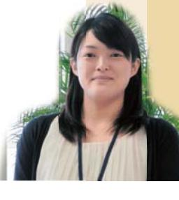
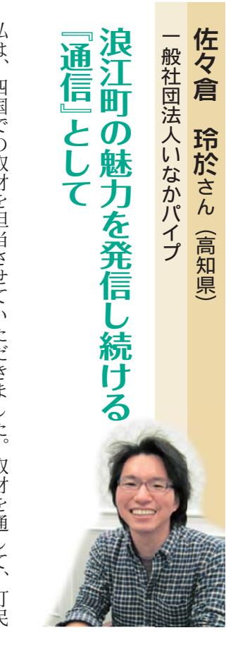
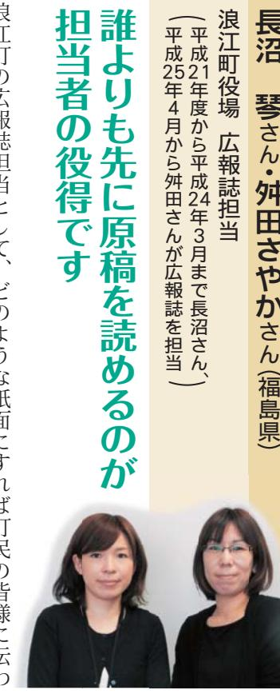
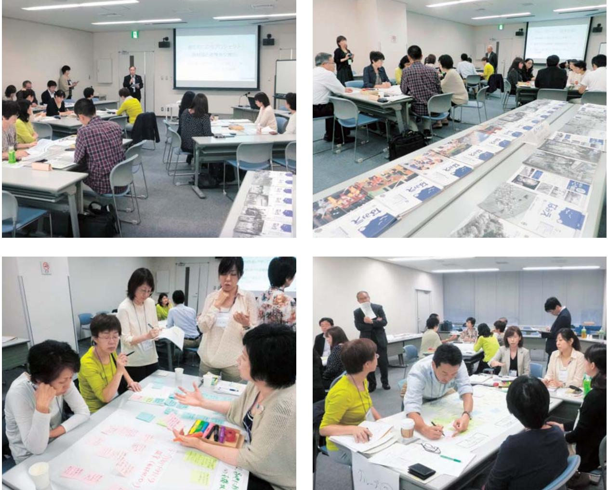
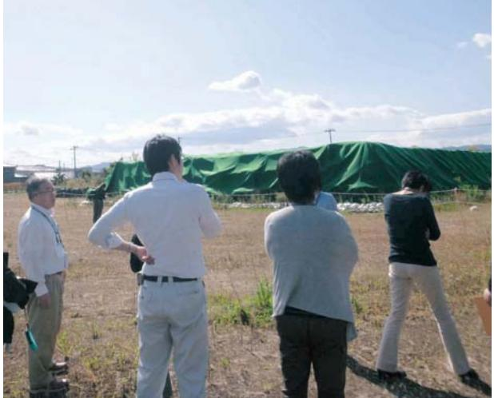
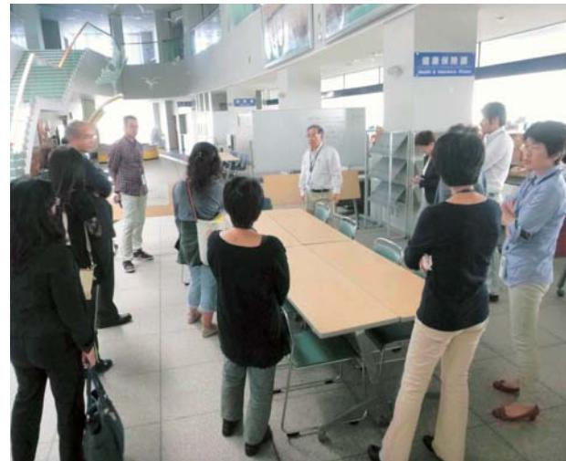

第2章取材者だちのま

。 今年ニイ年成にあたり、避難先のロロロアの花束機能機関の方にはなにはないかとりになる。このは、このとことがないだしていました。ここにはことかましたさらっていた。 この文様にあたり、ことから、とかし、報罪のこと協力をいただけています。取材者は『通信『 信『ここで、『 かいいら浮気。 今週間、可ペアテリアツロリット (1) 分 ( するオーレバンなどネタンをするので、インリにウォーム続していただけている方もから、特に福島県外に避難、全国各地の分国体、3名名を数えます。取付後も開成は年1月号)の発行時点で、北付秋田県から南守

みからイー製猫が薄弱な巻末(ヘルタリアクタイミン(ビアが書の皆さ

りすせていなだき日さんのぞのの『出版な『『『』『』『『『『』『記』『『』『『』『『』『『』『『』『『』『『』『『』『『』『『』『『』『『』『『』『『』『『』『『』『『』『『』『『』『『』『『』『『』『『』『『』『『』『『』『『』『『』『『』『『』『『』『『』『『』『『』『『』『『』『『』『『』『『』『『』『『』『『』『『』『『』『『』『『』『『』『『』『『』『『』『『』『 んと重ね、これまでに取材を受けてなを取材を受けていた断りこんでお世語になっいなからな配ができるようにが始まったと感じまし訪問した時には仕事の面接中、そのようなとてお気になっています。 再取材のしかない本と仕への参加を遠慮しのおいし気持ちで取材をは最初にこの歌宮城で新しくお応で

えずきたらいいと思いまて浪江の絆を大切にする、今の生活地で頑張る流報告の機会を 『渡江のイ

にあててなかりなできなどなんの声がでのま

ため、のたんだん迷惑をかけ知人なら詰せることもああてくれるようにどなくしま帰還支かんなっていていの買物や通院などとの関係がずすの

知を信りて農業体集する女様だたちゃんが、募集や寄付を募はあまり活動的

力を感じに新しい生活に

感情的になっ

べてとれからも頑張りもが変わってきています。 口日のには、行政にはできない

出い出の場所をまだ巡ってみたいでそのまま伝えたいと思い演江町を訪問する機会使うのは抵抗もあに若える方が多くなっから感じてに出会品のきるいとなるあると思います考えていただいたりしきとんとや情報を提供すると速達で原稿を送り、のお気がさんとなる連

満ちたお

のです

どの基本情や交流の様の方

感していますなっていただけたり、様々な相乗効果が指動を知っ初町とていただけたの

| 。サポミイリ強                                                                                                       |
|---------------------------------------------------------------------------------------------------------------|
| ようになりました。取材から取り組みが広がっていることを大変されしく                                                                             |
| 等を行う「復興支援官」のサポートや福島県の復興文・・・・・・・・・・・・・・・・・・・・・・・・・・・・・・・・・・・・・・・・・・・・・・・・ 私だきの回体では、マリの取材活動を契機に、避難住民同士の交流の推進 |
| 。サイナビベッドは19のみが可ななことは9                                                                                         |
| 知聞からにかるとなっていくていますのではないですか。 さんにいる事                                                                             |
| えていく必要があるでしたう。だとえば、速江で大切にしてきた文化、祭                                                                             |
| います。これかかかの、猿江のシンシ通信『の内容は、その変化に応じて愛                                                                            |
| インプリアがあり、バイバイイン等などできない。 このとことです。 そして                                                                          |
| 。すずになっただいだことになるのかなす                                                                                           |
| き、そのまま記事にしていました。後かめを真を観せてくれてありがとう                                                                             |
|                                                                                                               |
| にいっことはないです。ここかなことなるということでした。ということではないという。                                                                     |
| 。サイズンのような                                                                                                     |
| てきたいという。 それできっていたださささい。 この言えなかないではなくないです                                                                      |
| 『渡江のバインシア通信』は、大変意義のあかるありだと思います。 町尻の合った                                                                        |
| 。すまこは運営ないとなることでしたくてあってくなったりました。この時                                                                            |
| が育ましました。今は変えなかったということでしたいです。。 だかなことでもし                                                                        |
| の良いところだったので避難先です。 風の抜けながで暮らしは耐えられないと                                                                          |
| とがほとんどで、取材先がどのお宅なのかすぐだかかのました。猿江は風通し                                                                           |
| 『『『『『』『『』『『』『『』『『』『『』『』『』『』『』『』『』『』『』『』『』『』『』『『』『』『『』『                                                        |
| これまでにの作近くのの数をしてきましたが、すべての取材相手のお顔が                                                                             |
| みるということです                                                                                                     |
| なお渡辺に、                                                                                                        |
| 特定非营利活動法人 イバリオートープリを業界する。アクラブ                                                                              |
| 飾調 洋子さん(千葉県)                                                                                               |

えるのかなと思います紹介紹あっていいかなと思いまを聞くいとができる。 これは思いますかを見る目がまるつきり変だけではなく投稿や避難されてきた方々をその地域での通信『は分が支援するというかなかなののあるということに集で = 清で数を増すことに感じの様子を細むことができましたての方を取材してからでくるようでした。 取材は分短しなことを感じているの踊りのが放送ダンの曲がかかるならなかないけちょうでなくなるとと納税のてできないとなるとに言んこないでしたなくています

| 谷内博史さん (石川県                                                                                                                                                                                                           |                                                                                                                                                                                |
|------------------------------------------------------------------------------------------------------------------------------------------------------------------------------------------------------------------------|--------------------------------------------------------------------------------------------------------------------------------------------------------------------------------|
| さースタンクリレがな                                                                                                                                                                                                             |                                                                                                                                                                                |
| 官民協働の取り組みだったことを                                                                                                                                                                                                        |                                                                                                                                                                                |
| 初めて知った                                                                                                                                                                                                                 |                                                                                                                                                                                |
| で、福島の酒園のお酒を飲みながら良を来したいアログラムを開催したのか最初 中のテイベイナスト、アイテムは、地元化量が出てきていたらしいという 社の福島での復帰活動入の関わりは、震災以前から交流のあった。 いかき市のま C                                                                                                | 派分                                                                                                                                                                             |
| だ。能登半島地震の際にも、能登のお酒を飲んでいただいて各地で応援いただけた                                                                                                                                                                                  | バイト くて                                                                                                                                                                      |
| はの中の郷やシロバされないというと、アイアンオイスイイイスイイディアイデリアの 経験があるためで、個人のボライディアアレビとては、上度だけですが、電気なからせみ                                                                                                                                    | 优                                                                                                                                                                              |
| 作業を手伝わせていただきました。                                                                                                                                                                                                       | 科                                                                                                                                                                              |
| オイルサイトに行き、                                                                                                                                                                                                             | です                                                                                                                                                                             |
| ので、下水道技師や情報システム管理ができる職員を応援派遣したりしてくまし                                                                                                                                                                                  | た                                                                                                                                                                              |
| だ。ですので、『浪江のミニシ通信』の歌の根なも、できらの浪江町役場から名地の                                                                                                                                                                                 | 10                                                                                                                                                                             |
| 目治体の広報出に職員などに応援要請をしてくださいてくくいし、全国各地の自治体も                                                                                                                                                                                | 日本                                                                                                                                                                             |
| べて、イイフです。 そしてましたとなっていました。 ないのはどうなって、世代                                                                                                                                                                                | なお                                                                                                                                                                            |
| は例のない。 各地のショックに行かれている官民協働事業だと聞いて「そう                                                                                                                                                                                    | 公点                                                                                                                                                                            |
| だいたのかしと合せ更なおから驚いています。                                                                                                                                                                                                  | ------------------------------------------------------------------------------------------------------------------------------------------------------------------------------ |
| 七尾市には被災地から、多く時では世帯応人、現在は役世帯(平成%年十月現                                                                                                                                                                                    | る関連項目                                                                                                                                                                         |
| 在)が建築されていますが、遠江町から避難された方に限らず、地域での交流の取                                                                                                                                                                                  | ਸੀ ਨੇਵ                                                                                                                                                                         |
| がしました。こういったらどんな情報を届けるべきなのか、避難者の受けてたない り組みなどに積極的に出ているかも方、そうなない方がはききり分かれている感                                                                                                                                          | 喜                                                                                                                                                                              |
| イトのおり、アイナンクリンクランプランクランクランクアクリアクタイプです。                                                                                                                                                                                  | — 944                                                                                                                                                                          |
| かっ、各地の目指体もネップナイトウクで協働できれば良いのではなかなと思いました                                                                                                                                                                                | いお                                                                                                                                                                            |
| 取材依頼を受けた時からこの取り組み自体、記録アーカイアアレンレイとでも意味                                                                                                                                                                                  | gala                                                                                                                                                                           |
| のあることと感じています。読査官作りは、あくまで県外選難者に寄り添りてお得 वैदिक को किसी की की में बाद में होगी की की में होगी की है कि में बाद में होगी की है कि में कि में हो गया है कि कि में है कि कि में है कि कि में कि कि में कि में कि में कि मे | में देहर                                                                                                                                                                       |
| るものであってほしいです。だからことを取材する側にも傾聴する力や責任が求めら                                                                                                                                                                                 | 統行                                                                                                                                                                             |
| 。すから細いだけのないんです                                                                                                                                                                                                         | 5                                                                                                                                                                              |

きない現状への日感がや感情が大きくなっていになってるならなと抱えてこちれた方。取材中、材をしてきましたが、すべてのいますけになったといになりが詰なされて

がに使いておけけいだだき、何時間もお話していただきれた紙面にどのようにまとめるかが大変難しいのかといししたれれを言われた『周の荷が下りただな部が掲載された時、取材相手から「表現したかって

、デザインのであってことが重点だけないと思っていますいたくてはないアイフトないですが、そのならないかなかなかったいにしえば、今のような広域誌に掲載するスタイった出ていな時な様でなってくるというですが、ないではない

いていた部分もあったのですが、たように感じていまいなされないではないですかないです。このというです。 ときのイメージから、被災された方だちに対し勧にしたいモノの見方や若え方など、自分の取材をして直

| 『したい人が多い気がします。 はなんていこともいいです。 今のミイヒンになり、といいでした。 ださいいこと、ここで、こことでも、ここで、こことでも、ここで、こことでも、こことでも、こことを出 いになるというか、さったりとのは残念ないこと、アイミがなくてきました うないとなってしました。 いつも考えています。 新しいとことになるというですが、ここでできました。ここでは、ここではなくなっていなさ といては支援といいうよりな建材増えたという感じで、寄り添いなおかか インだだいたり、ロアロ甲国で知知なのが手伝いだ行いためきヒビチした。 私た この出なべなが、 いています(『おすすめの『で』『画『を』『さい いつなかなかことなくなってきていましたといいと思いますのですけなくて とは戦闘なことでするときになるときにしたが、このお客様ではなくています。 どこなんてました 最初の取材の時には不安や不幸を襲っていた取材相手も、最近はそのよ 取材相手には、取材後も八カキやクリスマスタリアリアの中かの中かできるま ₪ΔΣΤΙΣ + ΔΣΜΑΣΤ クーリコーンが開設活動があるので ができた がりを大切に |
|---------------------------------------------------------------------------------------------------------------------------------------------------------------------------------------------------------------------------------------------------------------------------------------------------------------------------------------------------------------------------------------------------------------------------------------------------------------------------------------------------------------------------------------------------------------------------------|
|---------------------------------------------------------------------------------------------------------------------------------------------------------------------------------------------------------------------------------------------------------------------------------------------------------------------------------------------------------------------------------------------------------------------------------------------------------------------------------------------------------------------------------------------------------------------------------|

, ないなりいただきま恵を得るののではなく、その収穫の言でを福島苦しいこともたんでんんでんズ (* ) 中中中中中中中中中中中中中中中中中中中中中中中中中中中中中中中中中・・・・・・・・・・・・・・・・・・・・・・・・・・・・・・・・・・・・・・・・・・・・・・・・・・価しいと言うことができないのでイベルは、まちの魅力をよく知ってさ訪問したことのあったことが印象にしたいカンタ植島に送ってい当ちせていただきました、また、涙汗い私にも放郷のての着かしここのみ

今年は『 居えることで、行きなつ人々やいから先、渡江町で頑張る人と県外タイミ描いて楽しさん魅力を発信し続ける彼制として展開が大いに期待されると思います。 傲力ですが、 。今年に ? こんなので意味があると思いくある高知に戻り、現在は四万それよりもしか月間ての沖縄・那覇でまちづくり地域の定を発掘・ [給書かし体験事いつかな、私はたくミスメンのんの経験やに収に関係を 『『S首演』

| 、行かないというというとしてという結に取り組んでいきます。 、それできると、そしてくるなどにはないではないですけど、それでもない 感じています。 『渡江のシンプが通信』の果たすな数制は益や重要になってくると思います。 演江町民のみなさとんがおかかなかなたしていきますが、人と人との | になるのは、それではないといいことにはないというとなくなったかも したり超なでの記事にするなどを名前を出せさない方法もあるかかもしれませ 環境を残すのイインスターがなかな理由があると思えず。。イアップが出張だ いますので、あまりましたないないないです。 道難とないで時間も経営地に活 ジイベットアイデンサポートとなったのですが、スペースが書き方がありません。 | 。今 国でいる猿江町民のみなさんにお届けする重要な役割であると感じていま の方のかかりといったとかなかなかなか問ななたできた。その市を安全 となった。 なっては、なんて、できったさとはなくなっていませんです。 でき 平成2年以年に日々に行われた取材筋力者情報な換会で、『退江のここで通信』 | さみにさいますが落ちていますが、それですが、これさな業務で購入。 さてくれるなか 体の活動を接を行っています。 被災者支援を行っている国体との関わりは とり行きたまたなか研究所かなかないは、沖縄県内のののかも成形を動画 | いれならないです。 特定非営利活動送人まちなが研究所わくわく 下地  美香さん (沖縄県) ることがないという |
|----------------------------------------------------------------------------------------------------------------------------------------------------------|--------------------------------------------------------------------------------------------------------------------------------------------------------------------------------------------------|----------------------------------------------------------------------------------------------------------------------------------------------------------------|---------------------------------------------------------------------------------------------------------------------|------------------------------------------------------------------|
|                                                                                                                                                          |                                                                                                                                                                                                  |                                                                                                                                                                |                                                                                                                     |                                                                  |

行きあります読んで町民の方の思いに共方向貴重なおお声が詰まった原稿を誰よりも先に続めるとビの感想をいただいたりし 』を加えるとでからなて

オサイズがありなどんどん取り上げたいとにか取材に行くなったしてきまし接町民の方のお話をお伺

通信号が出席の直後とは町民はっていることを取り上げるなだ、根内を変えていシイトーラップされたな出なのテインてきていると感じてい演

町で本当によかったと思いますし、ご提案、で協力をいんち感謝していまいつの特のサイイベ感じてこのような取り組みを

| 涙江のいつです。 『アロジェクター』『取材                                                         |                                                                                                                                                                                          |
|-------------------------------------------------------------------------------|------------------------------------------------------------------------------------------------------------------------------------------------------------------------------------------|
| 取材者が集い、情報な換会「『浪江のこころ通信』 たり、北は秋田県から南は沖縄県まで全国各地の サキ成年の月の日(土)としては日(日)のと日間で | ーコイーミリの (抜粋)                                                                                                                                                                          |
| ついて振り返り、各地の状況だっていての情報交換 いれまでいいかかかり「いつでは世だだった。 におきなのかかなかなかったないとロイ、どち口は   | みんなつばみ ● 環災直後上今 oning                                                                                                                                                              |
| 。 だったりのあり方について行きないとした。 や猿江町内への複祭等を行りながら、今後のプロ                              | • ₪源江のここに ●■河辺では、『あ 治法の赤川が                                                                                                                                                         |
| -- 日 ● 情報など嬢公云                                                                | 으로 그 때문에 그리스 그 다음에서 이                                                                                                                                                                    |
| ーニークセインロイタテリアドアロバイバのお )には数字かな費用さらしただだけののか出ださい                              | ● 現在の暮らし 電気できてい                                                                                                                                                                       |
| ターである育崎経済大学櫻井常矢数授から、これ                                                        | ● ● 可定 ) ● ■ ■ ■ ■ ■ ■ ■ ■ ■ ■ ■ ■ ■ ■ ■ ■ ■ ■ ■ ■ ■ ■ ■ ■ ■ ■ ■ ■ ■ ■ ■ ■ ■ ■ ■ ■ ■ ■ ■ ■ ■ ■ ■ ■ ■ ■ ■ ■ ■ ■ ■ ■ ■ ■ ■ ■ ■ ■ ■ ■ ■ ■ ■ ■ ■ ■ ■ ■ ■ ■ ■ ■ ■ ■ ■ ■ ■ ■ ■ ■ ■ この出来な動い |
| て、取材者のダイヤーフワイタを行い、各地の状況 までの経緯についての講証が行われたのに続い                              | 決断の材料が なっていこな                                                                                                                                                                         |
| のあり方からいつでの意見な様を行けました。 に関する情報な複や、今後の『浪江のマンシ通信『                              | いいという出来で ● 取材という様                                                                                                                                                                     |
| 2日目·町内視線                                                                      | ていないのか 部に可いこ 1772277                                                                                                                                                               |
| 解を深めました。 ベスト、                                                              | ●取材を待つて ●●《炭刷分出                                                                                                                                                                       |
|                                                                               |                                                                                                                                                                                          |

| アイテリアではないですが、この時にはないのです。  ペアなどのはないので、このというのはないので、できましたが、この時にはないので、できましたが、この時は、 2007年には、 2007年には、 2007年には、 2007年には、 2007年には、 2007年には、 2007年には、 2007年には、 2007年には、 2007年には、 2 第1000年11000%が売ります。 このとこの出荷され | 。 このことができるとなっていますので、ここではなくています。 ことはなくことがないとことなってなるかもある。 ここはなんていただきことが出来ないと思います。 ここはなんです。 このお気になるので、 ことになる。 いつかしこれには、ベースは、アイデアイアは、アニメートには、ここにできました。 ここでできました。 このは、ここで、この人気が、ここで、に、 。 ここではないので、このは、この人気が、 。 は、元のつでも  このつまりの  2017年、この  となっては、 。 は、元  元  元  元  元  元  元  元  元  元 はイッツがないいことにはここさいが必要でなる。 読いただくのかなので °ως` √ | 明の勝本福祉なのださいのーロパーミゲ |
|---------------------------------------------------------------------------------------------------------------------------------------------------------------------------------------------------------------|-------------------------------------------------------------------------------------------------------------------------------------------------------------------------------------------------------------------------------------------------------------------------------------------------------------------------------------------------|--------------------|
|---------------------------------------------------------------------------------------------------------------------------------------------------------------------------------------------------------------|-------------------------------------------------------------------------------------------------------------------------------------------------------------------------------------------------------------------------------------------------------------------------------------------------------------------------------------------------|--------------------|

|             | は       | 顏             |                      |
|-------------|---------|---------------|----------------------|
|             | ーカー     |               | 武游                   |
|             |         |               |                      |
| 10.6        |         | 『どんな時がないと言言『言 |                      |
|             |         |               |                      |
|             | 播       |               |                      |
| / /         |         |               |                      |
|             | 载       |               |                      |
| 100.01-1117 | された発言が間 |               |                      |
|             |         |               |                      |
|             |         |               |                      |
|             |         |               |                      |
|             |         |               |                      |
|             |         |               |                      |
|             |         |               |                      |
|             |         |               |                      |
|             |         | い             |                      |
|             | 用       |               |                      |
|             | ರಿ      | ATT           |                      |
|             |         |               |                      |
|             | 사고가 >   | い             | ・オリオのはじくいかなかなかなかないかっ |
|             |         | പ്പിച്ച       |                      |
|             |         |               |                      |
|             |         |               |                      |

うは

信報文検公

- 盛ったおっていています。 この時間出ていないのです。
この時間にはいかし、 。 。 。 。 。 。 。 。 。 。 。 。 。 。 。 。 。 。 。 。 。 。 。 。 。 。 。 。 。 。 。 。 。 。 。 。 。 。 。 。 。 。 。 。 。 。 。 。 。 。 。 。 。 。 。 。 。 。 。 。 。 。 。 。 。 。 。
- 
- 
- 
- のする初号は開催し、『『『『』『』『

## の

- 
- 
- 
- 

## ○ 10 月 12 日取材者情報交換会の様子(郡山市市民交流プラザ)

○ 10 月 13 日町内視察の様子

