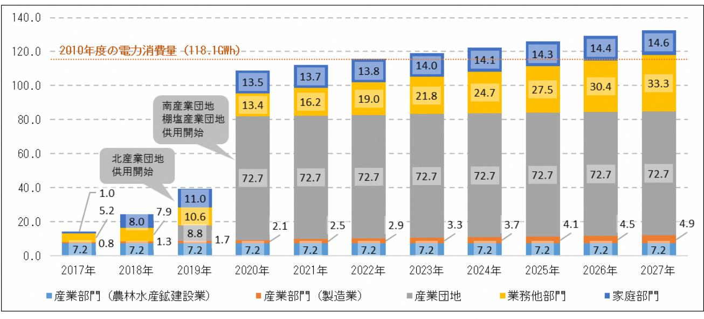

# 1.計画策定に向けてのロードマップ

# 2.今後の委員会スケジュール

#### <第2回検討委員会議事内容> 1月下旬~2月上旬を予定

- ・庁内におけるエネルギー需要予測(熱)の報告
- ・再生可能エネルギーの導入目標(将来像)・基本方針について
- ・再生可能エネルギー導入の具体施策(地域課題の洗い出し及び対応策を含む)
- ・事業者意向調査結果

#### <第3回検討委員会議事内容> 2月下旬を予定

- ・再生可能エネルギー導入目標等推進計画の素案について
- ・ロードマップ(短期・中長期)について
- ・導入に向けた推進体制について

# 【国、県における復興計画とエネルギー施策との関連性】

# 【浪江町における上位計画・関連計画(浪江町復興計画-第二次)】

・浪江町復興計画【第二次】(平成 29 年 3 月浪江町)復興までの各時期の歩みと復興の姿

| Ⅰ 緊急復旧期の歩み (~平 26.3.31 震災より 3 年)       | ・「すべての町民の暮らしを再建する」取組 ・「ふるさと なみえを再生する」取組                                                                                  |
|----------------------------------------------------------|--------------------------------------------------------------------------------------------------------------------------------|
| Ⅱ 復旧実現期の歩み (~平 29.3.31 震災より 6 年)       | ・「すべての町民の暮らしを再建する」取組 ・「ふるさと なみえを再生する」取組 ・「被災経験を次代や日本に生かす」取組                                                           |
| Ⅲ 本格復興期において目指す姿 (~平 33.3.31 震災より 10 年) | ・先人から受け継ぎ、次世代へ引き継ぐ"ふるさと"なみえを再生する ・被災経験からの災害対策と復興の取組を世界や次世代に生かす ⇒(施策)エネルギーの地産地消の実現と新しい産業の創出 ・どこに住んでいても、すべての町民の暮らしを再建する |
| Ⅳ 輝かしい未来に向けて (震災より 10 年後~未来へ)                | ・既存産業と新たな産業が地域経済を支える浜通りの中核都市の実現 ・世界に誇れる国際的な被災伝承・教育・研究都市の実現 ・なみえの豊かな心を次世代につなぎ、生きがいを持った生活環境の実現                             |

・まち・ひと・しごと創生浪江町総合戦略(平成 28 年 3 月浪江町)

○基本理念:未来につなぐふるさとなみえの創建

○視点 1「防災・減災のまちづくり」

### ○視点 2「原子力に頼らないエネルギーの活用」 再生可能エネルギーの積極的導入

#### エネルギーの自給自足の実現に向けたまちづくり⇒再生エネルギー自給率:2020 年目標値 40%

○視点 3「戦略的情報発信」

#### ・浪江町復興スマートコミュニティ構築マスタープラン策定事業(平成 29 年 6 月浪江町ほか)

- 〈スマートコミュニティ事業〉
- 1.交流・情報発信拠点エネルギーマネジメント事業 2.地産地消型災害公営住宅事業
- 3.公共施設安全・安心エネルギーマネジメント事業 4.大規模再生可能エネルギー事業
- 5.自然エネルギー活用型農園事業 6.自然エネルギー活用型漁港事業
- 

# 再生可能エネルギー導入適地選定

### 【導入ポテンシャルの位置づけ】

本業務においては、GISを用いて利用可能量を算出するが、前段となる試算として、賦存量から浪江町の土地・建物用途等を勘案し、再生可能エネルギーによる設備容量の導入ポテンシャルを推計した。

### 【前提条件・推計方法等】

再生可能エネルギーに関するゾーニング基礎情報整備報告書(環境省平成 22 年度~平成 24 年度)の参考文献に示された推計手法と一部、浪江町の推計データを基に算出した。

- (1)対象再エネ種別・太陽光発電・陸上風力発電・中小水力発電(参考文献の算出値を引用)
- (2)太陽光発電の導入ポテンシャルの算出方法
	- 住宅用等:建物用途・規模別による設置面積から設備容量を算出し、福島県の発電量係数を用いて年間発電量を推計した。(一部、参考文献の算出値を引用)
	- 公共系等:公共系建築物は、浪江町公共施設総合管理計画からと面積を算出し、耕作放棄地は福島県農業センサス(2005 年)による統計値を用いて面積を算出した。各面積に設置係数を乗じて設備容量を算出し、福島県の発電量係数を用いて年間発電量を導出した。

(3)陸上風力の導入ポテンシャルの算出方法

年平均風速が 5.5~8.5m/s以上の面積を抽出し、1 万kW/1km2を配置基準とし設備容量を算出された値から設備稼働率を日本風力発電協会の平均設備稼働率等を乗じて年間発電量を算出した。

#### 【検討結果】

太陽光発電は設備容量約 75MW(年間発電量約 77GWh)、陸上風力発電は設備容量約 410MW(年間発電量約 670GWh)という試算結果となった。中小水力発電は、賦存量 3MWであったが導入ポテンシャルとしては、0MWという結果が参考文献から得られている。

表太陽光発電、陸上風力発電、中小水力発電の導入ポテンシャル推計試算

導入ポテンシャル太陽光発電陸上風力発電中小水力発電住宅用等公共施設系耕作放棄地設備容量[MW] 39 0.968 35 410 0 年間発電量[GWh] 40.21 1.00 36.14 665.84 0 90 700

図太陽光発電、陸上風力発電、中小水力発電の導入ポテンシャルによる年間発電量

# 再生可能エネルギー導入適地選定

#### 【前提条件・計算方法等】

経済産業省資源エネルギー庁のエネルギー消費統計における「都道府県別エネルギー消費統計」より、福島県の電力消費量から各種統計データを用いて浪江町における産業や家庭等の部門別の電力消費量を推計し、部門別に設定した単位(人口、事業所数)あたりの電力消費量から部門別の電力需要量を推計した。なお、帰還人口の推計では先行して避難指示区域が解除された南相馬市小高地区の帰還状況の推移を参考に推計を行った。

また、町内の産業団地を対象に、経済産業省の工場立地動向調査から事業者の想定立地件数を算定し、1 事業者あたりの電力消費量を乗じて産業団地における電力需要量を算定した。

<電力需要の将来推計フロー>

# 【結果】

電力需要の推計結果を下図に示す。2027 年度において町内全体では、合計 132.7GWhとなった。

図表浪江町における電力需要量(GWh)の推計結果

# 再生可能エネルギー導入適地選定

# 【土地利用規制等に基づくゾーニングの検討】

本町における再エネの導入に際して、開発候補地の選定を行うにあたり、関連する土地利用規制等を整理し、町域を以下の3つのゾーンで分類した。

- (1) 自然環境保全ゾーン自然環境の保全を第一とし、大型の再エネ設備の導入を制限するゾーン対象・・・森林区域(国有林・保安林)、自然公園区域(特別地域)、鳥獣保護区・特別保護地区、河川区域・河川保全区域
- (2) 再生可能エネルギー導入調整ゾーン

周辺環境への調和の観点から、大型の再エネ設備の導入については調整を要するゾーン対象・・・地域森林計画対象民有林、農用地区域

- (3) 再生可能エネルギー導入推進ゾーン大型の再エネ設備の導入を推進するゾーン
対象・・・(1)および(2)を除く地域 ※但し、用途地域(住居・商業系)は含まない

# 【検討結果】

農用地区域を再生可能エネルギー利用調整ゾーンに含めた場合のゾーニング検討結果は下図の通りである。

# 図表ゾーニング検討結果

# 【選定方法】

| 1.以下の5項目の条件を設定し、再生可能エネルギーの開発に適さない地域(開発不適地)を抽出        |
|------------------------------------------------------|
| (1)地形条件                                              |
| 国土地理院の 10m メッシュ標高データ等により、地形の複雑な地域を抽出し、開発不適地と   |
| した。                                                  |
| (2)微地形区分による災害リスクの評価                                  |
| 「揺れやすさ」及び「液状化」リスクが非常に大きいと評価される「砂洲・砂丘間低地」「旧           |
| 河道」「埋立地」を開発不適地とした。                                   |
| (3)防災関連法に基づく災害リスクの評価                                 |
| 急傾斜地崩壊危険区域、地すべり防止区域に相当する区域を開発不適地とした。                 |
| (4)埋蔵文化財                                             |
| 埋蔵文化財分布図(平成 14 年 3 月改訂)に示される地点を開発不適地とした。 |
| (5)復興事業区域                                            |
| 藤橋、浪江北、浪江南、棚塩の4産業団地および谷津田地区の太陽光発電事業地については            |
| 開発不適地とした。                                            |
| 2.環境省等の資料から再生可能エネルギー導入ポテンシャル分布状況を整理                  |
| 太陽光発電、陸上・洋上風力発電について、採算ベースに乗る可能性がある、一定以上のエネ           |
| ルギーポテンシャルを有する区域を抽出とした。                               |
| 3.上記1.で抽出した開発不適地と2.で整理した開発適地の重ね合わせによる開発候補地の選定        |

再生可能エネルギー(太陽光発電、陸上・洋上風力発電)それぞれについて、再エネ導入ポテンシャルを有し、かつ開発不適地に含まれない区域を抽出し、開発適地を抽出した。

# 【選定結果】

太陽光発電における開発候補地の選定結果は下図のとおりである。青色(農用地を含む開発制限による開発適地)と緑色(農用地以外の開発制限による開発適地)が開発候補地である。

陸上・洋上風力発電については、平野部及び沿岸部には開発候補地は存在しない結果となった。

