資料4

## 地域新電力によるエネルギー供給を核とした浪江町の地域活性化モデルの検討

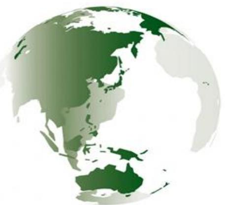

COPYRIGHT © KOKUSAIKOGYOCO., LTD. AllRightsReserved.

## 1.本町の主要な復興事業・計画等位置図

平成23年3月11日の東京電力福島第一原子力発電事故により、町内全域に出されていた避難指示は、平成29年3月31日、「帰還困難区域」を除く区域で解除され、復興事業も本格的に進められています。

<主な事業内容>

- ・幾世橋団地(防災集団移転促進事業7区画、災害公営住宅85戸)(平成29年度完成予定)
- ・請戸大平山団地(防災集団移転促進事業16区画、災害公営住宅26 戸)

(平成31年度完成予定)

- ・福島・国際研究産業都市(イノベーション・コースト)構想による、ロボットテストフィールド等やスマートコミュニティ構想実証事業等
- ・浪江町北産業団地整備事業・浪江町南産業団地整備事業・浪江町棚塩産業団地整備事業・浪江町藤橋産業団地整備事業(※藤橋については、平成29年度完成予定で4区画4業者が立地予定)

・交流・情報発信拠点施設((仮称)道の駅「なみえ」)(平成32年4月) オープンを目指し、先行して運営管理会社となるまちづくり会社が設立される予定。

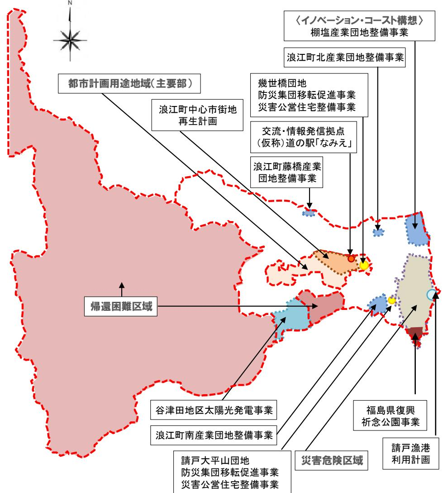

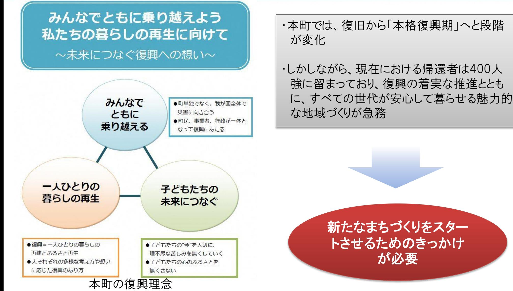

### 3.エネルギーの側面からの新しいまちづくり (一般的な新電力の事業スキーム)

- ・旧一般電気事業者に対抗すべく、電力単価の低減を中心に進めている大手新電力等が、公共施設に安価で電力を供給するモデル。
- ・電力供給規模を効率的に稼ぐため、基本的に高圧施設を対象に供給を行う。

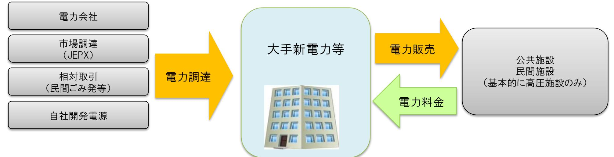

#### 自治体にとって、安価に電力を購入できるものの、地域住民等へのメリットを還元しづらい

### 3.エネルギーの側面からの新しいまちづくり (一般的な地域新電力事業スキーム)

- ・特に専門知識が問われるエネルギー事業部分は、新電力会社が中心となって事業の立ち上げや地域の人材育成を支援。 (事業の持続性にとっても不可欠)
- ・地元企業、地方自治体の発電所から電力を買い取り、地域内の公共施設や地元企業、住宅などに電力を供給し、電力の地産地消及び経済の地域内循環を目指す。

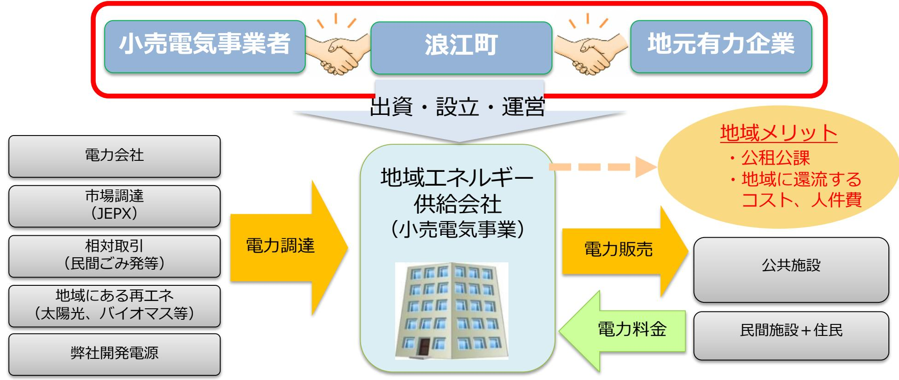

4

# 4.地域新電力事業を推進する目的

- ・国の予算縮小、人口減少、産業の低迷などの地域課題も踏まえ、地方創生(健康福祉、子育て、教育、防災など)に向けた継続的取組のため、地方行政における財政の健全性を維持していくことが重要。
- ・持続可能なまちづくりを行うための推進母体の1つとして、自治体、地元企業などと協力体制を構築し、地域新電力事業の構築を目指す。

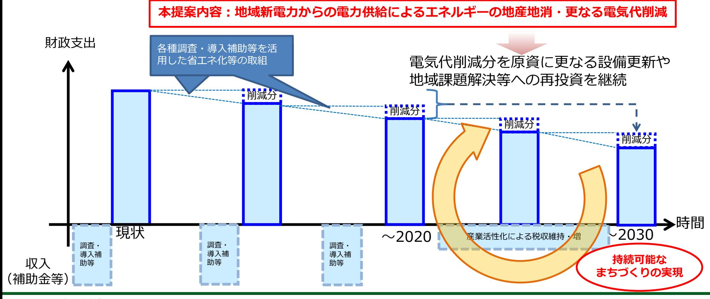

## 5.地域新電力事業を通じて実現したいこと

#### 地域循環モデルの構築

- エネルギーの地産地消(+地産外消)
- 都市部自治体との共生モデル
- エネルギーコストの域外流出の抑制(域内循環)
- 雇用創出

## 民間活力の活用

- 民間企業の資金やノウハウを活用した官民連携による地方創生
- 地域サービスの新規創出・維持・向上
- 再生可能エネルギーの導入拡大・自給率向上
	- エネルギーの地産地消に寄与する再エネ施設(既存、新設)
	- 再エネ導入と系統安定化に向けた実証等

→地方創生のカギは、地域内で経済循環を促進させる(お金を地域に残す)こと

- ■東京都区部の置かれた状況
- ・東京都に本社を置く事業者に対して、東京都が条例により温室効果ガス削減目標を課しており、仮に目標達成できない場合には、罰則(罰金)が課される。
- ・東京都の自治体は省エネ設備への更新等を含め、民間企業に先導して取組を推進しているが、省エネによる削減は限界に達してきている。
- ・そこで、特に地方都市から再生可能エネルギーを積極的に購入し、温室効果ガス削減を図るとともに、地域貢献にも寄与したいというニーズが高まっている。

#### ■本町の置かれた状況

- ・一部地域では平成29年3月31日に避難指示が解除され、これから本格的な復興が予定される。
- ・特に平成29年度中にまちづくり会社を設立し、町役場北側に31年度内にオープン予定の町交流・情報発信拠点施設の管理、運営を主な業務とする。施設での町民交流行事、物産品販売会などのイベント運営も担うとしている。
- ・復興計画では、再生可能エネルギーの導入を含めスマートコミュニティの推進を目標としている。

東京都のような大都市区部と貴町などの復興を推進する地方都市のニーズをマッチングし、復興を後押しできるような仕組みが構築できないか

#### 浪江町と東京都区部の自治体間連携(地産外消)によるエネルギー供給を核とした地域活性化モデル

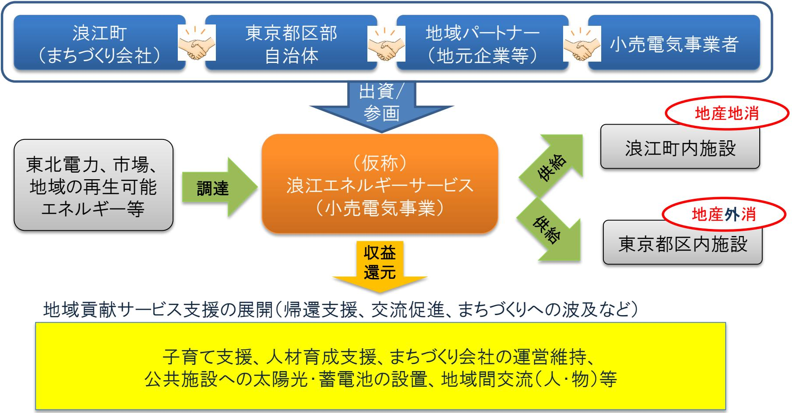

## 8.地域貢献サービス支援の展開(案)

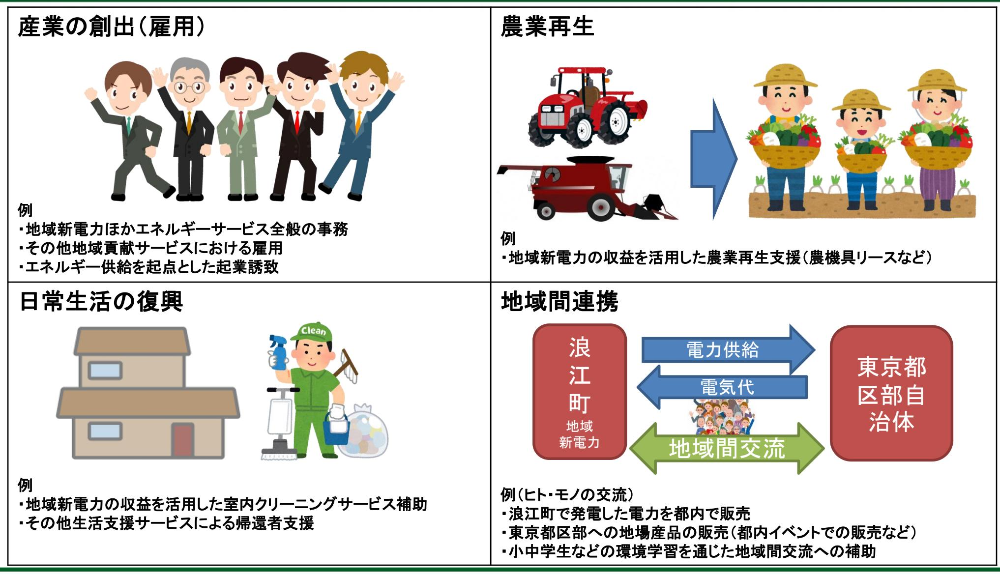

・エネルギーサービスをきっかけとして、エネルギー・経済的にも自立した持続可能な社会の形成を実現したい・再エネ(太陽光)発電事業と併せて事業を開始することで、収益向上及び経営の安定化・雇用創出が可能となる

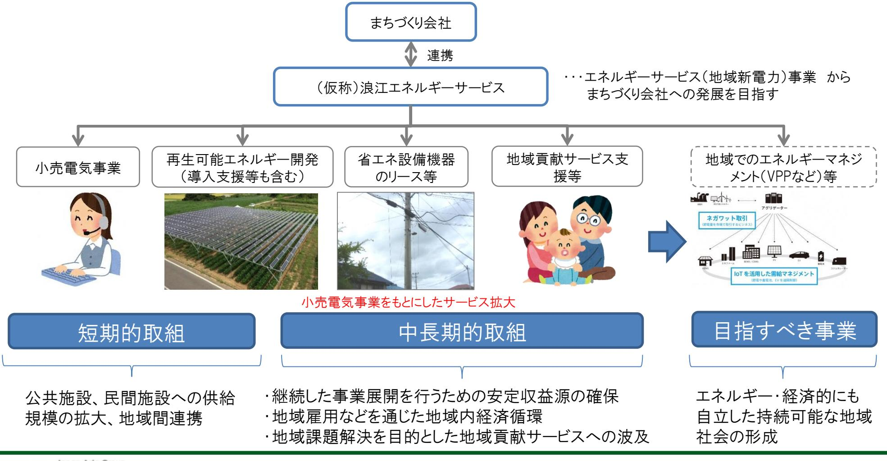

10.各プレイヤーのメリット

#### 浪江町と東京都区部自治体のマッチングによる相互支援モデル

| 地域全体                                                                                             | 地域パートナー                                                                                          | 浪江町                                                                                                                                                                      | 東京都区部自治体                                                                 | 新電力企業                                                                                                                                                |
|--------------------------------------------------------------------------------------------------|--------------------------------------------------------------------------------------------------|--------------------------------------------------------------------------------------------------------------------------------------------------------------------------|--------------------------------------------------------------------------|------------------------------------------------------------------------------------------------------------------------------------------------------|
|                                                                                                  |                                                                                                  | 全国初の自治体間連携モデルへの参画によるPR効果                                                                                                                                             |                                                                          |                                                                                                                                                      |
|                                                                                                  |                                                                                                  |                                                                                                                                                                         | 地域間連携による人・物等の交流活発化                                                       |                                                                                                                                                      |
| 雇用の拡大  民間施設・住民の  電気代削減 地域内経済循環に  よる地域産業活性 化 蓄電池導入による  防災面強化 | 共同出資して会社  を設立することに よる新規分野への 事業拡大 雇用の拡大や人材  育成 収益拡大  経営の安定化  | まちづくり会社の  安定運営などへの 収益充当 電気代削減  税収増  雇用の拡大  収益を活用した子  育て支援の拡充等 復興計画への貢献  蓄電池導入による  防災面強化(分散 型エネルギーの導 入促進) | 地方再エネ購入に  よる温室効果ガス 削減 相互メリットのあ  る発展的な被災地 支援モデルの構築 | 共同出資して会社  を設立することに よる新規分野への 事業拡大 需要家に公共施設  を取り込むことに よる信頼性の向上 自社発電事業の開  発機会の創出 持続可能なまちづ  くりへの積極的な 関与 |

11.スケジュール案

|                          | 4 | 5    | 6        | 7         | 8                                      | 9    | 10          | 11 | 12          | 1        | 2      | 3   |
|--------------------------|---|------|----------|-----------|----------------------------------------|------|-------------|----|-------------|----------|--------|-----|
| 参入可否判断                   |   | 市場調査 | 参入シナリオ検討 |           |                                        |      |             |    |             |          |        |     |
| ビジネスモデ ル検討・事業 計画策定 |   |      |          | 参入モデル詳細検討 | 販売チャネル獲得数検討 事業計画策定                  |      |             |    |             |          |        |     |
| 各交渉                      |   |      |          |           |                                        |      | 契約内容等の検討と交渉 |    |             |          | 契約締結   |     |
| 会社設立準備                   |   |      |          |           |                                        |      | 設立★         |    |             |          |        |     |
| 提供サービス の検討・設計         |   |      |          | サービス仕様検討  |                                        |      |             |    |             |          |        |     |
| 組織と業務設 計              |   |      |          | 組織・業務設計   |                                        |      |             |    |             |          |        |     |
| システム開 発・導入            |   |      |          |           |                                        | 準備期間 |             |    | システム開発・テスト等 |          |        |     |
| 各種手続き                    |   |      |          |           | 広域機関加入、小売電気事業者登録、 託送契約、バランシンググループ契約 |      |             |    |             |          |        |     |
| プロモーション 等             |   |      |          |           |                                        |      |             |    |             |          |        |     |
| マニュアル整 備              |   |      |          |           |                                        |      |             |    |             | マニュアル整備等 | トレーニング |     |
| 電力供給                     |   |      |          |           |                                        |      |             |    |             |          |        | 開始★ |

COPYRIGHT © KOKUSAIKOGYOCO., LTD. AllRightsReserved.

### 参考)弊社の自治体間連携のコンサルティング実績世田谷区の事例

- ・特に太陽光発電が主体の場合には、変動が大きいため、地域内で消費しきれない場合もあります。
- ・都市と地域の「人」や「物」の交流にもつながる可能性あるため、地域内消費に限定せず、一部は他地域に供給することを提案します。
- ・弊社は、現在、複数自治体における自治体間連携のサポートを行っていますので、具体的な連携先の提案が可能です。

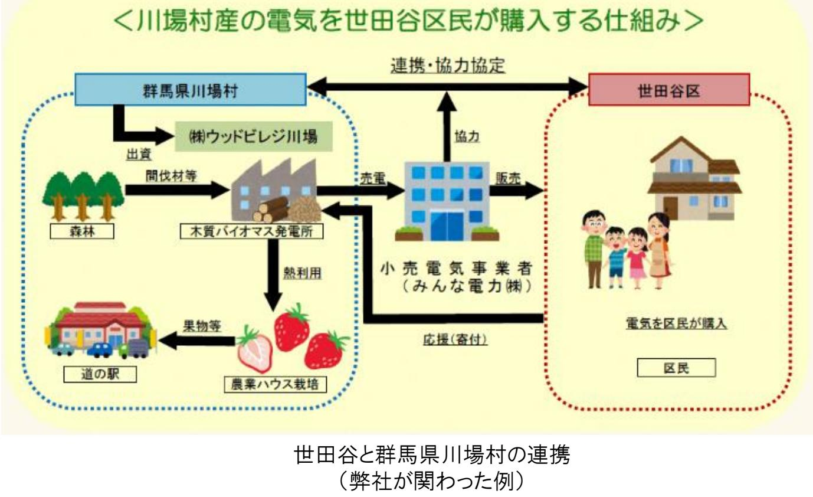

### 参考)供給の安定性について 「 送配電部門の中立化」と「電気の安定供給を確保するための措置」

送配電部門は、電力小売全面自由化後も引き続き、国が許可した企業(各地域の電力会社:中部電力等)が担当します。 そのため、どの小売事業者から電気を買っても、これまでと同じ送配電ネットワークを使って電気は届けられるので、電気の品質や信頼性(停電の可能性など)は変わりません。

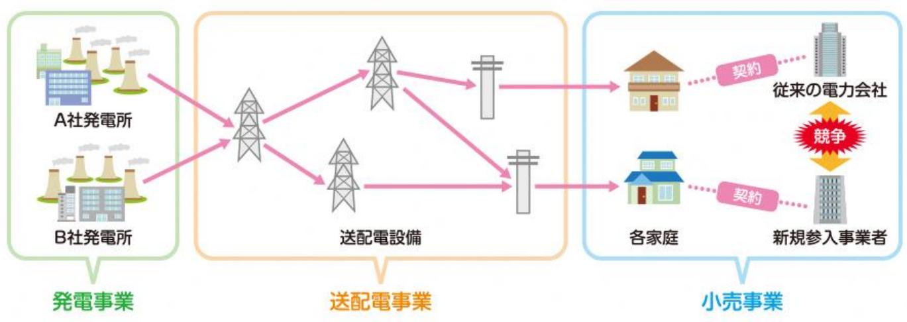

#### 【送配電部門の中立化】

電力市場における活発な競争を実現する上では、送配電ネットワーク部門を中立化し、誰でも自由かつ公平・平等に送配電ネットワークを利用できるようにすることが必須であるため、送配電部門の法的分離(送配電部門の分社化)が、小売の全面自由化から4年後の 2020年4月に行われます。 (先行して、東京電力(株)の送配電部門が「東京電力パワーグリッド (株)」として分社化された)

【電気の安定供給を確保するための措置】(送配電事業者(一般電気事業者の送配電部門)による措置) ①需給バランス維持(周波数維持義務)②送配電網の建設・保守を義務付け ③最終保障サービス(需要家が誰からも電気の供給を受けられなくなることのないよう、セーフティネットとして最終的な電気の供給を実施)④離島のユニバーサルサービス(遜色ない料金水準で供給) の4点を義務付け