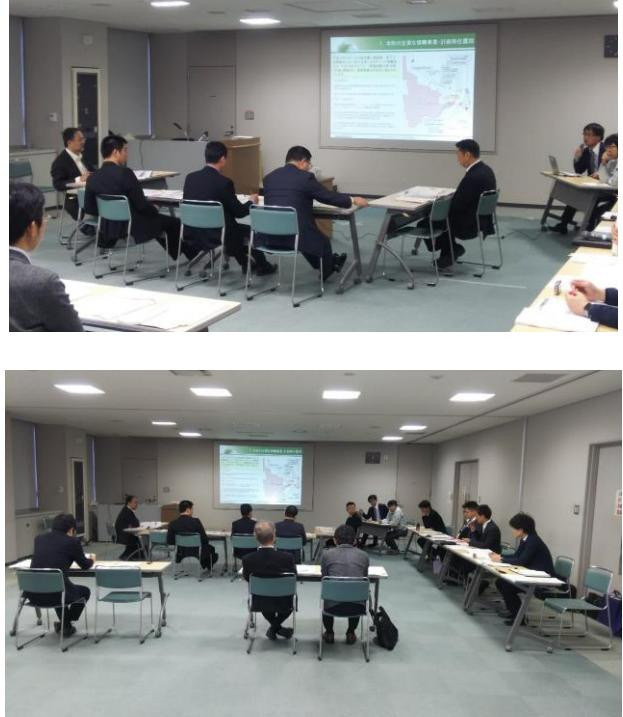

# 浪江町再生可能エネルギー推進委員会記録簿

#### 1.開催概要

- 【日時】2017年12月25日 10:00~12:00
- 【場所】浪江町役場2階大会議室

【司会】産業振興課産業創出係磯貝

#### 2.次第

| 1.開会                                      |        |
|-------------------------------------------|--------|
| 2.委員長あいさつ                                 |        |
| 3.委員紹介                                    |        |
| 4.議長選出                                    |        |
| 5.議事                                      |        |
| (1)浪江町再生可能エネルギー推進計画について                   | ・・・資料1 |
| (2)浪江町再生可能エネルギー推進計画策定委員会について              | ・・・資料2 |
| (3)検討状況の報告について                            | ・・・資料3 |
| (4)検討状況を踏まえた施策の方向性について                    | ・・・資料4 |
| 6.次回開催予定                                  |        |
| 7.閉会                                      |        |
| 【配布資料一覧】                                  |        |
| 資料1・・・浪江町再生可能エネルギー推進計画について                |        |
| 資料2・・・浪江町再生可能エネルギー推進計画検討委員会及び委員の役割について    |        |
| 資料3・・・これまでの検討状況について                       |        |
| 資料4・・・地域新電力によるエネルギー供給を核とした浪江町の地域活性化モデルの検討 |        |
| 参考資料・・・検討状況の詳細資料                          |        |

## 3.浪江町再生可能エネルギー推進計画検討委員会及び委員の役割について

|      | 職氏名       | 役割                         |
|------|-----------|----------------------------|
| 委員長  | 副町長       | 再エネ推進を所管する副町長として、委員会を総理する  |
| (議長) | 本間 茂行  |                            |
| 委員   | 総務課長      | 防災担当課長として、再エネを活用した防災施策や導入に |
| (欠席) | 山本 邦一  | あたっての防災対策等の視点から計画を検討する     |
| 委員   | 企画財政課長    | 震災からの復興推進担当課長として、多岐に渡る復興施策 |
|      | 安倍 靖   | との関連性・合致性等の視点から計画を検討する。    |
| 委員   | 産業振興課長    | 再エネ推進及び産業振興担当課長として、他産業への波及 |
|      | 岩野 善一  | 効果等を踏まえた再エネ推進のあり方等の視点から計画を |
|      |           | 検討する。                      |
| 委員   | 住宅水道課長    | 住宅政策担当課長として、家庭部門への再エネ導入推進と |
|      | 戸浪 義勝  | の関連性等の視点から計画を検討する。         |
| 委員   | まちづくり整備課長 | スマートコミュニティ担当課長として、スマートコミュニ |
| (欠席) | 三瓶 徳久  | ティと再エネとの連動性等の視点から計画を検討する。  |

| アドバ | 福島大学共生システ | 計画の検討にあたって、専門的・技術的な知見から助言等を |
|-------|-----------|-----------------------------|
| イザー   | ム理工学類教授   | 行う。                         |
|       | 佐藤 理夫  |                             |

| 事務局 | 産業振興課 産業創出 | 検討にあたっての調査、報告及び資料作成等を行うととも |
|-----|---------------|----------------------------|
|     | 係             | に、検討経過及び計画案の取りまとめを行う。      |
|     | 国際航業株式会社      |                            |
|     |               | 【第 1 回出席者】           |
|     |               | 飯尾、新城、高村、柳沼、齋藤、高山、河村、下田    |

## 4.質疑

- (1)資料3について
	- 本間議長:対象の再生可能エネルギーの種別として太陽光発電と風力発電の話があった。バイオマス発電などは対象に入れなかったのか。入れないのであれば理由を聞きたい。
	- 事務局:バイオマス発電については、弊社(国際航業)は過去に福島県内のいくつかの自治体から相談いただいた経験がある。浪江町も森林を多く持っているので、賦存量はあると考えている。一方で、最近の状況は確認していないが、ある自治体でバイオマス発電を検討した際に、国からセシウムの拡散の関係でバイオマス発電を行う場合には木の皮を剥いでから燃やすよう指示があった。そうなった場合に、事業採算ベースに合わないため除外した。 地熱発電については、環境省のポテンシャル調査において、福島の沿岸部にはポテ

ンシャルがないという結果が出ているため除外した。

- 本間議長:資料を見ると風力はポテンシャルが高いという結果が出ているが、過去に何社か調査を行い、浪江町は風力がないという結果が出ていたはずだが、年間平均風速等は妥当なのか。過去の調査結果を活用しているのか。また(調査結果を)活用したうえで、ポテンシャルが高いという結果なのか。
- 事務局:参考資料P.102 の環境省のポテンシャル調査による陸上風力の結果だが、赤色が平均風速の強いところであり、緑に行くにしたがって弱くなっていく。一般的に平均風速 6.5m以上が事業採算ベースにのると言われている。平均風速 7.5mくらいあると事業採算ベースとしてかなり良いのだが、浪江町の場合には山手側に風力の強いところが集まっている。現在、帰還困難区域に指定されている地域のため、解除されればこれらの地域での開発が可能となってくると考える。ただし、国有林とエリアが重なる地域もあるため、そこについては調整が必要となる。

 P.105 の陸上風力の適地選定の図を見ると分かるように、山手に近いところであれば規制にかからず必要な風力が確保できるとの分析結果が出ているが、具体的な地形条件等を整理し、実際に現地調査等をしてみないと分からない。今のところ、平地で調査した限りでは事業採算ベースにのるほどの結果は残念ながら得られていないと聞いている。

 P.103 には洋上風力のポテンシャルを示している。部品の輸送や組み立てには大規模な港湾を必要とするため、開発条件としては不利と考えて除外している。

- 本間議長:バイオマス発電で再生可能エネルギー導入を検討するとなった場合に、外部から木材を持ち込むという考えは良いのか。
- 事務局:結論から言うと問題ない。しかし、バイオマス発電については、半径 30 ㎞、遠くても 50 ㎞圏内から木材を集められるようでないと輸送費だけでコストが嵩んでしまうため、事業採算が合わなくなってしまう。良し悪しは分からないが、港湾部では外国からパームヤシなどの油粕を持ち込み、燃やして、バイオマス発電として売っている現実もある。しかし、(事務局としては)浪江町でやっていく意義は薄いと考えている。
- 岩野委員:参考資料P.107 の対象候補地案の図面で緑に着色した部分については、今からほ場整備計画を進めていくが、請戸や南棚塩、川添北・南、加倉、小野田などの地区が予定されており、土地改良との調整をお願いしたい。
- 事務局:検討にあたっては、農業部門へのヒアリングは行っている。ヒアリング後に前提条件等が変わってきている部分もあり、また適地選定のメッシュについては機械的にプロットしていることもあるため、他の復興事業との調整を詳細に詰めた上で、除外する地域についてはしっかり精査させて頂く。
- 安倍委員:資料 3-2 の風力のポテンシャルについて、やはり疑問がある。需要予測で産業団地を見込んで推計しているが、いつ頃になれば誘致が見込めてくるのか。
- 事務局:まず、ポテンシャルの件については、資料 3-2 の上にある図に示している通り、「賦存量」と「導入ポテンシャル」と「利用可能量」という3つの考え方があるが、今回の資料は「導入ポテンシャル」についてである。但し、制約状況などに幅があるため、ここで示した数値がすべて使えるとは限らない。最終的には、「利用可能量」 を当業務では出したいと考えている。現在は適地選定も機械的に落とし込んでいるため、すべての土地が使えるわけではなく、民有地に関しては地権者交渉もでてくるため、調査をしながら、どの程度であれば事業として始められるのかを精査していく。これら現在の状況を踏まえ、事業として成立するかどうかの判断をする。 どのタイミングから事業者の誘致が可能かについては、明確な時期はないが、主旨の混乱を避けるため、推進計画の中で開発をして良い区域と開発をしてはいけない区域を明示し、ゾーニング等で調整をするにあたってのルールを決めてから誘致を図るべきと考えている。

- 佐藤教授:大まかなイメージだが、風車で 410MWというと、布引きの風車で 200 本分という相当な数である。経済状況などを勘案していない数字のため、送電線がまだひかれていない地域や、羽を運ぶのに道路も整備されていない困難な山奥なども含めた話となっている。実際には 10 本、20 本の規模の話になるかと思うので、現実的には一ケタ少ない数字が風力の話になるのではないか。
 太陽光発電については、面積さえあれば規模に関係なく実施は可能のため、大まかに 2ha弱の規模で1MWと考えると、導入ポテンシャルでは 75MWとなっているため、 100haくらいの規模が必要となるのではないか。面積比例と送電線があるかで結果は決まる。

 また、先ほどバイオマス発電の話があったが、木質バイオマスの大規模な発電所は、火力発電所で石炭混焼が始まるため、木材の取り合いになり始めている現状もある。 大規模なバイオマス発電所は候補から外してしまって良い。

 もし活用するとすれば、比較的に小規模(50kW~100kW程度)で、ガス発電を行って熱も活用するというようなもの、若しくは電気ではなく熱源をすべて木のチップ (木質プレート)にするなどがあるか。最初は汚染された地域から出たものは丁寧に扱わないと利用者に理解を得られないのが現実ではないか。具体的な計画を立てる際には放射線量や汚染状況をしっかり調べてからにするべき。

- 安倍委員:適地をいろいろと選定しているが、太陽光発電に必要な面積等は確保できるのか。 適地で合計何haあるのか。
- 事務局:農地を使った太陽光発電事業については、2005 年の農業センサスの中で示された耕作放棄地を使った場合のポテンシャル推計となっている。今回の適地すべてで太陽光発電を行った場合には、このポテンシャル以上の結果が出ることになる。ポテンシャルの考え方についても、実情に合った形で推計を進めていかなくてはいけない。 また、この資料での適地すべてを使えるわけではなく、町の他の公共事業との兼ね合いの中で、どう適地を選定していくかも検討課題となっている。
- 戸浪委員:資料 3-2 の前提条件(2)について、太陽光発電の住宅用については、震災前の時点での推計か、震災後の帰還者が少ない中での状況を踏まえた推計か。
- 事務局:住宅用については、国の土地建物統計調査の数値を使用している。当調査の数値は居住者の有無に関係なく、建物の数として集計しているため、震災後の状況は反映されていない数値となっている。
- 戸浪委員:現在も従来の建物が震災の影響もあり解体も進んでいるため、そういった状況も踏まえて計画に反映すべきかと思うので調整して頂ければと思う。

- 事務局:今、必要になると考えられるのは除却された建物の面積等である。そういった資料については、借用の依頼をするかもしれない。
佐藤教授:この住宅用の推計は、住宅など町内の建物すべての屋根に設置した場合の計算か。

事務局:そうだ。

- 佐藤教授:逆に言うと、宅地や商業地の未利用地に低圧電力の 50kWくらいのものを並べると、これ以上の数値になると思うのだが、それは今回の調査には含まれていないか。
事務局:参考資料P.61 に住宅用と公共系の詳細区分を載せている。今回の資料で太陽光パネルを設置すると仮定したのは住宅用の商業系建築物と住宅系建築物、および公共系の公共系建築物のうち庁舎・文化施設となっている。低・未利用地は、まだ算定には含まれていない。 今の質問については、町内の低・未利用地も含めて利用できる部分を算定していってはどうかという提案につながるということか。

佐藤教授:そうだ。送電網の制約があるため、比較的早く立ち上がるのは 50kW未満の低圧連系かと思う。低圧連系については、300 坪(10a)あれば可能のため、適地が多くみつかるはず。普通の電信柱にトランスが置けるところであればよく、そこが狙い目かと考えている。 また、送電網が浪江町は脆弱なため、メガソーラーを立地するのであれば変電所の改修が必要となるかもしれない。これを如何に国や東電に請け負ってもらえるかも課題ではないか。

- 本間議長:住宅の解体申請は 3,000 件程度でているため考慮したほうが良い。 資料 3-3 の電力需要推計結果によると、2020 年には産業団地の電力需要量が最大になる。この結果は、見る人によっては 2020 年の段階では産業団地すべてが埋まっているとは限らないと考える人も想定されるため注意が必要か。
事務局:見せ方を工夫する。

安倍委員:開発適地の青と緑の面積はどのくらいか。

- 事務局:メッシュで機械的に抽出しているため、地目の状況等を確認してから面積を確定させたいと考えている。そちらについては、次回以降で報告させて頂く。
(2)資料4について

- 本間議長:新しい地域ならではのエネルギーサービス会社を立ち上げるとなったときに、連携先が地元企業となっているが、これは浪江町の地元企業か。それとも県内の地元企業と考えているのか。
- 事務局:今のところ想定としては浪江町内の協力して頂ける企業を想定している。出資する形で参画するのか、新電力の需要家として参画するのか、協力の体系は様々あるため、今後アンケート調査等を行いながら確認したいと考えている。
- 本間議長:出資については、(新電力のみならず)業態として興味がある企業であれば、1 社に限らず出資して良いということか。
- 事務局:その通りだ。
- 本間議長:他の事例として、自治体で新しいエネルギー会社を立ち上げた際に、スタッフはどこから派遣しているのか。
- 事務局①:事例によるが、地元の職員に領収書の発行などをお願いする形となる。地元からの雇用が基本ではないか。1 例として、出資元の会社から 1 人派遣し、その他の地元からの雇用者を教育するという形をとっているケースもある。
- 事務局②:基本的には自治体が職員を出すケースはない。民間企業が主体で立ち上げ、自治体は協定を結ぶか、もしくは出資という形をとっている。提携している民間企業からの出向や地域エネルギーサービス会社で直接雇用するものが多い。

本間議長:エネルギー会社のトップはエネルギーの知識が必要となると思うが。

- 事務局:小売電気事業者が地域新電力の会社に参画し、専門的な人間を 1 人でも派遣し、具体的に進めていくという形になる。
- 安倍委員:P.12 のスケジュール案に出ている 10 月に会社を設立し、3 月に電力を供給するという話は、P.10 の組織図のどの部分にあたるのか。
- 事務局①:地域貢献サービスなども含めた工程となると、この 1 年では厳しいと考えている。 あくまでも会社を立ち上げて小規模のモデルとしてスタートするとした場合の最短協議時間としてお話しさせて頂いた。当然、協議の内容によっては工程が延びる場合はある。

事務局②:電源開発を行わなくても、売電は可能である。

安倍委員:再エネが前提なのであれば、町で作ったエネルギーでなくて良いのか。

- 事務局:P.10 に示したのは小売電気事業と再エネ開発の両方を短期間で行うというイメージ図となっている。スケジュール案については、あくまで小売電気事業の内容のため、再エネの導入となれば、最低 1 年から 1 年半の時間をかけて 2MWクラスの太陽光発電所を開設するイメージである。現在、浪江町内でも再エネ設備の開設が進んでいるため、それらの設備をまずは電源として活用しながら、エネルギー会社でも自前の電源を短期で開発するイメージである。
- 安倍委員:新電力を立ち上げるというのは、町ではスマートコミュニティのマスタープランを策定済みだがが、今回の新しい検討業務の中にどう位置付けていくのか。
- 事務局:まちづくり整備課等とも情報共有はしている。スマートコミュニティのマスタープランの中には地域新電力という考え方の具体的な記載はないと認識している。中・長期的には実施していきたいという位置づけではないか。もし、本計画の中で今回の事業をモデル的に位置づけるとすれば、スマートコミュニティのマスタープランとの連動性の確保は必須と考えている。今後、まちづくり整備課と詳細に議論させて頂ければと考えている。

安倍委員:事業規模がよく分からないため、もう少し詳細を教えてほしい。

- 事務局:こちらの大まかな算定だと、地域新電力を立ち上げるにあたり、必要な電力需要規模は 5,000kWとなっている。3~4 人を雇用しても採算に乗る計算である。 庁舎の施設規模で考えると、300kW~400kW程度と思われるので、その規模で 10~12 施設の需要が確保できれば、地域新電力の採算としては十分と想定している。
- 戸浪委員:東京への売電のイメージを聞いたが、例えば浪江町で作った電力を県内で使用したいとなった場合の仕組みについて説明して頂きたい。
- 事務局:作られた電気については 1 度大きな貯水池に水を入れて頂くというイメージを持っていただきたい。そこから契約者へ契約した分の水が流れていく。貯水池に水を入れる側と貯水池から水を引いてくる側が相互に契約を結び、貯水池から買っているという形にしているという仕組みである。特に今回の再生可能エネルギーについては、発電事業者が持っている再生可能エネルギーの電気を購入側に売っていることを契約上証明することによって、温室効果ガスの排出係数の低い電気を買ったという証明になる。

 送配電の話については、資料のP.14 の図を見て頂きたい。国の制度の変更により、発電事業と送配電事業と小売事業がそれぞれ分離している。浪江町がつくった電力を東京へ送りたい場合には、現状では東北電力の送電線を介して送る形となってい

る。これが将来、別の会社に分離され、且つ東北電力は自社の電気以外は流さないということはできないため、小売電気事業者が送電線を1から引く必要はない。

- 戸浪委員:2 週間ほど前に、宮城県で予定していた太陽光発電の施設をつくったが東北電力から送電を断られたというニュースがあった。問題となった会社は中国の企業が買い取ったという話になっていたかと思う。送電の容量が発電した際に新規参入が断られるということがあるのか。もし分かれば教えて頂きたい。
- 事務局①:この話は系統連系の話になる。貯水池に流し込むための水路が空いているかどうかが問題であり、先ほどの宮城県の場合だと、貯水池に大規模な再エネを受け入れられる空きがなかったため断られたというのが実態である。浪江町の場合については、確認が済んでいる。
- 事務局②:今のところ浪江町内の系統には空きがあるため、つなげる状況にはある。太陽光発電等を行う場合には、事前に東北電力と協議を行い空き容量の回答をもらうことになっているため、設備をつくったあとに系統に流せなくなるということはないと考えている。
- 岩野委員:スケジュール案について、来年度の 10 月に会社を設立し、平成 31 年度から電力の供給となると、来年早々から会社設立に向けての準備をしなければいけないという考えになる。来年 2 月にようやく 1 年近く準備してまちづくり会社が立ち上がる。 12 月が予算時期のため、来年にいろいろと決めなければならないとなれば、厳しいスケジュールとなるため詳細をお聞きしたい。
- 事務局①:あくまで一般的に最短で会社設立を行った場合のスケジュール案として話をしている。浪江町がこのスケジュールでやるということを言っているわけではない。浪江町でやるとなれば、まちづくり会社や町の状況も踏まえてスケジュール案を考えなければならない。
- 事務局②:例えば浪江町でエネルギーサービスをしましょうとなった場合に、町が出資しなければどうなるかの話をする。いくつか事例はあると思うが、自治体が出資しているケースはある。出資はしないが、協力として会社から電気は買うという契約を結んでいる場合もある。それ以外には町として応援するという関わり方も当然ある。どういう形で関わるかというのは今後詰めていかなければならないと考えている。会社に関しては「株式会社」という形になる。 必ずしもすぐにスタートさせなければならないという話ではないのだが、東京区部とのマッチングを考えるのであれば、いろいろな自治体が既に動いているため、判

断が遅くなると枠がなくなってしまう可能性があることは危惧している。

佐藤教授:送電線の空きはどのくらいの規模であるのか。

- 事務局:11/31 時点の東北電力が公表している空き容量を確認したところ、一部に 20MW程度の空きのある連系ポイントが確認できた。
佐藤教授:それはどこかの変電所レベルの話か。

事務局:そうだ。

- 佐藤教授:浪江町の大きな連系点はどこに取れそうか。それにより事業採算性が決まってきそうだが。
- 事務局:今すぐには出せないのだが、後ほどご報告させて頂く。
- 佐藤教授:せっかくなので、イノベーションコースト構想で水素の大規模発電というところにも大規模な連系点を持ってくる働きかけや、もし可能であれば、新福島変電所(富岡町)の改修工事で東京電力に直で接続されるようになるはず(一部は動き始めているはず)のため、新福島変電所をからの送り先を浪江町のどこかに 1 点設けるなどの工夫を考えたい。マクロで送電網が空いていたとしても、メガソーラーを設置するための送電線敷設に億の費用が掛かったという話が中通りの方では頻発している。

 また、首都圏の自治体と連系するのであれば早めに言わないと、復興での連携という意識は薄れてきているため、早期に判断したほうが良いかと思う。

- 本間議長:新電力の会社についてはスマートコミュニティを推進していきたいという事業の考えもあるため、うまく調整して設立時期等を検討していければと思う。
- 佐藤教授:スマートコミュニティとの関わりについては、P.8 でいうと新エネルギーサービスの浪江町内のスペースを上手くマネージメントしていくのがスマートコミュニティの役割かと思う。供給先が町内と町外へ向いているが、将来的に町外への供給が一ケタ以上多くなるかと思う。つまりスマートコミュニティとの連携についてはエネルギー量で言えば1:10 になる。ただし、地元密着度から言えば、地元の人たちが自分たちでマネージメントするというスマートコミュニティが重要に見えるというイメージかと思う。

(3)全体を通して

- 佐藤教授:委員会については全体にオープンなものなのか。議事録や資料の取り扱いはどうするつもりか。
 内容が決まってから大々的に発表するケースと、検討を開始したということをアピールするケースもある。住民にアピールするのも告知文だけでは寂しいので、簡単な議事録や資料等をホームページや広報誌に載せている事例もある。その辺の意識合わせはしておかないと不用意な資料がWeb上にあがってしまったなどの話になってしまいかねないし、町の方に何もしていないように思われてしまうのも問題かと思う。

- 事務局:未検討ではあるが、町としても再エネを推進していくという検討していく姿は示していきたいとは思っている。ただし、資料 4 の新電力のモデル事業をやりますというような情報が独り歩きしてしまうと困るため、簡単な議事録や調査結果の報告部分などは積極的に公表していきたいと考えている。また、今後詳細に議論して決めていくものに関しては、事務局の方で検討し、公表のあり方を見定めたうえでオープンにしていければと思う。
- 安倍委員:結局のところ送電網の空きがあるかどうかで事業がストップしそうなので、そこの確認は支給したほうが良いかと思う。福島県でつくっている協議会に入っている新福島変電所に流すしかないはずなので確認して頂きたい。

## 5.写真

