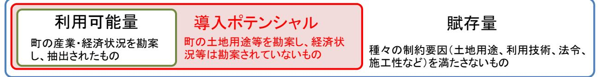
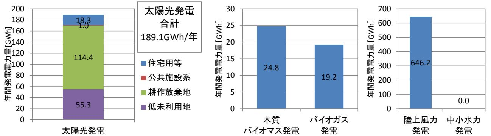

# 再生可能エネルギー導入ポテンシャルの推計

# 【導入ポテンシャルの位置づけ】

賦存量から浪江町の土地・建物用途等を勘案し、再生可能エネルギーによる設備容量の導入ポテンシャルを推計した。

### 【前提条件・推計方法等】

再生可能エネルギーに関するゾーニング基礎情報整備報告書(環境省平成 22 年度~平成 24 年度)等の参考文献に示された推計手法と一部、浪江町の推計データを基に算出した。

- (1)対象再生可能エネルギーの種別
・太陽光・バイオマス・陸上風力・中小水力(参考文献の算出値を引用)

- (2)太陽光発電の導入ポテンシャルの算出方法
	- 住宅用等:建物用途・規模別による設置面積から設備容量を算出し、福島県の発電量係数を用いて年間発電量を推計した。(一部、参考文献の算出値を引用)
	- 公共施設系:浪江町公共施設総合管理計画から設置面積を算出し、設置面積に設置係数を乗じて設備容量を算出し、福島県の発電量係数を用いて年間発電量を導出した。
	- 耕作放棄地:2010 年世界農業林業センサスよる浪江町の耕作放棄地面積の統計値を用いて設置面積を把握し、公共施設系と同様に年間発電量を算出した。
	- 低・未利用地:平成 25 年世帯土地統計調査より、福島県内の宅地面積に対する、現住居以外の所有地のうち「屋外駐車場」「資材置き場」「その他」として利用されている敷地の面積及び 「利用していない(農地、空き地など)」敷地面積の割合を算出し、これに平成 28 年度固定資産の価格等の概要調書から把握した浪江町の宅地面積を乗じて設置面積を推計した。年間発電量の推計は公共施設系と同様。
- (3)バイオマスの算出方法
	- 木質バイオマス:福島県木質バイオマス安定供給指針(平成 25 年 3 月)に記載の算出方法と磐城地域森林計画書を参考に、流域面積から浪江町の面積割合を算出し、それらに林地残材量、製材残渣量を指針に沿ってポテンシャルを推計した。含水率や発電効率は平均的な値を見込み算出した。
		- バイオガス:廃棄物系バイオマス利活用導入マニュアル、福島県浪江町畜産累年統計(農水省 2005 年)より畜産頭数と、都道府県・市町村バイオマス活用推進計画作成の手引き(農水省平成 24 年 9 月)から家畜糞尿の排出原単位を用いて試算した。
- (4)陸上風力の導入ポテンシャルの算出方法

年平均風速が 5.5~8.5m/s以上の面積を抽出し、1 万kW/1km2を配置基準とし設備容量を算出された値から設備稼働率を日本風力発電協会の平均設備稼働率等を乗じて年間発電量を算出した。

### 再生可能エネルギー導入ポテンシャルの推計

#### 【検討結果】

太陽光発電は設備容量約 189MW(年間発電量約 189.1GWh)、バイオマス発電(木質+バイオガス)は、設備容量約 5.5MW(年間発電量約 44GWh)、陸上風力発電は設備容量約 397MW(年間発電量約 646GWh)という試算結果となった。ただし、バイオマス発電は、将来的なポテンシャルとしては見込める可能性があるものの現状では、放射線量問題からすぐに導入が期待されるものではない。

中小水力発電は、賦存量 3MWであったが導入ポテンシャルとしては、0MWという結果が参考文献から得られている。

表太陽光発電、陸上風力発電、バイオマス発電、中小水力発電の導入ポテンシャル推計試算

|  | 導入 ポテンシャル | 太陽光発電 |       |           |            | 木質バイオマス | バイオガス | 陸上風力  | 中小水力 |
|--|--------------|-------|-------|-----------|------------|---------|-------|-------|------|
|  |              | 住宅用等  | 公共施設系 | 耕作放 棄地 | 低・未利 用地 | 発電      | 発電    | 発電    | 発電   |
|  | 設備容量[MW]     | 17.8  | 1.0   | 111.0     | 53.7       | 3.1     | 2.4   | 397.9 | 0    |
|  | 年間発電量[GWh]   | 18.3  | 1.0   | 114.4     | 55.3       | 24.8    | 19.2  | 646.2 | 0    |

図太陽光発電、陸上風力発電、バイオマス発電、中小水力発電の導入ポテンシャルによる年間発電量