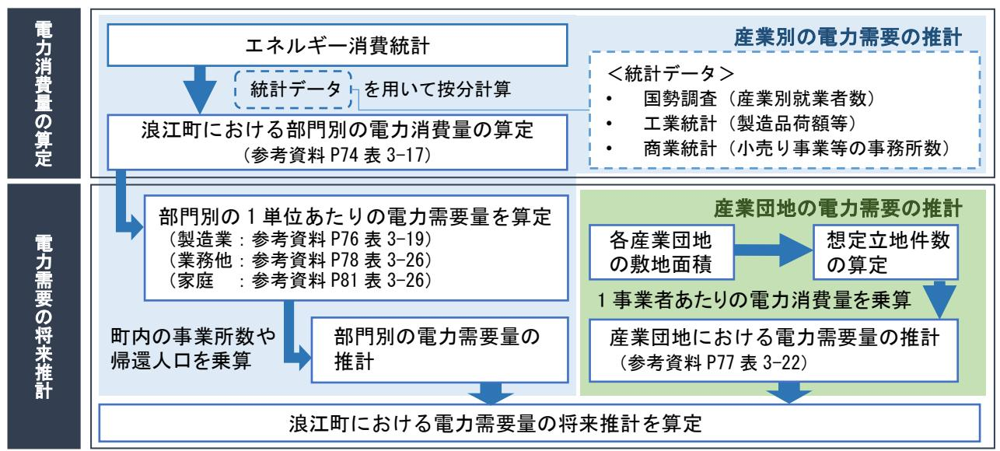
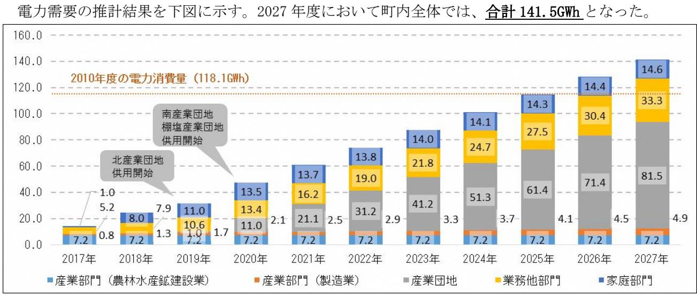
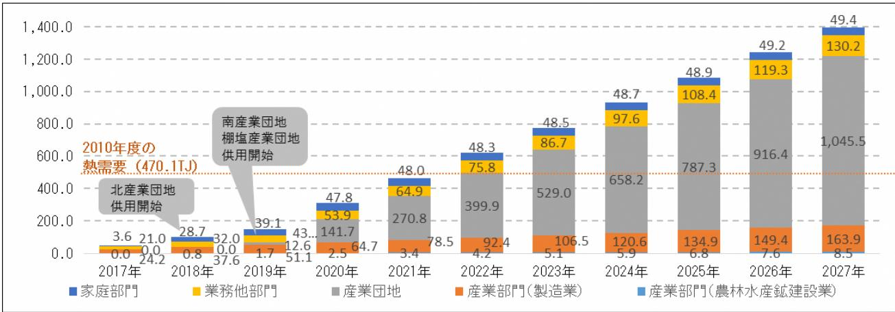

## 町内のエネルギー需要予測

### 1.町内の電力需要の予測

### 【前提条件・計算方法等】

経済産業省資源エネルギー庁のエネルギー消費統計における「都道府県別エネルギー消費統計」 より、福島県の電力消費量から各種統計データを用いて浪江町における産業や家庭等の部門別の電力消費量を推計し、部門別に設定した単位(人口、事業所数)あたりの電力消費量から部門別の電力需要量を推計した。なお、帰還人口の推計では先行して避難指示区域が解除された南相馬市小高地区の帰還状況の推移を参考に推計を行った。

また、町内の産業団地を対象に、経済産業省の工場立地動向調査から事業者の想定立地件数を算定し、1 事業者あたりの電力消費量を乗じて産業団地における電力需要量を算定した。北産業団地、南産業団地、棚塩産業団地共用開始後 2021 年以降については、段階的に需要が増加していくと想定した。

<電力需要の将来推計フロー>

# 【結果】

図浪江町における電力需要量(GWh)の推計結果

# 町内のエネルギー需要予測

## 2.町内の熱需要の予測

熱需要の予測は、電力需要の将来推計のフローと同様の手法で、「熱」「軽質油製品」「重質油製品」「石油ガス」について需要量を推計した。

総熱需要の推計結果を下図に示す。2027 年度において町内全体では、合計 1,397.5TJとなった。

図浪江町における総熱需要量(TJ)の推計結果