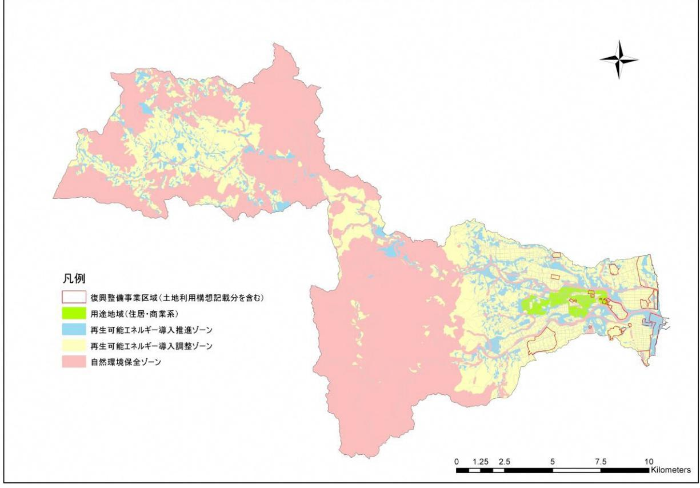

## 再生可能エネルギーの導入推進に向けたゾーニング

## 【土地利用規制等に基づくゾーニングの検討】

本町における再エネの導入に際して、開発候補地の選定を行うにあたり、関連する土地利用規制等を整理し、町域を以下の3つのゾーンで分類した。

- (1) 自然環境保全ゾーン
自然環境の保全を第一とし、大型の再エネ設備の導入を制限するゾーン

- 対象・・・森林区域(国有林・保安林)、自然公園区域(特別地域)、鳥獣保護区・特別保護地区、河川区域・河川保全区域
- (2) 再生可能エネルギー導入調整ゾーン周辺環境への調和の観点から、大型の再エネ設備の導入については調整を要するゾーン
	- 対象・・・地域森林計画対象民有林、農用地区域、ほ場整備事業区域、土地改良総合整備事業区域、農地開発事業区域
- (3) 再生可能エネルギー導入推進ゾーン

大型の再エネ設備の導入を推進するゾーン

対象・・・(1)および(2)を除く地域 ※但し、用途地域(住居・商業系)は含まない

## 【検討結果】

ゾーニング検討結果は下図の通りである。ただし、復興整備事業の実施が検討されている区域(浪江町復興整備計画及び土地利用構想図に記載されている区域)については復興整備事業担当部局と調整を要するものとする。

図ゾーニング検討結果