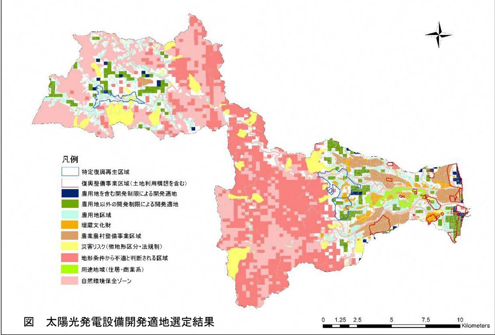
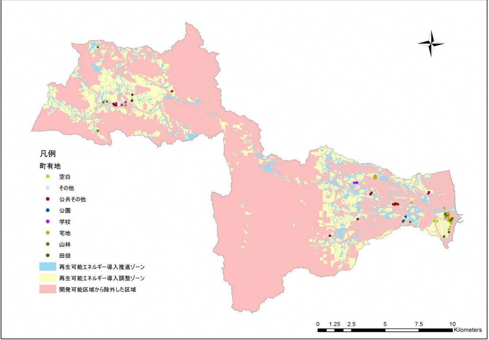

### 再生可能エネルギー導入適地選定

#### 【選定方法】

| 1.以下の5項目の条件を設定し、再生可能エネルギーの開発に適さない地域(開発不適地)を抽出        |  |  |  |  |  |
|------------------------------------------------------|--|--|--|--|--|
| (1)地形条件                                              |  |  |  |  |  |
| 国土地理院の 10m メッシュ標高データ等により、地形の複雑な地域を抽出し、開発不適地    |  |  |  |  |  |
| とした。                                                 |  |  |  |  |  |
| (2)微地形区分による災害リスクの評価                                  |  |  |  |  |  |
| 「揺れやすさ」及び「液状化」リスクが非常に大きいと評価される「砂洲・砂丘間低地」「旧           |  |  |  |  |  |
| 河道」「埋立地」を開発不適地とした。                                   |  |  |  |  |  |
| (3)防災関連法に基づく災害リスクの評価                                 |  |  |  |  |  |
| 急傾斜地崩壊危険区域、地すべり防止区域に相当する区域を開発不適地とした。                 |  |  |  |  |  |
| (4)埋蔵文化財                                             |  |  |  |  |  |
| 埋蔵文化財分布図(平成 14 年 3 月改訂)に示される地点を開発不適地とした。 |  |  |  |  |  |
| 2.環境省等の資料から再生可能エネルギー導入ポテンシャル分布状況を整理                  |  |  |  |  |  |
| 太陽光発電、陸上・洋上風力発電について、採算ベースに乗る可能性がある一定以上のエ             |  |  |  |  |  |
| ネルギーポテンシャルを有する区域を抽出した。                               |  |  |  |  |  |
| 3.国等の補助を受けて実施している事業・実施予定の区域を除外                       |  |  |  |  |  |
| (1)復興整備事業の実施が検討されている区域                               |  |  |  |  |  |
| 復興整備計画に記載されている復興整備事業の区域及び土地利用構想図に記載されている             |  |  |  |  |  |
| 復興事業の予定区域を除外した。                                      |  |  |  |  |  |
| (2)農業農村整備事業区域                                        |  |  |  |  |  |
| ほ場整備事業、土地改良総合事業、農地開発事業の事業区域を除外した。                    |  |  |  |  |  |
| 4.上記1.で抽出した開発不適地と2.で整理した再エネポテンシャル、3.で整理した除外区域の重ね     |  |  |  |  |  |
| 合わせによる開発候補地の選定                                       |  |  |  |  |  |

再生可能エネルギー(太陽光発電、陸上・洋上風力発電)それぞれについて、再エネ導入ポテンシャルを有し、かつ開発不適地及び除外区域に含まれない区域を 250mメッシュ単位で抽出し、開発適地を抽出した。

# 再生可能エネルギー導入適地選定

#### 【選定結果】

太陽光発電における開発候補地の選定結果は下図のとおりである。青色(農用地を含む開発制限による開発適地)と緑色(農用地以外の開発制限による開発適地)が開発候補地である。

陸上・洋上風力発電については、平野部及び沿岸部には開発候補地は存在しない結果となった。

上記青色及び緑色のメッシュに含まれる土地利用について、国土数値情報「土地利用細分メッシュデータ」(100mメッシュ、メッシュに含まれる土地利用種別から最も面積割合の大きな土地利用種別をそのメッシュの土地利用種別とする。)から土地利用種別ごとのメッシュ数、面積を把握した。

| 土地利用種別  | 農用地以外の開発制限による開発適 地内の土地利用 |         | うち、農用地を含む開発制限による開 発適地内の土地利用 |        |                                                               |
|---------|-----------------------------|---------|--------------------------------|--------|---------------------------------------------------------------|
|         | メッシュ数                       | 面積(ha)  | メッシュ数                          | 面積(ha) |                                                               |
| 田       | 539                         | 551.0   | 3 0                         | 30.7   | ※約 1.5haで、太陽光発電                                              |
| その他の農用地 | 483                         | 493.5   | 9 0                         | 92.0   | 所 1MWの開発面積に相当 する。(太陽光発電事業の 環境保全対策に関する自 治体の取組事例集環境省 |
| 森林      | 985                         | 1,006.6 | 357                            | 364.9  |                                                               |
| 荒地      | 2 6                      | 26.6    | 1 4                         | 14.3   |                                                               |
| 建物用地    | 106                         | 108.4   | 2 5                         | 25.6   |                                                               |
| 道路      | 2                           | 2.0     | 2                              | 2.0    |                                                               |
| 鉄道      | 4                           | 4.1     | 3                              | 3.1    | 平成 28 年 4 月)                                                  |
| その他の用地  | 9 3                      | 95.1    | 5 4                         | 55.2   |                                                               |
| 河川地及び湖沼 | 1 0                      | 10.2    | 5                              | 5.1    |                                                               |
| 海浜      | 1 5                      | 15.3    | 1 3                         | 13.3   |                                                               |
| 海水域     | 3 5                      | 35.8    | 3 2                         | 32.7   |                                                               |
| 合計      | 2,298                       | 2,348.7 | 625                            | 638.8  |                                                               |

表抽出された開発適地内の土地利用の状況

データ出典:国土数値情報「土地利用細分メッシュ(平成 26 年)」

# 再生可能エネルギー導入適地選定

### 【参考】

早期の再生可能エネルギー導入拡大にあたっては、町有地を活用することも一つの手段として考えられるため、町の財産台帳に記載されている町有地について、所在に記載されている住所から緯度経度を推定し、ゾーニング結果及び開発除外区域とともに図示した(再生可能エネルギー導入推進ゾーン及び再生可能エネルギー導入調整ゾーンに含まれ、開発除外区域に含まれない町有地のみ表示)。

参考図開発が可能と判断される区域における町有地の状況