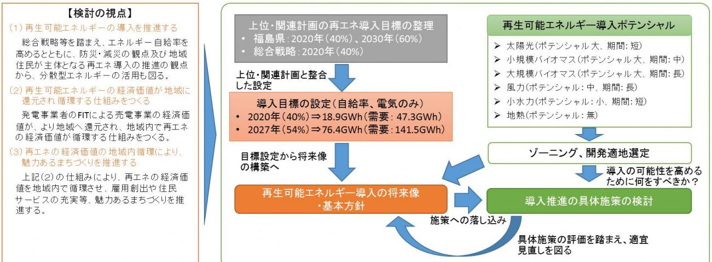
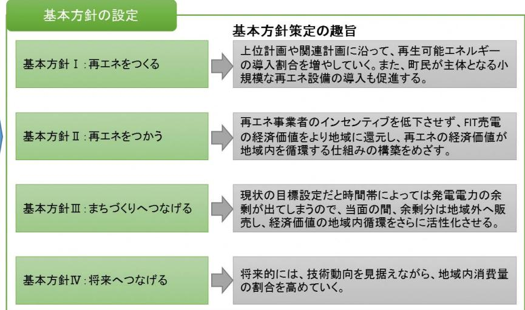

## 再生可能エネルギーの導入目標(将来像)及び基本方針

### 【検討の視点】

- (1)再生可能エネルギーの導入を推進する総合戦略等を踏まえ、エネルギー自給率※1を高めるとともに、防災・減災の観点及び地域住民が主体となる再エネ導入の推進の観点から、分散型エネルギーの活用も図る。 ※1 エネルギー自給率=地域内の再生可能エネルギー発電量/地域内のエネルギー需要
- (2)再生可能エネルギーの経済価値が地域に還元され循環する仕組みをつくる発電事業者のFIT※2による売電事業の経済価値が、より地域へ還元され、地域内で再エネの経済価値が循環する仕組みをつくる。

※2 固定価格買取制度

- (3)再エネの経済価値の地域内循環により、魅力あるまちづくりを推進する上記(2)の仕組みにより、再エネの経済価値を地域内で循環させ、雇用創出や住民サービスの充実等、魅力あるまちづくりを推進する。
# 【検討フロー】

### 【検討結果】

- 
- 
- 
- 
- 
- 

