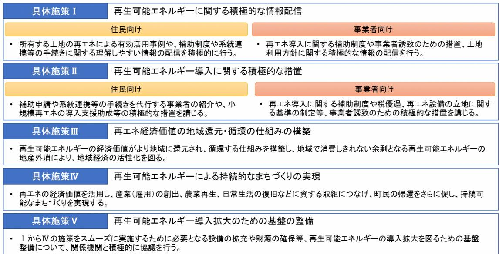
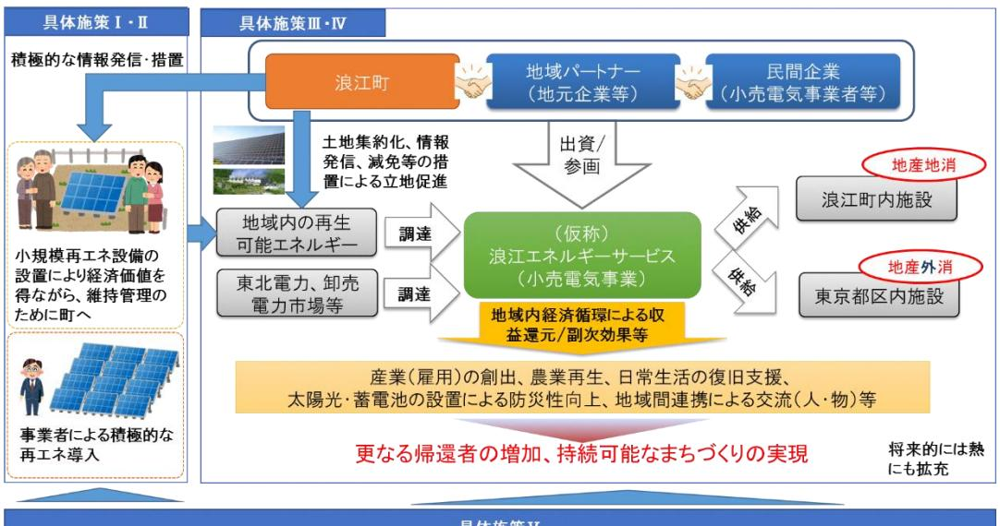

## 【検討の視点】

基本方針を踏まえ具体政策を検討するにあたり、次のことに留意した。

- 再生可能エネルギーを通して住民が地域に足を運び、帰還につながる施策とすること。
- 事業者のインセンティブを呼び起こし、町民を巻き込んだ民間活力による再生可能エネルギーの導入拡大につながる施策とすること。
- 自然環境や営農環境と調和した再生可能エネルギー設備の導入につながる施策とすること。
- 再生可能エネルギーの経済価値を地域に取り込み、地域で循環させ、持続的なまちづくりにつながる施策とすること。
- 町は再生可能エネルギーの導入拡大がスムーズになされるよう基盤を整える施策を実施すること。

## 【具体施策】

上記を踏まえ次の具体施策を検討した。特にⅢ、Ⅳについては、民間活力も十分に活用した事業とし、より一層の復興の加速化を図る。

## 【具体施策の全体イメージ】

