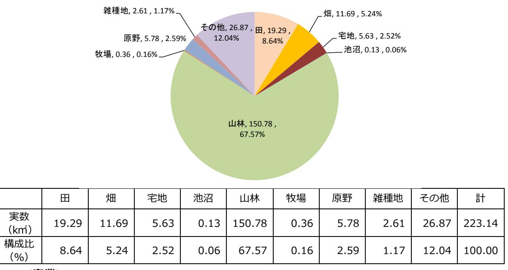

2 月 7 日版

# **浪江町再生可能エネルギー推進計画**

# **(案)** 検討案

# 平成 30 年 3 月

福島県浪江町

| 目 | 次(案) |
|---|------|

| 第1章         | 計画策定の趣旨------------------------------------------------------------          |
|-------------|------------------------------------------------------------------------------|
| (1)         | 計画策定の目的--------------------------------------------------------------        |
| (2)         | 国・県のエネルギーの動向に関わる整理 -------------------------------------                  |
| (3)         | 浪江町の概要(東日本大震災前)--------------------------------------------                  |
| (4)         | 浪江町の概要(東日本大震災後)--------------------------------------------                  |
| 第2章         | 上位計画・関連計画 -------------------------------------------------------         |
| (1)         | 復興計画及びエネルギーに関する取組み -------------------------------------                  |
| (2)         | 復興事業等の概要 -----------------------------------------------------------      |
|             |                                                                              |
| 第3章         | 浪江町における再生可能エネルギーと取巻く状況----------------------------                           |
| (1)         | 人口推計の整理--------------------------------------------------------------        |
| (2)         | 再生可能エネルギーの導入ポテンシャルの推計 ------------------------------                      |
| (3)         | 浪江町の電力需要の予測-----------------------------------------------------             |
| 第 4 章 | 再生可能エネルギー導入推進のためのゾーニングと開発適地-----------------                                 |
| (1)         | 開発に関する土地利用規制の概要と土地利用規制に基づくゾーニング--------                                      |
| (2)         | 開発適地の選定--------------------------------------------------------------        |
| 第 5 章 | 再生可能エネルギーの導入目標と将来像及び基本方針 -----------------------                          |
| (1)         | 導入目標と将来像の視点-----------------------------------------------------             |
| (2)         | 基本方針 -------------------------------------------------------------------- |
| (3)         | 計画期間 -------------------------------------------------------------------- |
|             |                                                                              |
| 第6章         | 再生可能エネルギー導入推進のための具体施策------------------------------                          |
| (1)         | 具体施策の概要と視点 -------------------------------------------------------        |
| (2)         | 具体施策 -------------------------------------------------------------------- |
| 第7章         | 再生可能エネルギー導入推進のためのモデル事業----------------------------                           |
| (1)         | モデル事業の概要 -----------------------------------------------------------      |
| (2)         | 事業者意向調査の概要 -------------------------------------------------------        |
| 第8章         | 再生可能エネルギー導入のロードマップ ------------------------------------                   |
| (1)         | 計画に向けた短期・中長期のロードマップ-----------------------------------                       |
|             |                                                                              |
| 第9章         | 再生可能エネルギー導入の推進体制 ----------------------------------------                 |
|             |                                                                              |

|         | 資料編---------------------------------------------------------------------------- |
|---------|---------------------------------------------------------------------------------|
|         |                                                                                 |
| 資料1     | 導入ポテンシャルの推計方法----------------------------------------------                     |
| 資料 2 | エネルギー需要予測の推計方法--------------------------------------------                      |
| 資料 3 | 事業者意向調査結果の補足 ------------------------------------------------                |

# **第1章計画策定の趣旨**

#### **(1) 計画策定の目的**

浪江町では、復興計画(第二次)において「エネルギーの地産地消」チャレンジが提言され、エネルギーの地産地消を住民生活の中に定着させていくことをチャレンジの柱としています。

このような中で、国道6号と浪江町役場を中心としたエリアを核としたまちづくりを進めていくとともに、再生可能エネルギー等の導入やスマートコミュニティの整備等を推進し、町民一人ひとりのエネルギーの有効活用に関する意識向上や、エネルギーの見える化を通じた普及促進により、エネルギーの地産地消の先進モデルの町を目指して、新しい浪江の礎をつくることを計画しています。

さらに、復興まちづくりと歩調を合わせた再生可能エネルギーの導入とエネルギーマネジメントを加速的に推進するためには、より具体的な「再生可能エネルギー推進計画」が必要であり、計画に沿った復興まちづくりを行うことが重要であると考えています。

そのため、復興計画及び国・県などの上位計画と整合性を図り、浪江町の将来イメージやその実現に向けた方策などを示す「浪江町再生可能エネルギー推進計画」を策定し、それを基に再生可能エネルギーの活用や関連産業の育成に努め、持続可能な浪江町を目指します。

#### **(2) 国・県のエネルギーの動向に関わる整理**

#### **①国のエネルギー施策の動向**

浪江町に関わる国のエネルギー施策の動向としては、おおきく以下の 3 つが挙げられます。特に、福島イノベーション・コースト構想と福島新エネ社会構想については、福島県における復興に向けた施策が計画されており、福島県復興計画と関連性を持っています。

- ●長期エネルギー需給見通し
- ●福島イノベーション・コースト構想
- ●福島新エネ社会構想

#### **②福島県のエネルギー施策の動向**

#### **<福島県復興計画(第 3 次)>**

福島県復興計画(第 3 次)では、主要施策として、復興へ向けた 10 の重点プロジェクトが計画されています。その中で、主に「8.新産業創造プロジェクト」の中に、再生可能エネルギーの関連事項が位置付けられており、

「原子力に依存しない、安全・安心で持続的に発展可能な社会の実現と、再生可能エネルギー「先駆けの地」を目指し、再生可能エネルギーの導入拡大や技術開発・実用化を通じた関連産業の集積と省エネルギーを推進し、2040年頃を目標に県内エネルギー需要100%相当量を再生可能エネルギーで生み出す社会の実現する」という方向性が示されています。 その実現にむけ、短期的には 2020 年までに 40%の導入目標が掲げられています。

県復興計画の中の地域別の取組として、浪江町の位置する双葉エリアでは、「新産業の創造」や「再生可能エネルギー等の導入等の推進」として、以下のように、再生可能エネルギーに関連する取組が明記されています。

a) スマート・エコパーク

「新産業の創造」の中で「福島イノベーション・コースト構想」の一つとして示されている。県内産業基盤を強化するとともに、新たなリサイクル事業を生み出し、浜通り地域を中心に環境・リサイクル産業の集積を目指す。

b) エネルギー関連産業プロジェクト

「新産業の創造」の中で「福島イノベーション・コースト構想」の一つとして示されている多岐にわたるプロジェクトを通じて、浜通りのポテンシャルを生かした産業の集積を目指している。

c) 再生可能エネルギー等の導入等の推進

再生可能エネルギーの研究開発拠点と連携し、本エリアにおいてポテンシャルの高い太陽光や風力発電などの先進地として再生可能エネルギーの導入を図るとともに、浮体式洋上風力発電システムの安全性、信頼性、経済性を検証するため、福島洋上風力コンソーシアムが広野町・楢葉町沖で「浮体式洋上風力発電実証研究」の推進を図っている。

さらに、クリーンコールの拠点を目指し、復旧した東京電力広野火力発電所(広野町)、常磐共同火力勿来発電所(いわき市)において、高効率石炭火力発電(IGCC)の整備が進められています。

**<福島県再生可能エネルギー推進ビジョン(改訂版)>**

福島県再生可能エネルギー推進ビジョン(改訂版)では、以下のとおりに再生可能エネルギーに係る方針、目標、施策が示されています。

【基本方針】

環境面「環境への負荷の少ない低炭素・循環型社会」の実現

復興面「原子力に依存しない、安全・安心で持続的に発展可能な社会づくり」と「再生可能エネルギーの飛躍的な推進による新たな社会づくり」の実現

【導入目標】

2020 年には県内の一次エネルギー供給に占める再生可能エネルギーの割合が約 40%

#### **(3) 浪江町の概要(東日本大震災前)**

**<位置・沿革>**

浪江町は、福島県相双地域のほぼ中央にあって、いわき市の北約 60km、仙台市の南約 90kmに位置しており、東は太平洋に面し、西側は阿武隈高地となり、町中央部を請戸川と高瀬川が流れる自然環境豊かな町です。

明治時代には、国鉄常磐線開通で輸入港の機能を失い、産業機能の中心が浪江に移り、陸前浜街道を中心とした市街地が形成され、南北方向に一般国道 6 号とJR常磐線、東西方向に一般国道 114 号が走る交通の要衝として発展してきており、近年、常磐自動車道の延伸とインターチェンジの整備が進められました。

**<気象>**

【気温・雨量】

浪江町の気候は、太平洋側の平坦部は東日本型気候を呈し、年平均気温が 12.3℃、平均最低気温は 1 月の 2.1℃、平均最高気温は 8 月の 28.3℃と比較的温暖な気候で、降雨は 7 月~10 月にかけて多く、年間降水量は 1,500 ㎜程度です。一方、阿武隈高地に位置する山間部は、寒暖差の大きい内陸性の気候を呈し、特に冬場は厳しい冷え込みとなりますが、比較的降雪量は少なく、年間を通じて温暖で住みよい環境となっています。

【風況】

浪江町の風向は、3 月~9 月は東南東~南南東からの季節風が、10 月~3 月は西~北西からの季節風が、それぞれ支配的になっており、風が強い季節は 9 月~12 月と 2 月~3 月で、最大瞬間風速 20m~25m/s程度となりますが、初夏から台風時期までは比較的穏やかな風況となります。

|           | 1 月   | 2 月   | 3 月   | 4 月   | 5 月   | 6 月   | 7 月   | 8 月   | 9 月   | 10 月  | 11 月  | 12 月  | 年      |
|-----------|-------|-------|-------|-------|-------|-------|-------|-------|-------|-------|-------|-------|--------|
| 最高気温(℃)   | 7.1   | 7.4   | 10.3  | 15.9  | 20.2  | 22.6  | 26.2  | 28.3  | 24.7  | 19.9  | 15.1  | 10.2  | 17.3   |
| 平均気温(℃)   | 2.1   | 2.3   | 5.1   | 10.4  | 14.9  | 18.2  | 22.0  | 23.8  | 20.1  | 14.6  | 9.4   | 4.8   | 12.3   |
| 最低気温(℃)   | -3.0  | -2.9  | -0.3  | 4.8   | 9.6   | 14.2  | 18.5  | 20.1  | 16.2  | 9.4   | 3.6   | -0.5  | 7.5    |
| 降水量(mm)   | 48.9  | 53.4  | 91.8  | 126.9 | 124.0 | 158.2 | 182.5 | 171.2 | 241.2 | 192.7 | 78.8  | 41.4  | 1511.0 |
| 平均風速(m/s) | 1.8   | 1.8   | 2.0   | 2.0   | 1.7   | 1.4   | 1.2   | 1.3   | 1.2   | 1.3   | 1.5   | 1.7   | 1.6    |
| 日照時間(時間)  | 159.8 | 157.0 | 176.7 | 190.6 | 184.9 | 143.2 | 136.3 | 162.8 | 121.2 | 137.8 | 146.5 | 152.5 | 1871.6 |

**<人口・世帯数>**

国勢調査における浪江町の人口は、昭和 60 年の 23,595 人をピークに以降減少傾向にあり、東日本大震災直前の平成 22 年には 20,905 人となり、昭和 60 年に比べ約 11.4% の減少となっています。

世帯数は、一貫して増加傾向にあり、平成 22 年には 7,171 世帯となっており、年齢別人口は、年少人口及び生産年齢人口の減少傾向の一方で、老年人口は増加傾向にあり、平成 12 年には年少人口と老年人口が逆転し、老年人口が年少人口を上回る結果となっています。年少人口については、昭和 60 年の 5,563 人をピークに減少が続き、平成 22 年には 2,719 人まで減少し、昭和 60 人の約 48.9%と半数以下に減少していています。生産年齢人口も昭和 60 年の 15,039 人をピークに減少が続き、平成 22 年には 12,550 人と昭和 60 年の約 16.6%の減少となっています。一方、老年人口は増加傾向にあり、昭和 55 年の 2,495 人から平成 22 年には 5,548 人と約 2.2 倍に増加しています。

#### **<土地利用>**

浪江町の土地利用は、町全体の 70%近くを山林が占め、田及び畑が合計で約 14%となっている。宅地は、町全体の 2.52%、5.63k ㎡にとどまっています。中心市街地はJR常磐線浪江駅の東側に形成され、商業施設とともに町役場、郵便局、警察署、消防署等の行政施設が集積しています。工業系土地利用は、海側の市街地の北部及び南部に工業団地が位置づけられており、市街地周辺には請戸川や高瀬川等の河川、優良農地、山林など豊かな自然環境があり、市街地外の土地利用の多くは、山林、農地等の豊かな自然が特色となっています。 地目別地積(単位:k㎡、%)

**<産業>**

東日本大震災前の浪江町では、平成 8 年から平成 21 年の間の全事業所の事業所数や従業者数は、いずれも概ね横ばい傾向となり、平成 8 年から平成 21 年の間に事業所数は 1,204 から 1,136 と 5.6%程度の減少にとどまり、従業者数は 8,975 人から 8,323 人へ 7.3%程度の減少となっています。

浪江町事業所数・従業者数

浪江町の平成 21 年産業大分類別事業所の従業者数のうち、最も多くを占めるのは「卸売業、小売業」の 1,820 人 21.9%で、次いで「建設業」の 1,349 人 16.2%、「製造業」 の 1,172 人 14.1%と続いており、卸売業、小売業、建設業、製造業が中心の事業所従業者構成となっています。

#### **(4) 浪江町の概要(東日本大震災後)**

平成 23 年 3 月 11 日の東日本大震災とそれに伴う東京電力福島第一原子力発電所事故により、浪江町は全町避難を強いられていましたが、平成 29 年 3 月 31 日、「帰還困難区域」 を除いて、町内全域に出されていた避難指示が解除されました。

交通インフラの改善に係るものとして、平成 26 年 9 月に国道 6 号が、平成 27 年 3 月に常磐自動車道が全線で通行可能となり、平成 29 年 10 月現在でJR浪江駅まで運行されているJR常磐線は、平成 31 年度末までの全線開通を目指しています。

浜通り地域における産業基盤の構築に係るものとしては、福島イノベーション・コースト構想において、廃炉やロボット、エネルギー等に係るプロジェクトが進行しています。

浪江町では、平成 29 年 3 月に策定した「浪江町復興計画【第二次】」に基づいて、既存産業と新たな産業が地域経済を支える浜通りの中核都市の実現を目指す復興への取り組みが始められています。

出典:「風評被害の払拭に向けて」(2017 年 4 月復興庁)

# **第2章上位計画・関連計画**

#### **(1) 復興計画及びエネルギーに関する取組み**

浪江町では、東日本大震災後の状況を踏まえ、復興への取組を進めるため、次のような計画等が策定されています。

- 浪江町復興ビジョン(平成 24 年 4 月浪江町)
- 浪江町復興まちづくり計画(平成 26 年 3 月浪江町)
- まち・ひと・しごと創生浪江町人口ビジョン(平成 28 年 3 月浪江町)
- ひと・しごと創生浪江町総合戦略(平成 28 年 3 月浪江町)
- 避難指示解除に関する有識者検証委員会報告書 (平成 28 年 3 月避難指示解除に関する有識者検証委員会)
- 浪江町復興ビジョン検討会議中間報告書(平成 28 年 12 月)
- 浪江町中心市街地再生計画(平成 29 年 3 月浪江町)
- **浪江町復興計画【第二次】(平成 29 年 3 月浪江町)**

浪江町復興計画【第二次】では、復興計画【第一次】の「復興の理念」、「復興の基本方針」を踏襲し、復興計画【第一次】策定後に浪江町で策定された全ての計画・報告を踏まえ、その要素をすべて包含しています。(浪江町復興まちづくり計画、まち・ひと・しごと創生浪江町総合戦略、避難指示解除に関する有識者検証委員会報告書等)復興計画【第二次】は、復興計画【第一次】の策定後の状況の変化を踏まえ、今後、町が進むべき方向をより具体的に示すことに重点を置きました。復興計画【第二次】に記載のない具体的な取組については、詳細が検討でき次第、個別計画に盛り込んでいます。

浪江町復興計画【第二次】をはじめとする各種計画では、再生可能エネルギーに関する内容にも触れられていますが、具体の計画は本計画において再生可能エネルギーの導入推進を図っていきます。

**<浪江町復興計画【第二次】における復興の理念>**

**<浪江町復興計画【第二次】における復興の基本方針>**

# **(2) 復興事業等の概要**

平成 30 年 3 月現在、浪江町復興に向けて主として帰還困難区域を除く海側エリアで復興事業等が進められています。浪江町の概ねの都市構成は、既存中心市街地を含む都市計画区域内用途地域(主要部)を中心に、周囲に農地が拡がり、農地の間に産業団地整備事業が進められています。東日本大震災後に指定された「災害危険区域」及び「帰還困難区域」について整理するとともに、既存中心市街地等に係る「都市計画用途地域(主要部)」 と「農業振興地域」について復興事業と合わせて以下に整理します。

#### **<浪江町の主要な復興事業・計画等位置図>**

# **第3章浪江町における再生可能エネルギーと取巻く状況**

#### **(1) 人口推計の整理**

浪江町では、東日本大震災後の状況を踏まえ平成 28 年 3 月に「浪江町人口ビジョン」 を策定しました。本計画では、「浪江町再生可能エネルギー推進計画」の計画条件検討に係るものとして、「浪江町人口ビジョン」から町の人口の将来推計の整理を行いました。

この「浪江町人口ビジョン」において設定された展望人口を、「まち・ひと・しごと創生浪江町総合戦略」においても「町の展望人口」として位置づけ、総合戦略の基本目標と施策を設定しています。

上記総合戦略のなかでは、東日本大震災による全町避難により居住人口がゼロという、町が置かれている状況から、国が示す 2060 年までの長期的な人口の推移を見通すことは難しい状況にあるため、2035 年に中期的な目標人口を設定し、今後の状況の変化に対応しながら町の将来の展望人口を設定しています。

復興庁から発表された「福島県 12 市町村将来像」における人口推計や、福島県の人口ビジョンを参考に、居住人口の総数を 2035 年までの中期的な目標人口を 8,000 人とし、平成 27 年度の住民意向調査の帰還意向を基に、避難指示解除後の 5,000 人と設定しています。、また、2035 年の人口の内訳は、段階的に帰還する町民の増加や新たな住民の受け入れ人口が 6500 人、町内に居住する新産業従事者が 1500 人と想定しています。

なお、平成 29 年 1 月末時点の居住人口は 482 人となっており、居住人口の増加に向けてより一層の復興推進を行っていく必要があります。

#### **(2) 再生可能エネルギーの導入ポテンシャルの推計**

再生可能エネルギーの推進にあたり、町の現状においてどの程度再生可能エネルギーのポテンシャルがあるのか、各種文献を参考に推計を行ないました。なお、導入ポテンシャルは、賦存量から町の土地用途等を勘案し、経済状況等は考慮されていないものとして定義します。最終的な利用可能量については、今後の事業者意向調査を踏まえ算出するものとします。

町の産業・経済状況を勘案し、抽出されたもの

町の土地用途等を勘案し、経済状況等は勘案されていないもの

種々の制約要因(土地用途、利用技術、法令、施工性など)を満たさないもの

#### **<太陽光発電、風力発電、小水力発電の推計方法>**

平成 22 年度再生可能エネルギー導入ポテンシャル調査(環境省)

・平成 23 年度再生可能エネルギーに関するゾーニング基礎情報整備報(環境省)

・平成 24 年度再生可能エネルギーに関するゾーニング基礎情報整備報(環境省)

太陽光発電、風力発電、小水力発電の推計には、上記の既往文献を参考に算出しました。

#### **<バイオマス発電の推計>**

バイオマス発電の推計は、木質系バイオマス発電と廃棄物系バイオマス発電の 2 種類に分けて導入ポテンシャルを推計しました。廃棄物系バイオマス発電については、東日本大震災前の家畜頭数を参考にし、長期的な導入を見据えた試算としています。

※推計に関わる詳細については、巻末の資料編を参照のこと。

#### **<導入ポテンシャルの推計結果>**

導入ポテンシャルを推計すると、太陽光発電は設備容量約 189MW(年間発電量約 189.1GWh)、バイオマス発電(木質+バイオガス)は、設備容量約 5.5MW(年間発電量約 44GWh)、陸上風力発電は設備容量約 397MW(年間発電量約 646GWh)の導入ポテンシャルがあるという結果となります。ただし、バイオマス発電は、将来的なポテンシャルとしては見込める可能性があるものの、現状では、放射線量問題からすぐに導入が期待されるものではないことに留意する必要があります。

中小水力発電は、賦存量 3MWではありましたが、導入ポテンシャルとしては、0MWという結果が既往文献から得られています。

| 導入ポテンシャル   | 太陽光発電 |       |       |        |  |  |  |  |
|------------|-------|-------|-------|--------|--|--|--|--|
|            | 住宅用等  | 公共施設系 | 耕作放棄地 | 低・未利用地 |  |  |  |  |
| 設備容量[MW]   | 17.8  | 1.0   | 111.  | 53.7   |  |  |  |  |
| 年間発電量[GWh] | 18.3  | 1.0   | 114.4 | 55.3   |  |  |  |  |

| 導入ポテンシャル   |            | バイオマス発電     | 陸上風力発電 | 中小水力発電 |  |
|------------|------------|-------------|--------|--------|--|
|            | 木質系バイオマス発電 | 廃棄物系バイオガス発電 |        |        |  |
| 設備容量[MW]   | 3.1        | 2.4         | 397.9  | 0      |  |
| 年間発電量[GWh] | 24.8       | 19.2        | 646.2  | 0      |  |

【電力の単位WとWhについて】

W(ワット)とは電力の単位で、Wh(ワットアワー)とは電力量の単位です。

水に例えると、電力の単位であるWは水の勢いで、Whはその水がたまった量になります。

導入ポテンシャルに記載の設備容量MWとは、瞬間的に発電する電力を意味しており、発電量GWhとは、その設備が発電した電力量を意味しています。

【G(ギガ)、M(メガ)について】

GW(ギガワット)、MW(メガワット)のように示すことがありますが、G(ギガ)、M(メガ)とは、単位に対する大きさを表わすもので、GW、MWであれば、電力の単位であるWの大きさを表わします。 (参考)1GW = 1000MW = 1000,000kW = 1000,000,000W

#### **(3) 浪江町の電力需要の予測**

町の電力需要の予測は、経済産業省資源エネルギー庁のエネルギー消費統計における「都道府県別エネルギー消費統計」より、福島県の電力消費量から各種統計データを用いて浪江町における産業や家庭等の部門別の電力消費量を推計し、部門別に設定した単位(人口、事業所数)あたりの電力消費量から部門別の電力需要量を推計しました。なお、帰還人口の推計では先行して避難指示区域が解除された南相馬市小高地区の帰還状況の推移を参考に推計を行っています。

また、町内の産業団地を対象に、経済産業省の工場立地動向調査から事業者の想定立地件数を算定し、1 事業者あたりの電力消費量を乗じて産業団地における電力需要量を算定しています。北産業団地、南産業団地、棚塩産業団地共用開始後 2021 年以降については、段階的に需要が増加していくと想定しています。 <電力需要の将来推計フロー>

電力需要の推計した結果を下図に示すように、2027 年度において町内全体では、合計 141.5GWhの電力需要が予測される結果となっています。

なお、町の熱需要についても電力需要と同様に統計データを用いて、段階的に需要が増加していくことを想定し予測を行った結果、下図に示すように 2027 年度において町内全体では合計 1,397.5TJとなっています。

【熱需要量のTJ(テラジュール)について】 T(テラ)とは、G(ギガ)、M(メガ)と同様に単位の大きさを表わすもので、G(ギガ)のさらに 1000 倍の大きさを表わします。 J(ジュール)とは、エネルギーの単位の一つで、仕事量や熱量、電力量などを意味します。 なお、電力W(ワット)との関係は、単位秒あたりのJ(ジュール:電力量)が、Wとなります。 W(ワット)=J(ジュール)÷ 秒 (W=J/s) (参考)1TJ=1000GJ=1000,000MJ=1000,000,000kJ=1000,000,000,000J熱需要量で推計されたJ(ジュール)は、灯油、軽油、重油等の燃料が持つ熱量の合計を表わしています。

# **第 4 章再生可能エネルギー導入推進のためのゾーニングと開発適地**

# **(1) 開発に関する土地利用規制の概要と土地利用規制に基づくゾーニング**

町における再生可能エネルギーの導入に際して、開発適地を示すにあたり、関連する土地利用規制等を整理し、町域を以下の3つのゾーンで分類しています。

#### **<自然環境保全ゾーン>**

自然環境の保全を第一とし、大型の再エネ設備の導入を制限するゾーン

対象・・・森林区域(国有林・保安林)、自然公園区域(特別地域)、

鳥獣保護区・特別保護地区、河川区域・河川保全区域

#### **<再生可能エネルギー導入調整ゾーン>**

周辺環境への調和の観点から、大型の再エネ設備の導入については調整を要するゾーン

対象・・・地域森林計画対象民有林、農用地区域、ほ場整備事業区域、

土地改良総合整備事業区域、農地開発事業区域

#### **<再生可能エネルギー導入推進ゾーン>**

大型の再エネ設備の導入を推進するゾーン

対象・・・上記ゾーンを除く地域 ※但し、用途地域(住居・商業系)は含まない復興整備事業の実施が検討されている区域(浪江町復興整備計画及び土地利用構想図に記載されている区域)については復興整備事業担当部局と調整を要するものとします。

#### **(2) 開発適地の選定**

町における再生可能エネルギーの開発を促していくために、開発適地の選定を行なった結果を以下に示します。

**<選定方法>**

- ●再生可能エネルギーの開発に適さない地域(開発不適地)を抽出
- ●環境省等の資料から再生可能エネルギー導入ポテンシャル分布状況を整理
- ●国等の補助を受けて実施している事業・実施予定の区域の除外
- ●上記で抽出した開発不適地と再エネポテンシャル、整理した除外区域の重ね合わせによる開発候補地の選定

再生可能エネルギーそれぞれについて、再エネ導入ポテンシャルを有し、かつ開発不適地及び除外区域に含まれない区域を抽出し、開発適地を抽出しています。

太陽光発電における開発候補地の選定結果は上図のようになります。青色(農用地を含む開発制限による開発適地)と緑色(農用地以外の開発制限による開発適地)が開発候補地となっています。

# **第 5 章再生可能エネルギーの導入目標と将来像及び基本方針**

#### **(1) 導入目標と将来像**

#### **<導入目標と将来像の視点>**

#### **視点 1:再生可能エネルギーの導入の推進**

浪江町総合戦略等を踏まえ、エネルギー自給率※1 を高めるとともに、防災・減災の観点及び地域住民が主体となる再生可能エネルギー導入の推進の観点から、分散型エネルギーの活用も図ります。

※1 エネルギー自給率=地域内の再生可能エネルギー発電量/地域内のエネルギー需要量

#### **視点2:再生可能エネルギーの経済価値が地域に還元され循環する仕組みをづくり**

発電事業者のFIT※2 による売電事業の経済価値が、より地域へ還元され、地域内で再生可能エネルギーの経済価値が循環する仕組みをつくります。

※2 固定価格買取制度

#### **視点3:再生可能エネルギーの経済価値の地域内循環により、魅力あるまちづくりの推進**

視点 2 の仕組みにより、再生可能エネルギーの経済価値を地域内で循環させ、雇用創出や住民サービスの充実等、魅力あるまちづくりを推進します。

#### **<導入目標>**

福島県復興計画(第 3 次)や福島県再生可能エネルギー推進ビジョン、浪江町総合戦略で示されている計画との整合を図り、導入目標はエネルギー自給率(再生可能エネルギー由来の電気自給率)を 2020 年に 40%、2027 年に 54%を目指します。

これは、電力の需要予測から換算すると 2020 年に 18.9GWh(電力需要:47.3GWh)、 2027 年に 76.4GWh(電力需要:141.5GWh)となります。

#### **<再生可能エネルギーの導入推進による将来像>**

本計画の実行により将来像を想定し、再生可能エネルギー導入を推進します。

| 将来像                                                                 | 導入目標 ・2020年⇒自給率40%(18.9GWh) ・2027年⇒自給率54%(76.4GWh) |
|---------------------------------------------------------------------|----------------------------------------------------------|
| 周辺環境と調和した再エネ事業が地域内事業者と地域外事業者との連携により実施されています。 •                   |                                                          |
| 地域の低・未利用地が再エネ用地として有効活用されています。 •                                  |                                                          |
| 再エネの経済価値が地域内で循環し、町民の帰還につながるサービスや事業が展開され、新規定 • 住者の獲得につながっています。 |                                                          |
| 放射線量の低下により、バイオマス資源が利用可能となり、小規模バイオマス設備による熱利用 • が始められつつあります。    |                                                          |
| 長期的には再エネの地域内消費量の割合が高まり、より再エネの経済価値の循環が強まります。 •                    |                                                          |
|                                                                     |                                                          |

# **(2) 基本方針**

導入目標や、町の再生可能エネルギー導入によって期待される将来像に向けた基本方針を以下の 4 つとし、計画を推進します。

# **基本方針Ⅰ:再エネをつくる**

上位計画や関連計画に沿って、再生可能エネルギーの導入割合を増やしていきます。また、町民が主体となる小規模な再エネ設備の導入も促進します。

# **基本方針Ⅱ:再エネをつかう**

再エネ事業者のインセンティブを低下させず、FIT売電の経済価値をより地域に還元し、再エネの経済価値が地域内循環する仕組みの構築を目指します。

# **基本方針Ⅲ:まちづくりへつなげる**

現状の目標設定だと時間帯によっては発電電力の余剰が出てしまうので、当面の間、余剰分は地域外へ販売し、経済価値の地域内循環をさらに活性化させます。

# **基本方針Ⅳ:将来へつなげる**

将来的には、技術動向を見据えながら、地域内消費量の割合を高めていきます。

# **(3) 計画期間**

本計画の期間は 2018 年から 2027 年の 10 年間とします。なお、計画期間中における社会情勢等を踏まえ、適宜、見直しを行います。

# **第6章再生可能エネルギー導入推進のための具体施策**

# **(1) 施策の趣旨と視点**

本計画の将来像・導入目標達成の実現に向けた 4 つの基本方針をふまえて、町のエネルギー・経済の活性化を促す以下の視点から施策を実施していきます。

#### **<施策の視点>**

- ●再生可能エネルギーを通して住民が地域に足を運び、帰還につながる施策
- ●事業者のインセンティブを呼び起こし、町民を巻き込んだ民間活力による再生可能エネルギーの導入拡大につながる施策
- ●自然環境や営農環境と調和した再生可能エネルギー設備の導入につながる施策
- ●再生可能エネルギーの経済価値を地域に取り込み、地域で循環させ、持続的なまちづくりにつながる施策

| 具体施策Ⅰ 再生可能エネルギーに関する積極的な情報配信                                                                                                 |                                                                  |                                                         |  |
|--------------------------------------------------------------------------------------------------------------------------------|------------------------------------------------------------------|---------------------------------------------------------|--|
|                                                                                                                                | 住民向け                                                             | 事業者向け                                                   |  |
|                                                                                                                                | • 所有する土地の再エネによる有効活用事例や、補助制度や系統連 携等の手続きに関する理解しやすい情報の配信を積極的に行う。 | • 再エネ導入に関する補助制度や事業者誘致のための措置、土地 利用方針に関する積極的な情報の配信を行う。 |  |
| 再生可能エネルギー導入に関する積極的な措置 具体施策Ⅱ                                                                                                 |                                                                  |                                                         |  |
|                                                                                                                                | 住民向け                                                             | 事業者向け                                                   |  |
| • 再エネ導入に関する補助制度や税優遇、再エネ設備の立地に関 • 補助申請や系統連携等の手続きを代行する事業者の紹介や、小 規模再エネの導入支援助成等の積極的な措置を講じる。 する基準の制定等、事業者誘致のための積極的な措置を講じる。 |                                                                  |                                                         |  |
| 具体施策Ⅲ                                                                                                                          | 再エネ経済価値の地域還元・循環の仕組みの構築                                           |                                                         |  |
| • 再生可能エネルギーの経済価値がより地域に還元され、循環する仕組みを構築し、地域で消費しきれない余剰となる再生可能エネル ギーの地産外消により、地域経済の活性化を図る。                                       |                                                                  |                                                         |  |
| 具体施策Ⅳ 再生可能エネルギーによる持続的なまちづくりの実現                                                                                              |                                                                  |                                                         |  |
| • 再エネの経済価値を活用し、産業(雇用)の創出、農業再生、日常生活の復旧などに資する取組につなげ、町民の帰還をさらに促 し、持続可能なまちづくりを実現する。                                             |                                                                  |                                                         |  |
| 具体施策Ⅴ 再生可能エネルギー導入拡大のための基盤の整備                                                                                                |                                                                  |                                                         |  |
| • ⅠからⅣの施策をスムーズに実施するために必要となる設備の拡充や財源の確保等、再生可能エネルギーの導入拡大を図るための 基盤整備について、関係機関と積極的に協議を行う。                                       |                                                                  |                                                         |  |

#### **(2) 具体施策**

**具体施策Ⅰ:再生可能エネルギーに関する積極的な情報配信**

<住民向け>

所有する土地の再エネによる有効活用事例や、補助制度や系統連携等の手続きに関する理解しやすい情報の配信を積極的に行います。

<事業者向け>

再エネ導入に関する補助制度や事業者誘致のための措置、土地利用方針に関する積極的な情報の配信を行います。

**具体施策Ⅱ:再生可能エネルギー導入に関する積極的な措置**

<住民向け>

補助申請や系統連携等の手続きを代行する事業者の紹介や、小規模再エネの導入支援助成等の積極的な措置を講じます。

<事業者向け>

再エネ導入に関する補助制度や税優遇、再エネ設備の立地に関する基準の制定等、事業者誘致のための積極的な措置を講じます。

**具体施策Ⅲ:再エネ経済価値の地域還元・循環の仕組みの構築**

再生可能エネルギーの経済価値がより地域に還元され、循環する仕組みを構築し、地域で消費しきれない余剰となる再生可能エネルギーの地産外消により、地域経済の活性化を図ります。

**具体施策Ⅳ:再生可能エネルギーによる持続的なまちづくりの実現**

再エネの経済価値を活用し、産業(雇用)の創出、農業再生、日常生活の復旧などに資する取組につなげ、町民の帰還をさらに促し、持続可能なまちづくりを実現します。

**具体施策Ⅴ:再生可能エネルギー導入拡大のための基盤の整備**

ⅠからⅣの施策をスムーズに実施するために必要となる設備の拡充や財源の確保等、再生可能エネルギーの導入拡大を図るための基盤整備について、関係機関と積極的に協議を行います。

# **第7章再生可能エネルギー導入推進のためのモデル事業**

#### **(1) 具体施策をふまえたモデル事業のイメージ**

具体施策をふまえ、町と地域パートナー、民間企業の活力を活かし、エネルギーサービス会社を設立することで、地域内の再生可能エネルギーの経済価値を循環・活性化させるモデル事業イメージを以下に示します。

具体施策Ⅰ・Ⅱにより、住民向けや事業者向けの太陽光発電を中心とした再生可能エネルギーの導入量を増やしていき、具体施策Ⅲ・Ⅳにより、地域内の経済循環を活性させていきます。また、具体施策Ⅴでは、このようなモデル事業に向けた基盤整備を行っています。

モデル事業の形成(住民や地元企業、民間企業との連携)により、産業(雇用の創出) や、農業再生、日常生活の復旧支援等を促すともに、技術向上による再生可能エネルギーの利活用による防災性の向上、地域間連携によるヒト・モノの交流を促進し、帰還人口の増加を目指します。再生可能エネルギーを中心とした町の復興により、持続可能なまちづくりを実現し、魅力的な浪江町を目指します。

必要となる設備の拡充や財源の確保等、再生可能エネルギーの導入拡大を図るための基盤整備について、関係機関と積極的に協議

#### **(2) 事業者意向調査の概要**

事業者意向調査では、上記のようなモデル事業を推進していくための町で事業を営む、または営む予定の事業者や町での再エネ事業を予定している事業者への意向調査を実施し、将来像の実現に向けて施策の具現化を行っていきます。

# **第8章再生可能エネルギー導入のロードマップ**

#### **(1) 計画に向けた短期・中長期のロードマップ**

【短期の取り組み】(1~3年)⇒再エネの導入拡大+地産外消(余剰分)

#### ⇒実施内容

- 積極的な情報配信(住民、事業者)
- 再エネ設備の立地に関する基準の制定・公表
- 再エネ導入に係る助成制度・優遇措置の検討・実施
- 再エネの経済価値の地域還元・地域での循環のための施策の検討・実施
- 再エネを介した他自治体との連携強化
- 再エネ導入拡大に向けた関係機関との協議・財源の確保

【中期の取り組み】(4~6 年)⇒地域経済強化、熱需要・水素エネルギーへの対応検討 ⇒実施内容

- 再エネの経済価値の地域循環の強化、町民帰還・新たな定住者の獲得に向けた施策の検討・実施
- 熱需要に対応する再エネの活用施策の調査・検討
- 水素エネルギーの実用化に向けての調査・検討
- 再エネ導入拡大に向けた関係機関との協議・財源の確保

【長期の取り組み】(6~10 年)⇒熱需要・水素エネルギーへの対応

#### ⇒実施内容

- 熱需要に対応する再エネの導入施策の実施
- 経済性を考慮した水素エネルギーの導入
- 再エネ水素の供給に向けての調査・検討
- 再エネ導入拡大に向けた関係機関との協議・財源の確保

# **第9章再生可能エネルギー導入の推進体制**

#### **(1) 計画推進のための体制構築**

- 再エネ設備の立地に関する庁内連絡会の設立(立地許可等の手続きのワンストップ化) 事務局は産業振興課、課長補佐級からなる会議
- 小規模再エネ設備導入のワンストップサービス、エネルギーの経済価値の地域内循環を

担う組織の設立(地域PPS※3)を想定

※3 PPSとは、小売電気事業者登録がされた新電力会社の総称

- 再エネの導入に向けた検討委員会の設置(優遇措置等の検討など、政策面の検討を行う) 事務局は産業振興課、課長級からなる会議

- **資料1 導入ポテンシャルの推計方法**
- **資料 2 エネルギー需要予測の推計方法**
- **資料 3 事業者意向調査結果の補足**