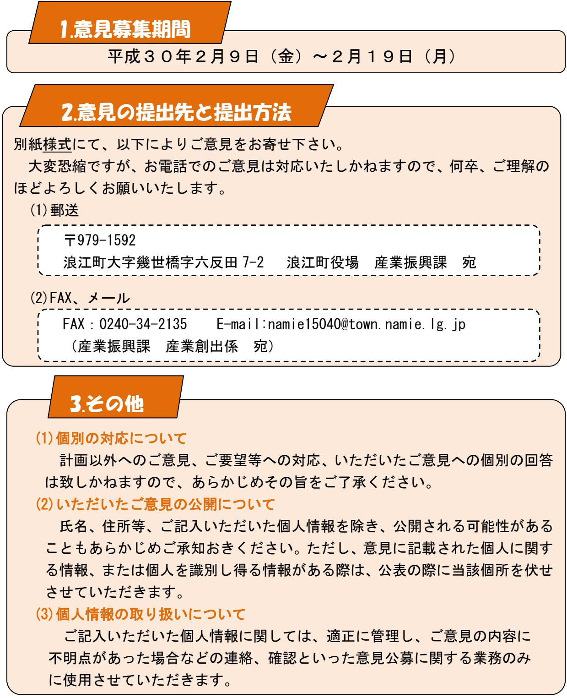

## 「浪江町再生可能エネルギー推進計画(検討案)」 への意見募集(パブリックコメント)について

「浪江町再生可能エネルギー推進計画(検討案)」について、広く町民の皆さまからご意見をいただきたく、以下により募集させていただきます。

皆さまからお寄せいただいたご意見につきましては、計画策定の参考とさせていただきます。

## 「浪江町再生可能エネルギー推進計画(検討案)」の概要

- 1.計画の目的
浪江町復興計画【第二次】で提唱された「エネルギーの地産地消チャレンジ」を実現するために、復興まちづくりと歩調をあわせて再生可能エネルギーの導入とエネルギーマネジメントを加速的に推進し、エネルギーの地産地消の先進モデルの町を目指すことを目的としています。

> 浪江町及び再生可能エネルギーを取巻く状況の整理及び分析

> 上記を踏まえた再生可能エネルギー推進の方向性、施策、事業

など

- 2.計画の骨子
浪江町再生可能エネルギー推進計画は以下の構成となっています。

- 第 1 章計画策定の趣旨
- 第 2 章上位計画・関連計画
- 第 3 章浪江町における再生可能エネルギーと取巻く状況
- 第 4 章再生可能エネルギー導入推進のためのゾーニングと開発適地
- 第 5 章再生可能エネルギーの導入目標と将来像及び基本方針
- 第 6 章再生可能エネルギー導入推進のための具体施策
- 第 7 章再生可能エネルギー導入推進のためのモデル事業
- 第 8 章再生可能エネルギー導入のロードマップ
- 第 9 章再生可能エネルギー導入の推進体制
- 3.計画に定める導入目標及び基本方針

≪導入目標≫

- ・2020年 ⇒ 自給率40%
- ・2027年 ⇒ 自給率54%
	- ≪基本方針≫
- Ⅰ.再エネをつくる・・・再生可能エネルギーの導入割合を増やす
- Ⅱ.再エネをつかう・・・再生可能エネルギーの地域内循環の仕組みづくり
- Ⅲ.まちづくりへつなげる・・・再エネの経済価値や地域内循環の活性化
- Ⅳ.将来へつなげる・・・技術動向を見据えた地域内消費・循環の拡大
- 4.再生可能エネルギー導入推進のための具体施策
- 施策Ⅰ:再生可能エネルギーに関する積極的な情報発信
- 施策Ⅱ:再生可能エネルギー導入に関する積極的な措置
- 施策Ⅲ:再エネ経済価値の地域還元、循環の仕組みの構築
- 施策Ⅳ:再生可能エネルギーによる持続的なまちづくりの実現
- 施策Ⅴ:再生エネルギー導入拡大のための基盤の整備

※詳細は「浪江町再生可能エネルギー推進計画(検討案)」をご覧ください。

## (様式)

## 産業振興課産業創出係行

| 氏名                     |  |         | 電話番号 |              |
|------------------------|--|---------|------|--------------|
| 住所                     |  |         |      |              |
| 【該当箇所】                 |  |         |      | 【理由】         |
| P16 の 3 行目という |  | 【ご意見内容】 |      | 可能であれば根拠となる出 |
| ように該当箇所を明              |  |         |      | 典等を添付または明記して |
| 記して下さい                 |  |         |      | 下さい          |
|                        |  |         |      |              |
|                        |  |         |      |              |
|                        |  |         |      |              |
|                        |  |         |      |              |
|                        |  |         |      |              |
|                        |  |         |      |              |
|                        |  |         |      |              |
|                        |  |         |      |              |
|                        |  |         |      |              |
|                        |  |         |      |              |
|                        |  |         |      |              |
|                        |  |         |      |              |
|                        |  |         |      |              |
|                        |  |         |      |              |
|                        |  |         |      |              |
|                        |  |         |      |              |
|                        |  |         |      |              |
|                        |  |         |      |              |
|                        |  |         |      |              |
|                        |  |         |      |              |
|                        |  |         |      |              |
|                        |  |         |      |              |
|                        |  |         |      |              |
|                        |  |         |      |              |
|                        |  |         |      |              |
|                        |  |         |      |              |
|                        |  |         |      |              |
|                        |  |         |      |              |
|                        |  |         |      |              |