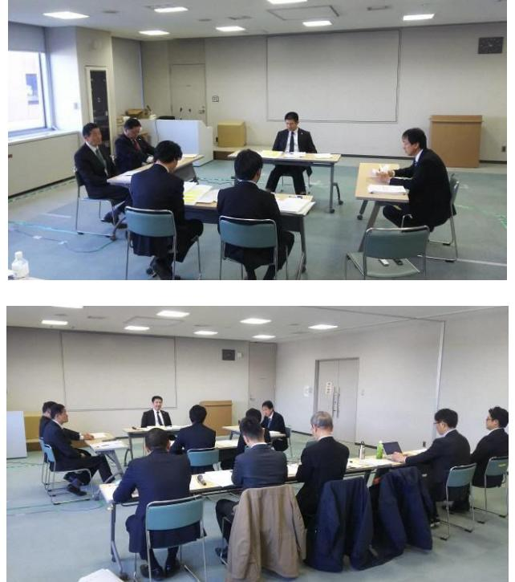

# 浪江町再生可能エネルギー推進計画検討委員会(第 2 回) 記録簿

#### 1.開催概要

【日時】2018年2月8日(木) 9:30~11:30 【場所】浪江町役場2階大会議室 【司会】産業振興課磯貝課長補佐

#### 2.次第

| 1.開会                                |                               |  |  |  |
|-------------------------------------|-------------------------------|--|--|--|
| 2.委員長あいさつ                           |                               |  |  |  |
| 3.議事                                |                               |  |  |  |
| (1)前回指摘事項の対応についての報告 ・・・資料2       |                               |  |  |  |
| (2)検討状況の報告について ・・・資料3、4          |                               |  |  |  |
| (3)計画書(案)・パブリックコメントについて ・・・資料5、6 |                               |  |  |  |
| (4)その他の報告事項                         |                               |  |  |  |
| 4.次回開催予定                            |                               |  |  |  |
| 5.閉会                                |                               |  |  |  |
| 【配布資料一覧】                            |                               |  |  |  |
| 資料 1                             | これまでの検討状況について                 |  |  |  |
| 資料 2-1                           | 前回指摘事項と対応一覧表                  |  |  |  |
| 資料 2-2                           | 再生可能エネルギーポテンシャルサマリ修正版         |  |  |  |
| 資料 2-3                           | 町内のエネルギー需要予測サマリ修正版            |  |  |  |
| 資料 2-4                           | 再生可能エネルギーの導入推進に向けたゾーニングサマリ修正版 |  |  |  |
| 資料 2-5                           | 再生可能エネルギーの開発適地選定サマリ修正版        |  |  |  |
| 資料 3                             | 再生可能エネルギーの導入目標・基本方針サマリ        |  |  |  |
| 資料 4                             | 再生可能エネルギー導入の具体施策サマリ           |  |  |  |
| 資料 5                             | 計画書素案                         |  |  |  |
| 資料 6                             | パブリックコメントについて                 |  |  |  |
| 参考資料                                | 報告書本文(修正版)                    |  |  |  |

## 3.出席者

|         | 氏名       | 職         |
|---------|----------|-----------|
| 委員長(議長) | 本間 茂行 | 副町長       |
| 委員      | 安倍 靖  | 企画財政課長    |
| 委員      | 岩野 善一 | 産業振興課長    |
| 委員      | 三瓶 徳久 | まちづくり整備課長 |

| 事務局 | 産業振興課:磯貝、小林、黒崎       |
|-----|----------------------|
|     | 国際航業 :飯尾、直井、河村、下田 |

## 4.質疑

- (1)前回からの資料の修正について【資料 1~資料 2-5】
	- 本間議長:今回、熱需要の予測を出したという部分が、熱を再生可能エネルギーで有効活用できないかという視点での検討ということで良いか。
	- 事務局:再生可能エネルギーの活用にあたり、特にバイオマス発電を考えたときに、電力だけでなく熱も利用できるのではないかと考えた。初回の委員会においても提示できれば良かったのだが、集計が間に合わず今回の追記とさせていただいた。 また、資料 2-5 の 2 ページ目にある土地利用状況の表だが、国土数値情報のメッシュデータを活用し推計している。100mメッシュの中に入っている土地利用種別から最も面積割合の大きいものを、そのメッシュの土地利用種別と判断しているため、実態とは誤差が出てしまうが、ここで推計した面積が最大値と見ている。
- (2)今回の新規追加資料について【資料 3、4】
	- 岩野委員:FIT価格が来年度から 3 円下がると聞いた。(近年の動向を見ると)年々売電価格が下がっていく気がしている。事業者は売電価格が何円の段階で収支バランスをとり、もし売電価格が下がっていった場合にどういった形で減少分を補填しようと考えているのかお聞きしたい。

事務局:アドバイザーの佐藤教授にもご助言を頂いているため、少し詳細に説明する。

- FIT価格は現状 21 円となっているが、毎年度下がっている傾向にある。一般的に言われているのが、17 円程度まで下がるとなったときに、設備にかかる費用などの技術動向もふまえて考えなくてはいけないということ。数年後には大規模な事業者でないと事業採算が取れない時代が来ると思うが、その時点までは売電事業もできると考えている。
ある程度のFIT価格があれば、外部に売電して入ってきた収益を町内に還元するが、FIT価格が下がり継続が難しいとなれば、作った電気を地域新電力として買い取り、外部への売電ないし町内での活用へと切り替えるタイミングが来るはずとのお話しがあった。

 技術動向を見ながら、どのくらいの規模であれば事業採算が取れるのか、外部へ売電するのがいいのか町内利用が良いのか等を見据えながら検討すべきとのお話しも頂いている。

- 安倍委員:発電自体は企業が行うのだと思うが、町としてはどのような関わりを持つのかと、資料 4 の検討視点1つ目にある「帰還につながる施策」について詳細を伺いたい。
- 事務局①:町で発電事業を直営で行うということは考えづらいが、その中で生まれる経済価値などをまちづくりの施策に積極的に有効活用できる仕組みをつくりたい。例えば、現在計画中の大規模太陽光発電事業などもそうだが、その中で生まれる経済価値に

ついては、町としては農業振興の財源として活用していきたいという話なども調整させて頂いているところである。産業振興課の再生可能エネルギー部門単体で魅力的な施策を生み出すというよりは、町全体の施策に活用もしくは還元させていくということをまずは考えている。

- 事務局②:具体施策のⅠ、Ⅱのところで、「住民向け」と「事業者向け」に書き分けている。再生可能エネルギーを推進するにあたり、事業者に入ってきてもらうだけでなく、町民が参画できるような仕組みが何かできないかと考えたときに、町民が所有する土地を発電事業者が借りて事業をただ行うのではなく、町民ご自身に設備を所有して頂き管理していただくことで、庭の管理をするような感覚で町に足を運んでいただく機会をつくれるのではないかと考えた。また、所有自体は町民だが、その手続きの代行を事業者が担うなども具体施策として検討してはどうかと考えている。それらをふまえて、次の具体施策Ⅲ、Ⅳは地域新電力の考えによるものとなっている。
- 安倍委員:「帰還につながる」という表現を見ると、それだけの期待をしてしまうのだが、それが手続きの代行などで良いのか。
- 事務局:具体施策Ⅳにも同様の記載をしている。「帰還につながる」という表現については、再度検討させて頂く。
- 安倍委員:近隣自治体においても、家を解体した空き地にソーラーパネルを設置しており、帰還が進まないのではないかという議論がされている。そういう背景がある中で、空き地を明示してしまうのはどうなのか。パネルを設置するというのは、自宅を再建して戻ってくるという流れと逆行していないか。

事務局:そういった視点も踏まえて考え方を整理させて頂く。

本間議長:「帰還につながる」という視点は、今後の計画にも載ってくる表現なのか。

事務局:計画上もこのような記載はしているが、表現については検討させて頂く。

本間議長:農業に活かし営農の支援になるといった表現なら帰還につながるように思う。

- 岩野委員:意見ではなく要望となるのだが、資料 4 の具体施策の全体イメージにある新電力会社について、第 1 回委員会でも申し上げた通り、立ち上げに係る準備には相当の時間を要すると考えられるため、それらに十分留意してご検討いただきたい。
- 事務局:前回もこの点はご指摘頂いており、前回は最短でのスケジュール案を提示させて頂いたが、実際に計画の中で位置づけが明確になった場合には、しっかりとした検討

期間を設けながら、各機関との調整などを踏まえて実態に即した形で進めたいと考えている。

- 本間議長:再生可能エネルギーの導入目標の設定のところで、2020 年に 40%、18.9GWhとあるが、現状としてはどのような状況なのか、実現可能性としてはあるのかというのを教えて頂きたい。
- 事務局:2020 年には谷津田地区のメガソーラーが稼働している予定のため、それを踏まえて考えている。町の上位計画である総合戦略で位置づけた数値目標および福島県の 2020 年での目標との連動性を図っており、この数値目標より上回るということは有り得るかと思う。
- 安倍委員:町はどのような手段で 40%を目指そうとしているのか。ポテンシャルがあることは分かったが、実際に何で目標を目指すかは記載されていなくて良いのか。
- 事務局:具体的な記載はないが、資料 3 の検討フローを見て頂ければ分かる通り、短期間でできるポテンシャルが大きいものは太陽光発電しかない。中長期的にはバイオマス発電もあるかもしれないが。
- 安倍委員:太陽光発電はパネル設置だけのため、雇用という面で考えると何があるのか。雇用を生み出せないのではないか。再生可能エネルギーを導入し、帰還を促すということであれば、雇用の件も含めて計画に示せないのかと思うのだが。
- 事務局:太陽光発電以外のバイオマス発電、小水力発電等も含めて雇用が限定的な業態というのはある。直接的な雇用についての記載は難しい。考え方としては、再生可能エネルギー導入により生み出した経済価値をいかに雇用という視点で別分野につなげていくかとなる。
- 安倍委員:FIT価格が下がらないうちに売電による収益をあげ、ゆくゆくは地域経済に還元するということで理解した。
- 本間議長:バイオマス発電などは直接的な雇用もあるのではないか。
- 安倍委員:今日も町で水素利活用シンポジウムが開催されるが、国が世界最大規模の水素製造拠点というのを謳っている中で、町として計画のどこかに水素に関する記載も入れて欲しいという気持ちがある。水素エネルギーを活用したまちづくりといった視点で。

事務局:水素についても町の今後の根幹となる部分のため、計画の中にも記載させて頂く。

本間議長:町としても水素の活用は考えたい。その視点はあって良い。

- (3)計画の骨子とパブコメについて【資料 5、6】
	- 事務局:議論いただきたいポイントとしては大きく 2 点ある。1 つは、このタイミングでのパブリックコメントの実施が適切かどうか。もう1つは、資料 5 の検討案P.24~25 に記載されるロードマップと推進体制について、事務局案として提示しており、この内容でパブリックコメントへ掲載して良いかどうか。
	- 岩野委員:パブリックコメントは 2/19(月)に締め切り回答するのかと思うが、回答は事務局で行うとして、第 3 回委員会にてどう回答するかが示されるのか。
	- 事務局:パブリックコメントで出た意見は事務局で整理し、回答案の取りまとめと計画へどのように反映したかを第 3 回委員会で示したいと考えている。
	- 安倍委員:前回も聞いたのだが、実際の送電網の空き状況はどうなのか。小高区の南相馬変電所についてはカウントされているのか。
	- 事務局:東北電力に一定程度の空きがあることは確認できているが、具体的な空き容量などについては現在確認中である。南相馬変電所については、再エネ推進協議会を通じてのプロジェクトになり、送電網の使用量に含まれているものと認識している。
	- 安倍委員:現在、界地区の電力会社の話がある。あの話も系統連系の見込みがあるからやっているのだと思うが、(東北電力に)申し込んでみないと分からないということか。
	- 事務局①:空き容量の件については、議事(4)その他の報告事項にて説明予定だったが、質問があったので説明する。 今回、ゾーニング結果をもとに計画適地の選定を行った。その中で基本的に大規模なメガソーラーを想定した発電所、そして住民が行うような小規模なもの数か所の適地を選定し、それらについて東北電力に相談という形で系統連系の空きがあるか等を確認中である。
	- 事務局②:確認中の内容等については後日改めて報告させて頂く。まずはサンプルで確認を図るということでご理解いただきたい。
	- 本間議長:ロードマップの中期的な目標のところで、「町民帰還・新たな定住者の獲得に向けた施策の検討・実施」とあるが、この段階で検討というのは遅いのではないか。検討は短期で既に行っているべき。中期のところは実施のみという流れではないか。 水素エネルギーについても同様で、中期で書かれている取り組みを短期へ、長期に書かれている取り組みを中期にし、長期としては活用検討などになるのかと。

事務局:そのように修正させて頂く。

- 安倍委員:短期的な取り組みの中に「地産外消」と謳うのであれば、実施内容にも 1 項目必要になるのではないか。3 年の間で発電会社をつくり発電した余剰分の電力を売るなどの内容になるのかと思うが。
事務局:追記させて頂く。

- 本間議長:P.20 の将来像のところにもバイオマスの記述の下に水素についても記載があった方が良い。
- 事務局:そちらについても追記させて頂く。
- 本間議長:パブリックコメントについては、町のホームページ等への公表を行うのか。掲示期間等に問題はないか。
- 事務局:ホームページへの公表を考えている。期間についても問題ない。
- 本間議長:第 1 回委員会にて話のあった東京区部など他地域との連携などの話も記載されているか。
- 事務局:P.23 になるのだが、現状ではここで記載されているものが全てになる。「地域間連携」という記述をしている。
- (4)その他の報告事項について
	- 事務局①:第 3 回委員会に向けて、事業者意向調査を行っていく。その内容については事務局内で調整しながら実施していきたいと考えている。調査結果については、第 3 回委員会にて報告させて頂く予定としている。
	- 事務局②:事業者意向調査の目的としては、ポテンシャルや需要などについてデータ上で分析してきたが、発電業者と電気を利用する事業者の両面からヒアリングを行い需要等を補足する。

# 5.写真

