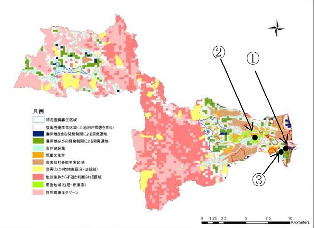

# 系統連系の空容量について

### 【目的】

再生可能エネルギーの導入推進に向けて、系統連系の空き容量を把握し、現状における接続可能性及び今後の系統連系に関する課題を明らかにする。

#### 【系統連系の状況】

浪江町は、東北電力系統の浪江線(652A)、浪岡線(652B)に該当し、それぞれ以下の通りの空き容量となっている。空き容量分の発電設備の連系は可能と想定できるが、本地域及び他地域での検討状況によっては、大きく変動する可能性がある。

(例:地域内もしくは、近傍地域にて 50MWの太陽光の接続契約が締結されるなど)

| 路線 NO. | 電圧[kV] | 線路名 | 空容量[MW] |  |
|-----------|--------|-----|---------|--|
| 652A      | 66     | 浪江線 | 17.7    |  |
| 652B      | 66     | 浪岡線 | 29.1    |  |

表 1. 浪江町地区の系統空き容量

出典:福島支店管内の 66kV以下の送電線の空容量(平成 30 年 2 月 14 日作成)

#### 【事前相談申込み状況】

太陽光発電事業における連系可否確認のため、3 地域にて事前相談申込みを実施した。現時点において設置箇所が確定されるものではなく、あくまで申請地域での連系可能容量について確認するものである。

これらの事前相談の正式回答によって、50kW未満の低圧連系による太陽光発電等の連系可否も確認することができる。

ただし、現時点で、太陽光発電や木質バイオマス発電を本町内で実施する意向を示す企業もいるため、それらの企業による系統連系(設備認定)がなされれば、連系可能量が変化する可能性もある。

事前相談申込みを実施した地域及び規模は以下の通りである。他事業者の申請処理の順番待ちの状況となっており、3 月中旬頃に正式回答予定となっている。

表 2. 事前相談申込み実施地域と規模

|   | 地域         | 規模(kW) |
|---|------------|--------|
| ① | 浪江町請戸古川    | 1,999  |
| ② | 浪江町樋渡竹の花   | 1,999  |
| ③ | 浪江町 979 | 30,000 |

# 【その他、今後の方針】

本検討結果も踏まえた事業実施方針を本推進計画に反映する。また、実際に事業化を検討する際には、候補地が定まった時点で再度事前相談申込みを行い、連系可否を確認したうえで手続きを進める必要がある。