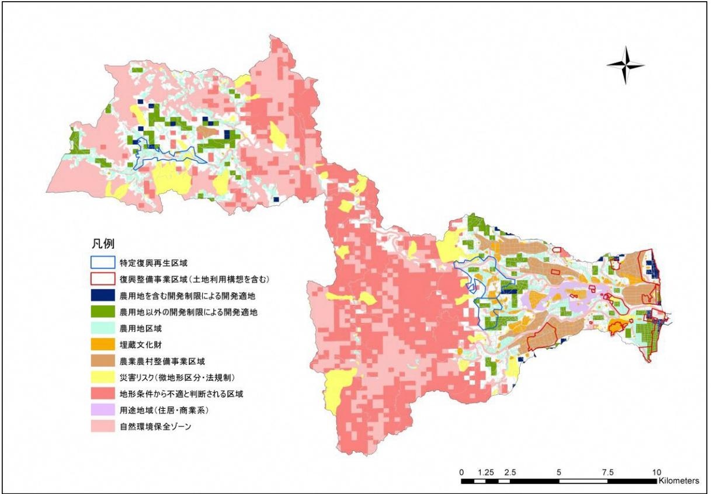
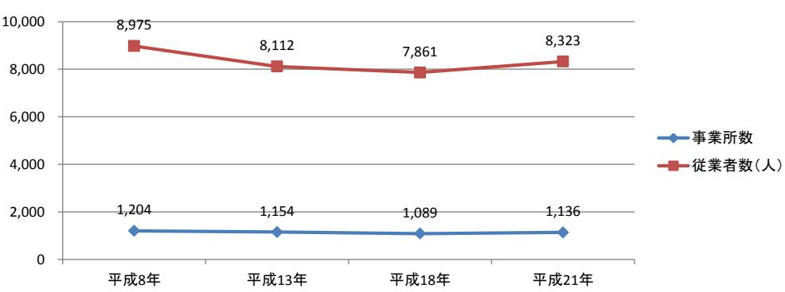

資料6 3 月 2 日版

# 浪江町再生可能エネルギー推進計画 (提言案)

## 平成 30 年 3 月

福島県浪江町

| 第1章         | 計画策定の趣旨-----------------------------------------------------------1          |    |
|-------------|------------------------------------------------------------------------------|----|
| (1)         | 計画策定の目的-------------------------------------------------------------         | 1  |
| (2)         | 国・県のエネルギーの動向に関わる整理 ------------------------------------                   | 1  |
| 第2章         | 上位計画・関連計画 ------------------------------------------------------4         |    |
| (1)         | 復興計画及びエネルギーに関する取組み ------------------------------------                   | 4  |
| (2)         | 復興事業等の概要 ----------------------------------------------------------       | 6  |
| 第3章         | 浪江町における再生可能エネルギーと取巻く状況---------------------------7                           |    |
| (1)         | 人口推計の整理-------------------------------------------------------------         | 7  |
| (2)         | 再生可能エネルギーの導入ポテンシャルの推計 -----------------------------                       | 8  |
| (3)         | 浪江町のエネルギー需要の予測 --------------------------------------------10             |    |
| 第 4 章 | 再生可能エネルギー導入推進のためのゾーニングと開発適地--------------                                    | 12 |
| (1)         | 再生可能エネルギー導入推進のためのゾーニング等の必要性---------------12                                 |    |
| (2)         | 土地利用規制に基づくゾーニング------------------------------------------13                  |    |
| (3)         | 開発適地 ------------------------------------------------------------------14 |    |
| 第 5 章 | 再生可能エネルギーの導入目標と将来像及び基本方針 --------------------                             | 15 |
| (1)         | 導入目標と将来像の視点---------------------------------------------------15             |    |
| (2)         | 基本方針 ------------------------------------------------------------------16 |    |
| (3)         | 計画期間 ------------------------------------------------------------------16 |    |
| 第6章         | 再生可能エネルギー導入推進のための具体施策---------------------------                             | 17 |
| (1)         | 具体施策の趣旨と視点 -----------------------------------------------------17        |    |
| (2)         | 具体施策 ------------------------------------------------------------------18 |    |
| (3)         | 具体施策の実施イメージ---------------------------------------------------19             |    |
| (4)         | 事業者意向調査の概要 -----------------------------------------------------19        |    |
| 第7章         | 再生可能エネルギー導入のロードマップ ---------------------------------                      | 20 |
| (1)         | 計画に向けた短期・中長期のロードマップ---------------------------------20                       |    |
| 第8章         | 再生可能エネルギー導入の推進体制 -------------------------------------                    | 21 |
|             |                                                                              |    |

|         | 資料編------------------------------------------------------------------------- | 22                                                            |
|---------|------------------------------------------------------------------------------|---------------------------------------------------------------|
| 資料1     | 浪江町の概要                                                                       | -----------------------------------------------------------23 |
| 資料 2 | 導入ポテンシャルの推計方法                                                                | --------------------------------------------28                |
| 資料 3 | エネルギー需要予測の推計方法------------------------------------------35                   |                                                               |
| 資料 4 | 事業者意向調査結果の補足                                                                 | ----------------------------------------------36              |
| 資料 5 | パブリックコメントの実施                                                                 | ----------------------------------------------37              |

### 第1章計画策定の趣旨

#### (1) 計画策定の目的

浪江町では、復興計画(第二次)において「エネルギーの地産地消」チャレンジが提言され、エネルギーの地産地消を住民生活の中に定着させていくことをチャレンジの柱としています。

このような中で、国道6号と浪江町役場を中心としたエリアを核としたまちづくりを進めていくとともに、再生可能エネルギー等の導入やスマートコミュニティの整備等を推進し、町民一人ひとりのエネルギーの有効活用に関する意識向上や、エネルギーの見える化を通じた普及促進により、エネルギーの地産地消の先進モデルの町を目指して、新しい浪江の礎をつくることを計画しています。

さらに、復興まちづくりと歩調を合わせた再生可能エネルギーの導入とエネルギーマネジメントを加速的に推進するためには、より具体的な「再生可能エネルギー推進計画」が必要であり、計画に沿った復興まちづくりを行うことが重要であると考えています。

そのため、復興計画及び国・県などの上位計画と整合性を図り、浪江町の将来イメージやその実現に向けた方策などを示す「浪江町再生可能エネルギー推進計画」を策定し、それを基に再生可能エネルギーの活用や関連産業の育成に努め、持続可能な浪江町を目指します。

#### (2) 国・県のエネルギーの動向に関わる整理

①国のエネルギー施策の動向

浪江町に関わる国のエネルギー施策の動向としては、おおきく以下の 3 つが挙げられます。特に、福島イノベーション・コースト構想と福島新エネ社会構想については、福島県における復興に向けた施策が計画されており、福島県復興計画と関連性を持っています。

- ●長期エネルギー需給見通し
- ●福島イノベーション・コースト構想
- ●福島新エネ社会構想

#### ②福島県のエネルギー施策の動向

#### <福島県復興計画(第 3 次)>

福島県復興計画(第 3 次)では、主要施策として、復興へ向けた 10 の重点プロジェクトが計画されています。その中で、主に「8.新産業創造プロジェクト」の中に、再生可能エネルギーの関連事項が位置付けられており、「原子力に依存しない、安全・安心で持続的に発展可能な社会の実現と、再生可能エネルギー「先駆けの地」を目指し、再生可能エネルギーの導入拡大や技術開発・実用化を通じた関連産業の集積と省エネルギーを推進し、

2040 年頃を目標に県内エネルギー需要 100%相当量を再生可能エネルギーで生み出す社会の実現する」という方向性が示されています。その実現にむけ、短期的には 2020 年までに 40%の導入目標が掲げられています。

県復興計画の中の地域別の取組として、浪江町の位置する双葉エリアでは、「新産業の創造」や「再生可能エネルギー等の導入等の推進」として、以下のように、再生可能エネルギーに関連する取組が明記されています。

a) スマート・エコパーク

「新産業の創造」の中で「福島イノベーション・コースト構想」の一つとして示されている。県内産業基盤を強化するとともに、新たなリサイクル事業を生み出し、浜通り地域を中心に環境・リサイクル産業の集積を目指す。

b) エネルギー関連産業プロジェクト

「新産業の創造」の中で「福島イノベーション・コースト構想」の一つとして示されている多岐にわたるプロジェクトを通じて、浜通りのポテンシャルを生かした産業の集積を目指している。

c) 再生可能エネルギー等の導入等の推進

再生可能エネルギーの研究開発拠点と連携し、本エリアにおいてポテンシャルの高い太陽光や風力発電などの先進地として再生可能エネルギーの導入を図るとともに、浮体式洋上風力発電システムの安全性、信頼性、経済性を検証するため、福島洋上風力コンソーシアムが広野町・楢葉町沖で「浮体式洋上風力発電実証研究」の推進を図っている。

さらに、クリーンコールの拠点を目指し、復旧した東京電力広野火力発電所(広野町)、常磐共同火力勿来発電所(いわき市)において、高効率石炭火力発電(IGCC)の整備が進められています。

<福島県再生可能エネルギー推進ビジョン(改訂版)>

福島県再生可能エネルギー推進ビジョン(改訂版)では、以下のとおりに再生可能エネルギーに係る方針、目標、施策が示されています。

【基本方針】

環境面「環境への負荷の少ない低炭素・循環型社会」の実現

復興面「原子力に依存しない、安全・安心で持続的に発展可能な社会づくり」と「再生可能エネルギーの飛躍的な推進による新たな社会づくり」の実現

【導入目標】

2020 年には県内の一次エネルギー供給に占める再生可能エネルギーの割合が約 40%

#### 第2章上位計画・関連計画

#### (1) 復興計画及びエネルギーに関する取組み

浪江町では、東日本大震災後の状況を踏まえ、復興への取組を進めるため、次のような計画等が策定されています。

- 浪江町復興ビジョン(平成 24 年 4 月浪江町)
- 浪江町復興まちづくり計画(平成 26 年 3 月浪江町)
- まち・ひと・しごと創生浪江町人口ビジョン(平成 28 年 3 月浪江町)
- ひと・しごと創生浪江町総合戦略(平成 28 年 3 月浪江町)
- 避難指示解除に関する有識者検証委員会報告書 (平成 28 年 3 月避難指示解除に関する有識者検証委員会)
- 浪江町復興ビジョン検討会議中間報告書(平成 28 年 12 月)
- 浪江町中心市街地再生計画(平成 29 年 3 月浪江町)
- 浪江町復興計画【第二次】(平成 29 年 3 月浪江町)

浪江町復興計画【第二次】では、復興計画【第一次】の「復興の理念」、「復興の基本方針」を踏襲し、復興計画【第一次】策定後に浪江町で策定された全ての計画・報告を踏まえ、その要素をすべて包含しています。(浪江町復興まちづくり計画、まち・ひと・しごと創生浪江町総合戦略、避難指示解除に関する有識者検証委員会報告書等)復興計画【第二次】は、復興計画【第一次】の策定後の状況の変化を踏まえ、今後、町が進むべき方向をより具体的に示すことに重点を置きました。復興計画【第二次】に記載のない具体的な取組については、詳細が検討でき次第、個別計画に盛り込んでいます。

浪江町復興計画【第二次】をはじめとする各種計画では、再生可能エネルギーに関する内容にも触れられていますが、具体の計画は本計画において再生可能エネルギーの導入推進を図っていきます。

<浪江町復興計画【第二次】における復興の理念>

<浪江町復興計画【第二次】における復興の基本方針>

#### (2) 復興事業等の概要

平成 30 年 3 月現在、浪江町復興に向けて主として帰還困難区域を除く海側エリアで復興事業等が進められています。浪江町の概ねの都市構成は、既存中心市街地を含む都市計画区域内用途地域(主要部)を中心に、周囲に農地が拡がり、農地の間に産業団地整備事業が進められています。東日本大震災後に指定された「災害危険区域」及び「帰還困難区域」について整理するとともに、既存中心市街地等に係る「都市計画用途地域(主要部)」 と「農業振興地域」について復興事業と合わせて以下に整理します。

#### <浪江町の主要な復興事業・計画等位置図>

#### 第3章浪江町における再生可能エネルギーと取巻く状況

#### (1) 人口推計の整理

浪江町では、東日本大震災後の状況を踏まえ平成 28 年 3 月に「浪江町人口ビジョン」 を策定しました。本計画では、「浪江町再生可能エネルギー推進計画」の計画条件検討に係るものとして、「浪江町人口ビジョン」から町の人口の将来推計の整理を行いました。

この「浪江町人口ビジョン」において設定された展望人口を、「まち・ひと・しごと創生浪江町総合戦略」においても「町の展望人口」として位置づけ、総合戦略の基本目標と施策を設定しています。

上記総合戦略のなかでは、東日本大震災による全町避難により居住人口がゼロという、町が置かれている状況から、国が示す 2060 年までの長期的な人口の推移を見通すことは難しい状況にあるため、2035 年に中期的な目標人口を設定し、今後の状況の変化に対応しながら町の将来の展望人口を設定しています。

復興庁から発表された「福島県 12 市町村将来像」における人口推計や、福島県の人口ビジョンを参考に、居住人口の総数を 2035 年までの中期的な目標人口を 8,000 人とし、平成 27 年度の住民意向調査の帰還意向を基に、避難指示解除後の 5,000 人と設定しています。、また、2035 年の人口の内訳は、段階的に帰還する町民の増加や新たな住民の受け入れ人口が 6500 人、町内に居住する新産業従事者が 1500 人と想定しています。

なお、平成 29 年 1 月末時点の居住人口は 482 人となっており、居住人口の増加に向けてより一層の復興推進を行っていく必要があります。

#### (2) 再生可能エネルギーの導入ポテンシャルの推計

再生可能エネルギーの推進にあたり、町の現状においてどの程度再生可能エネルギーのポテンシャルがあるのか、各種文献を参考に推計を行ないました。なお、導入ポテンシャルは、賦存量から町の土地用途等を勘案し、経済状況等は考慮されていないものとして定義します。利用可能量は、事業者意向調査結果を踏まえたものにすることとします。

案し、抽出されたもの

町の土地用途等を勘案し、経済状況等は勘案されていないもの

種々の制約要因(土地用途、利用技術、法令、施工性など)を満たさないもの

#### <太陽光発電、風力発電、小水力発電の推計方法>

平成 22 年度再生可能エネルギー導入ポテンシャル調査(環境省)

・平成 23 年度再生可能エネルギーに関するゾーニング基礎情報整備報(環境省)

・平成 24 年度再生可能エネルギーに関するゾーニング基礎情報整備報(環境省)

太陽光発電、風力発電、小水力発電の推計には、上記の既往文献を参考に算出しました。

#### <バイオマス発電の推計>

バイオマス発電の推計は、木質系バイオマス発電と廃棄物系バイオマス発電の 2 種類に分けて導入ポテンシャルを推計しました。廃棄物系バイオマス発電については、東日本大震災前の家畜頭数を参考にし、長期的な導入を見据えた試算としています。

※推計に関わる詳細については、巻末の資料編を参照のこと。

#### <導入ポテンシャルの推計結果>

導入ポテンシャルを推計すると、太陽光発電は設備容量約 189MW(年間発電量約 189.1GWh)、バイオマス発電(木質+バイオガス)は、設備容量約 5.5MW(年間発電量約 44GWh)、陸上風力発電は設備容量約 397MW(年間発電量約 646GWh)の導入ポテンシャルがあるという結果となります。ただし、バイオマス発電は、将来的なポテンシャルとしては見込める可能性があるものの、現状では、放射線量問題からすぐに導入が期待されるものではないことに留意する必要があります。

中小水力発電は、賦存量 3MWではありましたが、導入ポテンシャルとしては、0MWという結果が既往文献から得られています。

| 導入ポテンシャル   | 太陽光発電 |       |       |        |  |  |  |  |
|------------|-------|-------|-------|--------|--|--|--|--|
|            | 住宅用等  | 公共施設系 | 耕作放棄地 | 低・未利用地 |  |  |  |  |
| 設備容量[MW]   | 17.8  | 1.0   | 111.  | 53.7   |  |  |  |  |
| 年間発電量[GWh] | 18.3  | 1.0   | 114.4 | 55.3   |  |  |  |  |

| 導入ポテンシャル   |            | バイオマス発電     | 陸上風力発電 | 中小水力発電 |  |
|------------|------------|-------------|--------|--------|--|
|            | 木質系バイオマス発電 | 廃棄物系バイオガス発電 |        |        |  |
| 設備容量[MW]   | 3.1        | 2.4         | 397.9  | 0      |  |
| 年間発電量[GWh] | 24.8       | 19.2        | 646.2  | 0      |  |

【電力の単位WとWhについて】 W(ワット)とは電力の単位で、Wh(ワットアワー)とは電力量の単位です。 水に例えると、電力の単位であるWは水の勢いで、Whはその水がたまった量になります。 導入ポテンシャルに記載の設備容量MWとは、瞬間的に発電する電力を意味しており、発電量GWhとは、その設備が発電した電力量を意味しています。 【G(ギガ)、M(メガ)について】 GW(ギガワット)、MW(メガワット)のように示すことがありますが、G(ギガ)、M(メガ)とは、単位に対する大きさを表わすもので、GW、MWであれば、電力の単位であるWの大きさを表わします。 (参考)1GW = 1000MW = 1000,000kW = 1000,000,000W

#### (3) 浪江町のエネルギー需要の予測

町の電力需要の予測は、経済産業省資源エネルギー庁のエネルギー消費統計における「都道府県別エネルギー消費統計」より、福島県の電力消費量から各種統計データを用いて浪江町における産業や家庭等の部門別の電力消費量を推計し、部門別に設定した単位(人口、事業所数)あたりの電力消費量から部門別の電力需要量を推計しました。なお、帰還人口の推計では先行して避難指示区域が解除された南相馬市小高地区の帰還状況の推移を参考に推計を行っています。

また、町内の産業団地を対象に、経済産業省の工場立地動向調査から事業者の想定立地件数を算定し、1 事業者あたりの電力消費量を乗じて産業団地における電力需要量を算定しています。北産業団地、南産業団地、棚塩産業団地共用開始後 2021 年以降については、段階的に需要が増加していくと想定しています。 <電力需要の将来推計フロー>

電力需要の推計した結果を下図に示すように、2027 年度において町内全体では、合計 141.5GWhの電力需要が予測される結果となっています。

なお、町の熱需要についても電力需要と同様に統計データを用いて、段階的に需要が増加していくことを想定し予測を行った結果、下図に示すように 2027 年度において町内全体では合計 1,397.5TJとなっています。

【熱需要量のTJ(テラジュール)について】 T(テラ)とは、G(ギガ)、M(メガ)と同様に単位の大きさを表わすもので、G(ギガ)のさらに 1000 倍の大きさを表わします。 J(ジュール)とは、エネルギーの単位の一つで、仕事量や熱量、電力量などを意味します。 なお、電力W(ワット)との関係は、単位秒あたりのJ(ジュール:電力量)が、Wとなります。 W(ワット)=J(ジュール)÷ 秒 (W=J/s) (参考)1TJ=1000GJ=1000,000MJ=1000,000,000kJ=1000,000,000,000J熱需要量で推計されたJ(ジュール)は、灯油、軽油、重油等の燃料が持つ熱量の合計を表わしています。

#### 第 4 章再生可能エネルギー導入推進のためのゾーニングと開発適地

#### (1) 再生可能エネルギー導入推進のためのゾーニング等の必要性

町には豊富な再生可能エネルギーの導入ポテンシャルがあり、また、将来的にはエネルギー需要が東日本大震災発生前を上回ると考えられます。このため、再生可能エネルギーを有効に活用し、魅力的で持続可能なまちづくりを行っていくことが町の復興に欠かせません。

一方で、再生可能エネルギーは石油等に代わるクリーンなエネルギーとなりますが、再生可能エネルギーの導入を拡大するために自然環境を損ねたり、町の基幹産業の一つである農林業へマイナスの影響を与えたりすることは望ましくありません。

このため、既存の法規制区域を基本に「再生可能エネルギーの導入を推進する区域」「再生可能エネルギーの導入にあたって周辺環境との調和の観点から調整を要する区域」「自然環境を保全する区域」の3つに町域を区分(ゾーニング)し、ゾーニング結果を踏まえ、再生可能エネルギーの開発に適すると評価される区域を明示することで、再生可能エネルギーの導入に伴うマイナスの影響を回避します。

#### (2) 土地利用規制に基づくゾーニング

町における再生可能エネルギーの導入に際して、開発適地を示すにあたり、関連する土地利用規制等を整理し、町域を以下の3つのゾーンで分類しています。

#### <自然環境保全ゾーン>

自然環境の保全を第一とし、大型の再エネ設備の導入を制限するゾーン

対象・・・森林区域(国有林・保安林)、自然公園区域(特別地域)、

鳥獣保護区・特別保護地区、河川区域・河川保全区域

#### <再生可能エネルギー導入調整ゾーン>

周辺環境への調和の観点から、大型の再エネ設備の導入については調整を要するゾーン

対象・・・地域森林計画対象民有林、農用地区域、ほ場整備事業区域、

土地改良総合整備事業区域、農地開発事業区域

#### <再生可能エネルギー導入推進ゾーン>

大型の再エネ設備の導入を推進するゾーン

対象・・・上記ゾーンを除く地域 ※但し、用途地域(住居・商業系)は含まない

注)復興整備事業の実施が検討されている区域(浪江町復興整備計画及び土地利用構想図に記

載されている区域)については復興整備事業担当部局と調整を要するものとします。

- (3) 開発適地
町における再生可能エネルギーの開発を促していくために、開発適地の選定を行なった結果を以下に示します。

<選定方法>

- ●再生可能エネルギーの開発に適さない地域(開発不適地)を抽出
- ●環境省等の資料から再生可能エネルギー導入ポテンシャル分布状況を整理
- ●国等の補助を受けて実施している事業・実施予定の区域を除外
- ●上記で抽出した開発不適地と再エネポテンシャル、整理した除外区域の重ね合わせによる開発候補地の選定

再生可能エネルギーそれぞれについて、再エネ導入ポテンシャルを有し、かつ開発不適地及び除外区域に含まれない区域を抽出し、開発適地を抽出しています。

太陽光発電における開発候補地の選定結果は上図のようになります。青色(農用地を含む開発制限による開発適地)と緑色(農用地以外の開発制限による開発適地)が開発候補地となっています。

### 第 5 章再生可能エネルギーの導入目標と将来像及び基本方針

#### (1) 導入目標と将来像の視点

町の再生可能エネルギー導入ポテンシャルの推計結果と町のエネルギー需要の予測の結果を踏まえ、将来の再生可能エネルギーの導入目標と将来像、基本方針を定めます。

導入目標と将来像を定めるにあたっては、再生可能エネルギーが魅力的かつ持続可能なまちづくりへと有効に活用されるよう、次の視点で検討しています。

#### <導入目標と将来像の視点>

#### 視点 1:再生可能エネルギーの導入の推進

浪江町総合戦略等を踏まえ、エネルギー自給率※1 を高めるとともに、防災・減災の観点及び地域住民が主体となる再生可能エネルギー導入の推進の観点から、分散型エネルギーの活用も図ります。

※1 エネルギー自給率=地域内の再生可能エネルギー発電量/地域内のエネルギー需要量

#### 視点2:再生可能エネルギーの経済価値が地域に還元され循環する仕組みをづくり

発電事業者のFIT※2 による売電事業の経済価値が、より地域へ還元され、地域内で再生可能エネルギーの経済価値が循環する仕組みをつくります。

※2 固定価格買取制度

#### 視点3:再生可能エネルギーの経済価値の地域内循環により、魅力あるまちづくりの推進

視点 2 の仕組みにより、再生可能エネルギーの経済価値を地域内で循環させ、雇用創出や住民サービスの充実等、魅力あるまちづくりを推進します。

#### <導入目標>

福島県復興計画(第 3 次)や福島県再生可能エネルギー推進ビジョン、浪江町総合戦略で示されている計画との整合を図り、導入目標はエネルギー自給率(再生可能エネルギー由来の電気自給率)を 2020 年度に 40%、2027 年度に 54%を目指します。

これは、電力の需要予測から換算すると 2020 年度に 18.9GWh(電力需要:47.3GWh)、 2027 年度に 76.4GWh(電力需要:141.5GWh)となります。

#### <再生可能エネルギーの導入推進による将来像>

本計画の実行により将来像を想定し、再生可能エネルギー導入を推進します。

- 
- 
- 
- 
- 
- 

#### (2) 基本方針

導入目標や、町の再生可能エネルギー導入によって期待される将来像に向けた基本方針を以下の 4 つとし、計画を推進します。

#### 基本方針Ⅰ:再エネをつくる

上位計画や関連計画に沿って、再生可能エネルギーの導入割合を増やしていきます。また、町民が主体となる小規模な再エネ設備の導入も促進します。

#### 基本方針Ⅱ:再エネをつかう

再エネ事業者のインセンティブを低下させず、FIT売電の経済価値をより地域に還元し、再エネの経済価値が地域内循環する仕組みの構築を目指します。

#### 基本方針Ⅲ:まちづくりへつなげる

現状の目標設定だと時間帯によっては発電電力の余剰が出てしまうので、当面の間、余剰分は地域外へ販売し、経済価値の地域内循環をさらに活性化させます。

#### 基本方針Ⅳ:将来へつなげる

将来的には、技術動向を見据えながら、地域内消費量の割合を高めていきます。

#### (3) 計画期間

本計画の期間は 2018 年度から 2027 年度までの 10 年間とします。なお、計画期間中における社会情勢等を踏まえ、適宜、見直しを行います。

## 第6章再生可能エネルギー導入推進のための具体施策

#### (1) 施策の趣旨と視点

本計画の将来像・導入目標達成の実現に向けた 4 つの基本方針をふまえて、町のエネルギー・経済の活性化を促す以下の視点から施策を実施していきます。

#### <施策の視点>

- ●再生可能エネルギーを通じた復興や地域経済等の再生につながる施策
- ●事業者のインセンティブを呼び起こし、町民を巻き込んだ民間活力による再生可能エネルギーの導入拡大につながる施策
- ●自然環境や営農環境と調和した再生可能エネルギー設備の導入につながる施策
- ●再生可能エネルギーの経済価値を地域に取り込み、地域で循環させ、持続的なまちづくりにつながる施策

#### (2) 具体施策

具体施策Ⅰ:再生可能エネルギーに関する積極的な情報配信

<住民向け>

所有する土地の再エネによる有効活用事例や、補助制度や系統連系等の手続きに関する理解しやすい情報の配信を積極的に行います。

<事業者向け>

再エネ導入に関する補助制度や事業者誘致のための措置、土地利用方針に関する積極的な情報の配信を行います。

具体施策Ⅱ:再生可能エネルギー導入に関する積極的な措置

<住民向け>

補助申請や系統連系等の手続きを代行する事業者の紹介や、小規模再エネの導入支援助成等の積極的な措置を講じます。

<事業者向け>

再エネ導入に関する補助制度や税優遇、再エネ設備の立地に関する基準の制定等、事業者誘致のための積極的な措置を講じます。

具体施策Ⅲ:再エネ経済価値の地域還元・循環の仕組みの構築

再生可能エネルギーの経済価値がより地域に還元され、循環する仕組みを構築し、地域で消費しきれない余剰となる再生可能エネルギーの地産外消により、地域経済の活性化を図ります。

具体施策Ⅳ:再生可能エネルギーによる持続的なまちづくりの実現

再エネの経済価値を活用し、産業(雇用)の創出、農業再生、日常生活の復旧などに資する取組につなげ、魅力的かつ持続可能なまちづくりを実現します。

具体施策Ⅴ:再生可能エネルギー導入拡大のための基盤の整備

ⅠからⅣの施策をスムーズに実施するために必要となる設備の拡充や財源の確保等、再生可能エネルギーの導入拡大を図るための基盤整備について、関係機関と積極的に協議を行います。

#### (3) 具体施策の実施イメージ

具体施策の実施については、町が単独で実施する方法のほかに、町と地域パートナー、民間企業の活力を活かし、共同の事業体を設立して実施することも考えられます。共同の事業体を設立して実施する場合のイメージを以下に示します。

具体施策Ⅰ・Ⅱにより、住民向けや事業者向けの太陽光発電を中心とした再生可能エネルギーの導入量を増やしていき、具体施策Ⅲ・Ⅳにより、地域内の経済循環を活性させていきます。また、具体施策Ⅴでは、このようなモデル事業に向けた基盤整備を行っています。

モデル事業の形成(住民や地元企業、民間企業との連携)により、産業(雇用の創出) や、農業再生、日常生活の復旧支援等を促すともに、技術向上による再生可能エネルギーの利活用による防災性の向上、地域間連携によるヒト・モノの交流を促進します。再生可能エネルギーを中心とした町の復興により、持続可能なまちづくりを実現し、魅力的な浪江町を目指します。

必要となる設備の拡充や財源の確保等、再生可能エネルギーの導入拡大を図るための基盤整備について、関係機関と積極的に協議

#### (4) 事業者意向調査の概要(事業者意向の調査結果を踏まえ、入れ方を検討)

事業者意向調査では、上記のようなモデル事業を推進していくための町で事業を営む、または営む予定の事業者や町での再エネ事業を予定している事業者への意向調査を実施し、将来像の実現に向けて施策の具現化を行っていきます。

## 第7章再生可能エネルギー導入のロードマップ

#### (1) 計画に向けた短期・中長期のロードマップ

計画の推進にあたっては、ロードマップを短期と中長期にわけて取組を明確化し、計画を実施していきます。短期の視点としては、再生可能エネルギーの導入拡大と地産外消の仕組みづくりの観点から地域経済の循環を促していきます。中長期の視点としては、再生可能エネルギーの導入拡大と地域経済の強化をしながら、需要の高まりに対応した熱需要や水素エネルギーへの対応を見据えていきます。

施策の具体化に向けては、以下の重点内容を中心に取り組んでいきます。

- 住民や民間事業者に対する積極的な情報発信
- 再エネ導入に関わる助成制度や優遇措置の検討と実施
- 再エネ導入の拡大に向けた庁内協議と財源確保の継続

また、まちづくりへの展開は、以下の内容を取り組みます。

- 再エネを介した他自治体との連携強化・仕組みづくり(短期)
- 町民帰還、新規定住者に向けた施策の検討と実施(短期)
- 水素エネルギーの実用化に向けた検討(短期)
- 構築した仕組みを活用し、再エネの経済価値の地域循環強化(中長期)
- 経済性を考慮した水素エネルギーの導入、将来的な利活用による供給の拡大(中長期)
- 需要の高まりに応じて熱需要に対する再エネ活用施策を検討・実施(中長期)

## 第8章再生可能エネルギー導入の推進体制

- (1) 計画推進のための体制
【再生可能エネルギー導入推進会議】

- 課長補佐級職員を持って充て、事務局は産業振興課が担います。
- 推進会議では、再生可能エネルギーの導入政策を検討し、政策の実行に関し必要な調整を行います。
- また、再生可能エネルギーの導入に関する許認可のワンストップサービス等を提供するとともに、事業者等からの相談内容に関し、複数部局が連携して回答を行う場合にその対応を協議します。

【再生可能エネルギー導入コンソーシアム(共同事業体)】

- 再生可能エネルギーに関する事業を展開する民間企業等と町が連携した設立を検討し、コンソーシアムを形成していきます。
- 民間企業等は、再生可能エネルギーの導入拡大に関する民間の視点からの政策提案を行うほか、再生可能エネルギーの導入に関する手続きの支援等を行います。

【主管部局(産業振興課)】

- 再生可能エネルギーの導入拡大に向けた情報配信を行うとともに、再生可能エネルギーの導入に関する最初の相談窓口を担います。
- 再生可能エネルギー導入推進会議の事務局を担うほか、再生可能エネルギー導入コンソーシアムの担当課として民間企業等と連携した取組を行います。

#### 資料1 浪江町の概要

#### (1) 浪江町の概要(東日本大震災前)

#### <位置・沿革>

浪江町は、福島県相双地域のほぼ中央にあって、いわき市の北約 60km、仙台市の南約 90kmに位置しており、東は太平洋に面し、西側は阿武隈高地となり、町中央部を請戸川と高瀬川が流れる自然環境豊かな町です。

明治時代には、国鉄常磐線開通で輸入港の機能を失い、産業機能の中心が浪江に移り、陸前浜街道を中心とした市街地が形成され、南北方向に一般国道 6 号とJR常磐線、東西方向に一般国道 114 号が走る交通の要衝として発展してきており、近年、常磐自動車道の延伸とインターチェンジの整備が進められました。

#### <気象>

【気温・雨量】

浪江町の気候は、太平洋側の平坦部は東日本型気候を呈し、年平均気温が 12.3℃、平均最低気温は 1 月の 2.1℃、平均最高気温は 8 月の 28.3℃と比較的温暖な気候で、降雨は 7 月~10 月にかけて多く、年間降水量は 1,500 ㎜程度です。一方、阿武隈高地に位置する山間部は、寒暖差の大きい内陸性の気候を呈し、特に冬場は厳しい冷え込みとなりますが、比較的降雪量は少なく、年間を通じて温暖で住みよい環境となっています。

【風況】

浪江町の風向は、3 月~9 月は東南東~南南東からの季節風が、10 月~3 月は西~北西からの季節風が、それぞれ支配的になっており、風が強い季節は 9 月~12 月と 2 月~3 月で、最大瞬間風速 20m~25m/s程度となりますが、初夏から台風時期までは比較的穏やかな風況となります。

|           | 1 月   | 2 月   | 3 月   | 4 月   | 5 月   | 6 月   | 7 月   | 8 月   | 9 月   | 10 月  | 11 月  | 12 月  | 年      |
|-----------|-------|-------|-------|-------|-------|-------|-------|-------|-------|-------|-------|-------|--------|
| 最高気温(℃)   | 7.1   | 7.4   | 10.3  | 15.9  | 20.2  | 22.6  | 26.2  | 28.3  | 24.7  | 19.9  | 15.1  | 10.2  | 17.3   |
| 平均気温(℃)   | 2.1   | 2.3   | 5.1   | 10.4  | 14.9  | 18.2  | 22.0  | 23.8  | 20.1  | 14.6  | 9.4   | 4.8   | 12.3   |
| 最低気温(℃)   | -3.0  | -2.9  | -0.3  | 4.8   | 9.6   | 14.2  | 18.5  | 20.1  | 16.2  | 9.4   | 3.6   | -0.5  | 7.5    |
| 降水量(mm)   | 48.9  | 53.4  | 91.8  | 126.9 | 124.0 | 158.2 | 182.5 | 171.2 | 241.2 | 192.7 | 78.8  | 41.4  | 1511.0 |
| 平均風速(m/s) | 1.8   | 1.8   | 2.0   | 2.0   | 1.7   | 1.4   | 1.2   | 1.3   | 1.2   | 1.3   | 1.5   | 1.7   | 1.6    |
| 日照時間(時間)  | 159.8 | 157.0 | 176.7 | 190.6 | 184.9 | 143.2 | 136.3 | 162.8 | 121.2 | 137.8 | 146.5 | 152.5 | 1871.6 |

#### <人口・世帯数>

国勢調査における浪江町の人口は、昭和 60 年の 23,595 人をピークに以降減少傾向にあり、東日本大震災直前の平成 22 年には 20,905 人となり、昭和 60 年に比べ約 11.4% の減少となっています。

世帯数は、一貫して増加傾向にあり、平成 22 年には 7,171 世帯となっており、年齢別人口は、年少人口及び生産年齢人口の減少傾向の一方で、老年人口は増加傾向にあり、平成 12 年には年少人口と老年人口が逆転し、老年人口が年少人口を上回る結果となっています。年少人口については、昭和 60 年の 5,563 人をピークに減少が続き、平成 22 年には 2,719 人まで減少し、昭和 60 人の約 48.9%と半数以下に減少していています。生産年齢人口も昭和 60 年の 15,039 人をピークに減少が続き、平成 22 年には 12,550 人と昭和 60 年の約 16.6%の減少となっています。一方、老年人口は増加傾向にあり、昭和 55 年の 2,495 人から平成 22 年には 5,548 人と約 2.2 倍に増加しています。

#### <土地利用>

浪江町の土地利用は、町全体の 70%近くを山林が占め、田及び畑が合計で約 14%となっている。宅地は、町全体の 2.52%、5.63k ㎡にとどまっています。中心市街地はJR常磐線浪江駅の東側に形成され、商業施設とともに町役場、郵便局、警察署、消防署等の行政施設が集積しています。工業系土地利用は、海側の市街地の北部及び南部に工業団地が位置づけられており、市街地周辺には請戸川や高瀬川等の河川、優良農地、山林など豊かな自然環境があり、市街地外の土地利用の多くは、山林、農地等の豊かな自然が特色となっています。 地目別地積(単位:k㎡、%)

|            | 田     | 畑     | 宅地   | 池沼   | 山林     | 牧場   | 原野   | 雑種地  | その他   | 計      |
|------------|-------|-------|------|------|--------|------|------|------|-------|--------|
| 実数 (k㎡) | 19.29 | 11.69 | 5.63 | 0.13 | 150.78 | 0.36 | 5.78 | 2.61 | 26.87 | 223.14 |
| 構成比 (%) | 8.64  | 5.24  | 2.52 | 0.06 | 67.57  | 0.16 | 2.59 | 1.17 | 12.04 | 100.00 |

<産業>

東日本大震災前の浪江町では、平成 8 年から平成 21 年の間の全事業所の事業所数や従業者数は、いずれも概ね横ばい傾向となり、平成 8 年から平成 21 年の間に事業所数は 1,204 から 1,136 と 5.6%程度の減少にとどまり、従業者数は 8,975 人から 8,323 人へ 7.3%程度の減少となっています。

浪江町の平成 21 年産業大分類別事業所の従業者数のうち、最も多くを占めるのは「卸売業、小売業」の 1,820 人 21.9%で、次いで「建設業」の 1,349 人 16.2%、「製造業」 の 1,172 人 14.1%と続いており、卸売業、小売業、建設業、製造業が中心の事業所従業者構成となっています。

#### (2) 浪江町の概要(東日本大震災後)

平成 23 年 3 月 11 日の東日本大震災とそれに伴う東京電力福島第一原子力発電所事故により、浪江町は全町避難を強いられていましたが、平成 29 年 3 月 31 日、「帰還困難区域」 を除いて、町内全域に出されていた避難指示が解除されました。

交通インフラの改善に係るものとして、平成 26 年 9 月に国道 6 号が、平成 27 年 3 月に常磐自動車道が全線で通行可能となり、平成 29 年 10 月現在でJR浪江駅まで運行されているJR常磐線は、平成 31 年度末までの全線開通を目指しています。

浜通り地域における産業基盤の構築に係るものとしては、福島イノベーション・コースト構想において、廃炉やロボット、エネルギー等に係るプロジェクトが進行しています。

浪江町では、平成 29 年 3 月に策定した「浪江町復興計画【第二次】」に基づいて、既存産業と新たな産業が地域経済を支える浜通りの中核都市の実現を目指す復興への取り組みが始められています。

出典:「風評被害の払拭に向けて」(2017 年 4 月復興庁)

#### 資料 2 導入ポテンシャルの推計方法

賦存量から浪江町の土地・建物用途等を勘案し、再生可能エネルギーによる設備容量の導入ポテンシャルを推計しています。推計にあたっては、再生可能エネルギーに関するゾーニング基礎情報整備報告書(環境省平成 22 年度~平成 24 年度)等の参考文献に示された推計手法と一部、浪江町の推計データを基に算出しています。

#### (1)太陽光発電

平成 24 年度再生可能エネルギーに関するゾーニング基礎情報整備報(環境省)では、太陽光発電の導入ポテンシャルは、「住宅用等」と「公共系等」の区分に分けて、建築物区分がなされています。本計画では、町の経済状況等を勘案し、「住宅用等」および「公共系等」のうち「公共施設系」「耕作放棄地」「低・未利用地」について推計を行っています。

計算にあたっては、次ページ以降に示す各フローに沿ってポテンシャル量を推計しています。 各建築物区分の建築面積または延床面積を算出したのち、建築物区分に応じた太陽光発電の設置係数を乗じて、設置可能面積を算出します。さらに環境省『再生可能エネルギー導入ポテンシャル調査報告書』等で示された値(戸建住宅:1kW/10 ㎡、戸建住宅以外:1kW/15 ㎡)を用いて、設備容量を算出します。算出された設備容量に地域別発電量係数を乗じることで、太陽光発電の導入ポテンシャル量を算出します。

建物用途・規模別による設置面積から設置係数を乗じて設備容量を算出し、福島県の発電量係数を用いて年間発電量を推計しています。

#### <公共系等-公共施設系>

『浪江町公共施設総合管理計画』から設置面積を算出し、設置面積に設置係数を乗じて設備容量を算出し、福島県の発電量係数を用いて年間発電量を推計しています。

【算定フロー】

#### <公共系等-耕作放棄地>

『2010 年世界農業林業センサス』より浪江町の耕作放棄地面積の統計値を用いて設置面積を把握し、公共施設系と同様に年間発電量を推計しています。

【算定フロー】

#### <公共系等-低・未利用地>

『平成 25 年世帯土地統計調査』より、福島県内の宅地面積に対する、現住居以外の所有地のうち「屋外駐車場」「資材置き場」「その他」として利用されている敷地の面積及び「利用していない(農地、空き地など)」敷地面積の割合を算出し、これに平成 28 年度固定資産の価格等の概要調書から把握した浪江町の宅地面積を乗じて設置面積を推計しています。年間発電量の推計は公共施設系と同様です。

【算定フロー】

#### (2)バイオマスエネルギー

#### <木質バイオマス>

『福島県木質バイオマス安定供給指針』(平成 25 年 3 月)に記載の算出方法と『磐城地域森林計画書』を参考に、流域面積から浪江町の森林面積割合を算出し、それらに林地残材量、製材残渣量を指針に沿ってポテンシャルを推計しました。なお、東日本大震災後の状況を踏まえ、前後 2 年を含めた 5 年間の値を参考にしています。含水率や発電効率は平均的な値を見込み算出しています。

【算定フロー】

#### <バイオガス>

廃棄物系バイオマス利活用導入マニュアル、農水省『福島県浪江町畜産累年統計(2005 年)』 より畜産頭数と、農水省『都道府県・市町村バイオマス活用推進計画作成の手引き(平成 24 年 9 月)』から家畜糞尿の排出原単位を用いて試算しています。これは、東日本大震災前の家畜頭数を参考にすることで、長期的な導入を見据えた試算としています。

(3)陸上風力

年平均風速が 5.5~8.5m/s以上の面積を抽出し、1 万kW/1km2 を配置基準としたうえで、算出された設備容量に日本風力発電協会の平均設備稼働率等を乗じて年間発電量を算出しています。

太陽光発電導入ポテンシャルエリアとの重複を踏まえ、結果が過大とならないよう、記述の太陽光発電導入ポテンシャルエリア面積を、陸上風力発電導入ポテンシャルエリア面積から差し引いて、再度面積を集計し、その上で、陸上風力導入ポテンシャルを推計し直しています。

上記のエリア重複の補正については、一概にエリアが重なるとは言えませんが、設備容量のポテンシャルを推計するにあたっては、安全側での評価として検討しています。

【算定フロー】

#### (4)中小水力

導入ポテンシャルは、環境省「平成24年度再生可能エネルギーに関するゾーニング基礎情報整備報告書」より 0MWという結果が得られています。

## 資料 3 エネルギー需要予測の推計方法

エネルギー需要の予測にあたっては、電気・熱ともに以下のフローに沿って推計を実施しています。

#### (1)電力需要

経済産業省資源エネルギー庁のエネルギー消費統計における「都道府県別エネルギー消費統計」 より、福島県の電力消費量を用いて浪江町における「産業部門(農林水産鉱建設業)(製造業)」 「業務他(第三次産業)部門」、「家庭部門」の4部門について電力需要量を推計しています。また、浪江町で整備が進んでいる産業団地についても電力需要量を推計しています。

#### (2)熱需要

電力と同様の流れで熱需要を推計しています。

## 資料 4 事業者意向調査結果の補足

#### 資料5 パブリックコメント実施

平成30年2月9日(金)~2月19日(月)の期間において、本計画の検討案に関するパブリックコメントを実施いたしました。

その結果、2 件の意見を頂きました。意見に関する内容は以下の通りとなります。

| 意見・要望内容              | 回答                             |  |  |  |
|----------------------|--------------------------------|--|--|--|
| 2020 年までにエネルギー自給  | 当町の再生可能エネルギーのポテンシャルから、エネル      |  |  |  |
| 率 40%とあるが、達成可能か。現 | ギー自給率 40%という目標は達成可能と判断しておりま |  |  |  |
| 状のエネルギー自給率はいくら       | す。また、現状のエネルギー自給率については、現在様々     |  |  |  |
| か。                   | なプロジェクトが進行している段階であり、把握できてお     |  |  |  |
|                      | りません。                          |  |  |  |
|                      | 当町としては、再生可能エネルギーを活用した魅力的か      |  |  |  |
|                      | つ持続可能なまちづくりの実現のため、将来の町内エネル     |  |  |  |
|                      | ギー需要の予測を踏まえ、公共施設等への再生可能エネル     |  |  |  |
|                      | ギーの導入推進や、町内の再生可能エネルギー事業の促進     |  |  |  |
|                      | を図って参ります。                      |  |  |  |
| 現状の目標設定だと余剰電力が       | 現在の目標設定は、農地等を保全しながら、周辺環境と      |  |  |  |
| 出るのであれば、それを域外に売      | 調和した再生可能エネルギーの導入により達成できると      |  |  |  |
| るのではなく作らなければよいだ      | 想定しております。従いまして、町の農地等全てに太陽光     |  |  |  |
| けではないか。余剰が出るほどに      | 発電パネルを敷き詰める状況にはならないと考えていま      |  |  |  |
| 太陽光パネルを敷き詰める必要性      | す。                             |  |  |  |
| が分からない。              | 当町は豊富な再生可能エネルギーポテンシャルを有し       |  |  |  |
|                      | ており、本計画では、このポテンシャルを活用した再生可     |  |  |  |
|                      | 能エネルギーの導入推進と、再生可能エネルギーの経済価     |  |  |  |
|                      | 値の地域内循環による地域経済の活性化を計画の柱とし      |  |  |  |
|                      | ています。                          |  |  |  |
|                      | また、本計画の検討の中で、都市部の自治体との再生可能     |  |  |  |
|                      | エネルギーの融通をきっかけとした経済的・人的交流に関     |  |  |  |
|                      | する可能性も挙げられており、単純な再生可能エネルギー     |  |  |  |
|                      | の導入推進のみでなく、魅力的かつ持続可能なまちづくり     |  |  |  |
|                      | の実現につながるよう、今後も検討を進めて参ります。      |  |  |  |
|                      | なお、本町で導入可能性の高い再生可能エネルギーとし      |  |  |  |

| て、太陽光発電が挙げられています。太陽光発電の自家消     |
|--------------------------------|
| 費率は統計的に、全発電量に対して 28%程度と把握して |
| おり、どうしても余剰電力が発生してしまいます。        |
| このため短期的には、余剰電力部分を有効活用し、地域経     |
| 済の活性化や都市部自治体との交流等に活用し、魅力的か     |
| つ持続可能なまちづくりの実現につなげたいと考えてい      |
| ます。中長期的には技術革新の動向も踏まえて、蓄電池の     |
| 活用による余剰電力の効率的な消費等の再エネ自給率向      |
| 上のあり方も検討していく必要があると考えています。      |

- 
- 
- 
- 
- 
- 
- 
- 
- 
- 
- 
- - -
		-

- 
- 
- 
- 
- -
	-
	-
	-
	-

| 氏名       |                                     |  | 電話番号    |  |             |  |  |
|----------|-------------------------------------|--|---------|--|-------------|--|--|
| 住所       |                                     |  |         |  |             |  |  |
|          | 【該当箇所】                              |  |         |  | 【理由】        |  |  |
|          | P16 の 3 行目という                       |  |         |  | 可能であれば根拠となる |  |  |
| ように該当箇所を |                                     |  | 【ご意見内容】 |  | 出典等を添付または明記 |  |  |
| 明記して下さい  |                                     |  |         |  | して下さい       |  |  |
|          |                                     |  |         |  |             |  |  |
|          | ※用紙内にご意見が収まらない場合は、お手数ですがコピーをお願いします。 |  |         |  |             |  |  |