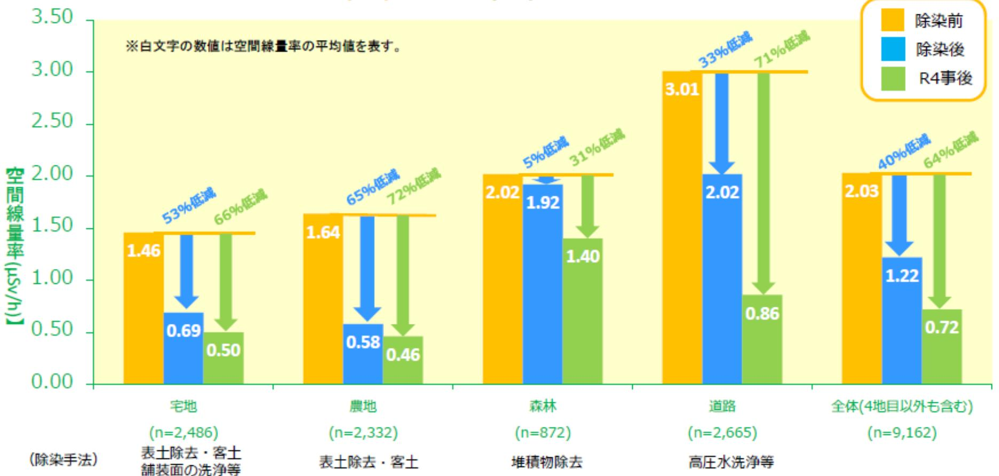
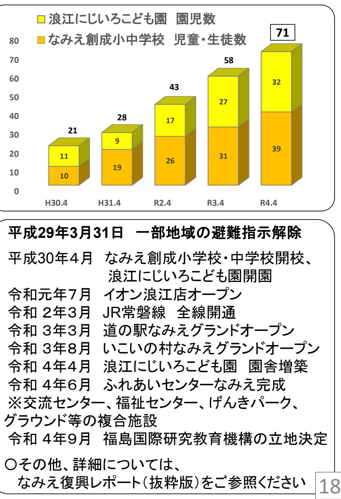
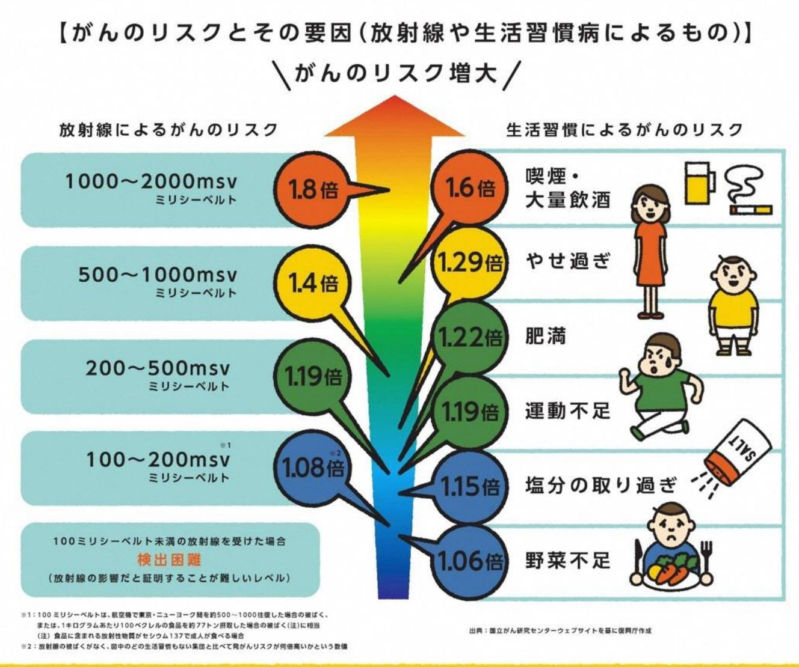

# **浪江町の復興・再生に向けた取組について (特定復興再生拠点区域の避難指示解除に向けて)**

## **令和5年1月、2月浪江町内閣府原子力災害現地対策本部内閣府原子力被災者生活支援チーム**

**<特定復興再生拠点区域の避難指示解除に向けて>**

### 住民説明会 〔令和4年7月15日、17日〕 ふるさとへの帰還に向けた準備のための宿泊(準備宿泊)について

準備宿泊の開始、立入規制の緩和 〔令和4年9月1日~〕

議会説明 〔令和4年12月7日〕 特定復興再生拠点区域の避難指示解除に向けて

住民説明会 〔令和5年1月、2月〕 特定復興再生拠点区域の避難指示解除に向けて

住民説明会でいただいた課題等への対策、関係機関との連携体制の構築議会説明、国・県との協議

特定復興再生拠点区域の避難指示解除(令和5年3月を目標) ※準備宿泊は避難指示解除まで継続して実施いただけます

### **<特定復興再生拠点区域の範囲>**

### **1.避難指示解除に関する考え方について**

- ◯ 平成29年に浪江町の**特定復興再生拠点区域復興再生計画**が認定され、特定復興再生拠点区域(以下「拠点区域」)内の**除染は概ね完了(令和4年12月末時点進捗率 96.7%)、生活に必要なインフラも概ね復旧**しております。
- ◯ 拠点区域の避難指示解除に向けた取組として、**帰還準備のための宿泊(準備宿泊)を令和4年9月1日から開始**しております。
- ◯ あわせて、拠点区域内で許可証が無くても立ち入ることが可能となる、**立入規制緩和も令和4年9月1日から実施**しております。
- ◯ 町では、**令和5年3月までに拠点区域の避難指示を解除したい**と考えております。 解除済み区域、拠点区域以外の帰還困難区域も含め、**町全体の復興を進めるため、引き続き取り組んでまいります**。

- 町では、平成28年度から放射線被ばくに関して、専門的な知見を有した委員で構成する **「浪江町除染検証委員会」を設置し、第三者の中立的な立場での検証を行ってまいりました**。
- 令和4年11月21日、**「区域における主な生活圏となる地域の空間線量率の低減が図られており、放射性物質による汚染環境は着実に回復していると判断できる」**
- 一方で、**「個人の受ける追加被ばく線量が年間1mSv以下を実現するために、今後も継続した取組みが必要」**との報告を受けました。

### ○ また、検証委員会で**検討した実施すべき対策についても取りまとめており、これに基づき今後、以下のような取り組みを進めてまいります**。

- 放射線モニタリングポストが設置されていない町内35地点の空間線量率測定の継続実施。
- 「個人被ばく線量事前推計システム」の役場本庁舎及び津島支所への設置。
- 空間線量率測定器及び個人線量計(D-シャトル)貸出の継続実施。
- 食品、飲用水の放射性物質濃度の検査体制を継続し、津島支所での受付体制も整備。
- 取水場の定期的なモニタリングや、大気中の浮遊じんモニタリングの継続実施。
- 自宅等のホットスポット発覚時の、フォローアップ除染相談の継続実施。
- 森林等における除染範囲外箇所への長時間立ち入りの際の注意喚起を実施。
- 未除染地の同意取得に向けての関係者間での連携強化。

令和4年11月21日 **2.放射線量の状況について** 浪江町除染検証委員会における検証結果報告より抜粋

**室原・末森拠点** 【 100m**メッシュマップ** 】

#### **基幹道路等の拠点** 【**走行モニメッシュマップ**】

### **3.除染の状況について** ⃝ **令和4年12月末までに約96.7%で除染完了**。

- ⃝ 引き続きモニタリング結果等を踏まえてフォローアップ除染を実施します。
- ⃝ **解体申請の受付は避難指示解除後1年で締め切りとなります。** ※解体申請の詳細については、同封資料をご覧ください。 ※締切日については、今後広報紙等により、ご連絡いたします。
- ⃝ **特定復興再生拠点区域除染工事進捗状況(令和4年12月末時点)**

| 地目    | 除染進捗率 |
|-------|-------|
| 宅地    | 95.4% |
| 農地    | 98.7% |
| 道路    | 98.2% |
| 森林    | 95.3% |
| 全体(注) | 96.7% |

(注)表の地目の他に水路・関連道路等も含んだ進捗率 ※除染実施予定面積 505.5ha ※解体申請数339件解体完了310件

#### **放射線不安に対する対応**

- ➢ 個人被ばく線量を測定できるD-シャトル等の線量計の貸与を行っています。
- ➢ 専門家と連携し、健康不安に関するご相談を受け付けております。
- ➢ ご希望に応じ、住宅内の放射線量等の測定を行います。 町で貸与している放射線測定器等で、ホットスポットが見つかりましたら、ご自分で作業せずに、福島地方環境事務所浜通り北支所浪江分室まで、ご相談ください。
- ➢ ホールボディカウンター**(注)**による内部被ばく検査を浪江町役場駐車場及び全国の指定の医療機関等において無料で受検できます。

(注)体内に存在する放射性物質を計測する装置。

- ➢ 甲状腺検査を全国の指定の医療機関において無料で受検できます。 ※震災時18歳以下の方は、福島県が無料で実施しています。 ※震災時40歳以下の方につきましては、町が無料で検査をしていますのでご相談ください。
- ➢ 自家消費食品検査を浪江町役場本庁、津島支所(つしま活性化センター)で受け付けています。

| インフラ名 | 概 要                                                                                                                                                                                                                         |
|-------|--------------------------------------------------------------------------------------------------------------------------------------------------------------------------------------------------------------------------------|
| 上水道   | 利用を再開する時は、浪江町役場 住宅水道課 料金会計係にお申込みください。 ➢ 宅地内の漏水調査等の設備に関する事は、指定給水装置工事事業者へご依頼ください。 ➢                                                                                                                               |
| 井戸水   | 新たに井戸が必要な方には、町が国庫補助事業等を活用して、整備いたします。 ➢ ※設置後の使用に関わる経費については、個人負担となります。 震災前からの井戸を使用される場合には、水質検査等について、相双保健福祉事務所 環境 ➢ 衛生チームにご相談ください。                                                                              |
| 合併浄化槽 | 環境省による浄化槽の清掃については、各ご家庭1回に限り無料で実施しています。 ➢ ご希望の方は浪江町役場 住民課 除染環境係までご連絡ください。 合併浄化槽をご利用の場合、ご自宅から合併浄化槽までの配管及び槽の状態をあらかじめ、 ➢ 事業者に点検等、ご依頼ください。 また、設置については町の補助金もありますので、浪江町役場 住宅水道課 料金会計係に ➢ ご連絡ください。 |
| LPガス  | 使用再開を希望される方は、取引されていた販売店等にお問合せください。 ➢ 取引されていた販売店等と連絡が取れない場合は、福島県LPガス協会相双支部へお問合せ ➢ ください。 長期にわたり給湯器が未使用の場合には、給湯器メーカー、もしくはガス事業者に連絡いただき、 ➢ 事前に点検を受けていただくことをお勧めします。                                             |
| 電気    | 電気の使用再開を希望する方は、個別に東北電力コールセンターにお申し込みください。 ➢ 申込があった日から、引込線等の工事に2週間程度かかります。また、使用開始の際にご利用 ➢ 者様と東北電力での立ち会いが必要となります。 長期間、家を離れる際には、冷蔵庫等を整理し、必ずブレーカーを落としてください。 ➢ 11                                               |

**生活関連サービスの状況**

- ➢ ガソリンスタンド等は、下記をご利用いただけます。
	- 叶屋各ガソリンスタンド(町内3カ所)、渡辺商店
	- ENEOS松枝商店(葛尾村 10.9km)、コスモ石油丸幸商店(葛尾村 10.7km)、ENEOSいさみや田沢(二本松市 12.2km)、ENEOS川俣バイパス(川俣町 24.3km)
	- 浪江水素ステーション(川添字加倉 24.4km) ※カッコ内の距離は、津島支所からの距離。
- ➢ 買い物は、イオン浪江店、道の駅なみえ、コンビニ(町内4カ所)をご利用いただけます。

浪江地区のデマンドタクシーの運行エリアを室原拠点、末森拠点及び津島拠点まで拡大しております。

イオン浪江店、道の駅なみえ等への往復に活用いただけます。 また、イオンによる定期的な移動販売、コープふくしまによる生鮮品等の生協宅配は、解除後からご利用可能です。

- ➢ 医療機関は、浪江診療所や近隣自治体の医療機関をご利用いただけます。
また、上記と同じくデマンドタクシーは、浪江診療所への往復にも活用いただけます。

#### **生活関連サービスの状況**

- ➢ 飲食店は、町内20店舗以上でご利用いただけます。
- ➢ 生活ごみ回収については、最寄りのごみステーションにて回収いたします。 ※拠点区域内のごみ回収は2週間に1回行っておりますが、大量にごみが出されている場合は都度回収しますので住民課除染環境係にご連絡ください。
- ➢ 郵便は配達業務を再開しています。

集配サービスの内容につきましては、原町郵便局にお問い合わせください。

- ➢ 宅配便は、室原拠点及び末森拠点で準備宿泊開始日から、佐川急便において配達・集荷を再開しています。引き続き、配達・集荷を再開できるよう、事業者と調整しています。
- ➢ 金融機関は、東邦銀行、あぶくま信用金庫、相双五城信用組合、JAバンク(JA福島さくら浪江支店)、ゆうちょ銀行(浪江郵便局)が利用可能です。
- ➢ 電話、インターネットについて、ご利用される場合は、NTT東日本、インターネットプロバイダー等にお申し込みください。また、インターネット接続工事に関する補助金もありますので、企画財政課情報統計係にご連絡ください。
- ➢ テレビの難視地域対策として、令和5年3月までに地デジ放送の送信設備を改修しますが、個人宅への引き込み工事が必要ですので、企画財政課情報統計係にご連絡ください。

**住宅環境の整備**

- ➢ 住宅清掃費補助金: ご自宅の清掃等を事業者へ依頼した費用について、最大15万円の補助がございます。
- ➢ 個人住宅再建支援補助金:ご自宅の修繕費、解体後の再建費について、最大25万円の補助がございます。

ご利用される場合は、浪江町役場住宅水道課住宅係にご相談ください。

- ➢ ふるさと住宅移転補助金:避難指示解除後にご自宅に帰還するための引っ越しに係る費用について、
	- ・県外からの移転複数人世帯15万円、単身世帯10万円
	- ・県内からの移転複数人世帯10万円、単身世帯 8万円の補助がございます。 ご利用される場合は、浪江町役場介護福祉課避難生活支援係にご相談ください。

#### **安心安全の確保**

- ➢ 町では、防犯見守り隊、消防団、警備会社が連携し、24時間パトロール等を実施しています。 ※防犯見守り隊(平日)や、消防団(日曜)によるパトロールは10時から15時まで実施。 それら以外の時間帯に警備会社が実施。
- ➢ 警察では、拠点区域内のパトロールを強化しております。 室原駐在所、津島駐在所については、再開に向けて準備を進めております。 浪江消防署では、町内のパトロールを強化しております。

○その他、詳細につきましては、帰還のためのガイドブックをご参照ください。

### **<特定復興再生拠点区域の避難指示解除後の各種支援措置について>**

- ◯ **国民健康保険・後期高齢者医療・介護保険における一部負担金、利用者負担及び保険料 (税)の特例減免措置**については、**避難指示解除から10年程度は措置が継続する見込み** です(上位所得層を除く ) 。
- ◯ **固定資産税**については、**町内の先行して避難指示が解除となった区域と同様の減税措置を実施したい**と考えております。
- ◯ 避難元の**電気料金**については、**避難指示解除日の半年後を限度として、避難期間中は免除**となります。
- ◯ **NHKの受信料**については、**避難指示解除月の翌月末までは免除**となります。
- ◯ **高速道路の無料措置**については、令和5年3月末まで継続されます。令和5年4月以降の取り扱いについて、継続されるように要望しております。
- ◯ 拠点区域内含む帰還困難区域に設置されている仮設トイレは当面の間、継続する予定です。
- ◯ 拠点区域内へのバス立ち入りは、避難指示解除後1年間は継続予定です。
- ◯ ごみについては、避難指示解除後1年間は、環境省による回収を実施します。 その後は、双葉地方広域市町村圏組合の指定ごみ袋を購入していただき、指定の分別方法にてごみを出していただくこととなりますので、ご注意ください。

## **5.拠点毎の進捗状況**

### **(1)室原拠点**

**ア防災拠点大字室原字八龍内地内(浪江IC進入路付近)** 町全体の住民交流施設、災害時の避難所(500人程度収容)となる施設を整備中(令和6年2月から供用開始予定) ※非常食・飲料水等の備蓄倉庫や250台分の駐車場も併設

#### **イ営農再開**

令和元年12月14日に農事復興組合が設立し、農地保全(令和3年度実績42.6ha、令和2年度実績13.7ha)と共に、営農再開に向け試験栽培(2年目/2年間)を実施

○令和4年度の実証栽培の結果ほ場場所:堀知木、信田、法光内 【各2a】

品目 :ほうれん草、小松菜、キャベツ、ブロッコリー、カブ、トウガラシ 【全品目、基準値以下】

### **(2)末森拠点**

#### **ア営農再開**

令和2年3月29日に農事復興組合が設立し、農地保全(令和3年度実績48.9ha、令和2年度実績29.0ha)と共に、営農再開に向け試験栽培(2年目/2年間)を実施

○令和4年度の実証栽培の結果

ほ場場所:堤ノ上、東前畑、仁田久保 【各2a】

品目 :ほうれん草、小松菜、キャベツ、ブロッコリー、カブ、トウガラシ 【全品目、基準値以下】

防災拠点(イメージ)

### **(3)津島拠点**

#### **ア津島支所(つしま活性化センター)**

令和4年6月より、住民票等の発行業務を開始年末年始を除き、土日祝日も8:30から17:00まではトイレ、会議室が利用可能

#### **イ津島住宅団地(仮称)**

避難指示解除後に入居できるよう、つしま活性化センター駐車場の西側に10戸建設工事中

#### **ウ営農再開**

令和2年1月26日に農事復興組合が設立し、農地保全(令和3年度実績13.4ha、令和2年度実績3.7ha) と共に営農再開に向け試験栽培等(2年目/2年間)を実施

○令和4年度の実証栽培の結果ほ場場所:南津島字大宮、下津島字宮平、津島字仲沖 【各2a】 品目 :ほうれん草、小松菜、キャベツ、ブロッコリー、カブ、トウガラシ 【全品目、基準値以下】

**※実証栽培について、令和4年度は全9ヵ所のほ場・全6品目で基準値以下であることを確認し、令和4年度末には出荷制限が解除される見込み。**

### **6.避難指示解除済み区域内の整備状況**

### **7.戸別訪問で頂いたご意見・ご要望に関する取組について**

- 町・国職員で準備宿泊を実施されている方に戸別訪問を行い、下記のようなご意見・ご要望をいただきました。
○ いただいたご意見等については関係機関と連携し、しっかりと対応してまいります。

#### **<主なご意見・ご要望について>**

#### **・人気が無いので、夜の防犯が不安である。**

→パトロールエリアの重点化について、双葉警察署浪江分庁舎に依頼すると共に、防犯見守り隊及び警備会社へ連絡しております。

#### **・ごみステーションの回収が遅い時がある。**

→拠点区域内のごみ回収は、環境省が2週間に1回実施しております。大量にごみを出した場合等は、町にご連絡ください。

#### **・仮置き場周辺の道路は、大型トラックの往来で損傷している。**

→修繕に向けて国と協議中。

#### **・自宅でもホットスポットが見つかったが、森林に囲まれているので、森林の未除染は不安である。**

→ホットスポットが見つかった場合はフォローアップ除染を実施いたします。山林から土砂が落ちてくるなど、不安な場所があったら、町にご相談ください。

## **<準備宿泊実施中に町・国職員による戸別訪問で頂いたご意見の例>**

### **生活環境について**

- ✓ 買い物は昔から町場まで行っていたので、そんなに変わらない。
- ✓ 準備宿泊する時に必要な物は、買ってきている。

### **医療・介護について**

- ✓ 医療・介護施設は足りていないので、避難先の医療機関に通っている。
- ✓ 避難先の病院に通っているが、現在の町の人口を考えると診療所でもなんとかなっている。

### **営農について**

- ✓ 復興組合として保全管理や管理耕作を行っているが、除染での剥ぎ取り厚が多いと、土壌回復対策が難しい。
## **<準備宿泊実施中に町・国職員による戸別訪問で頂いたご意見の例>**

### **野生動物について**

- ✓ サルなどは見かけないが、場所によって、イノシシをよく見かける。
- ✓ 自宅は柵で囲っており、柿の木など果樹木は伐採してもらった。

### **放射線量について**

- ✓ 線量は低いので、心配していない。
- ✓ ポンプ等を修理して、震災前からの井戸を使っているが、線量については、心配していない。

### **避難指示解除について**

- ✓ ゆくゆくは帰還したい。
- ✓ 二地域居住を続け、退職したら帰還したい。
- ✓ 避難指示解除に向けた準備は、概ね整っている。

### **8.特定復興再生拠点区域における避難指示解除に関する国の方針について**

- ◯ 浪江町においては、これまでの説明のとおり避難指示の解除に向けた様々な復興・再生の取組を進めてきました。令和4年9月1日からは「準備宿泊」を開始し、現在9世帯18人(令和5 年1月25日時点)の町民等の皆さまにご登録いただいています。
- ◯ 国としては、これまでの復興に向けた取組を総合的に判断した結果、浪江町の**特定復興再生拠点区域について、避難指示解除の要件は満たしており、避難指示を解除し、帰還を希望される町民の皆さまがふるさとでの生活を再開いただけるようにするとともに、浪江町の復興を新たな段階に進めることが必要だと考えています**。
- ◯ 当然のことながら、帰還するかしないかは、お一人お一人のご判断によるものであり、国が避難指示を解除したからといって**帰還を強制されるものではありません**。
- ◯ また、避難指示が解除されても、国による様々な支援策が終了するわけではありません。 国としては、**避難指示の解除後も**、引き続き政府一丸となって、**浪江町の復興に向けた施策をしっかりと展開**してまいります。

#### **(参考1) 室原拠点、末森拠点、津島拠点における放射線量の推移**

平成23年11月5日時点の線量分布令和4年9月30日時点の線量分布

11年後

24

※第4次航空機モニタリング(平成23年11月5日)及び第17次航空機モニタリング(令和4年9月30日)の結果を基に内閣府原子力被災者生活支援チームにて取りまとめ。

#### **(参考2) 避難指示解除の要件**

- ① 空間線量率で推定された**年間積算線量が20ミリシーベルト以下になることが確実であること**
- ② 電気、ガス、上下水道、主要交通網、通信など**日常生活に必須なインフラや**医療・介護・郵便などの**生活関連サービスが概ね復旧すること**、子どもの生活環境を中心とする**除染作業が十分に進捗**すること

- ③ 県、市町村、住民の方々との十分な**協議**
#### **(参考3) 「帰還に向けた安全・安心対策に関する基本的考え方(線量水準に応じた防護措置の具体化のために)」(平成25年11月20日原子力規制委員会決定) 抜粋**

放射線による被ばくに関する国際的な知見及び線量水準に関する考えは、以下のとおりである。

- 放射線による被ばくがおよそ100 ミリシーベルトを超える場合には、がん罹患率や死亡率の上昇が線量の増加に伴って観察されている。100 ミリシーベルト以下の被ばく線量域では、がん等の影響は、他の要因による発がんの影響等によって隠れてしまうほど小さく、疫学的に健康リスクの明らかな増加を証明することは難しいと国際的に認識されている。なお、放射線防護対策を実施するに当たっては、子供や妊婦に特に留意すべきとしている。
- 公衆の被ばく線量限度(年間1 ミリシーベルト)は、国際放射線防護委員会(ICRP)が、低線量率生涯被ばくによる年齢別年間がん死亡率の推定、及び自然から受ける放射線による年間の被ばく線量の差等を基に定めたものであり、放射線による被ばくにおける安全と危険の境界を表したものではないとしている。 放射線防護の考え方は、いかなる線量でもリスクが存在するという予防的な仮定にたっているとしている。ただし、線量限度は線源が制御された計画被ばく状況のみに適用される。
- 避難指示区域への住民の帰還にあたっては、(中略) 以下について、国が責任を持って取組むことが必要である。
	- ・長期目標として、帰還後に個人が受ける追加被ばく線量が年間1ミリシーベルト以下になるよう目指すこと (以下略)

### **(参考4) 日常生活での放射線被ばく、これまでに得られた知見について**

○日本人が日常生活で受ける年間の被ばく線量は、自然放射線で平均2.1ミリシーベルト、医療行為で平均3. 9ミリシーベルト(単純に合計すると平均約6ミリシーベルト)

(UNSCEAR2008年報告書)

- ○世界では、自然放射線が年間5ミリシーベルトを超える地域に1000万人以上が居住している。(UNSCEAR2000年報告書) ※(内訳)5.0~7.0mSv:906万人 7.0~10.0mSv:293万人 10mSv以上:176万人
- ○福島県県民健康調査検討委員会による「県民健康調査における中間取りまとめ」(2016年3月)では、「本調査で得られた線量推計結果(事故後4か月間の外部被ばく実効線量:99.8%が5mSv未満等)は、これまで得られている科学的知見に照らして、統計的有意差をもって確認できるほどの健康影響が認められるレベルではないと評価する」としている。
- ○原子放射線の影響に関する国連科学委員会(UNSCEAR)は、2020年報告書において、 「当委員会は、放射線被ばくが直接の原因となるような将来的な健康影響は見られそうにないと引き続きみなしている」としている。

#### **(参考5) 放射線によるがんのリスク**

28

「知るという復興支援があります。放射線のホント」(復興庁平成30年3月30日)より抜粋

| 項目                  | 担当課・事業者                     | 連絡先                 |
|---------------------|-----------------------------|---------------------|
| 高線量地点(ホットスポット)等について | 福島地方環境事務所 浜通り北支所 浪江分室 | 0240-23-5890 (代) |
| 上水道                 | 浪江町役場 住宅水道課 料金会計係     | 0240-34-0234        |
| 井戸水 (整備)         | 浪江町役場 住宅水道課 上下水道係     | 0240-34-0231        |
| 井戸水 (水質検査)       | 相双保健福祉事務所 環境衛生チーム        | 0244-26-1363        |
| 合併浄化槽 (汚泥の引き抜き)  | 浪江町役場 住民課 除染環境係       | 0240-34-0228        |
| 合併浄化槽 (設置)       | 浪江町役場 住宅水道課 料金会計係     | 0240-34-0234        |
| LPガス                | 福島県LPガス協会相双支部               | 0244-22-1141        |
| 電気                  | 東北電力コールセンター                 | 0120-066-774        |
| 郵便                  | 原町郵便局                       | 0570-943-438        |
| 電話・インターネット          | NTT東日本相談・申込ダイヤル             | 0120-116-116        |
| テレビ                 | 浪江町役場 企画財政課 情報統計係     | 0240-34-0241        |
| 浪江町住宅清掃費補助金         | 浪江町役場 住宅水道課 住宅係       | 0240-34-0232        |
| 浪江町個人住宅再建支援事業補助金    | 浪江町役場 住宅水道課 住宅係       | 0240-34-0232        |
| 浪江町ふるさと住宅移転補助金      | 浪江町役場 介護福祉課 避難生活支援係   | 0240-34-0260        |

| ------------------------------------------------------------------------------------------------------------------------------------------------------------------------------ |                                                                                                                                                                               |
|--------------------------------------------------------------------------------------------------------------------------------------------------------------------------------|-------------------------------------------------------------------------------------------------------------------------------------------------------------------------------|
| ------------------------------------------------------------------------------------------------------------------------------------------------------------------------------ | _ _ _ _ _ _ _ _ _ _ _ _ _ _ _ _ _ _ _ _ _ _ _ _ _ _ _ _ _ _ _ _ _ _ _ _ _ _ _ _ _ _ _ _ _ _ _ _ _ _ _ _ _ _ _ _ _ _ _ _ _ _ _ _ _ _ _ _ _ _ _ _ _ _ _ _ _ _ _ _ _ _ _ _ _ _ _ |
| ------------------------------------------------------------------------------------------------------------------------------------------------------------------------------ | _____                                                                                                                                                                         |
| ------------------------------------------------------------------------------------------------------------------------------------------------------------------------------ |                                                                                                                                                                               |
| ------------------------------------------------------------------------------------------------------------------------------------------------------------------------------ |                                                                                                                                                                               |
| ------------------------------------------------------------------------------------------------------------------------------------------------------------------------------ |                                                                                                                                                                               |
|                                                                                                                                                                                | _ _ -                                                                                                                                                                         |
| ------------------------------------------------------------------------------------------------------------------------------------------------------------------------------ |                                                                                                                                                                               |
| ------------------------------------------------------------------------------------------------------------------------------------------------------------------------------ |                                                                                                                                                                               |
| ------------------------------------------------------------------------------------------------------------------------------------------------------------------------------ |                                                                                                                                                                               |
| ------------------------------------------------------------------------------------------------------------------------------------------------------------------------------ |                                                                                                                                                                               |
| ------------------------------------------------------------------------------------------------------------------------------------------------------------------------------ |                                                                                                                                                                               |
| ------------------------------------------------------------------------------------------------------------------------------------------------------------------------------ | ______                                                                                                                                                                        |
| ------------------------------------------------------------------------------------------------------------------------------------------------------------------------------ |                                                                                                                                                                               |
|                                                                                                                                                                                |                                                                                                                                                                               |
|                                                                                                                                                                                |                                                                                                                                                                               |

| ------------------------------------------------------------------------------------------------------------------------------------------------------------------------------ |                                                                                                                                                                               |
|--------------------------------------------------------------------------------------------------------------------------------------------------------------------------------|-------------------------------------------------------------------------------------------------------------------------------------------------------------------------------|
| ------------------------------------------------------------------------------------------------------------------------------------------------------------------------------ | _ _ _ _ _ _ _ _ _ _ _ _ _ _ _ _ _ _ _ _ _ _ _ _ _ _ _ _ _ _ _ _ _ _ _ _ _ _ _ _ _ _ _ _ _ _ _ _ _ _ _ _ _ _ _ _ _ _ _ _ _ _ _ _ _ _ _ _ _ _ _ _ _ _ _ _ _ _ _ _ _ _ _ _ _ _ _ |
| ------------------------------------------------------------------------------------------------------------------------------------------------------------------------------ | _____                                                                                                                                                                         |
| ------------------------------------------------------------------------------------------------------------------------------------------------------------------------------ |                                                                                                                                                                               |
| ------------------------------------------------------------------------------------------------------------------------------------------------------------------------------ |                                                                                                                                                                               |
| ------------------------------------------------------------------------------------------------------------------------------------------------------------------------------ |                                                                                                                                                                               |
|                                                                                                                                                                                | _ _ -                                                                                                                                                                         |
| ------------------------------------------------------------------------------------------------------------------------------------------------------------------------------ |                                                                                                                                                                               |
| ------------------------------------------------------------------------------------------------------------------------------------------------------------------------------ |                                                                                                                                                                               |
| ------------------------------------------------------------------------------------------------------------------------------------------------------------------------------ |                                                                                                                                                                               |
| ------------------------------------------------------------------------------------------------------------------------------------------------------------------------------ |                                                                                                                                                                               |
| ------------------------------------------------------------------------------------------------------------------------------------------------------------------------------ |                                                                                                                                                                               |
| ------------------------------------------------------------------------------------------------------------------------------------------------------------------------------ | ______                                                                                                                                                                        |
| ------------------------------------------------------------------------------------------------------------------------------------------------------------------------------ |                                                                                                                                                                               |
|                                                                                                                                                                                |                                                                                                                                                                               |
|                                                                                                                                                                                |                                                                                                                                                                               |