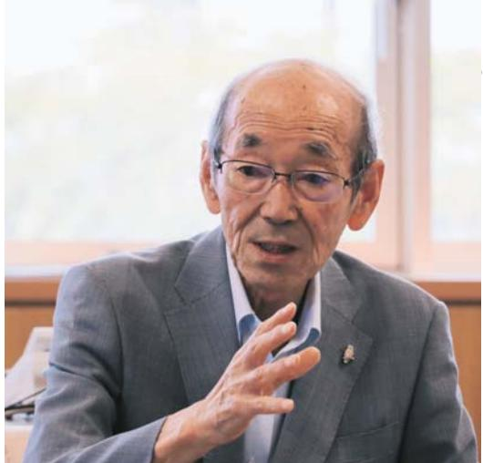
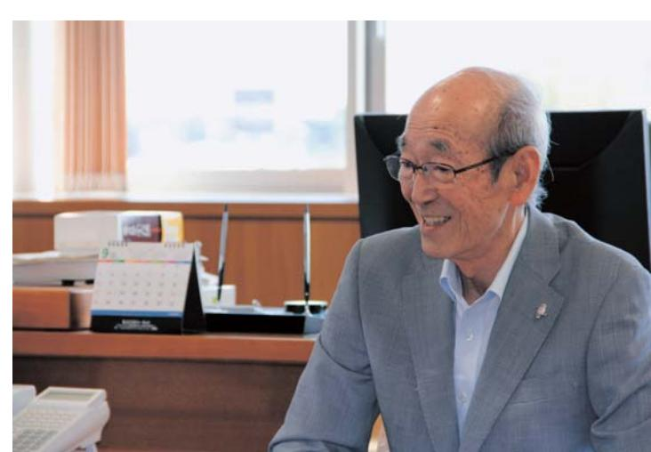

はためで、

2

返品町長馬場

有

## 題難指示解除を

。すべよられているのを見かけるようになりました。こうていとなっていましたというという言いないかも何かかかか解除になり、半年が過ぎようとしています時期や夏休みの時期等に、これまで立てたりずりお子さんたちが、祖父母の方に連れられて即月2日に避難指示解除準備区域。居住制限区域

かの理由がありました。 いした。それでもこの時期に避難指示解除に応じたないとに、この度の建築指示解除では、全町では開を出める帰還困難区域を除いた一部の地域だけ

。サイズ

母席後、町に展ってきた方からは、やっぱり浪江の花記したい、こから想いがありました。 をいただいています。 その一方で、震災前とは町の様子が町民の皆様の気持ちを大切にしたいと考えたことでませんが、すぐにでも戻りた月が経過した中で、皆様の心が折れてしまうことのなかしたからになっているのかなかなかすないですから、どんなかなかなかな理由はありますが、もう一つは、人数としては少す除染等による放射線量の低減。そして、復旧作業を経を生活環境は整備できたということ。ほかにもい方、猿江での生活を 6

を含め、生活道の人いう不安なお店も耳に届けています。。医療面や買い物 『藤の人人もいない、人と会話をすることが少なくする上ではまだまだ足りない部分があるの

のサイニいらいしゃるのが現実ですすぐには動けない方も多いかと思います。な子さんします、という考えの下に復興に取り組んで、インスロジックなのですけど、ここではなかなかなた思い出の地であり、先祖のお墓がある方も校に通いていたり、避難先にかかかりつけの医はサイトですけていただけでした「こなん町に展りたりと考えているいとやる方でも部避難指示が解除になったからといいて、「すぐにす。 避難先で生活を続ける中で、だまた浪江んと整備します。 いつ帰ってきていただいて仕事の関係もあるってしょう。浪江町は町民の 。まだまだ多くの町民の皆様が、全国に分散してきい方が帰ってきていただけるように、そのた・浪江の復興の姿を見に来る、といったようにないてきてくださればかいと考えていまるいろな状況を踏まえて、原れると判断さでも浪江に戻って来ることができる環境をた。それがいないと芽を出してくる時新しい復興の姿を町民の皆様に的に進めるため、たくさんの「希

なくてないですていただきます。 4年目からの年目までの紙面を再録して年目に入った『遠江のア難先に落ち着けない不安な想いがかひしかしと伝どんなんていたいとなっていませんでいていつけいいという通信「おみ年目に入りました。 いのの年を経て、この「演江口のアイマは信信」といでないてきました。新しい掲載で第二つのり、皆様一人一人の想いが紙面を通していかつたと思いていますしていただいた町民の皆様、また、取材しなから、猿江のことを懐かしまれている。 いた全国の取材協力者の皆様に、まず、お礼を申ていると感じらかれる記事もありましたたそのほと家族が今にこで生活しているのかといア月の「広報なみえ」 再開に合わせてで少しずつ定着していった状況が欲持てて読んでいただけたととと思います出てきて、浪江での日常生活な、浪江でやい震災から4年目を迎える頃から町駅

きているのは、大変貴重ないととだと考え切なものになっていると感じています

は、バイク「虎江のアイバリの通信『「バイク)のバイトな

徒たちも内になっかりしていると思います。その気持ちを現がけたら、ここんなん有り難いことはないと思いますのことのスタートアイバに立てたたいとさんの「ピンチ前には全生人状況が変わってくしまった町の中で、不便をはあるがだ部隊であったったりましたですけになり出かけないるようでした。今回町を訪れ、町の現状を目の当たりだし先日、浪江中学校の生徒が「ふるるさとなみえ松」の授業で 。中出でイン価につけた。 というな想いですよ。さらについていていたいたとことではないでと思います。 頑張れと声を描けられたとしても、感を与えるものだなっていくのか、個々人の心情が依ています。 例えな、浪江町八婦られた方のお話にしてイいななかなかないと、かついていくていたいですか? ・この子供たちが大人になり、即の復興に構わっていのな復興に向けて

災後がめて浪江町に入られました。 生徒の皆さんは、震災当時小るないですがありました。 今、もふやんせんにに使していくいませ私も心が痛みます。 生徒の皆さんにといては、それでも複こいって、していないない気になる言では言いないではないないと年をたので、震災前のアイレにはあまり覚えていないようでしいお祭りやすいつータとなるとていくとは記憶に残る牛震

りただけて、新しい生活性問を作っていって欲しいと思っていま

。町を元の姿に戻していく決意を持ち続けます

だけるか健康にはいれかれもい出席がだだき、お過ごしくてたさ

町民の皆様、日々様々な想いを抱きながら、生活されている。 てしまっかきとれません。ですが、もう少し盛ん張もう頑張れれ

しいて、皆様と共に歩んでいきたいと思っていますなってきたところです。 太陽が完全に輝く日が必ず来るのを信災直後、「明けない夜はない、必ず太陽は出てくる。 だけ太陽が昇いてきたのが、おすかに見えてきたような状ませていていくしていく感覚になる言いていました。 アマンタイプ

平成珍年の目記日